<h1 align="center">Informe del Trabajo Final</h1>
<h3 align="center">Universidad Peruana de Ciencias Aplicadas</h3>
 

  

 
<h5 align="center">Ingeniería de Software</h5>
<h5 align="center">Aplicaciones Web - 1ASI0730</h5>
<h5 align="center">Docente: Angel Augusto Velasquez Nuñez</h5>
<h5 align="center">Startup: Titan</h5>
<h5 align="center">Producto: AniTec</h5>

## Team members:

|               Nombre                |   Código   |
|:-----------------------------------:|:----------:|
|    Ayala Fernandez, Jorge Brayan    | U20241C030 |
|    Huaman Gallardo, Bruno Aldair    | U202117762 |
|    Melgarejo Quiroz, Josep Eliu     | U202315165 |
| Raymundo Villarroel, Nadhim Abigail | U202318001 |
|   Sanchez Silva, Luciana Celeste    | U202215979 |

<h5 align="center"> Ciclo 2026-1 </h5>

## Registro de versiones del informe

| Versión |   Fecha    |                    Autor                    | Descripción de modificación                           |
|:-------:|:----------:|:-------------------------------------------:|-------------------------------------------------------|
|   1.0   | 17/04/2026 | Ayala, Huaman, Melgarejo, Raymundo, Sanchez | Creación del documento de trabajo en formato markdown |
|   1.1   | 21/04/2026 | Ayala, Huaman, Melgarejo, Raymundo, Sanchez | Desarrollo de los capítulos I II III IV |
|   1.2   | 23/04/2026 | Ayala, Huaman, Melgarejo, Raymundo Sanchez |   Corrección de los capítulos I II III IV y desarrollo del capítulo V  |

## Project Report Collaboration Insights

- URL del repositorio para el reporte del proyecto: https://github.com/upc-1asi0730-2610-12206-titan-team-4/anitec-report
- URL del repositorio para la Landing Page: https://github.com/upc-1asi0730-2610-12206-titan-team-4/anitec-landing-page   
- URL del repositorio para el desarrollo del frontend web applications (VueJS):  
- URL del repositorio para el desarrollo del backend web applications (.NET Web API): 

**TB1**

Para el desarrollo del informe perteneciente a la entrega TB1, se dividió la implementación de secciones de la siguiente forma para cada integrante del equipo:

| Integrante       | Tareas Asignadas                                                                                                                                                                            |
|------------------|---------------------------------------------------------------------------------------------------------------------------------------------------------------------------------------------|
| Abigail Raymundo | Desarrollo del Capítulo I, una parte del Capítulo II, así como la parte final del Capítulo V del documento en formato markdown.                                                             |
| Bruno Huaman     | Desarrollo del Capítulo III, desarrollo parcial de capítulo II, así como colaboración en el capítulo V del documento en formato markdown.                                                   |
| Jorge Ayala      | Desarrollo parcial del Capítulo IV, así como colaboración en el capítulo V del documento en formato markdown                                                                                |
| Josep Melgarejo  | Desarrollo parcial del Capítulo IV, así como colaboración en el capítulo V del documento en formato markdown                                                                                |
| Luciana Sanchez  | Desarrollo parcial del Capítulo IV: Diseño del landing page y web application, y actualización del keynote. Además,  colaboró en el desarrollo capítulo V del documento en formato markdown |

El proceso de colaboración en el informe se realizó mediante commits constantes al repositorio de la organización Titan.

**Github Collaboration Insights**

Github también presenta un timeline de las ramas principales y los procesos de merge a los que se han sometido. Todas las ramas se crearon tomando en cuenta el diseño de GitFlow para una buena organización cuando se usa un software de control de versiones.

Los integrantes son:

* Josep Melgarejo (Melga1502)
* Jorge Ayala (jorgeayaladev)
* Huamán Bruno (BrunoHG10)
* Abigail Raymundo (AbigailRV)
* Luciana Sánchez (Luccsss)

Se explican las ramas más prominentes:

- **main**: Es representada por el color blanco. Se trata de la rama principal del proyecto y se actualiza para cada entregable.
- **develop**: Es representada por el color morado. Se trata de la rama principal para el proceso del desarrollo del proyecto.
- **feat/sprint1**: Es representada por el color morado. Esta rama incluye los artefactos relacionados al sprint 1 en el informe.

Los siguientes gráficos representan analíticos de commits en el repositorio del informe. En los gráficos se incluye la cantidad de lineas de texto añadidas por cada integrante del equipo. 

**TB1**

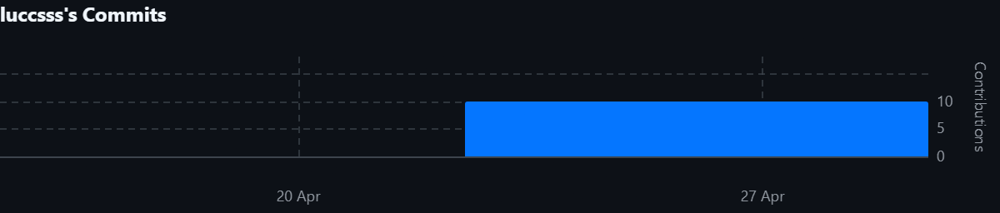

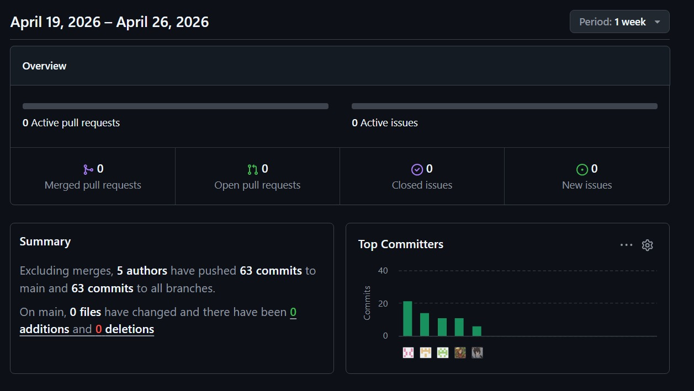

## Student Outcomes
|Criterio especifico|Acciones realizadas|Conclusiones|
|-|:-|-|
|Trabaja en equipo para proporcionar liderazgo en forma conjunta| **TB1:**   **Josep Melgarejo**: Participe en el desarrollo de el event storming, Los diagramas C4, El diagrama de clases y el diagrama de base de datos, coordinando con mis compañeros para decisiones importantes en dichas actividades, logrando un trabajo satisfactorio.    **Jorge Ayala**: Participé de manera activa en la creación de la Landing Page del producto (AniTec) y generé historias de usuario de la Landing conforme a lo avanzado. De igual manera, colaboré en la consecución de la redacción del Sprint 1, el cual se trató del mismo tema. De tal manera colaboramos activamente todos en el proyecto.   **Bruno Huaman**: Lideré la fase estratégica mediante la elaboración del Impact Mapping, conectando los objetivos de negocio con las necesidades de los ganaderos y veterinarios. Además, coordiné la distribución de responsabilidades para asegurar que cada historia de usuario estuviera alineada con los impactos deseados.   **Abigail Raymundo**: Participe en el desarrollo de los capitulos 1 y 2, principalmente la definicion de el problema, los segmentos objetivos, los competidores de nuestra aplicacion y demas cosas, logrando un informe impecable y de acuerdo a nuestra idea de la aplicacion.  **Luciana Sanchez**: Participé en la definición de las épicas, historias de usuario y criterios de aceptación, aportando ideas y coordinando con mis compañeros para tomar decisiones en conjunto y distribuir responsabilidades durante este entregable. |**TB1:**  El equipo ejerció un liderazgo conjunto al coordinar responsabilidades y tomar decisiones de manera colaborativa. Esto permitió organizar eficientemente todo el primer entregable y asegurar que el desarrollo de AniTec respondiera a los objetivos planteados y a las necesidades de nuestros usuarios.|
|Crea un entorno colaborativo e inclusivo, establece metas, planifica tareas y cumple objetivos.| **TB1:**   **Josep Melgarejo**: Propuse y explique al equipo la estructura del event storming y los diferentes diagramas que se me fue encargado, gracias a ello logre aclarar ideas y proponer mejoras en el trabajo logrando un mejor desempeño en el equipo.    **Jorge Ayala**: Expliqué y anuncié a mi grupo de trabajo los avances que realicé a lo largo de los avances y commits que hice respecto a la Landing, terminando con la versión final de esta y planificando nuevos cambios para mejorarla aún más para una siguiente versión de lanzamiento.   **Bruno Huaman**: Fomenté la lluvia de ideas para definir las 47 historias de usuario del backlog, asegurando que se incluyeran funcionalidades críticas como el modo offline y el dashboard de analítica. Planifiqué las metas a corto plazo para cumplir con el cronograma del entregable   **Abigail Raymundo**:Propuse y explique nuestros problemas dentro del desarrollo de los primeros capitulos logrando explicar los diversos problemas que enfrentaba la aplicacion y logrando que mis compañeros entiendan mejor la forma de la estructura del documento y como se va a trabajar en todo el entregable    **Luciana Sanchez**: Propuse y expliqué al equipo las épicas e historias de usuario necesarias para el desarrollo del proyecto, promoviendo la participación de todos los integrantes. |**TB1:**  Gracias a la planificación y al trabajo colaborativo, el equipo logró cumplir los objetivos dentro del plazo establecido. Además, la comunicación constante y la retroalimentación de ganaderos y veterinarios permitieron mejorar la aplicación web, evidenciando un entorno orientado a resultados.|

## Contenido
1. [Capítulo I: Introducción](#capítulo-i-introducción) 
1.1. [Startup Profile.](#11-startup-profile) 
1.1.1. [Descripción del startup.](#111-descripción-del-startup) 
1.1.2.[Perfiles de los integrantes del equipo.](#112-perfiles-de-los-integrantes-del-equipo) 
1.2. [Solution Profile.](#12-solution-profile) 
1.2.1. [Antecedentes y Problemática.](#121-antecedentes-y-problemática) 
1.2.2. [Lean UX Process.](#122-lean-ux-process) 
1.2.2.1. [Lean UX Problem Statements.](#1221-lean-ux-problem-statements) 
1.2.2.2. [Lean UX Assumptions.](#1222-lean-ux-assumptions) 
1.2.2.3. [Lean UX Hypothesis Statements.](#1223-lean-ux-hypothesis-statements) 
1.2.2.4. [Lean UX Canvas.](#1224-lean-ux-canvas) 
1.3. [Segmentos objetivo.](#13-segmentos-objetivo) 
2. [Capítulo II: Requirements Elicitation & Analysis.](#capítulo-ii-requirements-elicitation--analysis) 
2.1. [Competidores.](#21-competidores) 
2.1.1. [Análisis competitivo.](#211-análisis-competitivo) 
2.1.2. [Estrategias y tácticas frente a competidores.](#212-estrategias-y-tácticas-frente-a-competidores) 
2.2. [Entrevistas.](#22-entrevistas) 
2.2.1. [Diseño de entrevistas.](#221-diseño-de-entrevistas) 
2.2.2. [Registro de entrevistas.](#222-registro-de-entrevistas) 
2.2.3. [Análisis de entrevistas.](#223-análisis-de-entrevistas) 
2.3. [Needfinding.](#23-needfinding) 
2.3.1. [User Personas.](#231-user-personas) 
2.3.2. [User Task Matrix.](#232-user-task-matrix) 
2.3.3. [User Journey Mapping.](#233-user-journey-mapping) 
2.3.4. [Empathy Mapping.](#234-empathy-mapping) 
2.4. [Big Picture EventStorming.](#24-big-picture-eventstorming) 
2.5. [Ubiquitous Language.](#25-ubiquitous-language) 
3. [**Capítulo III: Requirements Specification.**](#capítulo-iii-requirements-specification) 
3.1. [User Stories.](#31-user-stories) 
3.2. [Impact Mapping.](#32-impact-mapping) 
3.3. [Product Backlog.](#33-product-backlog) 
4. [**Capítulo IV: Product Design.**](#capítulo-iv-product-design) 
4.1. [Style Guidelines.](#41-style-guidelines) 
4.1.1. [General Style Guidelines.](#411-general-style-guidelines) 
4.1.2. [Web Style Guidelines.](#412-web-style-guidelines) 
4.2. [Information Architecture.](#42-information-architecture) 
4.2.1. [Organization Systems.](#421-organization-systems) 
4.2.2. [Labeling Systems.](#422-labeling-systems) 
4.2.3. [SEO Tags and Meta Tags](#423-seo-tags-and-meta-tags) 
4.2.4. [Searching Systems.](#424-searching-systems) 
4.2.5. [Navigation Systems.](#425-navigation-systems) 
4.3. [Landing Page UI Design.](#43-landing-page-ui-design) 
4.3.1. [Landing Page Wireframe.](#431-landing-page-wireframe) 
4.3.2. [Landing Page Mock-up.](#432-landing-page-mock-up) 
4.4. [Web Applications UX/UI Design.](#44-web-applications-uxui-design) 
4.4.1. [Web Applications Wireframes.](#441-web-applications-wireframes) 
4.4.2. [Web Applications Wireflow Diagrams.](#442-web-applications-wireflow-diagrams) 
4.4.3. [Web Applications Mock-ups.](#443-web-applications-mock-ups) 
4.4.4. [Web Applications User Flow Diagrams.](#444-web-applications-user-flow-diagrams) 
4.5. [Web Applications Prototyping.](#45-web-applications-prototyping) 
4.6. [Domain-Driven Software Architecture.](#46-domain-driven-software-architecture) 
4.6.1. [Design Level EventStorming.](#461-design-level-eventstorming) 
4.6.2. [Software Architecture Context Diagram.](#462-software-architecture-context-diagram)  
4.6.3. [Software Architecture Container Diagrams.](#463-software-architecture-container-diagrams) 
4.6.4. [Software Architecture Components Diagrams.](#464-software-architecture-components-diagrams) 
4.7. [Software Object-Oriented Design.](#47-software-object-oriented-design) 
4.7.1. [Class Diagrams.](#471-class-diagrams) 
4.7.2. [Class Dictionary.](#472-class-dictionary) 
4.8. [Database Design.](#48-database-design) 
4.8.1. [Database Diagram.](#481-database-diagram) 
5. [Capítulo V: Product Implementation, Validation & Deployment.](#capítulo-v-product-implementation-validation--deployment) 
5.1. [Software Configuration Management.](#51-software-configuration-management) 
5.1.1. [Software Development Environment Configuration.](#511-software-development-environment-configuration) 
5.1.2. [Source Code Management.](#512-source-code-management) 
5.1.3. [Source Code Style Guide & Conventions.](#513-source-code-style-guide--conventions) 
5.1.4. [Software Deployment Configuration.](#514-software-deployment-configuration) 
5.2. [Landing Page, Services & Applications Implementation.](#52-landing-page-services--applications-implementation) 
5.2.1. [Sprint 1.](#521-sprint-1) 
5.2.1.1. [Sprint Planning 1.](#5211-sprint-planning-1) 
5.2.1.2. [Aspects leaders and collaborators.](#5212-aspects-leaders-and-collaborators) 
5.2.1.3. [Sprint Backlog 1.](#5213-sprint-backlog-1) 
5.2.1.4. [Development Evidence for Sprint Review.](#5214-development-evidence-for-sprint-review) 
5.2.1.5. [Execution Evidence for Sprint Review.](#5215-execution-evidence-for-sprint-review) 
5.2.1.6. [Services Documentation Evidence for Sprint Review.](#5216-services-documentation-evidence-for-sprint-review) 
5.2.1.7. [Software Deployment Evidence for Sprint Review.](#5217-software-deployment-evidence-for-sprint-review) 
5.2.1.8. [Team Collaboration Insights during Sprint.](#5218-team-collaboration-insights-during-sprint) 
6. [Conclusiones.](#conclusiones) 
7. [Bibliografía.](#bibliografía) 
8. [Anexos.](#anexos) 

## Capítulo I: Introducción
### 1.1. Startup Profile
En esta sección se presenta la descripción del startup y los perfiles de los miembros del equipo.
#### 1.1.1. Descripción del startup.
Titan es una startup enfocada en brindar soluciones tecnológicas accesibles y efectivas para los pequeños y medianos ganaderos de Latinoamérica. A través de una plataforma web intuitiva, AniTec digitaliza la gestión del ganado mediante una estructura organizada en módulos clave que abarcan toda la operación productiva.

La plataforma organiza la vida productiva del ganado en los siguientes módulos clave:

- Gestión integral de animales, incluyendo el registro individual (raza, edad, sexo y estado de salud), así como su listado, búsqueda, filtrado, edición y eliminación.
- Registro y gestión del historial de las visitas médicas por cada animal
- Calendario sanitario (eventos, vacunas, tratamientos)
- Control económico (ingresos, egresos)
- Visualización de reportes y estadísticas, con alertas automáticas según análisis de tendencias del ganado.

Gracias a la integración de datos históricos y actualizados en tiempo real, AniTec permite a los ganaderos tomar decisiones informadas, mejorar la productividad, reducir pérdidas operativas y optimizar el control sanitario del ganado. De esta manera, se transforma la gestión tradicional en una ganadería más inteligente, eficiente y sostenible.

**Misión:** Revolucionar la gestión y trazabilidad del ganado en pequeños y medianos hatos ganaderos de Latinoamérica, mediante una plataforma digital accesible que optimice los procesos productivos, sanitarios y económicos.

**Visión:** AniTec se proyecta como una de las plataformas más destacadas del sector ganadero en el registro y control integral de animales durante los próximos tres años. La startup busca consolidarse como un modelo de negocio sostenible, confiable y orientado a la mejora continua de la productividad rural a través de tecnología simple y efectiva.

#### 1.1.2. Perfiles de los integrantes del equipo.

<table>
  <tr>
    <td width="30%" align="center">
      
    </td>
    <td width="70%">
      <h3>Luciana Celeste Sanchez Silva</h3>
      <h4>U202215979</h4>
      

        Mi nombre es Luciana Celeste Sanchez Silva, tengo 20 años y vivo en Lima. En la actualidad, me encuentro estudiando el 6to ciclo de la carrera de ingeniería de software en la UPC debido a que desde una edad temprana tuve una fascinación relacionada con el uso de la tecnología y la programación. En mi tiempo libre trato de crecer y expandir mi conocimiento en todas las áreas posibles. De igual forma, me gusta nadar, escuchar música y tocar la guitarra. Me comprometo a colaborar en todo momento con la elaboración de esta startup, y llegar a un trabajo sobresaliente. Mis habilidades son: responsabilidad, resolución de problemas, y disciplina.
      

    </td>
  </tr>

   <tr>
    <td width="30%" align="center">
      
    </td>
    <td width="70%">
      <h3>Josep Eliu Melgarejo Quiroz</h3>
      <h4>u202315165</h4>
      

        Mi nombre es Josep Eliu Melgarejo Quiroz, tengo 21 años y mi lugar de nacimiento es Huaral pero vivo actualmente en Lima - San miguel, me encuentro cursando el 5to ciclo de la carrera de ingenieria de software en la UPC debido a que siempre me fascino el tema tecnologico, y como era un apasionado por lo juegos que luego me conllevaron a conocer el mundo de la programacion decidi estudiar mi carrera. Me comprometo a siempre apoyar y motivar a mis compañeros en hacer el mejor trabajo posible y dar el 100% de capacidad en este trabajo
      

    </td>
  </tr>

   <tr>
    <td width="30%" align="center">
      
    </td>
    <td width="70%">
      <h3>Abigail Nadhim Raymundo Villarroel</h3>
      <h4>U202318001</h4>
      

        Mi nombre es Abigail Nadhim Raymundo Villarroel, tengo 20 años y vivo en Lima. Actualmente estoy cursando el 5° ciclo de Ingeniería de Software, avanzando algunos cursos del ciclo superior. Desde siempre me ha apasionado crear, diseñar y programar para ofrecer soluciones, me gusta aprender constantemente para ampliar mis conocimientos y perfil profesional. Además, me encuentro en el nivel intermedio de inglés y me interesan mucho los idiomas, por lo que también estoy aprendiendo francés y portugués. En mi tiempo libre, disfruto dibujar, bailar y cantar, actividades que me ayudan a mantener mi creatividad y energía. Me comprometo a aportar con responsabilidad y dedicación al equipo, trabajar de manera colaborativa y contribuir a que juntos podamos desarrollar un proyecto sobresaliente. Mis principales habilidades incluyen creatividad, disciplina y trabajo en equipo, cualidades que aplico para lograr resultados efectivos y de calidad.
      

    </td>
  </tr>

   <tr>
    <td width="30%" align="center">
      
    </td>
    <td width="70%">
      <h3>Bruno Aldair Huaman Gallardo</h3>
      <h4>U202117762</h4>
      

        Mi nombre es Bruno Aldair Huaman Gallardo, tengo 21 años y vivo en Lima. Actualmente soy estudiante de Ingeniería de Software, me apasiona transformar ideas en realidades funcionales; desde el diseño de arquitecturas de red hasta la implementación de sistemas inteligentes. Soy una persona que valora el aprendizaje continuo, lo que me ha llevado a dominar herramientas como SQL Server, Node.js y Java, además de mantenerme en constante mejora de mi nivel de inglés para fortalecer mi perfil global. Me distingo por mi autodisciplina y mentalidad analítica, lo que me permite abordar desafíos técnicos con orden y eficiencia. Busco sumar al equipo no solo mis conocimientos en desarrollo, sino también mi compromiso con la calidad y la mejora continua. Soy un convencido de que la tecnología, cuando se maneja con creatividad y rigor, puede optimizar cualquier entorno.
      

    </td>
  </tr>

   <tr>
    <td width="30%" align="center">
      
    </td>
    <td width="70%">
      <h3>Jorge Brayan Ayala Fernandez</h3>
      <h4>U20241C030</h4>
      

        Mi nombre es Jorge Brayan Ayala Fernandez, tengo 20 años y vivo en Lima - Comas. Actualmente estoy cursando el 5to ciclo de la carrera de Ingeniería de Software. Me encanta examinar diversas problemáticas y crear soluciones a los retos que ocurren en el día a día. Me desempeño principalmente en el área de desarrollo web, mobile y desktop en lo cuales tuve experiencia anteriormente trabajando para proyectos relacionados a ello donde se desplegaron aplicaciones a producción satisfaciendo las demandas de los clientes en ese entonces. En cuanto a mis pasatiempos, me encanta salir a hacer todo tipo de deporte, escuchar música, mirar películas, series y programar activamente. En la medida de lo posible aportaré al grupo de manera colaborativa en las diversas tareas que haya para mejorar el producto que estamos creando.
      

    </td>
  </tr>
</table>

### 1.2. Solution Profile
#### 1.2.1. Antecedentes y Problemática.

**Qué (What)**
 
*¿Cuál es la situación problemática?*

Muchos pequeños y medianos ganaderos no manejan de manera adecuada la información de su ganado. Dependiendo de métodos manuales como cuadernos o hojas sueltas para registrar salud, vacunas, productividad y reproducción, los errores y olvidos son frecuentes, reduciendo la eficiencia. Esta situación limita la trazabilidad, dificulta cumplir con las regulaciones y restringe el acceso a mejores oportunidades de mercado.

**Cuándo (When)**

*¿Cuándo ocurre el problema?*

La problemática se presenta de forma continua a lo largo de todo el ciclo de vida del ganado, desde el nacimiento hasta la venta o comercialización. La ausencia de un control sistemático afecta diariamente la operación del productor.

**Dónde (Where)**

*¿Dónde se manifiesta?*

Se trata de un desafío estructural que limita el desarrollo del sector ganadero rural, afectando su competitividad y sostenibilidad en los mercados locales e internacionales.

*¿Dónde se origina el problema?*

Principalmente en zonas rurales de América Latina, donde se concentra gran parte de la producción ganadera de pequeña y mediana escala.

**Quién (Who)**

*¿Quiénes participan en la problemática?*

Están involucrados los ganaderos de pequeña y mediana escala, asociaciones ganaderas, técnicos agropecuarios y organismos públicos que promueven la trazabilidad y la formalización del sector.

*¿Quiénes usarán la plataforma?*

Principalmente los ganaderos interesados en mejorar la productividad, control y trazabilidad de sus hatos, así como los técnicos que los asesoran en campo.

**Por qué (Why)**

*¿Cuál es la causa principal del problema?*

La falta de herramientas tecnológicas adaptadas al contexto rural, el desconocimiento sobre la relevancia de la trazabilidad y la limitada asistencia técnica han llevado a que muchos productores sigan empleando métodos manuales poco eficientes.

**Cómo (How)**

*¿Cómo se implementará la solución?*

AniTec será una plataforma web accesible desde dispositivos móviles o computadoras, donde los ganaderos podrán registrar los datos de cada animal, recibir alertas sanitarias, gestionar ingresos y gastos, consultar reportes y acceder a contenido educativo de manera intuitiva, sin necesidad de conocimientos técnicos avanzados.

*¿Cómo se logrará una gestión eficiente dentro de la plataforma?*

Mediante un diseño modular, simple y adaptable que permita ingresar y visualizar información clave del ganado. La plataforma contará con alertas automáticas, reportes descargables y funcionalidades offline, además de una sección de capacitación llamada “Academia Ganadera” para asegurar el uso correcto de todas las herramientas.

**Cuánto (How much)**

*¿Cuál es la magnitud del problema?*

Más del 70% de los pequeños ganaderos carecen de sistemas de registro adecuados, lo que provoca pérdidas de animales, baja productividad, incumplimiento de normas sanitarias y dificultades para acceder a mercados formales.

*¿Qué porcentaje de la industria podría beneficiarse?*

Se estima que entre el 40% y 60% de los ganaderos familiares y asociaciones podrían mejorar significativamente su gestión mediante AniTec, especialmente en zonas rurales donde la tecnología aún es limitada pero está en expansión.

#### 1.2.2. Lean UX Process.
##### 1.2.2.1. Lean UX Problem Statements.

**Problem Statement:**

AniTec busca ofrecer a pequeños y medianos ganaderos una plataforma digital sencilla y accesible que les permita registrar, organizar y supervisar la información clave de su hato. El objetivo es optimizar los procesos sanitarios, reproductivos y económicos, los cuales actualmente se manejan de manera manual y poco organizada.

Hoy en día, muchos ganaderos llevan un control limitado o inexistente de su ganado, utilizando cuadernos o herramientas digitales improvisadas. Esta dependencia de métodos tradicionales genera errores en los registros, omisión de vacunas o tratamientos, pérdida de información y escasa trazabilidad, afectando la productividad, el cumplimiento normativo y la posibilidad de acceder a mejores precios.

La carencia de herramientas adecuadas limita la toma de decisiones informadas y sostenibles, frenando el crecimiento y competitividad de los productores.

*Pregunta clave:*
¿Cómo podemos digitalizar y automatizar la gestión de información del ganado para que los pequeños productores optimicen sus procesos sin depender de registros manuales ni perder datos importantes?

##### 1.2.2.2. Lean UX Assumptions.
###### **Business Assumptions:**
1. **Creemos que nuestros usuarios necesitan** un método confiable y eficiente para registrar y supervisar la salud, productividad y trazabilidad de su ganado.
2. **Creemos que esta necesidad puede satisfacerse** mediante una plataforma web accesible que permita registrar información clave, generar alertas automáticas y crear reportes útiles para la toma de decisiones.
3. **Creemos que nuestros primeros usuarios serán** pequeños y medianos ganaderos con acceso a teléfono o computadora, así como técnicos agropecuarios que asesoran directamente en el campo.
4. **Creemos que lo más importante para los clientes es** contar con un control ordenado y automatizado del ganado, evitando pérdidas y cumpliendo los requisitos de trazabilidad para mejorar la comercialización.
5. **Creemos que los usuarios también recibirán** alertas sanitarias, reportes económicos, acceso al historial de cada animal y contenido educativo dentro de la plataforma.
6. **Creemos que conseguiremos clientes mediante** alianzas con asociaciones ganaderas, programas de desarrollo rural y campañas digitales dirigidas a regiones con alta actividad ganadera.
7. **Creemos que los ingresos se generarán mediante** un modelo de suscripción mensual con planes ajustados al tamaño del hato, y licencias institucionales para asociaciones y entidades del sector agropecuario.
8. **Creemos que nuestra competencia incluye** aplicaciones genéricas de gestión ganadera, hojas de cálculo y métodos tradicionales de registro manual.
9. **Creemos que nuestra ventaja competitiva radica en** ofrecer una solución adaptada al contexto rural, fácil de usar, con enfoque educativo y diseñada específicamente para pequeños y medianos productores.
10. **Creemos que un riesgo importante es** que algunos ganaderos no adopten fácilmente la tecnología por factores culturales o falta de experiencia digital.
11. **Creemos que lo mitigaremos mediante** capacitaciones virtuales, diseño de interfaz intuitiva, tutoriales paso a paso y el soporte de la “Academia Ganadera”.

###### **User Assumptions:**

###### **¿Quién es el usuario?**
Creemos que los principales usuarios son pequeños y medianos ganaderos y técnicos agropecuarios que asesoran en campo. Creemos que, en etapas posteriores, la plataforma también podría ser utilizada por asociaciones, cooperativas y entidades públicas vinculadas a sanidad, trazabilidad y formalización del sector.

###### **¿Qué problemas busca resolver nuestro producto?**
Creemos que AniTec ayuda a organizar la información del hato, evitando la pérdida de datos importantes y solucionando la falta de seguimiento de vacunas, partos, tratamientos y control económico. Creemos que esto impacta directamente en la rentabilidad del ganadero y en el cumplimiento de normativas de mercado.

###### **¿Qué características son importantes?**
Creemos que los usuarios valoran el registro individual de cada animal (edad, raza, salud, productividad), alertas automáticas, reportes económicos simples, historial completo del hato y contenido educativo práctico. Creemos que la facilidad de uso, incluso sin conexión a internet, es esencial para su adopción en zonas rurales.

###### **¿Dónde encaja nuestro producto en su trabajo o vida?**
Creemos que AniTec se integra en la rutina diaria del ganadero, mejorando la planificación, reduciendo pérdidas, facilitando el cumplimiento de normativas y permitiendo decisiones informadas, lo que aumenta su rentabilidad y calidad de vida.

###### **¿Cuándo y cómo se usa nuestro producto?**
Creemos que se utiliza cada vez que se registra un animal, tratamiento, parto, control de ingresos o productividad, y también para analizar datos históricos para tomar decisiones estratégicas. Creemos que puede usarse desde celular o computadora, tanto en campo como en casa.

###### **¿Cómo debe verse nuestro producto y cómo debe comportarse?**
Creemos que AniTec debe tener una interfaz intuitiva, amigable y estable, pensada para usuarios con poca experiencia tecnológica. Creemos que debe proteger los datos del ganadero, transmitir confianza y eficiencia, y reflejar cercanía con el contexto rural.

###### **Feature Assumptions:**
- **Creemos que** la plataforma debe ser accesible desde móviles y computadoras, fácil de usar incluso por usuarios sin experiencia tecnológica.
- **Creemos que** debe incluir alertas personalizables sobre vacunas, tratamientos, partos y fechas importantes.
- **Creemos que** debe permitir un registro detallado de cada animal (peso, salud, reproducción, ingresos y egresos) para análisis histórico y toma de decisiones.
- **Creemos que** debe contar con un módulo de reportes y gráficos visuales que permita monitorear la evolución del hato, facilitar decisiones y demostrar trazabilidad ante compradores y autoridades.

##### 1.2.2.3. Lean UX Hypothesis Statements.

* **Hypothesis Statement 01:**
    
    **Creemos que** los pequeños y medianos ganaderos adoptarán AniTec para registrar digitalmente toda la información de su ganado, incluyendo datos sanitarios, reproductivos y económicos.
  
    **Sabremos** que hemos tenido éxito.
    
    **Cuando** al menos el 50% de los usuarios registrados utilicen activamente la plataforma durante los tres primeros meses después de su lanzamiento.
  
* **Hypothesis Statement 02:**
    
    **Creemos que** las alertas automáticas sobre vacunación, tratamientos y eventos reproductivos ayudarán a los ganaderos a prevenir descuidos y pérdidas relacionadas con la salud y productividad del hato.
    
    **Sabremos** que hemos tenido éxito.
    
    **Cuando** al menos un 40% de los usuarios reporten haber evitado incidentes sanitarios o errores de registro gracias a las alertas de GanTrace.

* **Hypothesis Statement 03:**
    
    **Creemos que** el acceso a reportes visuales y al historial completo de cada animal permitirá a los ganaderos tomar decisiones más acertadas sobre ventas, reproducción y manejo económico.
    
    **Sabremos** que hemos tenido éxito.
    
    **Cuando** al menos un 60% de los usuarios indiquen que sus decisiones estratégicas se basaron en la información proporcionada por GanTrace.

* **Hypothesis Statement 04:**
    
    **Creemos que** el uso de AniTec reducirá los errores comunes en los métodos tradicionales (cuadernos, hojas de cálculo) y mejorará la organización general de la información del hato.
    
    **Sabremos** que hemos tenido éxito.
    
    **Cuando** se observe una disminución de al menos el 50% en errores de registro (omisiones, datos incompletos o duplicados) después de tres meses de uso continuo de la plataforma.
  
##### 1.2.2.4. Lean UX Canvas.
El Lean UX Canvas es una herramienta utilizada en el marco del diseño centrado en el usuario (UX) y la metodología Lean, cuyo objetivo es apoyar la creación y mejora de productos de manera ágil y eficiente. Su propósito principal es proporcionar una estructura organizada que fomente la colaboración entre equipos multidisciplinarios. A continuación, se presenta el Lean UX Canvas elaborado por el equipo utilizando la plataforma digital Mural.

Enlace para acceder al [Canvas](https://app.mural.co/t/abbys5223/m/abbys5223/1776842322847/c87d07f08ed60b5b4bd30ba955608fa8ce7d468a?sender=u5608641741a75560d5d68781)

### 1.3. Segmentos objetivo.
De acuerdo con el Ministerio de Desarrollo Agrario y Riego (MIDAGRI, 2023), el Perú cuenta con más de 5 millones de cabezas de ganado vacuno, siendo la ganadería una actividad clave en regiones como Cajamarca, Puno, Cusco y La Libertad. El valor bruto de la producción ganadera supera los 3 mil millones de soles anuales, y más del 65 % de estas unidades son manejadas por pequeños y medianos productores, quienes en muchos casos no disponen de herramientas tecnológicas para una gestión eficiente de sus hatos.

A pesar de los avances en otros sectores agropecuarios, la ganadería peruana todavía depende mayoritariamente de registros manuales para controlar vacunaciones, nacimientos, peso, alimentación y reproducción. Esta falta de sistematización limita la trazabilidad y dificulta la toma de decisiones estratégicas en los negocios ganaderos.

Con la proyección de un aumento del 70 % en la demanda mundial de alimentos para 2050 (FAO, 2021), se hace cada vez más urgente incorporar tecnologías digitales en el sector ganadero. AniTec busca centralizar y automatizar la gestión del ganado mediante una plataforma accesible, capaz de registrar datos en tiempo real y generar indicadores clave de desempeño. Esto permitiría mejorar la rentabilidad y eficiencia de los hatos, así como incrementar la competitividad del país en mercados de exportación de carne y leche.

Entre los posibles usuarios se encuentran empresas formales como Gloria S.A. o Laive, cooperativas como COLPA en Cajamarca, así como asociaciones de pequeños productores interesados en digitalizar sus procesos para facilitar el acceso a créditos, certificaciones sanitarias y mercados más exigentes.

<h4> 1.3.1 Stakeholders.</h4>

* **Stakelholder Internos:** Equipo Titan y resto de integrantes del equipo de desarrollo.
* **Stakelholder Externos:** Técnicos ganaderos, veterinarios y responsables de campo en unidades ganaderas, Administradores de cooperativas o asociaciones ganaderas, estudiantes de medicina veterinaria y carreras agropecuarias.

## Capítulo II: Requirements Elicitation & Analysis
### 2.1. Competidores.

Comprender el entorno competitivo es crucial para el éxito de cualquier negocio. En esta sección realizaremos un análisis profundo de nuestros competidores, tanto directos como indirectos, evaluando las estrategias que aplican, así como sus principales fortalezas y debilidades.

#### 2.1.1. Análisis competitivo.

Llevar a cabo un análisis competitivo es clave para reconocer oportunidades y riesgos en el mercado, así como para posicionar a AniTec de manera estratégica. Este análisis permite comprender cómo los competidores atienden las necesidades de los clientes, identificar vacíos en el mercado y destacar nuestra solución a través de ventajas diferenciadoras. También facilita la elaboración de estrategias más efectivas de marketing, precios y distribución, garantizando una propuesta de valor sólida y sostenible.

<html>
<body>
    <table >
        <tr>
           <td colspan="6" class="sub">  <h1>Competitive Analysis Landscape</h1></td>
        </tr>
        <tr>
            <td colspan="2" rowspan="2" class="sub">¿Por qué llevar acabo este análisis?</td>
            <td colspan="4" class="sub"><h3>¿Quiénes son nuestros principales competidores?</h3></td>
        </tr>
        <tr>
            <td colspan="4">Gracias al análisis de la competencia perteneciente al mercado, se logra comprender el entorno competitivo 
                en el que operará nuestro producto. Ello proporciona una visión detallada de quienes son nuestros competidores 
                directos e indirectos, trazar estrategia a través de información recopilada sobre  su posicionamiento actual en el mercado.</td>
        </tr>
        <tr>
            <td rowspan="3" class="sub">PERFIL</td>
            <td rowspan="2" class="sub">Overview</td>
            <td> AniTec </td>
            <td> Livestock Manager </td>
            <td> AgriTrack </td>
            <td> FarmLogs </td> 
        </tr>
        <tr>
            <td>Plataforma web y móvil diseñada para pequeños y medianos ganaderos en Latinoamérica, enfocada en trazabilidad, gestión sanitaria y educación.</td>
            <td>Aplicación móvil y web para gestión de hatos ganaderos, enfocada en registro sanitario y productividad.</td>
            <td>Plataforma multifuncional para gestión agrícola y ganadera, con módulos de cultivo, inventario y finanzas.</td>
            <td>Herramienta global para gestión agrícola, con funcionalidades básicas de ganadería.</td>      
        </tr>
        <tr>
            <td class="sub">Ventaja Competitiva ¿Qué valor ofrece a los clientes?</td>
            <td>Enfocado a la ganadería y la trazabilidad individual el hato a precios accesibles para los ganaderos</td>
            <td>Integración con dispositivos IoT. Reportes automatizados para exportación a autoridades sanitarias.</td>
            <td>Versatilidad: integra cultivos y ganado en una sola plataforma. Análisis predictivo basado en clima y mercado.</td>
            <td>Reconocimiento de marca internacional. Integración con mercados globales de commodities.</td>      
        </tr>
        <tr>
            <td rowspan="2" class="sub">PERFIL DEL MARKETING</td>
            <td class="sub" >Mercado Objetivo</td>
            <td>Pequeños productores (5-100 cabezas de ganado) y técnicos agropecuarios.</td>
            <td>Medianos y grandes ganaderos con acceso a tecnología avanzada.</td>
            <td>Agricultores y ganaderos diversificados en zonas semiurbanas.</td>
            <td>Grandes empresas agroindustriales con enfoque exportador.</td>
        </tr>
        <tr>
            <td class="sub">Estrategias de Marketing</td>
            <td>Alianzas con asociaciones ganaderas y programas gubernamentales. Talleres presenciales en zonas rurales.</td>
            <td>Alianzas con empresas de insumos veterinarios. Publicidad en ferias ganaderas y redes sociales especializadas.</td>
            <td>Contenido educativo en YouTube y webinars. Descuentos por volumen para cooperativas.</td>
            <td>Campañas en medios internacionales (The Economist, Bloomberg).Acuerdos con distribuidores de maquinaria agrícola.</td>
        </tr>
        <tr>
            <td rowspan="3" class="sub">PERFIL DEL PRODUCTO</td>
            <td class="sub">Productos & Servicios</td>
            <td>Plataforma móvil y web para gestión de hatos ganaderos</td>
            <td>Plataforma móvil y web para gestión de hatos ganaderos.</td>
            <td>Plataforma multifuncional para gestión agrícola y ganadera.</td>
            <td>Herramienta global para gestión agrícola y ganadera, con énfasis en mercados formales.</td>
        </tr>
        <tr>
            <td class="sub">Precios & Costos</td>
            <td>Basico: $10/mes Premium: $25/mes y Empresarial: $50/mes</td>
            <td>Básico: $20/mes Premium: $100/mes.</td>
            <td>Solo ganado: $15/mes Full agro: $50/mes.</td>
            <td>Básico: $30/mes Empresarial: $200/mes.</td>
        </tr>
        <tr>
            <td class="sub">Canales de distribución (web/móvil)</td>
            <td>Plataforma web, app móvil y colaboración con ONGs rurales.</td>
            <td>Venta directa en su sitio web y app stores.</td>
            <td>Distribución mediante cooperativas agrícolas.</td>
            <td>Venta directa y partners estratégicos en EE.UU. y Europa.</td>        
        </tr>
        <tr>
            <td rowspan="4" class="sub">ANÁLISIS SWOT</td>
            <td class="sub">Fortalezas</td>
            <td>Diseño accesible para baja conectividad. Costos accesibles y planes de acuerdo al tamaño de la finca.</td>
            <td>Tecnología IoT innovadora. Cumplimiento normativo automático.</td>
            <td>Solución integral para agro. Precios accesibles.</td>
            <td>Enfoque en mercados globales. Datos en tiempo real de mercados.</td>
        </tr>
        <tr>
            <td class="sub">Debilidades</td>
            <td>Dependencia de alianzas para distribución. </td>
            <td>Alto costo para pequeños productores. Interfaz compleja para usuarios rurales.</td>
            <td>Funcionalidades ganaderas menos desarrolladas. Falta de enfoque en trazabilidad sanitaria.</td>
            <td>Precios elevados para Latinoamérica. Poca adaptación a necesidades locales.</td>  
        </tr>
        <tr>
            <td class="sub">Oportunidades</td>
            <td>Demanda creciente de trazabilidad en exportaciones.Subsidios gubernamentales para digitalización rural.</td>
            <td>Expansión a mercados formales (exportación). Alianzas con gobiernos para subsidios.</td>
            <td>Crecimiento de la agricultura de precisión. Demanda de análisis predictivo.</td>
            <td>Expansión a Latinoamérica con socios locales. Demanda de trazabilidad para exportación.</td> 
        </tr>
        <tr>
            <td class="sub">Amenazas</td>
            <td>Competidores globales con más recursos. Resistencia a adoptar tecnología en productores tradicionales.</td>
            <td>Competencia con soluciones low-cost. Resistencia al cambio en ganaderos tradicionales.</td>
            <td>Especialización de competidores como GanTrace. Saturación de plataformas multifuncionales.</td>
            <td>Competencia de startups regionales. Barreras culturales y idiomáticas.</td>          
        </tr>
    </table>
</body>
</html>

#### 2.1.2. Estrategias y tácticas frente a competidores.

Entre las principales estrategias y tácticas que ejecutaremos como startup son las siguientes:

Por un lado, estas son las estrategias preliminares:

- Incursión en sectores rurales a través de alianzas con gremios ganaderos de la zona y organizaciones no gubernamentales.
- Capacitación tecnológica gradual mediante material multimedia diseñado para personas con conocimientos digitales limitados.
- Optimización de la asistencia técnica utilizando medios de contacto directos como llamadas telefónicas o WhatsApp.
- Generación de utilidad inmediata, brindando notificaciones en tiempo real, análisis de datos de valor y funciones sin costo.
  
Por otro lado, estas son nuestras tácticas específicas:

- Campañas de referidos para incentivar la difusión entre los mismos productores.
- Entorno virtual gamificado para motivar el uso frecuente de la aplicación.
- Adaptación regional del sistema, empleando modismos locales y asistencia personalizada según la zona.
- Presencia en eventos del sector, tales como ferias del campo y convenciones agropecuarias.

### 2.2. Entrevistas.

Las entrevistas son una herramienta esencial para comprender a fondo a nuestro público objetivo. Para que sean efectivas, deben seguir una estructura clara y directa, utilizando preguntas específicas que permitan recolectar información de valor y datos precisos de los participantes.

<h4> 2.2.1. Diseño de entrevistas. </h4>

Objetivo: Identificar frustraciones, necesidades, dispositivos disponibles, grado de digitalización y percepción sobre el registro de información ganadera.

#### 2.2.1. Diseño de entrevistas.

###### Segmentos entrevistados:

- Ganaderos

- Veterinarios

Formato: Entrevistas semiestructuradas, de 25-30 minutos, registradas en video con consentimiento.

Preguntas dirigidas al personal de **Ganaderos**.

Preguntas principales:

- ¿Podría indicarnos su nombre completo y su edad?

- ¿Cuánto tiempo lleva dedicado a la ganadería? ¿Qué tipo de ganado maneja actualmente?

- ¿Cuál es el tamaño aproximado de su ganado? ¿Y cuántas personas trabajan en su unidad ganadera?

- ¿Qué herramientas utiliza actualmente para llevar el control de sus animales y sus actividades?

- ¿Lleva algún registro sobre la salud, alimentación o reproducción de su ganado? ¿Cómo lo hace?

- ¿Cuáles son las principales dificultades que enfrenta en la gestión diaria del ganado?

- ¿Cómo monitorea actualmente la productividad y salud de su ganado?

- ¿Qué tan importante considera llevar un control digital del historial veterinario y productivo de cada animal?

- ¿Ha enfrentado problemas por no tener registros claros (por ejemplo, en ventas, enfermedades o reproducción)?

- ¿Confía en herramientas digitales o ha probado alguna aplicación para el manejo ganadero?

- ¿Cuánto tiempo promedio dedica al registro manual de datos (si lo realiza)?

- ¿Qué tipo de información considera más importante tener a la mano sobre su ganado?

- ¿Estaría dispuesto a usar una aplicación móvil/web para llevar el control del ganado si fuera sencilla y funcional?

- ¿Qué funcionalidades le gustaría que tenga esta herramienta (alertas, historial médico, reproductivo, reportes, etc.)?
  
- ¿Qué beneficios espera al adoptar una herramienta digital para su ganadería?

###### Preguntas dirigidas a los **Veterinarios**

Preguntas principales:

- ¿Podría proporcionarnos su nombre completo y su edad?

- ¿Cuánto tiempo lleva ejerciendo como veterinario y en qué región trabaja principalmente?

- ¿Está especializado en atención ganadera? ¿Qué tipo de ganado atiende con más frecuencia?

- ¿Cómo realiza el seguimiento del historial médico de los animales que atiende?

- ¿Utiliza actualmente alguna herramienta digital para llevar registros veterinarios?

- ¿Qué información considera fundamental registrar tras una consulta o intervención (vacunas, tratamientos, diagnóstico)?

- ¿Cómo se comunica con los ganaderos respecto al seguimiento o tratamientos posteriores?

- ¿Con qué frecuencia atiende emergencias ganaderas? ¿Cómo coordina este tipo de intervenciones?

- ¿Ha tenido casos donde la falta de información del animal haya afectado la efectividad del tratamiento?

- ¿Qué retos encuentra en su trabajo relacionado con el registro o gestión de información?

- ¿Le resultaría útil tener acceso al historial médico del animal antes de una consulta?

- ¿Qué tan dispuesto estaría a utilizar una aplicación móvil/web para registrar y acceder al historial de sus pacientes?

- ¿Qué funcionalidades considera clave en una herramienta digital veterinaria (calendario, historial, recordatorios, fichas clínicas)?

- ¿Cómo podría mejorar su trabajo con una solución que conecte a veterinarios con ganaderos en tiempo real?

- ¿Qué tan importante considera el análisis de datos (estadísticas de salud, tratamientos más comunes, etc.) en su labor?

###### Preguntas complementarias (para ambos segmentos):

- ¿Qué expectativas tendría sobre una plataforma digital que centralice la información ganadera y veterinaria?

- ¿Qué dispositivos usa con más frecuencia para sus actividades laborales (celular, laptop, tablet)? ¿Está familiarizado con el uso de apps?

- ¿Qué es lo que más valora en una herramienta digital: rapidez, facilidad de uso, seguridad de datos u otro aspecto?

###### Preguntas principales (comunes):

1. ¿Cómo lleva actualmente el registro de su ganado (peso, salud, vacunas)?

2. ¿Qué desafíos ha enfrentado por llevar registros manuales?

3. ¿Qué tan cómodo se siente utilizando un celular o computadora?

4. ¿Le sería útil recibir alertas de vacunación o reproducción?

5. ¿Ha perdido información relevante alguna vez?

6. ¿Qué contenido educativo le interesaría tener en una app?

7. ¿Qué canales digitales usa actualmente (WhatsApp, redes sociales, etc.)?

Variables demográficas a recolectar: Edad, género, distrito de residencia, educación, tipo de hacienda, frecuencia de registros, ocupación alterna, herramientas digitales que maneja, tipo de celular, acceso a internet, objetivos personales, frustraciones, marcas preferidas, influencia de técnicos o asociaciones.

#### 2.2.2. Registro de entrevistas.

**Entrevista a Ganaderos**

|Entrevistado 1|Vicente Alacutte|
|-|-|
|Edad:|62 años|
|Distrito: Lima/Canta| Santa Rosa de Quives|
| </td>| En la entrevista realizada a Vicente Huamán Alacute, ganadero con más de 30 años de experiencia que gestiona un hato de 25 cabezas de vacuno, se validó la necesidad crítica de digitalizar la gestión pecuaria a través de una herramienta como AniTec. Actualmente, el entrevistado depende de un cuadernillo físico y registros aislados en Excel, enfrentando problemas de desorden, pérdida de información y la "fragilidad de la memoria" ante tareas complejas como el control de enfermedades, alimentación y reproducción. Don Vicente enfatizó que la tecnología es el camino para profesionalizar el sector, señalando que un registro digital no solo optimiza la operatividad interna mediante alertas y trazabilidad, sino que otorga confianza al comprador al momento de la venta. Finalmente, hizo un llamado a que la aplicación sea extremadamente sencilla y accesible para el hombre de campo, confirmando que, si la herramienta es intuitiva, existe una disposición total para adoptar la plataforma y abandonar los métodos manuales en favor de una ganadería más inteligente y eficiente.|
|Timing: 00:07:43|URL: https://drive.google.com/file/d/13oRRly8TR7Kus-jWqxyd3qEBK7DW4CRg/view?usp=sharing 

|Entrevistado 2|Rebeca Noemi Quiroz Roldan|
|-|-|
|Edad:|54 años|
|Distrito:| Lima|
||En la entrevista la señora Rebeca Noemi menciona que gestiona un ganado vacuno en donde sus mayores problemas que enfrenta son cuando a la vaca le da mastitis y cuando los terneros enferman, tambien menciona que gestiona su ganado a traves de cuadernos y/o apuntes en hojas, Rebeca afirma no tener problemas con su gestion pero que si estaria dispuesta a usar una aplicacion que la ayude a gestionar mejor su ganado dado que la tecnologia que mas usa es su celular, ademas dice que lo que mas valora de una aplicacion asi es la seguridad, tambien Rebeca nos cuenta que la gestion de enfermedades de su ganado se la encarga a un ingeniero especializado, Le mencionamos si le gustaria que la aplicacion le recuerde diferentes tipo de evento como vacunacion o dosis de medicamentos y estuvo de acuerdo, que seria prudencial tener eso en una aplicacion como es AniTec|
|Timing:  |URL: https://upcedupe-my.sharepoint.com/:v:/g/personal/u202315165_upc_edu_pe/IQC_8-haUlvvTKtz13hlN8A0AViAvdEwyAyAZIs0wpCnLeY?e=b3mVxM&nav=eyJyZWZlcnJhbEluZm8iOnsicmVmZXJyYWxBcHAiOiJTdHJlYW1XZWJBcHAiLCJyZWZlcnJhbFZpZXciOiJTaGFyZURpYWxvZy1MaW5rIiwicmVmZXJyYWxBcHBQbGF0Zm9ybSI6IldlYiIsInJlZmVycmFsTW9kZSI6InZpZXcifX0%3D

|Entrevistado 3|Porfirio Salazar Rodriguez|
|-|-|
|Edad:|65 años|
|Distrito:|Comas|
||En la entrevista, el señor Porfirio Salazar Rodriguez nos comentó acerca de lo que se dedica a hacer en el sector de la ganadería especialmente con su especialidad el cual es la ganadería artesanal. Él, a pesar de no tener experiencia en empresas de mayor calibre, tiene a su mando a dos o tres personas con las cuales manejan cierta cantidad de ganado que tienen; sin embargo, tienen la esperanza de trascender y poder pasar a ser una empresa formal para poder manejar el tipo de ganado que le pueda generar más ingresos. Asimismo, el opina que la tecnología sin duda que le ayudaría a mejorar su productividad pero recalca que necesitaría el capital suficiente para que pueda pagar por el producto|
|Timing: 13:55 min |URL: https://upcedupe-my.sharepoint.com/:v:/g/personal/u20241c030_upc_edu_pe/IQBGB9K9t4xxSLIv1YP6eBZMAeSNzMREmpWxJjIX0MPuCR4?nav=eyJyZWZlcnJhbEluZm8iOnsicmVmZXJyYWxBcHAiOiJPbmVEcml2ZUZvckJ1c2luZXNzIiwicmVmZXJyYWxBcHBQbGF0Zm9ybSI6IldlYiIsInJlZmVycmFsTW9kZSI6InZpZXciLCJyZWZlcnJhbFZpZXciOiJNeUZpbGVzTGlua0NvcHkifX0&e=S6qUbg

**Entrevista a Veterinarios**

|Entrevistado 4|nombre|
|-|-|
|Edad|24 años|
|Distrito|Camaná, Arequipa|
||La entrevista a Angela Mendoza, veterinaria de 24 años con 2 años de experiencia en la sierra sur del Perú, evidencia que el manejo de información en el ámbito ganadero sigue siendo mayormente manual y fragmentado, utilizando cuadernos físicos, Excel básico y herramientas informales como WhatsApp. Esta situación genera problemas frecuentes como pérdida de datos, falta de trazabilidad y dependencia del ganadero para acceder al historial del animal, lo que incluso ha afectado la efectividad de algunos tratamientos. A pesar de ello, muestra una alta disposición a adoptar soluciones digitales, siempre que sean simples, rápidas y accesibles.|
|Timing: 00:06:55 |URL: https://1drv.ms/v/c/fa8e2d4d5f95cf55/IQBlOk72Iv8fRaC_thWrWuQbARpG660UkHBrJyKW1aMQzSM?e=SEnYQf

|Entrevistado 5|Aldahir Santos|
|-|-|
|Edad|27 años|
|Distrito|Ventanilla, Lima|
||La entrevista a Aldahir Arturo Santos Medina, veterinario de 27 años con 6 años de experiencia en la selva central del Perú, evidencia que el manejo de información en el ámbito ganadero sigue siendo predominantemente manual, basado en notas y cuadernos físicos. Esta dependencia de registros analógicos genera problemas críticos como el desorden, la pérdida de datos y la falta de trazabilidad, especialmente cuando se integran nuevos animales sin historial clínico previo, lo cual afecta directamente la planificación y efectividad de tratamientos y vacunaciones. A pesar de su uso actual de herramientas básicas como Excel y WhatsApp, Aldahir muestra una alta disposición a adoptar una solución digital centralizada, siempre que sea intuitiva, segura y rápida. Para él, una plataforma que integre calendarios de intervención y recordatorios no solo optimizaría su labor técnica, sino que facilitaría la comunicación en tiempo real con el ganadero y elevaría el estándar de bioseguridad en la región.|
|Timing: 00:08:09  |URL: https://upcedupe-my.sharepoint.com/:v:/g/personal/u202318001_upc_edu_pe/IQDOnRpzZINmRpVNnHMoBaTkAX_PDnT76W11xtMZH3wIXTk?nav=eyJyZWZlcnJhbEluZm8iOnsicmVmZXJyYWxBcHAiOiJTdHJlYW1XZWJBcHAiLCJyZWZlcnJhbFZpZXciOiJTaGFyZURpYWxvZy1MaW5rIiwicmVmZXJyYWxBcHBQbGF0Zm9ybSI6IldlYiIsInJlZmVycmFsTW9kZSI6InZpZXcifX0%3D&e=KdBhPi

#### 2.2.3. Análisis de entrevistas.

##### Análisis del segmento de Ganaderos

En primer lugar, el 100% de los entrevistados son adultos mayores de 50 años (con edades de 54, 62 y 65 años), lo que representa a una generación que, aunque valora los métodos tradicionales, reconoce la necesidad de modernizarse. Asimismo, el 100% de los ganaderos gestiona su información mediante métodos manuales, como cuadernos, hojas sueltas o un Excel básico, lo que genera problemas de desorden y la recurrente "fragilidad de la memoria" en tareas críticas. Respecto a la experiencia, el 100% cuenta con una trayectoria sólida en el campo, destacando casos con más de 30 años de labor pecuaria.

Un hallazgo clave es que el 100% de este segmento manifiesta una disposición total a adoptar la tecnología, siempre y cuando la plataforma sea intuitiva y sencilla para el hombre de campo. El 66% (Vicente y Rebeca) enfatiza que el uso del celular es su principal medio tecnológico, mientras que el 33% (Porfirio) señala el factor económico (capital) como una barrera potencial. Finalmente, el 100% coincide en que la digitalización no solo evitaría la pérdida de datos sobre salud y reproducción, sino que otorgaría una mayor confianza y trazabilidad frente a compradores y procesos de formalización.

##### Análisis del segmento de Veterinarios

En primer lugar, el 100% de los entrevistados pertenece a una generación joven de profesionales, con edades de 24 y 27 años, lo que facilita su apertura hacia soluciones digitales. A su vez, el 100% cuenta con experiencia directa en zonas rurales y descentralizadas (Sierra Sur y Selva Central), donde la gestión de la información es mayoritariamente manual o fragmentada mediante WhatsApp. El 100% de los veterinarios señala que la dependencia de registros analógicos del ganadero provoca pérdida de trazabilidad, afectando directamente la efectividad de los tratamientos médicos al no contar con historiales clínicos previos.

Asimismo, el 100% de este segmento traslada sus notas físicas a herramientas básicas como Excel para intentar organizar la información, pero coinciden en que no es suficiente para una gestión profesional. Un punto crítico resaltado por ambos profesionales es la necesidad de un calendario sanitario y recordatorios automáticos, lo que optimizaría su labor técnica y la bioseguridad en las regiones donde operan. Finalmente, el 100% muestra una disposición inmediata para utilizar una plataforma centralizada que permita una comunicación rápida y segura con el productor, elevando el estándar de la práctica veterinaria en el sector rural.

### 2.3. Needfinding.

En esta sección se presentarán los artefactos resultantes del proceso de análisis de la información recolectada de los segmentos objetivos. Aquí se incluyen secciones para User Personas, User Task Matrix, User Journey Maps, Empathy Mapping y As-is Scenario Mapping.

#### 2.3.1. User Personas.

A continuación, se presentan los User Personas diseñados para representar a los segmentos objetivo identificados durante la fase de investigación. Estos arquetipos detallan variables demográficas, rasgos psicográficos, motivaciones y comportamientos, así como los pains (frustraciones) y gains (objetivos) que enfrentan en su gestión diaria. Asimismo, se analiza su nivel digital y su interacción con soluciones tecnológicas del sector agropecuario. Toda la información ha sido sintetizada a partir de los insights recolectados en las entrevistas y estructurada mediante la plataforma UXPressia para garantizar una representación fiel de las necesidades del usuario.

###### User Persona: Ganaderos

###### User Persona: Veterinarios

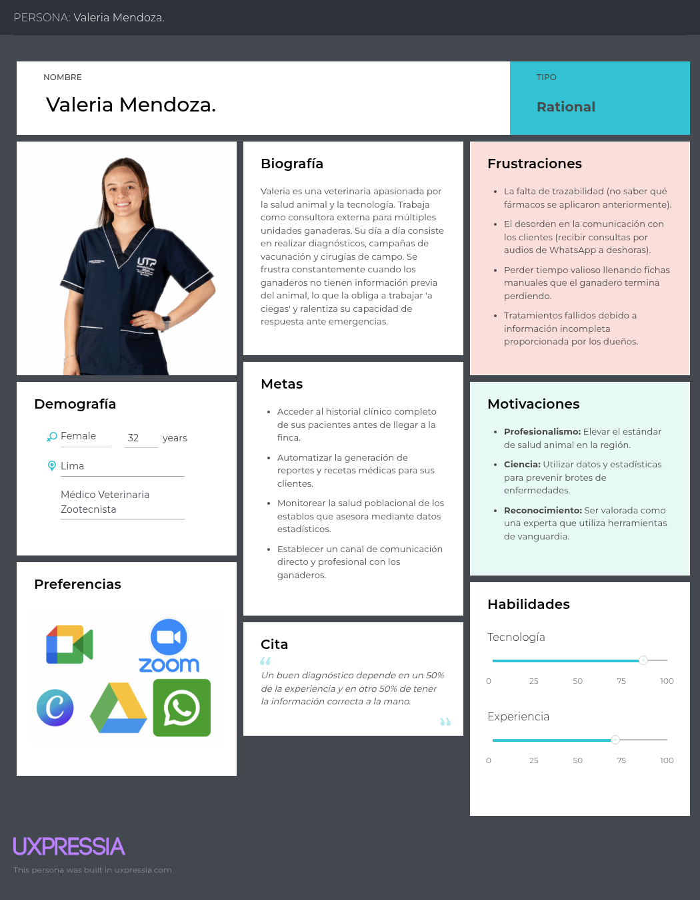

#### 2.3.2. User Task Matrix.

A través de la User Task Matrix, es posible desglosar detalladamente cada una de las actividades y tareas que los usuarios realizan al interactuar con nuestra plataforma. Al categorizar estas acciones en función de su importancia y recurrencia, logramos priorizar estratégicamente los esfuerzos de diseño y desarrollo, asegurando así una experiencia de usuario optimizada y eficiente.

| **User Task**                                      | **Jorge Rivas (Frecuencia)** | **Jorge Rivas (Importancia)** | **Valeria Mendoza (Frecuencia)** | **Valeria Mendoza (Importancia)** |
|------------------------------------------------|------------------------|-------------------------|------------------------|-------------------------|
| Registrar un nuevo animal                      | Sometimes              | High                    | Rarely                 | Medium                  |
| Actualizar registro sanitario                  | Often                  | High                    | Always                 | High                    |
| Consultar calendario de vacunación             | Often                  | High                    | Often                  | High                    |
| Recibir alertas automáticas                    | Sometimes              | High                    | Sometimes              | High                    |
| Registrar peso y ganancia media diaria         | Often                  | Medium                  | Often                  | Medium                  |
| Generar y revisar reportes de productividad    | Sometimes              | Medium                  | Often                  | Medium                  |
| Compartir registros con asociación o compradores | Rarely               | Medium                  | Rarely                 | Low                     |
| Acceder a módulos de formación ("Academia ganadera") | Sometimes         | Low                     | Sometimes              | Medium                  |
| Planificar ciclos de reproducción              | Rarely                 | Medium                  | Rarely                 | Medium                  |
| Revisar historial completo de un animal        | Sometimes              | High                    | Sometimes              | High                    |

La User Task Matrix revela que tanto Jorge como Valeria comparten tareas críticas de actualización sanitaria y recepción de alertas automáticas con alta frecuencia e importancia, seguidas por la consulta del calendario de vacunación y el registro de peso para el control de ganancia media diaria. Mientras Jorge prioriza en su día a día el registro inicial de animales y la revisión de históricos para procesos de venta o inspecciones, Valeria enfoca su actividad en la actualización técnica de datos sanitarios y la generación de reportes de productividad tras cada visita. Al clasificar estas tareas según su recurrencia y valor estratégico, el equipo de desarrollo de AniTec puede enfocar el MVP en las funciones de mayor impacto, postergando los módulos de formación y los reportes avanzados para fases posteriores del proyecto.

#### 2.3.3. User Journey Mapping.

En este apartado se describe de forma detallada el ciclo de experiencia del usuario dentro de la plataforma AniTec de Titan, enfocándose específicamente en los dos perfiles clave: productores ganaderos y médicos veterinarios. Este análisis del user journey examina desde el descubrimiento inicial de la herramienta, pasando por el proceso de decisión para su adopción y la gestión de cuentas, hasta el uso diario de sus funciones y los factores que podrían llevar al cese de su utilización.

El mapeo de este recorrido comienza con el primer contacto del cliente con la aplicación y avanza a través de las fases de evaluación, registro y operatividad total. Se consideran todos los puntos de contacto críticos, permitiendo comprender la experiencia integral desde que el usuario conoce la solución hasta que se convierte en un usuario activo o decide abandonar el servicio.

User Ganadero:

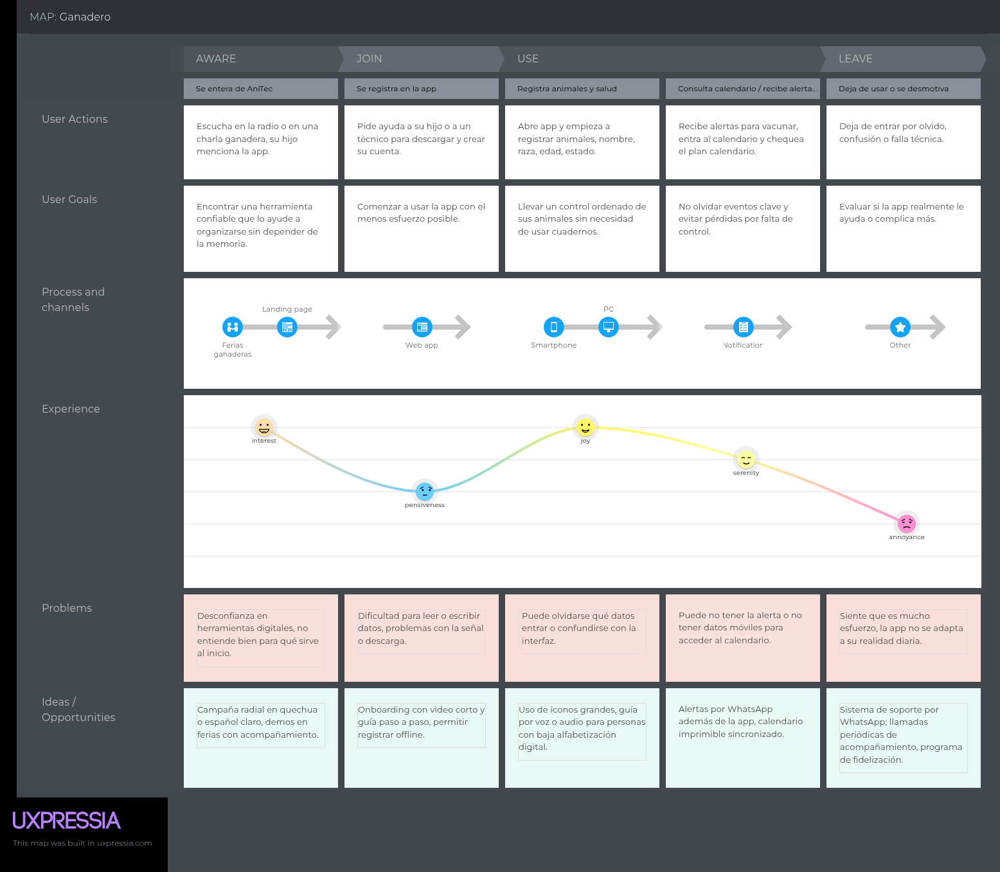

User Veterinario:

#### 2.3.4. Empathy Mapping.

User Ganadero:

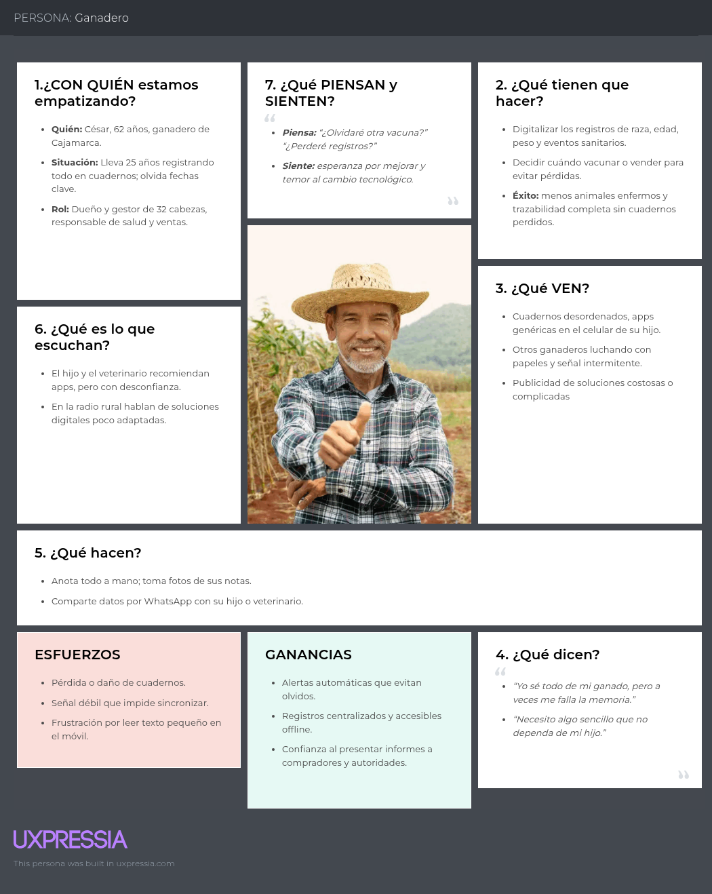

User Veterinario:

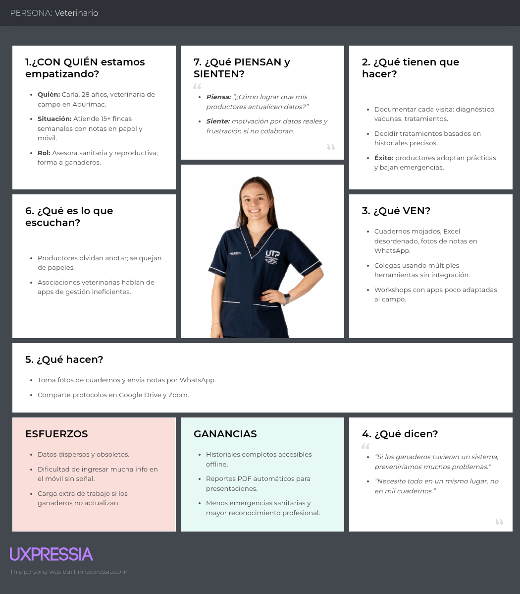

### 2.4. Big Picture EventStorming.

El presente Big Picture Event Storming se ha desarrollado de manera colaborativa utilizando la plataforma Miro, siguiendo la metodología de Philippe Bourgau para explorar el dominio del negocio de forma holística y establecer un entendimiento compartido. A través de un proceso iterativo en este entorno digital, que incluyó la generación de eventos de dominio, el ordenamiento cronológico y el análisis de causas mediante comandos y actores, se ha logrado mapear la complejidad del sector ganadero en una narrativa visual coherente. Este artefacto no solo permite identificar los puntos de fricción y las oportunidades de automatización en la gestión de AniTec, sino que también sienta las bases para el diseño de una arquitectura de software alineada con la realidad operativa de los ganaderos y veterinarios.

**Paso 1:** Unstructured Exploration (Exploración no estructurada) consiste en una lluvia de ideas colaborativa donde los participantes identifican y registran domain events, que son sucesos relevantes ocurridos dentro del negocio. Estos eventos deben redactarse obligatoriamente en tiempo pasado (por ejemplo, "Animal registrado") y se colocan en notas adhesivas de color naranja sobre la superficie de modelado. En esta etapa inicial, se prioriza la cantidad y el descubrimiento de conceptos sobre el orden o la jerarquía, continuando con la actividad hasta que la generación de nuevos eventos disminuya significativamente.

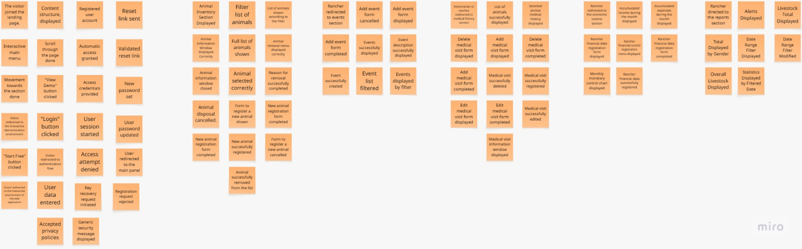

**Paso 2:** Timelines, los participantes revisan los eventos de dominio generados y los organizan cronológicamente para reflejar la secuencia real del proceso empresarial. La construcción inicia con el "happy path scenario", que describe el flujo de un caso de éxito, para luego incorporar escenarios alternativos, errores o ramificaciones en la toma de decisiones. Este paso es fundamental para refinar el modelo, ya que permite identificar eventos faltantes, eliminar duplicados y corregir inconsistencias en la narrativa del negocio.

**Paso 3:** Pain Points, los participantes utilizan la línea de tiempo recién organizada para identificar los puntos críticos o ineficiencias del proceso que requieren atención especial. Estos problemas, que pueden incluir cuellos de botella, falta de documentación o pasos manuales que necesitan automatización, se marcan en el modelo utilizando notas adhesivas rosadas rotadas en forma de diamante. Hacer explícitas estas debilidades permite al equipo abordarlas posteriormente o tomarlas en cuenta conforme avanza el diseño del sistema.

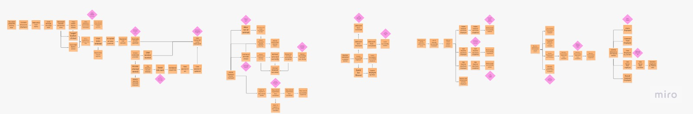

Enlace para acceder al [EventStorming](https://miro.com/welcomeonboard/T1gvUmlKRzZiWjFQV0VFK1VsL1VDbFN1WElQbzV3WjVVd2NYR1d3NVRSdVFOUFd4ZVlIbk4rSmxBN1J3UUtjQjg3cHlKK2VKZ3cwVXB5ZXJoK0MyNmxud0lrejllQVpDT1AzczYyS0t6YWtZTk9xSS9JK05WR2x1cVZvYldTbzRnbHpza3F6REdEcmNpNEFOMmJXWXBBPT0hdjE=?share_link_id=376749116517)

### 2.5. Ubiquitous Language.

Siguiendo los conceptos de **Ubiquitous Language** definidos por **Eric Evans (2003)** en su obra *Domain-Driven Design: Tackling Complexity in the Heart of Software*, se presenta el siguiente glosario. Este conjunto de términos constituye el lenguaje común del proyecto, eliminando ambigüedades entre el equipo de ingeniería y los expertos del dominio ganadero.

| Term (English) | Término (Español) | Definition (Definición) |
| :--- | :--- | :--- |
| **Livestock Owner** | Ganadero | Usuario responsable de la administración operativa y financiera de la hacienda, encargado de registrar eventos diarios y tomar decisiones de producción. |
| **Veterinarian** | Veterinario | Profesional especializado encargado de la salud animal, responsable de emitir diagnósticos, prescribir tratamientos y validar historiales clínicos. |
| **Livestock Unit** | Unidad Ganadera | Cada ejemplar individual bajo gestión dentro del sistema, identificado de forma única para su seguimiento sanitario y productivo. |
| **Health Record** | Registro Sanitario | Documento digital que centraliza el historial de vacunas, enfermedades y procedimientos médicos realizados a un animal. |
| **Sanitary Alert** | Alerta Sanitaria | Notificación automática generada por el sistema para informar sobre vencimientos de vacunas o brotes epidemiológicos detectados en la zona. |
| **Growth Performance** | Desempeño de Crecimiento | Indicador basado en la ganancia media de peso diaria (GMD) que permite evaluar la eficiencia alimenticia y el valor de mercado del animal. |
| **Veterinary History** | Historial Veterinario | Expediente clínico consolidado que permite al especialista revisar antecedentes médicos antes de realizar una intervención. |
| **Treatment Protocol** | Protocolo de Tratamiento | Conjunto de instrucciones médicas y fármacos asignados a un animal para tratar una afección diagnosticada por el veterinario. |
| **Traceability** | Trazabilidad | Capacidad de reconstruir el historial completo de un animal (origen, salud, peso, movimientos) a lo largo de toda su vida productiva. |
| **Offline Synchronization** | Sincronización Offline | Capacidad técnica que permite al ganadero registrar datos sin conexión a internet y sincronizarlos automáticamente al recuperar señal. |
| **Farm Management** | Gestión de Hacienda | Administración de los recursos, personal y actividades que ocurren dentro de la unidad productiva ganadera. |

## Capítulo III: Requirements Specification

### 3.1. User Stories.

<table>
  <thead>
    <tr>
      <th>Epic / Story ID</th>
      <th>Título</th>
      <th>Descripción</th>
      <th>Criterios de Aceptación</th>
      <th>Relacionado con</th>
    </tr>
  </thead>
  <tbody>
    <tr>
      <td><b>EP01</b></td>
      <td>Autenticación y Acceso Seguro</td>
      <td><b>Como</b> usuario del sistema (ganadero o veterinario), <b>quiero</b> gestionar mi cuenta y acceder a la plataforma mediante autenticación segura, <b>para</b> mantener la total privacidad de los datos de mi finca.</td>
      <td>No aplica</td>
      <td>No aplica</td>
    </tr>
    <tr>
      <td><b>EP02</b></td>
      <td>Gestión de Inventario Ganadero (Hato)</td>
      <td><b>Como</b> ganadero, <b>quiero</b> gestionar el registro de mis animales (crear, consultar, editar y eliminar), incluyendo información detallada como identificación, características, estado de salud, reproducción y ubicación, <b>para</b> mantener un control digital, preciso y escalable de mi ganado.</td>
      <td>No aplica</td>
      <td>No aplica</td>
    </tr>
    <tr>
      <td><b>EP03</b></td>
      <td>Gestión de Eventos Sanitarios</td>
      <td><b>Como</b> ganadero, <b>quiero</b> registrar y gestionar eventos sanitarios generales (vacunación, plagas, campañas), <b>para</b> planificar y controlar la salud del ganado a nivel global.</td>
      <td>No aplica</td>
      <td>No aplica</td>
    </tr>
    <tr>
      <td><b>EP04</b></td>
      <td>Historial Clínico por Animal</td>
      <td><b>Como</b> ganadero o veterinario, <b>quiero</b> registrar y consultar el historial clínico de cada animal, <b>para</b> asegurar su trazabilidad y seguimiento médico individual.</td>
      <td>No aplica</td>
      <td>No aplica</td>
    </tr>
    <tr>
      <td><b>EP05</b></td>
      <td>Control Económico y Financiero</td>
      <td><b>Como</b> administrador de la finca, <b>quiero</b> registrar diariamente mis ingresos (ej. ventas) y egresos (ej. compra de insumos), <b>para</b> tener una visibilidad clara de mis finanzas y calcular la rentabilidad real de mi producción.</td>
      <td>No aplica</td>
      <td>No aplica</td>
    </tr>
    <tr>
      <td><b>EP06</b></td>
      <td>Monitoreo, Estadísticas y Alertas (Dashboard)</td>
      <td><b>Como</b> ganadero, <b>quiero</b> visualizar un panel de control con indicadores clave y recibir notificaciones preventivas, <b>para</b> tomar decisiones estratégicas de forma rápida y proactiva.</td>
      <td>No aplica</td>
      <td>No aplica</td>
    </tr>
    <tr>
      <td><b>EP07</b></td>
      <td>Landing Page Comercial y de Conversión</td>
      <td><b>Como</b> visitante interesado, <b>quiero</b> informarme sobre la propuesta de valor, características, testimonios y precios de AniTec en una web pública, <b>para</b> evaluar el producto y decidir si me registro en la plataforma.</td>
      <td>No aplica</td>
      <td>No aplica</td>
    </tr>
    <tr>
      <td><b>US01</b></td>
      <td>Registro de Nueva Cuenta</td>
      <td><b>Como</b> nuevo usuario, <b>quiero</b> registrar mis datos y crear credenciales, <b>para</b> obtener una cuenta que me permita gestionar mi hato ganadero.</td>
      <td>
        - <b>Dado que</b> un usuario ingresa datos válidos y acepta las políticas de privacidad, <b>Cuando</b> procesa el registro, <b>Entonces</b> el sistema crea la cuenta de forma persistente y le otorga acceso automático.  
        - <b>Dado que</b> el correo electrónico ingresado ya se encuentra registrado en la plataforma, <b>Cuando</b> se intenta procesar el registro, <b>Entonces</b> el sistema rechaza la solicitud e informa la duplicidad sin comprometer otros datos.
      </td>
      <td>EP01</td>
    </tr>
    <tr>
      <td><b>US02</b></td>
      <td>Inicio de Sesión</td>
      <td><b>Como</b> usuario registrado, <b>quiero</b> autenticarme en la plataforma, <b>para</b> acceder a mi información de forma segura.</td>
      <td>
        - <b>Dado que</b> un usuario provee credenciales correctas, <b>Cuando</b> solicita acceso, <b>Entonces</b> el sistema lo redirige a su panel principal.  
        - <b>Dado que</b> el usuario ingresa una clave errónea, <b>Cuando</b> intenta acceder, <b>Entonces</b> el sistema deniega el paso.
      </td>
      <td>EP01</td>
    </tr>
    <tr>
      <td><b>US03</b></td>
      <td>Recuperación de Contraseña</td>
      <td><b>Como</b> usuario registrado, <b>quiero</b> solicitar un restablecimiento de mi clave, <b>para</b> recuperar el acceso a mi cuenta si la olvido.</td>
     <td>
        - <b>Dado que</b> el usuario ingresa un correo válido, <b>Cuando</b> solicita la recuperación, <b>Entonces</b> el sistema envía un enlace de restablecimiento.  
        - <b>Dado que</b> el usuario accede al enlace recibido, <b>Cuando</b> ingresa una nueva contraseña, <b>Entonces</b> el sistema actualiza la contraseña y permite el acceso.  
        - <b>Dado que</b> el correo no está registrado, <b>Cuando</b> el usuario solicita la recuperación, <b>Entonces</b> el sistema muestra un mensaje genérico por seguridad.
      </td>
      <td>EP01</td>
    </tr>
    <tr>
      <td><b>US04</b></td>
      <td>Ingreso de Nuevo Animal</td>
      <td><b>Como</b> ganadero, <b>quiero</b> registrar un animal con su información taxonómica y biográfica, <b>para</b> ingresarlo a mi base de datos digital.</td>
      <td>
        - <b>Dado que</b> se ingresan datos obligatorios válidos, <b>Cuando</b> se confirma la creación, <b>Entonces</b> el sistema almacena el perfil del animal <b>Y</b> lo muestra en el listado actualizado.  
        - <b>Dado que</b> falta un campo obligatorio (ej. especie), <b>Cuando</b> intenta guardar, <b>Entonces</b> el sistema bloquea la acción y resalta el error.  
        - <b>Dado que</b> el ganadero ingresa datos en formato inválido (ej. edad negativa), <b>Cuando</b> intenta guardar, <b>Entonces</b> el sistema muestra un mensaje de error indicando que el formato es incorrecto.
      </td>
      <td>EP02</td>
    </tr>
    <tr>
      <td><b>US05</b></td>
      <td>Edición de Datos del Animal</td>
      <td><b>Como</b> ganadero, <b>quiero</b> modificar los datos de un animal existente, <b>para</b> mantener su información actualizada.</td>
      <td>
        - <b>Dado que</b> el usuario modifica un campo válido de un animal, <b>Cuando</b> guarda los cambios, <b>Entonces</b> el sistema actualiza la base de datos sin alterar el identificador único.  
        - <b>Dado que</b> el ganadero ingresa datos inválidos (ej. valores negativos), <b>Cuando</b> intenta guardar los cambios, <b>Entonces</b> el sistema bloquea la actualización y muestra mensajes de error indicando los campos correspondientes mal ingresados.  
        - <b>Dado que</b> el ganadero deja campos obligatorios vacíos, <b>Cuando</b> intenta guardar, <b>Entonces</b> el sistema impide la acción y resalta los campos requeridos.
      </td>
      <td>EP02</td>
    </tr>
    <tr>
      <td><b>US06</b></td>
      <td>Baja / Eliminación de Animal</td>
      <td><b>Como</b> ganadero, <b>quiero</b> dar de baja a un animal del sistema, <b>para</b> reflejar ventas o decesos en mi inventario real.</td>
     <td>
        - <b>Dado que</b> el usuario selecciona eliminar un registro, E ingrese el ID del animal a eliminar y el motivo (Muerte o Venta) <b>Cuando</b> confirma la acción, <b>Entonces</b> el sistema lo remueve y actualiza el listado principal.  
        - <b>Dado que</b> el ganadero no selecciona un motivo de baja ni el ID del animal <b>Cuando</b> intenta confirmar la eliminación, <b>Entonces</b> el sistema bloquea la acción y solicita completar los campos requeridos.
      </td>
      <td>EP02</td>
    </tr>
    <tr>
      <td><b>US07</b></td>
      <td>Listado de Animales</td>
      <td><b>Como</b> ganadero, <b>quiero</b> ver una lista de todos mis animales, <b>para</b> tener una visión general de mi inventario.</td>
      <td>
        - <b>Dado que</b> el usuario accede al módulo de inventario, <b>Cuando</b> carga la vista, <b>Entonces</b> el sistema retorna una lista con resúmenes básicos (especie, edad, sexo) por animal.  
        - <b>Dado que</b> no existen animales registrados, <b>Cuando</b> el usuario accede al módulo, <b>Entonces</b> el sistema muestra un mensaje indicando que no hay datos disponibles.
      </td>
      <td>EP02</td>
    </tr>
    <tr>
      <td><b>US08</b></td>
      <td>Búsqueda y Filtrado</td>
      <td><b>Como</b> ganadero, <b>quiero</b> buscar animales por ID o aplicar filtros, <b>para</b> encontrar especímenes específicos de forma rápida.</td>
     <td>
        - <b>Dado que</b> el usuario ingresa un término de búsqueda, <b>Cuando</b> ejecuta la consulta, <b>Entonces</b> el sistema retorna solo los registros que coinciden con el término.  
        - <b>Dado que</b> aplica un filtro de especie, <b>Cuando</b> la vista se actualiza, <b>Entonces</b> solo se muestran los animales de dicha categoría.  
        - <b>Dado que</b> el ganadero limpia los filtros o el término de búsqueda, <b>Cuando</b> restablece la vista, <b>Entonces</b> el sistema muestra nuevamente el listado completo de animales.
      </td>
      <td>EP02</td>
    </tr>
    <tr>
      <td><b>US09</b></td>
      <td>Ficha Detallada del Animal</td>
      <td><b>Como</b> ganadero, <b>quiero</b> abrir el perfil completo de un animal, <b>para</b> revisar todos sus atributos, estado reproductivo y documentos.</td>
      <td>
        - <b>Dado que</b> el usuario selecciona un animal del listado, <b>Cuando</b> solicita su detalle, <b>Entonces</b> el sistema expone toda su información biográfica y archivos adjuntos.
      </td>
      <td>EP02</td>
    </tr>
    <tr>
      <td><b>US10</b></td>
      <td>Visualización de Próximos Eventos</td>
      <td><b>Como</b> ganadero, <b>quiero</b> ver eventos programados, <b>para</b> anticipar campañas de vacunación o tareas sanitarias.</td>
      <td>
        - <b>Dado que</b> el usuario accede al módulo de eventos, <b>Cuando</b> carga la vista, <b>Entonces</b> el sistema muestra un listado de eventos (vacunación, tratamientos, campañas) con información básica (tipo, fecha, titulo, descripción, imagen referencial).  
        - <b>Dado que</b> el usuario aplica filtro según tipo de evento, <b>Cuando</b> actualiza la vista, <b>Entonces</b> el sistema muestra solo los eventos que cumplen los criterios.  
        - <b>Dado que</b> no existen eventos registrados, <b>Cuando</b> el usuario accede al módulo, <b>Entonces</b> el sistema muestra un mensaje indicando que no hay eventos disponibles.
      </td>
      <td>EP03</td>
    </tr>
    <tr>
      <td><b>US11</b></td>
      <td>Registro de nuevo Evento</td>
      <td><b>Como</b> ganadero, <b>quiero</b> registrar un nuevo evento sanitario, <b>para</b> planificar y dar seguimiento a las actividades de salud.</td>
     <td>
        - <b>Dado que</b> el usuario completa los campos obligatorios (tipo de evento, fecha, título y descripción), <b>Cuando</b> confirma el registro, <b>Entonces</b> el sistema crea el evento y lo muestra en el listado actualizado.  
        - <b>Dado que</b> el usuario omite uno o más campos obligatorios, <b>Cuando</b> intenta guardar el evento, <b>Entonces</b> el sistema bloquea la acción y muestra mensajes de validación.  
        - <b>Dado que</b> el usuario ingresa datos en formato inválido (ej. fecha incorrecta), <b>Cuando</b> intenta registrar el evento, <b>Entonces</b> el sistema muestra un mensaje de error indicando el formato esperado.
      </td>
      <td>EP03</td>
    </tr>
    <tr>
      <td><b>US12</b></td>
      <td>Búsqueda y Selección para Historial</td>
      <td><b>Como</b> veterinario o ganadero, <b>quiero</b> filtrar animales por especie, edad o sexo, <b>para</b> localizar el animal cuyo historial clínico deseo consultar.</td>
      <td>
        - <b>Dado que</b> el usuario accede a la sección de historial clínico, <b>Cuando</b> carga la vista, <b>Entonces</b> el sistema muestra un panel de búsqueda con filtros (especie, edad, sexo) y un listado de animales registrados.  
        - <b>Dado que</b> el usuario aplica uno o más filtros, <b>Cuando</b> actualiza la búsqueda, <b>Entonces</b> el sistema muestra únicamente los animales que cumplen con los criterios.  
        - <b>Dado que</b> no existen resultados, <b>Cuando</b> se aplican filtros o búsqueda, <b>Entonces</b> el sistema muestra un mensaje indicando que no hay coincidencias.
      </td>
      <td>EP04</td>
    </tr>
    <tr>
      <td><b>US13</b></td>
      <td>Consulta de Historial Clínico</td>
      <td><b>Como</b> veterinario o ganadero, <b>quiero</b> visualizar el historial clínico de un animal, <b>para</b> evaluar su evolución sanitaria.</td>
      <td>
        - <b>Dado que</b> el usuario selecciona un animal del listado, <b>Cuando</b> accede a su historial clínico, <b>Entonces</b> el sistema muestra una tabla cronológica con las visitas médicas registradas.  
        - <b>Dado que</b> el historial contiene registros, <b>Cuando</b> se visualiza la tabla, <b>Entonces</b> se muestran datos como fecha, diagnóstico, tratamiento y observaciones.  
        - <b>Dado que</b> no existen visitas registradas, <b>Cuando</b> el usuario accede al historial, <b>Entonces</b> el sistema muestra un mensaje indicando que no hay registros.
      </td>
      <td>EP04</td>
    </tr>
    <tr>
      <td><b>US14</b></td>
      <td>Registro de Visita Médica</td>
      <td><b>Como</b> veterinario o ganadero, <b>quiero</b> registrar una nueva visita médica, <b>para</b> documentar la atención sanitaria de un animal.</td>
      <td>
        - <b>Dado que</b> el usuario se encuentra en el historial de un animal, <b>Cuando</b> selecciona “Añadir nueva visita” y completa los campos obligatorios, <b>Entonces</b> el sistema guarda el registro y lo muestra en el historial.  
        - <b>Dado que</b> faltan campos obligatorios, <b>Cuando</b> intenta guardar, <b>Entonces</b> el sistema bloquea la acción y muestra mensajes de validación.  
        - <b>Dado que</b> el registro se guarda correctamente, <b>Cuando</b> finaliza la operación, <b>Entonces</b> el sistema muestra una confirmación.
      </td>
      <td>EP04</td>
    </tr>
    <tr>
      <td><b>US15</b></td>
      <td>Edición de Visita Médica</td>
      <td><b>Como</b> veterinario o ganadero, <b>quiero</b> editar una visita médica, <b>para</b> corregir o actualizar la información.</td>
      <td>
        - <b>Dado que</b> el usuario selecciona una visita existente, <b>Cuando</b> modifica los datos y guarda los cambios, <b>Entonces</b> el sistema actualiza la información en el historial.  
        - <b>Dado que</b> se ingresan datos inválidos, <b>Cuando</b> intenta guardar, <b>Entonces</b> el sistema muestra errores de validación.
      </td>
      <td>EP04</td>
    </tr>
    <tr>
      <td><b>US16</b></td>
      <td>Eliminación de Visita Médica</td>
      <td><b>Como</b> veterinario o ganadero, <b>quiero</b> eliminar una visita médica registrada, <b>para</b> mantener un historial clínico preciso.</td>
      <td>
        - <b>Dado que</b> el usuario selecciona una visita médica, <b>Cuando</b> confirma la eliminación, <b>Entonces</b> el sistema elimina el registro del historial.  
        - <b>Dado que</b> el usuario cancela la operación, <b>Cuando</b> decide no continuar, <b>Entonces</b> el sistema no realiza cambios.  
        - <b>Dado que</b> la eliminación se realiza correctamente, <b>Cuando</b> finaliza la operación, <b>Entonces</b> el sistema actualiza el historial de visitas.
      </td>
      <td>EP04</td>
    </tr>
    <tr>
      <td><b>US17</b></td>
      <td>Registro de Ingresos Diarios</td>
      <td><b>Como</b> ganadero, <b>quiero</b> añadir registros de ingresos económicos, <b>para</b> documentar las ganancias por ventas o servicios.</td>
      <td>
        - <b>Dado que</b> se introduce un monto positivo y una fecha, <b>Cuando</b> se guarda la transacción, <b>Entonces</b> el sistema la clasifica como ingreso e incrementa el balance del periodo.
      </td>
      <td>EP05</td>
    </tr>
    <tr>
      <td><b>US18</b></td>
      <td>Registro de Egresos Diarios</td>
      <td><b>Como</b> ganadero, <b>quiero</b> documentar los gastos operativos, <b>para</b> tener control sobre las salidas de dinero de la finca.</td>
      <td>
        - <b>Dado que</b> se introduce un monto de gasto y la fecha en la que se realizó, <b>Cuando</b> se guarda la transacción, <b>Entonces</b> el sistema la clasifica como egreso y actualiza las métricas financieras del periodo.
      </td>
      <td>EP05</td>
    </tr>
    <tr>
      <td><b>US19</b></td>
      <td>Análisis Gráfico de Ganancia</td>
      <td><b>Como</b> ganadero, <b>quiero</b> visualizar el comportamiento financiero en gráficas, <b>para</b> entender la rentabilidad a lo largo del tiempo.</td>
      <td>
        - <b>Dado que</b> el sistema posee registros financieros, <b>Cuando</b> se consulta el análisis mensual, <b>Entonces</b> renderiza un gráfico de barras comparando la utilidad mensual en lo que va del año.
      </td>
      <td>EP05</td>
    </tr>
    <tr>
      <td><b>US20</b></td>
      <td>Filtros y Total de Hato</td>
      <td><b>Como</b> ganadero, <b>quiero</b> visualizar el total de animales según filtros aplicados, <b>para</b> conocer el tamaño de mi inventario bajo criterios específicos.</td>
      <td>
        - <b>Dado que</b> el usuario accede al dashboard, <b>Cuando</b> carga la vista, <b>Entonces</b> el sistema muestra una tarjeta con el total general de animales.  
        - <b>Dado que</b> el usuario aplica filtros (rango de fechas, especie, ubicación o estado), <b>Cuando</b> actualiza la vista, <b>Entonces</b> el sistema recalcula y muestra el total de animales que cumplen dichos criterios.  
        - <b>Dado que</b> no existen resultados para los filtros aplicados, <b>Cuando</b> se actualiza la vista, <b>Entonces</b> el sistema muestra un total igual a cero y un mensaje informativo.  
        - <b>Dado que</b> existen gráficos en el dashboard, <b>Cuando</b> el usuario aplica filtros, <b>Entonces</b> estos no afectan el gráfico de distribución por sexo ni el gráfico porcentual por especie.
      </td>
      <td>EP06</td>
    </tr>
    <tr>
      <td><b>US21</b></td>
      <td>Distribución del Hato por Sexo y Especie</td>
      <td><b>Como</b> ganadero, <b>quiero</b> visualizar la distribución de mi ganado por especie y sexo, <b>para</b> entender su composición demográfica.</td>
      <td>
        - <b>Dado que</b> el usuario accede al dashboard, <b>Cuando</b> carga la sección de distribución, <b>Entonces</b> el sistema muestra un gráfico circular con la proporción por especie y un gráfico de barras con la distribución por sexo.  
        - <b>Dado que</b> el usuario interactúa con el selector de especie, <b>Cuando</b> selecciona una opción, <b>Entonces</b> el sistema actualiza el gráfico de barras mostrando la distribución por sexo para dicha especie.  
        - <b>Dado que</b> el gráfico circular representa la distribución por especie, <b>Cuando</b> se visualiza, <b>Entonces</b> este no permite interacción ni modificación por parte del usuario.  
        - <b>Dado que</b> no existen datos disponibles, <b>Cuando</b> se visualizan los gráficos, <b>Entonces</b> el sistema muestra un mensaje indicando la ausencia de información.
      </td>
      <td>EP06</td>
    </tr>
    <tr>
      <td><b>US22</b></td>
      <td>Panel de Alertas Clasificadas</td>
      <td><b>Como</b> ganadero, <b>quiero</b> visualizar un listado de alertas categorizadas por nivel de severidad (críticas, medias, informativas), <b>para</b> detectar anomalías como alta mortalidad o desbalances y tomar acciones preventivas.</td>
      <td>
        - <b>Dado que</b> ocurren anomalías registradas en la finca, <b>Cuando</b> el usuario ingresa a Reportes, <b>Entonces</b> el sistema expone tarjetas de alerta con iconos y colores según su gravedad (rojo, amarillo, azul), indicando la causa y la fecha.  
        - <b>Dado que</b> pueden existir múltiples avisos, <b>Cuando</b> se visualiza el panel de alertas, <b>Entonces</b> el sistema muestra un bloque resumen con el conteo total numérico segmentado en: Alertas críticas, medias e informativas.
      </td>
      <td>EP06</td>
    </tr>
    <tr>
      <td><b>US23</b></td>
      <td>Tendencias Históricas Poblacionales</td>
      <td><b>Como</b> ganadero, <b>quiero</b> analizar una gráfica de líneas sobre la tendencia total del ganado a lo largo del tiempo, <b>para</b> evaluar objetivamente el crecimiento o decrecimiento de mi producción.</td>
      <td>
        - <b>Dado que</b> existen registros históricos continuos, <b>Cuando</b> se consulta la gráfica inferior, <b>Entonces</b> el sistema dibuja una línea conectando los puntos de la evolución poblacional mes a mes.  
        - <b>Dado que</b> el usuario necesita cambiar la ventana de análisis, <b>Cuando</b> interactúa con el botón de rango temporal (ej. "Últimos 6 meses"), <b>Entonces</b> el eje X de la gráfica se ajusta y redibuja la tendencia para ese periodo específico.
      </td>
      <td>EP06</td>
    </tr>
    <tr>
      <td><b>US24</b></td>
      <td>Notificaciones Globales</td>
      <td><b>Como</b> usuario del sistema, <b>quiero</b> visualizar un panel de notificaciones global a través del icono de campana, <b>para</b> enterarme inmediatamente de las alertas registradas sin importar en qué sección de la plataforma me encuentre navegando.</td>
      <td>
        - <b>Dado que</b> el motor del sistema genera una nueva alerta (ej. desbalance de sexos o próxima vacunación), <b>Cuando</b> el usuario está activo en la sesión, <b>Entonces</b> el icono de la campana en la barra de navegación muestra un indicador visual de notificación no leída.  
        - <b>Dado que</b> el usuario interactúa con la campana de notificaciones, <b>Cuando</b> hace clic sobre el icono, <b>Entonces</b> el sistema despliega un menú flotante con el listado de las alertas más recientes ordenadas por fecha y hora.  
        - <b>Dado que</b> el usuario visualiza una alerta en el menú flotante, <b>Cuando</b> hace clic sobre la misma, <b>Entonces</b> el sistema marca la notificación como "leída".
      </td>
      <td>EP06</td>
    </tr>
    <tr>
      <td><b>US25</b></td>
      <td>Landing inicio: Visualización de Propuesta de Valor</td>
      <td><b>Como</b> visitante, <b>quiero</b> visualizar la propuesta de valor principal de AniTec en la página de inicio, <b>para</b> comprender rápidamente qué solución ofrece la plataforma.</td>
      <td>
        - <b>Dado que</b> el visitante accede al home de AniTec, <b>Cuando</b> la página carga correctamente, <b>Entonces</b> el sistema muestra el título "Gestiona tu Ganado con Tecnología Innovadora" y la descripción del valor agregado.  
        - <b>Dado que</b> el visitante observa la sección hero, <b>Cuando</b> hace scroll, <b>Entonces</b> el sistema despliega las métricas clave (+500 ganaderos, +120 veterinarios, +5,000 animals).
      </td>
      <td>EP07</td>
    </tr>
    <tr>
      <td><b>US26</b></td>
      <td>Landing inicio: Exploración de Segmentos</td>
      <td><b>Como</b> visitante, <b>quiero</b> explorar los dos segmentos objetivo de AniTec en la página de inicio, <b>para</b> identificar si la plataforma es relevante para mi rol.</td>
      <td>
        - <b>Dado que</b> el visitante visualiza la sección "Diseñado para Ganaderos y Veterinarios", <b>Cuando</b> hace clic en "ganaderos", <b>Entonces</b> el sistema lo redirige a la página de ganaderos.  
        - <b>Dado que</b> el visitante hace clic en "veterinarios", <b>Cuando</b> selecciona el segmento, <b>Entonces</b> el sistema lo redirige a la página de veterinarios.
      </td>
      <td>EP07</td>
    </tr>
    <tr>
      <td><b>US27</b></td>
      <td>Landing inicio: Visualización de Métricas e Impacto</td>
      <td><b>Como</b> visitante, <b>quiero</b> observar las métricas de impacto de AniTec, <b>para</b> confiar en la efectividad de la plataforma.</td>
      <td>
        - <b>Dado que</b> el visitante accede a la sección de métricas, <b>Cuando</b> visualiza las estadísticas (85% menos información perdida, 2h ahorro diario), <b>Entonces</b> el sistema muestra los indicadores de manera clara y visual.  
        - <b>Dado que</b> el visitante verifica las cifras de ganaderos confían, <b>Cuando</b> observa "+500 ganaderos trust", <b>Entonces</b> el sistema presenta el número actualizado.
      </td>
      <td>EP07</td>
    </tr>
    <tr>
      <td><b>US28</b></td>
      <td>Landing inicio: Navegación entre Secciones</td>
      <td><b>Como</b> visitante, <b>quiero</b> navegar entre las diferentes secciones de la landing page, <b>para</b> explorar todo el contenido de manera fluida.</td>
      <td>
        - <b>Dado que</b> el visitante hace clic en "Pricing" en el menú, <b>Cuando</b> selecciona la opción, <b>Entonces</b> el sistema realiza scroll hacia la sección de precios.  
        - <b>Dado que</b> el visitante hace scroll por la página, <b>Cuando</b>reach the features section, <b>Entonces</b> el sistema carga las animaciones de entrada de manera fluida.
      </td>
      <td>EP07</td>
    </tr>
    <tr>
      <td><b>US29</b></td>
      <td>Landing inicio: Acceso a Precios y Planes</td>
      <td><b>Como</b> visitante interesado, <b>quiero</b> revisar los planes y precios de AniTec, <b>para</b> evaluar cuál plan se ajusta a mis necesidades.</td>
      <td>
        - <b>Dado que</b> el visitante hace clic en "Pricing" o "Precios", <b>Cuando</b> navigation reaches the pricing section, <b>Entonces</b> el sistema muestra los tres planes (Basic $0, Professional $19, Enterprise $49).  
        - <b>Dado que</b> el visitante hace clic en "Elegir Plan" del plan Professional, <b>Cuando</b> selecciona el botón, <b>Entonces</b> el sistema abre el formulario de registro.
      </td>
      <td>EP07</td>
    </tr>
    <tr>
      <td><b>US30</b></td>
      <td>Landing nosotros: Información del Equipo</td>
      <td><b>Como</b> visitante, <b>quiero</b> conocer al equipo detrás de AniTec, <b>para</b> identificar a los creadores y su experiencia.</td>
      <td>
        - <b>Dado que</b> el visitante accede a la página "About Us", <b>Cuando</b> la página carga, <b>Entonces</b> el sistema muestra la información del equipo Titan y los perfiles de los integrantes.  
        - <b>Dado que</b> el visitante visualiza la misión y visión, <b>Cuando</b> hace scroll hacia la sección, <b>Entonces</b> el sistema despliega los valores corporativa de la startup.
      </td>
      <td>EP07</td>
    </tr>
    <tr>
      <td><b>US31</b></td>
      <td>Landing nosotros: Conocimiento del Proceso</td>
      <td><b>Como</b> visitante, <b>quiero</b> entender el proceso de desarrollo y tecnología utilizada, <b>para</b> evaluar la viabilidad técnica del proyecto.</td>
      <td>
        - <b>Dado que</b> el visitante explora la sección de proceso, <b>Cuando</b> hace scroll hacia "Nuestro Proceso", <b>Entonces</b> el sistema muestra el timeline con las fases del desarrollo.  
        - <b>Dado que</b> el visitante visualiza las tecnologías, <b>Cuando</b> observa el stack tecnológico (VueJS, .NET, SQL Server), <b>Entonces</b> el sistema presenta los logos y descripciones de cada tecnología.
      </td>
      <td>EP07</td>
    </tr>
    <tr>
      <td><b>US32</b></td>
      <td>Landing nosotros: Contacto y Redes Sociales</td>
      <td><b>Como</b> visitante, <b>quiero</b> encontrar información de contacto y redes sociales, <b>para</b> poder comunicar consultas o sugerencias.</td>
      <td>
        - <b>Dado que</b> el visitante Busca opciones de contacto, <b>Cuando</b> reach the footer o sección de contacto, <b>Entonces</b> el sistema muestra los enlaces a redes sociales (Facebook, Instagram, Twitter, LinkedIn, YouTube).  
        - <b>Dado que</b> el visitante hace clic en una red social, <b>Cuando</b> selecciona el icono, <b>Entonces</b> el sistema abre la página oficial de AniTec en una nueva pestaña.
      </td>
      <td>EP07</td>
    </tr>
    <tr>
      <td><b>US33</b></td>
      <td>Landing nosotros: Política de Privacidad</td>
      <td><b>Como</b> visitante, <b>quiero</b> revisar la política de privacidad y términos, <b>para</b> entender cómo se protegen mis datos.</td>
      <td>
        - <b>Dado que</b> el visitante hace clic en "Privacy Policy", <b>Cuando</b> selecciona el enlace en el footer, <b>Entonces</b> el sistema despliega el documento completo de privacidad.  
        - <b>Dado que</b> el visitante hace clic en "Terms of Service", <b>Cuando</b> selecciona la opción, <b>Entonces</b> el sistema muestra los términos y condiciones del servicio.
      </td>
      <td>EP07</td>
    </tr>
    <tr>
      <td><b>US34</b></td>
      <td>Landing nosotros: Navegación General</td>
      <td><b>Como</b> visitante, <b>quiero</b> navegar fluidamente por todas las secciones de About Us, <b>para</b> explorar el contenido completo de la página.</td>
      <td>
        - <b>Dado que</b> el visitante hace clic en "Home" desde About Us, <b>Cuando</b> selecciona el enlace, <b>Entonces</b> el sistema redirige a la página principal.  
        - <b>Dado que</b> el visitante utiliza el menú de navegación, <b>Cuando</b> hace Scroll, <b>Entonces</b> el sistema mantiene el header fijo para facilitar la navegación.
      </td>
      <td>EP07</td>
    </tr>
    <tr>
      <td><b>US35</b></td>
      <td>Landing nosotros: Llamados a la Acción</td>
      <td><b>Como</b> visitante, <b>quiero</b> acceder a los CTAs de conversión en About Us, <b>para</b> iniciar mi registro o contactarme con el equipo.</td>
      <td>
        - <b>Dado que</b> el visitante hace clic en "Start Free Now", <b>Cuando</b> selecciona el botón CTA, <b>Entonces</b> el sistema redirige al flujo de autenticación.  
        - <b>Dado que</b> el visitante hace clic en "Contact", <b>Cuando</b> selecciona el botón de contacto, <b>Entonces</b> el sistema abre el formulario de contacto o muestra la información de email.
      </td>
      <td>EP07</td>
    </tr>
    <tr>
      <td><b>US36</b></td>
      <td>Landing ganaderos: Exploración de Contenido Específico</td>
      <td><b>Como</b> visitante del segmento de ganaderos, <b>quiero</b> explorar el contenido específico para ganaderos, <b>para</b> evaluar si AniTec se ajusta a mis necesidades.</td>
      <td>
        - <b>Dado que</b> el visitante accede a la página de ganaderos, <b>Cuando</b> la página carga, <b>Entonces</b> el sistema muestra el hero con "Digitize Your Livestock Today" y las características específicas para ganaderos.  
        - <b>Dado que</b> el visitante hace scroll, <b>Cuando</b> visualiza la sección de módulos, <b>Entonces</b> el sistema presenta los 4 módulos (Gestión de Animales, Control Sanitario, Reproducción, Gestión Económica).
      </td>
      <td>EP07</td>
    </tr>
    <tr>
      <td><b>US37</b></td>
      <td>Landing ganaderos: Visualización de Testimonios</td>
      <td><b>Como</b> visitante del segmento de ganaderos, <b>quiero</b> leer testimonios de otros ganaderos, <b>para</b> evaluar la confianza en la plataforma.</td>
      <td>
        - <b>Dado que</b> el visitante alcanza la sección de testimonios, <b>Cuando</b> hace scroll hacia "What ganaderos Say", <b>Entonces</b> el sistema muestra las tarjetas de testimonios con fotos, nombres y países.  
        - <b>Dado que</b> el visitante observa las estrellas de calificación, <b>Cuando</b> visualiza cada testimonio, <b>Entonces</b> el sistema presenta 5 estrellas para indicar satisfacción.
      </td>
      <td>EP07</td>
    </tr>
    <tr>
      <td><b>US38</b></td>
      <td>Landing ganaderos: Comparación de Métodos</td>
      <td><b>Como</b> visitante del segmento de ganaderos, <b>quiero</b> visualizar la comparación entre el método tradicional y AniTec, <b>para</b> entender los beneficios de digitalizar.</td>
      <td>
        - <b>Dado que</b> el visitante llega a la sección "Traditional vs AniTec", <b>Cuando</b> visualiza las tarjetas comparativas, <b>Entonces</b> el sistema muestra las ventajas del método tradicional vs AniTec (8 beneficios contrastados).  
        - <b>Dado que</b> el visitante observa las estadísticas de impacto, <b>Cuando</b> hace scroll hacia las métricas finales, <b>Entonces</b> el sistema presenta: 85% reducción de tiempo, 100% trazabilidad, 30% aumento en productividad.
      </td>
      <td>EP07</td>
    </tr>
    <tr>
      <td><b>US39</b></td>
      <td>Landing ganaderos: Llamado a la Acción Final</td>
      <td><b>Como</b> visitante del segmento de ganaderos, <b>quiero</b> acceder al CTA final de la página, <b>para</b> iniciar mi registro o prueba gratuita.</td>
      <td>
        - <b>Dado que</b> el visitante hace clic en "Start Free Now", <b>Cuando</b> selecciona el botón CTA, <b>Entonces</b> el sistema redirige a la página de precios o formulario de registro.  
        - <b>Dado que</b> el visitante hace clic en "View How It Works", <b>Cuando</b> selecciona el botón secundario, <b>Entonces</b> el sistema abre el contenido explicativo o video demostrativo.
      </td>
      <td>EP07</td>
    </tr>
    <tr>
      <td><b>US40</b></td>
      <td>Landing ganaderos: Información de Precios</td>
      <td><b>Como</b> visitante del segmento de ganaderos, <b>quiero</b> acceder a la información de precios desde la página, <b>para</b> evaluar los planes disponibles.</td>
      <td>
        - <b>Dado que</b> el visitante hace clic en "Pricing" desde el menú, <b>Cuando</b> selecciona el enlace, <b>Entonces</b> el sistema navega a la sección de precios en la página principal.  
        - <b>Dado que</b> el visitante hace clic en el botón de precios desde el CTA, <b>Cuando</b> selecciona la opción, <b>Entonces</b> el sistema muestra los planes con precios actualizados.
      </td>
      <td>EP07</td>
    </tr>
    <tr>
      <td><b>US41</b></td>
      <td>Landing ganaderos: Navegación entre páginas</td>
      <td><b>Como</b> visitante del segmento de ganaderos, <b>quiero</b> navegar a otras páginas desde la página de ganaderos, <b>para</b> explorar contenido adicional.</td>
      <td>
        - <b>Dado que</b> el visitante hace clic en "Home" desde el menú, <b>Cuando</b> selecciona la opción, <b>Entonces</b> el sistema redirige a la página principal.  
        - <b>Dado que</b> el visitante hace clic en "veterinarios" desde el menú, <b>Cuando</b> selecciona la opción, <b>Entonces</b> el sistema navega a la página de veterinarios para explorar el otro segmento.
      </td>
      <td>EP07</td>
    </tr>
    <tr>
      <td><b>US42</b></td>
      <td>Landing veterinarios: Contenido Específico del Segmento</td>
      <td><b>Como</b> visitante del segmento de veterinarios, <b>quiero</b> explorar el contenido diseñado para veterinarios, <b>para</b> evaluar si AniTec se adapta a mi práctica profesional.</td>
      <td>
        - <b>Dado que</b> el visitante accede a la página de veterinarios, <b>Cuando</b> la página carga, <b>Entonces</b> el sistema muestra el hero con "Optimize Your Veterinary Practice" y badge "Herramienta Profesional #1".  
        - <b>Dado que</b> el visitante hace scroll, <b>Cuando</b> se ubica en la sección, <b>Entonces</b> el sistema despliega las 6 funcionalidades clave (Búsqueda de Pacientes, Registro de Visitas, Recetas Digitales, Seguimiento, Compartir con Ganadero, Reportes Profesionales).
      </td>
      <td>EP07</td>
    </tr>
    <tr>
      <td><b>US43</b></td>
      <td>Landing veterinarios: Casos de Uso</td>
      <td><b>Como</b> visitante del segmento de veterinarios, <b>quiero</b> leer los casos de uso específicos de la herramienta, <b>para</b> comprender cómo AniTec facilita mi trabajo diario.</td>
      <td>
        - <b>Dado que</b> el visitante se ubica en la sección de "Casos de Uso", <b>Cuando</b> hace scroll hacia la sección, <b>Entonces</b> el sistema muestra 4 casos (Visita de Campo, Emergencia Ganadera, Seguimiento de Tratamiento, Coordinación con Colegas).  
        - <b>Dado que</b> el visitante visualiza las imágenes de cada caso, <b>Cuando</b> las observa, <b>Entonces</b> el sistema presenta una imagen representativa para cada escenario con overlay descriptivo.
      </td>
      <td>EP07</td>
    </tr>
    <tr>
      <td><b>US44</b></td>
      <td>Landing veterinarios: Testimonios del Segmento</td>
      <td><b>Como</b> visitante del segmento de veterinarios, <b>quiero</b> leer testimonios de otros veterinarios, <b>para</b> evaluar la confiabilidad de la plataforma.</td>
      <td>
        - <b>Dado que</b> el visitante se ubica en la sección de testimonios, <b>Cuando</b> hace scroll hacia "What veterinarios Say", <b>Entonces</b> el sistema muestra las tarjetas de testimonios con fotos de veterinarios, nombres, países y calificaciones.  
        - <b>Dado que</b> el testimonio incluye la especialidad del veterinario, <b>Cuando</b> lo visualiza, <b>Entonces</b> el sistema presenta información como "Médico Veterinario, Perú" o "Veterinaria Ganadera, México".
      </td>
      <td>EP07</td>
    </tr>
    <tr>
      <td><b>US45</b></td>
      <td>Landing veterinarios: Llamado a la Acción</td>
      <td><b>Como</b> visitante del segmento de veterinarios, <b>quiero</b> acceder a los CTAs para iniciar mi uso de AniTec, <b>para</b> comenzar a utilizar la plataforma en mi práctica profesional.</td>
      <td>
        - <b>Dado que</b> el visitante hace clic en "Start Free Now", <b>Cuando</b> selecciona el botón CTA principal, <b>Entonces</b> el sistema redirige al formulario de registro o flujo de autenticación.  
        - <b>Dado que</b> el visitante hace clic en "View How It Works", <b>Cuando</b> selecciona el botón secundario, <b>Entonces</b> el sistema abre el contenido demostrativo o video explicativo de la plataforma.
      </td>
      <td>EP07</td>
    </tr>
    <tr>
      <td><b>US46</b></td>
      <td>Landing veterinarios: Acceso a Precios</td>
      <td><b>Como</b> visitante del segmento de veterinarios, <b>quiero</b> revisar los planes y precios desde la página de veterinarios, <b>para</b> evaluar la inversión necesaria.</td>
      <td>
        - <b>Dado que</b> el visitante hace clic en "Pricing" desde el menú, <b>Cuando</b> selecciona el enlace, <b>Entonces</b> el sistema navega a la sección de precios en index.html.  
        - <b>Dado que</b> el visitante hace clic en el botón de precios desde el CTA final, <b>Cuando</b> selecciona la opción, <b>Entonces</b> el sistema muestra los planes con precios para su comparación.
      </td>
      <td>EP07</td>
    </tr>
    <tr>
      <td><b>US47</b></td>
      <td>Landing veterinarios: Navegación Entre páginas</td>
      <td><b>Como</b> visitante del segmento de veterinarios, <b>quiero</b> navegar a otras páginas desde la página de veterinarios, <b>para</b> explorar el contenido completo del sitio.</td>
      <td>
        - <b>Dado que</b> el visitante hace clic en "Home", <b>Cuando</b> selecciona la opción, <b>Entonces</b> el sistema redirige a la página principal.  
        - <b>Dado que</b> el visitante hace clic en "ganaderos" o "About Us", <b>Cuando</b> selecciona cualquier enlace del menú, <b>Entonces</b> el sistema navega a la página correspondiente sin recargar la aplicación completa.
      </td>
      <td>EP07</td>
    </tr>
    <tr>
  <td><b>TS01</b></td>
  <td>Implementación del Esquema de Base de Datos Relacional</td>
  <td><b>Como</b> desarrollador backend, <b>quiero</b> implementar el esquema de base de datos en SQL Server basado en el diseño del Capítulo 4.8, <b>para</b> garantizar la persistencia de datos de animales, usuarios y registros médicos.</td>
  <td>
    <b>E1: Persistencia de registros.</b> <b>Dado que</b> envío una entidad "Animal" válida (raza, edad, sexo), <b>Cuando</b> se ejecuta el guardado en la base de datos, <b>Entonces</b> el registro se almacena con un ID único y estado "Activo".  
    <b>E2: Integridad referencial.</b> <b>Dado que</b> intento eliminar un "Animal" que tiene "Visitas Médicas" asociadas, <b>Cuando</b> se ejecuta la transacción, <b>Entonces</b> el sistema impide el borrado físico para mantener la trazabilidad histórica.
  </td>
  <td>EP02</td>
</tr>

<tr>
  <td><b>TS02</b></td>
  <td>Configuración de la Solución .NET bajo patrón DDD</td>
  <td><b>Como</b> arquitecto de software, <b>quiero</b> estructurar la solución .NET siguiendo los Bounded Contexts identificados (Authentication, Livestock, Sanitary, Financial, Reporting), <b>para</b> asegurar un código mantenible y escalable.</td>
  <td>
    <b>E1: Separación de capas.</b> <b>Dado que</b> defino una entidad en la capa de "Domain", <b>Cuando</b> intento acceder directamente a clases de "Infrastructure", <b>Entonces</b> el compilador debe restringir la referencia para respetar el principio de inversión de dependencias.  
    <b>E2: Inyección de dependencias.</b> <b>Dado que</b> el sistema arranca, <b>Cuando</b> se solicita un servicio de aplicación, <b>Entonces</b> el contenedor de dependencias debe instanciar correctamente sus repositorios correspondientes.
  </td>
  <td>EP02</td>
</tr>

<tr>
  <td><b>TS03</b></td>
  <td>Implementación de Autenticación mediante JWT</td>
  <td><b>Como</b> desarrollador backend, <b>quiero</b> configurar un sistema de tokens JWT (JSON Web Tokens), <b>para</b> permitir que ganaderos y veterinarios accedan de forma segura a sus respectivos módulos.</td>
  <td>
    <b>E1: Generación de token.</b> <b>Dado que</b> el usuario provee credenciales válidas, <b>Cuando</b> hace POST a /api/auth/login, <b>Entonces</b> el sistema retorna un token JWT firmado con el rol del usuario.  
    <b>E2: Acceso restringido.</b> <b>Dado que</b> un usuario no está autenticado, <b>Cuando</b> intenta consultar la lista de animales, <b>Entonces</b> el sistema responde con un código de estado 401 Unauthorized.
  </td>
  <td>EP01</td>
</tr>

<tr>
  <td><b>TS04</b></td>
  <td>Desarrollo del Sistema de Diseño en VueJS</td>
  <td><b>Como</b> desarrollador frontend, <b>quiero</b> implementar una librería de componentes reutilizables (Botones, Inputs, Cards) basada en la "Web Style Guide", <b>para</b> estandarizar la interfaz de la aplicación.</td>
  <td>
    <b>E1: Consistencia de color.</b> <b>Dado que</b> utilizo el componente "AtButton" con propiedad "primary", <b>Cuando</b> se renderiza en el navegador, <b>Entonces</b> el color de fondo debe ser #925930 según la guía de estilos.  
    <b>E2: Adaptabilidad.</b> <b>Dado que</b> visualizo un componente "Card" en una pantalla móvil (360px), <b>Cuando</b> se carga la página, <b>Entonces</b> el componente debe ajustar su ancho al 100% del contenedor.
  </td>
  <td>EP07</td>
</tr>

<tr>
  <td><b>TS05</b></td>
  <td>Motor de Notificaciones y Alertas Sanitarias</td>
  <td><b>Como</b> desarrollador backend, <b>quiero</b> crear un servicio que evalúe las fechas de vacunación en el historial médico, <b>para</b> generar alertas automáticas en el dashboard del ganadero.</td>
  <td>
    <b>E1: Detección de proximidad.</b> <b>Dado que</b> un animal tiene una vacuna programada en 48 horas, <b>Cuando</b> el proceso de verificación se ejecuta, <b>Entonces</b> se crea un registro en la tabla de "Alertas" con severidad "Media".  
    <b>E2: Visualización global.</b> <b>Dado que</b> existen nuevas alertas sin leer, <b>Cuando</b> el usuario inicia sesión, <b>Entonces</b> el icono de campana en el frontend debe mostrar un indicador visual numérico.
  </td>
  <td>EP06</td>
</tr>

<tr>
  <td><b>TS06</b></td>
  <td>Manejo de Estado Global y Consumo de API (Pinia/Axios)</td>
  <td><b>Como</b> desarrollador frontend, <b>quiero</b> configurar Pinia para el manejo de estado y Axios para las peticiones HTTP, <b>para</b> gestionar la información del hato de forma eficiente en el cliente.</td>
  <td>
    <b>E1: Caché de datos.</b> <b>Dado que</b> el usuario navega entre la lista y el detalle de un animal, <b>Cuando</b> los datos ya están en el Store de Pinia, <b>Entonces</b> el sistema no debe realizar peticiones HTTP duplicadas al servidor.  
    <b>E2: Manejo de errores.</b> <b>Dado que</b> el servidor está caído, <b>Cuando</b> el cliente realiza una petición, <b>Entonces</b> el interceptor de Axios debe capturar el error y mostrar un mensaje global de "Servicio no disponible".
  </td>
  <td>EP02</td>
</tr>
<tr>
  <td><b>TS07</b></td>
  <td>Implementación de Dashboard con Gráficos Dinámicos</td>
  <td><b>Como</b> desarrollador frontend, <b>quiero</b> integrar una librería de visualización de datos (como Chart.js o ApexCharts) en el dashboard, <b>para</b> permitir que el usuario visualice indicadores clave de rendimiento (KPIs) de forma interactiva.</td>
  <td>
    <b>E1: Rendering interactivo.</b> <b>Dado que</b> se cargan los datos demográficos del hato, <b>Cuando</b> el usuario visualiza el dashboard, <b>Entonces</b> el sistema renderiza un gráfico circular con la distribución por especie y un gráfico de barras por sexo según los requerimientos de la US21.  
    <b>E2: Filtro temporal dinámico.</b> <b>Dado que</b> el usuario cambia el rango de fechas en el selector del reporte poblacional, <b>Cuando</b> se actualiza el estado de la vista, <b>Entonces</b> el gráfico de líneas de tendencias se redibuja automáticamente reflejando la evolución del ganado en ese periodo (Soporte a US23).
  </td>
  <td>EP06</td>
</tr>
<tr>
  <td><b>TS08</b></td>
  <td>Integración con Servicio de Almacenamiento de Objetos (Cloud Storage)</td>
  <td><b>Como</b> desarrollador backend, <b>quiero</b> integrar un servicio de almacenamiento (como Azure Blob Storage o AWS S3), <b>para</b> permitir que los ganaderos suban fotos de sus animales y los veterinarios adjunten informes médicos en PDF.</td>
  <td>
    <b>E1: Carga y persistencia.</b> <b>Dado que</b> el usuario sube una imagen de un animal (raza_ejemplo.jpg), <b>Cuando</b> se procesa la solicitud, <b>Entonces</b> el sistema almacena el archivo en la nube y guarda la URL pública en la tabla "Archivo" de la base de datos.  
    <b>E2: Validación de formato.</b> <b>Dado que</b> el archivo subido no es una imagen o PDF (ej. archivo .exe), <b>Cuando</b> se intenta subir, <b>Entonces</b> el sistema rechaza la petición con un error 415 Unsupported Media Type.
  </td>
  <td>EP02, EP04</td>
</tr>

<tr>
  <td><b>TS09</b></td>
  <td>Implementación de Sincronización Offline mediante IndexedDB</td>
  <td><b>Como</b> desarrollador frontend, <b>quiero</b> implementar una estrategia de persistencia local en el navegador, <b>para</b> que el ganadero pueda registrar datos en el campo incluso si pierde la conexión a internet temporalmente.</td>
  <td>
    <b>E1: Guardado local en desconexión.</b> <b>Dado que</b> el usuario no tiene señal de internet, <b>Cuando</b> registra un nuevo animal, <b>Entonces</b> el sistema almacena los datos en IndexedDB y muestra un estado de "Pendiente de sincronización".  
    <b>E2: Sincronización automática.</b> <b>Dado que</b> el dispositivo recupera la conexión, <b>Cuando</b> el sistema detecta red, <b>Entonces</b> envía automáticamente los registros locales al servidor y actualiza el estado en la base de datos central.
  </td>
  <td>EP02</td>
</tr>

<tr>
  <td><b>TS10</b></td>
  <td>Configuración de Documentación Automática con Swagger/OpenAPI</td>
  <td><b>Como</b> desarrollador backend, <b>quiero</b> configurar el middleware de Swagger en la Web API de .NET, <b>para</b> que el equipo frontend tenga una referencia clara y probada de todos los endpoints disponibles.</td>
  <td>
    <b>E1: Generación de esquema.</b> <b>Dado que</b> la API está en ejecución, <b>Cuando</b> se accede a la ruta /swagger, <b>Entonces</b> el sistema muestra una interfaz interactiva con todos los métodos HTTP, DTOs y parámetros de seguridad JWT definidos.  
    <b>E2: Pruebas funcionales.</b> <b>Dado que</b> el desarrollador usa la interfaz de Swagger, <b>Cuando</b> envía una petición de prueba con un token válido, <b>Entonces</b> la API responde con los datos reales de la base de datos.
  </td>
  <td>EP01, EP02</td>
</tr>

<tr>
  <td><b>TS11</b></td>
  <td>Configuración de Pipeline de CI/CD (GitHub Actions)</td>
  <td><b>Como</b> líder técnico, <b>quiero</b> configurar flujos de trabajo automatizados, <b>para</b> que cada cambio aprobado en la rama "main" se despliegue automáticamente en los entornos de producción sin intervención manual.</td>
  <td>
    <b>E1: Integración Continua.</b> <b>Dado que</b> se realiza un Pull Request a la rama "main", <b>Cuando</b> el pipeline se activa, <b>Entonces</b> el sistema debe ejecutar las pruebas unitarias y verificar que el código compila correctamente.  
    <b>E2: Despliegue Continuo.</b> <b>Dado que</b> las pruebas pasan satisfactoriamente, <b>Cuando</b> se hace el merge, <b>Entonces</b> GitHub Actions debe desplegar automáticamente la Landing Page en GitHub Pages y los servicios en la nube (Azure).
  </td>
  <td>EP07</td>
</tr>

<tr>
  <td><b>TS12</b></td>
  <td>Implementación de Logs de Auditoría para Registros Médicos</td>
  <td><b>Como</b> desarrollador de seguridad, <b>quiero</b> implementar un sistema de trazabilidad de cambios (Logging), <b>para</b> saber quién, cuándo y qué se modificó en el historial clínico de un animal.</td>
  <td>
    <b>E1: Registro de modificación.</b> <b>Dado que</b> un veterinario edita un tratamiento médico, <b>Cuando</b> se guarda el cambio, <b>Entonces</b> el sistema guarda automáticamente en una tabla de auditoría el valor anterior, el valor nuevo y el ID del usuario responsable.  
    <b>E2: Integridad del log.</b> <b>Dado que</b> se genera un log de auditoría, <b>Cuando</b> se registra en el sistema, <b>Entonces</b> este registro debe ser de "solo lectura" para evitar alteraciones en el historial de seguridad.
  </td>
  <td>EP04</td>
</tr>
  </tbody>
</table>

### 3.2. Impact Mapping.

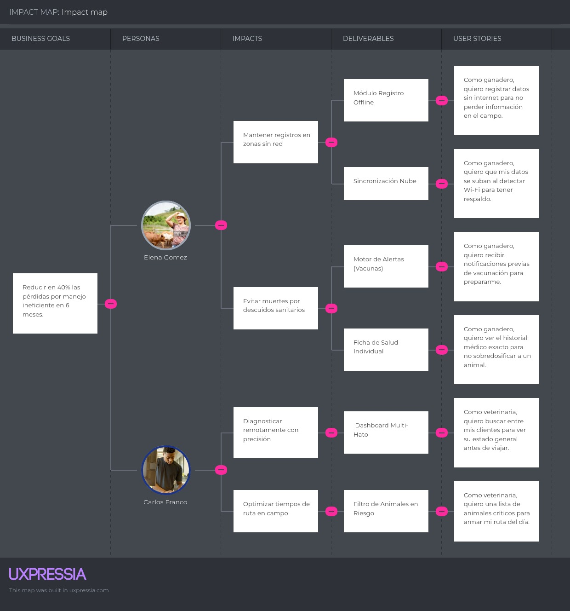

### 3.3. Product Backlog.

<table>
  <thead>
    <tr>
      <th> # ORDEN</th>
      <th>Epic / Story ID</th>
      <th>Título</th>
      <th>Descripción</th>
      <th>Story Points</th>
    </tr>
  </thead>
  <tbody>
      <tr>
      <td><b>1</b></td>
      <td><b>US25</b></td>
      <td>Landing inicio: Visualización de Propuesta de Valor</td>
      <td><b>Como</b> visitante, <b>quiero</b> visualizar la propuesta de valor principal de AniTec en la página de inicio, <b>para</b> comprender rápidamente qué solución ofrece la plataforma.</td>
      <td>2</td>
    </tr>
    <tr>
      <td><b>2</b></td>
      <td><b>US26</b></td>
      <td>Landing inicio: Exploración de Segmentos</td>
      <td><b>Como</b> visitante, <b>quiero</b> explorar los dos segmentos objetivo de AniTec en la página de inicio, <b>para</b> identificar si la plataforma es relevante para mi rol.</td>
      <td>3</td>
    </tr>
    <tr>
      <td><b>3</b></td>
      <td><b>US27</b></td>
      <td>Landing inicio: Visualización de Métricas e Impacto</td>
      <td><b>Como</b> visitante, <b>quiero</b> observar las métricas de impacto de AniTec, <b>para</b> confiar en la efectividad de la plataforma.</td>
      <td>3</td>
    </tr>
    <tr>
      <td><b>4</b></td>
      <td><b>US28</b></td>
      <td>Landing inicio: Navegación entre Secciones</td>
      <td><b>Como</b> visitante, <b>quiero</b> navegar entre las diferentes secciones de la landing page, <b>para</b> explorar todo el contenido de manera fluida.</td>
      <td>1</td>
    </tr>
    <tr>
      <td><b>5</b></td>
      <td><b>US29</b></td>
      <td>Landing inicio: Acceso a Precios y Planes</td>
      <td><b>Como</b> visitante interesado, <b>quiero</b> revisar los planes y precios de AniTec, <b>para</b> evaluar cuál plan se ajusta a mis necesidades.</td>
      <td>5</td>
    </tr>
    <tr>
      <td><b>6</b></td>
      <td><b>US30</b></td>
      <td>Landing nosotros: Información del Equipo</td>
      <td><b>Como</b> visitante, <b>quiero</b> conocer al equipo detrás de AniTec, <b>para</b> identificar a los creadores y su experiencia.</td>
      <td>2</td>
    </tr>
    <tr>
      <td><b>7</b></td>
      <td><b>US31</b></td>
      <td>Landing nosotros: Conocimiento del Proceso</td>
      <td><b>Como</b> visitante, <b>quiero</b> entender el proceso de desarrollo y tecnología utilizada, <b>para</b> evaluar la viabilidad técnica del proyecto.</td>
      <td>3</td>
    </tr>
    <tr>
      <td><b>8</b></td>
      <td><b>US32</b></td>
      <td>Landing nosotros: Contacto y Redes Sociales</td>
      <td><b>Como</b> visitante, <b>quiero</b> encontrar información de contacto y redes sociales, <b>para</b> poder comunicar consultas o sugerencias.</td>
      <td>2</td>
    </tr>
    <tr>
      <td><b>9</b></td>
      <td><b>US33</b></td>
      <td>Landing nosotros: Política de Privacidad</td>
      <td><b>Como</b> visitante, <b>quiero</b> revisar la política de privacidad y términos, <b>para</b> entender cómo se protegen mis datos.</td>
      <td>1</td>
    </tr>
    <tr>
      <td><b>10</b></td>
      <td><b>US34</b></td>
      <td>Landing nosotros: Navegación General</td>
      <td><b>Como</b> visitante, <b>quiero</b> navegar fluidamente por todas las secciones de About Us, <b>para</b> explorar el contenido completo de la página.</td>
      <td>1</td>
    </tr>
    <tr>
      <td><b>11</b></td>
      <td><b>US35</b></td>
      <td>Landing nosotros: Llamados a la Acción</td>
      <td><b>Como</b> visitante, <b>quiero</b> acceder a los CTAs de conversión en About Us, <b>para</b> iniciar mi registro o contactarme con el equipo.</td>
      <td>2</td>
    </tr>
    <tr>
      <td><b>12</b></td>
      <td><b>US36</b></td>
      <td>Landing ganaderos: Exploración de Contenido Específico</td>
      <td><b>Como</b> visitante del segmento de ganaderos, <b>quiero</b> explorar el contenido específico para ganaderos, <b>para</b> evaluar si AniTec se ajusta a mis necesidades.</td>
      <td>3</td>
    </tr>
    <tr>
      <td><b>13</b></td>
      <td><b>US37</b></td>
      <td>Landing ganaderos: Visualización de Testimonios</td>
      <td><b>Como</b> visitante del segmento de ganaderos, <b>quiero</b> leer testimonios de otros ganaderos, <b>para</b> evaluar la confianza en la plataforma.</td>
      <td>3</td>
    </tr>
    <tr>
      <td><b>14</b></td>
      <td><b>US38</b></td>
      <td>Landing ganaderos: Comparación de Métodos</td>
      <td><b>Como</b> visitante del segmento de ganaderos, <b>quiero</b> visualizar la comparación entre el método tradicional y AniTec, <b>para</b> entender los beneficios de digitalizar.</td>
      <td>5</td>
    </tr>
    <tr>
      <td><b>15</b></td>
      <td><b>US39</b></td>
      <td>Landing ganaderos: Llamado a la Acción Final</td>
      <td><b>Como</b> visitante del segmento de ganaderos, <b>quiero</b> acceder al CTA final de la página, <b>para</b> iniciar mi registro o prueba gratuita.</td>
      <td>1</td>
    </tr>
    <tr>
      <td><b>16</b></td>
      <td><b>US40</b></td>
      <td>Landing ganaderos: Información de Precios</td>
      <td><b>Como</b> visitante del segmento de ganaderos, <b>quiero</b> acceder a la información de precios desde la página, <b>para</b> evaluar los planes disponibles.</td>
      <td>2</td>
    </tr>
    <tr>
      <td><b>17</b></td>
      <td><b>US41</b></td>
      <td>Landing ganaderos: Navegación entre páginas</td>
      <td><b>Como</b> visitante del segmento de ganaderos, <b>quiero</b> navegar a otras páginas desde la página de ganaderos, <b>para</b> explorar contenido adicional.</td>
      <td>1</td>
    </tr>
    <tr>
      <td><b>18</b></td>
      <td><b>US42</b></td>
      <td>Landing veterinarios: Contenido Específico del Segmento</td>
      <td><b>Como</b> visitante del segmento de veterinarios, <b>quiero</b> explorar el contenido diseñado para veterinarios, <b>para</b> evaluar si AniTec se adapta a mi práctica profesional.</td>
      <td>3</td>
    </tr>
    <tr>
      <td><b>19</b></td>
      <td><b>US43</b></td>
      <td>Landing veterinarios: Casos de Uso</td>
      <td><b>Como</b> visitante del segmento de veterinarios, <b>quiero</b> leer los casos de uso específicos de la herramienta, <b>para</b> comprender cómo AniTec facilita mi trabajo diario.</td>
      <td>3</td>
    </tr>
    <tr>
      <td><b>20</b></td>
      <td><b>US44</b></td>
      <td>Landing veterinarios: Testimonios del Segmento</td>
      <td><b>Como</b> visitante del segmento de veterinarios, <b>quiero</b> leer testimonios de otros veterinarios, <b>para</b> evaluar la confiabilidad de la plataforma.</td>
      <td>2</td>
    </tr>
    <tr>
      <td><b>21</b></td>
      <td><b>US45</b></td>
      <td>Landing veterinarios: Llamado a la Acción</td>
      <td><b>Como</b> visitante del segmento de veterinarios, <b>quiero</b> acceder a los CTAs para iniciar mi uso de AniTec, <b>para</b> comenzar a utilizar la plataforma en mi práctica profesional.</td>
      <td>1</td>
    </tr>
    <tr>
      <td><b>22</b></td>
      <td><b>US46</b></td>
      <td>Landing veterinarios: Acceso a Precios</td>
      <td><b>Como</b> visitante del segmento de veterinarios, <b>quiero</b> revisar los planes y precios desde la página de veterinarios, <b>para</b> evaluar la inversión necesaria.</td>
      <td>2</td>
    </tr>
    <tr>
      <td><b>23</b></td>
      <td><b>US47</b></td>
      <td>Landing veterinarios: Navegación Entre páginas</td>
      <td><b>Como</b> visitante del segmento de veterinarios, <b>quiero</b> navegar a otras páginas desde la página de veterinarios, <b>para</b> explorar el contenido completo del sitio.</td>
      <td>1</td>
    </tr>
    <tr>
      <td><b>24</b></td>
      <td><b>US01</b></td>
      <td>Registro de Nueva Cuenta</td>
      <td><b>Como</b> nuevo usuario, <b>quiero</b> registrar mis datos y crear credenciales, <b>para</b> obtener una cuenta que me permita gestionar mi hato ganadero.</td>
      <td>8</td>
    </tr>
    <tr>
      <td><b>25</b></td>
      <td><b>US02</b></td>
      <td>Inicio de Sesión</td>
      <td><b>Como</b> usuario registrado, <b>quiero</b> autenticarme en la plataforma, <b>para</b> acceder a mi información de forma segura.</td>
      <td>5</td>
    </tr>
    <tr>
      <td><b>26</b></td>
      <td><b>US03</b></td>
      <td>Recuperación de Contraseña</td>
      <td><b>Como</b> usuario registrado, <b>quiero</b> solicitar un restablecimiento de mi clave, <b>para</b> recuperar el acceso a mi cuenta si la olvido.</td>
      <td>5</td>
    </tr>
    <tr>
      <td><b>27</b></td>
      <td><b>US04</b></td>
      <td>Ingreso de Nuevo Animal</td>
      <td><b>Como</b> ganadero, <b>quiero</b> registrar un animal con su información taxonómica y biográfica, <b>para</b> ingresarlo a mi base de datos digital.</td>
      <td>5</td>
    </tr>
    <tr>
      <td><b>28</b></td>
      <td><b>US05</b></td>
      <td>Edición de Datos del Animal</td>
      <td><b>Como</b> ganadero, <b>quiero</b> modificar los datos de un animal existente, <b>para</b> mantener su información actualizada.</td>
      <td>3</td>
    </tr>
    <tr>
      <td><b>29</b></td>
      <td><b>US06</b></td>
      <td>Baja / Eliminación de Animal</td>
      <td><b>Como</b> ganadero, <b>quiero</b> dar de baja a un animal del sistema, <b>para</b> reflejar ventas o decesos en mi inventario real.</td>
      <td>2</td>
    </tr>
    <tr>
      <td><b>30</b></td>
      <td><b>US07</b></td>
      <td>Listado de Animales</td>
      <td><b>Como</b> ganadero, <b>quiero</b> ver una lista de todos mis animales, <b>para</b> tener una visión general de mi inventario.</td>
      <td>3</td>
    </tr>
    <tr>
      <td><b>31</b></td>
      <td><b>US08</b></td>
      <td>Búsqueda y Filtrado</td>
      <td><b>Como</b> ganadero, <b>quiero</b> buscar animales por ID o aplicar filtros, <b>para</b> encontrar especímenes específicos de forma rápida.</td>
      <td>5</td>
    </tr>
    <tr>
      <td><b>32</b></td>
      <td><b>US09</b></td>
      <td>Ficha Detallada del Animal</td>
      <td><b>Como</b> ganadero, <b>quiero</b> abrir el perfil completo de un animal, <b>para</b> revisar todos sus atributos, estado reproductivo y documentos.</td>
      <td>3</td>
    </tr>
    <tr>
      <td><b>33</b></td>
      <td><b>US10</b></td>
      <td>Visualización de Próximos Eventos</td>
      <td><b>Como</b> ganadero, <b>quiero</b> ver eventos programados, <b>para</b> anticipar campañas de vacunación o tareas sanitarias.</td>
      <td>3</td>
    </tr>
    <tr>
      <td><b>34</b></td>
      <td><b>US11</b></td>
      <td>Registro de nuevo Evento</td>
      <td><b>Como</b> ganadero, <b>quiero</b> registrar un nuevo evento sanitario, <b>para</b> planificar y dar seguimiento a las actividades de salud.</td>
      <td>5</td>
    </tr>
    <tr>
      <td><b>35</b></td>
      <td><b>US12</b></td>
      <td>Búsqueda y Selección para Historial</td>
      <td><b>Como</b> veterinario o ganadero, <b>quiero</b> filtrar animales por especie, edad o sexo, <b>para</b> localizar el animal cuyo historial clínico deseo consultar.</td>
      <td>3</td>
    </tr>
    <tr>
      <td><b>36</b></td>
      <td><b>US13</b></td>
      <td>Consulta de Historial Clínico</td>
      <td><b>Como</b> veterinario o ganadero, <b>quiero</b> visualizar el historial clínico de un animal, <b>para</b> evaluar su evolución sanitaria.</td>
      <td>3</td>
    </tr>
    <tr>
      <td><b>37</b></td>
      <td><b>US14</b></td>
      <td>Registro de Visita Médica</td>
      <td><b>Como</b> veterinario o ganadero, <b>quiero</b> registrar una nueva visita médica, <b>para</b> documentar la atención sanitaria de un animal.</td>
      <td>5</td>
    </tr>
    <tr>
      <td><b>38</b></td>
      <td><b>US15</b></td>
      <td>Edición de Visita Médica</td>
      <td><b>Como</b> veterinario o ganadero, <b>quiero</b> editar una visita médica, <b>para</b> corregir o actualizar la información.</td>
      <td>3</td>
    </tr>
    <tr>
      <td><b>39</b></td>
      <td><b>US16</b></td>
      <td>Eliminación de Visita Médica</td>
      <td><b>Como</b> veterinario o ganadero, <b>quiero</b> eliminar una visita médica registrada, <b>para</b> mantener un historial clínico preciso.</td>
      <td>2</td>
    </tr>
    <tr>
      <td><b>40</b></td>
      <td><b>US17</b></td>
      <td>Registro de Ingresos Diarios</td>
      <td><b>Como</b> ganadero, <b>quiero</b> añadir registros de ingresos económicos, <b>para</b> documentar las ganancias por ventas o servicios.</td>
      <td>5</td>
    </tr>
    <tr>
      <td><b>41</b></td>
      <td><b>US18</b></td>
      <td>Registro de Egresos Diarios</td>
      <td><b>Como</b> ganadero, <b>quiero</b> documentar los gastos operativos, <b>para</b> tener control sobre las salidas de dinero de la finca.</td>
      <td>5</td>
    </tr>
    <tr>
      <td><b>42</b></td>
      <td><b>US19</b></td>
      <td>Análisis Gráfico de Ganancia</td>
      <td><b>Como</b> ganadero, <b>quiero</b> visualizar el comportamiento financiero en gráficas, <b>para</b> entender la rentabilidad a lo largo del tiempo.</td>
      <td>8</td>
    </tr>
    <tr>
      <td><b>43</b></td>
      <td><b>US20</b></td>
      <td>Filtros y Total de Hato</td>
      <td><b>Como</b> ganadero, <b>quiero</b> visualizar el total de animales según filtros aplicados, <b>para</b> conocer el tamaño de mi inventario bajo criterios específicos.</td>
      <td>3</td>
    </tr>
    <tr>
      <td><b>44</b></td>
      <td><b>US21</b></td>
      <td>Distribución del Hato por Sexo y Especie</td>
      <td><b>Como</b> ganadero, <b>quiero</b> visualizar la distribución de mi ganado por especie y sexo, <b>para</b> entender su composición demográfica.</td>
      <td>5</td>
    </tr>
    <tr>
      <td><b>45</b></td>
      <td><b>US22</b></td>
      <td>Panel de Alertas Clasificadas</td>
      <td><b>Como</b> ganadero, <b>quiero</b> visualizar un listado de alertas categorizadas por nivel de severidad (críticas, medias, informativas), <b>para</b> detectar anomalías como alta mortalidad o desbalances y tomar acciones preventivas.</td>
      <td>8</td>
    </tr>
    <tr>
      <td><b>46</b></td>
      <td><b>US23</b></td>
      <td>Tendencias Históricas Poblacionales</td>
      <td><b>Como</b> ganadero, <b>quiero</b> analizar una gráfica de líneas sobre la tendencia total del ganado a lo largo del tiempo, <b>para</b> evaluar objetivamente el crecimiento o decrecimiento de mi producción.</td>
      <td>8</td>
    </tr>
    <tr>
      <td><b>47</b></td>
      <td><b>US24</b></td>
      <td>Notificaciones Globales</td>
      <td><b>Como</b> usuario del sistema, <b>quiero</b> visualizar un panel de notificaciones global a través del icono de campana, <b>para</b> enterarme inmediatamente de las alertas registradas sin importar en qué sección de la plataforma me encuentre navegando.</td>
      <td>5</td>
    </tr>

  </tbody>
</table>

## Capítulo IV: Product Design
### 4.1. Style Guidelines

Las directrices de estilo establecen los principios visuales y de diseño que deben seguirse al desarrollar la interfaz de usuario (UI) de AniTec. El objetivo es crear una experiencia digital clara, accesible e intuitiva que responda a las necesidades de pequeños y medianos ganaderos en Latinoamérica.

El concepto visual se centra en transmitir confianza, simplicidad y eficiencia rural. A través del uso de una paleta de colores naturales (verdes, marrones suaves y tonos tierra), combinada con tipografías limpias y legibles, AniTec busca generar una atmósfera amigable y funcional que conecte con el entorno productivo del usuario.

El diseño debe priorizar la facilidad de uso, incluso para personas con poca experiencia tecnológica, reforzando así la inclusión digital en el campo. La interfaz debe permitir una navegación fluida desde cualquier dispositivo, y ofrecer información clara y accesible para fomentar la toma de decisiones informadas. Este enfoque visual fortalece la misión de AniTec de modernizar la gestión ganadera con herramientas tecnológicas simples pero poderosas.

#### 4.1.1. General Style Guidelines

Los colores resultan ser fundamental para transmitir la identidad visual de la marca. En este sector, la paleta cromática seleccionada fue inspirada en la naturaleza y el entorno rural, utilizando tonos tierra, verdes orgánicos y acentos neutros. Colores que reflejan sostenibilidad, confianza y cercanía con el campo.

Además, la selección de colores debe estar alineada con los valores de innovación, simplicidad y eficiencia, transmitiendo al usuario una sensación de claridad y profesionalismo sin perder la conexión con el entorno agrícola.

**Colores principales:**

| Código HEX | Color                                                               | Uso                                                     |
|------------|---------------------------------------------------------------------|---------------------------------------------------------|
| #925930    |  | Color primario - botones principales, textos destacados |
| #79B267    |  | Color secundario - CTAs positivos, iconos de éxito      |
| #F5F0E6    |  | Color de fondo principal                                |

**Colores secundarios:**

| Código HEX | Color                                                               | Uso                            |
|------------|---------------------------------------------------------------------|--------------------------------|
| #A3794F    |  | Acentos, bordes sutiles        |
| #A3C4A8    |  | Fondos de tarjetas, highlights |
| #D1BFA5    |  | Fondos alternativos            |

**Typography:**

La tipografía Poppins aporta una estética moderna, limpia y accesible que conecta tanto con el origen humano del campo como con la eficiencia del mundo digital. Poppins, con su estilo geométrico, pero con un sutil toque humano, transmite cercanía y adaptabilidad, ideal para un sector que valora la conexión entre la tradición agrícola y la innovación tecnológica.

Esta tipografía comunica una marca que se dedica al agro digital con un enfoque en la inclusión, sostenibilidad e innovación, logrando un balance perfecto entre raíces locales y visión global.

  

    <b>Grafico</b>: Estilos de Poppins
  

  
  

    <i><b>Fuente</b>: Elaboración propia.</i>
  

**Icons:**

Se ha seleccionado el set de Bootstrap Icons. Este set, disponible en Bootstrap Icons, ofrece una estética limpia, arredondada y moderna, ideal para reflejar los valores de accesibilidad, innovación y cercanía del sector agropecuario digital.

Los íconos utilizados mantienen una línea uniforme y amigable, facilitando la navegación y mejorando la experiencia de usuario.

  

    <b>Grafico</b>: Bootstrap Icons
  

  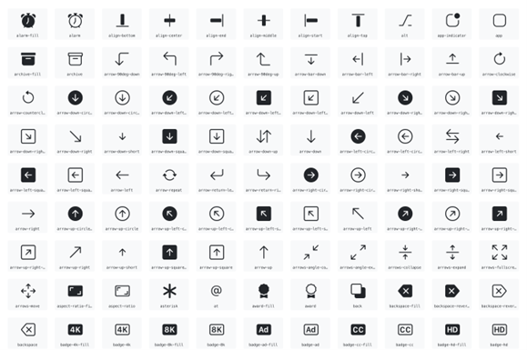
  

    <i><b>Fuente</b>: Fonts-online.reu</i>
  

#### 4.1.2. Web Style Guidelines

El Web Style Guide de AniTec nos ayuda a mostrar una identidad visual coherente y accesible en toda la plataforma. Definimos colores, tipografías y elementos de diseño inspirados en el entorno rural para transmitir confianza, tecnología cercana y facilidad de uso.

Nuestra paleta refleja valores como sostenibilidad y cercanía, mientras que las tipografías priorizan la legibilidad. Esta guía fortalece la presencia visual de AniTec y mejora la experiencia del usuario.

Se incluyen imágenes que ilustran los principales lineamientos: colores, fuentes, espaciado y componentes clave, garantizando una interfaz clara y funcional.

### 4.2. Information Architecture

En esta sección, se han aplicado sistemas de organización adaptados a las necesidades de los pequeños y medianos ganaderos, facilitando el acceso y comprensión de la información ganadera. La organización visual del contenido ha sido implementada de las siguientes formas:

#### 4.2.1. Organization Systems

- **Jerárquica (visual hierarchy):** Para destacar módulos clave como el registro de animales, alertas sanitarias y reportes económicos, asegurando que los usuarios identifiquen rápidamente las funciones más relevantes para su gestión diaria.

- **Organización secuencial (step-by-step):** Aplicada en procesos que requieren seguimiento cronológico, como el registro de eventos sanitarios, partos o tratamientos, permitiendo al usuario llevar un control ordenado y lógico del historial del ganado.

Además, se categorizó el contenido según las funcionalidades de la plataforma: módulos de gestión (sanidad, reproducción, economía), tipo de usuario (ganadero, técnico, asociación), y acceso a recursos educativos (videos, guías, alertas). Estas estructuras permiten una navegación intuitiva y któ adaptas al entorno rural.

#### 4.2.2. Labeling Systems

Se han definido cuidadosamente los sistemas de etiquetado y categorización para asegurar que los usuarios naveguen de forma intuitiva y eficiente en la plataforma:

- **Jerarquía visual:** Aplicada en la estructura de módulos clave como "Sanidad", "Reproducción" y "Economía", destacando primero los datos más relevantes. Esto permite a los usuarios tomar decisiones informadas rápidamente.

- **Organización secuencial:** Utilizada en procesos como el registro de eventos ganaderos (partos, tratamientos, vacunaciones), donde los pasos siguen una lógica temporal clara y guiada. Esto ayuda a evitar errores en la carga de datos y mejora la experiencia del usuario.

- **Organización matricial:** Empleada en los paneles de reportes y análisis, donde los usuarios pueden comparar indicadores entre animales, hatos o periodos de tiempo, con etiquetas claras que facilitan la interpretación visual.

Estos esquemas de etiquetado se han diseñado con base en el lenguaje y jerga ganadera, utilizando términos familiares como "Peso al destete" o "Última monta", para que cualquier usuario, independientemente de su nivel técnico, pueda comprender y usar la plataforma sin dificultad.

#### 4.2.3. SEO Tags and Meta Tags

**Landing Page:**

- **Title:** AniTec - Plataforma Digital para la Gestión del Ganado
- **Description:** AniTec es una plataforma accesible que permite a los ganaderos pequeños y medianos gestionar la salud, reproducción, y productividad de su ganado, optimizando procesos con tecnología innovadora.
- **Keywords:** gestión ganadera, plataforma ganaderos, AniTec, trazabilidad ganadera, ganadería digital, salud animal, control de ganado, plataforma para ganaderos, tecnología rural, organizador de ganado
- **Author:** AniTec

**Application Web:**

- **Title:** AniTec - Gestión Completa del Ganado para Pequeños y Medianos Productores
- **Description:** Accede a AniTec, la plataforma web que digitaliza la gestión del ganado, con módulos de salud, productividad y trazabilidad para optimizar los procesos ganaderos.
- **Keywords:** plataforma ganadera, software para ganaderos, AniTec, gestión de ganado, salud animal, trazabilidad, control de ganado, aplicaciones para ganaderos, ganadería inteligente, ganadería digital
- **Author:** AniTec

#### 4.2.4. Searching Systems

El sistema de búsqueda en AniTec debe ser intuitivo y eficiente para que los usuarios puedan encontrar rápidamente la información relacionada con su ganado. Las opciones de búsqueda y los filtros disponibles:

- **Barra de búsqueda por ganado:** Los usuarios podrán buscar información sobre un animal específico usando filtros como número de identificación, raza, edad, fecha de nacimiento, estado de salud, entre otros.
- **Barra de búsqueda por evento:** Los usuarios podrán buscar eventos específicos relacionados con el ganado, tales como vacunaciones, tratamientos, partos, inspecciones sanitarias, entre otros.
- **Filtro por categorías:** Los usuarios podrán filtrar por diferentes módulos como sanidad, reproducción o economía, mejorando la accesibilidad a la información relevante.
- **Opciones de Ordenación:** Los resultados se pueden ordenar por criterios como relevancia, fecha, o nombre.

#### 4.2.5. Navigation Systems

Los sistemas de navegación deben estar diseñados para ser intuitivos, adaptados al contexto rural de los usuarios y fáciles de usar, incluso para aquellos con poca experiencia en tecnología.

**Menú Principal:**

- Inicio: Acceso rápido a la página principal con propuesta de valor
- Características: Sección que detalla las funcionalidades principales
- Cómo Funciona: Explicación paso a paso del proceso
- Testimonios: Referencias de usuarios reales
- Precios: Planes y costos de la plataforma
- Contacto: Información de contacto y soporte

**Menú Secundario:**

- FAQ: Preguntas frecuentes
- Soporte: Acceso a ayuda técnica
- Términos: Legal y políticas

**Navegación por Categorías:**

Los usuarios podrán navegar por categorías de ganado, tipos de eventos o fechas, todo con una jerarquía visual clara que facilite el acceso a la información relevante. Este diseño asegura que AniTec sea accesible y fácil de usar para los ganaderos, maximizando su eficiencia en el uso de la plataforma.

### 4.3. Landing Page UI Design

#### 4.3.1. Landing Page Wireframe

El wireframe de la landing page de AniTec actúa como una guía visual preliminar que organiza los elementos esenciales de la página sin entrar en detalles gráficos. Este esquema muestra la distribución de secciones clave como el encabezado con el logo y menú de navegación, una propuesta de valor centrada en la digitalización ganadera, testimonios de usuarios reales del campo, y llamadas a la acción destacadas que invitan a conocer la aplicación. El objetivo es garantizar una experiencia intuitiva para el visitante y facilitar su conversión en usuario activo de la plataforma.

Enlace para acceder al [diseño del wireframe de AniTec en Figma](https://www.figma.com/design/WbTy5Gd0VpFbXolfe3OQ0C/ExamenIHCJorgeAyala?node-id=5-678&t=Erdbu1dwId9dtDbq-1)

El wireframe se caracteriza por:
- Estructura en blanco y negro con bordes negros
- Placeholder (X) en lugar de imágenes e iconos
- Texto genérico (Lorem ipsum) para contenido
- Fondos grises para diferenciar secciones
- Diseño responsive para móvil y desktop

  

    <b>Grafico</b>: AniTec Wireframe
  

  
  

    <i><b>Fuente</b>: Elaboración propia.</i>
  

#### 4.3.2. Landing Page Mock-up

El mock-up de la landing page de AniTec representa una versión detallada y cercana al diseño final, integrando colores, tipografías e imágenes que reflejan la identidad visual de la plataforma. Este diseño ofrece una vista realista de cómo se presentará la página a los usuarios, destacando una estética moderna, accesible y alineada con el sector agroindustrial ganadero. Además, refuerza la importancia de mantener coherencia visual y claridad en la propuesta de valor, transmitiendo confianza, profesionalismo y compromiso con la innovación tecnológica en el campo.

Enlace para acceder al [diseño del mock-up de AniTec en Figma](https://www.figma.com/design/WbTy5Gd0VpFbXolfe3OQ0C/ExamenIHCJorgeAyala?node-id=0-1&t=Erdbu1dwId9dtDbq-1)

El mock-up incluye:
- Paleta de colores completa (verdes, marrones, crema)
- Tipografía Poppins aplicada
- Imágenes reales del producto
- Iconos de Bootstrap Icons
- Diseño final con detalles visuales
- Animaciones y transiciones
- Versión responsive completa

  

    <b>Grafico</b>: AniTec Mock-up
  

  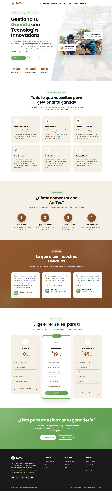
  

    <i><b>Fuente</b>: Elaboración propia.</i>
  

### 4.4. Web Applications UX/UI Design.

#### 4.4.1. Web Applications Wireframes.
Los wireframes de la aplicación web de AniTec ilustran la estructura y distribución de las principales pantallas dirigidas al ámbito agroindustrial, con énfasis en el sector ganadero. Estos bocetos permiten visualizar la organización de los componentes de la interfaz y el flujo de navegación entre las distintas secciones, sirviendo como referencia para el diseño definitivo. De este modo, se asegura una experiencia de usuario clara, ágil y alineada con las necesidades reales de los productores. Fueron elaborados utilizando Figma. Enlace para acceder a los wireframes: [Web Application Wireframes](https://www.figma.com/design/9RliVy9r8aEzyfyEof3DGr/Untitled?node-id=0-1&t=q2mM6e2YoQyJLZaK-1)

Pantalla de login en la aplicación

    <i><b>Fuente</b>: Elaboración propia.</i>
  

Pantalla para registrarse en la aplicación

    <i><b>Fuente</b>: Elaboración propia.</i>

Pantalla para escoger el plan

    <i><b>Fuente</b>: Elaboración propia.</i>

Pantalla de inicio dentro de la aplicación

    <i><b>Fuente</b>: Elaboración propia.</i>

Pantalla para consultar mayor detalle sobre un animal

    <i><b>Fuente</b>: Elaboración propia.</i>

Pantalla para eliminar la información registrada sobre un animal

    <i><b>Fuente</b>: Elaboración propia.</i>

Pantalla para añadir un nuevo animal

    <i><b>Fuente</b>: Elaboración propia.</i>

Sección de evento locales registrados

    <i><b>Fuente</b>: Elaboración propia.</i>

Pantalla para registrar un nuevo evento

    <i><b>Fuente</b>: Elaboración propia.</i>

Sección para consultar el historial Clínico de los animales

    <i><b>Fuente</b>: Elaboración propia.</i>

Pantalla para consultar el historial Clínico de un animal en específico

    <i><b>Fuente</b>: Elaboración propia.</i>

Pantalla para ver el detalle de un informe médico de un animal en específico

    <i><b>Fuente</b>: Elaboración propia.</i>

Pantalla para agregar un informe médico a un animal en específico

    <i><b>Fuente</b>: Elaboración propia.</i>

Pantalla para escoger un informe médico para editar de un animal registrado

    <i><b>Fuente</b>: Elaboración propia.</i>

Pantalla para editar un informe médico seleccionado registrado para un animal

    <i><b>Fuente</b>: Elaboración propia.</i>

Mensaje para escoger el informe del historial clínico a eliminar de un animal

    <i><b>Fuente</b>: Elaboración propia.</i>

Sección que registra ingresos y egresos de los ganaderos 

    <i><b>Fuente</b>: Elaboración propia.</i>

Dashboard donde se presentan los reportes generados

    <i><b>Fuente</b>: Elaboración propia.</i>

#### 4.4.2. Web Applications Wireflow Diagrams.
En esta sección se presentan los Wireflows para cada objetivo del usuario. Para ello se consideró los User Persona correspondientes. Cada diagrama muestra el flujo de interacción. Enlace para acceder a los wireflows en Figma: [Web Application Wireflows](https://www.figma.com/design/9RliVy9r8aEzyfyEof3DGr/Untitled?node-id=44-1275&t=fdPLEZQXM0PqMAv3-1)

- **Registro e Inicio del Ganadero:** El presente wireflow corresponde al flujo de interacción del usuario ganadero desde el registro, y selección del plan de la cuenta, o inicio de sesión hasta el acceso a la aplicación.

    <i><b>Fuente</b>: Elaboración propia.</i>

- **Registro de animales:** El presente user flow corresponde con la agregación, eliminación, actualización, y consulta del detalle del ganado. 

    <i><b>Fuente</b>: Elaboración propia.</i>

- **Registro de eventos:** El presente user flow corresponde con la agregación y consulta de eventos locales registrados por el usuario y/o sistema. 

    <i><b>Fuente</b>: Elaboración propia.</i>

- **Registro de visitas médicas por animal:** El presente user flow corresponde a la gestión de las visitas médicas de un animal específico, mostrando un listado completo de sus atenciones veterinarias con información relevante. Desde este apartado, el usuario puede registrar nuevas visitas médicas, editar registros existentes para actualizar información y eliminar aquellos que ya no sean necesarios. 

    <i><b>Fuente</b>: Elaboración propia.</i>

- **Control monetario del ganadero:** Esta vista permite al ganadero registrar y consultar sus ingresos y egresos de manera diaria, ofreciendo un control financiero claro y organizado. Además, presenta un resumen de las ganancias netas mensuales mediante un gráfico que proporciona una visión anual, junto con el detalle acumulado de ingresos y egresos del presente mes.  

    <i><b>Fuente</b>: Elaboración propia.</i>

**Estadísticas del ganado:** Esta vista permite al ganadero analizar información clave sobre su producción mediante indicadores y gráficos dinámicos. Se presentan métricas como la cantidad total de animales, distribución por especie y sexo, así como su evolución en el tiempo. 

    <i><b>Fuente</b>: Elaboración propia.</i>

#### 4.4.3. Web Applications Mock-ups.
En esta sección se exponen y analizan los mockups de la aplicación web AgroDigital, diseñada para el sector ganadero. En ellos se aprecia la implementación de principios fundamentales de diseño visual, accesibilidad, arquitectura de la información y del Design System definido para el producto. Cada mockup muestra cómo estos elementos se integran en una interfaz orientada a optimizar la trazabilidad, el control sanitario y la gestión eficiente del ganado. Asimismo, se incluye el enlace para acceder al contenido. [Enlace al figma](https://www.figma.com/design/9RliVy9r8aEzyfyEof3DGr/Untitled?node-id=42-837&t=fdPLEZQXM0PqMAv3-1)

 

Pantalla de login en la aplicación

 

    <i><b>Fuente</b>: Elaboración propia.</i>

Pantalla para registrarse en la aplicación

    <i><b>Fuente</b>: Elaboración propia.</i>

Pantalla para escoger el plan

    <i><b>Fuente</b>: Elaboración propia.</i>

Pantalla de inicio dentro de la aplicación

    <i><b>Fuente</b>: Elaboración propia.</i>

Pantalla para consultar mayor detalle sobre un animal

    <i><b>Fuente</b>: Elaboración propia.</i>

Pantalla para eliminar la información registrada sobre un animal

    <i><b>Fuente</b>: Elaboración propia.</i>

Pantalla para añadir un nuevo animal

    <i><b>Fuente</b>: Elaboración propia.</i>

Sección de evento locales registrados

    <i><b>Fuente</b>: Elaboración propia.</i>

Pantalla para registrar un nuevo evento

    <i><b>Fuente</b>: Elaboración propia.</i>

Pantalla para consultar el historial Clínico de un animal en específico

    <i><b>Fuente</b>: Elaboración propia.</i>

Pantalla para ver las visitas médicas registradas para un animal en específico

    <i><b>Fuente</b>: Elaboración propia.</i>

Pantalla para ver el detalle de un informe médico de un animal en específico

    <i><b>Fuente</b>: Elaboración propia.</i>

Pantalla para agregar un informe médico a un animal en específico

    <i><b>Fuente</b>: Elaboración propia.</i>

Pantalla para escoger un informe médico para editar de un animal registrado

    <i><b>Fuente</b>: Elaboración propia.</i>

Pantalla para editar un informe médico seleccionado registrado para un animal

    <i><b>Fuente</b>: Elaboración propia.</i>

Mensaje para escoger el informe del historial clínico a eliminar de un animal

    <i><b>Fuente</b>: Elaboración propia.</i>

Sección que registra ingresos y egresos de los ganaderos 

    <i><b>Fuente</b>: Elaboración propia.</i>

Dashboard donde se presentan los reportes generados

    <i><b>Fuente</b>: Elaboración propia.</i>

#### 4.4.4. Web Applications User Flow Diagrams.
En esta parte se detallan los diagramas de flujo de usuario, donde se describen las rutas posibles dentro de la aplicación y las decisiones que puede tomar el usuario. Estos diagramas garantizan una navegación clara y alineada con los objetivos funcionales.

### 4.5. Web Applications Prototyping.

| Evidencia |
|-|
| |
| Enlace |
| https://1drv.ms/v/c/fa8e2d4d5f95cf55/IQCahhrF7amZTIeIIL2qif1SAZwhS2QghQaWCuODMLn1hes?e=sXJwXw |

### 4.6. Domain-Driven Software Architecture.

El Domain-Driven Design (DDD) tiene como objetivo central establecer un entendimiento mutuo sobre el dominio del negocio, promoviendo la sinergia entre el equipo técnico y los expertos del área a través de un lenguaje ubicuo. Este marco de trabajo trasciende el vocabulario técnico al integrar patrones estratégicos, metodologías de diseño y diagramas arquitectónicos que garantizan que el software evolucione en total sintonía con las prioridades empresariales. De esta forma, se logra una solución técnica robusta, profundamente ligada al conocimiento del negocio y capaz de resolver problemas complejos de manera eficiente.

Para ilustrar la aplicación práctica de estos conceptos en el proyecto, se detallan a continuación los primeros tres niveles del modelo C4, implementados mediante Structurizr, los cuales brindan una visión clara y estructurada del sistema en desarrollo.

#### 4.6.1. Design Level EventStorming

**Paso 4:** Pivotal Events, el equipo busca eventos de negocio significativos que marquen un cambio de fase o una transición importante en el contexto del proceso. Estos se identifican trazando una barra vertical en la superficie de modelado para separar los flujos anteriores y posteriores al evento crucial. Identificar estos hitos es fundamental, ya que funcionan como indicadores clave para definir los límites de los posibles Bounded Contexts dentro del dominio.

  

    <b>Step 4: Pivotal Events</b>
  

  
  

    <i><b>Fuente</b>: Elaboracion Propia</i>
  

**Paso 5:** Commands, el enfoque cambia de lo que ya sucedió a lo que desencadena esos eventos, introduciendo los commands (comandos) formulados en modo imperativo. Estos se representan con notas adhesivas de color azul claro y se colocan antes de los eventos que producen; además, si un usuario específico ejecuta la acción, se añade una pequeña nota amarilla para representar al actor o rol del negocio.

  

    <b>Step 5: Commands</b>
  

  
  

    <i><b>Fuente</b>: Elaboracion Propia</i>
  

**Paso 6:** Policies, se identifican las automation policies (políticas de automatización), que son escenarios donde un evento de dominio activa automáticamente la ejecución de un comando sin intervención directa de un actor. Estas reglas se representan con notas adhesivas de color púrpura que conectan el evento con el comando resultante, permitiendo especificar criterios de decisión o condiciones lógicas necesarias para que la acción se dispare.

  

    <b>Step 6: Policys </b>
  

  
  

    <i><b>Fuente</b>: Elaboracion Propia</i>
  

**Paso 7:** Read Models, se introducen las vistas de datos o fuentes de información que un actor necesita consultar para tomar la decisión de ejecutar un comando. Estos se representan con notas adhesivas verdes y pueden ser pantallas del sistema, informes o notificaciones que sirven de base para la acción del usuario. En la superficie de modelado, los modelos de lectura se posicionan estratégicamente justo antes de los comandos para ilustrar el flujo de información hacia la toma de decisiones.

  

    <b>Step 7: Read Models </b>
  

  
  

    <i><b>Fuente</b>: Elaboracion Propia</i>
  

**Paso 8:** External Systems, el modelo se aumenta con sistemas externos, definidos como cualquier sistema ajeno al dominio que se está explorando. Estos se representan con notas adhesivas rosas y pueden actuar de dos formas: activando la ejecución de comandos (entrada) o recibiendo notificaciones sobre eventos de dominio (salida). Al finalizar este paso, se debe verificar que todos los comandos del modelo sean ejecutados por actores, activados por políticas o llamados por estos sistemas externos.

  

    <b>Step 8: External Systems</b>
  

  
  

    <i><b>Fuente</b>: Elaboracion Propia</i>
  

**Paso 9:** Aggregates, los participantes organizan los conceptos relacionados en Aggregates (Agregados), que actúan como las unidades lógicas que reciben los comandos y producen los eventos resultantes. Estos se representan con notas adhesivas amarillas grandes, posicionándose físicamente en medio del flujo: con los comandos a su izquierda y los eventos a su derecha. Esta etapa es crucial para definir la consistencia y las fronteras de los datos dentro del modelo de dominio.

  

    <b>Step 9: Aggregates</b>
  

  
  

    <i><b>Fuente</b>: Elaboracion Propia</i>
  

**Paso 10:** Bounded Contexts, se concluye la sesión de EventStorming buscando grupos de agregados que estén estrechamente relacionados entre sí. Esta relación puede darse porque los agregados representan funcionalidades similares o porque están acoplados mediante políticas de automatización. Estos grupos identificados forman los límites naturales para los Bounded Contexts (contextos delimitados), definiendo así las fronteras lógicas y técnicas de los diferentes módulos del sistema dentro del dominio de negocio.

  

    <b>Step 10 - bounded context canvas</b>
  

  
  

    <i><b>Fuente</b>: Elaboracion Propia</i>
  

  

    <b>Step 10 - bounded context canvas </b>
  

  
  

    <i><b>Fuente</b>: Elaboracion Propia</i>
  

  

    <b>Step 10 - bounded context canvas</b>
  

  
  

    <i><b>Fuente</b>: Elaboracion Propia</i>
  

  

    <b>Step 10 - bounded context canvas</b>
  

  
  

    <i><b>Fuente</b>: Elaboracion Propia</i>
  

Enlace para acceder al [EventStorming](https://miro.com/welcomeonboard/T1gvUmlKRzZiWjFQV0VFK1VsL1VDbFN1WElQbzV3WjVVd2NYR1d3NVRSdVFOUFd4ZVlIbk4rSmxBN1J3UUtjQjg3cHlKK2VKZ3cwVXB5ZXJoK0MyNmxud0lrejllQVpDT1AzczYyS0t6YWtZTk9xSS9JK05WR2x1cVZvYldTbzRnbHpza3F6REdEcmNpNEFOMmJXWXBBPT0hdjE=?share_link_id=376749116517)

#### 4.6.2. Software Architecture Context Diagram.

  

    <b>Diagrama de Contexto C4 - AniTec</b>
  

  
  

    <i><b>Fuente</b>: Elaboración propia.</i>
  

#### 4.6.3. Software Architecture Container Diagrams.

  

    <b>Diagrama de Contenedores C4 - AniTec</b>
  

  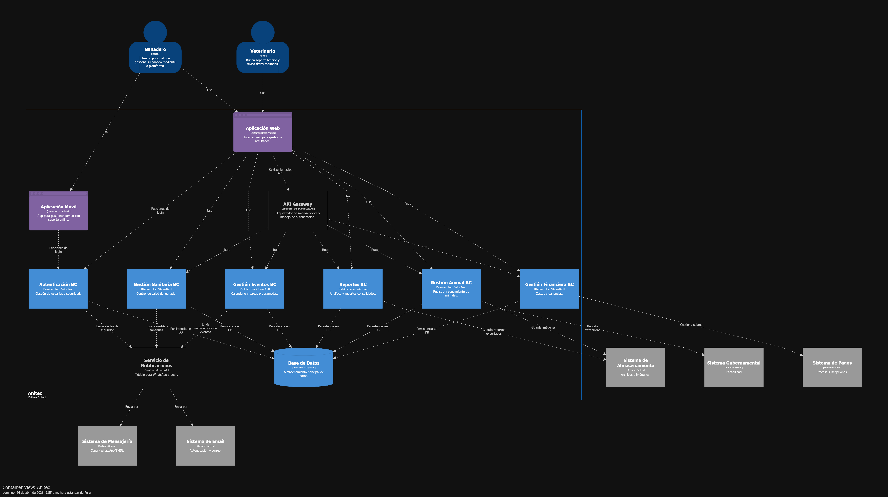
  

    <i><b>Fuente</b>: Elaboración propia.</i>
  

#### 4.6.4. Software Architecture Components Diagrams.

  

    <b>Diagrama de Componentes - Autenticacion BC C4 - AniTec</b>
  

  
  

    <i><b>Fuente</b>: Elaboración propia.</i>
  

  

    <b>Diagrama de Componentes - Gestión animal BC C4 - AniTec</b>
  

  
  

    <i><b>Fuente</b>: Elaboración propia.</i>
  

  

    <b>Diagrama de Componentes - Gestión eventos BC C4 - AniTec</b>
  

  
  

    <i><b>Fuente</b>: Elaboración propia.</i>
  

  

    <b>Diagrama de Componentes - Gestión financiera BC C4 - AniTec</b>
  

  
  

    <i><b>Fuente</b>: Elaboración propia.</i>
  

  

    <b>Diagrama de Componentes - Gestión sanitaria BC C4 - AniTec</b>
  

  
  

    <i><b>Fuente</b>: Elaboración propia.</i>
  

  

    <b>Diagrama de Componentes - Reportes BC C4 - AniTec</b>
  

  
  

    <i><b>Fuente</b>: Elaboración propia.</i>
  

### 4.7. Software Object-Oriented Design.

#### 4.7.1. Class Diagrams.

  

    <b>Diagrama de clases  - AniTec</b>
  

  
  

    <i><b>Fuente</b>: Elaboración propia.</i>
  

Enlace para acceder al [diseño del diagrama de clases](https://lucid.app/lucidchart/ce7bb8d9-af60-4a83-aca2-a67fd65fff1e/edit?viewport_loc=-2812%2C-544%2C6596%2C2877%2C0_0&invitationId=inv_14c6c1b8-2e95-4846-876a-1b70e26b577b)

#### 4.7.2. Class Dictionary.

Diccionario de clases usado para el desarrollo de AgroDigital

| Clase | Descripción |
|-------|-------------|
|**Usuario**|Define las entidades de usuario dentro del sistema, gestionando sus credenciales de acceso y niveles de autorización. Incluye datos esenciales como nombre, correo electrónico, contraseña cifrada, rol asignado y número de contacto.|
|**Credenciales**|Módulo encargado del almacenamiento volátil de la información de acceso del usuario (correo y clave), permitiendo la validación inicial antes de aplicar algoritmos de hashing.|
|**Animal**|Constituye la entidad núcleo del dominio, encargada de centralizar la información técnica y biológica de cada ejemplar. Sus atributos clave permiten el seguimiento detallado mediante el registro de la especie, raza, género, cronología de nacimiento, masa corporal y condición sanitaria actual.|
|**Evento**|Objeto de dominio diseñado para organizar la bitácora de servicios del ganado. Registra la naturaleza del procedimiento (tipo), la programación temporal (fecha) y variables de gestión operativa como la importancia relativa (prioridad) y la situación actual de la actividad (estado).|
|**HistorialClinico**|Clase de dominio que centraliza el registro cronológico de las intervenciones sanitarias realizadas a cada ejemplar. Almacena metadatos sobre la categoría del procedimiento, la marca temporal de ejecución y parámetros de control operativo, permitiendo la trazabilidad integral de la evolución médica del animal.|
|**RegistroMedico**|Clase que representa una entrada atómica y detallada dentro del historial clínico de un semoviente. Se encarga de documentar de forma específica la naturaleza de la intervención (tipo) y el momento exacto de su ejecución (fecha), permitiendo además la inclusión de una narrativa técnica (descripción) y anotaciones adicionales sobre el procedimiento (observaciones).|
|**Archivo**|Clase diseñada para la gestión de recursos multimedia y documentos digitales vinculados a los expedientes sanitarios. Actúa como un puntero hacia el almacenamiento externo, registrando el nombre del recurso, la extensión del fichero (tipo) y la dirección de acceso (URL) para su recuperación desde el servidor de objetos.|
|**ControlEconomico**|Clase de dominio responsable de la consolidación y análisis del balance financiero dentro de un periodo determinado. Sus atributos permiten delimitar el rango temporal mediante una fecha de inicio y una de cierre, vinculando un conjunto de transacciones para el cálculo de la rentabilidad del ganadero.|
|**Transaccion**|Clase que representa una unidad atómica de movimiento financiero dentro del sistema. Se encarga de registrar el flujo de capital (ya sea como ingreso o egreso), documentando el valor monetario (monto), la cronología del suceso (fecha), su clasificación contable (categoría) y una narrativa técnica del movimiento (descripción).|
|**Balance**| Clase encargada de consolidar los resultados financieros derivados del procesamiento de transacciones en un periodo específico. Actúa como un objeto de resumen que calcula de forma automática la sumatoria de entradas económicas (ingresos totales) y salidas (gastos totales), permitiendo determinar la utilidad neta de la operación ganadera.|
|**Reporte**|Representa la entidad de inteligencia de negocios diseñada para transformar datos crudos en información estratégica para el ganadero. Esta clase gestiona la generación de panoramas personalizados sobre el hato, utilizando atributos de tipificación y parámetros de búsqueda específicos para facilitar la toma de decisiones informadas en AniTec.|
|**FiltroReporte**|Objeto de transferencia de datos (DTO) encargado de encapsular los parámetros de segmentación requeridos por el motor de analítica. Permite delimitar la extracción de información mediante criterios específicos como la clasificación taxonómica (especie), intervalos cronológicos del ciclo de vida (rango de edad) y la condición clínica de los ejemplares (estado de salud), optimizando la precisión de los resultados obtenidos.|

### 4.8. Database Design.

#### 4.8.1. Database Diagram.
Se presenta el diagrama de la base de datos relacional:

  

    <b>Diagrama de base de datos de AniTec</b>
  

  
  

    <i><b>Fuente</b>: Elaboración propia.</i>
  

## Capítulo V: Product Implementation, Validation & Deployment
### 5.1. Software Configuration Management.
En esta sección se detallan todas las reglas y procesos que hemos seguido en el proyecto al momento de crear y desplegar la Landing Page y Aplicación Web de AniTec. El objetivo de estas reglas y procesos es garantizar la integridad y consistencia del software, desde el inicio hasta el despliegue y mantenimiento.
#### 5.1.1. Software Development Environment Configuration.

En este apartado se describe la configuración del entorno de desarrollo de AniTec, establecida para garantizar la correcta integración, colaboración y trazabilidad de las actividades realizadas por los miembros del equipo. Se definen las herramientas, plataformas y productos de software utilizados a lo largo del ciclo de vida de la ejecución, desde la gestión del proyecto hasta el despliegue y la documentación técnica.

**Project Management**

Esta categoría agrupa las herramientas a utilizar para la planificación, organización y seguimiento del trabajo del equipo durante el desarrollo del proyecto.

| Plataforma / Herramienta | Propósito en el proyecto | Enlace |
|------------------------|--------------------------|--------|
| Trello | Gestión del backlog del proyecto AniTec, planificación de sprints y seguimiento del progreso de tareas e historias de usuario. | https://trello.com |

**Requirements Management**

Incluye herramientas orientadas a la identificación, análisis y definición de los requerimientos funcionales y no funcionales del sistema.

| Plataforma / Herramienta | Propósito en el proyecto | Enlace |
|------------------------|--------------------------|--------|
| Gherkin | Definición estructurada de criterios de aceptación de las user stories mediante el formato Given-When-Then. | https://cucumber.io/docs/gherkin/ |
| Miro | Ejecución de dinámicas como Event Storming para identificar procesos, eventos y flujos del sistema AniTec. | https://miro.com/ |

**Product UX/UI Design**

Comprende las herramientas a utilizar para el diseño de la experiencia de usuario, interfaces y validación visual del producto digital.

| Plataforma / Herramienta | Propósito en el proyecto | Enlace |
|------------------------|--------------------------|--------|
| Figma | Diseño de wireframes, mockups y prototipos de la landing page y la aplicación web de AniTec. | https://www.figma.com |
| Canva | Creación de recursos visuales como banners, íconos e imágenes para la identidad visual del producto. | https://www.canva.com |
| UXPressia | Elaboración de User Personas y Customer Journey Maps para comprender el comportamiento y necesidades del usuario. | https://uxpressia.com |
| Lucidchart |Aplicación para crear diagramas. Se utilizará para diseñar flujos de usuario, wireflows y el diagrama de clases del sistema.|https://www.lucidchart.com/|

**Software Development**

Incluye herramientas que serán destinadas a la implementación técnica del sistema, desarrollo del código y control de versiones.

| Plataforma / Herramienta | Propósito en el proyecto | Enlace |
|------------------------|--------------------------|--------|
| GitHub | Gestión del repositorio del proyecto AniTec, control de versiones, manejo de ramas y colaboración entre desarrolladores. | https://github.com |
| Visual Studio Code | Entorno de desarrollo utilizado para la redacción y gestión del informe mediante archivos en formato Markdown (.md), facilitando la organización, edición estructurada y control de versiones del contenido. | https://code.visualstudio.com/ |
| WebStorm | Entorno especializado para el desarrollo del frontend de la aplicación web AniTec, aprovechando su soporte avanzado para JavaScript y frameworks modernos. | https://www.jetbrains.com/webstorm/ |
| Rider | Entorno especializado para el desarrollo del backend del sistema (en caso de utilizar .NET), permitiendo implementar la lógica de negocio y servicios. | https://www.jetbrains.com/rider/ |

**Software Deployment**

Se incluyen las herramientas a utilizar para la publicación y disponibilidad del sistema en entornos accesibles para los usuarios.

| Plataforma / Herramienta | Propósito en el proyecto | Enlace |
|------------------------|--------------------------|--------|
| GitHub Pages | Despliegue de la landing page de AniTec mediante hosting estático accesible a través de una URL pública. | https://pages.github.com |

**Software Documentation**

Agrupa herramientas a emplear para documentar la arquitectura, procesos, modelos y estructura del sistema.

| Plataforma / Herramienta | Propósito en el proyecto | Enlace |
|------------------------|--------------------------|--------|
| Lucidchart | Elaboración de diagramas de flujo, wireflows y diagramas de clases del sistema. | https://lucidchart.com |
| Structurizr | Modelado de la arquitectura del sistema mediante el enfoque C4 (contexto, contenedores y componentes). | https://structurizr.com |
| Vertabelo | Diseño y documentación del modelo de base de datos relacional del sistema AniTec. | https://vertabelo.com |

#### 5.1.2. Source Code Management.

En esta sección, el equipo de desarrollo de AniTec define los mecanismos y la estructura organizativa utilizados para el control de versiones y el seguimiento de cambios, empleando **GitHub** como plataforma principal.

Para ello, se configuraron repositorios remotos donde se almacena el código fuente, se documentan las modificaciones y se facilita la colaboración eficiente entre los miembros del equipo a lo largo de todo el ciclo de desarrollo de la aplicación.

Se utiliza GitHub como sistema centralizado para el versionado y la gestión colaborativa.
Los repositorios oficiales del proyecto AniTec son los siguientes:

- AniTec Documentation: https://github.com/upc-1asi0730-2610-12206-titan-team-4/anitec-report 
- Landing Page: https://github.com/upc-1asi0730-2610-12206-titan-team-4/anitec-landing-page 
- Aplicación Web (frontend de AniTec): - 
- Backend / Servicios Web (API del sistema): -

**Workflow de Control de Versiones (GitFlow)**

Para la gestión del desarrollo, se implementa el modelo GitFlow, el cual establece una estructura de ramas que permite organizar el trabajo del equipo de forma controlada y escalable.

**Estructura de branches (Ramas)**
- *main*: Contiene la versión estable y productiva del sistema.
- *develop*: Rama de integración donde se consolidan las funcionalidades en desarrollo antes de su liberación.
- *Feature branches*: Cada funcionalidad específica contará con una rama independiente. Al completarse su desarrollo, se integrará a la rama principal de desarrollo. La nomenclatura seguirá el formato "feature/descripción-funcionalidad" para garantizar claridad y unicidad.
- *Release branches*: Estas bifurcaciones representarán versiones candidatas de la rama develop, preparadas para su eventual incorporación a master. Su identificación se basará en el Versionamiento Semántico estándar.
- *Hotfix branches*: Se implementarán para resolver de manera ágil errores críticos detectados en producción que afecten directamente la funcionalidad del sistema.

*Versionamiento Semántico:* El control de versiones aplicará estrictamente los principios del Versionamiento Semántico 2.0.0 (SemVer)

*Convenciones de Commits:* Los mensajes de confirmación seguirán el estándar Conventional Commits, con el objetivo de mantener un historial de cambios claro, consistente y trazable a lo largo del desarrollo del proyecto AniTec.
La estructura básica será:

 `git commit -m "<type>[optional scope]:<title>" -m"<description">`

#### 5.1.3. Source Code Style Guide & Conventions.

En esta sección, el equipo de desarrollo de AniTec define las convenciones de nomenclatura y estilo de código adoptadas para garantizar consistencia, legibilidad y mantenibilidad en todos los componentes del sistema. 

**Convenciones Generales**

- Uso obligatorio del idioma inglés en todo el código fuente.
- Nombres descriptivos y semánticos.
- Evitar abreviaciones innecesarias.
- Mantener consistencia en estilos a lo largo del proyecto.
- Código estructurado, modular y reutilizable.
- Uso de nomenclatura `kebab-case` para clases y nombres de archivos.

---

**HTML y CSS**

Se adoptan las recomendaciones de:
- Google HTML/CSS Style Guide  
- HTML Style Guide and Coding Conventions  

**Convenciones aplicadas:**
- Uso de etiquetas semánticas (`<header>`, `<section>`, `<article>`, etc.).
- Indentación de 2 espacios.
- Uso de clases en formato `kebab-case` (ej. `animal-card`, `main-header`).
- Separación clara entre estructura (HTML) y estilo (CSS).
- Evitar estilos en línea (inline styles).

---

**JavaScript**

Se adoptan las guías:
- Google JavaScript Style Guide  
- MDN JavaScript Guidelines  

**Convenciones aplicadas:**
- Uso de `camelCase` para variables y funciones (ej. `getAnimalData`).
- Uso de `PascalCase` para clases (ej. `AnimalService`).
- Uso de `const` y `let` en lugar de `var`.
- Funciones pequeñas y con una única responsabilidad.
- Manejo adecuado de promesas (`async/await`).
- Uso de módulos para organizar el código.

---

**Framework Frontend**

Se adopta:
- Vue Style Guide  

**Convenciones aplicadas:**
- Componentes en `PascalCase` (ej. `AnimalCard.vue`).
- Separación de lógica, template y estilos dentro del componente.
- Props claramente tipadas y documentadas.
- Reutilización de componentes.

---

**C# / Backend (.NET)**

Se adoptan:
- C# Coding Conventions  
- Microsoft ASP.NET Core Coding Guidelines  

**Convenciones aplicadas:**
- Uso de `PascalCase` para clases, métodos y propiedades.
- Uso de `camelCase` para variables locales y parámetros.
- Prefijo `_` para variables privadas (ej. `_animalRepository`).
- Métodos con nombres verbales (ej. `GetAnimals`, `CreateAnimal`).
- Separación en capas (Controllers, Services, Repositories).
- Uso de inyección de dependencias.

#### 5.1.4. Software Deployment Configuration.

En esta sección se describe la configuración y el proceso de despliegue de los distintos componentes del sistema AniTec, detallando los pasos necesarios para publicar cada producto digital a partir de sus respectivos repositorios de código fuente.

El despliegue se ha estructurado de forma independiente para cada componente: Landing Page, Aplicación Web (Frontend) y Web Services (Backend), permitiendo una gestión modular, escalable y mantenible.

**Despliegue de Landing Page**

La Landing Page se despliega utilizando **GitHub Pages**, permitiendo la publicación de sitios web estáticos directamente desde el repositorio.

**Repositorio:**
- https://upc-1asi0730-2610-12206-titan-team-4.github.io/anitec-landing-page/

**Pasos de despliegue:**
1. Subir el código fuente (HTML, CSS, JavaScript) al repositorio.
2. Configurar la rama `main` como fuente de despliegue en GitHub Pages.
3. Activar la opción **Pages** en la configuración del repositorio.
4. GitHub genera automáticamente una URL pública para acceder al sitio.

**Resultado:**
La Landing Page queda disponible en una URL accesible desde cualquier navegador. Link: https://upc-1asi0730-2610-12206-titan-team-4.github.io/anitec-landing-page/

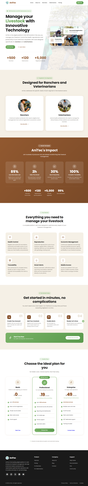

    <i><b>Fuente</b>: Elaboración propia.</i>

### 5.2. Landing Page, Services & Applications Implementation.
#### 5.2.1. Sprint 1.
##### 5.2.1.1. Sprint Planning 1.

En esta sección se especifica los aspectos principales del Sprint Planning Meeting. AniTec inicia su primer Sprint con el objetivo de establecer la presencia digital de la empresa mediante una Landing Page funcional que presente la propuesta de valor y facilite el registro de usuarios potenciales. Este Sprint representa la primera iteración del equipo AniTec, donde se busca crear una primera impresión sólida ante potenciales usuarios que visitarán la plataforma por primera vez.

La Landing Page cumple un rol fundamental en la estrategia de captación de usuarios, siendo el punto de entrada principal para personas que desconocen AniTec pero buscan soluciones tecnológicas para la gestión ganadera. Por esta razón, el equipo priorizó este componente como el primero a desarrollar, reconociendo que una presencia digital profesional y atractiva es esencial para generar confianza y credibilidad desde el primer momento.

<table align="center" border="1" cellpadding="8" cellspacing="0" style="border-collapse: collapse; width: 100%; font-family: Arial, sans-serif;">
    <tbody>
        <tr>
            <td><b>Sprint #</b></td>
            <td>Sprint 1</td>
        </tr>
        <tr>
            <td colspan="2"><b>Sprint Planning Background</b></td>
        </tr>
        <tr>
            <td>Date</td>
            <td>2026-04-17</td>
        </tr>
        <tr>
            <td>Time</td>
            <td>10:00 AM</td>
        </tr>
        <tr>
            <td>Location</td>
            <td>Reunión virtual via Discord - Canal #sprint-planning</td>
        </tr>
        <tr>
            <td>Prepared by</td>
            <td>Ayala Fernandez, Jorge Brayan</td>
        </tr>
        <tr>
            <td>Attendees (to planning meeting)</td>
            <td>Ayala Fernandez, Jorge Brayan / Huaman Gallardo, Bruno Aldair / Melgarejo Quiroz, Josep Eliu / Raymundo Villarroel, Nadhim Abigail / Sanchez Silva, Luciana Celeste</td>
        </tr>
        <tr>
            <td>Sprint n - 1 Review Summary</td>
            <td>No aplica - Este es el primer Sprint del proyecto. Se establecieron las bases del Product Backlog, se definieron los User Stories priorizados, y se creó la estructura inicial de repositorios en GitHub Organization.</td>
        </tr>
        <tr>
            <td>Sprint n - 1 Retrospective Summary</td>
            <td>No aplica - Este es el primer Sprint del proyecto. El equipo se conformó recientemente y se espera mejorar la coordinación en sprints posteriores.</td>
        </tr>
        <tr>
            <td colspan="2"><b>Sprint Goal / User Stories</b></td>
        </tr>
        <tr>
            <td>Sprint 1 Goal</td>
            <td>Implementar una Landing Page funcional que presente la propuesta de valor de AniTec, muestre las características principales del servicio para ranchers y veterinarians, y proporcione enlaces de llamada a la acción para registro de usuarios potenciales.</td>
        </tr>
        <tr>
            <td>Sprint 1 Velocity</td>
            <td>El equipo estimó un velocity inicial de 34 Story Points, enfocados en el desarrollo de la Landing Page multipágina (index, about us, ranchers, veterinarians).</td>
        </tr>
        <tr>
            <td>Sprint of Story Points</td>
            <td>Total: 34 SP - Distribuidos en 8 SP para estructura HTML base, 8 SP para secciones de contenido, 8 SP para estilos CSS y diseño responsive, y 10 SP para funcionalidades JavaScript y sliders.</td>
        </tr>
    </tbody>
</table>

El Sprint Planning Meeting del 17 de abril de 2026 duró aproximadamente 2 horas. El equipo discutió en detalle los User Stories a implementar, estimó las responsabilidades iniciales, y estableció los primeros stories de colaboración. Durante la reunión, cada miembro del equipo tuvo la oportunidad de expresar sus dudas respecto a las tareas asignadas y se resolvieron interrogantes técnicas relacionadas con las tecnologías a utilizar.

La dinámica del Sprint Planning permitió al equipo alinear expectativas y establecer un compromiso colectivo hacia el logro del Sprint Goal. Se destinó tiempo suficiente para revisar las guidelines de código establecidas en el proyecto, asegurando que todos los miembros comprendieran las convenciones de nomenclatura, estructura de archivos y flujo de trabajo con Git.

**User Stories incluidos en el Sprint 1:**

Los User Stories seleccionados para este Sprint inicial reflejan las necesidades más críticas para establecer la presencia digital de AniTec. El equipo se enfocó en la Landing Page multipágina para este primer Sprint, reconociendo la importancia de dirigirse a los dos segmentos objetivo (ranchers y veterinarians) con páginas especializadas.

| ID | User Story | Prioridad | Story Points |
|----|----------|----------|------------|
| US25 | Landing: Exploración de Contenido y Navegación | Must Have | 8 |
| US26 | Landing: Conversión y Llamados a la Acción (CTAs) | Must Have | 8 |
| US27 | Index: Visualización de Propuesta de Valor | Must Have | 5 |
| US28 | Index: Exploración de Segmentos | Must Have | 5 |
| US32 | Nosotros: Información del Equipo | Must Have | 4 |
| US38 | Ganaderos: Exploración de Contenido Específico | Should Have | 4 |

La selección de estos User Stories para el Sprint 1 responde a la necesidad de establecer la presencia digital de AniTec rápidamente, permitiendo que usuarios potenciales conozcan la propuesta de valor para los dos segmentos target. El equipo identificó que US25 y US26 son los más críticos, representando el objetivo principal del Sprint, mientras que las páginas específicas (US38) aportan valor para alcanzar a los segments especializados.

**Distribución de Trabajo por Componente:**

- **Landing Page:** 34 Story Points - Enfocados en las 4 páginas (index, about us, ranchers, veterinarians), incluyendo estructura HTML, estilos CSS, funcionalidades JavaScript, y contenido optimizado para SEO.

La distribución de Story Points fue diseñada para que cada miembro del equipo tuviera una carga de trabajo equilibrada. Se priorizaron las tareas de implementación técnica (estructura HTML y estilos) sobre las tareas de configuración, reconociendo que la visibilidad del progreso es fundamental para mantener la motivación del equipo durante las primeras etapas del proyecto.

##### 5.2.1.2. Aspects Leaders and Collaborators.

En esta sección el equipo elabora el artefacto Leadership-and-Collaboration Matrix (LACX), que indica por cada aspecto dentro del alcance del Sprint, quién es el líder y quién o quiénes son colaboradores en dicho aspecto, con el fin de brindando mayor claridad y efectividad en la comunicación al interior del equipo.

La sección incluye una introducción donde se explica cuáles son los principales aspectos que se toma en cuenta en el Sprint 1. Para este primer Sprint, los aspectos están centrados exclusivamente en el desarrollo de la Landing Page multipágina, reconociendo la importancia de establecer roles claros desde el inicio del proyecto para evitar conflictos y facilitar la toma de decisiones durante la implementación.

El equipo AniTec está conformado por 5 miembros con diferentes fortalezas técnicas y experiencia en distintas áreas del desarrollo de software. Durante la reunión de Sprint Planning, se identificaron las competencias de cada miembro y se asignaron los roles de líder (L) y colaborador (C) para cada aspecto del Sprint, priorizando el desarrollo profesional de cada integrante mientras se optimiza la productividad del equipo.

**Aspectos del Sprint 1:**

1. **Landing Page - UI/UX:** Diseño y estructura visual de las páginas principales, incluyendo wireframes, mockups, paleta de colores, tipografía y componentes visuales.
2. **Landing Page - Desarrollo HTML/CSS:** Implementación técnica de las páginas landing, incluyendo código HTML semántico, estilos CSS, y diseño responsive.
3. **Landing Page - Funcionalidades JavaScript:** Implementación de sliders automáticos, interacciones de navegación, y efectos visuales.
4. **Documentación:** Documentación técnica del Sprint, incluyendo este archivo y demás artefactos Scrum requeridos.

La distribución de roles fue diseñada para fomentar la colaboración entre los miembros del equipo, evitando situaciones donde un solo miembro sea responsable de un componente crítico. En caso de que un líder no esté disponible, los colaboradores están preparados para asumir responsabilidad parcial del aspecto correspondiente.

<table align="center" border="1" cellpadding="8" cellspacing="0" style="border-collapse: collapse; width: 100%; font-family: Arial, sans-serif;">
    <tbody>
        <tr>
            <td><b>Team Member (Last Name, First Name)</b></td>
            <td><b>GitHub Username</b></td>
            <td><b>Landing UI/UX / L or C</b></td>
            <td><b>Landing Dev HTML/CSS / L or C</b></td>
            <td><b>Landing JS / L or C</b></td>
            <td><b>Documentation / L or C</b></td>
        </tr>
        <tr>
            <td>Ayala Fernandez, Jorge Brayan</td>
            <td>jorgeayaladev</td>
            <td>L</td>
            <td>C</td>
            <td>L</td>
            <td>C</td>
        </tr>
        <tr>
            <td>Huaman Gallardo, Bruno Aldair</td>
            <td>BrunoHG10</td>
            <td>C</td>
            <td>L</td>
            <td>C</td>
            <td>-</td>
        </tr>
        <tr>
            <td>Melgarejo Quiroz, Josep Eliu</td>
            <td>Melga1502</td>
            <td>C</td>
            <td>C</td>
            <td>C</td>
            <td>L</td>
        </tr>
        <tr>
            <td>Raymundo Villarroel, Nadhim Abigail</td>
            <td>AbigailRV</td>
            <td>C</td>
            <td>C</td>
            <td>C</td>
            <td>C</td>
        </tr>
        <tr>
            <td>Sanchez Silva, Luciana Celeste</td>
            <td>Luccsss</td>
            <td>C</td>
            <td>C</td>
            <td>C</td>
            <td>C</td>
        </tr>
    </tbody>
</table>

La organización de líderes y colaboradores tiene relación directa con las fortalezas técnicas de cada miembro del equipo identificadas durante la conformación del equipo. Esta distribución permite que cada uno trabaje en áreas donde puede aportar mayor valor, mientras tiene la oportunidad de aprender de los líderes en otras áreas.

**Distribución detallada de responsabilidades:**

- **Ayala Fernandez, Jorge Brayan (UI/UX & JavaScript Lead):** Responsable del diseño visual de la Landing Page y las funcionalidades JavaScript, incluyendo la creación de mockups, definición de la paleta de colores basada en la identidad de marca de AniTec, y desarrollo de sliders automáticos. Coordina con el equipo de desarrollo para asegurar que la implementación respete el diseño propuesto.

- **Huaman Gallardo, Bruno Aldair (Development Lead):** Responsable de la implementación técnica HTML/CSS de las páginas landing, incluyendo la estructura HTML semántica, estilos CSS con metodología BEM, y diseño responsivo. Coordina con el líder de UI/UX para resolver dudas sobre el diseño y garantizar su correcta implementación.

- **Melgarejo Quiroz, Josep Eliu (Documentation Lead):** Responsable de la documentación del Sprint, incluyendo la elaboración de este archivo y demás artefactos Scrum. Coordina con los demás miembros para recopilar información sobre el avance del Sprint y asegurar la completitud de la documentación.

##### 5.2.1.3. Sprint Backlog 1.

El Sprint Backlog 1 inicia con una introducción que resume el objetivo principal del Sprint: establecer la presencia digital de AniTec mediante una Landing Page multipágina funcional para los segmentos de ranchers y veterinarians. Este documento representa el compromiso del equipo para completar las tareas identificadas durante el Sprint Planning y representa la base para el seguimiento del progreso durante la iteración.

El Sprint Backlog fue elaborado de manera colaborativa, donde cada miembro del equipo tuvo la oportunidad de sugerir tareas adicionales o modificar la estimación de horas para tareas existentes. Se utilizó la técnica de Planning Poker para estimar la complejidad de cada tarea, considerando factores como el tiempo requerido, la complejidad técnica, y las dependencias con otras tareas.

**Trello Board:**
El equipo utiliza un Trello Board para gestionar visualmente el Sprint Backlog. El Board contiene las listas estándar de Scrum: "Sprint Goal", "To Do", "In Progress", "To Review" y "Done". El uso de Trello permite una visualización clara del estado de cada tarea y facilita la identificación de cuellos de botella en el flujo de trabajo.

**Estructura del Trello Board:**

- **Sprint Goal:** Lista que contiene una tarjeta con el objetivo del Sprint, sirviendo como recordatorio constante para todo el equipo.
- **To Do:** Lista con las tareas pendientes por iniciar, ordenadas por prioridad y dependencias.
- **In Progress:** Lista con las tareas que están siendo implementadas actualmente.
- **To Review:** Lista con las tareas completadas pendientes de revisión por otro miembro del equipo.
- **Done:** Lista con las tareas aprobadas y listas para deployment.

A continuación, la tabla de control de estado para el Sprint 1:

<table align="center" border="1" cellpadding="8" cellspacing="0" style="border-collapse: collapse; width: 100%; font-family: Arial, sans-serif;">
    <tbody>
        <tr>
            <td><b>Sprint #</b></td>
            <td colspan="7">Sprint 1</td>
        </tr>
        <tr>
            <td colspan="2">User Story</td>
            <td colspan="6">Work-Item / Task</td>
        </tr>
        <tr>
            <td>Id</td>
            <td>Title</td>
            <td>Id</td>
            <td>Title</td>
            <td>Description</td>
            <td>Estimation (Hours)</td>
            <td>Assigned to</td>
            <td>Status</td>
        </tr>
        <tr>
            <td>US25</td>
            <td>Landing: Exploración de Contenido y Navegación</td>
            <td>T001</td>
            <td>Crear estructura HTML base</td>
            <td>Crear estructura base del documento HTML con DOCTYPE, meta tags, y vinculación de archivos CSS/JS</td>
            <td>2</td>
            <td>Ayala Fernandez, Jorge Brayan</td>
            <td>Done</td>
        </tr>
        <tr>
            <td>US25</td>
            <td>Landing: Exploración de Contenido y Navegación</td>
            <td>T002</td>
            <td>Implementar navegación principal</td>
            <td>Crear menú de navegación con enlaces a todas las páginas y funcionalidad smooth scroll</td>
            <td>3</td>
            <td>Huaman Gallardo, Bruno Aldair</td>
            <td>Done</td>
        </tr>
        <tr>
            <td>US26</td>
            <td>Landing: CTAs y Conversión</td>
            <td>T003</td>
            <td>Implementar botones CTA</td>
            <td>Crear botones de llamado a la acción con enlaces a pricing y registro</td>
            <td>2</td>
            <td>Ayala Fernandez, Jorge Brayan</td>
            <td>Done</td>
        </tr>
        <tr>
            <td>US27</td>
            <td>Index: Propuesta de Valor</td>
            <td>T004</td>
            <td>Implementar Hero Section</td>
            <td>Crear sección hero con headline, métricas y buttons para index.html</td>
            <td>4</td>
            <td>Ayala Fernandez, Jorge Brayan</td>
            <td>Done</td>
        </tr>
        <tr>
            <td>US28</td>
            <td>Index: Exploración de Segmentos</td>
            <td>T005</td>
            <td>Implementar sección segmentos</td>
            <td>Crear sección que muestre los two segmentos objetivo (ranchers y veterinarians)</td>
            <td>3</td>
            <td>Raymundo Villarroel, Nadhim Abigail</td>
            <td>Done</td>
        </tr>
        <tr>
            <td>US32</td>
            <td>Nosotros: Información del Equipo</td>
            <td>T006</td>
            <td>Implementar página About Us</td>
            <td>Crear página nosotros.html con información del equipo y proceso</td>
            <td>4</td>
            <td>Melgarejo Quiroz, Josep Eliu</td>
            <td>Done</td>
        </tr>
        <tr>
            <td>US38</td>
            <td>Ganaderos: Contenido Específico</td>
            <td>T007</td>
            <td>Implementar página Ranchers</td>
            <td>Crear página ganaderos.html con módulos, testimonios y comparación</td>
            <td>5</td>
            <td>Huaman Gallardo, Bruno Aldair</td>
            <td>Done</td>
        </tr>
        <tr>
            <td>US44</td>
            <td>Veterinarios: Contenido Específico</td>
            <td>T008</td>
            <td>Implementar página Veterinarians</td>
            <td>Crear página veterinarios.html con funcionalidades, casos de uso y testimonios</td>
            <td>5</td>
            <td>Sanchez Silva, Luciana Celeste</td>
            <td>Done</td>
        </tr>
    </tbody>
</table>

El Sprint Backlog refleja 8 tareas que totalizando las horas estimadas representan aproximadamente 34 horas de trabajo del equipo, equivalente a los 34 Story Points calculados para el Sprint 1. Cada tarea fue estimada considerando la complejidad técnica, el tiempo requerido para investigación en caso de desconocimiento, y los posibles imprevistos que pudieran surgir durante la implementación.

El equipo se compromete a completar todas las tareas del Sprint Backlog antes de la fecha de Sprint Review programada para el final de la iteración. Se realizará seguimiento diario del progreso mediante las daily standups y se tomarán acciones correctivas en caso de identificar desviaciones significativas del plan.

##### 5.2.1.4. Development Evidence for Sprint Review.

En esta sección se explica y presenta los avances en implementación con relación a los productos de la solución según el alcance del Sprint 1: Landing Page Multipágina. La sección resume los principales avances logrados durante este Sprint inicial y sirve como evidencia de que el equipo cumplió con el objetivo planificado.

Durante el Sprint 1, el equipo AniTec logró completar la configuración de la Landing Page multipágina. Se obtuvo un sitio web completamente funcional con las siguientes páginas y secciones: Index (página principal), About Us (nosotros), Ranchers (para ganaderos), y Veterinarians (para veterinarios). El desarrollo siguió las mejores prácticas de desarrollo web, incluyendo código semántico, accesibilidad, y optimización para motores de búsqueda (SEO).

**Resumen de Avances Implementados:**

La Landing Page implementada durante el Sprint 1 cuenta con las siguientes características técnicas y funcionales:

- **Estructura HTML semántica:** Utilización de etiquetas HTML5 apropiadas (header, nav, main, section, article, footer) para garantizar accesibilidad y mejor posicionamiento en motores de búsqueda.
- **Hojas de estilo CSS:** Implementación de estilos utilizando metodología BEM (Block Element Modifier) para mantener un código CSS organizado y reutilizable. Soporte para diseño responsivo en tablets y móviles.
- **Diseño responsivo:** Implementación de breakpoints en 1024px (tablet) y 640px (móvil) utilizando CSS Grid y Flexbox para asegurar una experiencia consistente en todos los dispositivos.
- **JavaScript funcional:** Scripts para sliders automáticos de testimonios, navegación sticky, y efectos visuales.
- **Optimización SEO:** Meta tags, Open Graph, Twitter Cards, y estructura semántica para mejorar el posicionamiento en motores de búsqueda.
- **Accesibilidad web:** Cumplimiento de estándares WCAG 2.1 nivel AA, incluyendo contraste de colores adecuado, navegación por teclado funcional, y etiquetas ARIA donde fue necesario.

**Commits Realizados:**

  

    <b>Coomits</b>
  

  

  

    <b>Coomits</b>
  

  

El equipo realizó un total de 8 commits en el repositorio de Landing Page durante el Sprint 1. Cada commit sigue la convención de Conventional Commits establecida en la configuración del proyecto, facilitando la generación automática de changelogs y la trazabilidad de cambios. Los commits fueron realizados de forma regular, evitando commits muy grandes que dificulten la revisión de código y el rollback en caso de problemas.

**Repositorio de Landing Page:**

https://github.com/upc-1asi0730-2610-12206-titan-team-4/anitec-landing-page

**Estadísticas del repositorio:**

- Total de ramas: 2 (main, develop)
- Total de commits: 8
- Total de contribuciones: 5 miembros del equipo

##### 5.2.1.5. Execution Evidence for Sprint Review.

Esta sección resume lo alcanzado en el Sprint 1 y presenta las capturas de pantalla de las principales vistas implementadas, junto con enlaces que ilustran la visualización y navegación logradas durante este Sprint inicial. Las evidencias presentadas demuestran que el equipo cumplió satisfactoriamente con el Sprint Goal establecido durante el Planning.

**Resumen de lo Alcanzado:**

El Sprint 1 permitió establecer la presencia digital de AniTec. El equipo logró completar la configuración del repositorio, establecer las convenciones de código, e implementar las funcionalidades de la Landing Page multipágina. Los resultados superan las expectativas iniciales, logrando una Landing Page funcional, visualmente atractiva y técnicamente sólida.

**Capturas de Pantalla - Landing Pages:**

Las Landing Pages implementadas incluyen las siguientes secciones principales:

1. **Index - Hero Section:** Con el headline "Gestiona tu Ganado con Tecnología Innovadora", badge "+500 Ranchers and 120 Veterinarians trust us", y buttons "Try Free" y "Learn More". La sección hero utiliza una imagen de fondo relacionada con gestión ganadera y cuenta con animaciones de entrada.

2. **Index - Segmentos:** Sección "Designed for Ranchers and Veterinarians" con dos tarjetas que muestran los dos segmentos objetivo con imágenes representativas y botones de navegación.

3. **Index - Métricas:** Sección "Results That Speak" con indicadores clave: 85% Menos Información Perdida, 2h Ahorro de Tiempo Diario, 30% Más Productividad, 100% Trazabilidad Completa.

4. **Index - Pricing:** Sección "Elige el plan ideal para ti" con tres planes: Basic ($0/mes), Professional ($19/mes), y Enterprise ($49/mes).

5. **About Us - Equipo:** Sección "Our Team" con información de los 5 miembros del equipo Titan, misión y visión de la startup.

6. **Ranchers - Página Específica:** Con hero "Digitize Your Livestock Today", módulos de gestión (Gestión de Animales, Control Sanitario, Reproducción, Gestión Económica), testimonios de ranchers, y comparación Traditional vs AniTec.

7. **Veterinarians - Página Específica:** Con hero "Optimize Your Veterinary Practice" y badge "Herramienta Profesional #1", funcionalidades clave, casos de uso, y testimonios de veterinarians.

**Funcionalidades adicionales implementadas:**

- **Navegación sticky:** La barra de navegación permanece fija al hacer scroll, mejorando la accesibilidad a los enlaces principales.
- **Sliders automáticos:** Testimonios con auto-slide cada 4 segundos para ranchers y veterinarians.
- **Diseño responsivo:** Breakpoints en 1024px y 640px para tablets y móviles.
- **Efectos hover:** Transiciones suaves en botones, cards, e imágenes.
- **CTA con imágenes:** Secciones CTA con imágenes rancher-2.png y veterinarian-2.png.

##### 5.2.1.6. Services Documentation Evidence for Sprint Review.

Esta documentación estuvo orientada principalmente en la parte del Landing Page por lo que no se pudo enfocar en ningún motivo al backend en la creación del servicio. En los proximos sprints se tocará aquel tema y se podrá profundizar en ello adecuadamente.

##### 5.2.1.7. Software Deployment Evidence for Sprint Review.

La landing page de AniTec fue desplegada exitosamente en **GitHub Pages**, la plataforma de hosting gratuita proporcionada por GitHub que permite publicar proyectos estáticos directamente desde un repositorio. El despliegue se realizó configurando el branch `main` como fuente de contenido estático en la configuración de GitHub Pages del repositorio `anitec-landing-page`.

**Configuración del Deploy:**

- **Plataforma:** GitHub Pages
- **Repositorio:** anitex-landing-page
- **Branch desplegado:** main
- **URL de acceso:** https://upc-1asi0730-2610-12206-titan-team-4.github.io/anitec-landing-page/
- **Ruta de archivos desplegados:** /index.html, /nosotros.html, /ganaderos.html, /veterinarios.html, /styles.css, /script.js, /assets/

El proceso de deployment se configura desde la sección "Pages" en la configuración del repositorio de GitHub, seleccionando el branch `main` y la carpeta `/ (root)` como fuente. GitHub Pages construye automáticamente el sitio web estático y lo hace accesible públicamente a través de la URL segura HTTPS.

**Verificación Post-Deploy:**

Después del despliegue, se verificó que todas las páginas estuvieran accesibles correctamente:
- La página principal (index.html) carga sin errores y muestra el pricing y CTA correctamente
- Las páginas secundarias (nosotros.html, ganaderos.html, veterinarios.html) son navegables desde el menú de navegación
- Los recursos estáticos (CSS, JavaScript, imágenes) se cargan correctamente
- El slider de testimonios funciona de manera automática con JavaScript
- El diseño responsive se adapta a diferentes tamaños de pantalla

El sitio desplegado está disponible públicamente para usuarios externos y puede ser compartido mediante la URL de GitHub Pages para revisiones del Sprint.

##### 5.2.1.8. Team Collaboration Insights during Sprint.

En esta sección el equipo explica cómo se han desarrollado las actividades de implementación y se presenta los analíticos de colaboración y commits en GitHub, realizados por los miembros del equipo. Esta información permite evaluar la efectividad del equipo y identificar oportunidades de mejora para sprints futuros.

**Distribución de Trabajo:**

Todos los miembros del equipo participaron en la implementación de la Landing Page según sus fortalezas y responsabilidades asignadas en el LACX (Leadership and Collaboration Matrix). La distribución fue equitativa, con cada miembro contribuyendo al menos 1 commit durante el Sprint, demostrando el compromiso colectivo con el objetivo del Sprint.

El equipo adoptó un enfoque de trabajo colaborativo, donde los miembros se reunían diariamente mediante standups virtuales para compartir avances, resolver dudas técnicas, y ajustar prioridades según sea necesario. Las comunicaciones asincrónicas se realizaban principalmente a través del canal de Discord, donde se compartían enlaces a código, capturas de pantalla, y preguntas técnicas.

**Métricas de Colaboración:**

  

    <b>Coomits graficas</b>
  

  

**Reflexiones del Equipo:**

- Ayala Fernandez, Jorge Brayan: "El Sprint 1 estableció las bases de nuestra presencia digital. La coordinación con el equipo de diseño fue clave para lograr Landing Pages profesionales para ambos segmentos. Aprendí la importancia de mantener una comunicación fluida para evitar retrabajo."

- Huaman Gallardo, Bruno Aldair: "Aporté en el desarrollo HTML/CSS de las páginas. La implementación de Diseño Responsivo fue fundamental para garantizar una experiencia consistente en todos los dispositivos. Contribuí en resolver problemas de compatibilidad con diferentes navegadores."

- Melgarejo Quiroz, Josep Eliu: "La documentación del Sprint fue un desafío interesante. Aprendí a sintetizar la información técnica de manera clara y concisa. También participé en el desarrollo de la página About Us."

- Raymundo Villarroel, Nadhim Abigail: "Participé en la implementación de la página de Ranchers, específicamente en las secciones de módulos y comparación. Esta experiencia me permitió aplicar mis habilidades de desarrollo web mientras aprendía sobre el dominio ganadero."

- Sanchez Silva, Luciana Celeste: "Contribuí en la implementación de la página de Veterinarians. Trabajar con sliders automáticos y efectos visuales fue desafiante pero gratificante. El trabajo en equipo fue fundamental para completar todas las tareas."

**Lección Aprendida:**

El equipo identifica las siguientes lecciones de este Sprint 1:

1. **La configuración inicial del entorno de desarrollo toma tiempo significativo al inicio del proyecto:** Es importante considerar este tiempo en las estimaciones de futuros sprints, especialmente cuando se trabaja con tecnologías nuevas para algunos miembros del equipo.

2. **Es importante mantener comunicación frecuente entre equipos de diseño y desarrollo:** La participación activa del líder de diseño en las revisiones de código ayudó a identificar desviaciones del diseño de manera temprana, evitando retrabajo significativo.

3. **Las daily standups cortas fueron efectivas para mantener el progreso:** Reuniones de 15 minutos máximo permiten compartir información relevante sin afectar el tiempo de implementación.

4. **Los code reviews incrementan la calidad del código:** La revisión por pares antes de hacer merge permitió identificar y corregir errores de estilo y lógica, mejorando la consistencia del código base.

5. **Las estimaciones iniciales fueron acertadas pero con margen de mejora:** El equipo logró completar todas las tareas dentro del tiempo estimado, aunque algunas tareas requirieron ajuste de prioridades para cumplir con el Sprint Goal.

## Conclusiones

El diseño del modelo de datos orientado por los principios de Domain-Driven Design (DDD) establece una arquitectura de software robusta, cohesiva y altamente escalable. Al segmentar el dominio en contextos delimitados (Identidad, Inventario Ganadero, Historial Clínico y Finanzas), se logra una separación de responsabilidades que facilita la integridad relacional y la trazabilidad de la información.

La estructuración de Épicas y User Stories garantiza que el desarrollo de la plataforma se mantenga centrado en resolver los problemas reales de los pequeños y medianos ganaderos.

## Bibliografía
Bourgau, P. (29 de marzo de 2022). *Step by Step Guide to run your Big Picture Event Storming*. Philippe Bourgau's Blog. https://bit.ly/bpes-guide

Evans, E. (2003). *Domain-Driven Design: Tackling Complexity in the Heart of Software*. Addison-Wesley Professional.
## Anexos
