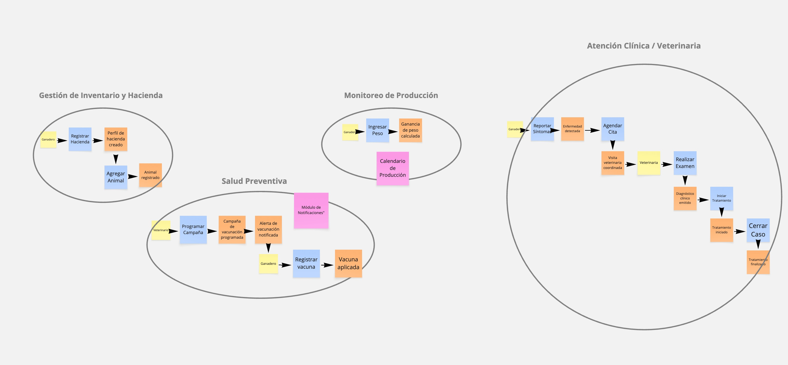
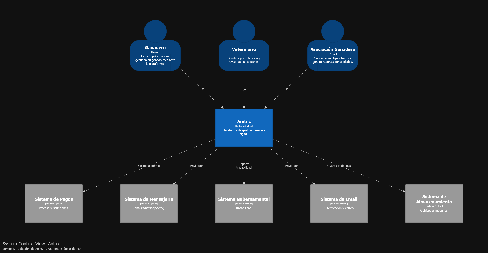
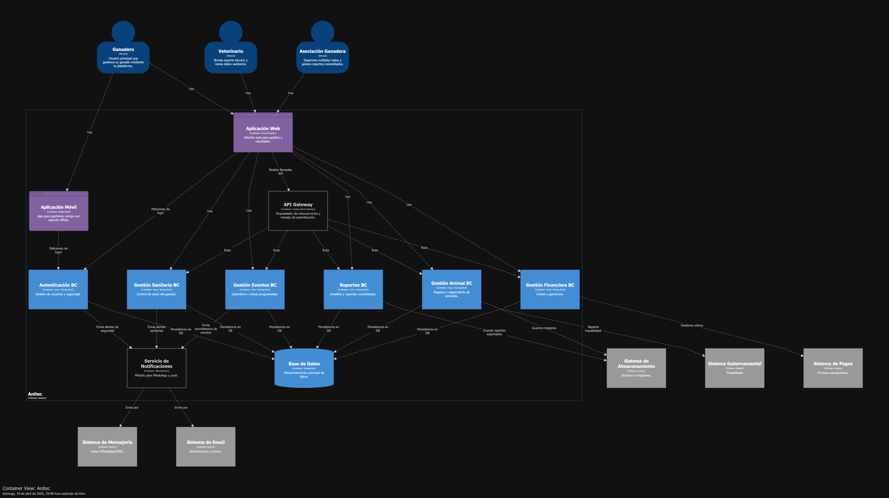

<h1 align="center">Informe del Trabajo Final</h1>
<h3 align="center">Universidad Peruana de Ciencias Aplicadas</h3>
 

  

 
<h5 align="center">Ingeniería de Software</h5>
<h5 align="center">Aplicaciones Web - 1ASI0730</h5>
<h5 align="center">Docente: Angel Augusto Velasquez Nuñez</h5>
<h5 align="center">Startup: Titan</h5>
<h5 align="center">Producto: AniTec</h5>

## Team members:

|               Nombre                |   Código   |
|:-----------------------------------:|:----------:|
|    Ayala Fernandez, Jorge Brayan    | U20241C030 |
|    Huaman Gallardo, Bruno Aldair    | U202117762 |
|    Melgarejo Quiroz, Josep Eliu     | U202315165 |
| Raymundo Villarroel, Nadhim Abigail | U202318001 |
|   Sanchez Silva, Luciana Celeste    | U202215979 |

<h5 align="center"> Ciclo 2026-1 </h5>

## Registro de versiones del informe

| Versión |   Fecha    |                    Autor                    | Descripción de modificación                           |
|:-------:|:----------:|:-------------------------------------------:|-------------------------------------------------------|
|   1.0   | 17/04/2026 | Ayala, Huaman, Melgarejo, Raymundo, Sanchez | Creación del documento de trabajo en formato markdown |
|   1.1   | 21/04/2026 | Ayala, Huaman, Melgarejo, Raymundo, Sanchez | Desarrollo de los capítulos I II III IV |
|   1.2   | 23/04/2026 | Ayala, Huaman, Melgarejo, Raymundo Sanchez |   Corrección de los capítulos I II III IV y desarrollo del capítulo V  |

## Project Report Collaboration Insights

- URL del repositorio para el reporte del proyecto: https://github.com/upc-1asi0730-12206-anitec-team-4/report 
- URL del repositorio para la Landing Page: https://github.com/upc-1asi0730-12206-anitec-team-4/landing-page  
- URL del repositorio para el desarrollo del frontend web applications (VueJS): https://github.com/upc-1asi0730-12206-anitec-team-4/frontend 
- URL del repositorio para el desarrollo del backend web applications (.NET Web API): https://github.com/upc-1asi0730-12206-anitec-team-4/backend

**TB1**

Para el desarrollo del informe perteneciente a la entrega TB1, se dividió la implementación de secciones de la siguiente forma para cada integrante del equipo:

| Integrante       | Tareas Asignadas                                                                                                                                                                            |
|------------------|---------------------------------------------------------------------------------------------------------------------------------------------------------------------------------------------|
| Abigail Raymundo | Desarrollo del Capítulo I, una parte del Capítulo II, así como la parte final del Capítulo V del documento en formato markdown.                                                             |
| Bruno Huaman     | Desarrollo del Capítulo III, desarrollo parcial de capítulo II, así como colaboración en el capítulo V del documento en formato markdown.                                                   |
| Jorge Ayala      | Desarrollo parcial del Capítulo IV, así como colaboración en el capítulo V del documento en formato markdown                                                                                |
| Josep Melgarejo  | Desarrollo parcial del Capítulo IV, así como colaboración en el capítulo V del documento en formato markdown                                                                                |
| Luciana Sanchez  | Desarrollo parcial del Capítulo IV: Diseño del landing page y web application, y actualización del keynote. Además,  colaboró en el desarrollo capítulo V del documento en formato markdown |

El proceso de colaboración en el informe se realizó mediante commits constantes al repositorio de la organización Titan.

**Github Collaboration Insights**

Github también presenta un timeline de las ramas principales y los procesos de merge a los que se han sometido. Todas las ramas se crearon tomando en cuenta el diseño de GitFlow para una buena organización cuando se usa un software de control de versiones.

Los integrantes son:

* Josep Melgarejo (Melga1502)
* Jorge Ayala (jorgeayaladev)
* Huamán Bruno (BrunoHG10)
* Abigail Raymundo (AbigailRV)
* Luciana Sánchez (Luccsss)

Se explican las ramas más prominentes:

- **main**: Es representada por el color blanco. Se trata de la rama principal del proyecto y se actualiza para cada entregable.
- **develop**: Es representada por el color morado. Se trata de la rama principal para el proceso del desarrollo del proyecto.
- **feat/sprint1**: Es representada por el color morado. Esta rama incluye los artefactos relacionados al sprint 1 en el informe.

Los siguientes gráficos representan analíticos de commits en el repositorio del informe. En los gráficos se incluye la cantidad de lineas de texto añadidas por cada integrante del equipo. 

**TB1**

## Student Outcomes
|Criterio especifico|Acciones realizadas|Conclusiones|
|-|:-|-|
|Comunica en forma escrita ideas y/o resultados con objetividad a público de diferentes especialidades y niveles jerarquicos, en el marco del desarrollo de un proyecto en ingeniería| TB1:  Josep Melgarejo  Jorge Ayala   Huaman Bruno  Abigail Raymundo  Luciana Sanchez  ||
|Comunica oralmente sus ideas y/o resultados con objetividad a público de diferentes especialidades y niveles jerarquicos, en el marco del desarrollo de un proyecto en ingeniería.| TB1:  Josep Melgarejo  Jorge Ayala   Huaman Bruno  Abigail Raymundo  Luciana Sanchez ||

## Contenido
1. [Capítulo I: Introducción](#capítulo-i-introducción) 
1.1. [Startup Profile.](#11-startup-profile) 
1.1.1. [Descripción del startup.](#111-descripción-del-startup) 
1.1.2.[Perfiles de los integrantes del equipo.](#112-perfiles-de-los-integrantes-del-equipo) 
1.2. [Solution Profile.](#12-solution-profile) 
1.2.1. [Antecedentes y Problemática.](#121-antecedentes-y-problemática) 
1.2.2. [Lean UX Process.](#122-lean-ux-process) 
1.2.2.1. [Lean UX Problem Statements.](#1221-lean-ux-problem-statements) 
1.2.2.2. [Lean UX Assumptions.](#1222-lean-ux-assumptions) 
1.2.2.3. [Lean UX Hypothesis Statements.](#1223-lean-ux-hypothesis-statements) 
1.2.2.4. [Lean UX Canvas.](#1224-lean-ux-canvas) 
1.3. [Segmentos objetivo.](#13-segmentos-objetivo) 
2. [Capítulo II: Requirements Elicitation & Analysis.](#capítulo-ii-requirements-elicitation--analysis) 
2.1. [Competidores.](#21-competidores) 
2.1.1. [Análisis competitivo.](#211-análisis-competitivo) 
2.1.2. [Estrategias y tácticas frente a competidores.](#212-estrategias-y-tácticas-frente-a-competidores) 
2.2. [Entrevistas.](#22-entrevistas) 
2.2.1. [Diseño de entrevistas.](#221-diseño-de-entrevistas) 
2.2.2. [Registro de entrevistas.](#222-registro-de-entrevistas) 
2.2.3. [Análisis de entrevistas.](#223-análisis-de-entrevistas) 
2.3. [Needfinding.](#23-needfinding) 
2.3.1. [User Personas.](#231-user-personas) 
2.3.2. [User Task Matrix.](#232-user-task-matrix) 
2.3.3. [User Journey Mapping.](#233-user-journey-mapping) 
2.3.4. [Empathy Mapping.](#234-empathy-mapping) 
2.4. [Big Picture EventStorming.](#24-big-picture-eventstorming) 
2.5. [Ubiquitous Language.](#25-ubiquitous-language) 
3. [**Capítulo III: Requirements Specification.**](#capítulo-iii-requirements-specification) 
3.1. [User Stories.](#31-user-stories) 
3.2. [Impact Mapping.](#32-impact-mapping) 
3.3. [Product Backlog.](#33-product-backlog) 
4. [**Capítulo IV: Product Design.**](#capítulo-iv-product-design) 
4.1. [Style Guidelines.](#41-style-guidelines) 
4.1.1. [General Style Guidelines.](#411-general-style-guidelines) 
4.1.2. [Web Style Guidelines.](#412-web-style-guidelines) 
4.2. [Information Architecture.](#42-information-architecture) 
4.2.1. [Organization Systems.](#421-organization-systems) 
4.2.2. [Labeling Systems.](#422-labeling-systems) 
4.2.3. [SEO Tags and Meta Tags](#423-seo-tags-and-meta-tags) 
4.2.4. [Searching Systems.](#424-searching-systems) 
4.2.5. [Navigation Systems.](#425-navigation-systems) 
4.3. [Landing Page UI Design.](#43-landing-page-ui-design) 
4.3.1. [Landing Page Wireframe.](#431-landing-page-wireframe) 
4.3.2. [Landing Page Mock-up.](#432-landing-page-mock-up) 
4.4. [Web Applications UX/UI Design.](#44-web-applications-uxui-design) 
4.4.1. [Web Applications Wireframes.](#441-web-applications-wireframes) 
4.4.2. [Web Applications Wireflow Diagrams.](#442-web-applications-wireflow-diagrams) 
4.4.3. [Web Applications Mock-ups.](#443-web-applications-mock-ups) 
4.4.4. [Web Applications User Flow Diagrams.](#444-web-applications-user-flow-diagrams) 
4.5. [Web Applications Prototyping.](#45-web-applications-prototyping) 
4.6. [Domain-Driven Software Architecture.](#46-domain-driven-software-architecture) 
4.6.1. [Design Level EventStorming.](#461-design-level-eventstorming) 
4.6.2. [Software Architecture Context Diagram.](#462-software-architecture-context-diagram)  
4.6.3. [Software Architecture Container Diagrams.](#463-software-architecture-container-diagrams) 
4.6.4. [Software Architecture Components Diagrams.](#464-software-architecture-components-diagrams) 
4.7. [Software Object-Oriented Design.](#47-software-object-oriented-design) 
4.7.1. [Class Diagrams.](#471-class-diagrams) 
4.7.2. [Class Dictionary.](#472-class-dictionary) 
4.8. [Database Design.](#48-database-design) 
4.8.1. [Database Diagram.](#481-database-diagram) 
5. [Capítulo V: Product Implementation, Validation & Deployment.](#capítulo-v-product-implementation-validation--deployment) 
5.1. [Software Configuration Management.](#51-software-configuration-management) 
5.1.1. [Software Development Environment Configuration.](#511-software-development-environment-configuration) 
5.1.2. [Source Code Management.](#512-source-code-management) 
5.1.3. [Source Code Style Guide & Conventions.](#513-source-code-style-guide--conventions) 
5.1.4. [Software Deployment Configuration.](#514-software-deployment-configuration) 
5.2. [Landing Page, Services & Applications Implementation.](#52-landing-page-services--applications-implementation) 
5.2.1. [Sprint 1.](#521-sprint-1) 
5.2.1.1. [Sprint Planning 1.](#5211-sprint-planning-1) 
5.2.1.2. [Aspects leaders and collaborators.](#5212-aspects-leaders-and-collaborators) 
5.2.1.3. [Sprint Backlog 1.](#5213-sprint-backlog-1) 
5.2.1.4. [Development Evidence for Sprint Review.](#5214-development-evidence-for-sprint-review) 
5.2.1.5. [Execution Evidence for Sprint Review.](#5215-execution-evidence-for-sprint-review) 
5.2.1.6. [Services Documentation Evidence for Sprint Review.](#5216-services-documentation-evidence-for-sprint-review) 
5.2.1.7. [Software Deployment Evidence for Sprint Review.](#5217-software-deployment-evidence-for-sprint-review) 
5.2.1.8. [Team Collaboration Insights during Sprint.](#5218-team-collaboration-insights-during-sprint) 
6. [Conclusiones.](#conclusiones) 
7. [Bibliografía.](#bibliografía) 
8. [Anexos.](#anexos) 

## Capítulo I: Introducción
### 1.1. Startup Profile
En esta sección se presenta la descripción del startup y los perfiles de los miembros del equipo.
#### 1.1.1. Descripción del startup.
Titan es una startup enfocada en brindar soluciones tecnológicas accesibles y efectivas para los pequeños y medianos ganaderos de Latinoamérica. A través de una plataforma web intuitiva, AniTec digitaliza la gestión del ganado mediante una estructura organizada en módulos clave que abarcan toda la operación productiva.

La plataforma organiza la vida productiva del ganado en los siguientes módulos clave:

- Gestión integral de animales, incluyendo el registro individual (raza, edad, sexo y estado de salud), así como su listado, búsqueda, filtrado, edición y eliminación.
- Registro y gestión del historial de las visitas médicas por cada animal
- Calendario sanitario (eventos, vacunas, tratamientos)
- Control económico (ingresos, egresos)
- Visualización de reportes y estadísticas, con alertas automáticas según análisis de tendencias del ganado.

Gracias a la integración de datos históricos y actualizados en tiempo real, AniTec permite a los ganaderos tomar decisiones informadas, mejorar la productividad, reducir pérdidas operativas y optimizar el control sanitario del ganado. De esta manera, se transforma la gestión tradicional en una ganadería más inteligente, eficiente y sostenible.

**Misión:** Revolucionar la gestión y trazabilidad del ganado en pequeños y medianos hatos ganaderos de Latinoamérica, mediante una plataforma digital accesible que optimice los procesos productivos, sanitarios y económicos.

**Visión:** AniTec se proyecta como una de las plataformas más destacadas del sector ganadero en el registro y control integral de animales durante los próximos tres años. La startup busca consolidarse como un modelo de negocio sostenible, confiable y orientado a la mejora continua de la productividad rural a través de tecnología simple y efectiva.

#### 1.1.2. Perfiles de los integrantes del equipo.

<table>
  <tr>
    <td width="30%" align="center">
      
    </td>
    <td width="70%">
      <h3>Luciana Celeste Sanchez Silva</h3>
      <h4>U202215979</h4>
      

        Mi nombre es Luciana Celeste Sanchez Silva, tengo 20 años y vivo en Lima. En la actualidad, me encuentro estudiando el 6to ciclo de la carrera de ingeniería de software en la UPC debido a que desde una edad temprana tuve una fascinación relacionada con el uso de la tecnología y la programación. En mi tiempo libre trato de crecer y expandir mi conocimiento en todas las áreas posibles. De igual forma, me gusta nadar, escuchar música y tocar la guitarra. Me comprometo a colaborar en todo momento con la elaboración de esta startup, y llegar a un trabajo sobresaliente. Mis habilidades son: responsabilidad, resolución de problemas, y disciplina.
      

    </td>
  </tr>

   <tr>
    <td width="30%" align="center">
      
    </td>
    <td width="70%">
      <h3>Josep Eliu Melgarejo Quiroz</h3>
      <h4>u202315165</h4>
      

        Mi nombre es Josep Eliu Melgarejo Quiroz, tengo 21 años y mi lugar de nacimiento es Huaral pero vivo actualmente en Lima - San miguel, me encuentro cursando el 5to ciclo de la carrera de ingenieria de software en la UPC debido a que siempre me fascino el tema tecnologico, y como era un apasionado por lo juegos que luego me conllevaron a conocer el mundo de la programacion decidi estudiar mi carrera. Me comprometo a siempre apoyar y motivar a mis compañeros en hacer el mejor trabajo posible y dar el 100% de capacidad en este trabajo
      

    </td>
  </tr>

   <tr>
    <td width="30%" align="center">
      
    </td>
    <td width="70%">
      <h3>Abigail Nadhim Raymundo Villarroel</h3>
      <h4>U202318001</h4>
      

        Mi nombre es Abigail Nadhim Raymundo Villarroel, tengo 20 años y vivo en Lima. Actualmente estoy cursando el 5° ciclo de Ingeniería de Software, avanzando algunos cursos del ciclo superior. Desde siempre me ha apasionado crear, diseñar y programar para ofrecer soluciones, me gusta aprender constantemente para ampliar mis conocimientos y perfil profesional. Además, me encuentro en el nivel intermedio de inglés y me interesan mucho los idiomas, por lo que también estoy aprendiendo francés y portugués. En mi tiempo libre, disfruto dibujar, bailar y cantar, actividades que me ayudan a mantener mi creatividad y energía. Me comprometo a aportar con responsabilidad y dedicación al equipo, trabajar de manera colaborativa y contribuir a que juntos podamos desarrollar un proyecto sobresaliente. Mis principales habilidades incluyen creatividad, disciplina y trabajo en equipo, cualidades que aplico para lograr resultados efectivos y de calidad.
      

    </td>
  </tr>

   <tr>
    <td width="30%" align="center">
      
    </td>
    <td width="70%">
      <h3>Bruno Aldair Huaman Gallardo</h3>
      <h4>U202117762</h4>
      

        Mi nombre es Bruno Aldair Huaman Gallardo, tengo 21 años y vivo en Lima. Actualmente soy estudiante de Ingeniería de Software, me apasiona transformar ideas en realidades funcionales; desde el diseño de arquitecturas de red hasta la implementación de sistemas inteligentes. Soy una persona que valora el aprendizaje continuo, lo que me ha llevado a dominar herramientas como SQL Server, Node.js y Java, además de mantenerme en constante mejora de mi nivel de inglés para fortalecer mi perfil global. Me distingo por mi autodisciplina y mentalidad analítica, lo que me permite abordar desafíos técnicos con orden y eficiencia. Busco sumar al equipo no solo mis conocimientos en desarrollo, sino también mi compromiso con la calidad y la mejora continua. Soy un convencido de que la tecnología, cuando se maneja con creatividad y rigor, puede optimizar cualquier entorno.
      

    </td>
  </tr>

   <tr>
    <td width="30%" align="center">
      
    </td>
    <td width="70%">
      <h3>Jorge Brayan Ayala Fernandez</h3>
      <h4>U20241C030</h4>
      

        Mi nombre es Jorge Brayan Ayala Fernandez, tengo 20 años y vivo en Lima - Comas. Actualmente estoy cursando el 5to ciclo de la carrera de Ingeniería de Software. Me encanta examinar diversas problemáticas y crear soluciones a los retos que ocurren en el día a día. Me desempeño principalmente en el área de desarrollo web, mobile y desktop en lo cuales tuve experiencia anteriormente trabajando para proyectos relacionados a ello donde se desplegaron aplicaciones a producción satisfaciendo las demandas de los clientes en ese entonces. En cuanto a mis pasatiempos, me encanta salir a hacer todo tipo de deporte, escuchar música, mirar películas, series y programar activamente. En la medida de lo posible aportaré al grupo de manera colaborativa en las diversas tareas que haya para mejorar el producto que estamos creando.
      

    </td>
  </tr>
</table>

### 1.2. Solution Profile
#### 1.2.1. Antecedentes y Problemática.

**Qué (What)**
 
*¿Cuál es la situación problemática?*

Muchos pequeños y medianos ganaderos no manejan de manera adecuada la información de su ganado. Dependiendo de métodos manuales como cuadernos o hojas sueltas para registrar salud, vacunas, productividad y reproducción, los errores y olvidos son frecuentes, reduciendo la eficiencia. Esta situación limita la trazabilidad, dificulta cumplir con las regulaciones y restringe el acceso a mejores oportunidades de mercado.

**Cuándo (When)**

*¿Cuándo ocurre el problema?*

La problemática se presenta de forma continua a lo largo de todo el ciclo de vida del ganado, desde el nacimiento hasta la venta o comercialización. La ausencia de un control sistemático afecta diariamente la operación del productor.

**Dónde (Where)**

*¿Dónde se manifiesta?*

Se trata de un desafío estructural que limita el desarrollo del sector ganadero rural, afectando su competitividad y sostenibilidad en los mercados locales e internacionales.

*¿Dónde se origina el problema?*

Principalmente en zonas rurales de América Latina, donde se concentra gran parte de la producción ganadera de pequeña y mediana escala.

**Quién (Who)**

*¿Quiénes participan en la problemática?*

Están involucrados los ganaderos de pequeña y mediana escala, asociaciones ganaderas, técnicos agropecuarios y organismos públicos que promueven la trazabilidad y la formalización del sector.

*¿Quiénes usarán la plataforma?*

Principalmente los ganaderos interesados en mejorar la productividad, control y trazabilidad de sus hatos, así como los técnicos que los asesoran en campo.

**Por qué (Why)**

*¿Cuál es la causa principal del problema?*

La falta de herramientas tecnológicas adaptadas al contexto rural, el desconocimiento sobre la relevancia de la trazabilidad y la limitada asistencia técnica han llevado a que muchos productores sigan empleando métodos manuales poco eficientes.

**Cómo (How)**

*¿Cómo se implementará la solución?*

AniTec será una plataforma web accesible desde dispositivos móviles o computadoras, donde los ganaderos podrán registrar los datos de cada animal, recibir alertas sanitarias, gestionar ingresos y gastos, consultar reportes y acceder a contenido educativo de manera intuitiva, sin necesidad de conocimientos técnicos avanzados.

*¿Cómo se logrará una gestión eficiente dentro de la plataforma?*

Mediante un diseño modular, simple y adaptable que permita ingresar y visualizar información clave del ganado. La plataforma contará con alertas automáticas, reportes descargables y funcionalidades offline, además de una sección de capacitación llamada “Academia Ganadera” para asegurar el uso correcto de todas las herramientas.

**Cuánto (How much)**

*¿Cuál es la magnitud del problema?*

Más del 70% de los pequeños ganaderos carecen de sistemas de registro adecuados, lo que provoca pérdidas de animales, baja productividad, incumplimiento de normas sanitarias y dificultades para acceder a mercados formales.

*¿Qué porcentaje de la industria podría beneficiarse?*

Se estima que entre el 40% y 60% de los ganaderos familiares y asociaciones podrían mejorar significativamente su gestión mediante AniTec, especialmente en zonas rurales donde la tecnología aún es limitada pero está en expansión.

#### 1.2.2. Lean UX Process.
##### 1.2.2.1. Lean UX Problem Statements.

**Problem Statement:**

AniTec busca ofrecer a pequeños y medianos ganaderos una plataforma digital sencilla y accesible que les permita registrar, organizar y supervisar la información clave de su hato. El objetivo es optimizar los procesos sanitarios, reproductivos y económicos, los cuales actualmente se manejan de manera manual y poco organizada.

Hoy en día, muchos ganaderos llevan un control limitado o inexistente de su ganado, utilizando cuadernos o herramientas digitales improvisadas. Esta dependencia de métodos tradicionales genera errores en los registros, omisión de vacunas o tratamientos, pérdida de información y escasa trazabilidad, afectando la productividad, el cumplimiento normativo y la posibilidad de acceder a mejores precios.

La carencia de herramientas adecuadas limita la toma de decisiones informadas y sostenibles, frenando el crecimiento y competitividad de los productores.

*Pregunta clave:*
¿Cómo podemos digitalizar y automatizar la gestión de información del ganado para que los pequeños productores optimicen sus procesos sin depender de registros manuales ni perder datos importantes?

##### 1.2.2.2. Lean UX Assumptions.
###### **Business Assumptions:**
1. **Creemos que nuestros usuarios necesitan** un método confiable y eficiente para registrar y supervisar la salud, productividad y trazabilidad de su ganado.
2. **Creemos que esta necesidad puede satisfacerse** mediante una plataforma web accesible que permita registrar información clave, generar alertas automáticas y crear reportes útiles para la toma de decisiones.
3. **Creemos que nuestros primeros usuarios serán** pequeños y medianos ganaderos con acceso a teléfono o computadora, así como técnicos agropecuarios que asesoran directamente en el campo.
4. **Creemos que lo más importante para los clientes es** contar con un control ordenado y automatizado del ganado, evitando pérdidas y cumpliendo los requisitos de trazabilidad para mejorar la comercialización.
5. **Creemos que los usuarios también recibirán** alertas sanitarias, reportes económicos, acceso al historial de cada animal y contenido educativo dentro de la plataforma.
6. **Creemos que conseguiremos clientes mediante** alianzas con asociaciones ganaderas, programas de desarrollo rural y campañas digitales dirigidas a regiones con alta actividad ganadera.
7. **Creemos que los ingresos se generarán mediante** un modelo de suscripción mensual con planes ajustados al tamaño del hato, y licencias institucionales para asociaciones y entidades del sector agropecuario.
8. **Creemos que nuestra competencia incluye** aplicaciones genéricas de gestión ganadera, hojas de cálculo y métodos tradicionales de registro manual.
9. **Creemos que nuestra ventaja competitiva radica en** ofrecer una solución adaptada al contexto rural, fácil de usar, con enfoque educativo y diseñada específicamente para pequeños y medianos productores.
10. **Creemos que un riesgo importante es** que algunos ganaderos no adopten fácilmente la tecnología por factores culturales o falta de experiencia digital.
11. **Creemos que lo mitigaremos mediante** capacitaciones virtuales, diseño de interfaz intuitiva, tutoriales paso a paso y el soporte de la “Academia Ganadera”.

###### **User Assumptions:**

###### **¿Quién es el usuario?**
Creemos que los principales usuarios son pequeños y medianos ganaderos y técnicos agropecuarios que asesoran en campo. Creemos que, en etapas posteriores, la plataforma también podría ser utilizada por asociaciones, cooperativas y entidades públicas vinculadas a sanidad, trazabilidad y formalización del sector.

###### **¿Qué problemas busca resolver nuestro producto?**
Creemos que AniTec ayuda a organizar la información del hato, evitando la pérdida de datos importantes y solucionando la falta de seguimiento de vacunas, partos, tratamientos y control económico. Creemos que esto impacta directamente en la rentabilidad del ganadero y en el cumplimiento de normativas de mercado.

###### **¿Qué características son importantes?**
Creemos que los usuarios valoran el registro individual de cada animal (edad, raza, salud, productividad), alertas automáticas, reportes económicos simples, historial completo del hato y contenido educativo práctico. Creemos que la facilidad de uso, incluso sin conexión a internet, es esencial para su adopción en zonas rurales.

###### **¿Dónde encaja nuestro producto en su trabajo o vida?**
Creemos que AniTec se integra en la rutina diaria del ganadero, mejorando la planificación, reduciendo pérdidas, facilitando el cumplimiento de normativas y permitiendo decisiones informadas, lo que aumenta su rentabilidad y calidad de vida.

###### **¿Cuándo y cómo se usa nuestro producto?**
Creemos que se utiliza cada vez que se registra un animal, tratamiento, parto, control de ingresos o productividad, y también para analizar datos históricos para tomar decisiones estratégicas. Creemos que puede usarse desde celular o computadora, tanto en campo como en casa.

###### **¿Cómo debe verse nuestro producto y cómo debe comportarse?**
Creemos que AniTec debe tener una interfaz intuitiva, amigable y estable, pensada para usuarios con poca experiencia tecnológica. Creemos que debe proteger los datos del ganadero, transmitir confianza y eficiencia, y reflejar cercanía con el contexto rural.

###### **Feature Assumptions:**
- **Creemos que** la plataforma debe ser accesible desde móviles y computadoras, fácil de usar incluso por usuarios sin experiencia tecnológica.
- **Creemos que** debe incluir alertas personalizables sobre vacunas, tratamientos, partos y fechas importantes.
- **Creemos que** debe permitir un registro detallado de cada animal (peso, salud, reproducción, ingresos y egresos) para análisis histórico y toma de decisiones.
- **Creemos que** debe contar con un módulo de reportes y gráficos visuales que permita monitorear la evolución del hato, facilitar decisiones y demostrar trazabilidad ante compradores y autoridades.

##### 1.2.2.3. Lean UX Hypothesis Statements.

* **Hypothesis Statement 01:**
    
    **Creemos que** los pequeños y medianos ganaderos adoptarán AniTec para registrar digitalmente toda la información de su ganado, incluyendo datos sanitarios, reproductivos y económicos.
  
    **Sabremos** que hemos tenido éxito.
    
    **Cuando** al menos el 50% de los usuarios registrados utilicen activamente la plataforma durante los tres primeros meses después de su lanzamiento.
  
* **Hypothesis Statement 02:**
    
    **Creemos que** las alertas automáticas sobre vacunación, tratamientos y eventos reproductivos ayudarán a los ganaderos a prevenir descuidos y pérdidas relacionadas con la salud y productividad del hato.
    
    **Sabremos** que hemos tenido éxito.
    
    **Cuando** al menos un 40% de los usuarios reporten haber evitado incidentes sanitarios o errores de registro gracias a las alertas de GanTrace.

* **Hypothesis Statement 03:**
    
    **Creemos que** el acceso a reportes visuales y al historial completo de cada animal permitirá a los ganaderos tomar decisiones más acertadas sobre ventas, reproducción y manejo económico.
    
    **Sabremos** que hemos tenido éxito.
    
    **Cuando** al menos un 60% de los usuarios indiquen que sus decisiones estratégicas se basaron en la información proporcionada por GanTrace.

* **Hypothesis Statement 04:**
    
    **Creemos que** el uso de AniTec reducirá los errores comunes en los métodos tradicionales (cuadernos, hojas de cálculo) y mejorará la organización general de la información del hato.
    
    **Sabremos** que hemos tenido éxito.
    
    **Cuando** se observe una disminución de al menos el 50% en errores de registro (omisiones, datos incompletos o duplicados) después de tres meses de uso continuo de la plataforma.
  
##### 1.2.2.4. Lean UX Canvas.
El Lean UX Canvas es una herramienta utilizada en el marco del diseño centrado en el usuario (UX) y la metodología Lean, cuyo objetivo es apoyar la creación y mejora de productos de manera ágil y eficiente. Su propósito principal es proporcionar una estructura organizada que fomente la colaboración entre equipos multidisciplinarios. A continuación, se presenta el Lean UX Canvas elaborado por el equipo utilizando la plataforma digital Mural.

Enlace para acceder al [Canvas](https://app.mural.co/t/abbys5223/m/abbys5223/1776842322847/c87d07f08ed60b5b4bd30ba955608fa8ce7d468a?sender=u5608641741a75560d5d68781)

### 1.3. Segmentos objetivo.
De acuerdo con el Ministerio de Desarrollo Agrario y Riego (MIDAGRI, 2023), el Perú cuenta con más de 5 millones de cabezas de ganado vacuno, siendo la ganadería una actividad clave en regiones como Cajamarca, Puno, Cusco y La Libertad. El valor bruto de la producción ganadera supera los 3 mil millones de soles anuales, y más del 65 % de estas unidades son manejadas por pequeños y medianos productores, quienes en muchos casos no disponen de herramientas tecnológicas para una gestión eficiente de sus hatos.

A pesar de los avances en otros sectores agropecuarios, la ganadería peruana todavía depende mayoritariamente de registros manuales para controlar vacunaciones, nacimientos, peso, alimentación y reproducción. Esta falta de sistematización limita la trazabilidad y dificulta la toma de decisiones estratégicas en los negocios ganaderos.

Con la proyección de un aumento del 70 % en la demanda mundial de alimentos para 2050 (FAO, 2021), se hace cada vez más urgente incorporar tecnologías digitales en el sector ganadero. AniTec busca centralizar y automatizar la gestión del ganado mediante una plataforma accesible, capaz de registrar datos en tiempo real y generar indicadores clave de desempeño. Esto permitiría mejorar la rentabilidad y eficiencia de los hatos, así como incrementar la competitividad del país en mercados de exportación de carne y leche.

Entre los posibles usuarios se encuentran empresas formales como Gloria S.A. o Laive, cooperativas como COLPA en Cajamarca, así como asociaciones de pequeños productores interesados en digitalizar sus procesos para facilitar el acceso a créditos, certificaciones sanitarias y mercados más exigentes.

<h4> 1.3.1 Stakeholders.</h4>

* **Stakelholder Internos:** Equipo Titan y resto de integrantes del equipo de desarrollo.
* **Stakelholder Externos:** Técnicos ganaderos, veterinarios y responsables de campo en unidades ganaderas, Administradores de cooperativas o asociaciones ganaderas, estudiantes de medicina veterinaria y carreras agropecuarias.

## Capítulo II: Requirements Elicitation & Analysis
### 2.1. Competidores.

Comprender el entorno competitivo es crucial para el éxito de cualquier negocio. En esta sección realizaremos un análisis profundo de nuestros competidores, tanto directos como indirectos, evaluando las estrategias que aplican, así como sus principales fortalezas y debilidades.

#### 2.1.1. Análisis competitivo.

Llevar a cabo un análisis competitivo es clave para reconocer oportunidades y riesgos en el mercado, así como para posicionar a AniTec de manera estratégica. Este análisis permite comprender cómo los competidores atienden las necesidades de los clientes, identificar vacíos en el mercado y destacar nuestra solución a través de ventajas diferenciadoras. También facilita la elaboración de estrategias más efectivas de marketing, precios y distribución, garantizando una propuesta de valor sólida y sostenible.

<html>
<body>
    <table >
        <tr>
           <td colspan="6" class="sub">  <h1>Competitive Analysis Landscape</h1></td>
        </tr>
        <tr>
            <td colspan="2" rowspan="2" class="sub">¿Por qué llevar acabo este análisis?</td>
            <td colspan="4" class="sub"><h3>¿Quiénes son nuestros principales competidores?</h3></td>
        </tr>
        <tr>
            <td colspan="4">Gracias al análisis de la competencia perteneciente al mercado, se logra comprender el entorno competitivo 
                en el que operará nuestro producto. Ello proporciona una visión detallada de quienes son nuestros competidores 
                directos e indirectos, trazar estrategia a través de información recopilada sobre  su posicionamiento actual en el mercado.</td>
        </tr>
        <tr>
            <td rowspan="3" class="sub">PERFIL</td>
            <td rowspan="2" class="sub">Overview</td>
            <td> AniTec </td>
            <td> Livestock Manager </td>
            <td> AgriTrack </td>
            <td> FarmLogs </td> 
        </tr>
        <tr>
            <td>Plataforma web y móvil diseñada para pequeños y medianos ganaderos en Latinoamérica, enfocada en trazabilidad, gestión sanitaria y educación.</td>
            <td>Aplicación móvil y web para gestión de hatos ganaderos, enfocada en registro sanitario y productividad.</td>
            <td>Plataforma multifuncional para gestión agrícola y ganadera, con módulos de cultivo, inventario y finanzas.</td>
            <td>Herramienta global para gestión agrícola, con funcionalidades básicas de ganadería.</td>      
        </tr>
        <tr>
            <td class="sub">Ventaja Competitiva ¿Qué valor ofrece a los clientes?</td>
            <td>Enfocado a la ganadería y la trazabilidad individual el hato a precios accesibles para los ganaderos</td>
            <td>Integración con dispositivos IoT. Reportes automatizados para exportación a autoridades sanitarias.</td>
            <td>Versatilidad: integra cultivos y ganado en una sola plataforma. Análisis predictivo basado en clima y mercado.</td>
            <td>Reconocimiento de marca internacional. Integración con mercados globales de commodities.</td>      
        </tr>
        <tr>
            <td rowspan="2" class="sub">PERFIL DEL MARKETING</td>
            <td class="sub" >Mercado Objetivo</td>
            <td>Pequeños productores (5-100 cabezas de ganado) y técnicos agropecuarios.</td>
            <td>Medianos y grandes ganaderos con acceso a tecnología avanzada.</td>
            <td>Agricultores y ganaderos diversificados en zonas semiurbanas.</td>
            <td>Grandes empresas agroindustriales con enfoque exportador.</td>
        </tr>
        <tr>
            <td class="sub">Estrategias de Marketing</td>
            <td>Alianzas con asociaciones ganaderas y programas gubernamentales. Talleres presenciales en zonas rurales.</td>
            <td>Alianzas con empresas de insumos veterinarios. Publicidad en ferias ganaderas y redes sociales especializadas.</td>
            <td>Contenido educativo en YouTube y webinars. Descuentos por volumen para cooperativas.</td>
            <td>Campañas en medios internacionales (The Economist, Bloomberg).Acuerdos con distribuidores de maquinaria agrícola.</td>
        </tr>
        <tr>
            <td rowspan="3" class="sub">PERFIL DEL PRODUCTO</td>
            <td class="sub">Productos & Servicios</td>
            <td>Plataforma móvil y web para gestión de hatos ganaderos</td>
            <td>Plataforma móvil y web para gestión de hatos ganaderos.</td>
            <td>Plataforma multifuncional para gestión agrícola y ganadera.</td>
            <td>Herramienta global para gestión agrícola y ganadera, con énfasis en mercados formales.</td>
        </tr>
        <tr>
            <td class="sub">Precios & Costos</td>
            <td>Basico: $10/mes Premium: $25/mes y Empresarial: $50/mes</td>
            <td>Básico: $20/mes Premium: $100/mes.</td>
            <td>Solo ganado: $15/mes Full agro: $50/mes.</td>
            <td>Básico: $30/mes Empresarial: $200/mes.</td>
        </tr>
        <tr>
            <td class="sub">Canales de distribución (web/móvil)</td>
            <td>Plataforma web, app móvil y colaboración con ONGs rurales.</td>
            <td>Venta directa en su sitio web y app stores.</td>
            <td>Distribución mediante cooperativas agrícolas.</td>
            <td>Venta directa y partners estratégicos en EE.UU. y Europa.</td>        
        </tr>
        <tr>
            <td rowspan="4" class="sub">ANÁLISIS SWOT</td>
            <td class="sub">Fortalezas</td>
            <td>Diseño accesible para baja conectividad. Costos accesibles y planes de acuerdo al tamaño de la finca.</td>
            <td>Tecnología IoT innovadora. Cumplimiento normativo automático.</td>
            <td>Solución integral para agro. Precios accesibles.</td>
            <td>Enfoque en mercados globales. Datos en tiempo real de mercados.</td>
        </tr>
        <tr>
            <td class="sub">Debilidades</td>
            <td>Dependencia de alianzas para distribución. </td>
            <td>Alto costo para pequeños productores. Interfaz compleja para usuarios rurales.</td>
            <td>Funcionalidades ganaderas menos desarrolladas. Falta de enfoque en trazabilidad sanitaria.</td>
            <td>Precios elevados para Latinoamérica. Poca adaptación a necesidades locales.</td>  
        </tr>
        <tr>
            <td class="sub">Oportunidades</td>
            <td>Demanda creciente de trazabilidad en exportaciones.Subsidios gubernamentales para digitalización rural.</td>
            <td>Expansión a mercados formales (exportación). Alianzas con gobiernos para subsidios.</td>
            <td>Crecimiento de la agricultura de precisión. Demanda de análisis predictivo.</td>
            <td>Expansión a Latinoamérica con socios locales. Demanda de trazabilidad para exportación.</td> 
        </tr>
        <tr>
            <td class="sub">Amenazas</td>
            <td>Competidores globales con más recursos. Resistencia a adoptar tecnología en productores tradicionales.</td>
            <td>Competencia con soluciones low-cost. Resistencia al cambio en ganaderos tradicionales.</td>
            <td>Especialización de competidores como GanTrace. Saturación de plataformas multifuncionales.</td>
            <td>Competencia de startups regionales. Barreras culturales y idiomáticas.</td>          
        </tr>
    </table>
</body>
</html>

#### 2.1.2. Estrategias y tácticas frente a competidores.

Entre las principales estrategias y tácticas que ejecutaremos como startup son las siguientes:

Por un lado, estas son las estrategias preliminares:

- Incursión en sectores rurales a través de alianzas con gremios ganaderos de la zona y organizaciones no gubernamentales.
- Capacitación tecnológica gradual mediante material multimedia diseñado para personas con conocimientos digitales limitados.
- Optimización de la asistencia técnica utilizando medios de contacto directos como llamadas telefónicas o WhatsApp.
- Generación de utilidad inmediata, brindando notificaciones en tiempo real, análisis de datos de valor y funciones sin costo.
  
Por otro lado, estas son nuestras tácticas específicas:

- Campañas de referidos para incentivar la difusión entre los mismos productores.
- Entorno virtual gamificado para motivar el uso frecuente de la aplicación.
- Adaptación regional del sistema, empleando modismos locales y asistencia personalizada según la zona.
- Presencia en eventos del sector, tales como ferias del campo y convenciones agropecuarias.

### 2.2. Entrevistas.

Las entrevistas son una herramienta esencial para comprender a fondo a nuestro público objetivo. Para que sean efectivas, deben seguir una estructura clara y directa, utilizando preguntas específicas que permitan recolectar información de valor y datos precisos de los participantes.

<h4> 2.2.1. Diseño de entrevistas. </h4>

Objetivo: Identificar frustraciones, necesidades, dispositivos disponibles, grado de digitalización y percepción sobre el registro de información ganadera.

#### 2.2.1. Diseño de entrevistas.

###### Segmentos entrevistados:

- Ganaderos

- Veterinarios

Formato: Entrevistas semiestructuradas, de 25-30 minutos, registradas en video con consentimiento.

Preguntas dirigidas al personal de **Ganaderos**.

Preguntas principales:

- ¿Podría indicarnos su nombre completo y su edad?

- ¿Cuánto tiempo lleva dedicado a la ganadería? ¿Qué tipo de ganado maneja actualmente?

- ¿Cuál es el tamaño aproximado de su ganado? ¿Y cuántas personas trabajan en su unidad ganadera?

- ¿Qué herramientas utiliza actualmente para llevar el control de sus animales y sus actividades?

- ¿Lleva algún registro sobre la salud, alimentación o reproducción de su ganado? ¿Cómo lo hace?

- ¿Cuáles son las principales dificultades que enfrenta en la gestión diaria del ganado?

- ¿Cómo monitorea actualmente la productividad y salud de su ganado?

- ¿Qué tan importante considera llevar un control digital del historial veterinario y productivo de cada animal?

- ¿Ha enfrentado problemas por no tener registros claros (por ejemplo, en ventas, enfermedades o reproducción)?

- ¿Confía en herramientas digitales o ha probado alguna aplicación para el manejo ganadero?

- ¿Cuánto tiempo promedio dedica al registro manual de datos (si lo realiza)?

- ¿Qué tipo de información considera más importante tener a la mano sobre su ganado?

- ¿Estaría dispuesto a usar una aplicación móvil/web para llevar el control del ganado si fuera sencilla y funcional?

- ¿Qué funcionalidades le gustaría que tenga esta herramienta (alertas, historial médico, reproductivo, reportes, etc.)?
  
- ¿Qué beneficios espera al adoptar una herramienta digital para su ganadería?

###### Preguntas dirigidas a los **Veterinarios**

Preguntas principales:

- ¿Podría proporcionarnos su nombre completo y su edad?

- ¿Cuánto tiempo lleva ejerciendo como veterinario y en qué región trabaja principalmente?

- ¿Está especializado en atención ganadera? ¿Qué tipo de ganado atiende con más frecuencia?

- ¿Cómo realiza el seguimiento del historial médico de los animales que atiende?

- ¿Utiliza actualmente alguna herramienta digital para llevar registros veterinarios?

- ¿Qué información considera fundamental registrar tras una consulta o intervención (vacunas, tratamientos, diagnóstico)?

- ¿Cómo se comunica con los ganaderos respecto al seguimiento o tratamientos posteriores?

- ¿Con qué frecuencia atiende emergencias ganaderas? ¿Cómo coordina este tipo de intervenciones?

- ¿Ha tenido casos donde la falta de información del animal haya afectado la efectividad del tratamiento?

- ¿Qué retos encuentra en su trabajo relacionado con el registro o gestión de información?

- ¿Le resultaría útil tener acceso al historial médico del animal antes de una consulta?

- ¿Qué tan dispuesto estaría a utilizar una aplicación móvil/web para registrar y acceder al historial de sus pacientes?

- ¿Qué funcionalidades considera clave en una herramienta digital veterinaria (calendario, historial, recordatorios, fichas clínicas)?

- ¿Cómo podría mejorar su trabajo con una solución que conecte a veterinarios con ganaderos en tiempo real?

- ¿Qué tan importante considera el análisis de datos (estadísticas de salud, tratamientos más comunes, etc.) en su labor?

###### Preguntas complementarias (para ambos segmentos):

- ¿Qué expectativas tendría sobre una plataforma digital que centralice la información ganadera y veterinaria?

- ¿Qué dispositivos usa con más frecuencia para sus actividades laborales (celular, laptop, tablet)? ¿Está familiarizado con el uso de apps?

- ¿Qué es lo que más valora en una herramienta digital: rapidez, facilidad de uso, seguridad de datos u otro aspecto?

###### Preguntas principales (comunes):

1. ¿Cómo lleva actualmente el registro de su ganado (peso, salud, vacunas)?

2. ¿Qué desafíos ha enfrentado por llevar registros manuales?

3. ¿Qué tan cómodo se siente utilizando un celular o computadora?

4. ¿Le sería útil recibir alertas de vacunación o reproducción?

5. ¿Ha perdido información relevante alguna vez?

6. ¿Qué contenido educativo le interesaría tener en una app?

7. ¿Qué canales digitales usa actualmente (WhatsApp, redes sociales, etc.)?

Variables demográficas a recolectar: Edad, género, distrito de residencia, educación, tipo de hacienda, frecuencia de registros, ocupación alterna, herramientas digitales que maneja, tipo de celular, acceso a internet, objetivos personales, frustraciones, marcas preferidas, influencia de técnicos o asociaciones.

#### 2.2.2. Registro de entrevistas.

**Entrevista a Ganaderos**

|Entrevistado 1|nombre|
|-|-|
|Edad|nro|
|Distrito|nombre dist|
||descripcion|
|Timing:  |URL: 

|Entrevistado 2|nombre|
|-|-|
|Edad|nro|
|Distrito|nombre dist|
||descripcion|
|Timing:  |URL: 

|Entrevistado 3|nombre|
|-|-|
|Edad|nro|
|Distrito|nombre dist|
||descripcion|
|Timing:  |URL: 

**Entrevista a Veterinarios**

|Entrevistado 4|nombre|
|-|-|
|Edad|nro|
|Distrito|nombre dist|
||descripcion|
|Timing:  |URL: 

|Entrevistado 5|nombre|
|-|-|
|Edad|nro|
|Distrito|nombre dist|
||descripcion|
|Timing:  |URL: 

#### 2.2.3. Análisis de entrevistas.

##### Análisis del segmento de Ganaderos

Resumen entrevistas

##### Análisis del segmento de Veterinarios

Resumen entrevistas

### 2.3. Needfinding.

En esta sección se presentarán los artefactos resultantes del proceso de análisis de la información recolectada de los segmentos objetivos. Aquí se incluyen secciones para User Personas, User Task Matrix, User Journey Maps, Empathy Mapping y As-is Scenario Mapping.

#### 2.3.1. User Personas.

A continuación, se presentan los User Personas diseñados para representar a los segmentos objetivo identificados durante la fase de investigación. Estos arquetipos detallan variables demográficas, rasgos psicográficos, motivaciones y comportamientos, así como los pains (frustraciones) y gains (objetivos) que enfrentan en su gestión diaria. Asimismo, se analiza su nivel digital y su interacción con soluciones tecnológicas del sector agropecuario. Toda la información ha sido sintetizada a partir de los insights recolectados en las entrevistas y estructurada mediante la plataforma UXPressia para garantizar una representación fiel de las necesidades del usuario.

###### User Persona: Ganaderos

###### User Persona: Veterinarios

#### 2.3.2. User Task Matrix.

A través de la User Task Matrix, es posible desglosar detalladamente cada una de las actividades y tareas que los usuarios realizan al interactuar con nuestra plataforma. Al categorizar estas acciones en función de su importancia y recurrencia, logramos priorizar estratégicamente los esfuerzos de diseño y desarrollo, asegurando así una experiencia de usuario optimizada y eficiente.

| **User Task**                                      | **Jorge Rivas (Frecuencia)** | **Jorge Rivas (Importancia)** | **Valeria Mendoza (Frecuencia)** | **Valeria Mendoza (Importancia)** |
|------------------------------------------------|------------------------|-------------------------|------------------------|-------------------------|
| Registrar un nuevo animal                      | Sometimes              | High                    | Rarely                 | Medium                  |
| Actualizar registro sanitario                  | Often                  | High                    | Always                 | High                    |
| Consultar calendario de vacunación             | Often                  | High                    | Often                  | High                    |
| Recibir alertas automáticas                    | Sometimes              | High                    | Sometimes              | High                    |
| Registrar peso y ganancia media diaria         | Often                  | Medium                  | Often                  | Medium                  |
| Generar y revisar reportes de productividad    | Sometimes              | Medium                  | Often                  | Medium                  |
| Compartir registros con asociación o compradores | Rarely               | Medium                  | Rarely                 | Low                     |
| Acceder a módulos de formación ("Academia ganadera") | Sometimes         | Low                     | Sometimes              | Medium                  |
| Planificar ciclos de reproducción              | Rarely                 | Medium                  | Rarely                 | Medium                  |
| Revisar historial completo de un animal        | Sometimes              | High                    | Sometimes              | High                    |

La User Task Matrix revela que tanto Jorge como Valeria comparten tareas críticas de actualización sanitaria y recepción de alertas automáticas con alta frecuencia e importancia, seguidas por la consulta del calendario de vacunación y el registro de peso para el control de ganancia media diaria. Mientras Jorge prioriza en su día a día el registro inicial de animales y la revisión de históricos para procesos de venta o inspecciones, Valeria enfoca su actividad en la actualización técnica de datos sanitarios y la generación de reportes de productividad tras cada visita. Al clasificar estas tareas según su recurrencia y valor estratégico, el equipo de desarrollo de AniTec puede enfocar el MVP en las funciones de mayor impacto, postergando los módulos de formación y los reportes avanzados para fases posteriores del proyecto.

#### 2.3.3. User Journey Mapping.

En este apartado se describe de forma detallada el ciclo de experiencia del usuario dentro de la plataforma AniTec de Titan, enfocándose específicamente en los dos perfiles clave: productores ganaderos y médicos veterinarios. Este análisis del user journey examina desde el descubrimiento inicial de la herramienta, pasando por el proceso de decisión para su adopción y la gestión de cuentas, hasta el uso diario de sus funciones y los factores que podrían llevar al cese de su utilización.

El mapeo de este recorrido comienza con el primer contacto del cliente con la aplicación y avanza a través de las fases de evaluación, registro y operatividad total. Se consideran todos los puntos de contacto críticos, permitiendo comprender la experiencia integral desde que el usuario conoce la solución hasta que se convierte en un usuario activo o decide abandonar el servicio.

User Ganadero:

User Veterinario:

#### 2.3.4. Empathy Mapping.

User Ganadero:

User Veterinario:

### 2.4. Big Picture EventStorming.

El presente Big Picture Event Storming se ha desarrollado de manera colaborativa utilizando la plataforma Miro, siguiendo la metodología de Philippe Bourgau para explorar el dominio del negocio de forma holística y establecer un entendimiento compartido. A través de un proceso iterativo en este entorno digital, que incluyó la generación de eventos de dominio, el ordenamiento cronológico y el análisis de causas mediante comandos y actores, se ha logrado mapear la complejidad del sector ganadero en una narrativa visual coherente. Este artefacto no solo permite identificar los puntos de fricción y las oportunidades de automatización en la gestión de AniTec, sino que también sienta las bases para el diseño de una arquitectura de software alineada con la realidad operativa de los ganaderos y veterinarios.

Enlace para acceder al [EventStorming](https://miro.com/app/board/uXjVHctvlP0=/?share_link_id=607392522182)

### 2.5. Ubiquitous Language.

Siguiendo los conceptos de **Ubiquitous Language** definidos por **Eric Evans (2003)** en su obra *Domain-Driven Design: Tackling Complexity in the Heart of Software*, se presenta el siguiente glosario. Este conjunto de términos constituye el lenguaje común del proyecto, eliminando ambigüedades entre el equipo de ingeniería y los expertos del dominio ganadero.

| Term (English) | Término (Español) | Definition (Definición) |
| :--- | :--- | :--- |
| **Livestock Owner** | Ganadero | Usuario responsable de la administración operativa y financiera de la hacienda, encargado de registrar eventos diarios y tomar decisiones de producción. |
| **Veterinarian** | Veterinario | Profesional especializado encargado de la salud animal, responsable de emitir diagnósticos, prescribir tratamientos y validar historiales clínicos. |
| **Livestock Unit** | Unidad Ganadera | Cada ejemplar individual bajo gestión dentro del sistema, identificado de forma única para su seguimiento sanitario y productivo. |
| **Health Record** | Registro Sanitario | Documento digital que centraliza el historial de vacunas, enfermedades y procedimientos médicos realizados a un animal. |
| **Sanitary Alert** | Alerta Sanitaria | Notificación automática generada por el sistema para informar sobre vencimientos de vacunas o brotes epidemiológicos detectados en la zona. |
| **Growth Performance** | Desempeño de Crecimiento | Indicador basado en la ganancia media de peso diaria (GMD) que permite evaluar la eficiencia alimenticia y el valor de mercado del animal. |
| **Veterinary History** | Historial Veterinario | Expediente clínico consolidado que permite al especialista revisar antecedentes médicos antes de realizar una intervención. |
| **Treatment Protocol** | Protocolo de Tratamiento | Conjunto de instrucciones médicas y fármacos asignados a un animal para tratar una afección diagnosticada por el veterinario. |
| **Traceability** | Trazabilidad | Capacidad de reconstruir el historial completo de un animal (origen, salud, peso, movimientos) a lo largo de toda su vida productiva. |
| **Offline Synchronization** | Sincronización Offline | Capacidad técnica que permite al ganadero registrar datos sin conexión a internet y sincronizarlos automáticamente al recuperar señal. |
| **Farm Management** | Gestión de Hacienda | Administración de los recursos, personal y actividades que ocurren dentro de la unidad productiva ganadera. |

## Capítulo III: Requirements Specification

### 3.1. User Stories.

<table>
  <thead>
    <tr>
      <th>Epic / Story ID</th>
      <th>Título</th>
      <th>Descripción</th>
      <th>Criterios de Aceptación</th>
      <th>Relacionado con</th>
    </tr>
  </thead>
  <tbody>
    <tr>
      <td><b>EP01</b></td>
      <td>Autenticación y Acceso Seguro</td>
      <td><b>Como</b> usuario del sistema (ganadero o veterinario), <b>quiero</b> gestionar mi cuenta y acceder a la plataforma mediante autenticación segura, <b>para</b> mantener la total privacidad de los datos de mi finca.</td>
      <td>No aplica</td>
      <td>No aplica</td>
    </tr>
    <tr>
      <td><b>EP02</b></td>
      <td>Gestión de Inventario Ganadero (Hato)</td>
      <td><b>Como</b> ganadero, <b>quiero</b> gestionar el registro de mis animales (crear, consultar, editar y eliminar), incluyendo información detallada como identificación, características, estado de salud, reproducción y ubicación, <b>para</b> mantener un control digital, preciso y escalable de mi ganado.</td>
      <td>No aplica</td>
      <td>No aplica</td>
    </tr>
    <tr>
      <td><b>EP03</b></td>
      <td>Gestión de Eventos Sanitarios</td>
      <td><b>Como</b> ganadero, <b>quiero</b> registrar y gestionar eventos sanitarios generales (vacunación, plagas, campañas), <b>para</b> planificar y controlar la salud del ganado a nivel global.</td>
      <td>No aplica</td>
      <td>No aplica</td>
    </tr>
    <tr>
      <td><b>EP04</b></td>
      <td>Historial Clínico por Animal</td>
      <td><b>Como</b> ganadero o veterinario, <b>quiero</b> registrar y consultar el historial clínico de cada animal, <b>para</b> asegurar su trazabilidad y seguimiento médico individual.</td>
      <td>No aplica</td>
      <td>No aplica</td>
    </tr>
    <tr>
      <td><b>EP05</b></td>
      <td>Control Económico y Financiero</td>
      <td><b>Como</b> administrador de la finca, <b>quiero</b> registrar diariamente mis ingresos (ej. ventas) y egresos (ej. compra de insumos), <b>para</b> tener una visibilidad clara de mis finanzas y calcular la rentabilidad real de mi producción.</td>
      <td>No aplica</td>
      <td>No aplica</td>
    </tr>
    <tr>
      <td><b>EP06</b></td>
      <td>Monitoreo, Estadísticas y Alertas (Dashboard)</td>
      <td><b>Como</b> ganadero, <b>quiero</b> visualizar un panel de control con indicadores clave y recibir notificaciones preventivas, <b>para</b> tomar decisiones estratégicas de forma rápida y proactiva.</td>
      <td>No aplica</td>
      <td>No aplica</td>
    </tr>
    <tr>
      <td><b>EP07</b></td>
      <td>Landing Page Comercial y de Conversión</td>
      <td><b>Como</b> visitante interesado, <b>quiero</b> informarme sobre la propuesta de valor, características, testimonios y precios de AniTec en una web pública, <b>para</b> evaluar el producto y decidir si me registro en la plataforma.</td>
      <td>No aplica</td>
      <td>No aplica</td>
    </tr>
    <tr>
      <td><b>US01</b></td>
      <td>Registro de Nueva Cuenta</td>
      <td><b>Como</b> nuevo usuario, <b>quiero</b> registrar mis datos y crear credenciales, <b>para</b> obtener una cuenta que me permita gestionar mi hato ganadero.</td>
      <td>
        - <b>Dado que</b> un usuario ingresa datos válidos y acepta las políticas de privacidad, <b>Cuando</b> procesa el registro, <b>Entonces</b> el sistema crea la cuenta de forma persistente y le otorga acceso automático.  
        - <b>Dado que</b> el correo electrónico ingresado ya se encuentra registrado en la plataforma, <b>Cuando</b> se intenta procesar el registro, <b>Entonces</b> el sistema rechaza la solicitud e informa la duplicidad sin comprometer otros datos.
      </td>
      <td>EP01</td>
    </tr>
    <tr>
      <td><b>US02</b></td>
      <td>Inicio de Sesión</td>
      <td><b>Como</b> usuario registrado, <b>quiero</b> autenticarme en la plataforma, <b>para</b> acceder a mi información de forma segura.</td>
      <td>
        - <b>Dado que</b> un usuario provee credenciales correctas, <b>Cuando</b> solicita acceso, <b>Entonces</b> el sistema lo redirige a su panel principal.  
        - <b>Dado que</b> el usuario ingresa una clave errónea, <b>Cuando</b> intenta acceder, <b>Entonces</b> el sistema deniega el paso.
      </td>
      <td>EP01</td>
    </tr>
    <tr>
      <td><b>US03</b></td>
      <td>Recuperación de Contraseña</td>
      <td><b>Como</b> usuario registrado, <b>quiero</b> solicitar un restablecimiento de mi clave, <b>para</b> recuperar el acceso a mi cuenta si la olvido.</td>
     <td>
        - <b>Dado que</b> el usuario ingresa un correo válido, <b>Cuando</b> solicita la recuperación, <b>Entonces</b> el sistema envía un enlace de restablecimiento.  
        - <b>Dado que</b> el usuario accede al enlace recibido, <b>Cuando</b> ingresa una nueva contraseña, <b>Entonces</b> el sistema actualiza la contraseña y permite el acceso.  
        - <b>Dado que</b> el correo no está registrado, <b>Cuando</b> el usuario solicita la recuperación, <b>Entonces</b> el sistema muestra un mensaje genérico por seguridad.
      </td>
      <td>EP01</td>
    </tr>
    <tr>
      <td><b>US04</b></td>
      <td>Ingreso de Nuevo Animal</td>
      <td><b>Como</b> ganadero, <b>quiero</b> registrar un animal con su información taxonómica y biográfica, <b>para</b> ingresarlo a mi base de datos digital.</td>
      <td>
        - <b>Dado que</b> se ingresan datos obligatorios válidos, <b>Cuando</b> se confirma la creación, <b>Entonces</b> el sistema almacena el perfil del animal <b>Y</b> lo muestra en el listado actualizado.  
        - <b>Dado que</b> falta un campo obligatorio (ej. especie), <b>Cuando</b> intenta guardar, <b>Entonces</b> el sistema bloquea la acción y resalta el error.  
        - <b>Dado que</b> el ganadero ingresa datos en formato inválido (ej. edad negativa), <b>Cuando</b> intenta guardar, <b>Entonces</b> el sistema muestra un mensaje de error indicando que el formato es incorrecto.
      </td>
      <td>EP02</td>
    </tr>
    <tr>
      <td><b>US05</b></td>
      <td>Edición de Datos del Animal</td>
      <td><b>Como</b> ganadero, <b>quiero</b> modificar los datos de un animal existente, <b>para</b> mantener su información actualizada.</td>
      <td>
        - <b>Dado que</b> el usuario modifica un campo válido de un animal, <b>Cuando</b> guarda los cambios, <b>Entonces</b> el sistema actualiza la base de datos sin alterar el identificador único.  
        - <b>Dado que</b> el ganadero ingresa datos inválidos (ej. valores negativos), <b>Cuando</b> intenta guardar los cambios, <b>Entonces</b> el sistema bloquea la actualización y muestra mensajes de error indicando los campos correspondientes mal ingresados.  
        - <b>Dado que</b> el ganadero deja campos obligatorios vacíos, <b>Cuando</b> intenta guardar, <b>Entonces</b> el sistema impide la acción y resalta los campos requeridos.
      </td>
      <td>EP02</td>
    </tr>
    <tr>
      <td><b>US06</b></td>
      <td>Baja / Eliminación de Animal</td>
      <td><b>Como</b> ganadero, <b>quiero</b> dar de baja a un animal del sistema, <b>para</b> reflejar ventas o decesos en mi inventario real.</td>
     <td>
        - <b>Dado que</b> el usuario selecciona eliminar un registro, E ingrese el ID del animal a eliminar y el motivo (Muerte o Venta) <b>Cuando</b> confirma la acción, <b>Entonces</b> el sistema lo remueve y actualiza el listado principal.  
        - <b>Dado que</b> el ganadero no selecciona un motivo de baja ni el ID del animal <b>Cuando</b> intenta confirmar la eliminación, <b>Entonces</b> el sistema bloquea la acción y solicita completar los campos requeridos.
      </td>
      <td>EP02</td>
    </tr>
    <tr>
      <td><b>US07</b></td>
      <td>Listado de Animales</td>
      <td><b>Como</b> ganadero, <b>quiero</b> ver una lista de todos mis animales, <b>para</b> tener una visión general de mi inventario.</td>
      <td>
        - <b>Dado que</b> el usuario accede al módulo de inventario, <b>Cuando</b> carga la vista, <b>Entonces</b> el sistema retorna una lista con resúmenes básicos (especie, edad, sexo) por animal.  
        - <b>Dado que</b> no existen animales registrados, <b>Cuando</b> el usuario accede al módulo, <b>Entonces</b> el sistema muestra un mensaje indicando que no hay datos disponibles.
      </td>
      <td>EP02</td>
    </tr>
    <tr>
      <td><b>US08</b></td>
      <td>Búsqueda y Filtrado</td>
      <td><b>Como</b> ganadero, <b>quiero</b> buscar animales por ID o aplicar filtros, <b>para</b> encontrar especímenes específicos de forma rápida.</td>
     <td>
        - <b>Dado que</b> el usuario ingresa un término de búsqueda, <b>Cuando</b> ejecuta la consulta, <b>Entonces</b> el sistema retorna solo los registros que coinciden con el término.  
        - <b>Dado que</b> aplica un filtro de especie, <b>Cuando</b> la vista se actualiza, <b>Entonces</b> solo se muestran los animales de dicha categoría.  
        - <b>Dado que</b> el ganadero limpia los filtros o el término de búsqueda, <b>Cuando</b> restablece la vista, <b>Entonces</b> el sistema muestra nuevamente el listado completo de animales.
      </td>
      <td>EP02</td>
    </tr>
    <tr>
      <td><b>US09</b></td>
      <td>Ficha Detallada del Animal</td>
      <td><b>Como</b> ganadero, <b>quiero</b> abrir el perfil completo de un animal, <b>para</b> revisar todos sus atributos, estado reproductivo y documentos.</td>
      <td>
        - <b>Dado que</b> el usuario selecciona un animal del listado, <b>Cuando</b> solicita su detalle, <b>Entonces</b> el sistema expone toda su información biográfica y archivos adjuntos.
      </td>
      <td>EP02</td>
    </tr>
    <tr>
      <td><b>US10</b></td>
      <td>Visualización de Próximos Eventos</td>
      <td><b>Como</b> ganadero, <b>quiero</b> ver eventos programados, <b>para</b> anticipar campañas de vacunación o tareas sanitarias.</td>
      <td>
        - <b>Dado que</b> el usuario accede al módulo de eventos, <b>Cuando</b> carga la vista, <b>Entonces</b> el sistema muestra un listado de eventos (vacunación, tratamientos, campañas) con información básica (tipo, fecha, titulo, descripción, imagen referencial).  
        - <b>Dado que</b> el usuario aplica filtro según tipo de evento, <b>Cuando</b> actualiza la vista, <b>Entonces</b> el sistema muestra solo los eventos que cumplen los criterios.  
        - <b>Dado que</b> no existen eventos registrados, <b>Cuando</b> el usuario accede al módulo, <b>Entonces</b> el sistema muestra un mensaje indicando que no hay eventos disponibles.
      </td>
      <td>EP03</td>
    </tr>
    <tr>
      <td><b>US11</b></td>
      <td>Registro de nuevo Evento</td>
      <td><b>Como</b> ganadero, <b>quiero</b> registrar un nuevo evento sanitario, <b>para</b> planificar y dar seguimiento a las actividades de salud.</td>
     <td>
        - <b>Dado que</b> el usuario completa los campos obligatorios (tipo de evento, fecha, título y descripción), <b>Cuando</b> confirma el registro, <b>Entonces</b> el sistema crea el evento y lo muestra en el listado actualizado.  
        - <b>Dado que</b> el usuario omite uno o más campos obligatorios, <b>Cuando</b> intenta guardar el evento, <b>Entonces</b> el sistema bloquea la acción y muestra mensajes de validación.  
        - <b>Dado que</b> el usuario ingresa datos en formato inválido (ej. fecha incorrecta), <b>Cuando</b> intenta registrar el evento, <b>Entonces</b> el sistema muestra un mensaje de error indicando el formato esperado.
      </td>
      <td>EP03</td>
    </tr>
    <tr>
      <td><b>US12</b></td>
      <td>Búsqueda y Selección para Historial</td>
      <td><b>Como</b> veterinario o ganadero, <b>quiero</b> filtrar animales por especie, edad o sexo, <b>para</b> localizar el animal cuyo historial clínico deseo consultar.</td>
      <td>
        - <b>Dado que</b> el usuario accede a la sección de historial clínico, <b>Cuando</b> carga la vista, <b>Entonces</b> el sistema muestra un panel de búsqueda con filtros (especie, edad, sexo) y un listado de animales registrados.  
        - <b>Dado que</b> el usuario aplica uno o más filtros, <b>Cuando</b> actualiza la búsqueda, <b>Entonces</b> el sistema muestra únicamente los animales que cumplen con los criterios.  
        - <b>Dado que</b> no existen resultados, <b>Cuando</b> se aplican filtros o búsqueda, <b>Entonces</b> el sistema muestra un mensaje indicando que no hay coincidencias.
      </td>
      <td>EP04</td>
    </tr>
    <tr>
      <td><b>US13</b></td>
      <td>Consulta de Historial Clínico</td>
      <td><b>Como</b> veterinario o ganadero, <b>quiero</b> visualizar el historial clínico de un animal, <b>para</b> evaluar su evolución sanitaria.</td>
      <td>
        - <b>Dado que</b> el usuario selecciona un animal del listado, <b>Cuando</b> accede a su historial clínico, <b>Entonces</b> el sistema muestra una tabla cronológica con las visitas médicas registradas.  
        - <b>Dado que</b> el historial contiene registros, <b>Cuando</b> se visualiza la tabla, <b>Entonces</b> se muestran datos como fecha, diagnóstico, tratamiento y observaciones.  
        - <b>Dado que</b> no existen visitas registradas, <b>Cuando</b> el usuario accede al historial, <b>Entonces</b> el sistema muestra un mensaje indicando que no hay registros.
      </td>
      <td>EP04</td>
    </tr>
    <tr>
      <td><b>US14</b></td>
      <td>Registro de Visita Médica</td>
      <td><b>Como</b> veterinario o ganadero, <b>quiero</b> registrar una nueva visita médica, <b>para</b> documentar la atención sanitaria de un animal.</td>
      <td>
        - <b>Dado que</b> el usuario se encuentra en el historial de un animal, <b>Cuando</b> selecciona “Añadir nueva visita” y completa los campos obligatorios, <b>Entonces</b> el sistema guarda el registro y lo muestra en el historial.  
        - <b>Dado que</b> faltan campos obligatorios, <b>Cuando</b> intenta guardar, <b>Entonces</b> el sistema bloquea la acción y muestra mensajes de validación.  
        - <b>Dado que</b> el registro se guarda correctamente, <b>Cuando</b> finaliza la operación, <b>Entonces</b> el sistema muestra una confirmación.
      </td>
      <td>EP04</td>
    </tr>
    <tr>
      <td><b>US15</b></td>
      <td>Edición de Visita Médica</td>
      <td><b>Como</b> veterinario o ganadero, <b>quiero</b> editar una visita médica, <b>para</b> corregir o actualizar la información.</td>
      <td>
        - <b>Dado que</b> el usuario selecciona una visita existente, <b>Cuando</b> modifica los datos y guarda los cambios, <b>Entonces</b> el sistema actualiza la información en el historial.  
        - <b>Dado que</b> se ingresan datos inválidos, <b>Cuando</b> intenta guardar, <b>Entonces</b> el sistema muestra errores de validación.
      </td>
      <td>EP04</td>
    </tr>
    <tr>
      <td><b>US16</b></td>
      <td>Eliminación de Visita Médica</td>
      <td><b>Como</b> veterinario o ganadero, <b>quiero</b> eliminar una visita médica registrada, <b>para</b> mantener un historial clínico preciso.</td>
      <td>
        - <b>Dado que</b> el usuario selecciona una visita médica, <b>Cuando</b> confirma la eliminación, <b>Entonces</b> el sistema elimina el registro del historial.  
        - <b>Dado que</b> el usuario cancela la operación, <b>Cuando</b> decide no continuar, <b>Entonces</b> el sistema no realiza cambios.  
        - <b>Dado que</b> la eliminación se realiza correctamente, <b>Cuando</b> finaliza la operación, <b>Entonces</b> el sistema actualiza el historial de visitas.
      </td>
      <td>EP04</td>
    </tr>
    <tr>
      <td><b>US17</b></td>
      <td>Registro de Ingresos Diarios</td>
      <td><b>Como</b> ganadero, <b>quiero</b> añadir registros de ingresos económicos, <b>para</b> documentar las ganancias por ventas o servicios.</td>
      <td>
        - <b>Dado que</b> se introduce un monto positivo y una fecha, <b>Cuando</b> se guarda la transacción, <b>Entonces</b> el sistema la clasifica como ingreso e incrementa el balance del periodo.
      </td>
      <td>EP05</td>
    </tr>
    <tr>
      <td><b>US18</b></td>
      <td>Registro de Egresos Diarios</td>
      <td><b>Como</b> ganadero, <b>quiero</b> documentar los gastos operativos, <b>para</b> tener control sobre las salidas de dinero de la finca.</td>
      <td>
        - <b>Dado que</b> se introduce un monto de gasto y la fecha en la que se realizó, <b>Cuando</b> se guarda la transacción, <b>Entonces</b> el sistema la clasifica como egreso y actualiza las métricas financieras del periodo.
      </td>
      <td>EP05</td>
    </tr>
    <tr>
      <td><b>US19</b></td>
      <td>Análisis Gráfico de Ganancia</td>
      <td><b>Como</b> ganadero, <b>quiero</b> visualizar el comportamiento financiero en gráficas, <b>para</b> entender la rentabilidad a lo largo del tiempo.</td>
      <td>
        - <b>Dado que</b> el sistema posee registros financieros, <b>Cuando</b> se consulta el análisis mensual, <b>Entonces</b> renderiza un gráfico de barras comparando la utilidad mensual en lo que va del año.
      </td>
      <td>EP05</td>
    </tr>
    <tr>
      <td><b>US20</b></td>
      <td>Filtros y Total de Hato</td>
      <td><b>Como</b> ganadero, <b>quiero</b> visualizar el total de animales según filtros aplicados, <b>para</b> conocer el tamaño de mi inventario bajo criterios específicos.</td>
      <td>
        - <b>Dado que</b> el usuario accede al dashboard, <b>Cuando</b> carga la vista, <b>Entonces</b> el sistema muestra una tarjeta con el total general de animales.  
        - <b>Dado que</b> el usuario aplica filtros (rango de fechas, especie, ubicación o estado), <b>Cuando</b> actualiza la vista, <b>Entonces</b> el sistema recalcula y muestra el total de animales que cumplen dichos criterios.  
        - <b>Dado que</b> no existen resultados para los filtros aplicados, <b>Cuando</b> se actualiza la vista, <b>Entonces</b> el sistema muestra un total igual a cero y un mensaje informativo.  
        - <b>Dado que</b> existen gráficos en el dashboard, <b>Cuando</b> el usuario aplica filtros, <b>Entonces</b> estos no afectan el gráfico de distribución por sexo ni el gráfico porcentual por especie.
      </td>
      <td>EP06</td>
    </tr>
    <tr>
      <td><b>US21</b></td>
      <td>Distribución del Hato por Sexo y Especie</td>
      <td><b>Como</b> ganadero, <b>quiero</b> visualizar la distribución de mi ganado por especie y sexo, <b>para</b> entender su composición demográfica.</td>
      <td>
        - <b>Dado que</b> el usuario accede al dashboard, <b>Cuando</b> carga la sección de distribución, <b>Entonces</b> el sistema muestra un gráfico circular con la proporción por especie y un gráfico de barras con la distribución por sexo.  
        - <b>Dado que</b> el usuario interactúa con el selector de especie, <b>Cuando</b> selecciona una opción, <b>Entonces</b> el sistema actualiza el gráfico de barras mostrando la distribución por sexo para dicha especie.  
        - <b>Dado que</b> el gráfico circular representa la distribución por especie, <b>Cuando</b> se visualiza, <b>Entonces</b> este no permite interacción ni modificación por parte del usuario.  
        - <b>Dado que</b> no existen datos disponibles, <b>Cuando</b> se visualizan los gráficos, <b>Entonces</b> el sistema muestra un mensaje indicando la ausencia de información.
      </td>
      <td>EP06</td>
    </tr>
    <tr>
      <td><b>US22</b></td>
      <td>Panel de Alertas Clasificadas</td>
      <td><b>Como</b> ganadero, <b>quiero</b> visualizar un listado de alertas categorizadas por nivel de severidad (críticas, medias, informativas), <b>para</b> detectar anomalías como alta mortalidad o desbalances y tomar acciones preventivas.</td>
      <td>
        - <b>Dado que</b> ocurren anomalías registradas en la finca, <b>Cuando</b> el usuario ingresa a Reportes, <b>Entonces</b> el sistema expone tarjetas de alerta con iconos y colores según su gravedad (rojo, amarillo, azul), indicando la causa y la fecha.  
        - <b>Dado que</b> pueden existir múltiples avisos, <b>Cuando</b> se visualiza el panel de alertas, <b>Entonces</b> el sistema muestra un bloque resumen con el conteo total numérico segmentado en: Alertas críticas, medias e informativas.
      </td>
      <td>EP06</td>
    </tr>
    <tr>
      <td><b>US23</b></td>
      <td>Tendencias Históricas Poblacionales</td>
      <td><b>Como</b> ganadero, <b>quiero</b> analizar una gráfica de líneas sobre la tendencia total del ganado a lo largo del tiempo, <b>para</b> evaluar objetivamente el crecimiento o decrecimiento de mi producción.</td>
      <td>
        - <b>Dado que</b> existen registros históricos continuos, <b>Cuando</b> se consulta la gráfica inferior, <b>Entonces</b> el sistema dibuja una línea conectando los puntos de la evolución poblacional mes a mes.  
        - <b>Dado que</b> el usuario necesita cambiar la ventana de análisis, <b>Cuando</b> interactúa con el botón de rango temporal (ej. "Últimos 6 meses"), <b>Entonces</b> el eje X de la gráfica se ajusta y redibuja la tendencia para ese periodo específico.
      </td>
      <td>EP06</td>
    </tr>
    <tr>
      <td><b>US24</b></td>
      <td>Notificaciones Globales</td>
      <td><b>Como</b> usuario del sistema, <b>quiero</b> visualizar un panel de notificaciones global a través del icono de campana, <b>para</b> enterarme inmediatamente de las alertas registradas sin importar en qué sección de la plataforma me encuentre navegando.</td>
      <td>
        - <b>Dado que</b> el motor del sistema genera una nueva alerta (ej. desbalance de sexos o próxima vacunación), <b>Cuando</b> el usuario está activo en la sesión, <b>Entonces</b> el icono de la campana en la barra de navegación muestra un indicador visual de notificación no leída.  
        - <b>Dado que</b> el usuario interactúa con la campana de notificaciones, <b>Cuando</b> hace clic sobre el icono, <b>Entonces</b> el sistema despliega un menú flotante con el listado de las alertas más recientes ordenadas por fecha y hora.  
        - <b>Dado que</b> el usuario visualiza una alerta en el menú flotante, <b>Cuando</b> hace clic sobre la misma, <b>Entonces</b> el sistema marca la notificación como "leída".
      </td>
      <td>EP06</td>
    </tr>
    <tr>
      <td><b>US25</b></td>
      <td>Landing: Exploración de Contenido y Navegación</td>
      <td><b>Como</b> visitante, <b>quiero</b> navegar fluidamente por la página y visualizar la propuesta de valor, funcionalidades, planes y testimonios, <b>para</b> evaluar integralmente la conveniencia de la plataforma.</td>
      <td>
        - <b>Dado que</b> el visitante ingresa a la landing page, <b>Cuando</b> interactúa con el menú principal, <b>Entonces</b> el sistema realiza un desplazamiento hacia la sección correspondiente.  
        - <b>Dado que</b> el visitante explora la web, <b>Cuando</b> hace scroll por la página, <b>Entonces</b> el sistema despliega el contenido de forma estructurada (módulos, planes de precios y opiniones de usuarios) adaptándose al tamaño de su pantalla.
      </td>
      <td>EP07</td>
    </tr>
    <tr>
      <td><b>US26</b></td>
      <td>Landing: Conversión y Llamados a la Acción (CTAs)</td>
      <td><b>Como</b> visitante, <b>quiero</b> utilizar los botones de acción principal, <b>para</b> acceder al sistema, crear una cuenta o visualizar una demostración.</td>
      <td>
        - <b>Dado que</b> el visitante desea acceder o registrarse, <b>Cuando</b> hace clic en botones como "Comenzar Gratis" o "Iniciar Sesión", <b>Entonces</b> el sistema lo redirige al flujo de autenticación de la aplicación web.  
        - <b>Dado que</b> el visitante desea probar la plataforma antes de registrarse, <b>Cuando</b> hace clic en "Ver Demo", <b>Entonces</b> el sistema lo redirige al entorno interactivo de demostración.  
        - <b>Dado que</b> el visitante desea ingresar a su cuenta creada en la plataforma, <b>Cuando</b> hace clic en "Iniciar Sesión", <b>Entonces</b> el sistema lo redirige al entorno interactivo de la aplicación web.
      </td>
      <td>EP07</td>
    </tr>
    <tr>
      <td><b>TS01</b></td>
      <td>POST Animal</td>
      <td><b>Como</b> desarrollador <b>Quiero</b> registrar un nuevo animal mediante API <b>Para</b> mantener el inventario digitalizado en AniTec</td>
      <td>
        <b>E1: Registro exitoso.</b> <b>Dado que</b> envío datos válidos (ID, raza, fecha_nacimiento), <b>Cuando</b> hago POST /api/animals, <b>Entonces</b> recibo un mensaje con los datos guardados.  
        <b>E2: Datos incompletos.</b> <b>Dado que</b> omito el campo "ID", <b>Cuando</b> hago POST, <b>Entonces</b> recibo un error con mensaje "ID es obligatorio".
      </td>
      <td>EP04</td>
    </tr>
    <tr>
      <td><b>TS02</b></td>
      <td>GET Animal</td>
      <td><b>Como</b> desarrollador <b>Quiero</b> recuperar la lista de animales <b>Para</b> mostrar el inventario en la plataforma</td>
      <td>
        <b>E1: Listado exitoso.</b> <b>Dado que</b> existen animales registrados, <b>Cuando</b> hago GET /api/animals, <b>Entonces</b> recibo el mensaje de ok con array JSON.  
        <b>E2: Filtros aplicados.</b> <b>Dado que</b> añado un filtro para un tipo de animal, <b>Cuando</b> hago GET, <b>Entonces</b> recibo solo animales de la raza seleccionada.
      </td>
      <td>EP04</td>
    </tr>
    <tr>
      <td><b>TS03</b></td>
      <td>PUT Actualizar Animal</td>
      <td><b>Como</b> desarrollador <b>Quiero</b> actualizar datos de animales <b>Para</b> corregir información en la base de datos</td>
      <td>
        <b>E1: Actualización exitosa.</b> <b>Dado que</b> proporciono datos válidos, <b>Cuando</b> envío la actualización, <b>Entonces</b> recibo confirmación con los nuevos datos.  
        <b>E2: Animal no encontrado.</b> <b>Dado que</b> proporciono un ID inexistente, <b>Cuando</b> intento actualizar, <b>Entonces</b> recibo un mensaje de error indicando que no existe.
      </td>
      <td>EP04</td>
    </tr>
    <tr>
      <td><b>TS04</b></td>
      <td>DELETE Animal</td>
      <td><b>Como</b> desarrollador <b>Quiero</b> eliminar animales <b>Para</b> mantener datos precisos en el sistema</td>
      <td>
        <b>E1: Eliminación exitosa.</b> <b>Dado que</b> proporciono un ID válido, <b>Cuando</b> solicito la eliminación, <b>Entonces</b> recibo confirmación de eliminación.  
        <b>E2: ID inválido.</b> <b>Dado que</b> proporciono un ID que no existe, <b>Cuando</b> intento eliminar, <b>Entonces</b> recibo un mensaje de error.
      </td>
      <td>EP04</td>
    </tr>
    <tr>
      <td><b>TS05</b></td>
      <td>POST Tratamiento</td>
      <td><b>Como</b> desarrollador <b>Quiero</b> registrar tratamientos <b>Para</b> alimentar el historial médico de AniTec</td>
      <td>
        <b>E1: Registro exitoso.</b> <b>Dado que</b> completo todos los datos del tratamiento, <b>Cuando</b> envío la solicitud, <b>Entonces</b> recibo confirmación con los detalles registrados.  
        <b>E2: Fecha inválida.</b> <b>Dado que</b> ingreso una fecha futura, <b>Cuando</b> intento registrar, <b>Entonces</b> recibo un mensaje de error sobre fecha no válida.
      </td>
      <td>EP07</td>
    </tr>
    <tr>
      <td><b>TS06</b></td>
      <td>GET Historial Médico</td>
      <td><b>Como</b> desarrollador <b>Quiero</b> consultar historial médico <b>Para</b> generar reportes sanitarios</td>
      <td>
        <b>E1: Historial encontrado.</b> <b>Dado que</b> el animal tiene tratamientos registrados, <b>Cuando</b> solicito su historial, <b>Entonces</b> recibo la lista completa ordenada por fecha.  
        <b>E2: Sin historial.</b> <b>Dado que</b> el animal no tiene tratamientos, <b>Cuando</b> solicito su historial, <b>Entonces</b> recibo una lista vacía.
      </td>
      <td>EP07</td>
    </tr>
    <tr>
      <td><b>TS07</b></td>
      <td>POST Venta</td>
      <td><b>Como</b> desarrollador <b>Quiero</b> registrar ventas mediante el endpoint financiero <b>Para</b> control financiero del hato</td>
      <td>
        <b>E1: Venta exitosa.</b> <b>Dado que</b> envío los datos de transacción válidos, <b>Cuando</b> proceso el POST /api/sales, <b>Entonces</b> el sistema actualiza el balance.  
        <b>E2: Registro fallido.</b> <b>Dado que</b> el monto es negativo, <b>Cuando</b> envío la venta, <b>Entonces</b> recibo un error de validación 400.
      </td>
      <td>EP06</td>
    </tr>
    <tr>
      <td><b>TS08</b></td>
      <td>POST Login</td>
      <td><b>Como</b> desarrollador <b>Quiero</b> autenticar usuarios <b>Para</b> control de acceso seguro a AniTec</td>
      <td>
        <b>E1: Login exitoso.</b> <b>Dado que</b> ingreso credenciales válidas, <b>Cuando</b> inicio sesión, <b>Entonces</b> recibo un token de acceso (JWT).  
        <b>E2: Credenciales inválidas.</b> <b>Dado que</b> ingreso contraseña incorrecta, <b>Cuando</b> intento iniciar sesión, <b>Entonces</b> recibo un mensaje de error.
      </td>
      <td>EP03</td>
    </tr>
  </tbody>
</table>

### 3.2. Impact Mapping.

### 3.3. Product Backlog.

| # Orden | User Story ID | Título | Descripción | Story Points |
| :--- | :--- | :--- | :--- | :--- |
| 1 | **US03** | Acceder a la aplicación desde la landing page | **Como** visitante de la landing page **Quiero** poder acceder a la aplicación directamente desde la landing page **Para** comenzar a utilizar las funcionalidades ofrecidas | 5 |
| 2 | **US02** | Obtener información de la aplicación | **Como** visitante de la landing page **Quiero** obtener información relacionada con el producto ofrecido **Para** conocer los beneficios que puedo adquirir | 5 |
| 3 | **US01** | Contactar a la startup | **Como** visitante de la landing page **Quiero** proporcionar mi correo electrónico **Para** que los desarrolladores reciban mis comentarios, dudas e inquietudes relacionadas con la aplicación | 5 |
| 4 | **US06** | Iniciar sesión | **Como** ganadero o veterinario **Quiero** iniciar sesión **Para** acceder a los beneficios que ofrece la aplicación AniTec | 5 |
| 5 | **US04** | Registrar nuevo animal | **Como** ganadero **Quiero** agregar animales al sistema **Para** tener un inventario digital | 3 |
| 6 | **US05** | Buscar animal por ID | **Como** ganadero **Quiero** encontrar un animal específico **Para** consultar su información | 3 |
| 7 | **US07** | Registrar vacunación | **Como** ganadero **Quiero** anotar vacunas aplicadas **Para** mantener un historial sanitario | 3 |
| 8 | **US08** | Registrar venta | **Como** ganadero **Quiero** anotar la venta de un animal **Para** controlar ingresos | 3 |
| 9 | **US09** | Actualizar peso animal | **Como** ganadero **Quiero** actualizar el peso de mis animales **Para** llevar un control de su crecimiento | 1 |
| 10 | **US10** | Agregar diagnóstico | **Como** veterinario **Quiero** registrar diagnósticos **Para** documentar tratamientos | 3 |
| 11 | **US11** | Filtrar animales enfermos | **Como** veterinario **Quiero** filtrar animales con problemas de salud **Para** priorizar atenciones | 3 |
| 12 | **US12** | Programar visita | **Como** veterinario **Quiero** agendar visitas a fincas **Para** organizar mi trabajo | 1 |
| 13 | **US13** | Asignar tarea | **Como** veterinario **Quiero** delegar actividades a ganaderos **Para** seguimiento remoto | 3 |
| 14 | **US14** | Ver estadísticas | **Como** veterinario **Quiero** ver porcentajes de animales tratados **Para** evaluar salud | 1 |
| 15 | **US15** | Registrar tratamiento veterinario | **Como** veterinario **Quiero** documentar medicamentos aplicados a un animal **Para** mantener un historial clínico preciso | 3 |

## Capítulo IV: Product Design
### 4.1. Style Guidelines

Las directrices de estilo establecen los principios visuales y de diseño que deben seguirse al desarrollar la interfaz de usuario (UI) de AniTec. El objetivo es crear una experiencia digital clara, accesible e intuitiva que responda a las necesidades de pequeños y medianos ganaderos en Latinoamérica.

El concepto visual se centra en transmitir confianza, simplicidad y eficiencia rural. A través del uso de una paleta de colores naturales (verdes, marrones suaves y tonos tierra), combinada con tipografías limpias y legibles, AniTec busca generar una atmósfera amigable y funcional que conecte con el entorno productivo del usuario.

El diseño debe priorizar la facilidad de uso, incluso para personas con poca experiencia tecnológica, reforzando así la inclusión digital en el campo. La interfaz debe permitir una navegación fluida desde cualquier dispositivo, y ofrecer información clara y accesible para fomentar la toma de decisiones informadas. Este enfoque visual fortalece la misión de AniTec de modernizar la gestión ganadera con herramientas tecnológicas simples pero poderosas.

#### 4.1.1. General Style Guidelines

Los colores resultan ser fundamental para transmitir la identidad visual de la marca. En este sector, la paleta cromática seleccionada fue inspirada en la naturaleza y el entorno rural, utilizando tonos tierra, verdes orgánicos y acentos neutros. Colores que reflejan sostenibilidad, confianza y cercanía con el campo.

Además, la selección de colores debe estar alineada con los valores de innovación, simplicidad y eficiencia, transmitiendo al usuario una sensación de claridad y profesionalismo sin perder la conexión con el entorno agrícola.

**Colores principales:**

| Código HEX | Color                                                               | Uso                                                     |
|------------|---------------------------------------------------------------------|---------------------------------------------------------|
| #925930    |  | Color primario - botones principales, textos destacados |
| #79B267    |  | Color secundario - CTAs positivos, iconos de éxito      |
| #F5F0E6    |  | Color de fondo principal                                |

**Colores secundarios:**

| Código HEX | Color                                                               | Uso                            |
|------------|---------------------------------------------------------------------|--------------------------------|
| #A3794F    |  | Acentos, bordes sutiles        |
| #A3C4A8    |  | Fondos de tarjetas, highlights |
| #D1BFA5    |  | Fondos alternativos            |

**Typography:**

La tipografía Poppins aporta una estética moderna, limpia y accesible que conecta tanto con el origen humano del campo como con la eficiencia del mundo digital. Poppins, con su estilo geométrico, pero con un sutil toque humano, transmite cercanía y adaptabilidad, ideal para un sector que valora la conexión entre la tradición agrícola y la innovación tecnológica.

Esta tipografía comunica una marca que se dedica al agro digital con un enfoque en la inclusión, sostenibilidad e innovación, logrando un balance perfecto entre raíces locales y visión global.

  

    <b>Grafico</b>: Estilos de Poppins
  

  
  

    <i><b>Fuente</b>: Elaboración propia.</i>
  

**Icons:**

Se ha seleccionado el set de Bootstrap Icons. Este set, disponible en Bootstrap Icons, ofrece una estética limpia, arredondada y moderna, ideal para reflejar los valores de accesibilidad, innovación y cercanía del sector agropecuario digital.

Los íconos utilizados mantienen una línea uniforme y amigable, facilitando la navegación y mejorando la experiencia de usuario.

  

    <b>Grafico</b>: Bootstrap Icons
  

  
  

    <i><b>Fuente</b>: Fonts-online.reu</i>
  

#### 4.1.2. Web Style Guidelines

El Web Style Guide de AniTec nos ayuda a mostrar una identidad visual coherente y accesible en toda la plataforma. Definimos colores, tipografías y elementos de diseño inspirados en el entorno rural para transmitir confianza, tecnología cercana y facilidad de uso.

Nuestra paleta refleja valores como sostenibilidad y cercanía, mientras que las tipografías priorizan la legibilidad. Esta guía fortalece la presencia visual de AniTec y mejora la experiencia del usuario.

Se incluyen imágenes que ilustran los principales lineamientos: colores, fuentes, espaciado y componentes clave, garantizando una interfaz clara y funcional.

### 4.2. Information Architecture

En esta sección, se han aplicado sistemas de organización adaptados a las necesidades de los pequeños y medianos ganaderos, facilitando el acceso y comprensión de la información ganadera. La organización visual del contenido ha sido implementada de las siguientes formas:

#### 4.2.1. Organization Systems

- **Jerárquica (visual hierarchy):** Para destacar módulos clave como el registro de animales, alertas sanitarias y reportes económicos, asegurando que los usuarios identifiquen rápidamente las funciones más relevantes para su gestión diaria.

- **Organización secuencial (step-by-step):** Aplicada en procesos que requieren seguimiento cronológico, como el registro de eventos sanitarios, partos o tratamientos, permitiendo al usuario llevar un control ordenado y lógico del historial del ganado.

Además, se categorizó el contenido según las funcionalidades de la plataforma: módulos de gestión (sanidad, reproducción, economía), tipo de usuario (ganadero, técnico, asociación), y acceso a recursos educativos (videos, guías, alertas). Estas estructuras permiten una navegación intuitiva y któ adaptas al entorno rural.

#### 4.2.2. Labeling Systems

Se han definido cuidadosamente los sistemas de etiquetado y categorización para asegurar que los usuarios naveguen de forma intuitiva y eficiente en la plataforma:

- **Jerarquía visual:** Aplicada en la estructura de módulos clave como "Sanidad", "Reproducción" y "Economía", destacando primero los datos más relevantes. Esto permite a los usuarios tomar decisiones informadas rápidamente.

- **Organización secuencial:** Utilizada en procesos como el registro de eventos ganaderos (partos, tratamientos, vacunaciones), donde los pasos siguen una lógica temporal clara y guiada. Esto ayuda a evitar errores en la carga de datos y mejora la experiencia del usuario.

- **Organización matricial:** Empleada en los paneles de reportes y análisis, donde los usuarios pueden comparar indicadores entre animales, hatos o periodos de tiempo, con etiquetas claras que facilitan la interpretación visual.

Estos esquemas de etiquetado se han diseñado con base en el lenguaje y jerga ganadera, utilizando términos familiares como "Peso al destete" o "Última monta", para que cualquier usuario, independientemente de su nivel técnico, pueda comprender y usar la plataforma sin dificultad.

#### 4.2.3. SEO Tags and Meta Tags

**Landing Page:**

- **Title:** AniTec - Plataforma Digital para la Gestión del Ganado
- **Description:** AniTec es una plataforma accesible que permite a los ganaderos pequeños y medianos gestionar la salud, reproducción, y productividad de su ganado, optimizando procesos con tecnología innovadora.
- **Keywords:** gestión ganadera, plataforma ganaderos, AniTec, trazabilidad ganadera, ganadería digital, salud animal, control de ganado, plataforma para ganaderos, tecnología rural, organizador de ganado
- **Author:** AniTec

**Application Web:**

- **Title:** AniTec - Gestión Completa del Ganado para Pequeños y Medianos Productores
- **Description:** Accede a AniTec, la plataforma web que digitaliza la gestión del ganado, con módulos de salud, productividad y trazabilidad para optimizar los procesos ganaderos.
- **Keywords:** plataforma ganadera, software para ganaderos, AniTec, gestión de ganado, salud animal, trazabilidad, control de ganado, aplicaciones para ganaderos, ganadería inteligente, ganadería digital
- **Author:** AniTec

#### 4.2.4. Searching Systems

El sistema de búsqueda en AniTec debe ser intuitivo y eficiente para que los usuarios puedan encontrar rápidamente la información relacionada con su ganado. Las opciones de búsqueda y los filtros disponibles:

- **Barra de búsqueda por ganado:** Los usuarios podrán buscar información sobre un animal específico usando filtros como número de identificación, raza, edad, fecha de nacimiento, estado de salud, entre otros.
- **Barra de búsqueda por evento:** Los usuarios podrán buscar eventos específicos relacionados con el ganado, tales como vacunaciones, tratamientos, partos, inspecciones sanitarias, entre otros.
- **Filtro por categorías:** Los usuarios podrán filtrar por diferentes módulos como sanidad, reproducción o economía, mejorando la accesibilidad a la información relevante.
- **Opciones de Ordenación:** Los resultados se pueden ordenar por criterios como relevancia, fecha, o nombre.

#### 4.2.5. Navigation Systems

Los sistemas de navegación deben estar diseñados para ser intuitivos, adaptados al contexto rural de los usuarios y fáciles de usar, incluso para aquellos con poca experiencia en tecnología.

**Menú Principal:**

- Inicio: Acceso rápido a la página principal con propuesta de valor
- Características: Sección que detalla las funcionalidades principales
- Cómo Funciona: Explicación paso a paso del proceso
- Testimonios: Referencias de usuarios reales
- Precios: Planes y costos de la plataforma
- Contacto: Información de contacto y soporte

**Menú Secundario:**

- FAQ: Preguntas frecuentes
- Soporte: Acceso a ayuda técnica
- Términos: Legal y políticas

**Navegación por Categorías:**

Los usuarios podrán navegar por categorías de ganado, tipos de eventos o fechas, todo con una jerarquía visual clara que facilite el acceso a la información relevante. Este diseño asegura que AniTec sea accesible y fácil de usar para los ganaderos, maximizando su eficiencia en el uso de la plataforma.

### 4.3. Landing Page UI Design

#### 4.3.1. Landing Page Wireframe

El wireframe de la landing page de AniTec actúa como una guía visual preliminar que organiza los elementos esenciales de la página sin entrar en detalles gráficos. Este esquema muestra la distribución de secciones clave como el encabezado con el logo y menú de navegación, una propuesta de valor centrada en la digitalización ganadera, testimonios de usuarios reales del campo, y llamadas a la acción destacadas que invitan a conocer la aplicación. El objetivo es garantizar una experiencia intuitiva para el visitante y facilitar su conversión en usuario activo de la plataforma.

Enlace para acceder al [diseño del wireframe de AniTec en Figma](https://www.figma.com/design/WbTy5Gd0VpFbXolfe3OQ0C/ExamenIHCJorgeAyala?node-id=5-678&t=Erdbu1dwId9dtDbq-1)

El wireframe se caracteriza por:
- Estructura en blanco y negro con bordes negros
- Placeholder (X) en lugar de imágenes e iconos
- Texto genérico (Lorem ipsum) para contenido
- Fondos grises para diferenciar secciones
- Diseño responsive para móvil y desktop

  

    <b>Grafico</b>: AniTec Wireframe
  

  
  

    <i><b>Fuente</b>: Elaboración propia.</i>
  

#### 4.3.2. Landing Page Mock-up

El mock-up de la landing page de AniTec representa una versión detallada y cercana al diseño final, integrando colores, tipografías e imágenes que reflejan la identidad visual de la plataforma. Este diseño ofrece una vista realista de cómo se presentará la página a los usuarios, destacando una estética moderna, accesible y alineada con el sector agroindustrial ganadero. Además, refuerza la importancia de mantener coherencia visual y claridad en la propuesta de valor, transmitiendo confianza, profesionalismo y compromiso con la innovación tecnológica en el campo.

Enlace para acceder al [diseño del mock-up de AniTec en Figma](https://www.figma.com/design/WbTy5Gd0VpFbXolfe3OQ0C/ExamenIHCJorgeAyala?node-id=0-1&t=Erdbu1dwId9dtDbq-1)

El mock-up incluye:
- Paleta de colores completa (verdes, marrones, crema)
- Tipografía Poppins aplicada
- Imágenes reales del producto
- Iconos de Bootstrap Icons
- Diseño final con detalles visuales
- Animaciones y transiciones
- Versión responsive completa

  

    <b>Grafico</b>: AniTec Mock-up
  

  
  

    <i><b>Fuente</b>: Elaboración propia.</i>
  

### 4.4. Web Applications UX/UI Design.

#### 4.4.1. Web Applications Wireframes.
Los wireframes de la aplicación web de AniTec ilustran la estructura y distribución de las principales pantallas dirigidas al ámbito agroindustrial, con énfasis en el sector ganadero. Estos bocetos permiten visualizar la organización de los componentes de la interfaz y el flujo de navegación entre las distintas secciones, sirviendo como referencia para el diseño definitivo. De este modo, se asegura una experiencia de usuario clara, ágil y alineada con las necesidades reales de los productores. Fueron elaborados utilizando Figma. Enlace para acceder a los wireframes: [Web Application Wireframes](https://www.figma.com/design/9RliVy9r8aEzyfyEof3DGr/Untitled?node-id=0-1&t=q2mM6e2YoQyJLZaK-1)

Pantalla de login en la aplicación

    <i><b>Fuente</b>: Elaboración propia.</i>
  

Pantalla para registrarse en la aplicación

    <i><b>Fuente</b>: Elaboración propia.</i>

Pantalla de inicio dentro de la aplicación

    <i><b>Fuente</b>: Elaboración propia.</i>

Pantalla para consultar mayor detalle sobre un animal

    <i><b>Fuente</b>: Elaboración propia.</i>

Pantalla para eliminar la información registrada sobre un animal

    <i><b>Fuente</b>: Elaboración propia.</i>

Pantalla para añadir un nuevo animal

    <i><b>Fuente</b>: Elaboración propia.</i>

Sección de evento locales registrados

    <i><b>Fuente</b>: Elaboración propia.</i>

Pantalla para registrar un nuevo evento

    <i><b>Fuente</b>: Elaboración propia.</i>

Sección para consultar el historial Clínico de los animales

    <i><b>Fuente</b>: Elaboración propia.</i>

Pantalla para consultar el historial Clínico de un animal en específico

    <i><b>Fuente</b>: Elaboración propia.</i>

Pantalla para ver el detalle de un informe médico de un animal en específico

    <i><b>Fuente</b>: Elaboración propia.</i>

Pantalla para agregar un informe médico a un animal en específico

    <i><b>Fuente</b>: Elaboración propia.</i>

Pantalla para escoger un informe médico para editar de un animal registrado

    <i><b>Fuente</b>: Elaboración propia.</i>

Pantalla para editar un informe médico seleccionado registrado para un animal

    <i><b>Fuente</b>: Elaboración propia.</i>

Mensaje para escoger el informe del historial clínico a eliminar de un animal

    <i><b>Fuente</b>: Elaboración propia.</i>

Sección que registra ingresos y egresos de los ganaderos 

    <i><b>Fuente</b>: Elaboración propia.</i>

Dashboard donde se presentan los reportes generados

    <i><b>Fuente</b>: Elaboración propia.</i>

#### 4.4.2. Web Applications Wireflow Diagrams.
En esta sección se presentan los Wireflows para cada objetivo del usuario. Para ello se consideró los User Persona correspondientes. Cada diagrama muestra el flujo de interacción. Enlace para acceder a los wireflows en Figma: [Web Application Wireflows](https://www.figma.com/design/9RliVy9r8aEzyfyEof3DGr/Untitled?node-id=44-1275&t=fdPLEZQXM0PqMAv3-1)

- **Registro e Inicio del Ganadero:** El presente wireflow corresponde al flujo de interacción del usuario ganadero desde el registro o inicio de sesión hasta el acceso a la aplicación.

    <i><b>Fuente</b>: Elaboración propia.</i>

- **Registro de animales:** El presente user flow corresponde con la agregación, eliminación, actualización, y consulta del detalle del ganado. 

    <i><b>Fuente</b>: Elaboración propia.</i>

- **Registro de eventos:** El presente user flow corresponde con la agregación y consulta de eventos locales registrados por el usuario y/o sistema. 

    <i><b>Fuente</b>: Elaboración propia.</i>

- **Registro de visitas médicas por animal:** El presente user flow corresponde a la gestión de las visitas médicas de un animal específico, mostrando un listado completo de sus atenciones veterinarias con información relevante. Desde este apartado, el usuario puede registrar nuevas visitas médicas, editar registros existentes para actualizar información y eliminar aquellos que ya no sean necesarios. 

    <i><b>Fuente</b>: Elaboración propia.</i>

- **Control monetario del ganadero:** Esta vista permite al ganadero registrar y consultar sus ingresos y egresos de manera diaria, ofreciendo un control financiero claro y organizado. Además, presenta un resumen de las ganancias netas mensuales mediante un gráfico que proporciona una visión anual, junto con el detalle acumulado de ingresos y egresos del presente mes.  

    <i><b>Fuente</b>: Elaboración propia.</i>

**Estadísticas del ganado:** Esta vista permite al ganadero analizar información clave sobre su producción mediante indicadores y gráficos dinámicos. Se presentan métricas como la cantidad total de animales, distribución por especie y sexo, así como su evolución en el tiempo. 

    <i><b>Fuente</b>: Elaboración propia.</i>

#### 4.4.3. Web Applications Mock-ups.
En esta sección se exponen y analizan los mockups de la aplicación web AgroDigital, diseñada para el sector ganadero. En ellos se aprecia la implementación de principios fundamentales de diseño visual, accesibilidad, arquitectura de la información y del Design System definido para el producto. Cada mockup muestra cómo estos elementos se integran en una interfaz orientada a optimizar la trazabilidad, el control sanitario y la gestión eficiente del ganado. Asimismo, se incluye el enlace para acceder al contenido. [Enlace al figma](https://www.figma.com/design/9RliVy9r8aEzyfyEof3DGr/Untitled?node-id=42-837&t=fdPLEZQXM0PqMAv3-1)

Pantalla de login en la aplicación

    <i><b>Fuente</b>: Elaboración propia.</i>
  

Pantalla para registrarse en la aplicación

    <i><b>Fuente</b>: Elaboración propia.</i>

Pantalla de inicio dentro de la aplicación

    <i><b>Fuente</b>: Elaboración propia.</i>

Pantalla para consultar mayor detalle sobre un animal

    <i><b>Fuente</b>: Elaboración propia.</i>

Pantalla para eliminar la información registrada sobre un animal

    <i><b>Fuente</b>: Elaboración propia.</i>

Pantalla para añadir un nuevo animal

    <i><b>Fuente</b>: Elaboración propia.</i>

Sección de evento locales registrados

    <i><b>Fuente</b>: Elaboración propia.</i>

Pantalla para registrar un nuevo evento

    <i><b>Fuente</b>: Elaboración propia.</i>

Pantalla para consultar el historial Clínico de un animal en específico

    <i><b>Fuente</b>: Elaboración propia.</i>

Pantalla para ver el detalle de un informe médico de un animal en específico

    <i><b>Fuente</b>: Elaboración propia.</i>

Pantalla para agregar un informe médico a un animal en específico

    <i><b>Fuente</b>: Elaboración propia.</i>

Pantalla para escoger un informe médico para editar de un animal registrado

    <i><b>Fuente</b>: Elaboración propia.</i>

Pantalla para editar un informe médico seleccionado registrado para un animal

    <i><b>Fuente</b>: Elaboración propia.</i>

Mensaje para escoger el informe del historial clínico a eliminar de un animal

    <i><b>Fuente</b>: Elaboración propia.</i>

Sección que registra ingresos y egresos de los ganaderos 

    <i><b>Fuente</b>: Elaboración propia.</i>

Dashboard donde se presentan los reportes generados

    <i><b>Fuente</b>: Elaboración propia.</i>

#### 4.4.4. Web Applications User Flow Diagrams.
!--Luciana--!

### 4.5. Web Applications Prototyping.
!--Luciana--!

### 4.6. Domain-Driven Software Architecture.

El Domain-Driven Design (DDD) tiene como objetivo central establecer un entendimiento mutuo sobre el dominio del negocio, promoviendo la sinergia entre el equipo técnico y los expertos del área a través de un lenguaje ubicuo. Este marco de trabajo trasciende el vocabulario técnico al integrar patrones estratégicos, metodologías de diseño y diagramas arquitectónicos que garantizan que el software evolucione en total sintonía con las prioridades empresariales. De esta forma, se logra una solución técnica robusta, profundamente ligada al conocimiento del negocio y capaz de resolver problemas complejos de manera eficiente.

Para ilustrar la aplicación práctica de estos conceptos en el proyecto, se detallan a continuación los primeros tres niveles del modelo C4, implementados mediante Structurizr, los cuales brindan una visión clara y estructurada del sistema en desarrollo.

#### 4.6.1. Design Level EventStorming
#### 4.6.2. Software Architecture Context Diagram.

  

    <b>Diagrama de Contexto C4 - AniTec</b>
  

  
  

    <i><b>Fuente</b>: Elaboración propia.</i>
  

#### 4.6.3. Software Architecture Container Diagrams.

  

    <b>Diagrama de Contenedores C4 - AniTec</b>
  

  
  

    <i><b>Fuente</b>: Elaboración propia.</i>
  

#### 4.6.4. Software Architecture Components Diagrams.

  

    <b>Diagrama de Componentes - Autenticacion BC C4 - AniTec</b>
  

  
  

    <i><b>Fuente</b>: Elaboración propia.</i>
  

  

    <b>Diagrama de Componentes - Gestión animal BC C4 - AniTec</b>
  

  
  

    <i><b>Fuente</b>: Elaboración propia.</i>
  

  

    <b>Diagrama de Componentes - Gestión eventos BC C4 - AniTec</b>
  

  
  

    <i><b>Fuente</b>: Elaboración propia.</i>
  

  

    <b>Diagrama de Componentes - Gestión financiera BC C4 - AniTec</b>
  

  
  

    <i><b>Fuente</b>: Elaboración propia.</i>
  

  

    <b>Diagrama de Componentes - Gestión sanitaria BC C4 - AniTec</b>
  

  
  

    <i><b>Fuente</b>: Elaboración propia.</i>
  

  

    <b>Diagrama de Componentes - Reportes BC C4 - AniTec</b>
  

  
  

    <i><b>Fuente</b>: Elaboración propia.</i>
  

### 4.7. Software Object-Oriented Design.

#### 4.7.1. Class Diagrams.

  

    <b>Diagrama de clases  - AniTec</b>
  

  
  

    <i><b>Fuente</b>: Elaboración propia.</i>
  

Enlace para acceder al [diseño del diagrama de clases](https://lucid.app/lucidchart/ce7bb8d9-af60-4a83-aca2-a67fd65fff1e/edit?viewport_loc=-2812%2C-544%2C6596%2C2877%2C0_0&invitationId=inv_14c6c1b8-2e95-4846-876a-1b70e26b577b)

#### 4.7.2. Class Dictionary.

Diccionario de clases usado para el desarrollo de AgroDigital

| Clase | Descripción |
|-------|-------------|
|**Usuario**|Define las entidades de usuario dentro del sistema, gestionando sus credenciales de acceso y niveles de autorización. Incluye datos esenciales como nombre, correo electrónico, contraseña cifrada, rol asignado y número de contacto.|
|**Credenciales**|Módulo encargado del almacenamiento volátil de la información de acceso del usuario (correo y clave), permitiendo la validación inicial antes de aplicar algoritmos de hashing.|
|**Animal**|Constituye la entidad núcleo del dominio, encargada de centralizar la información técnica y biológica de cada ejemplar. Sus atributos clave permiten el seguimiento detallado mediante el registro de la especie, raza, género, cronología de nacimiento, masa corporal y condición sanitaria actual.|
|**Evento**|Objeto de dominio diseñado para organizar la bitácora de servicios del ganado. Registra la naturaleza del procedimiento (tipo), la programación temporal (fecha) y variables de gestión operativa como la importancia relativa (prioridad) y la situación actual de la actividad (estado).|
|**HistorialClinico**|Clase de dominio que centraliza el registro cronológico de las intervenciones sanitarias realizadas a cada ejemplar. Almacena metadatos sobre la categoría del procedimiento, la marca temporal de ejecución y parámetros de control operativo, permitiendo la trazabilidad integral de la evolución médica del animal.|
|**RegistroMedico**|Clase que representa una entrada atómica y detallada dentro del historial clínico de un semoviente. Se encarga de documentar de forma específica la naturaleza de la intervención (tipo) y el momento exacto de su ejecución (fecha), permitiendo además la inclusión de una narrativa técnica (descripción) y anotaciones adicionales sobre el procedimiento (observaciones).|
|**Archivo**|Clase diseñada para la gestión de recursos multimedia y documentos digitales vinculados a los expedientes sanitarios. Actúa como un puntero hacia el almacenamiento externo, registrando el nombre del recurso, la extensión del fichero (tipo) y la dirección de acceso (URL) para su recuperación desde el servidor de objetos.|
|**ControlEconomico**|Clase de dominio responsable de la consolidación y análisis del balance financiero dentro de un periodo determinado. Sus atributos permiten delimitar el rango temporal mediante una fecha de inicio y una de cierre, vinculando un conjunto de transacciones para el cálculo de la rentabilidad del ganadero.|
|**Transaccion**|Clase que representa una unidad atómica de movimiento financiero dentro del sistema. Se encarga de registrar el flujo de capital (ya sea como ingreso o egreso), documentando el valor monetario (monto), la cronología del suceso (fecha), su clasificación contable (categoría) y una narrativa técnica del movimiento (descripción).|
|**Balance**| Clase encargada de consolidar los resultados financieros derivados del procesamiento de transacciones en un periodo específico. Actúa como un objeto de resumen que calcula de forma automática la sumatoria de entradas económicas (ingresos totales) y salidas (gastos totales), permitiendo determinar la utilidad neta de la operación ganadera.|
|**Reporte**|Representa la entidad de inteligencia de negocios diseñada para transformar datos crudos en información estratégica para el ganadero. Esta clase gestiona la generación de panoramas personalizados sobre el hato, utilizando atributos de tipificación y parámetros de búsqueda específicos para facilitar la toma de decisiones informadas en AniTec.|
|**FiltroReporte**|Objeto de transferencia de datos (DTO) encargado de encapsular los parámetros de segmentación requeridos por el motor de analítica. Permite delimitar la extracción de información mediante criterios específicos como la clasificación taxonómica (especie), intervalos cronológicos del ciclo de vida (rango de edad) y la condición clínica de los ejemplares (estado de salud), optimizando la precisión de los resultados obtenidos.|

### 4.8. Database Design.
#### 4.8.1. Database Diagram.
Se presenta el diagrama de la base de datos relacional:

  

## Capítulo V: Product Implementation, Validation & Deployment
### 5.1. Software Configuration Management.
#### 5.1.1. Software Development Environment Configuration.

En este apartado se describe la configuración del entorno de desarrollo de AniTec, establecida para garantizar la correcta integración, colaboración y trazabilidad de las actividades realizadas por los miembros del equipo.
Se definen las herramientas, plataformas y productos de software utilizados a lo largo del ciclo de vida de la ejecución, desde la gestión del proyecto hasta el despliegue y la documentación técnica.
| Plataforma / Herramienta | Descripción | Enlace|
|------------------------|-------------|-------|
|GitHub|Sistema de gestión de versiones construido sobre Git que facilita la colaboración entre desarrolladores, el manejo de ramas, el seguimiento de cambios y la automatización de procesos de integración y despliegue continuo (CI/CD).|https://github.com |
|Git|Sistema de control de versiones diseñado para registrar y administrar las distintas iteraciones del código fuente. Será implementado para conservar un registro detallado de todas las modificaciones realizadas al proyecto, facilitando así la identificación y solución de incidencias. Los desarrolladores interactuarán con esta herramienta mediante terminal o línea de comandos en sus equipos locales.|https://git-scm.com/|
|Canva | Aplicación complementaria para el diseño visual de materiales gráficos, como banners, íconos e imágenes promocionales de la marca AniTec | https://www.canva.com |
|Trello| Herramienta para gestionar flujos de trabajo en proyectos ágiles. Se usará para monitorear y actualizar el estado de tareas e historias de usuario durante el sprint. | https://trello.com |
|Figma| Plataforma de diseño de prototipos e interfaces digitales. Se empleará para crear los diseños de la aplicación en su versión web. | https://www.figma.com |
|Lucidchart| Aplicación para crear diagramas. Se utilizará para diseñar flujos de usuario, wireflows y el diagrama de clases del sistema. | https://lucidchart.com |
| Miro | Plataforma de colaboración visual en línea utilizada como pizarra infinita para dinámicas grupales. Herramienta principal para ejecutar el Big Picture Event Storming, permitiendo mapear los eventos de dominio, identificar contextos delimitados (Bounded Contexts) y definir el flujo de trabajo de Gantracer de forma colaborativa. | https://miro.com/ |
|Vertabelo| Plataforma especializada para el modelado y documentación de bases de datos relacionales, utilizada para diseñar la estructura de datos del sistema de gestión de tableros, columnas y tareas. | https://vertabelo.com |
|Structurizr| Herramienta usada para representar la arquitectura C4 de AniTec (Contexto, Contenedor, Componente, Código), mostrando la relación entre los módulos principales | https://structurizr.com |
|UXPressia| Empleada para diseñar User Personas y Customer Journey Maps, permitiendo comprender mejor las necesidades, frustraciones y objetivos de los usuarios al gestionar tareas dentro de la aplicación. | https://uxpressia.com |
|Gherkin| Lenguaje para especificar criterios de aceptación en formato Given-When-Then. Ayudará a definir los requerimientos de las user stories. | https://cucumber.io/docs/gherkin/ |
| Visual Studio Code | IDE seleccionado para desarrollo por su versatilidad, soporte multiplataforma y amplia gama de extensiones útiles para el proyecto. | https://code.visualstudio.com/ |

#### 5.1.2. Source Code Management.

En esta sección, el equipo de desarrollo de **AniTec** define los mecanismos y la estructura organizativa utilizados para el control de versiones y el seguimiento de cambios, empleando **GitHub** como plataforma principal.

Para ello, se configuraron repositorios remotos donde se almacena el código fuente, se documentan las modificaciones y se facilita la colaboración eficiente entre los miembros del equipo a lo largo de todo el ciclo de desarrollo de la aplicación.

Se utiliza GitHub como sistema centralizado para el versionado y la gestión colaborativa.
Los repositorios oficiales del proyecto AniTec son los siguientes:

- Landing Page: https://github.com/upc-1asi0730-12206-anitec-team-4/landing-page 
- Aplicación Web (frontend de AniTec): https://github.com/upc-1asi0730-12206-anitec-team-4/frontend
- Backend / Servicios Web (API del sistema): https://github.com/upc-1asi0730-12206-anitec-team-4/backend

Cada repositorio cuenta con flujos de trabajo independientes, integraciones de despliegue automático (por ejemplo, en Render u otra plataforma) y procesos de integración y despliegue continuo (CI/CD) configurados mediante GitHub Actions.

#### 5.1.3. Source Code Style Guide & Conventions.
#### 5.1.4. Software Deployment Configuration.
### 5.2. Landing Page, Services & Applications Implementation.
#### 5.2.1. Sprint 1.
##### 5.2.1.1. Sprint Planning 1.
##### 5.2.1.2. Aspects leaders and collaborators.
##### 5.2.1.3. Sprint Backlog 1.
##### 5.2.1.4. Development Evidence for Sprint Review.
##### 5.2.1.5. Execution Evidence for Sprint Review.
##### 5.2.1.6. Services Documentation Evidence for Sprint Review.
##### 5.2.1.7. Software Deployment Evidence for Sprint Review.
##### 5.2.1.8. Team Collaboration Insights during Sprint.
## Conclusiones
## Bibliografía
Bourgau, P. (29 de marzo de 2022). *Step by Step Guide to run your Big Picture Event Storming*. Philippe Bourgau's Blog. https://bit.ly/bpes-guide

Evans, E. (2003). *Domain-Driven Design: Tackling Complexity in the Heart of Software*. Addison-Wesley Professional.
## Anexos
