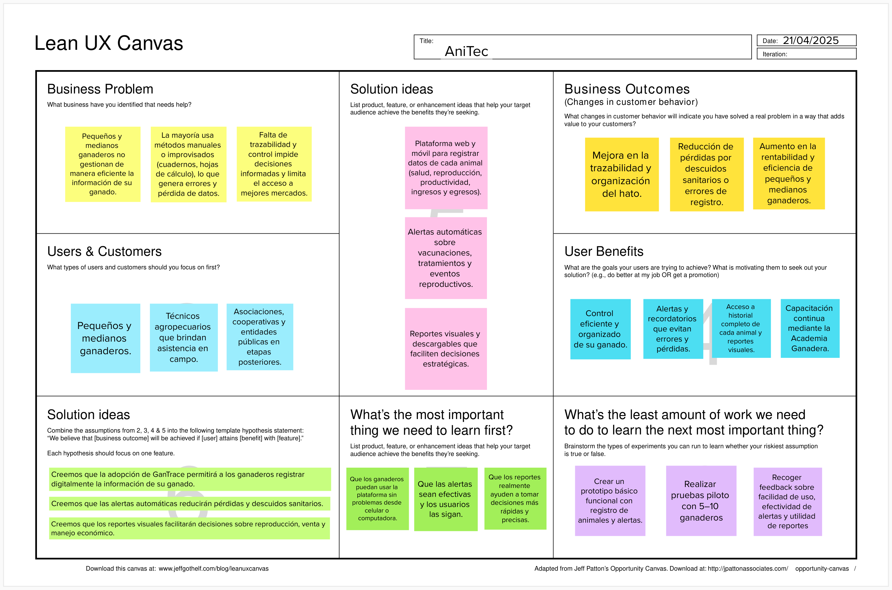

# 1.2. Solution Profile
## 1.2.1. Antecedentes y Problemática.

**Qué (What)**
 
*¿Cuál es la situación problemática?*

Muchos pequeños y medianos ganaderos no manejan de manera adecuada la información de su ganado. Dependiendo de métodos manuales como cuadernos o hojas sueltas para registrar salud, vacunas, productividad y reproducción, los errores y olvidos son frecuentes, reduciendo la eficiencia. Esta situación limita la trazabilidad, dificulta cumplir con las regulaciones y restringe el acceso a mejores oportunidades de mercado.

**Cuándo (When)**

*¿Cuándo ocurre el problema?*

La problemática se presenta de forma continua a lo largo de todo el ciclo de vida del ganado, desde el nacimiento hasta la venta o comercialización. La ausencia de un control sistemático afecta diariamente la operación del productor.

**Dónde (Where)**

*¿Dónde se manifiesta?*

Se trata de un desafío estructural que limita el desarrollo del sector ganadero rural, afectando su competitividad y sostenibilidad en los mercados locales e internacionales.

*¿Dónde se origina el problema?*

Principalmente en zonas rurales de América Latina, donde se concentra gran parte de la producción ganadera de pequeña y mediana escala.

**Quién (Who)**

*¿Quiénes participan en la problemática?*

Están involucrados los ganaderos de pequeña y mediana escala, asociaciones ganaderas, técnicos agropecuarios y organismos públicos que promueven la trazabilidad y la formalización del sector.

*¿Quiénes usarán la plataforma?*

Principalmente los ganaderos interesados en mejorar la productividad, control y trazabilidad de sus hatos, así como los técnicos que los asesoran en campo.

**Por qué (Why)**

*¿Cuál es la causa principal del problema?*

La falta de herramientas tecnológicas adaptadas al contexto rural, el desconocimiento sobre la relevancia de la trazabilidad y la limitada asistencia técnica han llevado a que muchos productores sigan empleando métodos manuales poco eficientes.

**Cómo (How)**

*¿Cómo se implementará la solución?*

AniTec será una plataforma web accesible desde dispositivos móviles o computadoras, donde los ganaderos podrán registrar los datos de cada animal, recibir alertas sanitarias, gestionar ingresos y gastos, consultar reportes y acceder a contenido educativo de manera intuitiva, sin necesidad de conocimientos técnicos avanzados.

*¿Cómo se logrará una gestión eficiente dentro de la plataforma?*

Mediante un diseño modular, simple y adaptable que permita ingresar y visualizar información clave del ganado. La plataforma contará con alertas automáticas, reportes descargables y funcionalidades offline, además de una sección de capacitación llamada “Academia Ganadera” para asegurar el uso correcto de todas las herramientas.

**Cuánto (How much)**

*¿Cuál es la magnitud del problema?*

Más del 70% de los pequeños ganaderos carecen de sistemas de registro adecuados, lo que provoca pérdidas de animales, baja productividad, incumplimiento de normas sanitarias y dificultades para acceder a mercados formales.

*¿Qué porcentaje de la industria podría beneficiarse?*

Se estima que entre el 40% y 60% de los ganaderos familiares y asociaciones podrían mejorar significativamente su gestión mediante AniTec, especialmente en zonas rurales donde la tecnología aún es limitada pero está en expansión.

## 1.2.2. Lean UX Process.
### 1.2.2.1. Lean UX Problem Statements.

**Problem Statement:**

El estado actual de la gestión ganadera para pequeños y medianos productores se ha centrado principalmente en controles manuales, registros en cuadernos y herramientas digitales improvisadas para administrar la información sanitaria, reproductiva y económica del hato.

Lo que los productos y servicios existentes no abordan es la necesidad de contar con una plataforma digital sencilla, accesible y adaptada a productores con recursos limitados, que permita centralizar la información del ganado, automatizar procesos clave y garantizar la trazabilidad sin requerir conocimientos técnicos avanzados.

Nuestro producto, AniTec, abordará esta brecha mediante una plataforma digital intuitiva que permitirá registrar, organizar y supervisar la información del ganado en tiempo real, automatizando recordatorios sanitarios, seguimiento reproductivo y control económico para reducir errores, evitar pérdida de datos y facilitar la toma de decisiones.

Nuestro enfoque inicial será pequeños y medianos ganaderos que actualmente dependen de registros manuales o sistemas poco organizados para gestionar su producción.

Sabremos que hemos tenido éxito cuando observemos una reducción en el uso de registros manuales, un aumento en la precisión y frecuencia de los registros ganaderos, una mejora en el cumplimiento de vacunaciones y tratamientos, y una mayor capacidad de los productores para tomar decisiones basadas en datos.

### 1.2.2.2. Lean UX Assumptions.
### **Business Assumptions:**
1. **Creemos que nuestros usuarios necesitan** un método confiable y eficiente para registrar y supervisar la salud, productividad y trazabilidad de su ganado.
2. **Creemos que esta necesidad puede satisfacerse** mediante una plataforma web accesible que permita registrar información clave, generar alertas automáticas y crear reportes útiles para la toma de decisiones.
3. **Creemos que nuestros primeros usuarios serán** pequeños y medianos ganaderos con acceso a teléfono o computadora, así como técnicos agropecuarios que asesoran directamente en el campo.
4. **Creemos que lo más importante para los clientes es** contar con un control ordenado y automatizado del ganado, evitando pérdidas y cumpliendo los requisitos de trazabilidad para mejorar la comercialización.
5. **Creemos que los usuarios también recibirán** alertas sanitarias, reportes económicos, acceso al historial de cada animal y contenido educativo dentro de la plataforma.
6. **Creemos que conseguiremos clientes mediante** alianzas con asociaciones ganaderas, programas de desarrollo rural y campañas digitales dirigidas a regiones con alta actividad ganadera.
7. **Creemos que los ingresos se generarán mediante** un modelo de suscripción mensual con planes ajustados al tamaño del hato, y licencias institucionales para asociaciones y entidades del sector agropecuario.
8. **Creemos que nuestra competencia incluye** aplicaciones genéricas de gestión ganadera, hojas de cálculo y métodos tradicionales de registro manual.
9. **Creemos que nuestra ventaja competitiva radica en** ofrecer una solución adaptada al contexto rural, fácil de usar, con enfoque educativo y diseñada específicamente para pequeños y medianos productores.
10. **Creemos que un riesgo importante es** que algunos ganaderos no adopten fácilmente la tecnología por factores culturales o falta de experiencia digital.
11. **Creemos que lo mitigaremos mediante** capacitaciones virtuales, diseño de interfaz intuitiva, tutoriales paso a paso y el soporte de la “Academia Ganadera”.

### **User Assumptions:**

### **¿Quién es el usuario?**
Creemos que los principales usuarios son pequeños y medianos ganaderos y técnicos agropecuarios que asesoran en campo. Creemos que, en etapas posteriores, la plataforma también podría ser utilizada por asociaciones, cooperativas y entidades públicas vinculadas a sanidad, trazabilidad y formalización del sector.

### **¿Qué problemas busca resolver nuestro producto?**
Creemos que AniTec ayuda a organizar la información del hato, evitando la pérdida de datos importantes y solucionando la falta de seguimiento de vacunas, partos, tratamientos y control económico. Creemos que esto impacta directamente en la rentabilidad del ganadero y en el cumplimiento de normativas de mercado.

### **¿Qué características son importantes?**
Creemos que los usuarios valoran el registro individual de cada animal (edad, raza, salud, productividad), alertas automáticas, reportes económicos simples, historial completo del hato y contenido educativo práctico. Creemos que la facilidad de uso, incluso sin conexión a internet, es esencial para su adopción en zonas rurales.

### **¿Dónde encaja nuestro producto en su trabajo o vida?**
Creemos que AniTec se integra en la rutina diaria del ganadero, mejorando la planificación, reduciendo pérdidas, facilitando el cumplimiento de normativas y permitiendo decisiones informadas, lo que aumenta su rentabilidad y calidad de vida.

### **¿Cuándo y cómo se usa nuestro producto?**
Creemos que se utiliza cada vez que se registra un animal, tratamiento, parto, control de ingresos o productividad, y también para analizar datos históricos para tomar decisiones estratégicas. Creemos que puede usarse desde celular o computadora, tanto en campo como en casa.

### **¿Cómo debe verse nuestro producto y cómo debe comportarse?**
Creemos que AniTec debe tener una interfaz intuitiva, amigable y estable, pensada para usuarios con poca experiencia tecnológica. Creemos que debe proteger los datos del ganadero, transmitir confianza y eficiencia, y reflejar cercanía con el contexto rural.

### **Feature Assumptions:**
- **Creemos que** la plataforma debe ser accesible desde móviles y computadoras, fácil de usar incluso por usuarios sin experiencia tecnológica.
- **Creemos que** debe incluir alertas personalizables sobre vacunas, tratamientos, partos y fechas importantes.
- **Creemos que** debe permitir un registro detallado de cada animal (peso, salud, reproducción, ingresos y egresos) para análisis histórico y toma de decisiones.
- **Creemos que** debe contar con un módulo de reportes y gráficos visuales que permita monitorear la evolución del hato, facilitar decisiones y demostrar trazabilidad ante compradores y autoridades.

### 1.2.2.3. Lean UX Hypothesis Statements.

* **Hypothesis Statement 01:**
    
    **Creemos que** los pequeños y medianos ganaderos adoptarán AniTec para registrar digitalmente toda la información de su ganado, incluyendo datos sanitarios, reproductivos y económicos.
  
    **Sabremos** que hemos tenido éxito.
    
    **Cuando** al menos el 50% de los usuarios registrados utilicen activamente la plataforma durante los tres primeros meses después de su lanzamiento.
  
* **Hypothesis Statement 02:**
    
    **Creemos que** las alertas automáticas sobre vacunación, tratamientos y eventos reproductivos ayudarán a los ganaderos a prevenir descuidos y pérdidas relacionadas con la salud y productividad del hato.
    
    **Sabremos** que hemos tenido éxito.
    
    **Cuando** al menos un 40% de los usuarios reporten haber evitado incidentes sanitarios o errores de registro gracias a las alertas de GanTrace.

* **Hypothesis Statement 03:**
    
    **Creemos que** el acceso a reportes visuales y al historial completo de cada animal permitirá a los ganaderos tomar decisiones más acertadas sobre ventas, reproducción y manejo económico.
    
    **Sabremos** que hemos tenido éxito.
    
    **Cuando** al menos un 60% de los usuarios indiquen que sus decisiones estratégicas se basaron en la información proporcionada por GanTrace.

* **Hypothesis Statement 04:**
    
    **Creemos que** el uso de AniTec reducirá los errores comunes en los métodos tradicionales (cuadernos, hojas de cálculo) y mejorará la organización general de la información del hato.
    
    **Sabremos** que hemos tenido éxito.
    
    **Cuando** se observe una disminución de al menos el 50% en errores de registro (omisiones, datos incompletos o duplicados) después de tres meses de uso continuo de la plataforma.
  
### 1.2.2.4. Lean UX Canvas.
El Lean UX Canvas es una herramienta utilizada en el marco del diseño centrado en el usuario (UX) y la metodología Lean, cuyo objetivo es apoyar la creación y mejora de productos de manera ágil y eficiente. Su propósito principal es proporcionar una estructura organizada que fomente la colaboración entre equipos multidisciplinarios. A continuación, se presenta el Lean UX Canvas elaborado por el equipo utilizando la plataforma digital Mural.

Enlace para acceder al [Canvas](https://app.mural.co/t/abbys5223/m/abbys5223/1776842322847/c87d07f08ed60b5b4bd30ba955608fa8ce7d468a?sender=u5608641741a75560d5d68781)
