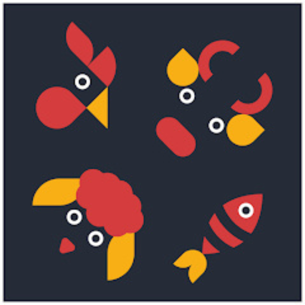

# 2.1. Competidores.

Comprender el entorno competitivo es crucial para el éxito de cualquier negocio. En esta sección realizaremos un análisis profundo de nuestros competidores, tanto directos como indirectos, evaluando las estrategias que aplican, así como sus principales fortalezas y debilidades.

## 2.1.1. Análisis competitivo.

Llevar a cabo un análisis competitivo es clave para reconocer oportunidades y riesgos en el mercado, así como para posicionar a AniTec de manera estratégica. Este análisis permite comprender cómo los competidores atienden las necesidades de los clientes, identificar vacíos en el mercado y destacar nuestra solución a través de ventajas diferenciadoras. También facilita la elaboración de estrategias más efectivas de marketing, precios y distribución, garantizando una propuesta de valor sólida y sostenible.

<html>
<body>
    <table >
        <tr>
           <td colspan="6" class="sub">  <h1>Competitive Analysis Landscape</h1></td>
        </tr>
        <tr>
            <td colspan="2" rowspan="2" class="sub">¿Por qué llevar acabo este análisis?</td>
            <td colspan="4" class="sub"><h3>¿Quiénes son nuestros principales competidores?</h3></td>
        </tr>
        <tr>
            <td colspan="4">Gracias al análisis de la competencia perteneciente al mercado, se logra comprender el entorno competitivo 
                en el que operará nuestro producto. Ello proporciona una visión detallada de quienes son nuestros competidores 
                directos e indirectos, trazar estrategia a través de información recopilada sobre  su posicionamiento actual en el mercado.</td>
        </tr>
        <tr>
            <td rowspan="3" class="sub">PERFIL</td>
            <td rowspan="2" class="sub">Overview</td>
            <td> AniTec </td>
            <td> Livestock Manager </td>
            <td> AgriTrack </td>
            <td> FarmLogs </td> 
        </tr>
        <tr>
            <td>Plataforma web y móvil diseñada para pequeños y medianos ganaderos en Latinoamérica, enfocada en trazabilidad, gestión sanitaria y educación.</td>
            <td>Aplicación móvil y web para gestión de hatos ganaderos, enfocada en registro sanitario y productividad.</td>
            <td>Plataforma multifuncional para gestión agrícola y ganadera, con módulos de cultivo, inventario y finanzas.</td>
            <td>Herramienta global para gestión agrícola, con funcionalidades básicas de ganadería.</td>      
        </tr>
        <tr>
            <td class="sub">Ventaja Competitiva ¿Qué valor ofrece a los clientes?</td>
            <td>Enfocado a la ganadería y la trazabilidad individual el hato a precios accesibles para los ganaderos</td>
            <td>Integración con dispositivos IoT. Reportes automatizados para exportación a autoridades sanitarias.</td>
            <td>Versatilidad: integra cultivos y ganado en una sola plataforma. Análisis predictivo basado en clima y mercado.</td>
            <td>Reconocimiento de marca internacional. Integración con mercados globales de commodities.</td>      
        </tr>
        <tr>
            <td rowspan="2" class="sub">PERFIL DEL MARKETING</td>
            <td class="sub" >Mercado Objetivo</td>
            <td>Pequeños productores (5-100 cabezas de ganado) y técnicos agropecuarios.</td>
            <td>Medianos y grandes ganaderos con acceso a tecnología avanzada.</td>
            <td>Agricultores y ganaderos diversificados en zonas semiurbanas.</td>
            <td>Grandes empresas agroindustriales con enfoque exportador.</td>
        </tr>
        <tr>
            <td class="sub">Estrategias de Marketing</td>
            <td>Alianzas con asociaciones ganaderas y programas gubernamentales. Talleres presenciales en zonas rurales.</td>
            <td>Alianzas con empresas de insumos veterinarios. Publicidad en ferias ganaderas y redes sociales especializadas.</td>
            <td>Contenido educativo en YouTube y webinars. Descuentos por volumen para cooperativas.</td>
            <td>Campañas en medios internacionales (The Economist, Bloomberg).Acuerdos con distribuidores de maquinaria agrícola.</td>
        </tr>
        <tr>
            <td rowspan="3" class="sub">PERFIL DEL PRODUCTO</td>
            <td class="sub">Productos & Servicios</td>
            <td>Plataforma móvil y web para gestión de hatos ganaderos</td>
            <td>Plataforma móvil y web para gestión de hatos ganaderos.</td>
            <td>Plataforma multifuncional para gestión agrícola y ganadera.</td>
            <td>Herramienta global para gestión agrícola y ganadera, con énfasis en mercados formales.</td>
        </tr>
        <tr>
            <td class="sub">Precios & Costos</td>
            <td>Basico: $10/mes Premium: $25/mes y Empresarial: $50/mes</td>
            <td>Básico: $20/mes Premium: $100/mes.</td>
            <td>Solo ganado: $15/mes Full agro: $50/mes.</td>
            <td>Básico: $30/mes Empresarial: $200/mes.</td>
        </tr>
        <tr>
            <td class="sub">Canales de distribución (web/móvil)</td>
            <td>Plataforma web, app móvil y colaboración con ONGs rurales.</td>
            <td>Venta directa en su sitio web y app stores.</td>
            <td>Distribución mediante cooperativas agrícolas.</td>
            <td>Venta directa y partners estratégicos en EE.UU. y Europa.</td>        
        </tr>
        <tr>
            <td rowspan="4" class="sub">ANÁLISIS SWOT</td>
            <td class="sub">Fortalezas</td>
            <td>Diseño accesible para baja conectividad. Costos accesibles y planes de acuerdo al tamaño de la finca.</td>
            <td>Tecnología IoT innovadora. Cumplimiento normativo automático.</td>
            <td>Solución integral para agro. Precios accesibles.</td>
            <td>Enfoque en mercados globales. Datos en tiempo real de mercados.</td>
        </tr>
        <tr>
            <td class="sub">Debilidades</td>
            <td>Dependencia de alianzas para distribución. </td>
            <td>Alto costo para pequeños productores. Interfaz compleja para usuarios rurales.</td>
            <td>Funcionalidades ganaderas menos desarrolladas. Falta de enfoque en trazabilidad sanitaria.</td>
            <td>Precios elevados para Latinoamérica. Poca adaptación a necesidades locales.</td>  
        </tr>
        <tr>
            <td class="sub">Oportunidades</td>
            <td>Demanda creciente de trazabilidad en exportaciones.Subsidios gubernamentales para digitalización rural.</td>
            <td>Expansión a mercados formales (exportación). Alianzas con gobiernos para subsidios.</td>
            <td>Crecimiento de la agricultura de precisión. Demanda de análisis predictivo.</td>
            <td>Expansión a Latinoamérica con socios locales. Demanda de trazabilidad para exportación.</td> 
        </tr>
        <tr>
            <td class="sub">Amenazas</td>
            <td>Competidores globales con más recursos. Resistencia a adoptar tecnología en productores tradicionales.</td>
            <td>Competencia con soluciones low-cost. Resistencia al cambio en ganaderos tradicionales.</td>
            <td>Especialización de competidores como GanTrace. Saturación de plataformas multifuncionales.</td>
            <td>Competencia de startups regionales. Barreras culturales y idiomáticas.</td>          
        </tr>
    </table>
</body>
</html>

## 2.1.2. Estrategias y tácticas frente a competidores.

Entre las principales estrategias y tácticas que ejecutaremos como startup son las siguientes:

Por un lado, estas son las estrategias preliminares:

- Incursión en sectores rurales a través de alianzas con gremios ganaderos de la zona y organizaciones no gubernamentales.
- Capacitación tecnológica gradual mediante material multimedia diseñado para personas con conocimientos digitales limitados.
- Optimización de la asistencia técnica utilizando medios de contacto directos como llamadas telefónicas o WhatsApp.
- Generación de utilidad inmediata, brindando notificaciones en tiempo real, análisis de datos de valor y funciones sin costo.

Por otro lado, estas son nuestras tácticas específicas:

- Campañas de referidos para incentivar la difusión entre los mismos productores.
- Entorno virtual gamificado para motivar el uso frecuente de la aplicación.
- Adaptación regional del sistema, empleando modismos locales y asistencia personalizada según la zona.
- Presencia en eventos del sector, tales como ferias del campo y convenciones agropecuarias.
