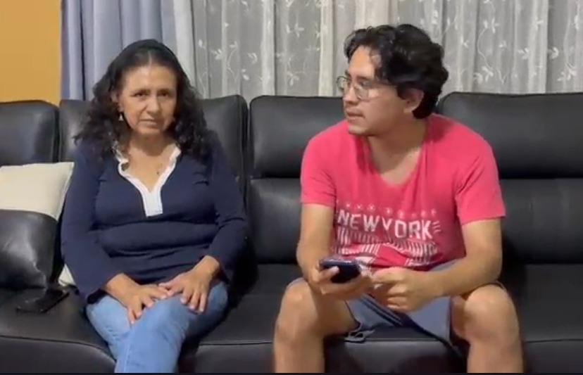
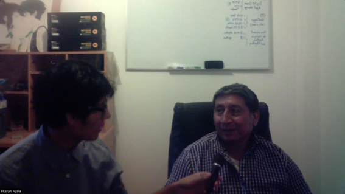

# 2.2. Entrevistas.

Las entrevistas son una herramienta esencial para comprender a fondo a nuestro público objetivo. Para que sean efectivas, deben seguir una estructura clara y directa, utilizando preguntas específicas que permitan recolectar información de valor y datos precisos de los participantes.

<h4> 2.2.1. Diseño de entrevistas. </h4>

Objetivo: Identificar frustraciones, necesidades, dispositivos disponibles, grado de digitalización y percepción sobre el registro de información ganadera.

## 2.2.1. Diseño de entrevistas.

### Segmentos entrevistados:

- Ganaderos

- Veterinarios

Formato: Entrevistas semiestructuradas, de 25-30 minutos, registradas en video con consentimiento.

Preguntas dirigidas al personal de **Ganaderos**.

Preguntas principales:

- ¿Podría indicarnos su nombre completo y su edad?

- ¿Cuánto tiempo lleva dedicado a la ganadería? ¿Qué tipo de ganado maneja actualmente?

- ¿Cuál es el tamaño aproximado de su ganado? ¿Y cuántas personas trabajan en su unidad ganadera?

- ¿Qué herramientas utiliza actualmente para llevar el control de sus animales y sus actividades?

- ¿Lleva algún registro sobre la salud, alimentación o reproducción de su ganado? ¿Cómo lo hace?

- ¿Cuáles son las principales dificultades que enfrenta en la gestión diaria del ganado?

- ¿Cómo monitorea actualmente la productividad y salud de su ganado?

- ¿Qué tan importante considera llevar un control digital del historial veterinario y productivo de cada animal?

- ¿Ha enfrentado problemas por no tener registros claros (por ejemplo, en ventas, enfermedades o reproducción)?

- ¿Confía en herramientas digitales o ha probado alguna aplicación para el manejo ganadero?

- ¿Cuánto tiempo promedio dedica al registro manual de datos (si lo realiza)?

- ¿Qué tipo de información considera más importante tener a la mano sobre su ganado?

- ¿Estaría dispuesto a usar una aplicación móvil/web para llevar el control del ganado si fuera sencilla y funcional?

- ¿Qué funcionalidades le gustaría que tenga esta herramienta (alertas, historial médico, reproductivo, reportes, etc.)?
  
- ¿Qué beneficios espera al adoptar una herramienta digital para su ganadería?

### Preguntas dirigidas a los **Veterinarios**

Preguntas principales:

- ¿Podría proporcionarnos su nombre completo y su edad?

- ¿Cuánto tiempo lleva ejerciendo como veterinario y en qué región trabaja principalmente?

- ¿Está especializado en atención ganadera? ¿Qué tipo de ganado atiende con más frecuencia?

- ¿Cómo realiza el seguimiento del historial médico de los animales que atiende?

- ¿Utiliza actualmente alguna herramienta digital para llevar registros veterinarios?

- ¿Qué información considera fundamental registrar tras una consulta o intervención (vacunas, tratamientos, diagnóstico)?

- ¿Cómo se comunica con los ganaderos respecto al seguimiento o tratamientos posteriores?

- ¿Con qué frecuencia atiende emergencias ganaderas? ¿Cómo coordina este tipo de intervenciones?

- ¿Ha tenido casos donde la falta de información del animal haya afectado la efectividad del tratamiento?

- ¿Qué retos encuentra en su trabajo relacionado con el registro o gestión de información?

- ¿Le resultaría útil tener acceso al historial médico del animal antes de una consulta?

- ¿Qué tan dispuesto estaría a utilizar una aplicación móvil/web para registrar y acceder al historial de sus pacientes?

- ¿Qué funcionalidades considera clave en una herramienta digital veterinaria (calendario, historial, recordatorios, fichas clínicas)?

- ¿Cómo podría mejorar su trabajo con una solución que conecte a veterinarios con ganaderos en tiempo real?

- ¿Qué tan importante considera el análisis de datos (estadísticas de salud, tratamientos más comunes, etc.) en su labor?

### Preguntas complementarias (para ambos segmentos):

- ¿Qué expectativas tendría sobre una plataforma digital que centralice la información ganadera y veterinaria?

- ¿Qué dispositivos usa con más frecuencia para sus actividades laborales (celular, laptop, tablet)? ¿Está familiarizado con el uso de apps?

- ¿Qué es lo que más valora en una herramienta digital: rapidez, facilidad de uso, seguridad de datos u otro aspecto?

### Preguntas principales (comunes):

1. ¿Cómo lleva actualmente el registro de su ganado (peso, salud, vacunas)?

2. ¿Qué desafíos ha enfrentado por llevar registros manuales?

3. ¿Qué tan cómodo se siente utilizando un celular o computadora?

4. ¿Le sería útil recibir alertas de vacunación o reproducción?

5. ¿Ha perdido información relevante alguna vez?

6. ¿Qué contenido educativo le interesaría tener en una app?

7. ¿Qué canales digitales usa actualmente (WhatsApp, redes sociales, etc.)?

Variables demográficas a recolectar: Edad, género, distrito de residencia, educación, tipo de hacienda, frecuencia de registros, ocupación alterna, herramientas digitales que maneja, tipo de celular, acceso a internet, objetivos personales, frustraciones, marcas preferidas, influencia de técnicos o asociaciones.

## 2.2.2. Registro de entrevistas.

**Entrevista a Ganaderos**

|Entrevistado 1|Vicente Alacutte|
|-|-|
|Edad|62 años|
|Distrito | Canta, Lima|
| </td>| En la entrevista realizada a Vicente Huamán Alacute, ganadero con más de 30 años de experiencia que gestiona un hato de 25 cabezas de vacuno, se validó la necesidad crítica de digitalizar la gestión pecuaria a través de una herramienta como AniTec. Actualmente, el entrevistado depende de un cuadernillo físico y registros aislados en Excel, enfrentando problemas de desorden, pérdida de información y la "fragilidad de la memoria" ante tareas complejas como el control de enfermedades, alimentación y reproducción. Don Vicente enfatizó que la tecnología es el camino para profesionalizar el sector, señalando que un registro digital no solo optimiza la operatividad interna mediante alertas y trazabilidad, sino que otorga confianza al comprador al momento de la venta. Finalmente, hizo un llamado a que la aplicación sea extremadamente sencilla y accesible para el hombre de campo, confirmando que, si la herramienta es intuitiva, existe una disposición total para adoptar la plataforma y abandonar los métodos manuales en favor de una ganadería más inteligente y eficiente.|
|Timing: 00:07:43 |URL: https://drive.google.com/file/d/13oRRly8TR7Kus-jWqxyd3qEBK7DW4CRg/view?usp=sharing 

|Entrevistado 2|Rebeca Noemi Quiroz Roldan|
|-|-|
|Edad|54 años|
|Distrito:| Lima|
||En la entrevista la señora Rebeca Noemi menciona que gestiona un ganado vacuno en donde sus mayores problemas que enfrenta son cuando a la vaca le da mastitis y cuando los terneros enferman, tambien menciona que gestiona su ganado a traves de cuadernos y/o apuntes en hojas, Rebeca afirma no tener problemas con su gestion pero que si estaria dispuesta a usar una aplicacion que la ayude a gestionar mejor su ganado dado que la tecnologia que mas usa es su celular, ademas dice que lo que mas valora de una aplicacion asi es la seguridad, tambien Rebeca nos cuenta que la gestion de enfermedades de su ganado se la encarga a un ingeniero especializado, Le mencionamos si le gustaria que la aplicacion le recuerde diferentes tipo de evento como vacunacion o dosis de medicamentos y estuvo de acuerdo, que seria prudencial tener eso en una aplicacion como es AniTec|
|Timing: 00:06:53 |URL: https://upcedupe-my.sharepoint.com/:v:/g/personal/u202315165_upc_edu_pe/IQC_8-haUlvvTKtz13hlN8A0AViAvdEwyAyAZIs0wpCnLeY?e=b3mVxM&nav=eyJyZWZlcnJhbEluZm8iOnsicmVmZXJyYWxBcHAiOiJTdHJlYW1XZWJBcHAiLCJyZWZlcnJhbFZpZXciOiJTaGFyZURpYWxvZy1MaW5rIiwicmVmZXJyYWxBcHBQbGF0Zm9ybSI6IldlYiIsInJlZmVycmFsTW9kZSI6InZpZXcifX0%3D

|Entrevistado 3|Porfirio Salazar Rodriguez|
|-|-|
|Edad:|65 años|
|Distrito|Comas, Lima|
||En la entrevista, el señor Porfirio Salazar Rodriguez nos comentó acerca de lo que se dedica a hacer en el sector de la ganadería especialmente con su especialidad el cual es la ganadería artesanal. Él, a pesar de no tener experiencia en empresas de mayor calibre, tiene a su mando a dos o tres personas con las cuales manejan cierta cantidad de ganado que tienen; sin embargo, tienen la esperanza de trascender y poder pasar a ser una empresa formal para poder manejar el tipo de ganado que le pueda generar más ingresos. Asimismo, el opina que la tecnología sin duda que le ayudaría a mejorar su productividad pero recalca que necesitaría el capital suficiente para que pueda pagar por el producto|
|Timing: 00:13:55 |URL: https://upcedupe-my.sharepoint.com/:v:/g/personal/u20241c030_upc_edu_pe/IQBGB9K9t4xxSLIv1YP6eBZMAeSNzMREmpWxJjIX0MPuCR4?nav=eyJyZWZlcnJhbEluZm8iOnsicmVmZXJyYWxBcHAiOiJPbmVEcml2ZUZvckJ1c2luZXNzIiwicmVmZXJyYWxBcHBQbGF0Zm9ybSI6IldlYiIsInJlZmVycmFsTW9kZSI6InZpZXciLCJyZWZlcnJhbFZpZXciOiJNeUZpbGVzTGlua0NvcHkifX0&e=S6qUbg

**Entrevista a Veterinarios**

|Entrevistado 4|Angela Mendoza|
|-|-|
|Edad|24 años|
|Distrito|Camaná, Arequipa|
||La entrevista a Angela Mendoza, veterinaria de 24 años con 2 años de experiencia en la sierra sur del Perú, evidencia que el manejo de información en el ámbito ganadero sigue siendo mayormente manual y fragmentado, utilizando cuadernos físicos, Excel básico y herramientas informales como WhatsApp. Esta situación genera problemas frecuentes como pérdida de datos, falta de trazabilidad y dependencia del ganadero para acceder al historial del animal, lo que incluso ha afectado la efectividad de algunos tratamientos. A pesar de ello, muestra una alta disposición a adoptar soluciones digitales, siempre que sean simples, rápidas y accesibles.|
|Timing: 00:06:55 |URL: https://1drv.ms/v/c/fa8e2d4d5f95cf55/IQBlOk72Iv8fRaC_thWrWuQbARpG660UkHBrJyKW1aMQzSM?e=SEnYQf

|Entrevistado 5|Aldahir Santos|
|-|-|
|Edad|27 años|
|Distrito|Ventanilla, Lima|
||La entrevista a Aldahir Arturo Santos Medina, veterinario de 27 años con 6 años de experiencia en la selva central del Perú, evidencia que el manejo de información en el ámbito ganadero sigue siendo predominantemente manual, basado en notas y cuadernos físicos. Esta dependencia de registros analógicos genera problemas críticos como el desorden, la pérdida de datos y la falta de trazabilidad, especialmente cuando se integran nuevos animales sin historial clínico previo, lo cual afecta directamente la planificación y efectividad de tratamientos y vacunaciones. A pesar de su uso actual de herramientas básicas como Excel y WhatsApp, Aldahir muestra una alta disposición a adoptar una solución digital centralizada, siempre que sea intuitiva, segura y rápida. Para él, una plataforma que integre calendarios de intervención y recordatorios no solo optimizaría su labor técnica, sino que facilitaría la comunicación en tiempo real con el ganadero y elevaría el estándar de bioseguridad en la región.|
|Timing: 00:08:09  |URL: https://upcedupe-my.sharepoint.com/:v:/g/personal/u202318001_upc_edu_pe/IQDOnRpzZINmRpVNnHMoBaTkAX_PDnT76W11xtMZH3wIXTk?nav=eyJyZWZlcnJhbEluZm8iOnsicmVmZXJyYWxBcHAiOiJTdHJlYW1XZWJBcHAiLCJyZWZlcnJhbFZpZXciOiJTaGFyZURpYWxvZy1MaW5rIiwicmVmZXJyYWxBcHBQbGF0Zm9ybSI6IldlYiIsInJlZmVycmFsTW9kZSI6InZpZXcifX0%3D&e=KdBhPi

## 2.2.3. Análisis de entrevistas.

### Análisis del segmento de Ganaderos

En primer lugar, el 100% de los entrevistados son adultos mayores de 50 años (con edades de 54, 62 y 65 años), lo que representa a una generación que, aunque valora los métodos tradicionales, reconoce la necesidad de modernizarse. Asimismo, el 100% de los ganaderos gestiona su información mediante métodos manuales, como cuadernos, hojas sueltas o un Excel básico, lo que genera problemas de desorden y la recurrente "fragilidad de la memoria" en tareas críticas. Respecto a la experiencia, el 100% cuenta con una trayectoria sólida en el campo, destacando casos con más de 30 años de labor pecuaria.

Un hallazgo clave es que el 100% de este segmento manifiesta una disposición total a adoptar la tecnología, siempre y cuando la plataforma sea intuitiva y sencilla para el hombre de campo. El 66% (Vicente y Rebeca) enfatiza que el uso del celular es su principal medio tecnológico, mientras que el 33% (Porfirio) señala el factor económico (capital) como una barrera potencial. Finalmente, el 100% coincide en que la digitalización no solo evitaría la pérdida de datos sobre salud y reproducción, sino que otorgaría una mayor confianza y trazabilidad frente a compradores y procesos de formalización.

### Análisis del segmento de Veterinarios

En primer lugar, el 100% de los entrevistados pertenece a una generación joven de profesionales, con edades de 24 y 27 años, lo que facilita su apertura hacia soluciones digitales. A su vez, el 100% cuenta con experiencia directa en zonas rurales y descentralizadas (Sierra Sur y Selva Central), donde la gestión de la información es mayoritariamente manual o fragmentada mediante WhatsApp. El 100% de los veterinarios señala que la dependencia de registros analógicos del ganadero provoca pérdida de trazabilidad, afectando directamente la efectividad de los tratamientos médicos al no contar con historiales clínicos previos.

Asimismo, el 100% de este segmento traslada sus notas físicas a herramientas básicas como Excel para intentar organizar la información, pero coinciden en que no es suficiente para una gestión profesional. Un punto crítico resaltado por ambos profesionales es la necesidad de un calendario sanitario y recordatorios automáticos, lo que optimizaría su labor técnica y la bioseguridad en las regiones donde operan. Finalmente, el 100% muestra una disposición inmediata para utilizar una plataforma centralizada que permita una comunicación rápida y segura con el productor, elevando el estándar de la práctica veterinaria en el sector rural.
