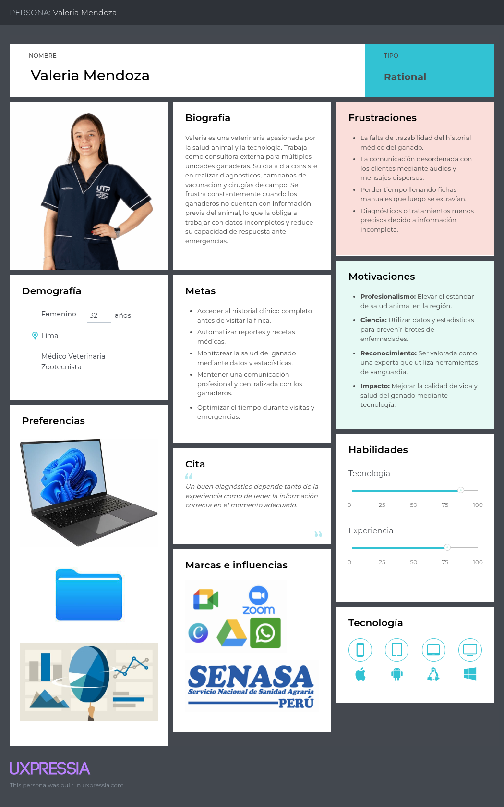
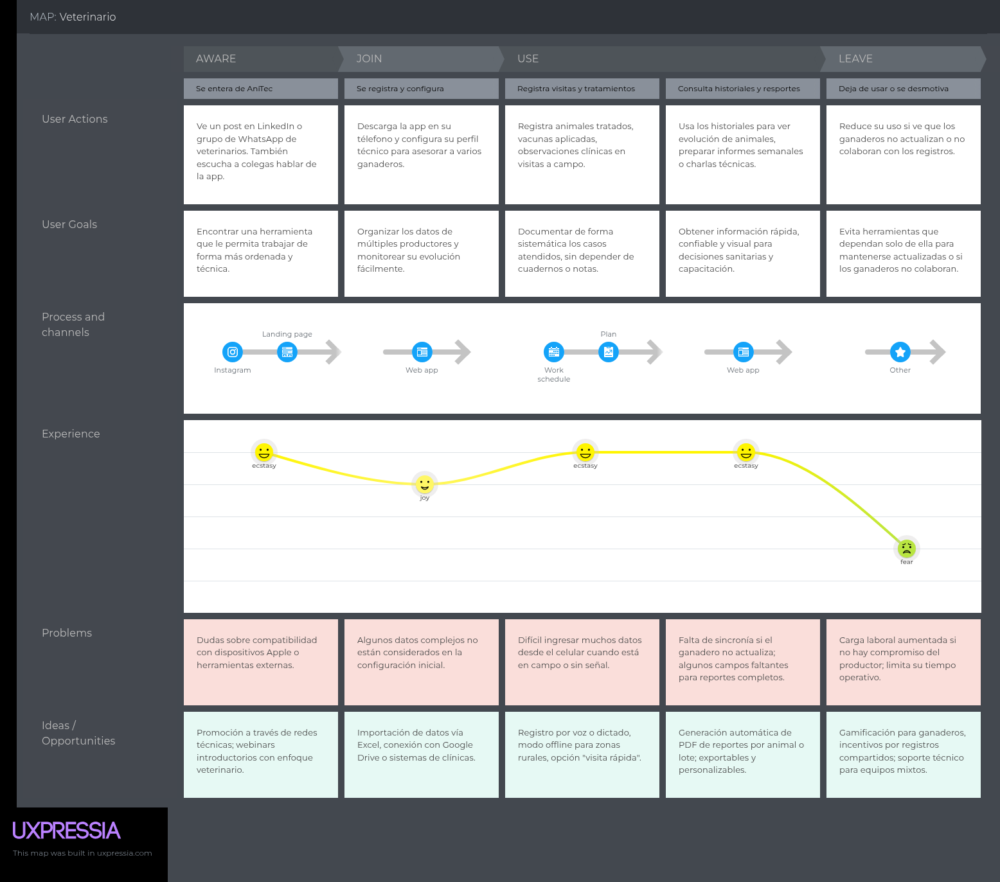
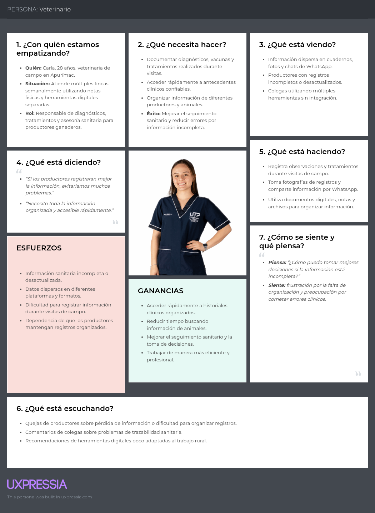

# 2.3. Needfinding.

En esta sección se presentarán los artefactos resultantes del proceso de análisis de la información recolectada de los segmentos objetivos. Aquí se incluyen secciones para User Personas, User Task Matrix, User Journey Maps, Empathy Mapping y As-is Scenario Mapping.

## 2.3.1. User Personas.

A continuación, se presentan los User Personas diseñados para representar a los segmentos objetivo identificados durante la fase de investigación. Estos arquetipos detallan variables demográficas, rasgos psicográficos, motivaciones y comportamientos, así como los pains (frustraciones) y gains (objetivos) que enfrentan en su gestión diaria. Asimismo, se analiza su nivel digital y su interacción con soluciones tecnológicas del sector agropecuario. Toda la información ha sido sintetizada a partir de los insights recolectados en las entrevistas y estructurada mediante la plataforma UXPressia para garantizar una representación fiel de las necesidades del usuario.

### User Persona: Ganaderos

### User Persona: Veterinarios

## 2.3.2. User Task Matrix.

A través de la User Task Matrix, es posible desglosar detalladamente cada una de las actividades y tareas que los usuarios realizan al interactuar con nuestra plataforma. Al categorizar estas acciones en función de su importancia y recurrencia, logramos priorizar estratégicamente los esfuerzos de diseño y desarrollo, asegurando así una experiencia de usuario optimizada y eficiente.

| **User Task**                                      | **Jorge Rivas (Frecuencia)** | **Jorge Rivas (Importancia)** | **Valeria Mendoza (Frecuencia)** | **Valeria Mendoza (Importancia)** |
|------------------------------------------------|------------------------|-------------------------|------------------------|-------------------------|
| Registrar un nuevo animal                      | Sometimes              | High                    | Rarely                 | Medium                  |
| Actualizar registro sanitario                  | Often                  | High                    | Always                 | High                    |
| Consultar calendario de vacunación             | Often                  | High                    | Often                  | High                    |
| Recibir alertas automáticas                    | Sometimes              | High                    | Sometimes              | High                    |
| Registrar peso y ganancia media diaria         | Often                  | Medium                  | Often                  | Medium                  |
| Generar y revisar reportes de productividad    | Sometimes              | Medium                  | Often                  | Medium                  |
| Compartir registros con asociación o compradores | Rarely               | Medium                  | Rarely                 | Low                     |
| Acceder a módulos de formación ("Academia ganadera") | Sometimes         | Low                     | Sometimes              | Medium                  |
| Planificar ciclos de reproducción              | Rarely                 | Medium                  | Rarely                 | Medium                  |
| Revisar historial completo de un animal        | Sometimes              | High                    | Sometimes              | High                    |

La User Task Matrix revela que tanto Jorge como Valeria comparten tareas críticas de actualización sanitaria y recepción de alertas automáticas con alta frecuencia e importancia, seguidas por la consulta del calendario de vacunación y el registro de peso para el control de ganancia media diaria. Mientras Jorge prioriza en su día a día el registro inicial de animales y la revisión de históricos para procesos de venta o inspecciones, Valeria enfoca su actividad en la actualización técnica de datos sanitarios y la generación de reportes de productividad tras cada visita. Al clasificar estas tareas según su recurrencia y valor estratégico, el equipo de desarrollo de AniTec puede enfocar el MVP en las funciones de mayor impacto, postergando los módulos de formación y los reportes avanzados para fases posteriores del proyecto.

## 2.3.3. User Journey Mapping.

En este apartado se describe de forma detallada el ciclo de experiencia del usuario dentro de la plataforma AniTec de Titan, enfocándose específicamente en los dos perfiles clave: productores ganaderos y médicos veterinarios. Este análisis del user journey examina desde el descubrimiento inicial de la herramienta, pasando por el proceso de decisión para su adopción y la gestión de cuentas, hasta el uso diario de sus funciones y los factores que podrían llevar al cese de su utilización.

El mapeo de este recorrido comienza con el primer contacto del cliente con la aplicación y avanza a través de las fases de evaluación, registro y operatividad total. Se consideran todos los puntos de contacto críticos, permitiendo comprender la experiencia integral desde que el usuario conoce la solución hasta que se convierte en un usuario activo o decide abandonar el servicio.

User Ganadero:

User Veterinario:

## 2.3.4. Empathy Mapping.

User Ganadero:

User Veterinario:

