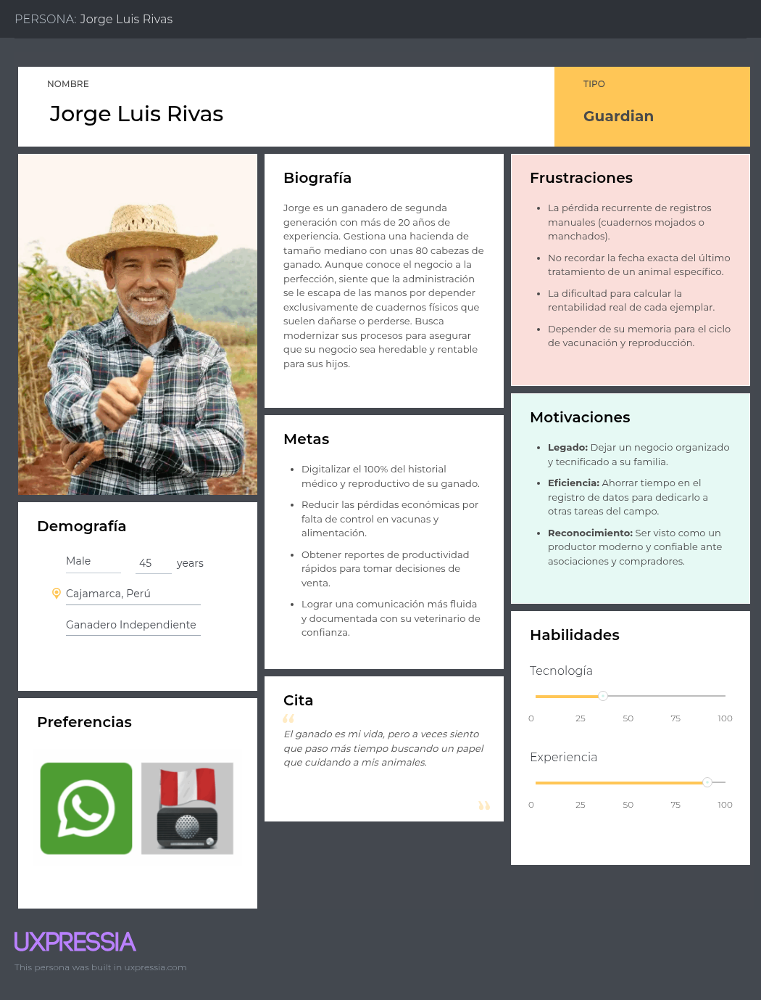

# 2.3. Needfinding.

En esta sección se presentarán los artefactos resultantes del proceso de análisis de la información recolectada de los segmentos objetivos. Aquí se incluyen secciones para User Personas, User Task Matrix, User Journey Maps, Empathy Mapping y As-is Scenario Mapping.

## 2.3.1. User Personas.

A continuación, se presentan los User Personas diseñados para representar a los segmentos objetivo identificados durante la fase de investigación. Estos arquetipos detallan variables demográficas, rasgos psicográficos, motivaciones y comportamientos, así como los pains (frustraciones) y gains (objetivos) que enfrentan en su gestión diaria. Asimismo, se analiza su nivel digital y su interacción con soluciones tecnológicas del sector agropecuario. Toda la información ha sido sintetizada a partir de los insights recolectados en las entrevistas y estructurada mediante la plataforma UXPressia para garantizar una representación fiel de las necesidades del usuario.

### User Persona: Ganaderos

### User Persona: Veterinarios

## 2.3.2. User Task Matrix.

A través de la User Task Matrix, es posible identificar y organizar las principales actividades que los usuarios realizan actualmente dentro de su contexto de trabajo. Al categorizar estas tareas según su frecuencia e importancia, se logra comprender cuáles representan mayores dificultades y necesidades para cada perfil de usuario, permitiendo detectar oportunidades de mejora en la gestión ganadera y veterinaria.

| **User Task** | **Jorge Rivas (Frecuencia)** | **Jorge Rivas (Importancia)** | **Valeria Mendoza (Frecuencia)** | **Valeria Mendoza (Importancia)** |
|------------------------------------------------|------------------------|-------------------------|------------------------|-------------------------|
| Anotar el nacimiento o compra de un nuevo animal en cuadernos físicos | Sometimes | High | Rarely | Medium |
| Registrar manualmente vacunas y tratamientos del ganado | Often | High | Always | High |
| Revisar fechas de vacunación en notas, calendarios o cuadernos | Often | High | Often | High |
| Recordar manualmente vacunas o controles pendientes | Sometimes | High | Sometimes | High |
| Anotar peso y crecimiento del ganado durante controles | Often | Medium | Often | Medium |
| Revisar manualmente información sobre productividad y rendimiento | Sometimes | Medium | Often | Medium |
| Compartir documentos físicos o fotografías de registros con asociaciones o compradores | Rarely | Medium | Rarely | Low |
| Buscar información o capacitaciones ganaderas en internet y redes sociales | Sometimes | Low | Sometimes | Medium |
| Llevar el control reproductivo mediante anotaciones manuales | Rarely | Medium | Rarely | Medium |
| Buscar antecedentes médicos y sanitarios en cuadernos o archivos físicos | Sometimes | High | Sometimes | High |

La User Task Matrix evidencia que tanto Jorge como Valeria realizan constantemente actividades relacionadas con el control sanitario y el seguimiento del ganado. Mientras Jorge depende principalmente de registros físicos y de su memoria para organizar la información de sus animales, Valeria necesita acceder rápidamente a datos precisos durante sus visitas de campo y procedimientos veterinarios. Asimismo, ambos perfiles presentan dificultades relacionadas con la organización, trazabilidad y acceso oportuno a la información, especialmente en procesos de vacunación, historial clínico y monitoreo del ganado. Estas tareas permiten comprender mejor el contexto actual de los usuarios e identificar necesidades reales dentro del entorno ganadero y veterinario.

## 2.3.3. User Journey Mapping.

En este apartado se describe de forma detallada el ciclo de experiencia del usuario dentro de la plataforma AniTec de Titan, enfocándose específicamente en los dos perfiles clave: productores ganaderos y médicos veterinarios. Este análisis del user journey examina desde el descubrimiento inicial de la herramienta, pasando por el proceso de decisión para su adopción y la gestión de cuentas, hasta el uso diario de sus funciones y los factores que podrían llevar al cese de su utilización.

El mapeo de este recorrido comienza con el primer contacto del cliente con la aplicación y avanza a través de las fases de evaluación, registro y operatividad total. Se consideran todos los puntos de contacto críticos, permitiendo comprender la experiencia integral desde que el usuario conoce la solución hasta que se convierte en un usuario activo o decide abandonar el servicio.

User Ganadero:

User Veterinario:

## 2.3.4. Empathy Mapping.

User Ganadero:

User Veterinario:

