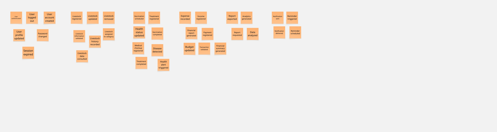
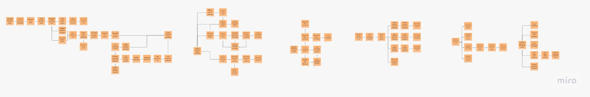

# 2.4. Big Picture EventStorming.

El presente Big Picture Event Storming se ha desarrollado de manera colaborativa utilizando la plataforma Miro, siguiendo la metodología de Philippe Bourgau para explorar el dominio del negocio de forma holística y establecer un entendimiento compartido. A través de un proceso iterativo en este entorno digital, que incluyó la generación de eventos de dominio, el ordenamiento cronológico y el análisis de causas mediante comandos y actores, se ha logrado mapear la complejidad del sector ganadero en una narrativa visual coherente. Este artefacto no solo permite identificar los puntos de fricción y las oportunidades de automatización en la gestión de AniTec, sino que también sienta las bases para el diseño de una arquitectura de software alineada con la realidad operativa de los ganaderos y veterinarios.

**Paso 1:** Unstructured Exploration (Exploración no estructurada) consiste en una lluvia de ideas colaborativa donde los participantes identifican y registran domain events, que son sucesos relevantes ocurridos dentro del negocio. Estos eventos deben redactarse obligatoriamente en tiempo pasado (por ejemplo, "Animal registrado") y se colocan en notas adhesivas de color naranja sobre la superficie de modelado. En esta etapa inicial, se prioriza la cantidad y el descubrimiento de conceptos sobre el orden o la jerarquía, continuando con la actividad hasta que la generación de nuevos eventos disminuya significativamente.

**Paso 2:** Timelines, los participantes revisan los eventos de dominio generados y los organizan cronológicamente para reflejar la secuencia real del proceso empresarial. La construcción inicia con el "happy path scenario", que describe el flujo de un caso de éxito, para luego incorporar escenarios alternativos, errores o ramificaciones en la toma de decisiones. Este paso es fundamental para refinar el modelo, ya que permite identificar eventos faltantes, eliminar duplicados y corregir inconsistencias en la narrativa del negocio.

**Paso 3:** Pain Points, los participantes utilizan la línea de tiempo recién organizada para identificar los puntos críticos o ineficiencias del proceso que requieren atención especial. Estos problemas, que pueden incluir cuellos de botella, falta de documentación o pasos manuales que necesitan automatización, se marcan en el modelo utilizando notas adhesivas rosadas rotadas en forma de diamante. Hacer explícitas estas debilidades permite al equipo abordarlas posteriormente o tomarlas en cuenta conforme avanza el diseño del sistema.

Enlace para acceder al [EventStorming](https://miro.com/welcomeonboard/T1gvUmlKRzZiWjFQV0VFK1VsL1VDbFN1WElQbzV3WjVVd2NYR1d3NVRSdVFOUFd4ZVlIbk4rSmxBN1J3UUtjQjg3cHlKK2VKZ3cwVXB5ZXJoK0MyNmxud0lrejllQVpDT1AzczYyS0t6YWtZTk9xSS9JK05WR2x1cVZvYldTbzRnbHpza3F6REdEcmNpNEFOMmJXWXBBPT0hdjE=?share_link_id=376749116517)
