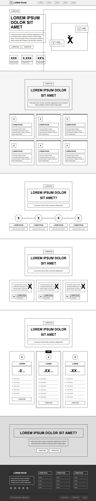

# 4.3. Landing Page UI Design

## 4.3.1. Landing Page Wireframe

El wireframe de la landing page de AniTec actúa como una guía visual preliminar que organiza los elementos esenciales de la página sin entrar en detalles gráficos. Este esquema muestra la distribución de secciones clave como el encabezado con el logo y menú de navegación, una propuesta de valor centrada en la digitalización ganadera, testimonios de usuarios reales del campo, y llamadas a la acción destacadas que invitan a conocer la aplicación. El objetivo es garantizar una experiencia intuitiva para el visitante y facilitar su conversión en usuario activo de la plataforma.

Enlace para acceder al [diseño del wireframe de AniTec en Figma](https://www.figma.com/design/WbTy5Gd0VpFbXolfe3OQ0C/ExamenIHCJorgeAyala?node-id=5-678&t=Erdbu1dwId9dtDbq-1)

El wireframe se caracteriza por:

- Estructura en blanco y negro con bordes negros
- Placeholder (X) en lugar de imágenes e iconos
- Texto genérico (Lorem ipsum) para contenido
- Fondos grises para diferenciar secciones
- Diseño responsive para móvil y desktop

  

    <b>Grafico</b>: AniTec Wireframe
  

  
  

    <i><b>Fuente</b>: Elaboración propia.</i>
  

## 4.3.2. Landing Page Mock-up

El mock-up de la landing page de AniTec representa una versión detallada y cercana al diseño final, integrando colores, tipografías e imágenes que reflejan la identidad visual de la plataforma. Este diseño ofrece una vista realista de cómo se presentará la página a los usuarios, destacando una estética moderna, accesible y alineada con el sector agroindustrial ganadero. Además, refuerza la importancia de mantener coherencia visual y claridad en la propuesta de valor, transmitiendo confianza, profesionalismo y compromiso con la innovación tecnológica en el campo.

Enlace para acceder al [diseño del mock-up de AniTec en Figma](https://www.figma.com/design/WbTy5Gd0VpFbXolfe3OQ0C/ExamenIHCJorgeAyala?node-id=0-1&t=Erdbu1dwId9dtDbq-1)

El mock-up incluye:

- Paleta de colores completa (verdes, marrones, crema)
- Tipografía Poppins aplicada
- Imágenes reales del producto
- Iconos de Bootstrap Icons
- Diseño final con detalles visuales
- Animaciones y transiciones
- Versión responsive completa

  

    <b>Grafico</b>: AniTec Mock-up
  

  
  

    <i><b>Fuente</b>: Elaboración propia.</i>
  

