# 4.4. Web Applications UX/UI Design.

## 4.4.1. Web Applications Wireframes.

Los wireframes de la aplicación web de AniTec ilustran la estructura y distribución de las principales pantallas dirigidas al ámbito agroindustrial, con énfasis en el sector ganadero. Estos bocetos permiten visualizar la organización de los componentes de la interfaz y el flujo de navegación entre las distintas secciones, sirviendo como referencia para el diseño definitivo. De este modo, se asegura una experiencia de usuario clara, ágil y alineada con las necesidades reales de los productores. Fueron elaborados utilizando Figma. Enlace para acceder a los wireframes: [Web Application Wireframes](https://www.figma.com/design/9RliVy9r8aEzyfyEof3DGr/Untitled?node-id=0-1&t=q2mM6e2YoQyJLZaK-1)

Pantalla de login en la aplicación

    <i><b>Fuente</b>: Elaboración propia.</i>
  

Pantalla para registrarse en la aplicación

    <i><b>Fuente</b>: Elaboración propia.</i>

Pantalla para escoger el plan

    <i><b>Fuente</b>: Elaboración propia.</i>

Pantalla de inicio dentro de la aplicación

    <i><b>Fuente</b>: Elaboración propia.</i>

Pantalla para consultar mayor detalle sobre un animal

    <i><b>Fuente</b>: Elaboración propia.</i>

Pantalla para eliminar la información registrada sobre un animal

    <i><b>Fuente</b>: Elaboración propia.</i>

Pantalla para añadir un nuevo animal

    <i><b>Fuente</b>: Elaboración propia.</i>

Sección de evento locales registrados

    <i><b>Fuente</b>: Elaboración propia.</i>

Pantalla para registrar un nuevo evento

    <i><b>Fuente</b>: Elaboración propia.</i>

Sección para consultar el historial Clínico de los animales

    <i><b>Fuente</b>: Elaboración propia.</i>

Pantalla para consultar el historial Clínico de un animal en específico

    <i><b>Fuente</b>: Elaboración propia.</i>

Pantalla para ver el detalle de un informe médico de un animal en específico

    <i><b>Fuente</b>: Elaboración propia.</i>

Pantalla para agregar un informe médico a un animal en específico

    <i><b>Fuente</b>: Elaboración propia.</i>

Pantalla para escoger un informe médico para editar de un animal registrado

    <i><b>Fuente</b>: Elaboración propia.</i>

Pantalla para editar un informe médico seleccionado registrado para un animal

    <i><b>Fuente</b>: Elaboración propia.</i>

Mensaje para escoger el informe del historial clínico a eliminar de un animal

    <i><b>Fuente</b>: Elaboración propia.</i>

Sección que registra ingresos y egresos de los ganaderos

    <i><b>Fuente</b>: Elaboración propia.</i>

Dashboard donde se presentan los reportes generados

    <i><b>Fuente</b>: Elaboración propia.</i>

## 4.4.2. Web Applications Wireflow Diagrams.

En esta sección se presentan los Wireflows para cada objetivo del usuario. Para ello se consideró los User Persona correspondientes. Cada diagrama muestra el flujo de interacción. Enlace para acceder a los wireflows en Figma: [Web Application Wireflows](https://www.figma.com/design/9RliVy9r8aEzyfyEof3DGr/Untitled?node-id=44-1275&t=fdPLEZQXM0PqMAv3-1)

- **Registro e Inicio del Ganadero:** El presente wireflow corresponde al flujo de interacción del usuario ganadero desde el registro, y selección del plan de la cuenta, o inicio de sesión hasta el acceso a la aplicación.

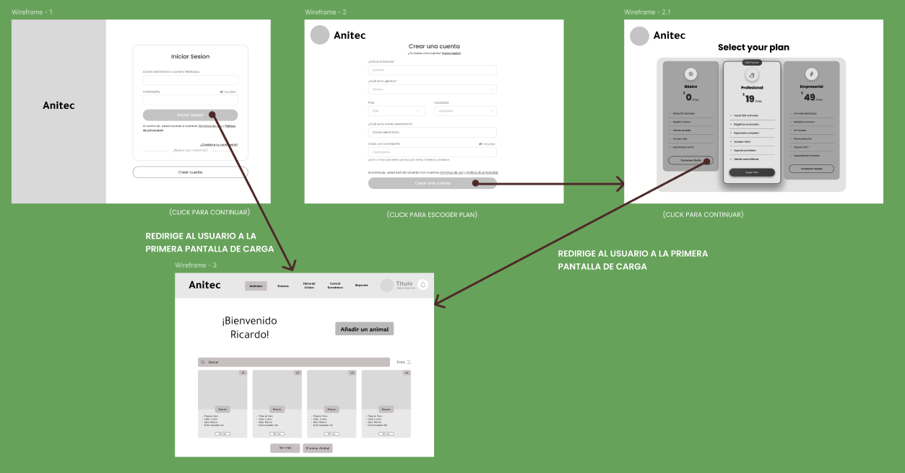

    <i><b>Fuente</b>: Elaboración propia.</i>

- **Registro de animales:** El presente user flow corresponde con la agregación, eliminación, actualización, y consulta del detalle del ganado.

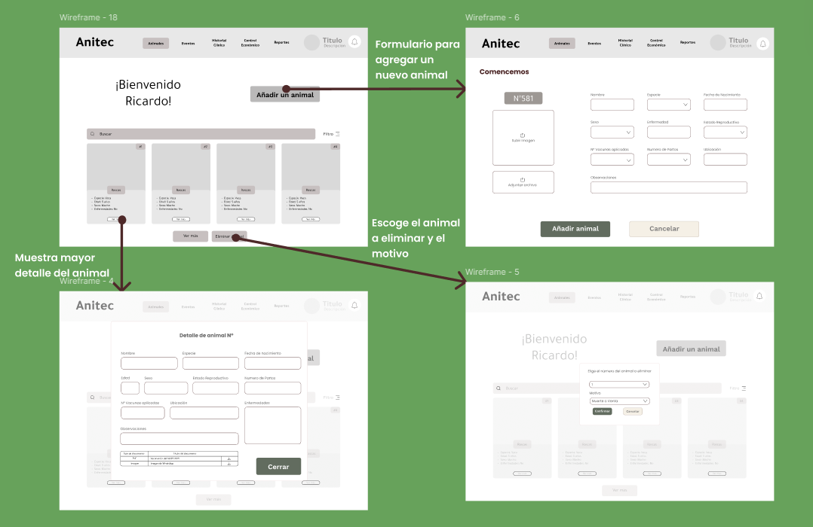

    <i><b>Fuente</b>: Elaboración propia.</i>

- **Registro de eventos:** El presente user flow corresponde con la agregación y consulta de eventos locales registrados por el usuario y/o sistema.

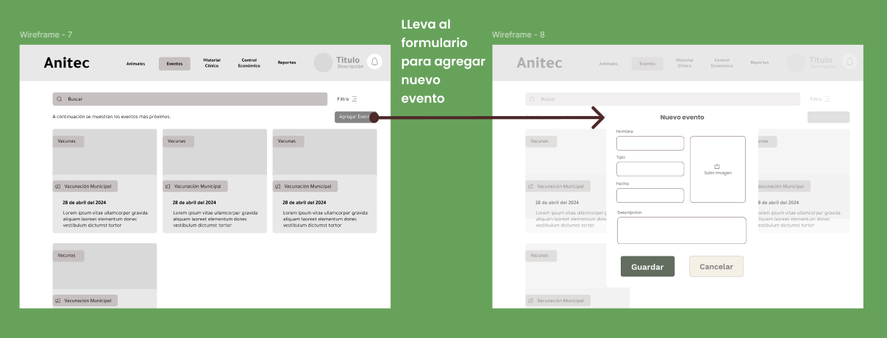

    <i><b>Fuente</b>: Elaboración propia.</i>

- **Registro de visitas médicas por animal:** El presente user flow corresponde a la gestión de las visitas médicas de un animal específico, mostrando un listado completo de sus atenciones veterinarias con información relevante. Desde este apartado, el usuario puede registrar nuevas visitas médicas, editar registros existentes para actualizar información y eliminar aquellos que ya no sean necesarios.

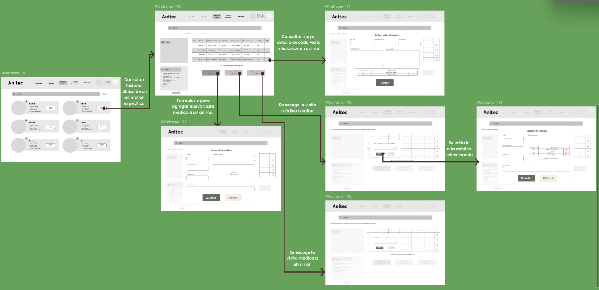

    <i><b>Fuente</b>: Elaboración propia.</i>

- **Control monetario del ganadero:** Esta vista permite al ganadero registrar y consultar sus ingresos y egresos de manera diaria, ofreciendo un control financiero claro y organizado. Además, presenta un resumen de las ganancias netas mensuales mediante un gráfico que proporciona una visión anual, junto con el detalle acumulado de ingresos y egresos del presente mes.

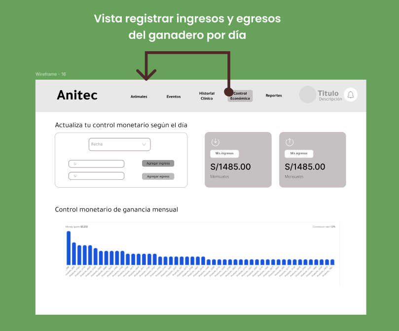

    <i><b>Fuente</b>: Elaboración propia.</i>

**Estadísticas del ganado:** Esta vista permite al ganadero analizar información clave sobre su producción mediante indicadores y gráficos dinámicos. Se presentan métricas como la cantidad total de animales, distribución por especie y sexo, así como su evolución en el tiempo.

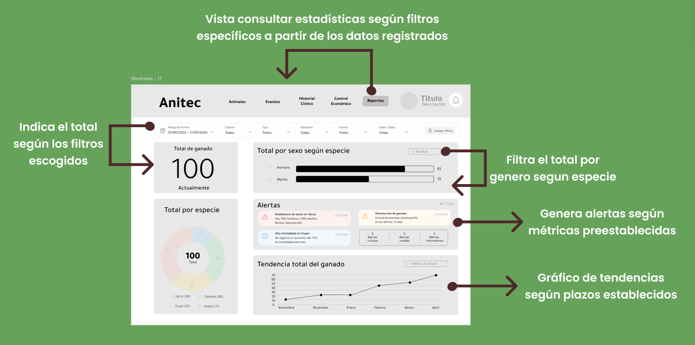

    <i><b>Fuente</b>: Elaboración propia.</i>

## 4.4.3. Web Applications Mock-ups.

En esta sección se exponen y analizan los mockups de la aplicación web AgroDigital, diseñada para el sector ganadero. En ellos se aprecia la implementación de principios fundamentales de diseño visual, accesibilidad, arquitectura de la información y del Design System definido para el producto. Cada mockup muestra cómo estos elementos se integran en una interfaz orientada a optimizar la trazabilidad, el control sanitario y la gestión eficiente del ganado. Asimismo, se incluye el enlace para acceder al contenido. [Enlace al figma](https://www.figma.com/design/9RliVy9r8aEzyfyEof3DGr/Untitled?node-id=42-837&t=fdPLEZQXM0PqMAv3-1)

Pantalla de login en la aplicación

 

    <i><b>Fuente</b>: Elaboración propia.</i>

Pantalla para registrarse en la aplicación

    <i><b>Fuente</b>: Elaboración propia.</i>

Pantalla para escoger el plan

    <i><b>Fuente</b>: Elaboración propia.</i>

Pantalla de inicio dentro de la aplicación

    <i><b>Fuente</b>: Elaboración propia.</i>

Pantalla para consultar mayor detalle sobre un animal

    <i><b>Fuente</b>: Elaboración propia.</i>

Pantalla para eliminar la información registrada sobre un animal

    <i><b>Fuente</b>: Elaboración propia.</i>

Pantalla para añadir un nuevo animal

    <i><b>Fuente</b>: Elaboración propia.</i>

Sección de evento locales registrados

    <i><b>Fuente</b>: Elaboración propia.</i>

Pantalla para registrar un nuevo evento

    <i><b>Fuente</b>: Elaboración propia.</i>

Pantalla para consultar el historial Clínico de un animal en específico

    <i><b>Fuente</b>: Elaboración propia.</i>

Pantalla para ver las visitas médicas registradas para un animal en específico

    <i><b>Fuente</b>: Elaboración propia.</i>

Pantalla para ver el detalle de un informe médico de un animal en específico

    <i><b>Fuente</b>: Elaboración propia.</i>

Pantalla para agregar un informe médico a un animal en específico

    <i><b>Fuente</b>: Elaboración propia.</i>

Pantalla para escoger un informe médico para editar de un animal registrado

    <i><b>Fuente</b>: Elaboración propia.</i>

Pantalla para editar un informe médico seleccionado registrado para un animal

    <i><b>Fuente</b>: Elaboración propia.</i>

Mensaje para escoger el informe del historial clínico a eliminar de un animal

    <i><b>Fuente</b>: Elaboración propia.</i>

Sección que registra ingresos y egresos de los ganaderos

    <i><b>Fuente</b>: Elaboración propia.</i>

Dashboard donde se presentan los reportes generados

    <i><b>Fuente</b>: Elaboración propia.</i>

## 4.4.4. Web Applications User Flow Diagrams.

En esta parte se detallan los diagramas de flujo de usuario, donde se describen las rutas posibles dentro de la aplicación y las decisiones que puede tomar el usuario. Estos diagramas garantizan una navegación clara y alineada con los objetivos funcionales.

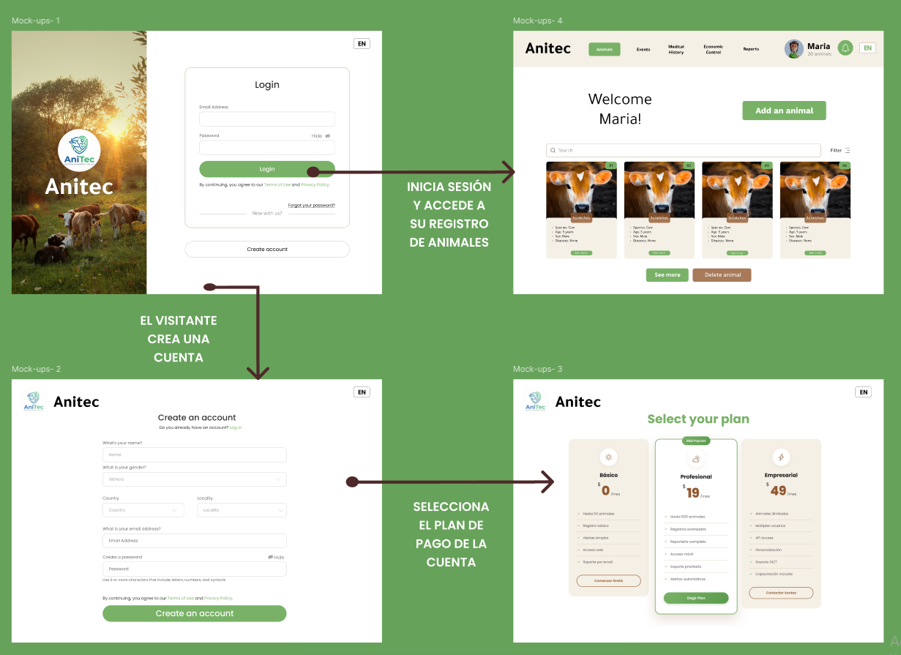
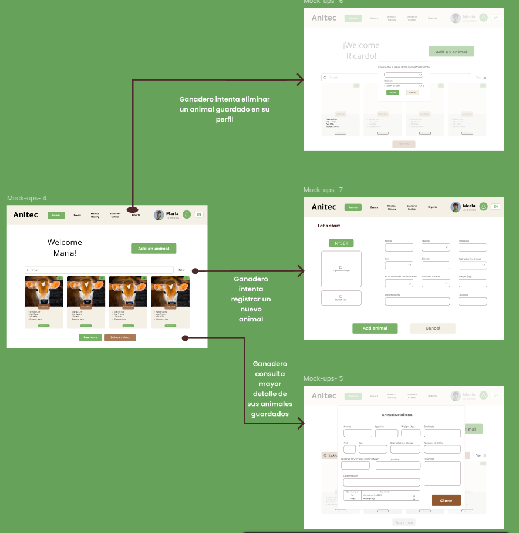
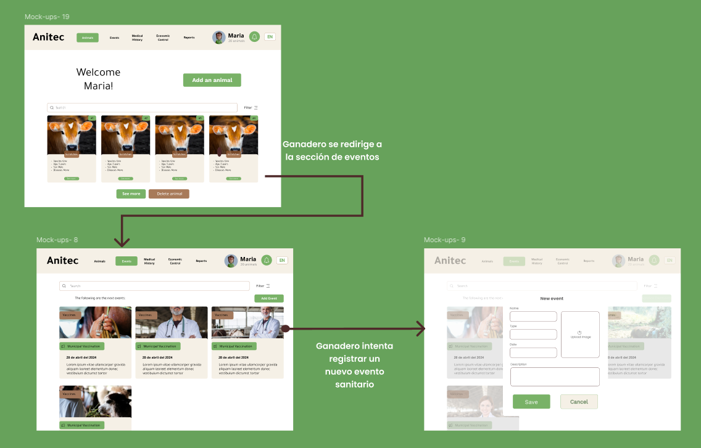
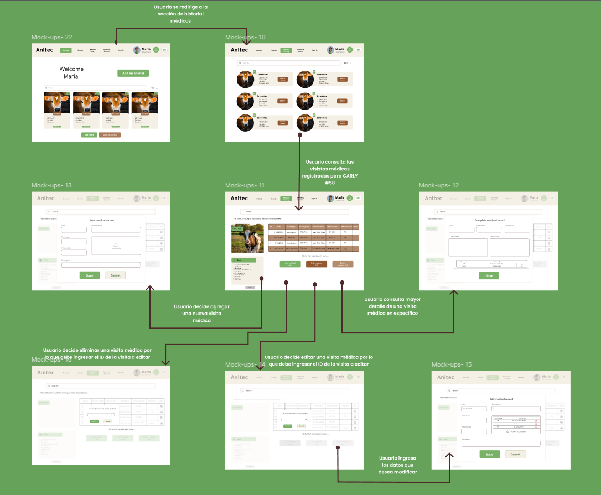
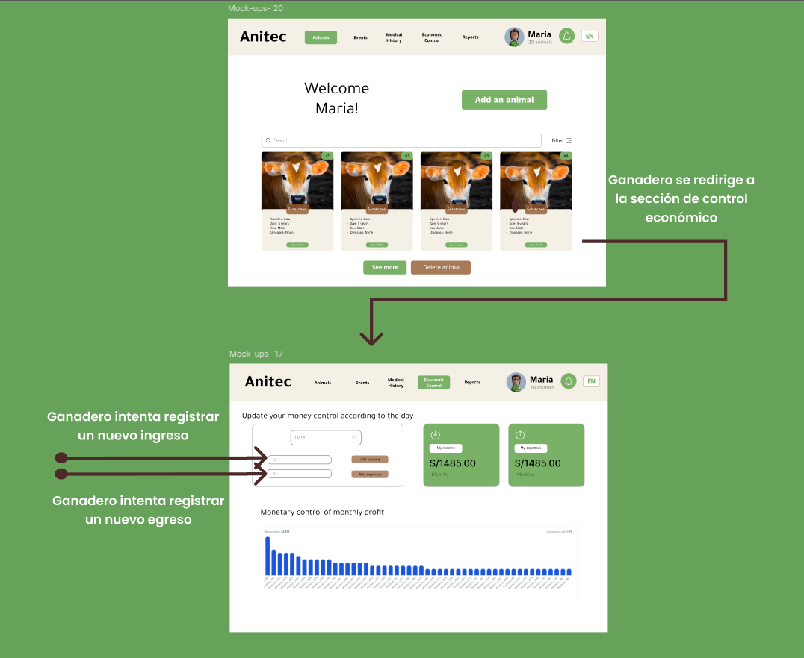
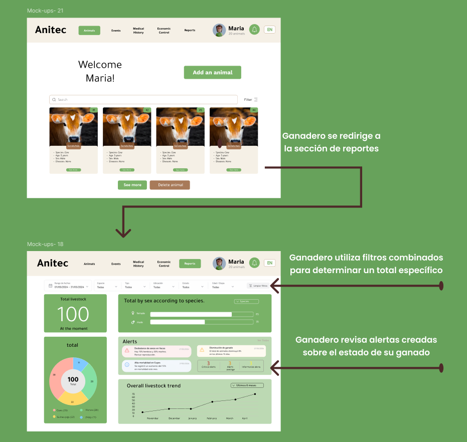

