# 4.6. Domain-Driven Software Architecture.

El Domain-Driven Design (DDD) tiene como objetivo central establecer un entendimiento mutuo sobre el dominio del negocio, promoviendo la sinergia entre el equipo técnico y los expertos del área a través de un lenguaje ubicuo. Este marco de trabajo trasciende el vocabulario técnico al integrar patrones estratégicos, metodologías de diseño y diagramas arquitectónicos que garantizan que el software evolucione en total sintonía con las prioridades empresariales. De esta forma, se logra una solución técnica robusta, profundamente ligada al conocimiento del negocio y capaz de resolver problemas complejos de manera eficiente.

Para ilustrar la aplicación práctica de estos conceptos en el proyecto, se detallan a continuación los primeros tres niveles del modelo C4, implementados mediante Structurizr, los cuales brindan una visión clara y estructurada del sistema en desarrollo.

## 4.6.1. Design Level EventStorming

**Paso 4:** Pivotal Events, el equipo busca eventos de negocio significativos que marquen un cambio de fase o una transición importante en el contexto del proceso. Estos se identifican trazando una barra vertical en la superficie de modelado para separar los flujos anteriores y posteriores al evento crucial. Identificar estos hitos es fundamental, ya que funcionan como indicadores clave para definir los límites de los posibles Bounded Contexts dentro del dominio.

  

    <b>Step 4: Pivotal Events</b>
  

  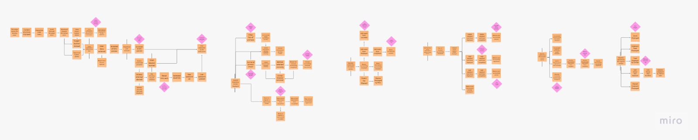
  

    <i><b>Fuente</b>: Elaboracion Propia</i>
  

**Paso 5:** Commands, el enfoque cambia de lo que ya sucedió a lo que desencadena esos eventos, introduciendo los commands (comandos) formulados en modo imperativo. Estos se representan con notas adhesivas de color azul claro y se colocan antes de los eventos que producen; además, si un usuario específico ejecuta la acción, se añade una pequeña nota amarilla para representar al actor o rol del negocio.

  

    <b>Step 5: Commands</b>
  

  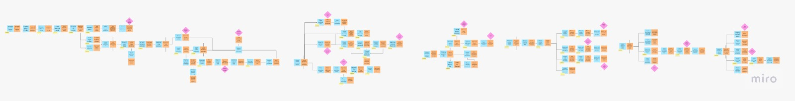
  

    <i><b>Fuente</b>: Elaboracion Propia</i>
  

**Paso 6:** Policies, se identifican las automation policies (políticas de automatización), que son escenarios donde un evento de dominio activa automáticamente la ejecución de un comando sin intervención directa de un actor. Estas reglas se representan con notas adhesivas de color púrpura que conectan el evento con el comando resultante, permitiendo especificar criterios de decisión o condiciones lógicas necesarias para que la acción se dispare.

  

    <b>Step 6: Policys </b>
  

  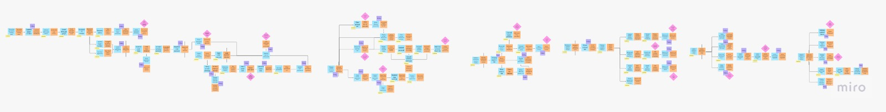
  

    <i><b>Fuente</b>: Elaboracion Propia</i>
  

**Paso 7:** Read Models, se introducen las vistas de datos o fuentes de información que un actor necesita consultar para tomar la decisión de ejecutar un comando. Estos se representan con notas adhesivas verdes y pueden ser pantallas del sistema, informes o notificaciones que sirven de base para la acción del usuario. En la superficie de modelado, los modelos de lectura se posicionan estratégicamente justo antes de los comandos para ilustrar el flujo de información hacia la toma de decisiones.

  

    <b>Step 7: Read Models </b>
  

  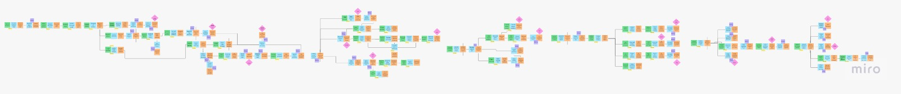
  

    <i><b>Fuente</b>: Elaboracion Propia</i>
  

**Paso 8:** External Systems, el modelo se aumenta con sistemas externos, definidos como cualquier sistema ajeno al dominio que se está explorando. Estos se representan con notas adhesivas rosas y pueden actuar de dos formas: activando la ejecución de comandos (entrada) o recibiendo notificaciones sobre eventos de dominio (salida). Al finalizar este paso, se debe verificar que todos los comandos del modelo sean ejecutados por actores, activados por políticas o llamados por estos sistemas externos.

  

    <b>Step 8: External Systems</b>
  

  
  

    <i><b>Fuente</b>: Elaboracion Propia</i>
  

**Paso 9:** Aggregates, los participantes organizan los conceptos relacionados en Aggregates (Agregados), que actúan como las unidades lógicas que reciben los comandos y producen los eventos resultantes. Estos se representan con notas adhesivas amarillas grandes, posicionándose físicamente en medio del flujo: con los comandos a su izquierda y los eventos a su derecha. Esta etapa es crucial para definir la consistencia y las fronteras de los datos dentro del modelo de dominio.

  

    <b>Step 9: Aggregates</b>
  

  
  

    <i><b>Fuente</b>: Elaboracion Propia</i>
  

**Paso 10:** Bounded Contexts, se concluye la sesión de EventStorming buscando grupos de agregados que estén estrechamente relacionados entre sí. Esta relación puede darse porque los agregados representan funcionalidades similares o porque están acoplados mediante políticas de automatización. Estos grupos identificados forman los límites naturales para los Bounded Contexts (contextos delimitados), definiendo así las fronteras lógicas y técnicas de los diferentes módulos del sistema dentro del dominio de negocio.

  

    <b>Step 10 - bounded context canvas</b>
  

  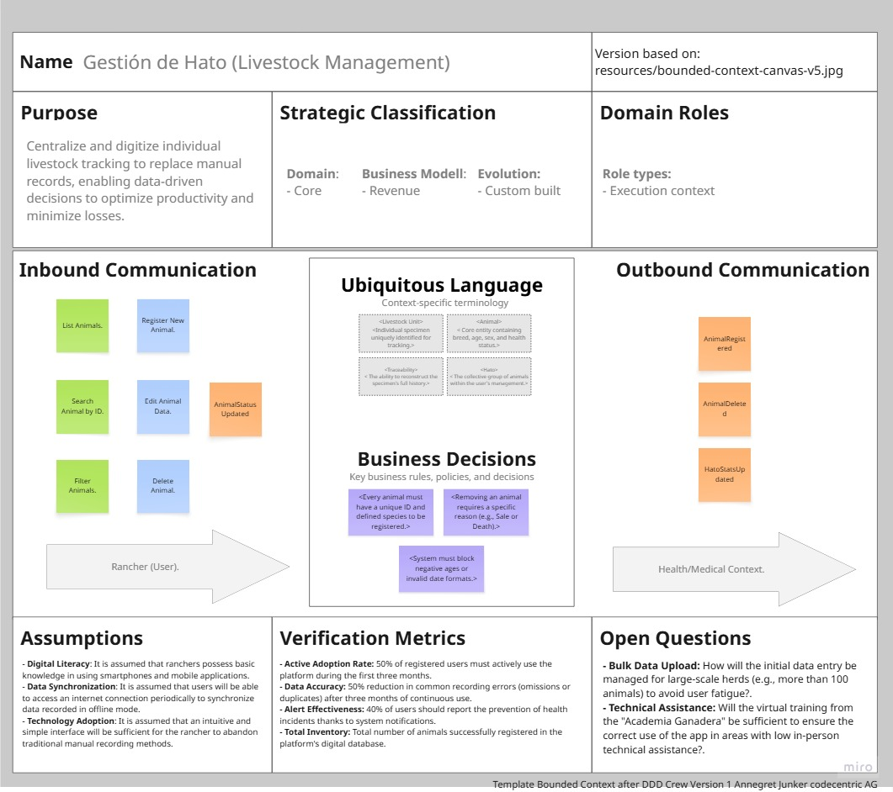
  

    <i><b>Fuente</b>: Elaboracion Propia</i>
  

  

    <b>Step 10 - bounded context canvas </b>
  

  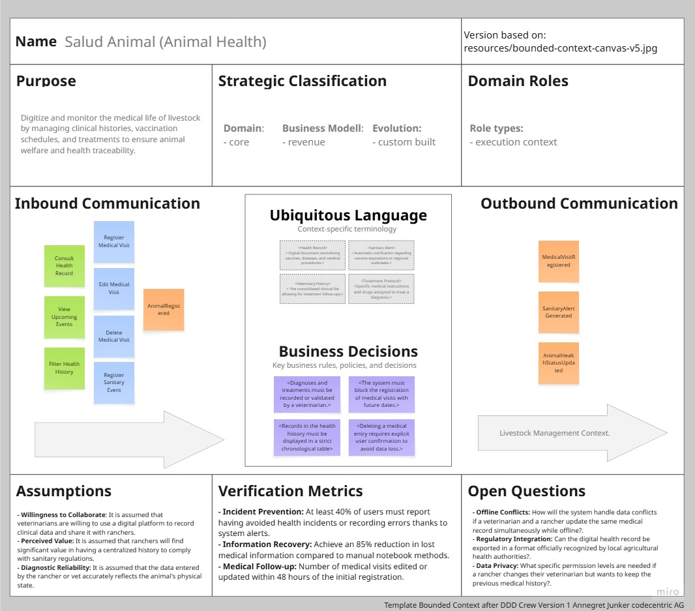
  

    <i><b>Fuente</b>: Elaboracion Propia</i>
  

  

    <b>Step 10 - bounded context canvas</b>
  

  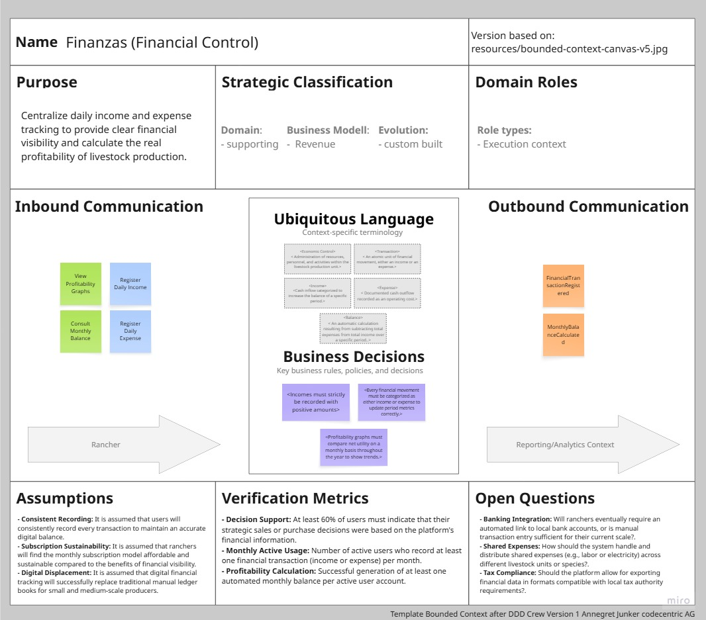
  

    <i><b>Fuente</b>: Elaboracion Propia</i>
  

  

    <b>Step 10 - bounded context canvas</b>
  

  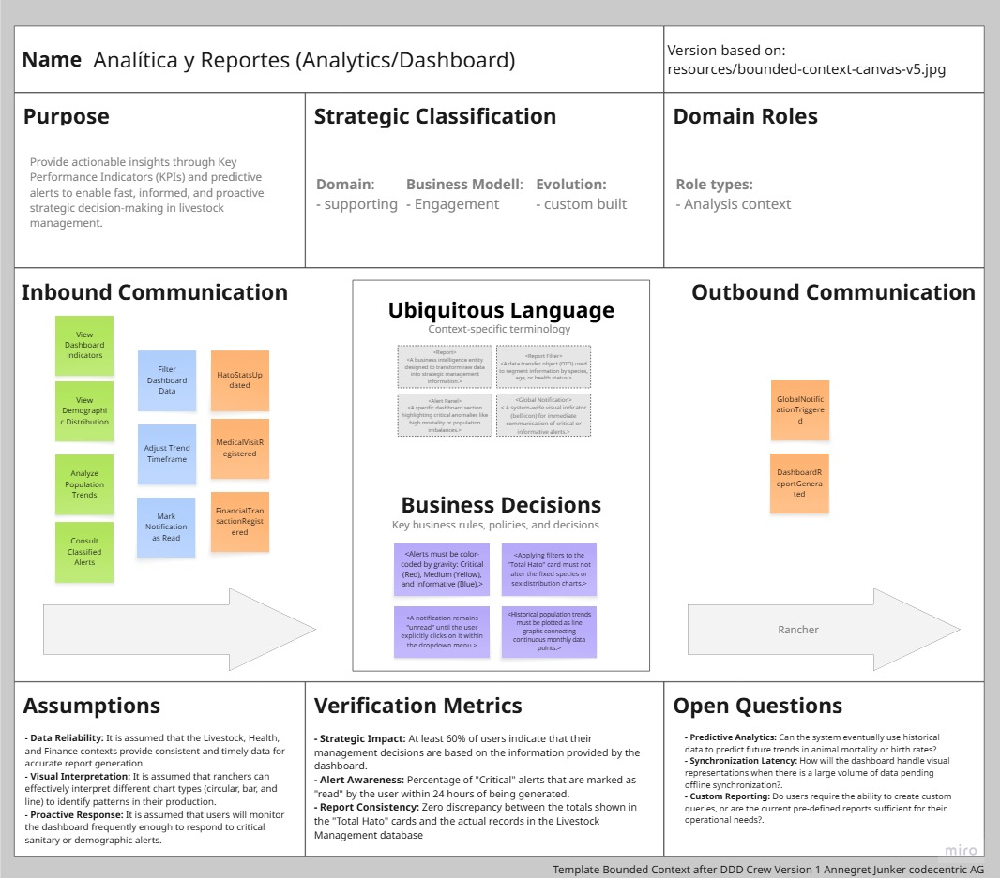
  

    <i><b>Fuente</b>: Elaboracion Propia</i>
  

Enlace para acceder al [EventStorming](https://miro.com/welcomeonboard/T1gvUmlKRzZiWjFQV0VFK1VsL1VDbFN1WElQbzV3WjVVd2NYR1d3NVRSdVFOUFd4ZVlIbk4rSmxBN1J3UUtjQjg3cHlKK2VKZ3cwVXB5ZXJoK0MyNmxud0lrejllQVpDT1AzczYyS0t6YWtZTk9xSS9JK05WR2x1cVZvYldTbzRnbHpza3F6REdEcmNpNEFOMmJXWXBBPT0hdjE=?share_link_id=376749116517)

## 4.6.2. Software Architecture Context Diagram.

El Software Architecture Context Level Diagram presenta una vista general del sistema Anitec y sus interacciones con usuarios y sistemas externos. Este diagrama permite identificar los principales actores de la plataforma, así como los servicios externos utilizados para funcionalidades como procesamiento de pagos y envío de correos electrónicos.

  

    <b>Diagrama de Contexto C4 - AniTec</b>
  

  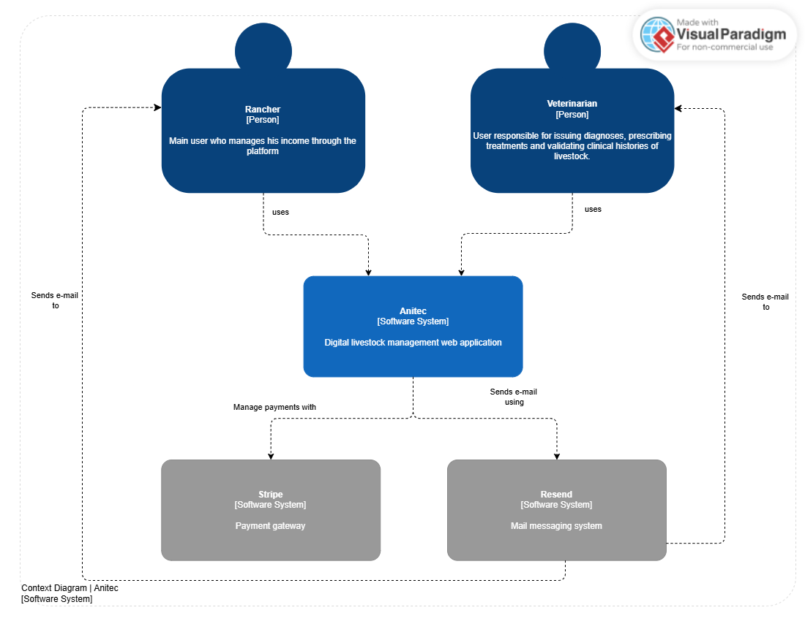
  

    <i><b>Fuente</b>: Elaboración propia.</i>
  

## 4.6.3. Software Architecture Container Diagrams.

El  Software Architecture Container Diagram permite visualizar la descomposición interna del sistema de gestión ganadera en unidades técnicas desplegables. Se presenta una infraestructura donde el Rancher y el Veterinarian interactúan con una Single Page Application (SPA) de Vue.js y Vite, la cual es entregada por una Web Application y complementada por una Landing Page informativa. Esta estructura se explica mediante el flujo de datos hacia una API Application que procesa la lógica del negocio, almacena información en una base de datos SQL Server y se integra con servicios externos como Stripe para la gestión de pagos y Resend para la comunicación por mensajería.

  

    <b>Diagrama de Contenedores C4 - AniTec</b>
  

  
  

    <i><b>Fuente</b>: Elaboración propia.</i>
  

## 4.6.4. Software Architecture Components Diagrams.

Los Software Architecture Component Diagrams presentan la descomposición interna de los principales contenedores del sistema, permitiendo identificar sus componentes, responsabilidades e interacciones. Estos diagramas facilitan la comprensión de la organización lógica de la solución y las tecnologías utilizadas en su implementación.

 

El siguiente Diagrama de Componentes descompone el contenedor de la API Application de AniTec para detallar la lógica interna del sistema bajo un enfoque de Bounded Contexts. Se ilustra cómo la Single Page Application (SPA) se comunica mediante HTTPS/JSON directamente con módulos independientes como IAM (responsable de la seguridad y la gestión de suscripciones con Stripe), Animal Management, Health Management, Event management, Financial Management y Reporting. Cada componente, construido con ASP.NET Core y Entity Framework Core, encapsula las reglas de negocio para la gestión ganadera y coordina la persistencia en SQL Server, integrándose además con Resend para las notificaciones por e-mail.

  

    <b>Diagrama de Componentes - API Application - AniTec</b>
  

  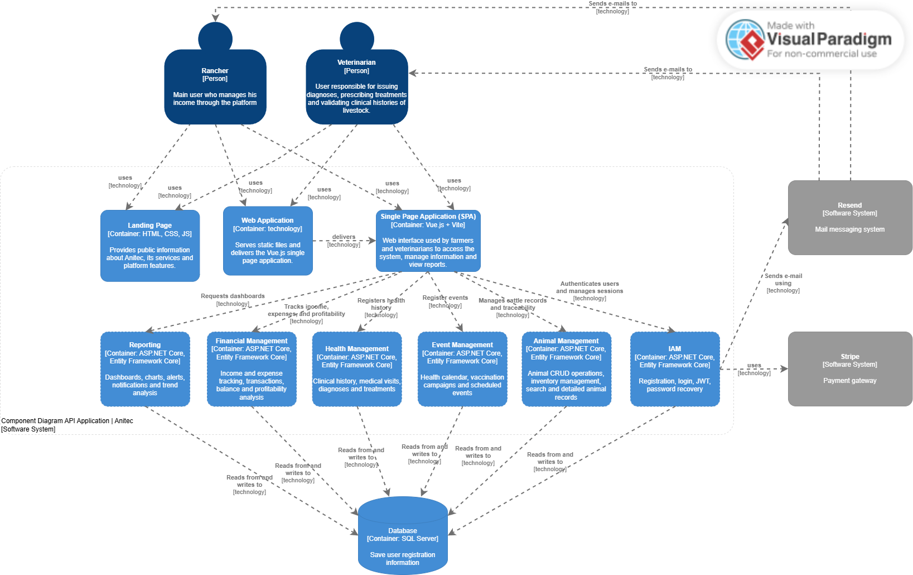
  

    <i><b>Fuente</b>: Elaboración propia.</i>
  

d

  

    <b>Diagrama de Componentes - Autenticacion BC C4 - AniTec</b>
  

  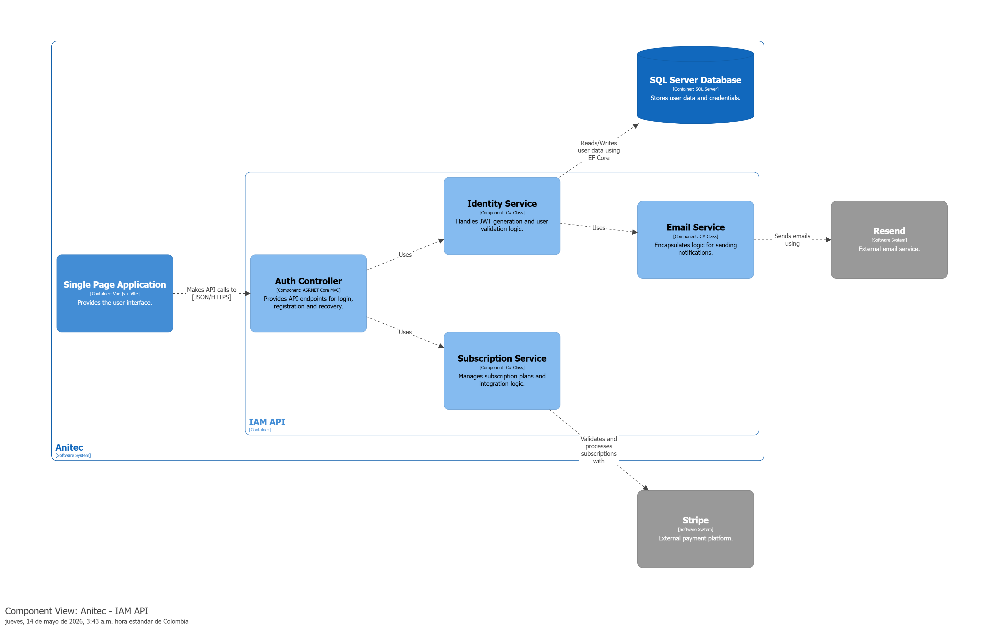
  

    <i><b>Fuente</b>: Elaboración propia.</i>
  

  

    <b>Diagrama de Componentes - Gestión animal BC C4 - AniTec</b>
  

  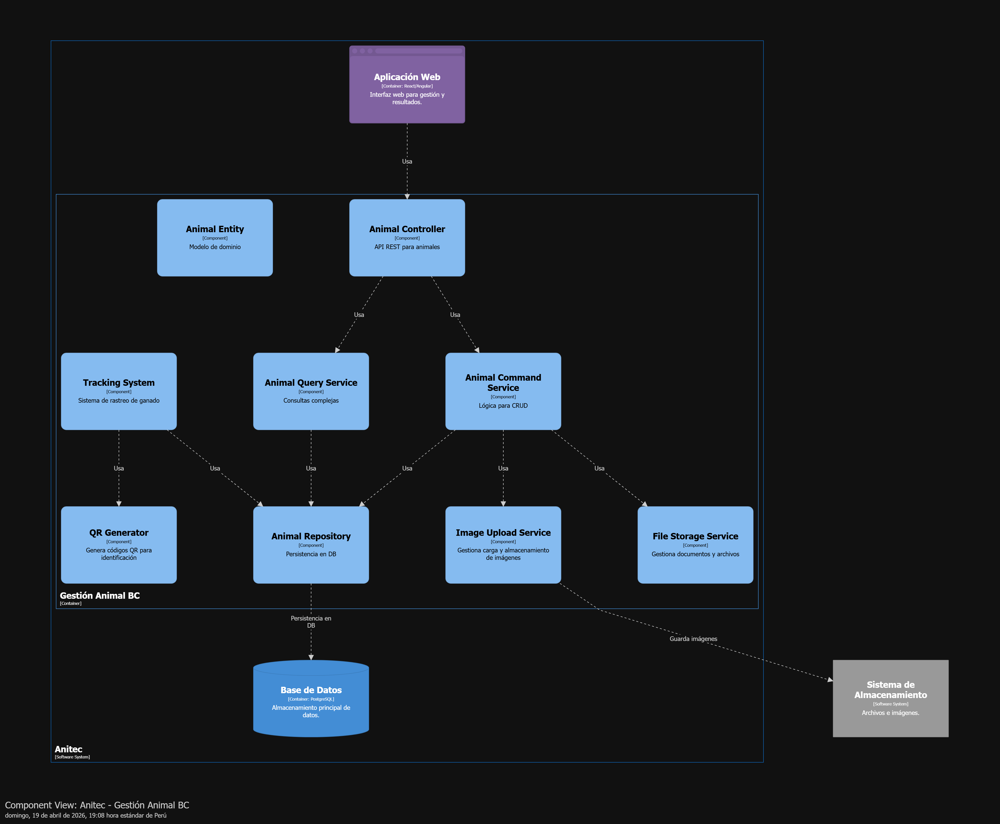
  

    <i><b>Fuente</b>: Elaboración propia.</i>
  

  

    <b>Diagrama de Componentes - Gestión eventos BC C4 - AniTec</b>
  

  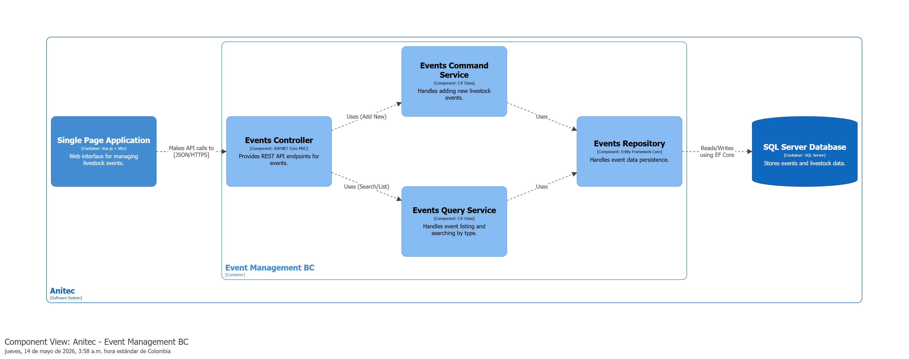
  

    <i><b>Fuente</b>: Elaboración propia.</i>
  

  

    <b>Diagrama de Componentes - Gestión financiera BC C4 - AniTec</b>
  

  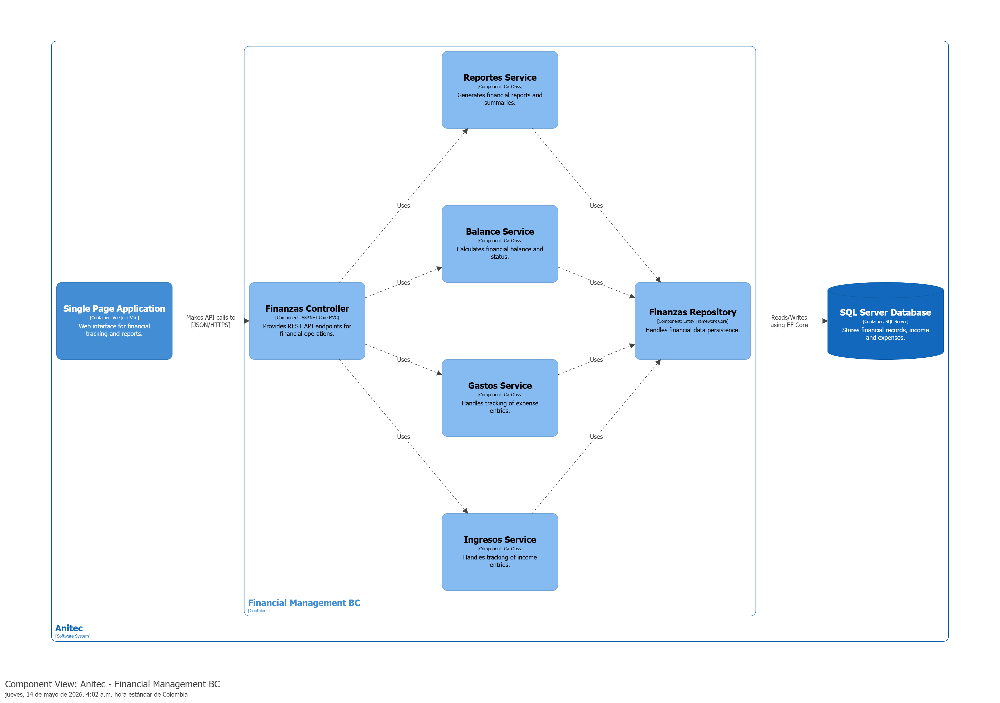
  

    <i><b>Fuente</b>: Elaboración propia.</i>
  

  

    <b>Diagrama de Componentes - Gestión sanitaria BC C4 - AniTec</b>
  

  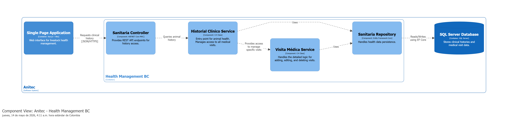
  

    <i><b>Fuente</b>: Elaboración propia.</i>
  

  

    <b>Diagrama de Componentes - Reportes BC C4 - AniTec</b>
  

  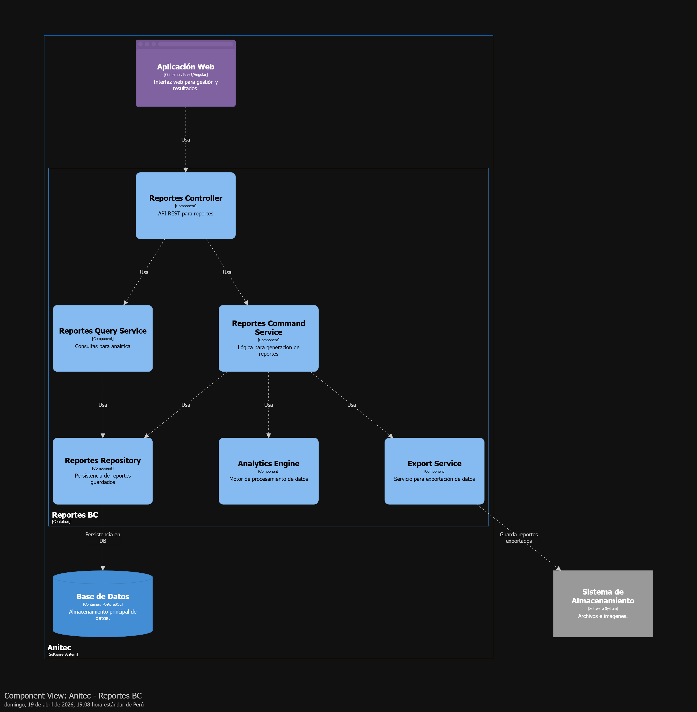
  

    <i><b>Fuente</b>: Elaboración propia.</i>
  

