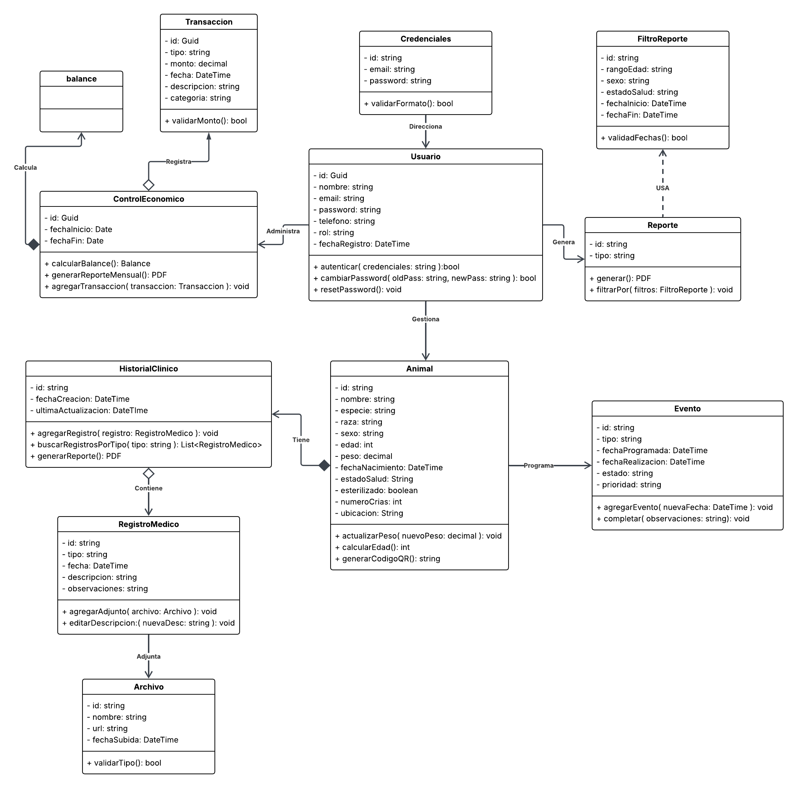

# 4.7. Software Object-Oriented Design.

## 4.7.1. Class Diagrams.

  

    <b>Diagrama de clases  - AniTec</b>
  

  
  

    <i><b>Fuente</b>: Elaboración propia.</i>
  

Enlace para acceder al [diseño del diagrama de clases](https://lucid.app/lucidchart/ce7bb8d9-af60-4a83-aca2-a67fd65fff1e/edit?viewport_loc=-2812%2C-544%2C6596%2C2877%2C0_0&invitationId=inv_14c6c1b8-2e95-4846-876a-1b70e26b577b)

## 4.7.2. Class Dictionary.

Diccionario de clases usado para el desarrollo de AgroDigital

| Clase                | Descripción                                                                                                                                                                                                                                                                                                                                                                                                                               |
| -------------------- | ----------------------------------------------------------------------------------------------------------------------------------------------------------------------------------------------------------------------------------------------------------------------------------------------------------------------------------------------------------------------------------------------------------------------------------------- |
| **Usuario**          | Define las entidades de usuario dentro del sistema, gestionando sus credenciales de acceso y niveles de autorización. Incluye datos esenciales como nombre, correo electrónico, contraseña cifrada, rol asignado y número de contacto.                                                                                                                                                                                                    |
| **Credenciales**     | Módulo encargado del almacenamiento volátil de la información de acceso del usuario (correo y clave), permitiendo la validación inicial antes de aplicar algoritmos de hashing.                                                                                                                                                                                                                                                           |
| **Animal**           | Constituye la entidad núcleo del dominio, encargada de centralizar la información técnica y biológica de cada ejemplar. Sus atributos clave permiten el seguimiento detallado mediante el registro de la especie, raza, género, cronología de nacimiento, masa corporal y condición sanitaria actual.                                                                                                                                     |
| **Evento**           | Objeto de dominio diseñado para organizar la bitácora de servicios del ganado. Registra la naturaleza del procedimiento (tipo), la programación temporal (fecha) y variables de gestión operativa como la importancia relativa (prioridad) y la situación actual de la actividad (estado).                                                                                                                                                |
| **HistorialClinico** | Clase de dominio que centraliza el registro cronológico de las intervenciones sanitarias realizadas a cada ejemplar. Almacena metadatos sobre la categoría del procedimiento, la marca temporal de ejecución y parámetros de control operativo, permitiendo la trazabilidad integral de la evolución médica del animal.                                                                                                                   |
| **RegistroMedico**   | Clase que representa una entrada atómica y detallada dentro del historial clínico de un semoviente. Se encarga de documentar de forma específica la naturaleza de la intervención (tipo) y el momento exacto de su ejecución (fecha), permitiendo además la inclusión de una narrativa técnica (descripción) y anotaciones adicionales sobre el procedimiento (observaciones).                                                            |
| **Archivo**          | Clase diseñada para la gestión de recursos multimedia y documentos digitales vinculados a los expedientes sanitarios. Actúa como un puntero hacia el almacenamiento externo, registrando el nombre del recurso, la extensión del fichero (tipo) y la dirección de acceso (URL) para su recuperación desde el servidor de objetos.                                                                                                         |
| **ControlEconomico** | Clase de dominio responsable de la consolidación y análisis del balance financiero dentro de un periodo determinado. Sus atributos permiten delimitar el rango temporal mediante una fecha de inicio y una de cierre, vinculando un conjunto de transacciones para el cálculo de la rentabilidad del ganadero.                                                                                                                            |
| **Transaccion**      | Clase que representa una unidad atómica de movimiento financiero dentro del sistema. Se encarga de registrar el flujo de capital (ya sea como ingreso o egreso), documentando el valor monetario (monto), la cronología del suceso (fecha), su clasificación contable (categoría) y una narrativa técnica del movimiento (descripción).                                                                                                   |
| **Balance**          | Clase encargada de consolidar los resultados financieros derivados del procesamiento de transacciones en un periodo específico. Actúa como un objeto de resumen que calcula de forma automática la sumatoria de entradas económicas (ingresos totales) y salidas (gastos totales), permitiendo determinar la utilidad neta de la operación ganadera.                                                                                      |
| **Reporte**          | Representa la entidad de inteligencia de negocios diseñada para transformar datos crudos en información estratégica para el ganadero. Esta clase gestiona la generación de panoramas personalizados sobre el hato, utilizando atributos de tipificación y parámetros de búsqueda específicos para facilitar la toma de decisiones informadas en AniTec.                                                                                   |
| **FiltroReporte**    | Objeto de transferencia de datos (DTO) encargado de encapsular los parámetros de segmentación requeridos por el motor de analítica. Permite delimitar la extracción de información mediante criterios específicos como la clasificación taxonómica (especie), intervalos cronológicos del ciclo de vida (rango de edad) y la condición clínica de los ejemplares (estado de salud), optimizando la precisión de los resultados obtenidos. |
