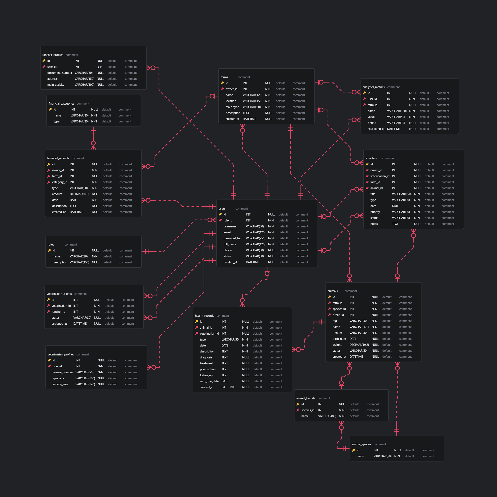

# 4.8. Database Design.

## 4.8.1. Database Diagram.

Se presenta el diagrama de la base de datos relacional:

  

    <b>Diagrama de base de datos de AniTec</b>
  

  
  

    <i><b>Fuente</b>: Elaboración propia.</i>
  

