<br>
<br>

<div align="center">
    
</div>

<br>
<br>

# 5.2. Landing Page, Services & Applications Implementation.

## 5.2.4. Sprint 4.

En el Sprint 4, el equipo de AniTec se enfoca en fortalecer la seguridad, autenticacion y monetizacion de la aplicacion web. A partir del backend real implementado en el Sprint 3, este Sprint busca evolucionar el IAM basico hacia un flujo mas completo, proteger los endpoints principales de la API y reemplazar el flujo de pagos de prueba por una integracion con Stripe para el modulo de suscripciones.

El alcance del Sprint incluye trabajo coordinado en backend y frontend. En backend, se planifica mejorar el bounded context de IAM, aplicar proteccion con JWT en los controladores, validar roles de usuario y preparar los servicios de suscripcion para trabajar con Stripe. En frontend, se planifica adaptar el inicio de sesion, la gestion de sesion, las rutas protegidas, el consumo autenticado de endpoints y la experiencia de pago desde la vista de planes. De esta manera, AniTec avanza hacia una version mas cercana al producto final, donde ganaderos y veterinarios pueden acceder segun su rol, trabajar con informacion protegida y gestionar suscripciones mediante una pasarela de pago.

### 5.2.4.1. Sprint Planning 4.

El Sprint Planning del Sprint 4 tuvo como objetivo definir el trabajo necesario para cerrar brechas de seguridad y monetizacion identificadas luego de la integracion frontend-backend del Sprint 3. El equipo determino que el sistema ya contaba con servicios REST, persistencia en MySQL y consumo desde el frontend, pero aun necesitaba un IAM mas completo, proteccion consistente de endpoints y una integracion realista con una pasarela de pago.

Durante la planificacion se priorizaron tres frentes principales: integracion de Stripe para suscripciones, fortalecimiento del IAM en backend y frontend, y proteccion de endpoints mediante autenticacion y autorizacion. Estos frentes fueron seleccionados porque impactan directamente en la confianza de los usuarios, el control de acceso por rol y el modelo de negocio basado en planes de suscripcion.

<table align="center" border="1" cellpadding="8" cellspacing="0" style="border-collapse: collapse; width: 100%; font-family: Arial, sans-serif;">
    <tbody>
        <tr>
            <td><b>Sprint #</b></td>
            <td>Sprint 4</td>
        </tr>
        <tr>
            <td colspan="2"><b>Sprint Planning Background</b></td>
        </tr>
        <tr>
            <td>Date</td>
            <td>2026-07-03</td>
        </tr>
        <tr>
            <td>Time</td>
            <td>10:00 AM</td>
        </tr>
        <tr>
            <td>Location</td>
            <td>Reunion virtual via Discord - Canal #sprint-planning</td>
        </tr>
        <tr>
            <td>Prepared by</td>
            <td>Melgarejo Quiroz, Josep Eliu</td>
        </tr>
        <tr>
            <td>Attendees (to planning meeting)</td>
            <td>Jorge Ayala, Bruno Huaman, Josep Melgarejo, Nadhim Raymundo, Luciana Sanchez</td>
        </tr>
        <tr>
            <td>Sprint n - 1 Review Summary</td>
            <td>El Sprint 3 permitio implementar el backend real de AniTec con ASP.NET Core, Entity Framework Core y MySQL, conectar progresivamente el frontend con la API real, incorporar los modulos de dispositivos IoT y suscripciones, y actualizar la landing page con los videos About the Team y About the Product.</td>
        </tr>
        <tr>
            <td>Sprint n - 1 Retrospective Summary</td>
            <td>El equipo identifico que la API ya permitia persistir y consultar informacion real, pero el IAM seguia siendo basico, varios endpoints necesitaban proteccion uniforme y el flujo de pagos aun funcionaba como simulacion. Por ello, se priorizo mejorar seguridad, control de acceso y suscripciones en el Sprint 4.</td>
        </tr>
        <tr>
            <td colspan="2"><b>Sprint Goal / User Stories</b></td>
        </tr>
        <tr>
            <td>Sprint 4 Goal</td>
            <td>Nuestro enfoque esta en ofrecer a ganaderos y veterinarios una experiencia segura de identidad, acceso por rol y gestion de suscripcion dentro de AniTec, integrando el trabajo de Backend Developers y Frontend Developers en autenticacion, autorizacion y pagos. Creemos que esto entrega mayor confianza a los ganaderos, porque su informacion productiva, financiera y sanitaria queda protegida; y entrega mayor control a los veterinarios, porque acceden a clientes y pacientes segun su rol y pueden gestionar su suscripcion dentro de una plataforma segura. Esto se confirmara cuando un usuario pueda registrarse como Rancher o Veterinarian, iniciar sesion con JWT, navegar solo por rutas autorizadas, consumir endpoints protegidos, seleccionar un plan, completar el checkout de Stripe y ver su suscripcion activa registrada en el sistema.</td>
        </tr>
        <tr>
            <td>Sprint 4 Velocity</td>
            <td>El equipo estima un velocity de 48 Story Points, considerando la integracion de Stripe, mejora del IAM en backend, adaptacion del IAM en frontend, proteccion de endpoints, ajustes de consumo autenticado y validacion funcional del flujo por roles.</td>
        </tr>
        <tr>
            <td>Sum of Story Points</td>
            <td>Total: 48 SP - Distribuidos en 12 SP para integracion de Stripe, 12 SP para mejora del IAM backend, 8 SP para IAM frontend y rutas protegidas, 8 SP para proteccion de endpoints con JWT y roles, 5 SP para ajustes de consumo autenticado desde el frontend, y 3 SP para documentacion, pruebas y validacion del flujo completo.</td>
        </tr>
    </tbody>
</table>

El Sprint Planning Meeting del Sprint 4 duro aproximadamente 2 horas. El equipo reviso los modulos de IAM y Subscriptions implementados previamente, identifico los endpoints que requieren proteccion y acordo mantener las tecnologias y patrones ya utilizados en el proyecto: ASP.NET Core, Entity Framework Core, MySQL, JWT, Vue, Pinia, Vue Router, Axios, stores por bounded context y servicios API simples. La integracion con Stripe se planifica como una extension del bounded context de Subscriptions, sin modificar la arquitectura general definida en los Sprints anteriores.

**Technical Stories incluidas en el Sprint 4:**

| ID     | Technical Story                                                       | Prioridad   | Story Points |
| ------ | --------------------------------------------------------------------- | ----------- | ------------ |
| TS-016 | Integracion backend con Stripe para suscripciones                     | Must Have   | 8            |
| TS-017 | Integracion frontend del flujo de pago con Stripe                     | Must Have   | 4            |
| TS-018 | Mejora del IAM backend para autenticacion y autorizacion por rol       | Must Have   | 12           |
| TS-019 | Proteccion de endpoints principales mediante JWT y roles              | Must Have   | 8            |
| TS-020 | Adaptacion del IAM frontend para sesion, token y rutas protegidas     | Must Have   | 8            |
| TS-021 | Consumo autenticado de endpoints desde stores y servicios frontend    | Should Have | 5            |
| TS-022 | Documentacion y validacion del flujo de seguridad y suscripcion       | Should Have | 3            |

La seleccion de estas Technical Stories responde a la necesidad de consolidar AniTec como una aplicacion web con acceso controlado y un modelo de suscripcion funcional. El equipo priorizo primero IAM y proteccion de endpoints, porque ambos permiten resguardar los datos de ganaderos y veterinarios. Luego se planifico la integracion con Stripe para mejorar el modulo de planes y acercarlo al modelo de negocio planteado en el proyecto.

**Distribucion de Trabajo por Componente:**

- **Backend ASP.NET Core:** 28 Story Points - Enfocados en mejorar IAM, proteger controladores con JWT y roles, configurar servicios de Stripe, ajustar suscripciones y validar endpoints protegidos.
- **Frontend Web Application:** 17 Story Points - Enfocados en adaptar login, sesion, rutas protegidas, consumo autenticado con token y flujo de pago desde la vista de planes.
- **Documentacion y Validacion:** 3 Story Points - Enfocados en documentar el alcance del Sprint, evidenciar endpoints protegidos, flujo de Stripe y pruebas funcionales por rol.

### 5.2.4.2. Aspects Leaders and Collaborators.

En esta seccion el equipo elabora el artefacto Leadership-and-Collaboration Matrix (LACX) para el Sprint 4, indicando por cada aspecto dentro del alcance del Sprint quien es el lider y quienes colaboran. La matriz permite organizar responsabilidades segun los frentes principales de trabajo: Stripe, IAM backend, IAM frontend, endpoints protegidos, consumo autenticado y documentacion.

Para este Sprint, los aspectos se enfocan en seguridad y suscripciones, ya que el sistema necesita controlar el acceso a la informacion y permitir que el modelo de planes funcione con una pasarela de pago. La distribucion se realiza manteniendo relacion con los bounded contexts y modulos trabajados en los Sprints anteriores.

**Aspectos del Sprint 4:**

1. **Backend - Stripe y Subscriptions:** Configuracion de Stripe, creacion de sesiones de pago, actualizacion del flujo de suscripciones y registro del resultado de pagos.
2. **Backend - IAM Completo:** Mejora de autenticacion, manejo de usuarios, roles, generacion de tokens y validacion de credenciales.
3. **Backend - Endpoints Protegidos:** Aplicacion de JWT y roles en controladores para limitar el acceso a operaciones segun usuario autenticado.
4. **Frontend - IAM y Rutas Protegidas:** Adaptacion del inicio de sesion, almacenamiento de token, cierre de sesion, guards de rutas y redireccion por rol.
5. **Frontend - Stripe y Planes:** Integracion del flujo de pago desde la vista de suscripciones, comunicacion con endpoints de Stripe y manejo de estados de pago.
6. **Frontend - Consumo Autenticado:** Ajuste de servicios API, stores y peticiones Axios para enviar token y manejar errores de autenticacion.
7. **Documentacion y Validacion:** Registro de decisiones, evidencias del Sprint, pruebas del flujo por rol, endpoints protegidos y flujo de pago.

<table align="center" border="1" cellpadding="8" cellspacing="0" style="border-collapse: collapse; width: 100%; font-family: Arial, sans-serif;">
    <tbody>
        <tr>
            <td><b>Team Member (Last Name, First Name)</b></td>
            <td><b>GitHub Username</b></td>
            <td><b>Stripe & Subscriptions Backend / L or C</b></td>
            <td><b>IAM Backend / L or C</b></td>
            <td><b>Protected Endpoints / L or C</b></td>
            <td><b>IAM Frontend / L or C</b></td>
            <td><b>Stripe Frontend / L or C</b></td>
            <td><b>Authenticated API Consumption / L or C</b></td>
            <td><b>Documentation & Validation / L or C</b></td>
        </tr>
        <tr>
            <td>Ayala Fernandez, Jorge Brayan</td>
            <td>jorgeayaladev</td>
            <td>C</td>
            <td>L</td>
            <td>L</td>
            <td>C</td>
            <td>C</td>
            <td>C</td>
            <td>C</td>
        </tr>
        <tr>
            <td>Huaman Gallardo, Bruno Aldair</td>
            <td>BrunoHG10</td>
            <td>C</td>
            <td>C</td>
            <td>C</td>
            <td>C</td>
            <td>L</td>
            <td>L</td>
            <td>C</td>
        </tr>
        <tr>
            <td>Melgarejo Quiroz, Josep Eliu</td>
            <td>Melga1502</td>
            <td>L</td>
            <td>C</td>
            <td>C</td>
            <td>L</td>
            <td>C</td>
            <td>C</td>
            <td>L</td>
        </tr>
        <tr>
            <td>Raymundo Villarroel, Nadhim Abigail</td>
            <td>AbigailRV</td>
            <td>C</td>
            <td>C</td>
            <td>C</td>
            <td>C</td>
            <td>C</td>
            <td>C</td>
            <td>C</td>
        </tr>
        <tr>
            <td>Sanchez Silva, Luciana Celeste</td>
            <td>Luccsss</td>
            <td>C</td>
            <td>C</td>
            <td>L</td>
            <td>C</td>
            <td>C</td>
            <td>C</td>
            <td>C</td>
        </tr>
    </tbody>
</table>

**Distribucion detallada de responsabilidades:**

- **Ayala Fernandez, Jorge Brayan (IAM Backend & Protected Endpoints Lead):** Responsable de fortalecer el IAM en backend, validar roles de usuario, aplicar proteccion con JWT en endpoints principales y revisar que las operaciones criticas no queden expuestas sin autenticacion.

- **Huaman Gallardo, Bruno Aldair (Stripe Frontend & Authenticated API Consumption Lead):** Responsable de adaptar la vista de planes para iniciar el flujo de pago, ajustar peticiones autenticadas desde el frontend y verificar que los stores consuman endpoints protegidos enviando el token correspondiente.

- **Melgarejo Quiroz, Josep Eliu (Stripe Backend, IAM Frontend & Documentation Lead):** Responsable de integrar el servicio backend de Stripe dentro del bounded context de Subscriptions, adaptar la experiencia de sesion en el frontend y documentar el avance del Sprint.

- **Raymundo Villarroel, Nadhim Abigail (Validation Collaborator):** Colabora en la validacion de flujos por rol, revision de errores de autenticacion, pruebas funcionales de acceso como ganadero y veterinario, y verificacion de que las vistas principales respondan correctamente con endpoints protegidos.

- **Sanchez Silva, Luciana Celeste (Protected Endpoints Collaborator):** Responsable de apoyar la proteccion de endpoints relacionados con clientes veterinarios, flujo por rol y validacion de acceso a informacion correspondiente a ganaderos y veterinarios.

### 5.2.4.3. Sprint Backlog 4.

El Sprint Backlog 4 organiza las tareas necesarias para implementar el IAM completo y la pasarela de pago con Stripe en AniTec. A diferencia del Sprint 3, donde se construyo la API real y se conecto progresivamente el frontend, este Sprint se enfoca en consolidar seguridad, roles, registro de usuarios, rutas protegidas, consumo autenticado y pagos de suscripciones.

Las tareas fueron distribuidas considerando los dos productos principales de la solucion: backend y frontend. En backend se trabajaron autenticacion, autorizacion, proteccion de endpoints, configuracion de Stripe y persistencia de pagos. En frontend se trabajaron los formularios de registro e inicio de sesion, guards de rutas, almacenamiento del token, envio del token en peticiones Axios y flujo visual de pago desde el modulo de planes.

**Trello Board:**
El equipo utiliza un Trello Board para gestionar visualmente el Sprint Backlog. El Board contiene las listas estándar de Scrum: "Sprint Goal", "To Do", "In Progress", "To Review" y "Done".

Enlace al tablero del Sprint Backlog 4: https://tinyurl.com/TrelloSprint4Anitec

<div align="center">
    
    <p><i><b>Fuente</b>: Elaboración propia.</i></p>
</div>

<table align="center" border="1" cellpadding="8" cellspacing="0" style="border-collapse: collapse; width: 100%; font-family: Arial, sans-serif;">
    <tbody>
        <tr>
            <td><b>Sprint #</b></td>
            <td colspan="7">Sprint 4</td>
        </tr>
        <tr>
            <td colspan="2">Technical Story</td>
            <td colspan="6">Work-Item / Task</td>
        </tr>
        <tr>
            <td>Id</td>
            <td>Title</td>
            <td>Id</td>
            <td>Title</td>
            <td>Description</td>
            <td>Estimation (Hours)</td>
            <td>Assigned to</td>
            <td>Status</td>
        </tr>
        <tr>
            <td>TS-018</td>
            <td>Mejora del IAM backend para autenticacion y autorizacion por rol</td>
            <td>T001</td>
            <td>Actualizar sign-up backend con roles</td>
            <td>Permitir registro de usuarios con username, password, fullName y role, validando roles Rancher y Veterinarian.</td>
            <td>4</td>
            <td>Ayala Fernandez, Jorge Brayan</td>
            <td>Done</td>
        </tr>
        <tr>
            <td>TS-018</td>
            <td>Mejora del IAM backend para autenticacion y autorizacion por rol</td>
            <td>T002</td>
            <td>Mantener autenticacion segura con JWT y BCrypt</td>
            <td>Asegurar que el inicio de sesion genere token JWT, incluya rol del usuario y mantenga contrasenas encriptadas con BCrypt.</td>
            <td>4</td>
            <td>Ayala Fernandez, Jorge Brayan</td>
            <td>Done</td>
        </tr>
        <tr>
            <td>TS-019</td>
            <td>Proteccion de endpoints principales mediante JWT y roles</td>
            <td>T003</td>
            <td>Proteger endpoints principales</td>
            <td>Aplicar atributos de autorizacion en controladores de livestock, sanitary, activities, financial, analytics, devices, subscriptions, profiles, clients e IAM.</td>
            <td>7</td>
            <td>Sanchez Silva, Luciana Celeste</td>
            <td>Done</td>
        </tr>
        <tr>
            <td>TS-020</td>
            <td>Adaptacion del IAM frontend para sesion, token y rutas protegidas</td>
            <td>T004</td>
            <td>Crear registro de usuario en frontend</td>
            <td>Implementar vista de sign-up con nombre completo, usuario, contrasena, confirmacion de contrasena y seleccion de rol ganadero o veterinario.</td>
            <td>4</td>
            <td>Melgarejo Quiroz, Josep Eliu</td>
            <td>Done</td>
        </tr>
        <tr>
            <td>TS-020</td>
            <td>Adaptacion del IAM frontend para sesion, token y rutas protegidas</td>
            <td>T005</td>
            <td>Mejorar login, sesion y redireccion por rol</td>
            <td>Eliminar usuarios demo, usar credenciales reales del backend, guardar token, mantener sesion y redirigir a dashboard ganadero o veterinario.</td>
            <td>4</td>
            <td>Melgarejo Quiroz, Josep Eliu</td>
            <td>Done</td>
        </tr>
        <tr>
            <td>TS-021</td>
            <td>Consumo autenticado de endpoints desde stores y servicios frontend</td>
            <td>T006</td>
            <td>Enviar token en peticiones API</td>
            <td>Ajustar BaseApi y stores para consumir endpoints protegidos enviando Authorization Bearer Token.</td>
            <td>5</td>
            <td>Huaman Gallardo, Bruno Aldair</td>
            <td>Done</td>
        </tr>
        <tr>
            <td>TS-016</td>
            <td>Integracion backend con Stripe para suscripciones</td>
            <td>T007</td>
            <td>Configurar Stripe en backend</td>
            <td>Agregar configuracion de SecretKey, SuccessUrl y CancelUrl para Stripe Checkout en modo test.</td>
            <td>4</td>
            <td>Melgarejo Quiroz, Josep Eliu</td>
            <td>Done</td>
        </tr>
        <tr>
            <td>TS-016</td>
            <td>Integracion backend con Stripe para suscripciones</td>
            <td>T008</td>
            <td>Crear endpoint de Stripe Checkout</td>
            <td>Implementar POST /api/v1/subscriptions/stripe-checkout para generar sesiones de pago usando el plan seleccionado y el usuario autenticado.</td>
            <td>4</td>
            <td>Melgarejo Quiroz, Josep Eliu</td>
            <td>Done</td>
        </tr>
        <tr>
            <td>TS-016</td>
            <td>Integracion backend con Stripe para suscripciones</td>
            <td>T009</td>
            <td>Confirmar sesion de Stripe</td>
            <td>Implementar GET /api/v1/subscriptions/stripe-checkout/{sessionId}/confirm para validar pago, registrar suscripcion activa y registrar pago en MySQL.</td>
            <td>4</td>
            <td>Melgarejo Quiroz, Josep Eliu</td>
            <td>Done</td>
        </tr>
        <tr>
            <td>TS-017</td>
            <td>Integracion frontend del flujo de pago con Stripe</td>
            <td>T010</td>
            <td>Integrar Stripe desde frontend</td>
            <td>Actualizar vista de planes para llamar al endpoint de checkout, redirigir a Stripe y manejar los estados success/cancel.</td>
            <td>4</td>
            <td>Huaman Gallardo, Bruno Aldair</td>
            <td>Done</td>
        </tr>
        <tr>
            <td>TS-017</td>
            <td>Integracion frontend del flujo de pago con Stripe</td>
            <td>T011</td>
            <td>Crear vistas de pago confirmado y cancelado</td>
            <td>Implementar rutas /subscriptions/success y /subscriptions/cancel para confirmar la sesion de Stripe o volver al modulo de planes.</td>
            <td>2</td>
            <td>Huaman Gallardo, Bruno Aldair</td>
            <td>Done</td>
        </tr>
        <tr>
            <td>TS-022</td>
            <td>Documentacion y validacion del flujo de seguridad y suscripcion</td>
            <td>T012</td>
            <td>Validar flujo completo IAM y suscripciones</td>
            <td>Probar registro, login, redireccion por rol, acceso a endpoints protegidos, pago Stripe test y registro de suscripcion/pago.</td>
            <td>2</td>
            <td>Raymundo Villarroel, Nadhim Abigail</td>
            <td>Done</td>
        </tr>
    </tbody>
</table>

El Sprint Backlog 4 contiene 12 tareas principales, con aproximadamente 48 horas estimadas de tareas, alineadas con los 48 Story Points planificados. Todas las tareas fueron cerradas como Done porque el sistema ya permite registrar usuarios reales por rol, iniciar sesion con JWT, consumir endpoints protegidos y ejecutar el flujo de suscripcion mediante Stripe Checkout en modo test.

### 5.2.4.4. Development Evidence for Sprint Review.

Durante el Sprint 4 se registraron avances en los repositorios del backend y frontend. La evidencia de desarrollo se organiza en dos bloques: primero, los cambios relacionados con IAM completo; segundo, los cambios relacionados con Stripe y suscripciones. La tabla presenta commits representativos del trabajo realizado durante el Sprint, incluyendo avances en la rama `develop` y la integracion final hacia `main`.

**Commits del repositorio anitec-backend:**

| Repository | Branch | Commit Id | Commit Message | Commit Message Body | Committed on (Date) |
| ---------- | ------ | --------- | -------------- | ------------------- | ------------------- |
| anitec-backend | develop | a31f9c2 | feat: implement complete iam flow | Implementacion de registro, inicio de sesion, roles Rancher/Veterinarian, JWT y BCrypt para usuarios reales. | 2026-07-01 |
| anitec-backend | develop | c84d2e7 | feat: protect api endpoints by role | Aplicacion de autorizacion en controladores principales para limitar operaciones segun rol del usuario. | 2026-07-02 |
| anitec-backend | develop | f17a6b4 | feat: add stripe checkout subscriptions | Creacion de endpoints para iniciar y confirmar sesiones de Stripe Checkout en modo test. | 2026-07-03 |
| anitec-backend | develop | d92b8a1 | fix: persist stripe subscription payments | Registro de suscripciones activas y pagos asociados en MySQL luego de confirmar la sesion de Stripe. | 2026-07-04 |
| anitec-backend | main | 6e45bd0 | Merge branch 'develop' into main | Integracion del IAM completo, proteccion de endpoints y flujo de Stripe Checkout a la rama principal del backend. | 2026-07-06 |

**Commits del repositorio anitec-frontend:**

| Repository | Branch | Commit Id | Commit Message | Commit Message Body | Committed on (Date) |
| ---------- | ------ | --------- | -------------- | ------------------- | ------------------- |
| anitec-frontend | develop | b72c4e9 | feat: add sign up flow by role | Implementacion del formulario de registro con seleccion de rol ganadero o veterinario. | 2026-07-01 |
| anitec-frontend | develop | e09a3f5 | feat: consume protected endpoints with token | Ajuste de BaseApi, stores y sesion para enviar token JWT en peticiones al backend. | 2026-07-02 |
| anitec-frontend | develop | 9d6f1a8 | feat: integrate stripe checkout in subscriptions | Integracion del boton de pago con Stripe y redireccion al checkout generado por backend. | 2026-07-03 |
| anitec-frontend | develop | 4c58b2d | feat: add subscription success and cancel views | Creacion de vistas para confirmar pago o manejar cancelacion del flujo de Stripe. | 2026-07-04 |
| anitec-frontend | main | 1f83e6c | Merge branch 'develop' into main | Integracion del registro por rol, consumo autenticado y flujo de suscripciones con Stripe a la rama principal del frontend. | 2026-07-06 |

**Evidencia de archivos modificados:**

- Backend IAM: `Iam/Interfaces/Rest/AuthenticationController.cs`, `Iam/Application/Internal/CommandServices/UserCommandService.cs`, `Iam/Infrastructure/Tokens/Jwt/Services/TokenService.cs`, `Iam/Infrastructure/Pipeline/Middleware`.
- Backend Subscriptions: `Subscriptions/Interfaces/Rest/SubscriptionsController.cs`, resources de Stripe Checkout, entidades `Subscription` y `Payment`.
- Frontend IAM: `src/iam/presentation/views/sign-in-form.vue`, `src/iam/presentation/views/sign-up-form.vue`, `src/iam/application/iam.store.js`, `src/iam/infrastructure/iam-api.js`.
- Frontend Subscriptions: `src/subscriptions/application/subscriptions.store.js`, `src/subscriptions/infrastructure/subscriptions-api.js`, `src/subscriptions/presentation/views/subscription-plans.vue`, `subscription-success.vue`, `subscription-cancel.vue`.
- Shared Frontend: `src/shared/infrastructure/base-api.js`, `src/router.js`, `src/shared/presentation/components/layout.vue`.


### 5.2.4.5. Execution Evidence for Sprint Review.

La ejecucion del Sprint 4 se valido mediante pruebas funcionales locales y mediante el despliegue del frontend y backend. El frontend fue publicado en Render, el backend fue publicado en Render con documentacion Swagger disponible, y la base de datos MySQL fue configurada mediante Filess.io. Las credenciales sensibles de conexion no se incluyen en el informe, ya que se administran mediante variables de entorno.

**URLs de despliegue:**

- Frontend desplegado en Render: https://anitec-frontend.onrender.com
- Backend Swagger desplegado en Render: https://anitec-backend.onrender.com/swagger/index.html
- Base de datos MySQL desplegada en Filess.io: https://filess.io/
- Host de base de datos: `232mcw.h.filess.io`
- Puerto de base de datos: `3307`
- Nombre de base de datos: `anitecdb_grownenter`

**Validaciones funcionales realizadas:**

1. Registro de usuario ganadero desde el frontend mediante `/iam/sign-up`.
2. Registro de usuario veterinario desde el frontend mediante `/iam/sign-up`.
3. Inicio de sesion con usuario real mediante `/iam/sign-in`.
4. Redireccion automatica hacia dashboard ganadero o veterinario segun rol.
5. Persistencia de sesion mediante token JWT en localStorage.
6. Cierre de sesion y limpieza de datos locales.
7. Bloqueo de rutas privadas cuando no existe sesion activa.
8. Envio de `Authorization: Bearer <token>` en peticiones hacia el backend.
9. Acceso a endpoints protegidos usando token valido.
10. Flujo de pago con Stripe Checkout en modo test desde la vista de suscripciones.
11. Confirmacion de sesion de Stripe desde `/subscriptions/success`.
12. Registro de suscripcion activa y pago en MySQL.

**Evidencias visuales pendientes de insertar:**

<div align="center">
    <p><b>Frontend - Formulario de registro con seleccion de rol vistas</b></p>
    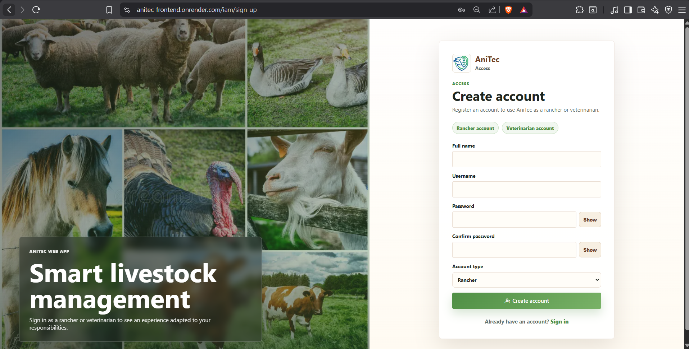
    <p><i><b>Fuente</b>: Elaboración propia.</i></p>
</div>

<div align="center">
    <p><b>Frontend - Login real sin usuarios demo</b></p>
    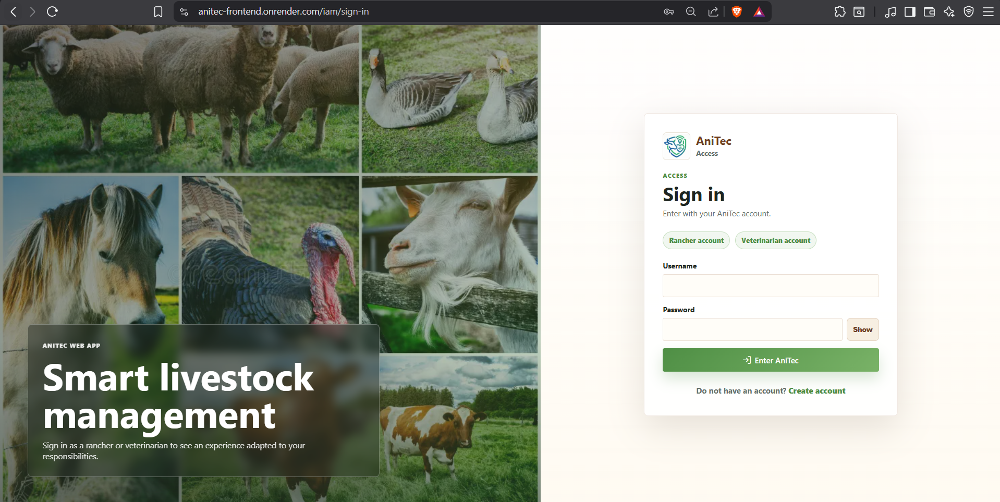
    <p><i><b>Fuente</b>: Elaboración propia.</i></p>
</div>

<div align="center">
    <p><b>Frontend - Dashboard ganadero con usuario autenticado</b></p>
    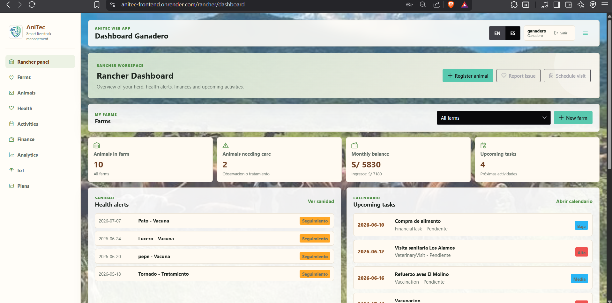
    <p><i><b>Fuente</b>: Elaboración propia.</i></p>
</div>

<div align="center">
    <p><b>Frontend - Dashboard veterinario con usuario autenticado</b></p>
    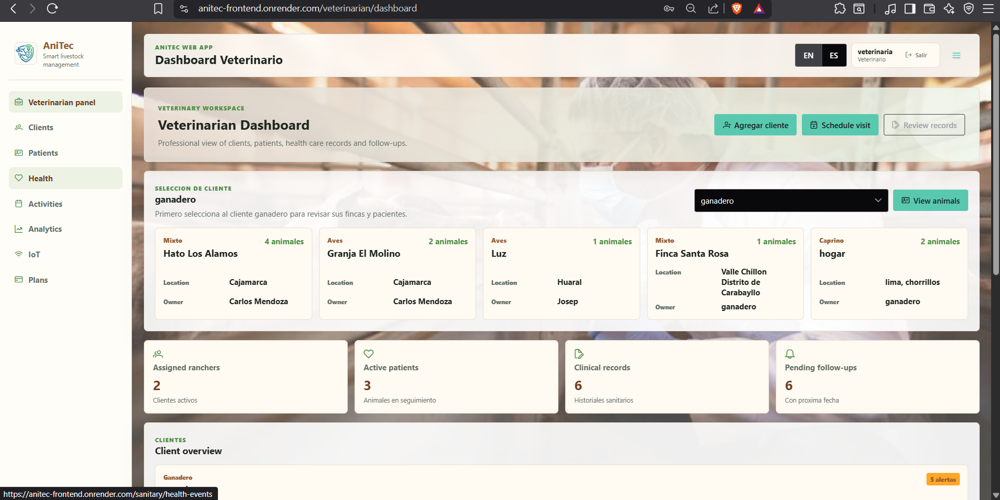
    <p><i><b>Fuente</b>: Elaboración propia.</i></p>
</div>

<div align="center">
    <p><b>Frontend - Endpoint protegido en Swagger con token JWT</b></p>
    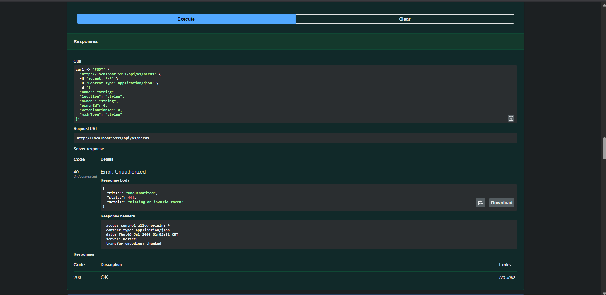
    <p><i><b>Fuente</b>: Elaboración propia.</i></p>
</div>

<div align="center">
    <p><b>Frontend - Endpoint protegido en Swagger con token JWT</b></p>
    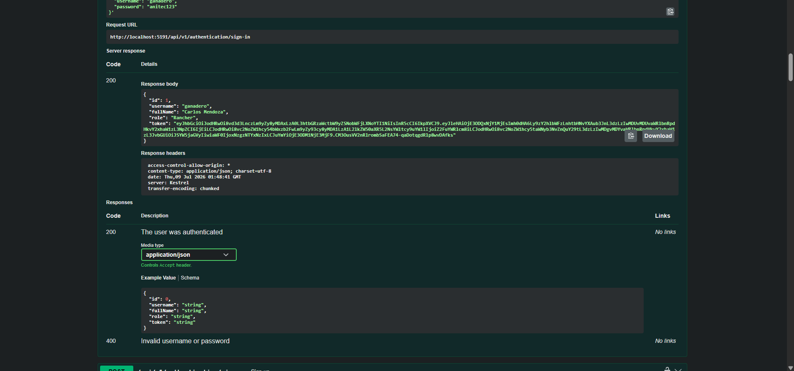
    <p><i><b>Fuente</b>: Elaboración propia.</i></p>
</div>

<div align="center">
    <p><b>Frontend - Vista de planes con boton Pagar con Stripe</b></p>
    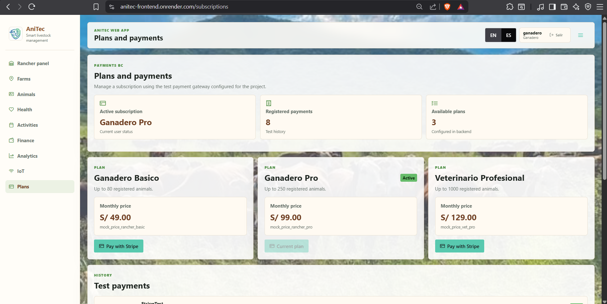
    <p><i><b>Fuente</b>: Elaboración propia.</i></p>
</div>

<div align="center">
    <p><b>Frontend - Stripe Checkout en modo test</b></p>
    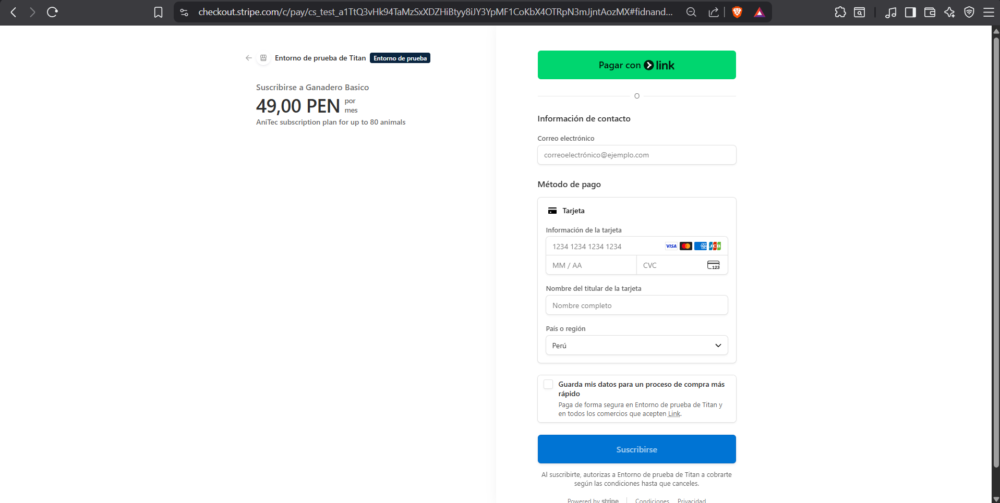
    <p><i><b>Fuente</b>: Elaboración propia.</i></p>
</div>

<div align="center">
    <p><b>Frontend - Pago confirmado en `/subscriptions/success</b></p>
    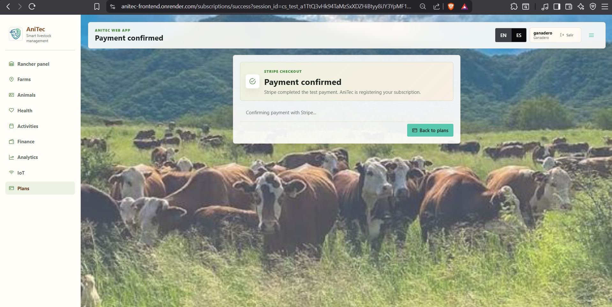
    <p><i><b>Fuente</b>: Elaboración propia.</i></p>
</div>

<div align="center">
    <p><b>Frontend - Suscripcion activa e historial de pagos</b></p>
    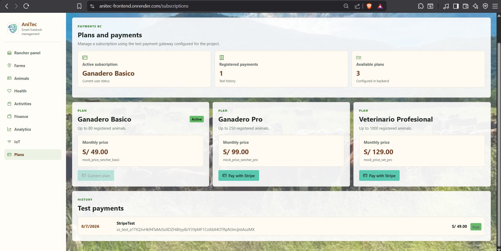
    <p><i><b>Fuente</b>: Elaboración propia.</i></p>
</div>


**Resultado de pruebas locales:**

| Prueba | Resultado |
| ------ | --------- |
| Registro de ganadero | Correcto |
| Registro de veterinario | Correcto |
| Login con usuario real | Correcto |
| Redireccion por rol | Correcto |
| Acceso a ruta protegida sin sesion | Redirecciona a login |
| Consumo de endpoint protegido con token | Correcto |
| Flujo Stripe Checkout test | Correcto |
| Confirmacion de pago y registro en backend | Correcto |

### 5.2.4.6. Services Documentation Evidence for Sprint Review.

En el Sprint 4 se documentan los servicios relacionados con IAM completo, autorizacion por rol y pagos con Stripe. Estos servicios complementan la API desarrollada en el Sprint 3 y permiten que AniTec funcione con usuarios reales, endpoints protegidos y suscripciones pagadas mediante una pasarela de pago en modo test.

**Servicios principales de IAM:**

| Bounded Context | Method | Endpoint | Description |
| --------------- | ------ | -------- | ----------- |
| IAM | POST | `/api/v1/authentication/sign-up` | Registra un usuario nuevo con username, password, fullName y role. |
| IAM | POST | `/api/v1/authentication/sign-in` | Autentica credenciales y devuelve token JWT con datos del usuario. |
| IAM | GET | `/api/v1/users` | Lista usuarios registrados. Requiere token. |
| IAM | GET | `/api/v1/users/{id}` | Obtiene usuario por identificador. Requiere token. |

**Servicios principales de Stripe y suscripciones:**

| Bounded Context | Method | Endpoint | Description |
| --------------- | ------ | -------- | ----------- |
| Subscriptions | GET | `/api/v1/subscription-plans` | Lista planes disponibles para suscripcion. |
| Subscriptions | GET | `/api/v1/subscriptions/users/{userId}/active` | Obtiene la suscripcion activa de un usuario. |
| Subscriptions | GET | `/api/v1/subscriptions/users/{userId}/payments` | Obtiene historial de pagos del usuario. |
| Subscriptions | POST | `/api/v1/subscriptions/stripe-checkout` | Crea una sesion de Stripe Checkout para el plan seleccionado. |
| Subscriptions | GET | `/api/v1/subscriptions/stripe-checkout/{sessionId}/confirm` | Confirma una sesion de Stripe, registra suscripcion activa y pago. |

**Servicios protegidos por JWT y roles:**

| Area | Roles principales | Description |
| ---- | ----------------- | ----------- |
| Livestock | Rancher, Veterinarian | Consulta de hatos y animales. Creacion/edicion principalmente para ganadero. |
| Sanitary | Rancher, Veterinarian | Gestion de eventos sanitarios, tratamientos, vacunas e incidencias. |
| Activities | Rancher, Veterinarian | Gestion de actividades y tareas relacionadas al ganado. |
| Financial | Rancher | Gestion de ingresos y egresos del ganadero. |
| Clients | Veterinarian | Gestion de clientes ganaderos asignados al veterinario. |
| Devices | Rancher, Veterinarian | Consulta de dispositivos y metricas. Creacion/edicion principalmente para ganadero. |
| Subscriptions | Rancher, Veterinarian | Consulta de planes, pagos y suscripcion activa. |

**Ejemplo de registro de usuario:**

```http
POST /api/v1/authentication/sign-up
Content-Type: application/json

{
  "username": "ganadero01",
  "password": "Password123!",
  "fullName": "Ganadero Demo",
  "role": "Rancher"
}
```

**Respuesta esperada:**

```json
{
  "message": "User created successfully"
}
```

**Ejemplo de inicio de sesion:**

```http
POST /api/v1/authentication/sign-in
Content-Type: application/json

{
  "username": "ganadero01",
  "password": "Password123!"
}
```

**Respuesta esperada:**

```json
{
  "id": 12,
  "username": "ganadero01",
  "fullName": "Ganadero Demo",
  "role": "Rancher",
  "token": "jwt_token_generado"
}
```

**Ejemplo de creacion de Stripe Checkout:**

```http
POST /api/v1/subscriptions/stripe-checkout
Authorization: Bearer jwt_token_generado
Content-Type: application/json

{
  "planId": 2
}
```

**Respuesta esperada:**

```json
{
  "sessionId": "cs_test_...",
  "checkoutUrl": "https://checkout.stripe.com/c/pay/cs_test_..."
}
```

Para ejecutar endpoints protegidos desde Swagger, el usuario debe iniciar sesion, copiar el valor del campo `token`, presionar el boton `Authorize` y pegar el token JWT. Swagger envia la cabecera como `Authorization: Bearer <token>`. Si el token no se envia o es invalido, el backend responde `401 Unauthorized`.

**Ejemplo de confirmacion de pago:**

```http
GET /api/v1/subscriptions/stripe-checkout/cs_test_123/confirm
Authorization: Bearer jwt_token_generado
```

**Respuesta esperada:**

```json
{
  "subscription": {
    "id": 8,
    "userId": 12,
    "planId": 2,
    "status": "Active"
  },
  "payment": {
    "id": 15,
    "amount": 99,
    "currency": "PEN",
    "provider": "StripeTest",
    "status": "Paid"
  }
}
```

La documentacion completa de servicios se valida desde Swagger con el backend desplegado en Render:

https://anitec-backend.onrender.com/swagger/index.html

### 5.2.4.7. Software Deployment Evidence for Sprint Review.

El despliegue final del Sprint 4 se realiza usando Render para backend y frontend, mientras que la base de datos MySQL se configura en Filess.io. En este Sprint se considera Render como plataforma principal para ejecutar la aplicacion web y la API, debido a que el flujo de IAM, endpoints protegidos y Stripe requiere una configuracion controlada de variables de entorno y servicios conectados.

**Estrategia de despliegue aplicada:**

| Component | Platform | Deployment Type | Status |
| --------- | -------- | --------------- | ------ |
| Backend ASP.NET Core | Render | Web Service | Desplegado |
| Frontend Vue/Vite | Render | Static Site / Web Service | Desplegado |
| MySQL Database | Filess.io | MySQL cloud database | Desplegado |
| Stripe Checkout | Stripe Test Mode | Servicio externo de pagos | Configurado en modo test |

**Variables de entorno configuradas para backend en Render:**

| Variable | Purpose |
| -------- | ------- |
| `ASPNETCORE_ENVIRONMENT` | Define el ambiente de ejecucion del backend en Render. |
| `ConnectionStrings__DefaultConnection` | Cadena de conexion hacia MySQL. |
| `TokenSettings__Secret` | Clave secreta para firmar JWT. Se configura como secreto y no se publica en el repositorio. |
| `StripeSettings__SecretKey` | Llave secreta test de Stripe. |
| `StripeSettings__SuccessUrl` | URL del frontend para pago exitoso. |
| `StripeSettings__CancelUrl` | URL del frontend para pago cancelado. |

**Variables de entorno configuradas para frontend en Render:**

| Variable | Purpose |
| -------- | ------- |
| `VITE_ANITEC_API_URL` | URL publica del backend desplegado en Render con prefijo `/api/v1`. |
| `VITE_SIGNIN_ENDPOINT_PATH` | Ruta de sign-in del backend. |
| `VITE_SIGNUP_ENDPOINT_PATH` | Ruta de sign-up del backend. |
| `VITE_USERS_ENDPOINT_PATH` | Ruta de usuarios del backend. |
| `VITE_HERDS_ENDPOINT_PATH` | Ruta de hatos/fincas del backend. |
| `VITE_ANIMALS_ENDPOINT_PATH` | Ruta de animales del backend. |
| `VITE_HEALTH_EVENTS_ENDPOINT_PATH` | Ruta de eventos sanitarios del backend. |
| `VITE_FINANCIAL_RECORDS_ENDPOINT_PATH` | Ruta de registros financieros del backend. |
| `VITE_FARM_ACTIVITIES_ENDPOINT_PATH` | Ruta de actividades del backend. |
| `VITE_ANALYTICS_METRICS_ENDPOINT_PATH` | Ruta de metricas y reportes analiticos del backend. |
| `VITE_DEVICES_ENDPOINT_PATH` | Ruta de dispositivos IoT del backend. |
| `VITE_DEVICE_METRICS_ENDPOINT_PATH` | Ruta de metricas de dispositivos IoT del backend. |
| `VITE_SUBSCRIPTION_PLANS_ENDPOINT_PATH` | Ruta de planes de suscripcion del backend. |

**URLs de despliegue:**

- Frontend web: https://anitec-frontend.onrender.com
- Backend Swagger en Render: https://anitec-backend.onrender.com/swagger/index.html
- Base de datos MySQL en Filess.io: https://filess.io/

**Video/demo de navegación del Sprint 4:**

https://tinyurl.com/DemoSprint4

**Evidencias pendientes de despliegue:**

<div align="center">
    <p><b>Servicio Backend en Render</b></p>
    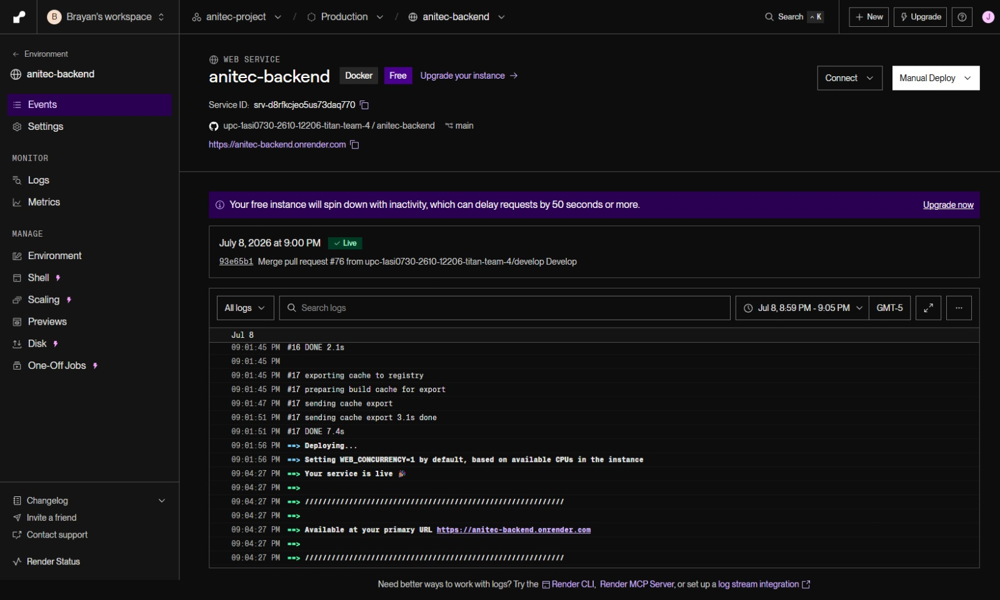
    <p><i><b>Fuente</b>: Elaboración propia.</i></p>
</div>

<div align="center">
    <p><b>Servicio Frontend en Render</b></p>
    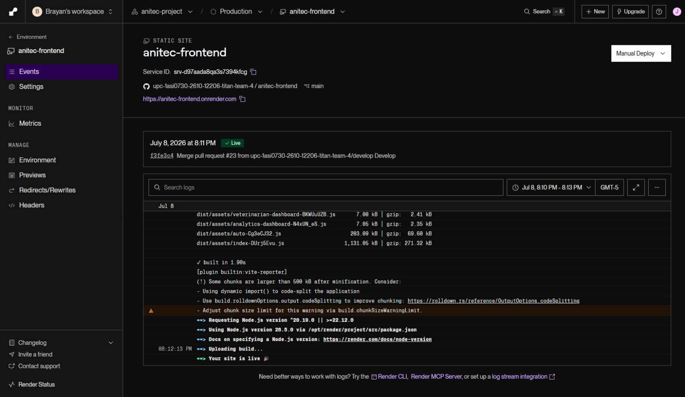
    <p><i><b>Fuente</b>: Elaboración propia.</i></p>
</div>

<div align="center">
    <p><b>Variables de entorno Backend</b></p>
    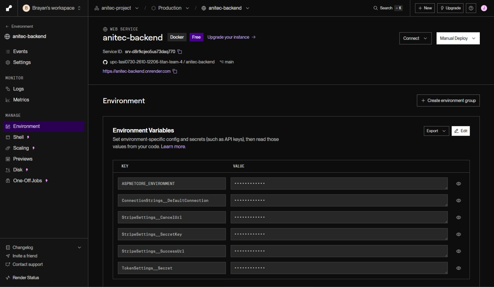
    <p><i><b>Fuente</b>: Elaboración propia.</i></p>
</div>

<div align="center">
    <p><b>Variables de entorno Frontend</b></p>
    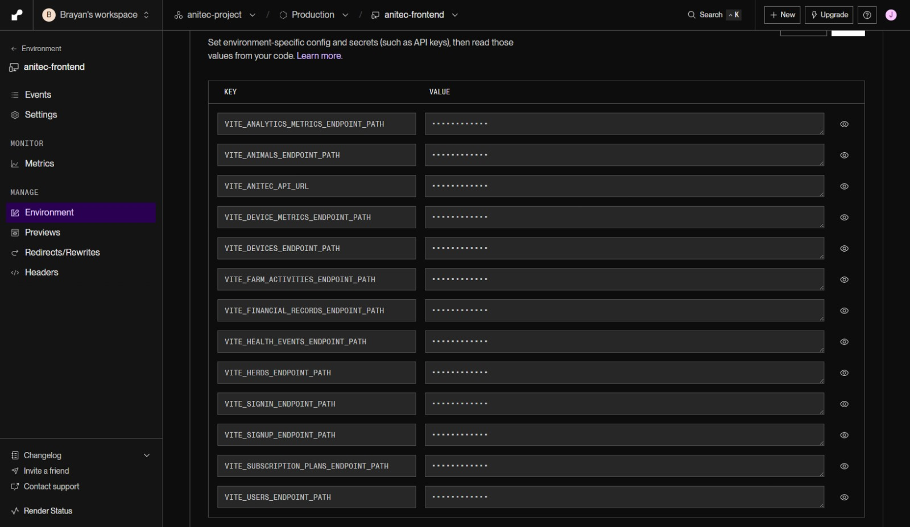
    <p><i><b>Fuente</b>: Elaboración propia.</i></p>
</div>

<div align="center">
    <p><b>Swagger ejecutandose desde Render</b></p>
    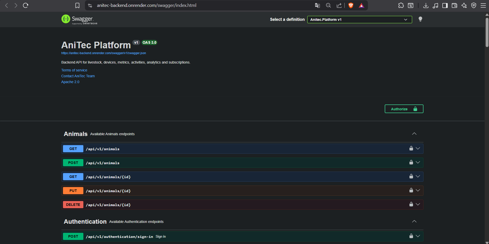
    <p><i><b>Fuente</b>: Elaboración propia.</i></p>
</div>


### 5.2.4.8. Team Collaboration Insights during Sprint.

En esta seccion el equipo explica como se desarrollaron las actividades de implementacion del IAM completo, la integracion de Stripe y el despliegue del frontend y backend. Tambien se presentan los analiticos de colaboracion y commits realizados durante el Sprint 4.

**Distribucion de Trabajo:**

Todos los miembros del equipo participaron en el cierre funcional de AniTec segun las responsabilidades definidas en la matriz LACX. El trabajo se dividio en frentes complementarios: IAM backend, IAM frontend, proteccion de endpoints, integracion de Stripe, consumo autenticado desde el frontend, despliegue y documentacion del Sprint. Esta distribucion permitio que el equipo avance en funcionalidades transversales sin perder la separacion por bounded contexts trabajada en los sprints anteriores.

El equipo mantuvo coordinacion mediante GitHub para el control de versiones y Discord para la comunicacion diaria. Las revisiones se enfocaron en validar que el flujo por rol funcione correctamente, que los endpoints protegidos respondan con token JWT, que el frontend ya no dependa de usuarios demo y que el modulo de suscripciones pueda redirigir al usuario hacia Stripe Checkout en modo test. Tambien se coordino la configuracion de variables de entorno para Render y Filess.io, evitando exponer credenciales sensibles dentro del repositorio.

**Metricas de Colaboracion:**

<div align="center">
    <p><b>Commits graficas Backend - Sprint 4</b></p>
    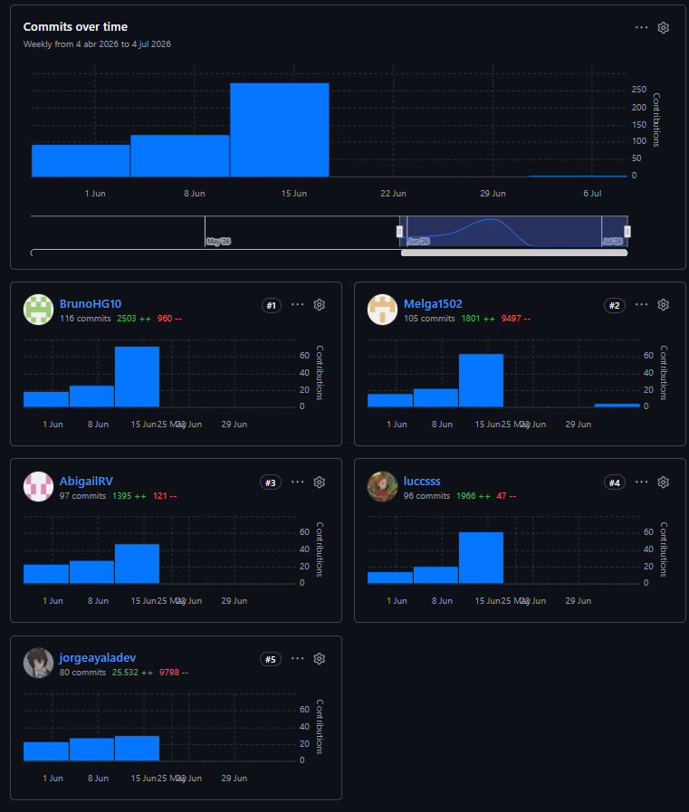
    <p><i><b>Fuente</b>: Elaboración propia.</i></p>
</div>

<div align="center">
    <p><b>Commits graficas Frontend - Sprint 4</b></p>
    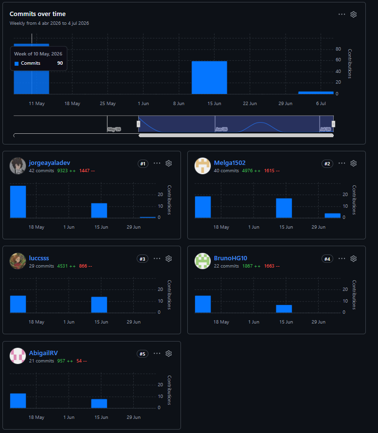
    <p><i><b>Fuente</b>: Elaboración propia.</i></p>
</div>
**Reflexiones del Equipo:**

- Ayala Fernandez, Jorge Brayan: "El Sprint 4 permitio reforzar el IAM de AniTec para que el sistema trabaje con usuarios reales y roles definidos. La proteccion de endpoints fue importante porque no basta con ocultar opciones en el frontend; el backend tambien debe validar que cada usuario acceda solo a las operaciones que corresponden a su rol."

- Huaman Gallardo, Bruno Aldair: "La adaptacion del frontend al flujo autenticado ayudo a eliminar la dependencia de usuarios demo. Trabajar con token JWT, rutas protegidas y redireccion por rol permitio que ganaderos y veterinarios tengan una experiencia mas cercana al producto final."

- Melgarejo Quiroz, Josep Eliu: "La integracion de Stripe fue uno de los retos principales del Sprint, porque requirio coordinar backend, frontend y configuracion de entorno. Separar la creacion de la sesion en backend y la redireccion desde frontend ayudo a mantener el flujo ordenado y seguro."

- Raymundo Villarroel, Nadhim Abigail: "La validacion del flujo completo permitio comprobar que el usuario puede registrarse, iniciar sesion, navegar segun su rol y gestionar una suscripcion. Esta revision fue clave para detectar comportamientos que todavia dependian de datos locales o configuraciones anteriores."

- Sanchez Silva, Luciana Celeste: "La proteccion por rol y la revision de accesos permitieron mejorar la confianza en la aplicacion. Para el segmento veterinario fue importante verificar que el acceso a clientes, pacientes y datos relacionados mantenga coherencia con el rol del usuario autenticado."

**Lecciones Aprendidas:**

El equipo identifica las siguientes lecciones de este Sprint 4:

1. **La seguridad debe implementarse en backend y frontend:** El frontend puede controlar rutas y navegacion, pero el backend debe proteger endpoints, validar tokens y aplicar roles para evitar accesos no autorizados.

2. **El registro por rol mejora la experiencia de usuario:** Permitir que el usuario seleccione si es ganadero o veterinario facilita la redireccion hacia dashboards y funcionalidades correspondientes.

3. **JWT permite mantener una sesion simple y consistente:** El uso de token facilito el consumo autenticado de endpoints desde stores y servicios API del frontend.

4. **Stripe requiere coordinar varias capas:** Para que el pago funcione correctamente, el backend debe crear y confirmar la sesion, mientras el frontend redirige al usuario y muestra el resultado del flujo.

5. **Las variables de entorno son necesarias para despliegue:** Configurar secretos de JWT, Stripe y cadena de conexion fuera del codigo evita exponer informacion sensible en GitHub.

6. **El despliegue cambia la forma de validar la aplicacion:** Probar localmente no es suficiente; al desplegar frontend, backend y base de datos aparecen nuevas validaciones relacionadas con URLs publicas, CORS, variables de entorno y disponibilidad de servicios.

7. **Mantener la estructura aprendida en clase ayuda a controlar la complejidad:** Aunque IAM y Stripe agregaron mayor alcance tecnico, seguir usando bounded contexts, services, stores y APIs simples permitio mantener el proyecto entendible para el equipo.

8. **La validacion por rol debe revisarse con casos reales:** Registrar usuarios nuevos como ganadero y veterinario permitio comprobar que los dashboards, rutas y modulos respondan correctamente sin depender de datos demo.
