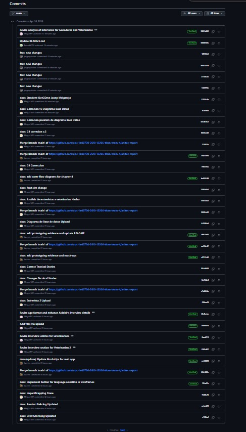
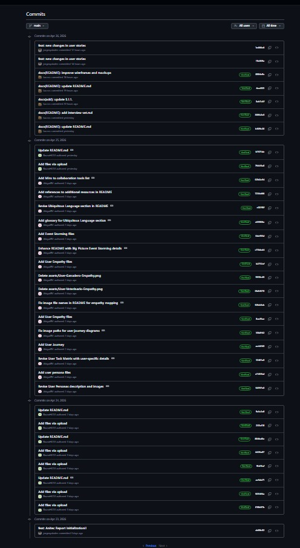
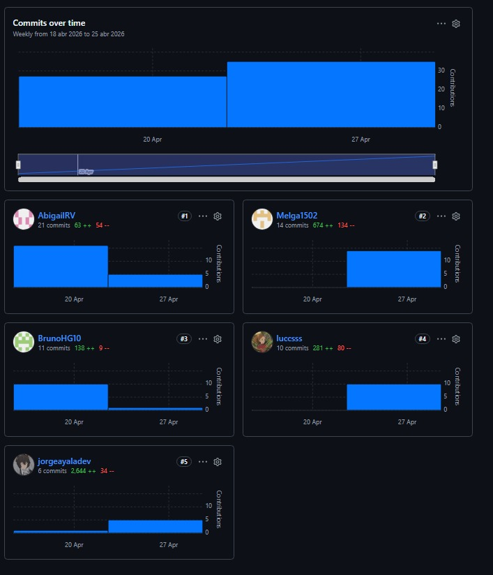

# 5.2. Landing Page, Services & Applications Implementation.

## 5.2.1. Sprint 1.

### 5.2.1.1. Sprint Planning 1.

En esta sección se especifica los aspectos principales del Sprint Planning Meeting. AniTec inicia su primer Sprint con el objetivo de establecer la presencia digital de la empresa mediante una Landing Page funcional que presente la propuesta de valor y facilite el registro de usuarios potenciales. Este Sprint representa la primera iteración del equipo AniTec, donde se busca crear una primera impresión sólida ante potenciales usuarios que visitarán la plataforma por primera vez.

La Landing Page cumple un rol fundamental en la estrategia de captación de usuarios, siendo el punto de entrada principal para personas que desconocen AniTec pero buscan soluciones tecnológicas para la gestión ganadera. Por esta razón, el equipo priorizó este componente como el primero a desarrollar, reconociendo que una presencia digital profesional y atractiva es esencial para generar confianza y credibilidad desde el primer momento.

<table align="center" border="1" cellpadding="8" cellspacing="0" style="border-collapse: collapse; width: 100%; font-family: Arial, sans-serif;">
    <tbody>
        <tr>
            <td><b>Sprint #</b></td>
            <td>Sprint 1</td>
        </tr>
        <tr>
            <td colspan="2"><b>Sprint Planning Background</b></td>
        </tr>
        <tr>
            <td>Date</td>
            <td>2026-04-17</td>
        </tr>
        <tr>
            <td>Time</td>
            <td>10:00 AM</td>
        </tr>
        <tr>
            <td>Location</td>
            <td>Reunión virtual via Discord - Canal #sprint-planning</td>
        </tr>
        <tr>
            <td>Prepared by</td>
            <td>Ayala Fernandez, Jorge Brayan</td>
        </tr>
        <tr>
            <td>Attendees (to planning meeting)</td>
            <td>Ayala Fernandez, Jorge Brayan / Huaman Gallardo, Bruno Aldair / Melgarejo Quiroz, Josep Eliu / Raymundo Villarroel, Nadhim Abigail / Sanchez Silva, Luciana Celeste</td>
        </tr>
        <tr>
            <td>Sprint n - 1 Review Summary</td>
            <td>No aplica - Este es el primer Sprint del proyecto. Se establecieron las bases del Product Backlog, se definieron los User Stories priorizados, y se creó la estructura inicial de repositorios en GitHub Organization.</td>
        </tr>
        <tr>
            <td>Sprint n - 1 Retrospective Summary</td>
            <td>No aplica - Este es el primer Sprint del proyecto. El equipo se conformó recientemente y se espera mejorar la coordinación en sprints posteriores.</td>
        </tr>
        <tr>
            <td colspan="2"><b>Sprint Goal / User Stories</b></td>
        </tr>
        <tr>
            <td>Sprint 1 Goal</td>
            <td>Implementar una Landing Page funcional que presente la propuesta de valor de AniTec, muestre las características principales del servicio para ranchers y veterinarians, y proporcione enlaces de llamada a la acción para registro de usuarios potenciales.</td>
        </tr>
        <tr>
            <td>Sprint 1 Velocity</td>
            <td>El equipo estimó un velocity inicial de 34 Story Points, enfocados en el desarrollo de la Landing Page multipágina (index, about us, ranchers, veterinarians).</td>
        </tr>
        <tr>
            <td>Sprint of Story Points</td>
            <td>Total: 34 SP - Distribuidos en 8 SP para estructura HTML base, 8 SP para secciones de contenido, 8 SP para estilos CSS y diseño responsive, y 10 SP para funcionalidades JavaScript y sliders.</td>
        </tr>
    </tbody>
</table>

El Sprint Planning Meeting del 17 de abril de 2026 duró aproximadamente 2 horas. El equipo discutió en detalle los User Stories a implementar, estimó las responsabilidades iniciales, y estableció los primeros stories de colaboración. Durante la reunión, cada miembro del equipo tuvo la oportunidad de expresar sus dudas respecto a las tareas asignadas y se resolvieron interrogantes técnicas relacionadas con las tecnologías a utilizar.

La dinámica del Sprint Planning permitió al equipo alinear expectativas y establecer un compromiso colectivo hacia el logro del Sprint Goal. Se destinó tiempo suficiente para revisar las guidelines de código establecidas en el proyecto, asegurando que todos los miembros comprendieran las convenciones de nomenclatura, estructura de archivos y flujo de trabajo con Git.

**User Stories incluidos en el Sprint 1:**

Los User Stories seleccionados para este Sprint inicial reflejan las necesidades más críticas para establecer la presencia digital de AniTec. El equipo se enfocó en la Landing Page multipágina para este primer Sprint, reconociendo la importancia de dirigirse a los dos segmentos objetivo (ranchers y veterinarians) con páginas especializadas.

| ID   | User Story                                        | Prioridad   | Story Points |
| ---- | ------------------------------------------------- | ----------- | ------------ |
| US25 | Landing: Exploración de Contenido y Navegación    | Must Have   | 8            |
| US26 | Landing: Conversión y Llamados a la Acción (CTAs) | Must Have   | 8            |
| US27 | Index: Visualización de Propuesta de Valor        | Must Have   | 5            |
| US28 | Index: Exploración de Segmentos                   | Must Have   | 5            |
| US32 | Nosotros: Información del Equipo                  | Must Have   | 4            |
| US38 | Ganaderos: Exploración de Contenido Específico    | Should Have | 4            |

La selección de estos User Stories para el Sprint 1 responde a la necesidad de establecer la presencia digital de AniTec rápidamente, permitiendo que usuarios potenciales conozcan la propuesta de valor para los dos segmentos target. El equipo identificó que US25 y US26 son los más críticos, representando el objetivo principal del Sprint, mientras que las páginas específicas (US38) aportan valor para alcanzar a los segments especializados.

**Distribución de Trabajo por Componente:**

- **Landing Page:** 34 Story Points - Enfocados en las 4 páginas (index, about us, ranchers, veterinarians), incluyendo estructura HTML, estilos CSS, funcionalidades JavaScript, y contenido optimizado para SEO.

La distribución de Story Points fue diseñada para que cada miembro del equipo tuviera una carga de trabajo equilibrada. Se priorizaron las tareas de implementación técnica (estructura HTML y estilos) sobre las tareas de configuración, reconociendo que la visibilidad del progreso es fundamental para mantener la motivación del equipo durante las primeras etapas del proyecto.

### 5.2.1.2. Aspects Leaders and Collaborators.

En esta sección el equipo elabora el artefacto Leadership-and-Collaboration Matrix (LACX), que indica por cada aspecto dentro del alcance del Sprint, quién es el líder y quién o quiénes son colaboradores en dicho aspecto, con el fin de brindando mayor claridad y efectividad en la comunicación al interior del equipo.

La sección incluye una introducción donde se explica cuáles son los principales aspectos que se toma en cuenta en el Sprint 1. Para este primer Sprint, los aspectos están centrados exclusivamente en el desarrollo de la Landing Page multipágina, reconociendo la importancia de establecer roles claros desde el inicio del proyecto para evitar conflictos y facilitar la toma de decisiones durante la implementación.

El equipo AniTec está conformado por 5 miembros con diferentes fortalezas técnicas y experiencia en distintas áreas del desarrollo de software. Durante la reunión de Sprint Planning, se identificaron las competencias de cada miembro y se asignaron los roles de líder (L) y colaborador (C) para cada aspecto del Sprint, priorizando el desarrollo profesional de cada integrante mientras se optimiza la productividad del equipo.

**Aspectos del Sprint 1:**

1. **Landing Page - UI/UX:** Diseño y estructura visual de las páginas principales, incluyendo wireframes, mockups, paleta de colores, tipografía y componentes visuales.
2. **Landing Page - Desarrollo HTML/CSS:** Implementación técnica de las páginas landing, incluyendo código HTML semántico, estilos CSS, y diseño responsive.
3. **Landing Page - Funcionalidades JavaScript:** Implementación de sliders automáticos, interacciones de navegación, y efectos visuales.
4. **Documentación:** Documentación técnica del Sprint, incluyendo este archivo y demás artefactos Scrum requeridos.

La distribución de roles fue diseñada para fomentar la colaboración entre los miembros del equipo, evitando situaciones donde un solo miembro sea responsable de un componente crítico. En caso de que un líder no esté disponible, los colaboradores están preparados para asumir responsabilidad parcial del aspecto correspondiente.

<table align="center" border="1" cellpadding="8" cellspacing="0" style="border-collapse: collapse; width: 100%; font-family: Arial, sans-serif;">
    <tbody>
        <tr>
            <td><b>Team Member (Last Name, First Name)</b></td>
            <td><b>GitHub Username</b></td>
            <td><b>Landing UI/UX / L or C</b></td>
            <td><b>Landing Dev HTML/CSS / L or C</b></td>
            <td><b>Landing JS / L or C</b></td>
            <td><b>Documentation / L or C</b></td>
        </tr>
        <tr>
            <td>Ayala Fernandez, Jorge Brayan</td>
            <td>jorgeayaladev</td>
            <td>L</td>
            <td>C</td>
            <td>L</td>
            <td>C</td>
        </tr>
        <tr>
            <td>Huaman Gallardo, Bruno Aldair</td>
            <td>BrunoHG10</td>
            <td>C</td>
            <td>L</td>
            <td>C</td>
            <td>-</td>
        </tr>
        <tr>
            <td>Melgarejo Quiroz, Josep Eliu</td>
            <td>Melga1502</td>
            <td>C</td>
            <td>C</td>
            <td>C</td>
            <td>L</td>
        </tr>
        <tr>
            <td>Raymundo Villarroel, Nadhim Abigail</td>
            <td>AbigailRV</td>
            <td>C</td>
            <td>C</td>
            <td>C</td>
            <td>C</td>
        </tr>
        <tr>
            <td>Sanchez Silva, Luciana Celeste</td>
            <td>Luccsss</td>
            <td>C</td>
            <td>C</td>
            <td>C</td>
            <td>C</td>
        </tr>
    </tbody>
</table>

La organización de líderes y colaboradores tiene relación directa con las fortalezas técnicas de cada miembro del equipo identificadas durante la conformación del equipo. Esta distribución permite que cada uno trabaje en áreas donde puede aportar mayor valor, mientras tiene la oportunidad de aprender de los líderes en otras áreas.

**Distribución detallada de responsabilidades:**

- **Ayala Fernandez, Jorge Brayan (UI/UX & JavaScript Lead):** Responsable del diseño visual de la Landing Page y las funcionalidades JavaScript, incluyendo la creación de mockups, definición de la paleta de colores basada en la identidad de marca de AniTec, y desarrollo de sliders automáticos. Coordina con el equipo de desarrollo para asegurar que la implementación respete el diseño propuesto.

- **Huaman Gallardo, Bruno Aldair (Development Lead):** Responsable de la implementación técnica HTML/CSS de las páginas landing, incluyendo la estructura HTML semántica, estilos CSS con metodología BEM, y diseño responsivo. Coordina con el líder de UI/UX para resolver dudas sobre el diseño y garantizar su correcta implementación.

- **Melgarejo Quiroz, Josep Eliu (Documentation Lead):** Responsable de la documentación del Sprint, incluyendo la elaboración de este archivo y demás artefactos Scrum. Coordina con los demás miembros para recopilar información sobre el avance del Sprint y asegurar la completitud de la documentación.

### 5.2.1.3. Sprint Backlog 1.

El Sprint Backlog 1 inicia con una introducción que resume el objetivo principal del Sprint: establecer la presencia digital de AniTec mediante una Landing Page multipágina funcional para los segmentos de ranchers y veterinarians. Este documento representa el compromiso del equipo para completar las tareas identificadas durante el Sprint Planning y representa la base para el seguimiento del progreso durante la iteración.

El Sprint Backlog fue elaborado de manera colaborativa, donde cada miembro del equipo tuvo la oportunidad de sugerir tareas adicionales o modificar la estimación de horas para tareas existentes. Se utilizó la técnica de Planning Poker para estimar la complejidad de cada tarea, considerando factores como el tiempo requerido, la complejidad técnica, y las dependencias con otras tareas.

**Trello Board:**
El equipo utiliza un Trello Board para gestionar visualmente el Sprint Backlog. El Board contiene las listas estándar de Scrum: "Sprint Goal", "To Do", "In Progress", "To Review" y "Done". El uso de Trello permite una visualización clara del estado de cada tarea y facilita la identificación de cuellos de botella en el flujo de trabajo.

**Estructura del Trello Board:**

- **Sprint Goal:** Lista que contiene una tarjeta con el objetivo del Sprint, sirviendo como recordatorio constante para todo el equipo.
- **To Do:** Lista con las tareas pendientes por iniciar, ordenadas por prioridad y dependencias.
- **In Progress:** Lista con las tareas que están siendo implementadas actualmente.
- **To Review:** Lista con las tareas completadas pendientes de revisión por otro miembro del equipo.
- **Done:** Lista con las tareas aprobadas y listas para deployment.

A continuación, la tabla de control de estado para el Sprint 1:

<table align="center" border="1" cellpadding="8" cellspacing="0" style="border-collapse: collapse; width: 100%; font-family: Arial, sans-serif;">
    <tbody>
        <tr>
            <td><b>Sprint #</b></td>
            <td colspan="7">Sprint 1</td>
        </tr>
        <tr>
            <td colspan="2">User Story</td>
            <td colspan="6">Work-Item / Task</td>
        </tr>
        <tr>
            <td>Id</td>
            <td>Title</td>
            <td>Id</td>
            <td>Title</td>
            <td>Description</td>
            <td>Estimation (Hours)</td>
            <td>Assigned to</td>
            <td>Status</td>
        </tr>
        <tr>
            <td>US25</td>
            <td>Landing: Exploración de Contenido y Navegación</td>
            <td>T001</td>
            <td>Crear estructura HTML base</td>
            <td>Crear estructura base del documento HTML con DOCTYPE, meta tags, y vinculación de archivos CSS/JS</td>
            <td>2</td>
            <td>Ayala Fernandez, Jorge Brayan</td>
            <td>Done</td>
        </tr>
        <tr>
            <td>US25</td>
            <td>Landing: Exploración de Contenido y Navegación</td>
            <td>T002</td>
            <td>Implementar navegación principal</td>
            <td>Crear menú de navegación con enlaces a todas las páginas y funcionalidad smooth scroll</td>
            <td>3</td>
            <td>Huaman Gallardo, Bruno Aldair</td>
            <td>Done</td>
        </tr>
        <tr>
            <td>US26</td>
            <td>Landing: CTAs y Conversión</td>
            <td>T003</td>
            <td>Implementar botones CTA</td>
            <td>Crear botones de llamado a la acción con enlaces a pricing y registro</td>
            <td>2</td>
            <td>Ayala Fernandez, Jorge Brayan</td>
            <td>Done</td>
        </tr>
        <tr>
            <td>US27</td>
            <td>Index: Propuesta de Valor</td>
            <td>T004</td>
            <td>Implementar Hero Section</td>
            <td>Crear sección hero con headline, métricas y buttons para index.html</td>
            <td>4</td>
            <td>Ayala Fernandez, Jorge Brayan</td>
            <td>Done</td>
        </tr>
        <tr>
            <td>US28</td>
            <td>Index: Exploración de Segmentos</td>
            <td>T005</td>
            <td>Implementar sección segmentos</td>
            <td>Crear sección que muestre los two segmentos objetivo (ranchers y veterinarians)</td>
            <td>3</td>
            <td>Raymundo Villarroel, Nadhim Abigail</td>
            <td>Done</td>
        </tr>
        <tr>
            <td>US32</td>
            <td>Nosotros: Información del Equipo</td>
            <td>T006</td>
            <td>Implementar página About Us</td>
            <td>Crear página nosotros.html con información del equipo y proceso</td>
            <td>4</td>
            <td>Melgarejo Quiroz, Josep Eliu</td>
            <td>Done</td>
        </tr>
        <tr>
            <td>US38</td>
            <td>Ganaderos: Contenido Específico</td>
            <td>T007</td>
            <td>Implementar página Ranchers</td>
            <td>Crear página ganaderos.html con módulos, testimonios y comparación</td>
            <td>5</td>
            <td>Huaman Gallardo, Bruno Aldair</td>
            <td>Done</td>
        </tr>
        <tr>
            <td>US44</td>
            <td>Veterinarios: Contenido Específico</td>
            <td>T008</td>
            <td>Implementar página Veterinarians</td>
            <td>Crear página veterinarios.html con funcionalidades, casos de uso y testimonios</td>
            <td>5</td>
            <td>Sanchez Silva, Luciana Celeste</td>
            <td>Done</td>
        </tr>
    </tbody>
</table>

El Sprint Backlog refleja 8 tareas que totalizando las horas estimadas representan aproximadamente 34 horas de trabajo del equipo, equivalente a los 34 Story Points calculados para el Sprint 1. Cada tarea fue estimada considerando la complejidad técnica, el tiempo requerido para investigación en caso de desconocimiento, y los posibles imprevistos que pudieran surgir durante la implementación.

El equipo se compromete a completar todas las tareas del Sprint Backlog antes de la fecha de Sprint Review programada para el final de la iteración. Se realizará seguimiento diario del progreso mediante las daily standups y se tomarán acciones correctivas en caso de identificar desviaciones significativas del plan.

### 5.2.1.4. Development Evidence for Sprint Review.

En esta sección se explica y presenta los avances en implementación con relación a los productos de la solución según el alcance del Sprint 1: Landing Page Multipágina. La sección resume los principales avances logrados durante este Sprint inicial y sirve como evidencia de que el equipo cumplió con el objetivo planificado.

Durante el Sprint 1, el equipo AniTec logró completar la configuración de la Landing Page multipágina. Se obtuvo un sitio web completamente funcional con las siguientes páginas y secciones: Index (página principal), About Us (nosotros), Ranchers (para ganaderos), y Veterinarians (para veterinarios). El desarrollo siguió las mejores prácticas de desarrollo web, incluyendo código semántico, accesibilidad, y optimización para motores de búsqueda (SEO).

**Resumen de Avances Implementados:**

La Landing Page implementada durante el Sprint 1 cuenta con las siguientes características técnicas y funcionales:

- **Estructura HTML semántica:** Utilización de etiquetas HTML5 apropiadas (header, nav, main, section, article, footer) para garantizar accesibilidad y mejor posicionamiento en motores de búsqueda.
- **Hojas de estilo CSS:** Implementación de estilos utilizando metodología BEM (Block Element Modifier) para mantener un código CSS organizado y reutilizable. Soporte para diseño responsivo en tablets y móviles.
- **Diseño responsivo:** Implementación de breakpoints en 1024px (tablet) y 640px (móvil) utilizando CSS Grid y Flexbox para asegurar una experiencia consistente en todos los dispositivos.
- **JavaScript funcional:** Scripts para sliders automáticos de testimonios, navegación sticky, y efectos visuales.
- **Optimización SEO:** Meta tags, Open Graph, Twitter Cards, y estructura semántica para mejorar el posicionamiento en motores de búsqueda.
- **Accesibilidad web:** Cumplimiento de estándares WCAG 2.1 nivel AA, incluyendo contraste de colores adecuado, navegación por teclado funcional, y etiquetas ARIA donde fue necesario.

**Commits Realizados:**

  

    <b>Coomits</b>
  

  

  

    <b>Coomits</b>
  

  

El equipo realizó un total de 8 commits en el repositorio de Landing Page durante el Sprint 1. Cada commit sigue la convención de Conventional Commits establecida en la configuración del proyecto, facilitando la generación automática de changelogs y la trazabilidad de cambios. Los commits fueron realizados de forma regular, evitando commits muy grandes que dificulten la revisión de código y el rollback en caso de problemas.

**Repositorio de Landing Page:**

https://github.com/upc-1asi0730-2610-12206-titan-team-4/anitec-landing-page

**Estadísticas del repositorio:**

- Total de ramas: 2 (main, develop)
- Total de commits: 8
- Total de contribuciones: 5 miembros del equipo

### 5.2.1.5. Execution Evidence for Sprint Review.

Esta sección resume lo alcanzado en el Sprint 1 y presenta las capturas de pantalla de las principales vistas implementadas, junto con enlaces que ilustran la visualización y navegación logradas durante este Sprint inicial. Las evidencias presentadas demuestran que el equipo cumplió satisfactoriamente con el Sprint Goal establecido durante el Planning.

**Resumen de lo Alcanzado:**

El Sprint 1 permitió establecer la presencia digital de AniTec. El equipo logró completar la configuración del repositorio, establecer las convenciones de código, e implementar las funcionalidades de la Landing Page multipágina. Los resultados superan las expectativas iniciales, logrando una Landing Page funcional, visualmente atractiva y técnicamente sólida.

**Capturas de Pantalla - Landing Pages:**

Las Landing Pages implementadas incluyen las siguientes secciones principales:

1. **Index - Hero Section:** Con el headline "Gestiona tu Ganado con Tecnología Innovadora", badge "+500 Ranchers and 120 Veterinarians trust us", y buttons "Try Free" y "Learn More". La sección hero utiliza una imagen de fondo relacionada con gestión ganadera y cuenta con animaciones de entrada.

2. **Index - Segmentos:** Sección "Designed for Ranchers and Veterinarians" con dos tarjetas que muestran los dos segmentos objetivo con imágenes representativas y botones de navegación.

3. **Index - Métricas:** Sección "Results That Speak" con indicadores clave: 85% Menos Información Perdida, 2h Ahorro de Tiempo Diario, 30% Más Productividad, 100% Trazabilidad Completa.

4. **Index - Pricing:** Sección "Elige el plan ideal para ti" con tres planes: Basic ($0/mes), Professional ($19/mes), y Enterprise ($49/mes).

5. **About Us - Equipo:** Sección "Our Team" con información de los 5 miembros del equipo Titan, misión y visión de la startup.

6. **Ranchers - Página Específica:** Con hero "Digitize Your Livestock Today", módulos de gestión (Gestión de Animales, Control Sanitario, Reproducción, Gestión Económica), testimonios de ranchers, y comparación Traditional vs AniTec.

7. **Veterinarians - Página Específica:** Con hero "Optimize Your Veterinary Practice" y badge "Herramienta Profesional #1", funcionalidades clave, casos de uso, y testimonios de veterinarians.

**Funcionalidades adicionales implementadas:**

- **Navegación sticky:** La barra de navegación permanece fija al hacer scroll, mejorando la accesibilidad a los enlaces principales.
- **Sliders automáticos:** Testimonios con auto-slide cada 4 segundos para ranchers y veterinarians.
- **Diseño responsivo:** Breakpoints en 1024px y 640px para tablets y móviles.
- **Efectos hover:** Transiciones suaves en botones, cards, e imágenes.
- **CTA con imágenes:** Secciones CTA con imágenes rancher-2.png y veterinarian-2.png.

### 5.2.1.6. Services Documentation Evidence for Sprint Review.

Esta documentación estuvo orientada principalmente en la parte del Landing Page por lo que no se pudo enfocar en ningún motivo al backend en la creación del servicio. En los proximos sprints se tocará aquel tema y se podrá profundizar en ello adecuadamente.

### 5.2.1.7. Software Deployment Evidence for Sprint Review.

La landing page de AniTec fue desplegada exitosamente en **GitHub Pages**, la plataforma de hosting gratuita proporcionada por GitHub que permite publicar proyectos estáticos directamente desde un repositorio. El despliegue se realizó configurando el branch `main` como fuente de contenido estático en la configuración de GitHub Pages del repositorio `anitec-landing-page`.

**Configuración del Deploy:**

- **Plataforma:** GitHub Pages
- **Repositorio:** anitex-landing-page
- **Branch desplegado:** main
- **URL de acceso:** https://upc-1asi0730-2610-12206-titan-team-4.github.io/anitec-landing-page/
- **Ruta de archivos desplegados:** /index.html, /nosotros.html, /ganaderos.html, /veterinarios.html, /styles.css, /script.js, /assets/

El proceso de deployment se configura desde la sección "Pages" en la configuración del repositorio de GitHub, seleccionando el branch `main` y la carpeta `/ (root)` como fuente. GitHub Pages construye automáticamente el sitio web estático y lo hace accesible públicamente a través de la URL segura HTTPS.

**Verificación Post-Deploy:**

Después del despliegue, se verificó que todas las páginas estuvieran accesibles correctamente:

- La página principal (index.html) carga sin errores y muestra el pricing y CTA correctamente
- Las páginas secundarias (nosotros.html, ganaderos.html, veterinarios.html) son navegables desde el menú de navegación
- Los recursos estáticos (CSS, JavaScript, imágenes) se cargan correctamente
- El slider de testimonios funciona de manera automática con JavaScript
- El diseño responsive se adapta a diferentes tamaños de pantalla

El sitio desplegado está disponible públicamente para usuarios externos y puede ser compartido mediante la URL de GitHub Pages para revisiones del Sprint.

### 5.2.1.8. Team Collaboration Insights during Sprint.

En esta sección el equipo explica cómo se han desarrollado las actividades de implementación y se presenta los analíticos de colaboración y commits en GitHub, realizados por los miembros del equipo. Esta información permite evaluar la efectividad del equipo y identificar oportunidades de mejora para sprints futuros.

**Distribución de Trabajo:**

Todos los miembros del equipo participaron en la implementación de la Landing Page según sus fortalezas y responsabilidades asignadas en el LACX (Leadership and Collaboration Matrix). La distribución fue equitativa, con cada miembro contribuyendo al menos 1 commit durante el Sprint, demostrando el compromiso colectivo con el objetivo del Sprint.

El equipo adoptó un enfoque de trabajo colaborativo, donde los miembros se reunían diariamente mediante standups virtuales para compartir avances, resolver dudas técnicas, y ajustar prioridades según sea necesario. Las comunicaciones asincrónicas se realizaban principalmente a través del canal de Discord, donde se compartían enlaces a código, capturas de pantalla, y preguntas técnicas.

**Métricas de Colaboración:**

  

    <b>Coomits graficas</b>
  

  

**Reflexiones del Equipo:**

- Ayala Fernandez, Jorge Brayan: "El Sprint 1 estableció las bases de nuestra presencia digital. La coordinación con el equipo de diseño fue clave para lograr Landing Pages profesionales para ambos segmentos. Aprendí la importancia de mantener una comunicación fluida para evitar retrabajo."

- Huaman Gallardo, Bruno Aldair: "Aporté en el desarrollo HTML/CSS de las páginas. La implementación de Diseño Responsivo fue fundamental para garantizar una experiencia consistente en todos los dispositivos. Contribuí en resolver problemas de compatibilidad con diferentes navegadores."

- Melgarejo Quiroz, Josep Eliu: "La documentación del Sprint fue un desafío interesante. Aprendí a sintetizar la información técnica de manera clara y concisa. También participé en el desarrollo de la página About Us."

- Raymundo Villarroel, Nadhim Abigail: "Participé en la implementación de la página de Ranchers, específicamente en las secciones de módulos y comparación. Esta experiencia me permitió aplicar mis habilidades de desarrollo web mientras aprendía sobre el dominio ganadero."

- Sanchez Silva, Luciana Celeste: "Contribuí en la implementación de la página de Veterinarians. Trabajar con sliders automáticos y efectos visuales fue desafiante pero gratificante. El trabajo en equipo fue fundamental para completar todas las tareas."

**Lección Aprendida:**

El equipo identifica las siguientes lecciones de este Sprint 1:

1. **La configuración inicial del entorno de desarrollo toma tiempo significativo al inicio del proyecto:** Es importante considerar este tiempo en las estimaciones de futuros sprints, especialmente cuando se trabaja con tecnologías nuevas para algunos miembros del equipo.

2. **Es importante mantener comunicación frecuente entre equipos de diseño y desarrollo:** La participación activa del líder de diseño en las revisiones de código ayudó a identificar desviaciones del diseño de manera temprana, evitando retrabajo significativo.

3. **Las daily standups cortas fueron efectivas para mantener el progreso:** Reuniones de 15 minutos máximo permiten compartir información relevante sin afectar el tiempo de implementación.

4. **Los code reviews incrementan la calidad del código:** La revisión por pares antes de hacer merge permitió identificar y corregir errores de estilo y lógica, mejorando la consistencia del código base.

5. **Las estimaciones iniciales fueron acertadas pero con margen de mejora:** El equipo logró completar todas las tareas dentro del tiempo estimado, aunque algunas tareas requirieron ajuste de prioridades para cumplir con el Sprint Goal.
