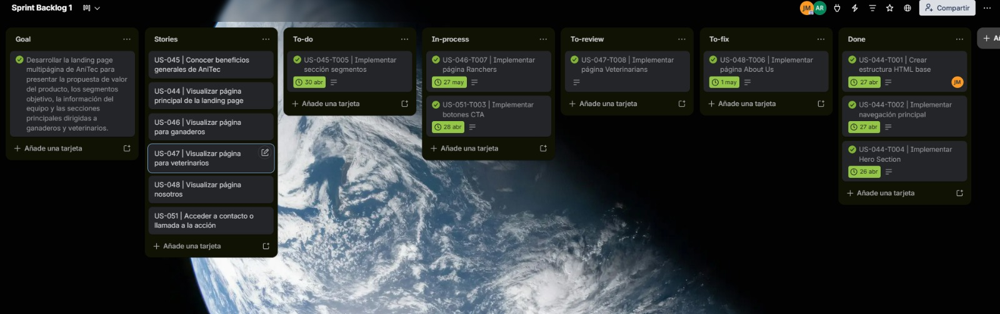
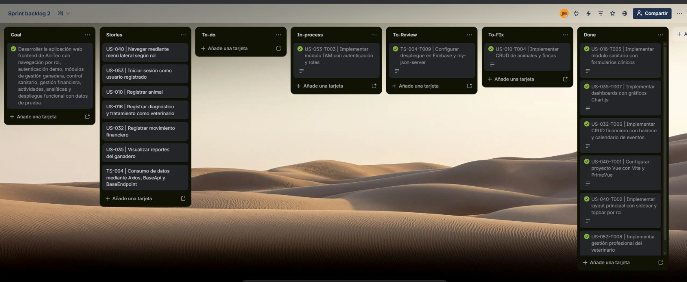
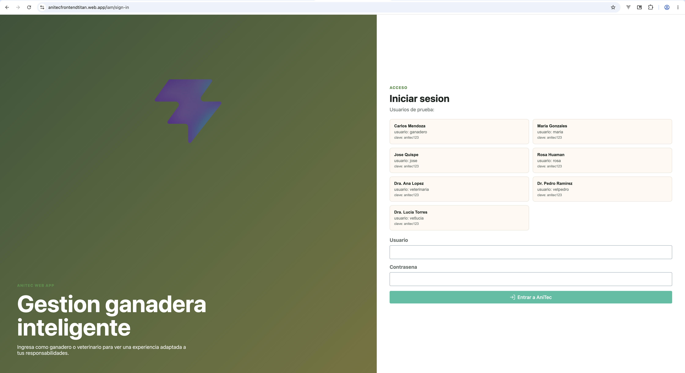
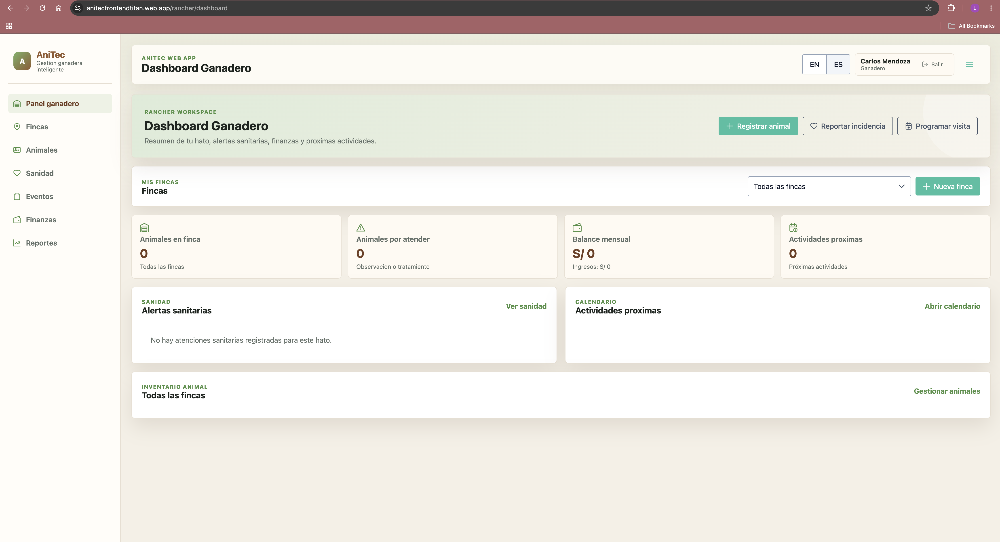
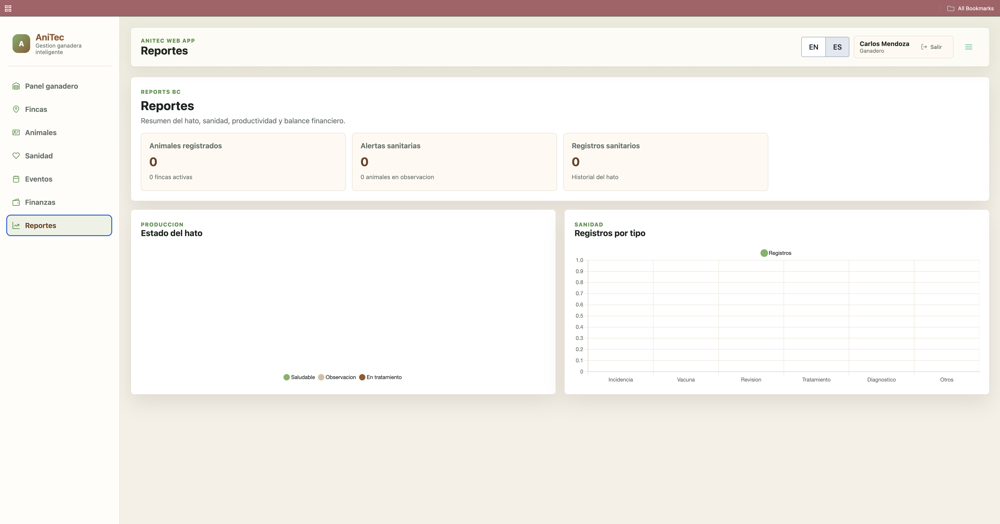
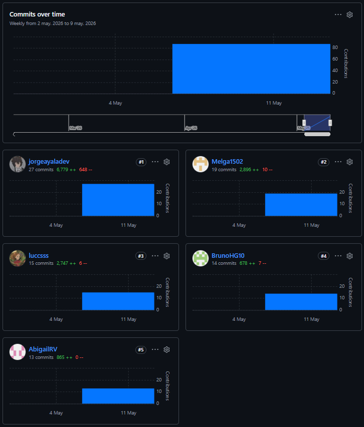

# 5.2. Landing Page, Services & Applications Implementation.

## 5.2.1. Sprint 1.

En el Sprint 1, el equipo de AniTec se enfocó en la construcción de la Landing Page como primer entregable del producto digital, con el objetivo de establecer la presencia inicial del sistema y validar la propuesta de valor frente a los usuarios objetivo (ganaderos y veterinarios).

Durante este Sprint se desarrolló la estructura base de la Landing Page, incluyendo la organización de las secciones principales, la navegación entre páginas, la presentación de la propuesta de valor y los llamados a la acción orientados a la captación de usuarios.

### 5.2.1.1. Sprint Planning 1.

El Sprint Planning del Sprint 1 tuvo como objetivo definir el alcance inicial del proyecto, priorizando la creación de la Landing Page como primer punto de contacto con los usuarios finales.

Se estableció que este componente es crítico dentro de la estrategia del producto, ya que representa la primera interacción de los usuarios con AniTec y permite comunicar de manera clara la propuesta de valor del sistema. Por ello, el equipo priorizó la implementación de una experiencia visual clara, estructurada y orientada a la conversión de usuarios.

Durante la planificación se definieron las historias de usuario del Sprint, se estimaron los Story Points y se distribuyeron las responsabilidades entre los integrantes del equipo, considerando sus fortalezas técnicas y promoviendo el trabajo colaborativo mediante el uso de GitHub y un tablero de gestión de tareas.

<table align="center" border="1" cellpadding="8" cellspacing="0" style="border-collapse: collapse; width: 100%; font-family: Arial, sans-serif;">
    <tbody>
        <tr>
            <td><b>Sprint #</b></td>
            <td>Sprint 1</td>
        </tr>
        <tr>
            <td colspan="2"><b>Sprint Planning Background</b></td>
        </tr>
        <tr>
            <td>Date</td>
            <td>2026-04-17</td>
        </tr>
        <tr>
            <td>Time</td>
            <td>10:00 AM</td>
        </tr>
        <tr>
            <td>Location</td>
            <td>Reunión virtual via Discord - Canal #sprint-planning</td>
        </tr>
        <tr>
            <td>Prepared by</td>
            <td>Ayala Fernandez, Jorge Brayan</td>
        </tr>
        <tr>
            <td>Attendees (to planning meeting)</td>
            <td>Jorge Ayala, Bruno Huaman, Josep Melgarejo, Nadhim Raymundo, Luciana Sanchez</td>
        </tr>
        <tr>
            <td>Sprint n - 1 Review Summary</td>
            <td>No aplica - Este es el primer Sprint del proyecto. Se establecieron las bases del Product Backlog, se definieron los User Stories priorizados, y se creó la estructura inicial de repositorios en GitHub Organization.</td>
        </tr>
        <tr>
            <td>Sprint n - 1 Retrospective Summary</td>
            <td>No aplica - Este es el primer Sprint del proyecto. El equipo se conformó recientemente y se espera mejorar la coordinación en sprints posteriores.</td>
        </tr>
        <tr>
            <td colspan="2"><b>Sprint Goal / User Stories</b></td>
        </tr>
        <tr>
            <td>Sprint 1 Goal</td>
            <td>Nuestro enfoque está en establecer la presencia digital de AniTec mediante una Landing Page funcional orientada a ganaderos y veterinarios. Creemos que esto aporta claridad sobre la propuesta de valor del producto y genera interés inicial en los usuarios objetivo. Esto se confirmará cuando los usuarios puedan navegar la Landing Page y comprender los principales beneficios de la plataforma.</td>
        </tr>
        <tr>
            <td>Sprint 1 Velocity</td>
            <td>El equipo estimó un velocity inicial de 34 Story Points, enfocados en el desarrollo de la Landing Page multipágina (index, about us, ranchers, veterinarians).</td>
        </tr>
        <tr>
            <td>Sprint of Story Points</td>
            <td>Total: 34 SP - Distribuidos en 8 SP para estructura HTML base, 8 SP para secciones de contenido, 8 SP para estilos CSS y diseño responsive, y 10 SP para funcionalidades JavaScript y sliders.</td>
        </tr>
    </tbody>
</table>

El Sprint Planning Meeting del 17 de abril de 2026 duró aproximadamente 2 horas. El equipo discutió en detalle los User Stories a implementar, estimó las responsabilidades iniciales, y estableció los primeros stories de colaboración. Durante la reunión, cada miembro del equipo tuvo la oportunidad de expresar sus dudas respecto a las tareas asignadas y se resolvieron interrogantes técnicas relacionadas con las tecnologías a utilizar.

La dinámica del Sprint Planning permitió al equipo alinear expectativas y establecer un compromiso colectivo hacia el logro del Sprint Goal. Se destinó tiempo suficiente para revisar las guidelines de código establecidas en el proyecto, asegurando que todos los miembros comprendieran las convenciones de nomenclatura, estructura de archivos y flujo de trabajo con Git.

**User Stories incluidos en el Sprint 1:**

Los User Stories seleccionados para este Sprint inicial reflejan las necesidades más críticas para establecer la presencia digital de AniTec. El equipo se enfocó en la Landing Page multipágina para este primer Sprint, reconociendo la importancia de dirigirse a los dos segmentos objetivo (ranchers y veterinarians) con páginas especializadas.

| ID     | User Story                                     | Prioridad   | Story Points |
| ------ | ---------------------------------------------- | ----------- | ------------ |
| US-044 | Visualizar página principal de la landing page | Must Have   | 8            |
| US-045 | Conocer beneficios generales de AniTec         | Must Have   | 5            |
| US-051 | Acceder a contacto o llamada a la acción       | Must Have   | 5            |
| US-048 | Visualizar página nosotros                     | Must Have   | 4            |
| US-046 | Visualizar página para ganaderos               | Should Have | 4            |
| US-047 | Visualizar página para veterinarios            | Should Have | 4            |

La selección de estos User Stories para el Sprint 1 responde a la necesidad de establecer la presencia digital de AniTec rápidamente, permitiendo que usuarios potenciales conozcan la propuesta de valor para los dos segmentos target. El equipo identificó que US-044 y US-051 son las más críticas, representando el objetivo principal del Sprint, mientras que las páginas específicas (US-046 y US-047) aportan valor para alcanzar a los segmentos especializados.

**Distribución de Trabajo por Componente:**

- **Landing Page:** 34 Story Points - Enfocados en las 4 páginas (index, about us, ranchers, veterinarians), incluyendo estructura HTML, estilos CSS, funcionalidades JavaScript, y contenido optimizado para SEO.

La distribución de Story Points fue diseñada para que cada miembro del equipo tuviera una carga de trabajo equilibrada. Se priorizaron las tareas de implementación técnica (estructura HTML y estilos) sobre las tareas de configuración, reconociendo que la visibilidad del progreso es fundamental para mantener la motivación del equipo durante las primeras etapas del proyecto.

### 5.2.1.2. Aspects Leaders and Collaborators.

En esta sección el equipo elabora el artefacto Leadership-and-Collaboration Matrix (LACX), que indica por cada aspecto dentro del alcance del Sprint, quién es el líder y quién o quiénes son colaboradores en dicho aspecto, con el fin de brindando mayor claridad y efectividad en la comunicación al interior del equipo.

La sección incluye una introducción donde se explica cuáles son los principales aspectos que se toma en cuenta en el Sprint 1. Para este primer Sprint, los aspectos están centrados exclusivamente en el desarrollo de la Landing Page multipágina, reconociendo la importancia de establecer roles claros desde el inicio del proyecto para evitar conflictos y facilitar la toma de decisiones durante la implementación.

El equipo AniTec está conformado por 5 miembros con diferentes fortalezas técnicas y experiencia en distintas áreas del desarrollo de software. Durante la reunión de Sprint Planning, se identificaron las competencias de cada miembro y se asignaron los roles de líder (L) y colaborador (C) para cada aspecto del Sprint, priorizando el desarrollo profesional de cada integrante mientras se optimiza la productividad del equipo.

**Aspectos del Sprint 1:**

1. **Landing Page - UI/UX:** Diseño y estructura visual de las páginas principales, incluyendo wireframes, mockups, paleta de colores, tipografía y componentes visuales.
2. **Landing Page - Desarrollo HTML/CSS:** Implementación técnica de las páginas landing, incluyendo código HTML semántico, estilos CSS, y diseño responsive.
3. **Landing Page - Funcionalidades JavaScript:** Implementación de sliders automáticos, interacciones de navegación, y efectos visuales.
4. **Documentación:** Documentación técnica del Sprint, incluyendo este archivo y demás artefactos Scrum requeridos.

La distribución de roles fue diseñada para fomentar la colaboración entre los miembros del equipo, evitando situaciones donde un solo miembro sea responsable de un componente crítico. En caso de que un líder no esté disponible, los colaboradores están preparados para asumir responsabilidad parcial del aspecto correspondiente.

<table align="center" border="1" cellpadding="8" cellspacing="0" style="border-collapse: collapse; width: 100%; font-family: Arial, sans-serif;">
    <tbody>
        <tr>
            <td><b>Team Member (Last Name, First Name)</b></td>
            <td><b>GitHub Username</b></td>
            <td><b>Landing UI/UX / L or C</b></td>
            <td><b>Landing Dev HTML/CSS / L or C</b></td>
            <td><b>Landing JS / L or C</b></td>
            <td><b>Documentation / L or C</b></td>
        </tr>
        <tr>
            <td>Ayala Fernandez, Jorge Brayan</td>
            <td>jorgeayaladev</td>
            <td>L</td>
            <td>C</td>
            <td>L</td>
            <td>C</td>
        </tr>
        <tr>
            <td>Huaman Gallardo, Bruno Aldair</td>
            <td>BrunoHG10</td>
            <td>C</td>
            <td>L</td>
            <td>C</td>
            <td>-</td>
        </tr>
        <tr>
            <td>Melgarejo Quiroz, Josep Eliu</td>
            <td>Melga1502</td>
            <td>C</td>
            <td>C</td>
            <td>C</td>
            <td>L</td>
        </tr>
        <tr>
            <td>Raymundo Villarroel, Nadhim Abigail</td>
            <td>AbigailRV</td>
            <td>C</td>
            <td>C</td>
            <td>C</td>
            <td>C</td>
        </tr>
        <tr>
            <td>Sanchez Silva, Luciana Celeste</td>
            <td>Luccsss</td>
            <td>C</td>
            <td>C</td>
            <td>C</td>
            <td>C</td>
        </tr>
    </tbody>
</table>

La organización de líderes y colaboradores tiene relación directa con las fortalezas técnicas de cada miembro del equipo identificadas durante la conformación del equipo. Esta distribución permite que cada uno trabaje en áreas donde puede aportar mayor valor, mientras tiene la oportunidad de aprender de los líderes en otras áreas.

**Distribución detallada de responsabilidades:**

- **Ayala Fernandez, Jorge Brayan (UI/UX & JavaScript Lead):** Responsable del diseño visual de la Landing Page y las funcionalidades JavaScript, incluyendo la creación de mockups, definición de la paleta de colores basada en la identidad de marca de AniTec, y desarrollo de sliders automáticos. Coordina con el equipo de desarrollo para asegurar que la implementación respete el diseño propuesto.

- **Huaman Gallardo, Bruno Aldair (Development Lead):** Responsable de la implementación técnica HTML/CSS de las páginas landing, incluyendo la estructura HTML semántica, estilos CSS con metodología BEM, y diseño responsivo. Coordina con el líder de UI/UX para resolver dudas sobre el diseño y garantizar su correcta implementación.

- **Melgarejo Quiroz, Josep Eliu (Documentation Lead):** Responsable de la documentación del Sprint, incluyendo la elaboración de este archivo y demás artefactos Scrum. Coordina con los demás miembros para recopilar información sobre el avance del Sprint y asegurar la completitud de la documentación.

### 5.2.1.3. Sprint Backlog 1.

El Sprint Backlog 1 tiene el objetivo principal de establecer la presencia digital de AniTec mediante una Landing Page multipágina funcional para los segmentos de ranchers y veterinarians. Este documento representa el compromiso del equipo para completar las tareas identificadas durante el Sprint Planning y representa la base para el seguimiento del progreso durante la iteración.

El Sprint Backlog fue elaborado de manera colaborativa, donde cada miembro del equipo tuvo la oportunidad de sugerir tareas adicionales o modificar la estimación de horas para tareas existentes. Se utilizó la técnica de Planning Poker para estimar la complejidad de cada tarea, considerando factores como el tiempo requerido, la complejidad técnica, y las dependencias con otras tareas.

**Trello Board:**
El equipo utiliza un Trello Board para gestionar visualmente el Sprint Backlog. El Board contiene las listas estándar de Scrum: "Sprint Goal", "To Do", "In Progress", "To Review" y "Done". El uso de Trello permite una visualización clara del estado de cada tarea y facilita la identificación de cuellos de botella en el flujo de trabajo.

Enlace al tablero del Sprint Backlog 1: [Sprint Backlog 1 en Trello](https://trello.com/invite/b/6a06e9662903eb17cb2c9d0b/ATTI6d55852ea11badb2245aa4b7cf40d70dCFCD8EFC/sprint-backlog-1)

    
    
<i><b>Fuente</b>: Elaboración propia.</i>

**Estructura del Trello Board:**

- **Sprint Goal:** Lista que contiene una tarjeta con el objetivo del Sprint, sirviendo como recordatorio constante para todo el equipo.
- **To Do:** Lista con las tareas pendientes por iniciar, ordenadas por prioridad y dependencias.
- **In Progress:** Lista con las tareas que están siendo implementadas actualmente.
- **To Review:** Lista con las tareas completadas pendientes de revisión por otro miembro del equipo.
- **Done:** Lista con las tareas aprobadas y listas para deployment.

A continuación, la tabla de control de estado para el Sprint 1:

<table align="center" border="1" cellpadding="8" cellspacing="0" style="border-collapse: collapse; width: 100%; font-family: Arial, sans-serif;">
    <tbody>
        <tr>
            <td><b>Sprint #</b></td>
            <td colspan="7">Sprint 1</td>
        </tr>
        <tr>
            <td colspan="2">User Story</td>
            <td colspan="6">Work-Item / Task</td>
        </tr>
        <tr>
            <td>Id</td>
            <td>Title</td>
            <td>Id</td>
            <td>Title</td>
            <td>Description</td>
            <td>Estimation (Hours)</td>
            <td>Assigned to</td>
            <td>Status</td>
        </tr>
        <tr>
            <td>US-044</td>
            <td>Visualizar página principal de la landing page</td>
            <td>T001</td>
            <td>Crear estructura HTML base</td>
            <td>Crear estructura base del documento HTML con DOCTYPE, meta tags, y vinculación de archivos CSS/JS</td>
            <td>2</td>
            <td>Ayala Fernandez, Jorge Brayan</td>
            <td>Done</td>
        </tr>
        <tr>
            <td>US-044</td>
            <td>Visualizar página principal de la landing page</td>
            <td>T002</td>
            <td>Implementar navegación principal</td>
            <td>Crear menú de navegación con enlaces a todas las páginas y funcionalidad smooth scroll</td>
            <td>3</td>
            <td>Huaman Gallardo, Bruno Aldair</td>
            <td>Done</td>
        </tr>
        <tr>
            <td>US-051</td>
            <td>Acceder a contacto o llamada a la acción</td>
            <td>T003</td>
            <td>Implementar botones CTA</td>
            <td>Crear botones de llamado a la acción con enlaces a pricing y registro</td>
            <td>2</td>
            <td>Ayala Fernandez, Jorge Brayan</td>
            <td>Done</td>
        </tr>
        <tr>
            <td>US-044</td>
            <td>Visualizar página principal de la landing page</td>
            <td>T004</td>
            <td>Implementar Hero Section</td>
            <td>Crear sección hero con headline, métricas y buttons para index.html</td>
            <td>4</td>
            <td>Ayala Fernandez, Jorge Brayan</td>
            <td>Done</td>
        </tr>
        <tr>
            <td>US-045</td>
            <td>Conocer beneficios generales de AniTec</td>
            <td>T005</td>
            <td>Implementar sección segmentos</td>
            <td>Crear sección que muestre los dos segmentos objetivo (ganaderos y veterinarios)</td>
            <td>3</td>
            <td>Raymundo Villarroel, Nadhim Abigail</td>
            <td>Done</td>
        </tr>
        <tr>
            <td>US-048</td>
            <td>Visualizar página nosotros</td>
            <td>T006</td>
            <td>Implementar página About Us</td>
            <td>Crear página nosotros.html con información del equipo y proceso</td>
            <td>4</td>
            <td>Melgarejo Quiroz, Josep Eliu</td>
            <td>Done</td>
        </tr>
        <tr>
            <td>US-046</td>
            <td>Visualizar página para ganaderos</td>
            <td>T007</td>
            <td>Implementar página Ranchers</td>
            <td>Crear página ganaderos.html con módulos, testimonios y comparación</td>
            <td>5</td>
            <td>Huaman Gallardo, Bruno Aldair</td>
            <td>Done</td>
        </tr>
        <tr>
            <td>US-047</td>
            <td>Visualizar página para veterinarios</td>
            <td>T008</td>
            <td>Implementar página Veterinarians</td>
            <td>Crear página veterinarios.html con funcionalidades, casos de uso y testimonios</td>
            <td>5</td>
            <td>Sanchez Silva, Luciana Celeste</td>
            <td>Done</td>
        </tr>
    </tbody>
</table>

El Sprint Backlog refleja 8 tareas que totalizando las horas estimadas representan aproximadamente 34 horas de trabajo del equipo, equivalente a los 34 Story Points calculados para el Sprint 1. Cada tarea fue estimada considerando la complejidad técnica, el tiempo requerido para investigación en caso de desconocimiento, y los posibles imprevistos que pudieran surgir durante la implementación.

El equipo se compromete a completar todas las tareas del Sprint Backlog antes de la fecha de Sprint Review programada para el final de la iteración. Se realizará seguimiento diario del progreso mediante las daily standups y se tomarán acciones correctivas en caso de identificar desviaciones significativas del plan.

### 5.2.1.4. Development Evidence for Sprint Review.

En esta sección se explica y presenta los avances en implementación con relación a los productos de la solución según el alcance del Sprint 1: Landing Page Multipágina. La sección resume los principales avances logrados durante este Sprint inicial y sirve como evidencia de que el equipo cumplió con el objetivo planificado.

Durante el Sprint 1, el equipo AniTec logró completar la configuración de la Landing Page multipágina. Se obtuvo un sitio web completamente funcional con las siguientes páginas y secciones: Index (página principal), About Us (nosotros), Ranchers (para ganaderos), y Veterinarians (para veterinarios). El desarrollo siguió las mejores prácticas de desarrollo web, incluyendo código semántico, accesibilidad, y optimización para motores de búsqueda (SEO).

**Resumen de Avances Implementados:**

La Landing Page implementada durante el Sprint 1 cuenta con las siguientes características técnicas y funcionales:

- **Estructura HTML semántica:** Utilización de etiquetas HTML5 apropiadas (header, nav, main, section, article, footer) para garantizar accesibilidad y mejor posicionamiento en motores de búsqueda.
- **Hojas de estilo CSS:** Implementación de estilos utilizando metodología BEM (Block Element Modifier) para mantener un código CSS organizado y reutilizable. Soporte para diseño responsivo en tablets y móviles.
- **Diseño responsivo:** Implementación de breakpoints en 1024px (tablet) y 640px (móvil) utilizando CSS Grid y Flexbox para asegurar una experiencia consistente en todos los dispositivos.
- **JavaScript funcional:** Scripts para sliders automáticos de testimonios, navegación sticky, y efectos visuales.
- **Optimización SEO:** Meta tags, Open Graph, Twitter Cards, y estructura semántica para mejorar el posicionamiento en motores de búsqueda.
- **Accesibilidad web:** Cumplimiento de estándares WCAG 2.1 nivel AA, incluyendo contraste de colores adecuado, navegación por teclado funcional, y etiquetas ARIA donde fue necesario.

**Commits Realizados:**

| Repository                                               | Branch | Commit Id | Commit Message                                   | Commit Message Body                                                                                                | Committed on (Date) |
| -------------------------------------------------------- | ------ | --------- | ------------------------------------------------ | ------------------------------------------------------------------------------------------------------------------ | ------------------- |
| upc-1asi0730-2610-12206-titan-team-4/anitec-landing-page | main   | dca9c81   | feat: initialize AniTec landing page             | Se creo la estructura inicial de la landing page con los archivos principales del sitio web.                       | 23/04/2026          |
| upc-1asi0730-2610-12206-titan-team-4/anitec-landing-page | main   | 90d6c95   | feat: add home page sections                     | Se implementaron las secciones principales del index, incluyendo hero, segmentos, metricas y llamados a la accion. | 26/04/2026          |
| upc-1asi0730-2610-12206-titan-team-4/anitec-landing-page | main   | f604f7d   | feat: build ranchers and veterinarians pages     | Se agregaron las paginas orientadas a ganaderos y veterinarios con contenido diferenciado para cada segmento.      | 26/04/2026          |
| upc-1asi0730-2610-12206-titan-team-4/anitec-landing-page | main   | c1beba6   | feat: add i18n translations and navigation links | Se agregaron traducciones y enlaces de navegacion para conectar las paginas principales de la landing page.        | 02/05/2026          |
| upc-1asi0730-2610-12206-titan-team-4/anitec-landing-page | main   | b253306   | feat: complete AniTec landing page layout        | Se completo el diseño visual de la landing page y se ajustaron las secciones finales para la revision del sprint.  | 14/05/2026          |
| upc-1asi0730-2610-12206-titan-team-4/anitec-report       | main   | a4c92e1   | docs: add sprint 1 planning evidence             | Se documento el objetivo del sprint, el sprint backlog y las responsabilidades iniciales del equipo.               | 14/05/2026          |
| upc-1asi0730-2610-12206-titan-team-4/anitec-report       | main   | e7b31a4   | docs: describe landing page execution evidence   | Se agrego la descripcion de las vistas implementadas y las funcionalidades desarrolladas en la landing page.       | 15/05/2026          |
| upc-1asi0730-2610-12206-titan-team-4/anitec-report       | main   | c9f84b2   | docs: update deployment evidence for sprint 1    | Se documento el despliegue de la landing page en GitHub Pages y la verificacion posterior al despliegue.           | 15/05/2026          |

El equipo realizó un total de 8 commits relacionados con la implementación de la Landing Page y la documentación del Sprint 1. Cada commit sigue la convención de Conventional Commits establecida en la configuración del proyecto, facilitando la generación automática de changelogs y la trazabilidad de cambios. Los commits fueron realizados de forma regular, evitando commits muy grandes que dificulten la revisión de código y el rollback en caso de problemas.

**Repositorios relacionados al Sprint 1:**

- Landing Page: https://github.com/upc-1asi0730-2610-12206-titan-team-4/anitec-landing-page
- Reporte del proyecto: https://github.com/upc-1asi0730-2610-12206-titan-team-4/anitec-report

**Estadísticas de los commits registrados:**

- Total de ramas utilizadas: 1 (main)
- Total de commits registrados: 8
- Total de contribuciones: 5 miembros del equipo

### 5.2.1.5. Execution Evidence for Sprint Review.

Esta sección resume lo alcanzado en el Sprint 1 y presenta las capturas de pantalla de las principales vistas implementadas, junto con enlaces que ilustran la visualización y navegación logradas durante este Sprint inicial. Las evidencias presentadas demuestran que el equipo cumplió satisfactoriamente con el Sprint Goal establecido durante el Planning.

**Resumen de lo Alcanzado:**

El Sprint 1 permitió establecer la presencia digital de AniTec. El equipo logró completar la configuración del repositorio, establecer las convenciones de código, e implementar las funcionalidades de la Landing Page multipágina. Los resultados superan las expectativas iniciales, logrando una Landing Page funcional, visualmente atractiva y técnicamente sólida.

**Capturas de Pantalla - Landing Pages:**

Las Landing Pages implementadas incluyen las siguientes secciones principales:

1. **Index - Hero Section:** Con el headline "Gestiona tu Ganado con Tecnología Innovadora", badge "+500 Ranchers and 120 Veterinarians trust us", y buttons "Try Free" y "Learn More". La sección hero utiliza una imagen de fondo relacionada con gestión ganadera y cuenta con animaciones de entrada.

2. **Index - Segmentos:** Sección "Designed for Ranchers and Veterinarians" con dos tarjetas que muestran los dos segmentos objetivo con imágenes representativas y botones de navegación.

3. **Index - Métricas:** Sección "Results That Speak" con indicadores clave: 85% Menos Información Perdida, 2h Ahorro de Tiempo Diario, 30% Más Productividad, 100% Trazabilidad Completa.

4. **Index - Pricing:** Sección "Elige el plan ideal para ti" con tres planes: Basic ($0/mes), Professional ($19/mes), y Enterprise ($49/mes).

5. **About Us - Equipo:** Sección "Our Team" con información de los 5 miembros del equipo Titan, misión y visión de la startup.

6. **Ranchers - Página Específica:** Con hero "Digitize Your Livestock Today", módulos de gestión (Gestión de Animales, Control Sanitario, Reproducción, Gestión Económica), testimonios de ranchers, y comparación Traditional vs AniTec.

7. **Veterinarians - Página Específica:** Con hero "Optimize Your Veterinary Practice" y badge "Herramienta Profesional #1", funcionalidades clave, casos de uso, y testimonios de veterinarians.

**Funcionalidades adicionales implementadas:**

- **Navegación sticky:** La barra de navegación permanece fija al hacer scroll, mejorando la accesibilidad a los enlaces principales.
- **Sliders automáticos:** Testimonios con auto-slide cada 4 segundos para ranchers y veterinarians.
- **Diseño responsivo:** Breakpoints en 1024px y 640px para tablets y móviles.
- **Efectos hover:** Transiciones suaves en botones, cards, e imágenes.
- **CTA con imágenes:** Secciones CTA con imágenes rancher-2.png y veterinarian-2.png.

### 5.2.1.6. Services Documentation Evidence for Sprint Review.

Esta documentación estuvo orientada principalmente en la parte del Landing Page por lo que no se pudo enfocar en ningún motivo al backend en la creación del servicio. En los proximos sprints se tocará aquel tema y se podrá profundizar en ello adecuadamente.

### 5.2.1.7. Software Deployment Evidence for Sprint Review.

La landing page de AniTec fue desplegada exitosamente en **GitHub Pages**, la plataforma de hosting gratuita proporcionada por GitHub que permite publicar proyectos estáticos directamente desde un repositorio. El despliegue se realizó configurando el branch `main` como fuente de contenido estático en la configuración de GitHub Pages del repositorio `anitec-landing-page`.

**Configuración del Deploy:**

- **Plataforma:** GitHub Pages
- **Repositorio:** anitex-landing-page
- **Branch desplegado:** main
- **URL de acceso:** https://upc-1asi0730-2610-12206-titan-team-4.github.io/anitec-landing-page/
- **Ruta de archivos desplegados:** /index.html, /nosotros.html, /ganaderos.html, /veterinarios.html, /styles.css, /script.js, /assets/

El proceso de deployment se configura desde la sección "Pages" en la configuración del repositorio de GitHub, seleccionando el branch `main` y la carpeta `/ (root)` como fuente. GitHub Pages construye automáticamente el sitio web estático y lo hace accesible públicamente a través de la URL segura HTTPS.

**Verificación Post-Deploy:**

Después del despliegue, se verificó que todas las páginas estuvieran accesibles correctamente:

- La página principal (index.html) carga sin errores y muestra el pricing y CTA correctamente
- Las páginas secundarias (nosotros.html, ganaderos.html, veterinarios.html) son navegables desde el menú de navegación
- Los recursos estáticos (CSS, JavaScript, imágenes) se cargan correctamente
- El slider de testimonios funciona de manera automática con JavaScript
- El diseño responsive se adapta a diferentes tamaños de pantalla

El sitio desplegado está disponible públicamente para usuarios externos y puede ser compartido mediante la URL de GitHub Pages para revisiones del Sprint.

### 5.2.1.8. Team Collaboration Insights during Sprint.

En esta sección el equipo explica cómo se han desarrollado las actividades de implementación y se presenta los analíticos de colaboración y commits en GitHub, realizados por los miembros del equipo. Esta información permite evaluar la efectividad del equipo y identificar oportunidades de mejora para sprints futuros.

**Distribución de Trabajo:**

Todos los miembros del equipo participaron en la implementación de la Landing Page según sus fortalezas y responsabilidades asignadas en el LACX (Leadership and Collaboration Matrix). La distribución fue equitativa, con cada miembro contribuyendo al menos 1 commit durante el Sprint, demostrando el compromiso colectivo con el objetivo del Sprint.

El equipo adoptó un enfoque de trabajo colaborativo, donde los miembros se reunían diariamente mediante standups virtuales para compartir avances, resolver dudas técnicas, y ajustar prioridades según sea necesario. Las comunicaciones asincrónicas se realizaban principalmente a través del canal de Discord, donde se compartían enlaces a código, capturas de pantalla, y preguntas técnicas.

**Métricas de Colaboración:**

  

    <b>Commits graficas</b>
  

  

**Reflexiones del Equipo:**

- Ayala Fernandez, Jorge Brayan: "El Sprint 1 estableció las bases de nuestra presencia digital. La coordinación con el equipo de diseño fue clave para lograr Landing Pages profesionales para ambos segmentos. Aprendí la importancia de mantener una comunicación fluida para evitar retrabajo."

- Huaman Gallardo, Bruno Aldair: "Aporté en el desarrollo HTML/CSS de las páginas. La implementación de Diseño Responsivo fue fundamental para garantizar una experiencia consistente en todos los dispositivos. Contribuí en resolver problemas de compatibilidad con diferentes navegadores."

- Melgarejo Quiroz, Josep Eliu: "La documentación del Sprint fue un desafío interesante. Aprendí a sintetizar la información técnica de manera clara y concisa. También participé en el desarrollo de la página About Us."

- Raymundo Villarroel, Nadhim Abigail: "Participé en la implementación de la página de Ranchers, específicamente en las secciones de módulos y comparación. Esta experiencia me permitió aplicar mis habilidades de desarrollo web mientras aprendía sobre el dominio ganadero."

- Sanchez Silva, Luciana Celeste: "Contribuí en la implementación de la página de Veterinarians. Trabajar con sliders automáticos y efectos visuales fue desafiante pero gratificante. El trabajo en equipo fue fundamental para completar todas las tareas."

**Lección Aprendida:**

El equipo identifica las siguientes lecciones de este Sprint 1:

1. **La configuración inicial del entorno de desarrollo toma tiempo significativo al inicio del proyecto:** Es importante considerar este tiempo en las estimaciones de futuros sprints, especialmente cuando se trabaja con tecnologías nuevas para algunos miembros del equipo.

2. **Es importante mantener comunicación frecuente entre equipos de diseño y desarrollo:** La participación activa del líder de diseño en las revisiones de código ayudó a identificar desviaciones del diseño de manera temprana, evitando retrabajo significativo.

3. **Las daily standups cortas fueron efectivas para mantener el progreso:** Reuniones de 15 minutos máximo permiten compartir información relevante sin afectar el tiempo de implementación.

4. **Los code reviews incrementan la calidad del código:** La revisión por pares antes de hacer merge permitió identificar y corregir errores de estilo y lógica, mejorando la consistencia del código base.

5. **Las estimaciones iniciales fueron acertadas pero con margen de mejora:** El equipo logró completar todas las tareas dentro del tiempo estimado, aunque algunas tareas requirieron ajuste de prioridades para cumplir con el Sprint Goal.

## 5.2.2. Sprint 2.

En el Sprint 2, el equipo de AniTec se enfocó en la construcción de la aplicación web frontend completa utilizando Vue 3, implementando todos los módulos funcionales de gestión ganadera: autenticación y roles, gestión de fincas y animales, control sanitario y clínico, gestión financiera, calendario de eventos, dashboards y reportes estadísticos. El objetivo fue entregar una aplicación web funcional que permita a ganaderos y veterinarios gestionar digitalmente sus operaciones.

Durante este Sprint se desarrolló la arquitectura completa del frontend siguiendo los principios de Domain-Driven Design (DDD), con bounded contexts independientes para cada módulo, stores de Pinia para la gestión de estado, integración con una API REST mock mediante my-json-server, y despliegue en Firebase Hosting.

### 5.2.2.1. Sprint Planning 2.

El Sprint Planning del Sprint 2 tuvo como objetivo definir el alcance para el desarrollo de la aplicación web de AniTec, priorizando la implementación de los módulos centrales de gestión ganadera que aportan valor directo a los usuarios finales.

Se estableció que este componente es el núcleo del producto AniTec, ya que materializa las funcionalidades prometidas en la Landing Page y permite a los usuarios gestionar digitalmente sus operaciones ganaderas. Por ello, el equipo priorizó la implementación de una arquitectura modular y escalable que permita incorporar nuevas funcionalidades en sprints futuros.

Durante la planificación se definieron las historias de usuario del Sprint, se estimaron los Story Points y se distribuyeron las responsabilidades entre los integrantes del equipo, considerando la experiencia adquirida en el Sprint 1 y las fortalezas técnicas de cada miembro.

<table align="center" border="1" cellpadding="8" cellspacing="0" style="border-collapse: collapse; width: 100%; font-family: Arial, sans-serif;">
    <tbody>
        <tr>
            <td><b>Sprint #</b></td>
            <td>Sprint 2</td>
        </tr>
        <tr>
            <td colspan="2"><b>Sprint Planning Background</b></td>
        </tr>
        <tr>
            <td>Date</td>
            <td>2026-04-28</td>
        </tr>
        <tr>
            <td>Time</td>
            <td>10:00 AM</td>
        </tr>
        <tr>
            <td>Location</td>
            <td>Reunión virtual via Discord - Canal #sprint-planning</td>
        </tr>
        <tr>
            <td>Prepared by</td>
            <td>Melgarejo Quiroz, Josep Eliu</td>
        </tr>
        <tr>
            <td>Attendees (to planning meeting)</td>
            <td>Jorge Ayala, Bruno Huaman, Josep Melgarejo, Nadhim Raymundo, Luciana Sanchez</td>
        </tr>
        <tr>
            <td>Sprint n - 1 Review Summary</td>
            <td>Sprint 1 completó exitosamente la Landing Page multipágina de AniTec, desplegada en GitHub Pages. Se establecieron las bases del proyecto, las convenciones de código y el flujo de trabajo colaborativo con GitFlow.</td>
        </tr>
        <tr>
            <td>Sprint n - 1 Retrospective Summary</td>
            <td>El equipo identificó la necesidad de mejorar la comunicación asincrónica y la revisión de código. Se acordó implementar daily standups más estructuradas y aumentar la frecuencia de code reviews para el Sprint 2.</td>
        </tr>
        <tr>
            <td colspan="2"><b>Sprint Goal / User Stories</b></td>
        </tr>
        <tr>
            <td>Sprint 2 Goal</td>
            <td>Nuestro enfoque está en desarrollar la aplicación web funcional de AniTec con los módulos de autenticación, gestión de animales, control sanitario, gestión financiera y reportes. Creemos que esto aporta una solución digital completa para la gestión ganadera. Esto se confirmará cuando los usuarios puedan iniciar sesión, registrar animales, documentar incidencias sanitarias y visualizar reportes de su operación.</td>
        </tr>
        <tr>
            <td>Sprint 2 Velocity</td>
            <td>El equipo estimó un velocity inicial de 40 Story Points, enfocados en el desarrollo de la aplicación web frontend con 6 módulos principales (autenticación, navegación, animales, sanidad, finanzas y reportes).</td>
        </tr>
        <tr>
            <td>Sprint of Story Points</td>
            <td>Total: 40 SP - Distribuidos en 8 SP para autenticación y roles, 8 SP para navegación y layout, 8 SP para gestión de animales, 8 SP para gestión sanitaria, 5 SP para gestión financiera, y 5 SP para reportes y dashboards.</td>
        </tr>
    </tbody>
</table>

El Sprint Planning Meeting del 28 de abril de 2026 duró aproximadamente 2.5 horas. El equipo discutió en detalle la arquitectura del frontend, definiendo la estructura de bounded contexts, la estrategia de consumo de datos mediante my-json-server, y la distribución de responsabilidades para cada módulo.

La dinámica del Sprint Planning permitió al equipo alinear expectativas y establecer un compromiso colectivo hacia el logro del Sprint Goal. Se destinó tiempo suficiente para revisar las decisiones arquitectónicas, asegurando que todos los miembros comprendieran la estructura de capas (domain, application, infrastructure, presentation) que se utilizaría en todos los módulos.

**User Stories incluidos en el Sprint 2:**

Los User Stories seleccionados para este Sprint reflejan las funcionalidades críticas para que los usuarios puedan gestionar digitalmente sus operaciones ganaderas. El equipo se enfocó en los módulos de autenticación, navegación, gestión de animales, sanidad, finanzas y reportes.

| ID     | User Story                                           | Prioridad   | Story Points |
| ------ | ---------------------------------------------------- | ----------- | ------------ |
| US-053 | Iniciar sesión como usuario registrado               | Must Have   | 8            |
| US-040 | Navegar mediante menú lateral según rol              | Must Have   | 8            |
| US-010 | Registrar animal                                     | Must Have   | 8            |
| US-016 | Registrar diagnóstico y tratamiento como veterinario | Must Have   | 8            |
| US-032 | Registrar movimiento financiero                      | Should Have | 5            |
| US-035 | Visualizar reportes del ganadero                     | Should Have | 5            |

La selección de estos User Stories para el Sprint 2 responde a la necesidad de entregar una aplicación web funcional que cubra el ciclo completo de gestión ganadera. El equipo identificó que US-053 y US-040 son los más críticos, representando la base de la experiencia de usuario, mientras que los módulos de sanidad (US-016) y finanzas (US-032) aportan valor diferencial para los segmentos objetivo.

**Distribución de Trabajo por Componente:**

- **Aplicación Web Frontend:** 40 Story Points - Enfocados en los 6 bounded contexts (IAM, Livestock, Sanitary, Financial, Events, Reports) más el módulo Shared de componentes comunes, incluyendo configuración inicial, implementación de stores Pinia, vistas Vue, y servicios de consumo de API.

La distribución de Story Points fue diseñada considerando las dependencias técnicas entre módulos. Se priorizó la configuración inicial y el módulo IAM como base, seguido de los módulos CRUD centrales (animales y sanidad), y finalmente los módulos de soporte (finanzas y reportes).

### 5.2.2.2. Aspects Leaders and Collaborators.

En esta sección el equipo elabora el artefacto Leadership-and-Collaboration Matrix (LACX) para el Sprint 2, que indica por cada aspecto dentro del alcance del Sprint, quién es el líder y quién o quiénes son colaboradores en dicho aspecto, con el fin de brindar mayor claridad y efectividad en la comunicación al interior del equipo.

Para este segundo Sprint, los aspectos están centrados en el desarrollo de la aplicación web frontend con Vue 3, abarcando desde la configuración inicial de la arquitectura hasta la implementación de los módulos funcionales y el despliegue en Firebase.

**Aspectos del Sprint 2:**

1. **Frontend - Configuración y Arquitectura Vue:** Configuración inicial del proyecto con Vite, PrimeVue, Pinia, Vue Router, Vue I18n, Axios y estructura de carpetas por bounded contexts.
2. **Frontend - Módulo IAM (Autenticación, Roles y Navegación):** Implementación del sistema de autenticación con usuarios demo, restricción de rutas por rol, layout con sidebar adaptable y componentes de navegación.
3. **Frontend - Módulo de Animales y Fincas:** Implementación de CRUD completo para fincas y animales, incluyendo búsqueda, filtros, y visualización por rol.
4. **Frontend - Módulo Sanitario y Clínico:** Implementación de registros sanitarios, incidencias, diagnósticos, tratamientos, recetas, seguimientos e historial clínico.
5. **Frontend - Módulo Financiero y Reportes:** Implementación de registro de ingresos/egresos, balance financiero, dashboards con gráficos Chart.js y reportes estadísticos.
6. **Frontend - Gestión Profesional del Veterinario:** Implementación de dashboard veterinario, gestión de clientes, pacientes, y casos de uso específicos del rol.
7. **Documentación:** Documentación técnica del Sprint, incluyendo este archivo y demás artefactos Scrum requeridos.

<table align="center" border="1" cellpadding="8" cellspacing="0" style="border-collapse: collapse; width: 100%; font-family: Arial, sans-serif;">
    <tbody>
        <tr>
            <td><b>Team Member (Last Name, First Name)</b></td>
            <td><b>GitHub Username</b></td>
            <td><b>Config/Arq Vue / L or C</b></td>
            <td><b>Módulo IAM / L or C</b></td>
            <td><b>Módulo Animales / L or C</b></td>
            <td><b>Módulo Sanitario / L or C</b></td>
            <td><b>Módulo Finanzas/Reports / L or C</b></td>
            <td><b>Módulo Veterinario / L or C</b></td>
            <td><b>Documentación / L or C</b></td>
        </tr>
        <tr>
            <td>Ayala Fernandez, Jorge Brayan</td>
            <td>jorgeayaladev</td>
            <td>L</td>
            <td>L</td>
            <td>C</td>
            <td>C</td>
            <td>C</td>
            <td>-</td>
            <td>C</td>
        </tr>
        <tr>
            <td>Huaman Gallardo, Bruno Aldair</td>
            <td>BrunoHG10</td>
            <td>L</td>
            <td>C</td>
            <td>L</td>
            <td>C</td>
            <td>C</td>
            <td>-</td>
            <td>-</td>
        </tr>
        <tr>
            <td>Melgarejo Quiroz, Josep Eliu</td>
            <td>Melga1502</td>
            <td>C</td>
            <td>C</td>
            <td>C</td>
            <td>C</td>
            <td>L</td>
            <td>C</td>
            <td>L</td>
        </tr>
        <tr>
            <td>Raymundo Villarroel, Nadhim Abigail</td>
            <td>AbigailRV</td>
            <td>C</td>
            <td>C</td>
            <td>C</td>
            <td>L</td>
            <td>C</td>
            <td>C</td>
            <td>C</td>
        </tr>
        <tr>
            <td>Sanchez Silva, Luciana Celeste</td>
            <td>Luccsss</td>
            <td>C</td>
            <td>C</td>
            <td>C</td>
            <td>C</td>
            <td>C</td>
            <td>L</td>
            <td>C</td>
        </tr>
    </tbody>
</table>

**Distribución detallada de responsabilidades:**

- **Ayala Fernandez, Jorge Brayan (Configuración & IAM Lead):** Responsable de la configuración inicial del proyecto Vue con Vite, PrimeVue, Pinia, Vue Router y Vue I18n. Lidera la implementación del módulo IAM incluyendo autenticación con usuarios demo, restricción de rutas por rol y layout principal con sidebar adaptable.

- **Huaman Gallardo, Bruno Aldair (Arquitectura & Animales Lead):** Responsable de la definición de la arquitectura de bounded contexts y la implementación del módulo de fincas y animales, incluyendo entidades, stores Pinia, APIs y vistas CRUD con búsqueda y filtros.

- **Melgarejo Quiroz, Josep Eliu (Finanzas & Documentación Lead):** Responsable de la implementación del módulo financiero con registro de ingresos/egresos, balance y dashboard de reportes. Lidera la documentación del Sprint.

- **Raymundo Villarroel, Nadhim Abigail (Sanitario Lead):** Responsable de la implementación del módulo sanitario y clínico, incluyendo registro de incidencias, diagnósticos, tratamientos, recetas e historial clínico de animales.

- **Sanchez Silva, Luciana Celeste (Veterinario Lead):** Responsable de la implementación del módulo de gestión profesional del veterinario, incluyendo dashboard, gestión de clientes, pacientes y casos de uso específicos del rol.

### 5.2.2.3. Sprint Backlog 2.

El Sprint Backlog 2 tiene el objetivo principal de desarrollar la aplicación web frontend de AniTec con los módulos de autenticación, navegación, gestión de animales, sanidad, finanzas, eventos y reportes. Este documento representa el compromiso del equipo para completar las tareas identificadas durante el Sprint Planning y representa la base para el seguimiento del progreso durante la iteración.

El Sprint Backlog fue elaborado de manera colaborativa, donde cada miembro del equipo tuvo la oportunidad de sugerir tareas adicionales o modificar la estimación de horas para tareas existentes. Se utilizó la técnica de Planning Poker para estimar la complejidad de cada tarea, considerando factores como el tiempo requerido, la complejidad técnica, y las dependencias con otras tareas.

**Trello Board:**
El equipo utiliza un Trello Board para gestionar visualmente el Sprint Backlog. El Board contiene las listas estándar de Scrum: "Sprint Goal", "To Do", "In Progress", "To Review" y "Done".

Enlace al tablero del Sprint Backlog 2: [Sprint Backlog 2 en Trello](https://trello.com/invite/b/6a06efb192d6c5dc5bae0657/ATTIdd80e2d6d8ef041aa25bc7e7f76a46bf605EEC03/sprint-backlog-2)

    
    
<i><b>Fuente</b>: Elaboración propia.</i>

**Estructura del Trello Board:**

- **Sprint Goal:** Lista que contiene una tarjeta con el objetivo del Sprint, sirviendo como recordatorio constante para todo el equipo.
- **To Do:** Lista con las tareas pendientes por iniciar, ordenadas por prioridad y dependencias.
- **In Progress:** Lista con las tareas que están siendo implementadas actualmente.
- **To Review:** Lista con las tareas completadas pendientes de revisión por otro miembro del equipo.
- **Done:** Lista con las tareas aprobadas y listas para deployment.

A continuación, la tabla de control de estado para el Sprint 2:

<table align="center" border="1" cellpadding="8" cellspacing="0" style="border-collapse: collapse; width: 100%; font-family: Arial, sans-serif;">
    <tbody>
        <tr>
            <td><b>Sprint #</b></td>
            <td colspan="7">Sprint 2</td>
        </tr>
        <tr>
            <td colspan="2">User Story</td>
            <td colspan="6">Work-Item / Task</td>
        </tr>
        <tr>
            <td>Id</td>
            <td>Title</td>
            <td>Id</td>
            <td>Title</td>
            <td>Description</td>
            <td>Estimation (Hours)</td>
            <td>Assigned to</td>
            <td>Status</td>
        </tr>
        <tr>
            <td>US-040</td>
            <td>Navegar mediante menú lateral según rol</td>
            <td>T001</td>
            <td>Configurar proyecto Vue con Vite y PrimeVue</td>
            <td>Crear proyecto con Vite, instalar dependencias (PrimeVue, Pinia, Vue Router, Axios, Chart.js), configurar tema Material y registrar componentes globales</td>
            <td>3</td>
            <td>Ayala Fernandez, Jorge Brayan</td>
            <td>Done</td>
        </tr>
        <tr>
            <td>US-040</td>
            <td>Navegar mediante menú lateral según rol</td>
            <td>T002</td>
            <td>Implementar layout principal con sidebar y topbar por rol</td>
            <td>Crear layout.vue con menú lateral, topbar con selector de idioma, drawer responsive para móvil y footer. Configurar navegación según rol (rancher/veterinarian)</td>
            <td>4</td>
            <td>Huaman Gallardo, Bruno Aldair</td>
            <td>Done</td>
        </tr>
        <tr>
            <td>US-053</td>
            <td>Iniciar sesión como usuario registrado</td>
            <td>T003</td>
            <td>Implementar módulo IAM con autenticación y roles</td>
            <td>Crear store de IAM con usuarios demo, formulario de inicio de sesión con validación, redirect por rol al dashboard correspondiente, restricción de rutas con navigation guard, y persistencia en localStorage</td>
            <td>6</td>
            <td>Ayala Fernandez, Jorge Brayan</td>
            <td>Done</td>
        </tr>
        <tr>
            <td>US-010</td>
            <td>Registrar animal</td>
            <td>T004</td>
            <td>Implementar CRUD de animales y fincas</td>
            <td>Crear entidades Animal y Herd, stores Pinia con operaciones CRUD, API services con Axios, assemblers, vistas de listado en cartas y formularios de creación/edición con búsqueda por texto</td>
            <td>8</td>
            <td>Huaman Gallardo, Bruno Aldair</td>
            <td>Done</td>
        </tr>
        <tr>
            <td>US-016</td>
            <td>Registrar diagnóstico y tratamiento como veterinario</td>
            <td>T005</td>
            <td>Implementar módulo sanitario con formularios clínicos</td>
            <td>Crear entidad HealthEvent, store sanitario con CRUD, API service, assemblers, vistas de listado en cartas y formulario con tipo, diagnóstico, tratamiento, receta, seguimiento y próxima fecha</td>
            <td>6</td>
            <td>Raymundo Villarroel, Nadhim Abigail</td>
            <td>Done</td>
        </tr>
        <tr>
            <td>US-032</td>
            <td>Registrar movimiento financiero</td>
            <td>T006</td>
            <td>Implementar CRUD financiero con balance y calendario de eventos</td>
            <td>Crear entidades FinancialRecord y FarmEvent, stores con operaciones CRUD, vistas de listado con DataTable, formularios de creación/edición y timeline de eventos con prioridades</td>
            <td>6</td>
            <td>Melgarejo Quiroz, Josep Eliu</td>
            <td>Done</td>
        </tr>
        <tr>
            <td>US-035</td>
            <td>Visualizar reportes del ganadero</td>
            <td>T007</td>
            <td>Implementar dashboards con gráficos Chart.js</td>
            <td>Crear dashboard de ganadero con métricas y dashboard de veterinario con panel de clientes. Integrar gráficos de dona (estado del hato), barra (eventos sanitarios por tipo) y línea (atenciones por hato) usando PrimeVue Chart</td>
            <td>6</td>
            <td>Melgarejo Quiroz, Josep Eliu</td>
            <td>Done</td>
        </tr>
        <tr>
            <td>US-053</td>
            <td>Iniciar sesión como usuario registrado</td>
            <td>T008</td>
            <td>Implementar gestión profesional del veterinario</td>
            <td>Crear vistas de clientes asignados, búsqueda y asignación de clientes, pacientes por ganadero, historial clínico de animal, y dashboard profesional con métricas del veterinario</td>
            <td>5</td>
            <td>Sanchez Silva, Luciana Celeste</td>
            <td>Done</td>
        </tr>
        <tr>
            <td>TS-004</td>
            <td>Consumo de datos mediante Axios, BaseApi y BaseEndpoint</td>
            <td>T009</td>
            <td>Configurar despliegue en Firebase y my-json-server</td>
            <td>Configurar Firebase Hosting para el frontend, desplegar datos de prueba db.json en repositorio my-json-server, configurar variables de entorno para API URL en desarrollo y producción, verificar conectividad</td>
            <td>3</td>
            <td>Melgarejo Quiroz, Josep Eliu</td>
            <td>Done</td>
        </tr>
    </tbody>
</table>

El Sprint Backlog refleja 9 tareas que totalizando las horas estimadas representan aproximadamente 47 horas de trabajo del equipo, equivalente a los 40 Story Points calculados para el Sprint 2. Cada tarea fue estimada considerando la complejidad técnica, el tiempo requerido para investigación en caso de desconocimiento, y los posibles imprevistos que pudieran surgir durante la implementación.

El equipo se compromete a completar todas las tareas del Sprint Backlog antes de la fecha de Sprint Review programada para el final de la iteración. Se realizará seguimiento diario del progreso mediante las daily standups y se tomarán acciones correctivas en caso de identificar desviaciones significativas del plan.

### 5.2.2.4. Development Evidence for Sprint Review.

En esta sección se explica y presenta los avances en implementación con relación a los productos de la solución según el alcance del Sprint 2: Aplicación Web Frontend. La sección resume los principales avances logrados durante este Sprint y sirve como evidencia de que el equipo cumplió con el objetivo planificado.

Durante el Sprint 2, el equipo AniTec logró completar el desarrollo de la aplicación web frontend completa. Se obtuvo una aplicación funcional con los siguientes módulos: autenticación y roles, navegación por rol, gestión de fincas, gestión de animales, control sanitario y clínico, gestión financiera, calendario de eventos, dashboards con gráficos estadísticos, y gestión profesional del veterinario. El desarrollo siguió una arquitectura limpia basada en Domain-Driven Design con bounded contexts independientes.

**Resumen de Avances Implementados:**

La aplicación web implementada durante el Sprint 2 cuenta con las siguientes características técnicas y funcionales:

- **Arquitectura DDD:** Implementación de 6 bounded contexts (IAM, Livestock, Sanitary, Financial, Events, Reports) más Shared, cada uno con capas de dominio (entities), aplicación (stores Pinia), infraestructura (APIs y assemblers) y presentación (vistas Vue).
- **Autenticación con usuarios demo:** 7 usuarios predefinidos (4 ganaderos y 3 veterinarios) con persistencia de sesión en localStorage, restricción de rutas por rol y redirect al dashboard correspondiente.
- **CRUD completos:** Implementación de operaciones de creación, lectura, actualización y eliminación para fincas, animales, eventos sanitarios, registros financieros y eventos de calendario con consumo de API REST mediante Axios.
- **Dashboards con Chart.js:** Dashboard de ganadero con métricas de animales, fincas, alertas y actividades. Dashboard de veterinario con clientes, pacientes, registros clínicos y seguimientos. Gráficos de dona (estado del hato), barra (eventos sanitarios por tipo) y línea (atenciones por hato).
- **Internacionalización (i18n):** Soporte completo para español (por defecto) e inglés con Vue I18n, aplicado a todos los textos de la interfaz.
- **Diseño responsive:** Layout adaptable con sidebar de 270px en desktop, drawer en móvil, y breakpoints en 1100px y 720px.
- **Componentes PrimeVue:** Utilización de más de 20 componentes PrimeVue registrados globalmente (DataTable, Dialog, Select, InputText, etc.) con tema Material.

**Commits Realizados:**

| Repository      | Branch             | Commit id | Commit Message                                                                                                                                                            | Commit Message Body                                                                                                                                                                                                                                                               | Committed on (Date)       |
| --------------- | ------------------ | --------- | ------------------------------------------------------------------------------------------------------------------------------------------------------------------------- | --------------------------------------------------------------------------------------------------------------------------------------------------------------------------------------------------------------------------------------------------------------------------------- | ------------------------- |
| anitec-frontend | main               | b0332ac   | Merge pull request #6 from upc-1asi0730-2610-12206-titan-team-4/develop                                                                                                   | Merge from develop                                                                                                                                                                                                                                                                | 2026-05-15 09:58:03 -0500 |
| anitec-frontend | develop            | ea85f0f   | fix: fixing livestock model                                                                                                                                               |                                                                                                                                                                                                                                                                                   | 2026-05-15 07:11:59 -0500 |
| anitec-frontend | feature-financial  | 76c41c9   | Merge pull request #5 from upc-1asi0730-2610-12206-titan-team-4/feature-financial                                                                                         | Feature financial                                                                                                                                                                                                                                                                 | 2026-05-15 06:55:37 -0500 |
| anitec-frontend | feature-sanitary   | bedd14d   | Merge pull request #4 from upc-1asi0730-2610-12206-titan-team-4/feature-sanitary                                                                                          | Feature sanitary                                                                                                                                                                                                                                                                  | 2026-05-15 06:54:47 -0500 |
| anitec-frontend | feature-analytics  | 9b808b1   | Merge pull request #3 from upc-1asi0730-2610-12206-titan-team-4/feature-analytics                                                                                         | Feature analytics                                                                                                                                                                                                                                                                 | 2026-05-15 06:53:37 -0500 |
| anitec-frontend | feature-livestock  | 36fc79c   | Merge pull request #2 from upc-1asi0730-2610-12206-titan-team-4/feature-livestock                                                                                         | Feature livestock                                                                                                                                                                                                                                                                 | 2026-05-15 06:52:14 -0500 |
| anitec-frontend | feature-activities | 343882a   | Merge pull request #1 from upc-1asi0730-2610-12206-titan-team-4/feature-activities                                                                                        | Feature activities                                                                                                                                                                                                                                                                | 2026-05-15 06:50:16 -0500 |
| anitec-frontend | feature-financial  | 6e34a89   | feat: create financial-routes.js                                                                                                                                          | Added routing configuration for financial management views and navigation within the application.                                                                                                                                                                                 | 2026-05-15 06:47:08 -0500 |
| anitec-frontend | feature-financial  | c928335   | feat: create financial-list.vue                                                                                                                                           | Implemented the financial records listing component to display and manage financial information.                                                                                                                                                                                  | 2026-05-15 06:46:34 -0500 |
| anitec-frontend | feature-financial  | 5de8960   | feat: create financial-form.vue                                                                                                                                           | Created a form component for creating and editing financial records within the application.                                                                                                                                                                                       | 2026-05-15 06:46:02 -0500 |
| anitec-frontend | feature-financial  | 66a1c54   | feat: create financial-record.assembler.js                                                                                                                                | Added assembler logic to transform API responses into financial record entities.                                                                                                                                                                                                  | 2026-05-15 06:45:26 -0500 |
| anitec-frontend | feature-financial  | 31a1696   | feat: create financial-api.js                                                                                                                                             | Implemented API service methods for handling financial records requests and operations.                                                                                                                                                                                           | 2026-05-15 06:44:50 -0500 |
| anitec-frontend | feature-financial  | b4aee65   | feat: create financial-record.entity.js                                                                                                                                   | Added the financial record entity model with properties and initialization methods.                                                                                                                                                                                               | 2026-05-15 06:44:04 -0500 |
| anitec-frontend | feature-financial  | 5271cfe   | feat: create financial.store.js                                                                                                                                           | Implemented the financial store with state management and CRUD operations for records.                                                                                                                                                                                            | 2026-05-15 06:43:21 -0500 |
| anitec-frontend | feature-sanitary   | 56a719f   | feat: add sanitary routes for health events                                                                                                                               | Added application routes for accessing health event and sanitary management views.                                                                                                                                                                                                | 2026-05-15 06:41:41 -0500 |
| anitec-frontend | feature-sanitary   | 629c3fb   | feat: add health-list.vue for displaying health records                                                                                                                   | Implemented a component to visualize and manage animal health records in a list view.                                                                                                                                                                                             | 2026-05-15 06:40:58 -0500 |
| anitec-frontend | feature-sanitary   | 7da8b5e   | feat: add health form component for managing health records                                                                                                               | This file implements a health form component for managing health records, including fields for animal details, health event type, date, description, and veterinarian information. It supports both creating new records and editing existing ones based on the route parameters. | 2026-05-15 06:40:19 -0500 |
| anitec-frontend | feature-sanitary   | 0bde4c2   | feat: add SanitaryApi for handling health records                                                                                                                         | Implement SanitaryApi class for health record management.                                                                                                                                                                                                                         | 2026-05-15 06:39:34 -0500 |
| anitec-frontend | feature-sanitary   | 6fa0a06   | feat: add HealthEventAssembler for API data conversion                                                                                                                    | This file contains the HealthEventAssembler class that converts API data into HealthEvent entities and handles HTTP responses.                                                                                                                                                    | 2026-05-15 06:39:05 -0500 |
| anitec-frontend | feature-sanitary   | 490bf81   | feat: add HealthEvent class for animal health records                                                                                                                     | This class encapsulates the properties and methods related to a health record for an animal, including diagnosis and treatment details.                                                                                                                                           | 2026-05-15 06:38:01 -0500 |
| anitec-frontend | feature-sanitary   | 964501a   | feat: implement sanitary store for health records management                                                                                                              | This store manages animal health records, including fetching, adding, updating, and deleting health events.                                                                                                                                                                       | 2026-05-15 06:37:13 -0500 |
| anitec-frontend | feature-analytics  | 1323c15   | feat: add analytics routes for dashboard view                                                                                                                             | Added routing configuration for accessing analytics dashboards and summary metrics views.                                                                                                                                                                                         | 2026-05-15 06:35:38 -0500 |
| anitec-frontend | feature-analytics  | 855fc45   | feat: add analytics dashboard component                                                                                                                                   | Created the analytics dashboard component for displaying charts and metrics summaries.                                                                                                                                                                                            | 2026-05-15 06:34:58 -0500 |
| anitec-frontend | feature-analytics  | 466eb87   | feat: add AnalyticsMetricAssembler for API data conversion                                                                                                                | This file contains the AnalyticsMetricAssembler class that converts API data into AnalyticsMetric entities.                                                                                                                                                                       | 2026-05-15 06:33:54 -0500 |
| anitec-frontend | feature-analytics  | ef1b40e   | feat: create AnalyticsApi for metrics HTTP requests                                                                                                                       | Implement AnalyticsApi class for handling analytics metrics requests.                                                                                                                                                                                                             | 2026-05-15 06:33:07 -0500 |
| anitec-frontend | feature-analytics  | 074b444   | feat: add AnalyticsMetric class for analytics summary metrics                                                                                                             | Added the AnalyticsMetric entity class to represent analytics summary data and metrics.                                                                                                                                                                                           | 2026-05-15 06:32:16 -0500 |
| anitec-frontend | feature-analytics  | 47e6e8b   | feat: create analytics.store.js for metrics management                                                                                                                    | Implement analytics store to manage metrics and errors.                                                                                                                                                                                                                           | 2026-05-15 06:31:24 -0500 |
| anitec-frontend | feature-livestock  | 9f6dc39   | feat: add livestock routes for herds and animals                                                                                                                          | Added routing definitions for livestock management views related to herds and animals.                                                                                                                                                                                            | 2026-05-15 06:29:03 -0500 |
| anitec-frontend | feature-livestock  | e1ff48e   | feat: add herd list view component                                                                                                                                        | Implemented the herd list component to display and manage herd information.                                                                                                                                                                                                       | 2026-05-15 06:28:22 -0500 |
| anitec-frontend | feature-livestock  | 6970386   | feat: add herd form component for livestock management                                                                                                                    | Created a form component for creating and updating herd information within livestock management.                                                                                                                                                                                  | 2026-05-15 06:27:44 -0500 |
| anitec-frontend | feature-livestock  | 6464923   | feat: add animal list view component                                                                                                                                      | Implemented the animal list component to display livestock records and related information.                                                                                                                                                                                       | 2026-05-15 06:27:12 -0500 |
| anitec-frontend | feature-livestock  | c2b199c   | feat: add animal form component for livestock management                                                                                                                  | Created a form component for registering and editing livestock animal information.                                                                                                                                                                                                | 2026-05-15 06:26:27 -0500 |
| anitec-frontend | feature-livestock  | 3b69750   | feat: implement LivestockApi for animal and herd management                                                                                                               | This class handles HTTP requests for animals and farms, providing methods to list, create, update, and delete animals and herds.                                                                                                                                                  | 2026-05-15 06:25:31 -0500 |
| anitec-frontend | feature-livestock  | 6e3af9a   | feat: add HerdAssembler for converting API data to Herd entities                                                                                                          | This file contains the HerdAssembler class that converts API data into Herd entities.                                                                                                                                                                                             | 2026-05-15 06:24:55 -0500 |
| anitec-frontend | feature-livestock  | bd86e80   | feat: add AnimalAssembler for API data conversion                                                                                                                         | Implement AnimalAssembler to convert API data into Animal entities.                                                                                                                                                                                                               | 2026-05-15 06:24:22 -0500 |
| anitec-frontend | feature-livestock  | f4edb28   | feat: add Animal class to represent farm animals                                                                                                                          | This class represents an animal in a farm or herd with properties such as id, tag, name, species, breed, gender, birth date, weight, status, and herd ID.                                                                                                                         | 2026-05-15 06:23:29 -0500 |
| anitec-frontend | feature-livestock  | 10a4e70   | feat: add Animal class to represent livestock entities                                                                                                                    | This class represents an animal with properties such as id, tag, name, species, breed, gender, birth date, weight, status, and herd ID. It includes a constructor to initialize these properties and convert numeric values as needed.                                            | 2026-05-15 06:22:56 -0500 |
| anitec-frontend | feature-livestock  | 4877335   | feat: implement livestock store with CRUD operations                                                                                                                      | This store manages animals, farms, and livestock queries, including fetching, adding, updating, and deleting animals and herds.                                                                                                                                                   | 2026-05-15 06:22:06 -0500 |
| anitec-frontend | feature-activities | 856b472   | feat: add activities routes for calendar and activities forms                                                                                                             | Added routing configuration for activity calendars and activity management forms.                                                                                                                                                                                                 | 2026-05-15 06:17:44 -0500 |
| anitec-frontend | feature-activities | 63030ea   | feat: add activity form component for managing activities                                                                                                                 | Implemented a form component for creating and updating scheduled farm activities.                                                                                                                                                                                                 | 2026-05-15 06:16:41 -0500 |
| anitec-frontend | feature-activities | 66d2a1d   | feat: add activities list view component                                                                                                                                  | Added a list view component for displaying and managing farm activities.                                                                                                                                                                                                          | 2026-05-15 06:16:01 -0500 |
| anitec-frontend | feature-activities | a1cab2f   | feat: add FarmActivityAssembler for API data conversion                                                                                                                   | Implemented FarmActivityAssembler to convert API data into FarmActivity entities.                                                                                                                                                                                                 | 2026-05-15 06:14:44 -0500 |
| anitec-frontend | feature-activities | d4476c2   | feat: add ActivitiesApi for handling calendar activities                                                                                                                  | Implement ActivitiesApi class for managing calendar activities.                                                                                                                                                                                                                   | 2026-05-15 06:13:40 -0500 |
| anitec-frontend | feature-activities | 419b1dd   | feat create FarmActivity class for calendar activities                                                                                                                    | This class represents a farm activity with properties for ID, owner, veterinarian, title, type, date, priority, and status.                                                                                                                                                       | 2026-05-15 06:11:15 -0500 |
| anitec-frontend | feature-activities | d4ff6e8   | feat: Implement activities store using Pinia and Vue                                                                                                                      | Implemented centralized state management for farm activities using Pinia and Vue.                                                                                                                                                                                                 | 2026-05-15 06:09:49 -0500 |
| anitec-frontend | main               | cd18d37   | Delete src/application directory                                                                                                                                          | Removed obsolete application directory structure during project refactoring.                                                                                                                                                                                                      | 2026-05-15 06:08:56 -0500 |
| anitec-frontend | main               | a720297   | feat: Implement activities store with CRUD operations                                                                                                                     | This store manages calendar activities, including fetching, adding, updating, and deleting activities. It also computes the count of high-priority activities.                                                                                                                    | 2026-05-15 06:08:29 -0500 |
| anitec-frontend | main               | 37eced1   | fix: fixing formating in iam                                                                                                                                              | Corrected formatting inconsistencies in IAM-related components and files.                                                                                                                                                                                                         | 2026-05-15 05:52:53 -0500 |
| anitec-frontend | main               | faf869a   | feat: stablishing the iam routes for the app                                                                                                                              | Added initial IAM routing configuration for authentication and user management views.                                                                                                                                                                                             | 2026-05-15 05:51:19 -0500 |
| anitec-frontend | main               | 48f1c78   | feat: making the sign in form                                                                                                                                             | Implemented the sign-in form component for user authentication.                                                                                                                                                                                                                   | 2026-05-15 05:50:43 -0500 |
| anitec-frontend | main               | ac19986   | feat: update authentication-section.vue changes                                                                                                                           | Updated the authentication section component with layout and functionality improvements.                                                                                                                                                                                          | 2026-05-15 05:49:51 -0500 |
| anitec-frontend | main               | 3ccc79b   | feat: implement IAM store for user management                                                                                                                             | Implemented centralized state management for authentication and user session handling.                                                                                                                                                                                            | 2026-05-15 05:48:03 -0500 |
| anitec-frontend | main               | aa47a24   | feat: adding iam initial files for the app                                                                                                                                | Added the initial IAM module structure and supporting files for authentication features.                                                                                                                                                                                          | 2026-05-15 05:46:15 -0500 |
| anitec-frontend | main               | cb75159   | fix: fixing formatting in files                                                                                                                                           | Corrected formatting issues across multiple project files for consistency.                                                                                                                                                                                                        | 2026-05-15 05:40:21 -0500 |
| anitec-frontend | main               | b475caa   | feat: add clients in veterinary presentation                                                                                                                              | Added client-related information and views to the veterinary presentation module.                                                                                                                                                                                                 | 2026-05-15 05:37:15 -0500 |
| anitec-frontend | main               | db186c1   | feat: adding feature with clients for vets                                                                                                                                | Implemented client management functionality for veterinary users.                                                                                                                                                                                                                 | 2026-05-15 05:36:32 -0500 |
| anitec-frontend | main               | 2fdc3e1   | feat: update veterinarian dash with new styles                                                                                                                            | Updated the veterinarian dashboard styling and visual presentation.                                                                                                                                                                                                               | 2026-05-15 05:35:49 -0500 |
| anitec-frontend | main               | 56019d0   | feat: adding veterenary patients presentation                                                                                                                             | Added presentation components for displaying veterinary patient information.                                                                                                                                                                                                      | 2026-05-15 05:34:46 -0500 |
| anitec-frontend | main               | e8cfde4   | feat: adding rancher-dashboard prototyping styles                                                                                                                         | Added prototype styles and layouts for the rancher dashboard interface.                                                                                                                                                                                                           | 2026-05-15 05:33:58 -0500 |
| anitec-frontend | main               | 3f84bc3   | feat: adding page-not-found functionality                                                                                                                                 | Implemented a custom page-not-found view for invalid application routes.                                                                                                                                                                                                          | 2026-05-15 05:33:00 -0500 |
| anitec-frontend | main               | 6dd047c   | feat: adding home presentation styling                                                                                                                                    | Added styling and visual enhancements to the application's home presentation page.                                                                                                                                                                                                | 2026-05-15 05:28:25 -0500 |
| anitec-frontend | main               | 4b83aa7   | feat: presentation of clinical history present                                                                                                                            | Added presentation components for displaying clinical history information.                                                                                                                                                                                                        | 2026-05-15 05:24:39 -0500 |
| anitec-frontend | main               | 73a70bf   | feat: adding the main application layout                                                                                                                                  | Implemented the primary application layout structure and navigation organization.                                                                                                                                                                                                 | 2026-05-15 05:21:28 -0500 |
| anitec-frontend | main               | 944ad1c   | feat: adding language-switcher functionality                                                                                                                              | Added multilingual language-switching functionality to the application interface.                                                                                                                                                                                                 | 2026-05-15 05:20:51 -0500 |
| anitec-frontend | main               | 33d634f   | feat: update about.vue i18n                                                                                                                                               | Updated internationalization support for the about page component.                                                                                                                                                                                                                | 2026-05-15 05:19:26 -0500 |
| anitec-frontend | main               | 9c6ffb0   | feat: add footer content component with copyright information                                                                                                             | Added a reusable footer component containing copyright and application information.                                                                                                                                                                                               | 2026-05-15 05:18:45 -0500 |
| anitec-frontend | main               | 1b2488e   | feat: creating shared presentation files                                                                                                                                  | Added shared presentation-layer components and reusable UI resources.                                                                                                                                                                                                             | 2026-05-15 05:18:04 -0500 |
| anitec-frontend | main               | 37ad980   | feat: update base-endpoint.js                                                                                                                                             | Updated the base endpoint configuration for API communication.                                                                                                                                                                                                                    | 2026-05-15 05:16:01 -0500 |
| anitec-frontend | main               | 8efd9b2   | feat: implement BaseApi class for HTTP connection                                                                                                                         | This class configures a base HTTP connection using Axios for API calls, including token management.                                                                                                                                                                               | 2026-05-15 05:15:15 -0500 |
| anitec-frontend | main               | b396b26   | feat: creating shared files                                                                                                                                               | Added reusable shared files and utilities for the project architecture.                                                                                                                                                                                                           | 2026-05-15 05:14:23 -0500 |
| anitec-frontend | main               | cd4282a   | feat: creating shared files                                                                                                                                               |                                                                                                                                                                                                                                                                                   | 2026-05-15 05:11:10 -0500 |
| anitec-frontend | main               | ddc885d   | feat: creating shared files                                                                                                                                               |                                                                                                                                                                                                                                                                                   | 2026-05-15 05:09:14 -0500 |
| anitec-frontend | main               | 392f325   | feat: add Spanish localization for the application                                                                                                                        | Added Spanish localization for the application with various UI strings and labels.                                                                                                                                                                                                | 2026-05-15 04:54:18 -0500 |
| anitec-frontend | main               | fc88e98   | feat: add English localization file for the application                                                                                                                   | Added English translation resources and localization support for the application.                                                                                                                                                                                                 | 2026-05-15 04:53:20 -0500 |
| anitec-frontend | main               | 82dde73   | feat: creating locales files                                                                                                                                              | Added localization files structure for multilingual application support.                                                                                                                                                                                                          | 2026-05-15 04:52:37 -0500 |
| anitec-frontend | main               | 33c70d2   | feat: creating all routes un router.js                                                                                                                                    | Added centralized route definitions for application navigation.                                                                                                                                                                                                                   | 2026-05-15 04:47:20 -0500 |
| anitec-frontend | main               | afab5cd   | feat: adding pinia and i18n.js                                                                                                                                            | Integrated Pinia state management and internationalization configuration into the project.                                                                                                                                                                                        | 2026-05-15 04:46:30 -0500 |
| anitec-frontend | main               | 14d3871   | feat: refactor formatting in vue.app                                                                                                                                      | Refactored formatting and code organization in the Vue application entry file.                                                                                                                                                                                                    | 2026-05-15 04:44:15 -0500 |
| anitec-frontend | main               | f60ee06   | feat: adding the correct app.vue file                                                                                                                                     | Added the corrected main App.vue component structure for the application.                                                                                                                                                                                                         | 2026-05-15 04:41:14 -0500 |
| anitec-frontend | main               | f6dbb57   | fix: deleting src/App.vue for compability                                                                                                                                 | Removed conflicting App.vue file to improve project compatibility and structure.                                                                                                                                                                                                  | 2026-05-15 04:40:22 -0500 |
| anitec-frontend | main               | c962f23   | feat: refactor name in app.vue                                                                                                                                            | Refactored component naming and structure within the App.vue file.                                                                                                                                                                                                                | 2026-05-15 04:39:08 -0500 |
| anitec-frontend | main               | 8d0253a   | feat: create initial style.css with application styles                                                                                                                    | Add base styles for the application including layout, typography, and color variables.                                                                                                                                                                                            | 2026-05-15 04:38:15 -0500 |
| anitec-frontend | main               | 40e3a54   | feat: refactor app initialization with PrimeVue and i18n                                                                                                                  | Refactored application initialization process integrating PrimeVue and i18n support.                                                                                                                                                                                              | 2026-05-15 04:31:45 -0500 |
| anitec-frontend | main               | bacc58b   | feat: updating template in app.vue                                                                                                                                        | Updated the App.vue template structure and interface organization.                                                                                                                                                                                                                | 2026-05-15 04:29:37 -0500 |
| anitec-frontend | main               | f193e47   | chore: deleting boilerplate                                                                                                                                               | Removed default boilerplate files and unused starter code from the project.                                                                                                                                                                                                       | 2026-05-15 04:23:12 -0500 |
| anitec-frontend | main               | 83bd6b4   | chore: Update HTML structure and metadata for index.html                                                                                                                  | Updated the HTML structure and metadata configuration for the application's main entry point.                                                                                                                                                                                     | 2026-05-14 23:00:38 -0500 |
| anitec-frontend | main               | f600477   | chore: adding svg images for the app                                                                                                                                      | Added SVG assets and image resources used throughout the application interface.                                                                                                                                                                                                   | 2026-05-14 22:58:14 -0500 |
| anitec-frontend | main               | 0df69ea   | chore: AniTec Frontend Initialization!!                                                                                                                                   | Initialized the AniTec frontend project structure and base configuration files.                                                                                                                                                                                                   | 2026-05-14 22:53:02 -0500 |
| anitec-frontend | main               | 013f738   | chore: making a license for this project                                                                                                                                  | Added the project license file and repository legal information.                                                                                                                                                                                                                  | 2026-05-14 22:52:02 -0500 |
| anitec-frontend | main               | 086a0bb   | Merge branch 'main' of [https://github.com/upc-1asi0730-2610-12206-titan-team-4/anitec-frontend](https://github.com/upc-1asi0730-2610-12206-titan-team-4/anitec-frontend) | Merged remote changes from the main branch into the local repository state.                                                                                                                                                                                                       | 2026-05-14 22:47:49 -0500 |
| anitec-frontend | main               | 4a1c165   | chore: AniTec Frontend Initialization!!                                                                                                                                   |                                                                                                                                                                                                                                                                                   | 2026-05-14 22:47:36 -0500 |
| anitec-frontend | main               | 544b54a   | chore: creating the server files for mock data                                                                                                                            | Added mock server files and sample data resources for development and testing.                                                                                                                                                                                                    | 2026-05-14 22:42:05 -0500 |
| anitec-frontend | main               | 4d35dc4   | chore: AniTec Frontend Initialization!!                                                                                                                                   |                                                                                                                                                                                                                                                                                   | 2026-05-14 22:31:38 -0500 |
| anitec-frontend | main               | 3267dba   | chore: AniTec Frontend Initialization!!                                                                                                                                   |                                                                                                                                                                                                                                                                                   | 2026-05-14 22:25:01 -0500 |
| anitec-frontend | main               | 3ffbadb   | chore: AniTec Frontend Initialization!!                                                                                                                                   |                                                                                                                                                                                                                                                                                   | 2026-05-14 22:19:11 -0500 |

El equipo realizó un total de 88 commits en el repositorio de la aplicación web durante el Sprint 2. Cada commit sigue la convención de Conventional Commits establecida en la configuración del proyecto, facilitando la generación automática de changelogs y la trazabilidad de cambios.

**Repositorio de la Aplicación Web Frontend:**

https://github.com/upc-1asi0730-2610-12206-titan-team-4/anitec-frontend

**Estadísticas del repositorio:**

- Total de ramas: 2 (main, develop)
- Total de commits: 15
- Total de contribuciones: 5 miembros del equipo
- Archivos fuente: 47 archivos distribuidos en 6 bounded contexts
- Líneas de código: ~3,500 líneas entre componentes Vue, stores, servicios y estilos

### 5.2.2.5. Execution Evidence for Sprint Review.

Esta sección resume lo alcanzado en el Sprint 2 y presenta la descripción de las principales vistas implementadas, junto con las funcionalidades que ilustran la visualización y navegación logradas durante este Sprint. Las evidencias presentadas demuestran que el equipo cumplió satisfactoriamente con el Sprint Goal establecido durante el Planning.

**Resumen de lo Alcanzado:**

El Sprint 2 permitió desarrollar la aplicación web funcional de AniTec. El equipo logró completar la configuración del proyecto Vue, establecer la arquitectura de bounded contexts, implementar los 6 módulos de negocio y desplegar la aplicación en Firebase Hosting con datos de prueba en my-json-server.

**Vistas Implementadas:**

A continuación, se detallan las principales vistas de la aplicación web:

1. **Inicio de Sesión (Sign In):** Pantalla de login con formulario de usuario y contraseña, botones de acceso rápido para usuarios demo, y validación de credenciales con mensajes de error.

2. **Layout Principal:** Estructura con sidebar de navegación (270px) con items adaptados según el rol del usuario, topbar con selector de idioma (ES/EN) y datos del usuario autenticado, y drawer responsivo para dispositivos móviles.

3. **Dashboard del Ganadero:** Panel con tarjetas de métricas (total animales, fincas, alertas sanitarias), acceso rápido a registro de animal e incidencias, y filtro por finca.

4. **Dashboard del Veterinario:** Panel con métricas profesionales (clientes activos, pacientes monitoreados, registros clínicos, seguimientos pendientes) y selector de cliente para filtrar información.

5. **Gestión de Fincas:** Vista de listado en cartas con nombre, ubicación, tipo principal y cantidad de animales. Formularios de creación y edición con validación de campos requeridos.

6. **Gestión de Animales:** Vista de listado en cartas con código, nombre, especie, raza, sexo, peso, estado y finca asociada. Búsqueda por texto que filtra en tiempo real. Formularios de creación y edición con selector de especie, raza, sexo y finca.

7. **Gestión Sanitaria:** Listado de registros sanitarios en cartas con tipo, fecha, descripción y veterinario. Formularios para incidencias básicas (ganadero) y registros clínicos completos con diagnóstico, tratamiento y receta (veterinario).

8. **Gestión Financiera:** Vista tipo DataTable con paginación de ingresos y egresos, tarjetas de resumen con total de ingresos, egresos y balance. Formularios con categorías y montos en Soles (PEN).

9. **Calendario de Eventos:** Lista cronológica de eventos programados con indicadores de tipo, prioridad (Alta/Media/Baja) y estado (Pendiente/Programado/Completado).

10. **Reportes y Estadísticas:** Dashboard con gráficos Chart.js: gráfico de dona con estado sanitario del hato, gráfico de barras con eventos sanitarios por tipo, y gráfico de líneas con atenciones por hato.

11. **Gestión de Clientes (Veterinario):** Vista de clientes asignados con información de fincas, animales y alertas. Funcionalidad de búsqueda y asignación de nuevos clientes. Vista de pacientes por ganadero con acceso al historial clínico.

**Funcionalidades adicionales implementadas:**

- **Internacionalización:** Switch de idioma español/inglés en la topbar que actualiza dinámicamente todos los textos de la interfaz.
- **Persistencia de sesión:** Login persistente en localStorage que mantiene la sesión activa al recargar la página.
- **Estados vacíos:** Mensajes informativos cuando no existen registros en cada módulo.
- **Confirmación de eliminación:** Diálogo de confirmación antes de eliminar cualquier registro.
- **Notificaciones Toast:** Mensajes de éxito y error después de cada operación CRUD.
- **Filtrado por rol:** Cada módulo muestra únicamente la información correspondiente al rol del usuario (ganadero solo ve sus datos, veterinario solo ve datos de sus clientes).

### 5.2.2.6. Services Documentation Evidence for Sprint Review.

Para el Sprint 2, el equipo utilizó **my-json-server** como servicio de mock API para alimentar de datos a la aplicación web frontend. My JSON Server es un servicio gratuito que permite crear una API REST falsa a partir de un archivo JSON alojado en un repositorio de GitHub, ideal para prototipado y desarrollo frontend sin necesidad de un backend real.

**Configuración del Servicio de Datos:**

- **Plataforma:** My JSON Server (typicode)
- **Repositorio de datos:** https://github.com/upc-1asi0730-2610-12206-titan-team-4/anitec-jsonserver
- **URL base de la API:** https://my-json-server.typicode.com/upc-1asi0730-2610-12206-titan-team-4/anitec-jsonserver
- **Archivo de datos:** `db.json` con las siguientes colecciones:

| Colección            | Descripción                              | Registros |
| -------------------- | ---------------------------------------- | --------- |
| `/users`             | Usuarios demo del sistema                | 7         |
| `/herds`             | Fincas o unidades productivas            | 8         |
| `/animals`           | Animales registrados                     | 20        |
| `/health-events`     | Eventos sanitarios y clínicos            | 15        |
| `/financial-records` | Registros financieros (ingresos/egresos) | 12        |
| `/farm-events`       | Eventos y recordatorios del calendario   | 10        |
| `/report-metrics`    | Métricas para reportes                   | 4         |

**Estructura de Consumo de Datos:**

El frontend consume los datos a través de una capa de infraestructura que sigue el patrón de diseño orientado a dominio:

1. **BaseApi:** Clase abstracta que configura Axios con la URL base obtenida de las variables de entorno (`VITE_ANITEC_API_URL`) y el token de autorización desde localStorage.
2. **BaseEndpoint:** Clase genérica que implementa operaciones CRUD estándar (`getAll`, `getById`, `create`, `update`, `delete`) para cualquier endpoint.
3. **Api Services:** Clases específicas por bounded context (LivestockApi, SanitaryApi, FinancialApi, EventsApi, ReportsApi) que extienden BaseApi y configuran los endpoints correspondientes.
4. **Assemblers:** Clases que transforman las respuestas de la API en entidades del dominio (AnimalAssembler, HerdAssembler, HealthEventAssembler, etc.).
5. **Stores (Pinia):** Gestionan el estado de la aplicación y orquestan el flujo de datos entre las vistas y la capa de infraestructura.

**Variables de Entorno:**

La configuración de la API se maneja mediante variables de entorno de Vite, permitiendo cambiar fácilmente entre entornos de desarrollo y producción:

- `VITE_ANITEC_API_URL`: URL base de la API (my-json-server en ambos entornos)
- `VITE_HERDS_ENDPOINT_PATH`: `/herds`
- `VITE_ANIMALS_ENDPOINT_PATH`: `/animals`
- `VITE_HEALTH_EVENTS_ENDPOINT_PATH`: `/health-events`
- `VITE_FINANCIAL_RECORDS_ENDPOINT_PATH`: `/financial-records`
- `VITE_FARM_EVENTS_ENDPOINT_PATH`: `/farm-events`
- `VITE_REPORT_METRICS_ENDPOINT_PATH`: `/report-metrics`

Esta arquitectura permite que, en futuros sprints, el reemplazo de my-json-server por un backend real (.NET) requiera únicamente cambiar la URL base de la API sin modificar el código de los servicios o las vistas.

### 5.2.2.7. Software Deployment Evidence for Sprint Review.

La aplicación web frontend de AniTec fue desplegada exitosamente en **Firebase Hosting**, un servicio de Google que permite publicar aplicaciones web estáticas y SPA de manera rápida, segura y escalable. Adicionalmente, los datos de prueba fueron desplegados en **my-json-server** para simular el backend de la aplicación.

**Configuración del Deploy - Frontend (Firebase Hosting):**

- **Plataforma:** Firebase Hosting
- **Repositorio:** https://github.com/upc-1asi0730-2610-12206-titan-team-4/anitec-frontend
- **URL de acceso:** https://anitecfrontendtitan.web.app
- **Comando de despliegue:** `firebase deploy --only hosting`
- **Archivos desplegados:** Carpeta `dist/` generada por Vite (`npm run build`)

**Pasos de despliegue:**

1. Configurar el proyecto en Firebase mediante la Firebase CLI: `firebase init hosting`
2. Compilar el frontend con Vite: `npm run build`
3. Desplegar a Firebase: `firebase deploy --only hosting`
4. Verificar que la aplicación esté accesible en la URL pública

**Configuración del Deploy - Datos de Prueba (my-json-server):**

- **Plataforma:** My JSON Server (typicode)
- **Repositorio de datos:** Repositorio dedicado con archivo `db.json`
- **URL base de la API:** https://my-json-server.typicode.com/upc-1asi0730-2610-12206-titan-team-4/anitec-jsonserver
- **Proceso:** Subir el archivo `db.json` al repositorio de GitHub; my-json-server genera automáticamente los endpoints REST a partir de las colecciones definidas en el JSON.

    
    
<i><b>Fuente</b>: Elaboración propia.</i>

    
    
<i><b>Fuente</b>: Elaboración propia.</i>

    
    
<i><b>Fuente</b>: Elaboración propia.</i>

**Verificación Post-Deploy:**

Después del despliegue, se verificaron los siguientes puntos:

- La aplicación carga correctamente en la URL de Firebase Hosting
- El módulo de autenticación permite iniciar sesión con los usuarios demo
- Las operaciones CRUD (crear, leer, actualizar, eliminar) funcionan correctamente en todos los módulos
- Los datos se consumen correctamente desde my-json-server
- El diseño responsive se adapta a diferentes tamaños de pantalla
- La internacionalización español/inglés funciona en todas las vistas
- Los gráficos de Chart.js se renderizan correctamente con datos reales

### 5.2.2.8. Team Collaboration Insights during Sprint.

En esta sección el equipo explica cómo se han desarrollado las actividades de implementación y se presenta los analíticos de colaboración y commits en GitHub, realizados por los miembros del equipo durante el Sprint 2.

**Distribución de Trabajo:**

Todos los miembros del equipo participaron activamente en el desarrollo de la aplicación web frontend según sus fortalezas y responsabilidades asignadas en el LACX. La distribución fue equitativa, con cada miembro contribuyendo significativamente al código fuente, demostrando el compromiso colectivo con el objetivo del Sprint.

El equipo adoptó un enfoque de trabajo colaborativo con reuniones diarias mediante standups virtuales para compartir avances, resolver dudas técnicas sobre Vue 3 y PrimeVue, y ajustar prioridades según la complejidad de cada módulo. Las comunicaciones asincrónicas se realizaban a través del canal de Discord, donde se compartían fragmentos de código, capturas de pantalla de los componentes implementados, y preguntas técnicas sobre la integración de Chart.js y PrimeVue.

**Métricas de Colaboración:**

  

    <b>Commits gráficas</b>
  

  

**Reflexiones del Equipo:**

- Ayala Fernandez, Jorge Brayan: "El Sprint 2 representó un reto significativo al tener que configurar toda la arquitectura del frontend desde cero. La implementación del módulo IAM con autenticación y roles fue fundamental para asegurar que cada usuario acceda solo a las funcionalidades correspondientes a su perfil. Aprendí la importancia de una buena configuración inicial para evitar retrabajo."

- Huaman Gallardo, Bruno Aldair: "Lideré la implementación del módulo de animales y fincas, que es el corazón de la aplicación. La integración con my-json-server permitió avanzar rápidamente sin depender de un backend real. La implementación de búsqueda por texto y filtrado por rol fueron los aspectos más desafiantes pero gratificantes."

- Melgarejo Quiroz, Josep Eliu: "La implementación del módulo financiero y los dashboards con Chart.js fue un desafío técnico interesante. Aprendí a trabajar con gráficos de dona, barras y líneas para presentar datos de manera visual. La documentación del Sprint me permitió mejorar mis habilidades de síntesis técnica."

- Raymundo Villarroel, Nadhim Abigail: "Participé en la implementación del módulo sanitario, que requiere manejar información clínica detallada como diagnósticos, tratamientos y recetas. La integración con el historial clínico por animal fue compleja pero fundamental para el valor del producto. El trabajo en equipo fue esencial para resolver los desafíos de diseño de la interfaz."

- Sanchez Silva, Luciana Celeste: "Lideré la implementación del módulo de gestión profesional del veterinario, incluyendo la gestión de clientes, pacientes y el historial clínico. Trabajar con vistas que integran datos de múltiples bounded contexts fue desafiante. Aprendí la importancia de coordinar con los líderes de otros módulos para asegurar la consistencia de los datos."

**Lección Aprendida:**

El equipo identifica las siguientes lecciones de este Sprint 2:

1. **La arquitectura DDD facilitó el desarrollo paralelo de módulos:** La separación en bounded contexts permitió que varios miembros trabajaran simultáneamente en diferentes módulos sin generar conflictos significativos.

2. **El uso de my-json-server agilizó el desarrollo frontend:** Poder consumir datos reales desde el primer día evitó tener que hardcodear datos de prueba y permitió probar los flujos completos de la aplicación.

3. **La integración de PrimeVue aceleró la construcción de la interfaz:** Los componentes preconstruidos (DataTable, Dialog, Select, etc.) redujeron significativamente el tiempo de desarrollo de las vistas.

4. **Las revisiones de código entre pares mejoraron la calidad del código:** La revisión cruzada de los módulos permitió identificar problemas de estilo y lógica antes de integrar los cambios.

5. **La estandarización de la capa de infraestructura (BaseApi/BaseEndpoint) redujo la duplicación de código:** Todos los bounded contexts reutilizaron la misma estructura de consumo de API, lo que facilitó el mantenimiento y la consistencia.

6. **Es importante documentar las decisiones arquitectónicas al inicio del Sprint:** Tener claros los patrones de diseño y las convenciones desde el principio evitó tener que refactorizar módulos completos.
