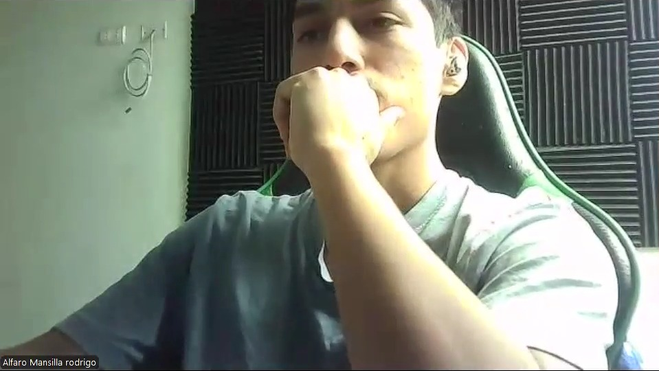

# 5.3. Validation Interviews

## 5.3.1. Diseño de entrevistas

Las entrevistas de validación se plantean con el objetivo de evaluar la percepción de los usuarios después de interactuar con la landing page y la Web Application de AniTec. A diferencia de las entrevistas exploratorias realizadas en capítulos anteriores, esta etapa se enfoca en validar la claridad de la propuesta de valor, la facilidad de navegación, la comprensión de las funcionalidades principales y la utilidad percibida por los segmentos objetivo.

Para esta validación se consideran los dos segmentos principales definidos para AniTec:

- Ganaderos.
- Veterinarios.

La dinámica de la entrevista consiste en presentar primero la landing page de AniTec para observar si el usuario comprende el problema que busca resolver la solución, la confianza que transmite y la claridad de sus secciones. Posteriormente, se muestra la aplicación web iniciando sesión según el segmento correspondiente, con el fin de revisar el dashboard, el menú de navegación y los módulos principales asociados al perfil del usuario.

En el caso del segmento ganadero, la evaluación se orienta a la gestión de hatos, animales, eventos sanitarios, actividades, finanzas, dispositivos IoT y planes. En el caso del segmento veterinario, se evalúa la gestión de clientes asignados, pacientes por ganadero, información clínica, eventos sanitarios, actividades, analíticas e IoT. Al finalizar la demostración, el entrevistado responde un conjunto de preguntas diseñadas para recoger sus opiniones, dificultades y recomendaciones de mejora.

### Guía de preguntas para el segmento Ganadero

1. ¿A qué se dedica actualmente dentro de la actividad ganadera y qué tipo de animales maneja?
2. ¿Cómo registra hoy la información de sus animales, fincas, actividades o gastos?
3. Al ver el landing page de AniTec, ¿entiende rápidamente qué problema busca resolver la aplicación?
4. ¿La información del landing page le genera confianza para probar la aplicación? ¿Por qué?
5. ¿Qué sección del landing page le pareció más útil o clara?
6. ¿Hubo alguna parte del landing page que le pareció confusa, innecesaria o poco creíble?
7. Al iniciar sesión como ganadero, ¿le resultó claro hacia dónde debía ir primero?
8. ¿El dashboard ganadero le muestra información útil para tomar decisiones rápidas?
9. ¿Los nombres de las opciones del menú, como hatos, animales, sanidad, finanzas, actividades, IoT y planes, le resultan comprensibles?
10. ¿Le resultó fácil encontrar la lista de animales registrados?
11. ¿El formulario para agregar o editar un animal le parece claro y completo?
12. ¿Qué dato importante sobre un animal cree que falta registrar?
13. ¿Le resulta útil registrar eventos sanitarios como vacunas, tratamientos o incidencias?
14. ¿La sección de actividades le ayudaría a organizar tareas de la finca? ¿Qué tareas agregaría?
15. ¿La sección financiera le parece útil para controlar ingresos y gastos ganaderos?
16. ¿La sección de dispositivos IoT le parece comprensible para asociar dispositivos a animales o fincas?
17. ¿Qué tan fácil le parece interpretar el estado y las métricas de los dispositivos IoT?
18. ¿El lenguaje usado en la aplicación le parece cercano y fácil de entender?
19. ¿Qué parte de la aplicación le resultó más difícil de usar o encontrar?
20. Después de probar AniTec, ¿la usaría en su trabajo diario? ¿Qué tendría que mejorar para que sí la use?

### Guía de preguntas para el segmento Veterinario

1. ¿Cuál es su experiencia trabajando con ganaderos o productores pecuarios?
2. ¿Cómo organiza actualmente la información de sus clientes, pacientes y visitas?
3. Al ver el landing page de AniTec, ¿queda claro que también está pensada para veterinarios?
4. ¿Qué información del landing page le ayudó más a entender el valor de la aplicación?
5. ¿Qué información agregaría al landing page para que un veterinario confíe más en AniTec?
6. Al iniciar sesión como veterinario, ¿el dashboard le permite entender rápidamente su carga de trabajo?
7. ¿La opción de clientes asignados le parece clara y útil?
8. ¿Le resultó fácil agregar o revisar clientes ganaderos?
9. ¿La vista de pacientes por ganadero le ayuda a encontrar animales bajo seguimiento?
10. ¿Le parece adecuado que primero se seleccione un cliente para revisar sus fincas y animales?
11. ¿La información clínica de cada animal es suficiente para una revisión veterinaria básica?
12. ¿El formulario de eventos sanitarios permite registrar bien vacunas, diagnósticos, tratamientos o seguimientos?
13. ¿Qué campos médicos considera que faltan en el registro sanitario?
14. ¿La sección de actividades le serviría para programar visitas, controles o seguimientos?
15. ¿Las alertas o estados sanitarios son fáciles de identificar dentro del dashboard?
16. ¿La sección de analíticas le da información útil sobre clientes, animales o eventos sanitarios?
17. ¿La sección IoT le parece útil para monitorear animales o fincas de sus clientes?
18. ¿El menú y la organización de la aplicación coinciden con la forma en que usted trabaja?
19. ¿Hubo alguna pantalla, botón o texto que no entendió durante la prueba?
20. Después de probar AniTec, ¿la recomendaría como herramienta de apoyo veterinario? ¿Qué cambios serían prioritarios?

## 5.3.2. Registro de entrevistas

A continuación, se presentan los cuadros de registro para las entrevistas de validación. Estos cuadros serán completados manualmente con los datos del entrevistado, evidencia, enlace de la entrevista y transcripción correspondiente.

<table align="center">
    <tr>
        <td colspan="2" align="center">
            <b>Entrevista de Validación N° 1</b>
        </td>
    </tr>
    <tr>
        <td width="30%" align="center">
            
        </td>
        <td width="70%">
            <b>Entrevistado</b>: Rodrigo Alfaro  
            <b>Entrevistador</b>: Josep Melgarejo  
            <b>Duración</b>: 9:36  
            <b>Género</b>: Masculino  
            <b>Edad</b>: 27 años 
            <b>Segmento</b>: Ganadero 
            <b>Lugar de Residencia</b>: Huaral 
        </td>
    </tr>
    <tr>
         <td colspan="2" align="center">
            Link de la entrevista a <a href="https://upcedupe-my.sharepoint.com/:v:/g/personal/u202315165_upc_edu_pe/IQB3jgi-SsJVRaDxAD4WBuuzAdv4R--qmXO3IsM5X73FAj0?nav=eyJyZWZlcnJhbEluZm8iOnsicmVmZXJyYWxBcHAiOiJTdHJlYW1XZWJBcHAiLCJyZWZlcnJhbFZpZXciOiJTaGFyZURpYWxvZy1MaW5rIiwicmVmZXJyYWxBcHBQbGF0Zm9ybSI6IldlYiIsInJlZmVycmFsTW9kZSI6InZpZXcifX0%3D&e=Og6bCI" target="_blank" rel="noopener noreferrer">Rodrigo Alfaro</a>
        </td>
    </tr>
    <tr>
        <td colspan="2" align="center">
            
        </td>
    </tr>
    <tr>
        <td colspan="2" align="center">
            <b>Transcripción:</b>
        </td>
    </tr>
    <tr>
        <td colspan="2">
<b>1. ¿A qué se dedica actualmente dentro de la actividad ganadera y qué tipo de animales maneja?</b> 
Actualmente me dedico a la crianza y manejo de ganado en una finca familiar. Principalmente manejo bovinos para producción de leche y carne, aunque también tenemos algunos ovinos y aves para consumo y venta local.
  

<b>2. ¿Cómo registra hoy la información de sus animales, fincas, actividades o gastos?</b> 
La mayoría de información la registro en cuadernos o en hojas sueltas. Algunos gastos los anoto en Excel, pero no siempre está actualizado. A veces la información se pierde o queda incompleta.
  

<b>3. Al ver el landing page de AniTec, ¿entiende rápidamente qué problema busca resolver la aplicación?</b> 
Sí, se entiende que AniTec busca ayudar a organizar mejor la información del ganado, controlar animales, sanidad, actividades y gastos desde una plataforma digital.
  

<b>4. ¿La información del landing page le genera confianza para probar la aplicación? ¿Por qué?</b> 
Sí, porque explica claramente para qué sirve, muestra beneficios concretos y está dirigida a ganaderos como yo. También ayuda que se vea ordenada y profesional.
  

<b>5. ¿Qué sección del landing page le pareció más útil o clara?</b> 
La sección de funcionalidades me pareció la más útil, porque muestra directamente qué se puede hacer con la aplicación: registrar animales, controlar sanidad, revisar finanzas y organizar actividades.
  

<b>6. ¿Hubo alguna parte del landing page que le pareció confusa, innecesaria o poco creíble?</b> 
En general está clara, pero algunas cifras de impacto podrían necesitar más explicación o evidencia para que se sientan más creíbles.
  

<b>7. Al iniciar sesión como ganadero, ¿le resultó claro hacia dónde debía ir primero?</b> 
Sí, al entrar al dashboard se entiende que es la pantalla principal. Desde ahí pude revisar un resumen y luego ir a los módulos del menú.
  

<b>8. ¿El dashboard ganadero le muestra información útil para tomar decisiones rápidas?</b> 
Sí, porque muestra información resumida sobre animales, estado sanitario, actividades y datos generales. Eso ayuda a ver rápidamente si hay algo pendiente o importante.
  

<b>9. ¿Los nombres de las opciones del menú, como hatos, animales, sanidad, finanzas, actividades, IoT y planes, le resultan comprensibles?</b> 
Sí, los nombres son entendibles. "Hatos", "animales", "sanidad" y "finanzas" son términos cercanos para alguien que trabaja en ganadería.
  

<b>10. ¿Le resultó fácil encontrar la lista de animales registrados?</b> 
Sí, fue fácil. La opción de animales está visible en el menú y la lista se entiende rápidamente.
  

<b>11. ¿El formulario para agregar o editar un animal le parece claro y completo?</b> 
Sí, me parece claro porque pide datos básicos como nombre, especie, raza, sexo, peso y estado. Es información que normalmente se necesita para identificar al animal.
  

<b>12. ¿Qué dato importante sobre un animal cree que falta registrar?</b> 
Sería útil agregar el origen del animal, nombre de la madre o padre, etapa productiva, número de partos si es hembra y quizá una foto para identificarlo más rápido.
  

<b>13. ¿Le resulta útil registrar eventos sanitarios como vacunas, tratamientos o incidencias?</b> 
Sí, bastante. Eso ayudaría a no olvidar vacunas, tratamientos o enfermedades anteriores. También serviría cuando viene el veterinario y necesita revisar el historial.
  

<b>14. ¿La sección de actividades le ayudaría a organizar tareas de la finca? ¿Qué tareas agregaría?</b> 
Sí, ayudaría a organizar mejor el trabajo diario. Agregaría tareas como vacunación, alimentación, limpieza de corrales, revisión de animales enfermos, visitas veterinarias y compra de insumos.
  

<b>15. ¿La sección financiera le parece útil para controlar ingresos y gastos ganaderos?</b> 
Sí, porque muchas veces uno no tiene claro cuánto está ganando o gastando realmente. Registrar ingresos y egresos ayudaría a tomar mejores decisiones.
  

<b>16. ¿La sección de dispositivos IoT le parece comprensible para asociar dispositivos a animales o fincas?</b> 
Sí, se entiende la idea. Permite relacionar dispositivos como balanzas, sensores o collares con animales o fincas para hacer seguimiento.
  

<b>17. ¿Qué tan fácil le parece interpretar el estado y las métricas de los dispositivos IoT?</b> 
Me parece relativamente fácil, sobre todo si se usan estados como "activo", "mantenimiento" o "sin conexión". Las métricas también son claras si muestran valores simples como peso, temperatura o actividad.
  

<b>18. ¿El lenguaje usado en la aplicación le parece cercano y fácil de entender?</b> 
Sí, el lenguaje es claro y no se siente demasiado técnico. Usa palabras que un ganadero puede reconocer.
  

<b>19. ¿Qué parte de la aplicación le resultó más difícil de usar o encontrar?</b> 
Tal vez la parte de IoT, porque no todos los ganaderos estamos familiarizados con dispositivos inteligentes. Sería bueno agregar una pequeña explicación o ayuda visual.
  

<b>20. Después de probar AniTec, ¿la usaría en su trabajo diario? ¿Qué tendría que mejorar para que sí la use?</b> 
Sí, la usaría porque ayuda a tener toda la información ordenada en un solo lugar. Para usarla diariamente, mejoraría con recordatorios automáticos, opción para agregar fotos de animales y una versión móvil más práctica para usar en campo.
        </td>
    </tr>
</table>

<table align="center">
    <tr>
        <td colspan="2" align="center">
            <b>Entrevista de Validación N° 2</b>
        </td>
    </tr>
    <tr>
        <td width="30%" align="center">
            
        </td>
        <td width="70%">
            <b>Entrevistado</b>:   
            <b>Entrevistador</b>:  
            <b>Duración</b>:  
            <b>Género</b>:   
            <b>Edad</b>:  
            <b>Segmento</b>: Veterinario  
            <b>Lugar de Residencia</b>:  
        </td>
    </tr>
    <tr>
         <td colspan="2" align="center">
            Link de la entrevista: <a href="" target="_blank" rel="noopener noreferrer">Entrevista a ...</a>
        </td>
    </tr>
    <tr>
        <td colspan="2" align="center">
            
        </td>
    </tr>
    <tr>
        <td colspan="2" align="center">
            <b>Transcripción:</b>
        </td>
    </tr>
    <tr>
        <td colspan="2">
        poner aca transcripcion
        </td>
    </tr>
</table>

<table align="center">
    <tr>
        <td colspan="2" align="center">
            <b>Entrevista de Validación N° 3</b>
        </td>
    </tr>
    <tr>
        <td width="30%" align="center">
            
        </td>
        <td width="70%">
            <b>Entrevistado</b>:   
            <b>Entrevistador</b>:  
            <b>Duración</b>:  
            <b>Género</b>:   
            <b>Edad</b>:  
            <b>Segmento</b>:  
            <b>Lugar de Residencia</b>:  
        </td>
    </tr>
    <tr>
        <td colspan="2" align="center">
            Link de la entrevista: <a href="" target="_blank" rel="noopener noreferrer">Entrevista a ...</a>
        </td>
    </tr>
    <tr>
        <td colspan="2" align="center">
            
        </td>
    </tr>
    <tr>
        <td colspan="2" align="center">
            <b>Transcripción:</b>
        </td>
    </tr>
    <tr>
        <td colspan="2">
        poner aca transcripcion
        </td>
    </tr>
</table>

<table align="center">
    <tr>
        <td colspan="2" align="center">
            <b>Entrevista de Validación N° 4</b>
        </td>
    </tr>
    <tr>
        <td width="30%" align="center">
            
        </td>
        <td width="70%">
            <b>Entrevistado</b>:   
            <b>Entrevistador</b>:  
            <b>Duración</b>:  
            <b>Género</b>:   
            <b>Edad</b>:  
            <b>Segmento</b>:  
            <b>Lugar de Residencia</b>:  
        </td>
    </tr>
    <tr>
         <td colspan="2" align="center">
            Link de la entrevista: <a href="" target="_blank" rel="noopener noreferrer">Entrevista a ...</a>
        </td>
    </tr>
    <tr>
        <td colspan="2" align="center">
            
        </td>
    </tr>
    <tr>
        <td colspan="2" align="center">
            <b>Transcripción:</b>
        </td>
    </tr>
    <tr>
        <td colspan="2">
        poner aca transcripcion
        </td>
    </tr>
</table>

<table align="center">
    <tr>
        <td colspan="2" align="center">
            <b>Entrevista de Validación N° 5</b>
        </td>
    </tr>
    <tr>
        <td width="30%" align="center">
            
        </td>
        <td width="70%">
            <b>Entrevistado</b>:   
            <b>Entrevistador</b>:  
            <b>Duración</b>:  
            <b>Género</b>:   
            <b>Edad</b>:  
            <b>Segmento</b>:  
            <b>Lugar de Residencia</b>:  
        </td>
    </tr>
    <tr>
         <td colspan="2" align="center">
            Link de la entrevista: <a href="" target="_blank" rel="noopener noreferrer">Entrevista a ...</a>
        </td>
    </tr>
    <tr>
        <td colspan="2" align="center">
            
        </td>
    </tr>
    <tr>
        <td colspan="2" align="center">
            <b>Transcripción:</b>
        </td>
    </tr>
    <tr>
        <td colspan="2">
        poner aca transcripcion
        </td>
    </tr>
</table>

## 5.3.3. Análisis de entrevistas
