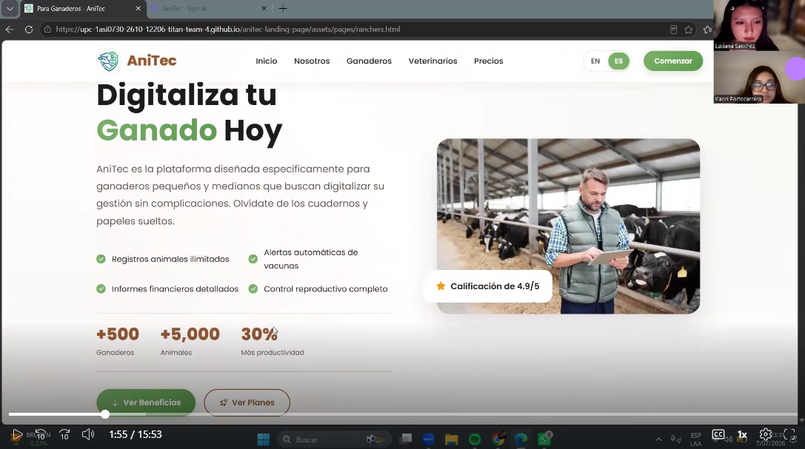
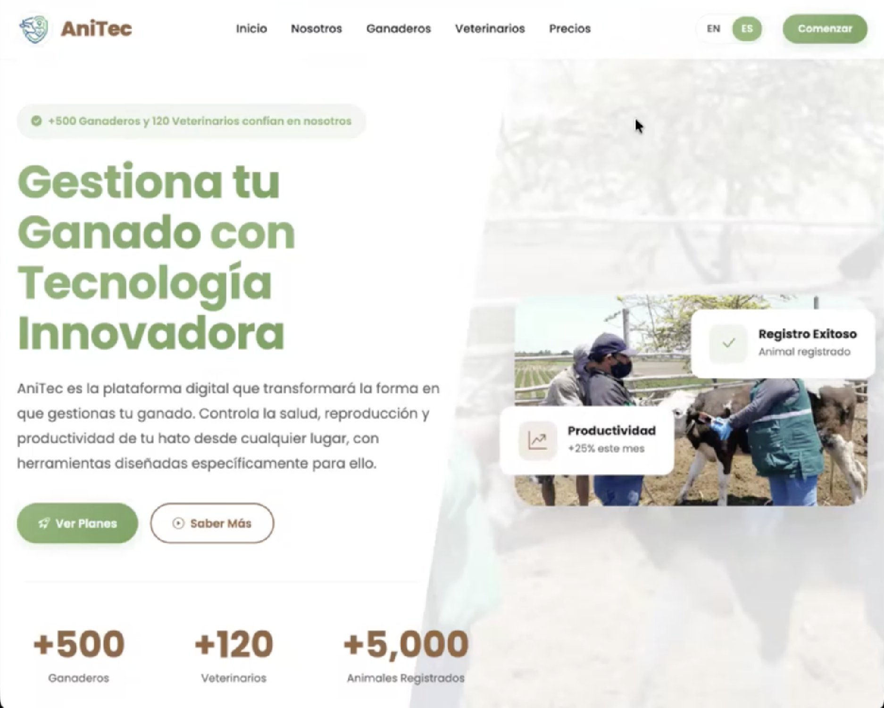

# 5.3. Validation Interviews

## 5.3.1. Diseño de entrevistas

Las entrevistas de validación se plantean con el objetivo de evaluar la percepción de los usuarios después de interactuar con la landing page y la Web Application de AniTec. A diferencia de las entrevistas exploratorias realizadas en capítulos anteriores, esta etapa se enfoca en validar la claridad de la propuesta de valor, la facilidad de navegación, la comprensión de las funcionalidades principales y la utilidad percibida por los segmentos objetivo.

Para esta validación se consideran los dos segmentos principales definidos para AniTec:

- Ganaderos.
- Veterinarios.

La dinámica de la entrevista consiste en presentar primero la landing page de AniTec para observar si el usuario comprende el problema que busca resolver la solución, la confianza que transmite y la claridad de sus secciones. Posteriormente, se muestra la aplicación web iniciando sesión según el segmento correspondiente, con el fin de revisar el dashboard, el menú de navegación y los módulos principales asociados al perfil del usuario.

En el caso del segmento ganadero, la evaluación se orienta a la gestión de hatos, animales, eventos sanitarios, actividades, finanzas, dispositivos IoT y planes. En el caso del segmento veterinario, se evalúa la gestión de clientes asignados, pacientes por ganadero, información clínica, eventos sanitarios, actividades, analíticas e IoT. Al finalizar la demostración, el entrevistado responde un conjunto de preguntas diseñadas para recoger sus opiniones, dificultades y recomendaciones de mejora.

### Guía de preguntas para el segmento Ganadero

1. ¿A qué se dedica actualmente dentro de la actividad ganadera y qué tipo de animales maneja?
2. ¿Cómo registra hoy la información de sus animales, fincas, actividades o gastos?
3. Al ver el landing page de AniTec, ¿entiende rápidamente qué problema busca resolver la aplicación?
4. ¿La información del landing page le genera confianza para probar la aplicación? ¿Por qué?
5. ¿Qué sección del landing page le pareció más útil o clara?
6. ¿Hubo alguna parte del landing page que le pareció confusa, innecesaria o poco creíble?
7. Al iniciar sesión como ganadero, ¿le resultó claro hacia dónde debía ir primero?
8. ¿El dashboard ganadero le muestra información útil para tomar decisiones rápidas?
9. ¿Los nombres de las opciones del menú, como hatos, animales, sanidad, finanzas, actividades, IoT y planes, le resultan comprensibles?
10. ¿Le resultó fácil encontrar la lista de animales registrados?
11. ¿El formulario para agregar o editar un animal le parece claro y completo?
12. ¿Qué dato importante sobre un animal cree que falta registrar?
13. ¿Le resulta útil registrar eventos sanitarios como vacunas, tratamientos o incidencias?
14. ¿La sección de actividades le ayudaría a organizar tareas de la finca? ¿Qué tareas agregaría?
15. ¿La sección financiera le parece útil para controlar ingresos y gastos ganaderos?
16. ¿La sección de dispositivos IoT le parece comprensible para asociar dispositivos a animales o fincas?
17. ¿Qué tan fácil le parece interpretar el estado y las métricas de los dispositivos IoT?
18. ¿El lenguaje usado en la aplicación le parece cercano y fácil de entender?
19. ¿Qué parte de la aplicación le resultó más difícil de usar o encontrar?
20. Después de probar AniTec, ¿la usaría en su trabajo diario? ¿Qué tendría que mejorar para que sí la use?

### Guía de preguntas para el segmento Veterinario

1. ¿Cuál es su experiencia trabajando con ganaderos o productores pecuarios?
2. ¿Cómo organiza actualmente la información de sus clientes, pacientes y visitas?
3. Al ver el landing page de AniTec, ¿queda claro que también está pensada para veterinarios?
4. ¿Qué información del landing page le ayudó más a entender el valor de la aplicación?
5. ¿Qué información agregaría al landing page para que un veterinario confíe más en AniTec?
6. Al iniciar sesión como veterinario, ¿el dashboard le permite entender rápidamente su carga de trabajo?
7. ¿La opción de clientes asignados le parece clara y útil?
8. ¿Le resultó fácil agregar o revisar clientes ganaderos?
9. ¿La vista de pacientes por ganadero le ayuda a encontrar animales bajo seguimiento?
10. ¿Le parece adecuado que primero se seleccione un cliente para revisar sus fincas y animales?
11. ¿La información clínica de cada animal es suficiente para una revisión veterinaria básica?
12. ¿El formulario de eventos sanitarios permite registrar bien vacunas, diagnósticos, tratamientos o seguimientos?
13. ¿Qué campos médicos considera que faltan en el registro sanitario?
14. ¿La sección de actividades le serviría para programar visitas, controles o seguimientos?
15. ¿Las alertas o estados sanitarios son fáciles de identificar dentro del dashboard?
16. ¿La sección de analíticas le da información útil sobre clientes, animales o eventos sanitarios?
17. ¿La sección IoT le parece útil para monitorear animales o fincas de sus clientes?
18. ¿El menú y la organización de la aplicación coinciden con la forma en que usted trabaja?
19. ¿Hubo alguna pantalla, botón o texto que no entendió durante la prueba?
20. Después de probar AniTec, ¿la recomendaría como herramienta de apoyo veterinario? ¿Qué cambios serían prioritarios?

## 5.3.2. Registro de entrevistas

A continuación, se presentan los cuadros de registro para las entrevistas de validación. Estos cuadros serán completados manualmente con los datos del entrevistado, evidencia, enlace de la entrevista y transcripción correspondiente.

**Segmento Objetivo 1: Ganaderos**
<table>
  <tr>
    <th colspan="2">ENTREVISTA N°1</th>
  </tr>
  <tr><td><strong>Nombre del entrevistado</strong></td><td>Rodrigo Alfaro</td></tr>
  <tr><td><strong>Edad</strong></td><td>25</td></tr>
  <tr><td><strong>Profesión</strong></td><td>Ganadero</td></tr>
  <tr><td><strong>Departamento</strong></td><td>Lima</td></tr>
  <tr><td><strong>Inicio del video</strong></td><td>00:00:13</td></tr>
  <tr><td><strong>Fin del video</strong></td><td>00:09:36</td></tr>
  <tr><td><strong>Link del video</strong></td><td><a href="https://tinyurl.com/ValidacionRodrigoAlfaro">https://tinyurl.com/ValidacionRodrigoAlfaro</a></td></tr>
  <tr><td><strong>Foto entrevista</strong></td><td>

</td></tr>
  <tr><td><strong>Objetivo</strong></td><td>Validar si la landing page y la aplicación web AniTec responden a las necesidades del User Persona ganadero, evaluando la organización de información, la utilidad del dashboard y la percepción de valor de la plataforma.</td></tr>
  <tr><td><strong>Aspecto del User Persona</strong></td><td><strong>Resultado obtenido / ¿Se valida?</strong></td></tr>
  <tr><td>Frustración: pierde registros</td><td>Confirma uso de cuadernos y hojas sueltas; esto causa pérdida o desorden de información. / Sí</td></tr>
  <tr><td>Frustración: recordar vacunas</td><td>Necesita revisar cuadernos; la aplicación sería útil para no olvidar vacunas y tratamientos. / Sí</td></tr>
  <tr><td>Meta: controlar ganado</td><td>El dashboard facilita la visualización del estado de sus animales. / Sí</td></tr>
  <tr><td>Meta: reducir pérdidas</td><td>El registro de ingresos y egresos ayuda a tomar mejores decisiones. / Sí</td></tr>
  <tr><td>Motivación: negocio organizado</td><td>La plataforma centraliza la información y profesionaliza la gestión. / Sí</td></tr>
  <tr><td><strong>Aspectos positivos</strong></td><td>Navegación intuitiva, propósito claro y secciones con nombres entendibles.</td></tr>
  <tr><td><strong>Dificultades</strong></td><td>La sección IoT puede ser difícil de comprender y encontrar; requiere mayor apoyo visual.</td></tr>
  <tr><td><strong>Recomendaciones</strong></td><td>Agregar alertas automáticas para actividades, fotos de animales y una versión móvil optimizada.</td></tr>
  <tr><td><strong>Conclusión</strong></td><td>AniTec resuelve problemas reales relacionados con el registro manual. Se requiere simplificar la sección IoT y mejorar la usabilidad móvil.</td></tr>
</table>

 

<table>
  <tr>
    <th colspan="2">ENTREVISTA N°2</th>
  </tr>
  <tr><td><strong>Nombre del entrevistado</strong></td><td>Kiara Gallardo</td></tr>
  <tr><td><strong>Edad</strong></td><td>22</td></tr>
  <tr><td><strong>Profesión</strong></td><td>Ganadero</td></tr>
  <tr><td><strong>Departamento</strong></td><td>Lima</td></tr>
  <tr><td><strong>Inicio del video</strong></td><td>00:06:30</td></tr>
  <tr><td><strong>Fin del video</strong></td><td>00:17:25</td></tr>
  <tr><td><strong>Link del video</strong></td><td><a href="https://tinyurl.com/EntrevistaValidacion2">https://tinyurl.com/EntrevistaValidacion2</a></td></tr>
  <tr><td><strong>Foto entrevista</strong></td><td>

</td></tr>
  <tr><td><strong>Objetivo</strong></td><td>Validar si la landing page y la aplicación web AniTec responden a las necesidades del User Persona, enfocándose en la gestión, organización y el valor de la herramienta.</td></tr>
  <tr><td><strong>Aspecto del User Persona</strong></td><td><strong>Resultado obtenido / ¿Se valida?</strong></td></tr>
  <tr><td>Frustración: desorden manual</td><td>Registra información en papeles y libros; le resulta difícil de ordenar. / Sí</td></tr>
  <tr><td>Frustración: control de fechas</td><td>El control de fechas es un desafío constante; la aplicación ayudaría a no olvidarlas. / Sí</td></tr>
  <tr><td>Meta: información organizada</td><td>Valora la centralización de información y el filtrado de animales. / Sí</td></tr>
  <tr><td>Meta: decisiones basadas en datos</td><td>El dashboard y la sección financiera ayudan a visualizar ganancias, pérdidas y salud. / Sí</td></tr>
  <tr><td><strong>Aspectos positivos</strong></td><td>Interfaz clara e intuitiva, dashboard muy útil y eliminación del uso de papel.</td></tr>
  <tr><td><strong>Dificultades</strong></td><td>Desconocimiento del concepto y utilidad de IoT, además de familiarización inicial con el dashboard.</td></tr>
  <tr><td><strong>Recomendaciones</strong></td><td>Incluir una explicación didáctica sobre IoT, versión móvil optimizada y mejores recordatorios automáticos.</td></tr>
  <tr><td><strong>Conclusión</strong></td><td>AniTec satisface las necesidades de organización y control, validando su valor, aunque requiere mejorar la comunicación sobre tecnologías avanzadas como IoT.</td></tr>
</table>

 

<table>
  <tr>
    <th colspan="2">ENTREVISTA N°3</th>
  </tr>
  <tr><td><strong>Nombre del entrevistado</strong></td><td>Vicente</td></tr>
  <tr><td><strong>Edad</strong></td><td>61</td></tr>
  <tr><td><strong>Profesión</strong></td><td>Ganadero</td></tr>
  <tr><td><strong>Departamento</strong></td><td>Lima</td></tr>
  <tr><td><strong>Inicio del video</strong></td><td>00:00:00</td></tr>
  <tr><td><strong>Fin del video</strong></td><td>00:07:30</td></tr>
  <tr><td><strong>Link del video</strong></td><td><a href="https://tinyurl.com/ValidacionAppWebVicente">https://tinyurl.com/ValidacionAppWebVicente</a></td></tr>
  <tr><td><strong>Foto entrevista</strong></td><td>

</td></tr>
  <tr><td><strong>Objetivo</strong></td><td>Validar si la landing page y la aplicación web AniTec responden a las necesidades del User Persona para la gestión de ganado, con enfoque en la organización sanitaria y administrativa.</td></tr>
  <tr><td><strong>Aspecto del User Persona</strong></td><td><strong>Resultado obtenido / ¿Se valida?</strong></td></tr>
  <tr><td>Frustración: registros manuales</td><td>Utiliza Excel y anotaciones manuales; el proceso es ineficiente y propenso a errores. / Sí</td></tr>
  <tr><td>Meta: control preciso</td><td>Valora la centralización de datos estadísticos para mayor control y precisión. / Sí</td></tr>
  <tr><td>Meta: decisiones basadas en datos</td><td>El dashboard facilita la toma de decisiones rápidas y precisas. / Sí</td></tr>
  <tr><td>Motivación: organización sanitaria</td><td>Reconoce la importancia del módulo sanitario para gestionar el control de enfermedades. / Sí</td></tr>
  <tr><td><strong>Aspectos positivos</strong></td><td>Herramienta fácil y efectiva; una versión móvil simplificaría las tareas diarias.</td></tr>
  <tr><td><strong>Dificultades</strong></td><td>Requiere familiarización con el dashboard y puede existir confusión inicial en registros sanitarios.</td></tr>
  <tr><td><strong>Recomendaciones</strong></td><td>Ampliar con funciones agrícolas, como suelo y cultivos, e implementar alertas automáticas.</td></tr>
  <tr><td><strong>Conclusión</strong></td><td>AniTec centraliza la gestión y mejora la eficiencia. La integración de funciones agrícolas consolidaría su valor como solución integral.</td></tr>
</table>

 

<h3>Segmento Objetivo 2: Veterinarios</h3>

 

<table>
  <tr>
    <th colspan="2">ENTREVISTA N°4</th>
  </tr>
  <tr><td><strong>Nombre del entrevistado</strong></td><td>Ariana Fernandez</td></tr>
  <tr><td><strong>Edad</strong></td><td>21</td></tr>
  <tr><td><strong>Profesión</strong></td><td>Veterinario</td></tr>
  <tr><td><strong>Departamento</strong></td><td>Lima</td></tr>
  <tr><td><strong>Inicio del video</strong></td><td>00:00:00</td></tr>
  <tr><td><strong>Fin del video</strong></td><td>00:15:45</td></tr>
  <tr><td><strong>Link del video</strong></td><td><a href="https://tinyurl.com/muxwt3cd">https://tinyurl.com/muxwt3cd</a></td></tr>
  <tr><td><strong>Foto entrevista</strong></td><td>

</td></tr>
  <tr><td><strong>Objetivo</strong></td><td>Validar si la aplicación AniTec responde a las necesidades del User Persona del segmento veterinario, evaluando funcionalidades clave como el historial clínico y la utilidad del dashboard.</td></tr>
  <tr><td><strong>Aspecto del User Persona</strong></td><td><strong>Resultado obtenido / ¿Se valida?</strong></td></tr>
  <tr><td>Frustración: falta de historial clínico organizado</td><td>Destaca la importancia y utilidad del historial médico de los animales como herramienta de trabajo. / Sí</td></tr>
  <tr><td>Meta: acceder a información para tratamientos</td><td>Considera que disponer del historial médico permite un mejor tratamiento y seguimiento clínico. / Sí</td></tr>
  <tr><td>Motivación: mejorar la eficiencia</td><td>Valora la centralización de la información y la posibilidad de ver problemas pasados de cada animal de forma organizada. / Sí</td></tr>
  <tr><td>Meta: reducir carga administrativa</td><td>Considera que el sistema agiliza el trabajo diario en comparación con métodos tradicionales como Excel. / Sí</td></tr>
  <tr><td><strong>Aspectos positivos</strong></td><td>El historial clínico se percibe como la funcionalidad más valiosa para el trabajo clínico diario. El dashboard permite obtener una visión general rápida del estado de salud de los animales.</td></tr>
  <tr><td><strong>Dificultades</strong></td><td>Desconocimiento inicial sobre las funciones de los dispositivos inteligentes IoT, por lo que la terminología podría ser un reto.</td></tr>
  <tr><td><strong>Recomendaciones</strong></td><td>Incluir una explicación didáctica sobre el significado y las ventajas de los dispositivos IoT. Integrar funcionalidades para registrar datos técnicos y clínicos más detallados.</td></tr>
  <tr><td><strong>Conclusión</strong></td><td>La entrevista confirma que AniTec satisface necesidades clave del veterinario, especialmente la organización y acceso al historial médico. La plataforma optimiza el tiempo y mejora la calidad de la atención veterinaria, aunque requiere mejorar la comunicación sobre IoT.</td></tr>
</table>

 

<table>
  <tr>
    <th colspan="2">ENTREVISTA N°5</th>
  </tr>
  <tr><td><strong>Nombre del entrevistado</strong></td><td>Hugo Jorge</td></tr>
  <tr><td><strong>Edad</strong></td><td>25</td></tr>
  <tr><td><strong>Profesión</strong></td><td>Veterinario</td></tr>
  <tr><td><strong>Departamento</strong></td><td>Lima</td></tr>
  <tr><td><strong>Inicio del video</strong></td><td>00:00:00</td></tr>
  <tr><td><strong>Fin del video</strong></td><td>00:04:30</td></tr>
  <tr><td><strong>Link del video</strong></td><td><a href="https://tinyurl.com/EntrevistaValidacionHugo">https://tinyurl.com/EntrevistaValidacionHugo</a></td></tr>
  <tr><td><strong>Foto entrevista</strong></td><td>

</td></tr>
  <tr><td><strong>Objetivo</strong></td><td>Validar si la aplicación AniTec responde a las necesidades del User Persona del segmento veterinario, evaluando funcionalidades clave como el historial clínico y la utilidad del dashboard.</td></tr>
  <tr><td><strong>Aspecto del User Persona</strong></td><td><strong>Resultado obtenido / ¿Se valida?</strong></td></tr>
  <tr><td>Frustración: falta de historial organizado</td><td>Destaca la importancia y utilidad del historial médico como herramienta de trabajo. / Sí</td></tr>
  <tr><td>Meta: acceder a información de tratamiento</td><td>Considera que el historial médico permite un mejor tratamiento y seguimiento clínico. / Sí</td></tr>
  <tr><td>Motivación: mejorar eficiencia</td><td>Valora la centralización de información y la visualización organizada de problemas pasados. / Sí</td></tr>
  <tr><td>Meta: reducir carga administrativa</td><td>Considera que el sistema agiliza el trabajo diario frente a métodos tradicionales como Excel. / Sí</td></tr>
  <tr><td><strong>Aspectos positivos</strong></td><td>El historial clínico es la funcionalidad más valiosa; el dashboard resulta útil para una visión general rápida.</td></tr>
  <tr><td><strong>Dificultades</strong></td><td>Desconocimiento sobre funciones de dispositivos inteligentes IoT y terminología técnica compleja.</td></tr>
  <tr><td><strong>Recomendaciones</strong></td><td>Agregar explicación didáctica sobre ventajas de IoT e integrar registros clínicos más detallados.</td></tr>
  <tr><td><strong>Conclusión</strong></td><td>AniTec satisface necesidades de organización y acceso al historial médico, optimizando el tiempo y la atención veterinaria, aunque requiere mejor comunicación sobre el alcance de IoT.</td></tr>
</table>

## 5.3.3. Evaluaciones según heurísticas

La evaluación heurística de AniTec se realizó a partir de las sesiones de validación con usuarios de los segmentos ganadero y veterinario. Durante estas sesiones, los entrevistados interactuaron con la landing page y con la aplicación web, revisando los flujos principales según su rol. La evaluación considera criterios de usabilidad, arquitectura de información e inclusive design, con el objetivo de identificar fortalezas, problemas de experiencia de usuario y oportunidades de mejora.

Para registrar los hallazgos se utilizó una escala de severidad simple:

| Severidad | Descripción |
| --------- | ----------- |
| 0 | No representa un problema de experiencia de usuario. |
| 1 | Problema menor que puede corregirse sin afectar el flujo principal. |
| 2 | Problema moderado que puede generar dudas o fricción en algunos usuarios. |
| 3 | Problema importante que puede dificultar el cumplimiento de una tarea. |
| 4 | Problema crítico que impide completar una tarea principal. |

### Evaluación heurística - Segmento Ganadero:

| Criterio evaluado | Evidencia observada | Severidad | Recomendación |
| ----------------- | ------------------- | --------- | ------------- |
| Visibilidad del estado del sistema | El dashboard ganadero permite visualizar animales, hatos, eventos sanitarios y actividades. | 1 | Mantener estados visibles de carga, éxito y error en formularios y listados. |
| Correspondencia entre el sistema y el mundo real | Los términos animales, hatos, sanidad, actividades y finanzas fueron comprensibles. | 0 | Mantener vocabulario cercano al contexto ganadero. |
| Control y libertad del usuario | Los usuarios navegan por módulos, pero faltan acciones de cancelación más visibles. | 1 | Hacer más claros los botones para cancelar o volver sin guardar. |
| Consistencia y estándares | La aplicación mantiene navegación lateral, formularios y tarjetas con estructura similar. | 0 | Mantener la consistencia visual y de interacción. |
| Prevención de errores | Los formularios tienen campos definidos, pero faltan validaciones adicionales. | 2 | Añadir mensajes claros para campos obligatorios y formatos esperados. |
| Reconocimiento antes que memoria | El menú lateral permite reconocer las secciones disponibles sin memorizar rutas. | 0 | Mantener iconos y nombres de menú visibles. |
| Flexibilidad y eficiencia de uso | El dashboard facilita tareas, pero faltan accesos rápidos a registros usados con frecuencia. | 1 | Añadir accesos directos a registrar animal, evento sanitario o actividad. |
| Diseño estético y minimalista | Interfaz organizada, aunque algunos dashboards requieren mejor jerarquía visual. | 1 | Jerarquizar indicadores críticos y reducir contenido secundario. |
| Ayuda al usuario a reconocer y recuperarse de errores | Mensajes de error insuficientes ante fallas de backend o conexión. | 2 | Mostrar mensajes de error específicos cuando falle una operación. |
| Inclusive design y accesibilidad | Se debe seguir cuidando el contraste y legibilidad en dispositivos móviles. | 1 | Validar contrastes, tamaños de texto y uso en pantallas pequeñas. |

 

### Evaluación heurística - Segmento Veterinario:

| Criterio evaluado | Evidencia observada | Severidad | Recomendación |
| ----------------- | ------------------- | --------- | ------------- |
| Visibilidad del estado del sistema | El dashboard veterinario muestra clientes, pacientes y alertas, lo que ayuda a entender la carga de trabajo inicial. | 0 | Mantener indicadores visibles de clientes y pacientes asignados. |
| Correspondencia entre el sistema y el mundo real | Los conceptos clientes, pacientes, historial clínico, eventos sanitarios y actividades coinciden con tareas veterinarias básicas. | 0 | Reforzar textos específicos para veterinarios en landing page y aplicación. |
| Control y libertad del usuario | El veterinario puede revisar clientes y pacientes, pero el flujo depende de seleccionar un cliente para ver información asociada. | 1 | Explicar mejor el paso de selección de cliente antes de revisar animales o historial. |
| Consistencia y estándares | Las vistas mantienen estructura similar al resto de la aplicación, lo que facilita aprendizaje. | 0 | Mantener componentes y patrones ya definidos. |
| Prevención de errores | El registro sanitario funciona para casos básicos, pero los entrevistados sugirieron campos clínicos adicionales. | 2 | Añadir campos como dosis, vía de administración, signos vitales u observaciones cuando el alcance lo permita. |
| Reconocimiento antes que memoria | La navegación por menú facilita encontrar clientes, pacientes, sanidad, actividades e IoT. | 0 | Mantener agrupación de módulos por rol. |
| Flexibilidad y eficiencia de uso | El dashboard centraliza información útil, pero podrían existir accesos rápidos para registrar visita o evento sanitario. | 1 | Agregar accesos directos a tareas veterinarias frecuentes. |
| Diseño estético y minimalista | La información se presenta de forma ordenada, aunque las vistas clínicas podrían beneficiarse de una jerarquía más clara. | 1 | Diferenciar visualmente datos clínicos, historial y acciones principales. |
| Ayuda al usuario a reconocer y recuperarse de errores | Los mensajes de error pueden mejorar cuando no se cargan clientes, pacientes o eventos sanitarios. | 2 | Mostrar mensajes específicos para errores de conexión o ausencia de datos asignados. |
| Inclusive design y accesibilidad | La experiencia por rol ayuda a reducir información innecesaria, pero se debe seguir validando legibilidad en dispositivos pequeños. | 1 | Revisar responsive, contraste y claridad de textos médicos. |

 

### Resumen de hallazgos heurísticos:

La evaluación muestra que **AniTec** cumple adecuadamente con criterios de correspondencia con el mundo real, consistencia, reconocimiento y organización general de la información. Los usuarios comprenden la división por roles y reconocen la utilidad de centralizar animales, sanidad, actividades, finanzas, clientes, pacientes, IoT y suscripciones en una sola plataforma.

Los principales puntos de mejora se concentran en **prevención de errores**, **mensajes de retroalimentación** y **detalle de formularios**. En el segmento ganadero, se recomienda reforzar validaciones y accesos rápidos a tareas frecuentes. En el segmento veterinario, se recomienda ampliar progresivamente campos clínicos y explicar con mayor claridad el flujo de selección de cliente antes de revisar pacientes o historial sanitario.
