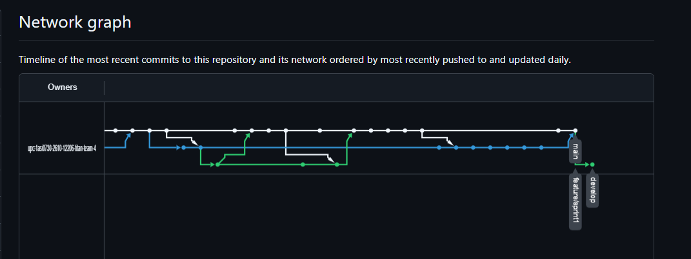
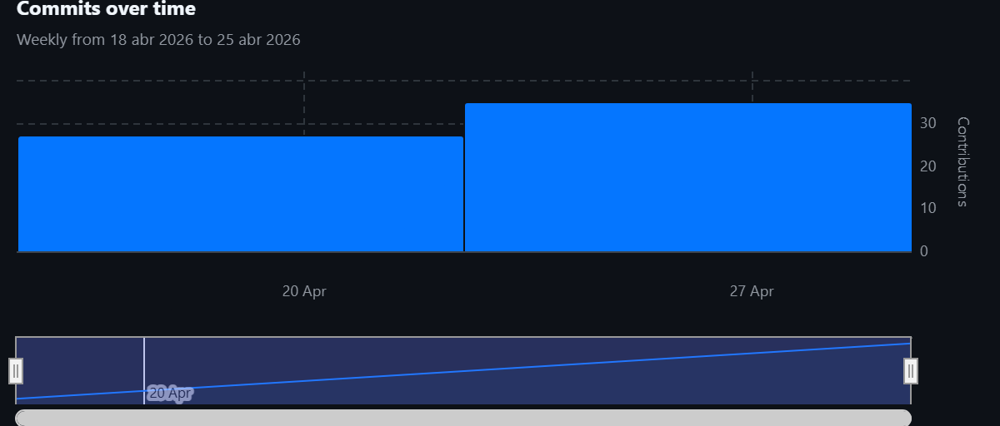
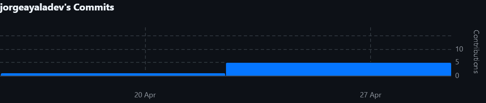
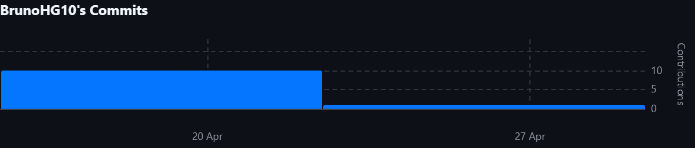
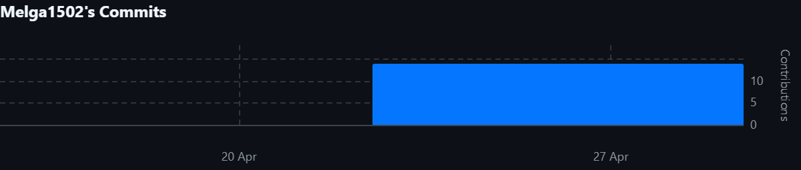
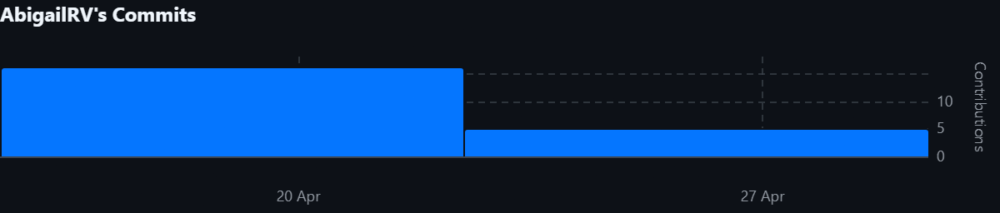

# Project Report Collaboration Insights

- URL del repositorio para el reporte del proyecto: https://github.com/upc-1asi0730-2610-12206-titan-team-4/anitec-report
- URL del repositorio para la Landing Page: https://github.com/upc-1asi0730-2610-12206-titan-team-4/anitec-landing-page   
- URL del repositorio para el desarrollo del frontend web applications (VueJS):  
- URL del repositorio para el desarrollo del backend web applications (.NET Web API): 

**AV1**

Para el desarrollo del informe perteneciente a la entrega AV1, se dividió la implementación de secciones de la siguiente forma para cada integrante del equipo:

| Integrante       | Tareas Asignadas                                                                                                                                                                            |
|------------------|---------------------------------------------------------------------------------------------------------------------------------------------------------------------------------------------|
| Abigail Raymundo | Desarrollo del Capítulo I, una parte del Capítulo II, así como la parte final del Capítulo V del documento en formato markdown.                                                             |
| Bruno Huaman     | Desarrollo del Capítulo III, desarrollo parcial de capítulo II, así como colaboración en el capítulo V del documento en formato markdown.                                                   |
| Jorge Ayala      | Desarrollo parcial del Capítulo IV, así como colaboración en el capítulo V del documento en formato markdown                                                                                |
| Josep Melgarejo  | Desarrollo parcial del Capítulo IV, así como colaboración en el capítulo V del documento en formato markdown                                                                                |
| Luciana Sanchez  | Desarrollo parcial del Capítulo IV: Diseño del landing page y web application, y actualización del keynote. Además,  colaboró en el desarrollo capítulo V del documento en formato markdown |

El proceso de colaboración en el informe se realizó mediante commits constantes al repositorio de la organización Titan.

**Github Collaboration Insights**

Github también presenta un timeline de las ramas principales y los procesos de merge a los que se han sometido. Todas las ramas se crearon tomando en cuenta el diseño de GitFlow para una buena organización cuando se usa un software de control de versiones.

Los integrantes son:

* Josep Melgarejo (Melga1502)
* Jorge Ayala (jorgeayaladev)
* Huamán Bruno (BrunoHG10)
* Abigail Raymundo (AbigailRV)
* Luciana Sánchez (Luccsss)

Se explican las ramas más prominentes:

- **main**: Es representada por el color blanco. Se trata de la rama principal del proyecto y se actualiza para cada entregable.
- **develop**: Es representada por el color morado. Se trata de la rama principal para el proceso del desarrollo del proyecto.
- **feat/sprint1**: Es representada por el color morado. Esta rama incluye los artefactos relacionados al sprint 1 en el informe.

Los siguientes gráficos representan analíticos de commits en el repositorio del informe. En los gráficos se incluye la cantidad de lineas de texto añadidas por cada integrante del equipo. 

**AV1**

