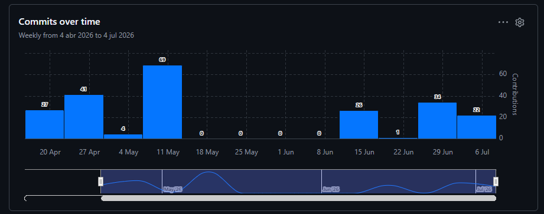

# Project Report Collaboration Insights

- URL del repositorio para el reporte del proyecto: https://github.com/upc-1asi0730-2610-12206-titan-team-4/anitec-report
- URL del repositorio para la Landing Page: https://github.com/upc-1asi0730-2610-12206-titan-team-4/anitec-landing-page
- URL del repositorio para el desarrollo del frontend web applications (VueJS): https://github.com/upc-1asi0730-2610-12206-titan-team-4/anitec-frontend
- URL del repositorio para el desarrollo del backend web applications (.NET Web API): https://github.com/upc-1asi0730-2610-12206-titan-team-4/anitec-backend.git

**AV1**

Para el desarrollo del informe perteneciente a la entrega AV1, se dividió la implementación de secciones de la siguiente forma para cada integrante del equipo:

| Integrante       | Tareas Asignadas                                                                                                                                                                           |
| ---------------- | ------------------------------------------------------------------------------------------------------------------------------------------------------------------------------------------ |
| Abigail Raymundo | Desarrollo del Capítulo I, una parte del Capítulo II, así como la parte final del Capítulo V del documento en formato markdown.                                                            |
| Bruno Huaman     | Desarrollo del Capítulo III, desarrollo parcial de capítulo II, así como colaboración en el capítulo V del documento en formato markdown.                                                  |
| Jorge Ayala      | Desarrollo parcial del Capítulo IV, así como colaboración en el capítulo V del documento en formato markdown                                                                               |
| Josep Melgarejo  | Desarrollo parcial del Capítulo IV, así como colaboración en el capítulo V del documento en formato markdown                                                                               |
| Luciana Sanchez  | Desarrollo parcial del Capítulo IV: Diseño del landing page y web application, y actualización del keynote. Además, colaboró en el desarrollo capítulo V del documento en formato markdown |

El trabajo se desarrolló mediante commits continuos en el repositorio de la organización, asegurando trazabilidad y colaboración activa del equipo.

---

**TB1**

Para el desarrollo del informe perteneciente a la entrega TB1, se dividió la implementación de secciones de la siguiente forma para cada integrante del equipo:

| Integrante       | Tareas Asignadas                                                                                                                                                          |
| ---------------- | ------------------------------------------------------------------------------------------------------------------------------------------------------------------------- |
| Abigail Raymundo | Corrección del Capítulo I, Y colaboró en la corrección parcial de capítulo II; así como la documentación del sprint 2 del Capítulo V                                      |
| Bruno Huaman     | Corrección del Capítulos II. Además, colaboró en la corrección parcial de capítulo III, así como la documentación del sprint 2                                            |
| Jorge Ayala      | Corrección del Capítulo V, así como la documentación del sprint 2, y desarrollo del material de exposición                                                                |
| Josep Melgarejo  | Corrección del Capítulo III, incluyendo el eventstorming y diagrama de base de datos. Además, participó en la documentación del sprint 2 y la reorganización del markdowm |
| Luciana Sanchez  | Corrección del Capítulo V, así como la corrección de anexos, bibliografía, conclusiones y report collaboration. Asimismo, colaboró en la documentación del sprint 2       |

El proceso de colaboración en el informe se realizó mediante commits constantes al repositorio de la organización Titan.

---

**AV2**

Para el desarrollo del informe perteneciente a la entrega AV2, el equipo organizó sus actividades en torno al cierre del Sprint 3, la documentación del backend, la validación de usuarios y la preparación de evidencias finales del producto. La distribución de tareas fue la siguiente:

| Integrante       | Tareas Asignadas |
| ---------------- | ---------------- |
| Abigail Raymundo | Colaboración en la documentación de validación, entrevistas, conclusiones y revisión de secciones relacionadas con sanidad, actividades y necesidades de los usuarios ganaderos. |
| Bruno Huaman     | Apoyo en la revisión técnica de entidades, dispositivos IoT, métricas, reportes y coherencia entre los módulos backend documentados y las funcionalidades del sistema. |
| Jorge Ayala      | Encargado del despliegue del backend en Render, verificación del acceso público a Swagger y apoyo en la evidencia técnica del deployment de la API. |
| Josep Melgarejo  | Desarrollo y organización de la documentación del Sprint 3, endpoints implementados, commits, evidencias de servicios, validación de entrevistas y actualización general del reporte. |
| Luciana Sanchez  | Colaboración en la revisión del flujo veterinario, organización de información del reporte, student outcome, conclusiones y consistencia de la documentación final. |

Durante AV2, el trabajo colaborativo se enfocó en consolidar el backend de AniTec, documentar los servicios implementados y evidenciar el despliegue público de la API. Para mantener la trazabilidad, se usaron ramas `feature/` asociadas a endpoints específicos, ramas `develop` para integración, una rama `hotfix/` para correcciones críticas y la rama `main` como versión estable del entregable.

---

**TB2**

Para el desarrollo del informe perteneciente a la entrega TB2, el equipo organizó sus actividades en torno al cierre del Sprint 4, la documentación del backend, la validación de usuarios y la preparación de evidencias finales del producto. La distribución de tareas fue la siguiente:

| Integrante       | Tareas Asignadas |
| ---------------- | ---------------- |
| Abigail Raymundo | Corrección de entrevistas de validación de acuerdo al statement |
| Bruno Huaman     | Encargado de corregir errores de despliegue  |
| Jorge Ayala      | Documentación del sprint 4 y conexion de la pasarela de pagos |
| Josep Melgarejo  | Corrección de comentarios, avance del IAM |
| Luciana Sanchez  | Corrección de URLs no explicitos y actualización del report collaboration |

Durante la TB2, el trabajo colaborativo se centró en completar el backend de AniTec, abarcando el bounded context de IAM e integrando la pasarela de pagos. Además, se actualizaron los despliegues y se resolvieron conflictos relacionados con la publicación de la API. Para asegurar la trazabilidad del desarrollo, se utilizaron ramas feature/ vinculadas a endpoints específicos, ramas develop para la integración de avances, una rama hotfix/ para atender correcciones críticas y la rama main como versión estable del entregable.

**Github Collaboration Insights**

Github también presenta un timeline de las ramas principales y los procesos de merge a los que se han sometido. Todas las ramas se crearon tomando en cuenta el diseño de GitFlow para una buena organización cuando se usa un software de control de versiones.

Los integrantes son:

- Josep Melgarejo (Melga1502)
- Jorge Ayala (jorgeayaladev)
- Huamán Bruno (BrunoHG10)
- Abigail Raymundo (AbigailRV)
- Luciana Sánchez (Luccsss)

Se explican las ramas más prominentes:

- **main**: Es representada por el color blanco. Se trata de la rama principal del proyecto y se actualiza para cada entregable.
- **develop**: Es representada por el color morado. Se trata de la rama principal para el proceso del desarrollo del proyecto.
- **feature/**: cambios específicos del documento o de endpoints implementados.
- **hotfix/**: correcciones puntuales realizadas sobre errores críticos encontrados durante la integración o despliegue.

Los siguientes gráficos representan analíticos de commits en el repositorio del informe. En los gráficos se incluye la cantidad de lineas de texto añadidas por cada integrante del equipo.

**AV1**

**Grafo de commits AV1**

**Commits durante AV1**

**Commits por integrante durante AV1**

**TB1** 

**Grafo de commits TB1**

**Commits durante TB1**

**Commits por integrante durante TB1**

**AV2**

**Grafo de commits AV2**

**Commits durante AV2**

**Commits por integrante durante AV2**

**TB2**

**Grafo de commits TB2**

**Commits durante TB2**

**Commits por integrante durante TB2**

