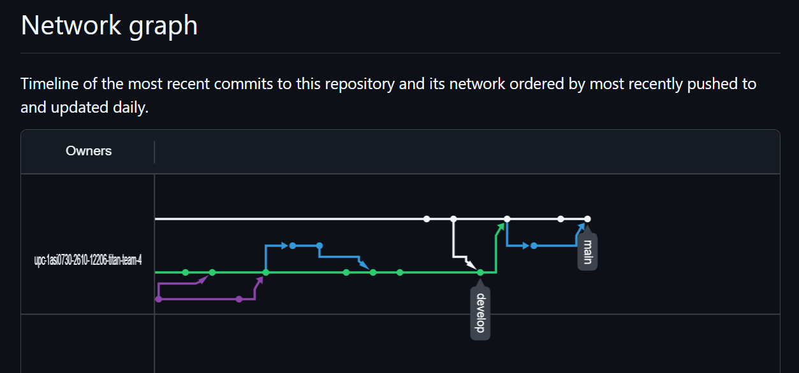
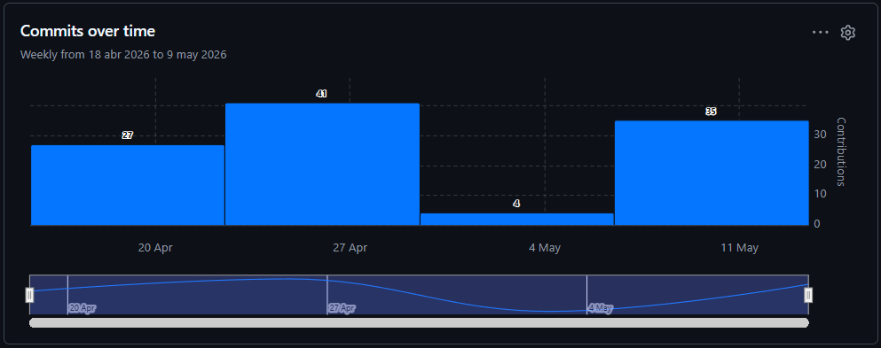
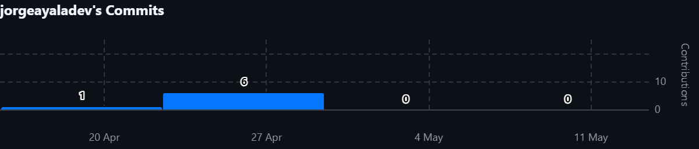
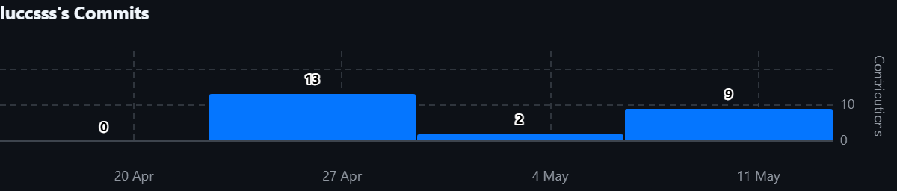
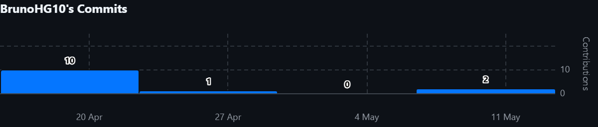
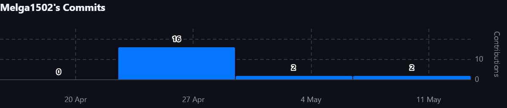
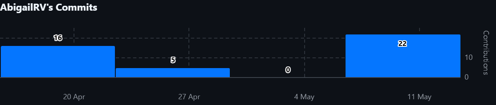
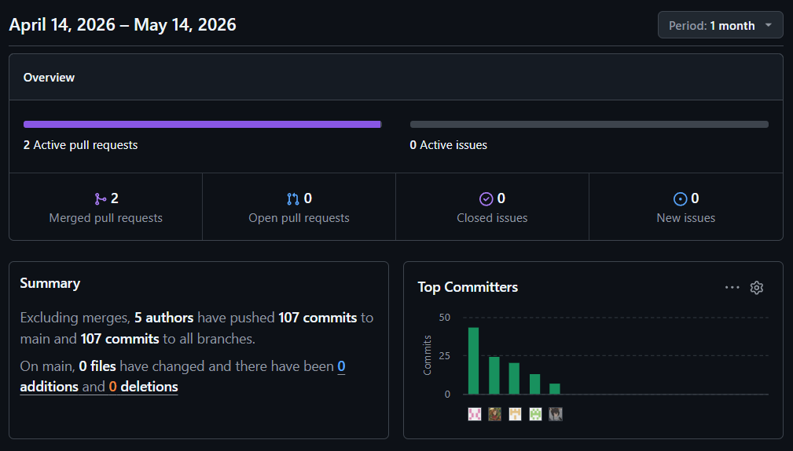
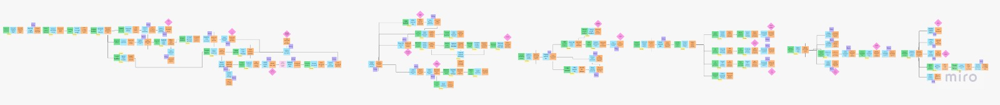
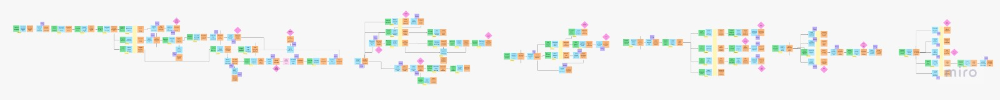

<h1 align="center">Informe del Trabajo Final</h1>
<h3 align="center">Universidad Peruana de Ciencias Aplicadas</h3>
<br/>
<div align="center">
  
</div>
<br/>
<h5 align="center">Ingeniería de Software</h5>
<h5 align="center">Aplicaciones Web - 1ASI0730</h5>
<h5 align="center">Docente: Angel Augusto Velasquez Nuñez</h5>
<h5 align="center">Startup: Titan</h5>
<h5 align="center">Producto: AniTec</h5>

## Team members:

<div align="center">

|               Nombre                |   Código   |
| :---------------------------------: | :--------: |
|    Ayala Fernandez, Jorge Brayan    | U20241C030 |
|    Huaman Gallardo, Bruno Aldair    | U202117762 |
|    Melgarejo Quiroz, Josep Eliu     | U202315165 |
| Raymundo Villarroel, Nadhim Abigail | U202318001 |
|   Sanchez Silva, Luciana Celeste    | U202215979 |

</div>

<h5 align="center"> Ciclo 2026-10 </h5>

---

<div align="center">

# Índice general

</div>

### [Registro de Versiones del Informe](./markdown/content/registro-versiones.md)

### [Project Report Collaboration Insights](./markdown/content/report-collaboration.md)

### [Student Outcome](./markdown/content/student-outcome.md)

## Capítulo I: Introducción

- [1.1. Startup Profile](./markdown/content/chapter-1/1-1-startup-profile.md)
  - [1.1.1. Descripción de la Startup](./markdown/content/chapter-1/1-1-startup-profile.md)
  - [1.1.2. Perfiles de integrantes del equipo](./markdown/content/chapter-1/1-1-startup-profile.md)
- [1.2. Solution Profile](./markdown/content/chapter-1/1-2-solution-profile.md)
  - [1.2.1. Antecedentes y problemática](./markdown/content/chapter-1/1-2-solution-profile.md)
  - [1.2.2. Lean UX Process](./markdown/content/chapter-1/1-2-solution-profile.md)
    - [1.2.2.1. Lean UX Problem Statements](./markdown/content/chapter-1/1-2-solution-profile.md)
    - [1.2.2.2. Lean UX Assumptions](./markdown/content/chapter-1/1-2-solution-profile.md)
    - [1.2.2.3. Lean UX Hypothesis Statements](./markdown/content/chapter-1/1-2-solution-profile.md)
    - [1.2.2.4. Lean UX Canvas](./markdown/content/chapter-1/1-2-solution-profile.md)
- [1.3. Segmentos objetivo](./markdown/content/chapter-1/1-3-segmentos-objetivo.md)

## Capítulo II: Requirements Elicitation & Analysis

- [2.1. Competidores](./markdown/content/chapter-2/2-1-competidores.md)
  - [2.1.1. Análisis competitivo](./markdown/content/chapter-2/2-1-competidores.md)
  - [2.1.2. Estrategias y tácticas frente a competidores](./markdown/content/chapter-2/2-1-competidores.md)
- [2.2. Entrevistas](./markdown/content/chapter-2/2-2-entrevistas.md)
  - [2.2.1. Diseño de entrevistas](./markdown/content/chapter-2/2-2-entrevistas.md)
  - [2.2.2. Registro de entrevistas](./markdown/content/chapter-2/2-2-entrevistas.md)
  - [2.2.3. Análisis de entrevistas](./markdown/content/chapter-2/2-2-entrevistas.md)
- [2.3. Needfinding](./markdown/content/chapter-2/2-3-needfinding.md)
  - [2.3.1. User Personas](./markdown/content/chapter-2/2-3-needfinding.md)
  - [2.3.2. User Task Matrix](./markdown/content/chapter-2/2-3-needfinding.md)
  - [2.3.3. User Journey Mapping](./markdown/content/chapter-2/2-3-needfinding.md)
  - [2.3.4. Empathy Mapping](./markdown/content/chapter-2/2-3-needfinding.md)
- [2.4. Big Picture EventStorming](./markdown/content/chapter-2/2-4-big-picture-eventstorming.md)
- [2.5. Ubiquitous Language](./markdown/content/chapter-2/2-5-ubiquitous-language.md)

## Capítulo III: Requirements Specification

- [3.1. User Stories](./markdown/content/chapter-3/3-1-user-stories.md)
- [3.2. Impact Mapping](./markdown/content/chapter-3/3-2-impact-mapping.md)
- [3.3. Product Backlog](./markdown/content/chapter-3/3-3-product-backlog.md)

## Capítulo IV: Product Design

- [4.1. Style Guidelines](./markdown/content/chapter-4/4-1-style-guidelines.md)
  - [4.1.1. General Style Guidelines](./markdown/content/chapter-4/4-1-style-guidelines.md)
  - [4.1.2. Web Style Guidelines](./markdown/content/chapter-4/4-1-style-guidelines.md)
- [4.2. Information Architecture](./markdown/content/chapter-4/4-2-information-architecture.md)
  - [4.2.1. Organization Systems](./markdown/content/chapter-4/4-2-information-architecture.md)
  - [4.2.2. Labeling Systems](./markdown/content/chapter-4/4-2-information-architecture.md)
  - [4.2.3. SEO Tags and Meta Tags](./markdown/content/chapter-4/4-2-information-architecture.md)
  - [4.2.4. Searching Systems](./markdown/content/chapter-4/4-2-information-architecture.md)
  - [4.2.5. Navigation Systems](./markdown/content/chapter-4/4-2-information-architecture.md)
- [4.3. Landing Page UI Design](./markdown/content/chapter-4/4-3-landing-page-ui-design.md)
  - [4.3.1. Landing Page Wireframe](./markdown/content/chapter-4/4-3-landing-page-ui-design.md)
  - [4.3.2. Landing Page Mock-up](./markdown/content/chapter-4/4-3-landing-page-ui-design.md)
- [4.4. Web Applications UX/UI Design](./markdown/content/chapter-4/4-4-web-applications-ux-ui-design.md)
  - [4.4.1. Web Applications Wireframes](./markdown/content/chapter-4/4-4-web-applications-ux-ui-design.md)
  - [4.4.2. Web Applications Wireflow Diagrams](./markdown/content/chapter-4/4-4-web-applications-ux-ui-design.md)
  - [4.4.2. Web Applications Mock-ups](./markdown/content/chapter-4/4-4-web-applications-ux-ui-design.md)
  - [4.4.3. Web Applications User Flow Diagrams](./markdown/content/chapter-4/4-4-web-applications-ux-ui-design.md)
- [4.5. Web Applications Prototyping](./markdown/content/chapter-4/4-5-web-applications-prototyping.md)
- [4.6. Domain-Driven Software Architecture](./markdown/content/chapter-4/4-6-domain-driven-software-architecture.md)
  - [4.6.1. Design-Level EventStorming](./markdown/content/chapter-4/4-6-domain-driven-software-architecture.md)
  - [4.6.2. Software Architecture Context Diagram](./markdown/content/chapter-4/4-6-domain-driven-software-architecture.md)
  - [4.6.3. Software Architecture Container Diagrams](./markdown/content/chapter-4/4-6-domain-driven-software-architecture.md)
  - [4.6.4. Software Architecture Components Diagrams](./markdown/content/chapter-4/4-6-domain-driven-software-architecture.md)
- [4.7. Software Object-Oriented Design](./markdown/content/chapter-4/4-7-software-object-oriented-design.md)
  - [4.7.1. Class Diagrams](./markdown/content/chapter-4/4-7-software-object-oriented-design.md)
- [4.8. Database Design](./markdown/content/chapter-4/4-8-database-design.md)
  - [4.8.1. Database Diagrams](./markdown/content/chapter-4/4-8-database-design.md)

## Capítulo V: Product Implementation, Validation & Deployment

- [5.1. Software Configuration Management](./markdown/content/chapter-5/5-1-software-configuration-management.md)
  - [5.1.1. Software Development Environment Configuration](./markdown/content/chapter-5/5-1-software-configuration-management.md)
  - [5.1.2. Source Code Management](./markdown/content/chapter-5/5-1-software-configuration-management.md)
  - [5.1.3. Source Code Style Guide & Conventions](./markdown/content/chapter-5/5-1-software-configuration-management.md)
  - [5.1.4. Software Deployment Configuration](./markdown/content/chapter-5/5-1-software-configuration-management.md)
- [5.2. Landing Page, Services & Applications Implementation](./markdown/content/chapter-5/5-2-landing-service-applications.md)
  - [5.2.1. Sprint 1](./markdown/content/chapter-5/5-2-landing-service-applications.md)
    - [5.2.1.1. Sprint Planning 1](./markdown/content/chapter-5/5-2-landing-service-applications.md)
    - [5.2.1.2. Aspect Leaders and Collaborators](./markdown/content/chapter-5/5-2-landing-service-applications.md)
    - [5.2.1.3. Sprint Backlog 1](./markdown/content/chapter-5/5-2-landing-service-applications.md)
    - [5.2.1.4. Development Evidence for Sprint Review](./markdown/content/chapter-5/5-2-landing-service-applications.md)
    - [5.2.1.5. Execution Evidence for Sprint Review](./markdown/content/chapter-5/5-2-landing-service-applications.md)
    - [5.2.1.6. Services Documentation Evidence for Sprint Review](./markdown/content/chapter-5/5-2-landing-service-applications.md)
    - [5.2.1.7. Software Deployment Evidence for Sprint Review](./markdown/content/chapter-5/5-2-landing-service-applications.md)
    - [5.2.1.8. Team Collaboration Insights during Sprint](./markdown/content/chapter-5/5-2-landing-service-applications.md)
  - [5.2.2. Sprint 2](./markdown/content/chapter-5/5-2-landing-service-applications.md)
    - [5.2.2.1. Sprint Planning 2](./markdown/content/chapter-5/5-2-landing-service-applications.md)
    - [5.2.2.2. Aspect Leaders and Collaborators](./markdown/content/chapter-5/5-2-landing-service-applications.md)
    - [5.2.2.3. Sprint Backlog 2](./markdown/content/chapter-5/5-2-landing-service-applications.md)
    - [5.2.2.4. Development Evidence for Sprint Review](./markdown/content/chapter-5/5-2-landing-service-applications.md)
    - [5.2.2.5. Execution Evidence for Sprint Review](./markdown/content/chapter-5/5-2-landing-service-applications.md)
    - [5.2.2.6. Services Documentation Evidence for Sprint Review](./markdown/content/chapter-5/5-2-landing-service-applications.md)
    - [5.2.2.7. Software Deployment Evidence for Sprint Review](./markdown/content/chapter-5/5-2-landing-service-applications.md)
    - [5.2.2.8. Team Collaboration Insights during Sprint](./markdown/content/chapter-5/5-2-landing-service-applications.md)

### [Conclusiones](./markdown/content/conclusiones.md)

### [Bibliografía](./markdown/content/bibliografia.md)

### [Anexos](./markdown/content/anexos.md)

# Registro de versiones del informe

| Versión |   Fecha    |                Autor                | Descripción de modificación                                                           |
| :-----: | :--------: | :---------------------------------: | ------------------------------------------------------------------------------------- |
|   1.0   | 17/04/2026 |    Ayala Fernandez, Jorge Brayan    | Creación del documento de trabajo en formato markdown                                 |
|   1.1   | 21/04/2026 |    Huaman Gallardo, Bruno Aldair    | Desarrollo de los capítulos II III                                                    |
|   1.2   | 23/04/2026 |    Melgarejo Quiroz, Josep Eliu     | Desarrollo de los capítulos IV y capítulo V                                           |
|   1.3   | 24/04/2026 | Raymundo Villarroel, Nadhim Abigail | Desarrollo de los capítulos I y II                                                    |
|   1.4   | 25/04/2026 |   Sanchez Silva, Luciana Celeste    | Desarrollo de los capítulos IV y capítulo V                                           |
|   1.5   | 25/04/2026 |    Ayala Fernandez, Jorge Brayan    | Desarrollo del capítulo V                                                             |
|   2.0   | 11/05/2026 |    Melgarejo Quiroz, Josep Eliu     | Reorganización de la estructura del documento                                         |
|   2.1   | 13/05/2026 |   Sanchez Silva, Luciana Celeste    | Corrección de diagramas C4, anexos, y avance de la documentación del sprint 2         |
|   2.2   | 13/05/2026 |    Melgarejo Quiroz, Josep Eliu     | Corrección del event storming, user stories y avance de la documentación del sprint 2 |
|   2.3   | 13/05/2026 |    Ayala Fernandez, Jorge Brayan    | Corrección del capítulo V y avance de la documentación del sprint 2                   |
|   2.4   | 14/05/2026 | Raymundo Villarroel, Nadhim Abigail | Corrección del capítulo I y avance de la documentación del sprint 2                   |
|   2.5   | 14/05/2026 |    Huaman Gallardo, Bruno Aldair    | Corrección del capítulo II y III                                                      |

# Project Report Collaboration Insights

- URL del repositorio para el reporte del proyecto: https://github.com/upc-1asi0730-2610-12206-titan-team-4/anitec-report
- URL del repositorio para la Landing Page: https://github.com/upc-1asi0730-2610-12206-titan-team-4/anitec-landing-page
- URL del repositorio para el desarrollo del frontend web applications (VueJS): https://github.com/upc-1asi0730-2610-12206-titan-team-4/anitec-frontend
- URL del repositorio para el desarrollo del backend web applications (.NET Web API):

**AV1**

Para el desarrollo del informe perteneciente a la entrega AV1, se dividió la implementación de secciones de la siguiente forma para cada integrante del equipo:

<div align="center">

| Integrante       | Tareas Asignadas                                                                                                                                                                           |
| ---------------- | ------------------------------------------------------------------------------------------------------------------------------------------------------------------------------------------ |
| Abigail Raymundo | Desarrollo del Capítulo I, una parte del Capítulo II, así como la parte final del Capítulo V del documento en formato markdown.                                                            |
| Bruno Huaman     | Desarrollo del Capítulo III, desarrollo parcial de capítulo II, así como colaboración en el capítulo V del documento en formato markdown.                                                  |
| Jorge Ayala      | Desarrollo parcial del Capítulo IV, así como colaboración en el capítulo V del documento en formato markdown                                                                               |
| Josep Melgarejo  | Desarrollo parcial del Capítulo IV, así como colaboración en el capítulo V del documento en formato markdown                                                                               |
| Luciana Sanchez  | Desarrollo parcial del Capítulo IV: Diseño del landing page y web application, y actualización del keynote. Además, colaboró en el desarrollo capítulo V del documento en formato markdown |

</div>

El trabajo se desarrolló mediante commits continuos en el repositorio de la organización, asegurando trazabilidad y colaboración activa del equipo.

---

**TB1**

Para el desarrollo del informe perteneciente a la entrega TB1, se dividió la implementación de secciones de la siguiente forma para cada integrante del equipo:

<div align="center">

| Integrante       | Tareas Asignadas                                                                                                                                                          |
| ---------------- | ------------------------------------------------------------------------------------------------------------------------------------------------------------------------- |
| Abigail Raymundo | Corrección del Capítulo I, Y colaboró en la corrección parcial de capítulo II; así como la documentación del sprint 2 del Capítulo V                                      |
| Bruno Huaman     | Corrección del Capítulos II. Además, colaboró en la corrección parcial de capítulo III, así como la documentación del sprint 2                                            |
| Jorge Ayala      | Corrección del Capítulo V, así como la documentación del sprint 2, y desarrollo del material de exposición                                                                |
| Josep Melgarejo  | Corrección del Capítulo III, incluyendo el eventstorming y diagrama de base de datos. Además, participó en la documentación del sprint 2 y la reorganización del markdowm |
| Luciana Sanchez  | Corrección del Capítulo V, así como la corrección de anexos, bibliografía, conclusiones y report collaboration. Asimismo, colaboró en la documentación del sprint 2       |

</div>

El proceso de colaboración en el informe se realizó mediante commits constantes al repositorio de la organización Titan.

**Github Collaboration Insights**

Github también presenta un timeline de las ramas principales y los procesos de merge a los que se han sometido. Todas las ramas se crearon tomando en cuenta el diseño de GitFlow para una buena organización cuando se usa un software de control de versiones.

Los integrantes son:

- Josep Melgarejo (Melga1502)
- Jorge Ayala (jorgeayaladev)
- Huamán Bruno (BrunoHG10)
- Abigail Raymundo (AbigailRV)
- Luciana Sánchez (Luccsss)

Se explican las ramas más prominentes:

- **main**: Es representada por el color blanco. Se trata de la rama principal del proyecto y se actualiza para cada entregable.
- **develop**: Es representada por el color morado. Se trata de la rama principal para el proceso del desarrollo del proyecto.
- **feature/**: cambios específicos del documento



Los siguientes gráficos representan analíticos de commits en el repositorio del informe. En los gráficos se incluye la cantidad de lineas de texto añadidas por cada integrante del equipo.

**AV1**


**TB1** 















# Student Outcomes
|Criterio especifico|Acciones realizadas|Conclusiones|
|-|:-|-|
|Trabaja en equipo para proporcionar liderazgo en forma conjunta| **AV1:**<br>  **Josep Melgarejo**: Participe en el desarrollo de el event storming, Los diagramas C4, El diagrama de clases y el diagrama de base de datos, coordinando con mis compañeros para decisiones importantes en dichas actividades, logrando un trabajo satisfactorio. <br>  **Jorge Ayala**: Participé de manera activa en la creación de la Landing Page del producto (AniTec) y generé historias de usuario de la Landing conforme a lo avanzado. De igual manera, colaboré en la consecución de la redacción del Sprint 1, el cual se trató del mismo tema. De tal manera colaboramos activamente todos en el proyecto. <br> **Bruno Huaman**: Lideré la fase estratégica mediante la elaboración del Impact Mapping, conectando los objetivos de negocio con las necesidades de los ganaderos y veterinarios. Además, coordiné la distribución de responsabilidades para asegurar que cada historia de usuario estuviera alineada con los impactos deseados. <br> **Abigail Raymundo**: Participe en el desarrollo de los capítulos 1 y 2, principalmente la definición de el problema, los segmentos objetivos, los competidores de nuestra aplicacion y demás cosas, logrando un informe impecable y de acuerdo a nuestra idea de la aplicación.<br> **Luciana Sanchez**: Participé en la definición de las épicas, historias de usuario y criterios de aceptación, aportando ideas y coordinando con mis compañeros para tomar decisiones en conjunto y distribuir responsabilidades durante este entregable. <BR> <BR> **TB1:** <br> **Josep Melgarejo**: Apoyé en la coordinación del equipo para el Sprint 2, facilitando la comunicación entre integrantes y asegurando el cumplimiento de las tareas asignadas dentro del cronograma establecido. <br>  **Jorge Ayala**: Me encargué de realizar una buena parte del frontend del proyecto incluyendo el bounded context de activities, luego subiéndolo a la rama develop para que posteriormente pase a la rama principal, luego de ello me encargué de realizar el capítulo 5 parte del Sprint 2. <br> **Bruno Huaman**: Me encargué de realizar una evaluación exhaustiva al documento en especial a las historias de usuario colaborando en equipo con dos de mis compañeros también encargados en la misma tarea y pudimos lograr reordenarlo adecuadamente. <br> **Abigail Raymundo**: Realicé la corrección del Capítulo I y colaboré parcialmente en la corrección del Capítulo II, asegurando coherencia en la estructura y redacción del documento. Además, participé en la documentación del Sprint 2 dentro del Capítulo V y aporté en la creación de uno de los Bounded Context del sistema, coordinando con mis compañeros para mantener la consistencia de los avances del proyecto. <br> **Luciana Sanchez**: Realicé la corrección y mejora de los diagramas C4 (Contexto, Contenedores, Componentes), asegurando consistencia con la arquitectura del sistema y alineación con los requerimientos del Sprint 2. Además, participé en la revisión técnica de los avances del sprint junto con el equipo. |**AV1:**<br> El equipo ejerció un liderazgo conjunto al coordinar responsabilidades y tomar decisiones de manera colaborativa. Esto permitió organizar eficientemente todo el primer entregable y asegurar que el desarrollo de AniTec respondiera a los objetivos planteados y a las necesidades de nuestros usuarios.<BR> <BR> **TB1:** <br> El equipo consolidó un liderazgo colaborativo durante el Sprint 2, mejorando tanto los artefactos de diseño como la implementación inicial del sistema. Esto permitió mantener coherencia entre la arquitectura, el backlog y el avance del producto. |
|Crea un entorno colaborativo e inclusivo, establece metas, planifica tareas y cumple objetivos. | **AV1:**<br>  **Josep Melgarejo**: Propuse y explique al equipo la estructura del event storming y los diferentes diagramas que se me fue encargado, gracias a ello logre aclarar ideas y proponer mejoras en el trabajo logrando un mejor desempeño en el equipo. <br>  **Jorge Ayala**: Expliqué y anuncié a mi grupo de trabajo los avances que realicé a lo largo de los avances y commits que hice respecto a la Landing, terminando con la versión final de esta y planificando nuevos cambios para mejorarla aún más para una siguiente versión de lanzamiento. <br> **Bruno Huaman**: Fomenté la lluvia de ideas para definir las 47 historias de usuario del backlog, asegurando que se incluyeran funcionalidades críticas como el modo offline y el dashboard de analítica. Planifiqué las metas a corto plazo para cumplir con el cronograma del entregable <br> **Abigail Raymundo**:Propuse y explique nuestros problemas dentro del desarrollo de los primeros capítulos logrando explicar los diversos problemas que enfrentaba la aplicación y logrando que mis compañeros entiendan mejor la forma de la estructura del documento y como se va a trabajar en todo el entregable <br>  **Luciana Sanchez**: Propuse y expliqué al equipo las épicas e historias de usuario necesarias para el desarrollo del proyecto, promoviendo la participación de todos los integrantes. <BR> <BR> **TB1:** <br> **Josep Melgarejo**: Coordiné la asignación de tareas del Sprint 2, promoviendo la participación del equipo y asegurando el cumplimiento de los plazos establecidos. <br>  **Jorge Ayala**: Se planificó poder ayudar al equipo definiendo tareas en conjunto mediante la repartición de roles que en este caso yo me hacía cargo de una parte específica del proyecto siendo esta la creación de un bounded context esencial para que el proyecto funcione. <br> **Bruno Huaman**: Me encargué de planificar como debía hacer el bounded context de financial adecuadamente considerando los requisitos de la empresa en la que estamos trabajando, por ello pude complementarlo muy bien el proyecto. <br> **Abigail Raymundo**: Participé en la revisión y corrección de los capítulos I y II, proponiendo mejoras en la estructura y organización del documento. Asimismo, colaboré en la documentación del Sprint 2 del Capítulo V y en la definición de uno de los Bounded Context del proyecto, contribuyendo al cumplimiento de las tareas planificadas y al avance ordenado del entregable. <br> **Luciana Sanchez**: Propuse y expliqué las correcciones necesarias en los diagramas C4, lo que permitió al equipo comprender mejor la arquitectura del sistema y organizar el trabajo del Sprint 2 de manera más clara y estructurada. |**AV1:**<br> Gracias a la planificación y al trabajo colaborativo, el equipo logró cumplir los objetivos dentro del plazo establecido. Además, la comunicación constante y la retroalimentación de ganaderos y veterinarios permitieron mejorar la aplicación web, evidenciando un entorno orientado a resultados. <BR> <BR> **TB1:** <br> La planificación y coordinación del equipo permitió ejecutar el Sprint 2 de manera eficiente, integrando mejoras en los artefactos de cada capítulo y avanzando en la implementación del sistema. Se evidenció un entorno de trabajo colaborativo y orientado a objetivos y superación.|

# 1.1. Startup Profile

En esta sección se presenta la descripción del startup y los perfiles de los miembros del equipo.

## 1.1.1. Descripción del startup.

Titan es una startup enfocada en brindar soluciones tecnológicas accesibles y efectivas para los pequeños y medianos ganaderos de Latinoamérica. A través de una plataforma web intuitiva, AniTec digitaliza la gestión del ganado mediante una estructura organizada en módulos clave que abarcan toda la operación productiva.

La plataforma organiza la vida productiva del ganado en los siguientes módulos clave:

- Gestión integral de animales, incluyendo el registro individual (raza, edad, sexo y estado de salud), así como su listado, búsqueda, filtrado, edición y eliminación.
- Registro y gestión del historial de las visitas médicas por cada animal
- Calendario sanitario (eventos, vacunas, tratamientos)
- Control económico (ingresos, egresos)
- Visualización de reportes y estadísticas, con alertas automáticas según análisis de tendencias del ganado.

Gracias a la integración de datos históricos y actualizados en tiempo real, AniTec permite a los ganaderos tomar decisiones informadas, mejorar la productividad, reducir pérdidas operativas y optimizar el control sanitario del ganado. De esta manera, se transforma la gestión tradicional en una ganadería más inteligente, eficiente y sostenible.

**Misión:** Revolucionar la gestión y trazabilidad del ganado en pequeños y medianos hatos ganaderos de Latinoamérica, mediante una plataforma digital accesible que optimice los procesos productivos, sanitarios y económicos.

**Visión:** AniTec se proyecta como una de las plataformas más destacadas del sector ganadero en el registro y control integral de animales durante los próximos tres años. La startup busca consolidarse como un modelo de negocio sostenible, confiable y orientado a la mejora continua de la productividad rural a través de tecnología simple y efectiva.

## 1.1.2. Perfiles de los integrantes del equipo.

<table>
  <tr>
    <td width="30%" align="center">
      
    </td>
    <td width="70%">
      <h3>Luciana Celeste Sanchez Silva</h3>
      <h4>U202215979</h4>
      <p>
        Mi nombre es Luciana Celeste Sanchez Silva, tengo 20 años y vivo en Lima. En la actualidad, me encuentro estudiando el 6to ciclo de la carrera de ingeniería de software en la UPC debido a que desde una edad temprana tuve una fascinación relacionada con el uso de la tecnología y la programación. En mi tiempo libre trato de crecer y expandir mi conocimiento en todas las áreas posibles. De igual forma, me gusta nadar, escuchar música y tocar la guitarra. Me comprometo a colaborar en todo momento con la elaboración de esta startup, y llegar a un trabajo sobresaliente. Mis habilidades son: responsabilidad, resolución de problemas, y disciplina.
      </p>
    </td>
  </tr>

   <tr>
    <td width="30%" align="center">
      
    </td>
    <td width="70%">
      <h3>Josep Eliu Melgarejo Quiroz</h3>
      <h4>u202315165</h4>
      <p>
        Mi nombre es Josep Eliu Melgarejo Quiroz, tengo 21 años y mi lugar de nacimiento es Huaral pero vivo actualmente en Lima - San miguel, me encuentro cursando el 5to ciclo de la carrera de ingenieria de software en la UPC debido a que siempre me fascino el tema tecnologico, y como era un apasionado por lo juegos que luego me conllevaron a conocer el mundo de la programacion decidi estudiar mi carrera. Me comprometo a siempre apoyar y motivar a mis compañeros en hacer el mejor trabajo posible y dar el 100% de capacidad en este trabajo
      </p>
    </td>
  </tr>

   <tr>
    <td width="30%" align="center">
      
    </td>
    <td width="70%">
      <h3>Abigail Nadhim Raymundo Villarroel</h3>
      <h4>U202318001</h4>
      <p>
        Mi nombre es Abigail Nadhim Raymundo Villarroel, tengo 20 años y vivo en Lima. Actualmente estoy cursando el 5° ciclo de Ingeniería de Software, avanzando algunos cursos del ciclo superior. Desde siempre me ha apasionado crear, diseñar y programar para ofrecer soluciones, me gusta aprender constantemente para ampliar mis conocimientos y perfil profesional. Además, me encuentro en el nivel intermedio de inglés y me interesan mucho los idiomas, por lo que también estoy aprendiendo francés y portugués. En mi tiempo libre, disfruto dibujar, bailar y cantar, actividades que me ayudan a mantener mi creatividad y energía. Me comprometo a aportar con responsabilidad y dedicación al equipo, trabajar de manera colaborativa y contribuir a que juntos podamos desarrollar un proyecto sobresaliente. Mis principales habilidades incluyen creatividad, disciplina y trabajo en equipo, cualidades que aplico para lograr resultados efectivos y de calidad.
      </p>
    </td>
  </tr>

   <tr>
    <td width="30%" align="center">
      
    </td>
    <td width="70%">
      <h3>Bruno Aldair Huaman Gallardo</h3>
      <h4>U202117762</h4>
      <p>
        Mi nombre es Bruno Aldair Huaman Gallardo, tengo 21 años y vivo en Lima. Actualmente soy estudiante de Ingeniería de Software, me apasiona transformar ideas en realidades funcionales; desde el diseño de arquitecturas de red hasta la implementación de sistemas inteligentes. Soy una persona que valora el aprendizaje continuo, lo que me ha llevado a dominar herramientas como SQL Server, Node.js y Java, además de mantenerme en constante mejora de mi nivel de inglés para fortalecer mi perfil global. Me distingo por mi autodisciplina y mentalidad analítica, lo que me permite abordar desafíos técnicos con orden y eficiencia. Busco sumar al equipo no solo mis conocimientos en desarrollo, sino también mi compromiso con la calidad y la mejora continua. Soy un convencido de que la tecnología, cuando se maneja con creatividad y rigor, puede optimizar cualquier entorno.
      </p>
    </td>
  </tr>

   <tr>
    <td width="30%" align="center">
      
    </td>
    <td width="70%">
      <h3>Jorge Brayan Ayala Fernandez</h3>
      <h4>U20241C030</h4>
      <p>
        Mi nombre es Jorge Brayan Ayala Fernandez, tengo 20 años y vivo en Lima - Comas. Actualmente estoy cursando el 5to ciclo de la carrera de Ingeniería de Software. Me encanta examinar diversas problemáticas y crear soluciones a los retos que ocurren en el día a día. Me desempeño principalmente en el área de desarrollo web, mobile y desktop en lo cuales tuve experiencia anteriormente trabajando para proyectos relacionados a ello donde se desplegaron aplicaciones a producción satisfaciendo las demandas de los clientes en ese entonces. En cuanto a mis pasatiempos, me encanta salir a hacer todo tipo de deporte, escuchar música, mirar películas, series y programar activamente. En la medida de lo posible aportaré al grupo de manera colaborativa en las diversas tareas que haya para mejorar el producto que estamos creando.
      </p>
    </td>
  </tr>
</table>

# 1.2. Solution Profile

## 1.2.1. Antecedentes y Problemática.

**Qué (What)**

_¿Cuál es la situación problemática?_

Muchos pequeños y medianos ganaderos no manejan de manera adecuada la información de su ganado. Dependiendo de métodos manuales como cuadernos o hojas sueltas para registrar salud, vacunas, productividad y reproducción, los errores y olvidos son frecuentes, reduciendo la eficiencia. Esta situación limita la trazabilidad, dificulta cumplir con las regulaciones y restringe el acceso a mejores oportunidades de mercado.

**Cuándo (When)**

_¿Cuándo ocurre el problema?_

La problemática se presenta de forma continua a lo largo de todo el ciclo de vida del ganado, desde el nacimiento hasta la venta o comercialización. La ausencia de un control sistemático afecta diariamente la operación del productor.

**Dónde (Where)**

_¿Dónde se manifiesta?_

Se manifiesta principalmente en unidades ganaderas rurales, asociaciones de pequeños productores y negocios ganaderos que todavía tienen baja digitalización. En estos contextos, la información suele estar dispersa entre cuadernos, hojas sueltas, archivos simples o mensajes.

_¿Dónde se origina el problema?_

Principalmente en zonas rurales de América Latina, donde se concentra gran parte de la producción ganadera de pequeña y mediana escala.

**Quién (Who)**

_¿Quiénes participan en la problemática?_

Están involucrados los ganaderos de pequeña y mediana escala, veterinarios que atienden animales de campo, técnicos agropecuarios, asociaciones ganaderas y organismos públicos que promueven la trazabilidad y la formalización del sector.

_¿Quiénes usarán la plataforma?_

Principalmente los ganaderos interesados en mejorar la productividad, control y trazabilidad de sus hatos, así como los veterinarios que necesitan consultar historiales sanitarios, registrar atenciones y hacer seguimiento a sus pacientes.

**Por qué (Why)**

_¿Cuál es la causa principal del problema?_

La falta de herramientas tecnológicas adaptadas al contexto rural, el desconocimiento sobre la relevancia de la trazabilidad y la limitada asistencia técnica han llevado a que muchos productores sigan empleando métodos manuales poco eficientes.

**Cómo (How)**

_¿Cómo se implementará la solución?_

AniTec será una plataforma web accesible desde dispositivos móviles o computadoras, donde los ganaderos podrán registrar los datos de cada animal, recibir alertas sanitarias, gestionar ingresos y gastos, consultar reportes y acceder a contenido educativo de manera intuitiva, sin necesidad de conocimientos técnicos avanzados.

_¿Cómo se logrará una gestión eficiente dentro de la plataforma?_

Mediante un diseño modular, simple y adaptable que permita ingresar y visualizar información clave del ganado. La plataforma contará con secciones para animales, fincas, sanidad, eventos, finanzas y reportes, de modo que el usuario pueda consultar y actualizar sus datos sin depender de registros manuales dispersos.

**Cuánto (How much)**

_¿Cuál es la magnitud del problema?_

Una parte importante de los pequeños y medianos ganaderos todavía carece de sistemas de registro adecuados, lo que puede provocar pérdida de información, baja productividad, incumplimiento de controles sanitarios y dificultades para acceder a mercados más formales.

_¿Qué porcentaje de la industria podría beneficiarse?_

Los ganaderos familiares, asociaciones y veterinarios que trabajan con información dispersa podrían beneficiarse de una solución como AniTec, especialmente en zonas rurales donde la tecnología aún es limitada pero está en expansión.

### Descripción de antecedentes y problemática

A partir del análisis 5W + 2H, se identifica que muchos pequeños y medianos ganaderos continúan gestionando la información de sus animales mediante cuadernos, hojas sueltas, archivos simples o mensajes dispersos. Aunque estos métodos permiten llevar algunos registros básicos, también generan problemas frecuentes como pérdida de información, datos incompletos, dificultad para recordar fechas importantes y poca trazabilidad sobre la salud, reproducción y productividad del ganado.

Esta situación afecta la toma de decisiones del productor, ya que no siempre cuenta con información ordenada y actualizada para actuar frente a enfermedades, vacunaciones, tratamientos, ventas o cambios en la producción. Del mismo modo, los veterinarios y técnicos que apoyan a los ganaderos suelen depender de información incompleta, lo que dificulta el seguimiento sanitario de los animales y puede reducir la efectividad de las recomendaciones o tratamientos.

AniTec busca responder a esta problemática mediante una aplicación web sencilla y accesible, orientada a centralizar la información principal de la gestión ganadera. La solución considera el registro de animales, fincas, eventos sanitarios, actividades importantes, datos financieros y reportes que ayuden al usuario a consultar su información con mayor rapidez y orden.

El objetivo principal del proyecto es mejorar la organización y trazabilidad de la información ganadera, reduciendo errores de registro y facilitando el seguimiento sanitario y productivo. Como alcance inicial, el proyecto incluye una landing page informativa y una aplicación web responsive para ganaderos y veterinarios. Como restricciones, la solución debe mantenerse simple de usar, estar alineada con las tecnologías trabajadas en el curso y considerar que parte del público objetivo no tiene alta experiencia usando plataformas digitales.

## 1.2.2. Lean UX Process.

### 1.2.2.1. Lean UX Problem Statements.

**Problem Statement:**

El estado actual de la gestión ganadera para pequeños y medianos productores se ha centrado principalmente en controles manuales, registros en cuadernos y herramientas digitales improvisadas para administrar la información sanitaria, reproductiva y económica del hato.

Lo que los productos y servicios existentes no abordan es la necesidad de contar con una plataforma digital sencilla, accesible y adaptada a productores con recursos limitados, que permita centralizar la información del ganado, automatizar procesos clave y garantizar la trazabilidad sin requerir conocimientos técnicos avanzados.

Nuestro producto, AniTec, abordará esta brecha mediante una plataforma digital intuitiva que permitirá registrar, organizar y supervisar la información del ganado en tiempo real, automatizando recordatorios sanitarios, seguimiento reproductivo y control económico para reducir errores, evitar pérdida de datos y facilitar la toma de decisiones.

Nuestro enfoque inicial será pequeños y medianos ganaderos que actualmente dependen de registros manuales o sistemas poco organizados para gestionar su producción.

Sabremos que hemos tenido éxito cuando observemos una reducción en el uso de registros manuales, un aumento en la precisión y frecuencia de los registros ganaderos, una mejora en el cumplimiento de vacunaciones y tratamientos, y una mayor capacidad de los productores para tomar decisiones basadas en datos.

### 1.2.2.2. Lean UX Assumptions.

### **Business Assumptions:**

1. **Creemos que nuestros usuarios necesitan** un método confiable y eficiente para registrar y supervisar la salud, productividad y trazabilidad de su ganado.
2. **Creemos que esta necesidad puede satisfacerse** mediante una plataforma web accesible que permita registrar información clave, generar alertas automáticas y crear reportes útiles para la toma de decisiones.
3. **Creemos que nuestros primeros usuarios serán** pequeños y medianos ganaderos con acceso a teléfono o computadora, así como técnicos agropecuarios que asesoran directamente en el campo.
4. **Creemos que lo más importante para los clientes es** contar con un control ordenado y automatizado del ganado, evitando pérdidas y cumpliendo los requisitos de trazabilidad para mejorar la comercialización.
5. **Creemos que los usuarios también recibirán** alertas sanitarias, reportes económicos, acceso al historial de cada animal y contenido educativo dentro de la plataforma.
6. **Creemos que conseguiremos clientes mediante** alianzas con asociaciones ganaderas, programas de desarrollo rural y campañas digitales dirigidas a regiones con alta actividad ganadera.
7. **Creemos que los ingresos se generarán mediante** un modelo de suscripción mensual con planes ajustados al tamaño del hato, y licencias institucionales para asociaciones y entidades del sector agropecuario.
8. **Creemos que nuestra competencia incluye** aplicaciones genéricas de gestión ganadera, hojas de cálculo y métodos tradicionales de registro manual.
9. **Creemos que nuestra ventaja competitiva radica en** ofrecer una solución adaptada al contexto rural, fácil de usar, con enfoque educativo y diseñada específicamente para pequeños y medianos productores.
10. **Creemos que un riesgo importante es** que algunos ganaderos no adopten fácilmente la tecnología por factores culturales o falta de experiencia digital.
11. **Creemos que lo mitigaremos mediante** capacitaciones virtuales, diseño de interfaz intuitiva, tutoriales paso a paso y el soporte de la “Academia Ganadera”.

### **User Assumptions:**

### **¿Quién es el usuario?**

Creemos que los principales usuarios son pequeños y medianos ganaderos y técnicos agropecuarios que asesoran en campo. Creemos que, en etapas posteriores, la plataforma también podría ser utilizada por asociaciones, cooperativas y entidades públicas vinculadas a sanidad, trazabilidad y formalización del sector.

### **¿Qué problemas busca resolver nuestro producto?**

Creemos que AniTec ayuda a organizar la información del hato, evitando la pérdida de datos importantes y solucionando la falta de seguimiento de vacunas, partos, tratamientos y control económico. Creemos que esto impacta directamente en la rentabilidad del ganadero y en el cumplimiento de normativas de mercado.

### **¿Qué características son importantes?**

Creemos que los usuarios valoran el registro individual de cada animal (edad, raza, salud, productividad), alertas automáticas, reportes económicos simples, historial completo del hato y contenido educativo práctico. Creemos que la facilidad de uso, incluso sin conexión a internet, es esencial para su adopción en zonas rurales.

### **¿Dónde encaja nuestro producto en su trabajo o vida?**

Creemos que AniTec se integra en la rutina diaria del ganadero, mejorando la planificación, reduciendo pérdidas, facilitando el cumplimiento de normativas y permitiendo decisiones informadas, lo que aumenta su rentabilidad y calidad de vida.

### **¿Cuándo y cómo se usa nuestro producto?**

Creemos que se utiliza cada vez que se registra un animal, tratamiento, parto, control de ingresos o productividad, y también para analizar datos históricos para tomar decisiones estratégicas. Creemos que puede usarse desde celular o computadora, tanto en campo como en casa.

### **¿Cómo debe verse nuestro producto y cómo debe comportarse?**

Creemos que AniTec debe tener una interfaz intuitiva, amigable y estable, pensada para usuarios con poca experiencia tecnológica. Creemos que debe proteger los datos del ganadero, transmitir confianza y eficiencia, y reflejar cercanía con el contexto rural.

### **Feature Assumptions:**

- **Creemos que** la plataforma debe ser accesible desde móviles y computadoras, fácil de usar incluso por usuarios sin experiencia tecnológica.
- **Creemos que** debe incluir alertas personalizables sobre vacunas, tratamientos, partos y fechas importantes.
- **Creemos que** debe permitir un registro detallado de cada animal (peso, salud, reproducción, ingresos y egresos) para análisis histórico y toma de decisiones.
- **Creemos que** debe contar con un módulo de reportes y gráficos visuales que permita monitorear la evolución del hato, facilitar decisiones y demostrar trazabilidad ante compradores y autoridades.

### 1.2.2.3. Lean UX Hypothesis Statements.

- **Hypothesis Statement 01:**

  **Creemos que** los pequeños y medianos ganaderos adoptarán AniTec para registrar digitalmente toda la información de su ganado, incluyendo datos sanitarios, reproductivos y económicos.

  **Sabremos** que hemos tenido éxito.

  **Cuando** al menos el 50% de los usuarios registrados utilicen activamente la plataforma durante los tres primeros meses después de su lanzamiento.

- **Hypothesis Statement 02:**

  **Creemos que** las alertas automáticas sobre vacunación, tratamientos y eventos reproductivos ayudarán a los ganaderos a prevenir descuidos y pérdidas relacionadas con la salud y productividad del hato.

  **Sabremos** que hemos tenido éxito.

  **Cuando** al menos un 40% de los usuarios reporten haber evitado incidentes sanitarios o errores de registro gracias a las alertas de GanTrace.

- **Hypothesis Statement 03:**

  **Creemos que** el acceso a reportes visuales y al historial completo de cada animal permitirá a los ganaderos tomar decisiones más acertadas sobre ventas, reproducción y manejo económico.

  **Sabremos** que hemos tenido éxito.

  **Cuando** al menos un 60% de los usuarios indiquen que sus decisiones estratégicas se basaron en la información proporcionada por GanTrace.

- **Hypothesis Statement 04:**
  **Creemos que** el uso de AniTec reducirá los errores comunes en los métodos tradicionales (cuadernos, hojas de cálculo) y mejorará la organización general de la información del hato.
  **Sabremos** que hemos tenido éxito.
  **Cuando** se observe una disminución de al menos el 50% en errores de registro (omisiones, datos incompletos o duplicados) después de tres meses de uso continuo de la plataforma.

### 1.2.2.4. Lean UX Canvas.

El Lean UX Canvas es una herramienta utilizada en el marco del diseño centrado en el usuario (UX) y la metodología Lean, cuyo objetivo es apoyar la creación y mejora de productos de manera ágil y eficiente. Su propósito principal es proporcionar una estructura organizada que fomente la colaboración entre equipos multidisciplinarios. A continuación, se presenta el Lean UX Canvas elaborado por el equipo utilizando la plataforma digital Mural.


Enlace para acceder al [Canvas](https://app.mural.co/t/abbys5223/m/abbys5223/1776842322847/c87d07f08ed60b5b4bd30ba955608fa8ce7d468a?sender=u5608641741a75560d5d68781)

# 1.3. Segmentos objetivo.

De acuerdo con el Ministerio de Desarrollo Agrario y Riego (MIDAGRI, 2023), el Perú cuenta con más de 5 millones de cabezas de ganado vacuno, siendo la ganadería una actividad clave en regiones como Cajamarca, Puno, Cusco y La Libertad. El valor bruto de la producción ganadera supera los 3 mil millones de soles anuales, y más del 65 % de estas unidades son manejadas por pequeños y medianos productores, quienes en muchos casos no disponen de herramientas tecnológicas para una gestión eficiente de sus hatos.

A pesar de los avances en otros sectores agropecuarios, la ganadería peruana todavía depende mayoritariamente de registros manuales para controlar vacunaciones, nacimientos, peso, alimentación y reproducción. Esta falta de sistematización limita la trazabilidad y dificulta la toma de decisiones estratégicas en los negocios ganaderos.

Con la proyección de un aumento del 70 % en la demanda mundial de alimentos para 2050 (FAO, 2021), se hace cada vez más urgente incorporar tecnologías digitales en el sector ganadero. AniTec busca centralizar y automatizar la gestión del ganado mediante una plataforma accesible, capaz de registrar datos en tiempo real y generar indicadores clave de desempeño. Esto permitiría mejorar la rentabilidad y eficiencia de los hatos, así como incrementar la competitividad del país en mercados de exportación de carne y leche.

Entre los posibles usuarios se encuentran:

- **Pequeños y medianos ganaderos:** Productores que necesitan digitalizar el control sanitario, reproductivo y económico de sus hatos para mejorar productividad y trazabilidad.

- **Veterinarios y técnicos agropecuarios:** Profesionales que requieren acceso a historiales clínicos, seguimiento sanitario y herramientas de monitoreo para optimizar la atención del ganado.

<div id='1.3.1.'><h4> 1.3.1 Stakeholders.</h4></div>

- **Stakelholder Internos:** Equipo Titan y resto de integrantes del equipo de desarrollo.
- **Stakelholder Externos:** Técnicos ganaderos, veterinarios y responsables de campo en unidades ganaderas, Administradores de cooperativas o asociaciones ganaderas, estudiantes de medicina veterinaria y carreras agropecuarias.

# 2.1. Competidores.

Comprender el entorno competitivo es crucial para el éxito de cualquier negocio. En esta sección realizaremos un análisis profundo de nuestros competidores, tanto directos como indirectos, evaluando las estrategias que aplican, así como sus principales fortalezas y debilidades.

## 2.1.1. Análisis competitivo.

Llevar a cabo un análisis competitivo es clave para reconocer oportunidades y riesgos en el mercado, así como para posicionar a AniTec de manera estratégica. Este análisis permite comprender cómo los competidores atienden las necesidades de los clientes, identificar vacíos en el mercado y destacar nuestra solución a través de ventajas diferenciadoras. También facilita la elaboración de estrategias más efectivas de marketing, precios y distribución, garantizando una propuesta de valor sólida y sostenible.

<html>
<body>
    <table >
        <tr>
           <td colspan="6" class="sub">  <h1>Competitive Analysis Landscape</h1></td>
        </tr>
        <tr>
            <td colspan="2" rowspan="2" class="sub">¿Por qué llevar acabo este análisis?</td>
            <td colspan="4" class="sub"><h3>¿Quiénes son nuestros principales competidores?</h3></td>
        </tr>
        <tr>
            <td colspan="4">Gracias al análisis de la competencia perteneciente al mercado, se logra comprender el entorno competitivo 
                en el que operará nuestro producto. Ello proporciona una visión detallada de quienes son nuestros competidores 
                directos e indirectos, trazar estrategia a través de información recopilada sobre  su posicionamiento actual en el mercado.</td>
        </tr>
        <tr>
            <td rowspan="3" class="sub">PERFIL</td>
            <td rowspan="2" class="sub">Overview</td>
            <td> AniTec </td>
            <td> Livestock Manager </td>
            <td> AgriTrack </td>
            <td> FarmLogs </td> 
        </tr>
        <tr>
            <td>Plataforma web y móvil diseñada para pequeños y medianos ganaderos en Latinoamérica, enfocada en trazabilidad, gestión sanitaria y educación.</td>
            <td>Aplicación móvil y web para gestión de hatos ganaderos, enfocada en registro sanitario y productividad.</td>
            <td>Plataforma multifuncional para gestión agrícola y ganadera, con módulos de cultivo, inventario y finanzas.</td>
            <td>Herramienta global para gestión agrícola, con funcionalidades básicas de ganadería.</td>      
        </tr>
        <tr>
            <td class="sub">Ventaja Competitiva ¿Qué valor ofrece a los clientes?</td>
            <td>Enfocado a la ganadería y la trazabilidad individual el hato a precios accesibles para los ganaderos</td>
            <td>Integración con dispositivos IoT. Reportes automatizados para exportación a autoridades sanitarias.</td>
            <td>Versatilidad: integra cultivos y ganado en una sola plataforma. Análisis predictivo basado en clima y mercado.</td>
            <td>Reconocimiento de marca internacional. Integración con mercados globales de commodities.</td>      
        </tr>
        <tr>
            <td rowspan="2" class="sub">PERFIL DEL MARKETING</td>
            <td class="sub" >Mercado Objetivo</td>
            <td>Pequeños productores (5-100 cabezas de ganado) y técnicos agropecuarios.</td>
            <td>Medianos y grandes ganaderos con acceso a tecnología avanzada.</td>
            <td>Agricultores y ganaderos diversificados en zonas semiurbanas.</td>
            <td>Grandes empresas agroindustriales con enfoque exportador.</td>
        </tr>
        <tr>
            <td class="sub">Estrategias de Marketing</td>
            <td>Alianzas con asociaciones ganaderas y programas gubernamentales. Talleres presenciales en zonas rurales.</td>
            <td>Alianzas con empresas de insumos veterinarios. Publicidad en ferias ganaderas y redes sociales especializadas.</td>
            <td>Contenido educativo en YouTube y webinars. Descuentos por volumen para cooperativas.</td>
            <td>Campañas en medios internacionales (The Economist, Bloomberg).Acuerdos con distribuidores de maquinaria agrícola.</td>
        </tr>
        <tr>
            <td rowspan="3" class="sub">PERFIL DEL PRODUCTO</td>
            <td class="sub">Productos & Servicios</td>
            <td>Plataforma móvil y web para gestión de hatos ganaderos</td>
            <td>Plataforma móvil y web para gestión de hatos ganaderos.</td>
            <td>Plataforma multifuncional para gestión agrícola y ganadera.</td>
            <td>Herramienta global para gestión agrícola y ganadera, con énfasis en mercados formales.</td>
        </tr>
        <tr>
            <td class="sub">Precios & Costos</td>
            <td>Basico: $10/mes Premium: $25/mes y Empresarial: $50/mes</td>
            <td>Básico: $20/mes Premium: $100/mes.</td>
            <td>Solo ganado: $15/mes Full agro: $50/mes.</td>
            <td>Básico: $30/mes Empresarial: $200/mes.</td>
        </tr>
        <tr>
            <td class="sub">Canales de distribución (web/móvil)</td>
            <td>Plataforma web, app móvil y colaboración con ONGs rurales.</td>
            <td>Venta directa en su sitio web y app stores.</td>
            <td>Distribución mediante cooperativas agrícolas.</td>
            <td>Venta directa y partners estratégicos en EE.UU. y Europa.</td>        
        </tr>
        <tr>
            <td rowspan="4" class="sub">ANÁLISIS SWOT</td>
            <td class="sub">Fortalezas</td>
            <td>Diseño accesible para baja conectividad. Costos accesibles y planes de acuerdo al tamaño de la finca.</td>
            <td>Tecnología IoT innovadora. Cumplimiento normativo automático.</td>
            <td>Solución integral para agro. Precios accesibles.</td>
            <td>Enfoque en mercados globales. Datos en tiempo real de mercados.</td>
        </tr>
        <tr>
            <td class="sub">Debilidades</td>
            <td>Dependencia de alianzas para distribución. </td>
            <td>Alto costo para pequeños productores. Interfaz compleja para usuarios rurales.</td>
            <td>Funcionalidades ganaderas menos desarrolladas. Falta de enfoque en trazabilidad sanitaria.</td>
            <td>Precios elevados para Latinoamérica. Poca adaptación a necesidades locales.</td>  
        </tr>
        <tr>
            <td class="sub">Oportunidades</td>
            <td>Demanda creciente de trazabilidad en exportaciones.Subsidios gubernamentales para digitalización rural.</td>
            <td>Expansión a mercados formales (exportación). Alianzas con gobiernos para subsidios.</td>
            <td>Crecimiento de la agricultura de precisión. Demanda de análisis predictivo.</td>
            <td>Expansión a Latinoamérica con socios locales. Demanda de trazabilidad para exportación.</td> 
        </tr>
        <tr>
            <td class="sub">Amenazas</td>
            <td>Competidores globales con más recursos. Resistencia a adoptar tecnología en productores tradicionales.</td>
            <td>Competencia con soluciones low-cost. Resistencia al cambio en ganaderos tradicionales.</td>
            <td>Especialización de competidores como GanTrace. Saturación de plataformas multifuncionales.</td>
            <td>Competencia de startups regionales. Barreras culturales y idiomáticas.</td>          
        </tr>
    </table>
</body>
</html>

## 2.1.2. Estrategias y tácticas frente a competidores.

Entre las principales estrategias y tácticas que ejecutaremos como startup son las siguientes:

Por un lado, estas son las estrategias preliminares:

- Incursión en sectores rurales a través de alianzas con gremios ganaderos de la zona y organizaciones no gubernamentales.
- Capacitación tecnológica gradual mediante material multimedia diseñado para personas con conocimientos digitales limitados.
- Optimización de la asistencia técnica utilizando medios de contacto directos como llamadas telefónicas o WhatsApp.
- Generación de utilidad inmediata, brindando notificaciones en tiempo real, análisis de datos de valor y funciones sin costo.

Por otro lado, estas son nuestras tácticas específicas:

- Campañas de referidos para incentivar la difusión entre los mismos productores.
- Entorno virtual gamificado para motivar el uso frecuente de la aplicación.
- Adaptación regional del sistema, empleando modismos locales y asistencia personalizada según la zona.
- Presencia en eventos del sector, tales como ferias del campo y convenciones agropecuarias.

# 2.2. Entrevistas.

Las entrevistas son una herramienta esencial para comprender a fondo a nuestro público objetivo. Para que sean efectivas, deben seguir una estructura clara y directa, utilizando preguntas específicas que permitan recolectar información de valor y datos precisos de los participantes.

<div id='2.2.1.'><h4> 2.2.1. Diseño de entrevistas. </h4></div>

Objetivo: Identificar frustraciones, necesidades, dispositivos disponibles, grado de digitalización y percepción sobre el registro de información ganadera.

## 2.2.1. Diseño de entrevistas.

### Segmentos entrevistados:

- Ganaderos

- Veterinarios

Formato: Entrevistas semiestructuradas, de 25-30 minutos, registradas en video con consentimiento.

Preguntas dirigidas al personal de **Ganaderos**.

Preguntas principales:

- ¿Podría indicarnos su nombre completo y su edad?

- ¿Cuánto tiempo lleva dedicado a la ganadería? ¿Qué tipo de ganado maneja actualmente?

- ¿Cuál es el tamaño aproximado de su ganado? ¿Y cuántas personas trabajan en su unidad ganadera?

- ¿Qué herramientas utiliza actualmente para llevar el control de sus animales y sus actividades?

- ¿Lleva algún registro sobre la salud, alimentación o reproducción de su ganado? ¿Cómo lo hace?

- ¿Cuáles son las principales dificultades que enfrenta en la gestión diaria del ganado?

- ¿Cómo monitorea actualmente la productividad y salud de su ganado?

- ¿Qué tan importante considera llevar un control digital del historial veterinario y productivo de cada animal?

- ¿Ha enfrentado problemas por no tener registros claros (por ejemplo, en ventas, enfermedades o reproducción)?

- ¿Confía en herramientas digitales o ha probado alguna aplicación para el manejo ganadero?

- ¿Cuánto tiempo promedio dedica al registro manual de datos (si lo realiza)?

- ¿Qué tipo de información considera más importante tener a la mano sobre su ganado?

- ¿Estaría dispuesto a usar una aplicación móvil/web para llevar el control del ganado si fuera sencilla y funcional?

- ¿Qué funcionalidades le gustaría que tenga esta herramienta (alertas, historial médico, reproductivo, reportes, etc.)?
- ¿Qué beneficios espera al adoptar una herramienta digital para su ganadería?

### Preguntas dirigidas a los **Veterinarios**

Preguntas principales:

- ¿Podría proporcionarnos su nombre completo y su edad?

- ¿Cuánto tiempo lleva ejerciendo como veterinario y en qué región trabaja principalmente?

- ¿Está especializado en atención ganadera? ¿Qué tipo de ganado atiende con más frecuencia?

- ¿Cómo realiza el seguimiento del historial médico de los animales que atiende?

- ¿Utiliza actualmente alguna herramienta digital para llevar registros veterinarios?

- ¿Qué información considera fundamental registrar tras una consulta o intervención (vacunas, tratamientos, diagnóstico)?

- ¿Cómo se comunica con los ganaderos respecto al seguimiento o tratamientos posteriores?

- ¿Con qué frecuencia atiende emergencias ganaderas? ¿Cómo coordina este tipo de intervenciones?

- ¿Ha tenido casos donde la falta de información del animal haya afectado la efectividad del tratamiento?

- ¿Qué retos encuentra en su trabajo relacionado con el registro o gestión de información?

- ¿Le resultaría útil tener acceso al historial médico del animal antes de una consulta?

- ¿Qué tan dispuesto estaría a utilizar una aplicación móvil/web para registrar y acceder al historial de sus pacientes?

- ¿Qué funcionalidades considera clave en una herramienta digital veterinaria (calendario, historial, recordatorios, fichas clínicas)?

- ¿Cómo podría mejorar su trabajo con una solución que conecte a veterinarios con ganaderos en tiempo real?

- ¿Qué tan importante considera el análisis de datos (estadísticas de salud, tratamientos más comunes, etc.) en su labor?

### Preguntas complementarias (para ambos segmentos):

- ¿Qué expectativas tendría sobre una plataforma digital que centralice la información ganadera y veterinaria?

- ¿Qué dispositivos usa con más frecuencia para sus actividades laborales (celular, laptop, tablet)? ¿Está familiarizado con el uso de apps?

- ¿Qué es lo que más valora en una herramienta digital: rapidez, facilidad de uso, seguridad de datos u otro aspecto?

### Preguntas principales (comunes):

1. ¿Cómo lleva actualmente el registro de su ganado (peso, salud, vacunas)?

2. ¿Qué desafíos ha enfrentado por llevar registros manuales?

3. ¿Qué tan cómodo se siente utilizando un celular o computadora?

4. ¿Le sería útil recibir alertas de vacunación o reproducción?

5. ¿Ha perdido información relevante alguna vez?

6. ¿Qué contenido educativo le interesaría tener en una app?

7. ¿Qué canales digitales usa actualmente (WhatsApp, redes sociales, etc.)?

Variables demográficas a recolectar: Edad, género, distrito de residencia, educación, tipo de hacienda, frecuencia de registros, ocupación alterna, herramientas digitales que maneja, tipo de celular, acceso a internet, objetivos personales, frustraciones, marcas preferidas, influencia de técnicos o asociaciones.

## 2.2.2. Registro de entrevistas.

### Entrevistas al segmento de ganaderos

#### Entrevista 1: Vicente Huamán Alacutte

<div align="center">

| Campo | Información |
|-------|-------------|
| Segmento | Ganadero |
| Nombres y apellidos | Vicente Huamán Alacutte |
| Edad | 62 años |
| Distrito | Canta, Lima |
| Ocupación | Ganadero con más de 30 años de experiencia |
| Tipo de ganado | Ganado vacuno |
| Tamaño aproximado del ganado | 25 cabezas de ganado |
| Inicio de la entrevista | 00:00 |
| Duración | 00:07:43 |
| URL del video | https://upcedupe-my.sharepoint.com/:v:/g/personal/u202117762_upc_edu_pe/IQAU-FMwcUpMQqNyx-1l6AsjAW9l1-P7CpTEPJHtZx_3L2M |

</div>

<div align="center">
    
</div>

**Resumen de la entrevista:**

Vicente Huamán Alacutte es un ganadero adulto con amplia experiencia en la crianza de ganado vacuno. Durante la entrevista explicó que la mayor parte de su gestión todavía se realiza con métodos tradicionales, principalmente un cuaderno físico y algunos registros aislados en Excel. Esta forma de trabajo le permite mantener cierto control diario, pero también genera problemas cuando necesita recordar fechas de vacunación, tratamientos, alimentación o reproducción. El entrevistado señaló que la memoria y el orden del cuaderno no siempre son suficientes, sobre todo cuando se acumulan varias actividades al mismo tiempo.

En cuanto a su personalidad y forma de trabajo, se mostró como una persona práctica, cuidadosa y orientada a la experiencia de campo. Valora más la utilidad real de una herramienta que su apariencia visual. Sus principales influencias provienen de otros ganaderos, técnicos agropecuarios y compradores de ganado, ya que para él la confianza al vender animales depende mucho de poder demostrar que el ganado fue bien cuidado. Respecto a la tecnología, utiliza principalmente celular Android y WhatsApp para comunicarse, aunque no se considera un usuario avanzado. Usa el navegador del celular cuando necesita buscar información puntual, pero prefiere aplicaciones simples y con botones claros.

La entrevista permitió identificar que Vicente estaría dispuesto a usar una plataforma como AniTec si esta facilita el registro de animales, el historial sanitario, las alertas de vacunación y la consulta rápida de información. También destacó que la herramienta debe ser sencilla, con lenguaje directo y adaptada al trabajo rural. Esta información sustenta el arquetipo de ganadero tradicional que necesita digitalizar su gestión sin sentirse obligado a aprender una herramienta compleja.

#### Entrevista 2: Rebeca Noemi Quiroz Roldan

<div align="center">

| Campo | Información |
|-------|-------------|
| Segmento | Ganadera |
| Nombres y apellidos | Rebeca Noemi Quiroz Roldan |
| Edad | 54 años |
| Distrito | Lima |
| Ocupación | Productora ganadera |
| Tipo de ganado | Ganado vacuno |
| Tamaño aproximado del ganado | Hato pequeño familiar |
| Inicio de la entrevista | 00:00 |
| Duración | 00:06:53 |
| URL del video | https://upcedupe-my.sharepoint.com/:v:/g/personal/u202315165_upc_edu_pe/IQC_8-haUlvvTKtz13hlN8A0AViAvdEwyAyAZIs0wpCnLeY?e=b3mVxM&nav=eyJyZWZlcnJhbEluZm8iOnsicmVmZXJyYWxBcHAiOiJTdHJlYW1XZWJBcHAiLCJyZWZlcnJhbFZpZXciOiJTaGFyZURpYWxvZy1MaW5rIiwicmVmZXJyYWxBcHBQbGF0Zm9ybSI6IldlYiIsInJlZmVycmFsTW9kZSI6InZpZXcifX0%3D |

</div>

<div align="center">
    
</div>

**Resumen de la entrevista:**

Rebeca Noemi Quiroz Roldan comentó que su actividad ganadera se enfoca en el cuidado de ganado vacuno y que una de sus mayores preocupaciones aparece cuando se presentan enfermedades como mastitis o cuando los terneros se enferman. Actualmente registra la información mediante cuadernos, apuntes y hojas sueltas. Aunque mencionó que logra manejar su actividad con estos medios, también reconoció que una aplicación podría ayudarle a tener mayor orden y a recordar eventos importantes, como vacunaciones, dosis de medicamentos y controles sanitarios.

En sus respuestas se observa una personalidad responsable y preventiva. Rebeca valora la seguridad y la confianza antes de adoptar una herramienta digital, por lo que una solución como AniTec debe transmitir protección de datos, facilidad de uso y utilidad concreta. Su principal canal de interacción es el celular, especialmente WhatsApp, ya que lo usa para comunicarse con familiares, trabajadores y profesionales que la asesoran. Además, suele apoyarse en un ingeniero o especialista para atender problemas sanitarios del ganado, lo que muestra que sus decisiones están influenciadas por personal técnico de confianza.

Respecto a tecnología, utiliza smartphone y navegación básica desde el celular. No manifestó rechazo hacia las aplicaciones, pero sí dejó claro que no desea una herramienta complicada. Esta entrevista ayuda a justificar funciones como recordatorios, alertas sanitarias, registro simple de enfermedades y acceso rápido a datos importantes. Sus respuestas aportan evidencia para construir un arquetipo de ganadera que tiene disposición a digitalizarse siempre que la plataforma sea segura, clara y útil para resolver problemas reales del manejo diario.

#### Entrevista 3: Porfirio Salazar Rodriguez

<div align="center">

| Campo | Información |
|-------|-------------|
| Segmento | Ganadero |
| Nombres y apellidos | Porfirio Salazar Rodriguez |
| Edad | 65 años |
| Distrito | Comas, Lima |
| Ocupación | Ganadero artesanal |
| Tipo de ganado | Ganado vacuno |
| Tamaño aproximado del ganado | Hato pequeño gestionado con apoyo de 2 a 3 personas |
| Inicio de la entrevista | 00:00 |
| Duración | 00:13:55 |
| URL del video | https://upcedupe-my.sharepoint.com/:v:/g/personal/u20241c030_upc_edu_pe/IQBGB9K9t4xxSLIv1YP6eBZMAeSNzMREmpWxJjIX0MPuCR4?nav=eyJyZWZlcnJhbEluZm8iOnsicmVmZXJyYWxBcHAiOiJPbmVEcml2ZUZvckJ1c2luZXNzIiwicmVmZXJyYWxBcHBQbGF0Zm9ybSI6IldlYiIsInJlZmVycmFsTW9kZSI6InZpZXciLCJyZWZlcnJhbFZpZXciOiJNeUZpbGVzTGlua0NvcHkifX0&e=S6qUbg |

</div>

<div align="center">
    
</div>

**Resumen de la entrevista:**

Porfirio Salazar Rodriguez describió su experiencia dentro de la ganadería artesanal, una actividad que realiza con apoyo de dos o tres personas. Durante la entrevista explicó que no trabaja con una empresa ganadera grande, pero sí tiene el objetivo de formalizar y hacer crecer su actividad para generar mayores ingresos. Sus respuestas muestran que percibe la tecnología como una oportunidad para mejorar la productividad, aunque también señaló que el costo económico puede ser una barrera importante para adoptar una solución digital.

El entrevistado se mostró como una persona emprendedora y prudente. Tiene interés en mejorar, pero evalúa cuidadosamente si una herramienta realmente justifica la inversión. Sus influencias principales provienen de la experiencia familiar, el aprendizaje práctico, otros productores y las oportunidades comerciales que observa en el mercado. En cuanto a marcas o herramientas, no mencionó preferencia por una marca específica de software; sin embargo, sí mostró familiaridad con el uso de celular y comunicación por WhatsApp. Su interacción digital se concentra en el teléfono móvil y en búsquedas simples desde el navegador cuando necesita información relacionada con su actividad.

La entrevista permitió reconocer que Porfirio necesita una solución que no solo registre información, sino que también le ayude a visualizar el valor económico de ordenar su ganadería. Para este perfil, AniTec debe comunicar beneficios concretos como reducción de pérdida de datos, mejor control del ganado, apoyo a la formalización y posibilidad de tomar mejores decisiones. Sus respuestas sustentan el arquetipo de ganadero artesanal con aspiración de crecimiento, sensible al costo, pero dispuesto a adoptar tecnología si percibe un retorno claro.

### Entrevistas al segmento de veterinarios

#### Entrevista 4: Angela Mendoza

<div align="center">

| Campo | Información |
|-------|-------------|
| Segmento | Veterinaria |
| Nombres y apellidos | Angela Mendoza |
| Edad | 24 años |
| Distrito | Camaná, Arequipa |
| Ocupación | Médica veterinaria |
| Zona de trabajo | Sierra sur del Perú |
| Tipo de atención | Atención sanitaria de ganado |
| Inicio de la entrevista | 00:00 |
| Duración | 00:06:55 |
| URL del video | https://upcedupe-my.sharepoint.com/:v:/g/personal/u202215979_upc_edu_pe/IQDfgaIlKdrsRYAp9VQvfR_MAWflO45zpjWnZwgtAt9KBow?e=pHnnWx |

</div>

<div align="center">
    
</div>

**Resumen de la entrevista:**

Angela Mendoza explicó que en su trabajo como veterinaria observa que muchos productores todavía gestionan la información sanitaria con cuadernos físicos, archivos simples de Excel, fotografías y conversaciones de WhatsApp. Esta dispersión de datos afecta el seguimiento de vacunas, tratamientos, diagnósticos y antecedentes clínicos. También mencionó que, en visitas de emergencia o campañas sanitarias, la falta de información ordenada puede retrasar la atención y complicar la toma de decisiones.

Su perfil evidencia una personalidad organizada, técnica y orientada al servicio. Angela valora la rapidez, la trazabilidad y la claridad de la información porque su trabajo depende de revisar antecedentes antes de indicar tratamientos. Sus canales principales de interacción son WhatsApp, llamadas telefónicas y archivos digitales básicos que comparte con productores. Usa smartphone y laptop para su labor diaria, y se siente cómoda navegando en Google Chrome o usando herramientas web cuando necesita consultar información técnica. Sus influencias profesionales provienen de su formación veterinaria, colegas del sector, campañas sanitarias y necesidades reales observadas en campo.

La entrevistada considera que una herramienta como AniTec sería útil si permite centralizar el historial clínico de cada animal, registrar tratamientos, programar seguimientos y mejorar la comunicación con los ganaderos. Sin embargo, remarcó que la plataforma debe ser rápida y fácil de usar, porque el trabajo veterinario de campo no permite perder tiempo en procesos largos. Esta entrevista aporta evidencia para el arquetipo de veterinaria joven que usa tecnología, pero necesita una solución enfocada en eficiencia clínica y coordinación con productores.

#### Entrevista 5: Aldahir Arturo Santos Medina

<div align="center">

| Campo | Información |
|-------|-------------|
| Segmento | Veterinario |
| Nombres y apellidos | Aldahir Arturo Santos Medina |
| Edad | 27 años |
| Distrito | Ventanilla, Lima |
| Ocupación | Médico veterinario |
| Zona de trabajo | Selva central del Perú |
| Tipo de atención | Atención clínica y sanitaria de ganado |
| Inicio de la entrevista | 00:00 |
| Duración | 00:08:09 |
| URL del video | https://upcedupe-my.sharepoint.com/:v:/g/personal/u202318001_upc_edu_pe/IQDOnRpzZINmRpVNnHMoBaTkAX_PDnT76W11xtMZH3wIXTk?e=KdBhPi |

</div>

<div align="center">
    
</div>

**Resumen de la entrevista:**

Aldahir Arturo Santos Medina comentó que una dificultad frecuente en la atención veterinaria ganadera es encontrar información incompleta o inexistente sobre los animales. Explicó que, cuando se incorporan nuevos animales sin historial médico previo, el veterinario debe tomar decisiones con datos limitados, lo que puede afectar la planificación de tratamientos, vacunaciones y seguimientos. También señaló que muchos registros se manejan en cuadernos, notas, Excel o conversaciones de WhatsApp, por lo que no siempre existe una fuente única y confiable.

El entrevistado mostró una personalidad analítica, práctica y orientada a la solución de problemas. Valora contar con datos antes de intervenir y considera importante que el productor pueda compartir información de manera rápida. Sus canales de trabajo más frecuentes son WhatsApp, llamadas, hojas de cálculo y documentos enviados por celular. Utiliza smartphone y laptop, además de navegador web para consultar información técnica o coordinar actividades. Sus influencias provienen de la experiencia clínica, colegas veterinarios, productores de campo y casos donde la falta de trazabilidad sanitaria afectó el seguimiento de los animales.

Según sus respuestas, AniTec podría aportar valor si permite acceder al historial sanitario del animal, registrar diagnósticos y tratamientos, programar próximas visitas y mantener comunicación clara con el ganadero. También resaltó que la herramienta debe ser intuitiva, rápida y adaptada al contexto de campo, donde puede haber conectividad limitada. La entrevista refuerza el arquetipo de veterinario de campo que ya usa herramientas digitales básicas, pero necesita una plataforma integrada para reducir errores, evitar pérdida de información y mejorar la continuidad del tratamiento.

## 2.2.3. Análisis de entrevistas.

### Análisis del segmento de Ganaderos

Para el segmento de ganaderos se analizaron 3 entrevistas: Vicente Huamán Alacutte, Rebeca Noemi Quiroz Roldan y Porfirio Salazar Rodriguez. La muestra evidencia un perfil de productores con experiencia práctica, uso frecuente de métodos tradicionales y apertura moderada hacia herramientas digitales siempre que sean simples, útiles y accesibles.

<div align="center">

| Característica identificada | Resultado estadístico | Sustento en entrevistas | Relación con el arquetipo |
|-----------------------------|----------------------|-------------------------|---------------------------|
| Edad adulta y experiencia en ganadería | 3 de 3 entrevistados (100%) tienen entre 54 y 65 años y experiencia directa en actividades ganaderas. | Vicente tiene 62 años y más de 30 años de experiencia; Rebeca tiene 54 años y gestiona ganado vacuno; Porfirio tiene 65 años y trabaja en ganadería artesanal. | El arquetipo debe representar a un usuario con conocimiento práctico del campo, pero no necesariamente familiarizado con sistemas digitales complejos. |
| Uso de registros manuales | 3 de 3 entrevistados (100%) usan cuadernos, apuntes, hojas o registros básicos para controlar información del ganado. | Vicente usa cuaderno físico y Excel; Rebeca usa cuadernos y hojas sueltas; Porfirio trabaja con una gestión artesanal y poco digitalizada. | AniTec debe priorizar registro rápido, ordenado y fácil de consultar para reemplazar gradualmente el control manual. |
| Necesidad de controlar salud y tratamientos | 2 de 3 entrevistados (66.7%) mencionan directamente problemas relacionados con enfermedades, tratamientos o control sanitario. | Vicente menciona control de enfermedades y vacunación; Rebeca menciona mastitis, terneros enfermos y dosis de medicamentos. | El arquetipo necesita alertas sanitarias, historial médico y recordatorios de vacunación o tratamiento. |
| Uso del celular como canal principal | 3 de 3 entrevistados (100%) muestran familiaridad básica con el celular como medio de comunicación o consulta. | Vicente usa celular y WhatsApp; Rebeca usa principalmente su celular; Porfirio utiliza celular y comunicación por WhatsApp. | La solución debe funcionar bien en pantallas pequeñas y permitir una interacción directa desde dispositivos móviles. |
| Interés en adoptar tecnología | 3 de 3 entrevistados (100%) reconocen que la tecnología podría ayudar a mejorar su gestión. | Vicente afirma que la tecnología puede profesionalizar el sector; Rebeca estaría dispuesta a usar una aplicación; Porfirio considera que la tecnología podría mejorar su productividad. | El arquetipo no rechaza la tecnología, pero necesita percibir un beneficio claro antes de usarla. |
| Necesidad de simplicidad | 3 de 3 entrevistados (100%) requieren que la herramienta sea sencilla, clara o fácil de justificar en el trabajo diario. | Vicente pide una app sencilla para el hombre de campo; Rebeca no desea una herramienta complicada; Porfirio evalúa si el beneficio justifica la inversión. | La interfaz debe usar lenguaje simple, formularios directos y pocos pasos para completar tareas. |
| Influencia de terceros en decisiones | 3 de 3 entrevistados (100%) dependen o se ven influenciados por otras personas del entorno ganadero. | Vicente considera compradores y técnicos; Rebeca se apoya en un especialista; Porfirio aprende de experiencia familiar y otros productores. | El arquetipo toma decisiones con apoyo de redes de confianza, por lo que la app debe transmitir seguridad y utilidad comprobable. |
| Sensibilidad al costo | 1 de 3 entrevistados (33.3%) menciona directamente el costo como barrera. | Porfirio indica que necesitaría capital suficiente para pagar una solución digital. | El modelo de adopción debe considerar planes accesibles, prueba gratuita o beneficios económicos visibles. |

</div>

En conjunto, el análisis muestra que el ganadero objetivo de AniTec es un usuario con experiencia práctica y responsabilidad directa sobre el cuidado del ganado, pero con procesos todavía manuales. La característica más fuerte del segmento es la necesidad de orden y recordatorios, ya que el 100% de entrevistados depende de registros tradicionales y el 66.7% menciona problemas sanitarios específicos. También se observa una oportunidad clara para una solución móvil, debido a que el 100% usa el celular como canal principal o familiar.

Desde el punto de vista subjetivo, los ganaderos entrevistados valoran la confianza, la utilidad concreta, la seguridad de la información y la facilidad de uso. Estas características provienen directamente de los resúmenes: Vicente prioriza una herramienta simple para el campo, Rebeca valora la seguridad y Porfirio evalúa el beneficio frente al costo. Por ello, el arquetipo de ganadero debe construirse como una persona práctica, cuidadosa, sensible al esfuerzo de aprendizaje y dispuesta a digitalizarse si la solución demuestra valor real.

### Análisis del segmento de Veterinarios

Para el segmento de veterinarios se analizaron 2 entrevistas: Angela Mendoza y Aldahir Arturo Santos Medina. La muestra evidencia un perfil profesional joven, con experiencia en atención de campo, necesidad de información clínica ordenada y uso de herramientas digitales básicas para comunicarse con productores.

<div align="center">

| Característica identificada | Resultado estadístico | Sustento en entrevistas | Relación con el arquetipo |
|-----------------------------|----------------------|-------------------------|---------------------------|
| Profesionales jóvenes | 2 de 2 entrevistados (100%) tienen entre 24 y 27 años. | Angela tiene 24 años; Aldahir tiene 27 años. | El arquetipo puede representarse como un veterinario joven, con mayor disposición a usar herramientas digitales. |
| Trabajo en campo o zonas descentralizadas | 2 de 2 entrevistados (100%) trabajan o han trabajado en zonas fuera del entorno urbano principal. | Angela trabaja en la sierra sur; Aldahir tiene experiencia en la selva central. | La solución debe considerar rapidez, movilidad y uso en contextos con posible conectividad limitada. |
| Problemas por registros incompletos o dispersos | 2 de 2 entrevistados (100%) mencionan información sanitaria desordenada o incompleta. | Angela menciona cuadernos, Excel, fotos y WhatsApp; Aldahir menciona cuadernos, notas, Excel y conversaciones de WhatsApp. | El arquetipo necesita acceso centralizado al historial clínico y sanitario de los animales. |
| Uso de WhatsApp y herramientas digitales básicas | 2 de 2 entrevistados (100%) usan canales digitales simples para comunicarse o complementar su trabajo. | Angela usa WhatsApp, llamadas y archivos digitales; Aldahir usa WhatsApp, llamadas, hojas de cálculo y documentos enviados por celular. | AniTec debe integrarse al flujo real del veterinario y reducir la dependencia de información dispersa. |
| Necesidad de historial clínico previo | 2 de 2 entrevistados (100%) señalan que conocer antecedentes mejora la atención. | Angela necesita revisar antecedentes antes de tratamientos; Aldahir indica que animales sin historial dificultan decisiones clínicas. | El arquetipo requiere fichas clínicas, historial sanitario y acceso rápido a tratamientos previos. |
| Valoración de rapidez y facilidad de uso | 2 de 2 entrevistados (100%) indican que la herramienta debe ser rápida, intuitiva y adaptada al campo. | Angela remarca que no puede perder tiempo en procesos largos; Aldahir pide una herramienta intuitiva y rápida. | La interfaz veterinaria debe permitir registrar atenciones con pocos pasos y consultar datos al instante. |
| Necesidad de mejorar comunicación con ganaderos | 2 de 2 entrevistados (100%) consideran importante coordinar mejor con productores. | Angela menciona mejorar comunicación con ganaderos; Aldahir resalta que el productor debe compartir información rápidamente. | El arquetipo necesita funciones de seguimiento, coordinación y comunicación clara con el productor. |
| Actitud favorable hacia herramientas tecnológicas | 2 de 2 entrevistados (100%) muestran apertura a soluciones digitales para mejorar su trabajo. | Angela considera útil centralizar historial y seguimiento; Aldahir ve valor en registrar diagnósticos, tratamientos y próximas visitas. | El arquetipo es un usuario con mayor predisposición digital que el ganadero, pero exige eficiencia profesional. |

</div>

El análisis del segmento veterinario muestra que las principales necesidades están relacionadas con trazabilidad clínica, acceso rápido a información y coordinación con productores. El 100% de los entrevistados menciona problemas por información dispersa y el 100% considera importante contar con antecedentes del animal antes o durante la atención. Esto evidencia que el arquetipo veterinario debe estar construido alrededor de la toma de decisiones clínicas, el seguimiento sanitario y la necesidad de reducir incertidumbre durante el trabajo de campo.

En cuanto a características subjetivas, ambos veterinarios se muestran más familiarizados con la tecnología que el segmento ganadero. Angela representa un perfil organizado, técnico y orientado al servicio, mientras que Aldahir muestra un perfil analítico y práctico. Ambos valoran la rapidez, la trazabilidad y la utilidad real. Por ello, el arquetipo de veterinario debe representar a un profesional joven, móvil, acostumbrado a usar herramientas digitales básicas, pero que necesita una plataforma más integrada para evitar pérdida de información y mejorar la continuidad de tratamientos.

# 2.3. Needfinding.

En esta sección se presentarán los artefactos resultantes del proceso de análisis de la información recolectada de los segmentos objetivos. Aquí se incluyen secciones para User Personas, User Task Matrix, User Journey Maps, Empathy Mapping y As-is Scenario Mapping.

## 2.3.1. User Personas.

A continuación, se presentan los User Personas diseñados para representar a los segmentos objetivo identificados durante la fase de investigación. Estos arquetipos detallan variables demográficas, rasgos psicográficos, motivaciones y comportamientos, así como los pains (frustraciones) y gains (objetivos) que enfrentan en su gestión diaria. Asimismo, se analiza su nivel digital y su interacción con soluciones tecnológicas del sector agropecuario. Toda la información ha sido sintetizada a partir de los insights recolectados en las entrevistas y estructurada mediante la plataforma UXPressia para garantizar una representación fiel de las necesidades del usuario.

### User Persona: Ganaderos


### User Persona: Veterinarios


## 2.3.2. User Task Matrix.

A través de la User Task Matrix, es posible identificar y organizar las principales actividades que los usuarios realizan actualmente dentro de su contexto de trabajo. Al categorizar estas tareas según su frecuencia e importancia, se logra comprender cuáles representan mayores dificultades y necesidades para cada perfil de usuario, permitiendo detectar oportunidades de mejora en la gestión ganadera y veterinaria.

| **User Task**                                                                          | **Jorge Rivas (Frecuencia)** | **Jorge Rivas (Importancia)** | **Valeria Mendoza (Frecuencia)** | **Valeria Mendoza (Importancia)** |
| -------------------------------------------------------------------------------------- | ---------------------------- | ----------------------------- | -------------------------------- | --------------------------------- |
| Anotar el nacimiento o compra de un nuevo animal en cuadernos físicos                  | Sometimes                    | High                          | Rarely                           | Medium                            |
| Registrar manualmente vacunas y tratamientos del ganado                                | Often                        | High                          | Always                           | High                              |
| Revisar fechas de vacunación en notas, calendarios o cuadernos                         | Often                        | High                          | Often                            | High                              |
| Recordar manualmente vacunas o controles pendientes                                    | Sometimes                    | High                          | Sometimes                        | High                              |
| Anotar peso y crecimiento del ganado durante controles                                 | Often                        | Medium                        | Often                            | Medium                            |
| Revisar manualmente información sobre productividad y rendimiento                      | Sometimes                    | Medium                        | Often                            | Medium                            |
| Compartir documentos físicos o fotografías de registros con asociaciones o compradores | Rarely                       | Medium                        | Rarely                           | Low                               |
| Buscar información o capacitaciones ganaderas en internet y redes sociales             | Sometimes                    | Low                           | Sometimes                        | Medium                            |
| Llevar el control reproductivo mediante anotaciones manuales                           | Rarely                       | Medium                        | Rarely                           | Medium                            |
| Buscar antecedentes médicos y sanitarios en cuadernos o archivos físicos               | Sometimes                    | High                          | Sometimes                        | High                              |

La User Task Matrix evidencia que tanto Jorge como Valeria realizan constantemente actividades relacionadas con el control sanitario y el seguimiento del ganado. Mientras Jorge depende principalmente de registros físicos y de su memoria para organizar la información de sus animales, Valeria necesita acceder rápidamente a datos precisos durante sus visitas de campo y procedimientos veterinarios. Asimismo, ambos perfiles presentan dificultades relacionadas con la organización, trazabilidad y acceso oportuno a la información, especialmente en procesos de vacunación, historial clínico y monitoreo del ganado. Estas tareas permiten comprender mejor el contexto actual de los usuarios e identificar necesidades reales dentro del entorno ganadero y veterinario.

## 2.3.3. User Journey Mapping.

En este apartado se describe de manera detallada el recorrido y la experiencia actual de los usuarios dentro de su contexto de trabajo cotidiano, enfocándose específicamente en los dos perfiles clave identificados: productores ganaderos y médicos veterinarios. A través de los User Journey Maps As-Is, se analizan las actividades, emociones, problemas y necesidades que experimentan los usuarios durante la gestión y seguimiento del ganado, sin considerar aún la existencia de una solución tecnológica implementada.

El mapeo de este recorrido inicia desde las primeras dificultades relacionadas con la organización y acceso a la información, avanzando a través de las tareas diarias de registro, seguimiento sanitario y búsqueda de antecedentes médicos. Asimismo, se identifican los principales puntos de contacto, canales utilizados y frustraciones presentes en el proceso actual, permitiendo comprender de forma integral cómo los usuarios realizan actualmente sus actividades y cuáles son las oportunidades de mejora dentro del entorno ganadero y veterinario.

User Ganadero:


User Veterinario:


## 2.3.4. Empathy Mapping.

En esta sección se presenta el proceso de elaboración de los Empathy Maps correspondientes a los User Personas identificados para el proyecto: el productor ganadero y la médica veterinaria. Para el desarrollo de estos mapas de empatía, el equipo analizó la información obtenida durante la etapa de investigación y needfinding, considerando las necesidades, comportamientos, preocupaciones y motivaciones de cada perfil dentro de su contexto laboral cotidiano.

El proceso de elaboración inició colocando al User Persona en el centro del análisis, permitiendo identificar de manera estructurada qué piensa, siente, observa, escucha, dice y hace cada usuario en relación con la gestión sanitaria y administrativa del ganado. Asimismo, se identificaron los principales esfuerzos (Pains) y ganancias (Gains) presentes en sus actividades diarias, con el objetivo de comprender mejor sus frustraciones, expectativas y oportunidades de mejora dentro del entorno ganadero y veterinario.

Los Empathy Maps permitieron visualizar de forma más profunda la experiencia actual de los usuarios, evidenciando problemáticas relacionadas con la organización de información, trazabilidad sanitaria, dependencia de registros físicos y dificultades en la comunicación y acceso a datos confiables.

User Ganadero:


User Veterinario:


# 2.4. Big Picture EventStorming.

El presente Big Picture Event Storming se ha desarrollado de manera colaborativa utilizando la plataforma Miro, siguiendo la metodología de Philippe Bourgau para explorar el dominio del negocio de forma holística y establecer un entendimiento compartido. A través de un proceso iterativo en este entorno digital, que incluyó la generación de eventos de dominio, el ordenamiento cronológico y la identificación de puntos críticos dentro de los procesos, se ha logrado mapear la complejidad del sector ganadero en una narrativa visual coherente. Este artefacto no solo permitió identificar riesgos y oportunidades de mejora en la gestión de AniTec, sino que también sentó las bases para la comprensión del dominio y el diseño posterior de la arquitectura del sistema alineada con la realidad operativa de los ganaderos y veterinarios.

**Paso 1:** Unstructured Exploration (Exploración no estructurada) consiste en una lluvia de ideas colaborativa donde los participantes identifican y registran domain events, que son sucesos relevantes ocurridos dentro del negocio. Estos eventos deben redactarse obligatoriamente en tiempo pasado (por ejemplo, "Livestock registered") y se colocan en notas adhesivas de color naranja sobre la superficie de modelado. En esta etapa inicial, se prioriza el descubrimiento de conceptos y procesos importantes del dominio sobre el orden o la jerarquía, permitiendo identificar eventos relacionados con la autenticación de usuarios, gestión de ganado, procesos sanitarios, operaciones financieras, generación de reportes y envío de notificaciones.


**Paso 2:** Timelines, los participantes revisan los eventos de dominio generados y los organizan cronológicamente para reflejar la secuencia real de los procesos empresariales. La construcción inicia organizando el flujo principal del negocio y posteriormente incorporando relaciones, ramificaciones y dependencias entre eventos. Este paso permitió construir una narrativa visual coherente del comportamiento del sistema AniTec, facilitando la identificación de secuencias operativas, conexiones entre procesos y posibles inconsistencias dentro del dominio.


**Paso 3:** Pain Points, los participantes utilizan la línea de tiempo recién organizada para identificar los puntos críticos, riesgos o ineficiencias presentes dentro de los procesos modelados. Estos problemas se representan mediante notas adhesivas rosadas colocadas cerca de los eventos relacionados, permitiendo visualizar dificultades operativas y oportunidades de mejora dentro del sistema. Entre los principales pain points identificados destacan posibles fallos de autenticación, registros duplicados de ganado, detección tardía de enfermedades, inconsistencias presupuestarias y fallos en la entrega de notificaciones. La identificación explícita de estas debilidades permitió comprender mejor los desafíos del dominio y considerar posibles automatizaciones o mejoras futuras en el diseño del sistema.


Enlace para acceder al [EventStorming](https://miro.com/welcomeonboard/T1gvUmlKRzZiWjFQV0VFK1VsL1VDbFN1WE1QbzV3WjVVd2NYR1d3NVRSdVFOUFd4ZVlIbk4rSmxBN1J3UUtjQjg3cHlKK2VKZ3cwVXB5ZXJoK0MyNmxud01rejllQVpDT1AzczYyS0t6YWtZTk9xSS9JKO5WR2x1cVZvYldTbzRnbHpza3F6REdEcmNpNEF0MmJXWXBBPT0hdjE=?share_link_id=376749116517)

# 2.5. Ubiquitous Language.

Siguiendo los conceptos de **Ubiquitous Language** definidos por **Eric Evans (2003)** en su obra _Domain-Driven Design: Tackling Complexity in the Heart of Software_, se presenta el siguiente glosario. Este conjunto de términos constituye el lenguaje común del proyecto, eliminando ambigüedades entre el equipo de ingeniería y los expertos del dominio ganadero.

| Term (English)              | Término (Español)        | Definition (Definición)                                                                                                                                  |
| :-------------------------- | :----------------------- | :------------------------------------------------------------------------------------------------------------------------------------------------------- |
| **Livestock Owner**         | Ganadero                 | Usuario responsable de la administración operativa y financiera de la hacienda, encargado de registrar eventos diarios y tomar decisiones de producción. |
| **Veterinarian**            | Veterinario              | Profesional especializado encargado de la salud animal, responsable de emitir diagnósticos, prescribir tratamientos y validar historiales clínicos.      |
| **Livestock Unit**          | Unidad Ganadera          | Cada ejemplar individual bajo gestión dentro del sistema, identificado de forma única para su seguimiento sanitario y productivo.                        |
| **Health Record**           | Registro Sanitario       | Documento digital que centraliza el historial de vacunas, enfermedades y procedimientos médicos realizados a un animal.                                  |
| **Sanitary Alert**          | Alerta Sanitaria         | Notificación automática generada por el sistema para informar sobre vencimientos de vacunas o brotes epidemiológicos detectados en la zona.              |
| **Growth Performance**      | Desempeño de Crecimiento | Indicador basado en la ganancia media de peso diaria (GMD) que permite evaluar la eficiencia alimenticia y el valor de mercado del animal.               |
| **Veterinary History**      | Historial Veterinario    | Expediente clínico consolidado que permite al especialista revisar antecedentes médicos antes de realizar una intervención.                              |
| **Treatment Protocol**      | Protocolo de Tratamiento | Conjunto de instrucciones médicas y fármacos asignados a un animal para tratar una afección diagnosticada por el veterinario.                            |
| **Traceability**            | Trazabilidad             | Capacidad de reconstruir el historial completo de un animal (origen, salud, peso, movimientos) a lo largo de toda su vida productiva.                    |
| **Offline Synchronization** | Sincronización Offline   | Capacidad técnica que permite al ganadero registrar datos sin conexión a internet y sincronizarlos automáticamente al recuperar señal.                   |
| **Farm Management**         | Gestión de Hacienda      | Administración de los recursos, personal y actividades que ocurren dentro de la unidad productiva ganadera.                                              |

# 3.1. User Stories.

<table>
  <thead>
    <tr>
      <th>Epic / Story ID</th>
      <th>Titulo</th>
      <th>Descripcion</th>
      <th>Criterios de Aceptacion</th>
      <th>Relacionado con</th>
    </tr>
  </thead>
  <tbody>
    <tr>
      <td><b>EP-001</b></td>
      <td>Gestion de acceso, sesion y roles</td>
      <td>Esta epica agrupa las funcionalidades necesarias para que los usuarios ingresen a AniTec con una identidad determinada y accedan a una experiencia diferenciada segun su rol de ganadero o veterinario.</td>
      <td>No aplica</td>
      <td>No aplica</td>
    </tr>
    <tr>
      <td><b>EP-002</b></td>
      <td>Dashboard del ganadero</td>
      <td>Esta epica agrupa las funcionalidades del panel principal del ganadero, donde se resumen sus fincas, animales, alertas sanitarias, actividades y datos financieros.</td>
      <td>No aplica</td>
      <td>No aplica</td>
    </tr>
    <tr>
      <td><b>EP-003</b></td>
      <td>Gestion de fincas del ganadero</td>
      <td>Esta epica agrupa las funcionalidades para registrar, consultar, editar y eliminar las fincas o unidades productivas del ganadero.</td>
      <td>No aplica</td>
      <td>No aplica</td>
    </tr>
    <tr>
      <td><b>EP-004</b></td>
      <td>Gestion de animales</td>
      <td>Esta epica agrupa las funcionalidades para registrar y administrar animales de distintos tipos de ganado, como bovinos, ovinos, caprinos, porcinos, aves, patos, pollos, cuyes y otros.</td>
      <td>No aplica</td>
      <td>No aplica</td>
    </tr>
    <tr>
      <td><b>EP-005</b></td>
      <td>Gestion sanitaria y clinica</td>
      <td>Esta epica agrupa las funcionalidades para registrar enfermedades, incidencias, diagnosticos, tratamientos, recetas y seguimientos sanitarios de los animales.</td>
      <td>No aplica</td>
      <td>No aplica</td>
    </tr>
    <tr>
      <td><b>EP-006</b></td>
      <td>Gestion profesional del veterinario</td>
      <td>Esta epica agrupa las funcionalidades para que el veterinario administre su cartera de clientes ganaderos, consulte sus fincas, revise pacientes y mantenga seguimiento sanitario.</td>
      <td>No aplica</td>
      <td>No aplica</td>
    </tr>
    <tr>
      <td><b>EP-007</b></td>
      <td>Calendario, actividades y recordatorios</td>
      <td>Esta epica agrupa las funcionalidades para registrar y consultar actividades productivas, sanitarias, financieras, reproductivas y visitas veterinarias.</td>
      <td>No aplica</td>
      <td>No aplica</td>
    </tr>
    <tr>
      <td><b>EP-008</b></td>
      <td>Gestion financiera del ganadero</td>
      <td>Esta epica agrupa las funcionalidades financieras para que el ganadero registre ingresos, egresos y revise su balance.</td>
      <td>No aplica</td>
      <td>No aplica</td>
    </tr>
    <tr>
      <td><b>EP-009</b></td>
      <td>Analiticas y estadisticas</td>
      <td>Esta epica agrupa las funcionalidades para visualizar metricas y graficos estadisticos basados en animales, fincas, clientes y registros sanitarios visibles para cada rol.</td>
      <td>No aplica</td>
      <td>No aplica</td>
    </tr>
    <tr>
      <td><b>EP-010</b></td>
      <td>Navegacion y experiencia compartida</td>
      <td>Esta epica agrupa funcionalidades generales de navegacion, estructura visual, estados vacios y paginas compartidas por los usuarios.</td>
      <td>No aplica</td>
      <td>No aplica</td>
    </tr>
    <tr>
      <td><b>EP-011</b></td>
      <td>Landing page publica de AniTec</td>
      <td>Esta epica agrupa las historias de usuario de la landing page publica de AniTec. Estas historias estan al final porque corresponden a la experiencia informativa y comercial previa al uso de la aplicacion web.</td>
      <td>No aplica</td>
      <td>No aplica</td>
    </tr>
    <tr>
      <td><b>US-001</b></td>
      <td>Visualizar resumen operativo del ganadero</td>
      <td>Como ganadero, quiero ver un resumen de mis animales, fincas, alertas y actividades para conocer rapidamente el estado de mi operacion.</td>
      <td><b>Visualizacion de metricas del ganadero.</b><br>Given el ganadero tiene animales, fincas, actividades y registros sanitarios<br>When ingresa a su dashboard<br>Then el sistema muestra metricas calculadas con sus propios datos<br><br><b>Ganadero sin datos registrados.</b><br>Given el ganadero no tiene animales ni fincas registradas<br>When ingresa a su dashboard<br>Then el sistema muestra indicadores en cero o mensajes de estado vacio</td>
      <td>EP-002</td>
    </tr>
    <tr>
      <td><b>US-002</b></td>
      <td>Filtrar resumen por finca</td>
      <td>Como ganadero, quiero filtrar mi dashboard por finca para revisar el estado de una unidad productiva especifica.</td>
      <td><b>Seleccion de una finca.</b><br>Given el ganadero tiene mas de una finca registrada<br>When selecciona una finca especifica<br>Then el sistema actualiza los indicadores y listas usando solo los animales de esa finca<br><br><b>Seleccion de todas las fincas.</b><br>Given el ganadero esta revisando una finca especifica<br>When selecciona la opcion de todas las fincas<br>Then el sistema vuelve a mostrar la informacion agregada de todas sus fincas</td>
      <td>EP-002</td>
    </tr>
    <tr>
      <td><b>US-003</b></td>
      <td>Acceder a acciones rapidas del ganadero</td>
      <td>Como ganadero, quiero acceder rapidamente al registro de animales, incidencias y actividades para reducir pasos en tareas frecuentes.</td>
      <td><b>Registrar animal desde el dashboard.</b><br>Given el ganadero esta en su dashboard<br>When selecciona la accion de registrar animal<br>Then el sistema lo dirige al formulario de nuevo animal<br><br><b>Reportar incidencia desde el dashboard.</b><br>Given el ganadero detecta una enfermedad o problema sanitario<br>When selecciona la accion de reportar incidencia<br>Then el sistema lo dirige al formulario de evento sanitario<br><br><b>Programar visita desde el dashboard.</b><br>Given el ganadero necesita una visita o actividad futura<br>When selecciona la accion de programar visita<br>Then el sistema lo dirige al formulario de actividad</td>
      <td>EP-002</td>
    </tr>
    <tr>
      <td><b>US-004</b></td>
      <td>Visualizar listado de fincas en cartas</td>
      <td>Como ganadero, quiero ver mis fincas en cartas con informacion relevante para identificar facilmente cada unidad productiva.</td>
      <td><b>Fincas existentes.</b><br>Given el ganadero tiene fincas registradas<br>When ingresa al apartado de fincas<br>Then el sistema muestra cada finca en una carta<br>And muestra nombre, ubicacion, tipo principal y cantidad de animales<br><br><b>Sin fincas registradas.</b><br>Given el ganadero no tiene fincas registradas<br>When ingresa al apartado de fincas<br>Then el sistema muestra un mensaje indicando que no hay fincas</td>
      <td>EP-003</td>
    </tr>
    <tr>
      <td><b>US-005</b></td>
      <td>Registrar nueva finca</td>
      <td>Como ganadero, quiero registrar una nueva finca para organizar mis animales por ubicacion o unidad productiva.</td>
      <td><b>Registro con datos validos.</b><br>Given el ganadero se encuentra en el formulario de nueva finca<br>When ingresa nombre, ubicacion y tipo principal validos<br>Then el sistema registra la finca<br>And la muestra en el listado de fincas<br><br><b>Registro incompleto.</b><br>Given el ganadero deja campos requeridos vacios<br>When intenta guardar la finca<br>Then el sistema no completa el registro<br>And solicita completar la informacion requerida</td>
      <td>EP-003</td>
    </tr>
    <tr>
      <td><b>US-006</b></td>
      <td>Editar informacion de una finca</td>
      <td>Como ganadero, quiero editar los datos de una finca para mantener actualizada su informacion.</td>
      <td><b>Edicion exitosa.</b><br>Given existe una finca registrada<br>When el ganadero modifica su nombre, ubicacion o tipo principal<br>Then el sistema guarda los cambios<br>And muestra la informacion actualizada<br><br><b>Finca inexistente.</b><br>Given la finca solicitada no existe<br>When el ganadero intenta editarla<br>Then el sistema redirige al listado de fincas</td>
      <td>EP-003</td>
    </tr>
    <tr>
      <td><b>US-007</b></td>
      <td>Eliminar finca</td>
      <td>Como ganadero, quiero eliminar una finca cuando ya no forma parte de mi operacion.</td>
      <td><b>Eliminacion confirmada.</b><br>Given existe una finca registrada<br>When el ganadero confirma su eliminacion<br>Then el sistema elimina la finca del listado<br><br><b>Eliminacion cancelada.</b><br>Given el ganadero abre la confirmacion de eliminacion<br>When cancela la accion<br>Then el sistema conserva la finca sin cambios</td>
      <td>EP-003</td>
    </tr>
    <tr>
      <td><b>US-008</b></td>
      <td>Visualizar animales en cartas</td>
      <td>Como ganadero, quiero ver mis animales en cartas para revisar rapidamente la informacion principal de cada uno.</td>
      <td><b>Animales existentes.</b><br>Given el ganadero tiene animales registrados<br>When ingresa al apartado de animales<br>Then el sistema muestra una carta por animal<br>And muestra codigo, nombre, especie, raza, sexo, peso, estado y finca<br><br><b>Sin animales registrados.</b><br>Given el ganadero no tiene animales registrados<br>When ingresa al apartado de animales<br>Then el sistema muestra un mensaje de lista vacia</td>
      <td>EP-004</td>
    </tr>
    <tr>
      <td><b>US-009</b></td>
      <td>Buscar animales por texto</td>
      <td>Como ganadero, quiero buscar animales por nombre, codigo, especie o raza para encontrarlos rapidamente cuando tenga muchos registros.</td>
      <td><b>Busqueda con coincidencias.</b><br>Given existen animales registrados<br>When el ganadero escribe un termino de busqueda que coincide con uno o mas animales<br>Then el sistema muestra solo las cartas coincidentes<br><br><b>Busqueda sin coincidencias.</b><br>Given existen animales registrados<br>When el ganadero escribe un termino sin coincidencias<br>Then el sistema muestra un mensaje indicando que no se encontraron animales</td>
      <td>EP-004</td>
    </tr>
    <tr>
      <td><b>US-010</b></td>
      <td>Registrar animal</td>
      <td>Como ganadero, quiero registrar un animal indicando su especie y raza para mantener trazabilidad de mi ganado.</td>
      <td><b>Registro con datos validos.</b><br>Given el ganadero tiene al menos una finca registrada<br>When ingresa codigo, nombre, especie, raza, sexo, fecha de nacimiento, peso, estado y finca<br>Then el sistema registra el animal<br>And lo muestra en el listado correspondiente<br><br><b>Registro sin finca.</b><br>Given el ganadero no selecciona una finca<br>When intenta guardar el animal<br>Then el sistema solicita asociar el animal a una finca</td>
      <td>EP-004</td>
    </tr>
    <tr>
      <td><b>US-011</b></td>
      <td>Editar animal</td>
      <td>Como ganadero, quiero editar los datos de un animal para actualizar su estado, peso o informacion general.</td>
      <td><b>Edicion exitosa.</b><br>Given existe un animal registrado<br>When el ganadero modifica sus datos y guarda<br>Then el sistema actualiza el animal<br>And muestra la informacion actualizada en su carta<br><br><b>Animal inexistente.</b><br>Given el animal no existe<br>When el ganadero intenta abrir su formulario de edicion<br>Then el sistema redirige al listado de animales</td>
      <td>EP-004</td>
    </tr>
    <tr>
      <td><b>US-012</b></td>
      <td>Eliminar animal</td>
      <td>Como ganadero, quiero eliminar un animal cuando ya no pertenece a mi hato o registro productivo.</td>
      <td><b>Eliminacion confirmada.</b><br>Given existe un animal registrado<br>When el ganadero confirma la eliminacion<br>Then el sistema elimina el animal del listado<br><br><b>Eliminacion cancelada.</b><br>Given el ganadero abre la confirmacion de eliminacion<br>When cancela la accion<br>Then el animal permanece registrado</td>
      <td>EP-004</td>
    </tr>
    <tr>
      <td><b>US-013</b></td>
      <td>Consultar animales segun rol</td>
      <td>Como usuario, quiero que el sistema muestre animales segun mi rol para proteger la informacion de cada ganadero.</td>
      <td><b>Consulta como ganadero.</b><br>Given el usuario tiene rol de ganadero<br>When ingresa al apartado de animales<br>Then el sistema muestra solo los animales de sus fincas<br><br><b>Consulta como veterinario.</b><br>Given el usuario tiene rol de veterinario<br>When ingresa al apartado de animales o pacientes<br>Then el sistema muestra solo los animales de sus clientes asignados</td>
      <td>EP-004</td>
    </tr>
    <tr>
      <td><b>US-014</b></td>
      <td>Visualizar registros sanitarios en cartas</td>
      <td>Como usuario autorizado, quiero ver los registros sanitarios en cartas para revisar de forma clara la informacion clinica de los animales.</td>
      <td><b>Registros existentes.</b><br>Given existen registros sanitarios asociados a animales visibles para el usuario<br>When ingresa a gestion sanitaria<br>Then el sistema muestra cada registro en una carta<br>And presenta animal, tipo, fecha, descripcion, veterinario y proxima fecha<br><br><b>Sin registros sanitarios.</b><br>Given no existen registros sanitarios visibles para el usuario<br>When ingresa a gestion sanitaria<br>Then el sistema muestra un mensaje de estado vacio</td>
      <td>EP-005</td>
    </tr>
    <tr>
      <td><b>US-015</b></td>
      <td>Registrar incidencia sanitaria como ganadero</td>
      <td>Como ganadero, quiero registrar enfermedades o incidencias basicas de mis animales para dejar constancia y facilitar el seguimiento veterinario.</td>
      <td><b>Registro de incidencia valido.</b><br>Given el ganadero selecciona un animal propio<br>When ingresa tipo, fecha, descripcion y datos de seguimiento<br>Then el sistema registra el evento sanitario para ese animal<br><br><b>Animal no disponible.</b><br>Given el animal pertenece a otro ganadero<br>When el ganadero intenta registrarle una incidencia<br>Then el sistema no lo muestra como opcion disponible</td>
      <td>EP-005</td>
    </tr>
    <tr>
      <td><b>US-016</b></td>
      <td>Registrar diagnostico y tratamiento como veterinario</td>
      <td>Como veterinario, quiero registrar diagnostico, tratamiento, receta y seguimiento para documentar la atencion clinica de un animal.</td>
      <td><b>Registro clinico completo.</b><br>Given el veterinario atiende a un animal de un cliente asignado<br>When ingresa diagnostico, tratamiento, receta, seguimiento y proxima fecha<br>Then el sistema guarda el registro sanitario<br>And lo asocia al animal correspondiente<br><br><b>Animal fuera de cartera.</b><br>Given un animal pertenece a un ganadero no asignado al veterinario<br>When el veterinario intenta registrar atencion sanitaria<br>Then el sistema no muestra ese animal como opcion</td>
      <td>EP-005</td>
    </tr>
    <tr>
      <td><b>US-017</b></td>
      <td>Editar registro sanitario</td>
      <td>Como usuario autorizado, quiero editar un registro sanitario para corregir o complementar informacion clinica.</td>
      <td><b>Edicion exitosa.</b><br>Given existe un registro sanitario visible para el usuario<br>When el usuario actualiza los datos y guarda<br>Then el sistema muestra el registro actualizado<br><br><b>Registro inexistente.</b><br>Given el registro sanitario no existe<br>When el usuario intenta editarlo<br>Then el sistema redirige a la lista de gestion sanitaria</td>
      <td>EP-005</td>
    </tr>
    <tr>
      <td><b>US-018</b></td>
      <td>Eliminar registro sanitario</td>
      <td>Como usuario autorizado, quiero eliminar un registro sanitario incorrecto para mantener limpio el historial.</td>
      <td><b>Eliminacion confirmada.</b><br>Given existe un registro sanitario<br>When el usuario confirma la eliminacion<br>Then el sistema elimina el registro del listado<br><br><b>Eliminacion cancelada.</b><br>Given el usuario abre la confirmacion de eliminacion<br>When cancela la accion<br>Then el registro permanece sin cambios</td>
      <td>EP-005</td>
    </tr>
    <tr>
      <td><b>US-019</b></td>
      <td>Consultar historial clinico por animal</td>
      <td>Como veterinario, quiero consultar el historial clinico de un animal para tomar mejores decisiones durante una atencion.</td>
      <td><b>Animal con historial.</b><br>Given el animal tiene registros sanitarios previos<br>When el veterinario abre su historial clinico<br>Then el sistema muestra todos los registros asociados al animal<br><br><b>Animal sin historial.</b><br>Given el animal no tiene registros sanitarios previos<br>When el veterinario abre su historial clinico<br>Then el sistema muestra un estado vacio o sin registros</td>
      <td>EP-005</td>
    </tr>
    <tr>
      <td><b>US-020</b></td>
      <td>Visualizar dashboard profesional del veterinario</td>
      <td>Como veterinario, quiero ver un dashboard profesional para revisar clientes, pacientes activos, registros clinicos y seguimientos pendientes.</td>
      <td><b>Veterinario con clientes asignados.</b><br>Given el veterinario tiene ganaderos asignados<br>When ingresa a su dashboard<br>Then el sistema muestra clientes activos, pacientes, registros clinicos y seguimientos<br><br><b>Veterinario sin clientes asignados.</b><br>Given el veterinario no tiene ganaderos asignados<br>When ingresa a su dashboard<br>Then el sistema muestra metricas en cero y permite agregar clientes</td>
      <td>EP-006</td>
    </tr>
    <tr>
      <td><b>US-021</b></td>
      <td>Seleccionar cliente en el dashboard veterinario</td>
      <td>Como veterinario, quiero seleccionar un cliente ganadero para revisar sus fincas y animales antes de realizar acciones clinicas.</td>
      <td><b>Seleccion de cliente valido.</b><br>Given el veterinario tiene clientes asignados<br>When selecciona un cliente en el panel<br>Then el sistema muestra las fincas de ese cliente<br>And muestra la cantidad de animales por finca<br><br><b>Cliente sin fincas.</b><br>Given el cliente seleccionado no tiene fincas registradas<br>When el veterinario lo selecciona<br>Then el sistema muestra un mensaje indicando que no hay fincas</td>
      <td>EP-006</td>
    </tr>
    <tr>
      <td><b>US-022</b></td>
      <td>Visualizar clientes asignados en cartas</td>
      <td>Como veterinario, quiero ver mis clientes en cartas con informacion completa para entender rapidamente la situacion de cada ganadero.</td>
      <td><b>Clientes existentes.</b><br>Given el veterinario tiene clientes asignados<br>When ingresa a clientes asignados<br>Then el sistema muestra cartas con nombre, fincas, ubicacion, animales, especies, registros sanitarios y alertas<br><br><b>Sin clientes.</b><br>Given el veterinario no tiene clientes asignados<br>When ingresa a clientes asignados<br>Then el sistema muestra un mensaje indicando que no tiene clientes</td>
      <td>EP-006</td>
    </tr>
    <tr>
      <td><b>US-023</b></td>
      <td>Agregar cliente ganadero a la cartera del veterinario</td>
      <td>Como veterinario, quiero buscar ganaderos registrados y enviar una peticion para agregarlos a mi cartera de clientes.</td>
      <td><b>Busqueda de ganadero.</b><br>Given existen ganaderos registrados en la aplicacion<br>When el veterinario ingresa al panel de agregar cliente<br>Then el sistema muestra ganaderos en cartas con nombre, fincas y avatar circular<br><br><b>Envio de peticion simulada.</b><br>Given el veterinario encuentra un ganadero disponible<br>When selecciona enviar peticion<br>Then el sistema asigna automaticamente ese ganadero al veterinario<br>And lo muestra como cliente agregado<br><br><b>Busqueda sin resultados.</b><br>Given el veterinario escribe un nombre sin coincidencias<br>When el sistema filtra los ganaderos<br>Then muestra un mensaje indicando que no se encontraron ganaderos</td>
      <td>EP-006</td>
    </tr>
    <tr>
      <td><b>US-024</b></td>
      <td>Eliminar cliente de la cartera del veterinario</td>
      <td>Como veterinario, quiero eliminar un cliente de mi lista para dejar de visualizar sus datos ganaderos y sanitarios.</td>
      <td><b>Eliminacion de relacion veterinario-cliente.</b><br>Given el veterinario tiene un cliente asignado<br>When selecciona eliminar cliente<br>Then el sistema elimina la relacion entre veterinario y ganadero<br>And el cliente deja de aparecer en su lista<br><br><b>Datos del ganadero se conservan.</b><br>Given el veterinario elimina un cliente de su cartera<br>When el sistema procesa la accion<br>Then las fincas, animales y registros del ganadero se conservan en la aplicacion</td>
      <td>EP-006</td>
    </tr>
    <tr>
      <td><b>US-025</b></td>
      <td>Consultar pacientes por ganadero</td>
      <td>Como veterinario, quiero seleccionar un cliente y ver sus animales para atenderlos de forma organizada.</td>
      <td><b>Cliente con animales.</b><br>Given el veterinario selecciona un cliente con animales registrados<br>When ingresa al apartado de pacientes<br>Then el sistema muestra las cartas de animales de ese cliente<br><br><b>Filtrado por finca.</b><br>Given el cliente tiene mas de una finca<br>When el veterinario selecciona una finca especifica<br>Then el sistema muestra solo los animales de esa finca</td>
      <td>EP-006</td>
    </tr>
    <tr>
      <td><b>US-026</b></td>
      <td>Acceder al historial de un paciente</td>
      <td>Como veterinario, quiero abrir el historial clinico desde la carta del paciente para revisar sus atenciones anteriores.</td>
      <td><b>Acceso desde pacientes.</b><br>Given el veterinario esta visualizando los animales de un cliente<br>When selecciona ver historial en una carta de animal<br>Then el sistema abre el historial clinico del animal seleccionado<br><br><b>Paciente sin registros.</b><br>Given el animal no tiene registros clinicos<br>When el veterinario abre su historial<br>Then el sistema muestra que aun no existen atenciones registradas</td>
      <td>EP-006</td>
    </tr>
    <tr>
      <td><b>US-027</b></td>
      <td>Visualizar calendario de actividades</td>
      <td>Como usuario, quiero ver mis actividades programadas para organizar tareas ganaderas y sanitarias.</td>
      <td><b>Actividades existentes.</b><br>Given existen actividades visibles para el usuario<br>When ingresa al apartado de actividades<br>Then el sistema muestra una lista cronologica con fecha, titulo, tipo, estado y prioridad<br><br><b>Sin actividades.</b><br>Given no existen actividades visibles para el usuario<br>When ingresa al apartado de actividades<br>Then el sistema muestra un mensaje indicando que no hay actividades programadas</td>
      <td>EP-007</td>
    </tr>
    <tr>
      <td><b>US-028</b></td>
      <td>Crear actividad o recordatorio</td>
      <td>Como usuario, quiero crear actividades para programar controles, visitas, tareas productivas o recordatorios financieros.</td>
      <td><b>Actividad valida.</b><br>Given el usuario ingresa titulo, tipo, fecha, prioridad y estado<br>When guarda la actividad<br>Then el sistema registra la actividad<br>And la muestra en el calendario<br><br><b>Actividad incompleta.</b><br>Given el usuario no ingresa titulo o fecha<br>When intenta guardar la actividad<br>Then el sistema solicita completar los datos requeridos</td>
      <td>EP-007</td>
    </tr>
    <tr>
      <td><b>US-029</b></td>
      <td>Editar evento</td>
      <td>Como usuario, quiero editar un evento para actualizar fecha, prioridad o estado.</td>
      <td><b>Edicion exitosa.</b><br>Given existe un evento registrado<br>When el usuario modifica sus datos y guarda<br>Then el sistema actualiza el evento en el calendario<br><br><b>Evento inexistente.</b><br>Given el evento no existe<br>When el usuario intenta editarlo<br>Then el sistema redirige al calendario</td>
      <td>EP-007</td>
    </tr>
    <tr>
      <td><b>US-030</b></td>
      <td>Eliminar actividad</td>
      <td>Como usuario, quiero eliminar actividades que ya no son necesarias para mantener mi calendario ordenado.</td>
      <td><b>Eliminacion confirmada.</b><br>Given existe una actividad registrada<br>When el usuario confirma la eliminacion<br>Then el sistema elimina la actividad<br><br><b>Eliminacion cancelada.</b><br>Given el usuario abre la confirmacion de eliminacion<br>When cancela la accion<br>Then la actividad permanece registrada</td>
      <td>EP-007</td>
    </tr>
    <tr>
      <td><b>US-031</b></td>
      <td>Visualizar movimientos financieros</td>
      <td>Como ganadero, quiero ver mis ingresos, egresos y balance para controlar la rentabilidad de mi operacion.</td>
      <td><b>Movimientos existentes.</b><br>Given el ganadero tiene movimientos financieros registrados<br>When ingresa al apartado de finanzas<br>Then el sistema muestra ingresos, egresos, balance y detalle de movimientos<br><br><b>Sin movimientos.</b><br>Given el ganadero no tiene movimientos financieros<br>When ingresa al apartado de finanzas<br>Then el sistema muestra valores en cero o una lista vacia</td>
      <td>EP-008</td>
    </tr>
    <tr>
      <td><b>US-032</b></td>
      <td>Registrar movimiento financiero</td>
      <td>Como ganadero, quiero registrar ingresos y egresos para mantener actualizado mi balance mensual.</td>
      <td><b>Registro de ingreso.</b><br>Given el ganadero vende productos o animales<br>When registra un movimiento de tipo ingreso con categoria, monto, fecha y descripcion<br>Then el sistema suma el monto a los ingresos<br><br><b>Registro de egreso.</b><br>Given el ganadero realiza un gasto operativo<br>When registra un movimiento de tipo egreso con categoria, monto, fecha y descripcion<br>Then el sistema suma el monto a los egresos</td>
      <td>EP-008</td>
    </tr>
    <tr>
      <td><b>US-033</b></td>
      <td>Editar movimiento financiero</td>
      <td>Como ganadero, quiero editar un movimiento financiero para corregir montos, categorias o fechas.</td>
      <td><b>Edicion exitosa.</b><br>Given existe un movimiento financiero<br>When el ganadero modifica sus datos y guarda<br>Then el sistema actualiza el movimiento<br>And recalcula los totales financieros<br><br><b>Movimiento inexistente.</b><br>Given el movimiento no existe<br>When el ganadero intenta editarlo<br>Then el sistema redirige al listado financiero</td>
      <td>EP-008</td>
    </tr>
    <tr>
      <td><b>US-034</b></td>
      <td>Eliminar movimiento financiero</td>
      <td>Como ganadero, quiero eliminar un movimiento incorrecto para mantener mi balance limpio.</td>
      <td><b>Eliminacion confirmada.</b><br>Given existe un movimiento financiero<br>When el ganadero confirma la eliminacion<br>Then el sistema elimina el movimiento<br>And recalcula ingresos, egresos y balance<br><br><b>Eliminacion cancelada.</b><br>Given el ganadero abre la confirmacion de eliminacion<br>When cancela la accion<br>Then el movimiento permanece registrado</td>
      <td>EP-008</td>
    </tr>
    <tr>
      <td><b>US-035</b></td>
      <td>Visualizar analiticas del ganadero</td>
      <td>Como ganadero, quiero ver analiticas basadas en mis propios animales, fincas y registros sanitarios para tomar decisiones sobre el estado sanitario y productivo de mi hato.</td>
      <td><b>Analitica con datos propios.</b><br>Given el ganadero tiene animales, fincas y registros sanitarios registrados<br>When ingresa al apartado de analiticas<br>Then el sistema muestra metricas calculadas solo con sus datos<br><br><b>Analitica sin datos.</b><br>Given el ganadero no tiene informacion registrada<br>When ingresa al apartado de analiticas<br>Then el sistema muestra metricas en cero o graficos con estado sin datos</td>
      <td>EP-009</td>
    </tr>
    <tr>
      <td><b>US-036</b></td>
      <td>Visualizar analiticas del veterinario</td>
      <td>Como veterinario, quiero ver analiticas sanitarias de mis clientes asignados para priorizar pacientes, seguimientos y atenciones por hato.</td>
      <td><b>Analitica con clientes asignados.</b><br>Given el veterinario tiene clientes asignados<br>When ingresa al apartado de analiticas<br>Then el sistema muestra metricas de clientes, pacientes monitoreados, registros sanitarios y seguimientos pendientes<br><br><b>Graficos sanitarios del veterinario.</b><br>Given existen registros sanitarios de animales bajo supervision del veterinario<br>When visualiza analiticas<br>Then el sistema muestra graficos de registros por tipo y atenciones por hato</td>
      <td>EP-009</td>
    </tr>
    <tr>
      <td><b>US-037</b></td>
      <td>Visualizar estado sanitario del hato</td>
      <td>Como ganadero, quiero ver un grafico del estado de mis animales para identificar cuantos estan saludables, en observacion o en tratamiento.</td>
      <td><b>Grafico con animales registrados.</b><br>Given el ganadero tiene animales registrados con diferentes estados<br>When ingresa a analiticas<br>Then el sistema muestra un grafico de estado del hato con animales saludables, en observacion y en tratamiento<br><br><b>Grafico sin animales.</b><br>Given el ganadero no tiene animales registrados<br>When ingresa a analiticas<br>Then el sistema muestra el grafico sin datos o con valores en cero</td>
      <td>EP-009</td>
    </tr>
    <tr>
      <td><b>US-038</b></td>
      <td>Visualizar registros sanitarios por tipo</td>
      <td>Como usuario autorizado, quiero ver los registros sanitarios agrupados por tipo para entender que atenciones son mas frecuentes.</td>
      <td><b>Registros sanitarios existentes.</b><br>Given existen registros sanitarios visibles para el usuario<br>When ingresa al apartado de analiticas<br>Then el sistema muestra un grafico con tipos como incidencia, vacuna, revision, tratamiento y diagnostico<br><br><b>Sin registros sanitarios.</b><br>Given no existen registros sanitarios visibles para el usuario<br>When visualiza el grafico<br>Then el sistema muestra valores en cero o una representacion sin datos</td>
      <td>EP-009</td>
    </tr>
    <tr>
      <td><b>US-039</b></td>
      <td>Visualizar atenciones sanitarias por hato</td>
      <td>Como veterinario, quiero ver las atenciones sanitarias por hato para identificar que clientes requieren mas seguimiento.</td>
      <td><b>Atenciones agrupadas por hato.</b><br>Given el veterinario tiene clientes con hatos y registros sanitarios<br>When ingresa a analiticas<br>Then el sistema muestra un grafico con la cantidad de atenciones sanitarias por hato<br><br><b>Cliente sin atenciones.</b><br>Given un hato no tiene registros sanitarios asociados<br>When se generan las analiticas<br>Then el sistema muestra ese hato con valor cero o sin atenciones registradas</td>
      <td>EP-009</td>
    </tr>
    <tr>
      <td><b>US-040</b></td>
      <td>Navegar mediante menu lateral segun rol</td>
      <td>Como usuario autenticado, quiero ver un menu lateral adaptado a mi rol para acceder rapidamente a las secciones disponibles.</td>
      <td><b>Menu del ganadero.</b><br>Given el usuario tiene rol de ganadero<br>When se muestra el layout principal<br>Then el menu incluye panel ganadero, fincas, animales, sanidad, actividades, finanzas y analiticas<br><br><b>Menu del veterinario.</b><br>Given el usuario tiene rol de veterinario<br>When se muestra el layout principal<br>Then el menu incluye panel veterinario, clientes, pacientes, sanidad, actividades y analiticas</td>
      <td>EP-010</td>
    </tr>
    <tr>
      <td><b>US-041</b></td>
      <td>Visualizar pagina de inicio interna</td>
      <td>Como usuario autenticado, quiero ver una pagina de inicio operativa para acceder a modulos principales y obtener un resumen general.</td>
      <td><b>Inicio con datos disponibles.</b><br>Given el usuario tiene datos registrados<br>When ingresa a la pagina de inicio interna<br>Then el sistema muestra accesos y resumen operativo<br><br><b>Inicio sin datos.</b><br>Given el usuario aun no tiene datos registrados<br>When ingresa a la pagina de inicio interna<br>Then el sistema muestra accesos principales para comenzar</td>
      <td>EP-010</td>
    </tr>
    <tr>
      <td><b>US-042</b></td>
      <td>Visualizar pagina acerca de AniTec</td>
      <td>Como usuario, quiero consultar informacion acerca de AniTec para entender el proposito de la aplicacion.</td>
      <td><b>Acceso a la pagina acerca de.</b><br>Given el usuario navega a la seccion acerca de<br>When la pagina carga<br>Then el sistema muestra una descripcion de AniTec y sus modulos principales</td>
      <td>EP-010</td>
    </tr>
    <tr>
      <td><b>US-043</b></td>
      <td>Visualizar pagina no encontrada</td>
      <td>Como usuario, quiero ver un mensaje claro cuando ingreso a una ruta no disponible para saber que no existe contenido asociado.</td>
      <td><b>Ruta invalida.</b><br>Given el usuario ingresa una URL inexistente<br>When el sistema no encuentra una ruta asociada<br>Then muestra la pagina no encontrada<br>And permite volver a una ruta valida</td>
      <td>EP-010</td>
    </tr>
    <tr>
      <td><b>US-044</b></td>
      <td>Visualizar pagina principal de la landing page</td>
      <td>Como visitante, quiero ver la pagina principal de AniTec para comprender rapidamente que ofrece la plataforma.</td>
      <td><b>Carga de pagina principal.</b><br>Given el visitante ingresa a la landing page principal<br>When la pagina carga<br>Then el sistema muestra el logo, navegacion, hero principal, propuesta de valor y llamados a la accion<br><br><b>Navegacion hacia secciones internas.</b><br>Given el visitante esta en la pagina principal<br>When selecciona una opcion del menu<br>Then el sistema lo dirige a la seccion o pagina correspondiente</td>
      <td>EP-011</td>
    </tr>
    <tr>
      <td><b>US-045</b></td>
      <td>Conocer beneficios generales de AniTec</td>
      <td>Como visitante, quiero revisar los beneficios generales de AniTec para evaluar si la plataforma resuelve mis necesidades de gestion ganadera.</td>
      <td><b>Visualizacion de beneficios.</b><br>Given el visitante navega a la seccion de beneficios o caracteristicas<br>When la seccion se muestra<br>Then el sistema presenta beneficios relacionados con gestion ganadera, sanidad, productividad y trazabilidad<br><br><b>Revision desde dispositivo movil.</b><br>Given el visitante usa un dispositivo movil<br>When visualiza los beneficios<br>Then el contenido se adapta al tamano de pantalla sin perder legibilidad</td>
      <td>EP-011</td>
    </tr>
    <tr>
      <td><b>US-046</b></td>
      <td>Visualizar pagina para ganaderos</td>
      <td>Como ganadero visitante, quiero acceder a una pagina orientada a mi perfil para entender como AniTec mejora mi gestion diaria.</td>
      <td><b>Carga de pagina para ganaderos.</b><br>Given el visitante selecciona la pagina para ganaderos<br>When la pagina carga<br>Then el sistema muestra informacion sobre gestion de animales, sanidad, productividad, finanzas y alertas<br><br><b>Revision de comparacion tradicional vs AniTec.</b><br>Given el visitante esta en la pagina para ganaderos<br>When llega a la seccion comparativa<br>Then el sistema muestra diferencias entre la gestion tradicional y la gestion con AniTec</td>
      <td>EP-011</td>
    </tr>
    <tr>
      <td><b>US-047</b></td>
      <td>Visualizar pagina para veterinarios</td>
      <td>Como veterinario visitante, quiero acceder a una pagina orientada a mi perfil para entender como AniTec apoya la gestion de clientes y pacientes.</td>
      <td><b>Carga de pagina para veterinarios.</b><br>Given el visitante selecciona la pagina para veterinarios<br>When la pagina carga<br>Then el sistema muestra informacion sobre clientes, pacientes, historiales clinicos, visitas y analiticas sanitarias<br><br><b>Revision de flujo profesional.</b><br>Given el visitante esta en la pagina para veterinarios<br>When revisa las secciones de uso<br>Then el sistema explica como el veterinario puede organizar su cartera y atenciones</td>
      <td>EP-011</td>
    </tr>
    <tr>
      <td><b>US-048</b></td>
      <td>Visualizar pagina nosotros</td>
      <td>Como visitante, quiero conocer al equipo y la propuesta de AniTec para confiar en la solucion.</td>
      <td><b>Carga de pagina nosotros.</b><br>Given el visitante selecciona la pagina nosotros<br>When la pagina carga<br>Then el sistema muestra informacion institucional, proposito y contexto del producto</td>
      <td>EP-011</td>
    </tr>
    <tr>
      <td><b>US-049</b></td>
      <td>Cambiar idioma en la landing page</td>
      <td>Como visitante, quiero cambiar el idioma de la landing page para leer la informacion en mi idioma preferido.</td>
      <td><b>Cambio a espanol.</b><br>Given la landing page esta en ingles<br>When el visitante selecciona espanol<br>Then el sistema actualiza los textos disponibles a espanol<br><br><b>Cambio a ingles.</b><br>Given la landing page esta en espanol<br>When el visitante selecciona ingles<br>Then el sistema actualiza los textos disponibles a ingles</td>
      <td>EP-011</td>
    </tr>
    <tr>
      <td><b>US-050</b></td>
      <td>Consultar testimonios de usuarios</td>
      <td>Como visitante, quiero leer testimonios de ganaderos o veterinarios para conocer experiencias de uso de AniTec.</td>
      <td><b>Testimonios visibles.</b><br>Given el visitante navega a una pagina con testimonios<br>When llega a la seccion de testimonios<br>Then el sistema muestra comentarios, nombres e imagenes de usuarios representativos</td>
      <td>EP-011</td>
    </tr>
    <tr>
      <td><b>US-051</b></td>
      <td>Acceder a contacto o llamada a la accion</td>
      <td>Como visitante interesado, quiero encontrar facilmente una llamada a la accion o datos de contacto para dar el siguiente paso con AniTec.</td>
      <td><b>Acceso a contacto desde navegacion.</b><br>Given el visitante esta en la landing page<br>When selecciona la opcion de contacto<br>Then el sistema lo desplaza o redirige al bloque de contacto<br><br><b>Acceso desde CTA.</b><br>Given el visitante lee la propuesta de valor<br>When selecciona un boton de llamada a la accion<br>Then el sistema lo dirige a la seccion definida para iniciar contacto o conocer mas</td>
      <td>EP-011</td>
    </tr>
    <tr>
      <td><b>US-052</b></td>
      <td>Visualizar landing page en dispositivos moviles</td>
      <td>Como visitante movil, quiero navegar la landing page desde mi celular para conocer AniTec sin problemas de visualizacion.</td>
      <td><b>Menu movil.</b><br>Given el visitante abre la landing page desde un dispositivo movil<br>When selecciona el boton de menu<br>Then el sistema muestra las opciones de navegacion adaptadas a pantalla pequena<br><br><b>Contenido responsive.</b><br>Given el visitante navega por la landing page desde movil<br>When revisa imagenes, textos y tarjetas<br>Then el contenido se adapta sin cortes, solapamientos ni perdida de legibilidad</td>
      <td>EP-011</td>
    </tr>
    <tr>
      <td><b>US-053</b></td>
      <td>Iniciar sesion como usuario registrado</td>
      <td>Como usuario registrado, quiero iniciar sesion con mis credenciales para acceder a las funcionalidades que corresponden a mi rol.</td>
      <td><b>Inicio de sesion con credenciales validas.</b><br>Given el usuario se encuentra en la pantalla de inicio de sesion<br>And ingresa un usuario y contrasena validos<br>When selecciona la opcion de ingresar<br>Then el sistema autentica al usuario<br>And redirige al dashboard correspondiente segun su rol<br><br><b>Inicio de sesion con credenciales invalidas.</b><br>Given el usuario se encuentra en la pantalla de inicio de sesion<br>And ingresa un usuario o contrasena incorrectos<br>When selecciona la opcion de ingresar<br>Then el sistema no permite el acceso<br>And muestra un mensaje de credenciales invalidas</td>
      <td>EP-001</td>
    </tr>
    <tr>
      <td><b>US-054</b></td>
      <td>Redirigir al dashboard del rol correspondiente</td>
      <td>Como usuario autenticado, quiero ser enviado al panel correcto para usar solo las funciones propias de mi perfil.</td>
      <td><b>Acceso como ganadero.</b><br>Given el usuario autenticado tiene rol de ganadero<br>When el inicio de sesion se completa correctamente<br>Then el sistema lo redirige al dashboard ganadero<br><br><b>Acceso como veterinario.</b><br>Given el usuario autenticado tiene rol de veterinario<br>When el inicio de sesion se completa correctamente<br>Then el sistema lo redirige al dashboard veterinario</td>
      <td>EP-001</td>
    </tr>
    <tr>
      <td><b>US-055</b></td>
      <td>Restringir rutas segun rol</td>
      <td>Como usuario autenticado, quiero que el sistema me permita acceder solo a las secciones correspondientes a mi rol para evitar operaciones que no me pertenecen.</td>
      <td><b>Ganadero intenta acceder a una ruta de veterinario.</b><br>Given el usuario autenticado tiene rol de ganadero<br>When intenta ingresar a una ruta exclusiva de veterinarios<br>Then el sistema bloquea el acceso<br>And lo redirige a su dashboard ganadero<br><br><b>Veterinario intenta acceder a una ruta exclusiva de finanzas ganaderas.</b><br>Given el usuario autenticado tiene rol de veterinario<br>When intenta acceder a una ruta exclusiva del ganadero<br>Then el sistema bloquea el acceso<br>And lo redirige a su dashboard veterinario</td>
      <td>EP-001</td>
    </tr>
    <tr>
      <td><b>US-056</b></td>
      <td>Cerrar sesion</td>
      <td>Como usuario autenticado, quiero cerrar sesion para proteger mi informacion cuando deje de usar la aplicacion.</td>
      <td><b>Cierre de sesion exitoso.</b><br>Given el usuario tiene una sesion activa<br>When selecciona la opcion de salir<br>Then el sistema elimina la sesion activa<br>And redirige al usuario a la pantalla de inicio de sesion<br><br><b>Intento de acceso posterior al cierre de sesion.</b><br>Given el usuario cerro sesion<br>When intenta acceder a una ruta privada<br>Then el sistema solicita iniciar sesion nuevamente</td>
      <td>EP-001</td>
    </tr>
    <tr>
      <td><b>US-057</b></td>
      <td>Cambiar idioma de la interfaz</td>
      <td>Como usuario, quiero cambiar el idioma de la interfaz para utilizar la aplicacion en el idioma que prefiera.</td>
      <td><b>Seleccion de idioma espanol.</b><br>Given el usuario visualiza la aplicacion en otro idioma<br>When selecciona la opcion ES<br>Then el sistema muestra los textos de la interfaz en espanol<br><br><b>Seleccion de idioma ingles.</b><br>Given el usuario visualiza la aplicacion en espanol<br>When selecciona la opcion EN<br>Then el sistema muestra los textos disponibles en ingles</td>
      <td>EP-001</td>
    </tr>
    <tr>
      <td><b>TS-001</b></td>
      <td>Configuracion inicial del frontend con Vue, Vite y PrimeVue</td>
      <td>Como desarrollador frontend, quiero configurar la base del proyecto con Vue, Vite y PrimeVue para construir una aplicacion web modular, rapida y con componentes reutilizables.</td>
      <td><b>Proyecto ejecutable.</b><br>Given el proyecto frontend esta configurado<br>When se ejecuta npm run dev<br>Then la aplicacion inicia correctamente en el navegador<br><br><b>Compilacion correcta.</b><br>Given el codigo fuente esta completo<br>When se ejecuta npm run build<br>Then Vite genera la version de produccion sin errores de compilacion</td>
      <td>EP-010</td>
    </tr>
    <tr>
      <td><b>TS-002</b></td>
      <td>Configuracion de rutas protegidas por rol con Vue Router</td>
      <td>Como desarrollador frontend, quiero configurar rutas publicas y privadas con validacion por rol para controlar el acceso de ganaderos y veterinarios.</td>
      <td><b>Ruta privada sin sesion.</b><br>Given un usuario no autenticado intenta entrar a una ruta privada<br>When el router evalua la navegacion<br>Then el sistema lo redirige al inicio de sesion<br><br><b>Ruta restringida por rol.</b><br>Given un usuario autenticado intenta acceder a una ruta de otro rol<br>When el router valida los roles permitidos<br>Then el sistema lo redirige a su dashboard correspondiente</td>
      <td>EP-001</td>
    </tr>
    <tr>
      <td><b>TS-003</b></td>
      <td>Manejo de estado global con Pinia</td>
      <td>Como desarrollador frontend, quiero manejar los datos principales mediante stores de Pinia para compartir informacion entre vistas sin repetir logica.</td>
      <td><b>Datos compartidos.</b><br>Given una vista carga animales, fincas, actividades o registros sanitarios<br>When otra vista necesita esos datos<br>Then puede obtenerlos desde el store correspondiente<br><br><b>Actualizacion del estado.</b><br>Given el usuario crea, edita o elimina un registro<br>When el store procesa la accion<br>Then la informacion visible se actualiza en la interfaz</td>
      <td>EP-002, EP-003, EP-004, EP-005, EP-006, EP-007, EP-008, EP-009</td>
    </tr>
    <tr>
      <td><b>TS-004</b></td>
      <td>Consumo de datos mediante Axios, BaseApi y BaseEndpoint</td>
      <td>Como desarrollador frontend, quiero centralizar el consumo de datos con Axios, BaseApi y BaseEndpoint para evitar repetir codigo de peticiones en cada modulo.</td>
      <td><b>Consulta de datos.</b><br>Given un store solicita informacion de un modulo<br>When llama a su clase API correspondiente<br>Then el sistema usa BaseEndpoint para obtener los datos del endpoint configurado<br><br><b>Operacion sobre registros.</b><br>Given el usuario crea, actualiza o elimina un registro<br>When el store llama a la API<br>Then se ejecuta la peticion correspondiente usando la estructura comun de endpoints</td>
      <td>EP-003, EP-004, EP-005, EP-006, EP-007, EP-008, EP-009</td>
    </tr>
    <tr>
      <td><b>TS-005</b></td>
      <td>Persistencia local de sesion y usuarios demo con localStorage</td>
      <td>Como desarrollador frontend, quiero guardar la sesion y las relaciones demo en localStorage para mantener la experiencia del usuario durante la navegacion y recarga de pagina.</td>
      <td><b>Sesion persistente.</b><br>Given el usuario inicia sesion correctamente<br>When recarga la pagina<br>Then el sistema mantiene los datos de sesion disponibles<br><br><b>Clientes asignados persistentes.</b><br>Given un veterinario agrega o elimina un cliente demo<br>When se actualiza la relacion<br>Then el sistema guarda el cambio en localStorage</td>
      <td>EP-001, EP-006</td>
    </tr>
    <tr>
      <td><b>TS-006</b></td>
      <td>Internacionalizacion con vue-i18n</td>
      <td>Como desarrollador frontend, quiero configurar vue-i18n para mostrar textos de la aplicacion en espanol e ingles.</td>
      <td><b>Cambio de idioma.</b><br>Given el usuario selecciona un idioma disponible<br>When se actualiza la configuracion de i18n<br>Then los textos de la interfaz se muestran en el idioma seleccionado<br><br><b>Textos reutilizables.</b><br>Given una vista necesita mostrar etiquetas o titulos<br>When usa la funcion t<br>Then obtiene el texto desde los archivos de traduccion</td>
      <td>EP-001, EP-010</td>
    </tr>
    <tr>
      <td><b>TS-007</b></td>
      <td>Integracion de graficos estadisticos con Chart.js y PrimeVue Chart</td>
      <td>Como desarrollador frontend, quiero integrar graficos estadisticos para mostrar analiticas visuales de estado del hato, registros sanitarios y atenciones por hato.</td>
      <td><b>Grafico renderizado.</b><br>Given existen datos visibles para el usuario<br>When ingresa al apartado de analiticas<br>Then el sistema renderiza graficos usando los datos calculados del frontend<br><br><b>Datos filtrados por rol.</b><br>Given el usuario tiene rol de ganadero o veterinario<br>When visualiza analiticas<br>Then los graficos usan solo la informacion permitida para su rol</td>
      <td>EP-009</td>
    </tr>
    <tr>
      <td><b>TS-008</b></td>
      <td>Construccion de componentes responsive y layout por rol</td>
      <td>Como desarrollador frontend, quiero construir un layout responsive con menu lateral y opciones segun rol para mejorar la navegacion en distintas pantallas.</td>
      <td><b>Menu segun rol.</b><br>Given el usuario inicia sesion como ganadero o veterinario<br>When se muestra el layout principal<br>Then el menu lateral muestra solo las opciones correspondientes a su rol<br><br><b>Adaptacion visual.</b><br>Given el usuario usa una pantalla pequena<br>When navega por la aplicacion<br>Then el layout y los componentes se adaptan para mantener legibilidad y uso correcto</td>
      <td>EP-010</td>
    </tr>
  </tbody>
</table>

# 3.2. Impact Mapping.


# 3.3. Product Backlog.

<table>
  <thead>
    <tr>
      <th># ORDEN</th>
      <th>Epic / Story ID</th>
      <th>Titulo</th>
      <th>Descripcion</th>
      <th>Story Points</th>
    </tr>
  </thead>
  <tbody>
    <tr>
      <td><b>1</b></td>
      <td><b>US-044</b></td>
      <td>Visualizar pagina principal de la landing page</td>
      <td><b>Como</b> visitante, <b>quiero</b> ver la pagina principal de AniTec <b>para</b> comprender rapidamente que ofrece la plataforma.</td>
      <td>5</td>
    </tr>
    <tr>
      <td><b>2</b></td>
      <td><b>US-045</b></td>
      <td>Conocer beneficios generales de AniTec</td>
      <td><b>Como</b> visitante, <b>quiero</b> revisar los beneficios generales de AniTec <b>para</b> evaluar si la plataforma resuelve mis necesidades de gestion ganadera.</td>
      <td>3</td>
    </tr>
    <tr>
      <td><b>3</b></td>
      <td><b>US-046</b></td>
      <td>Visualizar pagina para ganaderos</td>
      <td><b>Como</b> ganadero visitante, <b>quiero</b> acceder a una pagina orientada a mi perfil <b>para</b> entender como AniTec mejora mi gestion diaria.</td>
      <td>5</td>
    </tr>
    <tr>
      <td><b>4</b></td>
      <td><b>US-047</b></td>
      <td>Visualizar pagina para veterinarios</td>
      <td><b>Como</b> veterinario visitante, <b>quiero</b> acceder a una pagina orientada a mi perfil <b>para</b> entender como AniTec apoya la gestion de clientes y pacientes.</td>
      <td>5</td>
    </tr>
    <tr>
      <td><b>5</b></td>
      <td><b>US-048</b></td>
      <td>Visualizar pagina nosotros</td>
      <td><b>Como</b> visitante, <b>quiero</b> conocer al equipo y la propuesta de AniTec <b>para</b> confiar en la solucion.</td>
      <td>3</td>
    </tr>
    <tr>
      <td><b>6</b></td>
      <td><b>US-049</b></td>
      <td>Cambiar idioma en la landing page</td>
      <td><b>Como</b> visitante, <b>quiero</b> cambiar el idioma de la landing page <b>para</b> leer la informacion en mi idioma preferido.</td>
      <td>3</td>
    </tr>
    <tr>
      <td><b>7</b></td>
      <td><b>US-050</b></td>
      <td>Consultar testimonios de usuarios</td>
      <td><b>Como</b> visitante, <b>quiero</b> leer testimonios de ganaderos o veterinarios <b>para</b> conocer experiencias de uso de AniTec.</td>
      <td>2</td>
    </tr>
    <tr>
      <td><b>8</b></td>
      <td><b>US-051</b></td>
      <td>Acceder a contacto o llamada a la accion</td>
      <td><b>Como</b> visitante interesado, <b>quiero</b> encontrar facilmente una llamada a la accion o datos de contacto <b>para</b> dar el siguiente paso con AniTec.</td>
      <td>2</td>
    </tr>
    <tr>
      <td><b>9</b></td>
      <td><b>US-052</b></td>
      <td>Visualizar landing page en dispositivos moviles</td>
      <td><b>Como</b> visitante movil, <b>quiero</b> navegar la landing page desde mi celular <b>para</b> conocer AniTec sin problemas de visualizacion.</td>
      <td>5</td>
    </tr>
    <tr>
      <td><b>10</b></td>
      <td><b>US-053</b></td>
      <td>Iniciar sesion como usuario registrado</td>
      <td><b>Como</b> usuario registrado, <b>quiero</b> iniciar sesion con mis credenciales <b>para</b> acceder a las funcionalidades que corresponden a mi rol.</td>
      <td>5</td>
    </tr>
    <tr>
      <td><b>11</b></td>
      <td><b>US-054</b></td>
      <td>Redirigir al dashboard del rol correspondiente</td>
      <td><b>Como</b> usuario autenticado, <b>quiero</b> ser enviado al panel correcto <b>para</b> usar solo las funciones propias de mi perfil.</td>
      <td>3</td>
    </tr>
    <tr>
      <td><b>12</b></td>
      <td><b>US-055</b></td>
      <td>Restringir rutas segun rol</td>
      <td><b>Como</b> usuario autenticado, <b>quiero</b> que el sistema me permita acceder solo a las secciones correspondientes a mi rol <b>para</b> evitar operaciones que no me pertenecen.</td>
      <td>5</td>
    </tr>
    <tr>
      <td><b>13</b></td>
      <td><b>US-056</b></td>
      <td>Cerrar sesion</td>
      <td><b>Como</b> usuario autenticado, <b>quiero</b> cerrar sesion <b>para</b> proteger mi informacion cuando deje de usar la aplicacion.</td>
      <td>2</td>
    </tr>
    <tr>
      <td><b>14</b></td>
      <td><b>US-057</b></td>
      <td>Cambiar idioma de la interfaz</td>
      <td><b>Como</b> usuario, <b>quiero</b> cambiar el idioma de la interfaz <b>para</b> utilizar la aplicacion en el idioma que prefiera.</td>
      <td>3</td>
    </tr>
    <tr>
      <td><b>15</b></td>
      <td><b>US-040</b></td>
      <td>Navegar mediante menu lateral segun rol</td>
      <td><b>Como</b> usuario autenticado, <b>quiero</b> ver un menu lateral adaptado a mi rol <b>para</b> acceder rapidamente a las secciones disponibles.</td>
      <td>5</td>
    </tr>
    <tr>
      <td><b>16</b></td>
      <td><b>US-041</b></td>
      <td>Visualizar pagina de inicio interna</td>
      <td><b>Como</b> usuario autenticado, <b>quiero</b> ver una pagina de inicio operativa <b>para</b> acceder a modulos principales y obtener un resumen general.</td>
      <td>3</td>
    </tr>
    <tr>
      <td><b>17</b></td>
      <td><b>US-042</b></td>
      <td>Visualizar pagina acerca de AniTec</td>
      <td><b>Como</b> usuario, <b>quiero</b> consultar informacion acerca de AniTec <b>para</b> entender el proposito de la aplicacion.</td>
      <td>2</td>
    </tr>
    <tr>
      <td><b>18</b></td>
      <td><b>US-043</b></td>
      <td>Visualizar pagina no encontrada</td>
      <td><b>Como</b> usuario, <b>quiero</b> ver un mensaje claro cuando ingreso a una ruta no disponible <b>para</b> saber que no existe contenido asociado.</td>
      <td>1</td>
    </tr>
    <tr>
      <td><b>19</b></td>
      <td><b>US-004</b></td>
      <td>Visualizar listado de fincas en cartas</td>
      <td><b>Como</b> ganadero, <b>quiero</b> ver mis fincas en cartas con informacion relevante <b>para</b> identificar facilmente cada unidad productiva.</td>
      <td>3</td>
    </tr>
    <tr>
      <td><b>20</b></td>
      <td><b>US-005</b></td>
      <td>Registrar nueva finca</td>
      <td><b>Como</b> ganadero, <b>quiero</b> registrar una nueva finca <b>para</b> organizar mis animales por ubicacion o unidad productiva.</td>
      <td>5</td>
    </tr>
    <tr>
      <td><b>21</b></td>
      <td><b>US-006</b></td>
      <td>Editar informacion de una finca</td>
      <td><b>Como</b> ganadero, <b>quiero</b> editar los datos de una finca <b>para</b> mantener actualizada su informacion.</td>
      <td>3</td>
    </tr>
    <tr>
      <td><b>22</b></td>
      <td><b>US-007</b></td>
      <td>Eliminar finca</td>
      <td><b>Como</b> ganadero, <b>quiero</b> eliminar una finca cuando ya no forma parte de mi operacion.</td>
      <td>2</td>
    </tr>
    <tr>
      <td><b>23</b></td>
      <td><b>US-008</b></td>
      <td>Visualizar animales en cartas</td>
      <td><b>Como</b> ganadero, <b>quiero</b> ver mis animales en cartas <b>para</b> revisar rapidamente la informacion principal de cada uno.</td>
      <td>3</td>
    </tr>
    <tr>
      <td><b>24</b></td>
      <td><b>US-009</b></td>
      <td>Buscar animales por texto</td>
      <td><b>Como</b> ganadero, <b>quiero</b> buscar animales por nombre, codigo, especie o raza <b>para</b> encontrarlos rapidamente cuando tenga muchos registros.</td>
      <td>5</td>
    </tr>
    <tr>
      <td><b>25</b></td>
      <td><b>US-010</b></td>
      <td>Registrar animal</td>
      <td><b>Como</b> ganadero, <b>quiero</b> registrar un animal indicando su especie y raza <b>para</b> mantener trazabilidad de mi ganado.</td>
      <td>5</td>
    </tr>
    <tr>
      <td><b>26</b></td>
      <td><b>US-011</b></td>
      <td>Editar animal</td>
      <td><b>Como</b> ganadero, <b>quiero</b> editar los datos de un animal <b>para</b> actualizar su estado, peso o informacion general.</td>
      <td>3</td>
    </tr>
    <tr>
      <td><b>27</b></td>
      <td><b>US-012</b></td>
      <td>Eliminar animal</td>
      <td><b>Como</b> ganadero, <b>quiero</b> eliminar un animal cuando ya no pertenece a mi hato o registro productivo.</td>
      <td>2</td>
    </tr>
    <tr>
      <td><b>28</b></td>
      <td><b>US-013</b></td>
      <td>Consultar animales segun rol</td>
      <td><b>Como</b> usuario, <b>quiero</b> que el sistema muestre animales segun mi rol <b>para</b> proteger la informacion de cada ganadero.</td>
      <td>3</td>
    </tr>
    <tr>
      <td><b>29</b></td>
      <td><b>US-014</b></td>
      <td>Visualizar registros sanitarios en cartas</td>
      <td><b>Como</b> usuario autorizado, <b>quiero</b> ver los registros sanitarios en cartas <b>para</b> revisar de forma clara la informacion clinica de los animales.</td>
      <td>3</td>
    </tr>
    <tr>
      <td><b>30</b></td>
      <td><b>US-015</b></td>
      <td>Registrar incidencia sanitaria como ganadero</td>
      <td><b>Como</b> ganadero, <b>quiero</b> registrar enfermedades o incidencias basicas de mis animales <b>para</b> dejar constancia y facilitar el seguimiento veterinario.</td>
      <td>5</td>
    </tr>
    <tr>
      <td><b>31</b></td>
      <td><b>US-016</b></td>
      <td>Registrar diagnostico y tratamiento como veterinario</td>
      <td><b>Como</b> veterinario, <b>quiero</b> registrar diagnostico, tratamiento, receta y seguimiento <b>para</b> documentar la atencion clinica de un animal.</td>
      <td>5</td>
    </tr>
    <tr>
      <td><b>32</b></td>
      <td><b>US-017</b></td>
      <td>Editar registro sanitario</td>
      <td><b>Como</b> usuario autorizado, <b>quiero</b> editar un registro sanitario <b>para</b> corregir o complementar informacion clinica.</td>
      <td>3</td>
    </tr>
    <tr>
      <td><b>33</b></td>
      <td><b>US-018</b></td>
      <td>Eliminar registro sanitario</td>
      <td><b>Como</b> usuario autorizado, <b>quiero</b> eliminar un registro sanitario incorrecto <b>para</b> mantener limpio el historial.</td>
      <td>2</td>
    </tr>
    <tr>
      <td><b>34</b></td>
      <td><b>US-019</b></td>
      <td>Consultar historial clinico por animal</td>
      <td><b>Como</b> veterinario, <b>quiero</b> consultar el historial clinico de un animal <b>para</b> tomar mejores decisiones durante una atencion.</td>
      <td>5</td>
    </tr>
    <tr>
      <td><b>35</b></td>
      <td><b>US-001</b></td>
      <td>Visualizar resumen operativo del ganadero</td>
      <td><b>Como</b> ganadero, <b>quiero</b> ver un resumen de mis animales, fincas, alertas y actividades <b>para</b> conocer rapidamente el estado de mi operacion.</td>
      <td>5</td>
    </tr>
    <tr>
      <td><b>36</b></td>
      <td><b>US-002</b></td>
      <td>Filtrar resumen por finca</td>
      <td><b>Como</b> ganadero, <b>quiero</b> filtrar mi dashboard por finca <b>para</b> revisar el estado de una unidad productiva especifica.</td>
      <td>3</td>
    </tr>
    <tr>
      <td><b>37</b></td>
      <td><b>US-003</b></td>
      <td>Acceder a acciones rapidas del ganadero</td>
      <td><b>Como</b> ganadero, <b>quiero</b> acceder rapidamente al registro de animales, incidencias y eventos <b>para</b> reducir pasos en tareas frecuentes.</td>
      <td>3</td>
    </tr>
    <tr>
      <td><b>38</b></td>
      <td><b>US-027</b></td>
      <td>Visualizar calendario de eventos</td>
      <td><b>Como</b> usuario, <b>quiero</b> ver mis eventos programados <b>para</b> organizar actividades ganaderas y sanitarias.</td>
      <td>3</td>
    </tr>
    <tr>
      <td><b>39</b></td>
      <td><b>US-028</b></td>
      <td>Crear evento o recordatorio</td>
      <td><b>Como</b> usuario, <b>quiero</b> crear eventos <b>para</b> programar controles, visitas, tareas productivas o recordatorios financieros.</td>
      <td>5</td>
    </tr>
    <tr>
      <td><b>40</b></td>
      <td><b>US-029</b></td>
      <td>Editar evento</td>
      <td><b>Como</b> usuario, <b>quiero</b> editar un evento <b>para</b> actualizar fecha, prioridad o estado.</td>
      <td>3</td>
    </tr>
    <tr>
      <td><b>41</b></td>
      <td><b>US-030</b></td>
      <td>Eliminar evento</td>
      <td><b>Como</b> usuario, <b>quiero</b> eliminar eventos que ya no son necesarios <b>para</b> mantener mi calendario ordenado.</td>
      <td>2</td>
    </tr>
    <tr>
      <td><b>42</b></td>
      <td><b>US-020</b></td>
      <td>Visualizar dashboard profesional del veterinario</td>
      <td><b>Como</b> veterinario, <b>quiero</b> ver un dashboard profesional <b>para</b> revisar clientes, pacientes activos, registros clinicos y seguimientos pendientes.</td>
      <td>5</td>
    </tr>
    <tr>
      <td><b>43</b></td>
      <td><b>US-021</b></td>
      <td>Seleccionar cliente en el dashboard veterinario</td>
      <td><b>Como</b> veterinario, <b>quiero</b> seleccionar un cliente ganadero <b>para</b> revisar sus fincas y animales antes de realizar acciones clinicas.</td>
      <td>3</td>
    </tr>
    <tr>
      <td><b>44</b></td>
      <td><b>US-022</b></td>
      <td>Visualizar clientes asignados en cartas</td>
      <td><b>Como</b> veterinario, <b>quiero</b> ver mis clientes en cartas con informacion completa <b>para</b> entender rapidamente la situacion de cada ganadero.</td>
      <td>3</td>
    </tr>
    <tr>
      <td><b>45</b></td>
      <td><b>US-023</b></td>
      <td>Agregar cliente ganadero a la cartera del veterinario</td>
      <td><b>Como</b> veterinario, <b>quiero</b> buscar ganaderos registrados y enviar una peticion <b>para</b> agregarlos a mi cartera de clientes.</td>
      <td>5</td>
    </tr>
    <tr>
      <td><b>46</b></td>
      <td><b>US-024</b></td>
      <td>Eliminar cliente de la cartera del veterinario</td>
      <td><b>Como</b> veterinario, <b>quiero</b> eliminar un cliente de mi lista <b>para</b> dejar de visualizar sus datos ganaderos y sanitarios.</td>
      <td>2</td>
    </tr>
    <tr>
      <td><b>47</b></td>
      <td><b>US-025</b></td>
      <td>Consultar pacientes por ganadero</td>
      <td><b>Como</b> veterinario, <b>quiero</b> seleccionar un cliente y ver sus animales <b>para</b> atenderlos de forma organizada.</td>
      <td>3</td>
    </tr>
    <tr>
      <td><b>48</b></td>
      <td><b>US-026</b></td>
      <td>Acceder al historial de un paciente</td>
      <td><b>Como</b> veterinario, <b>quiero</b> abrir el historial clinico desde la carta del paciente <b>para</b> revisar sus atenciones anteriores.</td>
      <td>3</td>
    </tr>
    <tr>
      <td><b>49</b></td>
      <td><b>US-031</b></td>
      <td>Visualizar movimientos financieros</td>
      <td><b>Como</b> ganadero, <b>quiero</b> ver mis ingresos, egresos y balance <b>para</b> controlar la rentabilidad de mi operacion.</td>
      <td>3</td>
    </tr>
    <tr>
      <td><b>50</b></td>
      <td><b>US-032</b></td>
      <td>Registrar movimiento financiero</td>
      <td><b>Como</b> ganadero, <b>quiero</b> registrar ingresos y egresos <b>para</b> mantener actualizado mi balance mensual.</td>
      <td>5</td>
    </tr>
    <tr>
      <td><b>51</b></td>
      <td><b>US-033</b></td>
      <td>Editar movimiento financiero</td>
      <td><b>Como</b> ganadero, <b>quiero</b> editar un movimiento financiero <b>para</b> corregir montos, categorias o fechas.</td>
      <td>3</td>
    </tr>
    <tr>
      <td><b>52</b></td>
      <td><b>US-034</b></td>
      <td>Eliminar movimiento financiero</td>
      <td><b>Como</b> ganadero, <b>quiero</b> eliminar un movimiento incorrecto <b>para</b> mantener mi balance limpio.</td>
      <td>2</td>
    </tr>
    <tr>
      <td><b>53</b></td>
      <td><b>US-035</b></td>
      <td>Visualizar reportes del ganadero</td>
      <td><b>Como</b> ganadero, <b>quiero</b> ver reportes basados en mis propios animales, fincas y registros sanitarios <b>para</b> tomar decisiones sobre el estado sanitario y productivo de mi hato.</td>
      <td>5</td>
    </tr>
    <tr>
      <td><b>54</b></td>
      <td><b>US-036</b></td>
      <td>Visualizar reportes del veterinario</td>
      <td><b>Como</b> veterinario, <b>quiero</b> ver reportes sanitarios de mis clientes asignados <b>para</b> priorizar pacientes, seguimientos y atenciones por hato.</td>
      <td>5</td>
    </tr>
    <tr>
      <td><b>55</b></td>
      <td><b>US-037</b></td>
      <td>Visualizar estado sanitario del hato</td>
      <td><b>Como</b> ganadero, <b>quiero</b> ver un grafico del estado de mis animales <b>para</b> identificar cuantos estan saludables, en observacion o en tratamiento.</td>
      <td>5</td>
    </tr>
    <tr>
      <td><b>56</b></td>
      <td><b>US-038</b></td>
      <td>Visualizar registros sanitarios por tipo</td>
      <td><b>Como</b> usuario autorizado, <b>quiero</b> ver los registros sanitarios agrupados por tipo <b>para</b> entender que atenciones son mas frecuentes.</td>
      <td>3</td>
    </tr>
    <tr>
      <td><b>57</b></td>
      <td><b>US-039</b></td>
      <td>Visualizar atenciones sanitarias por hato</td>
      <td><b>Como</b> veterinario, <b>quiero</b> ver las atenciones sanitarias por hato <b>para</b> identificar que clientes requieren mas seguimiento.</td>
      <td>3</td>
    </tr>
  </tbody>
</table>

# 4.1. Style Guidelines

Las directrices de estilo establecen los principios visuales y de diseño que deben seguirse al desarrollar la interfaz de usuario (UI) de AniTec. El objetivo es crear una experiencia digital clara, accesible e intuitiva que responda a las necesidades de pequeños y medianos ganaderos en Latinoamérica.

El concepto visual se centra en transmitir confianza, simplicidad y eficiencia rural. A través del uso de una paleta de colores naturales (verdes, marrones suaves y tonos tierra), combinada con tipografías limpias y legibles, AniTec busca generar una atmósfera amigable y funcional que conecte con el entorno productivo del usuario.

El diseño debe priorizar la facilidad de uso, incluso para personas con poca experiencia tecnológica, reforzando así la inclusión digital en el campo. La interfaz debe permitir una navegación fluida desde cualquier dispositivo, y ofrecer información clara y accesible para fomentar la toma de decisiones informadas. Este enfoque visual fortalece la misión de AniTec de modernizar la gestión ganadera con herramientas tecnológicas simples pero poderosas.

## 4.1.1. General Style Guidelines

Los colores resultan ser fundamental para transmitir la identidad visual de la marca. En este sector, la paleta cromática seleccionada fue inspirada en la naturaleza y el entorno rural, utilizando tonos tierra, verdes orgánicos y acentos neutros. Colores que reflejan sostenibilidad, confianza y cercanía con el campo.

Además, la selección de colores debe estar alineada con los valores de innovación, simplicidad y eficiencia, transmitiendo al usuario una sensación de claridad y profesionalismo sin perder la conexión con el entorno agrícola.

**Colores principales:**

| Código HEX | Color                                                                   | Uso                                                     |
| ---------- | ----------------------------------------------------------------------- | ------------------------------------------------------- |
| #925930    |  | Color primario - botones principales, textos destacados |
| #79B267    |  | Color secundario - CTAs positivos, iconos de éxito      |
| #F5F0E6    |  | Color de fondo principal                                |

**Colores secundarios:**

| Código HEX | Color                                                                   | Uso                            |
| ---------- | ----------------------------------------------------------------------- | ------------------------------ |
| #A3794F    |  | Acentos, bordes sutiles        |
| #A3C4A8    |  | Fondos de tarjetas, highlights |
| #D1BFA5    |  | Fondos alternativos            |

**Typography:**

La tipografía Poppins aporta una estética moderna, limpia y accesible que conecta tanto con el origen humano del campo como con la eficiencia del mundo digital. Poppins, con su estilo geométrico, pero con un sutil toque humano, transmite cercanía y adaptabilidad, ideal para un sector que valora la conexión entre la tradición agrícola y la innovación tecnológica.

Esta tipografía comunica una marca que se dedica al agro digital con un enfoque en la inclusión, sostenibilidad e innovación, logrando un balance perfecto entre raíces locales y visión global.

<div align="center">
  <p>
    <b>Grafico</b>: Estilos de Poppins
  </p>
  
  <p>
    <i><b>Fuente</b>: Elaboración propia.</i>
  </p>
</div>

**Icons:**

Se ha seleccionado el set de Bootstrap Icons. Este set, disponible en Bootstrap Icons, ofrece una estética limpia, arredondada y moderna, ideal para reflejar los valores de accesibilidad, innovación y cercanía del sector agropecuario digital.

Los íconos utilizados mantienen una línea uniforme y amigable, facilitando la navegación y mejorando la experiencia de usuario.

<div align="center">
  <p>
    <b>Grafico</b>: Bootstrap Icons
  </p>
  
  <p>
    <i><b>Fuente</b>: Fonts-online.reu</i>
  </p>
</div>

## 4.1.2. Web Style Guidelines

El Web Style Guide de AniTec nos ayuda a mostrar una identidad visual coherente y accesible en toda la plataforma. Definimos colores, tipografías y elementos de diseño inspirados en el entorno rural para transmitir confianza, tecnología cercana y facilidad de uso.

Nuestra paleta refleja valores como sostenibilidad y cercanía, mientras que las tipografías priorizan la legibilidad. Esta guía fortalece la presencia visual de AniTec y mejora la experiencia del usuario.

Se incluyen imágenes que ilustran los principales lineamientos: colores, fuentes, espaciado y componentes clave, garantizando una interfaz clara y funcional.

# 4.2. Information Architecture

En esta sección, se han aplicado sistemas de organización adaptados a las necesidades de los pequeños y medianos ganaderos, facilitando el acceso y comprensión de la información ganadera. La organización visual del contenido ha sido implementada de las siguientes formas:

## 4.2.1. Organization Systems

- **Jerárquica (visual hierarchy):** Para destacar módulos clave como el registro de animales, alertas sanitarias y reportes económicos, asegurando que los usuarios identifiquen rápidamente las funciones más relevantes para su gestión diaria.

- **Organización secuencial (step-by-step):** Aplicada en procesos que requieren seguimiento cronológico, como el registro de eventos sanitarios, partos o tratamientos, permitiendo al usuario llevar un control ordenado y lógico del historial del ganado.

Además, se categorizó el contenido según las funcionalidades de la plataforma: módulos de gestión (sanidad, reproducción, economía), tipo de usuario (ganadero, técnico, asociación), y acceso a recursos educativos (videos, guías, alertas). Estas estructuras permiten una navegación intuitiva y któ adaptas al entorno rural.

## 4.2.2. Labeling Systems

Se han definido cuidadosamente los sistemas de etiquetado y categorización para asegurar que los usuarios naveguen de forma intuitiva y eficiente en la plataforma:

- **Jerarquía visual:** Aplicada en la estructura de módulos clave como "Sanidad", "Reproducción" y "Economía", destacando primero los datos más relevantes. Esto permite a los usuarios tomar decisiones informadas rápidamente.

- **Organización secuencial:** Utilizada en procesos como el registro de eventos ganaderos (partos, tratamientos, vacunaciones), donde los pasos siguen una lógica temporal clara y guiada. Esto ayuda a evitar errores en la carga de datos y mejora la experiencia del usuario.

- **Organización matricial:** Empleada en los paneles de reportes y análisis, donde los usuarios pueden comparar indicadores entre animales, hatos o periodos de tiempo, con etiquetas claras que facilitan la interpretación visual.

Estos esquemas de etiquetado se han diseñado con base en el lenguaje y jerga ganadera, utilizando términos familiares como "Peso al destete" o "Última monta", para que cualquier usuario, independientemente de su nivel técnico, pueda comprender y usar la plataforma sin dificultad.

## 4.2.3. SEO Tags and Meta Tags

**Landing Page:**

- **Title:** AniTec - Plataforma Digital para la Gestión del Ganado
- **Description:** AniTec es una plataforma accesible que permite a los ganaderos pequeños y medianos gestionar la salud, reproducción, y productividad de su ganado, optimizando procesos con tecnología innovadora.
- **Keywords:** gestión ganadera, plataforma ganaderos, AniTec, trazabilidad ganadera, ganadería digital, salud animal, control de ganado, plataforma para ganaderos, tecnología rural, organizador de ganado
- **Author:** AniTec

**Application Web:**

- **Title:** AniTec - Gestión Completa del Ganado para Pequeños y Medianos Productores
- **Description:** Accede a AniTec, la plataforma web que digitaliza la gestión del ganado, con módulos de salud, productividad y trazabilidad para optimizar los procesos ganaderos.
- **Keywords:** plataforma ganadera, software para ganaderos, AniTec, gestión de ganado, salud animal, trazabilidad, control de ganado, aplicaciones para ganaderos, ganadería inteligente, ganadería digital
- **Author:** AniTec

## 4.2.4. Searching Systems

El sistema de búsqueda en AniTec debe ser intuitivo y eficiente para que los usuarios puedan encontrar rápidamente la información relacionada con su ganado. Las opciones de búsqueda y los filtros disponibles:

- **Barra de búsqueda por ganado:** Los usuarios podrán buscar información sobre un animal específico usando filtros como número de identificación, raza, edad, fecha de nacimiento, estado de salud, entre otros.
- **Barra de búsqueda por evento:** Los usuarios podrán buscar eventos específicos relacionados con el ganado, tales como vacunaciones, tratamientos, partos, inspecciones sanitarias, entre otros.
- **Filtro por categorías:** Los usuarios podrán filtrar por diferentes módulos como sanidad, reproducción o economía, mejorando la accesibilidad a la información relevante.
- **Opciones de Ordenación:** Los resultados se pueden ordenar por criterios como relevancia, fecha, o nombre.

## 4.2.5. Navigation Systems

Los sistemas de navegación deben estar diseñados para ser intuitivos, adaptados al contexto rural de los usuarios y fáciles de usar, incluso para aquellos con poca experiencia en tecnología.

**Menú Principal:**

- Inicio: Acceso rápido a la página principal con propuesta de valor
- Características: Sección que detalla las funcionalidades principales
- Cómo Funciona: Explicación paso a paso del proceso
- Testimonios: Referencias de usuarios reales
- Precios: Planes y costos de la plataforma
- Contacto: Información de contacto y soporte

**Menú Secundario:**

- FAQ: Preguntas frecuentes
- Soporte: Acceso a ayuda técnica
- Términos: Legal y políticas

**Navegación por Categorías:**

Los usuarios podrán navegar por categorías de ganado, tipos de eventos o fechas, todo con una jerarquía visual clara que facilite el acceso a la información relevante. Este diseño asegura que AniTec sea accesible y fácil de usar para los ganaderos, maximizando su eficiencia en el uso de la plataforma.

# 4.3. Landing Page UI Design

El diseño de la Landing Page de AniTec fue desarrollado con el propósito de ofrecer al visitante una primera impresión clara, atractiva y funcional sobre la aplicación y sus beneficios. La interfaz busca comunicar de manera efectiva la propuesta de valor de la plataforma, enfocándose en la digitalización y optimización de la gestión ganadera mediante herramientas tecnológicas accesibles e intuitivas.

## 4.3.1. Landing Page Wireframe

El wireframe de la landing page de AniTec actúa como una guía visual preliminar que organiza los elementos esenciales de la página sin entrar en detalles gráficos. Este esquema muestra la distribución de secciones clave como el encabezado con el logo y menú de navegación, una propuesta de valor centrada en la digitalización ganadera, testimonios de usuarios reales del campo, y llamadas a la acción destacadas que invitan a conocer la aplicación. El objetivo es garantizar una experiencia intuitiva para el visitante y facilitar su conversión en usuario activo de la plataforma.

Enlace para acceder al [diseño del wireframe de AniTec en Figma](https://www.figma.com/design/WbTy5Gd0VpFbXolfe3OQ0C/ExamenIHCJorgeAyala?node-id=5-678&t=Erdbu1dwId9dtDbq-1)

El wireframe se caracteriza por:

- Estructura en blanco y negro con bordes negros
- Placeholder (X) en lugar de imágenes e iconos
- Texto genérico (Lorem ipsum) para contenido
- Fondos grises para diferenciar secciones
- Diseño responsive para móvil y desktop

<div align="center">
  <p>
    <b>Grafico</b>: AniTec Wireframe
  </p>
  
  <p>
    <i><b>Fuente</b>: Elaboración propia.</i>
  </p>
</div>

## 4.3.2. Landing Page Mock-up

El mock-up de la landing page de AniTec representa una versión detallada y cercana al diseño final, integrando colores, tipografías e imágenes que reflejan la identidad visual de la plataforma. Este diseño ofrece una vista realista de cómo se presentará la página a los usuarios, destacando una estética moderna, accesible y alineada con el sector agroindustrial ganadero. Además, refuerza la importancia de mantener coherencia visual y claridad en la propuesta de valor, transmitiendo confianza, profesionalismo y compromiso con la innovación tecnológica en el campo.

Enlace para acceder al [diseño del mock-up de AniTec en Figma](https://www.figma.com/design/WbTy5Gd0VpFbXolfe3OQ0C/ExamenIHCJorgeAyala?node-id=0-1&t=Erdbu1dwId9dtDbq-1)

El mock-up incluye:

- Paleta de colores completa (verdes, marrones, crema)
- Tipografía Poppins aplicada
- Imágenes reales del producto
- Iconos de Bootstrap Icons
- Diseño final con detalles visuales
- Animaciones y transiciones
- Versión responsive completa

<div align="center">
  <p>
    <b>Grafico</b>: AniTec Mock-up
  </p>
  
  <p>
    <i><b>Fuente</b>: Elaboración propia.</i>
  </p>
</div>

# 4.4. Web Applications UX/UI Design.

## 4.4.1. Web Applications Wireframes.

Los wireframes de la aplicación web de AniTec ilustran la estructura y distribución de las principales pantallas dirigidas al ámbito agroindustrial, con énfasis en el sector ganadero. Estos bocetos permiten visualizar la organización de los componentes de la interfaz y el flujo de navegación entre las distintas secciones, sirviendo como referencia para el diseño definitivo. De este modo, se asegura una experiencia de usuario clara, ágil y alineada con las necesidades reales de los productores. Fueron elaborados utilizando Figma. Enlace para acceder a los wireframes: [Web Application Wireframes](https://www.figma.com/design/9RliVy9r8aEzyfyEof3DGr/Untitled?node-id=0-1&t=q2mM6e2YoQyJLZaK-1)

<div align="center">

Pantalla de login en la aplicación


<p>
    <i><b>Fuente</b>: Elaboración propia.</i>
  </p>

Pantalla para registrarse en la aplicación


<p>
    <i><b>Fuente</b>: Elaboración propia.</i>
</p>

Pantalla para escoger el plan


<p>
    <i><b>Fuente</b>: Elaboración propia.</i>
</p>

Pantalla de inicio dentro de la aplicación


<p>
    <i><b>Fuente</b>: Elaboración propia.</i>
</p>

Pantalla para consultar mayor detalle sobre un animal


<p>
    <i><b>Fuente</b>: Elaboración propia.</i>
</p>

Pantalla para eliminar la información registrada sobre un animal


<p>
    <i><b>Fuente</b>: Elaboración propia.</i>
</p>

Pantalla para añadir un nuevo animal


<p>
    <i><b>Fuente</b>: Elaboración propia.</i>
</p>

Sección de evento locales registrados


<p>
    <i><b>Fuente</b>: Elaboración propia.</i>
</p>

Pantalla para registrar un nuevo evento


<p>
    <i><b>Fuente</b>: Elaboración propia.</i>
</p>

Sección para consultar el historial Clínico de los animales


<p>
    <i><b>Fuente</b>: Elaboración propia.</i>
</p>

Pantalla para consultar el historial Clínico de un animal en específico


<p>
    <i><b>Fuente</b>: Elaboración propia.</i>
</p>

Pantalla para ver el detalle de un informe médico de un animal en específico


<p>
    <i><b>Fuente</b>: Elaboración propia.</i>
</p>

Pantalla para agregar un informe médico a un animal en específico


<p>
    <i><b>Fuente</b>: Elaboración propia.</i>
</p>

Pantalla para escoger un informe médico para editar de un animal registrado


<p>
    <i><b>Fuente</b>: Elaboración propia.</i>
</p>

Pantalla para editar un informe médico seleccionado registrado para un animal


<p>
    <i><b>Fuente</b>: Elaboración propia.</i>
</p>

Mensaje para escoger el informe del historial clínico a eliminar de un animal


<p>
    <i><b>Fuente</b>: Elaboración propia.</i>
</p>

Sección que registra ingresos y egresos de los ganaderos


<p>
    <i><b>Fuente</b>: Elaboración propia.</i>
</p>

Dashboard donde se presentan los reportes generados


<p>
    <i><b>Fuente</b>: Elaboración propia.</i>
</p>

</div>

## 4.4.2. Web Applications Wireflow Diagrams.

En esta sección se presentan los Wireflows para cada objetivo del usuario. Para ello se consideró los User Persona correspondientes. Cada diagrama muestra el flujo de interacción. Enlace para acceder a los wireflows en Figma: [Web Application Wireflows](https://www.figma.com/design/9RliVy9r8aEzyfyEof3DGr/Untitled?node-id=44-1275&t=fdPLEZQXM0PqMAv3-1)

- **Registro e Inicio del Ganadero:** El presente wireflow corresponde al flujo de interacción del usuario ganadero desde el registro, y selección del plan de la cuenta, o inicio de sesión hasta el acceso a la aplicación.

<div align="center">

<p>
    <i><b>Fuente</b>: Elaboración propia.</i>
</p>

</div>

- **Registro de animales:** El presente user flow corresponde con la agregación, eliminación, actualización, y consulta del detalle del ganado.

<div align="center">

<p>
    <i><b>Fuente</b>: Elaboración propia.</i>
</p>

</div>

- **Registro de eventos:** El presente user flow corresponde con la agregación y consulta de eventos locales registrados por el usuario y/o sistema.

<div align="center">

<p>
    <i><b>Fuente</b>: Elaboración propia.</i>
</p>

</div>

- **Registro de visitas médicas por animal:** El presente user flow corresponde a la gestión de las visitas médicas de un animal específico, mostrando un listado completo de sus atenciones veterinarias con información relevante. Desde este apartado, el usuario puede registrar nuevas visitas médicas, editar registros existentes para actualizar información y eliminar aquellos que ya no sean necesarios.

<div align="center">

<p>
    <i><b>Fuente</b>: Elaboración propia.</i>
</p>

</div>

- **Control monetario del ganadero:** Esta vista permite al ganadero registrar y consultar sus ingresos y egresos de manera diaria, ofreciendo un control financiero claro y organizado. Además, presenta un resumen de las ganancias netas mensuales mediante un gráfico que proporciona una visión anual, junto con el detalle acumulado de ingresos y egresos del presente mes.

<div align="center">

<p>
    <i><b>Fuente</b>: Elaboración propia.</i>
</p>

</div>

**Estadísticas del ganado:** Esta vista permite al ganadero analizar información clave sobre su producción mediante indicadores y gráficos dinámicos. Se presentan métricas como la cantidad total de animales, distribución por especie y sexo, así como su evolución en el tiempo.

<div align="center">

<p>
    <i><b>Fuente</b>: Elaboración propia.</i>
</p>

</div>

## 4.4.3. Web Applications Mock-ups.

En esta sección se exponen y analizan los mockups de la aplicación web AgroDigital, diseñada para el sector ganadero. En ellos se aprecia la implementación de principios fundamentales de diseño visual, accesibilidad, arquitectura de la información y del Design System definido para el producto. Cada mockup muestra cómo estos elementos se integran en una interfaz orientada a optimizar la trazabilidad, el control sanitario y la gestión eficiente del ganado. Asimismo, se incluye el enlace para acceder al contenido. [Enlace al figma](https://www.figma.com/design/9RliVy9r8aEzyfyEof3DGr/Untitled?node-id=42-837&t=fdPLEZQXM0PqMAv3-1)

<div align="center">

Pantalla de login en la aplicación

 
<p>
    <i><b>Fuente</b>: Elaboración propia.</i>
</p>

Pantalla para registrarse en la aplicación


<p>
    <i><b>Fuente</b>: Elaboración propia.</i>
</p>

Pantalla para escoger el plan


<p>
    <i><b>Fuente</b>: Elaboración propia.</i>
</p>

Pantalla de inicio dentro de la aplicación


<p>
    <i><b>Fuente</b>: Elaboración propia.</i>
</p>

Pantalla para consultar mayor detalle sobre un animal


<p>
    <i><b>Fuente</b>: Elaboración propia.</i>
</p>

Pantalla para eliminar la información registrada sobre un animal


<p>
    <i><b>Fuente</b>: Elaboración propia.</i>
</p>

Pantalla para añadir un nuevo animal


<p>
    <i><b>Fuente</b>: Elaboración propia.</i>
</p>

Sección de evento locales registrados


<p>
    <i><b>Fuente</b>: Elaboración propia.</i>
</p>

Pantalla para registrar un nuevo evento


<p>
    <i><b>Fuente</b>: Elaboración propia.</i>
</p>

Pantalla para consultar el historial Clínico de un animal en específico


<p>
    <i><b>Fuente</b>: Elaboración propia.</i>
</p>

Pantalla para ver las visitas médicas registradas para un animal en específico


<p>
    <i><b>Fuente</b>: Elaboración propia.</i>
</p>

Pantalla para ver el detalle de un informe médico de un animal en específico


<p>
    <i><b>Fuente</b>: Elaboración propia.</i>
</p>

Pantalla para agregar un informe médico a un animal en específico


<p>
    <i><b>Fuente</b>: Elaboración propia.</i>
</p>

Pantalla para escoger un informe médico para editar de un animal registrado


<p>
    <i><b>Fuente</b>: Elaboración propia.</i>
</p>

Pantalla para editar un informe médico seleccionado registrado para un animal


<p>
    <i><b>Fuente</b>: Elaboración propia.</i>
</p>

Mensaje para escoger el informe del historial clínico a eliminar de un animal


<p>
    <i><b>Fuente</b>: Elaboración propia.</i>
</p>

Sección que registra ingresos y egresos de los ganaderos


<p>
    <i><b>Fuente</b>: Elaboración propia.</i>
</p>

Dashboard donde se presentan los reportes generados


<p>
    <i><b>Fuente</b>: Elaboración propia.</i>
</p>

</div>

## 4.4.4. Web Applications User Flow Diagrams.

En esta parte se detallan los diagramas de flujo de usuario, donde se describen las rutas posibles dentro de la aplicación y las decisiones que puede tomar el usuario. Estos diagramas garantizan una navegación clara y alineada con los objetivos funcionales.

<div align="center">


</div>

# 4.5. Web Applications Prototyping.

<div align="center">

| Evidencia                                                                                                                                      |
| ---------------------------------------------------------------------------------------------------------------------------------------------- |
|   |
| Enlace al video del prototipo                                                                                                                                        |
| https://1drv.ms/v/c/fa8e2d4d5f95cf55/IQCahhrF7amZTIeIIL2qif1SAZwhS2QghQaWCuODMLn1hes?e=sXJwXw                                                  |

</div>

# 4.6. Domain-Driven Software Architecture.

El Domain-Driven Design (DDD) tiene como objetivo central establecer un entendimiento mutuo sobre el dominio del negocio, promoviendo la sinergia entre el equipo técnico y los expertos del área a través de un lenguaje ubicuo. Este marco de trabajo trasciende el vocabulario técnico al integrar patrones estratégicos, metodologías de diseño y diagramas arquitectónicos que garantizan que el software evolucione en total sintonía con las prioridades empresariales. De esta forma, se logra una solución técnica robusta, profundamente ligada al conocimiento del negocio y capaz de resolver problemas complejos de manera eficiente.

Para ilustrar la aplicación práctica de estos conceptos en el proyecto, se detallan a continuación los primeros tres niveles del modelo C4, implementados mediante Structurizr, los cuales brindan una visión clara y estructurada del sistema en desarrollo.

## 4.6.1. Design Level EventStorming

**Paso 4:** Pivotal Events, el equipo busca eventos de negocio significativos que marquen un cambio de fase o una transición importante en el contexto del proceso. Estos se identifican trazando una barra vertical en la superficie de modelado para separar los flujos anteriores y posteriores al evento crucial. Identificar estos hitos es fundamental, ya que funcionan como indicadores clave para definir los límites de los posibles Bounded Contexts dentro del dominio.

<div align="center">
  <p>
    <b>Step 4: Pivotal Events</b>
  </p>
  
  <p>
    <i><b>Fuente</b>: Elaboracion Propia</i>
  </p>
</div>

**Paso 5:** Commands, el enfoque cambia de lo que ya sucedió a lo que desencadena esos eventos, introduciendo los commands (comandos) formulados en modo imperativo. Estos se representan con notas adhesivas de color azul claro y se colocan antes de los eventos que producen; además, si un usuario específico ejecuta la acción, se añade una pequeña nota amarilla para representar al actor o rol del negocio.

<div align="center">
  <p>
    <b>Step 5: Commands</b>
  </p>
  
  <p>
    <i><b>Fuente</b>: Elaboracion Propia</i>
  </p>
</div>

**Paso 6:** Policies, se identifican las automation policies (políticas de automatización), que son escenarios donde un evento de dominio activa automáticamente la ejecución de un comando sin intervención directa de un actor. Estas reglas se representan con notas adhesivas de color púrpura que conectan el evento con el comando resultante, permitiendo especificar criterios de decisión o condiciones lógicas necesarias para que la acción se dispare.

<div align="center">
  <p>
    <b>Step 6: Policys </b>
  </p>
  
  <p>
    <i><b>Fuente</b>: Elaboracion Propia</i>
  </p>
</div>

**Paso 7:** Read Models, se introducen las vistas de datos o fuentes de información que un actor necesita consultar para tomar la decisión de ejecutar un comando. Estos se representan con notas adhesivas verdes y pueden ser pantallas del sistema, informes o notificaciones que sirven de base para la acción del usuario. En la superficie de modelado, los modelos de lectura se posicionan estratégicamente justo antes de los comandos para ilustrar el flujo de información hacia la toma de decisiones.

<div align="center">
  <p>
    <b>Step 7: Read Models </b>
  </p>
  
  <p>
    <i><b>Fuente</b>: Elaboracion Propia</i>
  </p>
</div>

**Paso 8:** External Systems, el modelo se aumenta con sistemas externos, definidos como cualquier sistema ajeno al dominio que se está explorando. Estos se representan con notas adhesivas rosas y pueden actuar de dos formas: activando la ejecución de comandos (entrada) o recibiendo notificaciones sobre eventos de dominio (salida). Al finalizar este paso, se debe verificar que todos los comandos del modelo sean ejecutados por actores, activados por políticas o llamados por estos sistemas externos.

<div align="center">
  <p>
    <b>Step 8: External Systems</b>
  </p>
  
  <p>
    <i><b>Fuente</b>: Elaboracion Propia</i>
  </p>
</div>

**Paso 9:** Aggregates, los participantes organizan los conceptos relacionados en Aggregates (Agregados), que actúan como las unidades lógicas que reciben los comandos y producen los eventos resultantes. Estos se representan con notas adhesivas amarillas grandes, posicionándose físicamente en medio del flujo: con los comandos a su izquierda y los eventos a su derecha. Esta etapa es crucial para definir la consistencia y las fronteras de los datos dentro del modelo de dominio.

<div align="center">
  <p>
    <b>Step 9: Aggregates</b>
  </p>
  
  <p>
    <i><b>Fuente</b>: Elaboracion Propia</i>
  </p>
</div>

**Paso 10:** Bounded Contexts, se concluye la sesión de EventStorming buscando grupos de agregados que estén estrechamente relacionados entre sí. Esta relación puede darse porque los agregados representan funcionalidades similares o porque están acoplados mediante políticas de automatización. Estos grupos identificados forman los límites naturales para los Bounded Contexts (contextos delimitados), definiendo así las fronteras lógicas y técnicas de los diferentes módulos del sistema dentro del dominio de negocio.

<div align="center">
  <p>
    <b>Step 10 - bounded context canvas</b>
  </p>
  
  <p>
    <i><b>Fuente</b>: Elaboracion Propia</i>
  </p>
</div>

<div align="center">
  <p>
    <b>Step 10 - bounded context canvas </b>
  </p>
  
  <p>
    <i><b>Fuente</b>: Elaboracion Propia</i>
  </p>
</div>

<div align="center">
  <p>
    <b>Step 10 - bounded context canvas</b>
  </p>
  
  <p>
    <i><b>Fuente</b>: Elaboracion Propia</i>
  </p>
</div>

<div align="center">
  <p>
    <b>Step 10 - bounded context canvas</b>
  </p>
  
  <p>
    <i><b>Fuente</b>: Elaboracion Propia</i>
  </p>
</div>

Enlace para acceder al [EventStorming](https://miro.com/welcomeonboard/T1gvUmlKRzZiWjFQV0VFK1VsL1VDbFN1WElQbzV3WjVVd2NYR1d3NVRSdVFOUFd4ZVlIbk4rSmxBN1J3UUtjQjg3cHlKK2VKZ3cwVXB5ZXJoK0MyNmxud0lrejllQVpDT1AzczYyS0t6YWtZTk9xSS9JK05WR2x1cVZvYldTbzRnbHpza3F6REdEcmNpNEFOMmJXWXBBPT0hdjE=?share_link_id=376749116517)

## 4.6.2. Software Architecture Context Diagram.

El Software Architecture Context Level Diagram presenta una vista general del sistema Anitec y sus interacciones con usuarios y sistemas externos. Este diagrama permite identificar los principales actores de la plataforma, así como los servicios externos utilizados para funcionalidades como procesamiento de pagos y envío de correos electrónicos.

<div align="center">
  <p>
    <b>Diagrama de Contexto C4 - AniTec</b>
  </p>
  
  <p>
    <i><b>Fuente</b>: Elaboración propia.</i>
  </p>
</div>

## 4.6.3. Software Architecture Container Diagrams.

El Software Architecture Container Diagram permite visualizar la descomposición interna del sistema de gestión ganadera en unidades técnicas desplegables. Se presenta una infraestructura donde el Rancher y el Veterinarian interactúan con una Single Page Application (SPA) de Vue.js y Vite, la cual es entregada por una Web Application y complementada por una Landing Page informativa. Esta estructura se explica mediante el flujo de datos hacia una API Application que procesa la lógica del negocio, almacena información en una base de datos SQL Server y se integra con servicios externos como Stripe para la gestión de pagos y Resend para la comunicación por mensajería.

<div align="center">
  <p>
    <b>Diagrama de Contenedores C4 - AniTec</b>
  </p>
  
  <p>
    <i><b>Fuente</b>: Elaboración propia.</i>
  </p>
</div>

## 4.6.4. Software Architecture Components Diagrams.

Los Software Architecture Component Diagrams presentan la descomposición interna de los principales contenedores del sistema, permitiendo identificar sus componentes, responsabilidades e interacciones. Estos diagramas facilitan la comprensión de la organización lógica de la solución y las tecnologías utilizadas en su implementación.

<br>

El siguiente Diagrama de Componentes descompone el contenedor de la API Application de AniTec para detallar la lógica interna del sistema bajo un enfoque de Bounded Contexts. Se ilustra cómo la Single Page Application (SPA) se comunica mediante HTTPS/JSON directamente con módulos independientes como IAM (responsable de la seguridad y la gestión de suscripciones con Stripe), Animal Management, Health Management, Event management, Financial Management y Reporting. Cada componente, construido con ASP.NET Core y Entity Framework Core, encapsula las reglas de negocio para la gestión ganadera y coordina la persistencia en SQL Server, integrándose además con Resend para las notificaciones por e-mail.

<div align="center">
  <p>
    <b>Diagrama de Componentes - API Application - AniTec</b>
  </p>
  
  <p>
    <i><b>Fuente</b>: Elaboración propia.</i>
  </p>
</div>

El IAM Component Diagram presenta la estructura interna del módulo de gestión de identidad y acceso de la plataforma Anitec. Este diagrama muestra los principales componentes responsables de la autenticación, validación de suscripciones, notificaciones por correo y gestión de usuarios, así como sus interacciones con servicios externos y la base de datos.

<div align="center">
  <p>
    <b>Diagrama de Componentes - IAM - AniTec</b>
  </p>
  
  <p>
    <i><b>Fuente</b>: Elaboración propia.</i>
  </p>
</div>

El Animal Management Component Diagram presenta la estructura interna del módulo de gestión animal de la plataforma Anitec. Este diagrama muestra los principales componentes responsables de la administración, consulta, seguimiento y persistencia de la información del ganado, así como sus interacciones con la interfaz web y la base de datos del sistema.

<div align="center">
  <p>
    <b>Diagrama de Componentes - Animal Management - AniTec</b>
  </p>
  
  <p>
    <i><b>Fuente</b>: Elaboración propia.</i>
  </p>
</div>

El Event Management Component Diagram presenta la estructura interna del módulo de gestión de eventos de la plataforma Anitec. Este diagrama muestra los componentes responsables de la administración, consulta y registro de eventos relacionados con el ganado, así como las interacciones entre la interfaz web, la lógica de negocio y la persistencia de datos.

<div align="center">
  <p>
    <b>Diagrama de Componentes - Event Management - AniTec</b>
  </p>
  
  <p>
    <i><b>Fuente</b>: Elaboración propia.</i>
  </p>
</div>

El Financial Management Component Diagram presenta la estructura interna del módulo de gestión financiera de la plataforma Anitec. Este diagrama muestra los componentes encargados del registro de ingresos y gastos, cálculo de balances y generación de reportes financieros, así como las interacciones entre la interfaz web, la lógica de negocio y la base de datos del sistema.

<div align="center">
  <p>
    <b>Diagrama de Componentes - Financial Management - AniTec</b>
  </p>
  
  <p>
    <i><b>Fuente</b>: Elaboración propia.</i>
  </p>
</div>

El Health Management Component Diagram presenta la estructura interna del módulo de gestión sanitaria de la plataforma Anitec. Este diagrama muestra los componentes responsables de la administración del historial clínico y las visitas médicas del ganado, así como las interacciones entre la interfaz web, la lógica de negocio y la persistencia de datos.

<div align="center">
  <p>
    <b>Diagrama de Componentes - Health Management - AniTec</b>
  </p>
  
  <p>
    <i><b>Fuente</b>: Elaboración propia.</i>
  </p>
</div>

El Reporting & Analytics Component Diagram presenta la estructura interna del módulo de reportes y analítica de la plataforma Anitec. Este diagrama muestra los componentes responsables del procesamiento de métricas, generación de estadísticas, visualización de indicadores y administración de alertas, así como las interacciones entre la interfaz web, la lógica analítica y la persistencia de datos.

<div align="center">
  <p>
    <b>Diagrama de Componentes - Reporting - AniTec</b>
  </p>
  
  <p>
    <i><b>Fuente</b>: Elaboración propia.</i>
  </p>
</div>

# 4.7. Software Object-Oriented Design.

## 4.7.1. Class Diagrams.

<div align="center">
  <p>
    <b>Diagrama de clases  - AniTec</b>
  </p>
  
  <p>
    <i><b>Fuente</b>: Elaboración propia.</i>
  </p>
</div>

Enlace para acceder al [diseño del diagrama de clases](https://lucid.app/lucidchart/2cf9b98f-737c-43ac-9833-a2e6a387c4af/edit?viewport_loc=-5835%2C-1184%2C9341%2C3780%2C0_0&invitationId=inv_26c88d5c-929c-4141-bbb1-e3a73b17aa13)

## 4.7.2. Class Dictionary.

Diccionario de clases usado para el desarrollo de AgroDigital

| Clase                | Descripción                                                                                                                                                                                                                                                                                                                                                                                                                               |
| -------------------- | ----------------------------------------------------------------------------------------------------------------------------------------------------------------------------------------------------------------------------------------------------------------------------------------------------------------------------------------------------------------------------------------------------------------------------------------- |
| **Usuario**          | Define las entidades de usuario dentro del sistema, gestionando sus credenciales de acceso y niveles de autorización. Incluye datos esenciales como nombre, correo electrónico, contraseña cifrada, rol asignado y número de contacto.                                                                                                                                                                                                    |
| **Credenciales**     | Módulo encargado del almacenamiento volátil de la información de acceso del usuario (correo y clave), permitiendo la validación inicial antes de aplicar algoritmos de hashing.                                                                                                                                                                                                                                                           |
| **Animal**           | Constituye la entidad núcleo del dominio, encargada de centralizar la información técnica y biológica de cada ejemplar. Sus atributos clave permiten el seguimiento detallado mediante el registro de la especie, raza, género, cronología de nacimiento, masa corporal y condición sanitaria actual.                                                                                                                                     |
| **Evento**           | Objeto de dominio diseñado para organizar la bitácora de servicios del ganado. Registra la naturaleza del procedimiento (tipo), la programación temporal (fecha) y variables de gestión operativa como la importancia relativa (prioridad) y la situación actual de la actividad (estado).                                                                                                                                                |
| **HistorialClinico** | Clase de dominio que centraliza el registro cronológico de las intervenciones sanitarias realizadas a cada ejemplar. Almacena metadatos sobre la categoría del procedimiento, la marca temporal de ejecución y parámetros de control operativo, permitiendo la trazabilidad integral de la evolución médica del animal.                                                                                                                   |
| **RegistroMedico**   | Clase que representa una entrada atómica y detallada dentro del historial clínico de un semoviente. Se encarga de documentar de forma específica la naturaleza de la intervención (tipo) y el momento exacto de su ejecución (fecha), permitiendo además la inclusión de una narrativa técnica (descripción) y anotaciones adicionales sobre el procedimiento (observaciones).                                                            |
| **Archivo**          | Clase diseñada para la gestión de recursos multimedia y documentos digitales vinculados a los expedientes sanitarios. Actúa como un puntero hacia el almacenamiento externo, registrando el nombre del recurso, la extensión del fichero (tipo) y la dirección de acceso (URL) para su recuperación desde el servidor de objetos.                                                                                                         |
| **ControlEconomico** | Clase de dominio responsable de la consolidación y análisis del balance financiero dentro de un periodo determinado. Sus atributos permiten delimitar el rango temporal mediante una fecha de inicio y una de cierre, vinculando un conjunto de transacciones para el cálculo de la rentabilidad del ganadero.                                                                                                                            |
| **Transaccion**      | Clase que representa una unidad atómica de movimiento financiero dentro del sistema. Se encarga de registrar el flujo de capital (ya sea como ingreso o egreso), documentando el valor monetario (monto), la cronología del suceso (fecha), su clasificación contable (categoría) y una narrativa técnica del movimiento (descripción).                                                                                                   |
| **Balance**          | Clase encargada de consolidar los resultados financieros derivados del procesamiento de transacciones en un periodo específico. Actúa como un objeto de resumen que calcula de forma automática la sumatoria de entradas económicas (ingresos totales) y salidas (gastos totales), permitiendo determinar la utilidad neta de la operación ganadera.                                                                                      |
| **Reporte**          | Representa la entidad de inteligencia de negocios diseñada para transformar datos crudos en información estratégica para el ganadero. Esta clase gestiona la generación de panoramas personalizados sobre el hato, utilizando atributos de tipificación y parámetros de búsqueda específicos para facilitar la toma de decisiones informadas en AniTec.                                                                                   |
| **FiltroReporte**    | Objeto de transferencia de datos (DTO) encargado de encapsular los parámetros de segmentación requeridos por el motor de analítica. Permite delimitar la extracción de información mediante criterios específicos como la clasificación taxonómica (especie), intervalos cronológicos del ciclo de vida (rango de edad) y la condición clínica de los ejemplares (estado de salud), optimizando la precisión de los resultados obtenidos. |

# 4.8. Database Design.

## 4.8.1. Database Diagram.

Se presenta el diagrama de la base de datos relacional:

<div align="center">
  <p>
    <b>Diagrama de base de datos de AniTec</b>
  </p>
  
  <p>
    <i><b>Fuente</b>: Elaboración propia.</i>
  </p>
</div>

# 5.1. Software Configuration Management.

En esta sección se detallan todas las reglas y procesos que hemos seguido en el proyecto al momento de crear y desplegar la Landing Page y Aplicación Web de AniTec. El objetivo de estas reglas y procesos es garantizar la integridad y consistencia del software, desde el inicio hasta el despliegue y mantenimiento.

## 5.1.1. Software Development Environment Configuration.

En este apartado se describe la configuración del entorno de desarrollo de AniTec, establecida para garantizar la correcta integración, colaboración y trazabilidad de las actividades realizadas por los miembros del equipo. Se definen las herramientas, plataformas y productos de software utilizados a lo largo del ciclo de vida de la ejecución, desde la gestión del proyecto hasta el despliegue y la documentación técnica.

**Project Management**

Esta categoría agrupa las herramientas a utilizar para la planificación, organización y seguimiento del trabajo del equipo durante el desarrollo del proyecto.

| Plataforma / Herramienta | Propósito en el proyecto                                                                                                       | Enlace             |
| ------------------------ | ------------------------------------------------------------------------------------------------------------------------------ | ------------------ |
| Trello                   | Gestión del backlog del proyecto AniTec, planificación de sprints y seguimiento del progreso de tareas e historias de usuario. | https://trello.com |

**Requirements Management**

Incluye herramientas orientadas a la identificación, análisis y definición de los requerimientos funcionales y no funcionales del sistema.

| Plataforma / Herramienta | Propósito en el proyecto                                                                                    | Enlace                            |
| ------------------------ | ----------------------------------------------------------------------------------------------------------- | --------------------------------- |
| Gherkin                  | Definición estructurada de criterios de aceptación de las user stories mediante el formato Given-When-Then. | https://cucumber.io/docs/gherkin/ |
| Miro                     | Ejecución de dinámicas como Event Storming para identificar procesos, eventos y flujos del sistema AniTec.  | https://miro.com/                 |

**Product UX/UI Design**

Comprende las herramientas a utilizar para el diseño de la experiencia de usuario, interfaces y validación visual del producto digital.

| Plataforma / Herramienta | Propósito en el proyecto                                                                                                     | Enlace                      |
| ------------------------ | ---------------------------------------------------------------------------------------------------------------------------- | --------------------------- |
| Figma                    | Diseño de wireframes, mockups y prototipos de la landing page y la aplicación web de AniTec.                                 | https://www.figma.com       |
| Canva                    | Creación de recursos visuales como banners, íconos e imágenes para la identidad visual del producto.                         | https://www.canva.com       |
| UXPressia                | Elaboración de User Personas y Customer Journey Maps para comprender el comportamiento y necesidades del usuario.            | https://uxpressia.com       |
| Lucidchart               | Aplicación para crear diagramas. Se utilizará para diseñar flujos de usuario, wireflows y el diagrama de clases del sistema. | https://www.lucidchart.com/ |

**Software Development**

Incluye herramientas que serán destinadas a la implementación técnica del sistema, desarrollo del código y control de versiones.

| Plataforma / Herramienta | Propósito en el proyecto                                                                                                                                                                                     | Enlace                              |
| ------------------------ | ------------------------------------------------------------------------------------------------------------------------------------------------------------------------------------------------------------ | ----------------------------------- |
| GitHub                   | Gestión del repositorio del proyecto AniTec, control de versiones, manejo de ramas y colaboración entre desarrolladores.                                                                                     | https://github.com                  |
| Visual Studio Code       | Entorno de desarrollo utilizado para la redacción y gestión del informe mediante archivos en formato Markdown (.md), facilitando la organización, edición estructurada y control de versiones del contenido. | https://code.visualstudio.com/      |
| WebStorm                 | Entorno especializado para el desarrollo del frontend de la aplicación web AniTec, aprovechando su soporte avanzado para JavaScript y frameworks modernos.                                                   | https://www.jetbrains.com/webstorm/ |
| Rider                    | Entorno especializado para el desarrollo del backend del sistema (en caso de utilizar .NET), permitiendo implementar la lógica de negocio y servicios.                                                       | https://www.jetbrains.com/rider/    |

**Software Deployment**

Se incluyen las herramientas a utilizar para la publicación y disponibilidad del sistema en entornos accesibles para los usuarios.

| Plataforma / Herramienta | Propósito en el proyecto                                                                                 | Enlace                      |
| ------------------------ | -------------------------------------------------------------------------------------------------------- | --------------------------- |
| GitHub Pages             | Despliegue de la landing page de AniTec mediante hosting estático accesible a través de una URL pública. | https://pages.github.com    |
| Firebase                 | Despliegue del lado del frontend de las aplicación web de AniTec mediante su servicio de hosting en Vue  | https://firebase.google.com |
| Mockapi                  | Despliegue de datos de prueba para el test de la aplicación frontend desplegada                          | https://mockapi.io/         |

**Software Documentation**

Agrupa herramientas a emplear para documentar la arquitectura, procesos, modelos y estructura del sistema.

| Plataforma / Herramienta | Propósito en el proyecto                                                                               | Enlace                  |
| ------------------------ | ------------------------------------------------------------------------------------------------------ | ----------------------- |
| Lucidchart               | Elaboración de diagramas de flujo, wireflows y diagramas de clases del sistema.                        | https://lucidchart.com  |
| Structurizr              | Modelado de la arquitectura del sistema mediante el enfoque C4 (contexto, contenedores y componentes). | https://structurizr.com |
| Vertabelo                | Diseño y documentación del modelo de base de datos relacional del sistema AniTec.                      | https://vertabelo.com   |

## 5.1.2. Source Code Management.

En esta sección, el equipo de desarrollo de AniTec define los mecanismos y la estructura organizativa utilizados para el control de versiones y el seguimiento de cambios, empleando **GitHub** como plataforma principal.

Para ello, se configuraron repositorios remotos donde se almacena el código fuente, se documentan las modificaciones y se facilita la colaboración eficiente entre los miembros del equipo a lo largo de todo el ciclo de desarrollo de la aplicación.

Se utiliza GitHub como sistema centralizado para el versionado y la gestión colaborativa.
Los repositorios oficiales del proyecto AniTec son los siguientes:

- AniTec Documentation: https://github.com/upc-1asi0730-2610-12206-titan-team-4/anitec-report
- Landing Page: https://github.com/upc-1asi0730-2610-12206-titan-team-4/anitec-landing-page
- Aplicación Web (frontend de AniTec): https://github.com/upc-1asi0730-2610-12206-titan-team-4/anitec-frontend
- Backend / Servicios Web (API del sistema): *Pendiente de implementación*

**Workflow de Control de Versiones (GitFlow)**

Para la gestión del desarrollo, se implementa el modelo GitFlow, el cual establece una estructura de ramas que permite organizar el trabajo del equipo de forma controlada y escalable.

**Estructura de branches (Ramas)**

**Ramas base:**

- _main_: Contiene la versión estable y productiva del sistema.
- _develop_: Rama de integración donde se consolidan las funcionalidades en desarrollo antes de su liberación a main.

**Feature branches:** <br> Cada funcionalidad específica contará con una rama independiente. Al completarse su desarrollo, se integrará a la rama principal de desarrollo. La nomenclatura seguirá el formato "feature/descripción-funcionalidad" para garantizar claridad y unicidad.

**Release branches:** <br> Estas bifurcaciones representarán versiones candidatas de la rama develop, preparadas para su eventual incorporación a main. Su identificación se basará en el Versionamiento Semántico estándar.

**Hotfix branches:** <br> Se implementarán para resolver de manera ágil errores críticos detectados en producción que afecten directamente la funcionalidad del sistema.

La estructura básica será: `git commit -m "<type>[optional scope]:<title>" -m"<description">`

1._Versionamiento Semántico:_ El control de versiones aplicará estrictamente los principios del Versionamiento Semántico 2.0.0 (SemVer), siguiendo el formato `MAJOR.MINOR.PATCH`, lo que permite mantener coherencia entre las versiones del sistema y asegurar la compatibilidad entre actualizaciones. 

| Parte  | Significado |
|--------|-------------|
| **MAJOR** | Cambios incompatibles o refactorizaciones críticas que alteran el funcionamiento del sistema existente. |
| **MINOR** | Implementación de nuevas funcionalidades retrocompatibles dentro del sistema. |
| **PATCH** | Corrección de errores o mejoras menores que no afectan la funcionalidad existente. |

<br>

2._Convenciones de Commits:_ Los mensajes de confirmación seguirán el estándar Conventional Commits, con el objetivo de mantener un historial de cambios claro, consistente y trazable a lo largo del desarrollo del proyecto AniTec.

**Tipos de commits utilizados:**

- **feat**: implementación de nuevas funcionalidades o módulos del sistema.
- **fix**: corrección de errores en el código o en la funcionalidad.
- **docs**: modificaciones o mejoras en la documentación del proyecto.
- **style**: cambios de formato o estilo que no afectan la lógica del sistema.
- **refactor**: reestructuración del código sin modificar su comportamiento funcional.
- **test**: creación o actualización de pruebas unitarias o de integración.
- **chore**: tareas de mantenimiento, configuración o actualización de dependencias.

## 5.1.3. Source Code Style Guide & Conventions.

En esta sección, el equipo de desarrollo de AniTec define las convenciones de nomenclatura y estilo de código adoptadas para garantizar consistencia, legibilidad y mantenibilidad en todos los componentes del sistema.

**Convenciones Generales**

- Uso obligatorio del idioma inglés en todo el código fuente.
- Nombres descriptivos y semánticos.
- Evitar abreviaciones innecesarias.
- Mantener consistencia en estilos a lo largo del proyecto.
- Código estructurado, modular y reutilizable.
- Uso de nomenclatura `kebab-case` para clases y nombres de archivos.

---

**HTML y CSS**

Se adoptan las recomendaciones de:

- Google HTML/CSS Style Guide
- HTML Style Guide and Coding Conventions

**Convenciones aplicadas:**

- Uso de etiquetas semánticas (`<header>`, `<section>`, `<article>`, etc.).
- Indentación de 2 espacios.
- Uso de clases en formato `kebab-case` (ej. `animal-card`, `main-header`).
- Separación clara entre estructura (HTML) y estilo (CSS).
- Evitar estilos en línea (inline styles).

---

**JavaScript**

Se adoptan las guías:

- Google JavaScript Style Guide
- MDN JavaScript Guidelines

**Convenciones aplicadas:**

- Uso de `camelCase` para variables y funciones (ej. `getAnimalData`).
- Uso de `PascalCase` para clases (ej. `AnimalService`).
- Uso de `const` y `let` en lugar de `var`.
- Funciones pequeñas y con una única responsabilidad.
- Manejo adecuado de promesas (`async/await`).
- Uso de módulos para organizar el código.

---

**Framework Frontend**

Se adopta:

- Vue Style Guide

**Convenciones aplicadas:**

- Componentes en `PascalCase` (ej. `AnimalCard.vue`).
- Separación de lógica, template y estilos dentro del componente.
- Props claramente tipadas y documentadas.
- Reutilización de componentes.

---

**C# / Backend (.NET)**

Se adoptan:

- C# Coding Conventions
- Microsoft ASP.NET Core Coding Guidelines

**Convenciones aplicadas:**

- Uso de `PascalCase` para clases, métodos y propiedades.
- Uso de `camelCase` para variables locales y parámetros.
- Prefijo `_` para variables privadas (ej. `_animalRepository`).
- Métodos con nombres verbales (ej. `GetAnimals`, `CreateAnimal`).
- Separación en capas (Controllers, Services, Repositories).
- Uso de inyección de dependencias.

## 5.1.4. Software Deployment Configuration.

En esta sección se describe la configuración y el proceso de despliegue de los distintos componentes del sistema AniTec, detallando los pasos necesarios para publicar cada producto digital a partir de sus respectivos repositorios de código fuente.

El despliegue se ha estructurado de forma independiente para cada componente: Landing Page, Aplicación Web (Frontend) y Web Services (Backend), permitiendo una gestión modular, escalable y mantenible.

### Despliegue de Landing Page

La Landing Page se despliega utilizando **GitHub Pages**, permitiendo la publicación de sitios web estáticos directamente desde el repositorio.

**Repositorio:** https://upc-1asi0730-2610-12206-titan-team-4.github.io/anitec-landing-page/

**Pasos de despliegue:**

1. Subir el código fuente (HTML, CSS, JavaScript) al repositorio.
2. Configurar la rama `main` como fuente de despliegue en GitHub Pages.
3. Activar la opción **Pages** en la configuración del repositorio.
4. GitHub genera automáticamente una URL pública para acceder al sitio.

**Resultado:**

La Landing Page queda disponible en una URL accesible desde cualquier navegador. Link: https://upc-1asi0730-2610-12206-titan-team-4.github.io/anitec-landing-page/

<div align="center">
    
    <p><i><b>Fuente</b>: Elaboración propia.</i></p>
</div>

### Despliegue de Frontend Web

La aplicación Frontend de AniTec se despliega utilizando **Firebase Hosting**, un servicio de Google que permite publicar aplicaciones web estáticas y SPA de manera rápida, segura y escalable.

**Repositorio:** https://github.com/upc-1asi0730-2610-12206-titan-team-4/anitec-frontend

**Pasos de despliegue:**

1. Configurar el proyecto en Firebase utilizando la Firebase CLI e iniciar sesión con la cuenta correspondiente.
2. Inicializar el servicio de Hosting dentro del proyecto frontend mediante el comando: <br>
   *```bash* <br>
   *firebase init hosting*
   
   
**Resultado:**

La aplicación Frontend queda disponible en una URL accesible desde cualquier navegador. Link: https://anitecfrontendtitan.web.app 

<div align="center">
    
    <p><i><b>Fuente</b>: Elaboración propia.</i></p>
</div>

<div align="center">
    
    <p><i><b>Fuente</b>: Elaboración propia.</i></p>
</div>

<div align="center">
    
    <p><i><b>Fuente</b>: Elaboración propia.</i></p>
</div>

# 5.2. Landing Page, Services & Applications Implementation.

## 5.2.1. Sprint 1.

En el Sprint 1, el equipo de AniTec se enfocó en la construcción de la Landing Page como primer entregable del producto digital, con el objetivo de establecer la presencia inicial del sistema y validar la propuesta de valor frente a los usuarios objetivo (ganaderos y veterinarios).

Durante este Sprint se desarrolló la estructura base de la Landing Page, incluyendo la organización de las secciones principales, la navegación entre páginas, la presentación de la propuesta de valor y los llamados a la acción orientados a la captación de usuarios.

### 5.2.1.1. Sprint Planning 1.

El Sprint Planning del Sprint 1 tuvo como objetivo definir el alcance inicial del proyecto, priorizando la creación de la Landing Page como primer punto de contacto con los usuarios finales.

Se estableció que este componente es crítico dentro de la estrategia del producto, ya que representa la primera interacción de los usuarios con AniTec y permite comunicar de manera clara la propuesta de valor del sistema. Por ello, el equipo priorizó la implementación de una experiencia visual clara, estructurada y orientada a la conversión de usuarios.

Durante la planificación se definieron las historias de usuario del Sprint, se estimaron los Story Points y se distribuyeron las responsabilidades entre los integrantes del equipo, considerando sus fortalezas técnicas y promoviendo el trabajo colaborativo mediante el uso de GitHub y un tablero de gestión de tareas.

<table align="center" border="1" cellpadding="8" cellspacing="0" style="border-collapse: collapse; width: 100%; font-family: Arial, sans-serif;">
    <tbody>
        <tr>
            <td><b>Sprint #</b></td>
            <td>Sprint 1</td>
        </tr>
        <tr>
            <td colspan="2"><b>Sprint Planning Background</b></td>
        </tr>
        <tr>
            <td>Date</td>
            <td>2026-04-17</td>
        </tr>
        <tr>
            <td>Time</td>
            <td>10:00 AM</td>
        </tr>
        <tr>
            <td>Location</td>
            <td>Reunión virtual via Discord - Canal #sprint-planning</td>
        </tr>
        <tr>
            <td>Prepared by</td>
            <td>Ayala Fernandez, Jorge Brayan</td>
        </tr>
        <tr>
            <td>Attendees (to planning meeting)</td>
            <td>Jorge Ayala, Bruno Huaman, Josep Melgarejo, Nadhim Raymundo, Luciana Sanchez</td>
        </tr>
        <tr>
            <td>Sprint n - 1 Review Summary</td>
            <td>No aplica - Este es el primer Sprint del proyecto. Se establecieron las bases del Product Backlog, se definieron los User Stories priorizados, y se creó la estructura inicial de repositorios en GitHub Organization.</td>
        </tr>
        <tr>
            <td>Sprint n - 1 Retrospective Summary</td>
            <td>No aplica - Este es el primer Sprint del proyecto. El equipo se conformó recientemente y se espera mejorar la coordinación en sprints posteriores.</td>
        </tr>
        <tr>
            <td colspan="2"><b>Sprint Goal / User Stories</b></td>
        </tr>
        <tr>
            <td>Sprint 1 Goal</td>
            <td>Nuestro enfoque está en establecer la presencia digital de AniTec mediante una Landing Page funcional orientada a ganaderos y veterinarios. Creemos que esto aporta claridad sobre la propuesta de valor del producto y genera interés inicial en los usuarios objetivo. Esto se confirmará cuando los usuarios puedan navegar la Landing Page y comprender los principales beneficios de la plataforma.</td>
        </tr>
        <tr>
            <td>Sprint 1 Velocity</td>
            <td>El equipo estimó un velocity inicial de 34 Story Points, enfocados en el desarrollo de la Landing Page multipágina (index, about us, ranchers, veterinarians).</td>
        </tr>
        <tr>
            <td>Sprint of Story Points</td>
            <td>Total: 34 SP - Distribuidos en 8 SP para estructura HTML base, 8 SP para secciones de contenido, 8 SP para estilos CSS y diseño responsive, y 10 SP para funcionalidades JavaScript y sliders.</td>
        </tr>
    </tbody>
</table>

El Sprint Planning Meeting del 17 de abril de 2026 duró aproximadamente 2 horas. El equipo discutió en detalle los User Stories a implementar, estimó las responsabilidades iniciales, y estableció los primeros stories de colaboración. Durante la reunión, cada miembro del equipo tuvo la oportunidad de expresar sus dudas respecto a las tareas asignadas y se resolvieron interrogantes técnicas relacionadas con las tecnologías a utilizar.

La dinámica del Sprint Planning permitió al equipo alinear expectativas y establecer un compromiso colectivo hacia el logro del Sprint Goal. Se destinó tiempo suficiente para revisar las guidelines de código establecidas en el proyecto, asegurando que todos los miembros comprendieran las convenciones de nomenclatura, estructura de archivos y flujo de trabajo con Git.

**User Stories incluidos en el Sprint 1:**

Los User Stories seleccionados para este Sprint inicial reflejan las necesidades más críticas para establecer la presencia digital de AniTec. El equipo se enfocó en la Landing Page multipágina para este primer Sprint, reconociendo la importancia de dirigirse a los dos segmentos objetivo (ranchers y veterinarians) con páginas especializadas.

| ID     | User Story                                     | Prioridad   | Story Points |
| ------ | ---------------------------------------------- | ----------- | ------------ |
| US-044 | Visualizar página principal de la landing page | Must Have   | 8            |
| US-045 | Conocer beneficios generales de AniTec         | Must Have   | 5            |
| US-051 | Acceder a contacto o llamada a la acción       | Must Have   | 5            |
| US-048 | Visualizar página nosotros                     | Must Have   | 4            |
| US-046 | Visualizar página para ganaderos               | Should Have | 4            |
| US-047 | Visualizar página para veterinarios            | Should Have | 4            |

La selección de estos User Stories para el Sprint 1 responde a la necesidad de establecer la presencia digital de AniTec rápidamente, permitiendo que usuarios potenciales conozcan la propuesta de valor para los dos segmentos target. El equipo identificó que US-044 y US-051 son las más críticas, representando el objetivo principal del Sprint, mientras que las páginas específicas (US-046 y US-047) aportan valor para alcanzar a los segmentos especializados.

**Distribución de Trabajo por Componente:**

- **Landing Page:** 34 Story Points - Enfocados en las 4 páginas (index, about us, ranchers, veterinarians), incluyendo estructura HTML, estilos CSS, funcionalidades JavaScript, y contenido optimizado para SEO.

La distribución de Story Points fue diseñada para que cada miembro del equipo tuviera una carga de trabajo equilibrada. Se priorizaron las tareas de implementación técnica (estructura HTML y estilos) sobre las tareas de configuración, reconociendo que la visibilidad del progreso es fundamental para mantener la motivación del equipo durante las primeras etapas del proyecto.

### 5.2.1.2. Aspects Leaders and Collaborators.

En esta sección el equipo elabora el artefacto Leadership-and-Collaboration Matrix (LACX), que indica por cada aspecto dentro del alcance del Sprint, quién es el líder y quién o quiénes son colaboradores en dicho aspecto, con el fin de brindando mayor claridad y efectividad en la comunicación al interior del equipo.

La sección incluye una introducción donde se explica cuáles son los principales aspectos que se toma en cuenta en el Sprint 1. Para este primer Sprint, los aspectos están centrados exclusivamente en el desarrollo de la Landing Page multipágina, reconociendo la importancia de establecer roles claros desde el inicio del proyecto para evitar conflictos y facilitar la toma de decisiones durante la implementación.

El equipo AniTec está conformado por 5 miembros con diferentes fortalezas técnicas y experiencia en distintas áreas del desarrollo de software. Durante la reunión de Sprint Planning, se identificaron las competencias de cada miembro y se asignaron los roles de líder (L) y colaborador (C) para cada aspecto del Sprint, priorizando el desarrollo profesional de cada integrante mientras se optimiza la productividad del equipo.

**Aspectos del Sprint 1:**

1. **Landing Page - UI/UX:** Diseño y estructura visual de las páginas principales, incluyendo wireframes, mockups, paleta de colores, tipografía y componentes visuales.
2. **Landing Page - Desarrollo HTML/CSS:** Implementación técnica de las páginas landing, incluyendo código HTML semántico, estilos CSS, y diseño responsive.
3. **Landing Page - Funcionalidades JavaScript:** Implementación de sliders automáticos, interacciones de navegación, y efectos visuales.
4. **Documentación:** Documentación técnica del Sprint, incluyendo este archivo y demás artefactos Scrum requeridos.

La distribución de roles fue diseñada para fomentar la colaboración entre los miembros del equipo, evitando situaciones donde un solo miembro sea responsable de un componente crítico. En caso de que un líder no esté disponible, los colaboradores están preparados para asumir responsabilidad parcial del aspecto correspondiente.

<table align="center" border="1" cellpadding="8" cellspacing="0" style="border-collapse: collapse; width: 100%; font-family: Arial, sans-serif;">
    <tbody>
        <tr>
            <td><b>Team Member (Last Name, First Name)</b></td>
            <td><b>GitHub Username</b></td>
            <td><b>Landing UI/UX / L or C</b></td>
            <td><b>Landing Dev HTML/CSS / L or C</b></td>
            <td><b>Landing JS / L or C</b></td>
            <td><b>Documentation / L or C</b></td>
        </tr>
        <tr>
            <td>Ayala Fernandez, Jorge Brayan</td>
            <td>jorgeayaladev</td>
            <td>L</td>
            <td>C</td>
            <td>L</td>
            <td>C</td>
        </tr>
        <tr>
            <td>Huaman Gallardo, Bruno Aldair</td>
            <td>BrunoHG10</td>
            <td>C</td>
            <td>L</td>
            <td>C</td>
            <td>-</td>
        </tr>
        <tr>
            <td>Melgarejo Quiroz, Josep Eliu</td>
            <td>Melga1502</td>
            <td>C</td>
            <td>C</td>
            <td>C</td>
            <td>L</td>
        </tr>
        <tr>
            <td>Raymundo Villarroel, Nadhim Abigail</td>
            <td>AbigailRV</td>
            <td>C</td>
            <td>C</td>
            <td>C</td>
            <td>C</td>
        </tr>
        <tr>
            <td>Sanchez Silva, Luciana Celeste</td>
            <td>Luccsss</td>
            <td>C</td>
            <td>C</td>
            <td>C</td>
            <td>C</td>
        </tr>
    </tbody>
</table>

La organización de líderes y colaboradores tiene relación directa con las fortalezas técnicas de cada miembro del equipo identificadas durante la conformación del equipo. Esta distribución permite que cada uno trabaje en áreas donde puede aportar mayor valor, mientras tiene la oportunidad de aprender de los líderes en otras áreas.

**Distribución detallada de responsabilidades:**

- **Ayala Fernandez, Jorge Brayan (UI/UX & JavaScript Lead):** Responsable del diseño visual de la Landing Page y las funcionalidades JavaScript, incluyendo la creación de mockups, definición de la paleta de colores basada en la identidad de marca de AniTec, y desarrollo de sliders automáticos. Coordina con el equipo de desarrollo para asegurar que la implementación respete el diseño propuesto.

- **Huaman Gallardo, Bruno Aldair (Development Lead):** Responsable de la implementación técnica HTML/CSS de las páginas landing, incluyendo la estructura HTML semántica, estilos CSS con metodología BEM, y diseño responsivo. Coordina con el líder de UI/UX para resolver dudas sobre el diseño y garantizar su correcta implementación.

- **Melgarejo Quiroz, Josep Eliu (Documentation Lead):** Responsable de la documentación del Sprint, incluyendo la elaboración de este archivo y demás artefactos Scrum. Coordina con los demás miembros para recopilar información sobre el avance del Sprint y asegurar la completitud de la documentación.

### 5.2.1.3. Sprint Backlog 1.

El Sprint Backlog 1 tiene el objetivo principal de establecer la presencia digital de AniTec mediante una Landing Page multipágina funcional para los segmentos de ranchers y veterinarians. Este documento representa el compromiso del equipo para completar las tareas identificadas durante el Sprint Planning y representa la base para el seguimiento del progreso durante la iteración.

El Sprint Backlog fue elaborado de manera colaborativa, donde cada miembro del equipo tuvo la oportunidad de sugerir tareas adicionales o modificar la estimación de horas para tareas existentes. Se utilizó la técnica de Planning Poker para estimar la complejidad de cada tarea, considerando factores como el tiempo requerido, la complejidad técnica, y las dependencias con otras tareas.

**Trello Board:**
El equipo utiliza un Trello Board para gestionar visualmente el Sprint Backlog. El Board contiene las listas estándar de Scrum: "Sprint Goal", "To Do", "In Progress", "To Review" y "Done". El uso de Trello permite una visualización clara del estado de cada tarea y facilita la identificación de cuellos de botella en el flujo de trabajo.

Enlace al tablero del Sprint Backlog 1: [Sprint Backlog 1 en Trello](https://trello.com/invite/b/6a06e9662903eb17cb2c9d0b/ATTI6d55852ea11badb2245aa4b7cf40d70dCFCD8EFC/sprint-backlog-1)

<div align="center">
    
    <p><i><b>Fuente</b>: Elaboración propia.</i></p>
</div>

**Estructura del Trello Board:**

- **Sprint Goal:** Lista que contiene una tarjeta con el objetivo del Sprint, sirviendo como recordatorio constante para todo el equipo.
- **To Do:** Lista con las tareas pendientes por iniciar, ordenadas por prioridad y dependencias.
- **In Progress:** Lista con las tareas que están siendo implementadas actualmente.
- **To Review:** Lista con las tareas completadas pendientes de revisión por otro miembro del equipo.
- **Done:** Lista con las tareas aprobadas y listas para deployment.

A continuación, la tabla de control de estado para el Sprint 1:

<table align="center" border="1" cellpadding="8" cellspacing="0" style="border-collapse: collapse; width: 100%; font-family: Arial, sans-serif;">
    <tbody>
        <tr>
            <td><b>Sprint #</b></td>
            <td colspan="7">Sprint 1</td>
        </tr>
        <tr>
            <td colspan="2">User Story</td>
            <td colspan="6">Work-Item / Task</td>
        </tr>
        <tr>
            <td>Id</td>
            <td>Title</td>
            <td>Id</td>
            <td>Title</td>
            <td>Description</td>
            <td>Estimation (Hours)</td>
            <td>Assigned to</td>
            <td>Status</td>
        </tr>
        <tr>
            <td>US-044</td>
            <td>Visualizar página principal de la landing page</td>
            <td>T001</td>
            <td>Crear estructura HTML base</td>
            <td>Crear estructura base del documento HTML con DOCTYPE, meta tags, y vinculación de archivos CSS/JS</td>
            <td>2</td>
            <td>Ayala Fernandez, Jorge Brayan</td>
            <td>Done</td>
        </tr>
        <tr>
            <td>US-044</td>
            <td>Visualizar página principal de la landing page</td>
            <td>T002</td>
            <td>Implementar navegación principal</td>
            <td>Crear menú de navegación con enlaces a todas las páginas y funcionalidad smooth scroll</td>
            <td>3</td>
            <td>Huaman Gallardo, Bruno Aldair</td>
            <td>Done</td>
        </tr>
        <tr>
            <td>US-051</td>
            <td>Acceder a contacto o llamada a la acción</td>
            <td>T003</td>
            <td>Implementar botones CTA</td>
            <td>Crear botones de llamado a la acción con enlaces a pricing y registro</td>
            <td>2</td>
            <td>Ayala Fernandez, Jorge Brayan</td>
            <td>Done</td>
        </tr>
        <tr>
            <td>US-044</td>
            <td>Visualizar página principal de la landing page</td>
            <td>T004</td>
            <td>Implementar Hero Section</td>
            <td>Crear sección hero con headline, métricas y buttons para index.html</td>
            <td>4</td>
            <td>Ayala Fernandez, Jorge Brayan</td>
            <td>Done</td>
        </tr>
        <tr>
            <td>US-045</td>
            <td>Conocer beneficios generales de AniTec</td>
            <td>T005</td>
            <td>Implementar sección segmentos</td>
            <td>Crear sección que muestre los dos segmentos objetivo (ganaderos y veterinarios)</td>
            <td>3</td>
            <td>Raymundo Villarroel, Nadhim Abigail</td>
            <td>Done</td>
        </tr>
        <tr>
            <td>US-048</td>
            <td>Visualizar página nosotros</td>
            <td>T006</td>
            <td>Implementar página About Us</td>
            <td>Crear página nosotros.html con información del equipo y proceso</td>
            <td>4</td>
            <td>Melgarejo Quiroz, Josep Eliu</td>
            <td>Done</td>
        </tr>
        <tr>
            <td>US-046</td>
            <td>Visualizar página para ganaderos</td>
            <td>T007</td>
            <td>Implementar página Ranchers</td>
            <td>Crear página ganaderos.html con módulos, testimonios y comparación</td>
            <td>5</td>
            <td>Huaman Gallardo, Bruno Aldair</td>
            <td>Done</td>
        </tr>
        <tr>
            <td>US-047</td>
            <td>Visualizar página para veterinarios</td>
            <td>T008</td>
            <td>Implementar página Veterinarians</td>
            <td>Crear página veterinarios.html con funcionalidades, casos de uso y testimonios</td>
            <td>5</td>
            <td>Sanchez Silva, Luciana Celeste</td>
            <td>Done</td>
        </tr>
    </tbody>
</table>

El Sprint Backlog refleja 8 tareas que totalizando las horas estimadas representan aproximadamente 34 horas de trabajo del equipo, equivalente a los 34 Story Points calculados para el Sprint 1. Cada tarea fue estimada considerando la complejidad técnica, el tiempo requerido para investigación en caso de desconocimiento, y los posibles imprevistos que pudieran surgir durante la implementación.

El equipo se compromete a completar todas las tareas del Sprint Backlog antes de la fecha de Sprint Review programada para el final de la iteración. Se realizará seguimiento diario del progreso mediante las daily standups y se tomarán acciones correctivas en caso de identificar desviaciones significativas del plan.

### 5.2.1.4. Development Evidence for Sprint Review.

En esta sección se explica y presenta los avances en implementación con relación a los productos de la solución según el alcance del Sprint 1: Landing Page Multipágina. La sección resume los principales avances logrados durante este Sprint inicial y sirve como evidencia de que el equipo cumplió con el objetivo planificado.

Durante el Sprint 1, el equipo AniTec logró completar la configuración de la Landing Page multipágina. Se obtuvo un sitio web completamente funcional con las siguientes páginas y secciones: Index (página principal), About Us (nosotros), Ranchers (para ganaderos), y Veterinarians (para veterinarios). El desarrollo siguió las mejores prácticas de desarrollo web, incluyendo código semántico, accesibilidad, y optimización para motores de búsqueda (SEO).

**Resumen de Avances Implementados:**

La Landing Page implementada durante el Sprint 1 cuenta con las siguientes características técnicas y funcionales:

- **Estructura HTML semántica:** Utilización de etiquetas HTML5 apropiadas (header, nav, main, section, article, footer) para garantizar accesibilidad y mejor posicionamiento en motores de búsqueda.
- **Hojas de estilo CSS:** Implementación de estilos utilizando metodología BEM (Block Element Modifier) para mantener un código CSS organizado y reutilizable. Soporte para diseño responsivo en tablets y móviles.
- **Diseño responsivo:** Implementación de breakpoints en 1024px (tablet) y 640px (móvil) utilizando CSS Grid y Flexbox para asegurar una experiencia consistente en todos los dispositivos.
- **JavaScript funcional:** Scripts para sliders automáticos de testimonios, navegación sticky, y efectos visuales.
- **Optimización SEO:** Meta tags, Open Graph, Twitter Cards, y estructura semántica para mejorar el posicionamiento en motores de búsqueda.
- **Accesibilidad web:** Cumplimiento de estándares WCAG 2.1 nivel AA, incluyendo contraste de colores adecuado, navegación por teclado funcional, y etiquetas ARIA donde fue necesario.

**Commits Realizados:**

| Repository                                               | Branch | Commit Id | Commit Message                                   | Commit Message Body                                                                                                | Committed on (Date) |
| -------------------------------------------------------- | ------ | --------- | ------------------------------------------------ | ------------------------------------------------------------------------------------------------------------------ | ------------------- |
| upc-1asi0730-2610-12206-titan-team-4/anitec-landing-page | main   | dca9c81   | feat: initialize AniTec landing page             | Se creo la estructura inicial de la landing page con los archivos principales del sitio web.                       | 23/04/2026          |
| upc-1asi0730-2610-12206-titan-team-4/anitec-landing-page | main   | 90d6c95   | feat: add home page sections                     | Se implementaron las secciones principales del index, incluyendo hero, segmentos, metricas y llamados a la accion. | 26/04/2026          |
| upc-1asi0730-2610-12206-titan-team-4/anitec-landing-page | main   | f604f7d   | feat: build ranchers and veterinarians pages     | Se agregaron las paginas orientadas a ganaderos y veterinarios con contenido diferenciado para cada segmento.      | 26/04/2026          |
| upc-1asi0730-2610-12206-titan-team-4/anitec-landing-page | main   | c1beba6   | feat: add i18n translations and navigation links | Se agregaron traducciones y enlaces de navegacion para conectar las paginas principales de la landing page.        | 02/05/2026          |
| upc-1asi0730-2610-12206-titan-team-4/anitec-landing-page | main   | b253306   | feat: complete AniTec landing page layout        | Se completo el diseño visual de la landing page y se ajustaron las secciones finales para la revision del sprint.  | 14/05/2026          |
| upc-1asi0730-2610-12206-titan-team-4/anitec-report       | main   | a4c92e1   | docs: add sprint 1 planning evidence             | Se documento el objetivo del sprint, el sprint backlog y las responsabilidades iniciales del equipo.               | 14/05/2026          |
| upc-1asi0730-2610-12206-titan-team-4/anitec-report       | main   | e7b31a4   | docs: describe landing page execution evidence   | Se agrego la descripcion de las vistas implementadas y las funcionalidades desarrolladas en la landing page.       | 15/05/2026          |
| upc-1asi0730-2610-12206-titan-team-4/anitec-report       | main   | c9f84b2   | docs: update deployment evidence for sprint 1    | Se documento el despliegue de la landing page en GitHub Pages y la verificacion posterior al despliegue.           | 15/05/2026          |

El equipo realizó un total de 8 commits relacionados con la implementación de la Landing Page y la documentación del Sprint 1. Cada commit sigue la convención de Conventional Commits establecida en la configuración del proyecto, facilitando la generación automática de changelogs y la trazabilidad de cambios. Los commits fueron realizados de forma regular, evitando commits muy grandes que dificulten la revisión de código y el rollback en caso de problemas.

**Repositorios relacionados al Sprint 1:**

- Landing Page: https://github.com/upc-1asi0730-2610-12206-titan-team-4/anitec-landing-page
- Reporte del proyecto: https://github.com/upc-1asi0730-2610-12206-titan-team-4/anitec-report

**Estadísticas de los commits registrados:**

- Total de ramas utilizadas: 1 (main)
- Total de commits registrados: 8
- Total de contribuciones: 5 miembros del equipo

### 5.2.1.5. Execution Evidence for Sprint Review.

Esta sección resume lo alcanzado en el Sprint 1 y presenta las capturas de pantalla de las principales vistas implementadas, junto con enlaces que ilustran la visualización y navegación logradas durante este Sprint inicial. Las evidencias presentadas demuestran que el equipo cumplió satisfactoriamente con el Sprint Goal establecido durante el Planning.

**Resumen de lo Alcanzado:**

El Sprint 1 permitió establecer la presencia digital de AniTec. El equipo logró completar la configuración del repositorio, establecer las convenciones de código, e implementar las funcionalidades de la Landing Page multipágina. Los resultados superan las expectativas iniciales, logrando una Landing Page funcional, visualmente atractiva y técnicamente sólida.

**Capturas de Pantalla - Landing Pages:**

Las Landing Pages implementadas incluyen las siguientes secciones principales:

1. **Index - Hero Section:** Con el headline "Gestiona tu Ganado con Tecnología Innovadora", badge "+500 Ranchers and 120 Veterinarians trust us", y buttons "Try Free" y "Learn More". La sección hero utiliza una imagen de fondo relacionada con gestión ganadera y cuenta con animaciones de entrada.

2. **Index - Segmentos:** Sección "Designed for Ranchers and Veterinarians" con dos tarjetas que muestran los dos segmentos objetivo con imágenes representativas y botones de navegación.

3. **Index - Métricas:** Sección "Results That Speak" con indicadores clave: 85% Menos Información Perdida, 2h Ahorro de Tiempo Diario, 30% Más Productividad, 100% Trazabilidad Completa.

4. **Index - Pricing:** Sección "Elige el plan ideal para ti" con tres planes: Basic ($0/mes), Professional ($19/mes), y Enterprise ($49/mes).

5. **About Us - Equipo:** Sección "Our Team" con información de los 5 miembros del equipo Titan, misión y visión de la startup.

6. **Ranchers - Página Específica:** Con hero "Digitize Your Livestock Today", módulos de gestión (Gestión de Animales, Control Sanitario, Reproducción, Gestión Económica), testimonios de ranchers, y comparación Traditional vs AniTec.

7. **Veterinarians - Página Específica:** Con hero "Optimize Your Veterinary Practice" y badge "Herramienta Profesional #1", funcionalidades clave, casos de uso, y testimonios de veterinarians.

**Funcionalidades adicionales implementadas:**

- **Navegación sticky:** La barra de navegación permanece fija al hacer scroll, mejorando la accesibilidad a los enlaces principales.
- **Sliders automáticos:** Testimonios con auto-slide cada 4 segundos para ranchers y veterinarians.
- **Diseño responsivo:** Breakpoints en 1024px y 640px para tablets y móviles.
- **Efectos hover:** Transiciones suaves en botones, cards, e imágenes.
- **CTA con imágenes:** Secciones CTA con imágenes rancher-2.png y veterinarian-2.png.

### 5.2.1.6. Services Documentation Evidence for Sprint Review.

Esta documentación estuvo orientada principalmente en la parte del Landing Page por lo que no se pudo enfocar en ningún motivo al backend en la creación del servicio. En los proximos sprints se tocará aquel tema y se podrá profundizar en ello adecuadamente.

### 5.2.1.7. Software Deployment Evidence for Sprint Review.

La landing page de AniTec fue desplegada exitosamente en **GitHub Pages**, la plataforma de hosting gratuita proporcionada por GitHub que permite publicar proyectos estáticos directamente desde un repositorio. El despliegue se realizó configurando el branch `main` como fuente de contenido estático en la configuración de GitHub Pages del repositorio `anitec-landing-page`.

**Configuración del Deploy:**

- **Plataforma:** GitHub Pages
- **Repositorio:** anitex-landing-page
- **Branch desplegado:** main
- **URL de acceso:** https://upc-1asi0730-2610-12206-titan-team-4.github.io/anitec-landing-page/
- **Ruta de archivos desplegados:** /index.html, /nosotros.html, /ganaderos.html, /veterinarios.html, /styles.css, /script.js, /assets/

El proceso de deployment se configura desde la sección "Pages" en la configuración del repositorio de GitHub, seleccionando el branch `main` y la carpeta `/ (root)` como fuente. GitHub Pages construye automáticamente el sitio web estático y lo hace accesible públicamente a través de la URL segura HTTPS.

**Verificación Post-Deploy:**

Después del despliegue, se verificó que todas las páginas estuvieran accesibles correctamente:

- La página principal (index.html) carga sin errores y muestra el pricing y CTA correctamente
- Las páginas secundarias (nosotros.html, ganaderos.html, veterinarios.html) son navegables desde el menú de navegación
- Los recursos estáticos (CSS, JavaScript, imágenes) se cargan correctamente
- El slider de testimonios funciona de manera automática con JavaScript
- El diseño responsive se adapta a diferentes tamaños de pantalla

El sitio desplegado está disponible públicamente para usuarios externos y puede ser compartido mediante la URL de GitHub Pages para revisiones del Sprint.

### 5.2.1.8. Team Collaboration Insights during Sprint.

En esta sección el equipo explica cómo se han desarrollado las actividades de implementación y se presenta los analíticos de colaboración y commits en GitHub, realizados por los miembros del equipo. Esta información permite evaluar la efectividad del equipo y identificar oportunidades de mejora para sprints futuros.

**Distribución de Trabajo:**

Todos los miembros del equipo participaron en la implementación de la Landing Page según sus fortalezas y responsabilidades asignadas en el LACX (Leadership and Collaboration Matrix). La distribución fue equitativa, con cada miembro contribuyendo al menos 1 commit durante el Sprint, demostrando el compromiso colectivo con el objetivo del Sprint.

El equipo adoptó un enfoque de trabajo colaborativo, donde los miembros se reunían diariamente mediante standups virtuales para compartir avances, resolver dudas técnicas, y ajustar prioridades según sea necesario. Las comunicaciones asincrónicas se realizaban principalmente a través del canal de Discord, donde se compartían enlaces a código, capturas de pantalla, y preguntas técnicas.

**Métricas de Colaboración:**

<div align="center">
  <p>
    <b>Commits graficas</b>
  </p>
  
</div>

**Reflexiones del Equipo:**

- Ayala Fernandez, Jorge Brayan: "El Sprint 1 estableció las bases de nuestra presencia digital. La coordinación con el equipo de diseño fue clave para lograr Landing Pages profesionales para ambos segmentos. Aprendí la importancia de mantener una comunicación fluida para evitar retrabajo."

- Huaman Gallardo, Bruno Aldair: "Aporté en el desarrollo HTML/CSS de las páginas. La implementación de Diseño Responsivo fue fundamental para garantizar una experiencia consistente en todos los dispositivos. Contribuí en resolver problemas de compatibilidad con diferentes navegadores."

- Melgarejo Quiroz, Josep Eliu: "La documentación del Sprint fue un desafío interesante. Aprendí a sintetizar la información técnica de manera clara y concisa. También participé en el desarrollo de la página About Us."

- Raymundo Villarroel, Nadhim Abigail: "Participé en la implementación de la página de Ranchers, específicamente en las secciones de módulos y comparación. Esta experiencia me permitió aplicar mis habilidades de desarrollo web mientras aprendía sobre el dominio ganadero."

- Sanchez Silva, Luciana Celeste: "Contribuí en la implementación de la página de Veterinarians. Trabajar con sliders automáticos y efectos visuales fue desafiante pero gratificante. El trabajo en equipo fue fundamental para completar todas las tareas."

**Lección Aprendida:**

El equipo identifica las siguientes lecciones de este Sprint 1:

1. **La configuración inicial del entorno de desarrollo toma tiempo significativo al inicio del proyecto:** Es importante considerar este tiempo en las estimaciones de futuros sprints, especialmente cuando se trabaja con tecnologías nuevas para algunos miembros del equipo.

2. **Es importante mantener comunicación frecuente entre equipos de diseño y desarrollo:** La participación activa del líder de diseño en las revisiones de código ayudó a identificar desviaciones del diseño de manera temprana, evitando retrabajo significativo.

3. **Las daily standups cortas fueron efectivas para mantener el progreso:** Reuniones de 15 minutos máximo permiten compartir información relevante sin afectar el tiempo de implementación.

4. **Los code reviews incrementan la calidad del código:** La revisión por pares antes de hacer merge permitió identificar y corregir errores de estilo y lógica, mejorando la consistencia del código base.

5. **Las estimaciones iniciales fueron acertadas pero con margen de mejora:** El equipo logró completar todas las tareas dentro del tiempo estimado, aunque algunas tareas requirieron ajuste de prioridades para cumplir con el Sprint Goal.

## 5.2.2. Sprint 2.

En el Sprint 2, el equipo de AniTec se enfocó en la construcción de la aplicación web frontend completa utilizando Vue 3, implementando todos los módulos funcionales de gestión ganadera: autenticación y roles, gestión de fincas y animales, control sanitario y clínico, gestión financiera, calendario de eventos, dashboards y reportes estadísticos. El objetivo fue entregar una aplicación web funcional que permita a ganaderos y veterinarios gestionar digitalmente sus operaciones.

Durante este Sprint se desarrolló la arquitectura completa del frontend siguiendo los principios de Domain-Driven Design (DDD), con bounded contexts independientes para cada módulo, stores de Pinia para la gestión de estado, integración con una API REST mock mediante my-json-server, y despliegue en Firebase Hosting.

### 5.2.2.1. Sprint Planning 2.

El Sprint Planning del Sprint 2 tuvo como objetivo definir el alcance para el desarrollo de la aplicación web de AniTec, priorizando la implementación de los módulos centrales de gestión ganadera que aportan valor directo a los usuarios finales.

Se estableció que este componente es el núcleo del producto AniTec, ya que materializa las funcionalidades prometidas en la Landing Page y permite a los usuarios gestionar digitalmente sus operaciones ganaderas. Por ello, el equipo priorizó la implementación de una arquitectura modular y escalable que permita incorporar nuevas funcionalidades en sprints futuros.

Durante la planificación se definieron las historias de usuario del Sprint, se estimaron los Story Points y se distribuyeron las responsabilidades entre los integrantes del equipo, considerando la experiencia adquirida en el Sprint 1 y las fortalezas técnicas de cada miembro.

<table align="center" border="1" cellpadding="8" cellspacing="0" style="border-collapse: collapse; width: 100%; font-family: Arial, sans-serif;">
    <tbody>
        <tr>
            <td><b>Sprint #</b></td>
            <td>Sprint 2</td>
        </tr>
        <tr>
            <td colspan="2"><b>Sprint Planning Background</b></td>
        </tr>
        <tr>
            <td>Date</td>
            <td>2026-04-28</td>
        </tr>
        <tr>
            <td>Time</td>
            <td>10:00 AM</td>
        </tr>
        <tr>
            <td>Location</td>
            <td>Reunión virtual via Discord - Canal #sprint-planning</td>
        </tr>
        <tr>
            <td>Prepared by</td>
            <td>Melgarejo Quiroz, Josep Eliu</td>
        </tr>
        <tr>
            <td>Attendees (to planning meeting)</td>
            <td>Jorge Ayala, Bruno Huaman, Josep Melgarejo, Nadhim Raymundo, Luciana Sanchez</td>
        </tr>
        <tr>
            <td>Sprint n - 1 Review Summary</td>
            <td>Sprint 1 completó exitosamente la Landing Page multipágina de AniTec, desplegada en GitHub Pages. Se establecieron las bases del proyecto, las convenciones de código y el flujo de trabajo colaborativo con GitFlow.</td>
        </tr>
        <tr>
            <td>Sprint n - 1 Retrospective Summary</td>
            <td>El equipo identificó la necesidad de mejorar la comunicación asincrónica y la revisión de código. Se acordó implementar daily standups más estructuradas y aumentar la frecuencia de code reviews para el Sprint 2.</td>
        </tr>
        <tr>
            <td colspan="2"><b>Sprint Goal / User Stories</b></td>
        </tr>
        <tr>
            <td>Sprint 2 Goal</td>
            <td>Nuestro enfoque está en desarrollar la aplicación web funcional de AniTec con los módulos de autenticación, gestión de animales, control sanitario, gestión financiera y reportes. Creemos que esto aporta una solución digital completa para la gestión ganadera. Esto se confirmará cuando los usuarios puedan iniciar sesión, registrar animales, documentar incidencias sanitarias y visualizar reportes de su operación.</td>
        </tr>
        <tr>
            <td>Sprint 2 Velocity</td>
            <td>El equipo estimó un velocity inicial de 40 Story Points, enfocados en el desarrollo de la aplicación web frontend con 6 módulos principales (autenticación, navegación, animales, sanidad, finanzas y reportes).</td>
        </tr>
        <tr>
            <td>Sprint of Story Points</td>
            <td>Total: 40 SP - Distribuidos en 8 SP para autenticación y roles, 8 SP para navegación y layout, 8 SP para gestión de animales, 8 SP para gestión sanitaria, 5 SP para gestión financiera, y 5 SP para reportes y dashboards.</td>
        </tr>
    </tbody>
</table>

El Sprint Planning Meeting del 28 de abril de 2026 duró aproximadamente 2.5 horas. El equipo discutió en detalle la arquitectura del frontend, definiendo la estructura de bounded contexts, la estrategia de consumo de datos mediante my-json-server, y la distribución de responsabilidades para cada módulo.

La dinámica del Sprint Planning permitió al equipo alinear expectativas y establecer un compromiso colectivo hacia el logro del Sprint Goal. Se destinó tiempo suficiente para revisar las decisiones arquitectónicas, asegurando que todos los miembros comprendieran la estructura de capas (domain, application, infrastructure, presentation) que se utilizaría en todos los módulos.

**User Stories incluidos en el Sprint 2:**

Los User Stories seleccionados para este Sprint reflejan las funcionalidades críticas para que los usuarios puedan gestionar digitalmente sus operaciones ganaderas. El equipo se enfocó en los módulos de autenticación, navegación, gestión de animales, sanidad, finanzas y reportes.

| ID     | User Story                                           | Prioridad   | Story Points |
| ------ | ---------------------------------------------------- | ----------- | ------------ |
| US-053 | Iniciar sesión como usuario registrado               | Must Have   | 8            |
| US-040 | Navegar mediante menú lateral según rol              | Must Have   | 8            |
| US-010 | Registrar animal                                     | Must Have   | 8            |
| US-016 | Registrar diagnóstico y tratamiento como veterinario | Must Have   | 8            |
| US-032 | Registrar movimiento financiero                      | Should Have | 5            |
| US-035 | Visualizar reportes del ganadero                     | Should Have | 5            |

La selección de estos User Stories para el Sprint 2 responde a la necesidad de entregar una aplicación web funcional que cubra el ciclo completo de gestión ganadera. El equipo identificó que US-053 y US-040 son los más críticos, representando la base de la experiencia de usuario, mientras que los módulos de sanidad (US-016) y finanzas (US-032) aportan valor diferencial para los segmentos objetivo.

**Distribución de Trabajo por Componente:**

- **Aplicación Web Frontend:** 40 Story Points - Enfocados en los 6 bounded contexts (IAM, Livestock, Sanitary, Financial, Events, Reports) más el módulo Shared de componentes comunes, incluyendo configuración inicial, implementación de stores Pinia, vistas Vue, y servicios de consumo de API.

La distribución de Story Points fue diseñada considerando las dependencias técnicas entre módulos. Se priorizó la configuración inicial y el módulo IAM como base, seguido de los módulos CRUD centrales (animales y sanidad), y finalmente los módulos de soporte (finanzas y reportes).

### 5.2.2.2. Aspects Leaders and Collaborators.

En esta sección el equipo elabora el artefacto Leadership-and-Collaboration Matrix (LACX) para el Sprint 2, que indica por cada aspecto dentro del alcance del Sprint, quién es el líder y quién o quiénes son colaboradores en dicho aspecto, con el fin de brindar mayor claridad y efectividad en la comunicación al interior del equipo.

Para este segundo Sprint, los aspectos están centrados en el desarrollo de la aplicación web frontend con Vue 3, abarcando desde la configuración inicial de la arquitectura hasta la implementación de los módulos funcionales y el despliegue en Firebase.

**Aspectos del Sprint 2:**

1. **Frontend - Configuración y Arquitectura Vue:** Configuración inicial del proyecto con Vite, PrimeVue, Pinia, Vue Router, Vue I18n, Axios y estructura de carpetas por bounded contexts.
2. **Frontend - Módulo IAM (Autenticación, Roles y Navegación):** Implementación del sistema de autenticación con usuarios demo, restricción de rutas por rol, layout con sidebar adaptable y componentes de navegación.
3. **Frontend - Módulo de Animales y Fincas:** Implementación de CRUD completo para fincas y animales, incluyendo búsqueda, filtros, y visualización por rol.
4. **Frontend - Módulo Sanitario y Clínico:** Implementación de registros sanitarios, incidencias, diagnósticos, tratamientos, recetas, seguimientos e historial clínico.
5. **Frontend - Módulo Financiero y Reportes:** Implementación de registro de ingresos/egresos, balance financiero, dashboards con gráficos Chart.js y reportes estadísticos.
6. **Frontend - Gestión Profesional del Veterinario:** Implementación de dashboard veterinario, gestión de clientes, pacientes, y casos de uso específicos del rol.
7. **Documentación:** Documentación técnica del Sprint, incluyendo este archivo y demás artefactos Scrum requeridos.

<table align="center" border="1" cellpadding="8" cellspacing="0" style="border-collapse: collapse; width: 100%; font-family: Arial, sans-serif;">
    <tbody>
        <tr>
            <td><b>Team Member (Last Name, First Name)</b></td>
            <td><b>GitHub Username</b></td>
            <td><b>Config/Arq Vue / L or C</b></td>
            <td><b>Módulo IAM / L or C</b></td>
            <td><b>Módulo Animales / L or C</b></td>
            <td><b>Módulo Sanitario / L or C</b></td>
            <td><b>Módulo Finanzas/Reports / L or C</b></td>
            <td><b>Módulo Veterinario / L or C</b></td>
            <td><b>Documentación / L or C</b></td>
        </tr>
        <tr>
            <td>Ayala Fernandez, Jorge Brayan</td>
            <td>jorgeayaladev</td>
            <td>L</td>
            <td>L</td>
            <td>C</td>
            <td>C</td>
            <td>C</td>
            <td>-</td>
            <td>C</td>
        </tr>
        <tr>
            <td>Huaman Gallardo, Bruno Aldair</td>
            <td>BrunoHG10</td>
            <td>L</td>
            <td>C</td>
            <td>L</td>
            <td>C</td>
            <td>C</td>
            <td>-</td>
            <td>-</td>
        </tr>
        <tr>
            <td>Melgarejo Quiroz, Josep Eliu</td>
            <td>Melga1502</td>
            <td>C</td>
            <td>C</td>
            <td>C</td>
            <td>C</td>
            <td>L</td>
            <td>C</td>
            <td>L</td>
        </tr>
        <tr>
            <td>Raymundo Villarroel, Nadhim Abigail</td>
            <td>AbigailRV</td>
            <td>C</td>
            <td>C</td>
            <td>C</td>
            <td>L</td>
            <td>C</td>
            <td>C</td>
            <td>C</td>
        </tr>
        <tr>
            <td>Sanchez Silva, Luciana Celeste</td>
            <td>Luccsss</td>
            <td>C</td>
            <td>C</td>
            <td>C</td>
            <td>C</td>
            <td>C</td>
            <td>L</td>
            <td>C</td>
        </tr>
    </tbody>
</table>

**Distribución detallada de responsabilidades:**

- **Ayala Fernandez, Jorge Brayan (Configuración & IAM Lead):** Responsable de la configuración inicial del proyecto Vue con Vite, PrimeVue, Pinia, Vue Router y Vue I18n. Lidera la implementación del módulo IAM incluyendo autenticación con usuarios demo, restricción de rutas por rol y layout principal con sidebar adaptable.

- **Huaman Gallardo, Bruno Aldair (Arquitectura & Animales Lead):** Responsable de la definición de la arquitectura de bounded contexts y la implementación del módulo de fincas y animales, incluyendo entidades, stores Pinia, APIs y vistas CRUD con búsqueda y filtros.

- **Melgarejo Quiroz, Josep Eliu (Finanzas & Documentación Lead):** Responsable de la implementación del módulo financiero con registro de ingresos/egresos, balance y dashboard de reportes. Lidera la documentación del Sprint.

- **Raymundo Villarroel, Nadhim Abigail (Sanitario Lead):** Responsable de la implementación del módulo sanitario y clínico, incluyendo registro de incidencias, diagnósticos, tratamientos, recetas e historial clínico de animales.

- **Sanchez Silva, Luciana Celeste (Veterinario Lead):** Responsable de la implementación del módulo de gestión profesional del veterinario, incluyendo dashboard, gestión de clientes, pacientes y casos de uso específicos del rol.

### 5.2.2.3. Sprint Backlog 2.

El Sprint Backlog 2 tiene el objetivo principal de desarrollar la aplicación web frontend de AniTec con los módulos de autenticación, navegación, gestión de animales, sanidad, finanzas, eventos y reportes. Este documento representa el compromiso del equipo para completar las tareas identificadas durante el Sprint Planning y representa la base para el seguimiento del progreso durante la iteración.

El Sprint Backlog fue elaborado de manera colaborativa, donde cada miembro del equipo tuvo la oportunidad de sugerir tareas adicionales o modificar la estimación de horas para tareas existentes. Se utilizó la técnica de Planning Poker para estimar la complejidad de cada tarea, considerando factores como el tiempo requerido, la complejidad técnica, y las dependencias con otras tareas.

**Trello Board:**
El equipo utiliza un Trello Board para gestionar visualmente el Sprint Backlog. El Board contiene las listas estándar de Scrum: "Sprint Goal", "To Do", "In Progress", "To Review" y "Done".

Enlace al tablero del Sprint Backlog 2: [Sprint Backlog 2 en Trello](https://trello.com/invite/b/6a06efb192d6c5dc5bae0657/ATTIdd80e2d6d8ef041aa25bc7e7f76a46bf605EEC03/sprint-backlog-2)

<div align="center">
    
    <p><i><b>Fuente</b>: Elaboración propia.</i></p>
</div>

**Estructura del Trello Board:**

- **Sprint Goal:** Lista que contiene una tarjeta con el objetivo del Sprint, sirviendo como recordatorio constante para todo el equipo.
- **To Do:** Lista con las tareas pendientes por iniciar, ordenadas por prioridad y dependencias.
- **In Progress:** Lista con las tareas que están siendo implementadas actualmente.
- **To Review:** Lista con las tareas completadas pendientes de revisión por otro miembro del equipo.
- **Done:** Lista con las tareas aprobadas y listas para deployment.

A continuación, la tabla de control de estado para el Sprint 2:

<table align="center" border="1" cellpadding="8" cellspacing="0" style="border-collapse: collapse; width: 100%; font-family: Arial, sans-serif;">
    <tbody>
        <tr>
            <td><b>Sprint #</b></td>
            <td colspan="7">Sprint 2</td>
        </tr>
        <tr>
            <td colspan="2">User Story</td>
            <td colspan="6">Work-Item / Task</td>
        </tr>
        <tr>
            <td>Id</td>
            <td>Title</td>
            <td>Id</td>
            <td>Title</td>
            <td>Description</td>
            <td>Estimation (Hours)</td>
            <td>Assigned to</td>
            <td>Status</td>
        </tr>
        <tr>
            <td>US-040</td>
            <td>Navegar mediante menú lateral según rol</td>
            <td>T001</td>
            <td>Configurar proyecto Vue con Vite y PrimeVue</td>
            <td>Crear proyecto con Vite, instalar dependencias (PrimeVue, Pinia, Vue Router, Axios, Chart.js), configurar tema Material y registrar componentes globales</td>
            <td>3</td>
            <td>Ayala Fernandez, Jorge Brayan</td>
            <td>Done</td>
        </tr>
        <tr>
            <td>US-040</td>
            <td>Navegar mediante menú lateral según rol</td>
            <td>T002</td>
            <td>Implementar layout principal con sidebar y topbar por rol</td>
            <td>Crear layout.vue con menú lateral, topbar con selector de idioma, drawer responsive para móvil y footer. Configurar navegación según rol (rancher/veterinarian)</td>
            <td>4</td>
            <td>Huaman Gallardo, Bruno Aldair</td>
            <td>Done</td>
        </tr>
        <tr>
            <td>US-053</td>
            <td>Iniciar sesión como usuario registrado</td>
            <td>T003</td>
            <td>Implementar módulo IAM con autenticación y roles</td>
            <td>Crear store de IAM con usuarios demo, formulario de inicio de sesión con validación, redirect por rol al dashboard correspondiente, restricción de rutas con navigation guard, y persistencia en localStorage</td>
            <td>6</td>
            <td>Ayala Fernandez, Jorge Brayan</td>
            <td>Done</td>
        </tr>
        <tr>
            <td>US-010</td>
            <td>Registrar animal</td>
            <td>T004</td>
            <td>Implementar CRUD de animales y fincas</td>
            <td>Crear entidades Animal y Herd, stores Pinia con operaciones CRUD, API services con Axios, assemblers, vistas de listado en cartas y formularios de creación/edición con búsqueda por texto</td>
            <td>8</td>
            <td>Huaman Gallardo, Bruno Aldair</td>
            <td>Done</td>
        </tr>
        <tr>
            <td>US-016</td>
            <td>Registrar diagnóstico y tratamiento como veterinario</td>
            <td>T005</td>
            <td>Implementar módulo sanitario con formularios clínicos</td>
            <td>Crear entidad HealthEvent, store sanitario con CRUD, API service, assemblers, vistas de listado en cartas y formulario con tipo, diagnóstico, tratamiento, receta, seguimiento y próxima fecha</td>
            <td>6</td>
            <td>Raymundo Villarroel, Nadhim Abigail</td>
            <td>Done</td>
        </tr>
        <tr>
            <td>US-032</td>
            <td>Registrar movimiento financiero</td>
            <td>T006</td>
            <td>Implementar CRUD financiero con balance y calendario de eventos</td>
            <td>Crear entidades FinancialRecord y FarmEvent, stores con operaciones CRUD, vistas de listado con DataTable, formularios de creación/edición y timeline de eventos con prioridades</td>
            <td>6</td>
            <td>Melgarejo Quiroz, Josep Eliu</td>
            <td>Done</td>
        </tr>
        <tr>
            <td>US-035</td>
            <td>Visualizar reportes del ganadero</td>
            <td>T007</td>
            <td>Implementar dashboards con gráficos Chart.js</td>
            <td>Crear dashboard de ganadero con métricas y dashboard de veterinario con panel de clientes. Integrar gráficos de dona (estado del hato), barra (eventos sanitarios por tipo) y línea (atenciones por hato) usando PrimeVue Chart</td>
            <td>6</td>
            <td>Melgarejo Quiroz, Josep Eliu</td>
            <td>Done</td>
        </tr>
        <tr>
            <td>US-053</td>
            <td>Iniciar sesión como usuario registrado</td>
            <td>T008</td>
            <td>Implementar gestión profesional del veterinario</td>
            <td>Crear vistas de clientes asignados, búsqueda y asignación de clientes, pacientes por ganadero, historial clínico de animal, y dashboard profesional con métricas del veterinario</td>
            <td>5</td>
            <td>Sanchez Silva, Luciana Celeste</td>
            <td>Done</td>
        </tr>
        <tr>
            <td>TS-004</td>
            <td>Consumo de datos mediante Axios, BaseApi y BaseEndpoint</td>
            <td>T009</td>
            <td>Configurar despliegue en Firebase y my-json-server</td>
            <td>Configurar Firebase Hosting para el frontend, desplegar datos de prueba db.json en repositorio my-json-server, configurar variables de entorno para API URL en desarrollo y producción, verificar conectividad</td>
            <td>3</td>
            <td>Melgarejo Quiroz, Josep Eliu</td>
            <td>Done</td>
        </tr>
    </tbody>
</table>

El Sprint Backlog refleja 9 tareas que totalizando las horas estimadas representan aproximadamente 47 horas de trabajo del equipo, equivalente a los 40 Story Points calculados para el Sprint 2. Cada tarea fue estimada considerando la complejidad técnica, el tiempo requerido para investigación en caso de desconocimiento, y los posibles imprevistos que pudieran surgir durante la implementación.

El equipo se compromete a completar todas las tareas del Sprint Backlog antes de la fecha de Sprint Review programada para el final de la iteración. Se realizará seguimiento diario del progreso mediante las daily standups y se tomarán acciones correctivas en caso de identificar desviaciones significativas del plan.

### 5.2.2.4. Development Evidence for Sprint Review.

En esta sección se explica y presenta los avances en implementación con relación a los productos de la solución según el alcance del Sprint 2: Aplicación Web Frontend. La sección resume los principales avances logrados durante este Sprint y sirve como evidencia de que el equipo cumplió con el objetivo planificado.

Durante el Sprint 2, el equipo AniTec logró completar el desarrollo de la aplicación web frontend completa. Se obtuvo una aplicación funcional con los siguientes módulos: autenticación y roles, navegación por rol, gestión de fincas, gestión de animales, control sanitario y clínico, gestión financiera, calendario de eventos, dashboards con gráficos estadísticos, y gestión profesional del veterinario. El desarrollo siguió una arquitectura limpia basada en Domain-Driven Design con bounded contexts independientes.

**Resumen de Avances Implementados:**

La aplicación web implementada durante el Sprint 2 cuenta con las siguientes características técnicas y funcionales:

- **Arquitectura DDD:** Implementación de 6 bounded contexts (IAM, Livestock, Sanitary, Financial, Events, Reports) más Shared, cada uno con capas de dominio (entities), aplicación (stores Pinia), infraestructura (APIs y assemblers) y presentación (vistas Vue).
- **Autenticación con usuarios demo:** 7 usuarios predefinidos (4 ganaderos y 3 veterinarios) con persistencia de sesión en localStorage, restricción de rutas por rol y redirect al dashboard correspondiente.
- **CRUD completos:** Implementación de operaciones de creación, lectura, actualización y eliminación para fincas, animales, eventos sanitarios, registros financieros y eventos de calendario con consumo de API REST mediante Axios.
- **Dashboards con Chart.js:** Dashboard de ganadero con métricas de animales, fincas, alertas y actividades. Dashboard de veterinario con clientes, pacientes, registros clínicos y seguimientos. Gráficos de dona (estado del hato), barra (eventos sanitarios por tipo) y línea (atenciones por hato).
- **Internacionalización (i18n):** Soporte completo para español (por defecto) e inglés con Vue I18n, aplicado a todos los textos de la interfaz.
- **Diseño responsive:** Layout adaptable con sidebar de 270px en desktop, drawer en móvil, y breakpoints en 1100px y 720px.
- **Componentes PrimeVue:** Utilización de más de 20 componentes PrimeVue registrados globalmente (DataTable, Dialog, Select, InputText, etc.) con tema Material.

**Commits Realizados:**

| Repository      | Branch             | Commit id | Commit Message                                                                                                                                                            | Commit Message Body                                                                                                                                                                                                                                                               | Committed on (Date)       |
| --------------- | ------------------ | --------- | ------------------------------------------------------------------------------------------------------------------------------------------------------------------------- | --------------------------------------------------------------------------------------------------------------------------------------------------------------------------------------------------------------------------------------------------------------------------------- | ------------------------- |
| anitec-frontend | main               | b0332ac   | Merge pull request #6 from upc-1asi0730-2610-12206-titan-team-4/develop                                                                                                   | Merge from develop                                                                                                                                                                                                                                                                | 2026-05-15 09:58:03 -0500 |
| anitec-frontend | develop            | ea85f0f   | fix: fixing livestock model                                                                                                                                               |                                                                                                                                                                                                                                                                                   | 2026-05-15 07:11:59 -0500 |
| anitec-frontend | feature-financial  | 76c41c9   | Merge pull request #5 from upc-1asi0730-2610-12206-titan-team-4/feature-financial                                                                                         | Feature financial                                                                                                                                                                                                                                                                 | 2026-05-15 06:55:37 -0500 |
| anitec-frontend | feature-sanitary   | bedd14d   | Merge pull request #4 from upc-1asi0730-2610-12206-titan-team-4/feature-sanitary                                                                                          | Feature sanitary                                                                                                                                                                                                                                                                  | 2026-05-15 06:54:47 -0500 |
| anitec-frontend | feature-analytics  | 9b808b1   | Merge pull request #3 from upc-1asi0730-2610-12206-titan-team-4/feature-analytics                                                                                         | Feature analytics                                                                                                                                                                                                                                                                 | 2026-05-15 06:53:37 -0500 |
| anitec-frontend | feature-livestock  | 36fc79c   | Merge pull request #2 from upc-1asi0730-2610-12206-titan-team-4/feature-livestock                                                                                         | Feature livestock                                                                                                                                                                                                                                                                 | 2026-05-15 06:52:14 -0500 |
| anitec-frontend | feature-activities | 343882a   | Merge pull request #1 from upc-1asi0730-2610-12206-titan-team-4/feature-activities                                                                                        | Feature activities                                                                                                                                                                                                                                                                | 2026-05-15 06:50:16 -0500 |
| anitec-frontend | feature-financial  | 6e34a89   | feat: create financial-routes.js                                                                                                                                          | Added routing configuration for financial management views and navigation within the application.                                                                                                                                                                                 | 2026-05-15 06:47:08 -0500 |
| anitec-frontend | feature-financial  | c928335   | feat: create financial-list.vue                                                                                                                                           | Implemented the financial records listing component to display and manage financial information.                                                                                                                                                                                  | 2026-05-15 06:46:34 -0500 |
| anitec-frontend | feature-financial  | 5de8960   | feat: create financial-form.vue                                                                                                                                           | Created a form component for creating and editing financial records within the application.                                                                                                                                                                                       | 2026-05-15 06:46:02 -0500 |
| anitec-frontend | feature-financial  | 66a1c54   | feat: create financial-record.assembler.js                                                                                                                                | Added assembler logic to transform API responses into financial record entities.                                                                                                                                                                                                  | 2026-05-15 06:45:26 -0500 |
| anitec-frontend | feature-financial  | 31a1696   | feat: create financial-api.js                                                                                                                                             | Implemented API service methods for handling financial records requests and operations.                                                                                                                                                                                           | 2026-05-15 06:44:50 -0500 |
| anitec-frontend | feature-financial  | b4aee65   | feat: create financial-record.entity.js                                                                                                                                   | Added the financial record entity model with properties and initialization methods.                                                                                                                                                                                               | 2026-05-15 06:44:04 -0500 |
| anitec-frontend | feature-financial  | 5271cfe   | feat: create financial.store.js                                                                                                                                           | Implemented the financial store with state management and CRUD operations for records.                                                                                                                                                                                            | 2026-05-15 06:43:21 -0500 |
| anitec-frontend | feature-sanitary   | 56a719f   | feat: add sanitary routes for health events                                                                                                                               | Added application routes for accessing health event and sanitary management views.                                                                                                                                                                                                | 2026-05-15 06:41:41 -0500 |
| anitec-frontend | feature-sanitary   | 629c3fb   | feat: add health-list.vue for displaying health records                                                                                                                   | Implemented a component to visualize and manage animal health records in a list view.                                                                                                                                                                                             | 2026-05-15 06:40:58 -0500 |
| anitec-frontend | feature-sanitary   | 7da8b5e   | feat: add health form component for managing health records                                                                                                               | This file implements a health form component for managing health records, including fields for animal details, health event type, date, description, and veterinarian information. It supports both creating new records and editing existing ones based on the route parameters. | 2026-05-15 06:40:19 -0500 |
| anitec-frontend | feature-sanitary   | 0bde4c2   | feat: add SanitaryApi for handling health records                                                                                                                         | Implement SanitaryApi class for health record management.                                                                                                                                                                                                                         | 2026-05-15 06:39:34 -0500 |
| anitec-frontend | feature-sanitary   | 6fa0a06   | feat: add HealthEventAssembler for API data conversion                                                                                                                    | This file contains the HealthEventAssembler class that converts API data into HealthEvent entities and handles HTTP responses.                                                                                                                                                    | 2026-05-15 06:39:05 -0500 |
| anitec-frontend | feature-sanitary   | 490bf81   | feat: add HealthEvent class for animal health records                                                                                                                     | This class encapsulates the properties and methods related to a health record for an animal, including diagnosis and treatment details.                                                                                                                                           | 2026-05-15 06:38:01 -0500 |
| anitec-frontend | feature-sanitary   | 964501a   | feat: implement sanitary store for health records management                                                                                                              | This store manages animal health records, including fetching, adding, updating, and deleting health events.                                                                                                                                                                       | 2026-05-15 06:37:13 -0500 |
| anitec-frontend | feature-analytics  | 1323c15   | feat: add analytics routes for dashboard view                                                                                                                             | Added routing configuration for accessing analytics dashboards and summary metrics views.                                                                                                                                                                                         | 2026-05-15 06:35:38 -0500 |
| anitec-frontend | feature-analytics  | 855fc45   | feat: add analytics dashboard component                                                                                                                                   | Created the analytics dashboard component for displaying charts and metrics summaries.                                                                                                                                                                                            | 2026-05-15 06:34:58 -0500 |
| anitec-frontend | feature-analytics  | 466eb87   | feat: add AnalyticsMetricAssembler for API data conversion                                                                                                                | This file contains the AnalyticsMetricAssembler class that converts API data into AnalyticsMetric entities.                                                                                                                                                                       | 2026-05-15 06:33:54 -0500 |
| anitec-frontend | feature-analytics  | ef1b40e   | feat: create AnalyticsApi for metrics HTTP requests                                                                                                                       | Implement AnalyticsApi class for handling analytics metrics requests.                                                                                                                                                                                                             | 2026-05-15 06:33:07 -0500 |
| anitec-frontend | feature-analytics  | 074b444   | feat: add AnalyticsMetric class for analytics summary metrics                                                                                                             | Added the AnalyticsMetric entity class to represent analytics summary data and metrics.                                                                                                                                                                                           | 2026-05-15 06:32:16 -0500 |
| anitec-frontend | feature-analytics  | 47e6e8b   | feat: create analytics.store.js for metrics management                                                                                                                    | Implement analytics store to manage metrics and errors.                                                                                                                                                                                                                           | 2026-05-15 06:31:24 -0500 |
| anitec-frontend | feature-livestock  | 9f6dc39   | feat: add livestock routes for herds and animals                                                                                                                          | Added routing definitions for livestock management views related to herds and animals.                                                                                                                                                                                            | 2026-05-15 06:29:03 -0500 |
| anitec-frontend | feature-livestock  | e1ff48e   | feat: add herd list view component                                                                                                                                        | Implemented the herd list component to display and manage herd information.                                                                                                                                                                                                       | 2026-05-15 06:28:22 -0500 |
| anitec-frontend | feature-livestock  | 6970386   | feat: add herd form component for livestock management                                                                                                                    | Created a form component for creating and updating herd information within livestock management.                                                                                                                                                                                  | 2026-05-15 06:27:44 -0500 |
| anitec-frontend | feature-livestock  | 6464923   | feat: add animal list view component                                                                                                                                      | Implemented the animal list component to display livestock records and related information.                                                                                                                                                                                       | 2026-05-15 06:27:12 -0500 |
| anitec-frontend | feature-livestock  | c2b199c   | feat: add animal form component for livestock management                                                                                                                  | Created a form component for registering and editing livestock animal information.                                                                                                                                                                                                | 2026-05-15 06:26:27 -0500 |
| anitec-frontend | feature-livestock  | 3b69750   | feat: implement LivestockApi for animal and herd management                                                                                                               | This class handles HTTP requests for animals and farms, providing methods to list, create, update, and delete animals and herds.                                                                                                                                                  | 2026-05-15 06:25:31 -0500 |
| anitec-frontend | feature-livestock  | 6e3af9a   | feat: add HerdAssembler for converting API data to Herd entities                                                                                                          | This file contains the HerdAssembler class that converts API data into Herd entities.                                                                                                                                                                                             | 2026-05-15 06:24:55 -0500 |
| anitec-frontend | feature-livestock  | bd86e80   | feat: add AnimalAssembler for API data conversion                                                                                                                         | Implement AnimalAssembler to convert API data into Animal entities.                                                                                                                                                                                                               | 2026-05-15 06:24:22 -0500 |
| anitec-frontend | feature-livestock  | f4edb28   | feat: add Animal class to represent farm animals                                                                                                                          | This class represents an animal in a farm or herd with properties such as id, tag, name, species, breed, gender, birth date, weight, status, and herd ID.                                                                                                                         | 2026-05-15 06:23:29 -0500 |
| anitec-frontend | feature-livestock  | 10a4e70   | feat: add Animal class to represent livestock entities                                                                                                                    | This class represents an animal with properties such as id, tag, name, species, breed, gender, birth date, weight, status, and herd ID. It includes a constructor to initialize these properties and convert numeric values as needed.                                            | 2026-05-15 06:22:56 -0500 |
| anitec-frontend | feature-livestock  | 4877335   | feat: implement livestock store with CRUD operations                                                                                                                      | This store manages animals, farms, and livestock queries, including fetching, adding, updating, and deleting animals and herds.                                                                                                                                                   | 2026-05-15 06:22:06 -0500 |
| anitec-frontend | feature-activities | 856b472   | feat: add activities routes for calendar and activities forms                                                                                                             | Added routing configuration for activity calendars and activity management forms.                                                                                                                                                                                                 | 2026-05-15 06:17:44 -0500 |
| anitec-frontend | feature-activities | 63030ea   | feat: add activity form component for managing activities                                                                                                                 | Implemented a form component for creating and updating scheduled farm activities.                                                                                                                                                                                                 | 2026-05-15 06:16:41 -0500 |
| anitec-frontend | feature-activities | 66d2a1d   | feat: add activities list view component                                                                                                                                  | Added a list view component for displaying and managing farm activities.                                                                                                                                                                                                          | 2026-05-15 06:16:01 -0500 |
| anitec-frontend | feature-activities | a1cab2f   | feat: add FarmActivityAssembler for API data conversion                                                                                                                   | Implemented FarmActivityAssembler to convert API data into FarmActivity entities.                                                                                                                                                                                                 | 2026-05-15 06:14:44 -0500 |
| anitec-frontend | feature-activities | d4476c2   | feat: add ActivitiesApi for handling calendar activities                                                                                                                  | Implement ActivitiesApi class for managing calendar activities.                                                                                                                                                                                                                   | 2026-05-15 06:13:40 -0500 |
| anitec-frontend | feature-activities | 419b1dd   | feat create FarmActivity class for calendar activities                                                                                                                    | This class represents a farm activity with properties for ID, owner, veterinarian, title, type, date, priority, and status.                                                                                                                                                       | 2026-05-15 06:11:15 -0500 |
| anitec-frontend | feature-activities | d4ff6e8   | feat: Implement activities store using Pinia and Vue                                                                                                                      | Implemented centralized state management for farm activities using Pinia and Vue.                                                                                                                                                                                                 | 2026-05-15 06:09:49 -0500 |
| anitec-frontend | main               | cd18d37   | Delete src/application directory                                                                                                                                          | Removed obsolete application directory structure during project refactoring.                                                                                                                                                                                                      | 2026-05-15 06:08:56 -0500 |
| anitec-frontend | main               | a720297   | feat: Implement activities store with CRUD operations                                                                                                                     | This store manages calendar activities, including fetching, adding, updating, and deleting activities. It also computes the count of high-priority activities.                                                                                                                    | 2026-05-15 06:08:29 -0500 |
| anitec-frontend | main               | 37eced1   | fix: fixing formating in iam                                                                                                                                              | Corrected formatting inconsistencies in IAM-related components and files.                                                                                                                                                                                                         | 2026-05-15 05:52:53 -0500 |
| anitec-frontend | main               | faf869a   | feat: stablishing the iam routes for the app                                                                                                                              | Added initial IAM routing configuration for authentication and user management views.                                                                                                                                                                                             | 2026-05-15 05:51:19 -0500 |
| anitec-frontend | main               | 48f1c78   | feat: making the sign in form                                                                                                                                             | Implemented the sign-in form component for user authentication.                                                                                                                                                                                                                   | 2026-05-15 05:50:43 -0500 |
| anitec-frontend | main               | ac19986   | feat: update authentication-section.vue changes                                                                                                                           | Updated the authentication section component with layout and functionality improvements.                                                                                                                                                                                          | 2026-05-15 05:49:51 -0500 |
| anitec-frontend | main               | 3ccc79b   | feat: implement IAM store for user management                                                                                                                             | Implemented centralized state management for authentication and user session handling.                                                                                                                                                                                            | 2026-05-15 05:48:03 -0500 |
| anitec-frontend | main               | aa47a24   | feat: adding iam initial files for the app                                                                                                                                | Added the initial IAM module structure and supporting files for authentication features.                                                                                                                                                                                          | 2026-05-15 05:46:15 -0500 |
| anitec-frontend | main               | cb75159   | fix: fixing formatting in files                                                                                                                                           | Corrected formatting issues across multiple project files for consistency.                                                                                                                                                                                                        | 2026-05-15 05:40:21 -0500 |
| anitec-frontend | main               | b475caa   | feat: add clients in veterinary presentation                                                                                                                              | Added client-related information and views to the veterinary presentation module.                                                                                                                                                                                                 | 2026-05-15 05:37:15 -0500 |
| anitec-frontend | main               | db186c1   | feat: adding feature with clients for vets                                                                                                                                | Implemented client management functionality for veterinary users.                                                                                                                                                                                                                 | 2026-05-15 05:36:32 -0500 |
| anitec-frontend | main               | 2fdc3e1   | feat: update veterinarian dash with new styles                                                                                                                            | Updated the veterinarian dashboard styling and visual presentation.                                                                                                                                                                                                               | 2026-05-15 05:35:49 -0500 |
| anitec-frontend | main               | 56019d0   | feat: adding veterenary patients presentation                                                                                                                             | Added presentation components for displaying veterinary patient information.                                                                                                                                                                                                      | 2026-05-15 05:34:46 -0500 |
| anitec-frontend | main               | e8cfde4   | feat: adding rancher-dashboard prototyping styles                                                                                                                         | Added prototype styles and layouts for the rancher dashboard interface.                                                                                                                                                                                                           | 2026-05-15 05:33:58 -0500 |
| anitec-frontend | main               | 3f84bc3   | feat: adding page-not-found functionality                                                                                                                                 | Implemented a custom page-not-found view for invalid application routes.                                                                                                                                                                                                          | 2026-05-15 05:33:00 -0500 |
| anitec-frontend | main               | 6dd047c   | feat: adding home presentation styling                                                                                                                                    | Added styling and visual enhancements to the application's home presentation page.                                                                                                                                                                                                | 2026-05-15 05:28:25 -0500 |
| anitec-frontend | main               | 4b83aa7   | feat: presentation of clinical history present                                                                                                                            | Added presentation components for displaying clinical history information.                                                                                                                                                                                                        | 2026-05-15 05:24:39 -0500 |
| anitec-frontend | main               | 73a70bf   | feat: adding the main application layout                                                                                                                                  | Implemented the primary application layout structure and navigation organization.                                                                                                                                                                                                 | 2026-05-15 05:21:28 -0500 |
| anitec-frontend | main               | 944ad1c   | feat: adding language-switcher functionality                                                                                                                              | Added multilingual language-switching functionality to the application interface.                                                                                                                                                                                                 | 2026-05-15 05:20:51 -0500 |
| anitec-frontend | main               | 33d634f   | feat: update about.vue i18n                                                                                                                                               | Updated internationalization support for the about page component.                                                                                                                                                                                                                | 2026-05-15 05:19:26 -0500 |
| anitec-frontend | main               | 9c6ffb0   | feat: add footer content component with copyright information                                                                                                             | Added a reusable footer component containing copyright and application information.                                                                                                                                                                                               | 2026-05-15 05:18:45 -0500 |
| anitec-frontend | main               | 1b2488e   | feat: creating shared presentation files                                                                                                                                  | Added shared presentation-layer components and reusable UI resources.                                                                                                                                                                                                             | 2026-05-15 05:18:04 -0500 |
| anitec-frontend | main               | 37ad980   | feat: update base-endpoint.js                                                                                                                                             | Updated the base endpoint configuration for API communication.                                                                                                                                                                                                                    | 2026-05-15 05:16:01 -0500 |
| anitec-frontend | main               | 8efd9b2   | feat: implement BaseApi class for HTTP connection                                                                                                                         | This class configures a base HTTP connection using Axios for API calls, including token management.                                                                                                                                                                               | 2026-05-15 05:15:15 -0500 |
| anitec-frontend | main               | b396b26   | feat: creating shared files                                                                                                                                               | Added reusable shared files and utilities for the project architecture.                                                                                                                                                                                                           | 2026-05-15 05:14:23 -0500 |
| anitec-frontend | main               | cd4282a   | feat: creating shared files                                                                                                                                               |                                                                                                                                                                                                                                                                                   | 2026-05-15 05:11:10 -0500 |
| anitec-frontend | main               | ddc885d   | feat: creating shared files                                                                                                                                               |                                                                                                                                                                                                                                                                                   | 2026-05-15 05:09:14 -0500 |
| anitec-frontend | main               | 392f325   | feat: add Spanish localization for the application                                                                                                                        | Added Spanish localization for the application with various UI strings and labels.                                                                                                                                                                                                | 2026-05-15 04:54:18 -0500 |
| anitec-frontend | main               | fc88e98   | feat: add English localization file for the application                                                                                                                   | Added English translation resources and localization support for the application.                                                                                                                                                                                                 | 2026-05-15 04:53:20 -0500 |
| anitec-frontend | main               | 82dde73   | feat: creating locales files                                                                                                                                              | Added localization files structure for multilingual application support.                                                                                                                                                                                                          | 2026-05-15 04:52:37 -0500 |
| anitec-frontend | main               | 33c70d2   | feat: creating all routes un router.js                                                                                                                                    | Added centralized route definitions for application navigation.                                                                                                                                                                                                                   | 2026-05-15 04:47:20 -0500 |
| anitec-frontend | main               | afab5cd   | feat: adding pinia and i18n.js                                                                                                                                            | Integrated Pinia state management and internationalization configuration into the project.                                                                                                                                                                                        | 2026-05-15 04:46:30 -0500 |
| anitec-frontend | main               | 14d3871   | feat: refactor formatting in vue.app                                                                                                                                      | Refactored formatting and code organization in the Vue application entry file.                                                                                                                                                                                                    | 2026-05-15 04:44:15 -0500 |
| anitec-frontend | main               | f60ee06   | feat: adding the correct app.vue file                                                                                                                                     | Added the corrected main App.vue component structure for the application.                                                                                                                                                                                                         | 2026-05-15 04:41:14 -0500 |
| anitec-frontend | main               | f6dbb57   | fix: deleting src/App.vue for compability                                                                                                                                 | Removed conflicting App.vue file to improve project compatibility and structure.                                                                                                                                                                                                  | 2026-05-15 04:40:22 -0500 |
| anitec-frontend | main               | c962f23   | feat: refactor name in app.vue                                                                                                                                            | Refactored component naming and structure within the App.vue file.                                                                                                                                                                                                                | 2026-05-15 04:39:08 -0500 |
| anitec-frontend | main               | 8d0253a   | feat: create initial style.css with application styles                                                                                                                    | Add base styles for the application including layout, typography, and color variables.                                                                                                                                                                                            | 2026-05-15 04:38:15 -0500 |
| anitec-frontend | main               | 40e3a54   | feat: refactor app initialization with PrimeVue and i18n                                                                                                                  | Refactored application initialization process integrating PrimeVue and i18n support.                                                                                                                                                                                              | 2026-05-15 04:31:45 -0500 |
| anitec-frontend | main               | bacc58b   | feat: updating template in app.vue                                                                                                                                        | Updated the App.vue template structure and interface organization.                                                                                                                                                                                                                | 2026-05-15 04:29:37 -0500 |
| anitec-frontend | main               | f193e47   | chore: deleting boilerplate                                                                                                                                               | Removed default boilerplate files and unused starter code from the project.                                                                                                                                                                                                       | 2026-05-15 04:23:12 -0500 |
| anitec-frontend | main               | 83bd6b4   | chore: Update HTML structure and metadata for index.html                                                                                                                  | Updated the HTML structure and metadata configuration for the application's main entry point.                                                                                                                                                                                     | 2026-05-14 23:00:38 -0500 |
| anitec-frontend | main               | f600477   | chore: adding svg images for the app                                                                                                                                      | Added SVG assets and image resources used throughout the application interface.                                                                                                                                                                                                   | 2026-05-14 22:58:14 -0500 |
| anitec-frontend | main               | 0df69ea   | chore: AniTec Frontend Initialization!!                                                                                                                                   | Initialized the AniTec frontend project structure and base configuration files.                                                                                                                                                                                                   | 2026-05-14 22:53:02 -0500 |
| anitec-frontend | main               | 013f738   | chore: making a license for this project                                                                                                                                  | Added the project license file and repository legal information.                                                                                                                                                                                                                  | 2026-05-14 22:52:02 -0500 |
| anitec-frontend | main               | 086a0bb   | Merge branch 'main' of [https://github.com/upc-1asi0730-2610-12206-titan-team-4/anitec-frontend](https://github.com/upc-1asi0730-2610-12206-titan-team-4/anitec-frontend) | Merged remote changes from the main branch into the local repository state.                                                                                                                                                                                                       | 2026-05-14 22:47:49 -0500 |
| anitec-frontend | main               | 4a1c165   | chore: AniTec Frontend Initialization!!                                                                                                                                   |                                                                                                                                                                                                                                                                                   | 2026-05-14 22:47:36 -0500 |
| anitec-frontend | main               | 544b54a   | chore: creating the server files for mock data                                                                                                                            | Added mock server files and sample data resources for development and testing.                                                                                                                                                                                                    | 2026-05-14 22:42:05 -0500 |
| anitec-frontend | main               | 4d35dc4   | chore: AniTec Frontend Initialization!!                                                                                                                                   |                                                                                                                                                                                                                                                                                   | 2026-05-14 22:31:38 -0500 |
| anitec-frontend | main               | 3267dba   | chore: AniTec Frontend Initialization!!                                                                                                                                   |                                                                                                                                                                                                                                                                                   | 2026-05-14 22:25:01 -0500 |
| anitec-frontend | main               | 3ffbadb   | chore: AniTec Frontend Initialization!!                                                                                                                                   |                                                                                                                                                                                                                                                                                   | 2026-05-14 22:19:11 -0500 |

El equipo realizó un total de 88 commits en el repositorio de la aplicación web durante el Sprint 2. Cada commit sigue la convención de Conventional Commits establecida en la configuración del proyecto, facilitando la generación automática de changelogs y la trazabilidad de cambios.

**Repositorio de la Aplicación Web Frontend:**

https://github.com/upc-1asi0730-2610-12206-titan-team-4/anitec-frontend

**Estadísticas del repositorio:**

- Total de ramas: 2 (main, develop)
- Total de commits: 15
- Total de contribuciones: 5 miembros del equipo
- Archivos fuente: 47 archivos distribuidos en 6 bounded contexts
- Líneas de código: ~3,500 líneas entre componentes Vue, stores, servicios y estilos

### 5.2.2.5. Execution Evidence for Sprint Review.

Esta sección resume lo alcanzado en el Sprint 2 y presenta la descripción de las principales vistas implementadas, junto con las funcionalidades que ilustran la visualización y navegación logradas durante este Sprint. Las evidencias presentadas demuestran que el equipo cumplió satisfactoriamente con el Sprint Goal establecido durante el Planning.

**Resumen de lo Alcanzado:**

El Sprint 2 permitió desarrollar la aplicación web funcional de AniTec. El equipo logró completar la configuración del proyecto Vue, establecer la arquitectura de bounded contexts, implementar los 6 módulos de negocio y desplegar la aplicación en Firebase Hosting con datos de prueba en my-json-server.

**Vistas Implementadas:**

A continuación, se detallan las principales vistas de la aplicación web:

1. **Inicio de Sesión (Sign In):** Pantalla de login con formulario de usuario y contraseña, botones de acceso rápido para usuarios demo, y validación de credenciales con mensajes de error.

2. **Layout Principal:** Estructura con sidebar de navegación (270px) con items adaptados según el rol del usuario, topbar con selector de idioma (ES/EN) y datos del usuario autenticado, y drawer responsivo para dispositivos móviles.

3. **Dashboard del Ganadero:** Panel con tarjetas de métricas (total animales, fincas, alertas sanitarias), acceso rápido a registro de animal e incidencias, y filtro por finca.

4. **Dashboard del Veterinario:** Panel con métricas profesionales (clientes activos, pacientes monitoreados, registros clínicos, seguimientos pendientes) y selector de cliente para filtrar información.

5. **Gestión de Fincas:** Vista de listado en cartas con nombre, ubicación, tipo principal y cantidad de animales. Formularios de creación y edición con validación de campos requeridos.

6. **Gestión de Animales:** Vista de listado en cartas con código, nombre, especie, raza, sexo, peso, estado y finca asociada. Búsqueda por texto que filtra en tiempo real. Formularios de creación y edición con selector de especie, raza, sexo y finca.

7. **Gestión Sanitaria:** Listado de registros sanitarios en cartas con tipo, fecha, descripción y veterinario. Formularios para incidencias básicas (ganadero) y registros clínicos completos con diagnóstico, tratamiento y receta (veterinario).

8. **Gestión Financiera:** Vista tipo DataTable con paginación de ingresos y egresos, tarjetas de resumen con total de ingresos, egresos y balance. Formularios con categorías y montos en Soles (PEN).

9. **Calendario de Eventos:** Lista cronológica de eventos programados con indicadores de tipo, prioridad (Alta/Media/Baja) y estado (Pendiente/Programado/Completado).

10. **Reportes y Estadísticas:** Dashboard con gráficos Chart.js: gráfico de dona con estado sanitario del hato, gráfico de barras con eventos sanitarios por tipo, y gráfico de líneas con atenciones por hato.

11. **Gestión de Clientes (Veterinario):** Vista de clientes asignados con información de fincas, animales y alertas. Funcionalidad de búsqueda y asignación de nuevos clientes. Vista de pacientes por ganadero con acceso al historial clínico.

**Funcionalidades adicionales implementadas:**

- **Internacionalización:** Switch de idioma español/inglés en la topbar que actualiza dinámicamente todos los textos de la interfaz.
- **Persistencia de sesión:** Login persistente en localStorage que mantiene la sesión activa al recargar la página.
- **Estados vacíos:** Mensajes informativos cuando no existen registros en cada módulo.
- **Confirmación de eliminación:** Diálogo de confirmación antes de eliminar cualquier registro.
- **Notificaciones Toast:** Mensajes de éxito y error después de cada operación CRUD.
- **Filtrado por rol:** Cada módulo muestra únicamente la información correspondiente al rol del usuario (ganadero solo ve sus datos, veterinario solo ve datos de sus clientes).

### 5.2.2.6. Services Documentation Evidence for Sprint Review.

Para el Sprint 2, el equipo utilizó **my-json-server** como servicio de mock API para alimentar de datos a la aplicación web frontend. My JSON Server es un servicio gratuito que permite crear una API REST falsa a partir de un archivo JSON alojado en un repositorio de GitHub, ideal para prototipado y desarrollo frontend sin necesidad de un backend real.

**Configuración del Servicio de Datos:**

- **Plataforma:** My JSON Server (typicode)
- **Repositorio de datos:** https://github.com/upc-1asi0730-2610-12206-titan-team-4/anitec-jsonserver
- **URL base de la API:** https://my-json-server.typicode.com/upc-1asi0730-2610-12206-titan-team-4/anitec-jsonserver
- **Archivo de datos:** `db.json` con las siguientes colecciones:

| Colección            | Descripción                              | Registros |
| -------------------- | ---------------------------------------- | --------- |
| `/users`             | Usuarios demo del sistema                | 7         |
| `/herds`             | Fincas o unidades productivas            | 8         |
| `/animals`           | Animales registrados                     | 20        |
| `/health-events`     | Eventos sanitarios y clínicos            | 15        |
| `/financial-records` | Registros financieros (ingresos/egresos) | 12        |
| `/farm-events`       | Eventos y recordatorios del calendario   | 10        |
| `/report-metrics`    | Métricas para reportes                   | 4         |

**Estructura de Consumo de Datos:**

El frontend consume los datos a través de una capa de infraestructura que sigue el patrón de diseño orientado a dominio:

1. **BaseApi:** Clase abstracta que configura Axios con la URL base obtenida de las variables de entorno (`VITE_ANITEC_API_URL`) y el token de autorización desde localStorage.
2. **BaseEndpoint:** Clase genérica que implementa operaciones CRUD estándar (`getAll`, `getById`, `create`, `update`, `delete`) para cualquier endpoint.
3. **Api Services:** Clases específicas por bounded context (LivestockApi, SanitaryApi, FinancialApi, EventsApi, ReportsApi) que extienden BaseApi y configuran los endpoints correspondientes.
4. **Assemblers:** Clases que transforman las respuestas de la API en entidades del dominio (AnimalAssembler, HerdAssembler, HealthEventAssembler, etc.).
5. **Stores (Pinia):** Gestionan el estado de la aplicación y orquestan el flujo de datos entre las vistas y la capa de infraestructura.

**Variables de Entorno:**

La configuración de la API se maneja mediante variables de entorno de Vite, permitiendo cambiar fácilmente entre entornos de desarrollo y producción:

- `VITE_ANITEC_API_URL`: URL base de la API (my-json-server en ambos entornos)
- `VITE_HERDS_ENDPOINT_PATH`: `/herds`
- `VITE_ANIMALS_ENDPOINT_PATH`: `/animals`
- `VITE_HEALTH_EVENTS_ENDPOINT_PATH`: `/health-events`
- `VITE_FINANCIAL_RECORDS_ENDPOINT_PATH`: `/financial-records`
- `VITE_FARM_EVENTS_ENDPOINT_PATH`: `/farm-events`
- `VITE_REPORT_METRICS_ENDPOINT_PATH`: `/report-metrics`

Esta arquitectura permite que, en futuros sprints, el reemplazo de my-json-server por un backend real (.NET) requiera únicamente cambiar la URL base de la API sin modificar el código de los servicios o las vistas.

### 5.2.2.7. Software Deployment Evidence for Sprint Review.

La aplicación web frontend de AniTec fue desplegada exitosamente en **Firebase Hosting**, un servicio de Google que permite publicar aplicaciones web estáticas y SPA de manera rápida, segura y escalable. Adicionalmente, los datos de prueba fueron desplegados en **my-json-server** para simular el backend de la aplicación.

**Configuración del Deploy - Frontend (Firebase Hosting):**

- **Plataforma:** Firebase Hosting
- **Repositorio:** https://github.com/upc-1asi0730-2610-12206-titan-team-4/anitec-frontend
- **URL de acceso:** https://anitecfrontendtitan.web.app
- **Comando de despliegue:** `firebase deploy --only hosting`
- **Archivos desplegados:** Carpeta `dist/` generada por Vite (`npm run build`)

**Pasos de despliegue:**

1. Configurar el proyecto en Firebase mediante la Firebase CLI: `firebase init hosting`
2. Compilar el frontend con Vite: `npm run build`
3. Desplegar a Firebase: `firebase deploy --only hosting`
4. Verificar que la aplicación esté accesible en la URL pública

**Configuración del Deploy - Datos de Prueba (my-json-server):**

- **Plataforma:** My JSON Server (typicode)
- **Repositorio de datos:** Repositorio dedicado con archivo `db.json`
- **URL base de la API:** https://my-json-server.typicode.com/upc-1asi0730-2610-12206-titan-team-4/anitec-jsonserver
- **Proceso:** Subir el archivo `db.json` al repositorio de GitHub; my-json-server genera automáticamente los endpoints REST a partir de las colecciones definidas en el JSON.

<div align="center">
    
    <p><i><b>Fuente</b>: Elaboración propia.</i></p>
</div>

<div align="center">
    
    <p><i><b>Fuente</b>: Elaboración propia.</i></p>
</div>

<div align="center">
    
    <p><i><b>Fuente</b>: Elaboración propia.</i></p>
</div>

**Verificación Post-Deploy:**

Después del despliegue, se verificaron los siguientes puntos:

- La aplicación carga correctamente en la URL de Firebase Hosting
- El módulo de autenticación permite iniciar sesión con los usuarios demo
- Las operaciones CRUD (crear, leer, actualizar, eliminar) funcionan correctamente en todos los módulos
- Los datos se consumen correctamente desde my-json-server
- El diseño responsive se adapta a diferentes tamaños de pantalla
- La internacionalización español/inglés funciona en todas las vistas
- Los gráficos de Chart.js se renderizan correctamente con datos reales

### 5.2.2.8. Team Collaboration Insights during Sprint.

En esta sección el equipo explica cómo se han desarrollado las actividades de implementación y se presenta los analíticos de colaboración y commits en GitHub, realizados por los miembros del equipo durante el Sprint 2.

**Distribución de Trabajo:**

Todos los miembros del equipo participaron activamente en el desarrollo de la aplicación web frontend según sus fortalezas y responsabilidades asignadas en el LACX. La distribución fue equitativa, con cada miembro contribuyendo significativamente al código fuente, demostrando el compromiso colectivo con el objetivo del Sprint.

El equipo adoptó un enfoque de trabajo colaborativo con reuniones diarias mediante standups virtuales para compartir avances, resolver dudas técnicas sobre Vue 3 y PrimeVue, y ajustar prioridades según la complejidad de cada módulo. Las comunicaciones asincrónicas se realizaban a través del canal de Discord, donde se compartían fragmentos de código, capturas de pantalla de los componentes implementados, y preguntas técnicas sobre la integración de Chart.js y PrimeVue.

**Métricas de Colaboración:**

<div align="center">
  <p>
    <b>Commits gráficas</b>
  </p>
  
</div>

**Reflexiones del Equipo:**

- Ayala Fernandez, Jorge Brayan: "El Sprint 2 representó un reto significativo al tener que configurar toda la arquitectura del frontend desde cero. La implementación del módulo IAM con autenticación y roles fue fundamental para asegurar que cada usuario acceda solo a las funcionalidades correspondientes a su perfil. Aprendí la importancia de una buena configuración inicial para evitar retrabajo."

- Huaman Gallardo, Bruno Aldair: "Lideré la implementación del módulo de animales y fincas, que es el corazón de la aplicación. La integración con my-json-server permitió avanzar rápidamente sin depender de un backend real. La implementación de búsqueda por texto y filtrado por rol fueron los aspectos más desafiantes pero gratificantes."

- Melgarejo Quiroz, Josep Eliu: "La implementación del módulo financiero y los dashboards con Chart.js fue un desafío técnico interesante. Aprendí a trabajar con gráficos de dona, barras y líneas para presentar datos de manera visual. La documentación del Sprint me permitió mejorar mis habilidades de síntesis técnica."

- Raymundo Villarroel, Nadhim Abigail: "Participé en la implementación del módulo sanitario, que requiere manejar información clínica detallada como diagnósticos, tratamientos y recetas. La integración con el historial clínico por animal fue compleja pero fundamental para el valor del producto. El trabajo en equipo fue esencial para resolver los desafíos de diseño de la interfaz."

- Sanchez Silva, Luciana Celeste: "Lideré la implementación del módulo de gestión profesional del veterinario, incluyendo la gestión de clientes, pacientes y el historial clínico. Trabajar con vistas que integran datos de múltiples bounded contexts fue desafiante. Aprendí la importancia de coordinar con los líderes de otros módulos para asegurar la consistencia de los datos."

**Lección Aprendida:**

El equipo identifica las siguientes lecciones de este Sprint 2:

1. **La arquitectura DDD facilitó el desarrollo paralelo de módulos:** La separación en bounded contexts permitió que varios miembros trabajaran simultáneamente en diferentes módulos sin generar conflictos significativos.

2. **El uso de my-json-server agilizó el desarrollo frontend:** Poder consumir datos reales desde el primer día evitó tener que hardcodear datos de prueba y permitió probar los flujos completos de la aplicación.

3. **La integración de PrimeVue aceleró la construcción de la interfaz:** Los componentes preconstruidos (DataTable, Dialog, Select, etc.) redujeron significativamente el tiempo de desarrollo de las vistas.

4. **Las revisiones de código entre pares mejoraron la calidad del código:** La revisión cruzada de los módulos permitió identificar problemas de estilo y lógica antes de integrar los cambios.

5. **La estandarización de la capa de infraestructura (BaseApi/BaseEndpoint) redujo la duplicación de código:** Todos los bounded contexts reutilizaron la misma estructura de consumo de API, lo que facilitó el mantenimiento y la consistencia.

6. **Es importante documentar las decisiones arquitectónicas al inicio del Sprint:** Tener claros los patrones de diseño y las convenciones desde el principio evitó tener que refactorizar módulos completos.

# Conclusiones

## Conclusiones y recomendaciones

### Conclusiones

El diseño del sistema basado en Domain-Driven Design (DDD) establece una arquitectura robusta y escalable mediante la segmentación en Bounded Contexts como Identidad, Gestión Animal, Historial Clínico y Finanzas. Esta estructura permite una clara separación de responsabilidades, mejorando la trazabilidad de la información y la mantenibilidad del sistema. Asimismo, la definición de épicas y user stories asegura que el desarrollo se mantenga alineado a las necesidades reales de ganaderos y veterinarios.

Las validaciones del Problem Statement confirman la existencia del problema identificado: los ganaderos gestionan su información mediante métodos manuales como cuadernos o Excel, lo que genera desorden, pérdida de datos y baja trazabilidad. Esto también afecta a los veterinarios, quienes no cuentan con historiales clínicos completos para realizar tratamientos efectivos, evidenciando una necesidad real de digitalización en el sector.

Las Business Assumptions fueron validadas parcialmente a través de entrevistas. Se confirmó la necesidad de un sistema confiable de registro, la pertinencia del perfil de usuarios objetivo y la importancia de alertas automáticas. Sin embargo, se identificó una posible barrera de adopción en ganaderos de mayor edad, lo que refuerza la necesidad de una interfaz simple e intuitiva. En general, las Feature Assumptions también fueron validadas, destacando el valor de alertas sanitarias y calendarios de vacunación.

Las Hypothesis Statements presentan validación inicial positiva, ya que los usuarios muestran alta disposición a adoptar la plataforma y reconocen el valor de funcionalidades como alertas automáticas, reportes visuales y reducción de errores en el registro. Sin embargo, su validación completa requiere la implementación y uso real del sistema en producción.

Los criterios de éxito aún no pueden medirse de forma cuantitativa, pero la validación cualitativa confirma que están correctamente definidos. El desarrollo del Sprint 1 permitió establecer la presencia digital del proyecto mediante una Landing Page funcional y desplegada, cumpliendo el objetivo del entregable y sentando las bases para la captación de usuarios.

Finalmente, la arquitectura basada en DDD con múltiples Bounded Contexts, junto con una SPA en VueJS y un backend en .NET, proporciona una base técnica sólida, escalable y mantenible. Los diagramas C4 facilitan la comprensión del sistema y respaldan su evolución futura dentro del proyecto AniTec.

---

### Recomendaciones

Se recomienda continuar con el desarrollo priorizando los módulos de Gestión Animal y Gestión Sanitaria (EP02 y EP04), ya que estos concentran las funcionalidades de mayor valor para ambos segmentos de usuarios, según lo validado en las entrevistas. El registro de animales y el historial clínico fueron las funcionalidades más mencionadas por ganaderos y veterinarios respectivamente.

Se recomienda realizar validación continua con 3 ganaderos y 2 veterinarios previamente entrevistados, evaluando prototipos en cada sprint. Esto permitirá ajustar el producto según necesidades reales y validar hipótesis del proyecto. Dado el perfil de usuarios (ganaderos con baja familiaridad tecnológica), se recomienda: Interfaz simple e intuitiva (tipografía legible, colores cálidos e iconografía clara), Onboarding con tutoriales interactivos y la “Academia Ganadera”, modelo freemium (plan Basic gratuito) para facilitar adopción inicial.

Se recomienda evaluar la evolución del sistema hacia una aplicación móvil, integrando servicios de mensajería como WhatsApp Business API o notificaciones push, considerando que los usuarios utilizan estos canales como principal medio de comunicación. Esto permitiría enviar alertas sanitarias, recordatorios y eventos críticos en tiempo real, mejorando la trazabilidad y respuesta oportuna en la gestión ganadera.

Se sugiere considerar la incorporación de dispositivos IoT (Internet of Things) en el futuro, como sensores de monitoreo de salud animal, ubicación o temperatura. Estos dispositivos permitirían la captura automática de datos en tiempo real, alimentando la plataforma móvil y web para una toma de decisiones más precisa y basada en datos.

A medida que el sistema crezca, se recomienda evolucionar la arquitectura mediante la implementación de un API Gateway para gestionar la comunicación entre la SPA y los distintos Bounded Contexts, el uso de Azure SQL Database como servicio administrado para garantizar escalabilidad y alta disponibilidad, y la incorporación de herramientas de monitoreo y logging centralizado (como Application Insights) para la detección temprana de incidencias en producción. Asimismo, se debe mantener la actualización continua de los diagramas C4, asegurando que la documentación arquitectónica refleje de manera precisa la evolución del sistema.

---

# Bibliografía

Bourgau, P. (29 de marzo de 2022). _Step by Step Guide to run your Big Picture Event Storming_. Philippe Bourgau's Blog. https://bit.ly/bpes-guide

Evans, E. (2003). _Domain-Driven Design: Tackling Complexity in the Heart of Software_. Addison-Wesley Professional.

Bourgau, P. ( 2022, 29 de marzo). _Step by Step Guide to run your Big Picture Event Storming_. Philippe Bourgau's Blog. https://bit.ly/bpes-guide

Chandrasekaran, P. (2024, 9 de agosto). _Remote EventStorming in Practice. Domain-driven Design: A Practitioner’s Guide_. https://ddd-practitioners.com/2023/03/20/remote-eventstorming-workshop/

Cohn, M. (2006). _Historias de usuario: Un enfoque ágil_. Pearson Educación. https://www.scrummanager.com/files/scrum_manager_historias_usuario.pdf

Evans, E. (2003). _Domain-Driven Design: Tackling Complexity in the Heart of Software_. Addison-Wesley Professional.

Gothelf, J., & Seiden, J. (2021). _Lean UX_. O’Reilly Media, Inc.

Pressman, R. S. (2010). _Ingeniería de Software: Un enfoque práctico_. McGraw-Hill. https://www.javier8a.com/itc/bd1/ld-Ingenieria.de.software.enfoque.practico.7ed.Pressman.PDF

---

# Anexos

## Anexo A. Videos de exposiciones

- Exposicion Avance 1: [Video de exposicion](https://upcedupe-my.sharepoint.com/:v:/g/personal/u202215979_upc_edu_pe/IQDN94I7tP4zR5oi4SQ2DX8eAVkHQVl6iFgvfYON_Pk_MJ4?nav=eyJyZWZlcnJhbEluZm8iOnsicmVmZXJyYWxBcHAiOiJPbmVEcml2ZUZvckJ1c2luZXNzIiwicmVmZXJyYWxBcHBQbGF0Zm9ybSI6IldlYiIsInJlZmVycmFsTW9kZSI6InZpZXciLCJyZWZlcnJhbFZpZXciOiJNeUZpbGVzTGlua0NvcHkifX0&e=3TsNmD)
- Exposicion TB1: [Video de exposicion](https://upcedupe-my.sharepoint.com/:v:/g/personal/u202315165_upc_edu_pe/IQD3zV-JF-mvQpL-RG1INwKMAZgIgvPHQQOJrwQ3ZDJCtBk?nav=eyJyZWZlcnJhbEluZm8iOnsicmVmZXJyYWxBcHAiOiJTdHJlYW1XZWJBcHAiLCJyZWZlcnJhbFZpZXciOiJTaGFyZURpYWxvZy1MaW5rIiwicmVmZXJyYWxBcHBQbGF0Zm9ybSI6IldlYiIsInJlZmVycmFsTW9kZSI6InZpZXcifX0%3D&e=tuVcO1)

## Anexo B. Videos de entrevistas

- Entrevista 1 - Vicente Alacutte, ganadero: [Video de entrevista](https://upcedupe-my.sharepoint.com/:v:/g/personal/u202117762_upc_edu_pe/IQAU-FMwcUpMQqNyx-1l6AsjAW9l1-P7CpTEPJHtZx_3L2M)
- Entrevista 2 - Rebeca Reyes, ganadera: [Video de entrevista](https://upcedupe-my.sharepoint.com/:v:/g/personal/u202315165_upc_edu_pe/IQC_8-haUlvvTKtz13hlN8A0AViAvdEwyAyAZIs0wpCnLeY?e=b3mVxM&nav=eyJyZWZlcnJhbEluZm8iOnsicmVmZXJyYWxBcHAiOiJTdHJlYW1XZWJBcHAiLCJyZWZlcnJhbFZpZXciOiJTaGFyZURpYWxvZy1MaW5rIiwicmVmZXJyYWxBcHBQbGF0Zm9ybSI6IldlYiIsInJlZmVycmFsTW9kZSI6InZpZXcifX0%3D)
- Entrevista 3 - Porfirio Sandoval, ganadero: [Video de entrevista](https://upcedupe-my.sharepoint.com/:v:/g/personal/u20241c030_upc_edu_pe/IQBGB9K9t4xxSLIv1YP6eBZMAeSNzMREmpWxJjIX0MPuCR4?nav=eyJyZWZlcnJhbEluZm8iOnsicmVmZXJyYWxBcHAiOiJPbmVEcml2ZUZvckJ1c2luZXNzIiwicmVmZXJyYWxBcHBQbGF0Zm9ybSI6IldlYiIsInJlZmVycmFsTW9kZSI6InZpZXciLCJyZWZlcnJhbFZpZXciOiJNeUZpbGVzTGlua0NvcHkifX0&e=S6qUbg)
- Entrevista 4 - Angela Moran, ganadera: [Video de entrevista](https://upcedupe-my.sharepoint.com/:v:/g/personal/u202215979_upc_edu_pe/IQDfgaIlKdrsRYAp9VQvfR_MAWflO45zpjWnZwgtAt9KBow?e=pHnnWx)
- Entrevista 5 - Aldahir Sillo, ganadero: [Video de entrevista](https://upcedupe-my.sharepoint.com/:v:/g/personal/u202318001_upc_edu_pe/IQDOnRpzZINmRpVNnHMoBaTkAX_PDnT76W11xtMZH3wIXTk?e=KdBhPi)

## Anexo C. Materiales de ideacion y diseño

- Lean UX Canvas del proyecto AniTec: [Mural](https://app.mural.co/t/abbys5223/m/abbys5223/1776842322847/c87d07f08ed60b5b4bd30ba955608fa8ce7d468a?sender=u5608641741a75560d5d68781)
- Big Picture EventStorming y Design-Level EventStorming: [Miro](https://miro.com/welcomeonboard/T1gvUmlKRzZiWjFQV0VFK1VsL1VDbFN1WElQbzV3WjVVd2NYR1d3NVRSdVFOUFd4ZVlIbk4rSmxBN1J3UUtjQjg3cHlKK2VKZ3cwVXB5ZXJoK0MyNmxud0lrejllQVpDT1AzczYyS0t6YWtZTk9xSS9JK05WR2x1cVZvYldTbzRnbHpza3F6REdEcmNpNEFOMmJXWXBBPT0hdjE=?share_link_id=376749116517)
- Big Picture EventStorming, enlace alternativo usado en el capítulo 2: [Miro](https://miro.com/welcomeonboard/T1gvUmlKRzZiWjFQV0VFK1VsL1VDbFN1WE1QbzV3WjVVd2NYR1d3NVRSdVFOUFd4ZVlIbk4rSmxBN1J3UUtjQjg3cHlKK2VKZ3cwVXB5ZXJoK0MyNmxud01rejllQVpDT1AzczYyS0t6YWtZTk9xSS9JKO5WR2x1cVZvYldTbzRnbHpza3F6REdEcmNpNEF0MmJXWXBBPT0hdjE=?share_link_id=376749116517)
- Wireframe de la landing page: [Figma](https://www.figma.com/design/WbTy5Gd0VpFbXolfe3OQ0C/ExamenIHCJorgeAyala?node-id=5-678&t=Erdbu1dwId9dtDbq-1)
- Mock-up de la landing page: [Figma](https://www.figma.com/design/WbTy5Gd0VpFbXolfe3OQ0C/ExamenIHCJorgeAyala?node-id=0-1&t=Erdbu1dwId9dtDbq-1)
- Wireframes de la aplicacion web: [Figma](https://www.figma.com/design/9RliVy9r8aEzyfyEof3DGr/Untitled?node-id=0-1&t=q2mM6e2YoQyJLZaK-1)
- Wireflows de la aplicacion web: [Figma](https://www.figma.com/design/9RliVy9r8aEzyfyEof3DGr/Untitled?node-id=44-1275&t=fdPLEZQXM0PqMAv3-1)
- Mock-ups de la aplicacion web: [Figma](https://www.figma.com/design/9RliVy9r8aEzyfyEof3DGr/Untitled?node-id=42-837&t=fdPLEZQXM0PqMAv3-1)
- Prototipo de la aplicacion web: [Video en OneDrive](https://1drv.ms/v/c/fa8e2d4d5f95cf55/IQCahhrF7amZTIeIIL2qif1SAZwhS2QghQaWCuODMLn1hes?e=sXJwXw)
- Diagrama de clases del sistema: [Lucidchart](https://lucid.app/lucidchart/2cf9b98f-737c-43ac-9833-a2e6a387c4af/edit?viewport_loc=-5835%2C-1184%2C9341%2C3780%2C0_0&invitationId=inv_26c88d5c-929c-4141-bbb1-e3a73b17aa13)

## Anexo D. Repositorios y despliegues

- Repositorio del informe del proyecto: [GitHub - anitec-report](https://github.com/upc-1asi0730-2610-12206-titan-team-4/anitec-report)
- Repositorio de la landing page: [GitHub - anitec-landing-page](https://github.com/upc-1asi0730-2610-12206-titan-team-4/anitec-landing-page)
- Repositorio del frontend web: [GitHub - anitec-frontend](https://github.com/upc-1asi0730-2610-12206-titan-team-4/anitec-frontend)
- Repositorio de datos de prueba: [GitHub - anitec-jsonserver](https://github.com/upc-1asi0730-2610-12206-titan-team-4/anitec-jsonserver)
- Despliegue de la landing page: [GitHub Pages](https://upc-1asi0730-2610-12206-titan-team-4.github.io/anitec-landing-page/)
- Despliegue del frontend web: [Firebase Hosting](https://anitecfrontendtitan.web.app)
- API mock del frontend: [My JSON Server](https://my-json-server.typicode.com/upc-1asi0730-2610-12206-titan-team-4/anitec-jsonserver)
- Tablero del Sprint Backlog 1: [Trello](https://trello.com/invite/b/6a06e9662903eb17cb2c9d0b/ATTI6d55852ea11badb2245aa4b7cf40d70dCFCD8EFC/sprint-backlog-1)
- Tablero del Sprint Backlog 2: [Trello](https://trello.com/invite/b/6a06efb192d6c5dc5bae0657/ATTIdd80e2d6d8ef041aa25bc7e7f76a46bf605EEC03/sprint-backlog-2)

## Anexo E. Herramientas utilizadas

- Trello, para gestion del backlog y tareas del proyecto: [Sitio oficial](https://trello.com)
- Gherkin, para criterios de aceptacion en formato Given-When-Then: [Documentacion oficial](https://cucumber.io/docs/gherkin/)
- Miro, para dinamicas de EventStorming: [Sitio oficial](https://miro.com/)
- Figma, para wireframes, mock-ups y prototipos: [Sitio oficial](https://www.figma.com)
- Canva, para recursos visuales del producto: [Sitio oficial](https://www.canva.com)
- UXPressia, para User Personas y Customer Journey Maps: [Sitio oficial](https://uxpressia.com)
- Lucidchart, para diagramas del sistema: [Sitio oficial](https://www.lucidchart.com/) / [enlace alternativo usado en el informe](https://lucidchart.com)
- GitHub, para control de versiones y colaboracion: [Sitio oficial](https://github.com)
- Visual Studio Code, para edicion de codigo y archivos Markdown: [Sitio oficial](https://code.visualstudio.com/)
- WebStorm, para desarrollo del frontend: [Sitio oficial](https://www.jetbrains.com/webstorm/)
- Rider, para desarrollo de backend en caso de usar .NET: [Sitio oficial](https://www.jetbrains.com/rider/)
- GitHub Pages, para despliegue de la landing page: [Sitio oficial](https://pages.github.com)
- Firebase, para despliegue del frontend web: [Sitio oficial](https://firebase.google.com)
- Mockapi, para datos de prueba: [Sitio oficial](https://mockapi.io/)
- Structurizr, para diagramas C4: [Sitio oficial](https://structurizr.com)
- Vertabelo, para diagramas de base de datos: [Sitio oficial](https://vertabelo.com)

## Anexo F. Referencias bibliograficas con enlace

- Guia para ejecutar Big Picture Event Storming: [Step by Step Guide to run your Big Picture Event Storming](https://bit.ly/bpes-guide)
- Guia practica de EventStorming remoto: [Remote EventStorming in Practice](https://ddd-practitioners.com/2023/03/20/remote-eventstorming-workshop/)
- Material sobre historias de usuario: [Historias de usuario: Un enfoque agil](https://www.scrummanager.com/files/scrum_manager_historias_usuario.pdf)
- Libro de ingenieria de software usado como referencia: [Ingenieria de Software: Un enfoque practico](https://www.javier8a.com/itc/bd1/ld-Ingenieria.de.software.enfoque.practico.7ed.Pressman.PDF)

