<div style="font-size: 16px; line-height: 1.65;">

<br/>
<div align="center">
  
</div>
<br/>
<h2 align="center"><strong>Universidad Peruana de Ciencias Aplicadas</strong></h2>
<h2 align="center"><strong>Carrera de Ingeniería de Software</strong></h2>

<h2 align="center"><strong>1ASI0730</strong></h2>
<h2 align="center"><strong>Aplicaciones Web</strong></h2>
<h2 align="center">NRC</h2>
<h2 align="center"><strong>12206</strong></h2>
<h2 align="center"><strong>Informe del Trabajo Final</strong></h2>
<h2 align="center">Docente</h2>
<h2 align="center"><strong>Velásquez Núñez, Ángel Augusto</strong></h2>
<h2 align="center">Equipo</h2>
<h2 align="center"><strong>Titan</strong></h2>
<h2 align="center">Proyecto</h2>
<h2 align="center"><strong>AniTec</strong></h2>

<h2 align="center"><strong>Integrantes:</strong></h2>


<div align="center">
  <table align="center">
    <thead>
      <tr>
        <th align="center" >Código</th>
        <th align="center" >Nombre</th>
      </tr>
    </thead>
    <tbody>
      <tr>
        <td align="center" >U20241C030</td>
        <td align="center" >Ayala Fernandez, Jorge Brayan</td>
      </tr>
      <tr>
        <td align="center" >U202117762</td>
        <td align="center" >Huaman Gallardo, Bruno Aldair</td>
      </tr>
      <tr>
        <td align="center" >U202315165</td>
        <td align="center" >Melgarejo Quiroz, Josep Eliu</td>
      </tr>
      <tr>
        <td align="center" >U202318001</td>
        <td align="center" >Raymundo Villarroel, Nadhim Abigail</td>
      </tr>
      <tr>
        <td align="center" >U202215979</td>
        <td align="center" >Sanchez Silva, Luciana Celeste</td>
      </tr>
    </tbody>
  </table>
</div>

<h2 align="center"><strong>Período 202610</strong></h2>
<h2 align="center"><strong>Julio 2026</strong></h2>

<div style="page-break-before: always;"></div>

---

<div align="center">

# Índice general

</div>

### [Registro de Versiones del Informe](#toc-registro-de-versiones-del-informe)

### [Project Report Collaboration Insights](#toc-project-report-collaboration-insights)

### [Student Outcome](#toc-student-outcome)

## Capítulo I: Introducción

- [1.1. Startup Profile](#toc-1-1-startup-profile)
  - [1.1.1. Descripción de la Startup](#toc-1-1-1-descripcion-de-la-startup)
  - [1.1.2. Perfiles de integrantes del equipo](#toc-1-1-2-perfiles-de-integrantes-del-equipo)
- [1.2. Solution Profile](#toc-1-2-solution-profile)
  - [1.2.1. Antecedentes y problemática](#toc-1-2-1-antecedentes-y-problematica)
  - [1.2.2. Lean UX Process](#toc-1-2-2-lean-ux-process)
    - [1.2.2.1. Lean UX Problem Statements](#toc-1-2-2-1-lean-ux-problem-statements)
    - [1.2.2.2. Lean UX Assumptions](#toc-1-2-2-2-lean-ux-assumptions)
    - [1.2.2.3. Lean UX Hypothesis Statements](#toc-1-2-2-3-lean-ux-hypothesis-statements)
    - [1.2.2.4. Lean UX Canvas](#toc-1-2-2-4-lean-ux-canvas)
- [1.3. Segmentos objetivo](#toc-1-3-segmentos-objetivo)

## Capítulo II: Requirements Elicitation & Analysis

- [2.1. Competidores](#toc-2-1-competidores)
  - [2.1.1. Análisis competitivo](#toc-2-1-1-analisis-competitivo)
  - [2.1.2. Estrategias y tácticas frente a competidores](#toc-2-1-2-estrategias-y-tacticas-frente-a-competidores)
- [2.2. Entrevistas](#toc-2-2-entrevistas)
  - [2.2.1. Diseño de entrevistas](#toc-2-2-1-diseno-de-entrevistas)
  - [2.2.2. Registro de entrevistas](#toc-2-2-2-registro-de-entrevistas)
  - [2.2.3. Análisis de entrevistas](#toc-2-2-3-analisis-de-entrevistas)
- [2.3. Needfinding](#toc-2-3-needfinding)
  - [2.3.1. User Personas](#toc-2-3-1-user-personas)
  - [2.3.2. User Task Matrix](#toc-2-3-2-user-task-matrix)
  - [2.3.3. User Journey Mapping](#toc-2-3-3-user-journey-mapping)
  - [2.3.4. Empathy Mapping](#toc-2-3-4-empathy-mapping)
  - [2.3.5. As-is Scenario Mapping](#toc-2-3-5-as-is-scenario-mapping)
- [2.4. Big Picture EventStorming](#toc-2-4-big-picture-eventstorming)
- [2.5. Ubiquitous Language](#toc-2-5-ubiquitous-language)

## Capítulo III: Requirements Specification

- [3.1. User Stories](#toc-3-1-user-stories)
- [3.2. Impact Mapping](#toc-3-2-impact-mapping)
- [3.3. Product Backlog](#toc-3-3-product-backlog)

## Capítulo IV: Product Design

- [4.1. Style Guidelines](#toc-4-1-style-guidelines)
  - [4.1.1. General Style Guidelines](#toc-4-1-1-general-style-guidelines)
  - [4.1.2. Web Style Guidelines](#toc-4-1-2-web-style-guidelines)
- [4.2. Information Architecture](#toc-4-2-information-architecture)
  - [4.2.1. Organization Systems](#toc-4-2-1-organization-systems)
  - [4.2.2. Labeling Systems](#toc-4-2-2-labeling-systems)
  - [4.2.3. SEO Tags and Meta Tags](#toc-4-2-3-seo-tags-and-meta-tags)
  - [4.2.4. Searching Systems](#toc-4-2-4-searching-systems)
  - [4.2.5. Navigation Systems](#toc-4-2-5-navigation-systems)
- [4.3. Landing Page UI Design](#toc-4-3-landing-page-ui-design)
  - [4.3.1. Landing Page Wireframe](#toc-4-3-1-landing-page-wireframe)
  - [4.3.2. Landing Page Mock-up](#toc-4-3-2-landing-page-mock-up)
- [4.4. Web Applications UX/UI Design](#toc-4-4-web-applications-ux-ui-design)
  - [4.4.1. Web Applications Wireframes](#toc-4-4-1-web-applications-wireframes)
  - [4.4.2. Web Applications Wireflow Diagrams](#toc-4-4-2-web-applications-wireflow-diagrams)
  - [4.4.2. Web Applications Mock-ups](#toc-4-4-2-web-applications-mock-ups)
  - [4.4.3. Web Applications User Flow Diagrams](#toc-4-4-3-web-applications-user-flow-diagrams)
- [4.5. Web Applications Prototyping](#toc-4-5-web-applications-prototyping)
- [4.6. Domain-Driven Software Architecture](#toc-4-6-domain-driven-software-architecture)
  - [4.6.1. Design-Level EventStorming](#toc-4-6-1-design-level-eventstorming)
  - [4.6.2. Software Architecture Context Diagram](#toc-4-6-2-software-architecture-context-diagram)
  - [4.6.3. Software Architecture Container Diagrams](#toc-4-6-3-software-architecture-container-diagrams)
  - [4.6.4. Software Architecture Components Diagrams](#toc-4-6-4-software-architecture-components-diagrams)
- [4.7. Software Object-Oriented Design](#toc-4-7-software-object-oriented-design)
  - [4.7.1. Class Diagrams](#toc-4-7-1-class-diagrams)
- [4.8. Database Design](#toc-4-8-database-design)
  - [4.8.1. Database Diagrams](#toc-4-8-1-database-diagrams)

## Capítulo V: Product Implementation, Validation & Deployment

- [5.1. Software Configuration Management](#toc-5-1-software-configuration-management)
  - [5.1.1. Software Development Environment Configuration](#toc-5-1-1-software-development-environment-configuration)
  - [5.1.2. Source Code Management](#toc-5-1-2-source-code-management)
  - [5.1.3. Source Code Style Guide & Conventions](#toc-5-1-3-source-code-style-guide-and-conventions)
  - [5.1.4. Software Deployment Configuration](#toc-5-1-4-software-deployment-configuration)
- [5.2. Landing Page, Services & Applications Implementation](#toc-5-2-landing-page-services-and-applications-implementation)
  - [5.2.1. Sprint 1](#toc-5-2-1-sprint-1)
    - [5.2.1.1. Sprint Planning 1](#toc-5-2-1-1-sprint-planning-1)
    - [5.2.1.2. Aspect Leaders and Collaborators](#toc-5-2-1-2-aspect-leaders-and-collaborators)
    - [5.2.1.3. Sprint Backlog 1](#toc-5-2-1-3-sprint-backlog-1)
    - [5.2.1.4. Development Evidence for Sprint Review](#toc-5-2-1-4-development-evidence-for-sprint-review)
    - [5.2.1.5. Execution Evidence for Sprint Review](#toc-5-2-1-5-execution-evidence-for-sprint-review)
    - [5.2.1.6. Services Documentation Evidence for Sprint Review](#toc-5-2-1-6-services-documentation-evidence-for-sprint-review)
    - [5.2.1.7. Software Deployment Evidence for Sprint Review](#toc-5-2-1-7-software-deployment-evidence-for-sprint-review)
    - [5.2.1.8. Team Collaboration Insights during Sprint](#toc-5-2-1-8-team-collaboration-insights-during-sprint)
  - [5.2.2. Sprint 2](#toc-5-2-2-sprint-2)
    - [5.2.2.1. Sprint Planning 2](#toc-5-2-2-1-sprint-planning-2)
    - [5.2.2.2. Aspect Leaders and Collaborators](#toc-5-2-2-2-aspect-leaders-and-collaborators)
    - [5.2.2.3. Sprint Backlog 2](#toc-5-2-2-3-sprint-backlog-2)
    - [5.2.2.4. Development Evidence for Sprint Review](#toc-5-2-2-4-development-evidence-for-sprint-review)
    - [5.2.2.5. Execution Evidence for Sprint Review](#toc-5-2-2-5-execution-evidence-for-sprint-review)
    - [5.2.2.6. Services Documentation Evidence for Sprint Review](#toc-5-2-2-6-services-documentation-evidence-for-sprint-review)
    - [5.2.2.7. Software Deployment Evidence for Sprint Review](#toc-5-2-2-7-software-deployment-evidence-for-sprint-review)
    - [5.2.2.8. Team Collaboration Insights during Sprint](#toc-5-2-2-8-team-collaboration-insights-during-sprint)
  - [5.2.3. Sprint 3](#toc-5-2-3-sprint-3)
    - [5.2.3.1. Sprint Planning 3](#toc-5-2-3-1-sprint-planning-3)
    - [5.2.3.2. Aspects Leaders and Collaborators](#toc-5-2-3-2-aspects-leaders-and-collaborators)
    - [5.2.3.3. Sprint Backlog 3](#toc-5-2-3-3-sprint-backlog-3)
    - [5.2.3.4. Development Evidence for Sprint Review](#toc-5-2-3-4-development-evidence-for-sprint-review)
    - [5.2.3.5. Execution Evidence for Sprint Review](#toc-5-2-3-5-execution-evidence-for-sprint-review)
    - [5.2.3.6. Services Documentation Evidence for Sprint Review](#toc-5-2-3-6-services-documentation-evidence-for-sprint-review)
    - [5.2.3.7. Software Deployment Evidence for Sprint Review](#toc-5-2-3-7-software-deployment-evidence-for-sprint-review)
    - [5.2.3.8. Team Collaboration Insights during Sprint](#toc-5-2-3-8-team-collaboration-insights-during-sprint)
  - [5.2.4. Sprint 4](#toc-5-2-4-sprint-4)
    - [5.2.4.1. Sprint Planning 4](#toc-5-2-4-1-sprint-planning-4)
    - [5.2.4.2. Aspect Leaders and Collaborators](#toc-5-2-4-2-aspect-leaders-and-collaborators)
    - [5.2.4.3. Sprint Backlog 4](#toc-5-2-4-3-sprint-backlog-4)
    - [5.2.4.4. Development Evidence for Sprint Review](#toc-5-2-4-4-development-evidence-for-sprint-review)
    - [5.2.4.5. Execution Evidence for Sprint Review](#toc-5-2-4-5-execution-evidence-for-sprint-review)
    - [5.2.4.6. Services Documentation Evidence for Sprint Review](#toc-5-2-4-6-services-documentation-evidence-for-sprint-review)
    - [5.2.4.7. Software Deployment Evidence for Sprint Review](#toc-5-2-4-7-software-deployment-evidence-for-sprint-review)
    - [5.2.4.8. Team Collaboration Insights during Sprint](#toc-5-2-4-8-team-collaboration-insights-during-sprint)
- [5.3. Validation Interviews](#toc-5-3-validation-interviews)
  - [5.3.1. Diseño de Entrevistas](#toc-5-3-1-diseno-de-entrevistas)
  - [5.3.2. Registro de Entrevistas](#toc-5-3-2-registro-de-entrevistas)
  - [5.3.3. Evaluaciones según heurísticas](#toc-5-3-3-evaluaciones-segun-heuristicas)
- [5.4. Video About-the-Product](#toc-5-4-video-about-the-product)

### [Conclusiones](#toc-conclusiones)

### [Bibliografía](#toc-bibliografia)

### [Anexos](#toc-anexos)

<div style="page-break-before: always;"></div>

<a id="toc-registro-de-versiones-del-informe"></a>
# Registro de versiones del informe

| Versión |   Fecha    |                Autor                | Descripción de modificación                                                           |
| :-----: | :--------: | :---------------------------------: | ------------------------------------------------------------------------------------- |
|   1.0   | 17/04/2026 |    Ayala Fernandez, Jorge Brayan    | Creación del documento de trabajo en formato markdown                                 |
|   1.1   | 21/04/2026 |    Huaman Gallardo, Bruno Aldair    | Desarrollo de los capítulos II III                                                    |
|   1.2   | 23/04/2026 |    Melgarejo Quiroz, Josep Eliu     | Desarrollo de los capítulos IV y capítulo V                                           |
|   1.3   | 24/04/2026 | Raymundo Villarroel, Nadhim Abigail | Desarrollo de los capítulos I y II                                                    |
|   1.4   | 25/04/2026 |   Sanchez Silva, Luciana Celeste    | Desarrollo de los capítulos IV y capítulo V                                           |
|   1.5   | 25/04/2026 |    Ayala Fernandez, Jorge Brayan    | Desarrollo del capítulo V                                                             |
|   2.0   | 11/05/2026 |    Melgarejo Quiroz, Josep Eliu     | Reorganización de la estructura del documento                                         |
|   2.1   | 13/05/2026 |   Sanchez Silva, Luciana Celeste    | Corrección de diagramas C4, anexos, y avance de la documentación del sprint 2         |
|   2.2   | 13/05/2026 |    Melgarejo Quiroz, Josep Eliu     | Corrección del event storming, user stories y avance de la documentación del sprint 2 |
|   2.3   | 13/05/2026 |    Ayala Fernandez, Jorge Brayan    | Corrección del capítulo V y avance de la documentación del sprint 2                   |
|   2.4   | 14/05/2026 | Raymundo Villarroel, Nadhim Abigail | Corrección del capítulo I y avance de la documentación del sprint 2                   |
|   2.5   | 14/05/2026 |    Huaman Gallardo, Bruno Aldair    | Corrección del capítulo II y III                                                      |

<div style="page-break-before: always;"></div>

<a id="toc-project-report-collaboration-insights"></a>
# Project Report Collaboration Insights

- URL del repositorio para el reporte del proyecto: https://github.com/upc-1asi0730-2610-12206-titan-team-4/anitec-report
- URL del repositorio para la Landing Page: https://github.com/upc-1asi0730-2610-12206-titan-team-4/anitec-landing-page
- URL del repositorio para el desarrollo del frontend web applications (VueJS): https://github.com/upc-1asi0730-2610-12206-titan-team-4/anitec-frontend
- URL del repositorio para el desarrollo del backend web applications (.NET Web API): https://github.com/upc-1asi0730-2610-12206-titan-team-4/anitec-backend.git

**AV1**

Para el desarrollo del informe perteneciente a la entrega AV1, se dividió la implementación de secciones de la siguiente forma para cada integrante del equipo:

<div align="center">

| Integrante       | Tareas Asignadas                                                                                                                                                                           |
| ---------------- | ------------------------------------------------------------------------------------------------------------------------------------------------------------------------------------------ |
| Abigail Raymundo | Desarrollo del Capítulo I, una parte del Capítulo II, así como la parte final del Capítulo V del documento en formato markdown.                                                            |
| Bruno Huaman     | Desarrollo del Capítulo III, desarrollo parcial de capítulo II, así como colaboración en el capítulo V del documento en formato markdown.                                                  |
| Jorge Ayala      | Desarrollo parcial del Capítulo IV, así como colaboración en el capítulo V del documento en formato markdown                                                                               |
| Josep Melgarejo  | Desarrollo parcial del Capítulo IV, así como colaboración en el capítulo V del documento en formato markdown                                                                               |
| Luciana Sanchez  | Desarrollo parcial del Capítulo IV: Diseño del landing page y web application, y actualización del keynote. Además, colaboró en el desarrollo capítulo V del documento en formato markdown |

</div>

El trabajo se desarrolló mediante commits continuos en el repositorio de la organización, asegurando trazabilidad y colaboración activa del equipo.

---

**TB1**

Para el desarrollo del informe perteneciente a la entrega TB1, se dividió la implementación de secciones de la siguiente forma para cada integrante del equipo:

<div align="center">

| Integrante       | Tareas Asignadas                                                                                                                                                          |
| ---------------- | ------------------------------------------------------------------------------------------------------------------------------------------------------------------------- |
| Abigail Raymundo | Corrección del Capítulo I, Y colaboró en la corrección parcial de capítulo II; así como la documentación del sprint 2 del Capítulo V                                      |
| Bruno Huaman     | Corrección del Capítulos II. Además, colaboró en la corrección parcial de capítulo III, así como la documentación del sprint 2                                            |
| Jorge Ayala      | Corrección del Capítulo V, así como la documentación del sprint 2, y desarrollo del material de exposición                                                                |
| Josep Melgarejo  | Corrección del Capítulo III, incluyendo el eventstorming y diagrama de base de datos. Además, participó en la documentación del sprint 2 y la reorganización del markdowm |
| Luciana Sanchez  | Corrección del Capítulo V, así como la corrección de anexos, bibliografía, conclusiones y report collaboration. Asimismo, colaboró en la documentación del sprint 2       |

</div>

El proceso de colaboración en el informe se realizó mediante commits constantes al repositorio de la organización Titan.

---

**AV2**

Para el desarrollo del informe perteneciente a la entrega AV2, el equipo organizó sus actividades en torno al cierre del Sprint 3, la documentación del backend, la validación de usuarios y la preparación de evidencias finales del producto. La distribución de tareas fue la siguiente:

<div align="center">

| Integrante       | Tareas Asignadas |
| ---------------- | ---------------- |
| Abigail Raymundo | Colaboración en la documentación de validación, entrevistas, conclusiones y revisión de secciones relacionadas con sanidad, actividades y necesidades de los usuarios ganaderos. |
| Bruno Huaman     | Apoyo en la revisión técnica de entidades, dispositivos IoT, métricas, reportes y coherencia entre los módulos backend documentados y las funcionalidades del sistema. |
| Jorge Ayala      | Encargado del despliegue del backend en Render, verificación del acceso público a Swagger y apoyo en la evidencia técnica del deployment de la API. |
| Josep Melgarejo  | Desarrollo y organización de la documentación del Sprint 3, endpoints implementados, commits, evidencias de servicios, validación de entrevistas y actualización general del reporte. |
| Luciana Sanchez  | Colaboración en la revisión del flujo veterinario, organización de información del reporte, student outcome, conclusiones y consistencia de la documentación final. |

</div>

Durante AV2, el trabajo colaborativo se enfocó en consolidar el backend de AniTec, documentar los servicios implementados y evidenciar el despliegue público de la API. Para mantener la trazabilidad, se usaron ramas `feature/` asociadas a endpoints específicos, ramas `develop` para integración, una rama `hotfix/` para correcciones críticas y la rama `main` como versión estable del entregable.

**Github Collaboration Insights**

Github también presenta un timeline de las ramas principales y los procesos de merge a los que se han sometido. Todas las ramas se crearon tomando en cuenta el diseño de GitFlow para una buena organización cuando se usa un software de control de versiones.

Los integrantes son:

- Josep Melgarejo (Melga1502)
- Jorge Ayala (jorgeayaladev)
- Huamán Bruno (BrunoHG10)
- Abigail Raymundo (AbigailRV)
- Luciana Sánchez (Luccsss)

Se explican las ramas más prominentes:

- **main**: Es representada por el color blanco. Se trata de la rama principal del proyecto y se actualiza para cada entregable.
- **develop**: Es representada por el color morado. Se trata de la rama principal para el proceso del desarrollo del proyecto.
- **feature/**: cambios específicos del documento o de endpoints implementados.
- **hotfix/**: correcciones puntuales realizadas sobre errores críticos encontrados durante la integración o despliegue.

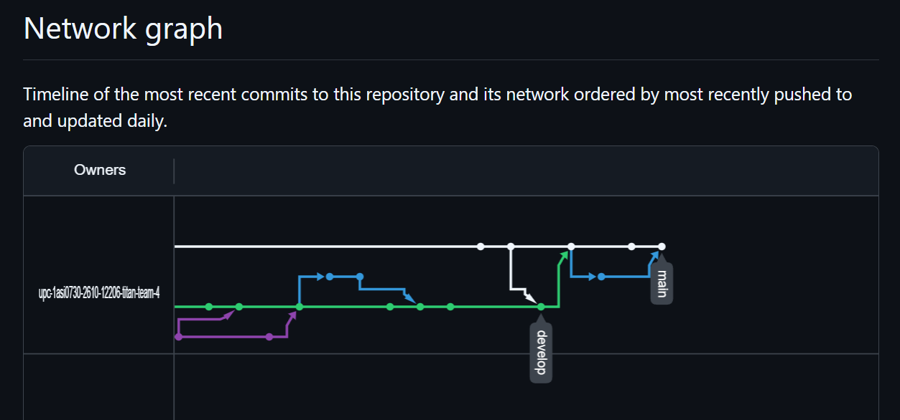

Los siguientes gráficos representan analíticos de commits en el repositorio del informe. En los gráficos se incluye la cantidad de lineas de texto añadidas por cada integrante del equipo.

**AV1**


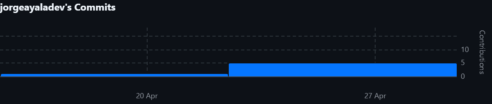

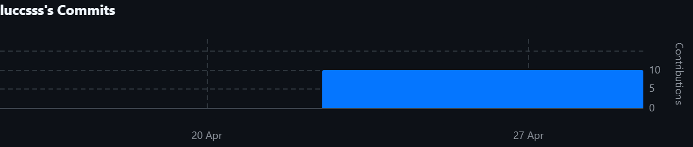


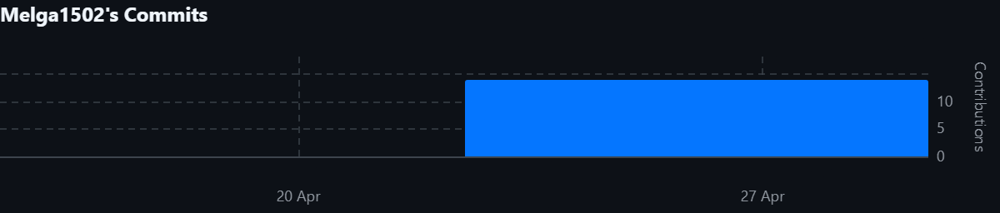


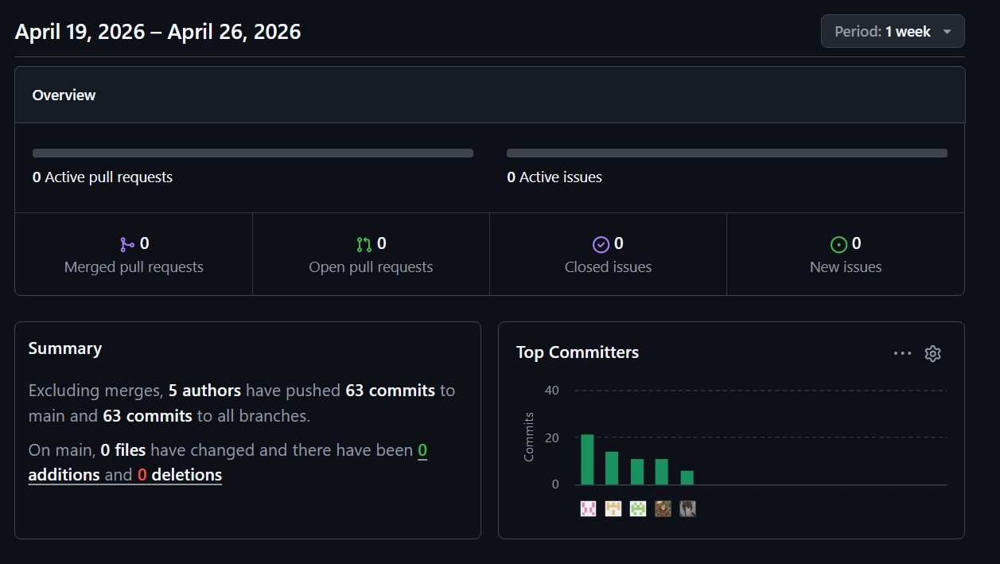

**TB1** 

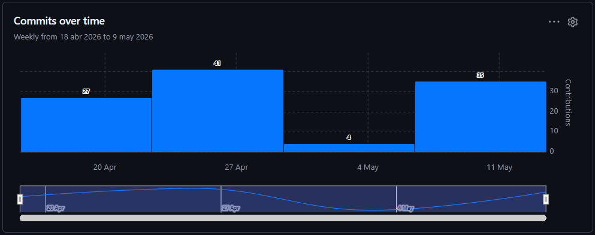


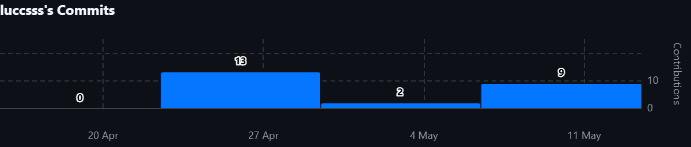


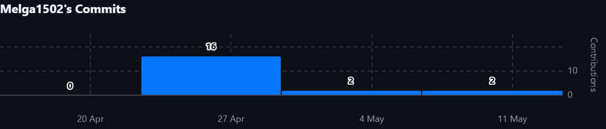

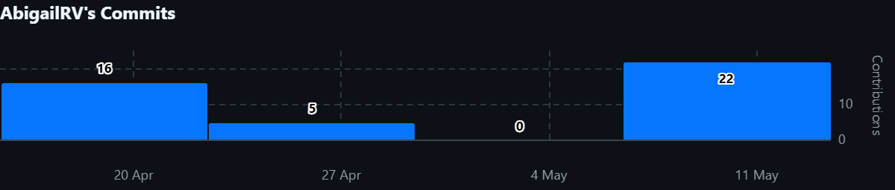


**AV2**

Los siguientes espacios corresponden a las evidencias de colaboración del equipo durante AV2. En esta entrega se debe evidenciar el uso de ramas por funcionalidad, commits distribuidos entre integrantes, integraciones a `develop`, correcciones mediante `hotfix` y la integración final hacia `main`.

**Grafo de commits AV2**


**Commits durante AV2**


**Commits por integrante durante AV2**


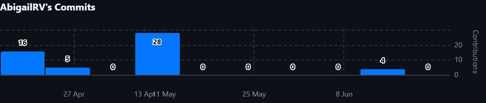

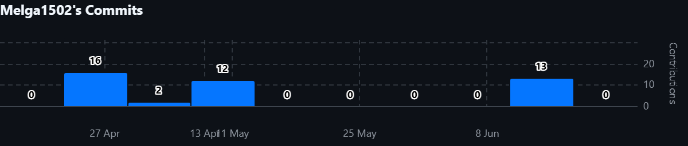

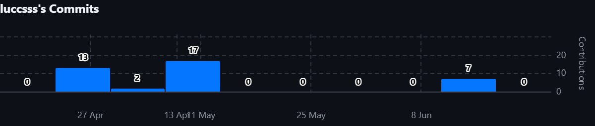


<div style="page-break-before: always;"></div>

<a id="toc-student-outcome"></a>
# Student Outcomes

En esta sección se describe cómo las actividades realizadas durante el desarrollo de AniTec contribuyen al logro del Student Outcome 5 de ABET, relacionado con la capacidad de funcionar efectivamente en un equipo cuyos miembros proporcionan liderazgo, crean un entorno colaborativo e inclusivo, establecen objetivos, planifican tareas y cumplen metas. Para ello, se presentan las acciones realizadas por cada integrante en las distintas entregas del proyecto y las conclusiones grupales asociadas a cada criterio.

| Criterio especifico | Acciones realizadas | Conclusiones |
| - | :- | - |
| Trabaja en equipo para proporcionar liderazgo en forma conjunta | **AV1:**<br>**Josep Melgarejo:** Participe en el desarrollo del Event Storming, los diagramas C4, el diagrama de clases y el diagrama de base de datos, coordinando con mis compañeros decisiones importantes para lograr un trabajo satisfactorio.<br>**Jorge Ayala:** Participe de manera activa en la creacion de la Landing Page de AniTec y en la elaboracion de historias de usuario relacionadas con este primer avance.<br>**Bruno Huaman:** Lidere la fase estrategica mediante la elaboracion del Impact Mapping, conectando los objetivos de negocio con las necesidades de ganaderos y veterinarios.<br>**Abigail Raymundo:** Participe en el desarrollo de los capitulos 1 y 2, principalmente en la definicion del problema, segmentos objetivo y competidores.<br>**Luciana Sanchez:** Participe en la definicion de epicas, historias de usuario y criterios de aceptacion, aportando ideas y coordinando responsabilidades con el equipo.<br><br>**TB1:**<br>**Josep Melgarejo:** Apoye en la coordinacion del equipo para el Sprint 2, facilitando la comunicacion entre integrantes y asegurando el cumplimiento de tareas asignadas.<br>**Jorge Ayala:** Me encargue de una parte importante del frontend, incluyendo el bounded context de Activities, y participe en la documentacion del Sprint 2.<br>**Bruno Huaman:** Realice una evaluacion del documento, especialmente de las historias de usuario, colaborando con el equipo para reordenarlas adecuadamente.<br>**Abigail Raymundo:** Realice la correccion del Capitulo I, colabore en el Capitulo II, participe en la documentacion del Sprint 2 y aporte en uno de los Bounded Context del sistema.<br>**Luciana Sanchez:** Realice la correccion y mejora de los diagramas C4, asegurando consistencia con la arquitectura del sistema y los requerimientos del Sprint 2.<br><br>**AV2:**<br>**Josep Melgarejo:** Lidere la documentacion del Sprint 3, la organizacion de la evidencia de endpoints, migraciones, commits y configuracion de servicios, ademas de apoyar en los modulos de Financial, Analytics y Subscriptions.<br>**Jorge Ayala:** Lidere la configuracion base del backend, el desarrollo del bounded context de IAM y el despliegue del backend en Render, incluyendo autenticacion, usuarios, hashing de contraseñas, generacion de JWT y pruebas iniciales desde Swagger.<br>**Bruno Huaman:** Lidere la implementacion de Livestock y Devices, aportando en endpoints de hatos, animales, dispositivos IoT y metricas asociadas, manteniendo la estructura por bounded contexts definida por el equipo.<br>**Abigail Raymundo:** Lidere la implementacion de Sanitary y Activities, aportando en eventos sanitarios, actividades de granja y seguimiento de informacion relevante para ganaderos y veterinarios.<br>**Luciana Sanchez:** Lidere la implementacion del modulo de Clients, permitiendo representar la relacion entre veterinarios y ganaderos, asi como la consulta de clientes asignados y ganaderos disponibles. | **AV1:**<br>El equipo ejercio liderazgo conjunto al coordinar responsabilidades y tomar decisiones colaborativas, permitiendo organizar el primer entregable y alinear AniTec con las necesidades de los usuarios.<br><br>**TB1:**<br>El equipo consolido un liderazgo colaborativo durante el Sprint 2, mejorando artefactos de diseño e implementando la primera version funcional del frontend.<br><br>**AV2:**<br>Durante el Sprint 3, el liderazgo conjunto se evidencio en la construccion del backend real de AniTec. Cada integrante asumio un bounded context o responsabilidad tecnica clara, y el equipo logro integrar persistencia con MySQL, autenticacion, endpoints REST, documentacion Swagger y despliegue en Render. |
| Crea un entorno colaborativo e inclusivo, establece metas, planifica tareas y cumple objetivos. | **AV1:**<br>**Josep Melgarejo:** Explique al equipo la estructura del Event Storming y los diagramas asignados, ayudando a aclarar ideas y proponer mejoras.<br>**Jorge Ayala:** Comunique los avances realizados en la Landing Page y los commits asociados, permitiendo que el equipo conociera el estado del desarrollo.<br>**Bruno Huaman:** Fomente la lluvia de ideas para definir las historias de usuario del backlog, asegurando que se incluyeran funcionalidades criticas para el producto.<br>**Abigail Raymundo:** Explique los problemas encontrados en los primeros capitulos y ayude a organizar mejor la estructura del documento.<br>**Luciana Sanchez:** Propuse y explique las epicas e historias de usuario necesarias para el proyecto, promoviendo la participacion de todos los integrantes.<br><br>**TB1:**<br>**Josep Melgarejo:** Coordine la asignacion de tareas del Sprint 2, promoviendo la participacion del equipo y el cumplimiento de plazos.<br>**Jorge Ayala:** Participe en la planificacion de tareas del frontend, enfocandome en un bounded context esencial para el funcionamiento del sistema.<br>**Bruno Huaman:** Planifique el bounded context de Financial considerando las necesidades del dominio y su integracion con el resto del frontend.<br>**Abigail Raymundo:** Participe en la revision y correccion de capitulos, documentacion del Sprint 2 y definicion de componentes del sistema.<br>**Luciana Sanchez:** Explique las correcciones necesarias en los diagramas C4, ayudando al equipo a comprender mejor la arquitectura del sistema.<br><br>**AV2:**<br>**Josep Melgarejo:** Organice el trabajo de cierre del Sprint 3 mediante la actualizacion de evidencias, tablas de commits, endpoints implementados y conclusiones del avance.<br>**Jorge Ayala:** Coordino con el equipo la configuracion tecnica del backend y se encargo del despliegue en Render para que la API quedara disponible publicamente desde Swagger.<br>**Bruno Huaman:** Colaboro con el equipo para validar que las entidades ganaderas, dispositivos y metricas mantuvieran coherencia con los datos usados previamente en el frontend.<br>**Abigail Raymundo:** Aporto en la organizacion de tareas relacionadas con sanidad y actividades, asegurando que los endpoints respondieran a necesidades reales del trabajo ganadero.<br>**Luciana Sanchez:** Colaboro en la planificacion del flujo veterinario, definiendo la relacion entre usuarios ganaderos y veterinarios para que el backend soporte el trabajo por clientes asignados. | **AV1:**<br>La planificacion y el trabajo colaborativo permitieron cumplir los objetivos dentro del plazo establecido, manteniendo comunicacion constante y orientacion hacia las necesidades de ganaderos y veterinarios.<br><br>**TB1:**<br>La coordinacion del equipo permitio ejecutar el Sprint 2 de manera eficiente, integrando mejoras en los artefactos del reporte y avanzando en la implementacion del sistema.<br><br>**AV2:**<br>El equipo cumplio el objetivo principal del Sprint 3 al pasar de un frontend con datos mock a una API real desplegada en internet. La planificacion por bounded contexts, el uso de GitHub para integrar ramas y la documentacion de Swagger permitieron mantener un entorno colaborativo, organizado y verificable. |

<div style="page-break-before: always;"></div>

<a id="toc-1-1-startup-profile"></a>
# 1.1. Startup Profile

En esta sección se presenta la descripción del startup y los perfiles de los miembros del equipo.

<a id="toc-1-1-1-descripcion-de-la-startup"></a>
## 1.1.1. Descripción del startup.

Titan es una startup enfocada en brindar soluciones tecnológicas accesibles y efectivas para los pequeños y medianos ganaderos de Latinoamérica. A través de una plataforma web intuitiva, AniTec digitaliza la gestión del ganado mediante una estructura organizada en módulos clave que abarcan toda la operación productiva. Asimismo, la solución considera al segmento veterinario, permitiendo que los profesionales puedan revisar clientes asignados, consultar pacientes, registrar eventos sanitarios y dar seguimiento clínico a los animales atendidos.

La plataforma organiza la vida productiva del ganado en los siguientes módulos clave:

- Gestión integral de animales, incluyendo el registro individual (raza, edad, sexo y estado de salud), así como su listado, búsqueda, filtrado, edición y eliminación.
- Registro y gestión del historial de las visitas médicas por cada animal
- Calendario sanitario (eventos, vacunas, tratamientos)
- Control económico (ingresos, egresos)
- Visualización de reportes y estadísticas, con alertas automáticas según análisis de tendencias del ganado.

Gracias a la integración de datos históricos y actualizados en tiempo real, AniTec permite a los ganaderos tomar decisiones informadas, mejorar la productividad, reducir pérdidas operativas y optimizar el control sanitario del ganado. De esta manera, se transforma la gestión tradicional en una ganadería más inteligente, eficiente y sostenible.

**Misión:** Revolucionar la gestión y trazabilidad del ganado en pequeños y medianos hatos ganaderos de Latinoamérica, mediante una plataforma digital accesible que optimice los procesos productivos, sanitarios y económicos.

**Visión:** AniTec se proyecta como una de las plataformas más destacadas del sector ganadero en el registro y control integral de animales durante los próximos tres años. La startup busca consolidarse como un modelo de negocio sostenible, confiable y orientado a la mejora continua de la productividad rural a través de tecnología simple y efectiva.

<a id="toc-1-1-2-perfiles-de-integrantes-del-equipo"></a>
## 1.1.2. Perfiles de los integrantes del equipo.

<table>
  <tr>
    <td width="30%" align="center">
      
    </td>
    <td width="70%">
      <h3>Luciana Celeste Sanchez Silva</h3>
      <h4>U202215979</h4>
      <p>
        Mi nombre es Luciana Celeste Sanchez Silva, tengo 20 años y vivo en Lima. En la actualidad, me encuentro estudiando el 6to ciclo de la carrera de ingeniería de software en la UPC debido a que desde una edad temprana tuve una fascinación relacionada con el uso de la tecnología y la programación. En mi tiempo libre trato de crecer y expandir mi conocimiento en todas las áreas posibles. De igual forma, me gusta nadar, escuchar música y tocar la guitarra. Me comprometo a colaborar en todo momento con la elaboración de esta startup, y llegar a un trabajo sobresaliente. Mis habilidades son: responsabilidad, resolución de problemas, y disciplina.
      </p>
    </td>
  </tr>

   <tr>
    <td width="30%" align="center">
      
    </td>
    <td width="70%">
      <h3>Josep Eliu Melgarejo Quiroz</h3>
      <h4>u202315165</h4>
      <p>
        Mi nombre es Josep Eliu Melgarejo Quiroz, tengo 21 años y mi lugar de nacimiento es Huaral pero vivo actualmente en Lima - San miguel, me encuentro cursando el 5to ciclo de la carrera de ingenieria de software en la UPC debido a que siempre me fascino el tema tecnologico, y como era un apasionado por lo juegos que luego me conllevaron a conocer el mundo de la programacion decidi estudiar mi carrera. Me comprometo a siempre apoyar y motivar a mis compañeros en hacer el mejor trabajo posible y dar el 100% de capacidad en este trabajo
      </p>
    </td>
  </tr>

   <tr>
    <td width="30%" align="center">
      
    </td>
    <td width="70%">
      <h3>Abigail Nadhim Raymundo Villarroel</h3>
      <h4>U202318001</h4>
      <p>
        Mi nombre es Abigail Nadhim Raymundo Villarroel, tengo 20 años y vivo en Lima. Actualmente estoy cursando el 5° ciclo de Ingeniería de Software, avanzando algunos cursos del ciclo superior. Desde siempre me ha apasionado crear, diseñar y programar para ofrecer soluciones, me gusta aprender constantemente para ampliar mis conocimientos y perfil profesional. Además, me encuentro en el nivel intermedio de inglés y me interesan mucho los idiomas, por lo que también estoy aprendiendo francés y portugués. En mi tiempo libre, disfruto dibujar, bailar y cantar, actividades que me ayudan a mantener mi creatividad y energía. Me comprometo a aportar con responsabilidad y dedicación al equipo, trabajar de manera colaborativa y contribuir a que juntos podamos desarrollar un proyecto sobresaliente. Mis principales habilidades incluyen creatividad, disciplina y trabajo en equipo, cualidades que aplico para lograr resultados efectivos y de calidad.
      </p>
    </td>
  </tr>

   <tr>
    <td width="30%" align="center">
      
    </td>
    <td width="70%">
      <h3>Bruno Aldair Huaman Gallardo</h3>
      <h4>U202117762</h4>
      <p>
        Mi nombre es Bruno Aldair Huaman Gallardo, tengo 21 años y vivo en Lima. Actualmente soy estudiante de Ingeniería de Software, me apasiona transformar ideas en realidades funcionales; desde el diseño de arquitecturas de red hasta la implementación de sistemas inteligentes. Soy una persona que valora el aprendizaje continuo, lo que me ha llevado a dominar herramientas como SQL Server, Node.js y Java, además de mantenerme en constante mejora de mi nivel de inglés para fortalecer mi perfil global. Me distingo por mi autodisciplina y mentalidad analítica, lo que me permite abordar desafíos técnicos con orden y eficiencia. Busco sumar al equipo no solo mis conocimientos en desarrollo, sino también mi compromiso con la calidad y la mejora continua. Soy un convencido de que la tecnología, cuando se maneja con creatividad y rigor, puede optimizar cualquier entorno.
      </p>
    </td>
  </tr>

   <tr>
    <td width="30%" align="center">
      
    </td>
    <td width="70%">
      <h3>Jorge Brayan Ayala Fernandez</h3>
      <h4>U20241C030</h4>
      <p>
        Mi nombre es Jorge Brayan Ayala Fernandez, tengo 20 años y vivo en Lima - Comas. Actualmente estoy cursando el 5to ciclo de la carrera de Ingeniería de Software. Me encanta examinar diversas problemáticas y crear soluciones a los retos que ocurren en el día a día. Me desempeño principalmente en el área de desarrollo web, mobile y desktop en lo cuales tuve experiencia anteriormente trabajando para proyectos relacionados a ello donde se desplegaron aplicaciones a producción satisfaciendo las demandas de los clientes en ese entonces. En cuanto a mis pasatiempos, me encanta salir a hacer todo tipo de deporte, escuchar música, mirar películas, series y programar activamente. En la medida de lo posible aportaré al grupo de manera colaborativa en las diversas tareas que haya para mejorar el producto que estamos creando.
      </p>
    </td>
  </tr>
</table>

<div style="page-break-before: always;"></div>

<a id="toc-1-2-solution-profile"></a>
# 1.2. Solution Profile

<a id="toc-1-2-1-antecedentes-y-problematica"></a>
## 1.2.1. Antecedentes y Problemática.

**Qué (What)**

_¿Cuál es la situación problemática?_

Muchos pequeños y medianos ganaderos no manejan de manera adecuada la información de su ganado. Dependiendo de métodos manuales como cuadernos o hojas sueltas para registrar salud, vacunas, productividad y reproducción, los errores y olvidos son frecuentes, reduciendo la eficiencia. Esta situación limita la trazabilidad, dificulta cumplir con las regulaciones y restringe el acceso a mejores oportunidades de mercado.

**Cuándo (When)**

_¿Cuándo ocurre el problema?_

La problemática se presenta de forma continua a lo largo de todo el ciclo de vida del ganado, desde el nacimiento hasta la venta o comercialización. La ausencia de un control sistemático afecta diariamente la operación del productor.

**Dónde (Where)**

_¿Dónde se manifiesta?_

Se manifiesta principalmente en unidades ganaderas rurales, asociaciones de pequeños productores y negocios ganaderos que todavía tienen baja digitalización. En estos contextos, la información suele estar dispersa entre cuadernos, hojas sueltas, archivos simples o mensajes.

_¿Dónde se origina el problema?_

Principalmente en zonas rurales de América Latina, donde se concentra gran parte de la producción ganadera de pequeña y mediana escala.

**Quién (Who)**

_¿Quiénes participan en la problemática?_

Están involucrados los ganaderos de pequeña y mediana escala, veterinarios que atienden animales de campo, técnicos agropecuarios, asociaciones ganaderas y organismos públicos que promueven la trazabilidad y la formalización del sector.

_¿Quiénes usarán la plataforma?_

Principalmente los ganaderos interesados en mejorar la productividad, control y trazabilidad de sus hatos, así como los veterinarios que necesitan consultar historiales sanitarios, registrar atenciones y hacer seguimiento a sus pacientes.

**Por qué (Why)**

_¿Cuál es la causa principal del problema?_

La falta de herramientas tecnológicas adaptadas al contexto rural, el desconocimiento sobre la relevancia de la trazabilidad y la limitada asistencia técnica han llevado a que muchos productores sigan empleando métodos manuales poco eficientes.

**Cómo (How)**

_¿Cómo se implementará la solución?_

AniTec será una plataforma web accesible desde dispositivos móviles o computadoras, donde los ganaderos podrán registrar los datos de cada animal, recibir alertas sanitarias, gestionar ingresos y gastos, consultar reportes y acceder a contenido educativo de manera intuitiva, sin necesidad de conocimientos técnicos avanzados. Además, los veterinarios podrán revisar clientes asignados, consultar pacientes y registrar eventos sanitarios para mejorar el seguimiento clínico del ganado.

_¿Cómo se logrará una gestión eficiente dentro de la plataforma?_

Mediante un diseño modular, simple y adaptable que permita ingresar y visualizar información clave del ganado. La plataforma contará con secciones para animales, fincas, sanidad, actividades, finanzas, dispositivos IoT, reportes y planes, de modo que el usuario pueda consultar y actualizar sus datos sin depender de registros manuales dispersos.

**Cuánto (How much)**

_¿Cuál es la magnitud del problema?_

Una parte importante de los pequeños y medianos ganaderos todavía carece de sistemas de registro adecuados, lo que puede provocar pérdida de información, baja productividad, incumplimiento de controles sanitarios y dificultades para acceder a mercados más formales.

_¿Qué porcentaje de la industria podría beneficiarse?_

Los ganaderos familiares, asociaciones y veterinarios que trabajan con información dispersa podrían beneficiarse de una solución como AniTec, especialmente en zonas rurales donde la tecnología aún es limitada pero está en expansión.

### Descripción de antecedentes y problemática

A partir del análisis 5W + 2H, se identifica que muchos pequeños y medianos ganaderos continúan gestionando la información de sus animales mediante cuadernos, hojas sueltas, archivos simples o mensajes dispersos. Aunque estos métodos permiten llevar algunos registros básicos, también generan problemas frecuentes como pérdida de información, datos incompletos, dificultad para recordar fechas importantes y poca trazabilidad sobre la salud, reproducción y productividad del ganado.

Esta situación afecta la toma de decisiones del productor, ya que no siempre cuenta con información ordenada y actualizada para actuar frente a enfermedades, vacunaciones, tratamientos, ventas o cambios en la producción. Del mismo modo, los veterinarios y técnicos que apoyan a los ganaderos suelen depender de información incompleta, lo que dificulta el seguimiento sanitario de los animales y puede reducir la efectividad de las recomendaciones o tratamientos.

AniTec busca responder a esta problemática mediante una aplicación web sencilla y accesible, orientada a centralizar la información principal de la gestión ganadera. La solución considera el registro de animales, fincas, eventos sanitarios, actividades importantes, datos financieros, dispositivos IoT y reportes que ayuden al usuario a consultar su información con mayor rapidez y orden. Para el segmento veterinario, la plataforma también permite revisar clientes asignados, consultar animales bajo seguimiento y registrar información sanitaria relevante.

El objetivo principal del proyecto es mejorar la organización y trazabilidad de la información ganadera, reduciendo errores de registro y facilitando el seguimiento sanitario y productivo. Como alcance inicial, el proyecto incluye una landing page informativa y una aplicación web responsive para ganaderos y veterinarios.

Como restricciones del proyecto, la solución debe mantenerse simple de usar, estar alineada con las tecnologías trabajadas en el curso y considerar que parte del público objetivo no tiene alta experiencia usando plataformas digitales. Por ello, AniTec prioriza flujos claros, formularios directos y funcionalidades esenciales antes que procesos complejos de automatización.

<a id="toc-1-2-2-lean-ux-process"></a>
## 1.2.2. Lean UX Process.

<a id="toc-1-2-2-1-lean-ux-problem-statements"></a>
### 1.2.2.1. Lean UX Problem Statements.

**Problem Statement:**

El estado actual de la gestión ganadera para pequeños y medianos productores se ha centrado principalmente en controles manuales, registros en cuadernos y herramientas digitales improvisadas para administrar la información sanitaria, reproductiva y económica del hato.

Lo que los productos y servicios existentes no abordan es la necesidad de contar con una plataforma digital sencilla, accesible y adaptada a productores con recursos limitados, que permita centralizar la información del ganado, automatizar procesos clave y garantizar la trazabilidad sin requerir conocimientos técnicos avanzados.

Nuestro producto, AniTec, abordará esta brecha mediante una plataforma digital intuitiva que permitirá registrar, organizar y supervisar la información del ganado en tiempo real, automatizando recordatorios sanitarios, seguimiento reproductivo y control económico para reducir errores, evitar pérdida de datos y facilitar la toma de decisiones.

Nuestro enfoque inicial será pequeños y medianos ganaderos que actualmente dependen de registros manuales o sistemas poco organizados para gestionar su producción, junto con veterinarios que necesitan consultar información sanitaria y dar seguimiento a los animales de sus clientes.

Sabremos que hemos tenido éxito cuando observemos una reducción en el uso de registros manuales, un aumento en la precisión y frecuencia de los registros ganaderos, una mejora en el cumplimiento de vacunaciones y tratamientos, una mejor consulta de historiales sanitarios por parte de veterinarios y una mayor capacidad de los usuarios para tomar decisiones basadas en datos.

<a id="toc-1-2-2-2-lean-ux-assumptions"></a>
### 1.2.2.2. Lean UX Assumptions.

### **Business Assumptions:**

1. **Creemos que nuestros usuarios necesitan** un método confiable y eficiente para registrar y supervisar la salud, productividad y trazabilidad de su ganado.
2. **Creemos que esta necesidad puede satisfacerse** mediante una plataforma web accesible que permita registrar información clave, generar alertas automáticas y crear reportes útiles para la toma de decisiones.
3. **Creemos que nuestros primeros usuarios serán** pequeños y medianos ganaderos con acceso a teléfono o computadora, así como veterinarios y técnicos agropecuarios que asesoran directamente en el campo.
4. **Creemos que lo más importante para los clientes es** contar con un control ordenado y automatizado del ganado, evitando pérdidas y cumpliendo los requisitos de trazabilidad para mejorar la comercialización.
5. **Creemos que los usuarios también recibirán** alertas sanitarias, reportes económicos, acceso al historial de cada animal y contenido educativo dentro de la plataforma.
6. **Creemos que conseguiremos clientes mediante** alianzas con asociaciones ganaderas, programas de desarrollo rural y campañas digitales dirigidas a regiones con alta actividad ganadera.
7. **Creemos que los ingresos se generarán mediante** un modelo de suscripción mensual con planes ajustados al tamaño del hato, y licencias institucionales para asociaciones y entidades del sector agropecuario.
8. **Creemos que nuestra competencia incluye** aplicaciones genéricas de gestión ganadera, hojas de cálculo y métodos tradicionales de registro manual.
9. **Creemos que nuestra ventaja competitiva radica en** ofrecer una solución adaptada al contexto rural, fácil de usar, con enfoque educativo y diseñada específicamente para pequeños y medianos productores.
10. **Creemos que un riesgo importante es** que algunos ganaderos no adopten fácilmente la tecnología por factores culturales o falta de experiencia digital.
11. **Creemos que lo mitigaremos mediante** capacitaciones virtuales, diseño de interfaz intuitiva, tutoriales paso a paso y el soporte de la “Academia Ganadera”.

### **User Assumptions:**

- **Creemos que** los principales usuarios son pequeños y medianos ganaderos, veterinarios y técnicos agropecuarios que asesoran en campo. Creemos que, en etapas posteriores, la plataforma también podría ser utilizada por asociaciones, cooperativas y entidades públicas vinculadas a sanidad, trazabilidad y formalización del sector.

- **Creemos que** AniTec ayuda a organizar la información del hato, evitando la pérdida de datos importantes y solucionando la falta de seguimiento de vacunas, partos, tratamientos y control económico. Para los veterinarios, ayuda a consultar clientes, revisar pacientes y registrar eventos sanitarios con información más ordenada.Creemos que esto impacta directamente en la rentabilidad del ganadero, en la calidad del seguimiento sanitario y en el cumplimiento de normativas de mercado.

- **Creemos que** los usuarios valoran el registro individual de cada animal (edad, raza, salud, productividad), alertas automáticas, reportes económicos simples, historial completo del hato y contenido educativo práctico. También creemos que los veterinarios valoran el acceso a clientes asignados, pacientes y eventos sanitarios. Creemos que la facilidad de uso es esencial para su adopción en zonas rurales.

- **Creemos que** AniTec se integra en la rutina diaria del ganadero, mejorando la planificación, reduciendo pérdidas, facilitando el cumplimiento de normativas y permitiendo decisiones informadas, lo que aumenta su rentabilidad y calidad de vida. Creemos que se utiliza cada vez que se registra un animal, tratamiento, parto, control de ingresos o productividad, y también para analizar datos históricos para tomar decisiones estratégicas. Creemos que puede usarse desde celular o computadora, tanto en campo como en casa.

- **Creemos que** AniTec debe tener una interfaz intuitiva, amigable y estable, pensada para usuarios con poca experiencia tecnológica. Creemos que debe proteger los datos del ganadero, transmitir confianza y eficiencia, y reflejar cercanía con el contexto rural.

### Feature Assumptions:

**Feature Assumption 01**

**Creemos que** una funcionalidad de registro digital centralizado del ganado permitirá a los pequeños y medianos ganaderos gestionar toda la información sanitaria, reproductiva y económica de sus animales de manera más eficiente.

**Sabremos que esta funcionalidad es valiosa cuando** la mayoría de los usuarios registren y actualicen periódicamente la información de sus animales dentro de la plataforma.

**Feature Assumption 02**

**Creemos que** un sistema de alertas automáticas para vacunaciones, tratamientos y eventos reproductivos ayudará a los ganaderos a recordar actividades importantes y reducir los descuidos en el manejo del hato.

**Sabremos que esta funcionalidad es valiosa cuando** los usuarios atiendan los recordatorios y reporten una disminución en eventos olvidados o registros incompletos.

**Feature Assumption 03**

**Creemos que** un módulo de reportes visuales e historial de cada animal facilitará la interpretación de la información y permitirá tomar mejores decisiones productivas, reproductivas y económicas.

**Sabremos que esta funcionalidad es valiosa cuando** los usuarios consulten frecuentemente los reportes antes de realizar acciones relacionadas con la gestión del ganado.

**Feature Assumption 04**

**Creemos que** un sistema digital con validación de datos reducirá los errores presentes en los registros manuales y mejorará la organización de la información del hato.

**Sabremos que esta funcionalidad es valiosa cuando** disminuyan los registros incompletos, duplicados o inconsistentes respecto al método tradicional.

**Feature Assumption 05**

**Creemos que** un módulo para veterinarios con acceso a clientes, historial clínico y registro de eventos sanitarios facilitará el seguimiento de los animales y mejorará la colaboración con los ganaderos.

**Sabremos que esta funcionalidad es valiosa cuando** los veterinarios utilicen la plataforma como herramienta principal para registrar y consultar la información sanitaria de los animales atendidos.

<a id="toc-1-2-2-3-lean-ux-hypothesis-statements"></a>
### 1.2.2.3. Lean UX Hypothesis Statements.

- **Hypothesis Statement 01:**

  **Creemos que lograremos** una mayor adopción y uso continuo de AniTec

  **Si** los pequeños y medianos ganaderos

  **Obtienen** una forma sencilla y centralizada de registrar digitalmente toda la información de su ganado, incluyendo datos sanitarios, reproductivos y económicos

  **Con** una plataforma integral de gestión ganadera que centralice y organice toda la información del hato.


- **Hypothesis Statement 02:**

  **Creemos que lograremos** mejorar la gestión sanitaria del hato y reducir incidentes prevenibles

  **Si** los pequeños y medianos ganaderos

  **Obtienen** recordatorios oportunos sobre vacunaciones, tratamientos y eventos reproductivos

  **Con** un sistema de alertas y notificaciones automáticas.

- **Hypothesis Statement 03:**

  **Creemos que lograremos** una mejor toma de decisiones y una mayor productividad en las explotaciones ganaderas

  **Si** los pequeños y medianos ganaderos

  **Obtienen** acceso a reportes visuales y al historial completo de cada animal

  **Con** un panel de reportes interactivos y un historial detallado del ganado.


- **Hypothesis Statement 04:**
  
  **Creemos que lograremos** una gestión más organizada y precisa de la información del hato

  **Si** los pequeños y medianos ganaderos

  **Obtienen** una forma confiable de registrar y administrar la información de sus animales sin depender de cuadernos u hojas de cálculo

  **Con** un sistema digital de registro y validación de datos centralizado.


- **Hypothesis Statement 05:**
  
  **Creemos que lograremos** una mejor colaboración entre ganaderos y veterinarios y un seguimiento sanitario más eficiente

  **Si** los veterinarios

  **Obtienen** acceso rápido a los clientes asignados, al historial de los animales y al registro de eventos sanitarios

  **Con** un módulo para veterinarios integrado dentro de la plataforma AniTec.

<a id="toc-1-2-2-4-lean-ux-canvas"></a>
### 1.2.2.4. Lean UX Canvas.

El Lean UX Canvas es una herramienta utilizada en el marco del diseño centrado en el usuario (UX) y la metodología Lean, cuyo objetivo es apoyar la creación y mejora de productos de manera ágil y eficiente. Su propósito principal es proporcionar una estructura organizada que fomente la colaboración entre equipos multidisciplinarios. A continuación, se presenta el Lean UX Canvas elaborado por el equipo utilizando la plataforma digital Mural.

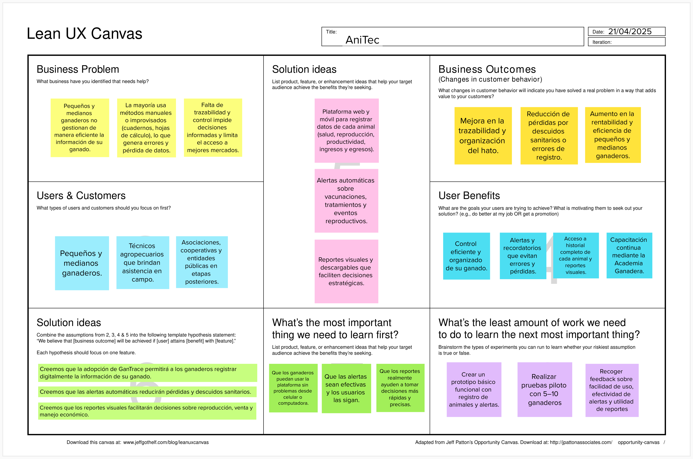
Enlace para acceder al https://app.mural.co/t/abbys5223/m/abbys5223/1776842322847/c87d07f08ed60b5b4bd30ba955608fa8ce7d468a?sender=u5608641741a75560d5d68781

<div style="page-break-before: always;"></div>

<a id="toc-1-3-segmentos-objetivo"></a>
# 1.3. Segmentos objetivo.

De acuerdo con el Ministerio de Desarrollo Agrario y Riego (MIDAGRI, 2023), el Perú cuenta con más de 5 millones de cabezas de ganado vacuno, siendo la ganadería una actividad clave en regiones como Cajamarca, Puno, Cusco y La Libertad. El valor bruto de la producción ganadera supera los 3 mil millones de soles anuales, y más del 65 % de estas unidades son manejadas por pequeños y medianos productores, quienes en muchos casos no disponen de herramientas tecnológicas para una gestión eficiente de sus hatos.

A pesar de los avances en otros sectores agropecuarios, la ganadería peruana todavía depende mayoritariamente de registros manuales para controlar vacunaciones, nacimientos, peso, alimentación y reproducción. Esta falta de sistematización limita la trazabilidad y dificulta la toma de decisiones estratégicas en los negocios ganaderos.

Con la proyección de un aumento del 70 % en la demanda mundial de alimentos para 2050 (FAO, 2021), se hace cada vez más urgente incorporar tecnologías digitales en el sector ganadero. AniTec busca centralizar y automatizar la gestión del ganado mediante una plataforma accesible, capaz de registrar datos en tiempo real y generar indicadores clave de desempeño. Esto permitiría mejorar la rentabilidad y eficiencia de los hatos, así como incrementar la competitividad del país en mercados de exportación de carne y leche.

Entre los posibles usuarios se encuentran:

- **Pequeños y medianos ganaderos:** Productores ubicados principalmente en zonas rurales o semiurbanas, responsables del manejo diario de hatos pequeños o medianos. Suelen registrar información en cuadernos, hojas de cálculo o mensajes, por lo que necesitan digitalizar el control sanitario, reproductivo y económico de sus animales para mejorar productividad y trazabilidad.

- **Veterinarios y técnicos agropecuarios:** Profesionales que atienden a ganaderos, realizan controles sanitarios, registran tratamientos y dan seguimiento a animales bajo observación. Requieren acceso a historiales clínicos, clientes asignados, pacientes y herramientas de monitoreo para optimizar la atención del ganado y mejorar la comunicación con los productores.

<div id='1.3.1.'><h4> 1.3.1 Stakeholders.</h4></div>

- **Stakeholders Internos:** Equipo Titan y resto de integrantes del equipo de desarrollo.
- **Stakeholders Externos:** Técnicos ganaderos, veterinarios y responsables de campo en unidades ganaderas, administradores de cooperativas o asociaciones ganaderas, estudiantes de medicina veterinaria y carreras agropecuarias.

<div style="page-break-before: always;"></div>

<a id="toc-2-1-competidores"></a>
# 2.1. Competidores.

Comprender el entorno competitivo es crucial para el éxito de cualquier negocio. En esta sección realizaremos un análisis profundo de nuestros competidores, tanto directos como indirectos, evaluando las estrategias que aplican, así como sus principales fortalezas y debilidades.

<a id="toc-2-1-1-analisis-competitivo"></a>
## 2.1.1. Análisis competitivo.

Llevar a cabo un análisis competitivo es clave para reconocer oportunidades y riesgos en el mercado, así como para posicionar a AniTec de manera estratégica. Este análisis permite comprender cómo los competidores atienden las necesidades de los clientes, identificar vacíos en el mercado y destacar nuestra solución a través de ventajas diferenciadoras. También facilita la elaboración de estrategias más efectivas de marketing, precios y distribución, garantizando una propuesta de valor sólida y sostenible.

<html>
<body>
    <table >
        <tr>
           <td colspan="6" class="sub">  <h1>Competitive Analysis Landscape</h1></td>
        </tr>
        <tr>
            <td colspan="2" rowspan="2" class="sub">¿Por qué llevar a cabo este análisis?</td>
            <td colspan="4" class="sub"><h3>¿Quiénes son nuestros principales competidores?</h3></td>
        </tr>
        <tr>
            <td colspan="4">Gracias al análisis de la competencia del mercado, se logra comprender el entorno competitivo 
                en el que operará nuestro producto. Ello proporciona una visión detallada de quiénes son nuestros competidores 
                directos e indirectos, permitiendo trazar estrategias a partir de la información recopilada sobre su posicionamiento actual en el mercado.</td>
        </tr>
        <tr>
            <td rowspan="3" class="sub">PERFIL</td>
            <td rowspan="2" class="sub">Overview</td>
            <td> AniTec </td>
            <td> Livestock Manager </td>
            <td> AgriTrack </td>
            <td> FarmLogs </td> 
        </tr>
        <tr>
            <td>Plataforma web diseñada para pequeños y medianos ganaderos y veterinarios en Latinoamérica, enfocada en trazabilidad, gestión sanitaria, monitoreo IoT y educación.</td>
            <td>Aplicación móvil y web para gestión de hatos ganaderos, enfocada en registro sanitario y productividad.</td>
            <td>Plataforma multifuncional para gestión agrícola y ganadera, con módulos de cultivo, inventario y finanzas.</td>
            <td>Herramienta global para gestión agrícola, con funcionalidades básicas de ganadería.</td>      
        </tr>
        <tr>
            <td class="sub">Ventaja Competitiva ¿Qué valor ofrece a los clientes?</td>
            <td>Enfoque en ganadería, trazabilidad individual del hato, seguimiento veterinario y precios accesibles para pequeños y medianos productores.</td>
            <td>Integración con dispositivos IoT. Reportes automatizados para exportación a autoridades sanitarias.</td>
            <td>Versatilidad: integra cultivos y ganado en una sola plataforma. Análisis predictivo basado en clima y mercado.</td>
            <td>Reconocimiento de marca internacional. Integración con mercados globales de commodities.</td>      
        </tr>
        <tr>
            <td rowspan="2" class="sub">PERFIL DEL MARKETING</td>
            <td class="sub" >Mercado Objetivo</td>
            <td>Pequeños y medianos productores ganaderos, veterinarios de campo y técnicos agropecuarios.</td>
            <td>Medianos y grandes ganaderos con acceso a tecnología avanzada.</td>
            <td>Agricultores y ganaderos diversificados en zonas semiurbanas.</td>
            <td>Grandes empresas agroindustriales con enfoque exportador.</td>
        </tr>
        <tr>
            <td class="sub">Estrategias de Marketing</td>
            <td>Alianzas con asociaciones ganaderas y programas gubernamentales. Talleres presenciales en zonas rurales.</td>
            <td>Alianzas con empresas de insumos veterinarios. Publicidad en ferias ganaderas y redes sociales especializadas.</td>
            <td>Contenido educativo en YouTube y webinars. Descuentos por volumen para cooperativas.</td>
            <td>Campañas en medios internacionales (The Economist, Bloomberg). Acuerdos con distribuidores de maquinaria agrícola.</td>
        </tr>
        <tr>
            <td rowspan="3" class="sub">PERFIL DEL PRODUCTO</td>
            <td class="sub">Productos & Servicios</td>
            <td>Plataforma web para gestión de hatos ganaderos, seguimiento sanitario, actividades, finanzas, dispositivos IoT y planes de suscripción.</td>
            <td>Plataforma móvil y web para gestión de hatos ganaderos.</td>
            <td>Plataforma multifuncional para gestión agrícola y ganadera.</td>
            <td>Herramienta global para gestión agrícola y ganadera, con énfasis en mercados formales.</td>
        </tr>
        <tr>
            <td class="sub">Precios & Costos</td>
            <td>Básico: $10/mes. Premium: $25/mes. Empresarial: $50/mes.</td>
            <td>Básico: $20/mes Premium: $100/mes.</td>
            <td>Solo ganado: $15/mes Full agro: $50/mes.</td>
            <td>Básico: $30/mes Empresarial: $200/mes.</td>
        </tr>
        <tr>
            <td class="sub">Canales de distribución (web/móvil)</td>
            <td>Plataforma web, app móvil y colaboración con ONGs rurales.</td>
            <td>Venta directa en su sitio web y app stores.</td>
            <td>Distribución mediante cooperativas agrícolas.</td>
            <td>Venta directa y partners estratégicos en EE.UU. y Europa.</td>        
        </tr>
        <tr>
            <td rowspan="4" class="sub">ANÁLISIS SWOT</td>
            <td class="sub">Fortalezas</td>
            <td>Diseño accesible para baja conectividad. Costos accesibles y planes de acuerdo al tamaño de la finca.</td>
            <td>Tecnología IoT innovadora. Cumplimiento normativo automático.</td>
            <td>Solución integral para agro. Precios accesibles.</td>
            <td>Enfoque en mercados globales. Datos en tiempo real de mercados.</td>
        </tr>
        <tr>
            <td class="sub">Debilidades</td>
            <td>Dependencia de alianzas para distribución. </td>
            <td>Alto costo para pequeños productores. Interfaz compleja para usuarios rurales.</td>
            <td>Funcionalidades ganaderas menos desarrolladas. Falta de enfoque en trazabilidad sanitaria.</td>
            <td>Precios elevados para Latinoamérica. Poca adaptación a necesidades locales.</td>  
        </tr>
        <tr>
            <td class="sub">Oportunidades</td>
            <td>Demanda creciente de trazabilidad en exportaciones. Subsidios gubernamentales para digitalización rural.</td>
            <td>Expansión a mercados formales (exportación). Alianzas con gobiernos para subsidios.</td>
            <td>Crecimiento de la agricultura de precisión. Demanda de análisis predictivo.</td>
            <td>Expansión a Latinoamérica con socios locales. Demanda de trazabilidad para exportación.</td> 
        </tr>
        <tr>
            <td class="sub">Amenazas</td>
            <td>Competidores globales con más recursos. Resistencia a adoptar tecnología en productores tradicionales.</td>
            <td>Competencia con soluciones low-cost. Resistencia al cambio en ganaderos tradicionales.</td>
            <td>Especialización de competidores ganaderos. Saturación de plataformas multifuncionales.</td>
            <td>Competencia de startups regionales. Barreras culturales y idiomáticas.</td>          
        </tr>
    </table>
</body>
</html>

<a id="toc-2-1-2-estrategias-y-tacticas-frente-a-competidores"></a>
## 2.1.2. Estrategias y tácticas frente a competidores.

Entre las principales estrategias y tácticas que ejecutaremos como startup son las siguientes:

Por un lado, estas son las estrategias preliminares:

- Incursión en sectores rurales a través de alianzas con gremios ganaderos de la zona y organizaciones no gubernamentales.
- Capacitación tecnológica gradual mediante material multimedia diseñado para personas con conocimientos digitales limitados.
- Optimización de la asistencia técnica utilizando medios de contacto directos como llamadas telefónicas, WhatsApp y seguimiento veterinario dentro de la plataforma.
- Generación de utilidad inmediata, brindando notificaciones en tiempo real, análisis de datos de valor y funciones sin costo.

Por otro lado, estas son nuestras tácticas específicas:

- Campañas de referidos para incentivar la difusión entre los mismos productores.
- Material educativo y guías de uso para motivar la adopción frecuente de la aplicación.
- Adaptación regional del sistema, empleando modismos locales y asistencia personalizada según la zona.
- Presencia en eventos del sector, tales como ferias del campo y convenciones agropecuarias.
- Acercamiento a veterinarios de campo, estudiantes de medicina veterinaria y técnicos agropecuarios para promover el uso de AniTec como herramienta de seguimiento sanitario.

<div style="page-break-before: always;"></div>

<a id="toc-2-2-entrevistas"></a>
# 2.2. Entrevistas.

Las entrevistas son una herramienta esencial para comprender a fondo a nuestro público objetivo. Para que sean efectivas, deben seguir una estructura clara y directa, utilizando preguntas específicas que permitan recolectar información de valor y datos precisos de los participantes.

<div id='2.2.1.'><h4> 2.2.1. Diseño de entrevistas. </h4></div>

Objetivo: Identificar frustraciones, necesidades, dispositivos disponibles, grado de digitalización y percepción sobre el registro de información ganadera.

<a id="toc-2-2-1-diseno-de-entrevistas"></a>
## 2.2.1. Diseño de entrevistas.

### Segmentos entrevistados:

- Ganaderos

- Veterinarios

Formato: Entrevistas semiestructuradas, de 25-30 minutos, registradas en video con consentimiento.

Preguntas dirigidas al personal de **Ganaderos**.

Preguntas principales:

- ¿Podría indicarnos su nombre completo y su edad?

- ¿Cuánto tiempo lleva dedicado a la ganadería? ¿Qué tipo de ganado maneja actualmente?

- ¿Cuál es el tamaño aproximado de su ganado? ¿Y cuántas personas trabajan en su unidad ganadera?

- ¿Qué herramientas utiliza actualmente para llevar el control de sus animales y sus actividades?

- ¿Lleva algún registro sobre la salud, alimentación o reproducción de su ganado? ¿Cómo lo hace?

- ¿Cuáles son las principales dificultades que enfrenta en la gestión diaria del ganado?

- ¿Cómo monitorea actualmente la productividad y salud de su ganado?

- ¿Qué tan importante considera llevar un control digital del historial veterinario y productivo de cada animal?

- ¿Ha enfrentado problemas por no tener registros claros (por ejemplo, en ventas, enfermedades o reproducción)?

- ¿Confía en herramientas digitales o ha probado alguna aplicación para el manejo ganadero?

- ¿Cuánto tiempo promedio dedica al registro manual de datos (si lo realiza)?

- ¿Qué tipo de información considera más importante tener a la mano sobre su ganado?

- ¿Estaría dispuesto a usar una aplicación móvil/web para llevar el control del ganado si fuera sencilla y funcional?

- ¿Qué funcionalidades le gustaría que tenga esta herramienta (alertas, historial médico, reproductivo, reportes, etc.)?
- ¿Qué beneficios espera al adoptar una herramienta digital para su ganadería?

### Preguntas dirigidas a los **Veterinarios**

Preguntas principales:

- ¿Podría proporcionarnos su nombre completo y su edad?

- ¿Cuánto tiempo lleva ejerciendo como veterinario y en qué región trabaja principalmente?

- ¿Está especializado en atención ganadera? ¿Qué tipo de ganado atiende con más frecuencia?

- ¿Cómo realiza el seguimiento del historial médico de los animales que atiende?

- ¿Utiliza actualmente alguna herramienta digital para llevar registros veterinarios?

- ¿Qué información considera fundamental registrar tras una consulta o intervención (vacunas, tratamientos, diagnóstico)?

- ¿Cómo se comunica con los ganaderos respecto al seguimiento o tratamientos posteriores?

- ¿Con qué frecuencia atiende emergencias ganaderas? ¿Cómo coordina este tipo de intervenciones?

- ¿Ha tenido casos donde la falta de información del animal haya afectado la efectividad del tratamiento?

- ¿Qué retos encuentra en su trabajo relacionado con el registro o gestión de información?

- ¿Le resultaría útil tener acceso al historial médico del animal antes de una consulta?

- ¿Qué tan dispuesto estaría a utilizar una aplicación móvil/web para registrar y acceder al historial de sus pacientes?

- ¿Qué funcionalidades considera clave en una herramienta digital veterinaria (calendario, historial, recordatorios, fichas clínicas)?

- ¿Cómo podría mejorar su trabajo con una solución que conecte a veterinarios con ganaderos en tiempo real?

- ¿Qué tan importante considera el análisis de datos (estadísticas de salud, tratamientos más comunes, etc.) en su labor?

### Preguntas complementarias (para ambos segmentos):

- ¿Qué expectativas tendría sobre una plataforma digital que centralice la información ganadera y veterinaria?

- ¿Qué dispositivos usa con más frecuencia para sus actividades laborales (celular, laptop, tablet)? ¿Está familiarizado con el uso de apps?

- ¿Qué es lo que más valora en una herramienta digital: rapidez, facilidad de uso, seguridad de datos u otro aspecto?

### Preguntas principales (comunes):

1. ¿Cómo lleva actualmente el registro de su ganado (peso, salud, vacunas)?

2. ¿Qué desafíos ha enfrentado por llevar registros manuales?

3. ¿Qué tan cómodo se siente utilizando un celular o computadora?

4. ¿Le sería útil recibir alertas de vacunación o reproducción?

5. ¿Ha perdido información relevante alguna vez?

6. ¿Qué contenido educativo le interesaría tener en una app?

7. ¿Qué canales digitales usa actualmente (WhatsApp, redes sociales, etc.)?

Variables demográficas a recolectar: Edad, género, distrito de residencia, educación, tipo de hacienda, frecuencia de registros, ocupación alterna, herramientas digitales que maneja, tipo de celular, acceso a internet, objetivos personales, frustraciones, marcas preferidas, influencia de técnicos o asociaciones.

<a id="toc-2-2-2-registro-de-entrevistas"></a>
## 2.2.2. Registro de entrevistas.

### Entrevistas al segmento de ganaderos

#### Entrevista 1: Vicente Huamán Alacutte

<div align="center">

| Campo | Información |
|-------|-------------|
| Segmento | Ganadero |
| Nombres y apellidos | Vicente Huamán Alacutte |
| Edad | 62 años |
| Distrito | Canta, Lima |
| Ocupación | Ganadero con más de 30 años de experiencia |
| Tipo de ganado | Ganado vacuno |
| Tamaño aproximado del ganado | 25 cabezas de ganado |
| Inicio de la entrevista | 00:00 |
| Duración | 00:07:43 |
| URL del video | https://upcedupe-my.sharepoint.com/:v:/g/personal/u202117762_upc_edu_pe/IQAU-FMwcUpMQqNyx-1l6AsjAW9l1-P7CpTEPJHtZx_3L2M |

</div>

<div align="center">
    
</div>

**Resumen de la entrevista:**

Vicente Huamán Alacutte es un ganadero adulto con amplia experiencia en la crianza de ganado vacuno. Durante la entrevista explicó que la mayor parte de su gestión todavía se realiza con métodos tradicionales, principalmente un cuaderno físico y algunos registros aislados en Excel. Esta forma de trabajo le permite mantener cierto control diario, pero también genera problemas cuando necesita recordar fechas de vacunación, tratamientos, alimentación o reproducción. El entrevistado señaló que la memoria y el orden del cuaderno no siempre son suficientes, sobre todo cuando se acumulan varias actividades al mismo tiempo.

En cuanto a su personalidad y forma de trabajo, se mostró como una persona práctica, cuidadosa y orientada a la experiencia de campo. Valora más la utilidad real de una herramienta que su apariencia visual. Sus principales influencias provienen de otros ganaderos, técnicos agropecuarios y compradores de ganado, ya que para él la confianza al vender animales depende mucho de poder demostrar que el ganado fue bien cuidado. Respecto a la tecnología, utiliza principalmente celular Android y WhatsApp para comunicarse, aunque no se considera un usuario avanzado. Usa el navegador del celular cuando necesita buscar información puntual, pero prefiere aplicaciones simples y con botones claros.

La entrevista permitió identificar que Vicente estaría dispuesto a usar una plataforma como AniTec si esta facilita el registro de animales, el historial sanitario, las alertas de vacunación y la consulta rápida de información. También destacó que la herramienta debe ser sencilla, con lenguaje directo y adaptada al trabajo rural. Esta información sustenta el arquetipo de ganadero tradicional que necesita digitalizar su gestión sin sentirse obligado a aprender una herramienta compleja.

#### Entrevista 2: Rebeca Noemi Quiroz Roldan

<div align="center">

| Campo | Información |
|-------|-------------|
| Segmento | Ganadera |
| Nombres y apellidos | Rebeca Noemi Quiroz Roldan |
| Edad | 54 años |
| Distrito | Lima |
| Ocupación | Productora ganadera |
| Tipo de ganado | Ganado vacuno |
| Tamaño aproximado del ganado | Hato pequeño familiar |
| Inicio de la entrevista | 00:00 |
| Duración | 00:06:53 |
| URL del video | https://upcedupe-my.sharepoint.com/:v:/g/personal/u202315165_upc_edu_pe/IQC_8-haUlvvTKtz13hlN8A0AViAvdEwyAyAZIs0wpCnLeY?e=b3mVxM&nav=eyJyZWZlcnJhbEluZm8iOnsicmVmZXJyYWxBcHAiOiJTdHJlYW1XZWJBcHAiLCJyZWZlcnJhbFZpZXciOiJTaGFyZURpYWxvZy1MaW5rIiwicmVmZXJyYWxBcHBQbGF0Zm9ybSI6IldlYiIsInJlZmVycmFsTW9kZSI6InZpZXcifX0%3D |

</div>

<div align="center">
    
</div>

**Resumen de la entrevista:**

Rebeca Noemi Quiroz Roldan comentó que su actividad ganadera se enfoca en el cuidado de ganado vacuno y que una de sus mayores preocupaciones aparece cuando se presentan enfermedades como mastitis o cuando los terneros se enferman. Actualmente registra la información mediante cuadernos, apuntes y hojas sueltas. Aunque mencionó que logra manejar su actividad con estos medios, también reconoció que una aplicación podría ayudarle a tener mayor orden y a recordar eventos importantes, como vacunaciones, dosis de medicamentos y controles sanitarios.

En sus respuestas se observa una personalidad responsable y preventiva. Rebeca valora la seguridad y la confianza antes de adoptar una herramienta digital, por lo que una solución como AniTec debe transmitir protección de datos, facilidad de uso y utilidad concreta. Su principal canal de interacción es el celular, especialmente WhatsApp, ya que lo usa para comunicarse con familiares, trabajadores y profesionales que la asesoran. Además, suele apoyarse en un ingeniero o especialista para atender problemas sanitarios del ganado, lo que muestra que sus decisiones están influenciadas por personal técnico de confianza.

Respecto a tecnología, utiliza smartphone y navegación básica desde el celular. No manifestó rechazo hacia las aplicaciones, pero sí dejó claro que no desea una herramienta complicada. Esta entrevista ayuda a justificar funciones como recordatorios, alertas sanitarias, registro simple de enfermedades y acceso rápido a datos importantes. Sus respuestas aportan evidencia para construir un arquetipo de ganadera que tiene disposición a digitalizarse siempre que la plataforma sea segura, clara y útil para resolver problemas reales del manejo diario.

#### Entrevista 3: Porfirio Salazar Rodriguez

<div align="center">

| Campo | Información |
|-------|-------------|
| Segmento | Ganadero |
| Nombres y apellidos | Porfirio Salazar Rodriguez |
| Edad | 65 años |
| Distrito | Comas, Lima |
| Ocupación | Ganadero artesanal |
| Tipo de ganado | Ganado vacuno |
| Tamaño aproximado del ganado | Hato pequeño gestionado con apoyo de 2 a 3 personas |
| Inicio de la entrevista | 00:00 |
| Duración | 00:13:55 |
| URL del video | https://upcedupe-my.sharepoint.com/:v:/g/personal/u20241c030_upc_edu_pe/IQBGB9K9t4xxSLIv1YP6eBZMAeSNzMREmpWxJjIX0MPuCR4?nav=eyJyZWZlcnJhbEluZm8iOnsicmVmZXJyYWxBcHAiOiJPbmVEcml2ZUZvckJ1c2luZXNzIiwicmVmZXJyYWxBcHBQbGF0Zm9ybSI6IldlYiIsInJlZmVycmFsTW9kZSI6InZpZXciLCJyZWZlcnJhbFZpZXciOiJNeUZpbGVzTGlua0NvcHkifX0&e=S6qUbg |

</div>

<div align="center">
    
</div>

**Resumen de la entrevista:**

Porfirio Salazar Rodriguez describió su experiencia dentro de la ganadería artesanal, una actividad que realiza con apoyo de dos o tres personas. Durante la entrevista explicó que no trabaja con una empresa ganadera grande, pero sí tiene el objetivo de formalizar y hacer crecer su actividad para generar mayores ingresos. Sus respuestas muestran que percibe la tecnología como una oportunidad para mejorar la productividad, aunque también señaló que el costo económico puede ser una barrera importante para adoptar una solución digital.

El entrevistado se mostró como una persona emprendedora y prudente. Tiene interés en mejorar, pero evalúa cuidadosamente si una herramienta realmente justifica la inversión. Sus influencias principales provienen de la experiencia familiar, el aprendizaje práctico, otros productores y las oportunidades comerciales que observa en el mercado. En cuanto a marcas o herramientas, no mencionó preferencia por una marca específica de software; sin embargo, sí mostró familiaridad con el uso de celular y comunicación por WhatsApp. Su interacción digital se concentra en el teléfono móvil y en búsquedas simples desde el navegador cuando necesita información relacionada con su actividad.

La entrevista permitió reconocer que Porfirio necesita una solución que no solo registre información, sino que también le ayude a visualizar el valor económico de ordenar su ganadería. Para este perfil, AniTec debe comunicar beneficios concretos como reducción de pérdida de datos, mejor control del ganado, apoyo a la formalización y posibilidad de tomar mejores decisiones. Sus respuestas sustentan el arquetipo de ganadero artesanal con aspiración de crecimiento, sensible al costo, pero dispuesto a adoptar tecnología si percibe un retorno claro.

### Entrevistas al segmento de veterinarios

#### Entrevista 4: Angela Mendoza

<div align="center">

| Campo | Información |
|-------|-------------|
| Segmento | Veterinaria |
| Nombres y apellidos | Angela Mendoza |
| Edad | 24 años |
| Distrito | Camaná, Arequipa |
| Ocupación | Médica veterinaria |
| Zona de trabajo | Sierra sur del Perú |
| Tipo de atención | Atención sanitaria de ganado |
| Inicio de la entrevista | 00:00 |
| Duración | 00:06:55 |
| URL del video | https://upcedupe-my.sharepoint.com/:v:/g/personal/u202215979_upc_edu_pe/IQDfgaIlKdrsRYAp9VQvfR_MAWflO45zpjWnZwgtAt9KBow?e=pHnnWx |

</div>

<div align="center">
    
</div>

**Resumen de la entrevista:**

Angela Mendoza explicó que en su trabajo como veterinaria observa que muchos productores todavía gestionan la información sanitaria con cuadernos físicos, archivos simples de Excel, fotografías y conversaciones de WhatsApp. Esta dispersión de datos afecta el seguimiento de vacunas, tratamientos, diagnósticos y antecedentes clínicos. También mencionó que, en visitas de emergencia o campañas sanitarias, la falta de información ordenada puede retrasar la atención y complicar la toma de decisiones.

Su perfil evidencia una personalidad organizada, técnica y orientada al servicio. Angela valora la rapidez, la trazabilidad y la claridad de la información porque su trabajo depende de revisar antecedentes antes de indicar tratamientos. Sus canales principales de interacción son WhatsApp, llamadas telefónicas y archivos digitales básicos que comparte con productores. Usa smartphone y laptop para su labor diaria, y se siente cómoda navegando en Google Chrome o usando herramientas web cuando necesita consultar información técnica. Sus influencias profesionales provienen de su formación veterinaria, colegas del sector, campañas sanitarias y necesidades reales observadas en campo.

La entrevistada considera que una herramienta como AniTec sería útil si permite centralizar el historial clínico de cada animal, registrar tratamientos, programar seguimientos y mejorar la comunicación con los ganaderos. Sin embargo, remarcó que la plataforma debe ser rápida y fácil de usar, porque el trabajo veterinario de campo no permite perder tiempo en procesos largos. Esta entrevista aporta evidencia para el arquetipo de veterinaria joven que usa tecnología, pero necesita una solución enfocada en eficiencia clínica y coordinación con productores.

#### Entrevista 5: Aldahir Arturo Santos Medina

<div align="center">

| Campo | Información |
|-------|-------------|
| Segmento | Veterinario |
| Nombres y apellidos | Aldahir Arturo Santos Medina |
| Edad | 27 años |
| Distrito | Ventanilla, Lima |
| Ocupación | Médico veterinario |
| Zona de trabajo | Selva central del Perú |
| Tipo de atención | Atención clínica y sanitaria de ganado |
| Inicio de la entrevista | 00:00 |
| Duración | 00:08:09 |
| URL del video | https://upcedupe-my.sharepoint.com/:v:/g/personal/u202318001_upc_edu_pe/IQDOnRpzZINmRpVNnHMoBaTkAX_PDnT76W11xtMZH3wIXTk?e=KdBhPi |

</div>

<div align="center">
    
</div>

**Resumen de la entrevista:**

Aldahir Arturo Santos Medina comentó que una dificultad frecuente en la atención veterinaria ganadera es encontrar información incompleta o inexistente sobre los animales. Explicó que, cuando se incorporan nuevos animales sin historial médico previo, el veterinario debe tomar decisiones con datos limitados, lo que puede afectar la planificación de tratamientos, vacunaciones y seguimientos. También señaló que muchos registros se manejan en cuadernos, notas, Excel o conversaciones de WhatsApp, por lo que no siempre existe una fuente única y confiable.

El entrevistado mostró una personalidad analítica, práctica y orientada a la solución de problemas. Valora contar con datos antes de intervenir y considera importante que el productor pueda compartir información de manera rápida. Sus canales de trabajo más frecuentes son WhatsApp, llamadas, hojas de cálculo y documentos enviados por celular. Utiliza smartphone y laptop, además de navegador web para consultar información técnica o coordinar actividades. Sus influencias provienen de la experiencia clínica, colegas veterinarios, productores de campo y casos donde la falta de trazabilidad sanitaria afectó el seguimiento de los animales.

Según sus respuestas, AniTec podría aportar valor si permite acceder al historial sanitario del animal, registrar diagnósticos y tratamientos, programar próximas visitas y mantener comunicación clara con el ganadero. También resaltó que la herramienta debe ser intuitiva, rápida y adaptada al contexto de campo, donde puede haber conectividad limitada. La entrevista refuerza el arquetipo de veterinario de campo que ya usa herramientas digitales básicas, pero necesita una plataforma integrada para reducir errores, evitar pérdida de información y mejorar la continuidad del tratamiento.

<a id="toc-2-2-3-analisis-de-entrevistas"></a>
## 2.2.3. Análisis de entrevistas.

### Análisis del segmento de Ganaderos

Para el segmento de ganaderos se analizaron 3 entrevistas: Vicente Huamán Alacutte, Rebeca Noemi Quiroz Roldan y Porfirio Salazar Rodriguez. La muestra evidencia un perfil de productores con experiencia práctica, uso frecuente de métodos tradicionales y apertura moderada hacia herramientas digitales siempre que sean simples, útiles y accesibles.

<div align="center">

| Característica identificada | Resultado estadístico | Sustento en entrevistas | Relación con el arquetipo |
|-----------------------------|----------------------|-------------------------|---------------------------|
| Edad adulta y experiencia en ganadería | 3 de 3 entrevistados (100%) tienen entre 54 y 65 años y experiencia directa en actividades ganaderas. | Vicente tiene 62 años y más de 30 años de experiencia; Rebeca tiene 54 años y gestiona ganado vacuno; Porfirio tiene 65 años y trabaja en ganadería artesanal. | El arquetipo debe representar a un usuario con conocimiento práctico del campo, pero no necesariamente familiarizado con sistemas digitales complejos. |
| Uso de registros manuales | 3 de 3 entrevistados (100%) usan cuadernos, apuntes, hojas o registros básicos para controlar información del ganado. | Vicente usa cuaderno físico y Excel; Rebeca usa cuadernos y hojas sueltas; Porfirio trabaja con una gestión artesanal y poco digitalizada. | AniTec debe priorizar registro rápido, ordenado y fácil de consultar para reemplazar gradualmente el control manual. |
| Necesidad de controlar salud y tratamientos | 2 de 3 entrevistados (66.7%) mencionan directamente problemas relacionados con enfermedades, tratamientos o control sanitario. | Vicente menciona control de enfermedades y vacunación; Rebeca menciona mastitis, terneros enfermos y dosis de medicamentos. | El arquetipo necesita alertas sanitarias, historial médico y recordatorios de vacunación o tratamiento. |
| Uso del celular como canal principal | 3 de 3 entrevistados (100%) muestran familiaridad básica con el celular como medio de comunicación o consulta. | Vicente usa celular y WhatsApp; Rebeca usa principalmente su celular; Porfirio utiliza celular y comunicación por WhatsApp. | La solución debe funcionar bien en pantallas pequeñas y permitir una interacción directa desde dispositivos móviles. |
| Interés en adoptar tecnología | 3 de 3 entrevistados (100%) reconocen que la tecnología podría ayudar a mejorar su gestión. | Vicente afirma que la tecnología puede profesionalizar el sector; Rebeca estaría dispuesta a usar una aplicación; Porfirio considera que la tecnología podría mejorar su productividad. | El arquetipo no rechaza la tecnología, pero necesita percibir un beneficio claro antes de usarla. |
| Necesidad de simplicidad | 3 de 3 entrevistados (100%) requieren que la herramienta sea sencilla, clara o fácil de justificar en el trabajo diario. | Vicente pide una app sencilla para el hombre de campo; Rebeca no desea una herramienta complicada; Porfirio evalúa si el beneficio justifica la inversión. | La interfaz debe usar lenguaje simple, formularios directos y pocos pasos para completar tareas. |
| Influencia de terceros en decisiones | 3 de 3 entrevistados (100%) dependen o se ven influenciados por otras personas del entorno ganadero. | Vicente considera compradores y técnicos; Rebeca se apoya en un especialista; Porfirio aprende de experiencia familiar y otros productores. | El arquetipo toma decisiones con apoyo de redes de confianza, por lo que la app debe transmitir seguridad y utilidad comprobable. |
| Sensibilidad al costo | 1 de 3 entrevistados (33.3%) menciona directamente el costo como barrera. | Porfirio indica que necesitaría capital suficiente para pagar una solución digital. | El modelo de adopción debe considerar planes accesibles, prueba gratuita o beneficios económicos visibles. |

</div>

En conjunto, el análisis muestra que el ganadero objetivo de AniTec es un usuario con experiencia práctica y responsabilidad directa sobre el cuidado del ganado, pero con procesos todavía manuales. La característica más fuerte del segmento es la necesidad de orden y recordatorios, ya que el 100% de entrevistados depende de registros tradicionales y el 66.7% menciona problemas sanitarios específicos. También se observa una oportunidad clara para una solución móvil, debido a que el 100% usa el celular como canal principal o familiar.

Desde el punto de vista subjetivo, los ganaderos entrevistados valoran la confianza, la utilidad concreta, la seguridad de la información y la facilidad de uso. Estas características provienen directamente de los resúmenes: Vicente prioriza una herramienta simple para el campo, Rebeca valora la seguridad y Porfirio evalúa el beneficio frente al costo. Por ello, el arquetipo de ganadero debe construirse como una persona práctica, cuidadosa, sensible al esfuerzo de aprendizaje y dispuesta a digitalizarse si la solución demuestra valor real.

### Análisis del segmento de Veterinarios

Para el segmento de veterinarios se analizaron 2 entrevistas: Angela Mendoza y Aldahir Arturo Santos Medina. La muestra evidencia un perfil profesional joven, con experiencia en atención de campo, necesidad de información clínica ordenada y uso de herramientas digitales básicas para comunicarse con productores.

<div align="center">

| Característica identificada | Resultado estadístico | Sustento en entrevistas | Relación con el arquetipo |
|-----------------------------|----------------------|-------------------------|---------------------------|
| Profesionales jóvenes | 2 de 2 entrevistados (100%) tienen entre 24 y 27 años. | Angela tiene 24 años; Aldahir tiene 27 años. | El arquetipo puede representarse como un veterinario joven, con mayor disposición a usar herramientas digitales. |
| Trabajo en campo o zonas descentralizadas | 2 de 2 entrevistados (100%) trabajan o han trabajado en zonas fuera del entorno urbano principal. | Angela trabaja en la sierra sur; Aldahir tiene experiencia en la selva central. | La solución debe considerar rapidez, movilidad y uso en contextos con posible conectividad limitada. |
| Problemas por registros incompletos o dispersos | 2 de 2 entrevistados (100%) mencionan información sanitaria desordenada o incompleta. | Angela menciona cuadernos, Excel, fotos y WhatsApp; Aldahir menciona cuadernos, notas, Excel y conversaciones de WhatsApp. | El arquetipo necesita acceso centralizado al historial clínico y sanitario de los animales. |
| Uso de WhatsApp y herramientas digitales básicas | 2 de 2 entrevistados (100%) usan canales digitales simples para comunicarse o complementar su trabajo. | Angela usa WhatsApp, llamadas y archivos digitales; Aldahir usa WhatsApp, llamadas, hojas de cálculo y documentos enviados por celular. | AniTec debe integrarse al flujo real del veterinario y reducir la dependencia de información dispersa. |
| Necesidad de historial clínico previo | 2 de 2 entrevistados (100%) señalan que conocer antecedentes mejora la atención. | Angela necesita revisar antecedentes antes de tratamientos; Aldahir indica que animales sin historial dificultan decisiones clínicas. | El arquetipo requiere fichas clínicas, historial sanitario y acceso rápido a tratamientos previos. |
| Valoración de rapidez y facilidad de uso | 2 de 2 entrevistados (100%) indican que la herramienta debe ser rápida, intuitiva y adaptada al campo. | Angela remarca que no puede perder tiempo en procesos largos; Aldahir pide una herramienta intuitiva y rápida. | La interfaz veterinaria debe permitir registrar atenciones con pocos pasos y consultar datos al instante. |
| Necesidad de mejorar comunicación con ganaderos | 2 de 2 entrevistados (100%) consideran importante coordinar mejor con productores. | Angela menciona mejorar comunicación con ganaderos; Aldahir resalta que el productor debe compartir información rápidamente. | El arquetipo necesita funciones de seguimiento, coordinación y comunicación clara con el productor. |
| Actitud favorable hacia herramientas tecnológicas | 2 de 2 entrevistados (100%) muestran apertura a soluciones digitales para mejorar su trabajo. | Angela considera útil centralizar historial y seguimiento; Aldahir ve valor en registrar diagnósticos, tratamientos y próximas visitas. | El arquetipo es un usuario con mayor predisposición digital que el ganadero, pero exige eficiencia profesional. |

</div>

El análisis del segmento veterinario muestra que las principales necesidades están relacionadas con trazabilidad clínica, acceso rápido a información y coordinación con productores. El 100% de los entrevistados menciona problemas por información dispersa y el 100% considera importante contar con antecedentes del animal antes o durante la atención. Esto evidencia que el arquetipo veterinario debe estar construido alrededor de la toma de decisiones clínicas, el seguimiento sanitario y la necesidad de reducir incertidumbre durante el trabajo de campo.

En cuanto a características subjetivas, ambos veterinarios se muestran más familiarizados con la tecnología que el segmento ganadero. Angela representa un perfil organizado, técnico y orientado al servicio, mientras que Aldahir muestra un perfil analítico y práctico. Ambos valoran la rapidez, la trazabilidad y la utilidad real. Por ello, el arquetipo de veterinario debe representar a un profesional joven, móvil, acostumbrado a usar herramientas digitales básicas, pero que necesita una plataforma más integrada para evitar pérdida de información y mejorar la continuidad de tratamientos.

<div style="page-break-before: always;"></div>

<a id="toc-2-3-needfinding"></a>
# 2.3. Needfinding.

En esta sección se presentarán los artefactos resultantes del proceso de análisis de la información recolectada de los segmentos objetivos. Aquí se incluyen secciones para User Personas, User Task Matrix, User Journey Maps, Empathy Mapping y As-is Scenario Mapping.

<a id="toc-2-3-1-user-personas"></a>
## 2.3.1. User Personas.

A continuación, se presentan los User Personas diseñados para representar a los segmentos objetivo identificados durante la fase de investigación. Estos arquetipos detallan variables demográficas, rasgos psicográficos, motivaciones y comportamientos, así como los pains (frustraciones) y gains (objetivos) que enfrentan en su gestión diaria. Asimismo, se analiza su nivel digital y su interacción con soluciones tecnológicas del sector agropecuario. Toda la información ha sido sintetizada a partir de los insights recolectados en las entrevistas y estructurada mediante la plataforma UXPressia para garantizar una representación fiel de las necesidades del usuario.

### User Persona: Ganaderos

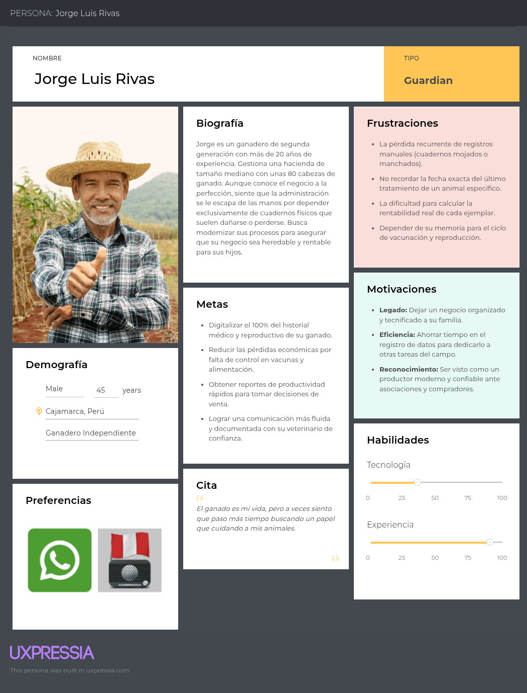

### User Persona: Veterinarios


<a id="toc-2-3-2-user-task-matrix"></a>
## 2.3.2. User Task Matrix.

A través de la User Task Matrix, es posible identificar y organizar las principales actividades que los usuarios realizan actualmente dentro de su contexto de trabajo. Al categorizar estas tareas según su frecuencia e importancia, se logra comprender cuáles representan mayores dificultades y necesidades para cada perfil de usuario, permitiendo detectar oportunidades de mejora en la gestión ganadera y veterinaria.

| **User Task**                                                                          | **Jorge Luis Rivas (Frecuencia)** | **Jorge Luis Rivas (Importancia)** | **Valeria Mendoza (Frecuencia)** | **Valeria Mendoza (Importancia)** |
| -------------------------------------------------------------------------------------- | ---------------------------- | ----------------------------- | -------------------------------- | --------------------------------- |
| Anotar el nacimiento o compra de un nuevo animal en cuadernos físicos                  | Sometimes                    | High                          | Rarely                           | Medium                            |
| Registrar manualmente vacunas y tratamientos del ganado                                | Often                        | High                          | Always                           | High                              |
| Revisar fechas de vacunación en notas, calendarios o cuadernos                         | Often                        | High                          | Often                            | High                              |
| Recordar manualmente vacunas o controles pendientes                                    | Sometimes                    | High                          | Sometimes                        | High                              |
| Anotar peso y crecimiento del ganado durante controles                                 | Often                        | Medium                        | Often                            | Medium                            |
| Revisar manualmente información sobre productividad y rendimiento                      | Sometimes                    | Medium                        | Often                            | Medium                            |
| Compartir documentos físicos o fotografías de registros con asociaciones o compradores | Rarely                       | Medium                        | Rarely                           | Low                               |
| Buscar información o capacitaciones ganaderas en internet y redes sociales             | Sometimes                    | Low                           | Sometimes                        | Medium                            |
| Llevar el control reproductivo mediante anotaciones manuales                           | Rarely                       | Medium                        | Rarely                           | Medium                            |
| Buscar antecedentes médicos y sanitarios en cuadernos o archivos físicos               | Sometimes                    | High                          | Sometimes                        | High                              |

La User Task Matrix evidencia que tanto Jorge Luis como Valeria realizan constantemente actividades relacionadas con el control sanitario y el seguimiento del ganado. Mientras Jorge Luis depende principalmente de registros físicos y de su memoria para organizar la información de sus animales, Valeria necesita acceder rápidamente a datos precisos durante sus visitas de campo y procedimientos veterinarios. Asimismo, ambos perfiles presentan dificultades relacionadas con la organización, trazabilidad y acceso oportuno a la información, especialmente en procesos de vacunación, historial clínico y monitoreo del ganado. Estas tareas permiten comprender mejor el contexto actual de los usuarios e identificar necesidades reales dentro del entorno ganadero y veterinario.

<a id="toc-2-3-3-user-journey-mapping"></a>
## 2.3.3. User Journey Mapping.

En este apartado se describe de manera detallada el recorrido y la experiencia actual de los usuarios dentro de su contexto de trabajo cotidiano, enfocándose específicamente en los dos perfiles clave identificados: productores ganaderos y médicos veterinarios. A través de los User Journey Maps As-Is, se analizan las actividades, emociones, problemas y necesidades que experimentan los usuarios durante la gestión y seguimiento del ganado, sin considerar aún la existencia de una solución tecnológica implementada.

El mapeo de este recorrido inicia desde las primeras dificultades relacionadas con la organización y acceso a la información, avanzando a través de las tareas diarias de registro, seguimiento sanitario y búsqueda de antecedentes médicos. Asimismo, se identifican los principales puntos de contacto, canales utilizados y frustraciones presentes en el proceso actual, permitiendo comprender de forma integral cómo los usuarios realizan actualmente sus actividades y cuáles son las oportunidades de mejora dentro del entorno ganadero y veterinario.

User Ganadero:

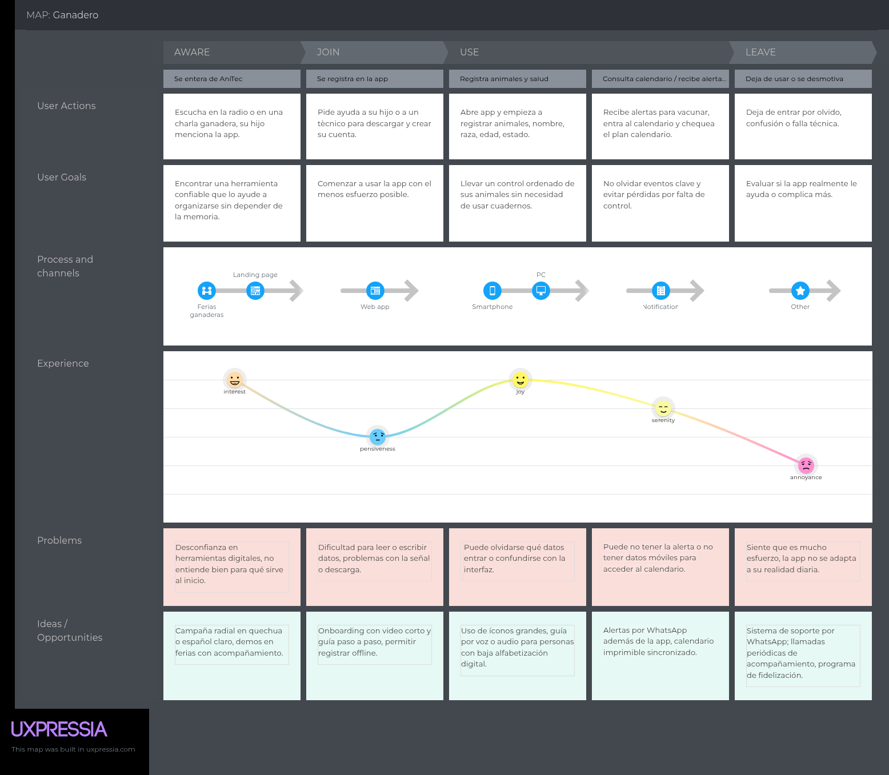

User Veterinario:

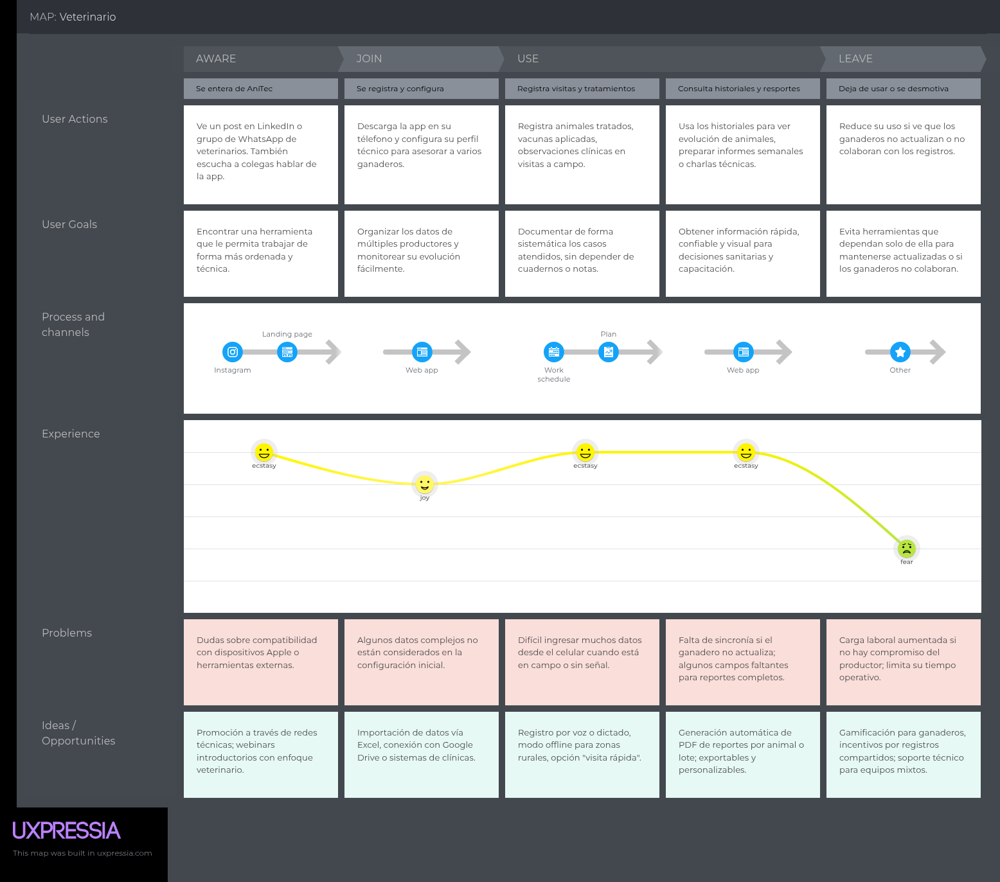

<a id="toc-2-3-4-empathy-mapping"></a>
## 2.3.4. Empathy Mapping.

En esta sección se presenta el proceso de elaboración de los Empathy Maps correspondientes a los User Personas identificados para el proyecto: el productor ganadero y la médica veterinaria. Para el desarrollo de estos mapas de empatía, el equipo analizó la información obtenida durante la etapa de investigación y needfinding, considerando las necesidades, comportamientos, preocupaciones y motivaciones de cada perfil dentro de su contexto laboral cotidiano.

El proceso de elaboración inició colocando al User Persona en el centro del análisis, permitiendo identificar de manera estructurada qué piensa, siente, observa, escucha, dice y hace cada usuario en relación con la gestión sanitaria y administrativa del ganado. Asimismo, se identificaron los principales esfuerzos (Pains) y ganancias (Gains) presentes en sus actividades diarias, con el objetivo de comprender mejor sus frustraciones, expectativas y oportunidades de mejora dentro del entorno ganadero y veterinario.

Los Empathy Maps permitieron visualizar de forma más profunda la experiencia actual de los usuarios, evidenciando problemáticas relacionadas con la organización de información, trazabilidad sanitaria, dependencia de registros físicos y dificultades en la comunicación y acceso a datos confiables.

User Ganadero:

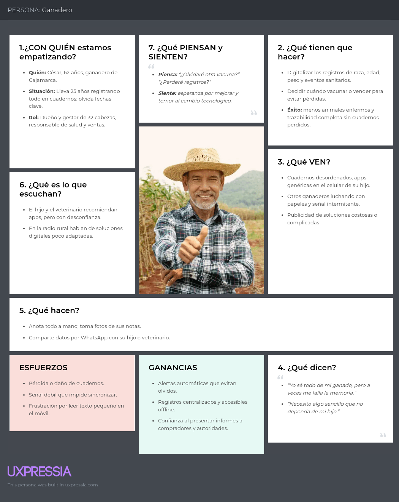

User Veterinario:


<a id="toc-2-3-5-as-is-scenario-mapping"></a>
## 2.3.5. As-is Scenario Mapping.

El As-is Scenario Mapping permite representar cómo los usuarios realizan actualmente sus actividades antes de utilizar AniTec. Este análisis se construye a partir de las entrevistas, los User Personas, el User Task Matrix, los User Journey Maps y los Empathy Maps. Su objetivo es identificar acciones, pensamientos, emociones y oportunidades de mejora dentro del flujo actual de trabajo de cada segmento.

### As-is Scenario Mapping: Ganadero

**User Persona:** Jorge Luis Rivas  
**Escenario:** Registro y seguimiento manual de información sanitaria y productiva del ganado.

| Etapa | Actividades actuales | Pensamientos del usuario | Emociones | Pain points | Oportunidades para AniTec |
|-------|----------------------|--------------------------|-----------|-------------|---------------------------|
| Inicio del día de trabajo | Revisa mentalmente las actividades pendientes y consulta apuntes o cuadernos físicos. | "Debo recordar qué animal necesita revisión o vacuna." | Preocupación y responsabilidad. | Depende de la memoria y de registros físicos que pueden perderse. | Mostrar actividades pendientes, recordatorios y resumen del hato. |
| Registro de información | Anota nacimientos, tratamientos, peso o cambios del animal en cuadernos u hojas sueltas. | "Luego ordenaré esta información cuando tenga tiempo." | Cansancio y sensación de desorden. | Los datos quedan incompletos, duplicados o difíciles de encontrar. | Permitir registrar animales, eventos sanitarios y actividades desde formularios simples. |
| Consulta de historial | Busca información anterior entre cuadernos, mensajes o fotografías. | "No sé exactamente dónde anoté el último tratamiento." | Frustración e incertidumbre. | La búsqueda toma tiempo y puede afectar decisiones sanitarias o comerciales. | Centralizar historial del animal, eventos sanitarios y datos productivos. |
| Coordinación con veterinario o técnico | Comparte información por WhatsApp, llamada o fotografías del cuaderno. | "Necesito explicarle rápido lo que pasó con el animal." | Urgencia y dependencia de terceros. | La información enviada puede estar incompleta o poco clara. | Facilitar el acceso a información ordenada para el seguimiento veterinario. |
| Toma de decisiones | Decide tratamientos, ventas o controles futuros con información parcial. | "Podría tomar una mejor decisión si tuviera todo ordenado." | Duda y necesidad de confianza. | La falta de trazabilidad reduce la seguridad de las decisiones. | Generar reportes, indicadores básicos y consultas rápidas por animal o hato. |

### As-is Scenario Mapping: Veterinario

**User Persona:** Valeria Mendoza  
**Escenario:** Atención sanitaria de animales sin historial clínico centralizado.

| Etapa | Actividades actuales | Pensamientos del usuario | Emociones | Pain points | Oportunidades para AniTec |
|-------|----------------------|--------------------------|-----------|-------------|---------------------------|
| Recepción del caso | Recibe información del ganadero mediante llamada, WhatsApp o comentarios durante la visita. | "Necesito saber qué le ocurrió antes al animal." | Atención y presión por responder rápido. | La información inicial puede ser incompleta o poco precisa. | Mostrar clientes asignados, animales y antecedentes sanitarios. |
| Revisión de antecedentes | Solicita cuadernos, fotos, archivos o mensajes anteriores para reconstruir el historial. | "Sin historial, el diagnóstico puede ser menos preciso." | Frustración y cautela profesional. | Se pierde tiempo buscando datos dispersos. | Centralizar historial sanitario, tratamientos y eventos clínicos. |
| Evaluación del animal | Realiza diagnóstico o control con la información disponible en campo. | "Debo tomar una decisión con los datos que tengo." | Concentración y responsabilidad. | La falta de trazabilidad puede limitar la calidad del seguimiento. | Permitir consultar fichas de animales y eventos anteriores desde el dashboard veterinario. |
| Registro de atención | Anota diagnóstico, tratamiento o recomendación en notas, Excel o mensajes al productor. | "Debo dejar constancia para la próxima visita." | Necesidad de orden. | Las notas pueden perderse o no estar disponibles para futuras consultas. | Registrar eventos sanitarios y actividades de seguimiento en la plataforma. |
| Seguimiento posterior | Coordina próximas visitas o controles mediante mensajes y recordatorios personales. | "Tengo que recordar qué cliente necesita seguimiento." | Carga mental y preocupación. | No existe una vista centralizada de pacientes o controles pendientes. | Organizar clientes, pacientes, actividades y alertas sanitarias básicas. |

<div style="page-break-before: always;"></div>

<a id="toc-2-4-big-picture-eventstorming"></a>
# 2.4. Big Picture EventStorming.

El presente Big Picture Event Storming se ha desarrollado de manera colaborativa utilizando la plataforma Miro, siguiendo la metodología de Philippe Bourgau para explorar el dominio del negocio de forma holística y establecer un entendimiento compartido. A través de un proceso iterativo en este entorno digital, que incluyó la generación de eventos de dominio, el ordenamiento cronológico y la identificación de puntos críticos dentro de los procesos, se ha logrado mapear la complejidad del sector ganadero en una narrativa visual coherente. Este artefacto no solo permitió identificar riesgos y oportunidades de mejora en la gestión de AniTec, sino que también sentó las bases para la comprensión del dominio y el diseño posterior de la arquitectura del sistema alineada con la realidad operativa de los ganaderos y veterinarios.

**Paso 1:** Unstructured Exploration (Exploración no estructurada) consiste en una lluvia de ideas colaborativa donde los participantes identifican y registran domain events, que son sucesos relevantes ocurridos dentro del negocio. Estos eventos deben redactarse obligatoriamente en tiempo pasado (por ejemplo, "Livestock registered") y se colocan en notas adhesivas de color naranja sobre la superficie de modelado. En esta etapa inicial, se prioriza el descubrimiento de conceptos y procesos importantes del dominio sobre el orden o la jerarquía, permitiendo identificar eventos relacionados con la autenticación de usuarios, gestión de ganado, procesos sanitarios, operaciones financieras, generación de reportes y envío de notificaciones.


**Paso 2:** Timelines, los participantes revisan los eventos de dominio generados y los organizan cronológicamente para reflejar la secuencia real de los procesos empresariales. La construcción inicia organizando el flujo principal del negocio y posteriormente incorporando relaciones, ramificaciones y dependencias entre eventos. Este paso permitió construir una narrativa visual coherente del comportamiento del sistema AniTec, facilitando la identificación de secuencias operativas, conexiones entre procesos y posibles inconsistencias dentro del dominio.

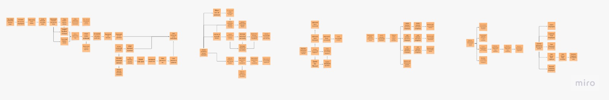

**Paso 3:** Pain Points, los participantes utilizan la línea de tiempo recién organizada para identificar los puntos críticos, riesgos o ineficiencias presentes dentro de los procesos modelados. Estos problemas se representan mediante notas adhesivas rosadas colocadas cerca de los eventos relacionados, permitiendo visualizar dificultades operativas y oportunidades de mejora dentro del sistema. Entre los principales pain points identificados destacan posibles fallos de autenticación, registros duplicados de ganado, detección tardía de enfermedades, inconsistencias presupuestarias y fallos en la entrega de notificaciones. La identificación explícita de estas debilidades permitió comprender mejor los desafíos del dominio y considerar posibles automatizaciones o mejoras futuras en el diseño del sistema.

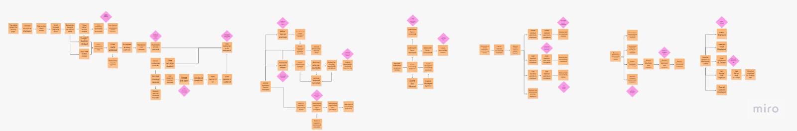

Enlace para acceder al https://miro.com/welcomeonboard/T1gvUmlKRzZiWjFQV0VFK1VsL1VDbFN1WE1QbzV3WjVVd2NYR1d3NVRSdVFOUFd4ZVlIbk4rSmxBN1J3UUtjQjg3cHlKK2VKZ3cwVXB5ZXJoK0MyNmxud01rejllQVpDT1AzczYyS0t6YWtZTk9xSS9JKO5WR2x1cVZvYldTbzRnbHpza3F6REdEcmNpNEF0MmJXWXBBPT0hdjE=?share_link_id=376749116517

<div style="page-break-before: always;"></div>

<a id="toc-2-5-ubiquitous-language"></a>
# 2.5. Ubiquitous Language.

Siguiendo los conceptos de **Ubiquitous Language** definidos por **Eric Evans (2003)** en su obra _Domain-Driven Design: Tackling Complexity in the Heart of Software_, se presenta el siguiente glosario. Este conjunto de términos constituye el lenguaje común del proyecto, eliminando ambigüedades entre el equipo de ingeniería y los expertos del dominio ganadero.

| Term (English)              | Término (Español)        | Definition (Definición)                                                                                                                                  |
| :-------------------------- | :----------------------- | :------------------------------------------------------------------------------------------------------------------------------------------------------- |
| **Livestock Owner**         | Ganadero                 | Usuario responsable de la administración operativa y financiera de la hacienda, encargado de registrar eventos diarios y tomar decisiones de producción. |
| **Veterinarian**            | Veterinario              | Profesional especializado encargado de la salud animal, responsable de emitir diagnósticos, prescribir tratamientos y validar historiales clínicos.      |
| **Herd**                    | Hato                     | Conjunto de animales agrupados dentro de una unidad productiva o finca para su control sanitario, productivo y administrativo.                          |
| **Farm**                    | Finca                    | Unidad productiva donde el ganadero organiza animales, actividades, registros sanitarios y movimientos financieros.                                     |
| **Animal**                  | Animal                   | Ejemplar individual registrado por el ganadero para mantener su trazabilidad sanitaria, productiva y económica.                                         |
| **Health Event**            | Evento Sanitario         | Registro de una vacuna, enfermedad, diagnóstico, tratamiento, incidencia o seguimiento relacionado con la salud de un animal.                           |
| **Veterinary Client**       | Cliente Veterinario      | Ganadero asignado a un veterinario para que este pueda revisar sus animales, consultar historiales y registrar atenciones sanitarias.                   |
| **Veterinary History**      | Historial Veterinario    | Expediente clínico consolidado que permite al especialista revisar antecedentes médicos antes de realizar una intervención.                              |
| **Treatment Protocol**      | Protocolo de Tratamiento | Conjunto de instrucciones médicas y fármacos asignados a un animal para tratar una afección diagnosticada por el veterinario.                            |
| **Traceability**            | Trazabilidad             | Capacidad de reconstruir el historial completo de un animal, incluyendo origen, salud, peso, actividades y cambios relevantes.                          |
| **IoT Device**              | Dispositivo IoT          | Equipo asociado a una finca o animal para apoyar el monitoreo de datos como peso, temperatura, humedad, ubicación o actividad.                         |
| **Metric**                  | Métrica                  | Lectura generada por un dispositivo o registro del sistema que permite analizar el estado de un animal, finca o proceso ganadero.                       |
| **Farm Activity**           | Actividad Ganadera       | Tarea productiva, sanitaria, financiera o veterinaria programada para organizar el trabajo dentro de la operación ganadera.                             |
| **Financial Movement**      | Movimiento Financiero    | Ingreso o egreso registrado por el ganadero para controlar la rentabilidad de su operación.                                                             |
| **Subscription Plan**       | Plan de Suscripción      | Opción de uso de la plataforma que define condiciones, beneficios y precio para el usuario.                                                              |
| **Payment**                 | Pago                     | Registro económico asociado a la activación o renovación de un plan de suscripción dentro de AniTec.                                                    |
| **Farm Management**         | Gestión de Hacienda      | Administración de los recursos, personal, animales, actividades y datos que ocurren dentro de la unidad productiva ganadera.                            |

<div style="page-break-before: always;"></div>

<a id="toc-3-1-user-stories"></a>
# 3.1. User Stories.

En esta sección se presentan los Epics, User Stories y Technical Stories identificados para AniTec a partir del análisis de entrevistas, needfinding, definición de segmentos objetivo y alcance actual de la solución. Las User Stories describen necesidades funcionales de ganaderos, veterinarios, usuarios autenticados y visitantes de la landing page. Las Technical Stories describen necesidades técnicas del frontend y del RESTful API, usando el rol Developer y criterios de aceptación en formato Given-When-Then.

<table>
  <thead>
    <tr>
      <th>Epic / Story ID</th>
      <th>Titulo</th>
      <th>Descripcion</th>
      <th>Criterios de Aceptacion</th>
      <th>Relacionado con</th>
    </tr>
  </thead>
  <tbody>
    <tr>
      <td><b>EP-001</b></td>
      <td>Gestion de acceso, sesion y roles</td>
      <td>Esta epica agrupa las funcionalidades necesarias para que los usuarios ingresen a AniTec con una identidad determinada y accedan a una experiencia diferenciada segun su rol de ganadero o veterinario.</td>
      <td>No aplica</td>
      <td>No aplica</td>
    </tr>
    <tr>
      <td><b>EP-002</b></td>
      <td>Dashboard del ganadero</td>
      <td>Esta epica agrupa las funcionalidades del panel principal del ganadero, donde se resumen sus fincas, animales, alertas sanitarias, actividades y datos financieros.</td>
      <td>No aplica</td>
      <td>No aplica</td>
    </tr>
    <tr>
      <td><b>EP-003</b></td>
      <td>Gestion de fincas del ganadero</td>
      <td>Esta epica agrupa las funcionalidades para registrar, consultar, editar y eliminar las fincas o unidades productivas del ganadero.</td>
      <td>No aplica</td>
      <td>No aplica</td>
    </tr>
    <tr>
      <td><b>EP-004</b></td>
      <td>Gestion de animales</td>
      <td>Esta epica agrupa las funcionalidades para registrar y administrar animales de distintos tipos de ganado, como bovinos, ovinos, caprinos, porcinos, aves, patos, pollos, cuyes y otros.</td>
      <td>No aplica</td>
      <td>No aplica</td>
    </tr>
    <tr>
      <td><b>EP-005</b></td>
      <td>Gestion sanitaria y clinica</td>
      <td>Esta epica agrupa las funcionalidades para registrar enfermedades, incidencias, diagnosticos, tratamientos, recetas y seguimientos sanitarios de los animales.</td>
      <td>No aplica</td>
      <td>No aplica</td>
    </tr>
    <tr>
      <td><b>EP-006</b></td>
      <td>Gestion profesional del veterinario</td>
      <td>Esta epica agrupa las funcionalidades para que el veterinario administre su cartera de clientes ganaderos, consulte sus fincas, revise pacientes y mantenga seguimiento sanitario.</td>
      <td>No aplica</td>
      <td>No aplica</td>
    </tr>
    <tr>
      <td><b>EP-007</b></td>
      <td>Calendario, actividades y recordatorios</td>
      <td>Esta epica agrupa las funcionalidades para registrar y consultar actividades productivas, sanitarias, financieras, reproductivas y visitas veterinarias.</td>
      <td>No aplica</td>
      <td>No aplica</td>
    </tr>
    <tr>
      <td><b>EP-008</b></td>
      <td>Gestion financiera del ganadero</td>
      <td>Esta epica agrupa las funcionalidades financieras para que el ganadero registre ingresos, egresos y revise su balance.</td>
      <td>No aplica</td>
      <td>No aplica</td>
    </tr>
    <tr>
      <td><b>EP-009</b></td>
      <td>Analiticas y estadisticas</td>
      <td>Esta epica agrupa las funcionalidades para visualizar metricas y graficos estadisticos basados en animales, fincas, clientes y registros sanitarios visibles para cada rol.</td>
      <td>No aplica</td>
      <td>No aplica</td>
    </tr>
    <tr>
      <td><b>EP-010</b></td>
      <td>Navegacion y experiencia compartida</td>
      <td>Esta epica agrupa funcionalidades generales de navegacion, estructura visual, estados vacios y paginas compartidas por los usuarios.</td>
      <td>No aplica</td>
      <td>No aplica</td>
    </tr>
    <tr>
      <td><b>EP-011</b></td>
      <td>Landing page publica de AniTec</td>
      <td>Esta epica agrupa las historias de usuario de la landing page publica de AniTec. Estas historias estan al final porque corresponden a la experiencia informativa y comercial previa al uso de la aplicacion web.</td>
      <td>No aplica</td>
      <td>No aplica</td>
    </tr>
    <tr>
      <td><b>EP-012</b></td>
      <td>Dispositivos IoT y metricas</td>
      <td>Esta epica agrupa las funcionalidades para consultar dispositivos asociados a fincas o animales, asi como sus lecturas y metricas recientes.</td>
      <td>No aplica</td>
      <td>No aplica</td>
    </tr>
    <tr>
      <td><b>EP-013</b></td>
      <td>Planes, suscripciones y pagos</td>
      <td>Esta epica agrupa las funcionalidades para visualizar planes de suscripcion, consultar el plan activo, revisar pagos y realizar pagos simulados dentro de la plataforma.</td>
      <td>No aplica</td>
      <td>No aplica</td>
    </tr>
    <tr>
      <td><b>US-001</b></td>
      <td>Visualizar resumen operativo del ganadero</td>
      <td>Como ganadero, quiero ver un resumen de mis animales, fincas, alertas y actividades para conocer rapidamente el estado de mi operacion.</td>
      <td><b>Visualizacion de metricas del ganadero.</b><br>Given el ganadero tiene animales, fincas, actividades y registros sanitarios<br>When ingresa a su dashboard<br>Then el sistema muestra metricas calculadas con sus propios datos<br><br><b>Ganadero sin datos registrados.</b><br>Given el ganadero no tiene animales ni fincas registradas<br>When ingresa a su dashboard<br>Then el sistema muestra indicadores en cero o mensajes de estado vacio</td>
      <td>EP-002</td>
    </tr>
    <tr>
      <td><b>US-002</b></td>
      <td>Filtrar resumen por finca</td>
      <td>Como ganadero, quiero filtrar mi dashboard por finca para revisar el estado de una unidad productiva especifica.</td>
      <td><b>Seleccion de una finca.</b><br>Given el ganadero tiene mas de una finca registrada<br>When selecciona una finca especifica<br>Then el sistema actualiza los indicadores y listas usando solo los animales de esa finca<br><br><b>Seleccion de todas las fincas.</b><br>Given el ganadero esta revisando una finca especifica<br>When selecciona la opcion de todas las fincas<br>Then el sistema vuelve a mostrar la informacion agregada de todas sus fincas</td>
      <td>EP-002</td>
    </tr>
    <tr>
      <td><b>US-003</b></td>
      <td>Acceder a acciones rapidas del ganadero</td>
      <td>Como ganadero, quiero acceder rapidamente al registro de animales, incidencias y actividades para reducir pasos en tareas frecuentes.</td>
      <td><b>Registrar animal desde el dashboard.</b><br>Given el ganadero esta en su dashboard<br>When selecciona la accion de registrar animal<br>Then el sistema lo dirige al formulario de nuevo animal<br><br><b>Reportar incidencia desde el dashboard.</b><br>Given el ganadero detecta una enfermedad o problema sanitario<br>When selecciona la accion de reportar incidencia<br>Then el sistema lo dirige al formulario de evento sanitario<br><br><b>Programar visita desde el dashboard.</b><br>Given el ganadero necesita una visita o actividad futura<br>When selecciona la accion de programar visita<br>Then el sistema lo dirige al formulario de actividad</td>
      <td>EP-002</td>
    </tr>
    <tr>
      <td><b>US-004</b></td>
      <td>Visualizar listado de fincas en cartas</td>
      <td>Como ganadero, quiero ver mis fincas en cartas con informacion relevante para identificar facilmente cada unidad productiva.</td>
      <td><b>Fincas existentes.</b><br>Given el ganadero tiene fincas registradas<br>When ingresa al apartado de fincas<br>Then el sistema muestra cada finca en una carta<br>And muestra nombre, ubicacion, tipo principal y cantidad de animales<br><br><b>Sin fincas registradas.</b><br>Given el ganadero no tiene fincas registradas<br>When ingresa al apartado de fincas<br>Then el sistema muestra un mensaje indicando que no hay fincas</td>
      <td>EP-003</td>
    </tr>
    <tr>
      <td><b>US-005</b></td>
      <td>Registrar nueva finca</td>
      <td>Como ganadero, quiero registrar una nueva finca para organizar mis animales por ubicacion o unidad productiva.</td>
      <td><b>Registro con datos validos.</b><br>Given el ganadero se encuentra en el formulario de nueva finca<br>When ingresa nombre, ubicacion y tipo principal validos<br>Then el sistema registra la finca<br>And la muestra en el listado de fincas<br><br><b>Registro incompleto.</b><br>Given el ganadero deja campos requeridos vacios<br>When intenta guardar la finca<br>Then el sistema no completa el registro<br>And solicita completar la informacion requerida</td>
      <td>EP-003</td>
    </tr>
    <tr>
      <td><b>US-006</b></td>
      <td>Editar informacion de una finca</td>
      <td>Como ganadero, quiero editar los datos de una finca para mantener actualizada su informacion.</td>
      <td><b>Edicion exitosa.</b><br>Given existe una finca registrada<br>When el ganadero modifica su nombre, ubicacion o tipo principal<br>Then el sistema guarda los cambios<br>And muestra la informacion actualizada<br><br><b>Finca inexistente.</b><br>Given la finca solicitada no existe<br>When el ganadero intenta editarla<br>Then el sistema redirige al listado de fincas</td>
      <td>EP-003</td>
    </tr>
    <tr>
      <td><b>US-007</b></td>
      <td>Eliminar finca</td>
      <td>Como ganadero, quiero eliminar una finca cuando ya no forma parte de mi operacion.</td>
      <td><b>Eliminacion confirmada.</b><br>Given existe una finca registrada<br>When el ganadero confirma su eliminacion<br>Then el sistema elimina la finca del listado<br><br><b>Eliminacion cancelada.</b><br>Given el ganadero abre la confirmacion de eliminacion<br>When cancela la accion<br>Then el sistema conserva la finca sin cambios</td>
      <td>EP-003</td>
    </tr>
    <tr>
      <td><b>US-008</b></td>
      <td>Visualizar animales en cartas</td>
      <td>Como ganadero, quiero ver mis animales en cartas para revisar rapidamente la informacion principal de cada uno.</td>
      <td><b>Animales existentes.</b><br>Given el ganadero tiene animales registrados<br>When ingresa al apartado de animales<br>Then el sistema muestra una carta por animal<br>And muestra codigo, nombre, especie, raza, sexo, peso, estado y finca<br><br><b>Sin animales registrados.</b><br>Given el ganadero no tiene animales registrados<br>When ingresa al apartado de animales<br>Then el sistema muestra un mensaje de lista vacia</td>
      <td>EP-004</td>
    </tr>
    <tr>
      <td><b>US-009</b></td>
      <td>Buscar animales por texto</td>
      <td>Como ganadero, quiero buscar animales por nombre, codigo, especie o raza para encontrarlos rapidamente cuando tenga muchos registros.</td>
      <td><b>Busqueda con coincidencias.</b><br>Given existen animales registrados<br>When el ganadero escribe un termino de busqueda que coincide con uno o mas animales<br>Then el sistema muestra solo las cartas coincidentes<br><br><b>Busqueda sin coincidencias.</b><br>Given existen animales registrados<br>When el ganadero escribe un termino sin coincidencias<br>Then el sistema muestra un mensaje indicando que no se encontraron animales</td>
      <td>EP-004</td>
    </tr>
    <tr>
      <td><b>US-010</b></td>
      <td>Registrar animal</td>
      <td>Como ganadero, quiero registrar un animal indicando su especie y raza para mantener trazabilidad de mi ganado.</td>
      <td><b>Registro con datos validos.</b><br>Given el ganadero tiene al menos una finca registrada<br>When ingresa codigo, nombre, especie, raza, sexo, fecha de nacimiento, peso, estado y finca<br>Then el sistema registra el animal<br>And lo muestra en el listado correspondiente<br><br><b>Registro sin finca.</b><br>Given el ganadero no selecciona una finca<br>When intenta guardar el animal<br>Then el sistema solicita asociar el animal a una finca</td>
      <td>EP-004</td>
    </tr>
    <tr>
      <td><b>US-011</b></td>
      <td>Editar animal</td>
      <td>Como ganadero, quiero editar los datos de un animal para actualizar su estado, peso o informacion general.</td>
      <td><b>Edicion exitosa.</b><br>Given existe un animal registrado<br>When el ganadero modifica sus datos y guarda<br>Then el sistema actualiza el animal<br>And muestra la informacion actualizada en su carta<br><br><b>Animal inexistente.</b><br>Given el animal no existe<br>When el ganadero intenta abrir su formulario de edicion<br>Then el sistema redirige al listado de animales</td>
      <td>EP-004</td>
    </tr>
    <tr>
      <td><b>US-012</b></td>
      <td>Eliminar animal</td>
      <td>Como ganadero, quiero eliminar un animal cuando ya no pertenece a mi hato o registro productivo.</td>
      <td><b>Eliminacion confirmada.</b><br>Given existe un animal registrado<br>When el ganadero confirma la eliminacion<br>Then el sistema elimina el animal del listado<br><br><b>Eliminacion cancelada.</b><br>Given el ganadero abre la confirmacion de eliminacion<br>When cancela la accion<br>Then el animal permanece registrado</td>
      <td>EP-004</td>
    </tr>
    <tr>
      <td><b>US-013</b></td>
      <td>Consultar animales segun rol</td>
      <td>Como usuario, quiero que el sistema muestre animales segun mi rol para proteger la informacion de cada ganadero.</td>
      <td><b>Consulta como ganadero.</b><br>Given el usuario tiene rol de ganadero<br>When ingresa al apartado de animales<br>Then el sistema muestra solo los animales de sus fincas<br><br><b>Consulta como veterinario.</b><br>Given el usuario tiene rol de veterinario<br>When ingresa al apartado de animales o pacientes<br>Then el sistema muestra solo los animales de sus clientes asignados</td>
      <td>EP-004</td>
    </tr>
    <tr>
      <td><b>US-014</b></td>
      <td>Visualizar registros sanitarios en cartas</td>
      <td>Como usuario autorizado, quiero ver los registros sanitarios en cartas para revisar de forma clara la informacion clinica de los animales.</td>
      <td><b>Registros existentes.</b><br>Given existen registros sanitarios asociados a animales visibles para el usuario<br>When ingresa a gestion sanitaria<br>Then el sistema muestra cada registro en una carta<br>And presenta animal, tipo, fecha, descripcion, veterinario y proxima fecha<br><br><b>Sin registros sanitarios.</b><br>Given no existen registros sanitarios visibles para el usuario<br>When ingresa a gestion sanitaria<br>Then el sistema muestra un mensaje de estado vacio</td>
      <td>EP-005</td>
    </tr>
    <tr>
      <td><b>US-015</b></td>
      <td>Registrar incidencia sanitaria como ganadero</td>
      <td>Como ganadero, quiero registrar enfermedades o incidencias basicas de mis animales para dejar constancia y facilitar el seguimiento veterinario.</td>
      <td><b>Registro de incidencia valido.</b><br>Given el ganadero selecciona un animal propio<br>When ingresa tipo, fecha, descripcion y datos de seguimiento<br>Then el sistema registra el evento sanitario para ese animal<br><br><b>Animal no disponible.</b><br>Given el animal pertenece a otro ganadero<br>When el ganadero intenta registrarle una incidencia<br>Then el sistema no lo muestra como opcion disponible</td>
      <td>EP-005</td>
    </tr>
    <tr>
      <td><b>US-016</b></td>
      <td>Registrar diagnostico y tratamiento como veterinario</td>
      <td>Como veterinario, quiero registrar diagnostico, tratamiento, receta y seguimiento para documentar la atencion clinica de un animal.</td>
      <td><b>Registro clinico completo.</b><br>Given el veterinario atiende a un animal de un cliente asignado<br>When ingresa diagnostico, tratamiento, receta, seguimiento y proxima fecha<br>Then el sistema guarda el registro sanitario<br>And lo asocia al animal correspondiente<br><br><b>Animal fuera de cartera.</b><br>Given un animal pertenece a un ganadero no asignado al veterinario<br>When el veterinario intenta registrar atencion sanitaria<br>Then el sistema no muestra ese animal como opcion</td>
      <td>EP-005</td>
    </tr>
    <tr>
      <td><b>US-017</b></td>
      <td>Editar registro sanitario</td>
      <td>Como usuario autorizado, quiero editar un registro sanitario para corregir o complementar informacion clinica.</td>
      <td><b>Edicion exitosa.</b><br>Given existe un registro sanitario visible para el usuario<br>When el usuario actualiza los datos y guarda<br>Then el sistema muestra el registro actualizado<br><br><b>Registro inexistente.</b><br>Given el registro sanitario no existe<br>When el usuario intenta editarlo<br>Then el sistema redirige a la lista de gestion sanitaria</td>
      <td>EP-005</td>
    </tr>
    <tr>
      <td><b>US-018</b></td>
      <td>Eliminar registro sanitario</td>
      <td>Como usuario autorizado, quiero eliminar un registro sanitario incorrecto para mantener limpio el historial.</td>
      <td><b>Eliminacion confirmada.</b><br>Given existe un registro sanitario<br>When el usuario confirma la eliminacion<br>Then el sistema elimina el registro del listado<br><br><b>Eliminacion cancelada.</b><br>Given el usuario abre la confirmacion de eliminacion<br>When cancela la accion<br>Then el registro permanece sin cambios</td>
      <td>EP-005</td>
    </tr>
    <tr>
      <td><b>US-019</b></td>
      <td>Consultar historial clinico por animal</td>
      <td>Como veterinario, quiero consultar el historial clinico de un animal para tomar mejores decisiones durante una atencion.</td>
      <td><b>Animal con historial.</b><br>Given el animal tiene registros sanitarios previos<br>When el veterinario abre su historial clinico<br>Then el sistema muestra todos los registros asociados al animal<br><br><b>Animal sin historial.</b><br>Given el animal no tiene registros sanitarios previos<br>When el veterinario abre su historial clinico<br>Then el sistema muestra un estado vacio o sin registros</td>
      <td>EP-005</td>
    </tr>
    <tr>
      <td><b>US-020</b></td>
      <td>Visualizar dashboard profesional del veterinario</td>
      <td>Como veterinario, quiero ver un dashboard profesional para revisar clientes, pacientes activos, registros clinicos y seguimientos pendientes.</td>
      <td><b>Veterinario con clientes asignados.</b><br>Given el veterinario tiene ganaderos asignados<br>When ingresa a su dashboard<br>Then el sistema muestra clientes activos, pacientes, registros clinicos y seguimientos<br><br><b>Veterinario sin clientes asignados.</b><br>Given el veterinario no tiene ganaderos asignados<br>When ingresa a su dashboard<br>Then el sistema muestra metricas en cero y permite agregar clientes</td>
      <td>EP-006</td>
    </tr>
    <tr>
      <td><b>US-021</b></td>
      <td>Seleccionar cliente en el dashboard veterinario</td>
      <td>Como veterinario, quiero seleccionar un cliente ganadero para revisar sus fincas y animales antes de realizar acciones clinicas.</td>
      <td><b>Seleccion de cliente valido.</b><br>Given el veterinario tiene clientes asignados<br>When selecciona un cliente en el panel<br>Then el sistema muestra las fincas de ese cliente<br>And muestra la cantidad de animales por finca<br><br><b>Cliente sin fincas.</b><br>Given el cliente seleccionado no tiene fincas registradas<br>When el veterinario lo selecciona<br>Then el sistema muestra un mensaje indicando que no hay fincas</td>
      <td>EP-006</td>
    </tr>
    <tr>
      <td><b>US-022</b></td>
      <td>Visualizar clientes asignados en cartas</td>
      <td>Como veterinario, quiero ver mis clientes en cartas con informacion completa para entender rapidamente la situacion de cada ganadero.</td>
      <td><b>Clientes existentes.</b><br>Given el veterinario tiene clientes asignados<br>When ingresa a clientes asignados<br>Then el sistema muestra cartas con nombre, fincas, ubicacion, animales, especies, registros sanitarios y alertas<br><br><b>Sin clientes.</b><br>Given el veterinario no tiene clientes asignados<br>When ingresa a clientes asignados<br>Then el sistema muestra un mensaje indicando que no tiene clientes</td>
      <td>EP-006</td>
    </tr>
    <tr>
      <td><b>US-023</b></td>
      <td>Agregar cliente ganadero a la cartera del veterinario</td>
      <td>Como veterinario, quiero buscar ganaderos registrados y enviar una peticion para agregarlos a mi cartera de clientes.</td>
      <td><b>Busqueda de ganadero.</b><br>Given existen ganaderos registrados en la aplicacion<br>When el veterinario ingresa al panel de agregar cliente<br>Then el sistema muestra ganaderos en cartas con nombre, fincas y avatar circular<br><br><b>Envio de peticion.</b><br>Given el veterinario encuentra un ganadero disponible<br>When selecciona enviar peticion<br>Then el sistema registra la relacion veterinario-cliente en el backend<br>And lo muestra como cliente agregado<br><br><b>Busqueda sin resultados.</b><br>Given el veterinario escribe un nombre sin coincidencias<br>When el sistema filtra los ganaderos<br>Then muestra un mensaje indicando que no se encontraron ganaderos</td>
      <td>EP-006</td>
    </tr>
    <tr>
      <td><b>US-024</b></td>
      <td>Eliminar cliente de la cartera del veterinario</td>
      <td>Como veterinario, quiero eliminar un cliente de mi lista para dejar de visualizar sus datos ganaderos y sanitarios.</td>
      <td><b>Eliminacion de relacion veterinario-cliente.</b><br>Given el veterinario tiene un cliente asignado<br>When selecciona eliminar cliente<br>Then el sistema elimina la relacion entre veterinario y ganadero<br>And el cliente deja de aparecer en su lista<br><br><b>Datos del ganadero se conservan.</b><br>Given el veterinario elimina un cliente de su cartera<br>When el sistema procesa la accion<br>Then las fincas, animales y registros del ganadero se conservan en la aplicacion</td>
      <td>EP-006</td>
    </tr>
    <tr>
      <td><b>US-025</b></td>
      <td>Consultar pacientes por ganadero</td>
      <td>Como veterinario, quiero seleccionar un cliente y ver sus animales para atenderlos de forma organizada.</td>
      <td><b>Cliente con animales.</b><br>Given el veterinario selecciona un cliente con animales registrados<br>When ingresa al apartado de pacientes<br>Then el sistema muestra las cartas de animales de ese cliente<br><br><b>Filtrado por finca.</b><br>Given el cliente tiene mas de una finca<br>When el veterinario selecciona una finca especifica<br>Then el sistema muestra solo los animales de esa finca</td>
      <td>EP-006</td>
    </tr>
    <tr>
      <td><b>US-026</b></td>
      <td>Acceder al historial de un paciente</td>
      <td>Como veterinario, quiero abrir el historial clinico desde la carta del paciente para revisar sus atenciones anteriores.</td>
      <td><b>Acceso desde pacientes.</b><br>Given el veterinario esta visualizando los animales de un cliente<br>When selecciona ver historial en una carta de animal<br>Then el sistema abre el historial clinico del animal seleccionado<br><br><b>Paciente sin registros.</b><br>Given el animal no tiene registros clinicos<br>When el veterinario abre su historial<br>Then el sistema muestra que aun no existen atenciones registradas</td>
      <td>EP-006</td>
    </tr>
    <tr>
      <td><b>US-027</b></td>
      <td>Visualizar calendario de actividades</td>
      <td>Como usuario, quiero ver mis actividades programadas para organizar tareas ganaderas y sanitarias.</td>
      <td><b>Actividades existentes.</b><br>Given existen actividades visibles para el usuario<br>When ingresa al apartado de actividades<br>Then el sistema muestra una lista cronologica con fecha, titulo, tipo, estado y prioridad<br><br><b>Sin actividades.</b><br>Given no existen actividades visibles para el usuario<br>When ingresa al apartado de actividades<br>Then el sistema muestra un mensaje indicando que no hay actividades programadas</td>
      <td>EP-007</td>
    </tr>
    <tr>
      <td><b>US-028</b></td>
      <td>Crear actividad o recordatorio</td>
      <td>Como usuario, quiero crear actividades para programar controles, visitas, tareas productivas o recordatorios financieros.</td>
      <td><b>Actividad valida.</b><br>Given el usuario ingresa titulo, tipo, fecha, prioridad y estado<br>When guarda la actividad<br>Then el sistema registra la actividad<br>And la muestra en el calendario<br><br><b>Actividad incompleta.</b><br>Given el usuario no ingresa titulo o fecha<br>When intenta guardar la actividad<br>Then el sistema solicita completar los datos requeridos</td>
      <td>EP-007</td>
    </tr>
    <tr>
      <td><b>US-029</b></td>
      <td>Editar evento</td>
      <td>Como usuario, quiero editar un evento para actualizar fecha, prioridad o estado.</td>
      <td><b>Edicion exitosa.</b><br>Given existe un evento registrado<br>When el usuario modifica sus datos y guarda<br>Then el sistema actualiza el evento en el calendario<br><br><b>Evento inexistente.</b><br>Given el evento no existe<br>When el usuario intenta editarlo<br>Then el sistema redirige al calendario</td>
      <td>EP-007</td>
    </tr>
    <tr>
      <td><b>US-030</b></td>
      <td>Eliminar actividad</td>
      <td>Como usuario, quiero eliminar actividades que ya no son necesarias para mantener mi calendario ordenado.</td>
      <td><b>Eliminacion confirmada.</b><br>Given existe una actividad registrada<br>When el usuario confirma la eliminacion<br>Then el sistema elimina la actividad<br><br><b>Eliminacion cancelada.</b><br>Given el usuario abre la confirmacion de eliminacion<br>When cancela la accion<br>Then la actividad permanece registrada</td>
      <td>EP-007</td>
    </tr>
    <tr>
      <td><b>US-031</b></td>
      <td>Visualizar movimientos financieros</td>
      <td>Como ganadero, quiero ver mis ingresos, egresos y balance para controlar la rentabilidad de mi operacion.</td>
      <td><b>Movimientos existentes.</b><br>Given el ganadero tiene movimientos financieros registrados<br>When ingresa al apartado de finanzas<br>Then el sistema muestra ingresos, egresos, balance y detalle de movimientos<br><br><b>Sin movimientos.</b><br>Given el ganadero no tiene movimientos financieros<br>When ingresa al apartado de finanzas<br>Then el sistema muestra valores en cero o una lista vacia</td>
      <td>EP-008</td>
    </tr>
    <tr>
      <td><b>US-032</b></td>
      <td>Registrar movimiento financiero</td>
      <td>Como ganadero, quiero registrar ingresos y egresos para mantener actualizado mi balance mensual.</td>
      <td><b>Registro de ingreso.</b><br>Given el ganadero vende productos o animales<br>When registra un movimiento de tipo ingreso con categoria, monto, fecha y descripcion<br>Then el sistema suma el monto a los ingresos<br><br><b>Registro de egreso.</b><br>Given el ganadero realiza un gasto operativo<br>When registra un movimiento de tipo egreso con categoria, monto, fecha y descripcion<br>Then el sistema suma el monto a los egresos</td>
      <td>EP-008</td>
    </tr>
    <tr>
      <td><b>US-033</b></td>
      <td>Editar movimiento financiero</td>
      <td>Como ganadero, quiero editar un movimiento financiero para corregir montos, categorias o fechas.</td>
      <td><b>Edicion exitosa.</b><br>Given existe un movimiento financiero<br>When el ganadero modifica sus datos y guarda<br>Then el sistema actualiza el movimiento<br>And recalcula los totales financieros<br><br><b>Movimiento inexistente.</b><br>Given el movimiento no existe<br>When el ganadero intenta editarlo<br>Then el sistema redirige al listado financiero</td>
      <td>EP-008</td>
    </tr>
    <tr>
      <td><b>US-034</b></td>
      <td>Eliminar movimiento financiero</td>
      <td>Como ganadero, quiero eliminar un movimiento incorrecto para mantener mi balance limpio.</td>
      <td><b>Eliminacion confirmada.</b><br>Given existe un movimiento financiero<br>When el ganadero confirma la eliminacion<br>Then el sistema elimina el movimiento<br>And recalcula ingresos, egresos y balance<br><br><b>Eliminacion cancelada.</b><br>Given el ganadero abre la confirmacion de eliminacion<br>When cancela la accion<br>Then el movimiento permanece registrado</td>
      <td>EP-008</td>
    </tr>
    <tr>
      <td><b>US-035</b></td>
      <td>Visualizar analiticas del ganadero</td>
      <td>Como ganadero, quiero ver analiticas basadas en mis propios animales, fincas y registros sanitarios para tomar decisiones sobre el estado sanitario y productivo de mi hato.</td>
      <td><b>Analitica con datos propios.</b><br>Given el ganadero tiene animales, fincas y registros sanitarios registrados<br>When ingresa al apartado de analiticas<br>Then el sistema muestra metricas calculadas solo con sus datos<br><br><b>Analitica sin datos.</b><br>Given el ganadero no tiene informacion registrada<br>When ingresa al apartado de analiticas<br>Then el sistema muestra metricas en cero o graficos con estado sin datos</td>
      <td>EP-009</td>
    </tr>
    <tr>
      <td><b>US-036</b></td>
      <td>Visualizar analiticas del veterinario</td>
      <td>Como veterinario, quiero ver analiticas sanitarias de mis clientes asignados para priorizar pacientes, seguimientos y atenciones por hato.</td>
      <td><b>Analitica con clientes asignados.</b><br>Given el veterinario tiene clientes asignados<br>When ingresa al apartado de analiticas<br>Then el sistema muestra metricas de clientes, pacientes monitoreados, registros sanitarios y seguimientos pendientes<br><br><b>Graficos sanitarios del veterinario.</b><br>Given existen registros sanitarios de animales bajo supervision del veterinario<br>When visualiza analiticas<br>Then el sistema muestra graficos de registros por tipo y atenciones por hato</td>
      <td>EP-009</td>
    </tr>
    <tr>
      <td><b>US-037</b></td>
      <td>Visualizar estado sanitario del hato</td>
      <td>Como ganadero, quiero ver un grafico del estado de mis animales para identificar cuantos estan saludables, en observacion o en tratamiento.</td>
      <td><b>Grafico con animales registrados.</b><br>Given el ganadero tiene animales registrados con diferentes estados<br>When ingresa a analiticas<br>Then el sistema muestra un grafico de estado del hato con animales saludables, en observacion y en tratamiento<br><br><b>Grafico sin animales.</b><br>Given el ganadero no tiene animales registrados<br>When ingresa a analiticas<br>Then el sistema muestra el grafico sin datos o con valores en cero</td>
      <td>EP-009</td>
    </tr>
    <tr>
      <td><b>US-038</b></td>
      <td>Visualizar registros sanitarios por tipo</td>
      <td>Como usuario autorizado, quiero ver los registros sanitarios agrupados por tipo para entender que atenciones son mas frecuentes.</td>
      <td><b>Registros sanitarios existentes.</b><br>Given existen registros sanitarios visibles para el usuario<br>When ingresa al apartado de analiticas<br>Then el sistema muestra un grafico con tipos como incidencia, vacuna, revision, tratamiento y diagnostico<br><br><b>Sin registros sanitarios.</b><br>Given no existen registros sanitarios visibles para el usuario<br>When visualiza el grafico<br>Then el sistema muestra valores en cero o una representacion sin datos</td>
      <td>EP-009</td>
    </tr>
    <tr>
      <td><b>US-039</b></td>
      <td>Visualizar atenciones sanitarias por hato</td>
      <td>Como veterinario, quiero ver las atenciones sanitarias por hato para identificar que clientes requieren mas seguimiento.</td>
      <td><b>Atenciones agrupadas por hato.</b><br>Given el veterinario tiene clientes con hatos y registros sanitarios<br>When ingresa a analiticas<br>Then el sistema muestra un grafico con la cantidad de atenciones sanitarias por hato<br><br><b>Cliente sin atenciones.</b><br>Given un hato no tiene registros sanitarios asociados<br>When se generan las analiticas<br>Then el sistema muestra ese hato con valor cero o sin atenciones registradas</td>
      <td>EP-009</td>
    </tr>
    <tr>
      <td><b>US-040</b></td>
      <td>Navegar mediante menu lateral segun rol</td>
      <td>Como usuario autenticado, quiero ver un menu lateral adaptado a mi rol para acceder rapidamente a las secciones disponibles.</td>
      <td><b>Menu del ganadero.</b><br>Given el usuario tiene rol de ganadero<br>When se muestra el layout principal<br>Then el menu incluye panel ganadero, fincas, animales, sanidad, actividades, finanzas y analiticas<br><br><b>Menu del veterinario.</b><br>Given el usuario tiene rol de veterinario<br>When se muestra el layout principal<br>Then el menu incluye panel veterinario, clientes, pacientes, sanidad, actividades y analiticas</td>
      <td>EP-010</td>
    </tr>
    <tr>
      <td><b>US-041</b></td>
      <td>Visualizar pagina de inicio interna</td>
      <td>Como usuario autenticado, quiero ver una pagina de inicio operativa para acceder a modulos principales y obtener un resumen general.</td>
      <td><b>Inicio con datos disponibles.</b><br>Given el usuario tiene datos registrados<br>When ingresa a la pagina de inicio interna<br>Then el sistema muestra accesos y resumen operativo<br><br><b>Inicio sin datos.</b><br>Given el usuario aun no tiene datos registrados<br>When ingresa a la pagina de inicio interna<br>Then el sistema muestra accesos principales para comenzar</td>
      <td>EP-010</td>
    </tr>
    <tr>
      <td><b>US-042</b></td>
      <td>Visualizar pagina acerca de AniTec</td>
      <td>Como usuario, quiero consultar informacion acerca de AniTec para entender el proposito de la aplicacion.</td>
      <td><b>Acceso a la pagina acerca de.</b><br>Given el usuario navega a la seccion acerca de<br>When la pagina carga<br>Then el sistema muestra una descripcion de AniTec y sus modulos principales</td>
      <td>EP-010</td>
    </tr>
    <tr>
      <td><b>US-043</b></td>
      <td>Visualizar pagina no encontrada</td>
      <td>Como usuario, quiero ver un mensaje claro cuando ingreso a una ruta no disponible para saber que no existe contenido asociado.</td>
      <td><b>Ruta invalida.</b><br>Given el usuario ingresa una URL inexistente<br>When el sistema no encuentra una ruta asociada<br>Then muestra la pagina no encontrada<br>And permite volver a una ruta valida</td>
      <td>EP-010</td>
    </tr>
    <tr>
      <td><b>US-044</b></td>
      <td>Visualizar pagina principal de la landing page</td>
      <td>Como visitante, quiero ver la pagina principal de AniTec para comprender rapidamente que ofrece la plataforma.</td>
      <td><b>Carga de pagina principal.</b><br>Given el visitante ingresa a la landing page principal<br>When la pagina carga<br>Then el sistema muestra el logo, navegacion, hero principal, propuesta de valor y llamados a la accion<br><br><b>Navegacion hacia secciones internas.</b><br>Given el visitante esta en la pagina principal<br>When selecciona una opcion del menu<br>Then el sistema lo dirige a la seccion o pagina correspondiente</td>
      <td>EP-011</td>
    </tr>
    <tr>
      <td><b>US-045</b></td>
      <td>Conocer beneficios generales de AniTec</td>
      <td>Como visitante, quiero revisar los beneficios generales de AniTec para evaluar si la plataforma resuelve mis necesidades de gestion ganadera.</td>
      <td><b>Visualizacion de beneficios.</b><br>Given el visitante navega a la seccion de beneficios o caracteristicas<br>When la seccion se muestra<br>Then el sistema presenta beneficios relacionados con gestion ganadera, sanidad, productividad y trazabilidad<br><br><b>Revision desde dispositivo movil.</b><br>Given el visitante usa un dispositivo movil<br>When visualiza los beneficios<br>Then el contenido se adapta al tamano de pantalla sin perder legibilidad</td>
      <td>EP-011</td>
    </tr>
    <tr>
      <td><b>US-046</b></td>
      <td>Visualizar pagina para ganaderos</td>
      <td>Como ganadero visitante, quiero acceder a una pagina orientada a mi perfil para entender como AniTec mejora mi gestion diaria.</td>
      <td><b>Carga de pagina para ganaderos.</b><br>Given el visitante selecciona la pagina para ganaderos<br>When la pagina carga<br>Then el sistema muestra informacion sobre gestion de animales, sanidad, productividad, finanzas y alertas<br><br><b>Revision de comparacion tradicional vs AniTec.</b><br>Given el visitante esta en la pagina para ganaderos<br>When llega a la seccion comparativa<br>Then el sistema muestra diferencias entre la gestion tradicional y la gestion con AniTec</td>
      <td>EP-011</td>
    </tr>
    <tr>
      <td><b>US-047</b></td>
      <td>Visualizar pagina para veterinarios</td>
      <td>Como veterinario visitante, quiero acceder a una pagina orientada a mi perfil para entender como AniTec apoya la gestion de clientes y pacientes.</td>
      <td><b>Carga de pagina para veterinarios.</b><br>Given el visitante selecciona la pagina para veterinarios<br>When la pagina carga<br>Then el sistema muestra informacion sobre clientes, pacientes, historiales clinicos, visitas y analiticas sanitarias<br><br><b>Revision de flujo profesional.</b><br>Given el visitante esta en la pagina para veterinarios<br>When revisa las secciones de uso<br>Then el sistema explica como el veterinario puede organizar su cartera y atenciones</td>
      <td>EP-011</td>
    </tr>
    <tr>
      <td><b>US-048</b></td>
      <td>Visualizar pagina nosotros</td>
      <td>Como visitante, quiero conocer al equipo y la propuesta de AniTec para confiar en la solucion.</td>
      <td><b>Carga de pagina nosotros.</b><br>Given el visitante selecciona la pagina nosotros<br>When la pagina carga<br>Then el sistema muestra informacion institucional, proposito y contexto del producto</td>
      <td>EP-011</td>
    </tr>
    <tr>
      <td><b>US-049</b></td>
      <td>Cambiar idioma en la landing page</td>
      <td>Como visitante, quiero cambiar el idioma de la landing page para leer la informacion en mi idioma preferido.</td>
      <td><b>Cambio a espanol.</b><br>Given la landing page esta en ingles<br>When el visitante selecciona espanol<br>Then el sistema actualiza los textos disponibles a espanol<br><br><b>Cambio a ingles.</b><br>Given la landing page esta en espanol<br>When el visitante selecciona ingles<br>Then el sistema actualiza los textos disponibles a ingles</td>
      <td>EP-011</td>
    </tr>
    <tr>
      <td><b>US-050</b></td>
      <td>Consultar testimonios de usuarios</td>
      <td>Como visitante, quiero leer testimonios de ganaderos o veterinarios para conocer experiencias de uso de AniTec.</td>
      <td><b>Testimonios visibles.</b><br>Given el visitante navega a una pagina con testimonios<br>When llega a la seccion de testimonios<br>Then el sistema muestra comentarios, nombres e imagenes de usuarios representativos</td>
      <td>EP-011</td>
    </tr>
    <tr>
      <td><b>US-051</b></td>
      <td>Acceder a contacto o llamada a la accion</td>
      <td>Como visitante interesado, quiero encontrar facilmente una llamada a la accion o datos de contacto para dar el siguiente paso con AniTec.</td>
      <td><b>Acceso a contacto desde navegacion.</b><br>Given el visitante esta en la landing page<br>When selecciona la opcion de contacto<br>Then el sistema lo desplaza o redirige al bloque de contacto<br><br><b>Acceso desde CTA.</b><br>Given el visitante lee la propuesta de valor<br>When selecciona un boton de llamada a la accion<br>Then el sistema lo dirige a la seccion definida para iniciar contacto o conocer mas</td>
      <td>EP-011</td>
    </tr>
    <tr>
      <td><b>US-052</b></td>
      <td>Visualizar landing page en dispositivos moviles</td>
      <td>Como visitante movil, quiero navegar la landing page desde mi celular para conocer AniTec sin problemas de visualizacion.</td>
      <td><b>Menu movil.</b><br>Given el visitante abre la landing page desde un dispositivo movil<br>When selecciona el boton de menu<br>Then el sistema muestra las opciones de navegacion adaptadas a pantalla pequena<br><br><b>Contenido responsive.</b><br>Given el visitante navega por la landing page desde movil<br>When revisa imagenes, textos y tarjetas<br>Then el contenido se adapta sin cortes, solapamientos ni perdida de legibilidad</td>
      <td>EP-011</td>
    </tr>
    <tr>
      <td><b>US-053</b></td>
      <td>Iniciar sesion como usuario registrado</td>
      <td>Como usuario registrado, quiero iniciar sesion con mis credenciales para acceder a las funcionalidades que corresponden a mi rol.</td>
      <td><b>Inicio de sesion con credenciales validas.</b><br>Given el usuario se encuentra en la pantalla de inicio de sesion<br>And ingresa un usuario y contrasena validos<br>When selecciona la opcion de ingresar<br>Then el sistema autentica al usuario mediante el backend<br>And guarda el token JWT de la sesion<br>And redirige al dashboard correspondiente segun su rol<br><br><b>Inicio de sesion con credenciales invalidas.</b><br>Given el usuario se encuentra en la pantalla de inicio de sesion<br>And ingresa un usuario o contrasena incorrectos<br>When selecciona la opcion de ingresar<br>Then el sistema no permite el acceso<br>And muestra un mensaje de credenciales invalidas</td>
      <td>EP-001</td>
    </tr>
    <tr>
      <td><b>US-054</b></td>
      <td>Redirigir al dashboard del rol correspondiente</td>
      <td>Como usuario autenticado, quiero ser enviado al panel correcto para usar solo las funciones propias de mi perfil.</td>
      <td><b>Acceso como ganadero.</b><br>Given el usuario autenticado tiene rol de ganadero<br>When el inicio de sesion se completa correctamente<br>Then el sistema lo redirige al dashboard ganadero<br><br><b>Acceso como veterinario.</b><br>Given el usuario autenticado tiene rol de veterinario<br>When el inicio de sesion se completa correctamente<br>Then el sistema lo redirige al dashboard veterinario</td>
      <td>EP-001</td>
    </tr>
    <tr>
      <td><b>US-055</b></td>
      <td>Restringir rutas segun rol</td>
      <td>Como usuario autenticado, quiero que el sistema me permita acceder solo a las secciones correspondientes a mi rol para evitar operaciones que no me pertenecen.</td>
      <td><b>Ganadero intenta acceder a una ruta de veterinario.</b><br>Given el usuario autenticado tiene rol de ganadero<br>When intenta ingresar a una ruta exclusiva de veterinarios<br>Then el sistema bloquea el acceso<br>And lo redirige a su dashboard ganadero<br><br><b>Veterinario intenta acceder a una ruta exclusiva de finanzas ganaderas.</b><br>Given el usuario autenticado tiene rol de veterinario<br>When intenta acceder a una ruta exclusiva del ganadero<br>Then el sistema bloquea el acceso<br>And lo redirige a su dashboard veterinario</td>
      <td>EP-001</td>
    </tr>
    <tr>
      <td><b>US-056</b></td>
      <td>Cerrar sesion</td>
      <td>Como usuario autenticado, quiero cerrar sesion para proteger mi informacion cuando deje de usar la aplicacion.</td>
      <td><b>Cierre de sesion exitoso.</b><br>Given el usuario tiene una sesion activa<br>When selecciona la opcion de salir<br>Then el sistema elimina la sesion activa<br>And redirige al usuario a la pantalla de inicio de sesion<br><br><b>Intento de acceso posterior al cierre de sesion.</b><br>Given el usuario cerro sesion<br>When intenta acceder a una ruta privada<br>Then el sistema solicita iniciar sesion nuevamente</td>
      <td>EP-001</td>
    </tr>
    <tr>
      <td><b>US-057</b></td>
      <td>Cambiar idioma de la interfaz</td>
      <td>Como usuario, quiero cambiar el idioma de la interfaz para utilizar la aplicacion en el idioma que prefiera.</td>
      <td><b>Seleccion de idioma espanol.</b><br>Given el usuario visualiza la aplicacion en otro idioma<br>When selecciona la opcion ES<br>Then el sistema muestra los textos de la interfaz en espanol<br><br><b>Seleccion de idioma ingles.</b><br>Given el usuario visualiza la aplicacion en espanol<br>When selecciona la opcion EN<br>Then el sistema muestra los textos disponibles en ingles</td>
      <td>EP-001</td>
    </tr>
    <tr>
      <td><b>US-058</b></td>
      <td>Visualizar dispositivos IoT registrados</td>
      <td>Como usuario autenticado, quiero ver los dispositivos IoT registrados en la plataforma para monitorear los equipos asociados a fincas o animales.</td>
      <td><b>Dispositivos disponibles.</b><br>Given existen dispositivos registrados en el backend<br>When el usuario ingresa al modulo IoT<br>Then el sistema muestra tarjetas con nombre, tipo, estado y asociacion del dispositivo<br><br><b>Sin dispositivos registrados.</b><br>Given no existen dispositivos registrados<br>When el usuario ingresa al modulo IoT<br>Then el sistema muestra un estado vacio indicando que no hay dispositivos disponibles</td>
      <td>EP-012</td>
    </tr>
    <tr>
      <td><b>US-059</b></td>
      <td>Consultar metricas de un dispositivo IoT</td>
      <td>Como usuario autenticado, quiero consultar las metricas recientes de un dispositivo para conocer lecturas como peso, temperatura, humedad o actividad.</td>
      <td><b>Metricas disponibles.</b><br>Given un dispositivo tiene lecturas registradas<br>When el usuario revisa el detalle del dispositivo<br>Then el sistema muestra la ultima metrica y el historial de lecturas disponibles<br><br><b>Dispositivo sin metricas.</b><br>Given un dispositivo no tiene lecturas registradas<br>When el usuario revisa sus metricas<br>Then el sistema muestra un mensaje indicando que aun no existen lecturas</td>
      <td>EP-012</td>
    </tr>
    <tr>
      <td><b>US-060</b></td>
      <td>Visualizar planes de suscripcion</td>
      <td>Como usuario autenticado, quiero visualizar los planes de suscripcion disponibles para elegir el plan que mejor se adapte a mi operacion.</td>
      <td><b>Planes disponibles.</b><br>Given existen planes activos en el backend<br>When el usuario ingresa al modulo de planes<br>Then el sistema muestra nombre, precio y caracteristicas de cada plan<br><br><b>Plan activo identificado.</b><br>Given el usuario tiene una suscripcion activa<br>When visualiza los planes<br>Then el sistema identifica visualmente el plan actualmente activo</td>
      <td>EP-013</td>
    </tr>
    <tr>
      <td><b>US-061</b></td>
      <td>Consultar suscripcion activa</td>
      <td>Como usuario autenticado, quiero consultar mi suscripcion activa para conocer el plan asociado a mi cuenta.</td>
      <td><b>Suscripcion activa.</b><br>Given el usuario tiene una suscripcion vigente<br>When ingresa al modulo de planes<br>Then el sistema muestra la informacion de su suscripcion activa<br><br><b>Usuario sin suscripcion.</b><br>Given el usuario no tiene una suscripcion activa<br>When ingresa al modulo de planes<br>Then el sistema permite elegir un plan disponible</td>
      <td>EP-013</td>
    </tr>
    <tr>
      <td><b>US-062</b></td>
      <td>Realizar pago simulado de suscripcion</td>
      <td>Como usuario autenticado, quiero realizar un pago simulado de un plan para activar una suscripcion durante las pruebas del sistema.</td>
      <td><b>Pago simulado exitoso.</b><br>Given el usuario selecciona un plan disponible<br>When confirma el pago simulado<br>Then el backend registra la suscripcion y el pago mock<br>And el frontend actualiza el plan activo del usuario<br><br><b>Error durante el pago.</b><br>Given ocurre un problema al procesar el pago simulado<br>When el usuario intenta confirmar el plan<br>Then el sistema muestra un mensaje de error y mantiene el estado anterior</td>
      <td>EP-013</td>
    </tr>
    <tr>
      <td><b>US-063</b></td>
      <td>Consultar historial de pagos</td>
      <td>Como usuario autenticado, quiero consultar mi historial de pagos para revisar los pagos realizados por mis suscripciones.</td>
      <td><b>Pagos existentes.</b><br>Given el usuario tiene pagos registrados<br>When ingresa al modulo de planes y pagos<br>Then el sistema muestra el historial con monto, moneda, estado y fecha de pago<br><br><b>Sin pagos registrados.</b><br>Given el usuario no tiene pagos registrados<br>When ingresa al historial de pagos<br>Then el sistema muestra un mensaje indicando que aun no hay pagos</td>
      <td>EP-013</td>
    </tr>
    <tr>
      <td><b>US-064</b></td>
      <td>Consumir dashboards desde el backend</td>
      <td>Como usuario autenticado, quiero visualizar dashboards calculados desde el backend para revisar indicadores consistentes con la informacion persistida en la base de datos.</td>
      <td><b>Dashboard de ganadero.</b><br>Given el usuario tiene rol de ganadero<br>When ingresa a su dashboard<br>Then el sistema consume el endpoint de analiticas del ganadero<br>And muestra indicadores basados en datos persistidos<br><br><b>Dashboard de veterinario.</b><br>Given el usuario tiene rol de veterinario<br>When ingresa a su dashboard<br>Then el sistema consume el endpoint de analiticas del veterinario<br>And muestra indicadores de clientes, pacientes y seguimientos</td>
      <td>EP-002, EP-006, EP-009</td>
    </tr>
    <tr>
      <td><b>TS-001</b></td>
      <td>Configuracion inicial del frontend con Vue, Vite y PrimeVue</td>
      <td>Como Developer frontend, quiero configurar la base del proyecto con Vue, Vite y PrimeVue para construir una aplicacion web modular, rapida y con componentes reutilizables.</td>
      <td><b>Proyecto ejecutable.</b><br>Given el proyecto frontend esta configurado<br>When se ejecuta npm run dev<br>Then la aplicacion inicia correctamente en el navegador<br><br><b>Compilacion correcta.</b><br>Given el codigo fuente esta completo<br>When se ejecuta npm run build<br>Then Vite genera la version de produccion sin errores de compilacion</td>
      <td>EP-010</td>
    </tr>
    <tr>
      <td><b>TS-002</b></td>
      <td>Configuracion de rutas protegidas por rol con Vue Router</td>
      <td>Como Developer frontend, quiero configurar rutas publicas y privadas con validacion por rol para controlar el acceso de ganaderos y veterinarios.</td>
      <td><b>Ruta privada sin sesion.</b><br>Given un usuario no autenticado intenta entrar a una ruta privada<br>When el router evalua la navegacion<br>Then el sistema lo redirige al inicio de sesion<br><br><b>Ruta restringida por rol.</b><br>Given un usuario autenticado intenta acceder a una ruta de otro rol<br>When el router valida los roles permitidos<br>Then el sistema lo redirige a su dashboard correspondiente</td>
      <td>EP-001</td>
    </tr>
    <tr>
      <td><b>TS-003</b></td>
      <td>Manejo de estado global con Pinia</td>
      <td>Como Developer frontend, quiero manejar los datos principales mediante stores de Pinia para compartir informacion entre vistas sin repetir logica.</td>
      <td><b>Datos compartidos.</b><br>Given una vista carga animales, fincas, actividades o registros sanitarios<br>When otra vista necesita esos datos<br>Then puede obtenerlos desde el store correspondiente<br><br><b>Actualizacion del estado.</b><br>Given el usuario crea, edita o elimina un registro<br>When el store procesa la accion<br>Then la informacion visible se actualiza en la interfaz</td>
      <td>EP-002, EP-003, EP-004, EP-005, EP-006, EP-007, EP-008, EP-009</td>
    </tr>
    <tr>
      <td><b>TS-004</b></td>
      <td>Consumo de datos mediante Axios, BaseApi y BaseEndpoint</td>
      <td>Como Developer frontend, quiero centralizar el consumo de datos con Axios, BaseApi y BaseEndpoint para evitar repetir codigo de peticiones y consumir el backend de AniTec de forma consistente.</td>
      <td><b>Consulta de datos.</b><br>Given un store solicita informacion de un modulo<br>When llama a su clase API correspondiente<br>Then el sistema usa BaseEndpoint para obtener los datos del endpoint configurado en el backend<br><br><b>Operacion sobre registros.</b><br>Given el usuario crea, actualiza o elimina un registro<br>When el store llama a la API<br>Then se ejecuta la peticion correspondiente usando la estructura comun de endpoints<br><br><b>Token de sesion.</b><br>Given existe un token JWT guardado en la sesion<br>When se realiza una peticion al backend<br>Then BaseApi agrega el token en el header Authorization</td>
      <td>EP-003, EP-004, EP-005, EP-006, EP-007, EP-008, EP-009</td>
    </tr>
    <tr>
      <td><b>TS-005</b></td>
      <td>Configuracion inicial del backend con ASP.NET Core</td>
      <td>Como Developer backend, quiero crear la solucion de AniTec con ASP.NET Core para implementar una API REST organizada y preparada para integrarse con el frontend.</td>
      <td><b>Proyecto backend creado.</b><br>Given la solucion backend fue creada<br>When se revisa la estructura del proyecto<br>Then existe un proyecto ASP.NET Core con carpetas organizadas por bounded contexts<br><br><b>Backend ejecutable.</b><br>Given el backend esta configurado<br>When se ejecuta dotnet run<br>Then la API inicia correctamente en ambiente de desarrollo</td>
      <td>EP-001, EP-003, EP-004, EP-005, EP-006, EP-007, EP-008, EP-009</td>
    </tr>
    <tr>
      <td><b>TS-006</b></td>
      <td>Persistencia con Entity Framework Core y MySQL</td>
      <td>Como Developer backend, quiero configurar Entity Framework Core con MySQL para almacenar la informacion de AniTec en una base de datos relacional.</td>
      <td><b>Conexion a MySQL.</b><br>Given la cadena de conexion esta configurada<br>When la API inicia<br>Then el backend se conecta a la base de datos MySQL<br><br><b>Migraciones aplicadas.</b><br>Given existen migraciones de Entity Framework Core<br>When se ejecuta la actualizacion de base de datos<br>Then las tablas necesarias se crean o actualizan correctamente</td>
      <td>EP-003, EP-004, EP-005, EP-006, EP-007, EP-008, EP-009</td>
    </tr>
    <tr>
      <td><b>TS-007</b></td>
      <td>Autenticacion backend con JWT y BCrypt</td>
      <td>Como Developer backend, quiero implementar autenticacion con JWT y BCrypt para validar credenciales y proteger el acceso de los usuarios registrados.</td>
      <td><b>Inicio de sesion valido.</b><br>Given un usuario registrado ingresa credenciales correctas<br>When consume el endpoint de sign-in<br>Then el sistema responde con los datos del usuario y un token JWT<br><br><b>Contrasena protegida.</b><br>Given un usuario se registra en el sistema<br>When se almacena su contrasena<br>Then el backend la guarda usando hashing con BCrypt</td>
      <td>EP-001</td>
    </tr>
    <tr>
      <td><b>TS-008</b></td>
      <td>Implementacion de bounded contexts de gestion ganadera</td>
      <td>Como Developer backend, quiero implementar los bounded contexts principales de AniTec para exponer servicios REST de fincas, animales, sanidad, actividades y finanzas.</td>
      <td><b>Endpoints CRUD disponibles.</b><br>Given los bounded contexts principales fueron implementados<br>When se consulta Swagger<br>Then existen endpoints para fincas, animales, eventos sanitarios, actividades y registros financieros<br><br><b>Operaciones persistentes.</b><br>Given el frontend o Swagger envia una operacion de creacion, edicion o eliminacion<br>When la API procesa la solicitud<br>Then el cambio se guarda correctamente en MySQL</td>
      <td>EP-003, EP-004, EP-005, EP-007, EP-008</td>
    </tr>
    <tr>
      <td><b>TS-009</b></td>
      <td>Servicios backend para analiticas y clientes veterinarios</td>
      <td>Como Developer backend, quiero implementar endpoints de analiticas y clientes veterinarios para que ganaderos y veterinarios consulten informacion calculada desde el servidor.</td>
      <td><b>Dashboard de ganadero.</b><br>Given existen datos de fincas, animales, eventos y registros financieros<br>When se consulta el dashboard de un ganadero<br>Then la API devuelve metricas resumidas para su operacion<br><br><b>Clientes del veterinario.</b><br>Given un veterinario tiene ganaderos asignados<br>When consulta su cartera de clientes<br>Then la API devuelve los clientes y datos relacionados necesarios para el frontend</td>
      <td>EP-006, EP-009</td>
    </tr>
    <tr>
      <td><b>TS-010</b></td>
      <td>Servicios backend para dispositivos, metricas y suscripciones</td>
      <td>Como Developer backend, quiero implementar dispositivos, metricas y suscripciones para ampliar AniTec con informacion IoT y planes de uso de la plataforma.</td>
      <td><b>Dispositivos y metricas.</b><br>Given existen dispositivos registrados<br>When se consultan sus metricas<br>Then la API devuelve las lecturas asociadas al dispositivo<br><br><b>Planes y suscripciones.</b><br>Given existen planes de suscripcion<br>When se consultan los endpoints de suscripciones<br>Then la API devuelve planes, suscripciones y pagos mock para pruebas</td>
      <td>EP-012, EP-013</td>
    </tr>
    <tr>
      <td><b>TS-011</b></td>
      <td>Documentacion y pruebas de API con Swagger</td>
      <td>Como Developer backend, quiero documentar y probar los endpoints con Swagger para validar manualmente el funcionamiento de la API antes de integrarla con el frontend.</td>
      <td><b>Swagger disponible.</b><br>Given la API esta ejecutandose en ambiente de desarrollo<br>When se abre Swagger en el navegador<br>Then se muestran los controladores y endpoints disponibles<br><br><b>Pruebas manuales.</b><br>Given un endpoint fue implementado<br>When se prueba desde Swagger o una herramienta HTTP<br>Then el backend responde con el codigo HTTP y datos esperados</td>
      <td>EP-001, EP-003, EP-004, EP-005, EP-006, EP-007, EP-008, EP-009</td>
    </tr>
    <tr>
      <td><b>TS-012</b></td>
      <td>Integracion frontend-backend con variables de entorno</td>
      <td>Como Developer frontend, quiero configurar variables de entorno para conectar la aplicacion Vue con la API de AniTec en distintos ambientes.</td>
      <td><b>Ambiente de desarrollo.</b><br>Given el frontend se ejecuta en modo desarrollo<br>When se leen las variables de entorno<br>Then la URL base apunta al backend local de AniTec<br><br><b>Cambio de ambiente.</b><br>Given se prepara un despliegue de produccion<br>When se configura la URL del backend productivo<br>Then el frontend consume la API real sin modificar el codigo fuente de los stores</td>
      <td>EP-001, EP-003, EP-004, EP-005, EP-006, EP-007, EP-008, EP-009, EP-012, EP-013</td>
    </tr>
    <tr>
      <td><b>TS-013</b></td>
      <td>Stores frontend para IoT y suscripciones</td>
      <td>Como Developer frontend, quiero crear stores y servicios para dispositivos, metricas, planes y pagos para integrar las nuevas pantallas con el backend.</td>
      <td><b>Store de dispositivos.</b><br>Given existe el modulo IoT en el frontend<br>When se carga la vista de dispositivos<br>Then el store consume dispositivos y metricas desde el backend<br><br><b>Store de suscripciones.</b><br>Given existe el modulo de planes<br>When el usuario ingresa a la vista de suscripciones<br>Then el store consume planes, suscripcion activa, pagos y checkout mock desde el backend</td>
      <td>EP-012, EP-013</td>
    </tr>
    <tr>
      <td><b>TS-014</b></td>
      <td>Mapeo de recursos de clientes veterinarios</td>
      <td>Como Developer frontend, quiero mapear correctamente los recursos de clientes veterinarios para diferenciar el identificador de la relacion y el identificador del ganadero.</td>
      <td><b>Cliente veterinario recibido.</b><br>Given el backend devuelve un cliente con id de relacion y rancherId<br>When el frontend transforma el recurso<br>Then usa rancherId como identificador del ganadero en vistas de clientes y pacientes<br><br><b>Acciones sobre cliente.</b><br>Given el veterinario elimina o consulta un cliente<br>When se envia una peticion al backend<br>Then se utiliza el identificador correcto del ganadero</td>
      <td>EP-006</td>
    </tr>
    <tr>
      <td><b>TS-015</b></td>
      <td>Configuracion de endpoints para despliegue productivo</td>
      <td>Como Developer frontend, quiero configurar el ambiente de produccion para que la aplicacion desplegada consuma el backend real y no el servicio mock utilizado durante prototipado.</td>
      <td><b>URL productiva configurada.</b><br>Given existe una API backend desplegada<br>When se prepara el build de produccion del frontend<br>Then la variable VITE_ANITEC_API_URL apunta al backend real<br><br><b>Endpoints completos.</b><br>Given el frontend usa modulos de IoT y suscripciones<br>When se revisa la configuracion productiva<br>Then existen rutas para dispositivos, metricas, planes y pagos</td>
      <td>EP-001, EP-012, EP-013</td>
    </tr>
  </tbody>
</table>

<div style="page-break-before: always;"></div>

<a id="toc-3-2-impact-mapping"></a>
# 3.2. Impact Mapping.

El Impact Mapping permite relacionar los objetivos de negocio de AniTec con los segmentos objetivo, los cambios esperados en su comportamiento, los entregables necesarios y las User Stories que permiten construir dichos entregables. Para esta versión se consideran los User Personas definidos en el capítulo de Needfinding: Jorge Luis Rivas, representante del segmento ganadero, y Valeria Mendoza, representante del segmento veterinario.

Los objetivos de negocio planteados son incrementar en 40% el registro digital de datos ganaderos y sanitarios en un periodo de 6 meses, reducir en 30% los olvidos de controles sanitarios en el mismo periodo e incrementar en 35% el uso de reportes y dashboards por parte de los usuarios. Para lograrlo, el mapa identifica impactos relacionados con el orden de la información del hato, la reducción de olvidos sanitarios, el control financiero, la consulta de pacientes veterinarios y la priorización de animales que requieren atención. Estos impactos se conectan con entregables como el módulo de fincas y animales, historial sanitario, actividades, finanzas, clientes veterinarios, reportes e IoT.

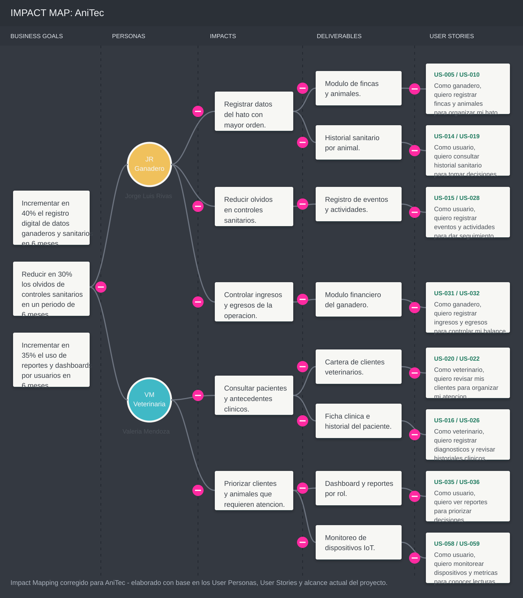

<div style="page-break-before: always;"></div>

<a id="toc-3-3-product-backlog"></a>
# 3.3. Product Backlog.

El Product Backlog de AniTec organiza las User Stories y Technical Stories identificadas para el desarrollo de la landing page, la aplicación web y el backend RESTful API. El orden se define priorizando el valor para el negocio y la experiencia del usuario, por lo que las historias de la landing page se ubican al inicio para validar la propuesta de valor, seguidas por funcionalidades principales de acceso, navegación, gestión ganadera, gestión veterinaria, analíticas, IoT, suscripciones e integración técnica.

<table>
  <thead>
    <tr>
      <th># ORDEN</th>
      <th>Epic / Story ID</th>
      <th>Titulo</th>
      <th>Descripcion</th>
      <th>Story Points</th>
    </tr>
  </thead>
  <tbody>
    <tr>
      <td><b>1</b></td>
      <td><b>US-044</b></td>
      <td>Visualizar pagina principal de la landing page</td>
      <td><b>Como</b> visitante, <b>quiero</b> ver la pagina principal de AniTec <b>para</b> comprender rapidamente que ofrece la plataforma.</td>
      <td>5</td>
    </tr>
    <tr>
      <td><b>2</b></td>
      <td><b>US-045</b></td>
      <td>Conocer beneficios generales de AniTec</td>
      <td><b>Como</b> visitante, <b>quiero</b> revisar los beneficios generales de AniTec <b>para</b> evaluar si la plataforma resuelve mis necesidades de gestion ganadera.</td>
      <td>3</td>
    </tr>
    <tr>
      <td><b>3</b></td>
      <td><b>US-046</b></td>
      <td>Visualizar pagina para ganaderos</td>
      <td><b>Como</b> ganadero visitante, <b>quiero</b> acceder a una pagina orientada a mi perfil <b>para</b> entender como AniTec mejora mi gestion diaria.</td>
      <td>5</td>
    </tr>
    <tr>
      <td><b>4</b></td>
      <td><b>US-047</b></td>
      <td>Visualizar pagina para veterinarios</td>
      <td><b>Como</b> veterinario visitante, <b>quiero</b> acceder a una pagina orientada a mi perfil <b>para</b> entender como AniTec apoya la gestion de clientes y pacientes.</td>
      <td>5</td>
    </tr>
    <tr>
      <td><b>5</b></td>
      <td><b>US-048</b></td>
      <td>Visualizar pagina nosotros</td>
      <td><b>Como</b> visitante, <b>quiero</b> conocer al equipo y la propuesta de AniTec <b>para</b> confiar en la solucion.</td>
      <td>3</td>
    </tr>
    <tr>
      <td><b>6</b></td>
      <td><b>US-049</b></td>
      <td>Cambiar idioma en la landing page</td>
      <td><b>Como</b> visitante, <b>quiero</b> cambiar el idioma de la landing page <b>para</b> leer la informacion en mi idioma preferido.</td>
      <td>3</td>
    </tr>
    <tr>
      <td><b>7</b></td>
      <td><b>US-050</b></td>
      <td>Consultar testimonios de usuarios</td>
      <td><b>Como</b> visitante, <b>quiero</b> leer testimonios de ganaderos o veterinarios <b>para</b> conocer experiencias de uso de AniTec.</td>
      <td>2</td>
    </tr>
    <tr>
      <td><b>8</b></td>
      <td><b>US-051</b></td>
      <td>Acceder a contacto o llamada a la accion</td>
      <td><b>Como</b> visitante interesado, <b>quiero</b> encontrar facilmente una llamada a la accion o datos de contacto <b>para</b> dar el siguiente paso con AniTec.</td>
      <td>2</td>
    </tr>
    <tr>
      <td><b>9</b></td>
      <td><b>US-052</b></td>
      <td>Visualizar landing page en dispositivos moviles</td>
      <td><b>Como</b> visitante movil, <b>quiero</b> navegar la landing page desde mi celular <b>para</b> conocer AniTec sin problemas de visualizacion.</td>
      <td>5</td>
    </tr>
    <tr>
      <td><b>10</b></td>
      <td><b>US-053</b></td>
      <td>Iniciar sesion como usuario registrado</td>
      <td><b>Como</b> usuario registrado, <b>quiero</b> iniciar sesion con mis credenciales <b>para</b> acceder a las funcionalidades que corresponden a mi rol.</td>
      <td>5</td>
    </tr>
    <tr>
      <td><b>11</b></td>
      <td><b>US-054</b></td>
      <td>Redirigir al dashboard del rol correspondiente</td>
      <td><b>Como</b> usuario autenticado, <b>quiero</b> ser enviado al panel correcto <b>para</b> usar solo las funciones propias de mi perfil.</td>
      <td>3</td>
    </tr>
    <tr>
      <td><b>12</b></td>
      <td><b>US-055</b></td>
      <td>Restringir rutas segun rol</td>
      <td><b>Como</b> usuario autenticado, <b>quiero</b> que el sistema me permita acceder solo a las secciones correspondientes a mi rol <b>para</b> evitar operaciones que no me pertenecen.</td>
      <td>5</td>
    </tr>
    <tr>
      <td><b>13</b></td>
      <td><b>US-056</b></td>
      <td>Cerrar sesion</td>
      <td><b>Como</b> usuario autenticado, <b>quiero</b> cerrar sesion <b>para</b> proteger mi informacion cuando deje de usar la aplicacion.</td>
      <td>2</td>
    </tr>
    <tr>
      <td><b>14</b></td>
      <td><b>US-057</b></td>
      <td>Cambiar idioma de la interfaz</td>
      <td><b>Como</b> usuario, <b>quiero</b> cambiar el idioma de la interfaz <b>para</b> utilizar la aplicacion en el idioma que prefiera.</td>
      <td>3</td>
    </tr>
    <tr>
      <td><b>15</b></td>
      <td><b>US-040</b></td>
      <td>Navegar mediante menu lateral segun rol</td>
      <td><b>Como</b> usuario autenticado, <b>quiero</b> ver un menu lateral adaptado a mi rol <b>para</b> acceder rapidamente a las secciones disponibles.</td>
      <td>5</td>
    </tr>
    <tr>
      <td><b>16</b></td>
      <td><b>US-041</b></td>
      <td>Visualizar pagina de inicio interna</td>
      <td><b>Como</b> usuario autenticado, <b>quiero</b> ver una pagina de inicio operativa <b>para</b> acceder a modulos principales y obtener un resumen general.</td>
      <td>3</td>
    </tr>
    <tr>
      <td><b>17</b></td>
      <td><b>US-042</b></td>
      <td>Visualizar pagina acerca de AniTec</td>
      <td><b>Como</b> usuario, <b>quiero</b> consultar informacion acerca de AniTec <b>para</b> entender el proposito de la aplicacion.</td>
      <td>2</td>
    </tr>
    <tr>
      <td><b>18</b></td>
      <td><b>US-043</b></td>
      <td>Visualizar pagina no encontrada</td>
      <td><b>Como</b> usuario, <b>quiero</b> ver un mensaje claro cuando ingreso a una ruta no disponible <b>para</b> saber que no existe contenido asociado.</td>
      <td>1</td>
    </tr>
    <tr>
      <td><b>19</b></td>
      <td><b>US-004</b></td>
      <td>Visualizar listado de fincas en cartas</td>
      <td><b>Como</b> ganadero, <b>quiero</b> ver mis fincas en cartas con informacion relevante <b>para</b> identificar facilmente cada unidad productiva.</td>
      <td>3</td>
    </tr>
    <tr>
      <td><b>20</b></td>
      <td><b>US-005</b></td>
      <td>Registrar nueva finca</td>
      <td><b>Como</b> ganadero, <b>quiero</b> registrar una nueva finca <b>para</b> organizar mis animales por ubicacion o unidad productiva.</td>
      <td>5</td>
    </tr>
    <tr>
      <td><b>21</b></td>
      <td><b>US-006</b></td>
      <td>Editar informacion de una finca</td>
      <td><b>Como</b> ganadero, <b>quiero</b> editar los datos de una finca <b>para</b> mantener actualizada su informacion.</td>
      <td>3</td>
    </tr>
    <tr>
      <td><b>22</b></td>
      <td><b>US-007</b></td>
      <td>Eliminar finca</td>
      <td><b>Como</b> ganadero, <b>quiero</b> eliminar una finca cuando ya no forma parte de mi operacion.</td>
      <td>2</td>
    </tr>
    <tr>
      <td><b>23</b></td>
      <td><b>US-008</b></td>
      <td>Visualizar animales en cartas</td>
      <td><b>Como</b> ganadero, <b>quiero</b> ver mis animales en cartas <b>para</b> revisar rapidamente la informacion principal de cada uno.</td>
      <td>3</td>
    </tr>
    <tr>
      <td><b>24</b></td>
      <td><b>US-009</b></td>
      <td>Buscar animales por texto</td>
      <td><b>Como</b> ganadero, <b>quiero</b> buscar animales por nombre, codigo, especie o raza <b>para</b> encontrarlos rapidamente cuando tenga muchos registros.</td>
      <td>5</td>
    </tr>
    <tr>
      <td><b>25</b></td>
      <td><b>US-010</b></td>
      <td>Registrar animal</td>
      <td><b>Como</b> ganadero, <b>quiero</b> registrar un animal indicando su especie y raza <b>para</b> mantener trazabilidad de mi ganado.</td>
      <td>5</td>
    </tr>
    <tr>
      <td><b>26</b></td>
      <td><b>US-011</b></td>
      <td>Editar animal</td>
      <td><b>Como</b> ganadero, <b>quiero</b> editar los datos de un animal <b>para</b> actualizar su estado, peso o informacion general.</td>
      <td>3</td>
    </tr>
    <tr>
      <td><b>27</b></td>
      <td><b>US-012</b></td>
      <td>Eliminar animal</td>
      <td><b>Como</b> ganadero, <b>quiero</b> eliminar un animal cuando ya no pertenece a mi hato o registro productivo.</td>
      <td>2</td>
    </tr>
    <tr>
      <td><b>28</b></td>
      <td><b>US-013</b></td>
      <td>Consultar animales segun rol</td>
      <td><b>Como</b> usuario, <b>quiero</b> que el sistema muestre animales segun mi rol <b>para</b> proteger la informacion de cada ganadero.</td>
      <td>3</td>
    </tr>
    <tr>
      <td><b>29</b></td>
      <td><b>US-014</b></td>
      <td>Visualizar registros sanitarios en cartas</td>
      <td><b>Como</b> usuario autorizado, <b>quiero</b> ver los registros sanitarios en cartas <b>para</b> revisar de forma clara la informacion clinica de los animales.</td>
      <td>3</td>
    </tr>
    <tr>
      <td><b>30</b></td>
      <td><b>US-015</b></td>
      <td>Registrar incidencia sanitaria como ganadero</td>
      <td><b>Como</b> ganadero, <b>quiero</b> registrar enfermedades o incidencias basicas de mis animales <b>para</b> dejar constancia y facilitar el seguimiento veterinario.</td>
      <td>5</td>
    </tr>
    <tr>
      <td><b>31</b></td>
      <td><b>US-016</b></td>
      <td>Registrar diagnostico y tratamiento como veterinario</td>
      <td><b>Como</b> veterinario, <b>quiero</b> registrar diagnostico, tratamiento, receta y seguimiento <b>para</b> documentar la atencion clinica de un animal.</td>
      <td>5</td>
    </tr>
    <tr>
      <td><b>32</b></td>
      <td><b>US-017</b></td>
      <td>Editar registro sanitario</td>
      <td><b>Como</b> usuario autorizado, <b>quiero</b> editar un registro sanitario <b>para</b> corregir o complementar informacion clinica.</td>
      <td>3</td>
    </tr>
    <tr>
      <td><b>33</b></td>
      <td><b>US-018</b></td>
      <td>Eliminar registro sanitario</td>
      <td><b>Como</b> usuario autorizado, <b>quiero</b> eliminar un registro sanitario incorrecto <b>para</b> mantener limpio el historial.</td>
      <td>2</td>
    </tr>
    <tr>
      <td><b>34</b></td>
      <td><b>US-019</b></td>
      <td>Consultar historial clinico por animal</td>
      <td><b>Como</b> veterinario, <b>quiero</b> consultar el historial clinico de un animal <b>para</b> tomar mejores decisiones durante una atencion.</td>
      <td>5</td>
    </tr>
    <tr>
      <td><b>35</b></td>
      <td><b>US-001</b></td>
      <td>Visualizar resumen operativo del ganadero</td>
      <td><b>Como</b> ganadero, <b>quiero</b> ver un resumen de mis animales, fincas, alertas y actividades <b>para</b> conocer rapidamente el estado de mi operacion.</td>
      <td>5</td>
    </tr>
    <tr>
      <td><b>36</b></td>
      <td><b>US-002</b></td>
      <td>Filtrar resumen por finca</td>
      <td><b>Como</b> ganadero, <b>quiero</b> filtrar mi dashboard por finca <b>para</b> revisar el estado de una unidad productiva especifica.</td>
      <td>3</td>
    </tr>
    <tr>
      <td><b>37</b></td>
      <td><b>US-003</b></td>
      <td>Acceder a acciones rapidas del ganadero</td>
      <td><b>Como</b> ganadero, <b>quiero</b> acceder rapidamente al registro de animales, incidencias y eventos <b>para</b> reducir pasos en tareas frecuentes.</td>
      <td>3</td>
    </tr>
    <tr>
      <td><b>38</b></td>
      <td><b>US-027</b></td>
      <td>Visualizar calendario de eventos</td>
      <td><b>Como</b> usuario, <b>quiero</b> ver mis eventos programados <b>para</b> organizar actividades ganaderas y sanitarias.</td>
      <td>3</td>
    </tr>
    <tr>
      <td><b>39</b></td>
      <td><b>US-028</b></td>
      <td>Crear evento o recordatorio</td>
      <td><b>Como</b> usuario, <b>quiero</b> crear eventos <b>para</b> programar controles, visitas, tareas productivas o recordatorios financieros.</td>
      <td>5</td>
    </tr>
    <tr>
      <td><b>40</b></td>
      <td><b>US-029</b></td>
      <td>Editar evento</td>
      <td><b>Como</b> usuario, <b>quiero</b> editar un evento <b>para</b> actualizar fecha, prioridad o estado.</td>
      <td>3</td>
    </tr>
    <tr>
      <td><b>41</b></td>
      <td><b>US-030</b></td>
      <td>Eliminar evento</td>
      <td><b>Como</b> usuario, <b>quiero</b> eliminar eventos que ya no son necesarios <b>para</b> mantener mi calendario ordenado.</td>
      <td>2</td>
    </tr>
    <tr>
      <td><b>42</b></td>
      <td><b>US-020</b></td>
      <td>Visualizar dashboard profesional del veterinario</td>
      <td><b>Como</b> veterinario, <b>quiero</b> ver un dashboard profesional <b>para</b> revisar clientes, pacientes activos, registros clinicos y seguimientos pendientes.</td>
      <td>5</td>
    </tr>
    <tr>
      <td><b>43</b></td>
      <td><b>US-021</b></td>
      <td>Seleccionar cliente en el dashboard veterinario</td>
      <td><b>Como</b> veterinario, <b>quiero</b> seleccionar un cliente ganadero <b>para</b> revisar sus fincas y animales antes de realizar acciones clinicas.</td>
      <td>3</td>
    </tr>
    <tr>
      <td><b>44</b></td>
      <td><b>US-022</b></td>
      <td>Visualizar clientes asignados en cartas</td>
      <td><b>Como</b> veterinario, <b>quiero</b> ver mis clientes en cartas con informacion completa <b>para</b> entender rapidamente la situacion de cada ganadero.</td>
      <td>3</td>
    </tr>
    <tr>
      <td><b>45</b></td>
      <td><b>US-023</b></td>
      <td>Agregar cliente ganadero a la cartera del veterinario</td>
      <td><b>Como</b> veterinario, <b>quiero</b> buscar ganaderos registrados y enviar una peticion <b>para</b> agregarlos a mi cartera de clientes.</td>
      <td>5</td>
    </tr>
    <tr>
      <td><b>46</b></td>
      <td><b>US-024</b></td>
      <td>Eliminar cliente de la cartera del veterinario</td>
      <td><b>Como</b> veterinario, <b>quiero</b> eliminar un cliente de mi lista <b>para</b> dejar de visualizar sus datos ganaderos y sanitarios.</td>
      <td>2</td>
    </tr>
    <tr>
      <td><b>47</b></td>
      <td><b>US-025</b></td>
      <td>Consultar pacientes por ganadero</td>
      <td><b>Como</b> veterinario, <b>quiero</b> seleccionar un cliente y ver sus animales <b>para</b> atenderlos de forma organizada.</td>
      <td>3</td>
    </tr>
    <tr>
      <td><b>48</b></td>
      <td><b>US-026</b></td>
      <td>Acceder al historial de un paciente</td>
      <td><b>Como</b> veterinario, <b>quiero</b> abrir el historial clinico desde la carta del paciente <b>para</b> revisar sus atenciones anteriores.</td>
      <td>3</td>
    </tr>
    <tr>
      <td><b>49</b></td>
      <td><b>US-031</b></td>
      <td>Visualizar movimientos financieros</td>
      <td><b>Como</b> ganadero, <b>quiero</b> ver mis ingresos, egresos y balance <b>para</b> controlar la rentabilidad de mi operacion.</td>
      <td>3</td>
    </tr>
    <tr>
      <td><b>50</b></td>
      <td><b>US-032</b></td>
      <td>Registrar movimiento financiero</td>
      <td><b>Como</b> ganadero, <b>quiero</b> registrar ingresos y egresos <b>para</b> mantener actualizado mi balance mensual.</td>
      <td>5</td>
    </tr>
    <tr>
      <td><b>51</b></td>
      <td><b>US-033</b></td>
      <td>Editar movimiento financiero</td>
      <td><b>Como</b> ganadero, <b>quiero</b> editar un movimiento financiero <b>para</b> corregir montos, categorias o fechas.</td>
      <td>3</td>
    </tr>
    <tr>
      <td><b>52</b></td>
      <td><b>US-034</b></td>
      <td>Eliminar movimiento financiero</td>
      <td><b>Como</b> ganadero, <b>quiero</b> eliminar un movimiento incorrecto <b>para</b> mantener mi balance limpio.</td>
      <td>2</td>
    </tr>
    <tr>
      <td><b>53</b></td>
      <td><b>US-035</b></td>
      <td>Visualizar reportes del ganadero</td>
      <td><b>Como</b> ganadero, <b>quiero</b> ver reportes basados en mis propios animales, fincas y registros sanitarios <b>para</b> tomar decisiones sobre el estado sanitario y productivo de mi hato.</td>
      <td>5</td>
    </tr>
    <tr>
      <td><b>54</b></td>
      <td><b>US-036</b></td>
      <td>Visualizar reportes del veterinario</td>
      <td><b>Como</b> veterinario, <b>quiero</b> ver reportes sanitarios de mis clientes asignados <b>para</b> priorizar pacientes, seguimientos y atenciones por hato.</td>
      <td>5</td>
    </tr>
    <tr>
      <td><b>55</b></td>
      <td><b>US-037</b></td>
      <td>Visualizar estado sanitario del hato</td>
      <td><b>Como</b> ganadero, <b>quiero</b> ver un grafico del estado de mis animales <b>para</b> identificar cuantos estan saludables, en observacion o en tratamiento.</td>
      <td>5</td>
    </tr>
    <tr>
      <td><b>56</b></td>
      <td><b>US-038</b></td>
      <td>Visualizar registros sanitarios por tipo</td>
      <td><b>Como</b> usuario autorizado, <b>quiero</b> ver los registros sanitarios agrupados por tipo <b>para</b> entender que atenciones son mas frecuentes.</td>
      <td>3</td>
    </tr>
    <tr>
      <td><b>57</b></td>
      <td><b>US-039</b></td>
      <td>Visualizar atenciones sanitarias por hato</td>
      <td><b>Como</b> veterinario, <b>quiero</b> ver las atenciones sanitarias por hato <b>para</b> identificar que clientes requieren mas seguimiento.</td>
      <td>3</td>
    </tr>
    <tr>
      <td><b>58</b></td>
      <td><b>US-058</b></td>
      <td>Visualizar dispositivos IoT registrados</td>
      <td><b>Como</b> usuario autenticado, <b>quiero</b> ver los dispositivos IoT registrados en la plataforma <b>para</b> monitorear los equipos asociados a fincas o animales.</td>
      <td>5</td>
    </tr>
    <tr>
      <td><b>59</b></td>
      <td><b>US-059</b></td>
      <td>Consultar metricas de un dispositivo IoT</td>
      <td><b>Como</b> usuario autenticado, <b>quiero</b> consultar las metricas recientes de un dispositivo <b>para</b> conocer lecturas como peso, temperatura, humedad o actividad.</td>
      <td>5</td>
    </tr>
    <tr>
      <td><b>60</b></td>
      <td><b>US-060</b></td>
      <td>Visualizar planes de suscripcion</td>
      <td><b>Como</b> usuario autenticado, <b>quiero</b> visualizar los planes de suscripcion disponibles <b>para</b> elegir el plan que mejor se adapte a mi operacion.</td>
      <td>3</td>
    </tr>
    <tr>
      <td><b>61</b></td>
      <td><b>US-061</b></td>
      <td>Consultar suscripcion activa</td>
      <td><b>Como</b> usuario autenticado, <b>quiero</b> consultar mi suscripcion activa <b>para</b> conocer el plan asociado a mi cuenta.</td>
      <td>3</td>
    </tr>
    <tr>
      <td><b>62</b></td>
      <td><b>US-062</b></td>
      <td>Realizar pago simulado de suscripcion</td>
      <td><b>Como</b> usuario autenticado, <b>quiero</b> realizar un pago simulado de un plan <b>para</b> activar una suscripcion durante las pruebas del sistema.</td>
      <td>5</td>
    </tr>
    <tr>
      <td><b>63</b></td>
      <td><b>US-063</b></td>
      <td>Consultar historial de pagos</td>
      <td><b>Como</b> usuario autenticado, <b>quiero</b> consultar mi historial de pagos <b>para</b> revisar los pagos realizados por mis suscripciones.</td>
      <td>3</td>
    </tr>
    <tr>
      <td><b>64</b></td>
      <td><b>US-064</b></td>
      <td>Consumir dashboards desde el backend</td>
      <td><b>Como</b> usuario autenticado, <b>quiero</b> visualizar dashboards calculados desde el backend <b>para</b> revisar indicadores consistentes con la informacion persistida en la base de datos.</td>
      <td>5</td>
    </tr>
    <tr>
      <td><b>65</b></td>
      <td><b>TS-005</b></td>
      <td>Configuracion inicial del backend con ASP.NET Core</td>
      <td><b>Como</b> Developer backend, <b>quiero</b> crear la solucion de AniTec con ASP.NET Core <b>para</b> implementar una API REST organizada y preparada para integrarse con el frontend.</td>
      <td>5</td>
    </tr>
    <tr>
      <td><b>66</b></td>
      <td><b>TS-006</b></td>
      <td>Persistencia con Entity Framework Core y MySQL</td>
      <td><b>Como</b> Developer backend, <b>quiero</b> configurar Entity Framework Core con MySQL <b>para</b> almacenar la informacion de AniTec en una base de datos relacional.</td>
      <td>8</td>
    </tr>
    <tr>
      <td><b>67</b></td>
      <td><b>TS-007</b></td>
      <td>Autenticacion backend con JWT y BCrypt</td>
      <td><b>Como</b> Developer backend, <b>quiero</b> implementar autenticacion con JWT y BCrypt <b>para</b> validar credenciales y proteger el acceso de los usuarios registrados.</td>
      <td>8</td>
    </tr>
    <tr>
      <td><b>68</b></td>
      <td><b>TS-008</b></td>
      <td>Implementacion de bounded contexts de gestion ganadera</td>
      <td><b>Como</b> Developer backend, <b>quiero</b> implementar los bounded contexts principales de AniTec <b>para</b> exponer servicios REST de fincas, animales, sanidad, actividades y finanzas.</td>
      <td>8</td>
    </tr>
    <tr>
      <td><b>69</b></td>
      <td><b>TS-009</b></td>
      <td>Servicios backend para analiticas y clientes veterinarios</td>
      <td><b>Como</b> Developer backend, <b>quiero</b> implementar endpoints de analiticas y clientes veterinarios <b>para</b> que ganaderos y veterinarios consulten informacion calculada desde el servidor.</td>
      <td>5</td>
    </tr>
    <tr>
      <td><b>70</b></td>
      <td><b>TS-010</b></td>
      <td>Servicios backend para dispositivos, metricas y suscripciones</td>
      <td><b>Como</b> Developer backend, <b>quiero</b> implementar dispositivos, metricas y suscripciones <b>para</b> ampliar AniTec con informacion IoT y planes de uso de la plataforma.</td>
      <td>5</td>
    </tr>
    <tr>
      <td><b>71</b></td>
      <td><b>TS-011</b></td>
      <td>Documentacion y pruebas de API con Swagger</td>
      <td><b>Como</b> Developer backend, <b>quiero</b> documentar y probar los endpoints con Swagger <b>para</b> validar manualmente el funcionamiento de la API antes de integrarla con el frontend.</td>
      <td>3</td>
    </tr>
    <tr>
      <td><b>72</b></td>
      <td><b>TS-012</b></td>
      <td>Integracion frontend-backend con variables de entorno</td>
      <td><b>Como</b> Developer frontend, <b>quiero</b> configurar variables de entorno <b>para</b> conectar la aplicacion Vue con la API de AniTec en distintos ambientes.</td>
      <td>5</td>
    </tr>
    <tr>
      <td><b>73</b></td>
      <td><b>TS-013</b></td>
      <td>Stores frontend para IoT y suscripciones</td>
      <td><b>Como</b> Developer frontend, <b>quiero</b> crear stores y servicios para dispositivos, metricas, planes y pagos <b>para</b> integrar las nuevas pantallas con el backend.</td>
      <td>5</td>
    </tr>
    <tr>
      <td><b>74</b></td>
      <td><b>TS-014</b></td>
      <td>Mapeo de recursos de clientes veterinarios</td>
      <td><b>Como</b> Developer frontend, <b>quiero</b> mapear correctamente los recursos de clientes veterinarios <b>para</b> diferenciar el identificador de la relacion y el identificador del ganadero.</td>
      <td>3</td>
    </tr>
    <tr>
      <td><b>75</b></td>
      <td><b>TS-015</b></td>
      <td>Configuracion de endpoints para despliegue productivo</td>
      <td><b>Como</b> Developer frontend, <b>quiero</b> configurar el ambiente de produccion <b>para</b> que la aplicacion desplegada consuma el backend real y no el servicio mock utilizado durante prototipado.</td>
      <td>3</td>
    </tr>
  </tbody>
</table>

<div style="page-break-before: always;"></div>

<a id="toc-4-1-style-guidelines"></a>
# 4.1. Style Guidelines

Las directrices de estilo establecen los principios visuales y de diseño que deben seguirse al desarrollar la interfaz de usuario (UI) de AniTec. El objetivo es crear una experiencia digital clara, accesible e intuitiva que responda a las necesidades de pequeños y medianos ganaderos, así como de veterinarios que realizan seguimiento sanitario de animales en campo.

El concepto visual se centra en transmitir confianza, simplicidad y eficiencia rural. A través del uso de una paleta de colores naturales (verdes, marrones suaves y tonos tierra), combinada con tipografías limpias y legibles, AniTec busca generar una atmósfera amigable y funcional que conecte con el entorno productivo del usuario.

El diseño debe priorizar la facilidad de uso, incluso para personas con poca experiencia tecnológica, reforzando así la inclusión digital en el campo. La interfaz debe permitir una navegación fluida desde cualquier dispositivo y ofrecer información clara y accesible para fomentar la toma de decisiones informadas. Este enfoque visual fortalece la misión de AniTec de modernizar la gestión ganadera con herramientas tecnológicas simples pero poderosas.

AniTec se desarrolla como una experiencia responsive web, por lo que las decisiones de estilo móvil se integran dentro del Web Style Guide. No se plantea una aplicación móvil nativa independiente; en su lugar, la landing page y la aplicación web deben adaptarse correctamente a desktop, tablet y celulares mediante layouts flexibles, componentes legibles y navegación simplificada.

<a id="toc-4-1-1-general-style-guidelines"></a>
## 4.1.1. General Style Guidelines

Los colores resultan fundamentales para transmitir la identidad visual de la marca. En este sector, la paleta cromática seleccionada fue inspirada en la naturaleza y el entorno rural, utilizando tonos tierra, verdes orgánicos y acentos neutros. Estos colores reflejan sostenibilidad, confianza y cercanía con el campo.

Además, la selección de colores debe estar alineada con los valores de innovación, simplicidad y eficiencia, transmitiendo al usuario una sensación de claridad y profesionalismo sin perder la conexión con el entorno agrícola. Para el segmento veterinario, esta identidad debe conservar una apariencia ordenada y confiable que facilite la consulta de pacientes, clientes y registros sanitarios.

**Colores principales:**

| Código HEX | Color                                                                   | Uso                                                     |
| ---------- | ----------------------------------------------------------------------- | ------------------------------------------------------- |
| #925930    |  | Color primario - botones principales, textos destacados |
| #79B267    |  | Color secundario - CTAs positivos, iconos de éxito      |
| #F5F0E6    |  | Color de fondo principal                                |

**Colores secundarios:**

| Código HEX | Color                                                                   | Uso                            |
| ---------- | ----------------------------------------------------------------------- | ------------------------------ |
| #A3794F    |  | Acentos, bordes sutiles        |
| #A3C4A8    |  | Fondos de tarjetas, highlights |
| #D1BFA5    |  | Fondos alternativos            |

**Typography:**

La tipografía Poppins aporta una estética moderna, limpia y accesible que conecta tanto con el origen humano del campo como con la eficiencia del mundo digital. Poppins, con su estilo geométrico, pero con un sutil toque humano, transmite cercanía y adaptabilidad, ideal para un sector que valora la conexión entre la tradición agrícola y la innovación tecnológica.

Esta tipografía comunica una marca que se dedica al agro digital con un enfoque en la inclusión, sostenibilidad e innovación, logrando un balance perfecto entre raíces locales y visión global.

<div align="center">
  <p>
    <b>Grafico</b>: Estilos de Poppins
  </p>
  
  <p>
    <i><b>Fuente</b>: Elaboración propia.</i>
  </p>
</div>

**Icons:**

Se ha seleccionado el set de Bootstrap Icons. Este set, disponible en Bootstrap Icons, ofrece una estética limpia, arredondada y moderna, ideal para reflejar los valores de accesibilidad, innovación y cercanía del sector agropecuario digital.

Los íconos utilizados mantienen una línea uniforme y amigable, facilitando la navegación y mejorando la experiencia de usuario.

<div align="center">
  <p>
    <b>Grafico</b>: Bootstrap Icons
  </p>
  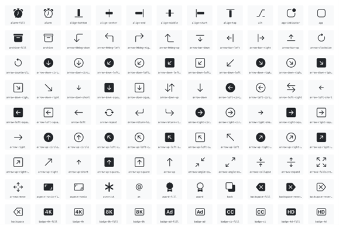
  <p>
    <i><b>Fuente</b>: Fonts-online.reu</i>
  </p>
</div>

**Tono de comunicación:**

El tono de AniTec debe ser claro, cercano y respetuoso. Se busca una comunicación formal pero accesible, evitando tecnicismos innecesarios para los ganaderos y manteniendo precisión suficiente para los veterinarios. La redacción debe ser serena, directa y orientada a la acción, usando etiquetas breves como "Animales", "Sanidad", "Finanzas", "Actividades", "IoT", "Clientes" y "Planes".

**Spacing y composición:**

El espaciado debe favorecer la lectura rápida y la separación clara entre módulos. En desktop se priorizan paneles amplios, tablas o tarjetas con información resumida; en pantallas pequeñas se organizan los elementos en una sola columna para mantener legibilidad. Los formularios deben agrupar campos relacionados y evitar saturar al usuario con demasiada información en una misma vista.

<a id="toc-4-1-2-web-style-guidelines"></a>
## 4.1.2. Web Style Guidelines

El Web Style Guide de AniTec nos ayuda a mostrar una identidad visual coherente y accesible en toda la plataforma. Definimos colores, tipografías y elementos de diseño inspirados en el entorno rural para transmitir confianza, tecnología cercana y facilidad de uso.

Nuestra paleta refleja valores como sostenibilidad y cercanía, mientras que las tipografías priorizan la legibilidad. Esta guía fortalece la presencia visual de AniTec y mejora la experiencia del usuario.

Se incluyen imágenes que ilustran los principales lineamientos: colores, fuentes, espaciado y componentes clave, garantizando una interfaz clara y funcional.

**Layout web responsive:**

La estructura web debe adaptarse a diferentes tamaños de pantalla. En desktop se permite una distribución de mayor densidad visual, con dashboard, menú lateral y tarjetas de resumen. En tablet y celular, los contenidos deben reorganizarse verticalmente, priorizando información esencial, botones claros y formularios de una columna.

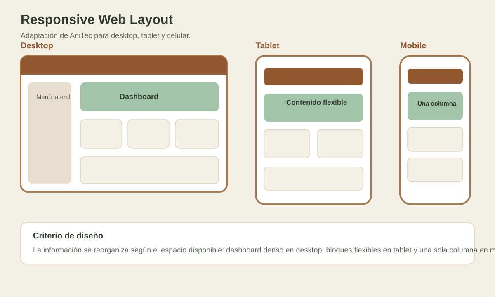

El layout responsive permite que AniTec mantenga la misma experiencia funcional en distintos dispositivos. En pantallas grandes se aprovecha el espacio para mostrar más indicadores y accesos directos; en pantallas pequeñas se prioriza una lectura lineal y acciones principales.

**Navegación:**

La navegación de la aplicación se basa en un menú lateral para usuarios autenticados y una navegación superior para la landing page. El menú debe variar según el rol del usuario: el ganadero accede a módulos como fincas, animales, sanidad, finanzas, actividades, IoT y planes; el veterinario accede a dashboard, clientes, pacientes, sanidad, actividades, analíticas, IoT y planes. Esta separación reduce confusión y permite que cada segmento encuentre rápidamente sus tareas principales.

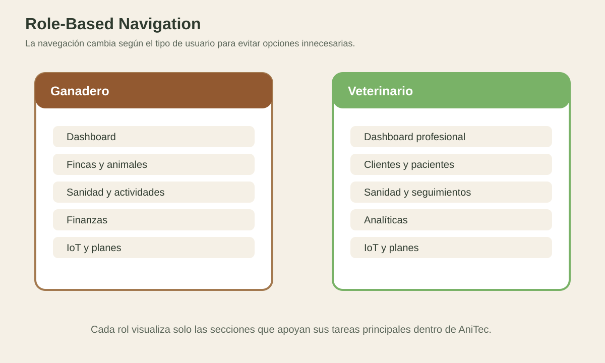

La navegación por rol reduce la carga cognitiva del usuario, ya que cada segmento visualiza únicamente los módulos relacionados con sus tareas. Esto permite que ganaderos y veterinarios encuentren con mayor rapidez las acciones frecuentes dentro de la aplicación.

**Botones y acciones:**

Los botones principales deben usarse para acciones de creación o confirmación, como registrar, guardar o pagar. Los botones secundarios deben reservarse para cancelar, volver o limpiar filtros. Las acciones destructivas, como eliminar registros, deben diferenciarse visualmente y requerir confirmación cuando corresponda.

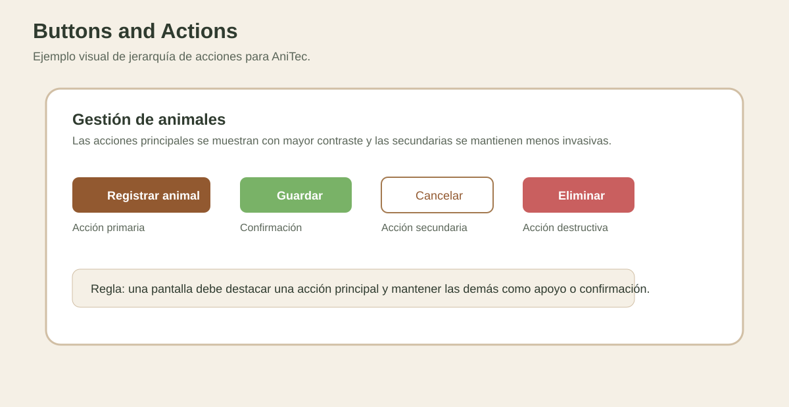

Este ejemplo muestra la jerarquía visual esperada para las acciones de AniTec. Las acciones principales tienen mayor peso visual, las secundarias se presentan como apoyo y las destructivas se diferencian para evitar errores.

**Formularios:**

Los formularios deben mostrar etiquetas claras, campos agrupados por propósito y mensajes de validación comprensibles. En registros ganaderos y sanitarios se debe priorizar que el usuario complete primero los datos esenciales, como animal, fecha, tipo de evento, descripción, finca o cliente relacionado.

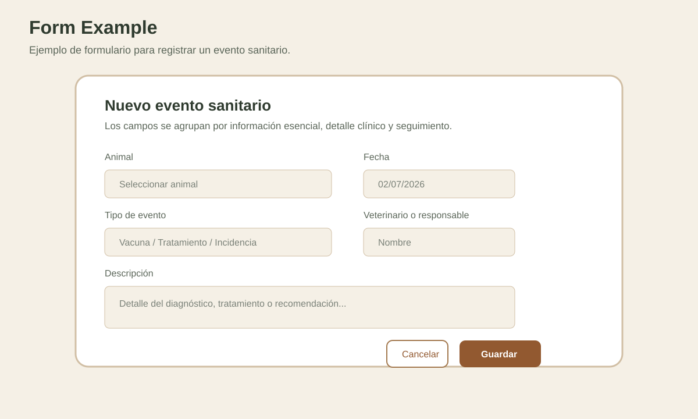

El formulario de ejemplo representa una estructura clara para registrar eventos sanitarios. Se prioriza la selección del animal, fecha, tipo de evento y descripción, manteniendo acciones finales simples para guardar o cancelar.

**Tarjetas, tablas y estados:**

Las tarjetas se utilizan para resumir animales, fincas, clientes, dispositivos, planes o registros principales. Las tablas o listas se emplean cuando el usuario necesita comparar varios registros. Cuando no existan datos, la interfaz debe mostrar estados vacíos con mensajes simples que expliquen la situación sin generar confusión.

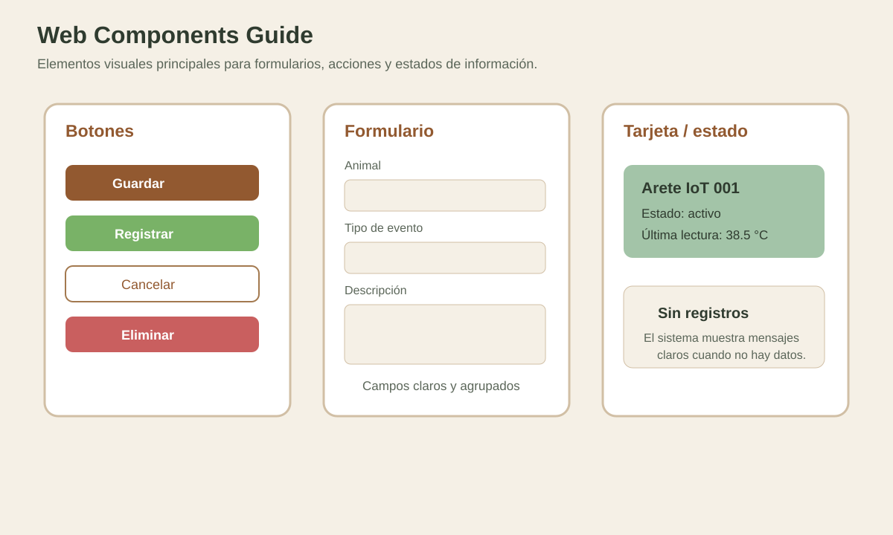

Los componentes visuales mantienen una jerarquía clara: botones para acciones, formularios para registrar datos y tarjetas para resumir información relevante. Los estados vacíos ayudan a orientar al usuario cuando todavía no existen registros en un módulo.

**Consistencia visual:**

La landing page y la aplicación web deben mantener la misma identidad de marca, pero con distinta densidad de información. La landing page prioriza comunicación, confianza y propuesta de valor; la aplicación web prioriza operación diaria, consulta de datos y registro de información.

<div style="page-break-before: always;"></div>

<a id="toc-4-2-information-architecture"></a>
# 4.2. Information Architecture

La arquitectura de información de AniTec organiza el contenido de la landing page y de la aplicación web para que visitantes, ganaderos y veterinarios encuentren con facilidad las secciones que necesitan. La propuesta considera que los usuarios pueden tener distintos niveles de experiencia digital, por lo que se priorizan etiquetas claras, recorridos simples y una separación de módulos según el rol.

En la landing page, la información se organiza para presentar la propuesta de valor, beneficios, segmentos, testimonios, planes y llamadas a la acción. En la aplicación web, la información se organiza por tareas operativas: gestión de fincas, animales, sanidad, actividades, finanzas, clientes veterinarios, pacientes, analíticas, IoT y suscripciones.

<a id="toc-4-2-1-organization-systems"></a>
## 4.2.1. Organization Systems

- **Organización jerárquica:** Se aplica en dashboards, landing page y vistas principales para destacar primero los datos más importantes. Por ejemplo, el dashboard del ganadero prioriza indicadores de animales, fincas, alertas y actividades; mientras que el dashboard veterinario prioriza clientes, pacientes, eventos sanitarios y seguimientos.

- **Organización secuencial:** Se usa en formularios y flujos donde el usuario debe completar pasos de forma ordenada, como registrar un animal, crear una finca, registrar un evento sanitario, agregar un cliente veterinario o realizar un pago de prueba de suscripción.

- **Organización por audiencia:** La landing page separa mensajes para visitantes generales, ganaderos y veterinarios. Dentro de la aplicación, la navegación cambia según el rol: el ganadero visualiza módulos relacionados con su operación productiva, mientras que el veterinario accede a clientes, pacientes, sanidad y analíticas.

- **Organización por tópicos:** Los módulos se agrupan según el tipo de información que gestionan: ganadería, sanidad, finanzas, actividades, IoT, analíticas y planes. Esto permite que el usuario ubique cada función por el tema que desea resolver.

- **Organización cronológica:** Se aplica en actividades, historial sanitario, pagos y métricas de dispositivos IoT, ya que estos registros dependen de fechas y seguimiento temporal.

- **Organización matricial:** Se utiliza en dashboards, reportes y analíticas, donde el usuario puede comparar indicadores por finca, animal, cliente, estado sanitario o tipo de evento.

<a id="toc-4-2-2-labeling-systems"></a>
## 4.2.2. Labeling Systems

El sistema de etiquetado de AniTec usa palabras breves y familiares para evitar confusión. Las etiquetas deben ser entendibles tanto para ganaderos con poca experiencia digital como para veterinarios que necesitan revisar información clínica con rapidez.

| Contexto | Etiqueta | Significado para el usuario |
|----------|----------|-----------------------------|
| Landing page | Inicio | Presenta la propuesta principal de AniTec. |
| Landing page | Beneficios | Resume el valor de la plataforma para los segmentos objetivo. |
| Landing page | Ganaderos | Explica funciones orientadas a la gestión del hato. |
| Landing page | Veterinarios | Explica funciones orientadas a clientes, pacientes y seguimiento sanitario. |
| Landing page | Planes | Presenta las opciones de suscripción. |
| Aplicación ganadero | Dashboard | Muestra el resumen general de la operación ganadera. |
| Aplicación ganadero | Fincas | Agrupa las unidades productivas del ganadero. |
| Aplicación ganadero | Animales | Permite consultar y registrar animales. |
| Aplicación ganadero | Sanidad | Reúne eventos sanitarios, incidencias y tratamientos. |
| Aplicación ganadero | Finanzas | Permite revisar ingresos, egresos y balance. |
| Aplicación ganadero | Actividades | Organiza tareas, visitas, controles y recordatorios. |
| Aplicación compartida | IoT | Muestra dispositivos, estado y métricas asociadas. |
| Aplicación compartida | Planes | Permite consultar suscripción activa, planes y pagos de prueba. |
| Aplicación veterinario | Clientes | Muestra ganaderos asignados al veterinario. |
| Aplicación veterinario | Pacientes | Muestra animales pertenecientes a clientes asignados. |
| Aplicación veterinario | Analíticas | Presenta reportes e indicadores para priorizar atenciones. |

Las etiquetas de acción también se mantienen simples: "Registrar", "Guardar", "Editar", "Eliminar", "Cancelar", "Buscar", "Agregar cliente" y "Ver historial". Estas palabras describen directamente la acción esperada y reducen la posibilidad de interpretación ambigua.

<a id="toc-4-2-3-seo-tags-and-meta-tags"></a>
## 4.2.3. SEO Tags and Meta Tags

**Landing Page:**

- **Title:** AniTec - Plataforma Digital para Ganaderos y Veterinarios
- **Description:** AniTec es una plataforma web accesible para pequeños y medianos ganaderos y veterinarios de campo. Permite gestionar animales, fincas, sanidad, actividades, finanzas, dispositivos IoT, clientes, pacientes y planes de suscripción.
- **Keywords:** AniTec, gestión ganadera, plataforma para ganaderos, veterinarios, salud animal, historial clínico animal, trazabilidad ganadera, IoT ganadero, fincas, animales, sanidad, planes de suscripción, tecnología rural
- **Author:** AniTec

**Application Web:**

- **Title:** AniTec - Gestión Ganadera, Sanitaria e IoT
- **Description:** Aplicación web de AniTec para gestionar información ganadera y veterinaria mediante dashboards por rol, registro de animales, eventos sanitarios, actividades, finanzas, clientes veterinarios, pacientes, analíticas, dispositivos IoT y suscripciones.
- **Keywords:** AniTec app, dashboard ganadero, dashboard veterinario, gestión de animales, eventos sanitarios, clientes veterinarios, pacientes, finanzas ganaderas, analíticas ganaderas, métricas IoT, suscripciones AniTec
- **Author:** AniTec

<a id="toc-4-2-4-searching-systems"></a>
## 4.2.4. Searching Systems

El sistema de búsqueda en AniTec ayuda a encontrar información dentro de módulos con muchos registros. Las opciones de búsqueda deben mostrar resultados filtrados de forma inmediata y acompañarse de estados vacíos cuando no existan coincidencias.

- **Búsqueda de animales:** Permite buscar por nombre, código, especie, raza, estado o finca.
- **Búsqueda de fincas:** Permite ubicar unidades productivas por nombre, ubicación o tipo principal.
- **Búsqueda de registros sanitarios:** Permite filtrar por animal, tipo de evento, fecha, diagnóstico, tratamiento o veterinario responsable.
- **Búsqueda de clientes veterinarios:** Permite encontrar ganaderos asignados o disponibles para agregar a la cartera del veterinario.
- **Búsqueda de pacientes:** Permite ubicar animales pertenecientes a clientes asignados.
- **Filtros por fecha:** Se aplican en actividades, pagos, métricas IoT y eventos sanitarios.
- **Filtros por estado:** Se aplican en animales, dispositivos IoT, actividades y suscripciones.

Después de una búsqueda, los datos deben mostrarse en tarjetas, listas o tablas según el módulo. Si no hay coincidencias, la interfaz debe mostrar mensajes claros como "No se encontraron animales" o "No hay registros disponibles".

<a id="toc-4-2-5-navigation-systems"></a>
## 4.2.5. Navigation Systems

Los sistemas de navegación de AniTec se diseñan para guiar a visitantes y usuarios autenticados de forma clara. La landing page utiliza navegación superior, mientras que la aplicación web utiliza menú lateral adaptado al rol.

**Navegación de Landing Page:**

- Inicio: Presenta el nombre del producto y su propuesta de valor.
- Beneficios: Explica cómo AniTec ayuda a organizar la gestión ganadera y veterinaria.
- Ganaderos: Muestra funciones orientadas a fincas, animales, sanidad, finanzas e IoT.
- Veterinarios: Muestra funciones orientadas a clientes, pacientes, historial clínico y seguimiento sanitario.
- Planes: Presenta opciones de suscripción.
- Contacto: Permite al visitante conocer cómo comunicarse o iniciar el uso de la plataforma.

**Navegación de aplicación para ganadero:**

- Login: El usuario ingresa credenciales básicas.
- Dashboard ganadero: El sistema muestra resumen de fincas, animales, sanidad, actividades y finanzas.
- Fincas y animales: El usuario registra y consulta unidades productivas y animales.
- Sanidad y actividades: El usuario registra eventos sanitarios, tratamientos, visitas o tareas.
- Finanzas: El usuario revisa ingresos, egresos y balance.
- IoT y planes: El usuario consulta dispositivos, métricas, suscripción activa y pagos de prueba.

**Navegación de aplicación para veterinario:**

- Login: El usuario ingresa credenciales básicas.
- Dashboard veterinario: El sistema muestra clientes, pacientes, seguimientos y registros clínicos.
- Clientes: El veterinario revisa ganaderos asignados o agrega nuevos clientes.
- Pacientes: El veterinario consulta animales de sus clientes.
- Sanidad: El veterinario registra diagnósticos, tratamientos, recetas y seguimientos.
- Analíticas: El veterinario revisa indicadores para priorizar atenciones.
- IoT y planes: El veterinario consulta dispositivos, métricas, suscripción activa y pagos de prueba.

La navegación por rol permite que cada usuario acceda solo a las secciones relevantes para su trabajo. Esto reduce la carga cognitiva, evita rutas innecesarias y mantiene una experiencia coherente entre la landing page, el inicio de sesión y los dashboards principales.

<div style="page-break-before: always;"></div>

<a id="toc-4-3-landing-page-ui-design"></a>
# 4.3. Landing Page UI Design

El diseño de la Landing Page de AniTec fue desarrollado con el propósito de ofrecer al visitante una primera impresión clara, atractiva y funcional sobre la aplicación y sus beneficios. La interfaz busca comunicar de manera efectiva la propuesta de valor de la plataforma, enfocándose en la digitalización y optimización de la gestión ganadera y veterinaria mediante herramientas tecnológicas accesibles e intuitivas.

La propuesta visual toma como base las decisiones definidas en las Style Guidelines y en la Information Architecture. Por ello, la landing page organiza el contenido con una jerarquía clara, navegación simple, mensajes dirigidos a ganaderos y veterinarios, y secciones adaptadas para una experiencia responsive en desktop y mobile web.

<a id="toc-4-3-1-landing-page-wireframe"></a>
## 4.3.1. Landing Page Wireframe

El wireframe de la landing page de AniTec actúa como una guía visual preliminar que organiza los elementos esenciales de la página sin entrar en detalles gráficos. Este esquema muestra la distribución de secciones clave como el encabezado con el logo y menú de navegación, una propuesta de valor centrada en la digitalización ganadera, testimonios de usuarios reales del campo, y llamadas a la acción destacadas que invitan a conocer la aplicación. El objetivo es garantizar una experiencia intuitiva para el visitante y facilitar su conversión en usuario activo de la plataforma.

Enlace para acceder al https://www.figma.com/design/WbTy5Gd0VpFbXolfe3OQ0C/ExamenIHCJorgeAyala?node-id=5-678&t=Erdbu1dwId9dtDbq-1

El wireframe se caracteriza por:

- Estructura en blanco y negro con bordes negros
- Placeholder (X) en lugar de imágenes e iconos
- Texto genérico (Lorem ipsum) para contenido
- Fondos grises para diferenciar secciones
- Diseño responsive para móvil y desktop

La propuesta del wireframe aplica principios de diseño, diseño inclusivo y arquitectura de información, ya que organiza las secciones de forma jerárquica, facilita la lectura del contenido principal y permite que los visitantes identifiquen rápidamente los beneficios de AniTec según su segmento.

<div align="center">
  <p>
    <b>Grafico</b>: AniTec Wireframe
  </p>
  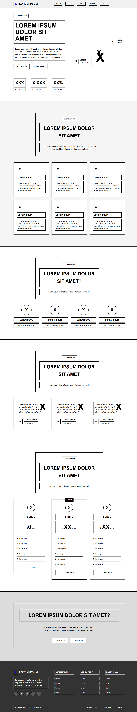
  <p>
    <i><b>Fuente</b>: Elaboración propia.</i>
  </p>
</div>

<a id="toc-4-3-2-landing-page-mock-up"></a>
## 4.3.2. Landing Page Mock-up

El mock-up de la landing page de AniTec representa una versión detallada y cercana al diseño final, integrando colores, tipografías e imágenes que reflejan la identidad visual de la plataforma. Este diseño ofrece una vista realista de cómo se presentará la página a los usuarios, destacando una estética moderna, accesible y alineada con el sector agroindustrial ganadero. Además, refuerza la importancia de mantener coherencia visual y claridad en la propuesta de valor, transmitiendo confianza, profesionalismo y compromiso con la innovación tecnológica en el campo.

Enlace para acceder al https://www.figma.com/design/WbTy5Gd0VpFbXolfe3OQ0C/ExamenIHCJorgeAyala?node-id=0-1&t=Erdbu1dwId9dtDbq-1

El mock-up incluye:

- Paleta de colores completa (verdes, marrones, crema)
- Tipografía Poppins aplicada
- Imágenes reales del producto
- Iconos de Bootstrap Icons
- Diseño final con detalles visuales
- Animaciones y transiciones
- Versión responsive completa

El mock-up aplica la paleta de colores, tipografía, navegación y jerarquía visual definidas en el Style Guide. Además, considera al segmento veterinario dentro de la comunicación de la landing page, mostrando que AniTec no solo apoya la gestión del ganadero, sino también el seguimiento de clientes, pacientes e información sanitaria.

<div align="center">
  <p>
    <b>Grafico</b>: AniTec Mock-up
  </p>
  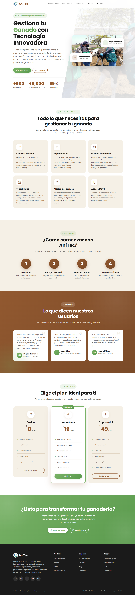
  <p>
    <i><b>Fuente</b>: Elaboración propia.</i>
  </p>
</div>

<div style="page-break-before: always;"></div>

<a id="toc-4-4-web-applications-ux-ui-design"></a>
# 4.4. Web Applications UX/UI Design.

La aplicación web de AniTec contempla una experiencia diferenciada para ganaderos y veterinarios. El ganadero utiliza la plataforma para administrar fincas, animales, sanidad, actividades, finanzas, dispositivos IoT y planes; mientras que el veterinario la utiliza para revisar clientes, pacientes, registros clínicos, seguimientos y analíticas. Esta separación permite que cada rol acceda a las funciones necesarias para cumplir sus tareas dentro de la solución.

<a id="toc-4-4-1-web-applications-wireframes"></a>
## 4.4.1. Web Applications Wireframes.

Los wireframes de la aplicación web de AniTec ilustran la estructura y distribución de las principales pantallas dirigidas al ámbito agroindustrial, con énfasis en el sector ganadero. Estos bocetos permiten validar la estructura, navegación y jerarquía de la información antes de avanzar hacia el diseño visual definitivo. También permiten visualizar la organización de los componentes de la interfaz y el flujo de navegación entre las distintas secciones, sirviendo como referencia para el diseño definitivo. De este modo, se asegura una experiencia de usuario clara, ágil y alineada con las necesidades reales de los productores. Fueron elaborados utilizando Figma. Enlace para acceder a los wireframes: https://www.figma.com/design/9RliVy9r8aEzyfyEof3DGr/Untitled?node-id=0-1&t=q2mM6e2YoQyJLZaK-1

<div align="center">

Pantalla de login en la aplicación


<p>
    <i><b>Fuente</b>: Elaboración propia.</i>
  </p>

Pantalla para registrarse en la aplicación


<p>
    <i><b>Fuente</b>: Elaboración propia.</i>
</p>

Pantalla para escoger el plan


<p>
    <i><b>Fuente</b>: Elaboración propia.</i>
</p>

Pantalla de inicio dentro de la aplicación


<p>
    <i><b>Fuente</b>: Elaboración propia.</i>
</p>

Pantalla para consultar mayor detalle sobre un animal


<p>
    <i><b>Fuente</b>: Elaboración propia.</i>
</p>

Pantalla para eliminar la información registrada sobre un animal


<p>
    <i><b>Fuente</b>: Elaboración propia.</i>
</p>

Pantalla para añadir un nuevo animal


<p>
    <i><b>Fuente</b>: Elaboración propia.</i>
</p>

Sección de evento locales registrados


<p>
    <i><b>Fuente</b>: Elaboración propia.</i>
</p>

Pantalla para registrar un nuevo evento


<p>
    <i><b>Fuente</b>: Elaboración propia.</i>
</p>

Sección para consultar el historial Clínico de los animales


<p>
    <i><b>Fuente</b>: Elaboración propia.</i>
</p>

Pantalla para consultar el historial Clínico de un animal en específico


<p>
    <i><b>Fuente</b>: Elaboración propia.</i>
</p>

Pantalla para ver el detalle de un informe médico de un animal en específico


<p>
    <i><b>Fuente</b>: Elaboración propia.</i>
</p>

Pantalla para agregar un informe médico a un animal en específico


<p>
    <i><b>Fuente</b>: Elaboración propia.</i>
</p>

Pantalla para escoger un informe médico para editar de un animal registrado


<p>
    <i><b>Fuente</b>: Elaboración propia.</i>
</p>

Pantalla para editar un informe médico seleccionado registrado para un animal


<p>
    <i><b>Fuente</b>: Elaboración propia.</i>
</p>

Mensaje para escoger el informe del historial clínico a eliminar de un animal


<p>
    <i><b>Fuente</b>: Elaboración propia.</i>
</p>

Sección que registra ingresos y egresos de los ganaderos


<p>
    <i><b>Fuente</b>: Elaboración propia.</i>
</p>

Dashboard donde se presentan los reportes generados


<p>
    <i><b>Fuente</b>: Elaboración propia.</i>
</p>

</div>

<a id="toc-4-4-2-web-applications-wireflow-diagrams"></a>
<a id="toc-4-4-2-web-applications-mock-ups"></a>
## 4.4.2. Web Applications Wireflow Diagrams.

En esta sección se presentan los Wireflows para cada objetivo del usuario. Para ello se consideró los User Persona correspondientes. Cada diagrama muestra el flujo de interacción entre pantallas a nivel de wireframe. Enlace para acceder a los wireflows en Figma: https://www.figma.com/design/9RliVy9r8aEzyfyEof3DGr/Untitled?node-id=44-1275&t=fdPLEZQXM0PqMAv3-1

- **User Goal: Acceder a la aplicación y revisar animales registrados.** El presente wireflow corresponde al flujo de interacción del usuario ganadero desde el registro, selección del plan o inicio de sesión hasta el acceso a la aplicación y la visualización inicial de animales registrados.

<div align="center">
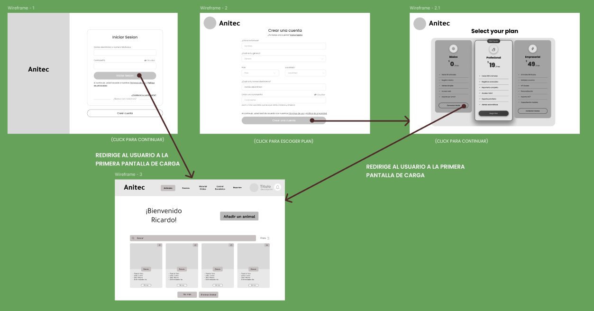
<p>
    <i><b>Fuente</b>: Elaboración propia.</i>
</p>

</div>

- **User Goal: Gestionar animales registrados.** El presente wireflow corresponde con la agregación, eliminación, actualización y consulta del detalle del ganado.

<div align="center">
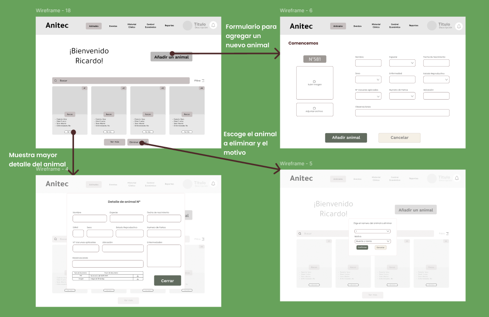
<p>
    <i><b>Fuente</b>: Elaboración propia.</i>
</p>

</div>

- **User Goal: Registrar y consultar eventos sanitarios o actividades.** El presente wireflow corresponde con la agregación y consulta de eventos registrados por el usuario y/o sistema.

<div align="center">
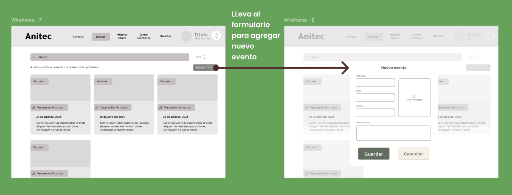
<p>
    <i><b>Fuente</b>: Elaboración propia.</i>
</p>

</div>

- **User Goal: Gestionar visitas médicas por animal.** El presente wireflow corresponde a la gestión de las visitas médicas de un animal específico, mostrando un listado completo de sus atenciones veterinarias con información relevante. Desde este apartado, el usuario puede registrar nuevas visitas médicas, editar registros existentes para actualizar información y eliminar aquellos que ya no sean necesarios.

<div align="center">
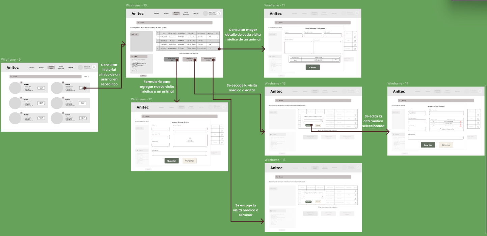
<p>
    <i><b>Fuente</b>: Elaboración propia.</i>
</p>

</div>

- **User Goal: Controlar ingresos y egresos del ganadero.** Esta vista permite al ganadero registrar y consultar sus ingresos y egresos de manera diaria, ofreciendo un control financiero claro y organizado. Además, presenta un resumen de las ganancias netas mensuales mediante un gráfico que proporciona una visión anual, junto con el detalle acumulado de ingresos y egresos del presente mes.

<div align="center">
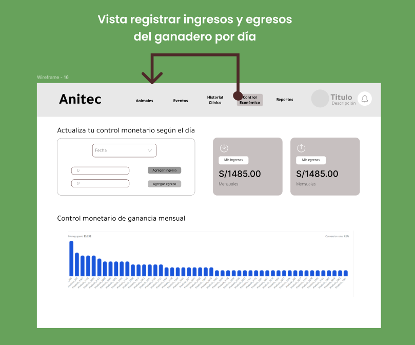
<p>
    <i><b>Fuente</b>: Elaboración propia.</i>
</p>

</div>

**User Goal: Revisar estadísticas y reportes del ganado.** Esta vista permite al ganadero analizar información clave sobre su producción mediante indicadores y gráficos dinámicos. Se presentan métricas como la cantidad total de animales, distribución por especie y sexo, así como su evolución en el tiempo.

<div align="center">
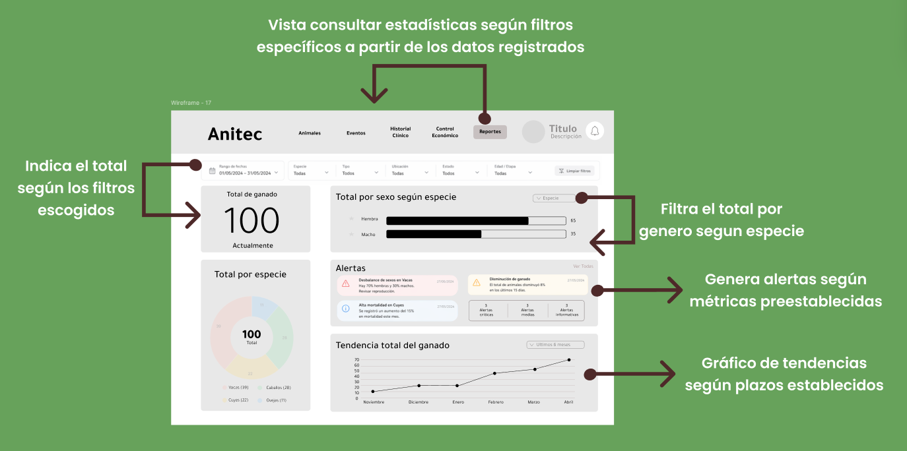
<p>
    <i><b>Fuente</b>: Elaboración propia.</i>
</p>

</div>

<a id="toc-4-4-3-web-applications-user-flow-diagrams"></a>
## 4.4.3. Web Applications Mock-ups.

En esta sección se exponen y analizan los mockups de la aplicación web AniTec, diseñada para apoyar la gestión del sector ganadero y el seguimiento veterinario. En ellos se aprecia la implementación de principios fundamentales de diseño visual, accesibilidad, arquitectura de la información y del Design System definido para el producto. Cada mockup muestra cómo estos elementos se integran en una interfaz orientada a optimizar la trazabilidad, el control sanitario, la gestión eficiente del ganado y la consulta de información por rol. Asimismo, los mockups aplican la navegación por rol definida para ganaderos y veterinarios. Se incluye el enlace para acceder al contenido. https://www.figma.com/design/9RliVy9r8aEzyfyEof3DGr/Untitled?node-id=42-837&t=fdPLEZQXM0PqMAv3-1

<div align="center">

Pantalla de login en la aplicación

 
<p>
    <i><b>Fuente</b>: Elaboración propia.</i>
</p>

Pantalla para registrarse en la aplicación


<p>
    <i><b>Fuente</b>: Elaboración propia.</i>
</p>

Pantalla para escoger el plan


<p>
    <i><b>Fuente</b>: Elaboración propia.</i>
</p>

Pantalla de inicio dentro de la aplicación


<p>
    <i><b>Fuente</b>: Elaboración propia.</i>
</p>

Pantalla para consultar mayor detalle sobre un animal


<p>
    <i><b>Fuente</b>: Elaboración propia.</i>
</p>

Pantalla para eliminar la información registrada sobre un animal


<p>
    <i><b>Fuente</b>: Elaboración propia.</i>
</p>

Pantalla para añadir un nuevo animal


<p>
    <i><b>Fuente</b>: Elaboración propia.</i>
</p>

Sección de evento locales registrados


<p>
    <i><b>Fuente</b>: Elaboración propia.</i>
</p>

Pantalla para registrar un nuevo evento


<p>
    <i><b>Fuente</b>: Elaboración propia.</i>
</p>

Pantalla para consultar el historial Clínico de un animal en específico


<p>
    <i><b>Fuente</b>: Elaboración propia.</i>
</p>

Pantalla para ver las visitas médicas registradas para un animal en específico


<p>
    <i><b>Fuente</b>: Elaboración propia.</i>
</p>

Pantalla para ver el detalle de un informe médico de un animal en específico


<p>
    <i><b>Fuente</b>: Elaboración propia.</i>
</p>

Pantalla para agregar un informe médico a un animal en específico


<p>
    <i><b>Fuente</b>: Elaboración propia.</i>
</p>

Pantalla para escoger un informe médico para editar de un animal registrado


<p>
    <i><b>Fuente</b>: Elaboración propia.</i>
</p>

Pantalla para editar un informe médico seleccionado registrado para un animal


<p>
    <i><b>Fuente</b>: Elaboración propia.</i>
</p>

Mensaje para escoger el informe del historial clínico a eliminar de un animal


<p>
    <i><b>Fuente</b>: Elaboración propia.</i>
</p>

Sección que registra ingresos y egresos de los ganaderos


<p>
    <i><b>Fuente</b>: Elaboración propia.</i>
</p>

Dashboard donde se presentan los reportes generados


<p>
    <i><b>Fuente</b>: Elaboración propia.</i>
</p>

</div>

## 4.4.4. Web Applications User Flow Diagrams.

En esta parte se detallan los diagramas de flujo de usuario, donde se describen las rutas posibles dentro de la aplicación y las decisiones que puede tomar el usuario. Estos diagramas garantizan una navegación clara y alineada con los objetivos funcionales. Cada User Flow se deriva de los wireflows presentados anteriormente y muestra la ruta esperada que sigue el usuario para cumplir una meta específica dentro de la aplicación.

<div align="center">

**User Goal 1: Iniciar sesión, crear cuenta o seleccionar plan para acceder a la aplicación.**

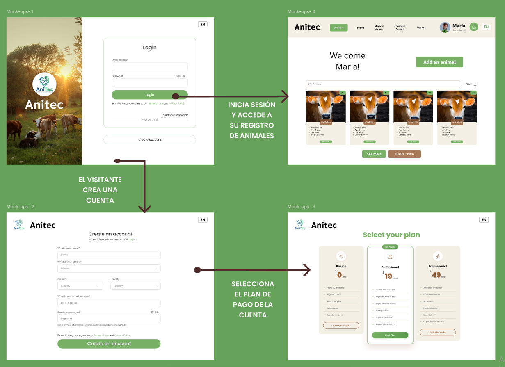

**User Goal 2: Gestionar animales registrados mediante consulta, detalle, creación y eliminación.**

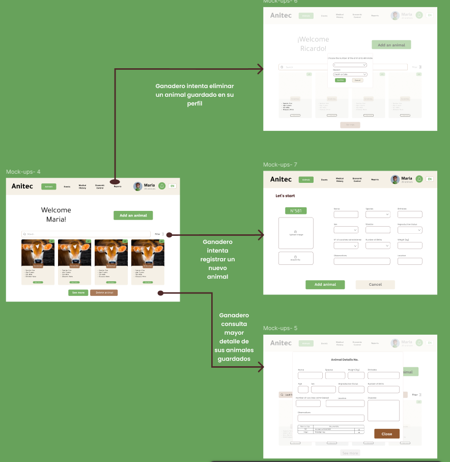

**User Goal 3: Consultar eventos registrados y crear un nuevo evento sanitario o actividad.**

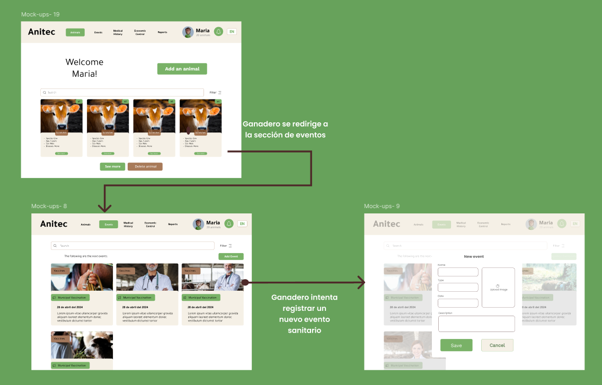

**User Goal 4: Consultar, registrar, editar y eliminar visitas médicas dentro del historial clínico.**

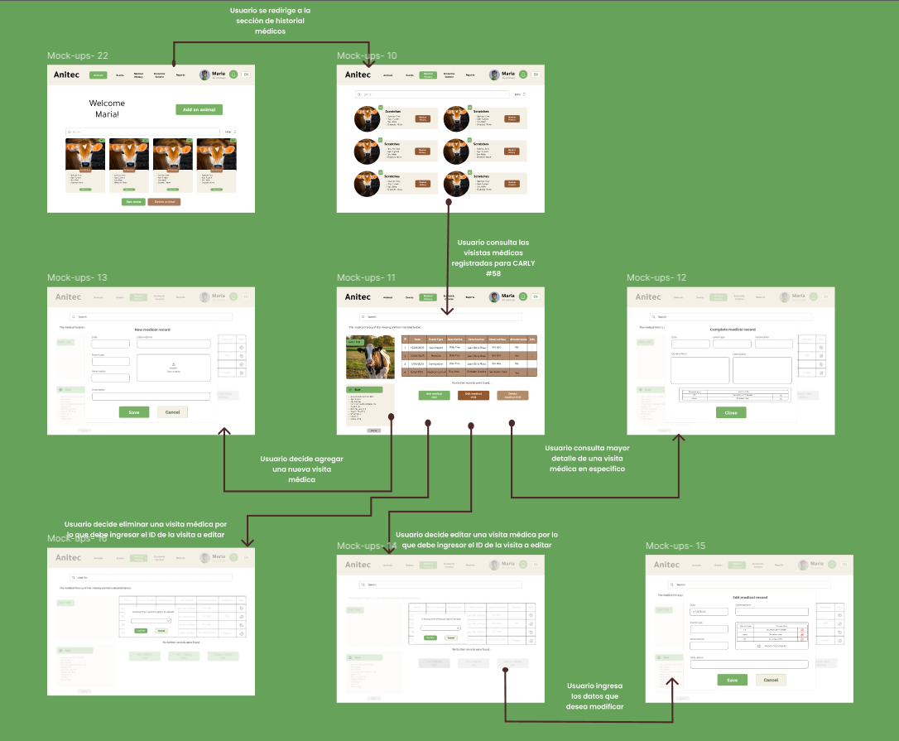

**User Goal 5: Registrar ingresos y egresos para revisar el control económico del ganadero.**

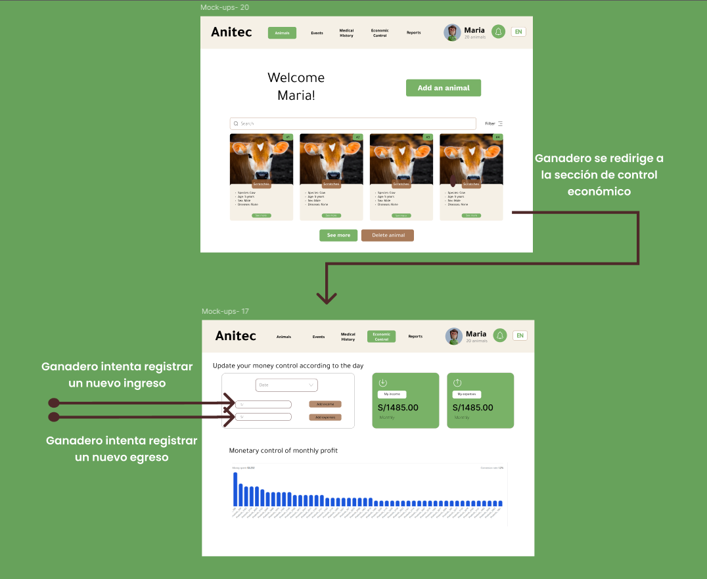

**User Goal 6: Revisar reportes, aplicar filtros y consultar alertas sobre el estado del ganado.**

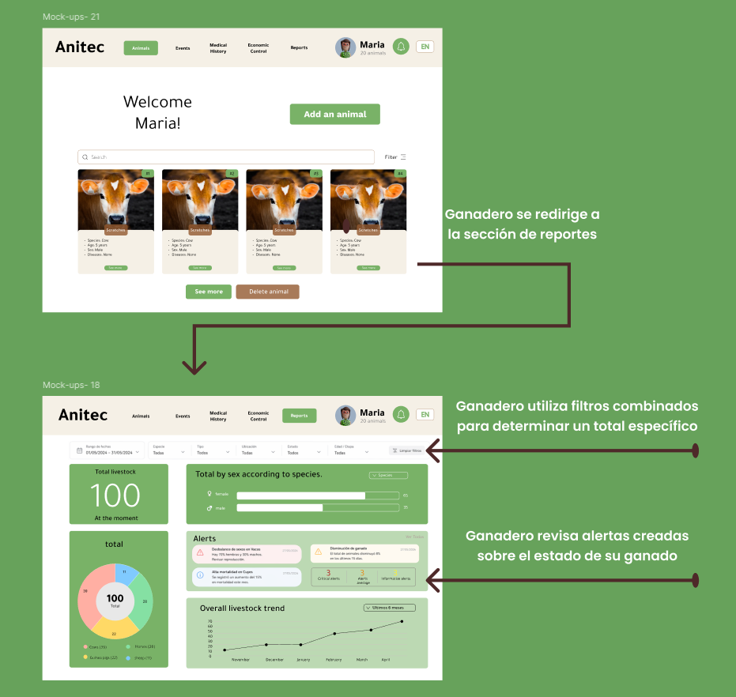
</div>

<div style="page-break-before: always;"></div>

<a id="toc-4-5-web-applications-prototyping"></a>
# 4.5. Web Applications Prototyping.

El prototipado de la aplicación web de AniTec permite validar la navegación e interacción entre las principales pantallas antes de la implementación final. Los criterios considerados para el prototipo fueron claridad en los recorridos, consistencia visual con el Style Guide, separación de acciones por rol y facilidad para completar tareas frecuentes como iniciar sesión, consultar animales, registrar eventos, revisar historial médico, controlar ingresos y egresos, y visualizar reportes.

El prototipo se relaciona directamente con la arquitectura de información definida previamente, ya que utiliza una navegación superior o lateral según el contexto y organiza las pantallas por módulos funcionales. Los flujos cubiertos corresponden principalmente al acceso a la aplicación, gestión de animales, eventos sanitarios, historial médico, control económico y reportes, evidenciando cómo el usuario avanza entre pantallas para cumplir sus objetivos.

<div align="center">

| Evidencia                                                                                                                                      |
| ---------------------------------------------------------------------------------------------------------------------------------------------- |
| 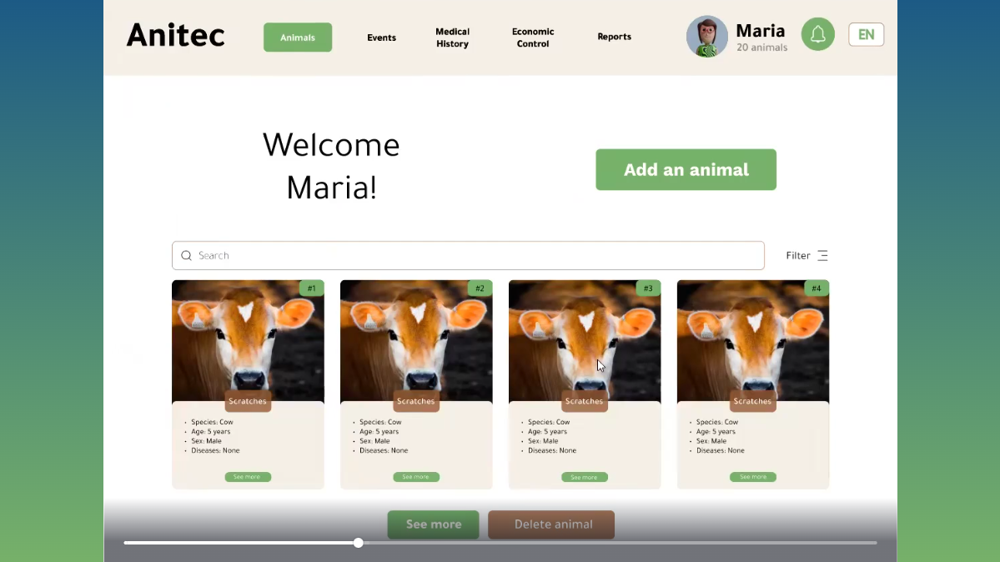 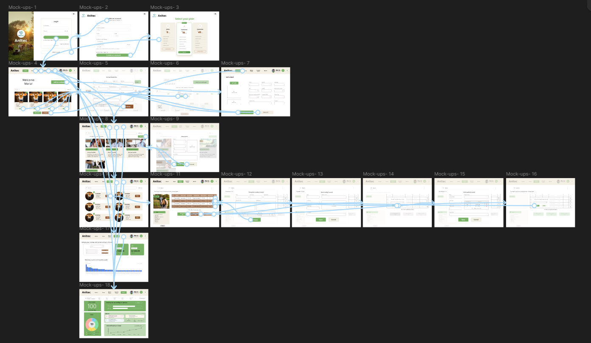 |
| Enlace al video del prototipo. Recordatorio: reemplazar este enlace por la versión publicada en Microsoft Stream.                                                                                                                                        |
| https://1drv.ms/v/c/fa8e2d4d5f95cf55/IQCahhrF7amZTIeIIL2qif1SAZwhS2QghQaWCuODMLn1hes?e=sXJwXw                                                  |

</div>

<div style="page-break-before: always;"></div>

<a id="toc-4-6-domain-driven-software-architecture"></a>
# 4.6. Domain-Driven Software Architecture.

El Domain-Driven Design (DDD) tiene como objetivo central establecer un entendimiento mutuo sobre el dominio del negocio, promoviendo la sinergia entre el equipo técnico y los expertos del área a través de un lenguaje ubicuo. Este marco de trabajo trasciende el vocabulario técnico al integrar patrones estratégicos, metodologías de diseño y diagramas arquitectónicos que garantizan que el software evolucione en total sintonía con las prioridades empresariales. De esta forma, se logra una solución técnica robusta, profundamente ligada al conocimiento del negocio y capaz de resolver problemas complejos de manera eficiente.

Para ilustrar la aplicación práctica de estos conceptos en el proyecto, se detallan a continuación los primeros tres niveles del modelo C4, implementados mediante Structurizr, los cuales brindan una visión clara y estructurada del sistema en desarrollo.

<a id="toc-4-6-1-design-level-eventstorming"></a>
## 4.6.1. Design Level EventStorming

El Design-Level EventStorming de AniTec se presenta desde el paso 4 porque los primeros pasos del proceso, correspondientes a la exploración general del dominio mediante Big Picture EventStorming, fueron desarrollados previamente en la sección de Needfinding. Por ello, esta sección continúa con los pasos orientados al diseño del dominio, la identificación de comandos, políticas, modelos de lectura, sistemas externos, agregados y bounded contexts.

**Paso 4:** Pivotal Events, el equipo busca eventos de negocio significativos que marquen un cambio de fase o una transición importante en el contexto del proceso. Estos se identifican trazando una barra vertical en la superficie de modelado para separar los flujos anteriores y posteriores al evento crucial. Identificar estos hitos es fundamental, ya que funcionan como indicadores clave para definir los límites de los posibles Bounded Contexts dentro del dominio.

<div align="center">
  <p>
    <b>Step 4: Pivotal Events</b>
  </p>
  
  <p>
    <i><b>Fuente</b>: Elaboracion Propia</i>
  </p>
</div>

**Paso 5:** Commands, el enfoque cambia de lo que ya sucedió a lo que desencadena esos eventos, introduciendo los commands (comandos) formulados en modo imperativo. Estos se representan con notas adhesivas de color azul claro y se colocan antes de los eventos que producen; además, si un usuario específico ejecuta la acción, se añade una pequeña nota amarilla para representar al actor o rol del negocio.

<div align="center">
  <p>
    <b>Step 5: Commands</b>
  </p>
  
  <p>
    <i><b>Fuente</b>: Elaboracion Propia</i>
  </p>
</div>

**Paso 6:** Policies, se identifican las automation policies (políticas de automatización), que son escenarios donde un evento de dominio activa automáticamente la ejecución de un comando sin intervención directa de un actor. Estas reglas se representan con notas adhesivas de color púrpura que conectan el evento con el comando resultante, permitiendo especificar criterios de decisión o condiciones lógicas necesarias para que la acción se dispare.

<div align="center">
  <p>
    <b>Step 6: Policies </b>
  </p>
  
  <p>
    <i><b>Fuente</b>: Elaboracion Propia</i>
  </p>
</div>

**Paso 7:** Read Models, se introducen las vistas de datos o fuentes de información que un actor necesita consultar para tomar la decisión de ejecutar un comando. Estos se representan con notas adhesivas verdes y pueden ser pantallas del sistema, informes o notificaciones que sirven de base para la acción del usuario. En la superficie de modelado, los modelos de lectura se posicionan estratégicamente justo antes de los comandos para ilustrar el flujo de información hacia la toma de decisiones.

<div align="center">
  <p>
    <b>Step 7: Read Models </b>
  </p>
  
  <p>
    <i><b>Fuente</b>: Elaboracion Propia</i>
  </p>
</div>

**Paso 8:** External Systems, el modelo se aumenta con sistemas externos, definidos como cualquier sistema ajeno al dominio que se está explorando. Estos se representan con notas adhesivas rosas y pueden actuar de dos formas: activando la ejecución de comandos (entrada) o recibiendo notificaciones sobre eventos de dominio (salida). Al finalizar este paso, se debe verificar que todos los comandos del modelo sean ejecutados por actores, activados por políticas o llamados por estos sistemas externos.

<div align="center">
  <p>
    <b>Step 8: External Systems</b>
  </p>
  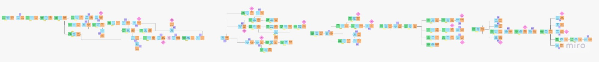
  <p>
    <i><b>Fuente</b>: Elaboracion Propia</i>
  </p>
</div>

**Paso 9:** Aggregates, los participantes organizan los conceptos relacionados en Aggregates (Agregados), que actúan como las unidades lógicas que reciben los comandos y producen los eventos resultantes. Estos se representan con notas adhesivas amarillas grandes, posicionándose físicamente en medio del flujo: con los comandos a su izquierda y los eventos a su derecha. Esta etapa es crucial para definir la consistencia y las fronteras de los datos dentro del modelo de dominio.

<div align="center">
  <p>
    <b>Step 9: Aggregates</b>
  </p>
  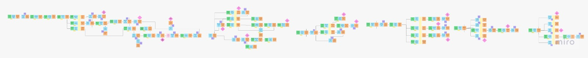
  <p>
    <i><b>Fuente</b>: Elaboracion Propia</i>
  </p>
</div>

**Paso 10:** Bounded Contexts, se concluye la sesión de EventStorming buscando grupos de agregados que estén estrechamente relacionados entre sí. Esta relación puede darse porque los agregados representan funcionalidades similares o porque están acoplados mediante políticas de automatización. Estos grupos identificados forman los límites naturales para los Bounded Contexts (contextos delimitados), definiendo así las fronteras lógicas y técnicas de los diferentes módulos del sistema dentro del dominio de negocio.

<div align="center">
  <p>
    <b>Step 10 - bounded context canvas</b>
  </p>
  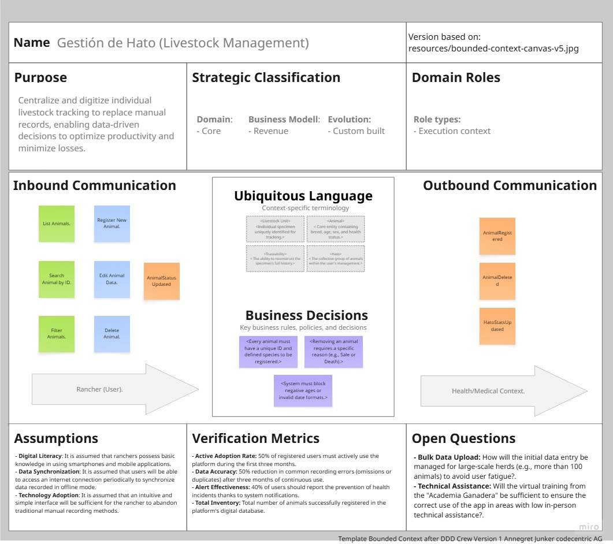
  <p>
    <i><b>Fuente</b>: Elaboracion Propia</i>
  </p>
</div>

<div align="center">
  <p>
    <b>Step 10 - bounded context canvas </b>
  </p>
  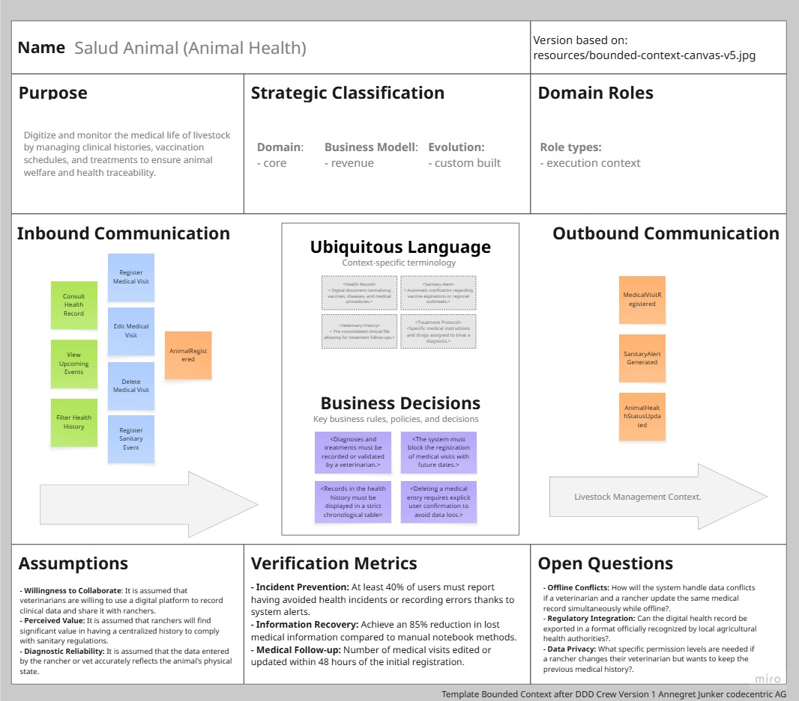
  <p>
    <i><b>Fuente</b>: Elaboracion Propia</i>
  </p>
</div>

<div align="center">
  <p>
    <b>Step 10 - bounded context canvas</b>
  </p>
  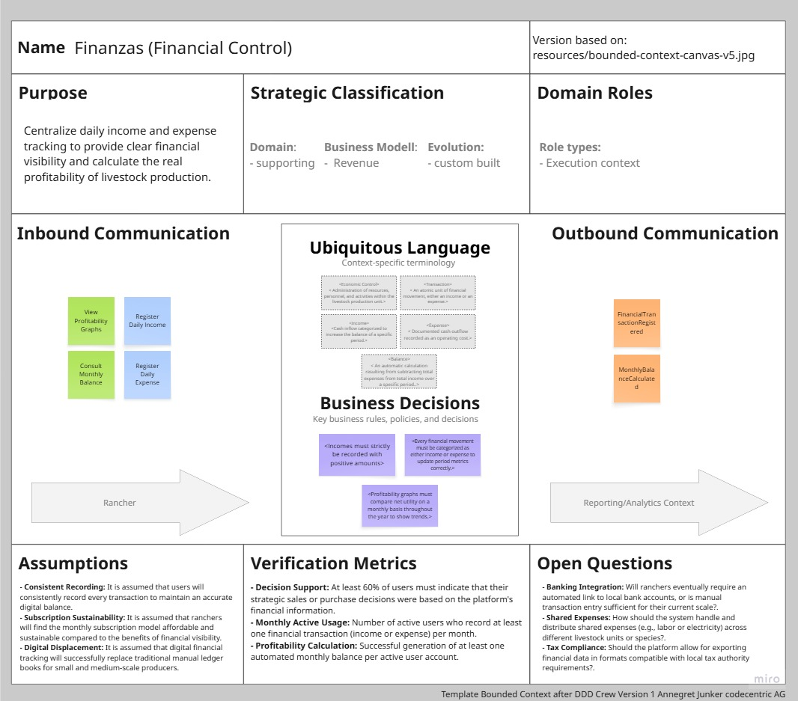
  <p>
    <i><b>Fuente</b>: Elaboracion Propia</i>
  </p>
</div>

<div align="center">
  <p>
    <b>Step 10 - bounded context canvas</b>
  </p>
  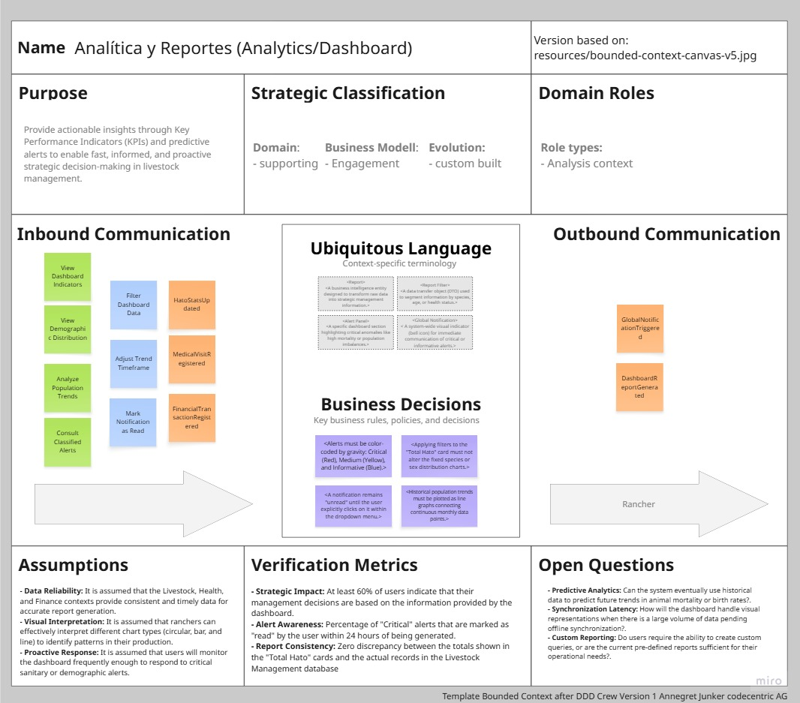
  <p>
    <i><b>Fuente</b>: Elaboracion Propia</i>
  </p>
</div>

Enlace para acceder al https://miro.com/welcomeonboard/T1gvUmlKRzZiWjFQV0VFK1VsL1VDbFN1WElQbzV3WjVVd2NYR1d3NVRSdVFOUFd4ZVlIbk4rSmxBN1J3UUtjQjg3cHlKK2VKZ3cwVXB5ZXJoK0MyNmxud0lrejllQVpDT1AzczYyS0t6YWtZTk9xSS9JK05WR2x1cVZvYldTbzRnbHpza3F6REdEcmNpNEFOMmJXWXBBPT0hdjE=?share_link_id=376749116517

<a id="toc-4-6-2-software-architecture-context-diagram"></a>
## 4.6.2. Software Architecture Context Diagram.

El Software Architecture Context Level Diagram presenta una vista general del sistema Anitec y sus interacciones con usuarios y sistemas externos. Este diagrama permite identificar los principales actores de la plataforma, así como los servicios externos utilizados para funcionalidades como procesamiento de pagos y envío de correos electrónicos.

<div align="center">
  <p>
    <b>Diagrama de Contexto C4 - AniTec</b>
  </p>
  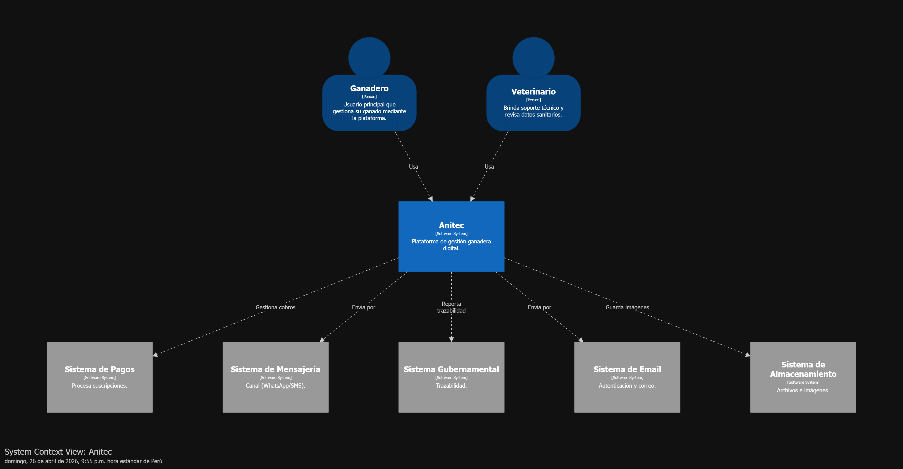
  <p>
    <i><b>Fuente</b>: Elaboración propia.</i>
  </p>
</div>

<a id="toc-4-6-3-software-architecture-container-diagrams"></a>
## 4.6.3. Software Architecture Container Diagrams.

El Software Architecture Container Diagram permite visualizar la descomposición interna del sistema de gestión ganadera en unidades técnicas desplegables. Se presenta una infraestructura donde el Rancher y el Veterinarian interactúan con una Single Page Application (SPA) de Vue.js y Vite, la cual es entregada por una Web Application y complementada por una Landing Page informativa. Esta estructura se explica mediante el flujo de datos hacia una API Application que procesa la lógica del negocio, gestiona módulos como IAM, perfiles, ganadería, sanidad, actividades, finanzas, analíticas, dispositivos y suscripciones, y almacena la información en una base de datos MySQL.

<div align="center">
  <p>
    <b>Diagrama de Contenedores C4 - AniTec</b>
  </p>
  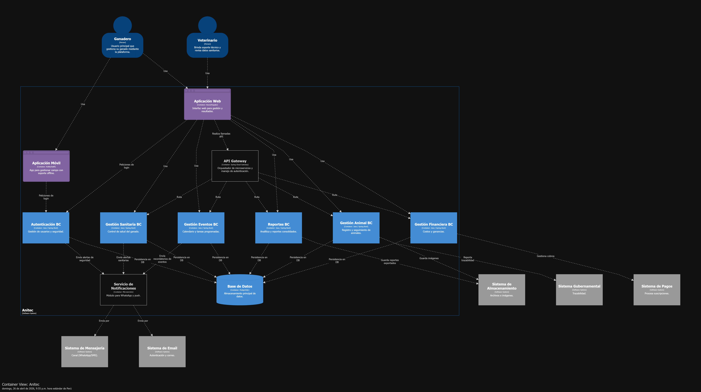
  <p>
    <i><b>Fuente</b>: Elaboración propia.</i>
  </p>
</div>

<a id="toc-4-6-4-software-architecture-components-diagrams"></a>
## 4.6.4. Software Architecture Components Diagrams.

Los Software Architecture Component Diagrams presentan la descomposición interna del contenedor API Application de AniTec. Estos diagramas permiten identificar los principales bounded contexts, sus responsabilidades, los controladores REST, servicios de aplicación, repositorios, componentes compartidos y la interacción con la base de datos MySQL.

<br>

El AniTec API Application Component Diagram muestra la vista general de la API y sus bounded contexts principales. En esta vista se observa cómo la aplicación web consume servicios REST organizados en IAM, Profiles, Livestock, Sanitary, Activities, Financial, Analytics, Devices, Subscriptions y Shared. La API fue implementada con ASP.NET Core, Entity Framework Core, patrones de repositorio, Unit of Work y persistencia en MySQL.

<div align="center">
  <p>
    <b>Component Diagram - API Application - AniTec</b>
  </p>
  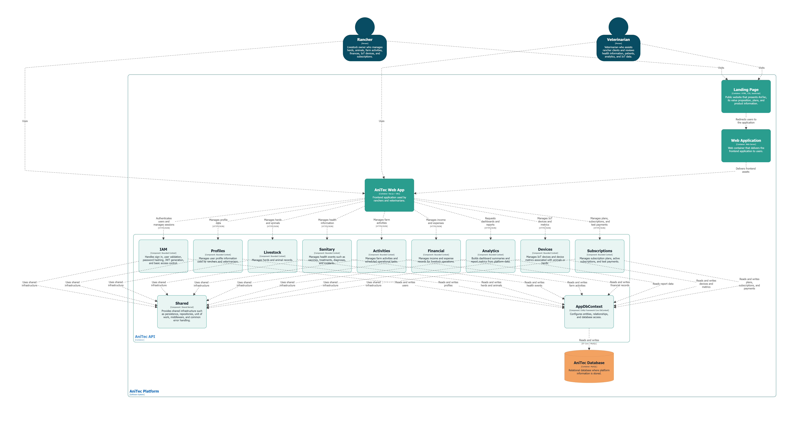
  <p>
    <i><b>Fuente</b>: Elaboración propia.</i>
  </p>
</div>

El IAM Component Diagram presenta la estructura interna del bounded context encargado de la identidad y acceso de los usuarios. Incluye controladores para autenticación y usuarios, servicios de comandos y consultas, repositorio de usuarios, generación de tokens JWT, hashing de contraseñas y middleware de autorización.

<div align="center">
  <p>
    <b>Component Diagram - IAM - AniTec</b>
  </p>
  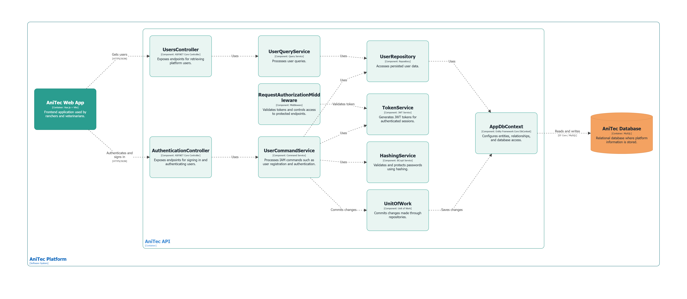
  <p>
    <i><b>Fuente</b>: Elaboración propia.</i>
  </p>
</div>

El Profiles Component Diagram describe los componentes responsables de gestionar la información de perfil de los usuarios de AniTec. Este bounded context utiliza controladores REST, servicios de aplicación, repositorios y una fachada ACL para exponer información de perfiles hacia otros contextos cuando es necesario.

<div align="center">
  <p>
    <b>Component Diagram - Profiles - AniTec</b>
  </p>
  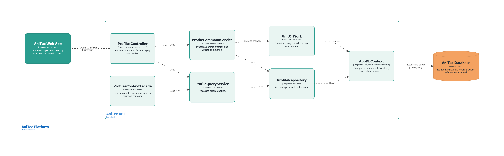
  <p>
    <i><b>Fuente</b>: Elaboración propia.</i>
  </p>
</div>

El Livestock Component Diagram presenta la estructura del bounded context encargado de la gestión ganadera. Incluye componentes para administrar hatos y animales, controladores REST, servicios de comandos y consultas, repositorios específicos y acceso a la persistencia mediante AppDbContext.

<div align="center">
  <p>
    <b>Component Diagram - Livestock - AniTec</b>
  </p>
  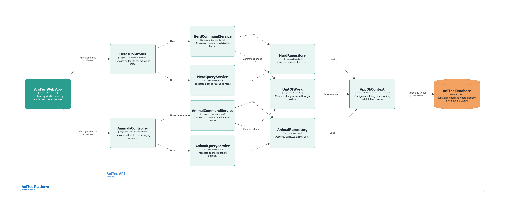
  <p>
    <i><b>Fuente</b>: Elaboración propia.</i>
  </p>
</div>

El Sanitary Component Diagram muestra el bounded context responsable de los eventos sanitarios. Sus componentes permiten registrar y consultar vacunas, tratamientos, diagnósticos e incidencias asociadas al ganado, manteniendo una separación entre controladores, servicios de aplicación y repositorio.

<div align="center">
  <p>
    <b>Component Diagram - Sanitary - AniTec</b>
  </p>
  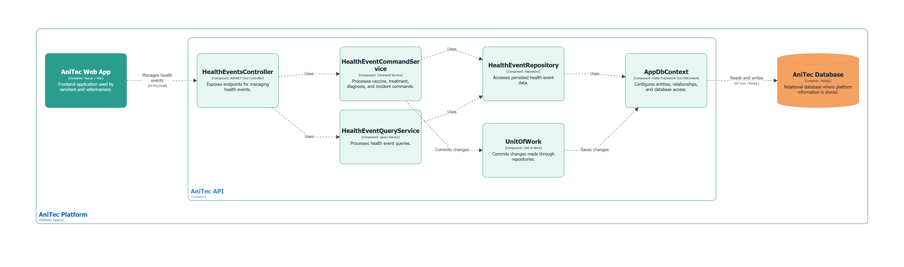
  <p>
    <i><b>Fuente</b>: Elaboración propia.</i>
  </p>
</div>

El Activities Component Diagram presenta los componentes encargados de la gestión de actividades de finca. Este bounded context permite crear, consultar, actualizar y eliminar actividades operativas mediante controladores REST, servicios de comandos, servicios de consultas y repositorio.

<div align="center">
  <p>
    <b>Component Diagram - Activities - AniTec</b>
  </p>
  
  <p>
    <i><b>Fuente</b>: Elaboración propia.</i>
  </p>
</div>

El Financial Component Diagram muestra la estructura del bounded context encargado de los registros financieros. Incluye el controlador de registros financieros, servicios de comandos y consultas, repositorio y persistencia en MySQL para registrar ingresos y egresos asociados a la operación ganadera.

<div align="center">
  <p>
    <b>Component Diagram - Financial - AniTec</b>
  </p>
  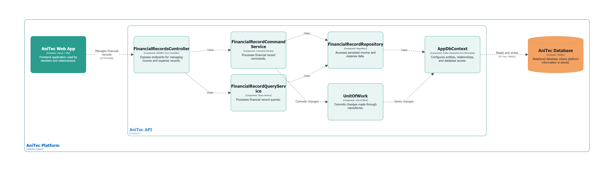
  <p>
    <i><b>Fuente</b>: Elaboración propia.</i>
  </p>
</div>

El Analytics Component Diagram presenta los componentes responsables de reportes, métricas y dashboards. Este bounded context consulta información de otros módulos, como ganadería, sanidad y finanzas, para construir resúmenes útiles para ganaderos y veterinarios.

<div align="center">
  <p>
    <b>Component Diagram - Analytics - AniTec</b>
  </p>
  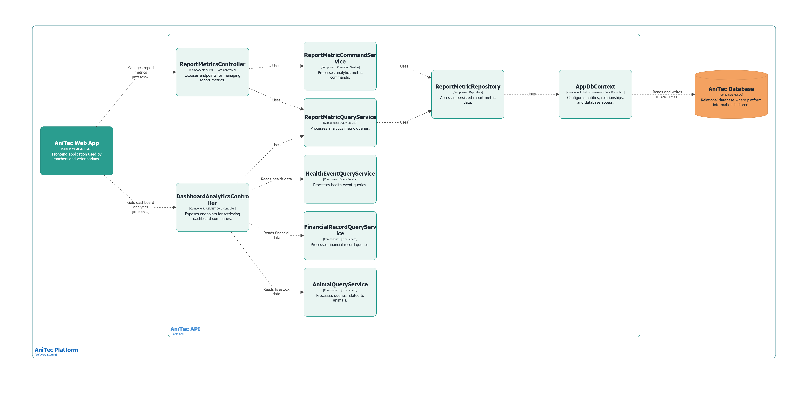
  <p>
    <i><b>Fuente</b>: Elaboración propia.</i>
  </p>
</div>

El Devices Component Diagram describe la estructura del bounded context orientado a dispositivos IoT. Incluye componentes para gestionar dispositivos, métricas capturadas, servicios de aplicación y repositorios que permiten asociar información tecnológica con animales o hatos.

<div align="center">
  <p>
    <b>Component Diagram - Devices - AniTec</b>
  </p>
  
  <p>
    <i><b>Fuente</b>: Elaboración propia.</i>
  </p>
</div>

El Subscriptions Component Diagram muestra los componentes relacionados con planes, suscripciones y pagos de prueba. Este bounded context permite consultar planes, gestionar suscripciones activas y registrar pagos simulados para la validación del flujo de la aplicación.

<div align="center">
  <p>
    <b>Component Diagram - Subscriptions - AniTec</b>
  </p>
  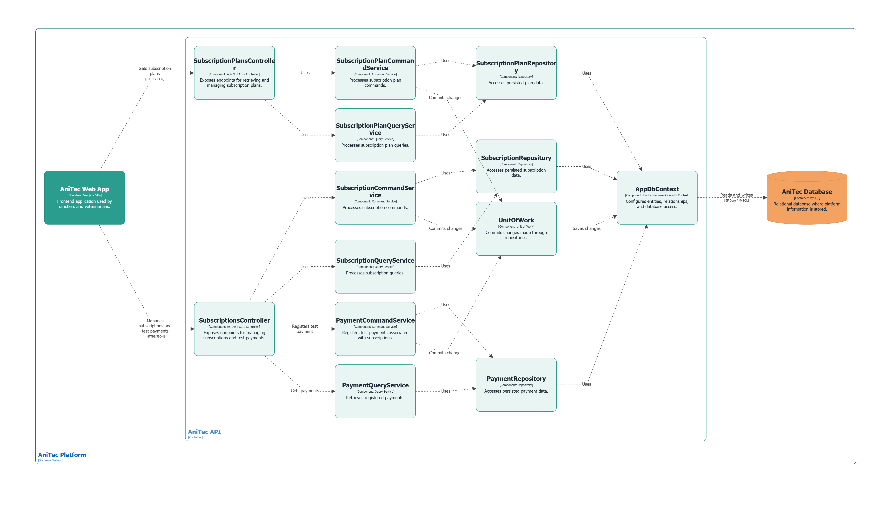
  <p>
    <i><b>Fuente</b>: Elaboración propia.</i>
  </p>
</div>

El Shared Component Diagram presenta los componentes transversales utilizados por la API. Incluye AppDbContext, Unit of Work, BaseRepository, middleware de autorización, manejo global de excepciones y ProblemDetailsFactory, los cuales ayudan a mantener una estructura común entre los bounded contexts.

<div align="center">
  <p>
    <b>Component Diagram - Shared - AniTec</b>
  </p>
  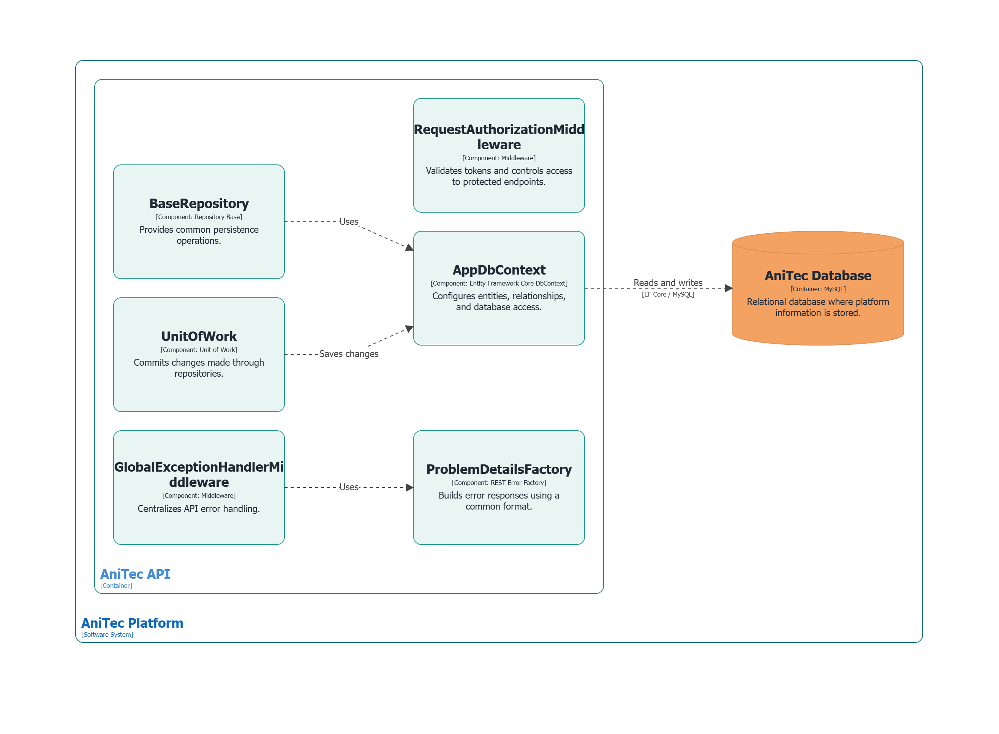
  <p>
    <i><b>Fuente</b>: Elaboración propia.</i>
  </p>
</div>

<div style="page-break-before: always;"></div>

<a id="toc-4-7-software-object-oriented-design"></a>
# 4.7. Software Object-Oriented Design.

El diseño orientado a objetos de AniTec representa las principales clases, entidades, relaciones y responsabilidades que permiten implementar la lógica de la aplicación. Para mantener coherencia con la arquitectura del backend, el diseño se organiza tomando como referencia los bounded contexts definidos en la solución: IAM, Profiles, Livestock, Sanitary, Activities, Financial, Analytics, Devices, Subscriptions y Shared.

El objetivo de esta sección es mostrar cómo los conceptos principales del dominio se transforman en clases del sistema, considerando entidades persistentes, servicios de aplicación, repositorios y componentes compartidos. De esta manera, el diseño orientado a objetos mantiene relación directa con la arquitectura por capas utilizada en el backend de AniTec.

<a id="toc-4-7-1-class-diagrams"></a>
## 4.7.1. Class Diagrams.

El Class Diagram de AniTec presenta una vista general de las clases principales utilizadas para representar usuarios, perfiles, animales, hatos, eventos sanitarios, actividades, registros financieros, métricas, dispositivos, suscripciones y pagos. Este diagrama permite visualizar la relación entre los elementos principales del dominio y sirve como base para comprender la estructura lógica de la solución.

<div align="center">
  <p>
    <b>Class Diagram - AniTec</b>
  </p>
  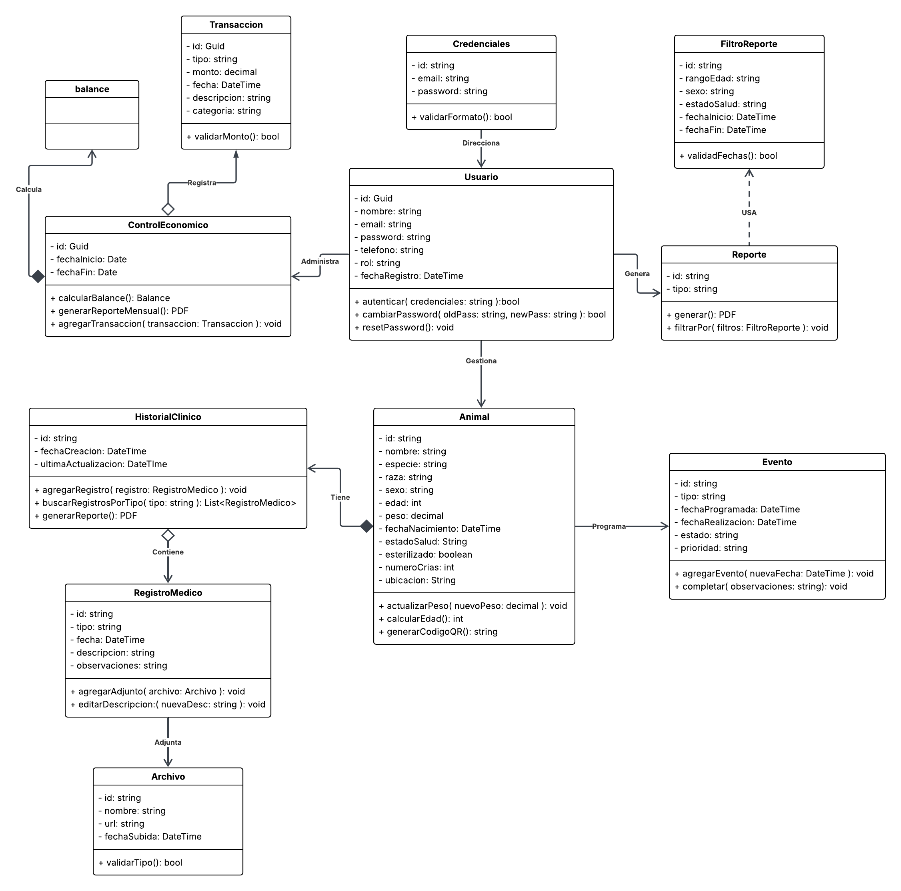
  <p>
    <i><b>Fuente</b>: Elaboración propia.</i>
  </p>
</div>

Enlace para acceder al https://lucid.app/lucidchart/2cf9b98f-737c-43ac-9833-a2e6a387c4af/edit?viewport_loc=-5835%2C-1184%2C9341%2C3780%2C0_0&invitationId=inv_26c88d5c-929c-4141-bbb1-e3a73b17aa13

## 4.7.2. Class Dictionary.

Diccionario de clases usado para el desarrollo de AniTec.

| Clase | Bounded Context | Descripción |
| --- | --- | --- |
| **User** | IAM | Entidad que representa a un usuario de la plataforma. Almacena credenciales, rol y datos necesarios para autenticar a ganaderos y veterinarios. |
| **UserAudit** | IAM | Clase asociada al seguimiento de información de auditoría del usuario, permitiendo registrar datos relacionados con su creación o actualización. |
| **SignInCommand** | IAM | Comando utilizado para procesar el inicio de sesión de un usuario mediante nombre de usuario y contraseña. |
| **SignUpCommand** | IAM | Comando utilizado para crear usuarios dentro de la plataforma cuando el backend requiere registrar nuevas cuentas. |
| **Profile** | Profiles | Entidad que almacena la información personal y de contacto asociada a un usuario de AniTec. |
| **ProfileAudit** | Profiles | Clase relacionada con la auditoría de los perfiles registrados en la plataforma. |
| **PersonName** | Profiles | Value Object que representa el nombre de una persona dentro del perfil. |
| **EmailAddress** | Profiles | Value Object que representa y valida el correo electrónico asociado al perfil. |
| **StreetAddress** | Profiles | Value Object que representa la dirección registrada para un perfil. |
| **Herd** | Livestock | Entidad que representa un hato o grupo ganadero. Permite organizar animales por propietario, ubicación y tipo principal. |
| **Animal** | Livestock | Entidad que representa un animal registrado en la plataforma. Incluye datos como identificador, nombre, especie, raza, género, fecha de nacimiento, peso, estado y hato asociado. |
| **HealthEvent** | Sanitary | Entidad que representa un evento sanitario del animal, como vacunas, tratamientos, diagnósticos, incidencias, prescripciones o seguimientos. |
| **FarmActivity** | Activities | Entidad que representa una actividad operativa de la finca, incluyendo título, tipo, fecha, prioridad, estado y responsables asociados. |
| **FinancialRecord** | Financial | Entidad que representa un ingreso o egreso de la operación ganadera. Registra monto, categoría, fecha, descripción y propietario. |
| **ReportMetric** | Analytics | Entidad utilizada para almacenar métricas o indicadores que apoyan la generación de reportes y dashboards. |
| **Device** | Devices | Entidad que representa un dispositivo IoT registrado, como balanzas, collares inteligentes, cámaras térmicas, aretes de identificación, estaciones meteorológicas o sensores ambientales. |
| **DeviceMetric** | Metrics | Entidad que representa una lectura o métrica capturada por un dispositivo IoT. Permite registrar valores asociados al monitoreo de animales o hatos. |
| **SubscriptionPlan** | Subscriptions | Entidad que representa un plan disponible dentro de la plataforma, incluyendo nombre, precio, beneficios y características generales. |
| **Subscription** | Subscriptions | Entidad que representa la suscripción activa o histórica de un usuario a un plan determinado. |
| **Payment** | Subscriptions | Entidad que representa un pago de prueba registrado dentro del flujo de suscripciones de AniTec. |
| **VeterinarianClient** | Clients | Entidad que representa la relación entre un veterinario y un ganadero cliente, permitiendo gestionar clientes asignados y pacientes asociados. |
| **Result** | Shared | Clase de apoyo usada para representar resultados de operaciones de aplicación, permitiendo comunicar éxito, error o información adicional. |
| **Error** | Shared | Clase base para representar errores del dominio o de aplicación de forma consistente. |
| **IBaseRepository** | Shared | Interfaz base que define operaciones comunes de persistencia para los repositorios del sistema. |
| **BaseRepository** | Shared | Implementación base de repositorio que centraliza operaciones comunes de acceso a datos mediante Entity Framework Core. |
| **IUnitOfWork** | Shared | Interfaz que define la operación para confirmar cambios realizados por los repositorios. |
| **UnitOfWork** | Shared | Clase que coordina la persistencia de cambios en la base de datos mediante AppDbContext. |
| **AppDbContext** | Shared | Clase de Entity Framework Core que configura las entidades, relaciones y acceso a la base de datos MySQL. |

<div style="page-break-before: always;"></div>

<a id="toc-4-8-database-design"></a>
# 4.8. Database Design.

El diseño de base de datos de AniTec se plantea sobre un modelo relacional implementado con MySQL. Esta decisión permite organizar la información principal de la aplicación en tablas relacionadas mediante primary keys y foreign keys, manteniendo consistencia entre los datos de usuarios, ganadería, sanidad, actividades, finanzas, analíticas, dispositivos IoT y suscripciones.

La persistencia se encuentra organizada de acuerdo con los bounded contexts definidos para la solución. IAM almacena los usuarios y credenciales de acceso; Profiles guarda la información personal de los usuarios; Livestock persiste hatos y animales; Sanitary registra eventos sanitarios; Activities almacena actividades de finca; Financial conserva ingresos y egresos; Analytics registra métricas de reportes; Devices y Metrics almacenan dispositivos IoT y sus lecturas; Subscriptions gestiona planes, suscripciones y pagos de prueba; y Clients representa la relación entre veterinarios y ganaderos.

El modelo relacional permite reflejar las dependencias entre estas áreas mediante claves primarias y foráneas. Por ejemplo, los animales pertenecen a un hato, los eventos sanitarios se asocian a animales, los dispositivos pueden relacionarse con hatos o animales, las métricas pertenecen a dispositivos y las suscripciones se vinculan con usuarios y planes.

<a id="toc-4-8-1-database-diagrams"></a>
## 4.8.1. Database Diagram.

El siguiente Database Diagram presenta las tablas, columnas principales, constraints y relaciones necesarias para la persistencia de información de AniTec. El diagrama muestra la estructura actualizada de la base de datos relacional utilizada por el backend de la aplicación.

<div align="center">
  <p>
    <b>Database Diagram - AniTec</b>
  </p>
  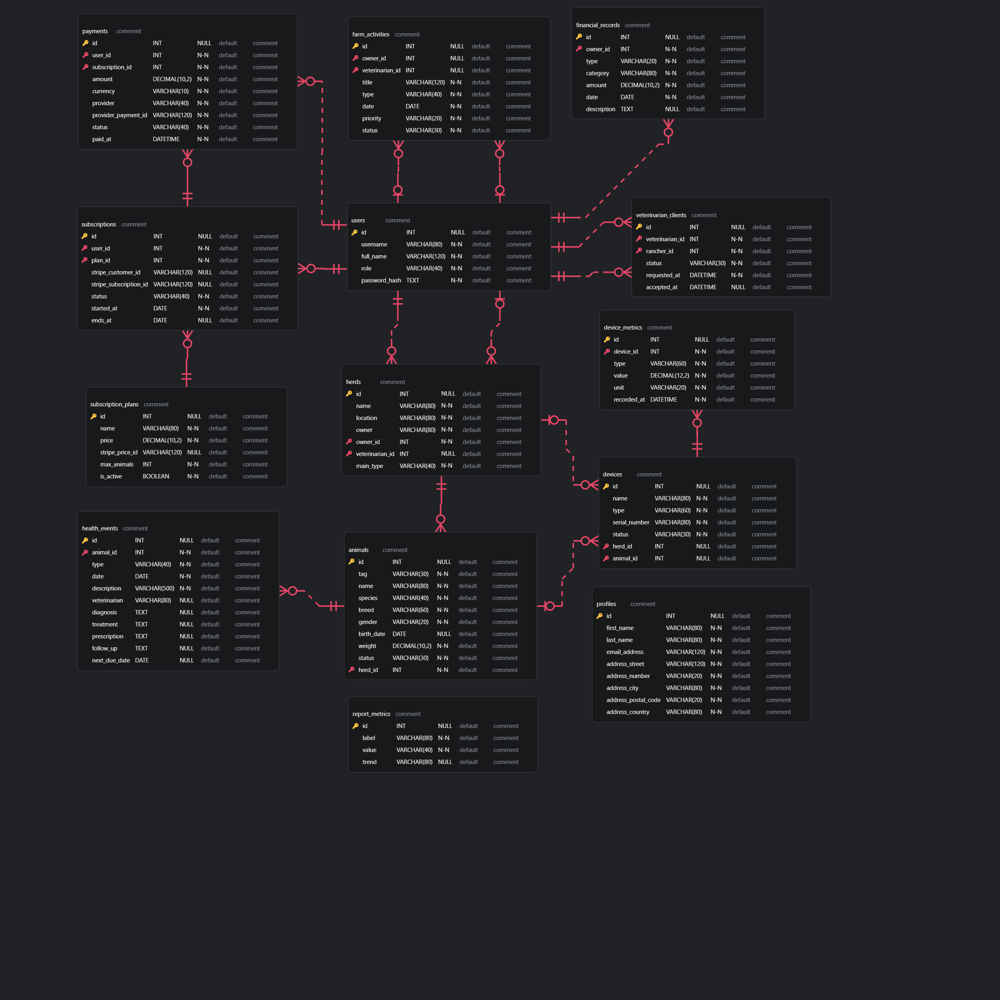
  <p>
    <i><b>Fuente</b>: Elaboración propia.</i>
  </p>
</div>

<div style="page-break-before: always;"></div>

<a id="toc-5-1-software-configuration-management"></a>
# 5.1. Software Configuration Management.

En esta sección se detallan todas las reglas y procesos que hemos seguido en el proyecto al momento de crear y desplegar la Landing Page y Aplicación Web de AniTec. El objetivo de estas reglas y procesos es garantizar la integridad y consistencia del software, desde el inicio hasta el despliegue y mantenimiento.

<a id="toc-5-1-1-software-development-environment-configuration"></a>
## 5.1.1. Software Development Environment Configuration.

En este apartado se describe la configuración del entorno de desarrollo de AniTec, establecida para garantizar la correcta integración, colaboración y trazabilidad de las actividades realizadas por los miembros del equipo. Se definen las herramientas, plataformas y productos de software utilizados a lo largo del ciclo de vida de la ejecución, desde la gestión del proyecto hasta el despliegue y la documentación técnica.

**Project Management**

Esta categoría agrupa las herramientas a utilizar para la planificación, organización y seguimiento del trabajo del equipo durante el desarrollo del proyecto.

| Plataforma / Herramienta | Propósito en el proyecto                                                                                                       | Enlace             |
| ------------------------ | ------------------------------------------------------------------------------------------------------------------------------ | ------------------ |
| Trello                   | Gestión del backlog del proyecto AniTec, planificación de sprints y seguimiento del progreso de tareas e historias de usuario. | https://trello.com |

**Requirements Management**

Incluye herramientas orientadas a la identificación, análisis y definición de los requerimientos funcionales y no funcionales del sistema.

| Plataforma / Herramienta | Propósito en el proyecto                                                                                    | Enlace                            |
| ------------------------ | ----------------------------------------------------------------------------------------------------------- | --------------------------------- |
| Gherkin                  | Definición estructurada de criterios de aceptación de las user stories mediante el formato Given-When-Then. | https://cucumber.io/docs/gherkin/ |
| Miro                     | Ejecución de dinámicas como Event Storming para identificar procesos, eventos y flujos del sistema AniTec.  | https://miro.com/                 |

**Product UX/UI Design**

Comprende las herramientas a utilizar para el diseño de la experiencia de usuario, interfaces y validación visual del producto digital.

| Plataforma / Herramienta | Propósito en el proyecto                                                                                                     | Enlace                      |
| ------------------------ | ---------------------------------------------------------------------------------------------------------------------------- | --------------------------- |
| Figma                    | Diseño de wireframes, mockups y prototipos de la landing page y la aplicación web de AniTec.                                 | https://www.figma.com       |
| Canva                    | Creación de recursos visuales como banners, íconos e imágenes para la identidad visual del producto.                         | https://www.canva.com       |
| UXPressia                | Elaboración de User Personas y Customer Journey Maps para comprender el comportamiento y necesidades del usuario.            | https://uxpressia.com       |
| Lucidchart               | Aplicación para crear diagramas. Se utilizará para diseñar flujos de usuario, wireflows y el diagrama de clases del sistema. | https://www.lucidchart.com/ |

**Software Development**

Incluye herramientas que serán destinadas a la implementación técnica del sistema, desarrollo del código y control de versiones.

| Plataforma / Herramienta | Propósito en el proyecto                                                                                                                                                                                     | Enlace                              |
| ------------------------ | ------------------------------------------------------------------------------------------------------------------------------------------------------------------------------------------------------------ | ----------------------------------- |
| GitHub                   | Gestión del repositorio del proyecto AniTec, control de versiones, manejo de ramas y colaboración entre desarrolladores.                                                                                     | https://github.com                  |
| Visual Studio Code       | Entorno de desarrollo utilizado para la redacción y gestión del informe mediante archivos en formato Markdown (.md), facilitando la organización, edición estructurada y control de versiones del contenido. | https://code.visualstudio.com/      |
| WebStorm                 | Entorno especializado para el desarrollo del frontend de la aplicación web AniTec, aprovechando su soporte avanzado para JavaScript y frameworks modernos.                                                   | https://www.jetbrains.com/webstorm/ |
| Rider                    | Entorno especializado para el desarrollo del backend ASP.NET Core de AniTec, permitiendo implementar controladores, servicios, repositorios y configuración del proyecto .NET.                               | https://www.jetbrains.com/rider/    |
| MySQL                    | Sistema gestor de base de datos relacional utilizado para persistir la información del backend de AniTec.                                                                                                    | https://www.mysql.com/              |
| MySQL Workbench          | Herramienta utilizada para consultar, administrar y revisar visualmente la base de datos MySQL durante el desarrollo.                                                                                        | https://www.mysql.com/products/workbench/ |

**Software Deployment**

Se incluyen las herramientas a utilizar para la publicación y disponibilidad del sistema en entornos accesibles para los usuarios.

| Plataforma / Herramienta | Propósito en el proyecto                                                                                 | Enlace                      |
| ------------------------ | -------------------------------------------------------------------------------------------------------- | --------------------------- |
| GitHub Pages             | Despliegue de la landing page de AniTec mediante hosting estático accesible a través de una URL pública. | https://pages.github.com    |
| GitHub Pages             | Despliegue del frontend web de AniTec como aplicación SPA accesible desde una URL pública.               | https://pages.github.com    |
| Render                   | Despliegue del backend web de AniTec mediante un Web Service público para exponer la API REST.           | https://render.com/         |
| My JSON Server           | Herramienta utilizada en una etapa previa para datos de prueba del frontend antes de integrar el backend real. | https://my-json-server.typicode.com/ |

**Software Documentation**

Agrupa herramientas a emplear para documentar la arquitectura, procesos, modelos y estructura del sistema.

| Plataforma / Herramienta | Propósito en el proyecto                                                                               | Enlace                  |
| ------------------------ | ------------------------------------------------------------------------------------------------------ | ----------------------- |
| Lucidchart               | Elaboración de diagramas de flujo, wireflows y diagramas de clases del sistema.                        | https://lucidchart.com  |
| Structurizr              | Modelado de la arquitectura del sistema mediante el enfoque C4 (contexto, contenedores y componentes). | https://structurizr.com |
| Vertabelo                | Diseño y documentación del modelo de base de datos relacional del sistema AniTec.                      | https://vertabelo.com   |

<a id="toc-5-1-2-source-code-management"></a>
## 5.1.2. Source Code Management.

En esta sección, el equipo de desarrollo de AniTec define los mecanismos y la estructura organizativa utilizados para el control de versiones y el seguimiento de cambios, empleando **GitHub** como plataforma principal.

Para ello, se configuraron repositorios remotos donde se almacena el código fuente, se documentan las modificaciones y se facilita la colaboración eficiente entre los miembros del equipo a lo largo de todo el ciclo de desarrollo de la aplicación.

Se utiliza GitHub como sistema centralizado para el versionado y la gestión colaborativa.
Los repositorios oficiales del proyecto AniTec son los siguientes:

- AniTec Documentation: https://github.com/upc-1asi0730-2610-12206-titan-team-4/anitec-report
- Landing Page: https://github.com/upc-1asi0730-2610-12206-titan-team-4/anitec-landing-page
- Aplicación Web (frontend de AniTec): https://github.com/upc-1asi0730-2610-12206-titan-team-4/anitec-frontend
- Backend / Servicios Web (API del sistema): https://github.com/upc-1asi0730-2610-12206-titan-team-4/anitec-backend

**Workflow de Control de Versiones (GitFlow)**

Para la gestión del desarrollo, se implementa el modelo GitFlow, el cual establece una estructura de ramas que permite organizar el trabajo del equipo de forma controlada y escalable.

**Estructura de branches (Ramas)**

**Ramas base:**

- _main_: Contiene la versión estable y productiva del sistema.
- _develop_: Rama de integración donde se consolidan las funcionalidades en desarrollo antes de su liberación a main.

**Feature branches:** <br> Cada funcionalidad específica contará con una rama independiente. Al completarse su desarrollo, se integrará a la rama principal de desarrollo. La nomenclatura seguirá el formato "feature/descripción-funcionalidad" para garantizar claridad y unicidad.

**Release branches:** <br> Estas bifurcaciones representarán versiones candidatas de la rama develop, preparadas para su eventual incorporación a main. Su identificación se basará en el Versionamiento Semántico estándar.

**Hotfix branches:** <br> Se implementarán para resolver de manera ágil errores críticos detectados en producción que afecten directamente la funcionalidad del sistema.

La estructura básica será: `git commit -m "<type>[optional scope]:<title>" -m"<description">`

1._Versionamiento Semántico:_ El control de versiones aplicará estrictamente los principios del Versionamiento Semántico 2.0.0 (SemVer), siguiendo el formato `MAJOR.MINOR.PATCH`, lo que permite mantener coherencia entre las versiones del sistema y asegurar la compatibilidad entre actualizaciones. 

| Parte  | Significado |
|--------|-------------|
| **MAJOR** | Cambios incompatibles o refactorizaciones críticas que alteran el funcionamiento del sistema existente. |
| **MINOR** | Implementación de nuevas funcionalidades retrocompatibles dentro del sistema. |
| **PATCH** | Corrección de errores o mejoras menores que no afectan la funcionalidad existente. |

<br>

2._Convenciones de Commits:_ Los mensajes de confirmación seguirán el estándar Conventional Commits, con el objetivo de mantener un historial de cambios claro, consistente y trazable a lo largo del desarrollo del proyecto AniTec.

**Tipos de commits utilizados:**

- **feat**: implementación de nuevas funcionalidades o módulos del sistema.
- **fix**: corrección de errores en el código o en la funcionalidad.
- **docs**: modificaciones o mejoras en la documentación del proyecto.
- **style**: cambios de formato o estilo que no afectan la lógica del sistema.
- **refactor**: reestructuración del código sin modificar su comportamiento funcional.
- **test**: creación o actualización de pruebas unitarias o de integración.
- **chore**: tareas de mantenimiento, configuración o actualización de dependencias.

<a id="toc-5-1-3-source-code-style-guide-and-conventions"></a>
## 5.1.3. Source Code Style Guide & Conventions.

En esta sección, el equipo de desarrollo de AniTec define las convenciones de nomenclatura y estilo de código adoptadas para garantizar consistencia, legibilidad y mantenibilidad en todos los componentes del sistema. Estas convenciones aplican a la Landing Page, la Web Application frontend y los Web Services backend, manteniendo coherencia entre HTML, CSS, JavaScript, Vue, PrimeVue, ASP.NET Core y la API REST.

El equipo procura que el estilo de código sea consistente con las tecnologías trabajadas durante el curso, evitando soluciones innecesariamente complejas y priorizando una estructura clara por componentes, módulos y bounded contexts.

**Convenciones Generales**

- Uso obligatorio del idioma inglés en todo el código fuente.
- Nombres descriptivos y semánticos.
- Evitar abreviaciones innecesarias.
- Mantener consistencia en estilos a lo largo del proyecto.
- Código estructurado, modular y reutilizable.
- Uso de nomenclatura `kebab-case` para clases y nombres de archivos.

---

**HTML y CSS**

Se adoptan las recomendaciones de:

- Google HTML/CSS Style Guide
- HTML Style Guide and Coding Conventions

**Convenciones aplicadas:**

- Uso de etiquetas semánticas (`<header>`, `<section>`, `<article>`, etc.).
- Indentación de 2 espacios.
- Uso de clases en formato `kebab-case` (ej. `animal-card`, `main-header`).
- Separación clara entre estructura (HTML) y estilo (CSS).
- Evitar estilos en línea (inline styles).

---

**JavaScript**

Se adoptan las guías:

- Google JavaScript Style Guide
- MDN JavaScript Guidelines

**Convenciones aplicadas:**

- Uso de `camelCase` para variables y funciones (ej. `getAnimalData`).
- Uso de `PascalCase` para clases (ej. `AnimalService`).
- Uso de `const` y `let` en lugar de `var`.
- Funciones pequeñas y con una única responsabilidad.
- Manejo adecuado de promesas (`async/await`).
- Uso de módulos para organizar el código.

---

**Framework Frontend**

Se adopta:

- Vue Style Guide
- PrimeVue Component Guidelines
- Material Design principles para organización visual, jerarquía, formularios y navegación.

**Convenciones aplicadas:**

- Componentes en `PascalCase` (ej. `AnimalCard.vue`).
- Separación de lógica, template y estilos dentro del componente.
- Props claramente tipadas y documentadas.
- Reutilización de componentes.
- Uso consistente de componentes PrimeVue para formularios, tablas, botones, diálogos y navegación.
- Organización del frontend por bounded contexts y capas `domain`, `application`, `infrastructure` y `presentation`.

---

**C# / Backend (.NET)**

Se adoptan:

- C# Coding Conventions
- Microsoft ASP.NET Core Coding Guidelines

**Convenciones aplicadas:**

- Uso de `PascalCase` para clases, métodos y propiedades.
- Uso de `camelCase` para variables locales y parámetros.
- Prefijo `_` para variables privadas (ej. `_animalRepository`).
- Métodos con nombres verbales (ej. `GetAnimals`, `CreateAnimal`).
- Separación en capas (Controllers, Services, Repositories).
- Uso de inyección de dependencias.

---

**REST API**

Se adoptan convenciones simples para mantener endpoints claros y coherentes con la arquitectura RESTful trabajada en clase.

**Convenciones aplicadas:**

- Uso de rutas en plural para recursos principales, por ejemplo `/animals`, `/herds`, `/devices` y `/subscriptions`.
- Uso de verbos HTTP según la acción: `GET` para consulta, `POST` para creación, `PUT` para actualización y `DELETE` para eliminación.
- Uso de resources y assemblers para separar entidades de dominio de respuestas REST.
- Respuestas orientadas a datos necesarios para el frontend, evitando exponer detalles internos de persistencia.
- Documentación de endpoints mediante Swagger/OpenAPI.

<a id="toc-5-1-4-software-deployment-configuration"></a>
## 5.1.4. Software Deployment Configuration.

En esta sección se describe la configuración y el proceso de despliegue de los distintos componentes del sistema AniTec, detallando los pasos necesarios para publicar cada producto digital a partir de sus respectivos repositorios de código fuente.

El despliegue se ha estructurado de forma independiente para cada componente: Landing Page, Aplicación Web (Frontend) y Web Services (Backend), permitiendo una gestión modular, escalable y mantenible.

### Despliegue de Landing Page

La Landing Page se despliega utilizando **GitHub Pages**, permitiendo la publicación de sitios web estáticos directamente desde el repositorio.

**Repositorio:** https://github.com/upc-1asi0730-2610-12206-titan-team-4/anitec-landing-page

**URL pública:** https://upc-1asi0730-2610-12206-titan-team-4.github.io/anitec-landing-page/

**Pasos de despliegue:**

1. Subir el código fuente (HTML, CSS, JavaScript) al repositorio.
2. Configurar la rama `main` como fuente de despliegue en GitHub Pages.
3. Activar la opción **Pages** en la configuración del repositorio.
4. GitHub genera automáticamente una URL pública para acceder al sitio.

**Resultado:**

La Landing Page queda disponible en una URL accesible desde cualquier navegador. Link: https://upc-1asi0730-2610-12206-titan-team-4.github.io/anitec-landing-page/

<div align="center">
    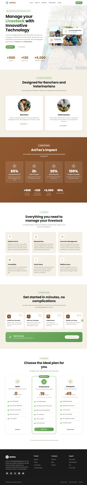
    <p><i><b>Fuente</b>: Elaboración propia.</i></p>
</div>

### Despliegue de Frontend Web

La aplicación Frontend de AniTec se despliega utilizando **GitHub Pages**, permitiendo publicar la versión compilada de la SPA de Vue desde el repositorio del proyecto.

**Repositorio:** https://github.com/upc-1asi0730-2610-12206-titan-team-4/anitec-frontend

**Pasos de despliegue:**

1. Compilar el frontend con Vite para generar los archivos estáticos de producción.
2. Configurar GitHub Pages en el repositorio del frontend.
3. Publicar la versión generada para que la aplicación quede disponible mediante una URL pública.
4. Verificar que las rutas principales de la aplicación carguen correctamente desde el navegador.

**Resultado:**

La aplicación Frontend queda disponible en una URL accesible desde cualquier navegador. Link: https://upc-1asi0730-2610-12206-titan-team-4.github.io/anitec-frontend

Para el ambiente de desarrollo, el frontend consume el backend real mediante variables de entorno configuradas en `.env.development`. Para producción, se debe mantener la misma estrategia de configuración mediante variables de entorno, de modo que la aplicación desplegada pueda apuntar progresivamente a la API real publicada sin cambiar el código fuente de los stores ni de las vistas.

<div align="center">
    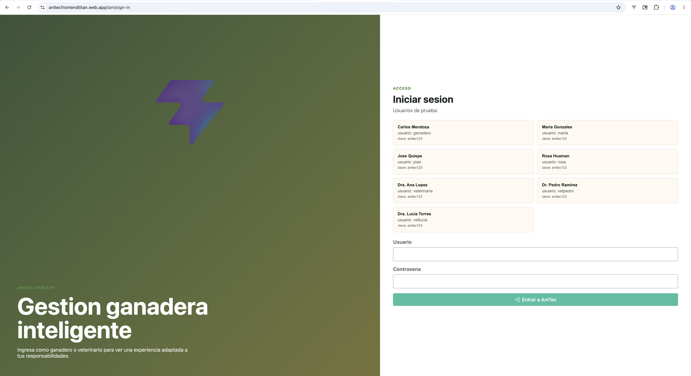
    <p><i><b>Fuente</b>: Elaboración propia.</i></p>
</div>

<div align="center">
    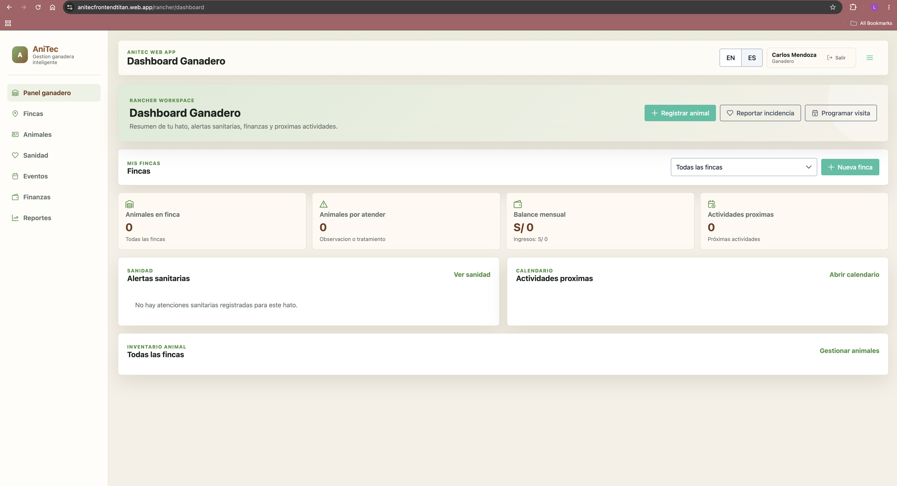
    <p><i><b>Fuente</b>: Elaboración propia.</i></p>
</div>

<div align="center">
    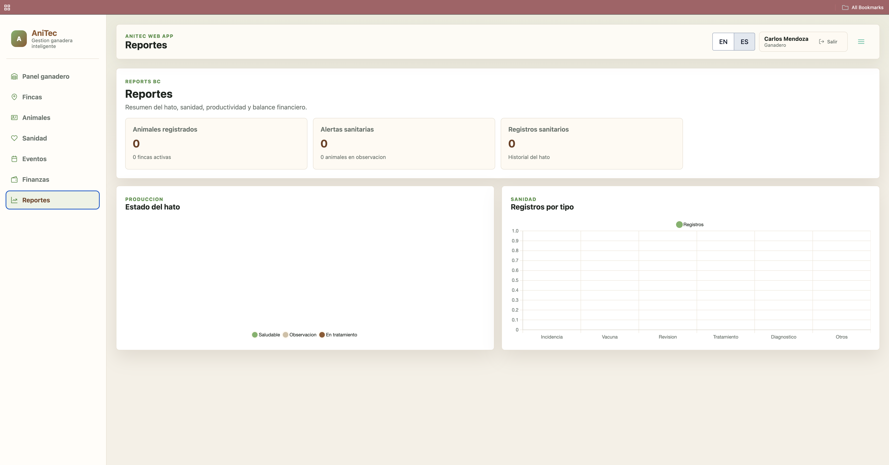
    <p><i><b>Fuente</b>: Elaboración propia.</i></p>
</div>

### Despliegue de Backend Web

El backend de AniTec se despliega utilizando **Render**, mediante un Web Service que permite exponer la API REST desarrollada con ASP.NET Core en un entorno accesible desde internet.

**Repositorio:** https://github.com/upc-1asi0730-2610-12206-titan-team-4/anitec-backend

**Pasos de despliegue:**

1. Crear un Web Service en Render.
2. Conectar el repositorio del backend desde GitHub.
3. Configurar la rama de despliegue y el proyecto de inicio de ASP.NET Core.
4. Definir las variables de entorno requeridas, incluyendo cadena de conexión y configuración JWT.
5. Ejecutar el build en Render y verificar el inicio correcto del servicio.
6. Validar la documentación Swagger desde la URL pública.

**Resultado:**

El backend queda disponible públicamente para la integración con el frontend. Link: https://anitec-backend.onrender.com/swagger/index.html

**URL pública del backend:** https://anitec-backend.onrender.com

**Documentación Swagger:** https://anitec-backend.onrender.com/swagger/index.html

<div align="center">
    
    <p><i><b>Fuente</b>: Elaboración propia.</i></p>
</div>

<div style="page-break-before: always;"></div>

<br>
<br>

<div align="center">
    
</div>

<br>
<br>

<a id="toc-5-2-landing-page-services-and-applications-implementation"></a>
# 5.2. Landing Page, Services & Applications Implementation.

<a id="toc-5-2-1-sprint-1"></a>
## 5.2.1. Sprint 1.

En el Sprint 1, el equipo de AniTec se enfocó en la construcción de la Landing Page como primer entregable del producto digital, con el objetivo de establecer la presencia inicial del sistema y validar la propuesta de valor frente a los usuarios objetivo (ganaderos y veterinarios).

Durante este Sprint se desarrolló la estructura base de la Landing Page, incluyendo la organización de las secciones principales, la navegación entre páginas, la presentación de la propuesta de valor y los llamados a la acción orientados a la captación de usuarios.

<a id="toc-5-2-1-1-sprint-planning-1"></a>
### 5.2.1.1. Sprint Planning 1.

El Sprint Planning del Sprint 1 tuvo como objetivo definir el alcance inicial del proyecto, priorizando la creación de la Landing Page como primer punto de contacto con los usuarios finales.

Se estableció que este componente es crítico dentro de la estrategia del producto, ya que representa la primera interacción de los usuarios con AniTec y permite comunicar de manera clara la propuesta de valor del sistema. Por ello, el equipo priorizó la implementación de una experiencia visual clara, estructurada y orientada a la conversión de usuarios.

Durante la planificación se definieron las historias de usuario del Sprint, se estimaron los Story Points y se distribuyeron las responsabilidades entre los integrantes del equipo, considerando sus fortalezas técnicas y promoviendo el trabajo colaborativo mediante el uso de GitHub y un tablero de gestión de tareas.

<table align="center" border="1" cellpadding="8" cellspacing="0" style="border-collapse: collapse; width: 100%; font-family: Arial, sans-serif;">
    <tbody>
        <tr>
            <td><b>Sprint #</b></td>
            <td>Sprint 1</td>
        </tr>
        <tr>
            <td colspan="2"><b>Sprint Planning Background</b></td>
        </tr>
        <tr>
            <td>Date</td>
            <td>2026-04-17</td>
        </tr>
        <tr>
            <td>Time</td>
            <td>10:00 AM</td>
        </tr>
        <tr>
            <td>Location</td>
            <td>Reunión virtual via Discord - Canal #sprint-planning</td>
        </tr>
        <tr>
            <td>Prepared by</td>
            <td>Ayala Fernandez, Jorge Brayan</td>
        </tr>
        <tr>
            <td>Attendees (to planning meeting)</td>
            <td>Jorge Ayala, Bruno Huaman, Josep Melgarejo, Nadhim Raymundo, Luciana Sanchez</td>
        </tr>
        <tr>
            <td>Previous Sprint Review Summary</td>
            <td>No aplica - Este es el primer Sprint del proyecto. Se establecieron las bases del Product Backlog, se definieron los User Stories priorizados, y se creó la estructura inicial de repositorios en GitHub Organization.</td>
        </tr>
        <tr>
            <td>Previous Sprint Retrospective Summary</td>
            <td>No aplica - Este es el primer Sprint del proyecto. El equipo se conformó recientemente y se espera mejorar la coordinación en sprints posteriores.</td>
        </tr>
        <tr>
            <td colspan="2"><b>Sprint Goal / User Stories</b></td>
        </tr>
        <tr>
            <td>Sprint 1 Goal</td>
            <td>Nuestro enfoque está en establecer la presencia digital inicial de AniTec mediante una Landing Page responsive orientada a ganaderos y veterinarios. Creemos que esto entrega claridad sobre la propuesta de valor y genera interés inicial en los segmentos objetivo. Esto se confirmará cuando los visitantes puedan acceder a la página principal, conocer beneficios, revisar secciones para ganaderos y veterinarios, y usar los llamados a la acción desde desktop y mobile.</td>
        </tr>
        <tr>
            <td>Sprint 1 Velocity</td>
            <td>El equipo estimó un velocity inicial de 34 Story Points, enfocados en el desarrollo de la Landing Page multipágina (index, about us, ranchers, veterinarians).</td>
        </tr>
        <tr>
            <td>Sprint of Story Points</td>
            <td>Total: 34 SP - Distribuidos en 8 SP para estructura HTML base, 8 SP para secciones de contenido, 8 SP para estilos CSS y diseño responsive, y 10 SP para funcionalidades JavaScript y sliders.</td>
        </tr>
    </tbody>
</table>

El Sprint Planning Meeting del 17 de abril de 2026 duró aproximadamente 2 horas. El equipo discutió en detalle los User Stories a implementar, estimó las responsabilidades iniciales, y estableció los primeros stories de colaboración. Durante la reunión, cada miembro del equipo tuvo la oportunidad de expresar sus dudas respecto a las tareas asignadas y se resolvieron interrogantes técnicas relacionadas con las tecnologías a utilizar.

La dinámica del Sprint Planning permitió al equipo alinear expectativas y establecer un compromiso colectivo hacia el logro del Sprint Goal. Se destinó tiempo suficiente para revisar las guidelines de código establecidas en el proyecto, asegurando que todos los miembros comprendieran las convenciones de nomenclatura, estructura de archivos y flujo de trabajo con Git.

**User Stories incluidos en el Sprint 1:**

Los User Stories seleccionados para este Sprint inicial reflejan las necesidades más críticas para establecer la presencia digital de AniTec. El equipo se enfocó en la Landing Page multipágina para este primer Sprint, reconociendo la importancia de dirigirse a los dos segmentos objetivo (ranchers y veterinarians) con páginas especializadas.

| ID     | User Story                                     | Prioridad   | Story Points |
| ------ | ---------------------------------------------- | ----------- | ------------ |
| US-044 | Visualizar página principal de la landing page | Must Have   | 8            |
| US-045 | Conocer beneficios generales de AniTec         | Must Have   | 5            |
| US-051 | Acceder a contacto o llamada a la acción       | Must Have   | 5            |
| US-048 | Visualizar página nosotros                     | Must Have   | 4            |
| US-046 | Visualizar página para ganaderos               | Should Have | 4            |
| US-047 | Visualizar página para veterinarios            | Should Have | 4            |
| US-052 | Visualizar landing page en dispositivos móviles | Should Have | 4            |

La selección de estos User Stories para el Sprint 1 responde a la necesidad de establecer la presencia digital de AniTec rápidamente, permitiendo que usuarios potenciales conozcan la propuesta de valor para los dos segmentos target. El equipo identificó que US-044 y US-051 son las más críticas, representando el objetivo principal del Sprint, mientras que las páginas específicas (US-046 y US-047) aportan valor para alcanzar a los segmentos especializados. Además, US-052 permite validar que la Landing Page pueda visualizarse correctamente desde dispositivos móviles.

**Distribución de Trabajo por Componente:**

- **Landing Page:** 34 Story Points - Enfocados en las 4 páginas (index, about us, ranchers, veterinarians), incluyendo estructura HTML, estilos CSS, funcionalidades JavaScript, y contenido optimizado para SEO.

La distribución de Story Points fue diseñada para que cada miembro del equipo tuviera una carga de trabajo equilibrada. Se priorizaron las tareas de implementación técnica (estructura HTML y estilos) sobre las tareas de configuración, reconociendo que la visibilidad del progreso es fundamental para mantener la motivación del equipo durante las primeras etapas del proyecto.

<a id="toc-5-2-1-2-aspect-leaders-and-collaborators"></a>
### 5.2.1.2. Aspects Leaders and Collaborators.

En esta sección el equipo elabora el artefacto Leadership-and-Collaboration Matrix (LACX), que indica por cada aspecto dentro del alcance del Sprint, quién es el líder y quién o quiénes son colaboradores en dicho aspecto, con el fin de brindar mayor claridad y efectividad en la comunicación al interior del equipo.

La sección incluye una introducción donde se explica cuáles son los principales aspectos que se toma en cuenta en el Sprint 1. Para este primer Sprint, los aspectos están centrados exclusivamente en el desarrollo de la Landing Page multipágina, reconociendo la importancia de establecer roles claros desde el inicio del proyecto para evitar conflictos y facilitar la toma de decisiones durante la implementación.

El equipo AniTec está conformado por 5 miembros con diferentes fortalezas técnicas y experiencia en distintas áreas del desarrollo de software. Durante la reunión de Sprint Planning, se identificaron las competencias de cada miembro y se asignaron los roles de líder (L) y colaborador (C) para cada aspecto del Sprint, priorizando el desarrollo profesional de cada integrante mientras se optimiza la productividad del equipo.

**Aspectos del Sprint 1:**

1. **Landing Page - UI/UX:** Diseño y estructura visual de las páginas principales, incluyendo wireframes, mockups, paleta de colores, tipografía y componentes visuales.
2. **Landing Page - Desarrollo HTML/CSS:** Implementación técnica de las páginas landing, incluyendo código HTML semántico, estilos CSS, y diseño responsive.
3. **Landing Page - Funcionalidades JavaScript:** Implementación de sliders automáticos, interacciones de navegación, y efectos visuales.
4. **Landing Page - Responsive / Mobile:** Validación visual de la landing page en desktop, tablet y mobile, revisando navegación, secciones, botones e imágenes.
5. **Documentación:** Documentación técnica del Sprint, incluyendo este archivo y demás artefactos Scrum requeridos.

La distribución de roles fue diseñada para fomentar la colaboración entre los miembros del equipo, evitando situaciones donde un solo miembro sea responsable de un componente crítico. En caso de que un líder no esté disponible, los colaboradores están preparados para asumir responsabilidad parcial del aspecto correspondiente.

<table align="center" border="1" cellpadding="8" cellspacing="0" style="border-collapse: collapse; width: 100%; font-family: Arial, sans-serif;">
    <tbody>
        <tr>
            <td><b>Team Member (Last Name, First Name)</b></td>
            <td><b>GitHub Username</b></td>
            <td><b>Landing UI/UX / L or C</b></td>
            <td><b>Landing Dev HTML/CSS / L or C</b></td>
            <td><b>Landing JS / L or C</b></td>
            <td><b>Documentation / L or C</b></td>
        </tr>
        <tr>
            <td>Ayala Fernandez, Jorge Brayan</td>
            <td>jorgeayaladev</td>
            <td>L</td>
            <td>C</td>
            <td>L</td>
            <td>C</td>
        </tr>
        <tr>
            <td>Huaman Gallardo, Bruno Aldair</td>
            <td>BrunoHG10</td>
            <td>C</td>
            <td>L</td>
            <td>C</td>
            <td>-</td>
        </tr>
        <tr>
            <td>Melgarejo Quiroz, Josep Eliu</td>
            <td>Melga1502</td>
            <td>C</td>
            <td>C</td>
            <td>C</td>
            <td>L</td>
        </tr>
        <tr>
            <td>Raymundo Villarroel, Nadhim Abigail</td>
            <td>AbigailRV</td>
            <td>C</td>
            <td>C</td>
            <td>C</td>
            <td>C</td>
        </tr>
        <tr>
            <td>Sanchez Silva, Luciana Celeste</td>
            <td>Luccsss</td>
            <td>C</td>
            <td>C</td>
            <td>C</td>
            <td>C</td>
        </tr>
    </tbody>
</table>

La organización de líderes y colaboradores tiene relación directa con las fortalezas técnicas de cada miembro del equipo identificadas durante la conformación del equipo. Esta distribución permite que cada uno trabaje en áreas donde puede aportar mayor valor, mientras tiene la oportunidad de aprender de los líderes en otras áreas.

El aspecto responsive/mobile fue cubierto dentro del desarrollo HTML/CSS y mediante validación visual de la landing page en distintos tamaños de pantalla, por lo que se mantiene dentro de la matriz principal como parte del trabajo de implementación de la landing page.

**Distribución detallada de responsabilidades:**

- **Ayala Fernandez, Jorge Brayan (UI/UX & JavaScript Lead):** Responsable del diseño visual de la Landing Page y las funcionalidades JavaScript, incluyendo la creación de mockups, definición de la paleta de colores basada en la identidad de marca de AniTec, y desarrollo de sliders automáticos. Coordina con el equipo de desarrollo para asegurar que la implementación respete el diseño propuesto.

- **Huaman Gallardo, Bruno Aldair (Development Lead):** Responsable de la implementación técnica HTML/CSS de las páginas landing, incluyendo la estructura HTML semántica, estilos CSS con metodología BEM, y diseño responsivo. Coordina con el líder de UI/UX para resolver dudas sobre el diseño y garantizar su correcta implementación.

- **Melgarejo Quiroz, Josep Eliu (Documentation Lead):** Responsable de la documentación del Sprint, incluyendo la elaboración de este archivo y demás artefactos Scrum. Coordina con los demás miembros para recopilar información sobre el avance del Sprint y asegurar la completitud de la documentación.

- **Landing Page - Responsive / Mobile:** Responsable de verificar que la navegación, secciones, botones e imágenes se adapten correctamente en desktop, tablet y mobile, evitando solapamientos o pérdida de legibilidad.

<a id="toc-5-2-1-3-sprint-backlog-1"></a>
### 5.2.1.3. Sprint Backlog 1.

El Sprint Backlog 1 tiene el objetivo principal de establecer la presencia digital de AniTec mediante una Landing Page multipágina funcional para los segmentos de ranchers y veterinarians. Este documento representa el compromiso del equipo para completar las tareas identificadas durante el Sprint Planning y representa la base para el seguimiento del progreso durante la iteración.

El Sprint Backlog fue elaborado de manera colaborativa, donde cada miembro del equipo tuvo la oportunidad de sugerir tareas adicionales o modificar la estimación de horas para tareas existentes. Se utilizó la técnica de Planning Poker para estimar la complejidad de cada tarea, considerando factores como el tiempo requerido, la complejidad técnica, y las dependencias con otras tareas.

**Trello Board:**
El equipo utiliza un Trello Board para gestionar visualmente el Sprint Backlog. El Board contiene las listas estándar de Scrum: "Sprint Goal", "To Do", "In Progress", "To Review" y "Done". El uso de Trello permite una visualización clara del estado de cada tarea y facilita la identificación de cuellos de botella en el flujo de trabajo.

Enlace al tablero del Sprint Backlog 1: https://trello.com/invite/b/6a06e9662903eb17cb2c9d0b/ATTI6d55852ea11badb2245aa4b7cf40d70dCFCD8EFC/sprint-backlog-1

<div align="center">
    
    <p><i><b>Fuente</b>: Elaboración propia.</i></p>
</div>

**Estructura del Trello Board:**

- **Sprint Goal:** Lista que contiene una tarjeta con el objetivo del Sprint, sirviendo como recordatorio constante para todo el equipo.
- **To Do:** Lista con las tareas pendientes por iniciar, ordenadas por prioridad y dependencias.
- **In Progress:** Lista con las tareas que están siendo implementadas actualmente.
- **To Review:** Lista con las tareas completadas pendientes de revisión por otro miembro del equipo.
- **Done:** Lista con las tareas aprobadas y listas para deployment.

A continuación, la tabla de control de estado para el Sprint 1:

<table align="center" border="1" cellpadding="8" cellspacing="0" style="border-collapse: collapse; width: 100%; font-family: Arial, sans-serif;">
    <tbody>
        <tr>
            <td><b>Sprint #</b></td>
            <td colspan="7">Sprint 1</td>
        </tr>
        <tr>
            <td colspan="2">User Story</td>
            <td colspan="6">Work-Item / Task</td>
        </tr>
        <tr>
            <td>Id</td>
            <td>Title</td>
            <td>Id</td>
            <td>Title</td>
            <td>Description</td>
            <td>Estimation (Hours)</td>
            <td>Assigned to</td>
            <td>Status</td>
        </tr>
        <tr>
            <td>US-044</td>
            <td>Visualizar página principal de la landing page</td>
            <td>T001</td>
            <td>Crear estructura HTML base</td>
            <td>Crear estructura base del documento HTML con DOCTYPE, meta tags, y vinculación de archivos CSS/JS</td>
            <td>2</td>
            <td>Ayala Fernandez, Jorge Brayan</td>
            <td>Done</td>
        </tr>
        <tr>
            <td>US-044</td>
            <td>Visualizar página principal de la landing page</td>
            <td>T002</td>
            <td>Implementar navegación principal</td>
            <td>Crear menú de navegación con enlaces a todas las páginas y funcionalidad smooth scroll</td>
            <td>3</td>
            <td>Huaman Gallardo, Bruno Aldair</td>
            <td>Done</td>
        </tr>
        <tr>
            <td>US-051</td>
            <td>Acceder a contacto o llamada a la acción</td>
            <td>T003</td>
            <td>Implementar botones CTA</td>
            <td>Crear botones de llamado a la acción con enlaces a pricing y registro</td>
            <td>2</td>
            <td>Ayala Fernandez, Jorge Brayan</td>
            <td>Done</td>
        </tr>
        <tr>
            <td>US-044</td>
            <td>Visualizar página principal de la landing page</td>
            <td>T004</td>
            <td>Implementar Hero Section</td>
            <td>Crear sección hero con headline, métricas y buttons para index.html</td>
            <td>4</td>
            <td>Ayala Fernandez, Jorge Brayan</td>
            <td>Done</td>
        </tr>
        <tr>
            <td>US-045</td>
            <td>Conocer beneficios generales de AniTec</td>
            <td>T005</td>
            <td>Implementar sección segmentos</td>
            <td>Crear sección que muestre los dos segmentos objetivo (ganaderos y veterinarios)</td>
            <td>3</td>
            <td>Raymundo Villarroel, Nadhim Abigail</td>
            <td>Done</td>
        </tr>
        <tr>
            <td>US-048</td>
            <td>Visualizar página nosotros</td>
            <td>T006</td>
            <td>Implementar página About Us</td>
            <td>Crear página nosotros.html con información del equipo y proceso</td>
            <td>4</td>
            <td>Melgarejo Quiroz, Josep Eliu</td>
            <td>Done</td>
        </tr>
        <tr>
            <td>US-046</td>
            <td>Visualizar página para ganaderos</td>
            <td>T007</td>
            <td>Implementar página Ranchers</td>
            <td>Crear página ganaderos.html con módulos, testimonios y comparación</td>
            <td>5</td>
            <td>Huaman Gallardo, Bruno Aldair</td>
            <td>Done</td>
        </tr>
        <tr>
            <td>US-047</td>
            <td>Visualizar página para veterinarios</td>
            <td>T008</td>
            <td>Implementar página Veterinarians</td>
            <td>Crear página veterinarios.html con funcionalidades, casos de uso y testimonios</td>
            <td>5</td>
            <td>Sanchez Silva, Luciana Celeste</td>
            <td>Done</td>
        </tr>
        <tr>
            <td>US-052</td>
            <td>Visualizar landing page en dispositivos móviles</td>
            <td>T009</td>
            <td>Validar diseño responsive de la landing page</td>
            <td>Verificar visualización de la landing page en desktop, tablet y mobile, ajustando navegación, secciones, botones e imágenes para evitar solapamientos.</td>
            <td>4</td>
            <td>Huaman Gallardo, Bruno Aldair</td>
            <td>Done</td>
        </tr>
    </tbody>
</table>

El Sprint Backlog refleja 9 tareas principales, alineadas con los 34 Story Points calculados para el Sprint 1. Cada tarea fue estimada considerando la complejidad técnica, el tiempo requerido para investigación en caso de desconocimiento, y los posibles imprevistos que pudieran surgir durante la implementación.

El equipo se compromete a completar todas las tareas del Sprint Backlog antes de la fecha de Sprint Review programada para el final de la iteración. Se realizará seguimiento diario del progreso mediante las daily standups y se tomarán acciones correctivas en caso de identificar desviaciones significativas del plan.

<a id="toc-5-2-1-4-development-evidence-for-sprint-review"></a>
### 5.2.1.4. Development Evidence for Sprint Review.

En esta sección se explica y presenta los avances en implementación con relación a los productos de la solución según el alcance del Sprint 1: Landing Page Multipágina. La sección resume los principales avances logrados durante este Sprint inicial y sirve como evidencia de que el equipo cumplió con el objetivo planificado.

Durante el Sprint 1, el equipo AniTec logró completar la configuración de la Landing Page multipágina. Se obtuvo un sitio web completamente funcional con las siguientes páginas y secciones: Index (página principal), About Us (nosotros), Ranchers (para ganaderos), y Veterinarians (para veterinarios). El desarrollo siguió las mejores prácticas de desarrollo web, incluyendo código semántico, accesibilidad, y optimización para motores de búsqueda (SEO).

**Resumen de Avances Implementados:**

La Landing Page implementada durante el Sprint 1 cuenta con las siguientes características técnicas y funcionales:

- **Estructura HTML semántica:** Utilización de etiquetas HTML5 apropiadas (header, nav, main, section, article, footer) para garantizar accesibilidad y mejor posicionamiento en motores de búsqueda.
- **Hojas de estilo CSS:** Implementación de estilos utilizando metodología BEM (Block Element Modifier) para mantener un código CSS organizado y reutilizable. Soporte para diseño responsivo en tablets y móviles.
- **Diseño responsivo:** Implementación de breakpoints en 1024px (tablet) y 640px (móvil) utilizando CSS Grid y Flexbox para asegurar una experiencia consistente en todos los dispositivos.
- **JavaScript funcional:** Scripts para sliders automáticos de testimonios, navegación sticky, y efectos visuales.
- **Optimización SEO:** Meta tags, Open Graph, Twitter Cards, y estructura semántica para mejorar el posicionamiento en motores de búsqueda.
- **Accesibilidad web:** Cumplimiento de estándares WCAG 2.1 nivel AA, incluyendo contraste de colores adecuado, navegación por teclado funcional, y etiquetas ARIA donde fue necesario.

**Commits del repositorio anitec-landing-page:**

| Repository                                               | Branch | Commit Id | Commit Message                                   | Commit Message Body                                                                                                | Committed on (Date) |
| -------------------------------------------------------- | ------ | --------- | ------------------------------------------------ | ------------------------------------------------------------------------------------------------------------------ | ------------------- |
| upc-1asi0730-2610-12206-titan-team-4/anitec-landing-page | main   | dca9c81   | feat: initialize AniTec landing page             | Se creo la estructura inicial de la landing page con los archivos principales del sitio web.                       | 23/04/2026          |
| upc-1asi0730-2610-12206-titan-team-4/anitec-landing-page | main   | 90d6c95   | feat: add home page sections                     | Se implementaron las secciones principales del index, incluyendo hero, segmentos, metricas y llamados a la accion. | 26/04/2026          |
| upc-1asi0730-2610-12206-titan-team-4/anitec-landing-page | main   | f604f7d   | feat: build ranchers and veterinarians pages     | Se agregaron las paginas orientadas a ganaderos y veterinarios con contenido diferenciado para cada segmento.      | 26/04/2026          |
| upc-1asi0730-2610-12206-titan-team-4/anitec-landing-page | main   | c1beba6   | feat: add i18n translations and navigation links | Se agregaron traducciones y enlaces de navegacion para conectar las paginas principales de la landing page.        | 02/05/2026          |
| upc-1asi0730-2610-12206-titan-team-4/anitec-landing-page | main   | b253306   | feat: complete AniTec landing page layout        | Se completo el diseño visual de la landing page y se ajustaron las secciones finales para la revision del sprint.  | 14/05/2026          |

**Commits del repositorio anitec-report:**

| Repository                                         | Branch | Commit Id | Commit Message                                 | Commit Message Body                                                                                  | Committed on (Date) |
| -------------------------------------------------- | ------ | --------- | ---------------------------------------------- | ---------------------------------------------------------------------------------------------------- | ------------------- |
| upc-1asi0730-2610-12206-titan-team-4/anitec-report       | main   | a4c92e1   | docs: add sprint 1 planning evidence             | Se documento el objetivo del sprint, el sprint backlog y las responsabilidades iniciales del equipo.               | 14/05/2026          |
| upc-1asi0730-2610-12206-titan-team-4/anitec-report       | main   | e7b31a4   | docs: describe landing page execution evidence   | Se agrego la descripcion de las vistas implementadas y las funcionalidades desarrolladas en la landing page.       | 15/05/2026          |
| upc-1asi0730-2610-12206-titan-team-4/anitec-report       | main   | c9f84b2   | docs: update deployment evidence for sprint 1    | Se documento el despliegue de la landing page en GitHub Pages y la verificacion posterior al despliegue.           | 15/05/2026          |

El equipo realizó un total de 8 commits relacionados con la implementación de la Landing Page y la documentación del Sprint 1. Cada commit sigue la convención de Conventional Commits establecida en la configuración del proyecto, facilitando la generación automática de changelogs y la trazabilidad de cambios. Los commits fueron realizados de forma regular, evitando commits muy grandes que dificulten la revisión de código y el rollback en caso de problemas.

**Repositorios relacionados al Sprint 1:**

- Landing Page: https://github.com/upc-1asi0730-2610-12206-titan-team-4/anitec-landing-page
- Reporte del proyecto: https://github.com/upc-1asi0730-2610-12206-titan-team-4/anitec-report

**Estadísticas de los commits registrados:**

- Total de ramas utilizadas: 1 (main)
- Total de commits registrados: 8
- Total de contribuciones: 5 miembros del equipo

<a id="toc-5-2-1-5-execution-evidence-for-sprint-review"></a>
### 5.2.1.5. Execution Evidence for Sprint Review.

Esta sección resume lo alcanzado en el Sprint 1 y presenta las capturas de pantalla de las principales vistas implementadas, junto con enlaces que ilustran la visualización y navegación logradas durante este Sprint inicial. Las evidencias presentadas demuestran que el equipo cumplió satisfactoriamente con el Sprint Goal establecido durante el Planning.

**Resumen de lo Alcanzado:**

El Sprint 1 permitió establecer la presencia digital de AniTec. El equipo logró completar la configuración del repositorio, establecer las convenciones de código, e implementar las funcionalidades de la Landing Page multipágina. Los resultados superan las expectativas iniciales, logrando una Landing Page funcional, visualmente atractiva y técnicamente sólida.

**URL pública de la landing page:**

https://upc-1asi0730-2610-12206-titan-team-4.github.io/anitec-landing-page/

**Video/demo de navegación del Sprint 1:**

[Agregar URL del video/demo de navegación del Sprint 1]

**Capturas de Pantalla - Landing Pages:**

<div align="center">
    <p><b>Landing page principal</b></p>
    
    <p><i><b>Fuente</b>: Elaboración propia.</i></p>
</div>

<div align="center">
    <p><b>Página para ganaderos</b></p>
    
    <p><i><b>Fuente</b>: Elaboración propia.</i></p>
</div>

<div align="center">
    <p><b>Página para veterinarios</b></p>
    
    <p><i><b>Fuente</b>: Elaboración propia.</i></p>
</div>

<div align="center">
    <p><b>Vista responsive/mobile</b></p>
    
    <p><i><b>Fuente</b>: Elaboración propia.</i></p>
</div>

Las Landing Pages implementadas incluyen las siguientes secciones principales:

1. **Index - Hero Section:** Con el headline "Gestiona tu Ganado con Tecnología Innovadora", badge "+500 Ranchers and 120 Veterinarians trust us", y buttons "Try Free" y "Learn More". La sección hero utiliza una imagen de fondo relacionada con gestión ganadera y cuenta con animaciones de entrada.

2. **Index - Segmentos:** Sección "Designed for Ranchers and Veterinarians" con dos tarjetas que muestran los dos segmentos objetivo con imágenes representativas y botones de navegación.

3. **Index - Métricas:** Sección "Results That Speak" con indicadores clave: 85% Menos Información Perdida, 2h Ahorro de Tiempo Diario, 30% Más Productividad, 100% Trazabilidad Completa.

4. **Index - Pricing:** Sección "Elige el plan ideal para ti" con tres planes: Basic ($0/mes), Professional ($19/mes), y Enterprise ($49/mes).

5. **About Us - Equipo:** Sección "Our Team" con información de los 5 miembros del equipo Titan, misión y visión de la startup.

6. **Ranchers - Página Específica:** Con hero "Digitize Your Livestock Today", módulos de gestión (Gestión de Animales, Control Sanitario, Reproducción, Gestión Económica), testimonios de ranchers, y comparación Traditional vs AniTec.

7. **Veterinarians - Página Específica:** Con hero "Optimize Your Veterinary Practice" y badge "Herramienta Profesional #1", funcionalidades clave, casos de uso, y testimonios de veterinarians.

**Funcionalidades adicionales implementadas:**

- **Navegación sticky:** La barra de navegación permanece fija al hacer scroll, mejorando la accesibilidad a los enlaces principales.
- **Sliders automáticos:** Testimonios con auto-slide cada 4 segundos para ranchers y veterinarians.
- **Diseño responsivo:** Breakpoints en 1024px y 640px para tablets y móviles.
- **Efectos hover:** Transiciones suaves en botones, cards, e imágenes.
- **CTA con imágenes:** Secciones CTA con imágenes rancher-2.png y veterinarian-2.png.

<a id="toc-5-2-1-6-services-documentation-evidence-for-sprint-review"></a>
### 5.2.1.6. Services Documentation Evidence for Sprint Review.

Durante el Sprint 1 no se implementaron Web Services ni endpoints REST, debido a que el alcance de la iteración estuvo centrado en la construcción de una Landing Page estática para presentar AniTec, sus segmentos objetivo, beneficios principales y llamados a la acción. Por ello, la documentación de servicios se enfoca en los recursos estáticos publicados y en las rutas disponibles dentro del sitio.

**URL pública de la landing page:**

https://upc-1asi0730-2610-12206-titan-team-4.github.io/anitec-landing-page/

**Rutas y recursos estáticos documentados:**

| Recurso | Descripción |
| ------- | ----------- |
| `/index.html` | Página principal de la landing page, con portada, propuesta de valor, beneficios y llamados a la acción. |
| `/assets/pages/about.html` | Página informativa del equipo, misión, visión y presentación de AniTec. |
| `/assets/pages/ranchers.html` | Página orientada al segmento ganadero. |
| `/assets/pages/veterinarians.html` | Página orientada al segmento veterinario. |
| `/assets/css/` | Hojas de estilo utilizadas para layout, diseño responsive, colores, tipografía y componentes visuales. |
| `/assets/js/` | Scripts de interacción básica, navegación y comportamiento visual de la landing page. |
| `/assets/images/` | Imágenes utilizadas en secciones principales, segmentos, beneficios y contenido visual. |

Los servicios REST de AniTec fueron planificados para sprints posteriores, cuando la aplicación web necesitara consumir datos dinámicos desde una API. En este primer Sprint, el objetivo fue validar la presencia pública del producto y la comunicación inicial de valor para ganaderos y veterinarios.

<a id="toc-5-2-1-7-software-deployment-evidence-for-sprint-review"></a>
### 5.2.1.7. Software Deployment Evidence for Sprint Review.

La landing page de AniTec fue desplegada exitosamente en **GitHub Pages**, la plataforma de hosting gratuita proporcionada por GitHub que permite publicar proyectos estáticos directamente desde un repositorio. El despliegue se realizó configurando el branch `main` como fuente de contenido estático en la configuración de GitHub Pages del repositorio `anitec-landing-page`.

**Configuración del Deploy:**

- **Plataforma:** GitHub Pages
- **Repositorio:** anitec-landing-page
- **Branch desplegado:** main
- **URL de acceso:** https://upc-1asi0730-2610-12206-titan-team-4.github.io/anitec-landing-page/
- **Ruta de archivos desplegados:** /index.html, /nosotros.html, /ganaderos.html, /veterinarios.html, /styles.css, /script.js, /assets/

El proceso de deployment se configura desde la sección "Pages" en la configuración del repositorio de GitHub, seleccionando el branch `main` y la carpeta `/ (root)` como fuente. GitHub Pages construye automáticamente el sitio web estático y lo hace accesible públicamente a través de la URL segura HTTPS.

**Verificación Post-Deploy:**

Después del despliegue, se verificó que todas las páginas estuvieran accesibles correctamente:

- La página principal (index.html) carga sin errores y muestra el pricing y CTA correctamente
- Las páginas secundarias (nosotros.html, ganaderos.html, veterinarios.html) son navegables desde el menú de navegación
- Los recursos estáticos (CSS, JavaScript, imágenes) se cargan correctamente
- El slider de testimonios funciona de manera automática con JavaScript
- El diseño responsive se adapta a diferentes tamaños de pantalla

El sitio desplegado está disponible públicamente para usuarios externos y puede ser compartido mediante la URL de GitHub Pages para revisiones del Sprint.

<a id="toc-5-2-1-8-team-collaboration-insights-during-sprint"></a>
### 5.2.1.8. Team Collaboration Insights during Sprint.

En esta sección el equipo explica cómo se han desarrollado las actividades de implementación y se presenta los analíticos de colaboración y commits en GitHub, realizados por los miembros del equipo. Esta información permite evaluar la efectividad del equipo y identificar oportunidades de mejora para sprints futuros.

**Distribución de Trabajo:**

Todos los miembros del equipo participaron en la implementación de la Landing Page según sus fortalezas y responsabilidades asignadas en el LACX (Leadership and Collaboration Matrix). La distribución fue equitativa, con cada miembro contribuyendo al menos 1 commit durante el Sprint, demostrando el compromiso colectivo con el objetivo del Sprint.

El equipo adoptó un enfoque de trabajo colaborativo, donde los miembros se reunían diariamente mediante standups virtuales para compartir avances, resolver dudas técnicas, y ajustar prioridades según sea necesario. Las comunicaciones asincrónicas se realizaban principalmente a través del canal de Discord, donde se compartían enlaces a código, capturas de pantalla, y preguntas técnicas.

**Métricas de Colaboración:**

<div align="center">
  <p>
    <b>Commits graficas</b>
  </p>
  
  <p><i><b>Fuente</b>: GitHub Insights del repositorio anitec-landing-page.</i></p>
</div>

**Reflexiones del Equipo:**

- Ayala Fernandez, Jorge Brayan: "El Sprint 1 estableció las bases de nuestra presencia digital. La coordinación con el equipo de diseño fue clave para lograr Landing Pages profesionales para ambos segmentos. Aprendí la importancia de mantener una comunicación fluida para evitar retrabajo."

- Huaman Gallardo, Bruno Aldair: "Aporté en el desarrollo HTML/CSS de las páginas. La implementación de Diseño Responsivo fue fundamental para garantizar una experiencia consistente en todos los dispositivos. Contribuí en resolver problemas de compatibilidad con diferentes navegadores."

- Melgarejo Quiroz, Josep Eliu: "La documentación del Sprint fue un desafío interesante. Aprendí a sintetizar la información técnica de manera clara y concisa. También participé en el desarrollo de la página About Us."

- Raymundo Villarroel, Nadhim Abigail: "Participé en la implementación de la página de Ranchers, específicamente en las secciones de módulos y comparación. Esta experiencia me permitió aplicar mis habilidades de desarrollo web mientras aprendía sobre el dominio ganadero."

- Sanchez Silva, Luciana Celeste: "Contribuí en la implementación de la página de Veterinarians. Trabajar con sliders automáticos y efectos visuales fue desafiante pero gratificante. El trabajo en equipo fue fundamental para completar todas las tareas."

**Lección Aprendida:**

El equipo identifica las siguientes lecciones de este Sprint 1:

1. **La configuración inicial del entorno de desarrollo toma tiempo significativo al inicio del proyecto:** Es importante considerar este tiempo en las estimaciones de futuros sprints, especialmente cuando se trabaja con tecnologías nuevas para algunos miembros del equipo.

2. **Es importante mantener comunicación frecuente entre equipos de diseño y desarrollo:** La participación activa del líder de diseño en las revisiones de código ayudó a identificar desviaciones del diseño de manera temprana, evitando retrabajo significativo.

3. **Las daily standups cortas fueron efectivas para mantener el progreso:** Reuniones de 15 minutos máximo permiten compartir información relevante sin afectar el tiempo de implementación.

4. **Los code reviews incrementan la calidad del código:** La revisión por pares antes de hacer merge permitió identificar y corregir errores de estilo y lógica, mejorando la consistencia del código base.

5. **Las estimaciones iniciales fueron acertadas pero con margen de mejora:** El equipo logró completar todas las tareas dentro del tiempo estimado, aunque algunas tareas requirieron ajuste de prioridades para cumplir con el Sprint Goal.

<div style="page-break-before: always;"></div>

<br>
<br>

<div align="center">
    
</div>

<br>
<br>


# 5.2. Landing Page, Services & Applications Implementation.

<a id="toc-5-2-2-sprint-2"></a>
## 5.2.2. Sprint 2.

En el Sprint 2, el equipo de AniTec se enfocó en la construcción de la aplicación web frontend completa utilizando Vue 3, implementando todos los módulos funcionales de gestión ganadera: autenticación y roles, gestión de fincas y animales, control sanitario y clínico, gestión financiera, calendario de eventos, dashboards y reportes estadísticos. El objetivo fue entregar una aplicación web funcional que permita a ganaderos y veterinarios gestionar digitalmente sus operaciones.

Durante este Sprint se desarrolló la arquitectura completa del frontend siguiendo los principios de Domain-Driven Design (DDD), con bounded contexts independientes para cada módulo, stores de Pinia para la gestión de estado, integración con una API REST mock mediante my-json-server, y despliegue en GitHub Pages.

<a id="toc-5-2-2-1-sprint-planning-2"></a>
### 5.2.2.1. Sprint Planning 2.

El Sprint Planning del Sprint 2 tuvo como objetivo definir el alcance para el desarrollo de la aplicación web de AniTec, priorizando la implementación de los módulos centrales de gestión ganadera que aportan valor directo a los usuarios finales.

Se estableció que este componente es el núcleo del producto AniTec, ya que materializa las funcionalidades prometidas en la Landing Page y permite a los usuarios gestionar digitalmente sus operaciones ganaderas. Por ello, el equipo priorizó la implementación de una arquitectura modular y escalable que permita incorporar nuevas funcionalidades en sprints futuros.

Durante la planificación se definieron las historias de usuario del Sprint, se estimaron los Story Points y se distribuyeron las responsabilidades entre los integrantes del equipo, considerando la experiencia adquirida en el Sprint 1 y las fortalezas técnicas de cada miembro.

<table align="center" border="1" cellpadding="8" cellspacing="0" style="border-collapse: collapse; width: 100%; font-family: Arial, sans-serif;">
    <tbody>
        <tr>
            <td><b>Sprint #</b></td>
            <td>Sprint 2</td>
        </tr>
        <tr>
            <td colspan="2"><b>Sprint Planning Background</b></td>
        </tr>
        <tr>
            <td>Date</td>
            <td>2026-04-28</td>
        </tr>
        <tr>
            <td>Time</td>
            <td>10:00 AM</td>
        </tr>
        <tr>
            <td>Location</td>
            <td>Reunión virtual via Discord - Canal #sprint-planning</td>
        </tr>
        <tr>
            <td>Prepared by</td>
            <td>Melgarejo Quiroz, Josep Eliu</td>
        </tr>
        <tr>
            <td>Attendees (to planning meeting)</td>
            <td>Jorge Ayala, Bruno Huaman, Josep Melgarejo, Nadhim Raymundo, Luciana Sanchez</td>
        </tr>
        <tr>
            <td>Sprint 1 Review Summary</td>
            <td>Sprint 1 completó exitosamente la Landing Page multipágina de AniTec, desplegada en GitHub Pages. Se establecieron las bases del proyecto, las convenciones de código y el flujo de trabajo colaborativo con GitFlow.</td>
        </tr>
        <tr>
            <td>Sprint 1 Retrospective Summary</td>
            <td>El equipo identificó la necesidad de mejorar la comunicación asincrónica y la revisión de código. Se acordó implementar daily standups más estructuradas y aumentar la frecuencia de code reviews para el Sprint 2.</td>
        </tr>
        <tr>
            <td colspan="2"><b>Sprint Goal / User Stories</b></td>
        </tr>
        <tr>
            <td>Sprint 2 Goal</td>
            <td>Nuestro enfoque está en permitir que ganaderos y veterinarios gestionen digitalmente información básica de sus operaciones desde una aplicación web funcional. Creemos que esto entrega mayor organización y control sobre animales, eventos sanitarios, finanzas y reportes a los usuarios de AniTec. Esto se confirmará cuando un usuario pueda iniciar sesión, navegar según su rol, registrar animales, documentar eventos sanitarios, registrar movimientos financieros y visualizar reportes desde la aplicación web.</td>
        </tr>
        <tr>
            <td>Sprint 2 Velocity</td>
            <td>El equipo estimó un velocity inicial de 42 Story Points, enfocados en el desarrollo de la aplicación web frontend con 6 módulos principales (autenticación, navegación, animales, sanidad, finanzas y reportes).</td>
        </tr>
        <tr>
            <td>Sprint of Story Points</td>
            <td>Total: 42 SP - Distribuidos en 8 SP para autenticación y roles, 8 SP para navegación y layout, 8 SP para gestión de animales, 8 SP para gestión sanitaria, 5 SP para gestión financiera, y 5 SP para reportes y dashboards.</td>
        </tr>
    </tbody>
</table>

El Sprint Planning Meeting del 28 de abril de 2026 duró aproximadamente 2.5 horas. El equipo discutió en detalle la arquitectura del frontend, definiendo la estructura de bounded contexts, la estrategia de consumo de datos mediante my-json-server, y la distribución de responsabilidades para cada módulo.

La dinámica del Sprint Planning permitió al equipo alinear expectativas y establecer un compromiso colectivo hacia el logro del Sprint Goal. Se destinó tiempo suficiente para revisar las decisiones arquitectónicas, asegurando que todos los miembros comprendieran la estructura de capas (domain, application, infrastructure, presentation) que se utilizaría en todos los módulos.

**User Stories incluidos en el Sprint 2:**

Los User Stories seleccionados para este Sprint reflejan las funcionalidades críticas para que los usuarios puedan gestionar digitalmente sus operaciones ganaderas. El equipo se enfocó en los módulos de autenticación, navegación, gestión de animales, sanidad, finanzas y reportes.

| ID     | User Story                                           | Prioridad   | Story Points |
| ------ | ---------------------------------------------------- | ----------- | ------------ |
| US-053 | Iniciar sesión como usuario registrado               | Must Have   | 8            |
| US-040 | Navegar mediante menú lateral según rol              | Must Have   | 8            |
| US-010 | Registrar animal                                     | Must Have   | 8            |
| US-016 | Registrar diagnóstico y tratamiento como veterinario | Must Have   | 8            |
| US-032 | Registrar movimiento financiero                      | Should Have | 5            |
| US-035 | Visualizar reportes del ganadero                     | Should Have | 5            |

La selección de estos User Stories para el Sprint 2 responde a la necesidad de entregar una aplicación web funcional que cubra el ciclo completo de gestión ganadera. El equipo identificó que US-053 y US-040 son los más críticos, representando la base de la experiencia de usuario, mientras que los módulos de sanidad (US-016) y finanzas (US-032) aportan valor diferencial para los segmentos objetivo.

**Distribución de Trabajo por Componente:**

- **Aplicación Web Frontend:** 42 Story Points - Enfocados en los 6 bounded contexts (IAM, Livestock, Sanitary, Financial, Events, Reports) más el módulo Shared de componentes comunes, incluyendo configuración inicial, implementación de stores Pinia, vistas Vue, y servicios de consumo de API.

La distribución de Story Points fue diseñada considerando las dependencias técnicas entre módulos. Se priorizó la configuración inicial y el módulo IAM como base, seguido de los módulos CRUD centrales (animales y sanidad), y finalmente los módulos de soporte (finanzas y reportes).

<a id="toc-5-2-2-2-aspect-leaders-and-collaborators"></a>
### 5.2.2.2. Aspects Leaders and Collaborators.

En esta sección el equipo elabora el artefacto Leadership-and-Collaboration Matrix (LACX) para el Sprint 2, que indica por cada aspecto dentro del alcance del Sprint, quién es el líder y quién o quiénes son colaboradores en dicho aspecto, con el fin de brindar mayor claridad y efectividad en la comunicación al interior del equipo.

Para este segundo Sprint, los aspectos están centrados en el desarrollo de la aplicación web frontend con Vue 3, abarcando desde la configuración inicial de la arquitectura hasta la implementación de los módulos funcionales y el despliegue en GitHub Pages.

**Aspectos del Sprint 2:**

1. **Frontend - Configuración y Arquitectura Vue:** Configuración inicial del proyecto con Vite, PrimeVue, Pinia, Vue Router, Vue I18n, Axios y estructura de carpetas por bounded contexts.
2. **Frontend - Módulo IAM (Autenticación, Roles y Navegación):** Implementación del sistema de autenticación con usuarios demo, restricción de rutas por rol, layout con sidebar adaptable y componentes de navegación.
3. **Frontend - Módulo de Animales y Fincas:** Implementación de CRUD completo para fincas y animales, incluyendo búsqueda, filtros, y visualización por rol.
4. **Frontend - Módulo Sanitario y Clínico:** Implementación de registros sanitarios, incidencias, diagnósticos, tratamientos, recetas, seguimientos e historial clínico.
5. **Frontend - Módulo Financiero y Reportes:** Implementación de registro de ingresos/egresos, balance financiero, dashboards con gráficos Chart.js y reportes estadísticos.
6. **Frontend - Gestión Profesional del Veterinario:** Implementación de dashboard veterinario, gestión de clientes, pacientes, y casos de uso específicos del rol.
7. **Frontend - Deployment and Mock API:** Despliegue del frontend en GitHub Pages y configuración de my-json-server como API mock temporal para alimentar datos de prueba.
8. **Documentación:** Documentación técnica del Sprint, incluyendo este archivo y demás artefactos Scrum requeridos.

<table align="center" border="1" cellpadding="8" cellspacing="0" style="border-collapse: collapse; width: 100%; font-family: Arial, sans-serif;">
    <tbody>
        <tr>
            <td><b>Team Member (Last Name, First Name)</b></td>
            <td><b>GitHub Username</b></td>
            <td><b>Config/Arq Vue / L or C</b></td>
            <td><b>Módulo IAM / L or C</b></td>
            <td><b>Módulo Animales / L or C</b></td>
            <td><b>Módulo Sanitario / L or C</b></td>
            <td><b>Módulo Finanzas/Reports / L or C</b></td>
            <td><b>Módulo Veterinario / L or C</b></td>
            <td><b>Documentación / L or C</b></td>
        </tr>
        <tr>
            <td>Ayala Fernandez, Jorge Brayan</td>
            <td>jorgeayaladev</td>
            <td>L</td>
            <td>L</td>
            <td>C</td>
            <td>C</td>
            <td>C</td>
            <td>-</td>
            <td>C</td>
        </tr>
        <tr>
            <td>Huaman Gallardo, Bruno Aldair</td>
            <td>BrunoHG10</td>
            <td>L</td>
            <td>C</td>
            <td>L</td>
            <td>C</td>
            <td>C</td>
            <td>-</td>
            <td>-</td>
        </tr>
        <tr>
            <td>Melgarejo Quiroz, Josep Eliu</td>
            <td>Melga1502</td>
            <td>C</td>
            <td>C</td>
            <td>C</td>
            <td>C</td>
            <td>L</td>
            <td>C</td>
            <td>L</td>
        </tr>
        <tr>
            <td>Raymundo Villarroel, Nadhim Abigail</td>
            <td>AbigailRV</td>
            <td>C</td>
            <td>C</td>
            <td>C</td>
            <td>L</td>
            <td>C</td>
            <td>C</td>
            <td>C</td>
        </tr>
        <tr>
            <td>Sanchez Silva, Luciana Celeste</td>
            <td>Luccsss</td>
            <td>C</td>
            <td>C</td>
            <td>C</td>
            <td>C</td>
            <td>C</td>
            <td>L</td>
            <td>C</td>
        </tr>
    </tbody>
</table>

**Distribución detallada de responsabilidades:**

- **Ayala Fernandez, Jorge Brayan (Configuración & IAM Lead):** Responsable de la configuración inicial del proyecto Vue con Vite, PrimeVue, Pinia, Vue Router y Vue I18n. Lidera la implementación del módulo IAM incluyendo autenticación con usuarios demo, restricción de rutas por rol y layout principal con sidebar adaptable.

- **Huaman Gallardo, Bruno Aldair (Arquitectura & Animales Lead):** Responsable de la definición de la arquitectura de bounded contexts y la implementación del módulo de fincas y animales, incluyendo entidades, stores Pinia, APIs y vistas CRUD con búsqueda y filtros.

- **Melgarejo Quiroz, Josep Eliu (Finanzas & Documentación Lead):** Responsable de la implementación del módulo financiero con registro de ingresos/egresos, balance y dashboard de reportes. Lidera la documentación del Sprint.

- **Raymundo Villarroel, Nadhim Abigail (Sanitario Lead):** Responsable de la implementación del módulo sanitario y clínico, incluyendo registro de incidencias, diagnósticos, tratamientos, recetas e historial clínico de animales.

- **Sanchez Silva, Luciana Celeste (Veterinario Lead):** Responsable de la implementación del módulo de gestión profesional del veterinario, incluyendo dashboard, gestión de clientes, pacientes y casos de uso específicos del rol.

- **Frontend - Deployment and Mock API:** Responsable de publicar la aplicación web en GitHub Pages, configurar el consumo de datos desde my-json-server y verificar que la URL pública permita navegar las vistas principales con datos de prueba.

<a id="toc-5-2-2-3-sprint-backlog-2"></a>
### 5.2.2.3. Sprint Backlog 2.

El Sprint Backlog 2 tiene el objetivo principal de desarrollar la aplicación web frontend de AniTec con los módulos de autenticación, navegación, gestión de animales, sanidad, finanzas, eventos y reportes. Este documento representa el compromiso del equipo para completar las tareas identificadas durante el Sprint Planning y representa la base para el seguimiento del progreso durante la iteración.

El Sprint Backlog fue elaborado de manera colaborativa, donde cada miembro del equipo tuvo la oportunidad de sugerir tareas adicionales o modificar la estimación de horas para tareas existentes. Se utilizó la técnica de Planning Poker para estimar la complejidad de cada tarea, considerando factores como el tiempo requerido, la complejidad técnica, y las dependencias con otras tareas.

**Trello Board:**
El equipo utiliza un Trello Board para gestionar visualmente el Sprint Backlog. El Board contiene las listas estándar de Scrum: "Sprint Goal", "To Do", "In Progress", "To Review" y "Done".

Enlace al tablero del Sprint Backlog 2: https://trello.com/invite/b/6a06efb192d6c5dc5bae0657/ATTIdd80e2d6d8ef041aa25bc7e7f76a46bf605EEC03/sprint-backlog-2

<div align="center">
    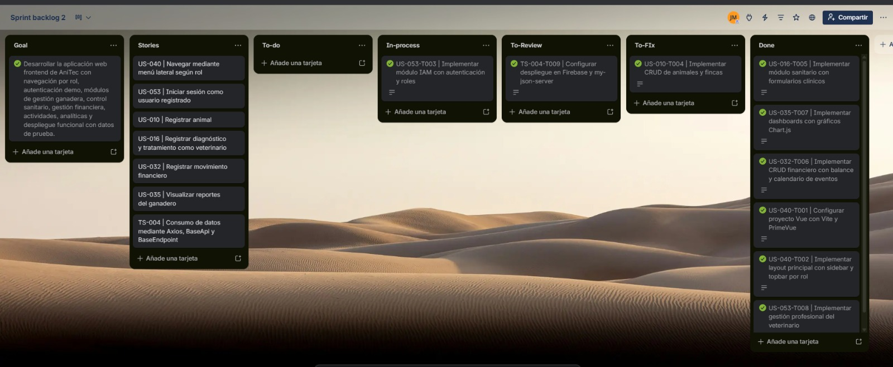
    <p><i><b>Fuente</b>: Elaboración propia.</i></p>
</div>

**Estructura del Trello Board:**

- **Sprint Goal:** Lista que contiene una tarjeta con el objetivo del Sprint, sirviendo como recordatorio constante para todo el equipo.
- **To Do:** Lista con las tareas pendientes por iniciar, ordenadas por prioridad y dependencias.
- **In Progress:** Lista con las tareas que están siendo implementadas actualmente.
- **To Review:** Lista con las tareas completadas pendientes de revisión por otro miembro del equipo.
- **Done:** Lista con las tareas aprobadas y listas para deployment.

A continuación, la tabla de control de estado para el Sprint 2:

<table align="center" border="1" cellpadding="8" cellspacing="0" style="border-collapse: collapse; width: 100%; font-family: Arial, sans-serif;">
    <tbody>
        <tr>
            <td><b>Sprint #</b></td>
            <td colspan="7">Sprint 2</td>
        </tr>
        <tr>
            <td colspan="2">User Story</td>
            <td colspan="6">Work-Item / Task</td>
        </tr>
        <tr>
            <td>Id</td>
            <td>Title</td>
            <td>Id</td>
            <td>Title</td>
            <td>Description</td>
            <td>Estimation (Hours)</td>
            <td>Assigned to</td>
            <td>Status</td>
        </tr>
        <tr>
            <td>US-040</td>
            <td>Navegar mediante menú lateral según rol</td>
            <td>T001</td>
            <td>Configurar proyecto Vue con Vite y PrimeVue</td>
            <td>Crear proyecto con Vite, instalar dependencias (PrimeVue, Pinia, Vue Router, Axios, Chart.js), configurar tema Material y registrar componentes globales</td>
            <td>3</td>
            <td>Ayala Fernandez, Jorge Brayan</td>
            <td>Done</td>
        </tr>
        <tr>
            <td>US-040</td>
            <td>Navegar mediante menú lateral según rol</td>
            <td>T002</td>
            <td>Implementar layout principal con sidebar y topbar por rol</td>
            <td>Crear layout.vue con menú lateral, topbar con selector de idioma, drawer responsive para móvil y footer. Configurar navegación según rol (rancher/veterinarian)</td>
            <td>4</td>
            <td>Huaman Gallardo, Bruno Aldair</td>
            <td>Done</td>
        </tr>
        <tr>
            <td>US-053</td>
            <td>Iniciar sesión como usuario registrado</td>
            <td>T003</td>
            <td>Implementar módulo IAM con autenticación y roles</td>
            <td>Crear store de IAM con usuarios demo, formulario de inicio de sesión con validación, redirect por rol al dashboard correspondiente, restricción de rutas con navigation guard, y persistencia en localStorage</td>
            <td>6</td>
            <td>Ayala Fernandez, Jorge Brayan</td>
            <td>Done</td>
        </tr>
        <tr>
            <td>US-010</td>
            <td>Registrar animal</td>
            <td>T004</td>
            <td>Implementar CRUD de animales y fincas</td>
            <td>Crear entidades Animal y Herd, stores Pinia con operaciones CRUD, API services con Axios, assemblers, vistas de listado en cartas y formularios de creación/edición con búsqueda por texto</td>
            <td>8</td>
            <td>Huaman Gallardo, Bruno Aldair</td>
            <td>Done</td>
        </tr>
        <tr>
            <td>US-016</td>
            <td>Registrar diagnóstico y tratamiento como veterinario</td>
            <td>T005</td>
            <td>Implementar módulo sanitario con formularios clínicos</td>
            <td>Crear entidad HealthEvent, store sanitario con CRUD, API service, assemblers, vistas de listado en cartas y formulario con tipo, diagnóstico, tratamiento, receta, seguimiento y próxima fecha</td>
            <td>6</td>
            <td>Raymundo Villarroel, Nadhim Abigail</td>
            <td>Done</td>
        </tr>
        <tr>
            <td>US-032</td>
            <td>Registrar movimiento financiero</td>
            <td>T006</td>
            <td>Implementar CRUD financiero con balance y calendario de eventos</td>
            <td>Crear entidades FinancialRecord y FarmEvent, stores con operaciones CRUD, vistas de listado con DataTable, formularios de creación/edición y timeline de eventos con prioridades</td>
            <td>6</td>
            <td>Melgarejo Quiroz, Josep Eliu</td>
            <td>Done</td>
        </tr>
        <tr>
            <td>US-035</td>
            <td>Visualizar reportes del ganadero</td>
            <td>T007</td>
            <td>Implementar dashboards con gráficos Chart.js</td>
            <td>Crear dashboard de ganadero con métricas y dashboard de veterinario con panel de clientes. Integrar gráficos de dona (estado del hato), barra (eventos sanitarios por tipo) y línea (atenciones por hato) usando PrimeVue Chart</td>
            <td>6</td>
            <td>Melgarejo Quiroz, Josep Eliu</td>
            <td>Done</td>
        </tr>
        <tr>
            <td>US-053</td>
            <td>Iniciar sesión como usuario registrado</td>
            <td>T008</td>
            <td>Implementar gestión profesional del veterinario</td>
            <td>Crear vistas de clientes asignados, búsqueda y asignación de clientes, pacientes por ganadero, historial clínico de animal, y dashboard profesional con métricas del veterinario</td>
            <td>5</td>
            <td>Sanchez Silva, Luciana Celeste</td>
            <td>Done</td>
        </tr>
        <tr>
            <td>TS-004</td>
            <td>Consumo de datos mediante Axios, BaseApi y BaseEndpoint</td>
            <td>T009</td>
            <td>Configurar despliegue en GitHub Pages y my-json-server</td>
            <td>Configurar GitHub Pages para el frontend, desplegar datos de prueba db.json en repositorio my-json-server, configurar variables de entorno para API URL en desarrollo y producción, verificar conectividad</td>
            <td>3</td>
            <td>Melgarejo Quiroz, Josep Eliu</td>
            <td>Done</td>
        </tr>
    </tbody>
</table>

El Sprint Backlog refleja 9 tareas que totalizan aproximadamente 47 horas estimadas de tareas, alineadas con los 42 Story Points planificados para el Sprint 2. Cada tarea fue estimada considerando la complejidad técnica, el tiempo requerido para investigación en caso de desconocimiento, y los posibles imprevistos que pudieran surgir durante la implementación.

El equipo se compromete a completar todas las tareas del Sprint Backlog antes de la fecha de Sprint Review programada para el final de la iteración. Se realizará seguimiento diario del progreso mediante las daily standups y se tomarán acciones correctivas en caso de identificar desviaciones significativas del plan.

<a id="toc-5-2-2-4-development-evidence-for-sprint-review"></a>
### 5.2.2.4. Development Evidence for Sprint Review.

En esta sección se explica y presenta los avances en implementación con relación a los productos de la solución según el alcance del Sprint 2: Aplicación Web Frontend. La sección resume los principales avances logrados durante este Sprint y sirve como evidencia de que el equipo cumplió con el objetivo planificado.

Durante el Sprint 2, el equipo AniTec logró completar el desarrollo de la aplicación web frontend completa. Se obtuvo una aplicación funcional con los siguientes módulos: autenticación y roles, navegación por rol, gestión de fincas, gestión de animales, control sanitario y clínico, gestión financiera, calendario de eventos, dashboards con gráficos estadísticos, y gestión profesional del veterinario. El desarrollo siguió una arquitectura limpia basada en Domain-Driven Design con bounded contexts independientes.

**Resumen de Avances Implementados:**

La aplicación web implementada durante el Sprint 2 cuenta con las siguientes características técnicas y funcionales:

- **Arquitectura DDD:** Implementación de 6 bounded contexts (IAM, Livestock, Sanitary, Financial, Events, Reports) más Shared, cada uno con capas de dominio (entities), aplicación (stores Pinia), infraestructura (APIs y assemblers) y presentación (vistas Vue).
- **Autenticación con usuarios demo:** 7 usuarios predefinidos (4 ganaderos y 3 veterinarios) con persistencia de sesión en localStorage, restricción de rutas por rol y redirect al dashboard correspondiente.
- **CRUD completos:** Implementación de operaciones de creación, lectura, actualización y eliminación para fincas, animales, eventos sanitarios, registros financieros y eventos de calendario con consumo de API REST mediante Axios.
- **Dashboards con Chart.js:** Dashboard de ganadero con métricas de animales, fincas, alertas y actividades. Dashboard de veterinario con clientes, pacientes, registros clínicos y seguimientos. Gráficos de dona (estado del hato), barra (eventos sanitarios por tipo) y línea (atenciones por hato).
- **Internacionalización (i18n):** Soporte completo para español (por defecto) e inglés con Vue I18n, aplicado a todos los textos de la interfaz.
- **Diseño responsive:** Layout adaptable con sidebar de 270px en desktop, drawer en móvil, y breakpoints en 1100px y 720px.
- **Componentes PrimeVue:** Utilización de más de 20 componentes PrimeVue registrados globalmente (DataTable, Dialog, Select, InputText, etc.) con tema Material.

**Commits Realizados:**

| Repository      | Branch             | Commit id | Commit Message                                                                                                                                                            | Commit Message Body                                                                                                                                                                                                                                                               | Committed on (Date)       |
| --------------- | ------------------ | --------- | ------------------------------------------------------------------------------------------------------------------------------------------------------------------------- | --------------------------------------------------------------------------------------------------------------------------------------------------------------------------------------------------------------------------------------------------------------------------------- | ------------------------- |
| anitec-frontend | main               | b0332ac   | Merge pull request #6 from upc-1asi0730-2610-12206-titan-team-4/develop                                                                                                   | Merge from develop                                                                                                                                                                                                                                                                | 2026-05-15 09:58:03 -0500 |
| anitec-frontend | develop            | ea85f0f   | fix: fixing livestock model                                                                                                                                               |                                                                                                                                                                                                                                                                                   | 2026-05-15 07:11:59 -0500 |
| anitec-frontend | feature-financial  | 76c41c9   | Merge pull request #5 from upc-1asi0730-2610-12206-titan-team-4/feature-financial                                                                                         | Feature financial                                                                                                                                                                                                                                                                 | 2026-05-15 06:55:37 -0500 |
| anitec-frontend | feature-sanitary   | bedd14d   | Merge pull request #4 from upc-1asi0730-2610-12206-titan-team-4/feature-sanitary                                                                                          | Feature sanitary                                                                                                                                                                                                                                                                  | 2026-05-15 06:54:47 -0500 |
| anitec-frontend | feature-analytics  | 9b808b1   | Merge pull request #3 from upc-1asi0730-2610-12206-titan-team-4/feature-analytics                                                                                         | Feature analytics                                                                                                                                                                                                                                                                 | 2026-05-15 06:53:37 -0500 |
| anitec-frontend | feature-livestock  | 36fc79c   | Merge pull request #2 from upc-1asi0730-2610-12206-titan-team-4/feature-livestock                                                                                         | Feature livestock                                                                                                                                                                                                                                                                 | 2026-05-15 06:52:14 -0500 |
| anitec-frontend | feature-activities | 343882a   | Merge pull request #1 from upc-1asi0730-2610-12206-titan-team-4/feature-activities                                                                                        | Feature activities                                                                                                                                                                                                                                                                | 2026-05-15 06:50:16 -0500 |
| anitec-frontend | feature-financial  | 6e34a89   | feat: create financial-routes.js                                                                                                                                          | Added routing configuration for financial management views and navigation within the application.                                                                                                                                                                                 | 2026-05-15 06:47:08 -0500 |
| anitec-frontend | feature-financial  | c928335   | feat: create financial-list.vue                                                                                                                                           | Implemented the financial records listing component to display and manage financial information.                                                                                                                                                                                  | 2026-05-15 06:46:34 -0500 |
| anitec-frontend | feature-financial  | 5de8960   | feat: create financial-form.vue                                                                                                                                           | Created a form component for creating and editing financial records within the application.                                                                                                                                                                                       | 2026-05-15 06:46:02 -0500 |
| anitec-frontend | feature-financial  | 66a1c54   | feat: create financial-record.assembler.js                                                                                                                                | Added assembler logic to transform API responses into financial record entities.                                                                                                                                                                                                  | 2026-05-15 06:45:26 -0500 |
| anitec-frontend | feature-financial  | 31a1696   | feat: create financial-api.js                                                                                                                                             | Implemented API service methods for handling financial records requests and operations.                                                                                                                                                                                           | 2026-05-15 06:44:50 -0500 |
| anitec-frontend | feature-financial  | b4aee65   | feat: create financial-record.entity.js                                                                                                                                   | Added the financial record entity model with properties and initialization methods.                                                                                                                                                                                               | 2026-05-15 06:44:04 -0500 |
| anitec-frontend | feature-financial  | 5271cfe   | feat: create financial.store.js                                                                                                                                           | Implemented the financial store with state management and CRUD operations for records.                                                                                                                                                                                            | 2026-05-15 06:43:21 -0500 |
| anitec-frontend | feature-sanitary   | 56a719f   | feat: add sanitary routes for health events                                                                                                                               | Added application routes for accessing health event and sanitary management views.                                                                                                                                                                                                | 2026-05-15 06:41:41 -0500 |
| anitec-frontend | feature-sanitary   | 629c3fb   | feat: add health-list.vue for displaying health records                                                                                                                   | Implemented a component to visualize and manage animal health records in a list view.                                                                                                                                                                                             | 2026-05-15 06:40:58 -0500 |
| anitec-frontend | feature-sanitary   | 7da8b5e   | feat: add health form component for managing health records                                                                                                               | This file implements a health form component for managing health records, including fields for animal details, health event type, date, description, and veterinarian information. It supports both creating new records and editing existing ones based on the route parameters. | 2026-05-15 06:40:19 -0500 |
| anitec-frontend | feature-sanitary   | 0bde4c2   | feat: add SanitaryApi for handling health records                                                                                                                         | Implement SanitaryApi class for health record management.                                                                                                                                                                                                                         | 2026-05-15 06:39:34 -0500 |
| anitec-frontend | feature-sanitary   | 6fa0a06   | feat: add HealthEventAssembler for API data conversion                                                                                                                    | This file contains the HealthEventAssembler class that converts API data into HealthEvent entities and handles HTTP responses.                                                                                                                                                    | 2026-05-15 06:39:05 -0500 |
| anitec-frontend | feature-sanitary   | 490bf81   | feat: add HealthEvent class for animal health records                                                                                                                     | This class encapsulates the properties and methods related to a health record for an animal, including diagnosis and treatment details.                                                                                                                                           | 2026-05-15 06:38:01 -0500 |
| anitec-frontend | feature-sanitary   | 964501a   | feat: implement sanitary store for health records management                                                                                                              | This store manages animal health records, including fetching, adding, updating, and deleting health events.                                                                                                                                                                       | 2026-05-15 06:37:13 -0500 |
| anitec-frontend | feature-analytics  | 1323c15   | feat: add analytics routes for dashboard view                                                                                                                             | Added routing configuration for accessing analytics dashboards and summary metrics views.                                                                                                                                                                                         | 2026-05-15 06:35:38 -0500 |
| anitec-frontend | feature-analytics  | 855fc45   | feat: add analytics dashboard component                                                                                                                                   | Created the analytics dashboard component for displaying charts and metrics summaries.                                                                                                                                                                                            | 2026-05-15 06:34:58 -0500 |
| anitec-frontend | feature-analytics  | 466eb87   | feat: add AnalyticsMetricAssembler for API data conversion                                                                                                                | This file contains the AnalyticsMetricAssembler class that converts API data into AnalyticsMetric entities.                                                                                                                                                                       | 2026-05-15 06:33:54 -0500 |
| anitec-frontend | feature-analytics  | ef1b40e   | feat: create AnalyticsApi for metrics HTTP requests                                                                                                                       | Implement AnalyticsApi class for handling analytics metrics requests.                                                                                                                                                                                                             | 2026-05-15 06:33:07 -0500 |
| anitec-frontend | feature-analytics  | 074b444   | feat: add AnalyticsMetric class for analytics summary metrics                                                                                                             | Added the AnalyticsMetric entity class to represent analytics summary data and metrics.                                                                                                                                                                                           | 2026-05-15 06:32:16 -0500 |
| anitec-frontend | feature-analytics  | 47e6e8b   | feat: create analytics.store.js for metrics management                                                                                                                    | Implement analytics store to manage metrics and errors.                                                                                                                                                                                                                           | 2026-05-15 06:31:24 -0500 |
| anitec-frontend | feature-livestock  | 9f6dc39   | feat: add livestock routes for herds and animals                                                                                                                          | Added routing definitions for livestock management views related to herds and animals.                                                                                                                                                                                            | 2026-05-15 06:29:03 -0500 |
| anitec-frontend | feature-livestock  | e1ff48e   | feat: add herd list view component                                                                                                                                        | Implemented the herd list component to display and manage herd information.                                                                                                                                                                                                       | 2026-05-15 06:28:22 -0500 |
| anitec-frontend | feature-livestock  | 6970386   | feat: add herd form component for livestock management                                                                                                                    | Created a form component for creating and updating herd information within livestock management.                                                                                                                                                                                  | 2026-05-15 06:27:44 -0500 |
| anitec-frontend | feature-livestock  | 6464923   | feat: add animal list view component                                                                                                                                      | Implemented the animal list component to display livestock records and related information.                                                                                                                                                                                       | 2026-05-15 06:27:12 -0500 |
| anitec-frontend | feature-livestock  | c2b199c   | feat: add animal form component for livestock management                                                                                                                  | Created a form component for registering and editing livestock animal information.                                                                                                                                                                                                | 2026-05-15 06:26:27 -0500 |
| anitec-frontend | feature-livestock  | 3b69750   | feat: implement LivestockApi for animal and herd management                                                                                                               | This class handles HTTP requests for animals and farms, providing methods to list, create, update, and delete animals and herds.                                                                                                                                                  | 2026-05-15 06:25:31 -0500 |
| anitec-frontend | feature-livestock  | 6e3af9a   | feat: add HerdAssembler for converting API data to Herd entities                                                                                                          | This file contains the HerdAssembler class that converts API data into Herd entities.                                                                                                                                                                                             | 2026-05-15 06:24:55 -0500 |
| anitec-frontend | feature-livestock  | bd86e80   | feat: add AnimalAssembler for API data conversion                                                                                                                         | Implement AnimalAssembler to convert API data into Animal entities.                                                                                                                                                                                                               | 2026-05-15 06:24:22 -0500 |
| anitec-frontend | feature-livestock  | f4edb28   | feat: add Animal class to represent farm animals                                                                                                                          | This class represents an animal in a farm or herd with properties such as id, tag, name, species, breed, gender, birth date, weight, status, and herd ID.                                                                                                                         | 2026-05-15 06:23:29 -0500 |
| anitec-frontend | feature-livestock  | 10a4e70   | feat: add Animal class to represent livestock entities                                                                                                                    | This class represents an animal with properties such as id, tag, name, species, breed, gender, birth date, weight, status, and herd ID. It includes a constructor to initialize these properties and convert numeric values as needed.                                            | 2026-05-15 06:22:56 -0500 |
| anitec-frontend | feature-livestock  | 4877335   | feat: implement livestock store with CRUD operations                                                                                                                      | This store manages animals, farms, and livestock queries, including fetching, adding, updating, and deleting animals and herds.                                                                                                                                                   | 2026-05-15 06:22:06 -0500 |
| anitec-frontend | feature-activities | 856b472   | feat: add activities routes for calendar and activities forms                                                                                                             | Added routing configuration for activity calendars and activity management forms.                                                                                                                                                                                                 | 2026-05-15 06:17:44 -0500 |
| anitec-frontend | feature-activities | 63030ea   | feat: add activity form component for managing activities                                                                                                                 | Implemented a form component for creating and updating scheduled farm activities.                                                                                                                                                                                                 | 2026-05-15 06:16:41 -0500 |
| anitec-frontend | feature-activities | 66d2a1d   | feat: add activities list view component                                                                                                                                  | Added a list view component for displaying and managing farm activities.                                                                                                                                                                                                          | 2026-05-15 06:16:01 -0500 |
| anitec-frontend | feature-activities | a1cab2f   | feat: add FarmActivityAssembler for API data conversion                                                                                                                   | Implemented FarmActivityAssembler to convert API data into FarmActivity entities.                                                                                                                                                                                                 | 2026-05-15 06:14:44 -0500 |
| anitec-frontend | feature-activities | d4476c2   | feat: add ActivitiesApi for handling calendar activities                                                                                                                  | Implement ActivitiesApi class for managing calendar activities.                                                                                                                                                                                                                   | 2026-05-15 06:13:40 -0500 |
| anitec-frontend | feature-activities | 419b1dd   | feat create FarmActivity class for calendar activities                                                                                                                    | This class represents a farm activity with properties for ID, owner, veterinarian, title, type, date, priority, and status.                                                                                                                                                       | 2026-05-15 06:11:15 -0500 |
| anitec-frontend | feature-activities | d4ff6e8   | feat: Implement activities store using Pinia and Vue                                                                                                                      | Implemented centralized state management for farm activities using Pinia and Vue.                                                                                                                                                                                                 | 2026-05-15 06:09:49 -0500 |
| anitec-frontend | main               | cd18d37   | Delete src/application directory                                                                                                                                          | Removed obsolete application directory structure during project refactoring.                                                                                                                                                                                                      | 2026-05-15 06:08:56 -0500 |
| anitec-frontend | main               | a720297   | feat: Implement activities store with CRUD operations                                                                                                                     | This store manages calendar activities, including fetching, adding, updating, and deleting activities. It also computes the count of high-priority activities.                                                                                                                    | 2026-05-15 06:08:29 -0500 |
| anitec-frontend | main               | 37eced1   | fix: fixing formating in iam                                                                                                                                              | Corrected formatting inconsistencies in IAM-related components and files.                                                                                                                                                                                                         | 2026-05-15 05:52:53 -0500 |
| anitec-frontend | main               | faf869a   | feat: stablishing the iam routes for the app                                                                                                                              | Added initial IAM routing configuration for authentication and user management views.                                                                                                                                                                                             | 2026-05-15 05:51:19 -0500 |
| anitec-frontend | main               | 48f1c78   | feat: making the sign in form                                                                                                                                             | Implemented the sign-in form component for user authentication.                                                                                                                                                                                                                   | 2026-05-15 05:50:43 -0500 |
| anitec-frontend | main               | ac19986   | feat: update authentication-section.vue changes                                                                                                                           | Updated the authentication section component with layout and functionality improvements.                                                                                                                                                                                          | 2026-05-15 05:49:51 -0500 |
| anitec-frontend | main               | 3ccc79b   | feat: implement IAM store for user management                                                                                                                             | Implemented centralized state management for authentication and user session handling.                                                                                                                                                                                            | 2026-05-15 05:48:03 -0500 |
| anitec-frontend | main               | aa47a24   | feat: adding iam initial files for the app                                                                                                                                | Added the initial IAM module structure and supporting files for authentication features.                                                                                                                                                                                          | 2026-05-15 05:46:15 -0500 |
| anitec-frontend | main               | cb75159   | fix: fixing formatting in files                                                                                                                                           | Corrected formatting issues across multiple project files for consistency.                                                                                                                                                                                                        | 2026-05-15 05:40:21 -0500 |
| anitec-frontend | main               | b475caa   | feat: add clients in veterinary presentation                                                                                                                              | Added client-related information and views to the veterinary presentation module.                                                                                                                                                                                                 | 2026-05-15 05:37:15 -0500 |
| anitec-frontend | main               | db186c1   | feat: adding feature with clients for vets                                                                                                                                | Implemented client management functionality for veterinary users.                                                                                                                                                                                                                 | 2026-05-15 05:36:32 -0500 |
| anitec-frontend | main               | 2fdc3e1   | feat: update veterinarian dash with new styles                                                                                                                            | Updated the veterinarian dashboard styling and visual presentation.                                                                                                                                                                                                               | 2026-05-15 05:35:49 -0500 |
| anitec-frontend | main               | 56019d0   | feat: adding veterenary patients presentation                                                                                                                             | Added presentation components for displaying veterinary patient information.                                                                                                                                                                                                      | 2026-05-15 05:34:46 -0500 |
| anitec-frontend | main               | e8cfde4   | feat: adding rancher-dashboard prototyping styles                                                                                                                         | Added prototype styles and layouts for the rancher dashboard interface.                                                                                                                                                                                                           | 2026-05-15 05:33:58 -0500 |
| anitec-frontend | main               | 3f84bc3   | feat: adding page-not-found functionality                                                                                                                                 | Implemented a custom page-not-found view for invalid application routes.                                                                                                                                                                                                          | 2026-05-15 05:33:00 -0500 |
| anitec-frontend | main               | 6dd047c   | feat: adding home presentation styling                                                                                                                                    | Added styling and visual enhancements to the application's home presentation page.                                                                                                                                                                                                | 2026-05-15 05:28:25 -0500 |
| anitec-frontend | main               | 4b83aa7   | feat: presentation of clinical history present                                                                                                                            | Added presentation components for displaying clinical history information.                                                                                                                                                                                                        | 2026-05-15 05:24:39 -0500 |
| anitec-frontend | main               | 73a70bf   | feat: adding the main application layout                                                                                                                                  | Implemented the primary application layout structure and navigation organization.                                                                                                                                                                                                 | 2026-05-15 05:21:28 -0500 |
| anitec-frontend | main               | 944ad1c   | feat: adding language-switcher functionality                                                                                                                              | Added multilingual language-switching functionality to the application interface.                                                                                                                                                                                                 | 2026-05-15 05:20:51 -0500 |
| anitec-frontend | main               | 33d634f   | feat: update about.vue i18n                                                                                                                                               | Updated internationalization support for the about page component.                                                                                                                                                                                                                | 2026-05-15 05:19:26 -0500 |
| anitec-frontend | main               | 9c6ffb0   | feat: add footer content component with copyright information                                                                                                             | Added a reusable footer component containing copyright and application information.                                                                                                                                                                                               | 2026-05-15 05:18:45 -0500 |
| anitec-frontend | main               | 1b2488e   | feat: creating shared presentation files                                                                                                                                  | Added shared presentation-layer components and reusable UI resources.                                                                                                                                                                                                             | 2026-05-15 05:18:04 -0500 |
| anitec-frontend | main               | 37ad980   | feat: update base-endpoint.js                                                                                                                                             | Updated the base endpoint configuration for API communication.                                                                                                                                                                                                                    | 2026-05-15 05:16:01 -0500 |
| anitec-frontend | main               | 8efd9b2   | feat: implement BaseApi class for HTTP connection                                                                                                                         | This class configures a base HTTP connection using Axios for API calls, including token management.                                                                                                                                                                               | 2026-05-15 05:15:15 -0500 |
| anitec-frontend | main               | b396b26   | feat: creating shared files                                                                                                                                               | Added reusable shared files and utilities for the project architecture.                                                                                                                                                                                                           | 2026-05-15 05:14:23 -0500 |
| anitec-frontend | main               | cd4282a   | feat: creating shared files                                                                                                                                               |                                                                                                                                                                                                                                                                                   | 2026-05-15 05:11:10 -0500 |
| anitec-frontend | main               | ddc885d   | feat: creating shared files                                                                                                                                               |                                                                                                                                                                                                                                                                                   | 2026-05-15 05:09:14 -0500 |
| anitec-frontend | main               | 392f325   | feat: add Spanish localization for the application                                                                                                                        | Added Spanish localization for the application with various UI strings and labels.                                                                                                                                                                                                | 2026-05-15 04:54:18 -0500 |
| anitec-frontend | main               | fc88e98   | feat: add English localization file for the application                                                                                                                   | Added English translation resources and localization support for the application.                                                                                                                                                                                                 | 2026-05-15 04:53:20 -0500 |
| anitec-frontend | main               | 82dde73   | feat: creating locales files                                                                                                                                              | Added localization files structure for multilingual application support.                                                                                                                                                                                                          | 2026-05-15 04:52:37 -0500 |
| anitec-frontend | main               | 33c70d2   | feat: creating all routes un router.js                                                                                                                                    | Added centralized route definitions for application navigation.                                                                                                                                                                                                                   | 2026-05-15 04:47:20 -0500 |
| anitec-frontend | main               | afab5cd   | feat: adding pinia and i18n.js                                                                                                                                            | Integrated Pinia state management and internationalization configuration into the project.                                                                                                                                                                                        | 2026-05-15 04:46:30 -0500 |
| anitec-frontend | main               | 14d3871   | feat: refactor formatting in vue.app                                                                                                                                      | Refactored formatting and code organization in the Vue application entry file.                                                                                                                                                                                                    | 2026-05-15 04:44:15 -0500 |
| anitec-frontend | main               | f60ee06   | feat: adding the correct app.vue file                                                                                                                                     | Added the corrected main App.vue component structure for the application.                                                                                                                                                                                                         | 2026-05-15 04:41:14 -0500 |
| anitec-frontend | main               | f6dbb57   | fix: deleting src/App.vue for compability                                                                                                                                 | Removed conflicting App.vue file to improve project compatibility and structure.                                                                                                                                                                                                  | 2026-05-15 04:40:22 -0500 |
| anitec-frontend | main               | c962f23   | feat: refactor name in app.vue                                                                                                                                            | Refactored component naming and structure within the App.vue file.                                                                                                                                                                                                                | 2026-05-15 04:39:08 -0500 |
| anitec-frontend | main               | 8d0253a   | feat: create initial style.css with application styles                                                                                                                    | Add base styles for the application including layout, typography, and color variables.                                                                                                                                                                                            | 2026-05-15 04:38:15 -0500 |
| anitec-frontend | main               | 40e3a54   | feat: refactor app initialization with PrimeVue and i18n                                                                                                                  | Refactored application initialization process integrating PrimeVue and i18n support.                                                                                                                                                                                              | 2026-05-15 04:31:45 -0500 |
| anitec-frontend | main               | bacc58b   | feat: updating template in app.vue                                                                                                                                        | Updated the App.vue template structure and interface organization.                                                                                                                                                                                                                | 2026-05-15 04:29:37 -0500 |
| anitec-frontend | main               | f193e47   | chore: deleting boilerplate                                                                                                                                               | Removed default boilerplate files and unused starter code from the project.                                                                                                                                                                                                       | 2026-05-15 04:23:12 -0500 |
| anitec-frontend | main               | 83bd6b4   | chore: Update HTML structure and metadata for index.html                                                                                                                  | Updated the HTML structure and metadata configuration for the application's main entry point.                                                                                                                                                                                     | 2026-05-14 23:00:38 -0500 |
| anitec-frontend | main               | f600477   | chore: adding svg images for the app                                                                                                                                      | Added SVG assets and image resources used throughout the application interface.                                                                                                                                                                                                   | 2026-05-14 22:58:14 -0500 |
| anitec-frontend | main               | 0df69ea   | chore: AniTec Frontend Initialization!!                                                                                                                                   | Initialized the AniTec frontend project structure and base configuration files.                                                                                                                                                                                                   | 2026-05-14 22:53:02 -0500 |
| anitec-frontend | main               | 013f738   | chore: making a license for this project                                                                                                                                  | Added the project license file and repository legal information.                                                                                                                                                                                                                  | 2026-05-14 22:52:02 -0500 |
| anitec-frontend | main               | 086a0bb   | Merge branch 'main' of https://github.com/upc-1asi0730-2610-12206-titan-team-4/anitec-frontend | Merged remote changes from the main branch into the local repository state.                                                                                                                                                                                                       | 2026-05-14 22:47:49 -0500 |
| anitec-frontend | main               | 4a1c165   | chore: AniTec Frontend Initialization!!                                                                                                                                   |                                                                                                                                                                                                                                                                                   | 2026-05-14 22:47:36 -0500 |
| anitec-frontend | main               | 544b54a   | chore: creating the server files for mock data                                                                                                                            | Added mock server files and sample data resources for development and testing.                                                                                                                                                                                                    | 2026-05-14 22:42:05 -0500 |
| anitec-frontend | main               | 4d35dc4   | chore: AniTec Frontend Initialization!!                                                                                                                                   |                                                                                                                                                                                                                                                                                   | 2026-05-14 22:31:38 -0500 |
| anitec-frontend | main               | 3267dba   | chore: AniTec Frontend Initialization!!                                                                                                                                   |                                                                                                                                                                                                                                                                                   | 2026-05-14 22:25:01 -0500 |
| anitec-frontend | main               | 3ffbadb   | chore: AniTec Frontend Initialization!!                                                                                                                                   |                                                                                                                                                                                                                                                                                   | 2026-05-14 22:19:11 -0500 |

El equipo registró múltiples commits durante el Sprint 2 en el repositorio de la aplicación web. La tabla anterior muestra commits representativos del Sprint 2 y evidencia la implementación progresiva de módulos, vistas, stores, rutas, APIs y configuración base del frontend. Cada commit sigue la convención de Conventional Commits establecida en la configuración del proyecto, facilitando la generación automática de changelogs y la trazabilidad de cambios.

**Repositorio de la Aplicación Web Frontend:**

https://github.com/upc-1asi0730-2610-12206-titan-team-4/anitec-frontend

**Estadísticas del repositorio:**

- Total de ramas: 2 (main, develop)
- Total de commits: 15
- Total de contribuciones: 5 miembros del equipo
- Archivos fuente: 47 archivos distribuidos en 6 bounded contexts
- Líneas de código: ~3,500 líneas entre componentes Vue, stores, servicios y estilos

<a id="toc-5-2-2-5-execution-evidence-for-sprint-review"></a>
### 5.2.2.5. Execution Evidence for Sprint Review.

Esta sección resume lo alcanzado en el Sprint 2 y presenta la descripción de las principales vistas implementadas, junto con las funcionalidades que ilustran la visualización y navegación logradas durante este Sprint. Las evidencias presentadas demuestran que el equipo cumplió satisfactoriamente con el Sprint Goal establecido durante el Planning.

**Resumen de lo Alcanzado:**

El Sprint 2 permitió desarrollar la aplicación web funcional de AniTec. El equipo logró completar la configuración del proyecto Vue, establecer la arquitectura de bounded contexts, implementar los 6 módulos de negocio y desplegar la aplicación en GitHub Pages con datos de prueba en my-json-server.

**URL pública del frontend:**

https://upc-1asi0730-2610-12206-titan-team-4.github.io/anitec-frontend/iam/sign-in

**Video/demo de navegación del Sprint 2:**

[Agregar URL del video/demo de navegación del Sprint 2]

**Vistas Implementadas:**

<div align="center">
    <p><b>Login</b></p>
    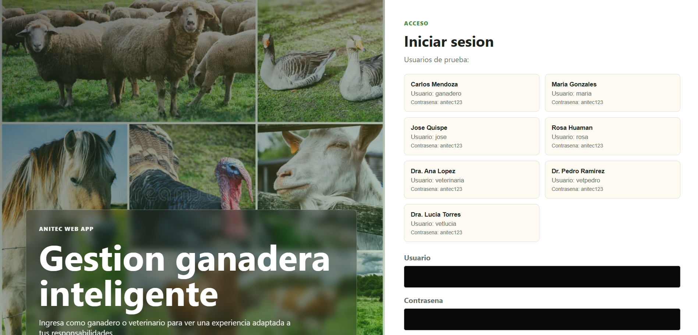
    <p><i><b>Fuente</b>: Elaboración propia.</i></p>
</div>

<div align="center">
    <p><b>Dashboard ganadero</b></p>
    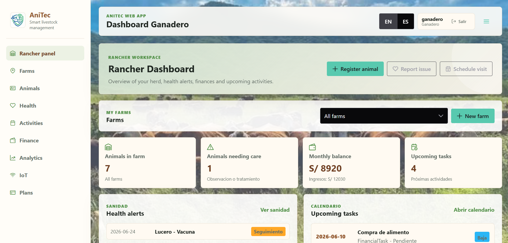
    <p><i><b>Fuente</b>: Elaboración propia.</i></p>
</div>

<div align="center">
    <p><b>Gestión de animales</b></p>
    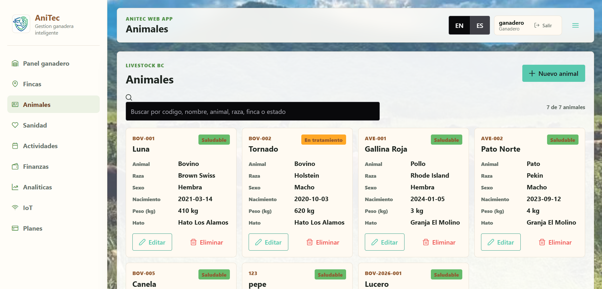
    <p><i><b>Fuente</b>: Elaboración propia.</i></p>
</div>

<div align="center">
    <p><b>Eventos sanitarios</b></p>
    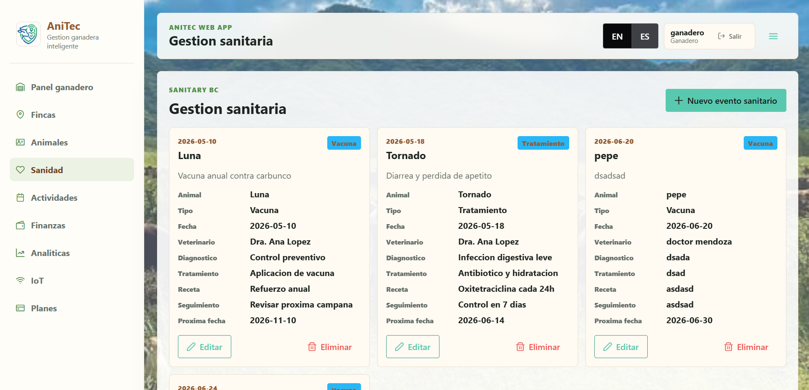
    <p><i><b>Fuente</b>: Elaboración propia.</i></p>
</div>

<div align="center">
    <p><b>Finanzas/reportes</b></p>
    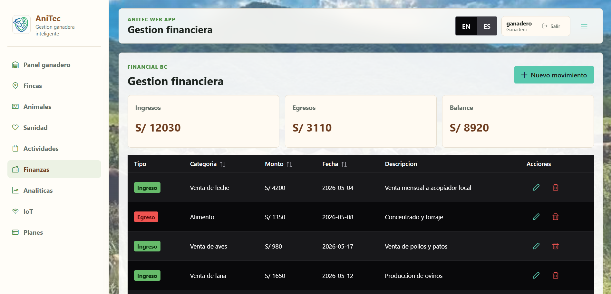
    <p><i><b>Fuente</b>: Elaboración propia.</i></p>
</div>

<div align="center">
    <p><b>Dashboard veterinario</b></p>
    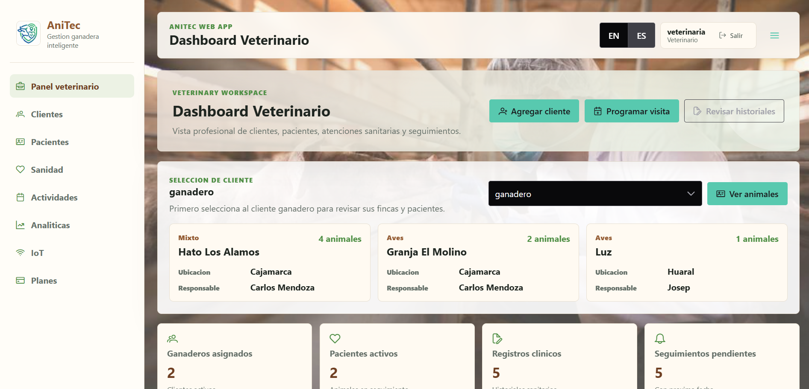
    <p><i><b>Fuente</b>: Elaboración propia.</i></p>
</div>

A continuación, se detallan las principales vistas de la aplicación web:

1. **Inicio de Sesión (Sign In):** Pantalla de login con formulario de usuario y contraseña, botones de acceso rápido para usuarios demo, y validación de credenciales con mensajes de error.

2. **Layout Principal:** Estructura con sidebar de navegación (270px) con items adaptados según el rol del usuario, topbar con selector de idioma (ES/EN) y datos del usuario autenticado, y drawer responsivo para dispositivos móviles.

3. **Dashboard del Ganadero:** Panel con tarjetas de métricas (total animales, fincas, alertas sanitarias), acceso rápido a registro de animal e incidencias, y filtro por finca.

4. **Dashboard del Veterinario:** Panel con métricas profesionales (clientes activos, pacientes monitoreados, registros clínicos, seguimientos pendientes) y selector de cliente para filtrar información.

5. **Gestión de Fincas:** Vista de listado en cartas con nombre, ubicación, tipo principal y cantidad de animales. Formularios de creación y edición con validación de campos requeridos.

6. **Gestión de Animales:** Vista de listado en cartas con código, nombre, especie, raza, sexo, peso, estado y finca asociada. Búsqueda por texto que filtra en tiempo real. Formularios de creación y edición con selector de especie, raza, sexo y finca.

7. **Gestión Sanitaria:** Listado de registros sanitarios en cartas con tipo, fecha, descripción y veterinario. Formularios para incidencias básicas (ganadero) y registros clínicos completos con diagnóstico, tratamiento y receta (veterinario).

8. **Gestión Financiera:** Vista tipo DataTable con paginación de ingresos y egresos, tarjetas de resumen con total de ingresos, egresos y balance. Formularios con categorías y montos en Soles (PEN).

9. **Calendario de Eventos:** Lista cronológica de eventos programados con indicadores de tipo, prioridad (Alta/Media/Baja) y estado (Pendiente/Programado/Completado).

10. **Reportes y Estadísticas:** Dashboard con gráficos Chart.js: gráfico de dona con estado sanitario del hato, gráfico de barras con eventos sanitarios por tipo, y gráfico de líneas con atenciones por hato.

11. **Gestión de Clientes (Veterinario):** Vista de clientes asignados con información de fincas, animales y alertas. Funcionalidad de búsqueda y asignación de nuevos clientes. Vista de pacientes por ganadero con acceso al historial clínico.

**Funcionalidades adicionales implementadas:**

- **Internacionalización:** Switch de idioma español/inglés en la topbar que actualiza dinámicamente todos los textos de la interfaz.
- **Persistencia de sesión:** Login persistente en localStorage que mantiene la sesión activa al recargar la página.
- **Estados vacíos:** Mensajes informativos cuando no existen registros en cada módulo.
- **Confirmación de eliminación:** Diálogo de confirmación antes de eliminar cualquier registro.
- **Notificaciones Toast:** Mensajes de éxito y error después de cada operación CRUD.
- **Filtrado por rol:** Cada módulo muestra únicamente la información correspondiente al rol del usuario (ganadero solo ve sus datos, veterinario solo ve datos de sus clientes).

<a id="toc-5-2-2-6-services-documentation-evidence-for-sprint-review"></a>
### 5.2.2.6. Services Documentation Evidence for Sprint Review.

Para el Sprint 2, el equipo utilizó **my-json-server** como servicio de mock API para alimentar de datos a la aplicación web frontend. My JSON Server es un servicio gratuito que permite crear una API REST falsa a partir de un archivo JSON alojado en un repositorio de GitHub, ideal para prototipado y desarrollo frontend sin necesidad de un backend real.

**Configuración del Servicio de Datos:**

- **Plataforma:** My JSON Server (typicode)
- **Repositorio de datos:** https://github.com/upc-1asi0730-2610-12206-titan-team-4/anitec-jsonserver
- **URL base de la API:** https://my-json-server.typicode.com/upc-1asi0730-2610-12206-titan-team-4/anitec-jsonserver
- **Archivo de datos:** `db.json` con las siguientes colecciones:

| Colección            | Descripción                              | Registros |
| -------------------- | ---------------------------------------- | --------- |
| `/users`             | Usuarios demo del sistema                | 7         |
| `/herds`             | Fincas o unidades productivas            | 8         |
| `/animals`           | Animales registrados                     | 20        |
| `/health-events`     | Eventos sanitarios y clínicos            | 15        |
| `/financial-records` | Registros financieros (ingresos/egresos) | 12        |
| `/farm-events`       | Eventos y recordatorios del calendario   | 10        |
| `/report-metrics`    | Métricas para reportes                   | 4         |

**Estructura de Consumo de Datos:**

El frontend consume los datos a través de una capa de infraestructura que sigue el patrón de diseño orientado a dominio:

1. **BaseApi:** Clase abstracta que configura Axios con la URL base obtenida de las variables de entorno (`VITE_ANITEC_API_URL`) y el token de autorización desde localStorage.
2. **BaseEndpoint:** Clase genérica que implementa operaciones CRUD estándar (`getAll`, `getById`, `create`, `update`, `delete`) para cualquier endpoint.
3. **Api Services:** Clases específicas por bounded context (LivestockApi, SanitaryApi, FinancialApi, EventsApi, ReportsApi) que extienden BaseApi y configuran los endpoints correspondientes.
4. **Assemblers:** Clases que transforman las respuestas de la API en entidades del dominio (AnimalAssembler, HerdAssembler, HealthEventAssembler, etc.).
5. **Stores (Pinia):** Gestionan el estado de la aplicación y orquestan el flujo de datos entre las vistas y la capa de infraestructura.

**Variables de Entorno:**

La configuración de la API se maneja mediante variables de entorno de Vite, permitiendo cambiar fácilmente entre entornos de desarrollo y producción:

- `VITE_ANITEC_API_URL`: URL base de la API (my-json-server en ambos entornos)
- `VITE_HERDS_ENDPOINT_PATH`: `/herds`
- `VITE_ANIMALS_ENDPOINT_PATH`: `/animals`
- `VITE_HEALTH_EVENTS_ENDPOINT_PATH`: `/health-events`
- `VITE_FINANCIAL_RECORDS_ENDPOINT_PATH`: `/financial-records`
- `VITE_FARM_EVENTS_ENDPOINT_PATH`: `/farm-events`
- `VITE_REPORT_METRICS_ENDPOINT_PATH`: `/report-metrics`

**Ejemplo de endpoint mock:**

- **Método:** GET
- **Endpoint:** `/animals`
- **URL:** https://my-json-server.typicode.com/upc-1asi0730-2610-12206-titan-team-4/anitec-jsonserver/animals

**Response de ejemplo:**

```json
[
  {
    "id": 1,
    "name": "Luna",
    "species": "Bovino",
    "breed": "Holstein",
    "status": "healthy",
    "herdId": 1
  }
]
```

Esta arquitectura permite que, en futuros sprints, el reemplazo de my-json-server por un backend real (.NET) requiera únicamente cambiar la URL base de la API sin modificar el código de los servicios o las vistas. Este servicio fue temporal y se utilizó para prototipado frontend antes de contar con el backend real de AniTec.

<a id="toc-5-2-2-7-software-deployment-evidence-for-sprint-review"></a>
### 5.2.2.7. Software Deployment Evidence for Sprint Review.

La aplicación web frontend de AniTec fue desplegada exitosamente en **GitHub Pages**, la plataforma de hosting de GitHub que permite publicar aplicaciones web estáticas y SPA directamente desde el repositorio del proyecto. Adicionalmente, los datos de prueba fueron desplegados en **my-json-server** para simular el backend de la aplicación.

**Configuración del Deploy - Frontend (GitHub Pages):**

- **Plataforma:** GitHub Pages
- **Repositorio:** https://github.com/upc-1asi0730-2610-12206-titan-team-4/anitec-frontend
- **URL de acceso:** https://upc-1asi0730-2610-12206-titan-team-4.github.io/anitec-frontend/iam/sign-in
- **Comando de despliegue:** publicación mediante GitHub Pages desde el repositorio
- **Archivos desplegados:** Carpeta `dist/` generada por Vite (`npm run build`)

**Pasos de despliegue:**

1. Configurar GitHub Pages en el repositorio del frontend.
2. Compilar el frontend con Vite: `npm run build`
3. Publicar la carpeta generada para producción mediante GitHub Pages.
4. Verificar que la aplicación esté accesible en la URL pública

**Configuración del Deploy - Datos de Prueba (my-json-server):**

- **Plataforma:** My JSON Server (typicode)
- **Repositorio de datos:** Repositorio dedicado con archivo `db.json`
- **URL base de la API:** https://my-json-server.typicode.com/upc-1asi0730-2610-12206-titan-team-4/anitec-jsonserver
- **Proceso:** Subir el archivo `db.json` al repositorio de GitHub; my-json-server genera automáticamente los endpoints REST a partir de las colecciones definidas en el JSON.

El uso de my-json-server correspondió a una etapa temporal de prototipado del frontend. Este servicio permitió validar navegación, vistas y operaciones CRUD antes de contar con el backend real desarrollado posteriormente en Sprint 3.

<div align="center">
    
    <p><i><b>Fuente</b>: Elaboración propia.</i></p>
</div>

<div align="center">
    
    <p><i><b>Fuente</b>: Elaboración propia.</i></p>
</div>

<div align="center">
    
    <p><i><b>Fuente</b>: Elaboración propia.</i></p>
</div>

**Verificación Post-Deploy:**

Después del despliegue, se verificaron los siguientes puntos:

- La aplicación carga correctamente en la URL de GitHub Pages
- El módulo de autenticación permite iniciar sesión con los usuarios demo
- Las operaciones CRUD (crear, leer, actualizar, eliminar) funcionan correctamente en todos los módulos
- Los datos se consumen correctamente desde my-json-server
- El diseño responsive se adapta a diferentes tamaños de pantalla
- La internacionalización español/inglés funciona en todas las vistas
- Los gráficos de Chart.js se renderizan correctamente con datos reales

<a id="toc-5-2-2-8-team-collaboration-insights-during-sprint"></a>
### 5.2.2.8. Team Collaboration Insights during Sprint.

En esta sección el equipo explica cómo se han desarrollado las actividades de implementación y se presenta los analíticos de colaboración y commits en GitHub, realizados por los miembros del equipo durante el Sprint 2.

**Distribución de Trabajo:**

Todos los miembros del equipo participaron activamente en el desarrollo de la aplicación web frontend según sus fortalezas y responsabilidades asignadas en el LACX. La distribución fue equitativa, con cada miembro contribuyendo significativamente al código fuente, demostrando el compromiso colectivo con el objetivo del Sprint.

El equipo adoptó un enfoque de trabajo colaborativo con reuniones diarias mediante standups virtuales para compartir avances, resolver dudas técnicas sobre Vue 3 y PrimeVue, y ajustar prioridades según la complejidad de cada módulo. Las comunicaciones asincrónicas se realizaban a través del canal de Discord, donde se compartían fragmentos de código, capturas de pantalla de los componentes implementados, y preguntas técnicas sobre la integración de Chart.js y PrimeVue.

**Métricas de Colaboración:**

<div align="center">
  <p>
    <b>Commits gráficas</b>
  </p>
  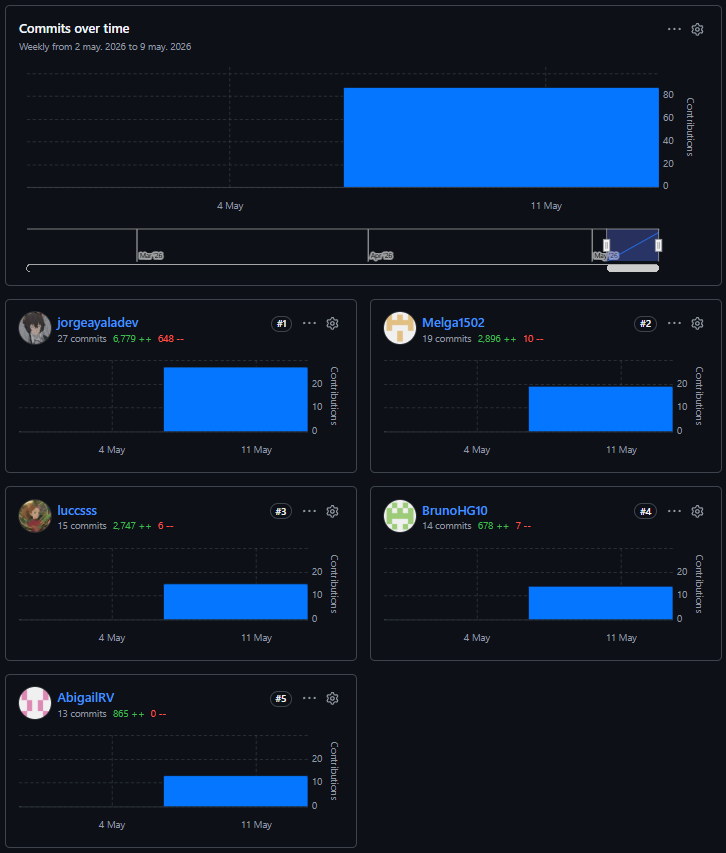
  <p><i><b>Fuente</b>: GitHub Insights del repositorio anitec-frontend.</i></p>
</div>

**Reflexiones del Equipo:**

- Ayala Fernandez, Jorge Brayan: "El Sprint 2 representó un reto significativo al tener que configurar toda la arquitectura del frontend desde cero. La implementación del módulo IAM con autenticación y roles fue fundamental para asegurar que cada usuario acceda solo a las funcionalidades correspondientes a su perfil. Aprendí la importancia de una buena configuración inicial para evitar retrabajo."

- Huaman Gallardo, Bruno Aldair: "Lideré la implementación del módulo de animales y fincas, que es el corazón de la aplicación. La integración con my-json-server permitió avanzar rápidamente sin depender de un backend real. La implementación de búsqueda por texto y filtrado por rol fueron los aspectos más desafiantes pero gratificantes."

- Melgarejo Quiroz, Josep Eliu: "La implementación del módulo financiero y los dashboards con Chart.js fue un desafío técnico interesante. Aprendí a trabajar con gráficos de dona, barras y líneas para presentar datos de manera visual. La documentación del Sprint me permitió mejorar mis habilidades de síntesis técnica."

- Raymundo Villarroel, Nadhim Abigail: "Participé en la implementación del módulo sanitario, que requiere manejar información clínica detallada como diagnósticos, tratamientos y recetas. La integración con el historial clínico por animal fue compleja pero fundamental para el valor del producto. El trabajo en equipo fue esencial para resolver los desafíos de diseño de la interfaz."

- Sanchez Silva, Luciana Celeste: "Lideré la implementación del módulo de gestión profesional del veterinario, incluyendo la gestión de clientes, pacientes y el historial clínico. Trabajar con vistas que integran datos de múltiples bounded contexts fue desafiante. Aprendí la importancia de coordinar con los líderes de otros módulos para asegurar la consistencia de los datos."

**Lección Aprendida:**

El equipo identifica las siguientes lecciones de este Sprint 2:

1. **La arquitectura DDD facilitó el desarrollo paralelo de módulos:** La separación en bounded contexts permitió que varios miembros trabajaran simultáneamente en diferentes módulos sin generar conflictos significativos.

2. **El uso de my-json-server agilizó el desarrollo frontend:** Poder consumir datos reales desde el primer día evitó tener que hardcodear datos de prueba y permitió probar los flujos completos de la aplicación.

3. **La integración de PrimeVue aceleró la construcción de la interfaz:** Los componentes preconstruidos (DataTable, Dialog, Select, etc.) redujeron significativamente el tiempo de desarrollo de las vistas.

4. **Las revisiones de código entre pares mejoraron la calidad del código:** La revisión cruzada de los módulos permitió identificar problemas de estilo y lógica antes de integrar los cambios.

5. **La estandarización de la capa de infraestructura (BaseApi/BaseEndpoint) redujo la duplicación de código:** Todos los bounded contexts reutilizaron la misma estructura de consumo de API, lo que facilitó el mantenimiento y la consistencia.

6. **Es importante documentar las decisiones arquitectónicas al inicio del Sprint:** Tener claros los patrones de diseño y las convenciones desde el principio evitó tener que refactorizar módulos completos.

<div style="page-break-before: always;"></div>

<br>
<br>

<div align="center">
    
</div>

<br>
<br>

# 5.2. Landing Page, Services & Applications Implementation.

<a id="toc-5-2-3-sprint-3"></a>
## 5.2.3. Sprint 3.

En el Sprint 3, el equipo de AniTec se enfocó en la construcción del backend real y en la integración progresiva de la solución completa. El backend permitió reemplazar la dependencia inicial de servicios mock por una API REST desarrollada con ASP.NET Core, Entity Framework Core y MySQL, mientras que el frontend comenzó a consumir datos reales desde dicha API. Además, se incorporaron mejoras en la landing page para presentar los videos About the Team y About the Product dentro de la página About Us.

Durante este Sprint se desarrolló el proyecto `anitec-platform-main`, organizado mediante bounded contexts y siguiendo una arquitectura por capas. El backend implementa autenticación, gestión de usuarios, perfiles, fincas, animales, eventos sanitarios, actividades, registros financieros, reportes, clientes veterinarios, dispositivos, métricas de dispositivos y suscripciones. En paralelo, el frontend de AniTec fue ajustado para consumir endpoints reales, agregar los apartados de dispositivos IoT y suscripciones, y mantener una navegación coherente con los nuevos servicios disponibles. La landing page también fue actualizada con contenido audiovisual orientado a explicar el equipo y el producto.

<a id="toc-5-2-3-1-sprint-planning-3"></a>
### 5.2.3.1. Sprint Planning 3.

El Sprint Planning del Sprint 3 tuvo como objetivo definir el alcance para la implementación del backend de AniTec y su integración inicial con la solución web existente. A partir de lo avanzado en el Sprint 2, donde el frontend consumía datos desde `my-json-server`, el equipo identificó la necesidad de desarrollar una API propia que permita manejar reglas de negocio, persistencia real y una integración más cercana al funcionamiento final del producto.

Se decidió construir el backend utilizando ASP.NET Core y Entity Framework Core, ya que estas tecnologías fueron trabajadas durante las clases del curso. Además, se eligió MySQL como sistema gestor de base de datos porque fue la tecnología indicada para el desarrollo de backend en esta etapa del curso. De forma complementaria, se planificó actualizar el frontend para consumir la API real y extender la aplicación con los módulos de dispositivos IoT y suscripciones.

Durante la planificación se definieron los bounded contexts principales, las responsabilidades de cada integrante y las funcionalidades mínimas necesarias para que el backend pueda reemplazar progresivamente al servicio mock utilizado en el Sprint 2. También se incluyeron ajustes en la landing page para incorporar los videos About the Team y About the Product dentro de la sección About Us.

<table align="center" border="1" cellpadding="8" cellspacing="0" style="border-collapse: collapse; width: 100%; font-family: Arial, sans-serif;">
    <tbody>
        <tr>
            <td><b>Sprint #</b></td>
            <td>Sprint 3</td>
        </tr>
        <tr>
            <td colspan="2"><b>Sprint Planning Background</b></td>
        </tr>
        <tr>
            <td>Date</td>
            <td>2026-06-05</td>
        </tr>
        <tr>
            <td>Time</td>
            <td>10:00 AM</td>
        </tr>
        <tr>
            <td>Location</td>
            <td>Reunión virtual via Discord - Canal #sprint-planning</td>
        </tr>
        <tr>
            <td>Prepared by</td>
            <td>Melgarejo Quiroz, Josep Eliu</td>
        </tr>
        <tr>
            <td>Attendees (to planning meeting)</td>
            <td>Jorge Ayala, Bruno Huaman, Josep Melgarejo, Nadhim Raymundo, Luciana Sanchez</td>
        </tr>
        <tr>
            <td>Sprint 2 Review Summary</td>
            <td>El Sprint 2 permitió construir la aplicación web frontend de AniTec con Vue 3, PrimeVue, Pinia, Vue Router, módulos por bounded context y consumo de datos mediante una API REST mock con my-json-server.</td>
        </tr>
        <tr>
            <td>Sprint 2 Retrospective Summary</td>
            <td>El equipo identificó que el uso de datos mock permitió avanzar rápidamente en el frontend, pero limitaba la validación de reglas de negocio, persistencia real, autenticación segura y operaciones entre módulos. Por ello, se priorizó el desarrollo del backend en el Sprint 3.</td>
        </tr>
        <tr>
            <td colspan="2"><b>Sprint Goal / User Stories</b></td>
        </tr>
        <tr>
            <td>Sprint 3 Goal</td>
            <td>Nuestro enfoque está en permitir que AniTec funcione con servicios reales e integración entre backend, frontend y landing page. Creemos que esto entrega una experiencia más cercana al producto final para ganaderos y veterinarios, reemplazando datos mock por información persistente y habilitando nuevos módulos como IoT y suscripciones. Esto se confirmará cuando el frontend consuma datos desde la API real, los usuarios puedan acceder a dispositivos IoT y planes de suscripción, la API exponga endpoints documentados en Swagger y la landing page presente los videos About the Team y About the Product.</td>
        </tr>
        <tr>
            <td>Sprint 3 Velocity</td>
            <td>El equipo estimó un velocity de 57 Story Points, considerando la construcción del backend, configuración de persistencia, implementación de bounded contexts, endpoints REST, documentación de servicios, integración frontend-backend y mejoras en la landing page.</td>
        </tr>
        <tr>
            <td>Sprint of Story Points</td>
            <td>Total: 57 SP - Distribuidos en 45 SP para backend y servicios REST, 5 SP para integración frontend-backend, 5 SP para módulos frontend de dispositivos IoT y suscripciones, y 2 SP para actualización de landing page con videos About the Team y About the Product.</td>
        </tr>
    </tbody>
</table>

El Sprint Planning Meeting del Sprint 3 duró aproximadamente 2.5 horas. El equipo revisó la estructura del backend usado como referencia en clase, definió los bounded contexts necesarios para AniTec y acordó mantener patrones conocidos como Repository, Unit of Work, Command Services, Query Services, REST Resources y Entity Framework Core para la persistencia.

**Technical Stories incluidas en el Sprint 3:**

| ID     | Technical Story                                                     | Prioridad   | Story Points |
| ------ | ------------------------------------------------------------------- | ----------- | ------------ |
| TS-005 | Configuración inicial del backend con ASP.NET Core                  | Must Have   | 5            |
| TS-006 | Persistencia con Entity Framework Core y MySQL                      | Must Have   | 8            |
| TS-007 | Autenticación backend con JWT y BCrypt                              | Must Have   | 8            |
| TS-008 | Implementación de bounded contexts de gestión ganadera              | Must Have   | 8            |
| TS-009 | Servicios backend para analíticas y clientes veterinarios           | Should Have | 6            |
| TS-010 | Servicios backend para dispositivos, métricas y suscripciones       | Should Have | 6            |
| TS-011 | Documentación y pruebas de API con Swagger                          | Should Have | 4            |
| TS-012 | Integración del frontend con backend real                           | Must Have   | 5            |
| TS-013 | Módulos frontend para IoT y suscripciones                           | Should Have | 5            |
| TS-014 | Videos About the Team y About the Product en landing page           | Should Have | 2            |

La selección de estas Technical Stories responde a la necesidad de construir la base de datos y la lógica principal del sistema, pero también de validar que la aplicación web pueda consumir servicios reales y presentar las nuevas funcionalidades al usuario. El equipo priorizó primero la configuración del backend, IAM y persistencia, y luego la integración del frontend con los endpoints disponibles, incluyendo dispositivos IoT, suscripciones y pagos de prueba.

**Distribución de Trabajo por Componente:**

- **Backend ASP.NET Core:** 45 Story Points - Enfocados en la creación del proyecto `anitec-platform-main`, organización por bounded contexts, configuración de MySQL, migraciones, endpoints REST, autenticación JWT, seed de datos y documentación Swagger.
- **Frontend Web Application:** 10 Story Points - Enfocados en consumir la API real, configurar endpoints mediante `.env.development`, ajustar stores, APIs y assemblers, y añadir los apartados de dispositivos IoT y suscripciones.
- **Landing Page:** 2 Story Points - Enfocados en incorporar los videos About the Team y About the Product dentro de la página About Us.

<a id="toc-5-2-3-2-aspects-leaders-and-collaborators"></a>
### 5.2.3.2. Aspects Leaders and Collaborators.

En esta sección el equipo elabora el artefacto Leadership-and-Collaboration Matrix (LACX) para el Sprint 3, indicando por cada aspecto dentro del alcance del Sprint quién es el líder y quiénes son colaboradores.

Para este tercer Sprint, los aspectos están centrados principalmente en el desarrollo del backend de AniTec, pero también incluyen la integración inicial del frontend con la API real y la actualización de la landing page con contenido audiovisual. De esta manera, el Sprint no solo cubre la implementación de servicios, persistencia con MySQL y documentación técnica, sino también la conexión de la aplicación web con dichos servicios.

**Aspectos del Sprint 3:**

1. **Backend - Configuración y Arquitectura Base:** Creación de la solución ASP.NET Core, configuración de Swagger, CORS, inyección de dependencias, Entity Framework Core y estructura de carpetas.
2. **Backend - IAM y Profiles:** Implementación de usuarios básicos.
3. **Backend - Livestock, Sanitary y Activities:** Implementación de fincas, animales, eventos sanitarios y actividades de granja mediante entidades, comandos, consultas, servicios y controladores REST.
4. **Backend - Financial y Analytics:** Implementación de registros financieros, report metrics y endpoints de dashboard para ganaderos y veterinarios.
5. **Backend - Clients, Devices y Metrics:** Implementación de clientes veterinarios, dispositivos ganaderos y métricas generadas por dispositivos.
6. **Backend - Subscriptions y Payments:** Implementación de planes, suscripciones, pagos mock y preparación de campos para una futura integración con Stripe.
7. **Base de Datos, Migraciones y Seed:** Configuración de MySQL, migraciones de Entity Framework Core y datos iniciales para pruebas.
8. **Frontend - Integración con Backend Real:** Configuración de `.env.development`, BaseApi, endpoints reales y stores para consumir la API.
9. **Frontend - IoT y Subscriptions:** Implementación de vistas, rutas, stores, APIs y assemblers para dispositivos IoT, métricas, planes, suscripciones y pagos de prueba.
10. **Landing Page - About Videos:** Incorporación de videos About the Team y About the Product en la página About Us.
11. **Documentación:** Documentación técnica del Sprint, endpoints disponibles y evidencias de ejecución.

<table align="center" border="1" cellpadding="8" cellspacing="0" style="border-collapse: collapse; width: 100%; font-family: Arial, sans-serif;">
    <tbody>
        <tr>
            <td><b>Team Member (Last Name, First Name)</b></td>
            <td><b>GitHub Username</b></td>
            <td><b>Config/Arq Backend / L or C</b></td>
            <td><b>IAM & Profiles / L or C</b></td>
            <td><b>Livestock/Sanitary/Activities / L or C</b></td>
            <td><b>Financial/Analytics / L or C</b></td>
            <td><b>Clients/Devices/Metrics / L or C</b></td>
            <td><b>Subscriptions / L or C</b></td>
            <td><b>Documentación / L or C</b></td>
        </tr>
        <tr>
            <td>Ayala Fernandez, Jorge Brayan</td>
            <td>jorgeayaladev</td>
            <td>L</td>
            <td>L</td>
            <td>C</td>
            <td>C</td>
            <td>-</td>
            <td>C</td>
            <td>C</td>
        </tr>
        <tr>
            <td>Huaman Gallardo, Bruno Aldair</td>
            <td>BrunoHG10</td>
            <td>C</td>
            <td>C</td>
            <td>L</td>
            <td>C</td>
            <td>L</td>
            <td>-</td>
            <td>C</td>
        </tr>
        <tr>
            <td>Melgarejo Quiroz, Josep Eliu</td>
            <td>Melga1502</td>
            <td>L</td>
            <td>C</td>
            <td>C</td>
            <td>L</td>
            <td>C</td>
            <td>L</td>
            <td>L</td>
        </tr>
        <tr>
            <td>Raymundo Villarroel, Nadhim Abigail</td>
            <td>AbigailRV</td>
            <td>C</td>
            <td>C</td>
            <td>L</td>
            <td>C</td>
            <td>C</td>
            <td>-</td>
            <td>C</td>
        </tr>
        <tr>
            <td>Sanchez Silva, Luciana Celeste</td>
            <td>Luccsss</td>
            <td>C</td>
            <td>C</td>
            <td>C</td>
            <td>C</td>
            <td>L</td>
            <td>C</td>
            <td>C</td>
        </tr>
    </tbody>
</table>

**Aspectos complementarios de frontend y landing page:**

Los aspectos de frontend y landing page se presentan en una tabla complementaria para evitar saturar la matriz principal de backend, manteniendo de forma explícita los líderes y colaboradores de estos trabajos.

| Aspecto | Líder | Colaboradores |
| ------- | ----- | ------------- |
| Landing Page - About Videos | Ayala Fernandez, Jorge Brayan | Sanchez Silva, Luciana Celeste; Melgarejo Quiroz, Josep Eliu |
| Frontend - Backend Integration | Melgarejo Quiroz, Josep Eliu | Ayala Fernandez, Jorge Brayan; Huaman Gallardo, Bruno Aldair |
| Frontend - IoT and Subscriptions | Huaman Gallardo, Bruno Aldair | Melgarejo Quiroz, Josep Eliu; Raymundo Villarroel, Nadhim Abigail |

**Distribución detallada de responsabilidades:**

- **Ayala Fernandez, Jorge Brayan (Configuración & IAM Lead):** Responsable de la configuración inicial del backend, autenticación, generación de tokens JWT, manejo de credenciales y endpoints de usuarios.

- **Huaman Gallardo, Bruno Aldair (Livestock & Devices Lead):** Responsable de los módulos relacionados con la gestión ganadera, incluyendo fincas, animales, dispositivos y métricas asociadas.

- **Melgarejo Quiroz, Josep Eliu (Financial, Analytics & Documentation Lead):** Responsable de registros financieros, reportes, dashboards, suscripciones, pagos mock y documentación del Sprint.

- **Raymundo Villarroel, Nadhim Abigail (Sanitary & Activities Lead):** Responsable de eventos sanitarios, actividades de granja y seguimiento de información clínica del ganado.

- **Sanchez Silva, Luciana Celeste (Clients Lead):** Responsable de la relación entre veterinarios y ganaderos, incluyendo clientes asignados, ganaderos disponibles y operaciones de asociación.

- **Frontend - Backend Integration:** Responsable de conectar la aplicación Vue con los endpoints reales mediante `.env.development`, BaseApi, APIs de infraestructura, stores Pinia y assemblers por bounded context.

- **Frontend - IoT and Subscriptions:** Responsable de incorporar las rutas `/iot` y `/subscriptions`, así como las vistas para dispositivos, métricas, planes, suscripciones, historial de pagos y flujo de pago de prueba.

- **Landing Page - About Videos:** Responsable de añadir los videos About the Team y About the Product en la página About Us mediante iframes de YouTube, manteniendo la estructura responsive de la landing page.

<a id="toc-5-2-3-3-sprint-backlog-3"></a>
### 5.2.3.3. Sprint Backlog 3.

El Sprint Backlog 3 tiene como objetivo principal implementar el backend de AniTec con una estructura modular y mantenible, y conectar progresivamente la aplicación web con los servicios reales. Este backend permite centralizar la lógica de negocio, persistir datos en MySQL y exponer endpoints REST que serán consumidos por el frontend. Además, el Sprint incluye mejoras en la landing page para presentar los videos About the Team y About the Product.

El Sprint Backlog fue elaborado considerando las dependencias entre módulos. Primero se priorizó la configuración base del proyecto y la persistencia; luego se implementaron los bounded contexts principales; finalmente se añadieron endpoints de analítica, dispositivos, suscripciones, datos iniciales para pruebas, consumo desde el frontend y actualización de la landing page.

**Trello Board:**
El equipo utiliza un Trello Board para gestionar visualmente el Sprint Backlog. El Board contiene las listas estándar de Scrum: "Sprint Goal", "To Do", "In Progress", "To Review" y "Done".

Enlace al tablero del Sprint Backlog 3: https://trello.com/invite/b/6a35c1fc2aa4cb4656e49c3b/ATTI8abaa26cc7e6f8b81250a5d3862a2d6574E3BF7E/sprint3-anitec

<div align="center">
    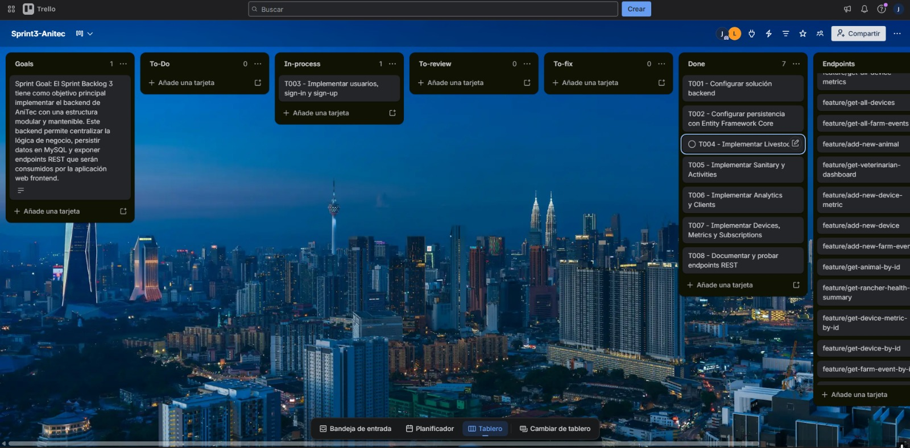
    <p><i><b>Fuente</b>: Elaboración propia.</i></p>
</div>

**Estructura del Trello Board:**

- **Sprint Goal:** Lista que contiene el objetivo principal del Sprint.
- **To Do:** Lista con las tareas pendientes por iniciar.
- **In Progress:** Lista con las tareas que se encuentran en desarrollo.
- **To Review:** Lista con tareas completadas pendientes de revisión.
- **Done:** Lista con tareas aprobadas e integradas al backend.

A continuación, la tabla de control de estado para el Sprint 3:

<table align="center" border="1" cellpadding="8" cellspacing="0" style="border-collapse: collapse; width: 100%; font-family: Arial, sans-serif;">
    <tbody>
        <tr>
            <td><b>Sprint #</b></td>
            <td colspan="7">Sprint 3</td>
        </tr>
        <tr>
            <td colspan="2">User Story</td>
            <td colspan="6">Work-Item / Task</td>
        </tr>
        <tr>
            <td>Id</td>
            <td>Title</td>
            <td>Id</td>
            <td>Title</td>
            <td>Description</td>
            <td>Estimation (Hours)</td>
            <td>Assigned to</td>
            <td>Status</td>
        </tr>
        <tr>
            <td>TS-005</td>
            <td>Configuración inicial del backend con ASP.NET Core</td>
            <td>T001</td>
            <td>Configurar solución backend</td>
            <td>Crear la solución anitec-platform, configurar proyecto ASP.NET Core, Swagger, CORS, appsettings, estructura base y paquetes NuGet necesarios.</td>
            <td>5</td>
            <td>Ayala Fernandez, Jorge Brayan</td>
            <td>Done</td>
        </tr>
        <tr>
            <td>TS-006</td>
            <td>Persistencia con Entity Framework Core y MySQL</td>
            <td>T002</td>
            <td>Configurar persistencia con Entity Framework Core</td>
            <td>Crear AppDbContext, configurar conexión a MySQL, repositorio base, Unit of Work, convenciones de nombres, migraciones y seed de datos iniciales.</td>
            <td>8</td>
            <td>Melgarejo Quiroz, Josep Eliu</td>
            <td>Done</td>
        </tr>
        <tr>
            <td>TS-007</td>
            <td>Autenticación backend con JWT y BCrypt</td>
            <td>T003</td>
            <td>Implementar usuarios, sign-in y sign-up</td>
            <td>Crear entidades, comandos, consultas, servicios, recursos REST y controladores para autenticación, registro de usuarios, hashing de contraseñas y generación de JWT.</td>
            <td>8</td>
            <td>Ayala Fernandez, Jorge Brayan</td>
            <td>Done</td>
        </tr>
        <tr>
            <td>TS-008</td>
            <td>Implementación de bounded contexts de gestión ganadera</td>
            <td>T004</td>
            <td>Implementar Livestock</td>
            <td>Crear bounded context para fincas y animales, incluyendo entidades Herd y Animal, repositorios, servicios de comando/consulta y controladores REST.</td>
            <td>4</td>
            <td>Huaman Gallardo, Bruno Aldair</td>
            <td>Done</td>
        </tr>
        <tr>
            <td>TS-008</td>
            <td>Implementación de bounded contexts de gestión ganadera</td>
            <td>T005</td>
            <td>Implementar Sanitary y Activities</td>
            <td>Crear endpoints para eventos sanitarios y actividades de granja, siguiendo la estructura de commands, queries, resources y assemblers.</td>
            <td>4</td>
            <td>Raymundo Villarroel, Nadhim Abigail</td>
            <td>Done</td>
        </tr>
        <tr>
            <td>TS-009</td>
            <td>Servicios backend para analíticas y clientes veterinarios</td>
            <td>T006</td>
            <td>Implementar Analytics y Clients</td>
            <td>Crear endpoints para dashboards, resúmenes sanitarios/financieros, clientes asignados al veterinario y ganaderos disponibles.</td>
            <td>6</td>
            <td>Sanchez Silva, Luciana Celeste</td>
            <td>Done</td>
        </tr>
        <tr>
            <td>TS-010</td>
            <td>Servicios backend para dispositivos, métricas y suscripciones</td>
            <td>T007</td>
            <td>Implementar Devices, Metrics y Subscriptions</td>
            <td>Crear endpoints para dispositivos, métricas generadas por sensores, planes de suscripción, suscripciones, pagos mock y mock checkout.</td>
            <td>6</td>
            <td>Huaman Gallardo, Bruno Aldair</td>
            <td>Done</td>
        </tr>
        <tr>
            <td>TS-011</td>
            <td>Documentación y pruebas de API con Swagger</td>
            <td>T008</td>
            <td>Documentar y probar endpoints REST</td>
            <td>Verificar Swagger, compilar el proyecto, ejecutar la API, probar endpoints principales y documentar evidencias del Sprint.</td>
            <td>4</td>
            <td>Melgarejo Quiroz, Josep Eliu</td>
            <td>Done</td>
        </tr>
        <tr>
            <td>TS-012</td>
            <td>Integración del frontend con backend real</td>
            <td>T009</td>
            <td>Configurar consumo de API real en frontend</td>
            <td>Actualizar configuración de endpoints mediante `.env.development`, BaseApi y APIs por bounded context para consumir servicios del backend.</td>
            <td>5</td>
            <td>Melgarejo Quiroz, Josep Eliu</td>
            <td>Done</td>
        </tr>
        <tr>
            <td>TS-013</td>
            <td>Módulos frontend para IoT y suscripciones</td>
            <td>T010</td>
            <td>Implementar vistas y stores de IoT y Subscriptions</td>
            <td>Crear y ajustar rutas `/iot` y `/subscriptions`, stores, APIs, assemblers y vistas para dispositivos, métricas, planes, suscripciones y pagos de prueba.</td>
            <td>5</td>
            <td>Huaman Gallardo, Bruno Aldair</td>
            <td>Done</td>
        </tr>
        <tr>
            <td>TS-014</td>
            <td>Videos About the Team y About the Product en landing page</td>
            <td>T011</td>
            <td>Agregar videos en About Us</td>
            <td>Insertar iframes de YouTube para About the Team y About the Product, manteniendo diseño responsive e integración con la página About Us.</td>
            <td>2</td>
            <td>Ayala Fernandez, Jorge Brayan</td>
            <td>Done</td>
        </tr>
    </tbody>
</table>

El Sprint Backlog refleja 11 tareas principales, con aproximadamente 57 horas estimadas de tareas, alineadas con 57 Story Points. Cada tarea fue planificada considerando la complejidad técnica, las dependencias entre bounded contexts, la necesidad de mantener una estructura similar al backend trabajado en clase, la integración del frontend con la API real y la actualización de la landing page.

<a id="toc-5-2-3-4-development-evidence-for-sprint-review"></a>
### 5.2.3.4. Development Evidence for Sprint Review.

En esta sección se presentan los avances de implementación realizados durante el Sprint 3 con relación al backend de AniTec, la integración inicial del frontend con la API real y la actualización de la landing page. La evidencia muestra que el equipo logró construir una API funcional conectada a MySQL, ajustar la aplicación web para consumir servicios reales e incorporar contenido audiovisual en la página About Us.

Durante el Sprint 3, el equipo completó la implementación del proyecto `anitec-platform-main`. El backend fue construido utilizando ASP.NET Core, Entity Framework Core, MySQL, JWT y BCrypt. La estructura interna sigue una organización por bounded contexts con capas de dominio, aplicación, infraestructura e interfaces REST. En paralelo, el frontend fue preparado para consumir endpoints reales mediante configuración de ambiente, servicios API y stores por módulo.

**Resumen de Avances Implementados:**

- **Creación del proyecto backend:** Solución `anitec-platform.sln` con proyecto principal `Anitec.Platform`.
- **Configuración de ASP.NET Core:** Uso de controladores REST, Swagger/OpenAPI, CORS, configuración por ambiente y middleware de errores.
- **Persistencia con MySQL:** Configuración de `AppDbContext`, repositorios, Unit of Work y migraciones de Entity Framework Core.
- **Autenticación JWT:** Implementación de sign-in, sign-up, hashing de contraseñas con BCrypt y emisión de token.
- **Arquitectura por bounded contexts:** Implementación de Shared, IAM, Profiles, Livestock, Sanitary, Activities, Financial, Analytics, Clients, Devices, Metrics y Subscriptions.
- **Servicios de aplicación:** Uso de Command Services y Query Services para separar operaciones de escritura y lectura.
- **REST Resources:** Uso de recursos y assemblers para transformar entidades de dominio en respuestas de API.
- **Seed de datos:** Carga inicial de usuarios, fincas, animales, eventos, dispositivos, planes y suscripciones para pruebas.
- **Migraciones automáticas:** Configuración para aplicar migraciones pendientes al ejecutar la API.
- **Integración frontend-backend:** Configuración de `.env.development`, uso de `BaseApi`, APIs por bounded context, stores Pinia y assemblers para adaptar respuestas del backend.
- **Módulos frontend nuevos:** Incorporación de rutas `/iot` y `/subscriptions`, junto con vistas para dispositivos IoT, métricas, planes, suscripciones, historial de pagos y pago de prueba.
- **Landing page:** Incorporación de videos About the Team y About the Product mediante iframes de YouTube en la página About Us.

**Frontend - Integración con Backend Real:**

- Se configuró `.env.development` para apuntar al backend local mediante `http://localhost:5191/api/v1`.
- Se mantuvo el uso de `BaseApi` para centralizar las peticiones HTTP realizadas con Axios.
- Se ajustaron stores y APIs por bounded context para consumir endpoints reales de usuarios, hatos, animales, sanidad, finanzas, actividades, analíticas, clientes veterinarios, dispositivos y suscripciones.
- Se usaron assemblers para transformar respuestas del backend en objetos usados por las vistas del frontend.
- Se incorporaron las rutas `/iot` y `/subscriptions` dentro de la navegación principal de la aplicación.

<div align="center">
    <p><b>Frontend - Consumo de API real y nuevas vistas</b></p>
    
    <p><i><b>Fuente</b>: Elaboración propia.</i></p>
</div>

**Landing Page - Videos About the Team y About the Product:**

- En la página About Us de la landing page se incorporó un video About the Team para presentar al equipo de AniTec.
- También se agregó el video About the Product para explicar el modelo de negocio, la propuesta de valor y las funciones principales de la solución.
- Ambos videos fueron integrados mediante iframes de YouTube, manteniendo la estructura responsive de la landing page.

<div align="center">
    <p><b>Landing Page - Video About the Product</b></p>
    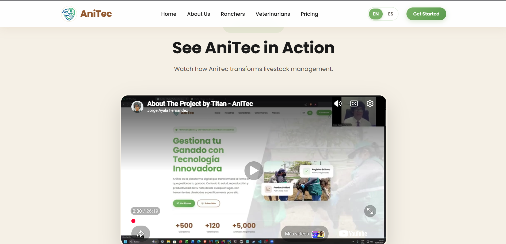
    <p><i><b>Fuente</b>: Elaboración propia.</i></p>
</div>

<div align="center">
    <p><b>Landing Page - Video About the Team</b></p>
    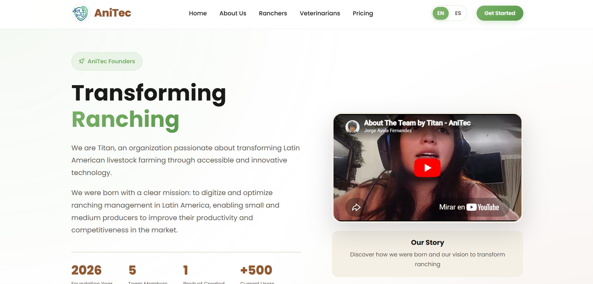
    <p><i><b>Fuente</b>: Elaboración propia.</i></p>
</div>

**Estructura principal del backend:**

```text
anitec-platform-main/
├── Anitec.Platform/
│   ├── Activities/
│   ├── Analytics/
│   ├── Clients/
│   ├── Devices/
│   ├── Financial/
│   ├── Iam/
│   ├── Livestock/
│   ├── Metrics/
│   ├── Profiles/
│   ├── Sanitary/
│   ├── Shared/
│   └── Subscriptions/
├── anitec-platform.sln
└── README.md
```

**Commits Realizados:**

| Repository           | Branch | Commit id | Commit Message                            | Commit Message Body                                           | Committed on (Date) |
| -------------------- | ------ | --------- | ----------------------------------------- | ------------------------------------------------------------- | ------------------- |
| anitec-platform-main | develop | a7f3c91 | chore: initial-folder-structure | Creación de la estructura base del backend ASP.NET Core, carpetas por bounded context y configuración inicial de dependencias. | 01/06/2026 |
| anitec-platform-main | feature/get-all-herds | 4b83e0d | feat: create herds controller | Creación del controlador REST para exponer operaciones principales de hatos. | 02/06/2026 |
| anitec-platform-main | feature/get-all-users | 74b5e23 | feat: implement get all users endpoint | Implementación del endpoint `GET /users` para consultar usuarios registrados en la plataforma. | 02/06/2026 |
| anitec-platform-main | feature/get-all-herds | e41fc9a | feat: add herds query service | Implementación del servicio de consultas para listar hatos desde la base de datos. | 03/06/2026 |
| anitec-platform-main | feature/get-all-animals | 39eb2fd | feat: map animal resource response | Definición de recursos REST y assembler para devolver animales con especie, raza, peso, estado y hato asociado. | 03/06/2026 |
| anitec-platform-main | develop | 0a9d8bf | Merge pull request #33 from upc-1asi0730-2610-12206-titan-team-4/feature/get-all-herds | Integración del listado de hatos al branch de desarrollo. | 04/06/2026 |
| anitec-platform-main | feature/get-user-by-id | d24ab70 | feat: implement get user by id endpoint | Implementación del endpoint `GET /users/{id}` para consultar un usuario específico mediante su identificador. | 04/06/2026 |
| anitec-platform-main | feature/add-new-health-event | d80a2bf | feat: create health event command | Creación del comando de aplicación para registrar vacunas, diagnósticos, tratamientos y seguimientos. | 05/06/2026 |
| anitec-platform-main | feature/get-all-animals | 5a73b6e | feat: implement get all animals endpoint | Implementación del endpoint `GET /animals` para consultar animales registrados. | 05/06/2026 |
| anitec-platform-main | feature/add-new-herd | 92d7ac1 | feat: implement add new herd endpoint | Implementación del endpoint `POST /herds` para registrar nuevos hatos o unidades productivas. | 06/06/2026 |
| anitec-platform-main | feature/get-all-financial-records | e7b30f1 | feat: add financial record repository | Implementación del repositorio para consultar ingresos y egresos persistidos en MySQL. | 06/06/2026 |
| anitec-platform-main | feature/get-all-health-events | b6d14ca | feat: implement get all health events endpoint | Implementación del endpoint `GET /health-events` para consultar vacunas, tratamientos e incidencias. | 07/06/2026 |
| anitec-platform-main | develop | 21d9f5e | Merge pull request #36 from upc-1asi0730-2610-12206-titan-team-4/feature/get-all-animals | Integración del listado de animales al branch de desarrollo. | 07/06/2026 |
| anitec-platform-main | feature/get-rancher-dashboard | 2ed4b73 | feat: build rancher dashboard summary | Implementación del resumen de animales, hatos, eventos sanitarios y métricas principales para ganaderos. | 08/06/2026 |
| anitec-platform-main | feature/add-new-health-event | 11ae7d9 | feat: expose add health event endpoint | Exposición del endpoint `POST /health-events` para registrar eventos sanitarios desde la aplicación web. | 08/06/2026 |
| anitec-platform-main | feature/get-all-farm-events | 1c7d80e | feat: implement get all farm events endpoint | Implementación del endpoint `GET /farm-events` para consultar actividades, visitas y tareas programadas. | 09/06/2026 |
| anitec-platform-main | feature/get-clients-by-veterinarian | 6fa28c0 | feat: create veterinarian clients resource | Creación de recursos REST para representar clientes asignados a un veterinario. | 09/06/2026 |
| anitec-platform-main | develop | 63fa0dd | Merge pull request #39 from upc-1asi0730-2610-12206-titan-team-4/feature/get-all-health-events | Integración de la consulta de eventos sanitarios al branch de desarrollo. | 10/06/2026 |
| anitec-platform-main | feature/get-all-devices | 58d14e7 | feat: implement get all devices endpoint | Implementación del endpoint `GET /devices` para listar dispositivos IoT asociados a animales o hatos. | 10/06/2026 |
| anitec-platform-main | feature/get-veterinarian-dashboard | cb8a3e5 | feat: implement veterinarian dashboard endpoint | Implementación del endpoint `GET /analytics/veterinarians/{veterinarianId}/dashboard` para mostrar clientes, pacientes y eventos sanitarios. | 11/06/2026 |
| anitec-platform-main | feature/get-clients-by-veterinarian | 47bd918 | feat: implement get clients by veterinarian endpoint | Implementación del endpoint `GET /veterinarian/{veterinarianId}/clients` para listar ganaderos asignados. | 11/06/2026 |
| anitec-platform-main | feature/get-active-subscription-by-user | 71ad8e0 | feat: implement active subscription query | Implementación de consulta para obtener la suscripción activa de un usuario. | 12/06/2026 |
| anitec-platform-main | develop | a4b9df0 | Merge pull request #43 from upc-1asi0730-2610-12206-titan-team-4/feature/get-rancher-dashboard | Integración del dashboard de ganadero al branch de desarrollo. | 12/06/2026 |
| anitec-platform-main | feature/get-device-latest-metric | f0e2a69 | feat: implement latest device metric endpoint | Implementación del endpoint `GET /devices/{id}/latest-metric` para obtener la última lectura registrada. | 13/06/2026 |
| anitec-platform-main | feature/add-client-to-veterinarian | bf5a127 | feat: implement add client to veterinarian endpoint | Implementación del endpoint `POST /veterinarian/{veterinarianId}/clients/{rancherId}` para asociar un ganadero a un veterinario. | 13/06/2026 |
| anitec-platform-main | feature/get-all-subscription-plans | 87a0d6c | feat: create subscription plan resource | Creación de recursos REST para representar planes de suscripción. | 14/06/2026 |
| anitec-platform-main | feature/get-all-subscription-plans | e314ac7 | feat: implement get all subscription plans endpoint | Implementación del endpoint `GET /subscription-plans` para listar planes disponibles. | 14/06/2026 |
| anitec-platform-main | feature/get-available-ranchers-for-veterinarian | 2a0fca9 | feat: implement available ranchers endpoint | Implementación del endpoint `GET /veterinarian/{veterinarianId}/available-ranchers` para consultar ganaderos disponibles. | 15/06/2026 |
| anitec-platform-main | develop | 47f8c2d | Merge pull request #69 from upc-1asi0730-2610-12206-titan-team-4/feature/get-clients-by-veterinarian | Integración de la consulta de clientes asignados al branch de desarrollo. | 15/06/2026 |
| anitec-platform-main | feature/get-payments-by-user | 4f2bc8a | feat: implement get payments by user endpoint | Implementación del endpoint `GET /subscriptions/users/{userId}/payments` para consultar pagos asociados a un usuario. | 16/06/2026 |
| anitec-platform-main | feature/mock-checkout | 9b8e430 | feat: create mock checkout command | Creación del flujo de comando para simular checkout y generar pagos de prueba. | 16/06/2026 |
| anitec-platform-main | feature/mock-checkout | 5e64a1d | feat: implement mock checkout endpoint | Implementación del endpoint `POST /subscriptions/mock-checkout` para validar pagos mock durante el Sprint. | 17/06/2026 |
| anitec-platform-main | feature/remove-client-from-veterinarian | 3fe60ab | feat: implement remove client from veterinarian endpoint | Implementación del endpoint `DELETE /veterinarian/{veterinarianId}/clients/{rancherId}` para retirar un cliente asignado. | 17/06/2026 |
| anitec-platform-main | develop | 92e03bf | Merge pull request #71 from upc-1asi0730-2610-12206-titan-team-4/feature/get-all-devices | Integración de dispositivos IoT y lectura de últimas métricas al branch de desarrollo. | 18/06/2026 |
| anitec-platform-main | hotfix/fix-dateonly-mysql-converters | c6a01de | fix: configure dateonly converters for mysql | Corrección de conversores DateOnly para evitar errores de persistencia y lectura en MySQL. | 18/06/2026 |
| anitec-platform-main | hotfix/fix-dateonly-mysql-converters | e0b71ac | fix: update migration snapshot dates | Ajuste del snapshot de migraciones para mantener consistencia con las columnas de fecha. | 18/06/2026 |
| anitec-platform-main | develop | d0af82c | Merge pull request #73 from upc-1asi0730-2610-12206-titan-team-4/hotfix/fix-dateonly-mysql-converters | Integración del hotfix de conversión de fechas al branch de desarrollo. | 19/06/2026 |
| anitec-platform-main | develop | 8f6d1be | Merge pull request #72 from upc-1asi0730-2610-12206-titan-team-4/feature/mock-checkout | Integración del flujo de pagos mock y suscripciones al branch de desarrollo. | 19/06/2026 |
| anitec-platform-main | main | 7e9c4b2 | Merge pull request #74 from upc-1asi0730-2610-12206-titan-team-4/develop | Integración final del Sprint 3 desde `develop` hacia `main`, consolidando endpoints, migraciones, seed de datos y documentación Swagger. | 19/06/2026 |

**Commits del repositorio anitec-frontend:**

[Agregar commits del repositorio anitec-frontend relacionados con integración backend, IoT y subscriptions]

**Commits del repositorio anitec-landing-page:**

[Agregar commits del repositorio anitec-landing-page relacionados con videos About the Team y About the Product]

**Repositorio del Backend:**

https://github.com/upc-1asi0730-2610-12206-titan-team-4/anitec-backend.git

**Repositorios y despliegues relacionados al Sprint 3:**

- Repositorio del backend: https://github.com/upc-1asi0730-2610-12206-titan-team-4/anitec-backend.git
- URL pública del backend: https://anitec-backend.onrender.com
- Documentación pública del backend: https://anitec-backend.onrender.com/swagger/index.html
- Repositorio del frontend: https://github.com/upc-1asi0730-2610-12206-titan-team-4/anitec-frontend
- Despliegue del frontend web: https://upc-1asi0730-2610-12206-titan-team-4.github.io/anitec-frontend
- Repositorio de la landing page: https://github.com/upc-1asi0730-2610-12206-titan-team-4/anitec-landing-page
- Despliegue de la landing page: https://upc-1asi0730-2610-12206-titan-team-4.github.io/anitec-landing-page/

**Estadísticas del repositorio:**

- Total de bounded contexts implementados: 12
- Base de datos: MySQL
- ORM: Entity Framework Core
- Seguridad: JWT y BCrypt
- Documentación de servicios: Swagger/OpenAPI
- Migraciones generadas: 3
- Endpoints principales: autenticación, usuarios, perfiles, fincas, animales, sanidad, finanzas, actividades, analíticas, clientes, dispositivos, métricas y suscripciones.
- Frontend integrado: consumo de API real mediante `.env.development`, `BaseApi`, stores, APIs y assemblers.
- Rutas frontend agregadas: `/iot` para dispositivos IoT y `/subscriptions` para planes, suscripciones y pagos de prueba.
- Landing page actualizada: videos About the Team y About the Product integrados en About Us.

<a id="toc-5-2-3-5-execution-evidence-for-sprint-review"></a>
### 5.2.3.5. Execution Evidence for Sprint Review.

Esta sección resume lo alcanzado en el Sprint 3 y presenta las principales evidencias de ejecución del backend, frontend y landing page. El objetivo fue comprobar que la API pueda compilar, ejecutar, aplicar migraciones, conectarse a MySQL y responder a peticiones HTTP desde Swagger o herramientas de prueba. Además, se verificó que el frontend pueda consumir datos reales del backend y que la landing page muestre los videos incorporados.

**Resumen de lo Alcanzado:**

El Sprint 3 permitió desarrollar el backend real de AniTec e iniciar la integración de la solución completa. El equipo logró configurar la solución ASP.NET Core, conectar la API con MySQL, implementar migraciones, crear datos iniciales, exponer endpoints REST para los módulos principales del sistema, conectar el frontend con la API real y actualizar la landing page con contenido audiovisual.

**URLs públicas revisadas durante el Sprint 3:**

- Landing page: https://upc-1asi0730-2610-12206-titan-team-4.github.io/anitec-landing-page/
- Frontend web: https://upc-1asi0730-2610-12206-titan-team-4.github.io/anitec-frontend/iam/sign-in
- Backend Swagger: https://anitec-backend.onrender.com/swagger/index.html

**Video/demo de navegación del Sprint 3:**

[Agregar URL del video/demo de navegación del Sprint 3]

Como evidencia adicional, el Video About-the-Product también muestra la navegación y funcionamiento general de AniTec.

**Evidencias de ejecución:**

1. **Compilación del backend:** Se ejecutó el comando `dotnet build` para validar que el proyecto compile correctamente.

<div align="center">
    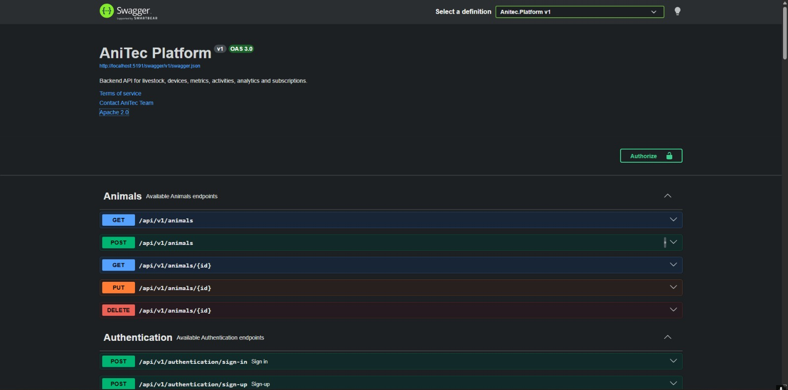
    <p><i><b>Fuente</b>: Elaboración propia.</i></p>
</div>


1. **Integración frontend-backend:** Se verificó que `.env.development` apunte al backend local mediante `http://localhost:5191/api/v1` y que los módulos del frontend usen `BaseApi`, stores, APIs y assemblers para consumir los servicios reales.

<div align="center">
    <p><b>Frontend - Consumo del backend real</b></p>
    
    <p><i><b>Fuente</b>: Elaboración propia.</i></p>
</div>

3. **Módulo IoT:** Se validó la ruta `/iot`, la visualización de dispositivos IoT, la asociación de dispositivos con hatos o animales y la consulta de métricas generadas por sensores.

<div align="center">
    <p><b>Frontend - dispositivos IoT</b></p>
    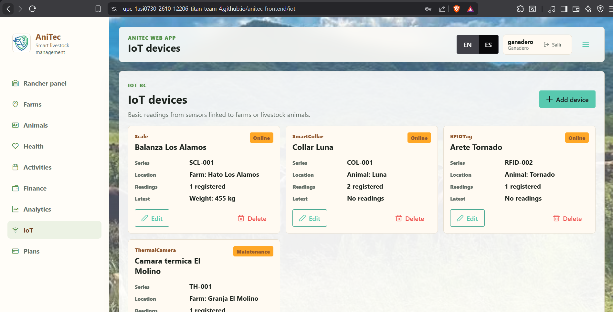
    <p><i><b>Fuente</b>: Elaboración propia.</i></p>
</div>

1. **Módulo Subscriptions:** Se validó la ruta `/subscriptions`, la consulta de planes, la suscripción activa, el historial de pagos y el flujo de pago de prueba mediante el endpoint `/subscriptions/mock-checkout`.

<div align="center">
    <p><b>Frontend - Subscriptions</b></p>
    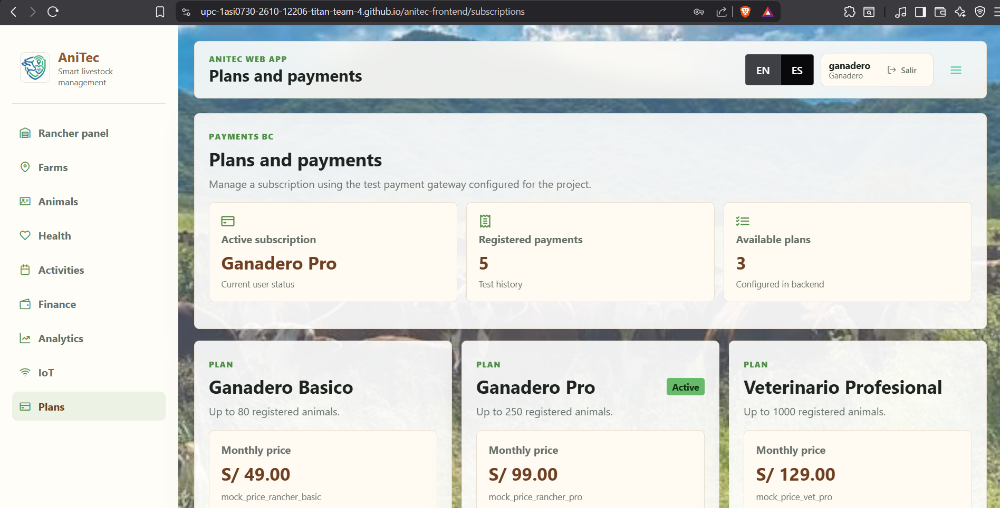
    <p><i><b>Fuente</b>: Elaboración propia.</i></p>
</div>

1. **Landing page:** Se validó que la página About Us muestre los videos About the Team y About the Product mediante iframes de YouTube.

<div align="center">
    <p><b>Landing Page - Video About the team</b></p>
    
    <p><i><b>Fuente</b>: Elaboración propia.</i></p>
</div>

<div align="center">
    <p><b>Landing Page - Video About the Product</b></p>
    
    <p><i><b>Fuente</b>: Elaboración propia.</i></p>
</div>


**Funcionalidades implementadas en backend:**

1. **IAM:** Inicio de sesión, registro de usuarios, generación de token JWT y consulta de usuarios.
2. **Profiles:** Gestión de perfiles asociados a usuarios.
3. **Livestock:** Gestión de fincas y animales.
4. **Sanitary:** Gestión de eventos sanitarios y registros de salud.
5. **Activities:** Gestión de actividades y eventos de granja.
6. **Financial:** Gestión de ingresos, egresos y registros económicos.
7. **Analytics:** Dashboards y resúmenes para ganaderos y veterinarios.
8. **Clients:** Gestión de relación entre veterinarios y ganaderos.
9. **Devices:** Gestión de dispositivos como balanzas, collares inteligentes, cámaras térmicas, aretes de identificación, estaciones meteorológicas y sensores ambientales.
10. **Metrics:** Gestión de métricas generadas por dispositivos.
11. **Subscriptions:** Gestión de planes, suscripciones, pagos y mock checkout.
12. **Shared:** Repositorios base, Unit of Work, persistencia, recursos comunes y manejo de errores.

**Funcionalidades implementadas en frontend y landing page:**

1. **Consumo del backend real:** Configuración de servicios API mediante `.env.development`, `BaseApi`, stores Pinia y assemblers.
2. **IoT:** Visualización, registro y edición de dispositivos IoT desde la ruta `/iot`, con asociación a hato o animal y lectura de métricas.
3. **Subscriptions:** Consulta de planes, suscripción activa, historial de pagos y pago de prueba desde la ruta `/subscriptions`.
4. **Mock checkout:** Consumo del endpoint `/subscriptions/mock-checkout` para validar el flujo de pagos simulados durante el Sprint.
5. **Landing page:** Presentación de los videos About the Team y About the Product dentro de la página About Us.

<a id="toc-5-2-3-6-services-documentation-evidence-for-sprint-review"></a>
### 5.2.3.6. Services Documentation Evidence for Sprint Review.

Para el Sprint 3, el equipo implementó una API REST real para AniTec utilizando ASP.NET Core. Esta API reemplaza progresivamente al servicio mock utilizado durante el Sprint 2 y permite que el frontend consuma información persistida en MySQL.

**Configuración del Servicio Backend:**

- **Plataforma:** ASP.NET Core
- **ORM:** Entity Framework Core
- **Base de datos:** MySQL
- **Autenticación:** JWT Bearer Token
- **Hashing de contraseñas:** BCrypt
- **Documentación:** Swagger/OpenAPI
- **Repositorio:** https://github.com/upc-1asi0730-2610-12206-titan-team-4/anitec-backend.git
- **URL pública del backend:** https://anitec-backend.onrender.com
- **Documentación pública:** https://anitec-backend.onrender.com/swagger/index.html

**Migraciones implementadas:**

| Migración | Descripción |
| --------- | ----------- |
| `20260605202323_InitialCreate` | Creación inicial de tablas principales del sistema. |
| `20260607213722_AddRolesClientsAndMockPayments` | Agrega roles, clientes veterinarios y pagos mock. |
| `20260607235600_AddDateOnlyConverters` | Ajustes para conversión de fechas con DateOnly. |

**Endpoints principales implementados:**

| Bounded Context | Método | Endpoint | Descripción |
| --------------- | ------ | -------- | ----------- |
| IAM | POST | `/api/v1/authentication/sign-in` | Inicio de sesión de usuarios registrados y generación de token JWT. |
| IAM | POST | `/api/v1/authentication/sign-up` | Registro de nuevos usuarios con contraseña encriptada. |
| IAM | GET | `/api/v1/users` | Consulta de usuarios del sistema. |
| IAM | GET | `/api/v1/users/{id}` | Consulta de un usuario por identificador. |
| Profiles | GET | `/api/v1/profiles` | Consulta de perfiles registrados. |
| Profiles | GET | `/api/v1/profiles/{profileId}` | Consulta de un perfil por identificador. |
| Profiles | POST | `/api/v1/profiles` | Creación de perfiles de usuario. |
| Livestock | GET | `/api/v1/herds` | Consulta de hatos o unidades productivas. |
| Livestock | GET | `/api/v1/herds/{id}` | Consulta de un hato por identificador. |
| Livestock | POST | `/api/v1/herds` | Registro de nuevos hatos. |
| Livestock | PUT | `/api/v1/herds/{id}` | Actualización de información de un hato. |
| Livestock | DELETE | `/api/v1/herds/{id}` | Eliminación de un hato registrado. |
| Livestock | GET | `/api/v1/animals` | Consulta de animales registrados. |
| Livestock | GET | `/api/v1/animals/{id}` | Consulta de un animal por identificador. |
| Livestock | POST | `/api/v1/animals` | Registro de nuevos animales. |
| Livestock | PUT | `/api/v1/animals/{id}` | Actualización de información de un animal. |
| Livestock | DELETE | `/api/v1/animals/{id}` | Eliminación de un animal registrado. |
| Sanitary | GET | `/api/v1/health-events` | Consulta de eventos sanitarios. |
| Sanitary | GET | `/api/v1/health-events/{id}` | Consulta de un evento sanitario por identificador. |
| Sanitary | POST | `/api/v1/health-events` | Registro de vacunas, tratamientos, diagnósticos o incidencias. |
| Sanitary | PUT | `/api/v1/health-events/{id}` | Actualización de un evento sanitario. |
| Sanitary | DELETE | `/api/v1/health-events/{id}` | Eliminación de un evento sanitario. |
| Financial | GET | `/api/v1/financial-records` | Consulta de ingresos y egresos ganaderos. |
| Financial | GET | `/api/v1/financial-records/{id}` | Consulta de un registro financiero por identificador. |
| Financial | POST | `/api/v1/financial-records` | Registro de ingresos o gastos. |
| Financial | PUT | `/api/v1/financial-records/{id}` | Actualización de un registro financiero. |
| Financial | DELETE | `/api/v1/financial-records/{id}` | Eliminación de un registro financiero. |
| Activities | GET | `/api/v1/farm-events` | Consulta de actividades, visitas o tareas de granja. |
| Activities | GET | `/api/v1/farm-events/{id}` | Consulta de una actividad por identificador. |
| Activities | POST | `/api/v1/farm-events` | Registro de nuevas actividades de granja. |
| Activities | PUT | `/api/v1/farm-events/{id}` | Actualización de una actividad. |
| Activities | DELETE | `/api/v1/farm-events/{id}` | Eliminación de una actividad. |
| Analytics | GET | `/api/v1/analytics/ranchers/{rancherId}/dashboard` | Dashboard de métricas principales para ganaderos. |
| Analytics | GET | `/api/v1/analytics/veterinarians/{veterinarianId}/dashboard` | Dashboard de métricas principales para veterinarios. |
| Analytics | GET | `/api/v1/analytics/ranchers/{rancherId}/health-summary` | Resumen sanitario del ganadero. |
| Analytics | GET | `/api/v1/analytics/ranchers/{rancherId}/financial-summary` | Resumen financiero del ganadero. |
| Analytics | GET | `/api/v1/report-metrics` | Consulta de métricas de reportes. |
| Analytics | GET | `/api/v1/report-metrics/{id}` | Consulta de una métrica de reporte por identificador. |
| Analytics | POST | `/api/v1/report-metrics` | Registro de métricas de reportes. |
| Analytics | PUT | `/api/v1/report-metrics/{id}` | Actualización de una métrica de reporte. |
| Analytics | DELETE | `/api/v1/report-metrics/{id}` | Eliminación de una métrica de reporte. |
| Clients | GET | `/api/v1/veterinarian/{veterinarianId}/clients` | Consulta de clientes asignados a un veterinario. |
| Clients | GET | `/api/v1/veterinarian/{veterinarianId}/available-ranchers` | Consulta de ganaderos disponibles para asociar. |
| Clients | POST | `/api/v1/veterinarian/{veterinarianId}/clients/{rancherId}` | Asociación de un ganadero a un veterinario. |
| Clients | DELETE | `/api/v1/veterinarian/{veterinarianId}/clients/{rancherId}` | Eliminación de la relación entre veterinario y ganadero. |
| Devices | GET | `/api/v1/devices` | Consulta de dispositivos IoT registrados. |
| Devices | GET | `/api/v1/devices/{id}` | Consulta de un dispositivo por identificador. |
| Devices | POST | `/api/v1/devices` | Registro de nuevos dispositivos IoT. |
| Devices | PUT | `/api/v1/devices/{id}` | Actualización de un dispositivo IoT. |
| Devices | DELETE | `/api/v1/devices/{id}` | Eliminación de un dispositivo IoT. |
| Devices | GET | `/api/v1/devices/{id}/metrics` | Consulta de métricas asociadas a un dispositivo. |
| Devices | GET | `/api/v1/devices/{id}/latest-metric` | Consulta de la última métrica registrada por un dispositivo. |
| Metrics | GET | `/api/v1/device-metrics` | Consulta de métricas de dispositivos. |
| Metrics | GET | `/api/v1/device-metrics/{id}` | Consulta de una métrica de dispositivo por identificador. |
| Metrics | POST | `/api/v1/device-metrics` | Registro de métricas de dispositivos. |
| Metrics | PUT | `/api/v1/device-metrics/{id}` | Actualización de una métrica de dispositivo. |
| Metrics | DELETE | `/api/v1/device-metrics/{id}` | Eliminación de una métrica de dispositivo. |
| Subscriptions | GET | `/api/v1/subscription-plans` | Consulta de planes de suscripción disponibles. |
| Subscriptions | GET | `/api/v1/subscription-plans/{id}` | Consulta de un plan de suscripción por identificador. |
| Subscriptions | POST | `/api/v1/subscription-plans` | Registro de nuevos planes de suscripción. |
| Subscriptions | PUT | `/api/v1/subscription-plans/{id}` | Actualización de un plan de suscripción. |
| Subscriptions | DELETE | `/api/v1/subscription-plans/{id}` | Eliminación de un plan de suscripción. |
| Subscriptions | GET | `/api/v1/subscriptions` | Consulta de suscripciones registradas. |
| Subscriptions | GET | `/api/v1/subscriptions/{id}` | Consulta de una suscripción por identificador. |
| Subscriptions | POST | `/api/v1/subscriptions` | Registro de nuevas suscripciones. |
| Subscriptions | PUT | `/api/v1/subscriptions/{id}` | Actualización de una suscripción. |
| Subscriptions | DELETE | `/api/v1/subscriptions/{id}` | Eliminación de una suscripción. |
| Subscriptions | GET | `/api/v1/subscriptions/users/{userId}/active` | Consulta de la suscripción activa de un usuario. |
| Subscriptions | GET | `/api/v1/subscriptions/users/{userId}/payments` | Consulta de pagos asociados a un usuario. |
| Subscriptions | POST | `/api/v1/subscriptions/mock-checkout` | Simulación de pago para pruebas del flujo de suscripción. |

**Ejemplos de interacción con endpoints principales:**

1. **Inicio de sesión de usuario**

- **Método:** POST
- **Endpoint:** `/api/v1/authentication/sign-in`
- **Body:**

```json
{
  "username": "rancher1",
  "password": "anitec123"
}
```

- **Response esperado:**

```json
{
  "id": 1,
  "username": "rancher1",
  "role": "Rancher",
  "token": "jwt-token"
}
```

2. **Consulta de animales registrados**

- **Método:** GET
- **Endpoint:** `/api/v1/animals`
- **Parámetros:** No requiere parámetros obligatorios.
- **Response esperado:**

```json
[
  {
    "id": 1,
    "name": "Luna",
    "species": "Bovino",
    "breed": "Holstein",
    "status": "healthy",
    "herdId": 1
  }
]
```

3. **Registro de evento sanitario**

- **Método:** POST
- **Endpoint:** `/api/v1/health-events`
- **Body:**

```json
{
  "animalId": 1,
  "type": "Vaccination",
  "date": "2026-06-10",
  "description": "Vacuna anual",
  "veterinarianId": 2
}
```

- **Response esperado:**

```json
{
  "id": 12,
  "animalId": 1,
  "type": "Vaccination",
  "status": "registered"
}
```

4. **Consulta de última métrica de dispositivo**

- **Método:** GET
- **Endpoint:** `/api/v1/devices/{id}/latest-metric`
- **Parámetros:** `id`, identificador del dispositivo IoT.
- **Response esperado:**

```json
{
  "deviceId": 1,
  "metricType": "temperature",
  "value": 38.4,
  "unit": "C",
  "recordedAt": "2026-06-18T10:30:00"
}
```

5. **Pago de prueba para suscripción**

- **Método:** POST
- **Endpoint:** `/api/v1/subscriptions/mock-checkout`
- **Body:**

```json
{
  "userId": 1,
  "planId": 2,
  "amount": 19.00
}
```

- **Response esperado:**

```json
{
  "subscriptionId": 3,
  "paymentId": 8,
  "status": "paid",
  "provider": "mock"
}
```

**Swagger/OpenAPI:** Se verificó que la documentación de endpoints esté disponible en el navegador.

<div align="center">
    
    <p><i><b>Fuente</b>: Elaboración propia.</i></p>
</div>

<div align="center">
    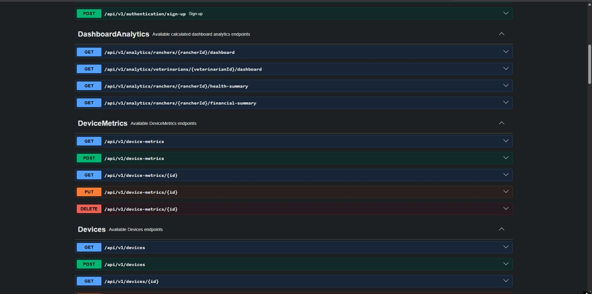
    <p><i><b>Fuente</b>: Elaboración propia.</i></p>
</div>

<div align="center">
    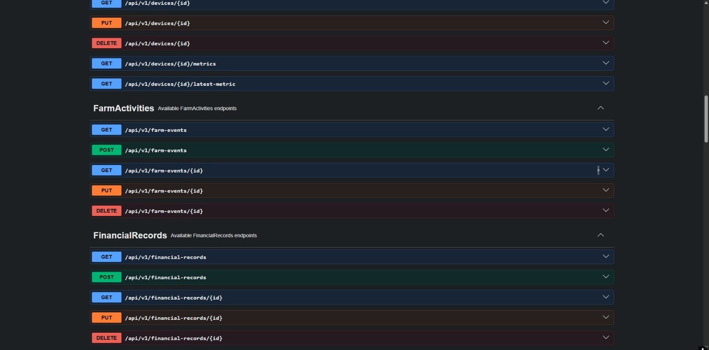
    <p><i><b>Fuente</b>: Elaboración propia.</i></p>
</div>

<div align="center">
    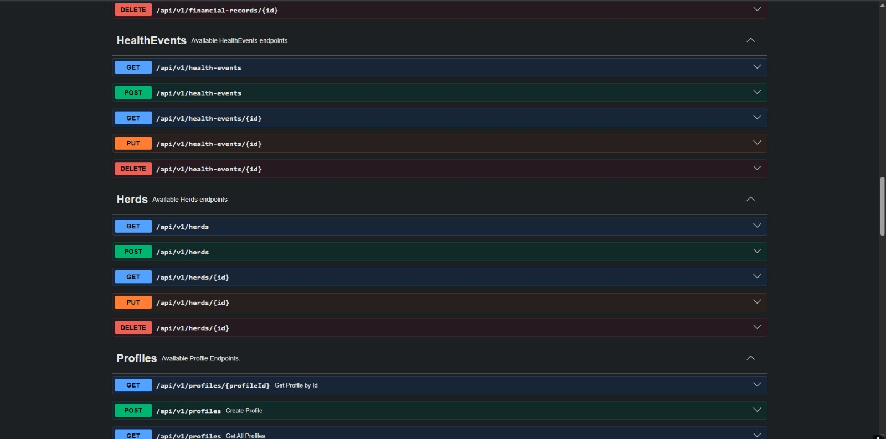
    <p><i><b>Fuente</b>: Elaboración propia.</i></p>
</div>

<div align="center">
    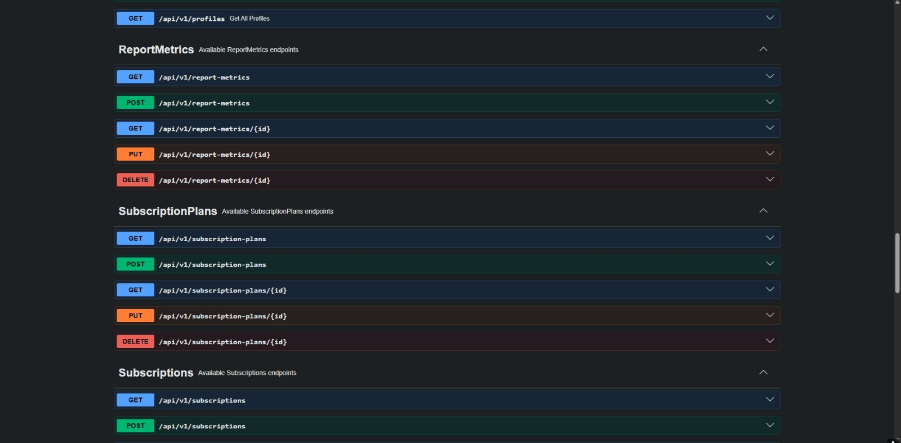
    <p><i><b>Fuente</b>: Elaboración propia.</i></p>
</div>

<div align="center">
    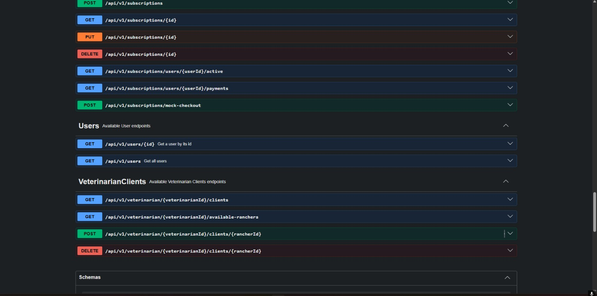
    <p><i><b>Fuente</b>: Elaboración propia.</i></p>
</div>

<div align="center">
    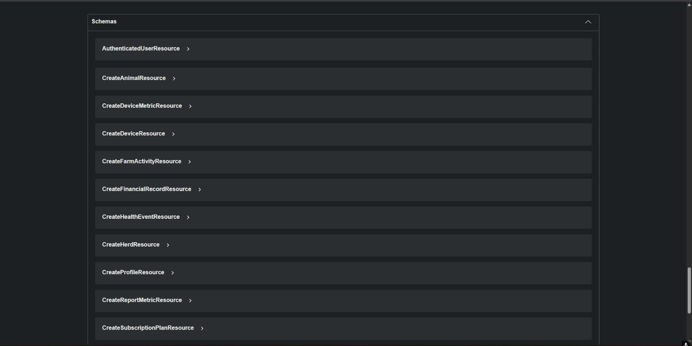
    <p><i><b>Fuente</b>: Elaboración propia.</i></p>
</div>

**Estructura de capas aplicada:**

1. **Domain:** Entidades, comandos, consultas y contratos de repositorios.
2. **Application:** Command Services y Query Services para manejar casos de uso.
3. **Infrastructure:** Repositorios, Entity Framework Core, Unit of Work y servicios técnicos.
4. **Interfaces REST:** Controladores, recursos y assemblers para exponer la API.
5. **Shared:** Elementos comunes reutilizables en todos los bounded contexts.

**Variables y configuración:**

La cadena de conexión se configura en `appsettings.Development.json` y apunta a la base de datos MySQL local. También se dejó preparada la posibilidad de usar una variable de entorno para cambiar la conexión según el ambiente.

```json
"DefaultConnection": "server=localhost;user=root;password=password;database=anitec-platform"
```

<a id="toc-5-2-3-7-software-deployment-evidence-for-sprint-review"></a>
### 5.2.3.7. Software Deployment Evidence for Sprint Review.

Durante el Sprint 3, la evidencia de despliegue incluyó backend, frontend y landing page. El backend se publicó en Render como Web Service para exponer la API REST, mientras que la landing page y el frontend web se mantuvieron accesibles mediante despliegues públicos. El objetivo de esta evidencia fue comprobar que AniTec pueda presentarse y probarse desde internet, conectando la comunicación pública del producto, la aplicación web y los servicios backend.

Este despliegue permitió validar que los servicios backend desarrollados en ASP.NET Core pueden estar disponibles públicamente para ser consumidos por la aplicación web frontend. De esta manera, el backend deja de depender únicamente de la ejecución local y queda preparado para pruebas de integración en un entorno accesible desde internet.

**URLs públicas del Sprint 3:**

- Landing page: https://upc-1asi0730-2610-12206-titan-team-4.github.io/anitec-landing-page/
- Frontend web: https://upc-1asi0730-2610-12206-titan-team-4.github.io/anitec-frontend/iam/sign-in
- Backend web: https://anitec-backend.onrender.com
- Documentación Swagger del backend: https://anitec-backend.onrender.com/swagger/index.html

**Configuración de despliegue - Landing Page:**

- **Plataforma:** GitHub Pages
- **Repositorio:** https://github.com/upc-1asi0730-2610-12206-titan-team-4/anitec-landing-page
- **Branch desplegada:** `main`
- **URL pública:** https://upc-1asi0730-2610-12206-titan-team-4.github.io/anitec-landing-page/
- **Alcance del Sprint 3:** actualización de la página About Us para incluir los videos About the Team y About the Product mediante iframes de YouTube.

**Configuración de despliegue - Frontend Web Application:**

- **Plataforma:** GitHub Pages
- **Repositorio:** https://github.com/upc-1asi0730-2610-12206-titan-team-4/anitec-frontend
- **URL pública:** https://upc-1asi0730-2610-12206-titan-team-4.github.io/anitec-frontend/iam/sign-in
- **Alcance del Sprint 3:** integración progresiva con el backend real, actualización de consumo mediante `BaseApi` y `.env.development`, e incorporación de las rutas `/iot` y `/subscriptions`.

**Configuración de despliegue en Render - Backend:**

- **Proyecto:** `anitec-platform-main`
- **Framework:** ASP.NET Core
- **Plataforma de despliegue:** Render
- **Tipo de servicio:** Web Service
- **Repositorio:** `https://github.com/upc-1asi0730-2610-12206-titan-team-4/anitec-backend.git`
- **Branch desplegada:** `main`
- **Proyecto de inicio:** `Anitec.Platform`
- **Base de datos:** MySQL configurada para el ambiente de despliegue
- **URL pública del backend:** https://anitec-backend.onrender.com
- **Documentación pública:** https://anitec-backend.onrender.com/swagger/index.html
- **Archivo de configuración base:** `appsettings.json`
- **Variables de entorno:** cadena de conexión, ambiente de ejecución y configuración de token JWT

**Procedimiento de despliegue en Render:**

1. Crear un nuevo Web Service en Render.
2. Conectar el repositorio de GitHub del backend de AniTec.
3. Seleccionar la rama `main` como fuente del despliegue.
4. Configurar el proyecto ASP.NET Core indicando como proyecto principal `Anitec.Platform`.
5. Definir las variables de entorno necesarias para el ambiente de producción o staging.
6. Configurar la cadena de conexión de MySQL para que el backend pueda acceder a la base de datos remota.
7. Ejecutar el proceso de build del backend desde Render.
8. Iniciar el servicio web y verificar que la API quede disponible mediante la URL pública generada.
9. Abrir la documentación Swagger desde la URL pública del backend.
10. Probar endpoints principales como autenticación, usuarios, animales, hatos, dispositivos y suscripciones.

<div align="center">
    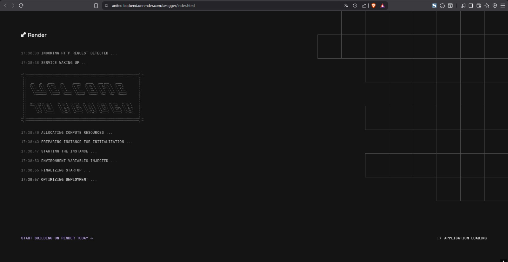
    <p><i><b>Fuente</b>: Elaboración propia.</i></p>
</div>

<div align="center">
    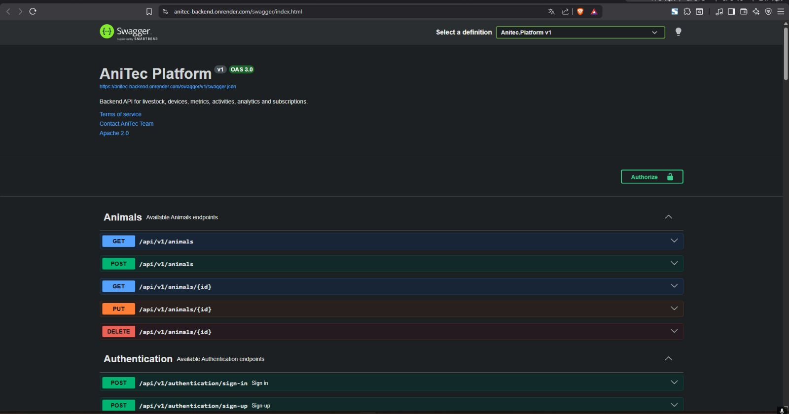
    <p><i><b>Fuente</b>: Elaboración propia.</i></p>
</div>

<div align="center">
    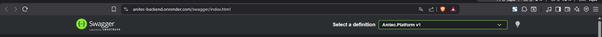
    <p><i><b>Fuente</b>: Elaboración propia.</i></p>
</div>

**Verificación Post-Despliegue:**

Después de desplegar el backend en Render, se verificaron los siguientes puntos:

- Render compila correctamente el proyecto `Anitec.Platform`.
- El servicio web se inicia correctamente desde la plataforma.
- El backend queda disponible mediante una URL pública.
- Swagger muestra los controladores y endpoints implementados desde internet.
- La conexión con la base de datos MySQL configurada para despliegue se realiza correctamente.
- Entity Framework Core valida y aplica las migraciones necesarias sobre la base de datos.
- La base de datos contiene las tablas y datos semilla necesarios para pruebas.
- El endpoint de autenticación responde correctamente y devuelve un token JWT.
- Los endpoints principales de usuarios, hatos, animales, sanidad, finanzas, actividades, analíticas, dispositivos y suscripciones responden desde Swagger.
- El backend mantiene una estructura modular por bounded contexts, lo que facilita su integración con el frontend.

<a id="toc-5-2-3-8-team-collaboration-insights-during-sprint"></a>
### 5.2.3.8. Team Collaboration Insights during Sprint.

En esta sección el equipo explica cómo se desarrollaron las actividades de implementación del backend, integración del frontend y actualización de la landing page. También se presentan los analíticos de colaboración y commits realizados durante el Sprint 3.

**Distribución de Trabajo:**

Todos los miembros del equipo participaron en la construcción del backend según las responsabilidades definidas en la matriz LACX. Además, se coordinaron tareas de integración frontend-backend y ajustes en la landing page para que el avance del Sprint no quedara aislado únicamente en servicios. El equipo trabajó manteniendo reuniones de coordinación para revisar la estructura del proyecto, resolver dudas sobre Entity Framework Core, coordinar nombres de endpoints y asegurar que la API mantenga compatibilidad con los módulos ya desarrollados en el frontend.

El trabajo colaborativo se apoyó en GitHub para el control de versiones y en Discord para la comunicación diaria. Las revisiones se enfocaron principalmente en mantener la misma estructura de carpetas en cada bounded context, reutilizar los patrones aprendidos en clase, conectar el frontend con la API real mediante servicios simples y evitar soluciones demasiado avanzadas que se alejen del nivel técnico trabajado durante el curso.

**Métricas de Colaboración:**

<div align="center">
  <p>
    <b>Commits gráficas Backend - Sprint 3</b>
  </p>
  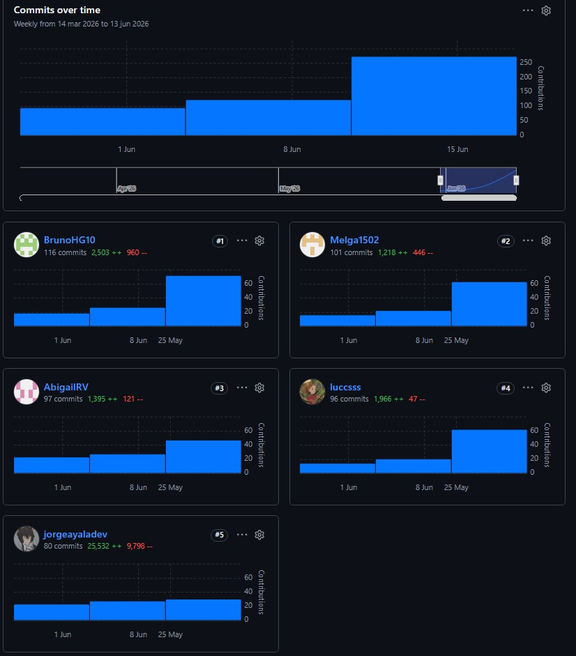
  <p><i><b>Fuente</b>: GitHub Insights del repositorio anitec-backend.</i></p>
</div>

<div align="center">
  <p>
    <b>Commits gráficas Landing page - Sprint 3</b>
  </p>
  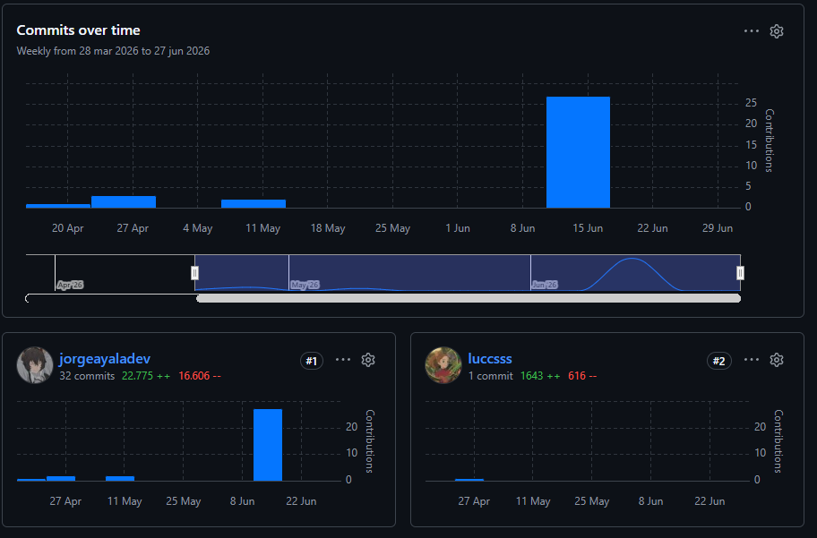
  <p><i><b>Fuente</b>: GitHub Insights del repositorio anitec-backend.</i></p>
</div>


<div align="center">
  <p>
    <b>Commits gráficas Frontend - Sprint 3</b>
  </p>
  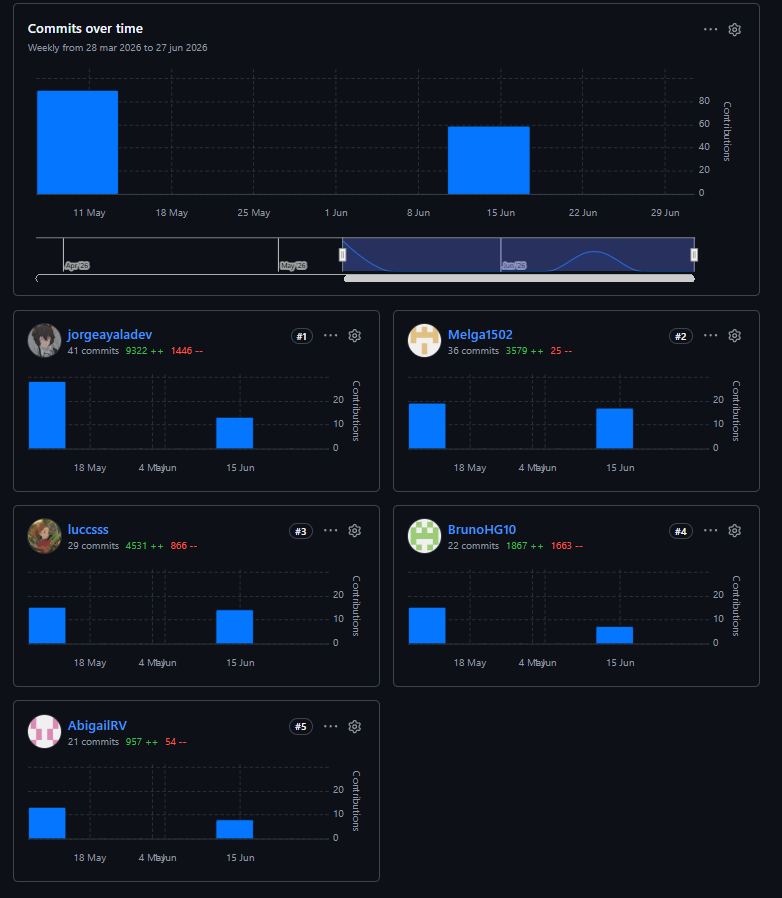
  <p><i><b>Fuente</b>: GitHub Insights del repositorio anitec-backend.</i></p>
</div>

**Reflexiones del Equipo:**

- Ayala Fernandez, Jorge Brayan: "El Sprint 3 permitió aplicar lo aprendido en clase sobre backend con ASP.NET Core. La implementación de IAM fue importante porque permitió pasar de usuarios demo a una autenticación con token, más cercana a una aplicación real. Además, la actualización de la landing page con los videos About the Team y About the Product ayudó a presentar mejor el valor de AniTec."

- Huaman Gallardo, Bruno Aldair: "La implementación de los módulos de ganadería y dispositivos ayudó a convertir los datos del frontend en entidades reales dentro de una base de datos. También fue importante llevar los dispositivos IoT al frontend mediante la ruta `/iot`, porque permitió probar el flujo completo desde la interfaz hasta los datos del backend."

- Melgarejo Quiroz, Josep Eliu: "Trabajar con Entity Framework Core y MySQL permitió entender mejor cómo las entidades del dominio se convierten en tablas reales. Las migraciones ayudaron a mantener la base de datos alineada con los cambios del backend. Además, integrar el frontend mediante `.env.development`, `BaseApi`, stores y assemblers permitió reemplazar gradualmente el consumo de datos mock."

- Raymundo Villarroel, Nadhim Abigail: "La implementación de eventos sanitarios y actividades permitió llevar al backend una parte esencial del seguimiento del ganado. El reto principal fue mantener consistencia entre los datos clínicos, los animales registrados y las vistas del frontend que consumen esta información."

- Sanchez Silva, Luciana Celeste: "El módulo de clientes veterinarios permitió representar la relación entre ganaderos y veterinarios dentro del backend. Esto es importante porque el veterinario necesita consultar únicamente la información de sus clientes asignados. La coordinación con el frontend permitió revisar que estas relaciones se puedan visualizar desde las pantallas correspondientes."

**Lecciones Aprendidas:**

El equipo identifica las siguientes lecciones de este Sprint 3:

1. **La estructura por bounded contexts facilita el crecimiento del backend:** Separar los módulos permitió trabajar de forma ordenada y mantener responsabilidades claras.

2. **Entity Framework Core simplifica la persistencia:** Las migraciones permitieron crear y actualizar la base de datos sin escribir manualmente todo el SQL.

3. **La autenticación debe definirse temprano:** IAM es una base importante porque muchos módulos dependen de saber qué usuario está usando la aplicación.

4. **Los datos mock ayudaron a diseñar el backend:** El `db.json` del Sprint 2 sirvió como referencia para definir entidades, recursos y endpoints.

5. **Swagger facilita las pruebas manuales:** La documentación automática permitió probar endpoints sin depender todavía del frontend.

6. **MySQL requiere una configuración cuidadosa:** La cadena de conexión, credenciales y migraciones deben estar correctamente configuradas para evitar errores al ejecutar la API.

7. **Mantener patrones conocidos reduce la complejidad:** Usar Repository, Unit of Work, Command Services y Query Services permitió seguir una estructura parecida al backend trabajado en clase.

8. **La integración frontend-backend debe planificarse desde los endpoints:** Definir nombres de recursos, rutas y respuestas de API facilitó que el frontend pudiera consumir los datos mediante stores y assemblers.

9. **Los módulos IoT y Subscriptions requieren coordinación entre capas:** Para que `/iot` y `/subscriptions` funcionen correctamente, fue necesario alinear endpoints, modelos de datos, rutas del frontend y textos visibles para el usuario.

10. **La landing page también forma parte de la experiencia del producto:** Incorporar los videos About the Team y About the Product ayudó a explicar mejor la solución antes de que el usuario ingrese a la aplicación web.

<div style="page-break-before: always;"></div>

<br>
<br>

<div align="center">
    
</div>

<br>
<br>

# 5.2. Landing Page, Services & Applications Implementation.

<a id="toc-5-2-4-sprint-4"></a>
## 5.2.3. Sprint 3.

En el Sprint 3, el equipo de AniTec se enfocó en la construcción del backend real de la aplicación web, reemplazando la dependencia inicial de servicios mock por una API REST desarrollada con ASP.NET Core, Entity Framework Core y MySQL. El objetivo principal fue implementar la capa de servicios necesaria para almacenar, consultar y procesar los datos de la plataforma de forma persistente, manteniendo una estructura similar a la trabajada en clase con el proyecto `learning-center-platform-master`.

Durante este Sprint se desarrolló el proyecto `anitec-platform-main`, organizado mediante bounded contexts y siguiendo una arquitectura por capas. El backend implementa autenticación, gestión de usuarios, perfiles, fincas, animales, eventos sanitarios, actividades, registros financieros, reportes, clientes veterinarios, dispositivos, métricas de dispositivos y suscripciones. También se configuraron migraciones automáticas con Entity Framework Core para MySQL, documentación con Swagger y datos iniciales para facilitar las pruebas de integración con el frontend.

<a id="toc-5-2-4-1-sprint-planning-4"></a>
### 5.2.3.1. Sprint Planning 3.

El Sprint Planning del Sprint 3 tuvo como objetivo definir el alcance para la implementación del backend de AniTec. A partir de lo avanzado en el Sprint 2, donde el frontend consumía datos desde `my-json-server`, el equipo identificó la necesidad de desarrollar una API propia que permita manejar reglas de negocio, persistencia real y una integración más cercana al funcionamiento final del producto.

Se decidió construir el backend utilizando ASP.NET Core y Entity Framework Core, ya que estas tecnologías fueron trabajadas durante las clases del curso. Además, se eligió MySQL como sistema gestor de base de datos porque fue la tecnología indicada para el desarrollo de backend en esta etapa del curso.

Durante la planificación se definieron los bounded contexts principales, las responsabilidades de cada integrante y las funcionalidades mínimas necesarias para que el backend pueda reemplazar progresivamente al servicio mock utilizado en el Sprint 2.

<table align="center" border="1" cellpadding="8" cellspacing="0" style="border-collapse: collapse; width: 100%; font-family: Arial, sans-serif;">
    <tbody>
        <tr>
            <td><b>Sprint #</b></td>
            <td>Sprint 3</td>
        </tr>
        <tr>
            <td colspan="2"><b>Sprint Planning Background</b></td>
        </tr>
        <tr>
            <td>Date</td>
            <td>2026-06-05</td>
        </tr>
        <tr>
            <td>Time</td>
            <td>10:00 AM</td>
        </tr>
        <tr>
            <td>Location</td>
            <td>Reunión virtual via Discord - Canal #sprint-planning</td>
        </tr>
        <tr>
            <td>Prepared by</td>
            <td>Melgarejo Quiroz, Josep Eliu</td>
        </tr>
        <tr>
            <td>Attendees (to planning meeting)</td>
            <td>Jorge Ayala, Bruno Huaman, Josep Melgarejo, Nadhim Raymundo, Luciana Sanchez</td>
        </tr>
        <tr>
            <td>Sprint n - 1 Review Summary</td>
            <td>El Sprint 2 permitió construir la aplicación web frontend de AniTec con Vue 3, PrimeVue, Pinia, Vue Router, módulos por bounded context y consumo de datos mediante una API REST mock con my-json-server.</td>
        </tr>
        <tr>
            <td>Sprint n - 1 Retrospective Summary</td>
            <td>El equipo identificó que el uso de datos mock permitió avanzar rápidamente en el frontend, pero limitaba la validación de reglas de negocio, persistencia real, autenticación segura y operaciones entre módulos. Por ello, se priorizó el desarrollo del backend en el Sprint 3.</td>
        </tr>
        <tr>
            <td colspan="2"><b>Sprint Goal / User Stories</b></td>
        </tr>
        <tr>
            <td>Sprint 3 Goal</td>
            <td>Nuestro enfoque está en implementar el backend real de AniTec con ASP.NET Core, Entity Framework Core y MySQL, manteniendo una arquitectura por bounded contexts similar a la desarrollada en clase. Creemos que esto permitirá reemplazar progresivamente la API mock y dar soporte real a la autenticación, gestión ganadera, sanidad, finanzas, analíticas, dispositivos y suscripciones. Esto se confirmará cuando la API pueda compilar, ejecutar migraciones, exponer endpoints REST documentados y responder correctamente a las consultas principales del frontend.</td>
        </tr>
        <tr>
            <td>Sprint 3 Velocity</td>
            <td>El equipo estimó un velocity de 45 Story Points, enfocado en la construcción del backend, configuración de persistencia, implementación de bounded contexts, endpoints REST y documentación de servicios.</td>
        </tr>
        <tr>
            <td>Sprint of Story Points</td>
            <td>Total: 45 SP - Distribuidos en 5 SP para configuración base, 8 SP para persistencia con MySQL, 8 SP para IAM con JWT, 8 SP para bounded contexts de gestión ganadera, 6 SP para analíticas y clientes veterinarios, 6 SP para dispositivos, métricas y suscripciones, y 4 SP para documentación y pruebas con Swagger.</td>
        </tr>
    </tbody>
</table>

El Sprint Planning Meeting del Sprint 3 duró aproximadamente 2.5 horas. El equipo revisó la estructura del backend usado como referencia en clase, definió los bounded contexts necesarios para AniTec y acordó mantener patrones conocidos como Repository, Unit of Work, Command Services, Query Services, REST Resources y Entity Framework Core para la persistencia.

**Technical Stories incluidas en el Sprint 3:**

| ID     | Technical Story                                                     | Prioridad   | Story Points |
| ------ | ------------------------------------------------------------------- | ----------- | ------------ |
| TS-005 | Configuración inicial del backend con ASP.NET Core                  | Must Have   | 5            |
| TS-006 | Persistencia con Entity Framework Core y MySQL                      | Must Have   | 8            |
| TS-007 | Autenticación backend con JWT y BCrypt                              | Must Have   | 8            |
| TS-008 | Implementación de bounded contexts de gestión ganadera              | Must Have   | 8            |
| TS-009 | Servicios backend para analíticas y clientes veterinarios           | Should Have | 6            |
| TS-010 | Servicios backend para dispositivos, métricas y suscripciones       | Should Have | 6            |
| TS-011 | Documentación y pruebas de API con Swagger                          | Should Have | 4            |

La selección de estas Technical Stories responde a la necesidad de construir la base de datos y la lógica principal del sistema. El equipo priorizó primero la configuración del backend, IAM y persistencia, ya que estos elementos sirven como base para el consumo posterior desde el frontend.

**Distribución de Trabajo por Componente:**

- **Backend ASP.NET Core:** 45 Story Points - Enfocados en la creación del proyecto `anitec-platform-main`, organización por bounded contexts, configuración de MySQL, migraciones, endpoints REST, autenticación JWT, seed de datos y documentación Swagger.

<a id="toc-5-2-4-2-aspect-leaders-and-collaborators"></a>
### 5.2.3.2. Aspects Leaders and Collaborators.

En esta sección el equipo elabora el artefacto Leadership-and-Collaboration Matrix (LACX) para el Sprint 3, indicando por cada aspecto dentro del alcance del Sprint quién es el líder y quiénes son colaboradores.

Para este tercer Sprint, los aspectos están centrados en el desarrollo del backend de AniTec, abarcando desde la configuración inicial del proyecto ASP.NET Core hasta la implementación de bounded contexts, persistencia con MySQL, migraciones y documentación de servicios.

**Aspectos del Sprint 3:**

1. **Backend - Configuración y Arquitectura Base:** Creación de la solución ASP.NET Core, configuración de Swagger, CORS, inyección de dependencias, Entity Framework Core y estructura de carpetas.
2. **Backend - IAM y Profiles:** Implementación de usuarios basicas
3. **Backend - Livestock, Sanitary y Activities:** Implementación de fincas, animales, eventos sanitarios y actividades de granja mediante entidades, comandos, consultas, servicios y controladores REST.
4. **Backend - Financial y Analytics:** Implementación de registros financieros, report metrics y endpoints de dashboard para ganaderos y veterinarios.
5. **Backend - Clients, Devices y Metrics:** Implementación de clientes veterinarios, dispositivos ganaderos y métricas generadas por dispositivos.
6. **Backend - Subscriptions y Payments:** Implementación de planes, suscripciones, pagos mock y preparación de campos para una futura integración con Stripe.
7. **Base de Datos, Migraciones y Seed:** Configuración de MySQL, migraciones de Entity Framework Core y datos iniciales para pruebas.
8. **Documentación:** Documentación técnica del Sprint, endpoints disponibles y evidencias de ejecución.

<table align="center" border="1" cellpadding="8" cellspacing="0" style="border-collapse: collapse; width: 100%; font-family: Arial, sans-serif;">
    <tbody>
        <tr>
            <td><b>Team Member (Last Name, First Name)</b></td>
            <td><b>GitHub Username</b></td>
            <td><b>Config/Arq Backend / L or C</b></td>
            <td><b>IAM & Profiles / L or C</b></td>
            <td><b>Livestock/Sanitary/Activities / L or C</b></td>
            <td><b>Financial/Analytics / L or C</b></td>
            <td><b>Clients/Devices/Metrics / L or C</b></td>
            <td><b>Subscriptions / L or C</b></td>
            <td><b>Documentación / L or C</b></td>
        </tr>
        <tr>
            <td>Ayala Fernandez, Jorge Brayan</td>
            <td>jorgeayaladev</td>
            <td>L</td>
            <td>L</td>
            <td>C</td>
            <td>C</td>
            <td>-</td>
            <td>C</td>
            <td>C</td>
        </tr>
        <tr>
            <td>Huaman Gallardo, Bruno Aldair</td>
            <td>BrunoHG10</td>
            <td>C</td>
            <td>C</td>
            <td>L</td>
            <td>C</td>
            <td>L</td>
            <td>-</td>
            <td>C</td>
        </tr>
        <tr>
            <td>Melgarejo Quiroz, Josep Eliu</td>
            <td>Melga1502</td>
            <td>L</td>
            <td>C</td>
            <td>C</td>
            <td>L</td>
            <td>C</td>
            <td>L</td>
            <td>L</td>
        </tr>
        <tr>
            <td>Raymundo Villarroel, Nadhim Abigail</td>
            <td>AbigailRV</td>
            <td>C</td>
            <td>C</td>
            <td>L</td>
            <td>C</td>
            <td>C</td>
            <td>-</td>
            <td>C</td>
        </tr>
        <tr>
            <td>Sanchez Silva, Luciana Celeste</td>
            <td>Luccsss</td>
            <td>C</td>
            <td>C</td>
            <td>C</td>
            <td>C</td>
            <td>L</td>
            <td>C</td>
            <td>C</td>
        </tr>
    </tbody>
</table>

**Distribución detallada de responsabilidades:**

- **Ayala Fernandez, Jorge Brayan (Configuración & IAM Lead):** Responsable de la configuración inicial del backend, autenticación, generación de tokens JWT, manejo de credenciales y endpoints de usuarios.

- **Huaman Gallardo, Bruno Aldair (Livestock & Devices Lead):** Responsable de los módulos relacionados con la gestión ganadera, incluyendo fincas, animales, dispositivos y métricas asociadas.

- **Melgarejo Quiroz, Josep Eliu (Financial, Analytics & Documentation Lead):** Responsable de registros financieros, reportes, dashboards, suscripciones, pagos mock y documentación del Sprint.

- **Raymundo Villarroel, Nadhim Abigail (Sanitary & Activities Lead):** Responsable de eventos sanitarios, actividades de granja y seguimiento de información clínica del ganado.

- **Sanchez Silva, Luciana Celeste (Clients Lead):** Responsable de la relación entre veterinarios y ganaderos, incluyendo clientes asignados, ganaderos disponibles y operaciones de asociación.

<a id="toc-5-2-4-3-sprint-backlog-4"></a>
### 5.2.3.3. Sprint Backlog 3.

El Sprint Backlog 3 tiene como objetivo principal implementar el backend de AniTec con una estructura modular y mantenible. Este backend permite centralizar la lógica de negocio, persistir datos en MySQL y exponer endpoints REST que serán consumidos por la aplicación web frontend.

El Sprint Backlog fue elaborado considerando las dependencias entre módulos. Primero se priorizó la configuración base del proyecto y la persistencia; luego se implementaron los bounded contexts principales; finalmente se añadieron endpoints de analítica, dispositivos, suscripciones y datos iniciales para pruebas.

**Trello Board:**
El equipo utiliza un Trello Board para gestionar visualmente el Sprint Backlog. El Board contiene las listas estándar de Scrum: "Sprint Goal", "To Do", "In Progress", "To Review" y "Done".

Enlace al tablero del Sprint Backlog 3: https://trello.com/invite/b/6a35c1fc2aa4cb4656e49c3b/ATTI8abaa26cc7e6f8b81250a5d3862a2d6574E3BF7E/sprint3-anitec

<div align="center">
    
    <p><i><b>Fuente</b>: Elaboración propia.</i></p>
</div>

**Estructura del Trello Board:**

- **Sprint Goal:** Lista que contiene el objetivo principal del Sprint.
- **To Do:** Lista con las tareas pendientes por iniciar.
- **In Progress:** Lista con las tareas que se encuentran en desarrollo.
- **To Review:** Lista con tareas completadas pendientes de revisión.
- **Done:** Lista con tareas aprobadas e integradas al backend.

A continuación, la tabla de control de estado para el Sprint 3:

<table align="center" border="1" cellpadding="8" cellspacing="0" style="border-collapse: collapse; width: 100%; font-family: Arial, sans-serif;">
    <tbody>
        <tr>
            <td><b>Sprint #</b></td>
            <td colspan="7">Sprint 3</td>
        </tr>
        <tr>
            <td colspan="2">User Story</td>
            <td colspan="6">Work-Item / Task</td>
        </tr>
        <tr>
            <td>Id</td>
            <td>Title</td>
            <td>Id</td>
            <td>Title</td>
            <td>Description</td>
            <td>Estimation (Hours)</td>
            <td>Assigned to</td>
            <td>Status</td>
        </tr>
        <tr>
            <td>TS-005</td>
            <td>Configuración inicial del backend con ASP.NET Core</td>
            <td>T001</td>
            <td>Configurar solución backend</td>
            <td>Crear la solución anitec-platform, configurar proyecto ASP.NET Core, Swagger, CORS, appsettings, estructura base y paquetes NuGet necesarios.</td>
            <td>5</td>
            <td>Ayala Fernandez, Jorge Brayan</td>
            <td>Done</td>
        </tr>
        <tr>
            <td>TS-006</td>
            <td>Persistencia con Entity Framework Core y MySQL</td>
            <td>T002</td>
            <td>Configurar persistencia con Entity Framework Core</td>
            <td>Crear AppDbContext, configurar conexión a MySQL, repositorio base, Unit of Work, convenciones de nombres, migraciones y seed de datos iniciales.</td>
            <td>8</td>
            <td>Melgarejo Quiroz, Josep Eliu</td>
            <td>Done</td>
        </tr>
        <tr>
            <td>TS-007</td>
            <td>Autenticación backend con JWT y BCrypt</td>
            <td>T003</td>
            <td>Implementar usuarios, sign-in y sign-up</td>
            <td>Crear entidades, comandos, consultas, servicios, recursos REST y controladores para autenticación, registro de usuarios, hashing de contraseñas y generación de JWT.</td>
            <td>8</td>
            <td>Ayala Fernandez, Jorge Brayan</td>
            <td>In progress</td>
        </tr>
        <tr>
            <td>TS-008</td>
            <td>Implementación de bounded contexts de gestión ganadera</td>
            <td>T004</td>
            <td>Implementar Livestock</td>
            <td>Crear bounded context para fincas y animales, incluyendo entidades Herd y Animal, repositorios, servicios de comando/consulta y controladores REST.</td>
            <td>4</td>
            <td>Huaman Gallardo, Bruno Aldair</td>
            <td>Done</td>
        </tr>
        <tr>
            <td>TS-008</td>
            <td>Implementación de bounded contexts de gestión ganadera</td>
            <td>T005</td>
            <td>Implementar Sanitary y Activities</td>
            <td>Crear endpoints para eventos sanitarios y actividades de granja, siguiendo la estructura de commands, queries, resources y assemblers.</td>
            <td>4</td>
            <td>Raymundo Villarroel, Nadhim Abigail</td>
            <td>Done</td>
        </tr>
        <tr>
            <td>TS-009</td>
            <td>Servicios backend para analíticas y clientes veterinarios</td>
            <td>T006</td>
            <td>Implementar Analytics y Clients</td>
            <td>Crear endpoints para dashboards, resúmenes sanitarios/financieros, clientes asignados al veterinario y ganaderos disponibles.</td>
            <td>6</td>
            <td>Sanchez Silva, Luciana Celeste</td>
            <td>Done</td>
        </tr>
        <tr>
            <td>TS-010</td>
            <td>Servicios backend para dispositivos, métricas y suscripciones</td>
            <td>T007</td>
            <td>Implementar Devices, Metrics y Subscriptions</td>
            <td>Crear endpoints para dispositivos, métricas generadas por sensores, planes de suscripción, suscripciones, pagos mock y mock checkout.</td>
            <td>6</td>
            <td>Huaman Gallardo, Bruno Aldair</td>
            <td>Done</td>
        </tr>
        <tr>
            <td>TS-011</td>
            <td>Documentación y pruebas de API con Swagger</td>
            <td>T008</td>
            <td>Documentar y probar endpoints REST</td>
            <td>Verificar Swagger, compilar el proyecto, ejecutar la API, probar endpoints principales y documentar evidencias del Sprint.</td>
            <td>4</td>
            <td>Melgarejo Quiroz, Josep Eliu</td>
            <td>Done</td>
        </tr>
    </tbody>
</table>

El Sprint Backlog refleja 8 tareas principales, con aproximadamente 45 horas de trabajo estimadas. Cada tarea fue planificada considerando la complejidad técnica, las dependencias entre bounded contexts y la necesidad de mantener una estructura similar al backend trabajado en clase.

<a id="toc-5-2-4-4-development-evidence-for-sprint-review"></a>
### 5.2.3.4. Development Evidence for Sprint Review.

En esta sección se presentan los avances de implementación realizados durante el Sprint 3 con relación al backend de AniTec. La evidencia muestra que el equipo logró construir una API funcional, conectada a MySQL y preparada para integrarse con el frontend.

Durante el Sprint 3, el equipo completó la implementación del proyecto `anitec-platform-main`. El backend fue construido utilizando ASP.NET Core, Entity Framework Core, MySQL, JWT y BCrypt. La estructura interna sigue una organización por bounded contexts con capas de dominio, aplicación, infraestructura e interfaces REST.

**Resumen de Avances Implementados:**

- **Creación del proyecto backend:** Solución `anitec-platform.sln` con proyecto principal `Anitec.Platform`.
- **Configuración de ASP.NET Core:** Uso de controladores REST, Swagger/OpenAPI, CORS, configuración por ambiente y middleware de errores.
- **Persistencia con MySQL:** Configuración de `AppDbContext`, repositorios, Unit of Work y migraciones de Entity Framework Core.
- **Autenticación JWT:** Implementación de sign-in, sign-up, hashing de contraseñas con BCrypt y emisión de token.
- **Arquitectura por bounded contexts:** Implementación de Shared, IAM, Profiles, Livestock, Sanitary, Activities, Financial, Analytics, Clients, Devices, Metrics y Subscriptions.
- **Servicios de aplicación:** Uso de Command Services y Query Services para separar operaciones de escritura y lectura.
- **REST Resources:** Uso de recursos y assemblers para transformar entidades de dominio en respuestas de API.
- **Seed de datos:** Carga inicial de usuarios, fincas, animales, eventos, dispositivos, planes y suscripciones para pruebas.
- **Migraciones automáticas:** Configuración para aplicar migraciones pendientes al ejecutar la API.

**Estructura principal del backend:**

```text
anitec-platform-main/
├── Anitec.Platform/
│   ├── Activities/
│   ├── Analytics/
│   ├── Clients/
│   ├── Devices/
│   ├── Financial/
│   ├── Iam/
│   ├── Livestock/
│   ├── Metrics/
│   ├── Profiles/
│   ├── Sanitary/
│   ├── Shared/
│   └── Subscriptions/
├── anitec-platform.sln
└── README.md
```

**Commits Realizados:**

| Repository           | Branch | Commit id | Commit Message                            | Commit Message Body                                           | Committed on (Date) |
| -------------------- | ------ | --------- | ----------------------------------------- | ------------------------------------------------------------- | ------------------- |
| anitec-platform-main | develop | a7f3c91 | chore: initial-folder-structure | Creación de la estructura base del backend ASP.NET Core, carpetas por bounded context y configuración inicial de dependencias. | 01/06/2026 |
| anitec-platform-main | feature/get-all-herds | 4b83e0d | feat: create herds controller | Creación del controlador REST para exponer operaciones principales de hatos. | 02/06/2026 |
| anitec-platform-main | feature/get-all-users | 74b5e23 | feat: implement get all users endpoint | Implementación del endpoint `GET /users` para consultar usuarios registrados en la plataforma. | 02/06/2026 |
| anitec-platform-main | feature/get-all-herds | e41fc9a | feat: add herds query service | Implementación del servicio de consultas para listar hatos desde la base de datos. | 03/06/2026 |
| anitec-platform-main | feature/get-all-animals | 39eb2fd | feat: map animal resource response | Definición de recursos REST y assembler para devolver animales con especie, raza, peso, estado y hato asociado. | 03/06/2026 |
| anitec-platform-main | develop | 0a9d8bf | Merge pull request #33 from upc-1asi0730-2610-12206-titan-team-4/feature/get-all-herds | Integración del listado de hatos al branch de desarrollo. | 04/06/2026 |
| anitec-platform-main | feature/get-user-by-id | d24ab70 | feat: implement get user by id endpoint | Implementación del endpoint `GET /users/{id}` para consultar un usuario específico mediante su identificador. | 04/06/2026 |
| anitec-platform-main | feature/add-new-health-event | d80a2bf | feat: create health event command | Creación del comando de aplicación para registrar vacunas, diagnósticos, tratamientos y seguimientos. | 05/06/2026 |
| anitec-platform-main | feature/get-all-animals | 5a73b6e | feat: implement get all animals endpoint | Implementación del endpoint `GET /animals` para consultar animales registrados. | 05/06/2026 |
| anitec-platform-main | feature/add-new-herd | 92d7ac1 | feat: implement add new herd endpoint | Implementación del endpoint `POST /herds` para registrar nuevos hatos o unidades productivas. | 06/06/2026 |
| anitec-platform-main | feature/get-all-financial-records | e7b30f1 | feat: add financial record repository | Implementación del repositorio para consultar ingresos y egresos persistidos en MySQL. | 06/06/2026 |
| anitec-platform-main | feature/get-all-health-events | b6d14ca | feat: implement get all health events endpoint | Implementación del endpoint `GET /health-events` para consultar vacunas, tratamientos e incidencias. | 07/06/2026 |
| anitec-platform-main | develop | 21d9f5e | Merge pull request #36 from upc-1asi0730-2610-12206-titan-team-4/feature/get-all-animals | Integración del listado de animales al branch de desarrollo. | 07/06/2026 |
| anitec-platform-main | feature/get-rancher-dashboard | 2ed4b73 | feat: build rancher dashboard summary | Implementación del resumen de animales, hatos, eventos sanitarios y métricas principales para ganaderos. | 08/06/2026 |
| anitec-platform-main | feature/add-new-health-event | 11ae7d9 | feat: expose add health event endpoint | Exposición del endpoint `POST /health-events` para registrar eventos sanitarios desde la aplicación web. | 08/06/2026 |
| anitec-platform-main | feature/get-all-farm-events | 1c7d80e | feat: implement get all farm events endpoint | Implementación del endpoint `GET /farm-events` para consultar actividades, visitas y tareas programadas. | 09/06/2026 |
| anitec-platform-main | feature/get-clients-by-veterinarian | 6fa28c0 | feat: create veterinarian clients resource | Creación de recursos REST para representar clientes asignados a un veterinario. | 09/06/2026 |
| anitec-platform-main | develop | 63fa0dd | Merge pull request #39 from upc-1asi0730-2610-12206-titan-team-4/feature/get-all-health-events | Integración de la consulta de eventos sanitarios al branch de desarrollo. | 10/06/2026 |
| anitec-platform-main | feature/get-all-devices | 58d14e7 | feat: implement get all devices endpoint | Implementación del endpoint `GET /devices` para listar dispositivos IoT asociados a animales o hatos. | 10/06/2026 |
| anitec-platform-main | feature/get-veterinarian-dashboard | cb8a3e5 | feat: implement veterinarian dashboard endpoint | Implementación del endpoint `GET /analytics/veterinarians/{veterinarianId}/dashboard` para mostrar clientes, pacientes y eventos sanitarios. | 11/06/2026 |
| anitec-platform-main | feature/get-clients-by-veterinarian | 47bd918 | feat: implement get clients by veterinarian endpoint | Implementación del endpoint `GET /veterinarian/{veterinarianId}/clients` para listar ganaderos asignados. | 11/06/2026 |
| anitec-platform-main | feature/get-active-subscription-by-user | 71ad8e0 | feat: implement active subscription query | Implementación de consulta para obtener la suscripción activa de un usuario. | 12/06/2026 |
| anitec-platform-main | develop | a4b9df0 | Merge pull request #43 from upc-1asi0730-2610-12206-titan-team-4/feature/get-rancher-dashboard | Integración del dashboard de ganadero al branch de desarrollo. | 12/06/2026 |
| anitec-platform-main | feature/get-device-latest-metric | f0e2a69 | feat: implement latest device metric endpoint | Implementación del endpoint `GET /devices/{id}/latest-metric` para obtener la última lectura registrada. | 13/06/2026 |
| anitec-platform-main | feature/add-client-to-veterinarian | bf5a127 | feat: implement add client to veterinarian endpoint | Implementación del endpoint `POST /veterinarian/{veterinarianId}/clients/{rancherId}` para asociar un ganadero a un veterinario. | 13/06/2026 |
| anitec-platform-main | feature/get-all-subscription-plans | 87a0d6c | feat: create subscription plan resource | Creación de recursos REST para representar planes de suscripción. | 14/06/2026 |
| anitec-platform-main | feature/get-all-subscription-plans | e314ac7 | feat: implement get all subscription plans endpoint | Implementación del endpoint `GET /subscription-plans` para listar planes disponibles. | 14/06/2026 |
| anitec-platform-main | feature/get-available-ranchers-for-veterinarian | 2a0fca9 | feat: implement available ranchers endpoint | Implementación del endpoint `GET /veterinarian/{veterinarianId}/available-ranchers` para consultar ganaderos disponibles. | 15/06/2026 |
| anitec-platform-main | develop | 47f8c2d | Merge pull request #69 from upc-1asi0730-2610-12206-titan-team-4/feature/get-clients-by-veterinarian | Integración de la consulta de clientes asignados al branch de desarrollo. | 15/06/2026 |
| anitec-platform-main | feature/get-payments-by-user | 4f2bc8a | feat: implement get payments by user endpoint | Implementación del endpoint `GET /subscriptions/users/{userId}/payments` para consultar pagos asociados a un usuario. | 16/06/2026 |
| anitec-platform-main | feature/mock-checkout | 9b8e430 | feat: create mock checkout command | Creación del flujo de comando para simular checkout y generar pagos de prueba. | 16/06/2026 |
| anitec-platform-main | feature/mock-checkout | 5e64a1d | feat: implement mock checkout endpoint | Implementación del endpoint `POST /subscriptions/mock-checkout` para validar pagos mock durante el Sprint. | 17/06/2026 |
| anitec-platform-main | feature/remove-client-from-veterinarian | 3fe60ab | feat: implement remove client from veterinarian endpoint | Implementación del endpoint `DELETE /veterinarian/{veterinarianId}/clients/{rancherId}` para retirar un cliente asignado. | 17/06/2026 |
| anitec-platform-main | develop | 92e03bf | Merge pull request #71 from upc-1asi0730-2610-12206-titan-team-4/feature/get-all-devices | Integración de dispositivos IoT y lectura de últimas métricas al branch de desarrollo. | 18/06/2026 |
| anitec-platform-main | hotfix/fix-dateonly-mysql-converters | c6a01de | fix: configure dateonly converters for mysql | Corrección de conversores DateOnly para evitar errores de persistencia y lectura en MySQL. | 18/06/2026 |
| anitec-platform-main | hotfix/fix-dateonly-mysql-converters | e0b71ac | fix: update migration snapshot dates | Ajuste del snapshot de migraciones para mantener consistencia con las columnas de fecha. | 18/06/2026 |
| anitec-platform-main | develop | d0af82c | Merge pull request #73 from upc-1asi0730-2610-12206-titan-team-4/hotfix/fix-dateonly-mysql-converters | Integración del hotfix de conversión de fechas al branch de desarrollo. | 19/06/2026 |
| anitec-platform-main | develop | 8f6d1be | Merge pull request #72 from upc-1asi0730-2610-12206-titan-team-4/feature/mock-checkout | Integración del flujo de pagos mock y suscripciones al branch de desarrollo. | 19/06/2026 |
| anitec-platform-main | main | 7e9c4b2 | Merge pull request #74 from upc-1asi0730-2610-12206-titan-team-4/develop | Integración final del Sprint 3 desde `develop` hacia `main`, consolidando endpoints, migraciones, seed de datos y documentación Swagger. | 19/06/2026 |

**Repositorio del Backend:**

https://github.com/upc-1asi0730-2610-12206-titan-team-4/anitec-backend.git

**Estadísticas del repositorio:**

- Total de bounded contexts implementados: 12
- Base de datos: MySQL
- ORM: Entity Framework Core
- Seguridad: JWT y BCrypt
- Documentación de servicios: Swagger/OpenAPI
- Migraciones generadas: 3
- Endpoints principales: autenticación, usuarios, perfiles, fincas, animales, sanidad, finanzas, actividades, analíticas, clientes, dispositivos, métricas y suscripciones.

<a id="toc-5-2-4-5-execution-evidence-for-sprint-review"></a>
### 5.2.3.5. Execution Evidence for Sprint Review.

Esta sección resume lo alcanzado en el Sprint 3 y presenta las principales evidencias de ejecución del backend. El objetivo fue comprobar que la API pueda compilar, ejecutar, aplicar migraciones, conectarse a MySQL y responder a peticiones HTTP desde Swagger o herramientas de prueba.

**Resumen de lo Alcanzado:**

El Sprint 3 permitió desarrollar el backend real de AniTec. El equipo logró configurar la solución ASP.NET Core, conectar la API con MySQL, implementar migraciones, crear datos iniciales y exponer endpoints REST para los módulos principales del sistema.

**Evidencias de ejecución:**

1. **Compilación del backend:** Se ejecutó el comando `dotnet build` para validar que el proyecto compile correctamente.

<div align="center">
    
    <p><i><b>Fuente</b>: Elaboración propia.</i></p>
</div>


**Funcionalidades implementadas en backend:**

1. **IAM:** Inicio de sesión, registro de usuarios, generación de token JWT y consulta de usuarios.
2. **Profiles:** Gestión de perfiles asociados a usuarios.
3. **Livestock:** Gestión de fincas y animales.
4. **Sanitary:** Gestión de eventos sanitarios y registros de salud.
5. **Activities:** Gestión de actividades y eventos de granja.
6. **Financial:** Gestión de ingresos, egresos y registros económicos.
7. **Analytics:** Dashboards y resúmenes para ganaderos y veterinarios.
8. **Clients:** Gestión de relación entre veterinarios y ganaderos.
9. **Devices:** Gestión de dispositivos como balanzas, collares inteligentes, cámaras térmicas, aretes de identificación, estaciones meteorológicas y sensores ambientales.
10. **Metrics:** Gestión de métricas generadas por dispositivos.
11. **Subscriptions:** Gestión de planes, suscripciones, pagos y mock checkout.
12. **Shared:** Repositorios base, Unit of Work, persistencia, recursos comunes y manejo de errores.

<a id="toc-5-2-4-6-services-documentation-evidence-for-sprint-review"></a>
### 5.2.3.6. Services Documentation Evidence for Sprint Review.

Para el Sprint 3, el equipo implementó una API REST real para AniTec utilizando ASP.NET Core. Esta API reemplaza progresivamente al servicio mock utilizado durante el Sprint 2 y permite que el frontend consuma información persistida en MySQL.

**Configuración del Servicio Backend:**

- **Plataforma:** ASP.NET Core
- **ORM:** Entity Framework Core
- **Base de datos:** MySQL
- **Autenticación:** JWT Bearer Token
- **Hashing de contraseñas:** BCrypt
- **Documentación:** Swagger/OpenAPI
- **Repositorio:** https://github.com/upc-1asi0730-2610-12206-titan-team-4/anitec-backend.git
- **URL pública del backend:** https://anitec-backend.onrender.com
- **Documentación pública:** https://anitec-backend.onrender.com/swagger/index.html

**Migraciones implementadas:**

| Migración | Descripción |
| --------- | ----------- |
| `20260605202323_InitialCreate` | Creación inicial de tablas principales del sistema. |
| `20260607213722_AddRolesClientsAndMockPayments` | Agrega roles, clientes veterinarios y pagos mock. |
| `20260607235600_AddDateOnlyConverters` | Ajustes para conversión de fechas con DateOnly. |

**Endpoints principales implementados:**

| Bounded Context | Método | Endpoint | Descripción |
| --------------- | ------ | -------- | ----------- |
| IAM | POST | `/api/v1/authentication/sign-in` | Inicio de sesión de usuarios registrados y generación de token JWT. |
| IAM | POST | `/api/v1/authentication/sign-up` | Registro de nuevos usuarios con contraseña encriptada. |
| IAM | GET | `/api/v1/users` | Consulta de usuarios del sistema. |
| IAM | GET | `/api/v1/users/{id}` | Consulta de un usuario por identificador. |
| Profiles | GET | `/api/v1/profiles` | Consulta de perfiles registrados. |
| Profiles | GET | `/api/v1/profiles/{profileId}` | Consulta de un perfil por identificador. |
| Profiles | POST | `/api/v1/profiles` | Creación de perfiles de usuario. |
| Livestock | GET | `/api/v1/herds` | Consulta de hatos o unidades productivas. |
| Livestock | GET | `/api/v1/herds/{id}` | Consulta de un hato por identificador. |
| Livestock | POST | `/api/v1/herds` | Registro de nuevos hatos. |
| Livestock | PUT | `/api/v1/herds/{id}` | Actualización de información de un hato. |
| Livestock | DELETE | `/api/v1/herds/{id}` | Eliminación de un hato registrado. |
| Livestock | GET | `/api/v1/animals` | Consulta de animales registrados. |
| Livestock | GET | `/api/v1/animals/{id}` | Consulta de un animal por identificador. |
| Livestock | POST | `/api/v1/animals` | Registro de nuevos animales. |
| Livestock | PUT | `/api/v1/animals/{id}` | Actualización de información de un animal. |
| Livestock | DELETE | `/api/v1/animals/{id}` | Eliminación de un animal registrado. |
| Sanitary | GET | `/api/v1/health-events` | Consulta de eventos sanitarios. |
| Sanitary | GET | `/api/v1/health-events/{id}` | Consulta de un evento sanitario por identificador. |
| Sanitary | POST | `/api/v1/health-events` | Registro de vacunas, tratamientos, diagnósticos o incidencias. |
| Sanitary | PUT | `/api/v1/health-events/{id}` | Actualización de un evento sanitario. |
| Sanitary | DELETE | `/api/v1/health-events/{id}` | Eliminación de un evento sanitario. |
| Financial | GET | `/api/v1/financial-records` | Consulta de ingresos y egresos ganaderos. |
| Financial | GET | `/api/v1/financial-records/{id}` | Consulta de un registro financiero por identificador. |
| Financial | POST | `/api/v1/financial-records` | Registro de ingresos o gastos. |
| Financial | PUT | `/api/v1/financial-records/{id}` | Actualización de un registro financiero. |
| Financial | DELETE | `/api/v1/financial-records/{id}` | Eliminación de un registro financiero. |
| Activities | GET | `/api/v1/farm-events` | Consulta de actividades, visitas o tareas de granja. |
| Activities | GET | `/api/v1/farm-events/{id}` | Consulta de una actividad por identificador. |
| Activities | POST | `/api/v1/farm-events` | Registro de nuevas actividades de granja. |
| Activities | PUT | `/api/v1/farm-events/{id}` | Actualización de una actividad. |
| Activities | DELETE | `/api/v1/farm-events/{id}` | Eliminación de una actividad. |
| Analytics | GET | `/api/v1/analytics/ranchers/{rancherId}/dashboard` | Dashboard de métricas principales para ganaderos. |
| Analytics | GET | `/api/v1/analytics/veterinarians/{veterinarianId}/dashboard` | Dashboard de métricas principales para veterinarios. |
| Analytics | GET | `/api/v1/analytics/ranchers/{rancherId}/health-summary` | Resumen sanitario del ganadero. |
| Analytics | GET | `/api/v1/analytics/ranchers/{rancherId}/financial-summary` | Resumen financiero del ganadero. |
| Analytics | GET | `/api/v1/report-metrics` | Consulta de métricas de reportes. |
| Analytics | GET | `/api/v1/report-metrics/{id}` | Consulta de una métrica de reporte por identificador. |
| Analytics | POST | `/api/v1/report-metrics` | Registro de métricas de reportes. |
| Analytics | PUT | `/api/v1/report-metrics/{id}` | Actualización de una métrica de reporte. |
| Analytics | DELETE | `/api/v1/report-metrics/{id}` | Eliminación de una métrica de reporte. |
| Clients | GET | `/api/v1/veterinarian/{veterinarianId}/clients` | Consulta de clientes asignados a un veterinario. |
| Clients | GET | `/api/v1/veterinarian/{veterinarianId}/available-ranchers` | Consulta de ganaderos disponibles para asociar. |
| Clients | POST | `/api/v1/veterinarian/{veterinarianId}/clients/{rancherId}` | Asociación de un ganadero a un veterinario. |
| Clients | DELETE | `/api/v1/veterinarian/{veterinarianId}/clients/{rancherId}` | Eliminación de la relación entre veterinario y ganadero. |
| Devices | GET | `/api/v1/devices` | Consulta de dispositivos IoT registrados. |
| Devices | GET | `/api/v1/devices/{id}` | Consulta de un dispositivo por identificador. |
| Devices | POST | `/api/v1/devices` | Registro de nuevos dispositivos IoT. |
| Devices | PUT | `/api/v1/devices/{id}` | Actualización de un dispositivo IoT. |
| Devices | DELETE | `/api/v1/devices/{id}` | Eliminación de un dispositivo IoT. |
| Devices | GET | `/api/v1/devices/{id}/metrics` | Consulta de métricas asociadas a un dispositivo. |
| Devices | GET | `/api/v1/devices/{id}/latest-metric` | Consulta de la última métrica registrada por un dispositivo. |
| Metrics | GET | `/api/v1/device-metrics` | Consulta de métricas de dispositivos. |
| Metrics | GET | `/api/v1/device-metrics/{id}` | Consulta de una métrica de dispositivo por identificador. |
| Metrics | POST | `/api/v1/device-metrics` | Registro de métricas de dispositivos. |
| Metrics | PUT | `/api/v1/device-metrics/{id}` | Actualización de una métrica de dispositivo. |
| Metrics | DELETE | `/api/v1/device-metrics/{id}` | Eliminación de una métrica de dispositivo. |
| Subscriptions | GET | `/api/v1/subscription-plans` | Consulta de planes de suscripción disponibles. |
| Subscriptions | GET | `/api/v1/subscription-plans/{id}` | Consulta de un plan de suscripción por identificador. |
| Subscriptions | POST | `/api/v1/subscription-plans` | Registro de nuevos planes de suscripción. |
| Subscriptions | PUT | `/api/v1/subscription-plans/{id}` | Actualización de un plan de suscripción. |
| Subscriptions | DELETE | `/api/v1/subscription-plans/{id}` | Eliminación de un plan de suscripción. |
| Subscriptions | GET | `/api/v1/subscriptions` | Consulta de suscripciones registradas. |
| Subscriptions | GET | `/api/v1/subscriptions/{id}` | Consulta de una suscripción por identificador. |
| Subscriptions | POST | `/api/v1/subscriptions` | Registro de nuevas suscripciones. |
| Subscriptions | PUT | `/api/v1/subscriptions/{id}` | Actualización de una suscripción. |
| Subscriptions | DELETE | `/api/v1/subscriptions/{id}` | Eliminación de una suscripción. |
| Subscriptions | GET | `/api/v1/subscriptions/users/{userId}/active` | Consulta de la suscripción activa de un usuario. |
| Subscriptions | GET | `/api/v1/subscriptions/users/{userId}/payments` | Consulta de pagos asociados a un usuario. |
| Subscriptions | POST | `/api/v1/subscriptions/mock-checkout` | Simulación de pago para pruebas del flujo de suscripción. |


**Swagger/OpenAPI:** Se verificó que la documentación de endpoints esté disponible en el navegador.

<div align="center">
    
    <p><i><b>Fuente</b>: Elaboración propia.</i></p>
</div>

<div align="center">
    
    <p><i><b>Fuente</b>: Elaboración propia.</i></p>
</div>

<div align="center">
    
    <p><i><b>Fuente</b>: Elaboración propia.</i></p>
</div>

<div align="center">
    
    <p><i><b>Fuente</b>: Elaboración propia.</i></p>
</div>

<div align="center">
    
    <p><i><b>Fuente</b>: Elaboración propia.</i></p>
</div>

<div align="center">
    
    <p><i><b>Fuente</b>: Elaboración propia.</i></p>
</div>

<div align="center">
    
    <p><i><b>Fuente</b>: Elaboración propia.</i></p>
</div>

**Estructura de capas aplicada:**

1. **Domain:** Entidades, comandos, consultas y contratos de repositorios.
2. **Application:** Command Services y Query Services para manejar casos de uso.
3. **Infrastructure:** Repositorios, Entity Framework Core, Unit of Work y servicios técnicos.
4. **Interfaces REST:** Controladores, recursos y assemblers para exponer la API.
5. **Shared:** Elementos comunes reutilizables en todos los bounded contexts.

**Variables y configuración:**

La cadena de conexión se configura en `appsettings.Development.json` y apunta a la base de datos MySQL local. También se dejó preparada la posibilidad de usar una variable de entorno para cambiar la conexión según el ambiente.

```json
"DefaultConnection": "server=localhost;user=root;password=password;database=anitec-platform"
```

<a id="toc-5-2-4-7-software-deployment-evidence-for-sprint-review"></a>
### 5.2.3.7. Software Deployment Evidence for Sprint Review.

Durante el Sprint 3, la evidencia de despliegue del backend se realizó en internet utilizando Render como plataforma de hosting. El objetivo de esta evidencia fue comprobar que la API de AniTec pueda ejecutarse fuera del entorno local, conectarse a una base de datos configurada para el ambiente de despliegue, aplicar las migraciones de Entity Framework Core y exponer sus endpoints mediante Swagger/OpenAPI.

Este despliegue permitió validar que los servicios backend desarrollados en ASP.NET Core pueden estar disponibles públicamente para ser consumidos por la aplicación web frontend. De esta manera, el backend deja de depender únicamente de la ejecución local y queda preparado para pruebas de integración en un entorno accesible desde internet.

**Configuración de despliegue en Render - Backend:**

- **Proyecto:** `anitec-platform-main`
- **Framework:** ASP.NET Core
- **Plataforma de despliegue:** Render
- **Tipo de servicio:** Web Service
- **Repositorio:** `https://github.com/upc-1asi0730-2610-12206-titan-team-4/anitec-backend.git`
- **Branch desplegada:** `main`
- **Proyecto de inicio:** `Anitec.Platform`
- **Base de datos:** MySQL configurada para el ambiente de despliegue
- **URL pública del backend:** https://anitec-backend.onrender.com
- **Documentación pública:** https://anitec-backend.onrender.com/swagger/index.html
- **Archivo de configuración base:** `appsettings.json`
- **Variables de entorno:** cadena de conexión, ambiente de ejecución y configuración de token JWT

**Procedimiento de despliegue en Render:**

1. Crear un nuevo Web Service en Render.
2. Conectar el repositorio de GitHub del backend de AniTec.
3. Seleccionar la rama `main` como fuente del despliegue.
4. Configurar el proyecto ASP.NET Core indicando como proyecto principal `Anitec.Platform`.
5. Definir las variables de entorno necesarias para el ambiente de producción o staging.
6. Configurar la cadena de conexión de MySQL para que el backend pueda acceder a la base de datos remota.
7. Ejecutar el proceso de build del backend desde Render.
8. Iniciar el servicio web y verificar que la API quede disponible mediante la URL pública generada.
9. Abrir la documentación Swagger desde la URL pública del backend.
10. Probar endpoints principales como autenticación, usuarios, animales, hatos, dispositivos y suscripciones.

<div align="center">
    
    <p><i><b>Fuente</b>: Elaboración propia.</i></p>
</div>

<div align="center">
    
    <p><i><b>Fuente</b>: Elaboración propia.</i></p>
</div>

<div align="center">
    
    <p><i><b>Fuente</b>: Elaboración propia.</i></p>
</div>

**Verificación Post-Despliegue:**

Después de desplegar el backend en Render, se verificaron los siguientes puntos:

- Render compila correctamente el proyecto `Anitec.Platform`.
- El servicio web se inicia correctamente desde la plataforma.
- El backend queda disponible mediante una URL pública.
- Swagger muestra los controladores y endpoints implementados desde internet.
- La conexión con la base de datos MySQL configurada para despliegue se realiza correctamente.
- Entity Framework Core valida y aplica las migraciones necesarias sobre la base de datos.
- La base de datos contiene las tablas y datos semilla necesarios para pruebas.
- El endpoint de autenticación responde correctamente y devuelve un token JWT.
- Los endpoints principales de usuarios, hatos, animales, sanidad, finanzas, actividades, analíticas, dispositivos y suscripciones responden desde Swagger.
- El backend mantiene una estructura modular por bounded contexts, lo que facilita su integración con el frontend.

<a id="toc-5-2-4-8-team-collaboration-insights-during-sprint"></a>
### 5.2.3.8. Team Collaboration Insights during Sprint.

En esta sección el equipo explica cómo se desarrollaron las actividades de implementación del backend y se presentan los analíticos de colaboración y commits realizados durante el Sprint 3.

**Distribución de Trabajo:**

Todos los miembros del equipo participaron en la construcción del backend según las responsabilidades definidas en la matriz LACX. El equipo trabajó manteniendo reuniones de coordinación para revisar la estructura del proyecto, resolver dudas sobre Entity Framework Core, coordinar nombres de endpoints y asegurar que la API mantenga compatibilidad con los módulos ya desarrollados en el frontend.

El trabajo colaborativo se apoyó en GitHub para el control de versiones y en Discord para la comunicación diaria. Las revisiones se enfocaron principalmente en mantener la misma estructura de carpetas en cada bounded context, reutilizar los patrones aprendidos en clase y evitar soluciones demasiado avanzadas que se alejen del nivel técnico trabajado durante el curso.

**Métricas de Colaboración:**

<div align="center">
  <p>
    <b>Commits gráficas - Sprint 3</b>
  </p>
  
</div>

**Reflexiones del Equipo:**

- Ayala Fernandez, Jorge Brayan: "El Sprint 3 permitió aplicar lo aprendido en clase sobre backend con ASP.NET Core. La implementación de IAM fue importante porque permitió pasar de usuarios demo a una autenticación con token, más cercana a una aplicación real."

- Huaman Gallardo, Bruno Aldair: "La implementación de los módulos de ganadería y dispositivos ayudó a convertir los datos del frontend en entidades reales dentro de una base de datos. Fue importante mantener la separación por bounded contexts para que el código sea más ordenado."

- Melgarejo Quiroz, Josep Eliu: "Trabajar con Entity Framework Core y MySQL permitió entender mejor cómo las entidades del dominio se convierten en tablas reales. Las migraciones ayudaron a mantener la base de datos alineada con los cambios del backend."

- Raymundo Villarroel, Nadhim Abigail: "La implementación de eventos sanitarios y actividades permitió llevar al backend una parte esencial del seguimiento del ganado. El reto principal fue mantener consistencia entre los datos clínicos y los animales registrados."

- Sanchez Silva, Luciana Celeste: "El módulo de clientes veterinarios permitió representar la relación entre ganaderos y veterinarios dentro del backend. Esto es importante porque el veterinario necesita consultar únicamente la información de sus clientes asignados."

**Lecciones Aprendidas:**

El equipo identifica las siguientes lecciones de este Sprint 3:

1. **La estructura por bounded contexts facilita el crecimiento del backend:** Separar los módulos permitió trabajar de forma ordenada y mantener responsabilidades claras.

2. **Entity Framework Core simplifica la persistencia:** Las migraciones permitieron crear y actualizar la base de datos sin escribir manualmente todo el SQL.

3. **La autenticación debe definirse temprano:** IAM es una base importante porque muchos módulos dependen de saber qué usuario está usando la aplicación.

4. **Los datos mock ayudaron a diseñar el backend:** El `db.json` del Sprint 2 sirvió como referencia para definir entidades, recursos y endpoints.

5. **Swagger facilita las pruebas manuales:** La documentación automática permitió probar endpoints sin depender todavía del frontend.

6. **MySQL requiere una configuración cuidadosa:** La cadena de conexión, credenciales y migraciones deben estar correctamente configuradas para evitar errores al ejecutar la API.

7. **Mantener patrones conocidos reduce la complejidad:** Usar Repository, Unit of Work, Command Services y Query Services permitió seguir una estructura parecida al backend trabajado en clase.

<div style="page-break-before: always;"></div>

<a id="toc-5-3-validation-interviews"></a>
# 5.3. Validation Interviews

<a id="toc-5-3-1-diseno-de-entrevistas"></a>
## 5.3.1. Diseño de entrevistas

Las entrevistas de validación se plantean con el objetivo de evaluar la percepción de los usuarios después de interactuar con la landing page y la Web Application de AniTec. A diferencia de las entrevistas exploratorias realizadas en capítulos anteriores, esta etapa se enfoca en validar la claridad de la propuesta de valor, la facilidad de navegación, la comprensión de las funcionalidades principales y la utilidad percibida por los segmentos objetivo.

Para esta validación se consideran los dos segmentos principales definidos para AniTec:

- Ganaderos.
- Veterinarios.

La dinámica de la entrevista consiste en presentar primero la landing page de AniTec para observar si el usuario comprende el problema que busca resolver la solución, la confianza que transmite y la claridad de sus secciones. Posteriormente, se muestra la aplicación web iniciando sesión según el segmento correspondiente, con el fin de revisar el dashboard, el menú de navegación y los módulos principales asociados al perfil del usuario.

En el caso del segmento ganadero, la evaluación se orienta a la gestión de hatos, animales, eventos sanitarios, actividades, finanzas, dispositivos IoT y planes. En el caso del segmento veterinario, se evalúa la gestión de clientes asignados, pacientes por ganadero, información clínica, eventos sanitarios, actividades, analíticas e IoT. Al finalizar la demostración, el entrevistado responde un conjunto de preguntas diseñadas para recoger sus opiniones, dificultades y recomendaciones de mejora.

### Guía de preguntas para el segmento Ganadero

1. ¿A qué se dedica actualmente dentro de la actividad ganadera y qué tipo de animales maneja?
2. ¿Cómo registra hoy la información de sus animales, fincas, actividades o gastos?
3. Al ver el landing page de AniTec, ¿entiende rápidamente qué problema busca resolver la aplicación?
4. ¿La información del landing page le genera confianza para probar la aplicación? ¿Por qué?
5. ¿Qué sección del landing page le pareció más útil o clara?
6. ¿Hubo alguna parte del landing page que le pareció confusa, innecesaria o poco creíble?
7. Al iniciar sesión como ganadero, ¿le resultó claro hacia dónde debía ir primero?
8. ¿El dashboard ganadero le muestra información útil para tomar decisiones rápidas?
9. ¿Los nombres de las opciones del menú, como hatos, animales, sanidad, finanzas, actividades, IoT y planes, le resultan comprensibles?
10. ¿Le resultó fácil encontrar la lista de animales registrados?
11. ¿El formulario para agregar o editar un animal le parece claro y completo?
12. ¿Qué dato importante sobre un animal cree que falta registrar?
13. ¿Le resulta útil registrar eventos sanitarios como vacunas, tratamientos o incidencias?
14. ¿La sección de actividades le ayudaría a organizar tareas de la finca? ¿Qué tareas agregaría?
15. ¿La sección financiera le parece útil para controlar ingresos y gastos ganaderos?
16. ¿La sección de dispositivos IoT le parece comprensible para asociar dispositivos a animales o fincas?
17. ¿Qué tan fácil le parece interpretar el estado y las métricas de los dispositivos IoT?
18. ¿El lenguaje usado en la aplicación le parece cercano y fácil de entender?
19. ¿Qué parte de la aplicación le resultó más difícil de usar o encontrar?
20. Después de probar AniTec, ¿la usaría en su trabajo diario? ¿Qué tendría que mejorar para que sí la use?

### Guía de preguntas para el segmento Veterinario

1. ¿Cuál es su experiencia trabajando con ganaderos o productores pecuarios?
2. ¿Cómo organiza actualmente la información de sus clientes, pacientes y visitas?
3. Al ver el landing page de AniTec, ¿queda claro que también está pensada para veterinarios?
4. ¿Qué información del landing page le ayudó más a entender el valor de la aplicación?
5. ¿Qué información agregaría al landing page para que un veterinario confíe más en AniTec?
6. Al iniciar sesión como veterinario, ¿el dashboard le permite entender rápidamente su carga de trabajo?
7. ¿La opción de clientes asignados le parece clara y útil?
8. ¿Le resultó fácil agregar o revisar clientes ganaderos?
9. ¿La vista de pacientes por ganadero le ayuda a encontrar animales bajo seguimiento?
10. ¿Le parece adecuado que primero se seleccione un cliente para revisar sus fincas y animales?
11. ¿La información clínica de cada animal es suficiente para una revisión veterinaria básica?
12. ¿El formulario de eventos sanitarios permite registrar bien vacunas, diagnósticos, tratamientos o seguimientos?
13. ¿Qué campos médicos considera que faltan en el registro sanitario?
14. ¿La sección de actividades le serviría para programar visitas, controles o seguimientos?
15. ¿Las alertas o estados sanitarios son fáciles de identificar dentro del dashboard?
16. ¿La sección de analíticas le da información útil sobre clientes, animales o eventos sanitarios?
17. ¿La sección IoT le parece útil para monitorear animales o fincas de sus clientes?
18. ¿El menú y la organización de la aplicación coinciden con la forma en que usted trabaja?
19. ¿Hubo alguna pantalla, botón o texto que no entendió durante la prueba?
20. Después de probar AniTec, ¿la recomendaría como herramienta de apoyo veterinario? ¿Qué cambios serían prioritarios?

<a id="toc-5-3-2-registro-de-entrevistas"></a>
## 5.3.2. Registro de entrevistas

A continuación, se presentan los cuadros de registro para las entrevistas de validación. Estos cuadros serán completados manualmente con los datos del entrevistado, evidencia, enlace de la entrevista y transcripción correspondiente.

**Segmento Objetivo 1: Ganaderos**
<table>
  <tr>
    <th colspan="2">ENTREVISTA N°1</th>
  </tr>
  <tr><td><strong>Nombre del entrevistado</strong></td><td>Rodrigo Alfaro</td></tr>
  <tr><td><strong>Edad</strong></td><td>25</td></tr>
  <tr><td><strong>Profesión</strong></td><td>Ganadero</td></tr>
  <tr><td><strong>Departamento</strong></td><td>Lima</td></tr>
  <tr><td><strong>Inicio del video</strong></td><td>00:00:13</td></tr>
  <tr><td><strong>Fin del video</strong></td><td>00:09:36</td></tr>
  <tr><td><strong>Link del video</strong></td><td><a href="https://tinyurl.com/EntrevistaValidacionAlfaro">https://tinyurl.com/EntrevistaValidacionAlfaro</a></td></tr>
  <tr><td><strong>Foto entrevista</strong></td><td><div align="center">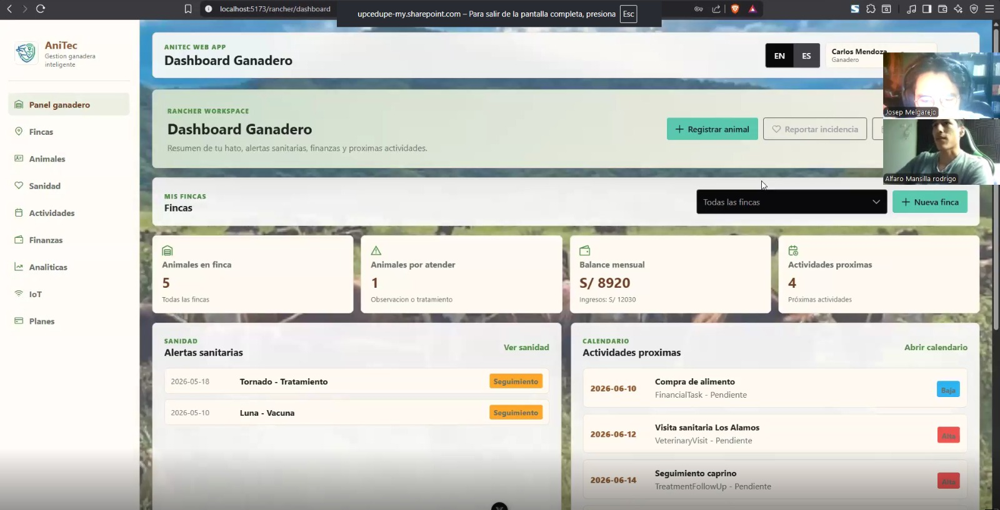</div></td></tr>
  <tr><td><strong>Resumen</strong></td><td>En la entrevista, el ganadero Rodrigo Alfaro comenta que trabaja en la crianza de bovinos, ovinos y aves en una finca familiar, donde actualmente registra la información de manera poco ordenada en cuadernos y Excel. Señala que AniTec le parece una solución clara y confiable para organizar mejor la gestión de sus animales, la sanidad, las actividades y las finanzas, destacando especialmente el dashboard y las funcionalidades principales. También sugiere mejoras como incluir más datos en el registro de animales, recordatorios automáticos, fotos y una versión móvil más práctica. En general, considera que la aplicación sería muy útil para su trabajo diario.</td></tr>
</table>

<br>

<table>
  <tr>
    <th colspan="2">ENTREVISTA N°2</th>
  </tr>
  <tr><td><strong>Nombre del entrevistado</strong></td><td>Kiara Gallardo</td></tr>
  <tr><td><strong>Edad</strong></td><td>22</td></tr>
  <tr><td><strong>Profesión</strong></td><td>Ganadero</td></tr>
  <tr><td><strong>Departamento</strong></td><td>Lima</td></tr>
  <tr><td><strong>Inicio del video</strong></td><td>00:06:30</td></tr>
  <tr><td><strong>Fin del video</strong></td><td>00:17:25</td></tr>
  <tr><td><strong>Link del video</strong></td><td><a href="https://tinyurl.com/EntrevistaValidacionGallardo">https://tinyurl.com/EntrevistaValidacionGallardo</a></td></tr>
  <tr><td><strong>Foto entrevista</strong></td><td><div align="center">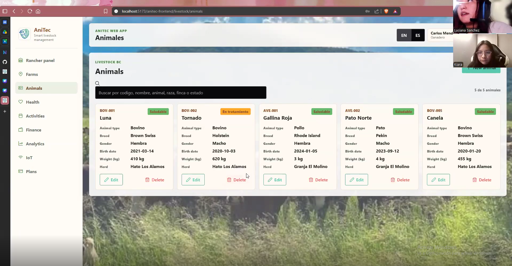</div></td></tr>
  <tr><td><strong>Resumen</strong></td><td>La ganadera Kiara señaló que actualmente gestiona información de su ganado mediante registros manuales y consideró que AniTec comunica de forma clara su propósito y beneficios desde el landing page. Destacó la facilidad para navegar por la aplicación, la utilidad del dashboard para visualizar información relevante y la claridad de las secciones relacionadas con animales, sanidad, actividades, finanzas e IoT. Asimismo, valoró positivamente las herramientas para registrar eventos sanitarios, organizar tareas y controlar ingresos y gastos de la finca. En general, tuvo una experiencia satisfactoria, no identificó dificultades importantes durante el uso y afirmó que utilizaría AniTec en sus actividades diarias, recomendando únicamente ampliar la cantidad de reportes y estadísticas disponibles para apoyar una mejor toma de decisiones.</td></tr>
</table>

<br>

<table>
  <tr>
    <th colspan="2">ENTREVISTA N°3</th>
  </tr>
  <tr><td><strong>Nombre del entrevistado</strong></td><td>Vicente</td></tr>
  <tr><td><strong>Edad</strong></td><td>61</td></tr>
  <tr><td><strong>Profesión</strong></td><td>Ganadero</td></tr>
  <tr><td><strong>Departamento</strong></td><td>Lima</td></tr>
  <tr><td><strong>Inicio del video</strong></td><td>00:00:00</td></tr>
  <tr><td><strong>Fin del video</strong></td><td>00:07:30</td></tr>
  <tr><td><strong>Link del video</strong></td><td><a href="https://tinyurl.com/EntrevistaValidacionVicente">https://tinyurl.com/EntrevistaValidacionVicente</a></td></tr>
  <tr><td><strong>Foto entrevista</strong></td><td><div align="center"></div></td></tr>
  <tr><td><strong>Resumen</strong></td><td>Entrevistado: Vicente, quien es ganadero y se dedica a la crianza de vacunos, lo cual aporta un perfil técnico y práctico necesario para validar la utilidad de la aplicación. Actualmente registra la información de sus animales, fincas, actividades y gastos en Excel. Considera que AniTec es útil para organizar actividades, controlar vacunas, tratamientos y alimentación. Sugiere incorporar variables como el tipo de suelo o clima para complementar la información sanitaria. También destaca el dashboard como una herramienta valiosa para centralizar información y facilitar la toma de decisiones.</td></tr>
</table>

<br>

<h3>Segmento Objetivo 2: Veterinarios</h3>

<br>

<table>
  <tr>
    <th colspan="2">ENTREVISTA N°4</th>
  </tr>
  <tr><td><strong>Nombre del entrevistado</strong></td><td>Andrea Solis</td></tr>
  <tr><td><strong>Edad</strong></td><td>24</td></tr>
  <tr><td><strong>Profesión</strong></td><td>Veterinario</td></tr>
  <tr><td><strong>Departamento</strong></td><td>Lima</td></tr>
  <tr><td><strong>Inicio del video</strong></td><td>00:00:00</td></tr>
  <tr><td><strong>Fin del video</strong></td><td>00:07:00</td></tr>
  <tr><td><strong>Link del video</strong></td><td><a href="https://tinyurl.com/EntrevistaValidacionSolis">https://tinyurl.com/EntrevistaValidacionSolis</a></td></tr>
  <tr><td><strong>Foto entrevista</strong></td><td><div align="center"></div></td></tr>
  <tr><td><strong>Resumen</strong></td><td>Andrea comenta que organiza la información de sus clientes y pacientes mediante cuadernos y Excel. Considera que AniTec comunica claramente que también está orientado a veterinarios. Destaca el historial médico, la comunicación con el ganadero y las estadísticas de salud. Sugiere agregar más campos clínicos como dosis, vía de administración y signos vitales, además de mejorar la explicación del seguimiento de visitas.</td></tr>
</table>

<br>

<table>
  <tr>
    <th colspan="2">ENTREVISTA N°5</th>
  </tr>
  <tr><td><strong>Nombre del entrevistado</strong></td><td>Hugo Jorge</td></tr>
  <tr><td><strong>Edad</strong></td><td>25</td></tr>
  <tr><td><strong>Profesión</strong></td><td>Veterinario</td></tr>
  <tr><td><strong>Departamento</strong></td><td>Lima</td></tr>
  <tr><td><strong>Inicio del video</strong></td><td>00:00:00</td></tr>
  <tr><td><strong>Fin del video</strong></td><td>00:04:30</td></tr>
  <tr><td><strong>Link del video</strong></td><td><a href="https://tinyurl.com/EntrevistaValidacionHugo">https://tinyurl.com/EntrevistaValidacionHugo</a></td></tr>
  <tr><td><strong>Foto entrevista</strong></td><td><div align="center"></div></td></tr>
  <tr><td><strong>Resumen</strong></td><td>El veterinario indicó que actualmente organiza la información mediante registros manuales y herramientas básicas. Valoró que AniTec centralice toda la información en una sola plataforma. Recomendó destacar mejor los beneficios para veterinarios en el landing page e incorporar más campos relacionados con tratamientos, historial clínico y vacunaciones. También resaltó la utilidad de las actividades, alertas, dashboard y analíticas para el seguimiento sanitario y la toma de decisiones.</td></tr>
</table>

<a id="toc-5-3-3-evaluaciones-segun-heuristicas"></a>
## 5.3.3. Evaluaciones según heurísticas

La evaluación heurística de AniTec se realizó a partir de las sesiones de validación con usuarios de los segmentos ganadero y veterinario. Durante estas sesiones, los entrevistados interactuaron con la landing page y con la aplicación web, revisando los flujos principales según su rol. La evaluación considera criterios de usabilidad, arquitectura de información e inclusive design, con el objetivo de identificar fortalezas, problemas de experiencia de usuario y oportunidades de mejora.

Para registrar los hallazgos se utilizó una escala de severidad simple:

| Severidad | Descripción |
| --------- | ----------- |
| 0 | No representa un problema de experiencia de usuario. |
| 1 | Problema menor que puede corregirse sin afectar el flujo principal. |
| 2 | Problema moderado que puede generar dudas o fricción en algunos usuarios. |
| 3 | Problema importante que puede dificultar el cumplimiento de una tarea. |
| 4 | Problema crítico que impide completar una tarea principal. |

**Evaluación heurística - Segmento Ganadero:**

| Criterio evaluado | Evidencia observada | Severidad | Recomendación |
| ----------------- | ------------------- | --------- | ------------- |
| Visibilidad del estado del sistema | El dashboard ganadero permite visualizar animales, hatos, eventos sanitarios y actividades principales. Sin embargo, algunas vistas podrían reforzar mensajes de carga o confirmación. | 1 | Mantener estados visibles de carga, éxito y error en formularios y listados. |
| Correspondencia entre el sistema y el mundo real | Los términos animales, hatos, sanidad, actividades, finanzas e IoT fueron comprensibles para los ganaderos entrevistados. | 0 | Mantener vocabulario cercano al contexto ganadero. |
| Control y libertad del usuario | Los usuarios pueden navegar por módulos, registrar datos y volver al dashboard, pero algunos formularios podrían tener acciones de cancelación más visibles. | 1 | Hacer más claros los botones para cancelar o volver sin guardar cambios. |
| Consistencia y estándares | La aplicación mantiene navegación lateral, formularios y tarjetas con estructura similar entre módulos. | 0 | Mantener la consistencia visual y de interacción en futuras pantallas. |
| Prevención de errores | Los formularios incluyen campos definidos, pero algunos datos importantes podrían necesitar validaciones o ayudas adicionales. | 2 | Añadir mensajes claros para campos obligatorios y formatos esperados. |
| Reconocimiento antes que memoria | El menú lateral permite reconocer las secciones disponibles sin memorizar rutas. | 0 | Mantener iconos y nombres de menú visibles. |
| Flexibilidad y eficiencia de uso | El dashboard y accesos por módulo facilitan tareas frecuentes, aunque podrían agregarse accesos rápidos a registros usados con frecuencia. | 1 | Añadir accesos rápidos a registrar animal, evento sanitario o actividad. |
| Diseño estético y minimalista | La interfaz presenta información organizada, aunque algunos dashboards podrían priorizar mejor los datos más importantes. | 1 | Jerarquizar indicadores críticos y reducir contenido secundario en primer vistazo. |
| Ayuda al usuario a reconocer y recuperarse de errores | Algunas operaciones muestran mensajes, pero no todos los errores de conexión o guardado son suficientemente descriptivos. | 2 | Mostrar mensajes de error más específicos cuando falle el backend o una operación. |
| Inclusive design y accesibilidad | La aplicación usa textos comprensibles y navegación por rol, pero se debe seguir cuidando contraste, tamaño de texto y legibilidad en mobile. | 1 | Validar contraste, tamaños de texto y uso en pantallas pequeñas. |

**Evaluación heurística - Segmento Veterinario:**

| Criterio evaluado | Evidencia observada | Severidad | Recomendación |
| ----------------- | ------------------- | --------- | ------------- |
| Visibilidad del estado del sistema | El dashboard veterinario muestra clientes, pacientes y alertas, lo que ayuda a entender la carga de trabajo inicial. | 0 | Mantener indicadores visibles de clientes y pacientes asignados. |
| Correspondencia entre el sistema y el mundo real | Los conceptos clientes, pacientes, historial clínico, eventos sanitarios y actividades coinciden con tareas veterinarias básicas. | 0 | Reforzar textos específicos para veterinarios en landing page y aplicación. |
| Control y libertad del usuario | El veterinario puede revisar clientes y pacientes, pero el flujo depende de seleccionar un cliente para ver información asociada. | 1 | Explicar mejor el paso de selección de cliente antes de revisar animales o historial. |
| Consistencia y estándares | Las vistas mantienen estructura similar al resto de la aplicación, lo que facilita aprendizaje. | 0 | Mantener componentes y patrones ya definidos. |
| Prevención de errores | El registro sanitario funciona para casos básicos, pero los entrevistados sugirieron campos clínicos adicionales. | 2 | Añadir campos como dosis, vía de administración, signos vitales u observaciones cuando el alcance lo permita. |
| Reconocimiento antes que memoria | La navegación por menú facilita encontrar clientes, pacientes, sanidad, actividades e IoT. | 0 | Mantener agrupación de módulos por rol. |
| Flexibilidad y eficiencia de uso | El dashboard centraliza información útil, pero podrían existir accesos rápidos para registrar visita o evento sanitario. | 1 | Agregar accesos directos a tareas veterinarias frecuentes. |
| Diseño estético y minimalista | La información se presenta de forma ordenada, aunque las vistas clínicas podrían beneficiarse de una jerarquía más clara. | 1 | Diferenciar visualmente datos clínicos, historial y acciones principales. |
| Ayuda al usuario a reconocer y recuperarse de errores | Los mensajes de error pueden mejorar cuando no se cargan clientes, pacientes o eventos sanitarios. | 2 | Mostrar mensajes específicos para errores de conexión o ausencia de datos asignados. |
| Inclusive design y accesibilidad | La experiencia por rol ayuda a reducir información innecesaria, pero se debe seguir validando legibilidad en dispositivos pequeños. | 1 | Revisar responsive, contraste y claridad de textos médicos. |

**Resumen de hallazgos heurísticos:**

La evaluación muestra que AniTec cumple adecuadamente con criterios de correspondencia con el mundo real, consistencia, reconocimiento y organización general de la información. Los usuarios comprenden la división por roles y reconocen la utilidad de centralizar animales, sanidad, actividades, finanzas, clientes, pacientes, IoT y suscripciones en una sola plataforma.

Los principales puntos de mejora se concentran en prevención de errores, mensajes de retroalimentación y detalle de formularios. En el segmento ganadero, se recomienda reforzar validaciones y accesos rápidos a tareas frecuentes. En el segmento veterinario, se recomienda ampliar progresivamente campos clínicos y explicar con mayor claridad el flujo de selección de cliente antes de revisar pacientes o historial sanitario.

<div style="page-break-before: always;"></div>

<a id="toc-5-4-video-about-the-product"></a>
# 5.4. Video About-the-Product

En esta sección se presenta el video About-the-Product de AniTec, elaborado para explicar la propuesta de valor del producto, el problema que busca resolver y las principales funcionalidades disponibles en la landing page, la aplicación web y el backend desplegado. El video está dirigido a visitantes del landing page, ganaderos, veterinarios y usuarios interesados en conocer cómo AniTec apoya la gestión ganadera y veterinaria.

El video muestra cómo AniTec centraliza información sobre animales, hatos, eventos sanitarios, actividades, finanzas, dispositivos IoT, analíticas, clientes veterinarios y suscripciones. También evidencia los avances logrados durante el proyecto, incluyendo la landing page publicada, el frontend desplegado, el backend publicado en Render y la documentación de servicios mediante Swagger.

**Datos del video:**

| Elemento | Información |
| -------- | ----------- |
| Título | Video About-the-Product - AniTec |
| Duración | 26:19 minutos |
| Público objetivo | Visitantes del landing page, ganaderos y veterinarios |
| URL publicado en Microsoft Stream | https://upcedupe-my.sharepoint.com/:v:/g/personal/u202315165_upc_edu_pe/IQDKp9O2dI9BTIMQdaH8TI7yAelzQwleVVzl8G81UmsVVu8?nav=eyJyZWZlcnJhbEluZm8iOnsicmVmZXJyYWxBcHAiOiJTdHJlYW1XZWJBcHAiLCJyZWZlcnJhbFZpZXciOiJTaGFyZURpYWxvZy1MaW5rIiwicmVmZXJyYWxBcHBQbGF0Zm9ybSI6IldlYiIsInJlZmVycmFsTW9kZSI6InZpZXcifX0%3D&e=VcXd7z |
| URL publicado en YouTube | https://www.youtube.com/watch?v=U_xCv93ybkI |
| Uso en landing page | El video de YouTube se utiliza para incrustarlo en la sección About Us de la landing page. |

<div align="center">
    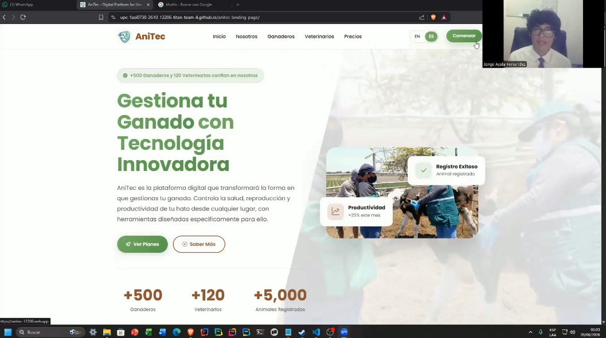
    <p><i><b>Fuente</b>: Elaboración propia. Screenshot representativo del Video About-the-Product.</i></p>
</div>

**Estructura del contenido del video:**

| Parte | Responsable | Timing en el video | Contenido explicado | Duración referencial |
| ----- | ----------- | ------------------- | ------------------- | -------------------- |
| Parte 1: Introducción, problema y landing page | Jorge | 00:00:00 - 00:05:10 | Presentación de AniTec, problema de gestión dispersa de animales, sanidad, actividades, finanzas y monitoreo. Se presentan los segmentos objetivo, el recorrido por la landing page, la propuesta de valor, beneficios, funcionalidades principales, call-to-action y modelo de negocio basado en planes. | 5:10 min |
| Parte 2: Acceso a la aplicación y dashboard ganadero | Abigail | 00:05:10 - 00:10:25 | Inicio de sesión como ganadero, redirección según rol y presentación del dashboard ganadero con resumen de animales, hatos, eventos sanitarios, próximas actividades, alertas e información relevante para la toma de decisiones. | 5:15 min |
| Parte 3: Funciones del ganadero | Josep | 00:10:25 - 00:16:20 | Gestión de hatos, registro y edición de animales, eventos sanitarios, actividades, visitas, ingresos y gastos. Se explica cómo estas funciones centralizan la información del productor ganadero. | 5:55 min |
| Parte 4: Dashboard y funciones del veterinario | Luciana | 00:16:20 - 00:22:05 | Inicio de sesión como veterinario, dashboard veterinario, clientes asignados, pacientes, alertas sanitarias, próximas actividades, gestión de clientes, revisión de animales por ganadero e historial clínico. | 5:45 min |
| Parte 5: IoT, suscripciones, testimonio y cierre | Bruno | 00:22:05 - 00:26:19 | Módulo IoT, registro y asociación de dispositivos a finca o animal, revisión de estado, tipo y métricas. También se presentan planes, plan activo, historial de pagos de prueba, testimonio de validación y cierre del valor de AniTec. | 4:14 min |

**Testimonio incluido:**

Durante el cierre del video se incluye un testimonio positivo tomado como referencia de las entrevistas de validación. El testimonio resume la percepción de utilidad del producto:

> “La aplicación me parece útil porque reúne en un solo lugar la información de animales, controles sanitarios y actividades, lo que facilitaría el seguimiento diario.”

Este testimonio refuerza que AniTec responde a una necesidad identificada en los segmentos objetivo: reducir la dispersión de información y mejorar la organización para la gestión ganadera y veterinaria.

**Resumen del valor comunicado:**

El video concluye destacando que AniTec busca mejorar la trazabilidad, organización y toma de decisiones dentro de la actividad ganadera. Para ello, conecta una landing page informativa, una aplicación web por roles y un backend real con persistencia en MySQL, permitiendo que ganaderos y veterinarios gestionen información relevante desde una sola plataforma.

<div style="page-break-before: always;"></div>

<a id="toc-conclusiones"></a>
# Conclusiones

## Conclusiones y recomendaciones

### Conclusiones

El proyecto AniTec permitio validar la necesidad de una solucion digital orientada a ganaderos y veterinarios, debido a que ambos segmentos requieren mayor orden, trazabilidad y disponibilidad de informacion sobre animales, fincas, actividades, sanidad y gastos. Las entrevistas y validaciones realizadas confirmaron que el problema identificado es real y que una plataforma web puede aportar valor si mantiene una experiencia simple, clara y cercana al contexto ganadero.

El diseño del sistema basado en Domain-Driven Design permitio organizar AniTec mediante bounded contexts como IAM, Profiles, Livestock, Sanitary, Financial, Activities, Analytics, Clients, Devices, Metrics y Subscriptions. Esta separacion favorece la mantenibilidad del sistema, facilita la asignacion de responsabilidades dentro del equipo y permite que cada modulo evolucione sin afectar innecesariamente al resto de la aplicacion.

Durante el Sprint 1 se logro establecer la presencia digital del producto mediante una landing page funcional desplegada en GitHub Pages. Este avance permitio comunicar la propuesta de valor de AniTec, presentar los beneficios principales para ganaderos y veterinarios, y generar una primera base de validacion frente a usuarios potenciales.

Durante el Sprint 2 se implemento la aplicacion web frontend con Vue, organizada por bounded contexts y conectada inicialmente a datos de prueba mediante my-json-server. Este sprint permitio construir las principales vistas funcionales de la plataforma, validar flujos de navegacion y preparar la estructura necesaria para reemplazar progresivamente los datos mock por servicios reales.

Durante el Sprint 3 se desarrollo el backend real de AniTec con ASP.NET Core, Entity Framework Core y MySQL. La API implementa autenticacion con JWT, gestion de usuarios, perfiles, hatos, animales, eventos sanitarios, actividades, registros financieros, clientes veterinarios, analiticas, dispositivos IoT, metricas, planes, suscripciones y pagos mock. Con ello, el proyecto dejo de depender solamente de datos simulados y paso a contar con una base de servicios persistentes.

La documentacion de servicios mediante Swagger/OpenAPI permitio verificar los endpoints implementados y facilitar las pruebas manuales del backend. Asimismo, las migraciones de Entity Framework Core permitieron mantener alineada la estructura de la base de datos con las entidades del dominio, reduciendo errores en la configuracion y mejorando la trazabilidad tecnica del sistema.

El despliegue del backend en Render representa un avance importante para el proyecto, ya que la API queda disponible desde internet y puede ser consumida por el frontend desplegado. Esto permite validar AniTec en un entorno mas cercano a produccion, comprobar la disponibilidad publica del servicio y preparar futuras pruebas de integracion entre frontend, backend y base de datos.

En relacion con el Student Outcome, el equipo evidencio trabajo colaborativo y liderazgo conjunto durante los tres avances. Cada integrante asumio responsabilidades claras por modulo o artefacto, participo en la planificacion de tareas, colaboro en la integracion del sistema y aporto a la documentacion del producto. Esto permitio cumplir los objetivos de cada sprint de forma progresiva y mantener coherencia entre la propuesta, el diseño, el frontend, el backend y el despliegue.

**Contraste con Lean UX y validaciones:**

| Elemento Lean UX | Planteamiento inicial | Resultado de validación | Conclusión |
| ---------------- | --------------------- | ----------------------- | ---------- |
| Problem Statement | Los pequeños y medianos ganaderos, junto con veterinarios, dependen de registros manuales, cuadernos, hojas de cálculo o herramientas poco integradas para gestionar información sanitaria, productiva y económica. | En las entrevistas de validación, los participantes confirmaron que actualmente registran información mediante medios manuales o poco centralizados. | El problema identificado se mantiene vigente y AniTec responde a una necesidad real de organización y trazabilidad. |
| Business Assumptions | Se asumió que los usuarios necesitan una plataforma web accesible para registrar información clave, generar alertas y consultar reportes útiles. | Los usuarios valoraron la centralización de animales, sanidad, actividades, finanzas, IoT y clientes veterinarios. | La propuesta de valor fue validada en términos generales, aunque se requiere reforzar reportes, alertas y campos específicos. |
| User Assumptions | Se asumió que ganaderos y veterinarios valorarían una interfaz simple, cercana y pensada para usuarios con poca experiencia tecnológica. | Los entrevistados comprendieron la navegación por roles y consideraron útiles los dashboards y módulos principales. | La interfaz resulta comprensible para una primera versión, pero debe seguir simplificándose en formularios y mensajes de error. |
| Feature Assumptions | Se propuso registro digital de animales, eventos sanitarios, finanzas, reportes, clientes veterinarios e historial clínico. | Los usuarios identificaron valor en registrar animales, eventos sanitarios, actividades, finanzas y seguimiento veterinario. | Las funcionalidades principales son pertinentes, aunque deben ampliarse campos clínicos, datos del animal y métricas para decisiones. |
| Hypothesis Statements | Se planteó que AniTec mejoraría la adopción digital, gestión sanitaria, toma de decisiones, organización de datos y colaboración veterinario-ganadero. | Las validaciones muestran aceptación inicial y percepción positiva de utilidad, especialmente por centralizar información en un solo lugar. | Las hipótesis fueron parcialmente validadas: existe interés y utilidad percibida, pero la adopción dependerá de mejorar confianza, reportes, recordatorios y facilidad de uso. |
| Criterios de éxito | Se esperaba reducir registros manuales, mejorar precisión de registros, facilitar historial sanitario y apoyar decisiones basadas en datos. | Las entrevistas no prueban aún reducción real de errores, pero sí confirman intención de uso y reconocimiento del valor de centralizar información. | Los criterios de éxito quedan como metas para una siguiente etapa con uso real de la aplicación desplegada y medición continua. |

### Recomendaciones

**Corto plazo:** Se recomienda continuar con la integracion completa entre el frontend desplegado en GitHub Pages y el backend desplegado en Render, asegurando que las variables de entorno del frontend apunten a la API real y que los flujos principales funcionen sin depender de my-json-server.

**Corto plazo:** Se recomienda fortalecer la autenticacion y autorizacion del sistema, definiendo permisos por rol para ganaderos, veterinarios y administradores. Esto permitiria proteger los endpoints sensibles y asegurar que cada usuario solo acceda a la informacion correspondiente a su perfil.

**Mediano plazo:** Se recomienda continuar la validacion con ganaderos y veterinarios usando la aplicacion desplegada, no solo prototipos. Esto permitira identificar problemas reales de uso, comprension del lenguaje, dificultad en formularios, utilidad de dashboards y necesidades adicionales en los modulos de sanidad, actividades, finanzas e IoT.

**Mediano plazo:** Se recomienda mejorar la experiencia de usuario del frontend en una siguiente iteracion, priorizando claridad en dashboards, simplificacion de formularios, estados visuales para dispositivos IoT y mejor organizacion del flujo veterinario por clientes asignados.

**Mediano plazo:** Se recomienda completar y fortalecer las pruebas del backend, incluyendo pruebas de endpoints, validacion de reglas de negocio, manejo de errores y pruebas de integracion con la base de datos. Esto ayudara a asegurar mayor estabilidad antes de seguir ampliando funcionalidades.

**Futuro roadmap:** Se recomienda mantener actualizada la documentacion tecnica, incluyendo endpoints, migraciones, evidencias de despliegue, diagramas C4 y decisiones de arquitectura. A medida que AniTec crezca, esta documentacion sera clave para sostener la colaboracion del equipo y facilitar futuras mejoras del producto.

---

## Video About The Team

El video About The Team presenta la participación de los integrantes del equipo Titan Team 4 durante el desarrollo de AniTec, destacando las actividades realizadas, los logros alcanzados en el curso y el desarrollo de competencias asociadas al trabajo colaborativo, liderazgo conjunto, planificación de tareas y cumplimiento de objetivos.

**Datos del video:**

| Elemento | Información |
| -------- | ----------- |
| Título | Video About The Team - AniTec |
| Duración | 8:02 minutos |
| Público objetivo | Docente del curso, visitantes del landing page e interesados en conocer el proceso de trabajo del equipo |
| URL publicado en Microsoft Stream | https://upcedupe-my.sharepoint.com/:v:/g/personal/u202315165_upc_edu_pe/IQAyofYgaVNZSKGbK9yprnnhAfTvMhJAbfJQ2HpwhuOl0FA?nav=eyJyZWZlcnJhbEluZm8iOnsicmVmZXJyYWxBcHAiOiJTdHJlYW1XZWJBcHAiLCJyZWZlcnJhbFZpZXciOiJTaGFyZURpYWxvZy1MaW5rIiwicmVmZXJyYWxBcHBQbGF0Zm9ybSI6IldlYiIsInJlZmVycmFsTW9kZSI6InZpZXcifX0%3D&e=8Ff9cQ |
| URL publicado en YouTube | https://www.youtube.com/watch?v=Ai-0rShYlvI |
| Uso en landing page | El video de YouTube se utiliza como evidencia pública del proceso de trabajo del equipo. |

**URL del video publicado en Microsoft Stream:**

https://upcedupe-my.sharepoint.com/:v:/g/personal/u202315165_upc_edu_pe/IQAyofYgaVNZSKGbK9yprnnhAfTvMhJAbfJQ2HpwhuOl0FA?nav=eyJyZWZlcnJhbEluZm8iOnsicmVmZXJyYWxBcHAiOiJTdHJlYW1XZWJBcHAiLCJyZWZlcnJhbFZpZXciOiJTaGFyZURpYWxvZy1MaW5rIiwicmVmZXJyYWxBcHBQbGF0Zm9ybSI6IldlYiIsInJlZmVycmFsTW9kZSI6InZpZXcifX0%3D&e=8Ff9cQ

**URL del video publicado en YouTube:**

https://www.youtube.com/watch?v=Ai-0rShYlvI

<div align="center">
    
    <p><i><b>Fuente</b>: Elaboración propia.</i></p>
</div>

**Pauta de secuencias del video:**

| Sección | Timing de inicio | Contenido |
| ------- | ---------------- | --------- |
| Introducción del equipo y presentación de AniTec | 00:00:00 | Presentación general de Titan Team 4, propósito del producto y contexto del trabajo final. |
| Organización del trabajo y roles del equipo | 00:01:00 | Explicación de la distribución de responsabilidades, planificación de sprints y colaboración en repositorios. |
| Desarrollo de landing page y aplicación web | 00:02:30 | Resumen del trabajo realizado en diseño, frontend, navegación por roles y validaciones visuales. |
| Desarrollo del backend y servicios | 00:04:30 | Explicación de la implementación del backend, base de datos, endpoints, Swagger y despliegue. |
| Testimonios de integrantes y Student Outcome | 00:06:30 | Participación de los integrantes comentando aprendizajes, trabajo colaborativo, liderazgo y competencias desarrolladas. |
| Cierre del proceso de trabajo | 00:07:20 | Resumen de logros, dificultades superadas y valor del proyecto AniTec. |

El contenido del video complementa la sección Student Outcome porque muestra la participación de los integrantes, la coordinación del equipo y las competencias desarrolladas durante la construcción de la landing page, la aplicación web, el backend y la documentación del proyecto.

<div style="page-break-before: always;"></div>

<a id="toc-bibliografia"></a>
# Bibliografía

Bourgau, P. (2022, marzo 29). _Step by step guide to run your big picture event storming_. Philippe Bourgau's Blog. https://bit.ly/bpes-guide

Evans, E. (2003). _Domain-Driven Design: Tackling Complexity in the Heart of Software_. Addison-Wesley Professional.

Food and Agriculture Organization of the United Nations. (2022). _Digital agriculture: Technologies transforming agriculture and food systems_. https://www.fao.org/digital-agriculture/en/

Food and Agriculture Organization of the United Nations. (2023). _Livestock and the environment_. https://www.fao.org/livestock-environment/en/

Chandrasekaran, P. (2023, marzo 20). _Remote EventStorming in practice_. Domain-driven Design: A Practitioner's Guide. https://ddd-practitioners.com/2023/03/20/remote-eventstorming-workshop/

Cohn, M. (2006). _User stories applied: For agile software development_. Addison-Wesley Professional.

Gothelf, J., & Seiden, J. (2021). _Lean UX: Designing great products with agile teams_ (3rd ed.). O'Reilly Media.

Microsoft. (2026). _ASP.NET Core documentation_. https://learn.microsoft.com/aspnet/core/

Microsoft. (2026). _Entity Framework Core documentation_. https://learn.microsoft.com/ef/core/

MySQL. (2026). _MySQL 8.0 reference manual_. https://dev.mysql.com/doc/refman/8.0/en/

OpenAPI Initiative. (2026). _OpenAPI specification_. https://spec.openapis.org/oas/latest.html

Pressman, R. S. (2010). _Ingeniería de software: Un enfoque práctico_ (7a ed.). McGraw-Hill.

Scrum.org. (2020). _The Scrum Guide_. https://scrumguides.org/scrum-guide.html

Structurizr. (2026). _Structurizr documentation_. https://docs.structurizr.com/

Vue.js. (2026). _Vue.js documentation_. https://vuejs.org/guide/

<div style="page-break-before: always;"></div>

<a id="toc-anexos"></a>
# Anexos

<div style="page-break-before: always;"></div>

## Anexo A. Videos de exposiciones

- Exposición Avance 1: https://upcedupe-my.sharepoint.com/:v:/g/personal/u202215979_upc_edu_pe/IQDN94I7tP4zR5oi4SQ2DX8eAVkHQVl6iFgvfYON_Pk_MJ4?nav=eyJyZWZlcnJhbEluZm8iOnsicmVmZXJyYWxBcHAiOiJPbmVEcml2ZUZvckJ1c2luZXNzIiwicmVmZXJyYWxBcHBQbGF0Zm9ybSI6IldlYiIsInJlZmVycmFsTW9kZSI6InZpZXciLCJyZWZlcnJhbFZpZXciOiJNeUZpbGVzTGlua0NvcHkifX0&e=3TsNmD
- Exposición TB1: https://upcedupe-my.sharepoint.com/:v:/g/personal/u202315165_upc_edu_pe/IQD3zV-JF-mvQpL-RG1INwKMAZgIgvPHQQOJrwQ3ZDJCtBk?nav=eyJyZWZlcnJhbEluZm8iOnsicmVmZXJyYWxBcHAiOiJTdHJlYW1XZWJBcHAiLCJyZWZlcnJhbFZpZXciOiJTaGFyZURpYWxvZy1MaW5rIiwicmVmZXJyYWxBcHBQbGF0Zm9ybSI6IldlYiIsInJlZmVycmFsTW9kZSI6InZpZXcifX0%3D&e=tuVcO1
- Exposición AV2: https://upcedupe-my.sharepoint.com/:v:/g/personal/u202315165_upc_edu_pe/IQBNbZRIWFzfSZQT4mSa7cCyAa-felpel01CsMzjW-O3eFg?nav=eyJyZWZlcnJhbEluZm8iOnsicmVmZXJyYWxBcHAiOiJTdHJlYW1XZWJBcHAiLCJyZWZlcnJhbFZpZXciOiJTaGFyZURpYWxBcHBQbGF0Zm9ybSI6IldlYiIsInJlZmVycmFsTW9kZSI6InZpZXcifX0%3D&e=BKHhcW

<div style="page-break-before: always;"></div>

## Anexo B. Videos de entrevistas

- Entrevista 1 - Vicente Alacutte, ganadero: https://upcedupe-my.sharepoint.com/:v:/g/personal/u202117762_upc_edu_pe/IQAU-FMwcUpMQqNyx-1l6AsjAW9l1-P7CpTEPJHtZx_3L2M
- Entrevista 2 - Rebeca Reyes, ganadera: https://upcedupe-my.sharepoint.com/:v:/g/personal/u202315165_upc_edu_pe/IQC_8-haUlvvTKtz13hlN8A0AViAvdEwyAyAZIs0wpCnLeY?e=b3mVxM&nav=eyJyZWZlcnJhbEluZm8iOnsicmVmZXJyYWxBcHAiOiJTdHJlYW1XZWJBcHAiLCJyZWZlcnJhbFZpZXciOiJTaGFyZURpYWxvZy1MaW5rIiwicmVmZXJyYWxBcHBQbGF0Zm9ybSI6IldlYiIsInJlZmVycmFsTW9kZSI6InZpZXcifX0%3D
- Entrevista 3 - Porfirio Sandoval, ganadero: https://upcedupe-my.sharepoint.com/:v:/g/personal/u20241c030_upc_edu_pe/IQBGB9K9t4xxSLIv1YP6eBZMAeSNzMREmpWxJjIX0MPuCR4?nav=eyJyZWZlcnJhbEluZm8iOnsicmVmZXJyYWxBcHAiOiJPbmVEcml2ZUZvckJ1c2luZXNzIiwicmVmZXJyYWxBcHBQbGF0Zm9ybSI6IldlYiIsInJlZmVycmFsTW9kZSI6InZpZXciLCJyZWZlcnJhbFZpZXciOiJNeUZpbGVzTGlua0NvcHkifX0&e=S6qUbg
- Entrevista 4 - Angela Moran, ganadera: https://upcedupe-my.sharepoint.com/:v:/g/personal/u202215979_upc_edu_pe/IQDfgaIlKdrsRYAp9VQvfR_MAWflO45zpjWnZwgtAt9KBow?e=pHnnWx
- Entrevista 5 - Aldahir Sillo, ganadero: https://upcedupe-my.sharepoint.com/:v:/g/personal/u202318001_upc_edu_pe/IQDOnRpzZINmRpVNnHMoBaTkAX_PDnT76W11xtMZH3wIXTk?e=KdBhPi

<div style="page-break-before: always;"></div>

## Anexo C. Videos de entrevistas de validación

- Entrevista 1 - Rodrigo Alfaro: https://upcedupe-my.sharepoint.com/:v:/g/personal/u202315165_upc_edu_pe/IQB3jgi-SsJVRaDxAD4WBuuzAdv4R--qmXO3IsM5X73FAj0?nav=eyJyZWZlcnJhbEluZm8iOnsicmVmZXJyYWxBcHAiOiJTdHJlYW1XZWJBcHAiLCJyZWZlcnJhbFZpZXciOiJTaGFyZURpYWxvZy1MaW5rIiwicmVmZXJyYWxBcHBQbGF0Zm9ybSI6IldlYiIsInJlZmVycmFsTW9kZSI6InZpZXcifX0%3D&e=Og6bCI
- Entrevista 2 - Kiara Gallardo: https://upcedupe-my.sharepoint.com/:v:/g/personal/u202215979_upc_edu_pe/IQDXvgr4zSyQRbJPZ_MKamHQAWNiwEL0lA77pqyKGoapDp4?e=Kxl4eD
- Entrevista 3 - Vicente: https://upcedupe-my.sharepoint.com/:v:/g/personal/u202117762_upc_edu_pe/IQAcuZYMhm2TSbQHRmvx5kZPAd4rO0W-0WAR1zuU1uec-B8?e=72Oeb0
- Entrevista 4 - Andrea Solis: https://upcedupe-my.sharepoint.com/:v:/g/personal/u202318001_upc_edu_pe/IQCjt9DrP5xjSIvKAQVIBCDDASY5mLJCHcIyhAF5pOw79MQ?e=Xa0RZ7&nav=eyJyZWZlcnJhbEluZm8iOnsicmVmZXJyYWxBcHAiOiJTdHJlYW1XZWJBcHAiLCJyZWZlcnJhbFZpZXciOiJTaGFyZURpYWxBcHBQbGF0Zm9ybSI6IldlYiIsInJlZmVycmFsTW9kZSI6InZpZXcifX0%3D
- Entrevista 5 - Hugo Jorge: https://upcedupe-my.sharepoint.com/:v:/g/personal/u20241c030_upc_edu_pe/IQBk6WHPWWegRLsPsIbW_2NCAalBgUYGvvdIoqI2kTZtxOk?nav=eyJyZWZlcnJhbEluZm8iOnsicmVmZXJyYWxBcHAiOiJPbmVEcml2ZUZvckJ1c2luZXNzIiwicmVmZXJyYWxBcHBQbGF0Zm9ybSI6IldlYiIsInJlZmVycmFsTW9kZSI6InZpZXciLCJyZWZlcnJhbFZpZXciOiJNeUZpbGVzTGlua0NvcHkifX0&e=iZTorN

<div style="page-break-before: always;"></div>

## Anexo D. Materiales de ideación y diseño

- Lean UX Canvas del proyecto AniTec: https://app.mural.co/t/abbys5223/m/abbys5223/1776842322847/c87d07f08ed60b5b4bd30ba955608fa8ce7d468a?sender=u5608641741a75560d5d68781
- Big Picture EventStorming y Design-Level EventStorming: https://miro.com/welcomeonboard/T1gvUmlKRzZiWjFQV0VFK1VsL1VDbFN1WElQbzV3WjVVd2NYR1d3NVRSdVFOUFd4ZVlIbk4rSmxBN1J3UUtjQjg3cHlKK2VKZ3cwVXB5ZXJoK0MyNmxud0lrejllQVpDT1AzczYyS0t6YWtZTk9xSS9JK05WR2x1cVZvYldTbzRnbHpza3F6REdEcmNpNEFOMmJXWXBBPT0hdjE=?share_link_id=376749116517
- Big Picture EventStorming, enlace alternativo usado en el capítulo 2: https://miro.com/welcomeonboard/T1gvUmlKRzZiWjFQV0VFK1VsL1VDbFN1WE1QbzV3WjVVd2NYR1d3NVRSdVFOUFd4ZVlIbk4rSmxBN1J3UUtjQjg3cHlKK2VKZ3cwVXB5ZXJoK0MyNmxud01rejllQVpDT1AzczYyS0t6YWtZTk9xSS9JKO5WR2x1cVZvYldTbzRnbHpza3F6REdEcmNpNEF0MmJXWXBBPT0hdjE=?share_link_id=376749116517
- Wireframe de la landing page: https://www.figma.com/design/WbTy5Gd0VpFbXolfe3OQ0C/ExamenIHCJorgeAyala?node-id=5-678&t=Erdbu1dwId9dtDbq-1
- Mock-up de la landing page: https://www.figma.com/design/WbTy5Gd0VpFbXolfe3OQ0C/ExamenIHCJorgeAyala?node-id=0-1&t=Erdbu1dwId9dtDbq-1
- Wireframes de la aplicación web: https://www.figma.com/design/9RliVy9r8aEzyfyEof3DGr/Untitled?node-id=0-1&t=q2mM6e2YoQyJLZaK-1
- Wireflows de la aplicación web: https://www.figma.com/design/9RliVy9r8aEzyfyEof3DGr/Untitled?node-id=44-1275&t=fdPLEZQXM0PqMAv3-1
- Mock-ups de la aplicación web: https://www.figma.com/design/9RliVy9r8aEzyfyEof3DGr/Untitled?node-id=42-837&t=fdPLEZQXM0PqMAv3-1
- Prototipo de la aplicación web: https://1drv.ms/v/c/fa8e2d4d5f95cf55/IQCahhrF7amZTIeIIL2qif1SAZwhS2QghQaWCuODMLn1hes?e=sXJwXw
- Diagrama de clases del sistema: https://lucid.app/lucidchart/2cf9b98f-737c-43ac-9833-a2e6a387c4af/edit?viewport_loc=-5835%2C-1184%2C9341%2C3780%2C0_0&invitationId=inv_26c88d5c-929c-4141-bbb1-e3a73b17aa13

<div style="page-break-before: always;"></div>

## Anexo E. Repositorios y despliegues

- Repositorio del informe del proyecto: https://github.com/upc-1asi0730-2610-12206-titan-team-4/anitec-report
- Repositorio de la landing page: https://github.com/upc-1asi0730-2610-12206-titan-team-4/anitec-landing-page
- Repositorio del frontend web: https://github.com/upc-1asi0730-2610-12206-titan-team-4/anitec-frontend
- Repositorio del backend web: https://github.com/upc-1asi0730-2610-12206-titan-team-4/anitec-backend
- Repositorio de datos de prueba: https://github.com/upc-1asi0730-2610-12206-titan-team-4/anitec-jsonserver
- Despliegue de la landing page: https://upc-1asi0730-2610-12206-titan-team-4.github.io/anitec-landing-page/
- Despliegue del frontend web: https://upc-1asi0730-2610-12206-titan-team-4.github.io/anitec-frontend/iam/sign-in
- Despliegue del backend web: https://anitec-backend.onrender.com/swagger/index.html
- API mock del frontend: https://my-json-server.typicode.com/upc-1asi0730-2610-12206-titan-team-4/anitec-jsonserver
- Tablero del Sprint Backlog 1: https://trello.com/invite/b/6a06e9662903eb17cb2c9d0b/ATTI6d55852ea11badb2245aa4b7cf40d70dCFCD8EFC/sprint-backlog-1
- Tablero del Sprint Backlog 2: https://trello.com/invite/b/6a06efb192d6c5dc5bae0657/ATTIdd80e2d6d8ef041aa25bc7e7f76a46bf605EEC03/sprint-backlog-2
- Tablero del Sprint Backlog 3: https://trello.com/invite/b/6a35c1fc2aa4cb4656e49c3b/ATTIe8f4417969b123401b08cdf15fc123be01FAB4B6/sprint3-anitec

<div style="page-break-before: always;"></div>

## Anexo F. Herramientas utilizadas

- Trello, para gestión del backlog y tareas del proyecto: https://trello.com
- Gherkin, para criterios de aceptación en formato Given-When-Then: https://cucumber.io/docs/gherkin/
- Miro, para dinámicas de EventStorming: https://miro.com/
- Figma, para wireframes, mock-ups y prototipos: https://www.figma.com
- Canva, para recursos visuales del producto: https://www.canva.com
- UXPressia, para User Personas y Customer Journey Maps: https://uxpressia.com
- Lucidchart, para diagramas del sistema: https://www.lucidchart.com/ / https://lucidchart.com
- GitHub, para control de versiones y colaboración: https://github.com
- Visual Studio Code, para edición de código y archivos Markdown: https://code.visualstudio.com/
- WebStorm, para desarrollo del frontend: https://www.jetbrains.com/webstorm/
- Rider, para desarrollo del backend ASP.NET Core: https://www.jetbrains.com/rider/
- GitHub Pages, para despliegue de la landing page y frontend web: https://pages.github.com
- Render, para despliegue del backend web: https://render.com/
- My JSON Server, para datos de prueba: https://my-json-server.typicode.com/
- Structurizr, para diagramas C4: https://structurizr.com
- Vertabelo, para diagramas de base de datos: https://vertabelo.com

<div style="page-break-before: always;"></div>

## Anexo G. Referencias bibliográficas con enlace

- Guía para ejecutar Big Picture Event Storming: https://bit.ly/bpes-guide
- Guía práctica de EventStorming remoto: https://ddd-practitioners.com/2023/03/20/remote-eventstorming-workshop/
- Material sobre historias de usuario: https://www.scrummanager.com/files/scrum_manager_historias_usuario.pdf
- Libro de ingeniería de software usado como referencia: https://www.javier8a.com/itc/bd1/ld-Ingenieria.de.software.enfoque.practico.7ed.Pressman.PDF

<div style="page-break-before: always;"></div>

## Anexo H. Videos de cierre

- Video About The Team: https://www.youtube.com/watch?v=Ai-0rShYlvI
- Video About The Product: https://www.youtube.com/watch?v=U_xCv93ybkI

<div style="page-break-before: always;"></div>

</div>
